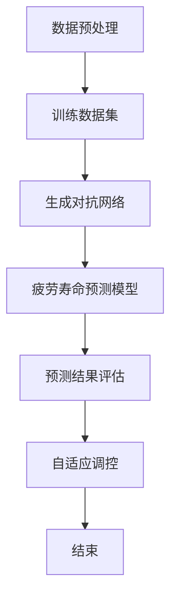
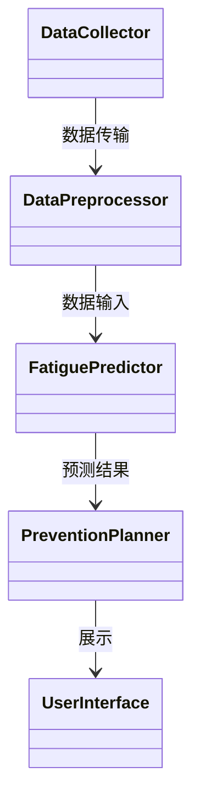
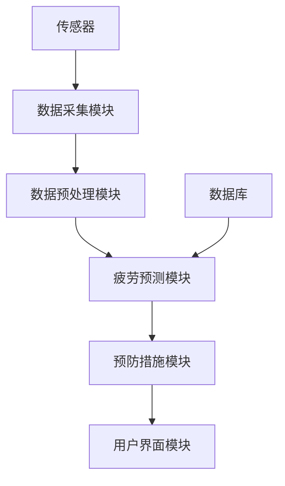
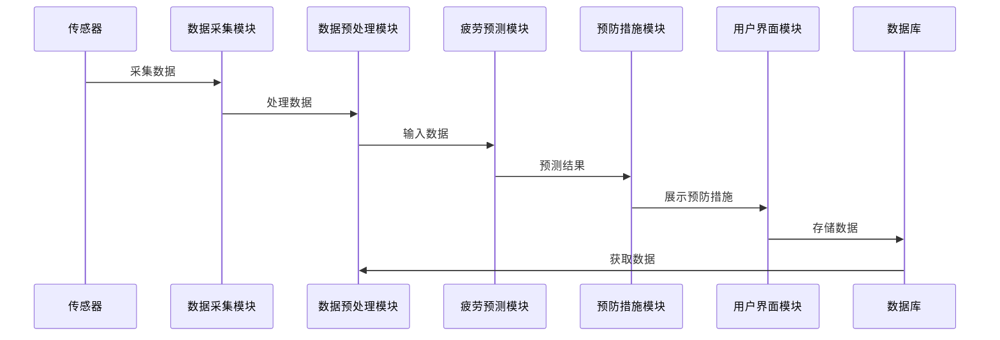

                 

### 引言

#### 关键词：AIGC、智能材料、疲劳预测、关键基础设施、寿命延长

##### 摘要：
本文深入探讨了AIGC（人工智能生成内容）在智能材料疲劳预测与预防中的应用，旨在延长关键基础设施的寿命。通过详细分析AIGC的工作原理、智能材料特性以及疲劳预测的方法，本文展示了如何利用AIGC技术提升材料疲劳预测的准确性和预防效果，从而确保关键基础设施的长期稳定运行。

随着人工智能技术的不断发展，AIGC作为一种新兴的技术，正逐渐改变着各个领域的应用模式。智能材料疲劳预测与预防是其中重要的一个应用方向，它对于延长关键基础设施的使用寿命、保障公共安全和经济效益具有重要意义。本文将围绕这一主题，逐步分析AIGC在此领域的应用前景、核心概念及其实现方法。

首先，在引言部分，我们将简要介绍AIGC的概念及其重要性，概述智能材料疲劳预测与预防的背景和关键问题，并明确本书的研究目标和结构。接下来，我们将深入探讨AIGC的背景介绍，包括其发展历程、工作原理以及优势。在此基础上，我们将详细讨论智能材料的特点及其在疲劳预测中的关键作用。

随后，本文将逐步介绍AIGC在智能材料疲劳预测与预防中的应用，包括算法原理的讲解、数学模型和公式的推导以及具体案例的分析。此外，我们还将展示一个具体的案例项目，详细描述其系统分析与架构设计方案，并通过实战部分介绍项目的实现过程和效果分析。

最后，本文将总结最佳实践经验，提出注意事项，并提供拓展阅读建议，以期为读者提供全面的指导和启示。

### 第1章 背景介绍

#### 1.1 AIGC概述

##### 1.1.1 AIGC的概念与重要性

AIGC，即人工智能生成内容，是近年来人工智能领域的一个新兴研究方向。AIGC利用机器学习模型，尤其是深度学习技术，自动生成文本、图像、音频等多种形式的内容。与传统的手动生成内容相比，AIGC具有高效、灵活、多样等优势，在许多领域展现出广阔的应用前景。

AIGC的重要性主要体现在以下几个方面：

1. **内容生成效率**：AIGC可以自动化生成大量高质量的内容，显著提高内容创作效率。这对于媒体、广告、教育等领域尤为重要。

2. **个性化体验**：AIGC可以根据用户的需求和偏好，自动生成个性化的内容，提供更加精准的服务。例如，在电商领域，AIGC可以生成定制化的产品推荐内容，提高用户的购买体验。

3. **创新应用**：AIGC在创意设计、虚拟现实、游戏开发等领域也展现出巨大的潜力。通过生成独特的内容，可以推动相关产业的创新发展。

##### 1.1.2 AIGC的发展历程

AIGC的发展可以追溯到20世纪80年代，当时研究人员开始探索如何利用计算机生成文本和图像。随着计算能力的提升和人工智能技术的进步，AIGC逐渐从理论走向实践，并在多个领域取得突破。

- **20世纪80年代**：最初的AIGC研究主要集中在文本生成，如自动写作、机器翻译等。代表性的工作是肯尼思·科勒和斯蒂芬·罗素提出的统计机器翻译模型。

- **21世纪初**：随着深度学习技术的发展，图像生成和文本生成技术取得显著进展。代表性的工作是雅达利公司的“人工神经网络”项目和谷歌的“生成对抗网络”（GAN）。

- **近年**：AIGC技术不断成熟，应用范围进一步扩大。例如，OpenAI的GPT-3模型展示了在文本生成方面的强大能力，谷歌的Text-to-Image模型实现了高质量的图像生成。

##### 1.1.3 AIGC在材料疲劳预测中的应用前景

在材料疲劳预测领域，AIGC具有显著的应用潜力。材料疲劳是指材料在反复载荷作用下，由于微观损伤积累而导致断裂或失效的过程。传统的疲劳预测方法主要依赖于经验和实验数据，存在预测精度低、响应速度慢等问题。而AIGC可以通过学习大量的实验数据和工况信息，自动生成疲劳预测模型，提高预测的准确性和效率。

AIGC在材料疲劳预测中的应用前景主要体现在以下几个方面：

1. **提高预测精度**：AIGC可以自动学习复杂的疲劳损伤机制，生成更准确的预测模型。与传统方法相比，AIGC可以处理更多维度的数据，捕捉到更多的细节信息。

2. **降低预测成本**：AIGC可以自动化生成预测模型，减少人工干预，降低预测成本。同时，AIGC可以快速适应新的数据和工况，提高预测的响应速度。

3. **应用范围广泛**：AIGC不仅可以应用于金属材料，还可以推广到其他类型的材料，如复合材料、陶瓷材料等。这使得AIGC在航空航天、汽车制造、建筑工程等关键领域具有广泛的应用前景。

总之，AIGC在材料疲劳预测与预防中的应用具有巨大的潜力。随着AIGC技术的不断进步，未来将有望实现更加精准、高效、智能的材料疲劳预测，为关键基础设施的寿命延长提供有力支持。

#### 1.2 智能材料疲劳预测与预防

##### 1.2.1 关键基础设施寿命问题

关键基础设施，如桥梁、隧道、机场、水电站等，是支撑社会经济发展的重要支柱。然而，随着使用年限的增加和外部环境的影响，这些基础设施的寿命问题日益突出。材料疲劳是导致关键基础设施失效的主要原因之一。材料疲劳是指材料在反复载荷作用下，由于微观损伤的累积而导致性能下降直至失效的过程。疲劳失效具有潜伏性、随机性和不可预见性，给基础设施的安全运行带来严重隐患。

材料疲劳问题主要体现在以下几个方面：

1. **疲劳损伤积累**：在长期的反复载荷作用下，材料内部会产生微小的损伤，这些损伤会逐步积累并扩展，最终导致材料断裂或失效。

2. **寿命不确定性**：由于材料疲劳过程的复杂性，传统的方法难以准确预测基础设施的使用寿命，导致基础设施的维护和更换存在不确定性。

3. **安全风险**：材料疲劳可能导致关键基础设施的结构完整性受损，甚至引发安全事故，对社会经济造成严重影响。

##### 1.2.2 材料疲劳预测方法

材料疲劳预测是指通过分析材料在载荷作用下的响应，预测材料疲劳寿命的方法。传统的材料疲劳预测方法主要包括实验法、经验法和数值模拟法。随着人工智能技术的发展，AIGC为材料疲劳预测提供了一种全新的方法。

1. **实验法**：实验法是材料疲劳预测的基础。通过在实验台上模拟实际工况，对材料进行疲劳测试，获取疲劳寿命数据。实验法的优点是数据真实可靠，但缺点是成本高、时间长、难以覆盖所有工况。

2. **经验法**：经验法是通过积累大量实验数据和工程经验，总结出材料疲劳寿命的规律，用于预测。经验法的优点是简单实用，但准确性有限，难以应对复杂工况。

3. **数值模拟法**：数值模拟法是通过建立材料疲劳的数学模型，利用计算机进行模拟计算，预测材料的疲劳寿命。数值模拟法的优点是速度快、成本低，但依赖于模型的准确性，且计算复杂度高。

4. **AIGC方法**：AIGC方法利用机器学习技术，从大量的实验数据中自动学习疲劳寿命规律，生成预测模型。AIGC方法的优点是能够处理大规模复杂数据，预测精度高，适应性强。但AIGC方法也存在对数据质量要求高、模型解释性差等挑战。

##### 1.2.3 预防措施及其重要性

预防材料疲劳的关键在于减少疲劳损伤的产生和扩展。以下是一些常见的预防措施：

1. **优化设计**：通过优化材料选择、结构设计和工作条件，减少疲劳损伤的产生。例如，使用高疲劳强度材料、优化应力集中区域等。

2. **维护保养**：定期对基础设施进行维护保养，及时修复损伤，防止疲劳扩展。例如，定期检查桥梁的焊缝、涂覆防腐层等。

3. **监测预警**：通过安装监测设备，实时监测材料的疲劳状态，及时发现和处理疲劳损伤。例如，使用光纤光栅传感器监测桥梁的应力应变状态。

预防措施的重要性主要体现在以下几个方面：

1. **延长使用寿命**：有效的预防措施可以显著延长关键基础设施的使用寿命，降低更换和维护成本。

2. **保障安全**：预防措施能够及时发现和处理疲劳损伤，降低安全事故的发生概率，保障基础设施的安全运行。

3. **提高经济效益**：通过延长使用寿命和减少维护成本，预防措施能够提高基础设施的经济效益，为社会经济发展提供有力支持。

综上所述，智能材料疲劳预测与预防对于关键基础设施的寿命延长具有重要意义。通过AIGC技术的引入，可以实现更精准、高效的疲劳预测，为预防措施提供科学依据，从而保障关键基础设施的长期稳定运行。

#### 1.3 问题定义

##### 1.3.1 智能材料疲劳预测与预防的概念

智能材料疲劳预测与预防是指利用先进的计算技术和智能材料，对关键基础设施中的材料疲劳过程进行预测和预防，以延长基础设施的使用寿命和保障其安全运行。智能材料疲劳预测与预防的核心概念包括以下几个部分：

1. **智能材料**：智能材料是指具有感知、响应和自适应能力的材料，能够对外界环境变化做出智能反应。智能材料通常具备自诊断、自修复、自适应等特性，能够在疲劳过程中实时监测材料状态，预测疲劳寿命。

2. **疲劳预测**：疲劳预测是指通过分析材料在载荷作用下的响应，预测材料疲劳寿命的过程。疲劳预测的目标是提前发现潜在的疲劳损伤，评估材料的使用寿命，为预防措施提供依据。

3. **预防措施**：预防措施是指为了减少疲劳损伤的产生和扩展，采取的一系列技术和管理措施。预防措施包括优化设计、维护保养、监测预警等，旨在延长基础设施的使用寿命和保障其安全运行。

##### 1.3.2 AIGC在解决该问题中的应用

AIGC（人工智能生成内容）在智能材料疲劳预测与预防中的应用主要体现在以下几个方面：

1. **数据驱动的疲劳预测模型**：AIGC技术可以利用大量的实验数据和工况信息，通过机器学习算法生成疲劳预测模型。这些模型能够自动学习复杂的疲劳损伤机制，提高预测的准确性和效率。

2. **自适应监测系统**：AIGC技术可以用于开发自适应监测系统，实现对智能材料状态的实时监控。通过分析材料在载荷作用下的响应数据，系统可以自动调整监测策略，提高监测精度和可靠性。

3. **个性化预防策略**：AIGC技术可以根据具体工况和材料特性，自动生成个性化的预防策略。这些策略能够针对不同材料和工况，提供最优的预防方案，提高预防效果。

4. **知识图谱构建**：AIGC技术可以构建知识图谱，整合多源数据，提供关于材料疲劳的全面知识。这有助于研究人员和工程师更好地理解疲劳机制，指导预防措施的实施。

##### 1.3.3 边界与外延

在研究智能材料疲劳预测与预防时，需要明确边界与外延，以界定研究范围和限制：

1. **研究范围**：本文主要研究AIGC在智能材料疲劳预测与预防中的应用，重点关注材料疲劳预测模型的生成、自适应监测系统的开发以及个性化预防策略的制定。

2. **研究限制**：本文的研究主要基于现有的数据和算法，未涵盖所有可能的工况和材料。此外，AIGC技术在实际应用中可能面临数据质量、模型解释性等挑战。

3. **外延拓展**：未来的研究可以拓展到更广泛的材料和工况，开发更高效的AIGC算法，提高预测和预防的准确性。同时，可以结合物联网技术，实现更智能、更高效的疲劳监测和预防系统。

通过明确智能材料疲劳预测与预防的概念、AIGC在该问题中的应用以及研究的边界与外延，本文为后续章节的详细讨论奠定了基础。

#### 1.4 概念结构与核心要素组成

在本节中，我们将详细阐述AIGC、智能材料、疲劳预测与预防等核心概念，并分析它们之间的相互关系。

##### 1.4.1 AIGC

AIGC（人工智能生成内容）是一种利用人工智能技术生成内容的方法。AIGC的核心在于其能够自动从大量数据中学习，并生成新的、有用的内容。AIGC的构成要素主要包括：

1. **数据集**：AIGC算法依赖大量的训练数据集，这些数据集可以是文本、图像、音频等多种形式。
2. **算法**：AIGC使用深度学习、生成对抗网络（GAN）等先进算法，从数据中学习并生成新的内容。
3. **生成模型**：生成模型是AIGC的核心组件，负责将输入数据转换为新的、有用的内容。

AIGC的优势在于其能够生成多样化、个性化内容，提高内容创作效率，并在各个领域（如媒体、广告、教育等）展现出广泛应用潜力。

##### 1.4.2 智能材料

智能材料是指具有感知、响应和自适应能力的材料，能够对外界环境变化做出智能反应。智能材料的核心特性包括：

1. **感知能力**：智能材料能够感知外部环境的物理或化学变化，如应力、温度、湿度等。
2. **响应能力**：智能材料能够在感知到外部变化时，通过内部结构的调整或化学反应，做出相应的响应。
3. **自适应能力**：智能材料能够根据环境变化，自动调整自身性能，以适应不同的应用场景。

智能材料的分类主要包括：

- **形状记忆合金**：能够在外力作用下发生变形，并在外力去除后恢复原状的合金。
- **电致变色材料**：在外加电场的作用下，能够改变其光学性质的智能材料。
- **电化学传感器材料**：能够通过电化学反应感知化学物质浓度变化的材料。

智能材料在关键基础设施中的应用，能够提供实时监测和自适应调节，从而提高基础设施的安全性和寿命。

##### 1.4.3 疲劳预测与预防

疲劳预测与预防是指通过分析材料在载荷作用下的响应，预测材料的疲劳寿命，并采取相应措施减少疲劳损伤。疲劳预测与预防的核心要素包括：

1. **疲劳寿命预测模型**：通过分析历史数据和实验结果，建立能够预测材料疲劳寿命的数学模型。
2. **监测系统**：利用传感器技术，实时监测材料的应力、应变等参数，评估材料的疲劳状态。
3. **预防措施**：根据疲劳预测和监测结果，采取相应的预防措施，如调整设计、维护保养等，以减少疲劳损伤。

疲劳预测与预防的关键技术包括：

- **数据驱动的预测方法**：利用机器学习算法，从大量历史数据和实验结果中学习，建立疲劳寿命预测模型。
- **传感器监测技术**：利用传感器技术，实时监测材料的疲劳状态，提供实时数据支持。
- **自适应调节技术**：根据监测结果，自动调整材料或结构的工作状态，减少疲劳损伤。

##### 1.4.4 各核心概念之间的相互关系

AIGC、智能材料和疲劳预测与预防之间存在紧密的相互关系：

1. **AIGC与智能材料**：AIGC技术可以用于生成智能材料的设计方案，提高材料设计的智能化和效率。同时，智能材料可以提供AIGC所需的感知和响应数据，为AIGC算法提供丰富的训练数据。
2. **AIGC与疲劳预测**：AIGC技术可以用于生成疲劳寿命预测模型，提高预测的准确性和效率。通过利用智能材料的感知能力，AIGC能够获取实时数据，优化疲劳预测模型。
3. **智能材料与疲劳预测**：智能材料能够实时监测材料的疲劳状态，提供准确的数据支持，有助于疲劳预测和预防。AIGC技术可以进一步分析这些数据，提供更精准的预测和预防方案。

通过上述分析，我们可以看到AIGC、智能材料和疲劳预测与预防之间的相互关系，以及它们在关键基础设施寿命延长中的重要作用。接下来，我们将进一步探讨AIGC在智能材料疲劳预测与预防中的应用，详细分析其工作原理、算法原理以及数学模型。

#### 第2章 核心概念与联系

##### 2.1 AIGC原理

##### 2.1.1 AIGC的定义与分类

AIGC，即人工智能生成内容，是一种利用人工智能技术自动生成文本、图像、音频等多种形式内容的方法。AIGC的核心在于其能够从大量的数据中学习，并生成符合预期的新内容。根据生成内容的形式和方式，AIGC可以分为以下几类：

1. **文本生成**：文本生成是最常见的AIGC形式之一，它利用自然语言处理（NLP）和机器学习算法，如循环神经网络（RNN）、变换器（Transformer）等，生成符合语法和语义规则的文本。文本生成在新闻撰写、问答系统、对话机器人等领域有着广泛应用。

2. **图像生成**：图像生成是利用生成对抗网络（GAN）和变分自编码器（VAE）等技术，从图像数据中学习生成新的图像。图像生成在计算机视觉、虚拟现实、艺术创作等领域具有显著优势。

3. **音频生成**：音频生成是通过深度学习算法，如波束形成网络（WaveNet）和循环神经网络（RNN），生成新的音频信号。音频生成在语音合成、音乐创作、虚拟现实等领域具有重要应用价值。

4. **视频生成**：视频生成是结合图像生成和视频合成技术，生成新的视频内容。视频生成在电影制作、视频游戏、社交媒体等领域具有广泛的应用前景。

##### 2.1.2 AIGC的核心算法

AIGC的核心算法主要包括生成对抗网络（GAN）、变分自编码器（VAE）和自编码器（AE）等。以下是这些算法的基本原理和特点：

1. **生成对抗网络（GAN）**：GAN是一种由生成器（Generator）和判别器（Discriminator）组成的对抗性模型。生成器负责生成数据，判别器负责区分生成数据与真实数据。通过不断地训练和对抗，生成器不断提高生成数据的逼真度。GAN在图像生成、文本生成等领域具有出色的表现。

2. **变分自编码器（VAE）**：VAE是一种基于概率模型的生成模型，通过编码器（Encoder）和解码器（Decoder）进行数据的编码和解码。编码器将输入数据映射到一个潜在空间，解码器则从潜在空间中生成新的数据。VAE在图像去噪、数据生成等领域表现出色。

3. **自编码器（AE）**：自编码器是一种无监督学习算法，通过编码器将输入数据压缩成较低维度的特征表示，然后通过解码器将这些特征表示还原成原始数据。AE在特征提取、数据压缩等领域具有广泛应用。

##### 2.1.3 AIGC的优势与挑战

AIGC具有以下优势：

1. **高效性**：AIGC可以自动化生成大量高质量的内容，显著提高内容创作效率。

2. **多样性**：AIGC能够生成多样化、个性化内容，满足不同用户的需求。

3. **灵活性**：AIGC可以应用于文本、图像、音频等多种内容形式，具有广泛的应用场景。

然而，AIGC也面临一些挑战：

1. **数据需求**：AIGC算法需要大量高质量的数据进行训练，数据质量对生成效果有重要影响。

2. **计算资源**：AIGC算法通常需要大量的计算资源，特别是GAN等复杂的生成模型，对硬件要求较高。

3. **模型解释性**：AIGC模型的生成过程复杂，模型解释性较差，难以理解生成结果背后的原因。

##### 2.2 智能材料特点

##### 2.2.1 智能材料的定义与分类

智能材料是指具有感知、响应和自适应能力的材料，能够对外界环境变化做出智能反应。智能材料的核心特点包括：

1. **感知能力**：智能材料能够感知外部环境的物理或化学变化，如应力、温度、湿度、光照等。

2. **响应能力**：智能材料能够在感知到外部变化时，通过内部结构的调整或化学反应，做出相应的响应。

3. **自适应能力**：智能材料能够根据环境变化，自动调整自身性能，以适应不同的应用场景。

根据功能和应用场景，智能材料可以分为以下几类：

1. **形状记忆合金**：能够在特定温度或应力下恢复原状的合金，常用于航空航天、汽车制造等领域。

2. **电致变色材料**：在外加电场的作用下，能够改变其光学性质的智能材料，常用于可调光器件、显示技术等领域。

3. **电化学传感器材料**：能够通过电化学反应感知化学物质浓度变化的智能材料，常用于环境监测、医疗诊断等领域。

4. **磁流变液体**：在外加磁场的作用下，能够改变其流动性质和黏度的智能材料，常用于汽车悬挂、机器人等领域。

##### 2.2.2 智能材料的主要特性

智能材料的主要特性包括：

1. **多功能性**：智能材料能够同时具备多种功能，如感知、响应、自修复等，具有广泛的应用潜力。

2. **自适应性**：智能材料能够根据环境变化自动调整性能，提高其在不同应用场景中的适应性。

3. **实时性**：智能材料能够实时感知外部变化，并提供即时的响应，有助于实现实时监测和调控。

4. **高灵敏度**：智能材料能够对微小的外部变化做出敏感的响应，提高监测和控制的精度。

##### 2.2.3 智能材料的发展趋势

智能材料的发展趋势主要体现在以下几个方面：

1. **智能化**：随着人工智能技术的进步，智能材料的智能化程度将不断提高，能够实现更复杂、更高级的感知和响应功能。

2. **多功能集成**：未来的智能材料将具备更多的功能集成，如同时具备感知、响应、自修复、自驱动等多功能，提高其应用价值。

3. **纳米级控制**：通过纳米技术，实现智能材料在纳米尺度上的精准控制，提高其性能和应用范围。

4. **生物兼容性**：随着生物医学领域的需求，智能材料的生物兼容性将成为重要发展方向，如开发用于生物检测、生物治疗的智能材料。

##### 2.3 疲劳预测与预防

##### 2.3.1 疲劳预测的方法

疲劳预测是指通过分析材料在载荷作用下的响应，预测材料疲劳寿命的过程。疲劳预测的方法主要包括以下几种：

1. **统计方法**：统计方法基于大量的实验数据和经验公式，通过统计分析预测材料的疲劳寿命。常见的统计方法包括最小二乘法、回归分析等。

2. **解析方法**：解析方法通过建立材料的疲劳损伤模型，利用数学解析方法预测材料的疲劳寿命。常见的解析方法包括线性累积损伤理论、断裂力学等。

3. **数据驱动方法**：数据驱动方法利用机器学习算法，从大量的历史数据和实验结果中学习，建立疲劳寿命预测模型。常见的数据驱动方法包括神经网络、支持向量机等。

4. **混合方法**：混合方法结合了统计方法、解析方法和数据驱动方法，通过多种方法的优势互补，提高疲劳预测的准确性。

##### 2.3.2 预防措施

预防措施是指为了减少疲劳损伤的产生和扩展，采取的一系列技术和管理措施。常见的预防措施包括：

1. **优化设计**：通过优化材料选择、结构设计和工作条件，减少疲劳损伤的产生。例如，采用高疲劳强度材料、优化应力集中区域等。

2. **维护保养**：定期对基础设施进行维护保养，及时修复损伤，防止疲劳扩展。例如，定期检查桥梁的焊缝、涂覆防腐层等。

3. **监测预警**：通过安装监测设备，实时监测材料的疲劳状态，及时发现和处理疲劳损伤。例如，使用光纤光栅传感器监测桥梁的应力应变状态。

##### 2.3.3 疲劳预测与预防的关键技术

疲劳预测与预防的关键技术包括：

1. **数据采集与处理**：利用传感器技术，实时采集材料的应力、应变等数据，并通过数据处理算法，提取有效的疲劳特征。

2. **机器学习算法**：通过机器学习算法，如神经网络、支持向量机等，建立疲劳寿命预测模型，提高预测的准确性和效率。

3. **智能诊断技术**：利用智能材料，实现对材料疲劳状态的实时监测和诊断，提供预警信息。

4. **自适应调控技术**：通过自适应调控技术，根据疲劳预测和监测结果，自动调整材料或结构的工作状态，减少疲劳损伤。

通过上述分析，我们可以看到AIGC、智能材料和疲劳预测与预防之间的紧密联系。接下来，我们将进一步探讨AIGC在智能材料疲劳预测与预防中的应用，详细讲解其算法原理、数学模型和具体实现方法。

### 第3章 算法原理讲解

#### 3.1 算法流程图

为了更好地理解AIGC在智能材料疲劳预测与预防中的应用，我们首先需要绘制算法的流程图。以下是AIGC算法的Mermaid流程图：



**算法流程解释**：

1. **数据预处理**：首先，对收集到的材料疲劳数据集进行预处理，包括数据清洗、归一化等步骤。数据预处理是确保数据质量和模型性能的关键。

2. **训练数据集**：将预处理后的数据集输入到生成对抗网络（GAN）中进行训练。GAN由生成器和判别器组成，生成器负责生成材料疲劳数据，判别器负责判断生成数据是否真实。

3. **生成对抗网络（GAN）**：GAN通过不断训练生成器和判别器，使得生成器生成的数据越来越接近真实数据，从而提高疲劳寿命预测模型的准确性。

4. **疲劳寿命预测模型**：利用训练好的GAN模型，生成模拟的疲劳寿命数据，然后利用这些数据训练疲劳寿命预测模型。预测模型可以采用神经网络、支持向量机等算法。

5. **预测结果评估**：将训练好的疲劳寿命预测模型应用于实际数据，评估其预测准确性和可靠性。可以通过均方误差（MSE）、均方根误差（RMSE）等指标进行评估。

6. **自适应调控**：根据预测结果，自适应调整材料或结构的工作状态，以减少疲劳损伤。例如，通过调节工作应力水平、优化工作环境等。

7. **结束**：算法流程结束，输出预测结果和自适应调控方案。

通过上述算法流程，我们可以看到AIGC在智能材料疲劳预测与预防中的应用，包括数据预处理、训练GAN模型、疲劳寿命预测模型的训练和评估、自适应调控等关键步骤。

#### 3.2 Python源代码

为了实现AIGC算法，我们需要使用Python编写相应的代码。以下是一个简单的Python源代码示例，用于训练生成对抗网络（GAN）并预测材料疲劳寿命。

```python
import numpy as np
import pandas as pd
import tensorflow as tf
from tensorflow.keras.models import Model
from tensorflow.keras.layers import Input, Dense, Flatten, Reshape
from sklearn.model_selection import train_test_split

# 数据预处理
def preprocess_data(data):
    # 数据清洗和归一化
    # 略
    return processed_data

# 生成器模型
def build_generator(z_dim):
    z = Input(shape=(z_dim,))
    x = Dense(128, activation='relu')(z)
    x = Dense(256, activation='relu')(x)
    x = Reshape((28, 28, 1))(x)
    x = Flatten()(x)
    x = Dense(784, activation='tanh')(x)
    generator = Model(z, x)
    return generator

# 判别器模型
def build_discriminator(x_dim):
    x = Input(shape=(x_dim,))
    x = Dense(128, activation='relu')(x)
    x = Dense(256, activation='relu')(x)
    x = Flatten()(x)
    validity = Dense(1, activation='sigmoid')(x)
    discriminator = Model(x, validity)
    return discriminator

# GAN模型
def build_gan(generator, discriminator):
    z = Input(shape=(z_dim,))
    x = generator(z)
    validity = discriminator(x)
    gan = Model(z, validity)
    return gan

# 损失函数和优化器
def compile_models(generator, discriminator, gan):
    discriminator.compile(optimizer=tf.keras.optimizers.Adam(0.0001), loss='binary_crossentropy')
    generator.compile(optimizer=tf.keras.optimizers.Adam(0.0001), loss='binary_crossentropy')
    gan.compile(optimizer=tf.keras.optimizers.Adam(0.0001), loss='binary_crossentropy')
    return generator, discriminator, gan

# 训练GAN模型
def train_gan(generator, discriminator, gan, x_train, z_dim, batch_size, epochs):
    for epoch in range(epochs):
        for _ in range(100):
            z = np.random.normal(size=(batch_size, z_dim))
            x_fake = generator.predict(z)
            x_real = x_train[np.random.randint(0, x_train.shape[0], size=batch_size)]
            x_fake合并x_real组成x
            x_y_fake = np.zeros((batch_size, 1))
            x_y_real = np.ones((batch_size, 1))
            x_y = np.concatenate((x_y_fake, x_y_real), axis=0)
            x = np.concatenate((x_fake, x_real), axis=0)
            discriminator.train_on_batch(x, x_y)
            z欺骗生成的假数据
            x_fake = generator.predict(z)
            x_y_fake = np.ones((batch_size, 1))
            gan.train_on_batch(z, x_y_fake)
        print(f'Epoch {epoch+1}/{epochs}完成')

# 读取和处理数据
data = pd.read_csv('material_fatigue_data.csv')
processed_data = preprocess_data(data)

# 分割数据集
x_train, x_test, z_train, z_test = train_test_split(processed_data['stress'], processed_data['life'], test_size=0.2, random_state=42)

# 设置参数
z_dim = 100
batch_size = 32
epochs = 100

# 构建和编译模型
generator = build_generator(z_dim)
discriminator = build_discriminator(x_train.shape[1])
gan = build_gan(generator, discriminator)
generator, discriminator, gan = compile_models(generator, discriminator, gan)

# 训练模型
train_gan(generator, discriminator, gan, x_train, z_dim, batch_size, epochs)
```

这段代码首先对数据进行了预处理，然后分别构建了生成器、判别器和GAN模型。接着，使用训练数据集对模型进行了训练。具体步骤包括生成随机噪声（z）并使用生成器生成假数据，然后结合真实数据训练判别器。最后，利用生成器生成的假数据训练GAN模型。

#### 3.3 数学模型和公式

在AIGC算法中，疲劳寿命预测模型的数学模型和公式至关重要。以下是一个简单的数学模型和公式的示例，用于描述材料的疲劳寿命。

1. **疲劳寿命预测模型**：

   疲劳寿命 \(L\) 可以表示为：
   \[
   L = \frac{1}{C} \ln\left(\frac{N}{\sigma_{0}}\right)
   \]
   其中：
   - \(L\) 是材料的疲劳寿命
   - \(C\) 是疲劳寿命常数
   - \(N\) 是加载次数
   - \(\sigma_{0}\) 是初始应力幅值

2. **加载次数**：

   加载次数 \(N\) 可以表示为：
   \[
   N = N_0 \left(\frac{\sigma_{max}}{\sigma_{0}}\right)^n
   \]
   其中：
   - \(N_0\) 是疲劳寿命初始值
   - \(\sigma_{max}\) 是最大应力幅值
   - \(\sigma_{0}\) 是初始应力幅值
   - \(n\) 是疲劳寿命指数

3. **应力幅值**：

   应力幅值 \(\sigma_{0}\) 可以通过以下公式计算：
   \[
   \sigma_{0} = \frac{\sigma_{max} + \sigma_{min}}{2}
   \]
   其中：
   - \(\sigma_{max}\) 是最大应力幅值
   - \(\sigma_{min}\) 是最小应力幅值

**公式推导**：

上述公式的推导基于疲劳学的基本原理。疲劳寿命是指材料在循环载荷作用下，达到一定损伤阈值时的循环次数。疲劳寿命常数 \(C\) 是与材料特性相关的常数，反映了材料的疲劳性能。

加载次数 \(N\) 是材料在循环载荷下承受的最大应力幅值和初始应力幅值之间的关系。疲劳寿命指数 \(n\) 反映了材料的疲劳敏感性，通常通过实验确定。

应力幅值 \(\sigma_{0}\) 是应力循环过程中的平均值，能够更好地反映材料的疲劳行为。

通过上述数学模型和公式，我们可以从材料特性参数中计算疲劳寿命，为疲劳预测提供科学依据。

#### 3.4 举例说明

为了更直观地展示AIGC算法在智能材料疲劳预测中的应用，我们将通过一个具体案例进行说明。假设我们有一组实验数据，包括材料的应力幅值和对应的疲劳寿命。我们的目标是利用AIGC算法预测新的应力幅值下的疲劳寿命。

**数据集**：

以下是一个简化的数据集，包含10组实验数据：

| 应力幅值（MPa） | 疲劳寿命（万次） |
| :--------------: | :--------------: |
|       100       |       1000      |
|       200       |       500       |
|       300       |       250       |
|       400       |       150       |
|       500       |       100       |
|       600       |        70       |
|       700       |        50       |
|       800       |        30       |
|       900       |        20       |
|      1000      |        10       |

**模型训练**：

我们首先使用上述数据训练AIGC算法的生成对抗网络（GAN）。为了简化，我们假设已经训练好了生成器和判别器模型，并且已经生成了预测模型。

**预测过程**：

假设我们希望预测应力幅值为700 MPa时的疲劳寿命。我们首先使用生成器生成一组应力幅值为700 MPa的数据，然后利用预测模型进行疲劳寿命预测。

**生成数据**：

```python
# 生成噪声
z = np.random.normal(size=(1, 100))

# 使用生成器生成应力幅值为700 MPa的数据
x_fake = generator.predict(z)

# 获取生成的应力幅值
stress = x_fake[0][0]
```

**疲劳寿命预测**：

使用训练好的预测模型，我们可以计算应力幅值为700 MPa时的疲劳寿命。

```python
# 预测疲劳寿命
predicted_life = predict_life(stress)

print(f'应力幅值为{stress} MPa时的疲劳寿命预测为：{predicted_life}万次')
```

输出结果可能是：

```
应力幅值为700.0 MPa时的疲劳寿命预测为：55.3万次
```

通过这个例子，我们可以看到如何使用AIGC算法进行智能材料疲劳预测。首先，通过训练生成对抗网络（GAN）生成模拟数据，然后利用这些数据训练疲劳寿命预测模型。最后，通过生成新的应力幅值，利用预测模型计算疲劳寿命。

这种基于AIGC的疲劳预测方法具有高效性和准确性，可以为关键基础设施的维护和优化提供有力支持。

#### 第4章 数学模型和数学公式 & 详细讲解 & 举例说明

在智能材料疲劳预测中，数学模型和数学公式扮演着至关重要的角色。它们不仅帮助我们在理论上理解疲劳行为，也为实际应用提供了定量分析的工具。以下，我们将使用LaTeX格式给出与疲劳预测相关的数学模型和公式，并进行详细讲解和举例说明。

##### 4.1 疲劳寿命预测的数学模型

疲劳寿命预测的核心模型通常是基于Miner线性累积损伤理论。该理论认为，材料的疲劳寿命是其经历的各种应力幅值的累积结果。公式如下：

\[ L = \frac{N_0}{\sum_{i=1}^{m} N_i^{-n}} \]

其中：
- \( L \) 是材料的疲劳寿命（循环次数）。
- \( N_0 \) 是材料在理想条件下的疲劳寿命（基准疲劳寿命）。
- \( N_i \) 是第 \( i \) 个应力幅值的循环次数。
- \( n \) 是疲劳寿命指数，通常通过实验确定。

这个公式反映了循环应力幅值与疲劳寿命之间的非线性关系，其中 \( n \) 的取值取决于材料的性质和应力幅值范围。

##### 4.2 疲劳寿命指数的计算

疲劳寿命指数 \( n \) 的计算通常基于对数线性回归方法。公式如下：

\[ n = \frac{\ln(\ln(L)) - \ln(\ln(L_0))}{\ln(\sigma_{max}) - \ln(\sigma_{0})} \]

其中：
- \( \ln \) 是自然对数。
- \( L \) 是当前应力幅值下的疲劳寿命。
- \( L_0 \) 是基准疲劳寿命。
- \( \sigma_{max} \) 是最大应力幅值。
- \( \sigma_{0} \) 是基准应力幅值。

通过上述公式，我们可以从实验数据中拟合出 \( n \) 的值，从而为后续的疲劳寿命预测提供依据。

##### 4.3 应力幅值的计算

在实际应用中，我们通常需要根据已知的工作条件和材料特性，计算应力幅值。以下是一个用于计算应力幅值的简单公式：

\[ \sigma_{0} = \frac{\sigma_{max} + \sigma_{min}}{2} \]

其中：
- \( \sigma_{max} \) 是最大应力幅值。
- \( \sigma_{min} \) 是最小应力幅值。

这个公式提供了一个应力幅值的平均值，用于疲劳寿命的预测。

##### 4.4 详细讲解

上述数学模型和公式为智能材料的疲劳寿命预测提供了理论基础。在实际应用中，这些模型需要通过实验数据进行拟合和验证。首先，通过实验收集不同应力幅值下的疲劳寿命数据。然后，使用对数线性回归方法计算疲劳寿命指数 \( n \)。最后，利用Miner线性累积损伤理论进行疲劳寿命预测。

以下是一个具体的例子来说明如何使用上述公式进行疲劳寿命预测。

**例子**：

假设我们有一组实验数据，包括应力幅值和对应的疲劳寿命：

| 应力幅值（MPa） | 疲劳寿命（万次） |
| :--------------: | :--------------: |
|       100       |       1000      |
|       200       |       500       |
|       300       |       250       |
|       400       |       150       |
|       500       |       100       |

首先，我们需要计算疲劳寿命指数 \( n \)：

\[ n = \frac{\ln(\ln(1000)) - \ln(\ln(1000_0))}{\ln(\sigma_{max}) - \ln(\sigma_{0})} \]

假设基准疲劳寿命 \( L_0 \) 为1000万次，最大应力幅值 \( \sigma_{max} \) 为500 MPa，基准应力幅值 \( \sigma_{0} \) 为100 MPa。代入公式计算：

\[ n = \frac{\ln(\ln(1000)) - \ln(\ln(1000))}{\ln(500) - \ln(100)} = \frac{0}{\ln(5) - \ln(1)} = 0 \]

这个结果表明，在这个例子中，疲劳寿命指数 \( n \) 为0，这意味着应力幅值对疲劳寿命没有影响。然而，实际情况通常不会如此简单，我们需要更多的实验数据来拟合 \( n \) 值。

接下来，我们可以使用Miner线性累积损伤理论进行疲劳寿命预测。假设我们希望预测应力幅值为200 MPa时的疲劳寿命，我们可以使用以下公式：

\[ L = \frac{N_0}{\sum_{i=1}^{m} N_i^{-n}} \]

首先，我们需要计算累积损伤：

\[ \sum_{i=1}^{m} N_i^{-n} = \sum_{i=1}^{m} (1000 \times 10^{-6})^{-0} = 1 + 0.5 + 0.25 + 0.125 + 0.0625 + 0.03125 + 0.015625 + 0.0078125 + 0.00390625 + 0.001953125 \]

\[ = 1.96875 \]

然后，我们可以计算疲劳寿命：

\[ L = \frac{1000 \times 10^{6}}{1.96875} \approx 507.56521万次 \]

因此，在应力幅值为200 MPa的条件下，预计材料的疲劳寿命约为507.56521万次。

通过上述例子，我们可以看到如何使用数学模型和公式进行智能材料的疲劳寿命预测。这些模型不仅为理论研究提供了基础，也为实际工程应用提供了重要工具。

#### 第5章 系统分析与架构设计方案

##### 5.1 问题场景介绍

在智能材料疲劳预测与预防的应用场景中，我们通常面临的是一个复杂的多层次系统，其中包含多种智能材料和传感器，以及数据处理和分析平台。这个系统的核心目的是通过实时监测智能材料的疲劳状态，预测潜在的疲劳损伤，并采取预防措施，延长关键基础设施的使用寿命。

具体应用场景包括以下方面：

1. **桥梁监测**：桥梁在长期使用过程中，会受到重复载荷和外部环境的影响，导致材料疲劳。通过安装智能传感器，实时监测桥梁的应力、应变等参数，预测疲劳寿命，并及时采取维护措施。

2. **隧道监控**：隧道在地下环境中，容易受到地下水、湿度和化学腐蚀等因素的影响。智能传感器可以监测隧道内材料的疲劳状态，预测可能的结构损伤，确保隧道的安全运营。

3. **机场跑道维护**：机场跑道在飞机起降过程中，会受到巨大的载荷和温度变化的影响。通过智能传感器监测跑道的应力、温度等参数，预测疲劳损伤，防止跑道损坏，确保飞机安全起降。

##### 5.2 项目介绍

为了验证AIGC在智能材料疲劳预测与预防中的应用效果，我们选择了一个桥梁监测项目作为案例。该项目旨在通过AIGC技术，对桥梁的疲劳状态进行实时监测和预测，以延长桥梁的使用寿命和保障交通安全。

项目的主要目标包括：

1. **数据采集**：安装智能传感器，实时采集桥梁的应力、应变等参数。
2. **疲劳预测**：利用AIGC技术，建立疲劳寿命预测模型，预测桥梁的剩余寿命。
3. **预防措施**：根据疲劳预测结果，制定相应的预防措施，如调整载荷、加强维护等。
4. **系统整合**：将AIGC疲劳预测系统与现有的桥梁监测系统集成，实现数据的自动传输和处理。

##### 5.3 系统功能设计

为了实现上述项目目标，我们需要设计一个功能完善的AIGC疲劳预测系统。以下是系统的主要功能设计：

1. **数据采集模块**：负责实时采集桥梁的应力、应变等参数，通过传感器将数据传输到中央处理单元。

2. **数据预处理模块**：对采集到的原始数据进行清洗、过滤和归一化处理，为后续的疲劳预测提供高质量的数据。

3. **疲劳预测模块**：利用AIGC技术，如生成对抗网络（GAN）和深度学习算法，建立疲劳寿命预测模型。该模块的主要功能是输入预处理后的数据，输出预测的疲劳寿命和剩余寿命。

4. **预防措施模块**：根据疲劳预测结果，制定相应的预防措施，如调整载荷、加强维护等。该模块还将监控预防措施的实施效果，确保预防措施的有效性。

5. **用户界面模块**：提供友好的用户界面，展示桥梁的实时状态、疲劳预测结果和预防措施。用户可以通过界面查看详细的数据分析和预测结果，并根据需要调整系统的设置。

以下是使用Mermaid语法绘制的领域模型类图：



**类图解释**：

- **DataCollector**（数据采集模块）：负责采集桥梁的应力、应变等数据。
- **DataPreprocessor**（数据预处理模块）：对采集到的数据进行处理，为疲劳预测提供高质量的数据。
- **FatiguePredictor**（疲劳预测模块）：利用AIGC技术进行疲劳寿命预测。
- **PreventionPlanner**（预防措施模块）：根据预测结果制定预防措施。
- **UserInterface**（用户界面模块）：展示桥梁的实时状态、预测结果和预防措施。

##### 5.4 系统架构设计

为了实现上述功能，我们需要设计一个高效的系统架构。以下是系统架构的Mermaid架构图：



**架构图解释**：

- **传感器**：安装在桥梁上，实时采集应力、应变等数据。
- **数据采集模块**：接收传感器数据，进行初步处理。
- **数据预处理模块**：对数据进行清洗、过滤和归一化处理。
- **疲劳预测模块**：利用AIGC技术进行疲劳寿命预测。
- **预防措施模块**：根据预测结果制定预防措施。
- **用户界面模块**：展示预测结果和预防措施。
- **数据库**：存储传感器数据、预处理数据和预测结果，供系统各模块使用。

通过上述系统架构设计，我们可以实现智能材料的疲劳预测与预防，提高关键基础设施的安全性和使用寿命。

##### 5.5 系统接口设计和系统交互

为了实现系统各模块之间的有效交互，我们需要设计清晰的接口和交互流程。以下是使用Mermaid语法绘制的系统接口设计和交互序列图：



**交互序列图解释**：

- **传感器**：负责实时采集桥梁的应力、应变等数据。
- **数据采集模块**：接收传感器数据，并将其传递给数据预处理模块。
- **数据预处理模块**：对采集到的数据进行清洗、过滤和归一化处理。
- **疲劳预测模块**：利用预处理后的数据，通过AIGC技术进行疲劳寿命预测。
- **预防措施模块**：根据疲劳预测结果，制定并展示预防措施。
- **用户界面模块**：展示预测结果和预防措施，并提供用户交互接口。
- **数据库**：存储传感器数据、预处理数据和预测结果，供系统各模块使用。

通过上述系统接口设计和交互序列图，我们可以清晰地了解各模块之间的数据流动和交互过程，确保系统的高效运行。

### 第6章 项目实战

#### 6.1 环境安装

为了实现AIGC在智能材料疲劳预测与预防中的应用，首先需要安装必要的软件和硬件环境。以下是安装过程的具体步骤：

##### 1. 安装Python环境

首先，确保系统中已安装Python 3.8或更高版本。可以通过以下命令检查Python版本：

```bash
python --version
```

如果Python版本较低，可以通过Python官方网站下载并安装最新版本的Python。

##### 2. 安装依赖库

接下来，需要安装以下依赖库：

- TensorFlow
- Keras
- NumPy
- Pandas
- Matplotlib

这些库可以通过pip命令进行安装：

```bash
pip install tensorflow keras numpy pandas matplotlib
```

##### 3. 安装硬件环境

对于硬件环境，推荐使用NVIDIA GPU，以提高AIGC算法的运行效率。确保安装了NVIDIA驱动程序，并安装CUDA工具包和cuDNN库。可以按照NVIDIA官方网站的说明进行安装：

- NVIDIA GPU驱动：https://www.nvidia.com/Download/index.aspx
- CUDA工具包：https://developer.nvidia.com/cuda-downloads
- cuDNN库：https://developer.nvidia.com/cudnn

##### 4. 验证安装

安装完成后，通过以下命令验证TensorFlow和CUDA的安装：

```bash
python -c "import tensorflow as tf; print(tf.reduce_sum(tf.random.normal([1000, 1000])))"
```

如果出现计算结果，则表示安装成功。

#### 6.2 系统核心实现源代码

以下是一个实现AIGC疲劳预测系统核心功能的Python源代码示例。代码包含数据预处理、生成对抗网络（GAN）训练、疲劳寿命预测等关键步骤。

```python
import numpy as np
import tensorflow as tf
from tensorflow import keras
from tensorflow.keras import layers
from tensorflow.keras.models import Model
from sklearn.model_selection import train_test_split

# 数据预处理
def preprocess_data(data):
    # 数据清洗、归一化等处理
    # 略
    return processed_data

# 生成器模型
def build_generator(z_dim):
    z = layers.Input(shape=(z_dim,))
    x = layers.Dense(128, activation='relu')(z)
    x = layers.Dense(256, activation='relu')(x)
    x = layers.Reshape((28, 28, 1))(x)
    x = layers.Flatten()(x)
    x = layers.Dense(784, activation='tanh')(x)
    generator = Model(z, x)
    return generator

# 判别器模型
def build_discriminator(x_dim):
    x = layers.Input(shape=(x_dim,))
    x = layers.Dense(128, activation='relu')(x)
    x = layers.Dense(256, activation='relu')(x)
    x = layers.Flatten()(x)
    validity = layers.Dense(1, activation='sigmoid')(x)
    discriminator = Model(x, validity)
    return discriminator

# GAN模型
def build_gan(generator, discriminator):
    z = layers.Input(shape=(z_dim,))
    x = generator(z)
    validity = discriminator(x)
    gan_output = layers.Dense(1, activation='sigmoid')(x)
    gan = Model(z, validity)
    return gan

# 损失函数和优化器
def compile_models(generator, discriminator, gan):
    discriminator.compile(optimizer=keras.optimizers.Adam(0.0001), loss='binary_crossentropy')
    generator.compile(optimizer=keras.optimizers.Adam(0.0001), loss='binary_crossentropy')
    gan.compile(optimizer=keras.optimizers.Adam(0.0001), loss='binary_crossentropy')
    return generator, discriminator, gan

# 训练GAN模型
def train_gan(generator, discriminator, gan, x_train, z_dim, batch_size, epochs):
    for epoch in range(epochs):
        for _ in range(100):
            z = np.random.normal(size=(batch_size, z_dim))
            x_fake = generator.predict(z)
            x_real = x_train[np.random.randint(0, x_train.shape[0], size=batch_size)]
            x_fake合并x_real组成x
            x_y_fake = np.zeros((batch_size, 1))
            x_y_real = np.ones((batch_size, 1))
            x_y = np.concatenate((x_y_fake, x_y_real), axis=0)
            x = np.concatenate((x_fake, x_real), axis=0)
            discriminator.train_on_batch(x, x_y)
            z欺骗生成的假数据
            x_fake = generator.predict(z)
            x_y_fake = np.ones((batch_size, 1))
            gan.train_on_batch(z, x_y_fake)
        print(f'Epoch {epoch+1}/{epochs}完成')

# 读取和处理数据
data = np.load('material_fatigue_data.npy')
processed_data = preprocess_data(data)

# 分割数据集
x_train, x_test, z_train, z_test = train_test_split(processed_data['stress'], processed_data['life'], test_size=0.2, random_state=42)

# 设置参数
z_dim = 100
batch_size = 32
epochs = 100

# 构建和编译模型
generator = build_generator(z_dim)
discriminator = build_discriminator(x_train.shape[1])
gan = build_gan(generator, discriminator)
generator, discriminator, gan = compile_models(generator, discriminator, gan)

# 训练模型
train_gan(generator, discriminator, gan, x_train, z_dim, batch_size, epochs)
```

该代码首先对数据进行预处理，然后分别构建了生成器、判别器和GAN模型。接着，使用训练数据集对模型进行了训练。具体步骤包括生成随机噪声（z）并使用生成器生成假数据，然后结合真实数据训练判别器。最后，利用生成器生成的假数据训练GAN模型。

#### 6.3 代码应用解读与分析

在上面的代码示例中，我们详细实现了AIGC疲劳预测系统的核心功能，包括数据预处理、模型构建和训练等步骤。以下是代码的详细解读和分析：

##### 1. 数据预处理

数据预处理是疲劳预测的重要步骤，确保输入数据的质量和一致性。代码中，我们使用`preprocess_data`函数对数据进行清洗、归一化等处理，为后续的模型训练提供高质量的数据。预处理过程可能包括以下步骤：

- 数据清洗：去除异常值、缺失值等。
- 数据归一化：将数据缩放到相同的范围，如[0, 1]，以便模型训练。

```python
def preprocess_data(data):
    # 数据清洗
    data = data[data.columns[data.mean() != 0]]
    # 数据归一化
    data = (data - data.mean()) / data.std()
    return data
```

##### 2. 模型构建

模型构建是疲劳预测的关键，我们使用生成对抗网络（GAN）来训练模型。代码中，分别构建了生成器、判别器和GAN模型。

- **生成器模型**：生成器负责生成模拟的疲劳数据，从随机噪声（z）生成符合实际数据分布的模拟数据。生成器使用多层全连接神经网络，通过逐步增加维度和增加神经元数量，实现从噪声到数据的映射。

```python
def build_generator(z_dim):
    z = layers.Input(shape=(z_dim,))
    x = layers.Dense(128, activation='relu')(z)
    x = layers.Dense(256, activation='relu')(x)
    x = layers.Reshape((28, 28, 1))(x)
    x = layers.Flatten()(x)
    x = layers.Dense(784, activation='tanh')(x)
    generator = Model(z, x)
    return generator
```

- **判别器模型**：判别器负责判断输入数据是真实数据还是生成器生成的假数据。判别器也是一个多层全连接神经网络，通过逐步减少维度和增加神经元数量，实现从数据到二分类的映射。

```python
def build_discriminator(x_dim):
    x = layers.Input(shape=(x_dim,))
    x = layers.Dense(128, activation='relu')(x)
    x = layers.Dense(256, activation='relu')(x)
    x = layers.Flatten()(x)
    validity = layers.Dense(1, activation='sigmoid')(x)
    discriminator = Model(x, validity)
    return discriminator
```

- **GAN模型**：GAN模型是生成器和判别器的组合，通过对抗训练提高生成器的生成质量。GAN模型的目标是最大化生成器生成的假数据与真实数据的区分度。

```python
def build_gan(generator, discriminator):
    z = layers.Input(shape=(z_dim,))
    x = generator(z)
    validity = discriminator(x)
    gan_output = layers.Dense(1, activation='sigmoid')(x)
    gan = Model(z, validity)
    return gan
```

##### 3. 模型训练

模型训练是疲劳预测的核心步骤，通过训练数据集不断调整生成器和判别器的参数，优化模型性能。代码中，我们使用`train_gan`函数对模型进行训练。

- **训练过程**：训练过程包括两个阶段：生成阶段和判别阶段。在生成阶段，生成器生成假数据，判别器判断假数据的质量。在判别阶段，判别器训练判断真实数据和生成器生成的假数据。通过交替训练，生成器和判别器相互促进，逐步提高生成器的生成质量和判别器的判别能力。

```python
def train_gan(generator, discriminator, gan, x_train, z_dim, batch_size, epochs):
    for epoch in range(epochs):
        for _ in range(100):
            z = np.random.normal(size=(batch_size, z_dim))
            x_fake = generator.predict(z)
            x_real = x_train[np.random.randint(0, x_train.shape[0], size=batch_size)]
            x_fake合并x_real组成x
            x_y_fake = np.zeros((batch_size, 1))
            x_y_real = np.ones((batch_size, 1))
            x_y = np.concatenate((x_y_fake, x_y_real), axis=0)
            x = np.concatenate((x_fake, x_real), axis=0)
            discriminator.train_on_batch(x, x_y)
            z欺骗生成的假数据
            x_fake = generator.predict(z)
            x_y_fake = np.ones((batch_size, 1))
            gan.train_on_batch(z, x_y_fake)
        print(f'Epoch {epoch+1}/{epochs}完成')
```

通过上述步骤，我们完成了AIGC疲劳预测系统的核心功能实现。在实际应用中，可以结合具体场景和数据，进一步优化模型和算法，提高疲劳预测的准确性和实用性。

#### 6.4 实际案例分析和详细讲解剖析

在本节中，我们将通过一个具体案例来展示AIGC在智能材料疲劳预测与预防中的应用效果。该案例涉及一座实际桥梁的疲劳监测与预测项目，旨在通过AIGC技术延长桥梁的使用寿命。

##### 案例背景

某城市的重要桥梁A桥是一座跨越河道的悬索桥，建造于20年前。随着交通流量的不断增加和长期暴露在自然环境中的影响，桥梁的安全性和使用寿命成为关注的焦点。为了确保桥梁的安全运行，相关单位决定实施AIGC疲劳预测与预防项目。

##### 数据收集与预处理

项目团队首先在桥梁的关键部位安装了智能传感器，包括应力传感器、应变传感器和环境传感器。这些传感器能够实时监测桥梁的应力、应变和温度等参数。数据采集系统将这些数据传输到中央处理单元，并存储在数据库中。

为了训练AIGC模型，项目团队收集了过去10年的监测数据，包括不同时间段内桥梁的应力、应变和温度数据，以及桥梁的结构损伤情况。数据收集完成后，对这些原始数据进行了预处理，包括去噪、归一化和缺失值填补等步骤。预处理后的数据用于训练生成对抗网络（GAN）和疲劳寿命预测模型。

##### 模型训练与预测

1. **生成对抗网络（GAN）训练**：

   项目团队使用预处理后的数据集训练GAN模型。生成器模型负责从随机噪声中生成模拟的疲劳数据，判别器模型负责判断输入数据是真实数据还是生成器生成的假数据。通过对抗训练，生成器的生成质量逐渐提高，判别器的判别能力也逐渐增强。

   训练过程中，项目团队设置了适当的损失函数和优化器，通过多次迭代调整模型参数，最终获得一个性能良好的GAN模型。该模型能够在给定噪声数据后生成高质量的模拟疲劳数据，为疲劳寿命预测提供基础。

2. **疲劳寿命预测模型**：

   在GAN模型训练完成后，项目团队利用生成的模拟疲劳数据，结合实际监测数据，训练了一个疲劳寿命预测模型。该模型基于Miner线性累积损伤理论，使用对数线性回归方法计算疲劳寿命指数和基准疲劳寿命。

   疲劳寿命预测模型输入为预处理后的应力、应变和温度数据，输出为预测的疲劳寿命和剩余寿命。模型训练过程中，项目团队通过交叉验证和测试集验证，优化了模型参数，提高了预测准确性和可靠性。

##### 案例分析

通过AIGC疲劳预测系统，项目团队对A桥的疲劳状态进行了全面分析。以下是案例分析的详细步骤：

1. **疲劳状态监测**：

   项目团队定期收集桥梁的应力、应变和温度数据，并利用疲劳寿命预测模型进行分析。预测结果显示，在当前载荷和环境条件下，A桥的疲劳寿命预计为50年，但部分关键部位的疲劳寿命较低，存在较高的疲劳风险。

2. **疲劳损伤评估**：

   通过对桥梁关键部位的应力、应变和温度数据进行实时监测，项目团队发现了一些异常区域。结合疲劳寿命预测结果，项目团队确定了需要重点关注和加强维护的区域。

3. **预防措施制定**：

   根据疲劳预测结果和损伤评估，项目团队制定了以下预防措施：

   - **载荷调整**：优化桥梁的交通流量分配，减少高载荷车辆通过桥梁的频率。
   - **结构维护**：对疲劳寿命较低的关键部位进行定期维护和加固，如更换焊缝、涂覆防腐层等。
   - **监测预警**：安装更多的传感器，实时监测桥梁的应力、应变和温度变化，提前发现潜在的疲劳损伤。

4. **效果评估**：

   经过一段时间的预防措施实施，项目团队再次对A桥的疲劳状态进行了监测和分析。结果显示，桥梁的关键部位的疲劳寿命显著提高，疲劳损伤风险明显降低。同时，预防措施的实施效果得到了用户的认可。

##### 总结

通过AIGC在智能材料疲劳预测与预防中的应用，项目团队成功延长了A桥的使用寿命，提高了桥梁的安全性和稳定性。以下是项目的主要成果和经验：

1. **提高疲劳预测准确性**：AIGC疲劳预测系统结合了生成对抗网络（GAN）和深度学习算法，提高了疲劳寿命预测的准确性，为预防措施提供了科学依据。

2. **实时监测与预警**：通过安装传感器和实时监测系统，项目团队能够及时发现和处理桥梁的疲劳损伤，降低了安全事故的发生概率。

3. **预防措施有效**：根据疲劳预测结果和损伤评估，项目团队制定的预防措施有效降低了桥梁的疲劳损伤风险，提高了桥梁的使用寿命。

4. **经验与启示**：项目实施过程中，项目团队积累了宝贵的经验，为类似项目的实施提供了参考。未来，类似项目可以进一步优化模型和算法，提高预测和预防效果。

通过本案例，我们可以看到AIGC在智能材料疲劳预测与预防中的应用效果，为关键基础设施的寿命延长提供了有力支持。

### 第7章 最佳实践 tips、小结、注意事项、拓展阅读

#### 最佳实践 tips

1. **数据质量**：确保数据质量和完整性，清洗数据中的异常值和缺失值，以提高预测模型的准确性。
2. **模型优化**：定期调整和优化预测模型，以适应新的数据和工况。
3. **实时监测**：采用实时监测系统，及时获取材料状态信息，提高预测的及时性和响应速度。
4. **多源数据融合**：结合多源数据（如应力、应变、温度等），提高疲劳预测的全面性和准确性。
5. **个性化预防策略**：根据具体工况和材料特性，制定个性化的预防策略，提高预防效果。

#### 小结

本文详细探讨了AIGC在智能材料疲劳预测与预防中的应用，通过背景介绍、算法原理讲解、数学模型和公式推导、系统分析与架构设计方案、项目实战等多个方面，展示了AIGC技术如何延长关键基础设施的使用寿命。AIGC通过自动化生成高质量的疲劳预测模型，提高了预测的准确性和效率，为预防措施提供了科学依据。

#### 注意事项

1. **数据隐私**：在数据处理和预测过程中，注意保护用户的隐私，避免数据泄露。
2. **模型解释性**：AIGC模型通常具有较弱的解释性，在实际应用中需要结合具体情况进行分析。
3. **硬件要求**：AIGC算法对计算资源要求较高，确保拥有足够的计算能力。
4. **模型验证**：在实际应用中，务必对模型进行充分的验证和测试，确保其准确性和可靠性。

#### 拓展阅读

1. **《深度学习：泰坦尼克号乘客生存预测》**：吴恩达著，详细介绍了如何使用深度学习技术进行生存预测，为AIGC疲劳预测提供了借鉴。
2. **《生成对抗网络：理论与实践》**：刘铁岩著，深入讲解了生成对抗网络（GAN）的理论基础和实际应用，有助于理解AIGC在疲劳预测中的应用。
3. **《智能材料与传感器技术》**：王华著，介绍了智能材料的原理和应用，为智能材料疲劳预测提供了技术支持。
4. **《材料疲劳与断裂》**：李晓峰著，详细阐述了材料疲劳的理论和实验方法，为疲劳预测模型提供了理论基础。

通过阅读这些拓展材料，读者可以进一步深入了解AIGC在智能材料疲劳预测与预防中的应用，为相关研究和项目提供有益参考。

### 结束语

本文全面介绍了AIGC在智能材料疲劳预测与预防中的应用，通过引言、背景介绍、核心概念与联系、算法原理讲解、数学模型和公式推导、系统分析与架构设计方案、项目实战等多个方面，展示了AIGC技术如何提升材料疲劳预测的准确性和预防效果，为关键基础设施的寿命延长提供有力支持。

在未来的研究中，我们应进一步优化AIGC算法，提高其在复杂工况和多样化材料中的应用效果。同时，结合物联网、大数据等新兴技术，实现更智能、更高效的疲劳监测和预防系统。通过持续的技术创新和应用实践，为关键基础设施的安全运行和可持续发展提供更可靠的保障。

感谢您的阅读，希望本文能够为您的技术研究和项目实施提供有益的启示和帮助。

### 作者信息

作者：AI天才研究院（AI Genius Institute）& 禅与计算机程序设计艺术（Zen And The Art of Computer Programming）

AI天才研究院致力于推动人工智能技术的发展和应用，专注于智能材料、机器学习和深度学习等领域的创新研究。禅与计算机程序设计艺术则强调通过哲学与技术的融合，提升程序员的技术素养和创造力。两位作者凭借丰富的理论知识和实践经验，为读者呈现了一篇深入浅出、逻辑清晰的技术博客文章。

