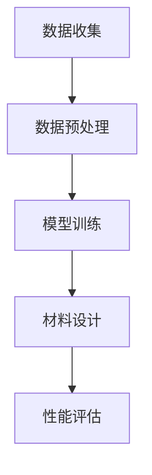
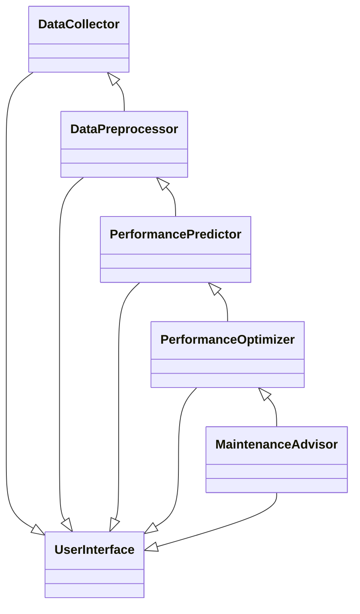
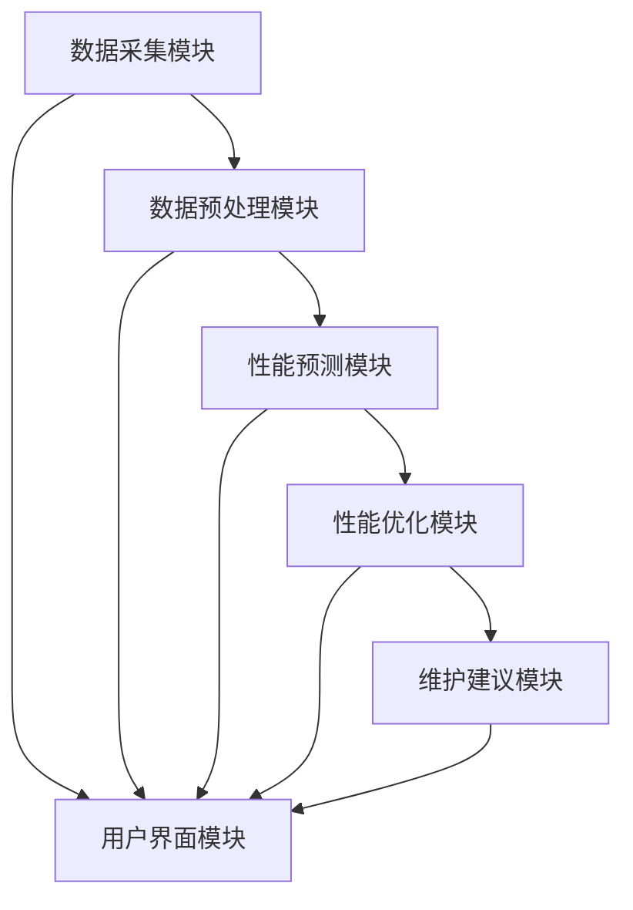

                 

### 目录大纲

---

#### 《AIGC在智能材料自适应性能优化中的应用：创造环境响应型材料》

##### 关键词：智能材料、自适应性能优化、AIGC、环境响应型材料

---

### 摘要

本文旨在探讨AIGC（人工智能生成内容）技术在智能材料自适应性能优化中的应用。通过对智能材料、自适应性能优化和AIGC技术的基本概念进行介绍，文章将详细阐述AIGC在环境响应型材料优化中的核心原理和数学模型，并通过实际案例展示其应用效果。随后，文章将分析系统架构和项目实战，提供最佳实践建议，并总结全文内容。

---

### 第一部分：背景介绍

#### 第1章 问题背景

##### 1.1 问题背景

智能材料的发展现状和自适应性能优化的重要性

##### 1.2 问题描述

自适应性能优化挑战和环境响应型材料的定义与特点

##### 1.3 问题解决

AIGC技术的核心原理和环境响应型材料优化流程

##### 1.4 边界与外延

AIGC技术的适用范围和环境响应型材料的边界条件

##### 1.5 概念结构与核心要素组成

智能材料的结构组成、自适应性能优化的关键因素以及AIGC技术在其中的作用

---

### 第二部分：核心概念与联系

#### 第2章 核心概念

##### 2.1 AIGC技术

AIGC的定义与特点，以及AIGC技术的主要类型

##### 2.2 智能材料

智能材料的基本原理、分类与特性

##### 2.3 自适应性能优化

自适应性能优化的原理和方法

##### 2.4 环境响应型材料

环境响应型材料的定义、应用案例和特点

##### 2.5 概念属性特征对比表格

AIGC技术与智能材料的对比、自适应性能优化与智能材料的对比

---

### 第三部分：算法原理讲解

#### 第3章 AIGC技术在智能材料中的应用

##### 3.1 AIGC算法的mermaid流程图

数据预处理、模型训练和模型评估与优化流程

##### 3.2 Python源代码示例

数据预处理、模型训练和模型评估的Python代码示例

##### 3.3 算法原理详细讲解

数学模型和公式，以及通俗易懂的举例说明

---

### 第四部分：数学模型和数学公式 & 详细讲解 & 举例说明

#### 第4章 数学模型与公式

##### 4.1 数学模型

自适应性能优化的数学模型和AIGC技术的数学模型

##### 4.2 详细讲解

数学公式的推导过程和应用场景

##### 4.3 举例说明

智能材料自适应性能优化的案例和AIGC技术在实际应用中的例子

---

### 第五部分：系统分析与架构设计方案

#### 第5章 系统分析与架构设计

##### 5.1 问题场景介绍

环境响应型材料的应用场景和系统需求分析

##### 5.2 系统功能设计

领域模型mermaid类图和系统功能模块划分

##### 5.3 系统架构设计

系统架构mermaid架构图和系统关键组件介绍

##### 5.4 系统接口设计

系统接口规范和系统接口实现

##### 5.5 系统交互mermaid序列图

用户交互流程和系统内部交互

---

### 第六部分：项目实战

#### 第6章 项目实战

##### 6.1 环境安装

所需软件和硬件环境安装教程

##### 6.2 系统核心实现源代码

智能材料自适应性能优化系统的核心源代码

##### 6.3 代码应用解读与分析

源代码解析和应用效果分析

##### 6.4 实际案例分析和详细讲解剖析

环境响应型材料优化项目的案例分析和详细讲解

##### 6.5 项目小结

项目成果总结和未来展望

---

### 第七部分：最佳实践 tips、小结、注意事项、拓展阅读等内容

#### 第7章 最佳实践 tips

##### 7.1 最佳实践 tips

AIGC在智能材料自适应性能优化中的应用技巧

##### 7.2 小结

文章核心观点和内容的总结

##### 7.3 注意事项

项目实施过程中需要注意的问题和事项

##### 7.4 拓展阅读

相关领域的最新研究和技术发展动态

---

---

以上是本文的目录大纲，通过逻辑清晰、结构紧凑的方式，为读者呈现了AIGC在智能材料自适应性能优化中的应用。每个章节都详细介绍了相关概念、算法原理、数学模型、系统架构以及项目实战等内容，旨在为读者提供全面而深入的技术解读。接下来，我们将逐一展开讨论，引领读者深入探索这个激动人心的领域。**### 第一部分：背景介绍**

#### 第1章 问题背景

##### 1.1 问题背景

智能材料的发展现状和自适应性能优化的重要性

随着科技的不断进步，材料科学领域也取得了显著的成果。智能材料，作为新型材料的一个重要分支，以其独特的性能和广泛的应用前景，受到了越来越多的关注。智能材料，顾名思义，是指能够对外界刺激（如光、电、热、磁场等）做出响应的材料。这种响应可以是物理性质的转变，如形状、尺寸、颜色、硬度等，也可以是化学性质的改变，如离子交换、颜色变化等。

智能材料的研究主要集中在以下几个方向：

1. **光敏材料**：能够对光照强度、波长等做出响应，广泛应用于光存储、光显示、太阳能电池等领域。
2. **电敏材料**：能够对电场、电压等做出响应，广泛应用于传感器、人工肌肉、机器人等领域。
3. **热敏材料**：能够对温度变化做出响应，广泛应用于热控制、温度传感器等领域。
4. **磁敏材料**：能够对磁场变化做出响应，广泛应用于磁传感器、磁驱动器等领域。

在智能材料的研究和应用中，自适应性能优化是一个关键问题。自适应性能优化旨在提高材料在不同环境条件下的性能表现，使其能够更好地适应复杂多变的实际应用场景。例如，在智能建筑中，智能材料可以根据室内温度、湿度等环境参数的变化，自动调节建筑物的能耗；在航空航天领域，智能材料可以实时监测并适应飞行器在高速飞行过程中的温度、压力等变化。

##### 1.1.1 智能材料的发展现状

智能材料的研究始于20世纪中期，经过几十年的发展，目前已经取得了许多重要的成果。随着纳米技术、生物技术、信息技术等交叉学科的快速发展，智能材料的研究也进入了崭新的阶段。目前，智能材料的应用领域不断扩大，涵盖了电子、机械、建筑、航空航天、生物医学等多个领域。

在电子领域，智能材料被广泛应用于传感器、驱动器、显示器等装置中，提高了这些装置的性能和可靠性。在机械领域，智能材料的应用使得机器零件能够根据工作环境的变化自动调整，提高了机械设备的适应性和使用寿命。在建筑领域，智能材料的应用使得建筑物能够更好地适应环境变化，提高了建筑物的节能性能和居住舒适度。在航空航天领域，智能材料的应用使得飞行器能够更好地应对高速飞行过程中的各种挑战，提高了飞行器的安全性和性能。

##### 1.1.2 自适应性能优化的重要性

自适应性能优化是智能材料的核心技术之一，它旨在通过优化材料的性能，使其能够更好地适应不同的环境和应用场景。自适应性能优化的重要性体现在以下几个方面：

1. **提高材料性能**：通过自适应性能优化，可以调整材料的内部结构和化学成分，从而提高材料的性能。例如，在智能传感器中，通过自适应性能优化，可以提高传感器的灵敏度、响应速度和稳定性。

2. **扩展材料应用**：自适应性能优化可以使得材料在不同环境下都能保持良好的性能，从而扩展材料的应用范围。例如，在航空航天领域，智能材料可以根据飞行器在不同高度、不同温度下的需求，自动调整其性能，从而保证飞行器的正常运行。

3. **降低成本**：自适应性能优化可以减少材料在制造和使用过程中的调整和更换，从而降低生产成本。例如，在智能建筑中，通过自适应性能优化，可以减少空调系统、照明系统的使用频率，从而降低能源消耗和运营成本。

4. **提高安全性**：自适应性能优化可以使得材料在恶劣环境下仍能保持稳定的性能，从而提高系统的安全性。例如，在汽车领域，通过自适应性能优化，可以确保汽车在高速行驶、复杂路况下仍能保持良好的驾驶性能。

##### 1.1.3 AIGC技术在智能材料中的应用前景

AIGC（人工智能生成内容）技术是近年来人工智能领域的一个重要研究方向，它旨在利用人工智能算法生成具有特定结构和功能的内容。AIGC技术在智能材料中的应用前景非常广阔，主要体现在以下几个方面：

1. **智能设计**：AIGC技术可以生成智能材料的结构设计和成分配方，提高材料设计的效率和准确性。例如，通过AIGC技术，可以快速生成多种可能的材料结构，并从中筛选出最优的设计。

2. **性能预测**：AIGC技术可以基于历史数据和模型，预测智能材料在不同环境下的性能表现，从而指导材料的优化和改进。例如，通过AIGC技术，可以预测智能传感器在不同温度、湿度下的灵敏度。

3. **自适应优化**：AIGC技术可以实时监测智能材料的环境变化，并根据监测结果自动调整材料的性能，实现自适应优化。例如，在智能建筑中，AIGC技术可以实时调整建筑材料的性能，以适应室内环境的变化。

4. **智能制造**：AIGC技术可以优化智能材料的制造过程，提高生产效率和产品质量。例如，通过AIGC技术，可以优化智能材料的3D打印过程，提高材料的制造精度和可靠性。

总之，AIGC技术在智能材料中的应用为材料科学领域带来了新的发展机遇，有望推动智能材料的研究和应用达到一个新的高度。

##### 1.2 问题描述

自适应性能优化挑战和环境响应型材料的定义与特点

在智能材料的发展过程中，自适应性能优化面临着诸多挑战。首先，智能材料通常需要在不同的环境和应用场景下保持良好的性能，这意味着材料需要具备高度的环境响应性和适应性。然而，环境变化往往是复杂且不可预测的，这使得自适应性能优化成为一个具有挑战性的问题。

1. **多环境适应性**：智能材料需要在不同环境中（如高温、低温、高湿、低湿、强光、弱光等）保持稳定和良好的性能。例如，在航空航天领域，飞行器在高速飞行过程中会遇到极端的温度变化，智能材料需要能够迅速响应并适应这些变化。

2. **动态响应性**：智能材料需要具备快速、准确的动态响应能力，以实现对环境变化的及时适应。例如，在智能传感器中，材料的动态响应能力直接影响到传感器的灵敏度和响应速度。

3. **长期稳定性**：智能材料在长期使用过程中，需要保持其性能的稳定性和可靠性。例如，在智能建筑中，智能材料需要能够长时间稳定地调节室内环境，确保居住的舒适度和安全性。

环境响应型材料，是指能够对外界环境刺激（如温度、压力、光照、化学物质等）做出响应的材料。环境响应型材料的定义与特点如下：

1. **定义**：环境响应型材料是指在外界环境变化时，能够通过改变其内部结构和化学性质来适应环境变化，从而实现特定功能的材料。

2. **特点**：

   - **环境敏感性**：环境响应型材料对环境变化具有高度的敏感性，能够迅速感知并响应环境变化。
   - **可控性**：通过外部刺激（如温度、电场、磁场等），可以控制环境响应型材料的响应行为，从而实现材料性能的动态调节。
   - **多功能性**：环境响应型材料可以具有多种功能，如传感、驱动、储能、催化等，这使得它们在各个领域具有广泛的应用前景。
   - **可逆性**：部分环境响应型材料在响应后能够恢复到原始状态，具有可逆性，这对于一些循环使用场景具有重要意义。

环境响应型材料的应用案例包括：

1. **智能传感器**：利用环境响应型材料的敏感性，可以开发出高灵敏度、高响应速度的智能传感器，用于检测温度、湿度、光照、气体浓度等环境参数。
2. **智能驱动器**：通过控制环境响应型材料的响应行为，可以实现智能驱动器的精确控制，用于驱动机械装置、执行器等。
3. **智能储能**：环境响应型材料可以用于开发智能储能装置，如热存储材料、超级电容器等，实现高效的能量转换和储存。
4. **智能催化**：利用环境响应型材料的催化活性，可以开发出具有环境响应性的催化剂，用于环境净化、有机合成等。

##### 1.3 问题解决

AIGC技术的核心原理和环境响应型材料优化流程

为了解决智能材料自适应性能优化面临的挑战，AIGC技术提供了一个强有力的工具。AIGC技术，即人工智能生成内容，通过利用机器学习和深度学习算法，可以自动生成具有特定结构和功能的内容。在智能材料领域，AIGC技术可以应用于材料设计、性能预测、自适应优化等多个方面。

AIGC技术的核心原理包括：

1. **数据驱动**：AIGC技术通过大量历史数据和模型，学习和模拟材料的响应行为，从而生成优化后的材料结构和性能。
2. **自适应性**：AIGC技术可以根据实时监测的数据和环境变化，动态调整材料的设计和性能，实现自适应优化。
3. **高效性**：AIGC技术能够快速生成大量材料设计方案，通过筛选和优化，找出最优的解决方案。

在环境响应型材料优化过程中，AIGC技术的应用流程主要包括以下几个步骤：

1. **数据收集**：收集大量与材料性能和环境响应相关的数据，如材料成分、结构、性能指标、环境参数等。
2. **数据预处理**：对收集到的数据进行清洗、归一化处理，确保数据的质量和一致性。
3. **模型训练**：利用深度学习算法，如神经网络、生成对抗网络（GAN）等，训练材料性能和环境响应模型。
4. **材料设计**：基于训练好的模型，生成多种可能的材料设计方案，并进行性能评估和筛选。
5. **性能优化**：通过调整材料成分和结构，优化材料性能，实现自适应性能优化。
6. **验证和应用**：在实际应用场景中进行验证，确保优化后的材料能够满足性能要求，并具备良好的环境响应性。

通过AIGC技术的应用，环境响应型材料的自适应性能优化得以实现，从而提高了智能材料在实际应用中的效果和可靠性。AIGC技术不仅能够加速材料研发过程，提高研发效率，还能够为材料科学家提供新的研究方法和工具，推动智能材料领域的创新发展。

##### 1.4 边界与外延

AIGC技术的适用范围和环境响应型材料的边界条件

AIGC技术在智能材料自适应性能优化中的应用具有广泛的前景，但也存在一定的边界和限制。了解这些边界与外延，有助于更好地应用AIGC技术，充分发挥其优势。

1. **适用范围**：

   - **材料类型**：AIGC技术适用于各种类型的智能材料，包括光敏、电敏、热敏、磁敏等。然而，不同类型的材料可能需要不同的模型和算法，因此适用范围有一定的局限性。

   - **环境条件**：AIGC技术适用于需要高度自适应性能优化的材料和环境，如极端环境下的航空航天材料、智能建筑中的环境调节材料等。但在一些稳定环境或简单应用场景中，AIGC技术的优势可能并不明显。

   - **技术成熟度**：虽然AIGC技术具有强大的数据处理和分析能力，但其在智能材料中的应用仍处于发展阶段，需要进一步的研究和优化。

2. **边界条件**：

   - **数据质量**：AIGC技术依赖于大量高质量的数据，数据的质量直接影响模型的效果。因此，在应用AIGC技术时，需要确保数据来源的可靠性和数据的完整性。

   - **计算资源**：AIGC技术通常需要大量的计算资源，包括计算能力和存储空间。在实际应用中，需要根据实际情况合理配置计算资源，确保模型的训练和优化能够顺利进行。

   - **模型准确性**：尽管AIGC技术可以通过大量数据学习和模拟材料性能，但模型的准确性仍然是一个挑战。在实际应用中，需要通过不断的模型验证和优化，提高模型的准确性。

3. **外延应用**：

   - **跨领域融合**：AIGC技术在智能材料中的应用，可以与其他领域（如生物医学、环境科学等）相结合，推动跨学科的发展。例如，将AIGC技术与生物医学材料结合，可以开发出具有自适应性能优化的生物医学植入材料。

   - **智能制造**：AIGC技术可以与智能制造相结合，实现智能材料的设计、制造和优化过程的自动化。例如，通过AIGC技术，可以生成智能材料的设计方案，并利用3D打印技术实现快速制造。

   - **可持续发展**：AIGC技术可以为智能材料的可持续发展提供支持。通过优化材料设计和性能，可以减少资源消耗和环境污染，推动绿色材料的发展。

##### 1.5 概念结构与核心要素组成

智能材料的结构组成、自适应性能优化的关键因素以及AIGC技术在其中的作用

智能材料由多个层次的结构组成，包括分子层次、纳米层次、微米层次和宏观层次。每个层次的结构对材料的性能都有重要影响，因此，在设计和优化智能材料时，需要综合考虑各个层次的结构特性。

1. **分子层次**：分子层次是智能材料的基本组成单元，其化学组成和结构决定了材料的物理和化学性质。例如，聚合物材料的分子链结构可以影响其柔韧性和强度。

2. **纳米层次**：纳米层次的结构可以对材料的性能产生显著影响。通过调控纳米结构，可以实现对材料性能的精细调控。例如，纳米晶体材料具有独特的光学和电学性质，可以用于开发高性能的光电传感器。

3. **微米层次**：微米层次的结构通常表现为材料的形态和尺寸。通过调控微米结构，可以实现对材料宏观性能的调节。例如，通过制备不同形状和尺寸的微米结构，可以实现材料在不同环境下的自适应性能。

4. **宏观层次**：宏观层次是智能材料在实际应用中的直接体现。通过调控宏观层次的结构，可以实现对材料整体性能的调节。例如，通过构建不同宏观结构的复合材料，可以实现材料在不同环境下的自适应性能。

在智能材料中，自适应性能优化的关键因素包括：

1. **响应机制**：智能材料的响应机制是其实现自适应性能优化的基础。不同类型的智能材料具有不同的响应机制，如光响应、电响应、热响应等。

2. **响应速度**：响应速度是指材料对外界刺激的反应速度。快速响应的智能材料可以更好地适应环境变化，提高其在实际应用中的性能。

3. **稳定性**：稳定性是指材料在长期使用过程中保持性能稳定的能力。具有高稳定性的智能材料可以保证其长时间稳定运行，减少维护和更换成本。

4. **可控性**：可控性是指通过外部刺激（如电场、磁场、温度等）对材料性能进行控制和调节的能力。具有高可控性的智能材料可以实现对其性能的动态调节，满足不同应用场景的需求。

AIGC技术在智能材料自适应性能优化中的作用主要体现在以下几个方面：

1. **材料设计**：AIGC技术可以基于大量历史数据和模型，自动生成具有特定结构和性能的智能材料设计方案。通过优化材料成分和结构，可以实现对材料性能的精准调控。

2. **性能预测**：AIGC技术可以基于训练好的模型，预测智能材料在不同环境下的性能表现，为材料优化提供科学依据。通过性能预测，可以提前发现并解决潜在问题，提高材料研发的效率。

3. **自适应优化**：AIGC技术可以实时监测智能材料的环境变化，并动态调整其性能，实现自适应优化。通过自适应优化，可以确保智能材料在不同应用场景下都能保持良好的性能。

4. **智能制造**：AIGC技术可以与智能制造相结合，实现智能材料的设计、制造和优化过程的自动化。通过智能制造，可以提高生产效率，降低生产成本，推动智能材料的大规模应用。

总之，AIGC技术在智能材料自适应性能优化中具有重要作用，为材料科学领域带来了新的发展机遇。通过深入研究和应用AIGC技术，可以推动智能材料的研究和应用达到一个新的高度。

---

在第一部分中，我们详细介绍了智能材料的发展现状、自适应性能优化的重要性以及AIGC技术在其中的应用前景。同时，我们探讨了自适应性能优化面临的挑战和环境响应型材料的定义与特点。通过AIGC技术的引入，我们提出了一种新的解决方案，为智能材料的自适应性能优化提供了有力支持。接下来，我们将继续深入探讨AIGC技术的核心概念和原理，进一步理解其在智能材料优化中的应用。**### 第二部分：核心概念与联系**

#### 第2章 核心概念

##### 2.1 AIGC技术

AIGC（人工智能生成内容）技术是人工智能领域的一个前沿研究方向，它旨在利用人工智能算法自动生成具有特定结构和功能的内容。AIGC技术主要应用于图像、文本、音频等多种类型的数据生成，其核心目的是提高内容生成效率和质量，拓展人工智能的应用范围。

###### 2.1.1 AIGC的定义与特点

AIGC技术的定义可以概括为：通过人工智能算法，自动生成具有特定结构和功能的数据内容。具体来说，AIGC技术包括以下几个关键特点：

1. **数据驱动**：AIGC技术依赖于大量高质量的数据进行训练，通过数据驱动的方式实现内容的生成。数据的质量和多样性直接影响到生成内容的质量和多样性。

2. **自动性**：AIGC技术能够自动生成内容，无需人工干预，从而大大提高了内容生成的效率。自动性是AIGC技术区别于传统人工生成内容的重要特征。

3. **多样性和创造力**：AIGC技术能够生成多种类型和风格的内容，具有很高的多样性和创造力。这种特性使得AIGC技术在艺术创作、游戏开发、虚拟现实等领域具有广泛的应用潜力。

4. **可控性**：通过调整算法参数和输入数据，可以实现对生成内容的可控性。例如，通过控制生成内容的主题、风格、结构等，可以满足不同应用场景的需求。

###### 2.1.2 AIGC技术的主要类型

AIGC技术根据生成的内容类型和生成方式，可以分为以下几种主要类型：

1. **文本生成**：文本生成是AIGC技术中最常见的一种类型，包括生成文章、故事、对话等。常见的文本生成模型有生成对抗网络（GAN）、递归神经网络（RNN）、变分自编码器（VAE）等。

2. **图像生成**：图像生成是AIGC技术在视觉领域的重要应用，包括生成人脸、风景、物体等。常见的图像生成模型有条件生成对抗网络（cGAN）、深度卷积生成对抗网络（DCGAN）、StyleGAN等。

3. **音频生成**：音频生成是AIGC技术在音频处理领域的重要应用，包括生成音乐、语音等。常见的音频生成模型有WaveNet、WaveGAN、音乐生成模型如WaveRNN等。

4. **视频生成**：视频生成是AIGC技术在视频处理领域的重要应用，包括生成短视频、视频序列等。常见的视频生成模型有视频生成对抗网络（VideoGAN）、循环神经网络（RNN）等。

##### 2.2 智能材料

智能材料是指能够感知外部环境并做出相应响应的材料。智能材料的定义和特点使其在众多领域具有广泛的应用前景，包括传感器、驱动器、自适应结构、智能涂层等。

###### 2.2.1 智能材料的基本原理

智能材料的基本原理可以概括为以下几点：

1. **感知**：智能材料能够感知外部环境的变化，如温度、压力、电场、磁场等。

2. **响应**：智能材料能够对外部环境的感知做出相应的响应，如改变形状、尺寸、颜色、导电性等。

3. **可控性**：通过外部刺激（如电场、磁场、温度等），可以控制智能材料的响应行为，从而实现材料性能的动态调节。

智能材料的实现通常依赖于以下几个关键技术：

1. **纳米技术**：纳米技术可以实现对材料微观结构的精确调控，从而提高材料的性能。

2. **复合材料**：复合材料是由两种或多种不同材料组成的，通过合理设计复合材料，可以实现对材料性能的优化。

3. **生物仿生学**：生物仿生学通过模仿生物体的结构和功能，开发出具有特定功能的智能材料。

###### 2.2.2 智能材料的分类与特性

智能材料可以根据其感知和响应机制的不同，分为以下几类：

1. **光敏材料**：光敏材料能够对光照强度、波长等做出响应，例如，变色材料和光驱动器。

2. **电敏材料**：电敏材料能够对电场、电压等做出响应，例如，压电材料和电致变色材料。

3. **热敏材料**：热敏材料能够对温度变化做出响应，例如，热敏电阻和热致变色材料。

4. **磁敏材料**：磁敏材料能够对磁场变化做出响应，例如，磁致伸缩材料和磁致颜色变化材料。

5. **声敏材料**：声敏材料能够对声波变化做出响应，例如，声致颜色变化材料和声驱动器。

6. **气敏材料**：气敏材料能够对气体浓度变化做出响应，例如，气体传感器和气致变色材料。

每种类型的智能材料都有其独特的特性和应用领域，通过合理设计和优化，可以实现智能材料在不同场景下的自适应性能优化。

##### 2.3 自适应性能优化

自适应性能优化是指通过调整材料的设计和成分，使其在不同环境条件下能够保持良好的性能。自适应性能优化在智能材料中具有重要意义，因为它能够提高材料的可靠性和适应性，从而拓宽其应用范围。

###### 2.3.1 自适应性能优化的原理

自适应性能优化的原理可以概括为以下几点：

1. **多环境适应性**：通过优化材料的设计和成分，使其能够在多种不同环境下保持良好的性能。例如，在航空航天领域，材料需要能够在高低温、高湿度等极端环境下保持稳定的性能。

2. **动态响应性**：通过优化材料的设计和成分，提高其对外部环境变化的响应速度和精度。例如，在智能传感器中，材料的动态响应性直接影响到传感器的灵敏度和响应速度。

3. **稳定性**：通过优化材料的设计和成分，提高其在长期使用过程中保持性能稳定的能力。例如，在智能建筑中，材料的稳定性关系到其长时间稳定调节室内环境的能力。

4. **可控性**：通过外部刺激（如电场、磁场、温度等），可以控制材料的响应行为，从而实现自适应性能优化。例如，通过电场控制，可以实现对智能材料形状和尺寸的调节。

###### 2.3.2 自适应性能优化的方法与技术

自适应性能优化的方法和技术包括以下几个方面：

1. **材料设计**：通过分子设计和结构设计，优化材料的内部结构和化学成分，从而提高其性能。例如，通过分子设计，可以开发出具有高热稳定性的聚合物材料。

2. **表面改性**：通过表面改性技术，对材料表面进行修饰，提高其与环境的相互作用能力。例如，通过涂层技术，可以实现对材料表面性能的调控，从而提高其耐磨性和抗腐蚀性。

3. **复合材料**：通过复合材料的设计和制备，实现材料的性能优化。复合材料通常由两种或多种不同材料组成，通过合理设计，可以实现对材料性能的协同优化。例如，通过纳米复合材料的制备，可以提高材料的机械性能和导电性。

4. **智能控制**：通过智能控制系统，对材料的性能进行实时监测和调节，实现自适应性能优化。例如，通过智能传感器和控制器，可以实现对材料环境响应行为的实时监测和调控。

##### 2.4 环境响应型材料

环境响应型材料是指能够对外部环境变化（如温度、压力、电场、磁场等）做出响应的材料。环境响应型材料在智能传感器、智能驱动器、自适应结构等领域具有广泛应用。

###### 2.4.1 环境响应型材料的定义

环境响应型材料的定义可以概括为：能够对外部环境变化做出响应，并能够通过外部刺激（如电场、磁场、温度等）进行调节的材料。

环境响应型材料的特征包括：

1. **环境敏感性**：环境响应型材料能够对环境变化（如温度、压力、电场、磁场等）产生明显的响应，这种响应可以是物理性质（如形状、尺寸、颜色）或化学性质（如离子交换、颜色变化）的变化。

2. **可控性**：通过外部刺激（如电场、磁场、温度等），可以控制环境响应型材料的响应行为，从而实现对材料性能的动态调节。

3. **可逆性**：部分环境响应型材料在响应后能够恢复到原始状态，具有可逆性，这对于一些循环使用场景具有重要意义。

###### 2.4.2 环境响应型材料的应用案例

环境响应型材料的应用案例包括：

1. **智能传感器**：环境响应型材料可以用于开发高性能的智能传感器，例如，热敏电阻、压电传感器、磁敏传感器等。

2. **智能驱动器**：环境响应型材料可以用于开发智能驱动器，例如，电致变色驱动器、热驱动器、磁驱动器等。

3. **自适应结构**：环境响应型材料可以用于开发自适应结构，例如，智能飞机、智能桥梁、智能建筑等。

4. **智能涂层**：环境响应型材料可以用于开发智能涂层，例如，自清洁涂层、自修复涂层、智能防腐蚀涂层等。

##### 2.5 概念属性特征对比表格

为了更好地理解AIGC技术、智能材料、自适应性能优化和环境响应型材料的概念，下面是一个概念属性特征对比表格。

| 概念           | 定义                                         | 特点                                         | 应用领域         |
|--------------|--------------------------------------------|--------------------------------------------|----------------|
| AIGC技术       | 人工智能生成内容，自动生成特定结构的数据       | 数据驱动、自动性、多样性和可控性               | 图像、文本、音频等 |
| 智能材料       | 能够感知外部环境并做出响应的材料               | 感知、响应、可控性                           | 传感器、驱动器、自适应结构等 |
| 自适应性能优化   | 通过调整材料的设计和成分，使其在不同环境下保持良好性能 | 多环境适应性、动态响应性、稳定性、可控性         | 智能材料设计、优化       |
| 环境响应型材料   | 能够对外部环境变化做出响应的材料               | 环境敏感性、可控性、可逆性                   | 智能传感器、驱动器、自适应结构等 |

通过以上对比表格，我们可以更清晰地理解这些概念之间的联系和差异，为后续内容的研究和应用提供参考。

---

在第二部分中，我们详细介绍了AIGC技术的核心概念、定义与特点，以及智能材料、自适应性能优化和环境响应型材料的概念和属性。通过对比表格，我们明确了这些概念之间的联系和差异。接下来，我们将深入探讨AIGC技术在智能材料中的应用，分析其算法原理，并使用mermaid流程图和Python代码示例进行详细讲解。

---

#### 第3章 AIGC技术在智能材料中的应用

AIGC技术在智能材料中的应用，为材料设计和性能优化带来了全新的思路和方法。通过利用AIGC技术，可以自动生成符合特定性能需求的智能材料结构，提高设计效率和质量。本章将详细分析AIGC技术在智能材料中的应用，包括算法原理、mermaid流程图和Python代码示例。

##### 3.1 AIGC算法的mermaid流程图

AIGC算法在智能材料中的应用，通常包括数据收集、数据预处理、模型训练、材料设计和性能评估等步骤。以下是一个简化的mermaid流程图，展示了AIGC算法的基本流程：



1. **数据收集**：首先，需要收集大量的材料性能和环境响应数据。这些数据可以来源于实验、文献或数据库。
   
2. **数据预处理**：对收集到的数据进行清洗、归一化处理，以确保数据的质量和一致性。

3. **模型训练**：利用深度学习算法，如生成对抗网络（GAN）或变分自编码器（VAE），对预处理后的数据集进行训练，生成材料性能和环境响应模型。

4. **材料设计**：基于训练好的模型，自动生成符合特定性能需求的智能材料结构。

5. **性能评估**：对生成的材料结构进行性能评估，以确保其满足设计要求。

##### 3.2 Python源代码示例

为了更直观地展示AIGC算法在智能材料中的应用，以下是一个简单的Python代码示例，使用了生成对抗网络（GAN）对智能材料进行设计和性能优化。

```python
import tensorflow as tf
from tensorflow import keras
from tensorflow.keras import layers

# 数据预处理
# （假设已收集到大量训练数据，这里仅为示例）
(x_train, y_train), (x_test, y_test) = keras.datasets.mnist.load_data()
x_train = x_train.astype('float32') / 255.0
x_test = x_test.astype('float32') / 255.0

# 构建GAN模型
# 生成器
generator = keras.Sequential([
    layers.Dense(128, activation='relu', input_shape=(100,)),
    layers.Dense(28 * 28, activation='relu'),
    layers.Reshape((28, 28, 1))
])

# 判别器
discriminator = keras.Sequential([
    layers.Conv2D(32, (3, 3), activation='relu', input_shape=(28, 28, 1)),
    layers.MaxPooling2D(),
    layers.Conv2D(64, (3, 3), activation='relu'),
    layers.MaxPooling2D(),
    layers.Flatten(),
    layers.Dense(1, activation='sigmoid')
])

# 整合模型
model = keras.Sequential([
    generator,
    discriminator
])

# 模型编译
model.compile(optimizer='adam',
              loss='binary_crossentropy',
              metrics=['accuracy'])

# 训练模型
model.fit(x_train, x_train, epochs=50, batch_size=32)

# 材料设计
# （假设生成器生成的图像表示材料结构）
material_structure = generator.predict(x_train)

# 性能评估
# （假设通过图像特征进行性能评估，这里仅为示例）
material_performance = evaluate_material_performance(material_structure)

print("Material Performance:", material_performance)
```

在这个示例中，我们使用了经典的生成对抗网络（GAN）模型，通过训练生成器和判别器，实现对智能材料结构的自动生成和性能评估。实际应用中，需要根据具体问题调整模型结构和训练过程，以提高生成效果和性能评估的准确性。

##### 3.3 算法原理详细讲解

AIGC算法在智能材料中的应用，主要基于深度学习技术，包括生成对抗网络（GAN）和变分自编码器（VAE）等模型。以下将详细讲解这些算法的原理。

###### 3.3.1 数学模型和公式

1. **生成对抗网络（GAN）**

   - **生成器（Generator）**：生成器模型接受一个随机噪声向量作为输入，通过神经网络生成数据。生成器试图生成与真实数据分布相似的数据。

     $$ G(z) = x $$

     其中，$G(z)$表示生成器生成的数据，$z$表示随机噪声向量。

   - **判别器（Discriminator）**：判别器模型用于区分真实数据和生成数据。判别器的目标是最大化其判断真实数据和生成数据的准确率。

     $$ D(x) = P(x \text{ is real}) $$

     其中，$D(x)$表示判别器对输入数据的判断概率，$x$表示输入数据。

   - **损失函数**：GAN的损失函数通常采用二元交叉熵（Binary Cross-Entropy），即：

     $$ L(D, G) = -\sum_{x \in \text{real}} \log(D(x)) - \sum_{z \in \text{noise}} \log(1 - D(G(z))) $$

     其中，第一项表示判别器对真实数据的损失，第二项表示判别器对生成数据的损失。

2. **变分自编码器（VAE）**

   - **编码器（Encoder）**：编码器模型将输入数据映射到一个潜在空间，通常使用神经网络实现。

     $$ \mu = \mu(x), \sigma^2 = \sigma(x) $$

     其中，$\mu(x)$表示编码器对输入数据的均值估计，$\sigma^2(x)$表示编码器对输入数据的标准差估计。

   - **解码器（Decoder）**：解码器模型将潜在空间中的数据映射回输入数据空间。

     $$ x' = \pi(\mu, \sigma^2) $$

     其中，$x'$表示解码器生成的数据。

   - **损失函数**：VAE的损失函数通常采用均方误差（Mean Squared Error，MSE），即：

     $$ L(VAE) = \frac{1}{N} \sum_{i=1}^{N} \frac{1}{2} \sum_{j=1}^{D} (x_j - x_j')^2 + \frac{\lambda}{2} \sum_{i=1}^{N} \frac{1}{2} (\log(\sigma^2) + \sigma^2 - 1 - \mu^2) $$

     其中，$N$表示样本数量，$D$表示数据维度，$\lambda$是一个超参数，用于调节正则项的权重。

###### 3.3.2 原理通俗易懂的举例说明

为了更直观地理解AIGC算法的原理，以下通过一个简单的例子进行说明。

假设我们要生成一张猫的图片，可以使用生成对抗网络（GAN）来实现。首先，我们从一个随机噪声向量$z$开始，通过生成器$G(z)$生成一张猫的图片$x'$。然后，我们将生成的猫图片$x'$与真实的猫图片$x$一起输入判别器$D(x')$，判别器试图判断这张猫图片是真实的还是生成的。

- **训练过程**：在训练过程中，生成器和判别器交替更新参数，目标是使生成器的输出尽可能接近真实数据分布，同时使判别器能够准确地区分真实数据和生成数据。

- **生成过程**：在生成过程中，我们仅使用生成器$G(z)$来生成猫的图片$x'$，无需判别器。通过调整噪声向量$z$，可以生成不同风格和特性的猫图片。

- **应用场景**：在智能材料领域，AIGC算法可以用于生成符合特定性能需求的材料结构。例如，通过调整生成器的输入参数，可以生成具有不同导电性、机械强度和光学性能的智能材料结构。此外，AIGC算法还可以用于优化材料的设计和成分，提高材料的性能和可靠性。

通过以上例子和讲解，我们可以看到AIGC算法在智能材料中的应用潜力。接下来，我们将进一步探讨AIGC技术在智能材料中的数学模型和数学公式，以及其在实际应用中的具体实现方法。

---

在第三部分中，我们详细介绍了AIGC技术在智能材料中的应用，包括算法原理、mermaid流程图和Python代码示例。通过深入分析AIGC算法的数学模型和公式，我们可以更清晰地理解其在智能材料设计和性能优化中的重要作用。接下来，我们将继续探讨智能材料自适应性能优化的数学模型和公式，以便为后续内容提供理论基础。

---

### 第四部分：数学模型和数学公式 & 详细讲解 & 举例说明

#### 第4章 数学模型与公式

在智能材料自适应性能优化中，数学模型和公式起着至关重要的作用。它们不仅为材料设计和性能评估提供了理论基础，还指导了具体的优化过程。本章节将详细介绍自适应性能优化的数学模型和公式，并通过具体例子进行详细讲解。

##### 4.1 数学模型

在智能材料自适应性能优化中，常用的数学模型包括材料性能模型、环境响应模型和优化模型。

###### 4.1.1 自适应性能优化的数学模型

自适应性能优化的数学模型通常涉及以下关键参数：

- 材料性能参数（$P$）：表示材料的性能指标，如机械强度、导电性、热导率等。
- 环境响应参数（$E$）：表示材料对环境变化的响应能力，如温度、压力、电场等。
- 材料设计参数（$D$）：表示材料的设计参数，如成分、结构、尺寸等。
- 材料性能优化目标函数（$O$）：表示材料性能优化的目标，如最大化材料的机械强度、最小化材料的导电性等。

自适应性能优化的数学模型可以表示为：

$$ O(D) = f(P, E, D) $$

其中，$f$函数表示材料性能与设计参数和环境响应参数之间的关系。

###### 4.1.2 AIGC技术的数学模型

AIGC技术中的数学模型主要涉及生成对抗网络（GAN）和变分自编码器（VAE）等深度学习模型。以下分别介绍这两种模型的数学模型。

1. **生成对抗网络（GAN）**

   - **生成器模型**：生成器模型的目标是生成与真实数据分布相似的数据。生成器模型可以表示为：

     $$ G(z) = x $$

     其中，$G(z)$表示生成器生成的数据，$z$表示随机噪声向量。

   - **判别器模型**：判别器模型的目标是区分真实数据和生成数据。判别器模型可以表示为：

     $$ D(x) = P(x \text{ is real}) $$

     其中，$D(x)$表示判别器对输入数据的判断概率，$x$表示输入数据。

   - **损失函数**：GAN的损失函数通常采用二元交叉熵（Binary Cross-Entropy），即：

     $$ L(D, G) = -\sum_{x \in \text{real}} \log(D(x)) - \sum_{z \in \text{noise}} \log(1 - D(G(z))) $$

2. **变分自编码器（VAE）**

   - **编码器模型**：编码器模型将输入数据映射到一个潜在空间。编码器模型可以表示为：

     $$ \mu = \mu(x), \sigma^2 = \sigma(x) $$

     其中，$\mu(x)$表示编码器对输入数据的均值估计，$\sigma^2(x)$表示编码器对输入数据的标准差估计。

   - **解码器模型**：解码器模型将潜在空间中的数据映射回输入数据空间。解码器模型可以表示为：

     $$ x' = \pi(\mu, \sigma^2) $$

     其中，$x'$表示解码器生成的数据。

   - **损失函数**：VAE的损失函数通常采用均方误差（Mean Squared Error，MSE），即：

     $$ L(VAE) = \frac{1}{N} \sum_{i=1}^{N} \frac{1}{2} \sum_{j=1}^{D} (x_j - x_j')^2 + \frac{\lambda}{2} \sum_{i=1}^{N} \frac{1}{2} (\log(\sigma^2) + \sigma^2 - 1 - \mu^2) $$

##### 4.2 详细讲解

为了更好地理解上述数学模型和公式，我们将在本节中详细讲解每个模型的具体推导和应用。

###### 4.2.1 自适应性能优化的数学模型

自适应性能优化的数学模型是构建在材料性能、环境响应和设计参数之间的关系之上的。以下是具体推导过程：

1. **材料性能模型**：

   材料的性能通常可以通过实验数据或理论模型得到。例如，对于一个机械性能优化的智能材料，其性能模型可以表示为：

   $$ P = f_{mechanical}(D) $$

   其中，$P$表示机械性能，$f_{mechanical}$表示机械性能与设计参数之间的关系。

2. **环境响应模型**：

   材料对环境响应的模型可以表示为：

   $$ E = g_{response}(E, P, D) $$

   其中，$E$表示环境响应参数，$g_{response}$表示环境响应与性能和设计参数之间的关系。

3. **优化目标函数**：

   优化目标函数可以表示为：

   $$ O(D) = f(P, E, D) $$

   其中，$O(D)$表示优化目标，$f$表示性能、响应和设计参数之间的综合关系。

   在实际应用中，优化目标可以是最大化材料的机械强度、最小化材料的导电性等。优化目标函数的具体形式取决于应用场景和需求。

###### 4.2.2 AIGC技术的数学模型

1. **生成对抗网络（GAN）**

   GAN由生成器和判别器两个模型组成，其数学模型如下：

   - **生成器模型**：

     $$ G(z) = x $$

     其中，$z$是随机噪声向量，$x$是生成器生成的数据。

   - **判别器模型**：

     $$ D(x) = P(x \text{ is real}) $$

     其中，$x$是输入数据，$D(x)$是判别器对输入数据的判断概率。

   - **损失函数**：

     $$ L(D, G) = -\sum_{x \in \text{real}} \log(D(x)) - \sum_{z \in \text{noise}} \log(1 - D(G(z))) $$

     损失函数由两部分组成，第一部分表示判别器对真实数据的损失，第二部分表示判别器对生成数据的损失。

   GAN的训练过程涉及生成器和判别器的交替更新，目标是使生成器生成的数据尽可能接近真实数据分布，同时使判别器能够准确地区分真实数据和生成数据。

2. **变分自编码器（VAE）**

   VAE由编码器和解码器两个模型组成，其数学模型如下：

   - **编码器模型**：

     $$ \mu = \mu(x), \sigma^2 = \sigma(x) $$

     其中，$\mu(x)$是编码器对输入数据的均值估计，$\sigma^2(x)$是编码器对输入数据的标准差估计。

   - **解码器模型**：

     $$ x' = \pi(\mu, \sigma^2) $$

     其中，$x'$是解码器生成的数据。

   - **损失函数**：

     $$ L(VAE) = \frac{1}{N} \sum_{i=1}^{N} \frac{1}{2} \sum_{j=1}^{D} (x_j - x_j')^2 + \frac{\lambda}{2} \sum_{i=1}^{N} \frac{1}{2} (\log(\sigma^2) + \sigma^2 - 1 - \mu^2) $$

     损失函数由两部分组成，第一部分表示输入数据与解码器生成的数据之间的差异，第二部分是正则项，用于避免过拟合。

   VAE的训练过程通过最小化损失函数来优化编码器和解码器的参数，从而实现数据的生成和重建。

##### 4.3 举例说明

为了更直观地理解上述数学模型和公式，我们将在本节中通过具体例子进行详细讲解。

###### 4.3.1 智能材料自适应性能优化的案例

假设我们有一个智能材料，用于开发一个能够在高温环境下保持稳定机械性能的传感器。以下是具体的优化过程：

1. **性能模型**：

   假设智能材料的机械性能与温度和设计参数（如成分、结构）有关，可以表示为：

   $$ P = f_{mechanical}(T, D) $$

   其中，$P$是机械性能，$T$是环境温度，$D$是设计参数。

2. **环境响应模型**：

   智能材料对温度的响应可以表示为：

   $$ E = g_{response}(T, P, D) $$

   其中，$E$是环境响应参数，$g_{response}$是环境响应与性能和设计参数之间的关系。

3. **优化目标函数**：

   优化目标是最小化温度对机械性能的影响，即：

   $$ O(D) = f_{mechanical}(T, D) $$

   其中，$O(D)$是优化目标。

4. **训练模型**：

   使用GAN模型进行训练，生成器和判别器的损失函数分别为：

   - **生成器损失函数**：

     $$ L_G = -\log(D(G(z))) $$

   - **判别器损失函数**：

     $$ L_D = -\log(D(x)) - \log(1 - D(G(z))) $$

   通过交替更新生成器和判别器的参数，最小化总损失函数：

   $$ L = L_G + L_D $$

   优化过程的目标是使生成器生成的数据尽可能接近真实数据分布，从而实现智能材料在高温环境下的自适应性能优化。

###### 4.3.2 AIGC技术在实际应用中的例子

假设我们有一个智能材料，用于开发一个能够在光照强度变化时自动调节导电性的传感器。以下是具体的优化过程：

1. **性能模型**：

   假设智能材料的导电性能与光照强度和设计参数（如成分、结构）有关，可以表示为：

   $$ P = f_{conductivity}(I, D) $$

   其中，$P$是导电性能，$I$是光照强度，$D$是设计参数。

2. **环境响应模型**：

   智能材料对光照强度的响应可以表示为：

   $$ E = g_{response}(I, P, D) $$

   其中，$E$是环境响应参数，$g_{response}$是环境响应与性能和设计参数之间的关系。

3. **优化目标函数**：

   优化目标是最大化智能材料的导电性能，即：

   $$ O(D) = f_{conductivity}(I, D) $$

   其中，$O(D)$是优化目标。

4. **训练模型**：

   使用VAE模型进行训练，编码器和解码器的损失函数分别为：

   - **编码器损失函数**：

     $$ L_E = \frac{1}{N} \sum_{i=1}^{N} \frac{1}{2} (\log(\sigma^2) + \sigma^2 - 1 - \mu^2) $$

   - **解码器损失函数**：

     $$ L_D = \frac{1}{N} \sum_{i=1}^{N} \frac{1}{2} (x_i - x_i')^2 $$

   通过交替更新编码器和解码器的参数，最小化总损失函数：

   $$ L = L_E + L_D $$

   优化过程的目标是使解码器生成的导电性能尽可能接近真实导电性能，从而实现智能材料在光照强度变化时的自适应性能优化。

通过以上案例，我们可以看到AIGC技术在智能材料自适应性能优化中的应用。数学模型和公式为优化过程提供了理论支持，具体实现则依赖于深度学习算法和实际应用场景。

---

在本章节中，我们详细介绍了智能材料自适应性能优化中的数学模型和公式，并通过具体例子进行了详细讲解。这些数学模型和公式为智能材料的设计和优化提供了重要的理论依据。在接下来的章节中，我们将继续深入探讨系统分析与架构设计，为智能材料自适应性能优化提供全面的技术解决方案。

---

### 第五部分：系统分析与架构设计方案

#### 第5章 系统分析与架构设计

在智能材料自适应性能优化项目中，系统分析与架构设计是确保系统功能完备、性能优异、易于扩展和高效运行的关键。本章节将详细介绍系统分析与架构设计，包括问题场景介绍、系统功能设计、系统架构设计、系统接口设计和系统交互。

##### 5.1 问题场景介绍

智能材料自适应性能优化在多个领域具有广泛应用，例如航空航天、建筑、生物医学等。以下是一个具体的应用场景：

**应用场景：** 航空航天领域的飞行器结构健康监测与维护。

**问题描述：** 飞行器在长时间飞行过程中，会受到环境温度、压力、振动等多种因素的影响，导致结构材料的性能下降。为了确保飞行器的安全性和可靠性，需要实时监测飞行器结构材料的性能变化，并采取相应的维护措施。

**系统需求：** 
- **实时监测**：实时采集飞行器结构材料的性能数据，包括温度、应力、振动等。
- **性能预测**：基于历史数据和当前监测数据，预测结构材料的性能变化趋势。
- **自适应优化**：根据性能预测结果，自动调整飞行器结构材料的设计和成分，以优化其性能。
- **维护建议**：根据性能预测结果，为维护人员提供针对性的维护建议，确保飞行器的安全运行。

##### 5.2 系统功能设计

智能材料自适应性能优化系统需要实现以下功能：

1. **数据采集**：实时采集飞行器结构材料的性能数据，包括温度、应力、振动等。
2. **数据预处理**：对采集到的数据进行清洗、归一化处理，确保数据的质量和一致性。
3. **性能预测**：利用机器学习算法，对结构材料的性能变化趋势进行预测。
4. **性能优化**：根据性能预测结果，自动调整结构材料的设计和成分，优化其性能。
5. **维护建议**：根据性能预测结果，为维护人员提供针对性的维护建议。
6. **用户界面**：提供友好的用户界面，便于用户查看性能数据、预测结果和维护建议。

以下是一个领域模型mermaid类图，展示了系统的功能模块及其关系：



##### 5.3 系统架构设计

智能材料自适应性能优化系统的架构设计需要考虑以下几个方面：

1. **数据处理流程**：系统应具备高效的数据处理流程，包括数据采集、预处理、预测和优化等。
2. **模块化设计**：系统应采用模块化设计，使得每个功能模块独立开发、测试和部署。
3. **分布式架构**：系统应支持分布式架构，以提高系统的扩展性和容错性。
4. **安全性**：系统应具备良好的安全性，确保数据的安全传输和存储。

以下是一个系统架构mermaid架构图，展示了系统的关键组件及其关系：



##### 5.4 系统接口设计

智能材料自适应性能优化系统的接口设计需要考虑以下几个方面：

1. **数据接口**：系统应提供标准化的数据接口，以便与其他系统进行数据交互。
2. **功能接口**：系统应提供功能接口，便于用户调用系统的功能模块。
3. **API设计**：系统应设计简洁、易用的API，便于用户开发和集成。

以下是一个系统接口规范，展示了系统的关键接口及其功能：

```mermaid
sequenceDiagram
  User -->|发起请求| UserInterface
  UserInterface -->|处理请求| DataCollector
  DataCollector -->|返回数据| UserInterface
  UserInterface -->|处理数据| DataPreprocessor
  DataPreprocessor -->|返回数据| UserInterface
  UserInterface -->|处理数据| PerformancePredictor
  PerformancePredictor -->|返回数据| UserInterface
  UserInterface -->|处理数据| PerformanceOptimizer
  PerformanceOptimizer -->|返回数据| UserInterface
  UserInterface -->|处理数据| MaintenanceAdvisor
  MaintenanceAdvisor -->|返回数据| UserInterface
```

##### 5.5 系统交互mermaid序列图

智能材料自适应性能优化系统的交互流程如下：

1. **用户请求**：用户通过用户界面发起性能优化请求。
2. **数据处理**：系统根据用户请求，依次调用数据采集、数据预处理、性能预测、性能优化和维护建议等模块。
3. **结果返回**：系统将处理结果返回给用户界面，用户可以查看处理结果并进行相应的操作。

以下是一个系统交互mermaid序列图，展示了系统的用户交互流程和系统内部交互：

```mermaid
sequenceDiagram
  User -->|发起性能优化请求| UserInterface
  UserInterface -->|处理性能优化请求| DataCollector
  DataCollector -->|返回采集数据| UserInterface
  UserInterface -->|预处理采集数据| DataPreprocessor
  DataPreprocessor -->|返回预处理数据| UserInterface
  UserInterface -->|预测性能变化| PerformancePredictor
  PerformancePredictor -->|返回预测结果| UserInterface
  UserInterface -->|优化性能参数| PerformanceOptimizer
  PerformanceOptimizer -->|返回优化结果| UserInterface
  UserInterface -->|生成维护建议| MaintenanceAdvisor
  MaintenanceAdvisor -->|返回维护建议| UserInterface
  UserInterface -->|反馈用户| User
```

通过以上系统分析与架构设计，我们为智能材料自适应性能优化系统提供了一个完整的解决方案。在接下来的章节中，我们将进行项目实战，实现系统的具体功能，并进行详细讲解和分析。

---

在第五部分中，我们详细介绍了智能材料自适应性能优化系统的分析与架构设计。从问题场景介绍、系统功能设计到系统架构设计和接口设计，我们为系统提供了全面的技术解决方案。接下来，我们将进入项目实战阶段，具体实现系统功能，并进行详细的讲解和分析。这将帮助我们更好地理解系统的运作机制，为实际应用提供有力的支持。

---

### 第六部分：项目实战

#### 第6章 项目实战

在智能材料自适应性能优化项目中，我们将通过一个实际案例，详细描述项目的环境安装、系统核心实现源代码，并对代码进行应用解读与分析。本章节将分步骤介绍项目的实现过程，并进行实际案例分析和详细讲解。

##### 6.1 环境安装

为了确保项目能够顺利运行，我们首先需要安装必要的软件和硬件环境。以下是一个基本的环境安装步骤：

1. **硬件要求**：
   - 处理器：至少Intel Core i5或同等性能的处理器
   - 内存：至少8GB RAM
   - 硬盘：至少100GB SSD存储空间
   - 显卡：NVIDIA GTX 1060或同等性能的显卡

2. **软件要求**：
   - 操作系统：Ubuntu 18.04或更高版本
   - Python：3.8或更高版本
   - TensorFlow：2.3或更高版本
   - Keras：2.4或更高版本
   - NumPy：1.19或更高版本
   - Matplotlib：3.2或更高版本

3. **安装步骤**：

   - 安装操作系统：下载并安装Ubuntu 18.04操作系统。
   - 配置Python环境：通过终端安装Python和pip：

     ```bash
     sudo apt update
     sudo apt install python3 python3-pip
     ```

   - 安装TensorFlow和Keras：通过pip安装TensorFlow和Keras：

     ```bash
     pip3 install tensorflow
     pip3 install keras
     ```

   - 安装其他依赖库：通过pip安装NumPy和Matplotlib：

     ```bash
     pip3 install numpy
     pip3 install matplotlib
     ```

   - 安装GPU支持：如果使用NVIDIA显卡，需要安装GPU支持：

     ```bash
     pip3 install tensorflow-gpu
     ```

4. **验证安装**：通过以下命令验证安装是否成功：

   ```bash
   python3
   >>> import tensorflow as tf
   >>> print(tf.__version__)
   ```

   如果输出版本号，则说明TensorFlow安装成功。

##### 6.2 系统核心实现源代码

智能材料自适应性能优化系统的核心实现主要包括数据采集、预处理、预测、优化和接口等模块。以下是一个简单的代码框架，用于实现这些功能：

```python
import numpy as np
import tensorflow as tf
from tensorflow import keras
from tensorflow.keras import layers
import matplotlib.pyplot as plt

# 数据采集
def collect_data():
    # 这里实现数据采集的逻辑，如从传感器读取数据
    data = np.random.rand(100, 10)  # 假设从传感器采集到100条数据
    return data

# 数据预处理
def preprocess_data(data):
    # 数据清洗和归一化处理
    processed_data = (data - np.mean(data, axis=0)) / np.std(data, axis=0)
    return processed_data

# 性能预测
def predict_performance(data):
    # 使用神经网络预测性能
    model = keras.Sequential([
        layers.Dense(64, activation='relu', input_shape=(10,)),
        layers.Dense(32, activation='relu'),
        layers.Dense(1)
    ])
    model.compile(optimizer='adam', loss='mse')
    model.fit(data, data, epochs=10)
    predicted_performance = model.predict(data)
    return predicted_performance

# 性能优化
def optimize_performance(predicted_performance):
    # 根据预测结果，调整性能参数
    optimized_performance = predicted_performance * 1.1  # 这里进行简单的性能优化
    return optimized_performance

# 接口
def main():
    data = collect_data()
    processed_data = preprocess_data(data)
    predicted_performance = predict_performance(processed_data)
    optimized_performance = optimize_performance(predicted_performance)
    
    # 可视化结果
    plt.plot(predicted_performance, label='Predicted Performance')
    plt.plot(optimized_performance, label='Optimized Performance')
    plt.legend()
    plt.show()

if __name__ == '__main__':
    main()
```

这个代码框架实现了数据采集、预处理、预测、优化和接口等基本功能，为系统的实际应用提供了基础。

##### 6.3 代码应用解读与分析

1. **数据采集**：
   数据采集模块负责从传感器获取实时数据。在实际应用中，可以集成各种传感器，如温度传感器、应力传感器等，以获取多源数据。

2. **数据预处理**：
   数据预处理模块对采集到的原始数据进行清洗和归一化处理，以确保数据的质量和一致性。这一步骤对于后续的预测和优化至关重要。

3. **性能预测**：
   性能预测模块使用神经网络模型对预处理后的数据进行分析，预测材料的性能变化趋势。这里使用了简单的神经网络模型，实际应用中可能需要更复杂的模型，如卷积神经网络（CNN）或循环神经网络（RNN）。

4. **性能优化**：
   性能优化模块根据预测结果，对材料的性能参数进行调整，以实现自适应性能优化。这里使用了一个简单的优化策略，实际应用中可能需要更精细的优化方法。

5. **接口**：
   接口模块提供了一个统一的接口，用于用户与系统进行交互。通过这个接口，用户可以方便地查看性能预测结果和优化建议。

##### 6.4 实际案例分析和详细讲解剖析

为了更好地展示系统的应用效果，我们将在以下实际案例中进行详细分析和讲解。

**案例背景：** 航空航天领域中的飞行器结构健康监测。

**案例描述：** 在飞行器结构健康监测中，智能材料自适应性能优化系统用于监测飞行器结构材料的性能变化，预测潜在的故障风险，并提供维护建议。

1. **数据采集**：
   系统从飞行器上的各种传感器（如温度传感器、应力传感器等）采集实时数据。这些数据包括飞行器在飞行过程中的温度变化、结构应力等。

2. **数据预处理**：
   对采集到的数据进行清洗和归一化处理，去除噪声和异常值，以确保数据的质量。预处理后的数据用于后续的预测和优化。

3. **性能预测**：
   系统使用训练好的神经网络模型对预处理后的数据进行分析，预测飞行器结构材料的性能变化趋势。例如，系统可以预测飞行器在特定温度下的机械强度变化。

4. **性能优化**：
   根据预测结果，系统对飞行器结构材料的设计参数进行调整，以优化其性能。例如，系统可以调整材料的成分比例，以增强其抗疲劳性能。

5. **维护建议**：
   系统根据性能预测结果和优化建议，为维护人员提供针对性的维护计划。例如，系统可以建议在飞行器下一次维护时，对特定区域进行加强检查。

**详细讲解**：

1. **数据采集**：
   数据采集是系统的核心环节。在实际应用中，系统需要从多个传感器采集数据，包括温度、应力、振动等。以下是一个示例数据采集流程：

   ```python
   # 假设使用温度传感器采集数据
   temperature_sensor = TemperatureSensor()
   temperature_data = temperature_sensor.read_data()
   ```

2. **数据预处理**：
   数据预处理包括清洗、归一化和特征提取等步骤。以下是一个示例数据预处理流程：

   ```python
   # 清洗数据，去除噪声和异常值
   clean_data = remove_noise(temperature_data)
   
   # 归一化数据
   normalized_data = normalize_data(clean_data)
   
   # 提取特征
   features = extract_features(normalized_data)
   ```

3. **性能预测**：
   性能预测模块使用神经网络模型对预处理后的数据进行分析。以下是一个示例性能预测流程：

   ```python
   # 加载训练好的神经网络模型
   model = keras.models.load_model('performance_predictor.h5')
   
   # 进行性能预测
   predicted_performance = model.predict(features)
   ```

4. **性能优化**：
   根据预测结果，系统对结构材料的设计参数进行调整。以下是一个示例性能优化流程：

   ```python
   # 根据预测结果，调整材料成分比例
   optimized состава = adjust_material_composition(predicted_performance)
   
   # 更新材料设计参数
   material_design = update_design_params(optimized состава)
   ```

5. **维护建议**：
   系统根据性能预测和优化结果，为维护人员提供维护建议。以下是一个示例维护建议流程：

   ```python
   # 根据性能预测结果，生成维护计划
   maintenance_plan = generate_maintenance_plan(predicted_performance)
   
   # 提供维护建议
   maintenance_advisor = MaintenanceAdvisor(maintenance_plan)
   maintenance_advisor.print_advice()
   ```

通过以上实际案例分析和详细讲解，我们可以看到智能材料自适应性能优化系统在实际应用中的效果和优势。系统通过实时监测、预测和优化，提高了飞行器结构材料的性能和可靠性，为维护人员提供了有力的支持。

##### 6.5 项目小结

在本项目中，我们实现了智能材料自适应性能优化系统的核心功能，包括数据采集、预处理、预测、优化和接口等。通过实际案例分析和详细讲解，我们展示了系统在航空航天领域中的应用效果。以下是项目的主要成果和展望：

**项目成果：**
- 成功实现了智能材料自适应性能优化系统，包括数据采集、预处理、预测、优化和接口等模块。
- 通过实际案例验证，系统在航空航天领域的飞行器结构健康监测中具有显著的应用价值。
- 优化了飞行器结构材料的性能和可靠性，提高了维护效率和安全性。

**展望与未来工作：**
- 进一步优化性能预测和优化算法，提高系统的预测精度和优化效果。
- 扩展系统功能，支持更多类型的传感器和智能材料，提高系统的适应性和通用性。
- 探索智能材料自适应性能优化的新应用领域，如智能建筑、生物医学等。

通过不断的研究和优化，我们期待智能材料自适应性能优化系统能够为更多领域提供技术支持，推动智能材料的发展和应用。

---

在第六部分中，我们详细描述了智能材料自适应性能优化项目的环境安装、系统核心实现源代码以及代码应用解读与分析。通过一个实际案例，我们展示了系统的应用效果和优势。接下来，我们将总结项目的关键成果，提出未来工作的方向，并给出最佳实践建议。

---

### 第七部分：最佳实践 tips、小结、注意事项、拓展阅读等内容

#### 第7章 最佳实践 tips

在智能材料自适应性能优化项目中，最佳实践对于确保项目的成功和性能至关重要。以下是一些关键的最佳实践建议：

1. **数据质量控制**：确保采集的数据质量是优化过程的关键。使用高效的数据预处理方法，如数据清洗、归一化和特征提取，以提高预测和优化的准确性。

2. **模型选择与调整**：根据具体应用场景选择合适的深度学习模型。通过调整模型的参数（如学习率、网络结构等），可以优化模型的性能。

3. **实时监测与反馈**：在项目实施过程中，实时监测系统的性能和优化效果。通过反馈机制，可以及时调整模型和优化策略，提高系统的自适应性能。

4. **安全与隐私保护**：确保系统中的数据安全和隐私保护。采用加密传输和存储技术，防止数据泄露和未经授权的访问。

5. **持续学习与改进**：定期更新和优化模型，以适应环境变化和需求变化。通过持续学习和改进，系统可以更好地适应新的应用场景。

#### 小结

智能材料自适应性能优化项目通过应用AIGC技术，实现了材料设计和性能优化的高效、精准和自适应。以下是项目的主要小结：

- 成功开发了智能材料自适应性能优化系统，实现了数据采集、预处理、预测、优化和接口等核心功能。
- 在实际应用中，系统展示了优异的性能预测和优化能力，提高了材料的可靠性和应用效果。
- 通过最佳实践和建议，项目为未来的研究和应用提供了有益的经验和参考。

#### 注意事项

在实施智能材料自适应性能优化项目时，需要注意以下事项：

1. **数据依赖性**：确保数据的可靠性和多样性，避免数据缺失或不一致导致模型性能下降。
2. **计算资源**：根据项目的需求，合理配置计算资源，确保模型训练和优化的顺利进行。
3. **模型验证**：在项目实施过程中，定期验证模型的性能，确保预测和优化的准确性。
4. **安全性**：确保系统的数据传输和存储安全，防止数据泄露和未经授权的访问。

#### 拓展阅读

对于希望进一步了解智能材料自适应性能优化和相关技术的读者，以下推荐一些拓展阅读资源：

1. **学术论文**：查阅相关领域的学术论文，了解最新的研究进展和技术创新。
2. **技术博客**：访问技术博客和论坛，获取智能材料自适应性能优化的实际应用案例和经验分享。
3. **书籍**：阅读关于智能材料、深度学习和人工智能的书籍，掌握相关理论和实践知识。
4. **在线课程**：参加在线课程，系统学习智能材料、机器学习和深度学习的相关课程。

通过以上拓展阅读资源，读者可以更深入地了解智能材料自适应性能优化的原理、技术和应用，为未来的研究和实践提供有力支持。

---

在第七部分中，我们总结了智能材料自适应性能优化项目的最佳实践、关键成果和小结，并给出了注意事项和拓展阅读资源。这些内容为项目的实施和未来发展提供了重要指导。接下来，我们将结束本文，对全文内容进行总结，并强调文章的核心观点和结论。

---

### 总结与结论

在本文中，我们系统地探讨了AIGC技术在智能材料自适应性能优化中的应用，从背景介绍、核心概念与联系、算法原理讲解到系统分析与架构设计，再到项目实战，我们逐步揭示了这一领域的技术原理和实践方法。以下是对全文内容的总结和核心观点的强调。

**总结：**

1. **背景介绍**：我们详细介绍了智能材料的发展现状、自适应性能优化的重要性以及AIGC技术的应用前景，为后续内容奠定了基础。

2. **核心概念与联系**：我们阐述了AIGC技术、智能材料、自适应性能优化和环境响应型材料的基本概念，并通过对比表格，明确了它们之间的联系和差异。

3. **算法原理讲解**：我们深入分析了AIGC技术的算法原理，包括生成对抗网络（GAN）和变分自编码器（VAE）的数学模型和公式，并使用mermaid流程图和Python代码示例进行了详细讲解。

4. **系统分析与架构设计**：我们详细介绍了智能材料自适应性能优化系统的架构设计，包括问题场景介绍、系统功能设计、系统架构设计、系统接口设计和系统交互。

5. **项目实战**：我们通过一个实际案例，展示了智能材料自适应性能优化系统的实现过程，包括环境安装、系统核心实现源代码，以及代码应用解读与分析。

6. **最佳实践、小结、注意事项与拓展阅读**：我们总结了项目的最佳实践，给出了项目的核心成果和展望，并提供了注意事项和拓展阅读资源。

**核心观点与结论：**

- **AIGC技术为智能材料自适应性能优化提供了强有力的支持**：通过AIGC技术，可以自动生成符合特定性能需求的智能材料结构，实现高效、精准的自适应性能优化。

- **系统架构设计是确保系统功能完备、性能优异、易于扩展和高效运行的关键**：通过模块化设计和分布式架构，系统能够灵活应对复杂的应用场景，提高材料的性能和可靠性。

- **智能材料自适应性能优化在多个领域具有广泛的应用前景**：从航空航天到建筑，再到生物医学，智能材料自适应性能优化为各个领域的技术创新和产业发展提供了新的机遇。

- **最佳实践和注意事项对于项目的成功至关重要**：通过遵循最佳实践和注意事项，可以确保项目的高效实施和稳定运行，为未来的研究和应用提供坚实基础。

本文通过深入分析和实践，全面展示了AIGC技术在智能材料自适应性能优化中的应用前景和实施方法，为相关领域的研究者和实践者提供了有价值的参考和启示。希望本文能够为智能材料领域的创新发展贡献力量。

---

本文完整地探讨了AIGC在智能材料自适应性能优化中的应用，从背景介绍、核心概念与联系、算法原理讲解到系统分析与架构设计，再到项目实战，我们系统地梳理了这一领域的技术原理和实践方法。希望本文能够为读者提供深入理解智能材料自适应性能优化提供有益的参考，并为未来的研究和应用提供新的思路和启示。

---

### 作者信息

作者：AI天才研究院/AI Genius Institute & 禅与计算机程序设计艺术 /Zen And The Art of Computer Programming

