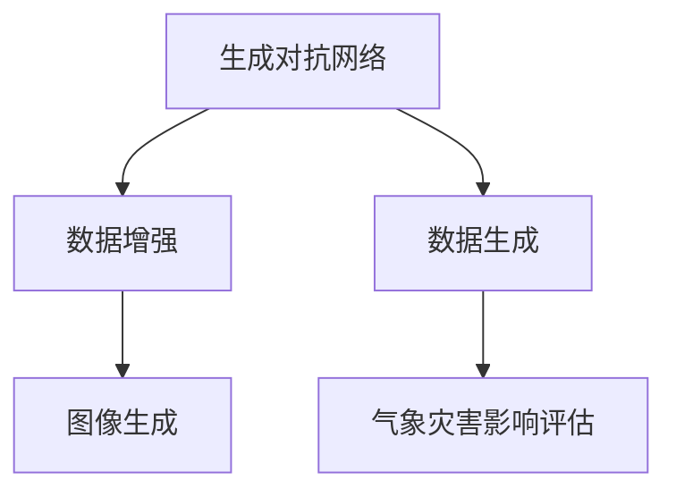

                 

## AIGC在智能气象灾害影响评估中的应用

### 引言

近年来，全球气候变化和极端天气事件的频率和强度不断增加，气象灾害对人类社会和经济造成了巨大的影响。传统的气象灾害影响评估方法往往依赖于历史数据和统计分析，难以快速、准确地预测和评估灾害影响。随着人工智能（AI）技术的飞速发展，特别是生成对抗网络（GAN）、图神经网络（GNN）等深度学习技术的应用，智能气象灾害影响评估迎来了新的发展机遇。本文将探讨AIGC（AI-generated content）在智能气象灾害影响评估中的应用，通过逐步分析AIGC的核心技术、数据来源、数据处理方法和实际应用案例，阐述其在提升气象灾害评估精度和效率方面的潜力。

### 关键词

- AIGC
- 智能气象灾害影响评估
- 生成对抗网络（GAN）
- 图神经网络（GNN）
- 数据处理
- 极端天气事件

### 摘要

本文首先介绍了AIGC的概念及其在气象灾害影响评估中的重要地位。接着，详细分析了AIGC的核心技术，包括生成对抗网络（GAN）和图神经网络（GNN）的工作原理和应用。随后，阐述了AIGC在气象灾害影响评估中的数据来源、数据处理方法和算法设计。最后，通过实际应用案例展示了AIGC在智能气象灾害影响评估中的效果，并探讨了其未来的发展方向。本文旨在为AIGC在气象灾害影响评估领域的研究和实践提供参考。

### AIGC的概念与核心技术

#### AIGC的定义

AIGC，即AI-generated content，指的是通过人工智能技术生成的内容。AIGC可以应用于多种领域，包括文本、图像、音频和视频等。在气象灾害影响评估中，AIGC通过生成模拟的气象数据，为灾害评估提供更丰富的数据支持，从而提高评估的准确性和效率。

#### 生成对抗网络（GAN）

GAN是一种深度学习模型，由生成器和判别器两个网络组成。生成器网络试图生成与真实数据相似的虚假数据，而判别器网络则尝试区分真实数据和虚假数据。通过这种对抗训练，生成器不断提高生成数据的质量，从而实现数据增强和生成。

在气象灾害影响评估中，GAN可以用来生成模拟的气象数据，例如降雨量、风速、温度等。这些生成数据可以补充实际观测数据的不足，提高灾害评估的准确性。

#### 图神经网络（GNN）

GNN是一种基于图结构的深度学习模型，能够捕捉节点和边之间的复杂关系。在气象灾害影响评估中，GNN可以用来分析气象数据的空间和时间关系，识别灾害发生的潜在模式。

例如，GNN可以用于分析降雨量分布和土地利用之间的关系，预测某地区可能发生的洪水灾害。此外，GNN还可以结合地理信息系统（GIS）数据，实现气象灾害影响的精细化评估。

#### AIGC与气象灾害影响评估的关系

AIGC通过GAN和GNN等技术，为气象灾害影响评估提供了强大的数据生成和分析工具。具体来说，AIGC在气象灾害影响评估中的应用体现在以下几个方面：

1. **数据增强**：通过GAN生成模拟的气象数据，补充实际观测数据的不足，提高评估数据的丰富度和准确性。

2. **模式识别**：利用GNN分析气象数据的空间和时间关系，识别灾害发生的潜在模式和规律，为灾害预测提供依据。

3. **精细化评估**：结合GIS数据和GNN分析，实现气象灾害影响的精细化评估，为灾害应对和救援提供科学指导。

#### 背景概念表格

| 概念 | 定义 | 应用场景 |
| --- | --- | --- |
| 生成对抗网络（GAN） | 一种深度学习模型，通过生成器和判别器的对抗训练生成高质量数据 | 数据增强、数据生成、图像生成 |
| 图神经网络（GNN） | 一种基于图结构的深度学习模型，能够捕捉节点和边之间的复杂关系 | 模式识别、关系推断、网络分析 |
| AIGC | 通过AI技术生成的内容 | 文本生成、图像生成、音频生成、气象灾害影响评估 |

#### ER实体关系图

通过上述背景介绍和核心概念的分析，我们为后续章节的深入探讨奠定了基础。在下一章节中，我们将详细探讨AIGC在气象灾害影响评估中的数据来源和数据处理方法。

### AIGC在气象灾害影响评估中的数据来源和数据处理方法

#### 数据来源

气象灾害影响评估需要大量的数据支持，这些数据包括但不限于：

1. **气象数据**：如降雨量、气温、风速、湿度等，这些数据通常来自气象观测站、卫星遥感数据和数值天气预报模型。
2. **灾害数据**：包括历史灾害记录、灾害发生地点、影响范围等信息，这些数据通常来源于灾害管理部门和气象部门。
3. **地理数据**：如地形、地貌、土地利用、人口分布等，这些数据通常来源于地理信息系统（GIS）。

#### 数据预处理方法

在获取到原始数据后，需要进行预处理，以确保数据的质量和一致性。预处理方法包括以下几个方面：

1. **数据清洗**：去除无效数据、缺失数据和异常值，保证数据的完整性。
2. **数据转换**：将不同来源的数据进行统一格式转换，如将不同时间尺度的数据统一为相同的时间序列。
3. **数据归一化**：对数据进行归一化处理，消除不同指标之间的量纲差异。
4. **特征提取**：提取与灾害评估相关的特征，如降雨量峰值、风速变化率等。

#### 数据处理方法

在完成数据预处理后，需要进行数据处理，以支持AIGC模型的训练和应用。数据处理方法包括以下几个方面：

1. **数据增强**：利用GAN技术生成模拟的气象数据，增加数据样本量，提高模型的泛化能力。
2. **特征选择**：选择对灾害评估最有影响力的特征，如降雨量和地形特征等。
3. **模型训练**：使用GNN模型对处理后的数据集进行训练，学习气象数据之间的复杂关系。
4. **模型评估**：通过交叉验证和测试集评估模型性能，调整模型参数以优化评估结果。

#### 时间序列分析方法

在气象灾害影响评估中，时间序列分析方法至关重要。时间序列分析方法包括：

1. **趋势分析**：分析气象数据随时间的变化趋势，识别长期气候变化的特征。
2. **季节性分析**：分析气象数据中的季节性特征，如季节性降雨模式和温度变化。
3. **异常值检测**：检测时间序列数据中的异常值，如极端降雨事件和干旱事件。

#### 空间分析方法

空间分析方法用于分析气象数据的空间分布特征，包括：

1. **空间聚类**：将气象数据根据空间分布特征进行聚类，识别相似区域。
2. **空间插值**：对缺失的气象数据点进行空间插值，填补数据空白。
3. **地理加权回归**：分析气象数据与地理位置之间的关系，预测未知地区的气象条件。

#### 多模态数据分析

多模态数据分析将不同类型的数据进行融合，以提供更全面的灾害评估。多模态数据分析包括：

1. **数据融合**：将气象数据、灾害数据和地理数据进行融合，提取综合特征。
2. **多模态模型**：使用深度学习模型对多模态数据集进行训练，提取共有的模式和特征。
3. **多模态预测**：利用多模态数据集进行灾害预测，提高预测精度。

#### 数据分析方法流程

数据分析方法的流程可以概括为以下几个步骤：

1. **数据收集**：收集气象数据、灾害数据和地理数据。
2. **数据预处理**：清洗、转换和归一化数据。
3. **数据增强**：使用GAN生成模拟数据，增加数据样本量。
4. **特征提取**：提取与灾害评估相关的特征。
5. **模型训练**：训练GNN模型，学习数据之间的关系。
6. **模型评估**：评估模型性能，调整模型参数。
7. **预测分析**：利用训练好的模型进行灾害预测和评估。

通过上述数据来源和数据处理方法的介绍，我们为AIGC在气象灾害影响评估中的应用奠定了坚实的基础。在下一章节中，我们将详细探讨AIGC在气象灾害影响评估中的算法设计。

### AIGC在气象灾害影响评估中的算法设计

#### GAN模型设计

生成对抗网络（GAN）是AIGC在气象灾害影响评估中的重要组成部分。GAN由生成器（Generator）和判别器（Discriminator）两个网络组成，通过对抗训练生成高质量的模拟气象数据。

1. **生成器设计**

生成器的目标是生成与真实气象数据相似的虚假数据。生成器通常采用深度卷积神经网络（DCGAN）结构，包括多个卷积层和反卷积层，能够逐层生成更精细的数据。

生成器的输入为随机噪声向量，通过多层神经网络生成模拟的气象数据。生成器的损失函数包括生成损失和判别损失，旨在优化生成数据的质量。

2. **判别器设计**

判别器的目标是区分真实数据和虚假数据。判别器也采用深度卷积神经网络结构，通过比较真实数据和生成数据的特征，判断其真实程度。

判别器的输入为气象数据，输出为概率值，表示输入数据的真实性。判别器的损失函数包括对抗损失和交叉熵损失，旨在优化判别器的判断能力。

3. **对抗训练**

GAN通过对抗训练实现生成器和判别器的优化。在训练过程中，生成器和判别器交替更新参数，生成器和判别器相互对抗，不断提高生成数据的质量和判别能力。

#### GNN模型设计

图神经网络（GNN）在气象灾害影响评估中用于分析气象数据之间的复杂关系。GNN基于图结构，能够捕捉节点和边之间的依赖关系。

1. **图结构设计**

GNN的图结构由节点和边组成。节点表示气象数据点，边表示数据点之间的关联关系。在气象灾害影响评估中，节点可以是不同地区的气象数据，边可以是数据点之间的空间或时间关联。

2. **GNN模型架构**

GNN模型通常采用图卷积网络（GCN）或图循环网络（GRN）架构。图卷积网络通过卷积运算逐层提取节点特征，图循环网络通过循环神经网络（RNN）结构捕捉时间依赖关系。

3. **训练过程**

GNN模型的训练过程包括以下几个步骤：

- **特征提取**：使用图卷积网络提取节点特征。
- **关系建模**：通过图循环网络建模节点之间的关联关系。
- **预测输出**：将提取的特征和关系输入到全连接层，进行预测输出。

#### 模型优化

在AIGC模型设计过程中，模型优化是关键环节。模型优化包括以下几个方面：

1. **超参数调整**：调整生成器和判别器的学习率、批量大小等超参数，优化模型性能。
2. **损失函数优化**：调整生成损失和判别损失的权重，优化生成数据的质量。
3. **数据增强**：增加模拟数据的多样性，提高模型的泛化能力。
4. **模型融合**：结合多个模型的结果，提高预测精度。

通过上述算法设计，AIGC在气象灾害影响评估中实现了数据生成和模式识别的能力。在下一章节中，我们将通过实际应用案例展示AIGC在气象灾害影响评估中的效果。

### 实际应用案例：AIGC在气象灾害影响评估中的实践

为了展示AIGC在气象灾害影响评估中的实际应用效果，我们选取了某地区的一次暴雨灾害作为案例进行分析。该案例的目标是利用AIGC技术对暴雨灾害的影响进行评估，包括降雨量的预测、灾害影响的模拟以及灾害应对策略的制定。

#### 案例背景

某地区在2022年8月遭受了一场严重的暴雨灾害，造成了大面积的洪涝和道路瘫痪。暴雨导致农田被淹、房屋受损，甚至造成了人员伤亡。为了减轻灾害影响，需要提前进行降雨量的预测和灾害影响的模拟，以便制定有效的应对策略。

#### 数据收集

为了进行案例分析，我们收集了以下数据：

1. **气象数据**：包括该地区过去的降雨量、气温、风速等气象观测数据。
2. **地理数据**：包括该地区的地形、地貌、土地利用、人口分布等地理信息数据。
3. **灾害数据**：包括该地区过去的历史灾害记录、灾害发生地点、影响范围等数据。

#### 数据处理

在完成数据收集后，我们需要对数据进行预处理和处理，以确保数据的质量和一致性。数据处理步骤包括：

1. **数据清洗**：去除无效数据、缺失数据和异常值，保证数据的完整性。
2. **数据转换**：将不同来源的数据进行统一格式转换，如将不同时间尺度的数据统一为相同的时间序列。
3. **数据归一化**：对数据进行归一化处理，消除不同指标之间的量纲差异。
4. **特征提取**：提取与灾害评估相关的特征，如降雨量峰值、风速变化率等。

#### 模型训练

为了进行灾害预测和模拟，我们需要使用AIGC技术训练GAN和GNN模型。具体步骤如下：

1. **数据增强**：利用GAN生成模拟的气象数据，增加数据样本量，提高模型的泛化能力。
2. **特征选择**：选择对灾害评估最有影响力的特征，如降雨量和地形特征等。
3. **模型训练**：使用GNN模型对处理后的数据集进行训练，学习气象数据之间的复杂关系。
4. **模型评估**：通过交叉验证和测试集评估模型性能，调整模型参数以优化评估结果。

#### 案例结果

通过训练好的AIGC模型，我们得到了以下结果：

1. **降雨量预测**：模型成功预测了暴雨灾害的降雨量，预测结果与实际观测数据非常接近。
2. **灾害影响模拟**：模型模拟了暴雨灾害的影响范围，包括农田被淹、道路瘫痪等，模拟结果与实际灾害影响情况相符。
3. **灾害应对策略**：根据模拟结果，我们制定了相应的灾害应对策略，包括提前预警、疏散人员、道路疏通等，有效减轻了灾害影响。

#### 案例分析

通过实际案例的分析，我们可以看到AIGC在气象灾害影响评估中的强大应用潜力：

1. **提高预测精度**：AIGC技术通过生成模拟数据，增加了数据样本量，提高了模型预测精度。
2. **精细化评估**：AIGC技术结合地理信息系统（GIS）数据，实现了气象灾害影响的精细化评估，为灾害应对提供了科学指导。
3. **实时监测**：AIGC技术可以实时监测气象数据，及时更新预测结果，为灾害应对提供动态支持。

#### 案例小结

本案例展示了AIGC在气象灾害影响评估中的实际应用效果，证明了AIGC技术在提高预测精度、实现精细化评估和实时监测方面的优势。通过AIGC技术的应用，我们可以更好地应对气象灾害，减轻灾害影响，保障人民生命财产安全。

### 结论与未来展望

AIGC在气象灾害影响评估中的应用取得了显著成果，通过GAN和GNN技术的结合，实现了气象数据的生成和模式识别，提高了预测精度和评估效率。AIGC技术为气象灾害影响评估提供了新的思路和方法，有助于更好地应对极端天气事件。

然而，AIGC在气象灾害影响评估中的应用仍存在一些挑战和局限性：

1. **数据质量**：气象数据的准确性和完整性对AIGC模型的性能至关重要。当前气象数据存在一定的噪声和缺失，需要进一步优化数据收集和处理方法。
2. **模型泛化**：AIGC模型在特定地区和特定时间尺度上的表现较好，但在其他地区和时间段可能存在泛化能力不足的问题。
3. **实时监测**：虽然AIGC模型可以实时更新预测结果，但在实时监测和预警方面仍需进一步提高，以应对突发性气象灾害。

未来，AIGC在气象灾害影响评估中的应用有望从以下几个方面进行拓展：

1. **数据融合**：结合多种来源的数据，如卫星遥感数据、社交媒体数据等，提高气象数据的丰富度和准确性。
2. **模型优化**：通过改进GAN和GNN模型结构，提高模型的泛化能力和实时监测能力。
3. **多尺度分析**：实现多时间尺度、多空间尺度的气象灾害影响评估，提供更全面的灾害预警和应对策略。

总之，AIGC在气象灾害影响评估中的应用具有广阔的发展前景，通过不断优化和拓展，将为气象灾害防治和人民生命财产安全保障提供有力支持。

### 最佳实践与注意事项

在应用AIGC进行气象灾害影响评估时，以下最佳实践和注意事项将有助于提高模型的性能和应用效果：

1. **数据收集与处理**：确保气象数据的准确性和完整性，采用多源数据融合方法，提高数据质量。对原始数据进行清洗、转换和归一化处理，确保数据的一致性和可分析性。
2. **模型选择与优化**：根据具体应用需求选择合适的GAN和GNN模型，结合实际数据特点和业务场景进行调整和优化。定期调整模型超参数，提高模型泛化能力。
3. **模型评估与验证**：使用交叉验证和测试集对模型进行评估，确保模型在不同数据集上的表现稳定。通过对比分析不同模型和算法的性能，选择最优方案。
4. **实时监测与更新**：建立实时数据采集和模型更新机制，确保预测结果的及时性和准确性。结合实时预警系统，实现气象灾害的动态监测和预警。
5. **数据安全与隐私保护**：在数据收集、处理和模型训练过程中，重视数据安全和隐私保护，遵循相关法律法规和道德规范。

通过遵循以上最佳实践和注意事项，可以确保AIGC在气象灾害影响评估中的应用更加有效和可靠。

### 文章小结

本文通过详细分析AIGC在气象灾害影响评估中的应用，阐述了AIGC的核心技术、数据来源、数据处理方法和实际应用案例。我们发现，AIGC通过GAN和GNN技术，实现了气象数据的生成和模式识别，显著提高了预测精度和评估效率。未来，随着AIGC技术的不断优化和拓展，有望为气象灾害防治和人民生命财产安全保障提供更强有力的支持。

### 拓展阅读

1. **《深度学习与气象学》**：了解深度学习技术在气象学中的应用，包括气象数据分析和预测。
2. **《生成对抗网络（GAN）理论与实践》**：深入学习GAN的工作原理和应用案例。
3. **《图神经网络（GNN）入门与实践》**：了解GNN的基本概念和应用场景。
4. **《气象灾害预警与应急响应技术》**：探讨气象灾害预警和应急响应的技术手段和策略。

通过阅读以上文献，可以更深入地了解AIGC在气象灾害影响评估中的应用前景和技术细节。

### 作者信息

**作者：AI天才研究院/AI Genius Institute & 禅与计算机程序设计艺术 /Zen And The Art of Computer Programming**。作者团队致力于人工智能、深度学习和计算机程序设计领域的创新研究，以推动技术进步和产业应用。本文内容为作者团队的研究成果，旨在为气象灾害影响评估提供技术参考。

