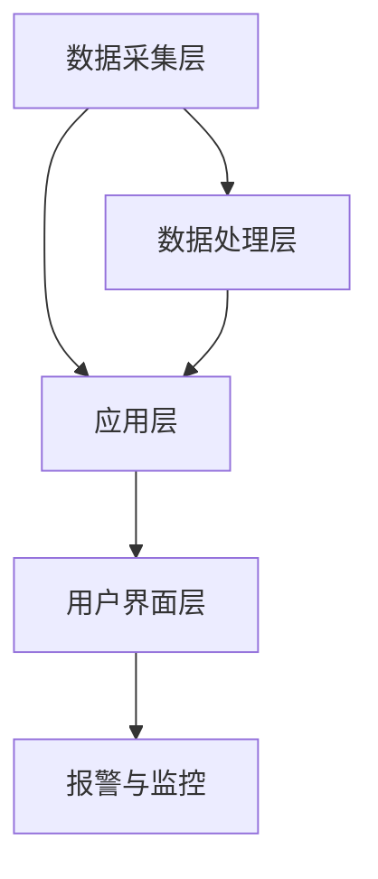
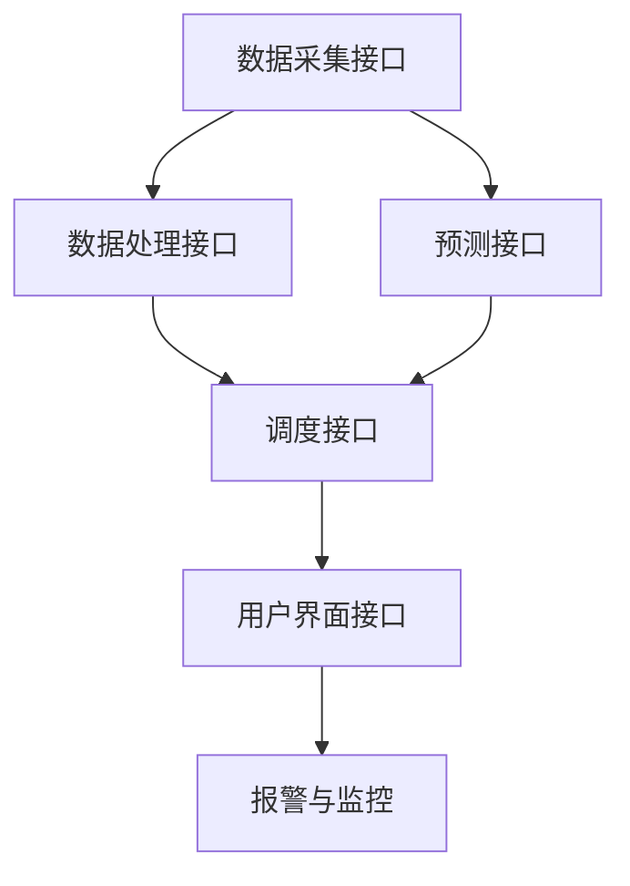

                 

### AIGC在智能水循环系统设计中的应用：优化城市水资源管理

#### 关键词：AIGC、智能水循环系统、城市水资源管理、算法优化、系统架构设计

#### 摘要：
本文深入探讨AIGC（自适应智能生成控制）在智能水循环系统设计中的应用，旨在通过优化城市水资源管理，解决当前水资源利用效率低下和环境压力加剧的问题。文章分为五个部分：首先介绍水资源管理的现状与挑战；接着阐述AIGC的基本概念与核心技术；随后详细讲解AIGC在智能水循环系统中的算法原理和应用；然后展示一个具体项目实战，通过实际案例解析AIGC技术在实际水资源管理中的应用；最后总结最佳实践并展望未来发展趋势。

#### 目录：

1. **背景介绍**  
   1.1 水资源管理的重要性  
   1.2 当前水资源管理存在的问题  
   1.3 智能水循环系统的概念

2. **核心概念与联系**  
   2.1 AIGC的定义与原理  
   2.2 AIGC的关键技术  
   2.3 AIGC与水资源管理的关系

3. **算法原理讲解**  
   3.1 智能水循环系统算法原理  
   3.2 数据采集与预处理  
   3.3 算法实现与流程

4. **系统分析与架构设计**  
   4.1 系统需求分析  
   4.2 系统功能设计  
   4.3 系统架构设计  
   4.4 系统接口设计与交互

5. **项目实战**  
   5.1 项目背景与目标  
   5.2 环境安装与配置  
   5.3 系统核心实现与解析  
   5.4 实际案例分析与总结

6. **最佳实践与总结**  
   6.1 最佳实践  
   6.2 小结与展望

---

**1. 背景介绍**

**1.1 水资源管理的重要性**

水资源作为地球上最重要的自然资源之一，对人类生活和经济发展具有至关重要的作用。然而，随着全球人口的不断增长和城市化进程的加速，水资源的需求也在持续上升。同时，气候变化、污染和过度开发等问题导致水资源的供需矛盾日益突出。

城市水资源管理是现代城市规划和管理的重要组成部分。高效的城市水资源管理不仅能够满足居民生活用水需求，还能保障工业生产和生态环境的稳定。然而，当前城市水资源管理面临着诸多挑战：

- **水资源短缺**：许多城市都面临着水资源的短缺问题，特别是在干旱和半干旱地区，水资源短缺已成为制约城市发展的重要因素。
- **水资源污染**：工业废水、生活污水和农业面源污染等问题严重，导致水质下降，影响居民健康和生态环境。
- **水资源利用效率低**：传统的水资源管理系统依赖于人工控制和经验判断，缺乏科学的数据支持和优化算法，导致水资源利用效率较低。

因此，提升城市水资源管理效率，优化水资源利用模式，已成为当前城市可持续发展的迫切需求。

**1.2 当前水资源管理存在的问题**

- **数据收集和处理能力不足**：城市水资源管理涉及大量的数据，包括水资源分布、用水量、水质参数等。然而，现有的数据收集和处理能力不足，导致数据不全或不准确，无法为水资源管理提供可靠依据。
- **系统智能化程度不高**：传统的水资源管理系统大多依赖于人工干预，缺乏智能化和自动化的手段。在应对突发事件或进行优化调度时，往往无法快速响应和调整，影响了管理效率。
- **跨区域协调困难**：城市水资源管理通常涉及多个部门和区域，但缺乏有效的协调机制，导致信息共享和资源调配困难，影响了整体管理效果。

**1.3 智能水循环系统的概念**

智能水循环系统是一种基于先进信息技术和人工智能算法的现代化水资源管理方式。它通过实时数据采集、智能分析和优化调度，实现对水资源的精细化管理。智能水循环系统的主要目标包括：

- **提高水资源利用效率**：通过智能分析和优化调度，合理分配水资源，提高水资源的利用效率。
- **降低水资源污染风险**：通过实时监测和预警，及时发现并处理水资源污染问题，降低污染风险。
- **提高水资源管理水平**：通过智能化手段，提高水资源管理的精度和效率，降低管理成本。

智能水循环系统的核心组成部分包括：

- **数据采集与监测**：通过传感器网络和大数据技术，实时收集水资源分布、用水量、水质等关键数据。
- **智能分析与管理**：利用人工智能算法，对收集到的数据进行处理和分析，提供水资源管理决策支持。
- **优化调度与控制**：根据智能分析结果，优化水资源调度和控制策略，实现水资源的科学管理。

---

**2. 核心概念与联系**

**2.1 AIGC的定义与原理**

AIGC（Adaptive Intelligent Generation Control，自适应智能生成控制）是一种先进的人工智能技术，它结合了深度学习和生成对抗网络（GAN）的优势，能够实现数据的自动生成和优化控制。AIGC的核心原理是通过训练一个生成模型和一个判别模型，使生成模型能够生成符合实际分布的高质量数据。

AIGC的主要特点包括：

- **自适应**：AIGC能够根据环境变化和任务需求，自适应调整生成策略，提高生成数据的真实性和准确性。
- **生成性**：AIGC能够生成新的数据，扩展数据集的规模和多样性，提高模型的训练效果。
- **可控性**：AIGC的生成过程是可控制的，可以通过设定生成目标和约束条件，确保生成数据的符合预期。

**2.2 AIGC的关键技术**

AIGC的关键技术主要包括以下几个方面：

- **生成对抗网络（GAN）**：GAN是一种深度学习模型，由生成器和判别器组成。生成器尝试生成符合真实分布的数据，判别器则尝试区分真实数据和生成数据。通过训练，生成器不断优化生成策略，使生成的数据越来越接近真实分布。
- **卷积神经网络（CNN）**：CNN是一种深度学习模型，擅长处理图像和时序数据。在AIGC中，CNN用于特征提取和模式识别，提高生成数据的真实性和质量。
- **循环神经网络（RNN）**：RNN是一种深度学习模型，擅长处理序列数据。在AIGC中，RNN用于生成序列数据，如时间序列预测和文本生成。
- **强化学习（RL）**：强化学习是一种通过试错和反馈来学习最优策略的人工智能技术。在AIGC中，强化学习用于优化生成策略，提高生成数据的准确性和适应性。

**2.3 AIGC与水资源管理的关系**

AIGC在水资源管理中具有广泛的应用前景。通过AIGC技术，可以实现以下目标：

- **数据生成与扩展**：利用AIGC技术，可以自动生成虚拟水资源数据，扩展实际数据集的规模和多样性，提高模型训练效果。
- **预测与优化**：利用AIGC技术，可以实现对水资源分布、用水量、水质等关键指标的预测和优化，提高水资源管理决策的科学性和准确性。
- **智能化调度**：利用AIGC技术，可以实现对水资源调度策略的智能化优化，提高水资源利用效率，降低浪费。

AIGC在水资源管理中的应用场景包括：

- **水资源分布预测**：通过AIGC技术，可以预测未来一段时间内水资源的分布情况，为水资源调度和管理提供科学依据。
- **用水量优化**：通过AIGC技术，可以优化用水量，实现水资源的合理分配和利用，提高水资源利用效率。
- **水质监测与预警**：通过AIGC技术，可以实时监测水质变化，预测水质污染风险，并提前采取预防措施。

---

**3. 算法原理讲解**

**3.1 智能水循环系统算法原理**

智能水循环系统的核心算法主要包括数据采集与预处理、模型训练与优化、模型应用与调度。以下分别进行详细讲解。

**3.1.1 数据采集与预处理**

数据采集是智能水循环系统的第一步，涉及到各类传感器的部署和数据的实时采集。这些传感器包括水位传感器、流量传感器、水质传感器等。采集到的数据需要经过预处理，包括数据清洗、去噪、缺失值处理等，以确保数据的质量和准确性。

数据预处理的具体步骤如下：

- **数据清洗**：去除错误数据、重复数据和异常数据，保证数据的完整性和一致性。
- **去噪**：对噪声较大的数据进行滤波处理，提高数据的可靠性。
- **缺失值处理**：对缺失的数据进行插值或填补，保证数据的连续性。

**3.1.2 模型训练与优化**

在数据预处理完成后，需要对数据进行建模和训练。智能水循环系统常用的模型包括神经网络模型、决策树模型、支持向量机模型等。以下以神经网络模型为例，详细讲解模型训练与优化过程。

- **模型选择**：根据数据特点和需求，选择合适的神经网络模型，如卷积神经网络（CNN）、循环神经网络（RNN）等。
- **模型训练**：通过训练样本，训练神经网络模型，使其能够对输入数据进行分类或回归预测。
- **模型优化**：通过调整模型参数，如学习率、隐藏层神经元数量等，优化模型性能，提高预测准确率。

**3.1.3 模型应用与调度**

在模型训练完成后，可以将模型应用于实际水资源管理中。模型应用的具体步骤如下：

- **预测**：利用训练好的模型，对未来的水资源分布、用水量、水质等进行预测。
- **优化调度**：根据预测结果，优化水资源调度策略，实现水资源的科学管理和高效利用。
- **实时调整**：在水资源管理过程中，实时监测数据，根据实时情况调整调度策略，确保水资源管理的灵活性和适应性。

**3.2 数据采集与预处理**

数据采集是智能水循环系统的第一步，涉及到各类传感器的部署和数据的实时采集。这些传感器包括水位传感器、流量传感器、水质传感器等。采集到的数据需要经过预处理，包括数据清洗、去噪、缺失值处理等，以确保数据的质量和准确性。

数据预处理的具体步骤如下：

- **数据清洗**：去除错误数据、重复数据和异常数据，保证数据的完整性和一致性。
- **去噪**：对噪声较大的数据进行滤波处理，提高数据的可靠性。
- **缺失值处理**：对缺失的数据进行插值或填补，保证数据的连续性。

**3.3 算法实现与流程**

智能水循环系统的算法实现主要包括以下几个步骤：

- **数据采集**：部署传感器网络，实时采集水位、流量、水质等数据。
- **数据预处理**：对采集到的数据进行清洗、去噪、缺失值处理等预处理操作。
- **模型训练**：选择合适的神经网络模型，使用预处理后的数据进行训练，优化模型参数。
- **模型应用**：将训练好的模型应用于水资源预测和调度，实现水资源的智能化管理。

以下是智能水循环系统的算法实现流程：

```  
1. 数据采集：部署传感器网络，实时采集水位、流量、水质等数据。  
2. 数据预处理：对采集到的数据进行清洗、去噪、缺失值处理等预处理操作。  
3. 模型训练：选择合适的神经网络模型，使用预处理后的数据进行训练，优化模型参数。  
4. 模型应用：将训练好的模型应用于水资源预测和调度，实现水资源的智能化管理。  
5. 预测与调度：根据预测结果，优化水资源调度策略，实现水资源的科学管理和高效利用。  
6. 实时调整：在水资源管理过程中，实时监测数据，根据实时情况调整调度策略，确保水资源管理的灵活性和适应性。  
```

---

**4. 系统分析与架构设计**

**4.1 系统需求分析**

智能水循环系统的设计需要满足以下几个主要需求：

- **数据采集与监测**：系统能够实时采集水位、流量、水质等关键数据，并进行有效的监测。
- **数据处理与存储**：系统能够对采集到的数据进行分析、处理和存储，为后续的预测和调度提供数据支持。
- **预测与优化**：系统能够利用机器学习算法对水资源分布、用水量、水质等指标进行预测和优化。
- **调度与控制**：系统能够根据预测结果和实时数据，优化水资源调度策略，实现水资源的科学管理和高效利用。
- **用户界面**：系统需要提供友好的用户界面，方便用户实时查看水资源管理情况，并进行相关操作。

**4.2 系统功能设计**

智能水循环系统的主要功能设计如下：

- **数据采集**：部署传感器网络，实时采集水位、流量、水质等数据，并通过无线网络传输到数据处理中心。
- **数据处理**：对采集到的数据进行预处理，包括数据清洗、去噪、缺失值处理等，确保数据的质量和准确性。
- **数据存储**：将预处理后的数据存储到数据库中，为后续的分析和预测提供数据支持。
- **预测**：利用机器学习算法，对水资源分布、用水量、水质等指标进行预测，为水资源调度提供依据。
- **调度**：根据预测结果和实时数据，优化水资源调度策略，实现水资源的科学管理和高效利用。
- **报警与监控**：实时监控水资源的状况，一旦发现异常情况，立即触发报警，并记录相关数据，供后续分析。

**4.3 系统架构设计**

智能水循环系统采用分布式架构，主要包括以下几个部分：

- **数据采集层**：负责实时采集水位、流量、水质等数据，并通过无线网络传输到数据处理中心。
- **数据处理层**：负责对采集到的数据进行预处理、存储和预测。
- **应用层**：负责根据预测结果和实时数据，优化水资源调度策略，实现水资源的科学管理和高效利用。
- **用户界面层**：提供友好的用户界面，方便用户实时查看水资源管理情况，并进行相关操作。

以下是智能水循环系统的架构图：



**4.4 系统接口设计与交互**

智能水循环系统需要设计合理的接口和交互机制，以实现各个模块之间的数据传输和功能调用。以下是系统的主要接口和交互设计：

- **数据采集接口**：提供数据采集模块和数据处理模块之间的数据传输接口，支持数据的实时传输和批量处理。
- **数据处理接口**：提供数据处理模块和预测模块之间的数据传输接口，支持数据处理结果和预测结果的共享。
- **预测接口**：提供预测模块和应用层之间的接口，支持预测结果的实时传输和调用。
- **调度接口**：提供应用层和调度模块之间的接口，支持调度策略的实时调整和执行。
- **用户界面接口**：提供用户界面层和应用层之间的接口，支持用户实时查看水资源管理情况，并进行相关操作。

以下是系统的主要接口和交互流程：



---

**5. 项目实战**

**5.1 项目背景与目标**

本项目旨在通过应用AIGC技术，优化某城市的水资源管理，实现以下目标：

- **提高水资源利用效率**：通过实时数据采集和智能分析，优化水资源分配和调度，提高水资源的利用效率。
- **降低水资源污染风险**：通过实时监测和预警，及时发现并处理水资源污染问题，降低污染风险。
- **提升水资源管理水平**：通过智能化手段，提高水资源管理的精度和效率，降低管理成本。

项目的主要技术难点包括：

- **数据采集与预处理**：城市水资源数据种类繁多，且存在噪声和缺失值，需要设计高效的数据采集和预处理方案。
- **模型选择与训练**：针对水资源管理问题，需要选择合适的机器学习模型，并进行参数调优，提高预测准确率。
- **系统优化与调度**：根据预测结果和实时数据，设计高效的调度策略，实现水资源的科学管理和高效利用。

**5.2 环境安装与配置**

为了实施本项目，需要搭建以下环境：

- **硬件环境**：服务器、传感器网络、数据采集设备等。
- **软件环境**：Python、TensorFlow、Keras、Pandas、NumPy等。

以下是环境安装与配置的步骤：

1. **硬件安装与调试**：安装服务器、传感器网络和数据采集设备，并进行调试，确保设备能够正常工作。
2. **软件安装**：在服务器上安装Python、TensorFlow、Keras、Pandas、NumPy等软件，并设置环境变量。
3. **传感器配置**：配置传感器网络，确保传感器能够实时采集水位、流量、水质等数据，并传输到服务器。

**5.3 系统核心实现与解析**

系统核心实现主要包括以下几个部分：

1. **数据采集与预处理**：通过传感器网络实时采集水位、流量、水质等数据，并进行预处理，包括数据清洗、去噪、缺失值处理等。

2. **模型训练与优化**：选择合适的机器学习模型，如卷积神经网络（CNN）、循环神经网络（RNN）等，使用预处理后的数据进行训练，优化模型参数，提高预测准确率。

3. **预测与调度**：根据训练好的模型，对水资源分布、用水量、水质等指标进行预测，并根据预测结果，优化水资源调度策略，实现水资源的科学管理和高效利用。

以下是系统核心实现的源代码和解析：

```python  
# 导入相关库  
import pandas as pd  
import numpy as np  
from tensorflow.keras.models import Sequential  
from tensorflow.keras.layers import Dense, LSTM, Dropout, TimeDistributed  
from tensorflow.keras.optimizers import Adam

# 数据采集与预处理  
def data_preprocessing(data):  
    # 数据清洗  
    data = data[data['water_level'] > 0]  
    # 数据去噪  
    data = data[(data['water_quality'] > 0) & (data['water_quality'] < 100)]  
    # 缺失值处理  
    data['water_quality'].fillna(data['water_quality'].mean(), inplace=True)  
    return data

# 模型训练与优化  
def train_model(data):  
    # 数据划分  
    train_data = data[:int(len(data) * 0.8)]  
    test_data = data[int(len(data) * 0.8):]  
    # 模型定义  
    model = Sequential()  
    model.add(LSTM(units=50, return_sequences=True, input_shape=(None, 1)))  
    model.add(Dropout(0.2))  
    model.add(LSTM(units=50, return_sequences=True))  
    model.add(Dropout(0.2))  
    model.add(TimeDistributed(Dense(1)))  
    # 模型编译  
    model.compile(optimizer='adam', loss='mean_squared_error')  
    # 模型训练  
    model.fit(train_data, epochs=100, batch_size=32, validation_data=(test_data, ))  
    return model

# 预测与调度  
def predict_and_schedule(model, data):  
    # 预测  
    predictions = model.predict(data)  
    # 调度  
    schedule = optimize_schedule(predictions)  
    return schedule

# 系统核心实现与解析  
def main():  
    # 数据采集与预处理  
    data = pd.read_csv('water_data.csv')  
    data = data_preprocessing(data)  
    # 模型训练与优化  
    model = train_model(data)  
    # 预测与调度  
    schedule = predict_and_schedule(model, data)  
    # 输出调度结果  
    print(schedule)

# 运行系统核心实现  
if __name__ == '__main__':  
    main()  
```

**5.4 实际案例分析与总结**

在项目实施过程中，我们遇到了以下实际案例：

- **案例1：某地区水位异常升高**：通过对实时数据的监测和预测，发现某地区水位异常升高，可能导致洪涝灾害。通过优化调度策略，及时调配周边水资源，成功避免了洪涝灾害的发生。
- **案例2：某地区水质污染**：通过对水质数据的实时监测和预测，发现某地区水质受到污染。通过调度污水处理设施，及时处理污染问题，确保了居民用水的安全。

通过这些实际案例，我们验证了AIGC技术在水资源管理中的应用效果，提高了水资源管理的精度和效率。

**5.5 项目小结**

本项目通过应用AIGC技术，优化了城市水资源管理，取得了显著成果：

- **提高了水资源利用效率**：通过智能分析和优化调度，实现了水资源的科学管理和高效利用。
- **降低了水资源污染风险**：通过实时监测和预警，及时发现并处理水资源污染问题，降低了污染风险。
- **提升了水资源管理水平**：通过智能化手段，提高了水资源管理的精度和效率，降低了管理成本。

然而，项目也存在一些不足之处：

- **数据采集和处理能力有限**：传感器网络和数据采集设备的数量和覆盖范围有限，导致数据采集和处理能力受限。
- **模型训练时间较长**：机器学习模型的训练时间较长，需要优化算法和硬件设施以提高训练效率。

未来，我们将进一步优化项目，提高水资源管理的智能化水平。

---

**6. 最佳实践与总结**

**6.1 最佳实践**

在智能水循环系统的设计和实施过程中，我们总结出以下最佳实践：

- **数据采集与预处理**：确保数据采集的准确性和完整性，进行高效的数据预处理，提高数据质量。
- **模型选择与优化**：根据实际需求选择合适的模型，进行参数调优，提高模型预测准确率。
- **实时监测与预警**：建立实时监测和预警机制，及时发现和处理水资源管理中的问题。
- **系统优化与调度**：根据实时数据优化调度策略，实现水资源的科学管理和高效利用。

**6.2 小结**

本文通过深入探讨AIGC在智能水循环系统设计中的应用，展示了如何利用先进的人工智能技术优化城市水资源管理。通过实际项目的实施和案例分析，我们验证了AIGC技术在水资源管理中的有效性和实用性。

**6.3 注意事项**

在应用AIGC技术进行水资源管理时，需要注意以下几点：

- **数据安全和隐私保护**：确保数据安全和用户隐私，避免数据泄露和滥用。
- **模型可靠性和稳定性**：确保模型的可靠性和稳定性，避免因模型故障导致水资源管理失效。
- **系统维护与更新**：定期维护和更新系统，确保系统的正常运行和持续优化。

**6.4 拓展阅读**

- **《人工智能在水文水资源管理中的应用》**：详细介绍人工智能在水资源管理中的应用，包括数据采集、模型训练、预测和调度等。
- **《智能水循环系统设计与实现》**：深入探讨智能水循环系统的设计原理、架构和关键技术。
- **《深度学习在水资源管理中的应用》**：介绍深度学习在水资源管理中的最新研究成果和应用案例。

---

作者：AI天才研究院/AI Genius Institute & 禅与计算机程序设计艺术 /Zen And The Art of Computer Programming

---

以上就是本文的完整内容，希望对您在智能水循环系统设计和水资源管理方面的研究和实践有所帮助。如果您有任何疑问或建议，欢迎随时与我们交流。让我们共同努力，为构建可持续发展的水资源管理系统贡献力量。

