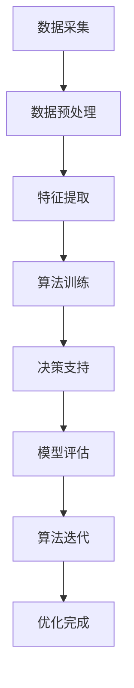
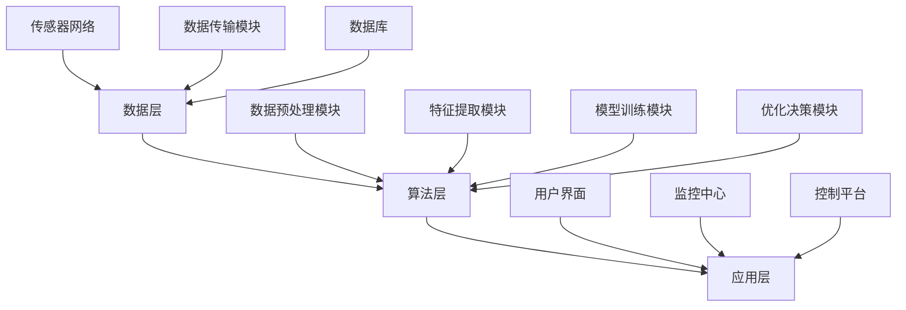

                 

### 第一部分：背景与问题阐述

#### 第1章：全球水危机背景与水资源现状

##### 1.1.1 全球水危机概述

水资源作为地球上最宝贵的资源之一，对于人类社会的生存和发展具有重要意义。然而，随着全球人口的不断增长和经济活动的迅速发展，水资源短缺和水污染问题日益严重，全球水危机已成为一个迫在眉睫的问题。根据联合国的数据，目前全球约有28%的人口生活在面临水资源短缺的地区，这一比例预计将在未来的几十年内进一步上升。

全球水危机的成因主要包括以下几个方面：

1. **人口增长**：全球人口从20世纪中叶的25亿增长到当前的近80亿，人口增长导致了水资源的过度开采和污染。
2. **工业化和城市化**：工业活动排放的废水、废气和固体废物，以及城市化过程中的土地开发和水资源利用方式，都加剧了水资源的污染和短缺。
3. **气候变化**：全球气候变暖导致极端天气事件增多，如干旱、洪水等，进一步加剧了水资源的分布不均衡和供需矛盾。
4. **水资源管理不善**：许多国家和地区在水资源管理方面存在严重的漏洞，包括水资源规划不足、水资源分配不合理、水资源利用效率低下等。

##### 1.1.2 水资源短缺与污染现状

水资源短缺和水污染是全球水危机的两个主要方面，它们对人类健康、农业、工业和生态系统产生了深远的影响。

1. **水资源短缺**：根据联合国的数据，目前全球约有35%的人口生活在面临严重水资源短缺的地区。水资源短缺不仅导致了饮用水和灌溉用水的不足，还影响了工业生产和能源供应。

2. **水污染**：工业废水、农业径流和生活污水等都是水污染的主要来源。水污染导致了大量水体无法直接利用，影响了饮用水的安全，对生态系统和人类健康造成了严重威胁。

水污染的主要类型包括：

- **化学污染**：工业废水和农药、化肥等农业化学品的使用导致了水体中的化学物质浓度升高。
- **生物污染**：生活污水和畜禽养殖废水等生物污染源会导致水体富营养化，引发藻类爆发和水质恶化。
- **放射性污染**：核电站事故、地下水和地表水的放射性污染等都是严重的威胁。

##### 1.1.3 全球水危机的影响与挑战

全球水危机对人类社会和自然环境造成了多方面的负面影响：

1. **健康影响**：水资源短缺和水污染直接影响了人们的健康，特别是饮用水安全问题。水污染可能导致疾病传播，如霍乱、痢疾等，对公共卫生构成了严重威胁。

2. **农业生产**：水资源短缺和污染影响了农业灌溉用水的供应和质量，导致粮食产量减少，价格波动，进一步影响粮食安全和农村经济发展。

3. **工业生产**：水资源的短缺和污染对工业生产造成了限制，影响了工业发展的可持续性和竞争力。

4. **生态系统破坏**：水资源的短缺和污染破坏了自然生态系统，导致生物多样性减少，生态平衡被破坏。

5. **社会稳定**：水资源的短缺和污染引发了社会冲突和矛盾，加剧了社会不稳定性。

面对全球水危机，我们必须采取有效措施，通过技术创新和管理改革来应对挑战。智能水资源循环系统作为一项新兴的技术解决方案，具有巨大的潜力，能够优化水资源的利用效率，减少水污染，缓解水资源短缺问题。在接下来的章节中，我们将深入探讨智能水资源循环系统的概念、优势和AIGC技术在其中的应用前景。

### 1.2 水资源循环系统概述

#### 1.2.1 水资源循环基本原理

水资源循环，亦称水循环，是自然界中水分子通过蒸发、凝结、降水、渗透和径流等过程，在水圈、大气圈、生物圈和地表岩石圈之间不断循环的过程。这一过程是地球生态系统的重要组成部分，也是人类生存和发展的重要基础。

水资源循环的基本过程包括以下步骤：

1. **蒸发**：地表水、土壤和植物表面的水分通过太阳辐射的热能转化为水蒸气，进入大气圈。
2. **凝结**：水蒸气在大气中上升时，由于温度降低，会凝结成云滴。
3. **降水**：当云滴变大到一定程度时，因重力作用降落到地面，形成降水，包括雨、雪、雾、露等形式。
4. **径流**：降落到地面的水分，一部分渗透进入土壤和岩石层，成为地下水；另一部分则在地表形成径流，流入河流、湖泊和海洋。
5. **地下水流**：地下水通过地下径流逐渐汇集，形成地下水层，并补给地表水源。
6. **植物蒸腾**：植物通过根部吸收土壤中的水分，通过叶面的气孔释放出水蒸气，参与大气中的水分循环。

水资源循环是一个动态的、连续的过程，各个环节相互影响、相互制约，共同维持地球水资源的动态平衡。

#### 1.2.2 水资源循环系统组成部分

水资源循环系统由多个相互关联的部分组成，主要包括：

1. **水圈**：水圈是地球外部连续但不规则的水层，包括地表水（河流、湖泊、冰川、地下水等）和大气中的水分。
2. **大气圈**：大气圈中的水分通过蒸发、凝结和降水等过程参与水资源循环。
3. **生物圈**：生物圈中的植物、动物和微生物通过生命活动影响水循环过程，如植物的蒸腾作用和土壤的水分保持。
4. **岩石圈**：岩石圈通过渗透、地下径流和地质作用参与水循环。

水资源循环系统的主要功能包括：

- **水分补给**：通过降水和地下水补给地表水源，维持水资源的供应。
- **水分循环**：通过蒸发、凝结和降水等过程，实现水分子在地球各圈层之间的循环。
- **水分调节**：通过植被、土壤和地质结构的作用，调节地表水和地下水的分布，减缓洪水和干旱的影响。

#### 1.2.3 水资源循环系统的作用与意义

水资源循环系统在地球生态系统和人类社会中的作用和意义不可忽视：

1. **生态功能**：水资源循环系统维持了地球生态平衡，促进了生物多样性的维持和生态系统的健康。通过水循环，土壤保持肥力，植被得到滋润，生物栖息地得到保障。
2. **经济功能**：水资源是农业生产、工业生产和城市生活的重要基础，水资源循环系统的效率和稳定性直接关系到经济发展和人民生活。
3. **社会功能**：水资源循环系统保障了人类饮用水的安全，满足了农业灌溉、工业生产和城市用水需求，对社会的稳定和发展具有重要作用。

然而，由于全球水危机的严峻形势，水资源循环系统面临诸多挑战，包括水资源短缺、水污染和气候变化等。因此，通过技术创新和管理改革，优化水资源循环系统，提高水资源的利用效率，是应对全球水危机的重要途径。

在接下来的章节中，我们将进一步探讨智能水资源循环系统的提出背景、概念及其在水资源管理中的优势。

### 1.3 智能水资源循环系统的提出

#### 1.3.1 传统水资源管理模式的局限

传统水资源管理模式主要依赖于物理基础设施和技术手段，如水库、灌溉系统和污水处理厂等。然而，随着全球水危机的加剧，这种模式逐渐暴露出许多局限和问题：

1. **资源利用率低**：传统水资源管理模式普遍存在水资源利用效率低下的问题。水资源的分配和利用缺乏精细化管理和优化，导致大量水资源被浪费。
2. **管理手段落后**：传统水资源管理模式依赖人工监测和经验判断，缺乏实时监控和智能分析，难以适应复杂多变的用水需求和水环境变化。
3. **监测与响应迟缓**：传统水资源管理往往无法及时监测到水资源状况的变化，导致在应对突发事件（如洪水、干旱）时反应迟缓，难以有效应对。
4. **可持续性不足**：传统水资源管理模式侧重于短期经济效益，忽视了水资源的长期可持续利用，导致水资源退化、生态系统破坏等问题。

#### 1.3.2 智能水资源循环系统的概念

智能水资源循环系统是一种基于先进信息技术和人工智能算法的新型水资源管理模式。它通过实时监测、数据分析和智能决策，优化水资源分配和利用，提高水资源的利用效率和可持续性。智能水资源循环系统的核心目标是实现水资源的全面监控、科学管理和智能调控，以应对全球水危机的挑战。

智能水资源循环系统的关键组成部分包括：

1. **传感器网络**：部署在各种水资源节点上的传感器，用于实时监测水位、水质、流量等参数。
2. **数据采集与处理**：通过物联网技术，将传感器数据传输至中央处理系统，进行数据清洗、存储和处理。
3. **智能分析平台**：利用人工智能算法，对海量数据进行分析和挖掘，为水资源管理提供决策支持。
4. **智能决策系统**：基于分析结果，智能决策系统自动生成水资源优化方案，包括调配、调度和应急预案等。

#### 1.3.3 智能水资源循环系统的优势

智能水资源循环系统相比传统水资源管理模式具有显著的优势：

1. **高效资源利用**：通过实时监控和数据智能分析，智能水资源循环系统能够优化水资源的分配和利用，最大限度地减少浪费。
2. **智能决策支持**：利用人工智能算法，智能水资源循环系统可以自动生成科学合理的调水方案，提高水资源管理的精度和效率。
3. **灵活响应**：智能水资源循环系统能够迅速响应水资源状况的变化，及时调整水资源调配和利用策略，应对突发事件。
4. **提升可持续性**：智能水资源循环系统注重长期水资源管理和生态保护，有助于实现水资源的可持续利用，减少生态环境破坏。

智能水资源循环系统的提出，为应对全球水危机提供了一条技术和管理创新的新途径。在接下来的章节中，我们将进一步探讨AIGC技术在智能水资源循环系统中的应用前景。

### 1.4 AIGC技术在水资源循环中的应用前景

#### 1.4.1 AIGC技术的定义与发展

AIGC（AI-Generated Content）技术，即人工智能生成内容技术，是一种利用人工智能算法，特别是深度学习模型，自动生成文本、图像、音频等多种类型内容的技术。AIGC技术主要包括生成对抗网络（GAN）、变分自编码器（VAE）和自注意力机制与Transformer模型等核心算法。近年来，随着计算能力的提升和数据量的增加，AIGC技术得到了快速发展，并在多个领域展现出了强大的应用潜力。

AIGC技术的发展历程可以概括为以下几个阶段：

1. **初步探索阶段（2014年以前）**：在这一阶段，深度学习技术取得了重要突破，神经网络模型在图像生成、自然语言处理等领域展现出了卓越的性能。
2. **快速发展阶段（2014-2019年）**：生成对抗网络（GAN）的提出标志着AIGC技术的崛起，GAN通过生成器和判别器的对抗训练，实现了高质量图像和文本的生成。
3. **应用拓展阶段（2019年至今）**：随着变分自编码器（VAE）和自注意力机制与Transformer模型等新算法的出现，AIGC技术的应用范围进一步拓展，从图像、音频到文本，AIGC技术不断突破边界，展现出广泛的应用前景。

#### 1.4.2 AIGC技术在水资源循环中的应用领域

AIGC技术在水资源循环中的应用具有广阔的前景，其主要应用领域包括水资源监测、水资源调度、水资源污染预测和水资源管理优化等方面。

1. **水资源监测**：AIGC技术可以通过生成高质量的遥感图像和文本报告，实现水资源的实时监测。例如，GAN可以生成高分辨率的卫星图像，用于监测河流、湖泊的水位和水质状况；VAE可以生成实时更新的水资源报告，为水资源管理提供精准的数据支持。
   
2. **水资源调度**：AIGC技术可以帮助智能水资源循环系统实现水资源的智能调度。通过自注意力机制和Transformer模型，AIGC技术可以对历史和实时水资源数据进行分析，生成最优的水资源调配方案。例如，利用Transformer模型，可以分析不同水源的水质和水量数据，预测未来一段时间内水资源的供需情况，从而实现水资源的智能调配。

3. **水资源污染预测**：AIGC技术可以用于预测水资源污染事件，提前采取预防措施。通过训练生成对抗网络（GAN），可以将正常的水质数据和污染数据区分开来，从而预测潜在的水污染事件。例如，GAN可以生成模拟污染事件的水质数据，用于训练和优化污染预测模型，提高预测的准确性和可靠性。

4. **水资源管理优化**：AIGC技术可以通过数据分析和挖掘，优化水资源的管理策略。利用变分自编码器（VAE）和自注意力机制，AIGC技术可以从海量数据中提取关键信息，识别水资源管理的瓶颈和优化方向。例如，VAE可以分析不同水源的利用情况，识别出高能耗、低效益的用水行为，为水资源管理提供优化建议。

#### 1.4.3 AIGC技术在水资源管理中的潜力与挑战

尽管AIGC技术在水资源管理中展现出了巨大的潜力，但其应用仍面临一些挑战：

1. **数据质量和数量**：AIGC技术的性能高度依赖于数据的质量和数量。在水资源管理中，数据可能存在噪声、缺失和不一致性等问题，这会影响AIGC技术的效果和可靠性。
2. **算法复杂性**：AIGC技术涉及的算法复杂，计算资源需求高。在实际应用中，如何优化算法、降低计算成本是重要的挑战。
3. **法律法规与伦理**：在水资源管理中，数据的隐私保护和法律法规遵守是一个重要问题。如何平衡技术发展和数据隐私保护，确保AIGC技术的合法合规应用，是亟待解决的问题。
4. **集成与兼容**：智能水资源循环系统通常涉及多种技术和设备，如何实现AIGC技术与现有系统的集成和兼容，确保系统的稳定性和高效性，是应用AIGC技术的重要挑战。

总的来说，AIGC技术在水资源管理中的应用前景广阔，但其成功应用需要克服多个方面的挑战。在未来的发展中，我们需要继续探索和优化AIGC技术，结合水资源管理的实际需求，实现高效、智能、可持续的水资源管理。

### 1.5 本章小结

本章从全球水危机的背景与现状、水资源循环系统的基本原理和组成部分、智能水资源循环系统的提出，以及AIGC技术在水资源循环中的应用前景等方面，详细阐述了智能水资源循环系统的必要性和重要性。首先，我们分析了全球水危机的成因及其影响，强调了水资源短缺和水污染问题的严重性。接着，我们介绍了水资源循环系统的基本原理和组成部分，阐明了水资源循环系统在地球生态系统和人类社会中的重要作用。在此基础上，提出了智能水资源循环系统，分析了传统水资源管理模式的局限，并阐述了智能水资源循环系统的概念、优势和其在水资源管理中的潜力。通过本章的讨论，我们可以看到，智能水资源循环系统是应对全球水危机的重要技术手段，具有广阔的应用前景。

### 第二部分：AIGC技术原理与应用

#### 第2章：AIGC技术基础

#### 2.1.1 AIGC技术的发展背景

AIGC（AI-Generated Content）技术的起源可以追溯到深度学习技术的发展历程。深度学习是一种基于人工神经网络的机器学习技术，其核心思想是通过多层神经网络的训练，自动提取和表示数据中的复杂特征，从而实现自动化的数据处理和模式识别。AIGC技术正是在这一背景下逐步发展起来的。

AIGC技术的主要发展历程可以概括为以下几个阶段：

1. **初步探索阶段（2006年以前）**：在这一阶段，人工神经网络和机器学习技术逐渐成熟，深度学习的概念开始被提出。然而，由于计算资源和数据量的限制，深度学习的应用范围相对较小。

2. **突破阶段（2012年）**：2012年，AlexNet在ImageNet图像识别大赛中取得了突破性的成绩，深度学习技术得到了广泛关注。这一阶段，深度学习算法的性能显著提升，为AIGC技术的发展奠定了基础。

3. **快速发展阶段（2014-2019年）**：生成对抗网络（GAN）的提出标志着AIGC技术的崛起。GAN通过生成器和判别器的对抗训练，实现了高质量图像和文本的生成，引起了广泛关注和应用。

4. **应用拓展阶段（2019年至今）**：随着变分自编码器（VAE）和自注意力机制与Transformer模型等新算法的出现，AIGC技术的应用范围进一步拓展，从图像、音频到文本，AIGC技术不断突破边界，展现出广泛的应用前景。

AIGC技术的发展不仅受到深度学习技术的推动，还受益于大数据、云计算和物联网等新兴技术的进步。这些技术的快速发展为AIGC技术提供了丰富的数据资源和强大的计算支持，使其在各个领域得到了广泛应用。

#### 2.1.2 AIGC技术的核心组成

AIGC技术的核心组成主要包括生成对抗网络（GAN）、变分自编码器（VAE）和自注意力机制与Transformer模型等。这些算法在AIGC技术中扮演着不同的角色，共同构成了AIGC技术的基础。

1. **生成对抗网络（GAN）**：

生成对抗网络（GAN）是由生成器和判别器组成的对抗性神经网络。生成器的任务是生成与真实数据相似的数据，判别器的任务是区分真实数据和生成数据。通过生成器和判别器的对抗训练，GAN可以不断提高生成数据的质量，达到以假乱真的效果。

GAN的核心组成部分包括：

- **生成器（Generator）**：生成器的目的是生成与真实数据相似的数据。在图像生成任务中，生成器通常将随机噪声映射为高质量的图像。
- **判别器（Discriminator）**：判别器的任务是判断输入数据是真实数据还是生成数据。判别器通过对输入数据的分类，提高生成数据的真实感。
- **对抗训练（Adversarial Training）**：生成器和判别器通过对抗训练相互竞争，生成器试图欺骗判别器，使判别器无法区分真实数据和生成数据，而判别器则努力识别生成数据，防止生成器欺骗。

2. **变分自编码器（VAE）**：

变分自编码器（VAE）是一种基于概率模型的生成模型，旨在学习数据的高效表示。VAE通过引入概率分布，使得生成过程具有鲁棒性和多样性。

VAE的核心组成部分包括：

- **编码器（Encoder）**：编码器的目的是将输入数据映射到一个潜在空间中的概率分布。编码器通常由多层全连接神经网络组成。
- **解码器（Decoder）**：解码器的目的是从潜在空间中生成原始数据。解码器通常也是一个多层全连接神经网络，其输入是潜在空间中的概率分布。
- **潜在空间（Latent Space）**：潜在空间是VAE的核心，它是一个低维的概率分布空间，能够表示输入数据的特征。通过潜在空间，VAE实现了数据的降维和表示。

3. **自注意力机制与Transformer模型**：

自注意力机制与Transformer模型是近年来在自然语言处理领域取得突破性成果的算法。自注意力机制通过计算输入序列中各个位置之间的依赖关系，实现了长距离的依赖建模。Transformer模型是基于自注意力机制的编码器-解码器架构，其在机器翻译、文本生成等任务中展现了出色的性能。

Transformer模型的核心组成部分包括：

- **多头自注意力（Multi-Head Self-Attention）**：多头自注意力机制通过多个独立的自注意力模块，捕获输入序列中的不同依赖关系，提高了模型的表示能力。
- **前馈神经网络（Feed-Forward Neural Network）**：前馈神经网络在自注意力机制之后进行，用于进一步增强模型的表示能力。
- **编码器-解码器架构（Encoder-Decoder Architecture）**：编码器负责将输入序列编码为固定长度的向量表示，解码器则根据编码器的输出生成输出序列。

通过以上核心组成部分，AIGC技术实现了从数据生成、特征提取到序列建模的全面应用。在接下来的章节中，我们将深入探讨这些算法的工作原理和应用案例，进一步了解AIGC技术的强大功能。

#### 2.1.3 AIGC技术的工作原理

AIGC（AI-Generated Content）技术的工作原理主要基于生成对抗网络（GAN）、变分自编码器（VAE）和自注意力机制与Transformer模型等核心算法。这些算法通过复杂的神经网络结构和数据训练过程，实现了自动生成高质量的内容。以下将详细讲解AIGC技术的工作原理。

##### 生成对抗网络（GAN）的工作原理

生成对抗网络（GAN）由生成器和判别器两个主要部分组成，通过对抗训练实现数据的生成。

1. **生成器**：
   - **输入**：生成器接收一个随机噪声向量作为输入。
   - **输出**：通过多层神经网络，生成器将噪声向量转换为数据样本，例如图像或文本。
   - **训练过程**：在训练过程中，生成器的目标是生成尽可能真实的数据样本，使其接近真实数据。

2. **判别器**：
   - **输入**：判别器接收真实数据和生成数据作为输入。
   - **输出**：判别器通过多层神经网络，对输入数据进行分类，判断其是真实数据还是生成数据。
   - **训练过程**：在训练过程中，判别器的目标是提高对真实数据和生成数据的区分能力。

3. **对抗训练**：
   - **循环过程**：生成器和判别器通过一个循环过程相互对抗。生成器不断尝试生成更真实的数据样本，而判别器则不断努力区分真实数据和生成数据。
   - **损失函数**：生成器和判别器的训练目标通过损失函数进行评估。生成器的损失函数旨在减少判别器对生成数据的识别准确性，而判别器的损失函数则旨在提高对生成数据的识别准确性。
   - **训练目标**：通过这种对抗训练，生成器逐渐学习到如何生成逼真的数据样本，而判别器则逐渐能够准确地区分真实数据和生成数据。

##### 变分自编码器（VAE）的工作原理

变分自编码器（VAE）是一种基于概率模型的生成模型，通过编码器和解码器将数据映射到潜在空间，并从潜在空间生成新的数据。

1. **编码器**：
   - **输入**：编码器接收输入数据。
   - **输出**：编码器将输入数据映射到一个潜在空间中的概率分布，这个概率分布通常由一个均值和一个标准差表示。
   - **训练过程**：在训练过程中，编码器学习将输入数据映射到一个有效的潜在空间中，使得潜在空间中的数据分布能够捕捉输入数据的特征。

2. **解码器**：
   - **输入**：解码器接收潜在空间中的概率分布。
   - **输出**：解码器从潜在空间中生成新的数据样本。
   - **训练过程**：在训练过程中，解码器学习如何从潜在空间中生成与输入数据相似的数据样本。

3. **潜在空间**：
   - **特性**：潜在空间是一个低维的概率分布空间，能够捕捉输入数据的高层特征。通过潜在空间，VAE实现了数据的降维和表示。
   - **训练目标**：编码器和解码器的训练目标是通过最小化生成数据与真实数据之间的差异，使得生成的数据尽可能接近真实数据。

##### 自注意力机制与Transformer模型的工作原理

自注意力机制与Transformer模型是近年来在自然语言处理领域取得突破性成果的算法，其核心思想是通过计算输入序列中各个位置之间的依赖关系，实现长距离的依赖建模。

1. **多头自注意力**：
   - **输入**：每个输入向量通过多个独立的自注意力模块进行处理。
   - **输出**：多头自注意力通过计算输入序列中不同位置之间的依赖关系，为每个位置生成多个注意力得分，从而实现对输入数据的细粒度表示。
   - **训练过程**：在训练过程中，多头自注意力学习如何为输入序列中的每个位置分配注意力权重，提高模型的表示能力。

2. **前馈神经网络**：
   - **输入**：前馈神经网络接收多头自注意力模块的输出。
   - **输出**：通过多层前馈神经网络，进一步增强模型的表示能力。
   - **训练过程**：在训练过程中，前馈神经网络学习如何从多头自注意力模块的输出中提取有效的特征信息。

3. **编码器-解码器架构**：
   - **编码器**：编码器负责将输入序列编码为固定长度的向量表示，这个向量表示包含了输入序列的语义信息。
   - **解码器**：解码器根据编码器的输出生成输出序列，例如文本或翻译结果。
   - **训练过程**：在训练过程中，编码器和解码器通过端到端训练，学习如何从输入序列中生成输出序列，从而实现序列建模。

通过以上详细讲解，我们可以看到AIGC技术通过生成对抗网络、变分自编码器和自注意力机制与Transformer模型等核心算法，实现了自动生成高质量内容。这些算法的工作原理相互交织，共同构成了AIGC技术的强大功能，为各个领域提供了丰富的应用可能性。

### 2.2 AIGC的关键算法

#### 2.2.1 生成对抗网络（GAN）

生成对抗网络（GAN）是由Ian Goodfellow等人于2014年提出的一种深度学习框架，它通过训练生成器和判别器两个神经网络，使生成器能够生成与真实数据高度相似的数据。GAN的核心思想是利用生成器和判别器之间的对抗性训练，达到一种动态平衡，使得生成器的输出越来越接近真实数据。

**基本概念**：

- **生成器（Generator）**：生成器的目标是生成类似于真实数据的数据样本。它接收一个随机噪声向量作为输入，并通过一个复杂的神经网络将其转换为具体的数据，如图像或文本。
- **判别器（Discriminator）**：判别器的目标是区分真实数据和生成数据。它接收一对数据（真实数据和生成数据）并输出一个概率，表示输入数据是真实的可能性。

**训练过程**：

- **对抗性训练**：GAN通过生成器和判别器的对抗训练来优化两个网络。生成器的目标是最大化判别器对生成数据的分类错误率，而判别器的目标是最大化对真实数据和生成数据的分类准确率。
- **损失函数**：GAN的训练过程中，常用的损失函数包括对抗损失和重建损失。对抗损失用于衡量判别器对生成数据的识别能力，重建损失用于衡量生成器生成数据的质量。

**优缺点**：

- **优点**：GAN具有强大的生成能力，可以生成高度逼真的图像、音频和文本。它不依赖于传统的数据增强方法，可以生成多样化的数据样本。
- **缺点**：GAN的训练过程不稳定，容易陷入局部最优解。同时，GAN的训练需要大量的计算资源，训练时间较长。

**应用场景**：

- **图像生成**：GAN被广泛应用于图像生成任务，如人脸生成、风景生成和图像修复等。
- **文本生成**：GAN可以生成高质量的文本，应用于自动写作、对话系统和机器翻译等。
- **数据增强**：GAN可以生成大量的训练样本，用于提高模型的泛化能力。

#### 2.2.2 变分自编码器（VAE）

变分自编码器（VAE）是由Kingma和Welling在2013年提出的一种基于概率模型的生成模型。VAE通过编码器和解码器将数据映射到一个潜在空间，并从该空间中生成新的数据。

**基本概念**：

- **编码器（Encoder）**：编码器的目标是学习数据的概率分布。它接收输入数据，并通过一个神经网络将其映射到一个潜在空间中的概率分布。
- **解码器（Decoder）**：解码器的目标是生成新的数据样本。它接收潜在空间中的概率分布，并通过一个神经网络将其转换回原始数据。

**训练过程**：

- **重构损失**：VAE的训练过程中，通过最小化重构损失来优化编码器和解码器。重构损失衡量生成数据与原始数据之间的差异。
- **KL散度**：VAE还引入了KL散度（Kullback-Leibler散度），用于衡量编码器学习到的概率分布与实际数据的概率分布之间的差异。

**优缺点**：

- **优点**：VAE具有较好的稳定性，训练过程中不容易陷入局部最优解。它通过概率模型实现了数据的降维和表示。
- **缺点**：VAE的生成质量相对较低，生成的数据样本有时会出现模糊或不真实的情况。

**应用场景**：

- **数据降维**：VAE常用于数据降维，如特征提取和主成分分析（PCA）等。
- **图像生成**：VAE可以生成高质量的图像，尤其在图像修复和超分辨率任务中应用广泛。
- **数据增强**：VAE可以生成新的训练样本，提高模型的泛化能力。

#### 2.2.3 自注意力机制与Transformer模型

自注意力机制与Transformer模型是自然语言处理领域的一项重要创新。Transformer模型的核心在于自注意力机制，它通过计算输入序列中不同位置之间的依赖关系，实现了长距离的依赖建模。

**基本概念**：

- **自注意力（Self-Attention）**：自注意力机制通过计算输入序列中每个位置与其他位置之间的依赖关系，为每个位置生成多个注意力得分。注意力得分表示不同位置之间的相关性，用于加权融合输入序列。
- **多头注意力（Multi-Head Attention）**：多头注意力机制通过多个独立的自注意力模块，捕获输入序列中的不同依赖关系，提高了模型的表示能力。

**训练过程**：

- **编码器-解码器架构**：Transformer模型采用编码器-解码器架构，编码器负责将输入序列编码为固定长度的向量表示，解码器则根据编码器的输出生成输出序列。
- **训练方法**：Transformer模型通过端到端的训练方法，学习如何从输入序列中生成输出序列，从而实现序列建模。

**优缺点**：

- **优点**：Transformer模型具有强大的表示能力和并行计算能力，能够处理长距离依赖问题。它在机器翻译、文本生成等任务中取得了显著的成果。
- **缺点**：Transformer模型的参数量较大，训练和推理过程相对复杂，需要大量的计算资源。

**应用场景**：

- **自然语言处理**：Transformer模型广泛应用于机器翻译、文本生成、问答系统等自然语言处理任务。
- **图像生成**：通过结合生成对抗网络（GAN），Transformer模型可以用于图像生成任务，如人脸生成和图像修复等。

通过以上对AIGC技术关键算法的详细讲解，我们可以看到GAN、VAE和Transformer模型各自的特点和优势。这些算法的深入理解和应用，为AIGC技术在实际问题中的成功应用提供了坚实的基础。

### 2.3 AIGC技术在实际应用中的优势与挑战

#### 2.3.1 AIGC技术的优势分析

AIGC（AI-Generated Content）技术在各个领域的应用中展现出了显著的优势，具体体现在以下几个方面：

1. **高效的数据生成能力**：AIGC技术利用生成对抗网络（GAN）、变分自编码器（VAE）等算法，能够高效地生成与真实数据高度相似的数据样本。这使得AIGC技术在图像、文本、音频等领域的应用中，可以实现快速、高质量的数据生成，为数据驱动的研究和应用提供了强有力的支持。

2. **减少数据需求**：传统的机器学习算法通常需要大量的真实数据进行训练，而AIGC技术通过生成模拟数据，可以减少对真实数据的依赖。这种能力在数据稀缺或获取成本高昂的领域尤为重要，例如医疗影像分析、药物研发等。

3. **增强模型泛化能力**：通过AIGC技术生成的模拟数据，可以丰富训练数据集，提高模型的泛化能力。在图像识别、自然语言处理等任务中，模拟数据可以帮助模型学习到更多的特征和模式，从而提高模型的准确性和鲁棒性。

4. **提高生产效率**：在内容创作、游戏开发、广告营销等领域，AIGC技术可以自动生成大量高质量的内容，显著提高生产效率和创作速度。例如，AIGC技术可以生成个性化的广告文案、游戏角色和场景，满足多样化的市场需求。

5. **促进创新和研究**：AIGC技术为科学研究提供了新的工具和方法。通过生成模拟数据，研究者可以探索新的假设和模型，进行更加深入和广泛的研究。例如，在材料科学、气候变化研究等领域，AIGC技术可以生成模拟实验数据，加速研究进程。

#### 2.3.2 AIGC技术在水资源循环中的应用挑战

尽管AIGC技术在水资源循环中展现出了巨大的潜力，但其实际应用仍面临一些挑战：

1. **数据质量和完整性**：AIGC技术依赖于高质量的数据进行训练。在水资源管理中，数据可能存在噪声、缺失和不一致性等问题，这会影响AIGC技术的效果和可靠性。例如，水质监测数据可能存在异常值和噪声，导致生成的模拟数据不准确。

2. **算法复杂性**：AIGC技术涉及的算法复杂，计算资源需求高。在实际应用中，如何优化算法、降低计算成本是重要的挑战。尤其是在水资源循环系统中，实时监测和智能调控需要高效的算法支持。

3. **集成与兼容**：智能水资源循环系统通常涉及多种技术和设备，如何实现AIGC技术与现有系统的集成和兼容，确保系统的稳定性和高效性，是应用AIGC技术的重要挑战。例如，如何将AIGC算法集成到现有的水资源管理系统中，实现数据共享和协同工作。

4. **法律法规与伦理**：在水资源管理中，数据的隐私保护和法律法规遵守是一个重要问题。如何平衡技术发展和数据隐私保护，确保AIGC技术的合法合规应用，是亟待解决的问题。

5. **培训与人才需求**：AIGC技术的应用需要专业的技术人才进行开发和维护。在水资源管理领域，如何培养和引进相关人才，确保技术应用的顺利实施，是一个关键问题。

总的来说，AIGC技术在水资源循环中的应用前景广阔，但需要克服多个方面的挑战。在未来的发展中，我们需要继续探索和优化AIGC技术，结合水资源管理的实际需求，实现高效、智能、可持续的水资源管理。

### 2.4 本章小结

本章详细介绍了AIGC技术的基础知识，包括其发展背景、核心组成以及关键算法。首先，我们回顾了AIGC技术从初步探索到快速发展的历程，了解了其核心组成——生成对抗网络（GAN）、变分自编码器（VAE）和自注意力机制与Transformer模型。接着，我们深入讲解了这些算法的工作原理，并分析了它们在实际应用中的优势与挑战。

AIGC技术以其高效的数据生成能力、减少数据需求、增强模型泛化能力、提高生产效率和促进创新研究等优势，在各个领域展现出了广泛的应用潜力。然而，在实际应用中，AIGC技术也面临着数据质量、算法复杂性、集成与兼容、法律法规与伦理以及培训与人才需求等挑战。

通过本章的讨论，我们可以看到AIGC技术为智能水资源循环系统的优化提供了强有力的技术支持。在接下来的章节中，我们将进一步探讨智能水资源循环系统优化算法的设计思路和具体实现。

### 3.1 智能水资源循环系统优化算法

#### 3.1.1 智能水资源循环系统优化的目标

智能水资源循环系统优化算法的核心目标是提升水资源利用效率，减少水资源浪费，并实现水资源的可持续利用。具体来说，优化目标包括以下几个方面：

1. **提高水资源利用率**：通过智能优化算法，合理分配和调度水资源，最大限度地提高水资源的利用效率，减少浪费。这包括优化农业灌溉用水、工业生产和城市生活的用水分配。

2. **减少水污染**：利用智能优化算法，预测和监控水污染事件，及时采取应对措施，减少水污染对水资源和生态环境的破坏。通过优化污水处理和再利用，降低污染物的排放浓度。

3. **提升水资源管理效率**：通过智能优化算法，实现水资源管理的自动化和智能化，减少人工干预，提高管理效率。这包括实时监测水资源状况、预测水资源需求、自动调整用水策略等。

4. **实现水资源可持续利用**：通过优化水资源循环系统，实现水资源的长期可持续利用，保护水资源和生态环境，为人类社会提供稳定的水资源供应。

#### 3.1.2 智能水资源循环系统优化算法的框架

智能水资源循环系统优化算法的框架主要包括以下几个部分：

1. **数据采集与预处理**：通过部署传感器网络，实时采集水资源的各项参数数据，如水位、水质、流量等。对采集到的数据进行预处理，包括数据清洗、去噪、归一化等，确保数据质量。

2. **特征提取**：对预处理后的数据进行分析，提取关键特征，如水位变化趋势、水质指标、用水需求等。这些特征将用于训练和优化智能优化算法。

3. **智能优化算法**：选择合适的智能优化算法，如基于生成对抗网络（GAN）、变分自编码器（VAE）和自注意力机制的算法，进行水资源分配、调度和污染预测等任务的优化。这些算法能够自动学习数据的分布和模式，生成最优的水资源管理策略。

4. **决策支持**：基于智能优化算法的输出，生成决策支持系统，为水资源管理人员提供科学的决策建议。这包括生成用水调度方案、污染预警和应急预案等。

5. **模型评估与迭代**：对智能优化算法的模型效果进行评估，通过对比实际运行结果和模拟结果，调整算法参数和模型结构，实现持续优化和改进。

#### 3.1.3 基于AIGC的优化算法设计思路

基于AIGC（AI-Generated Content）技术的智能水资源循环系统优化算法设计思路主要包括以下几个方面：

1. **数据生成与模拟**：
   - 利用GAN和VAE等AIGC技术，生成高质量的水资源模拟数据，用于训练和测试优化算法。这些模拟数据可以帮助优化算法更好地理解水资源系统的复杂性和不确定性。
   - 通过模拟数据的生成，可以扩展训练数据集，提高模型的泛化能力，使其在面对实际场景时能够更加稳健和准确。

2. **特征自适应提取**：
   - 利用自注意力机制和Transformer模型，对采集到的数据进行特征自适应提取，捕捉数据中的潜在模式和依赖关系。这种方法可以增强模型的表示能力，使其能够更好地应对复杂的水资源管理任务。
   - 通过对关键特征进行优化提取，可以提高模型对水资源状况的感知能力，从而生成更加精准的用水调度和污染预测方案。

3. **智能决策与优化**：
   - 基于AIGC技术生成的模拟数据和提取的关键特征，利用优化算法（如遗传算法、粒子群优化等）进行水资源分配、调度和污染控制等任务的优化。这些优化算法能够在复杂的环境中进行全局搜索，找到最优的解决方案。
   - 通过智能决策系统，实现自动化的水资源管理和调度，减少人工干预，提高管理效率。

4. **模型持续迭代与优化**：
   - 利用AIGC技术生成的新数据和实时数据，对优化算法模型进行持续迭代和优化。这种方法可以确保模型始终能够适应新的环境变化和需求，保持其优化效果和准确性。

通过基于AIGC技术的优化算法设计思路，智能水资源循环系统能够更好地应对水资源管理中的复杂性和不确定性，实现高效、智能和可持续的水资源管理。

### 3.2 算法原理讲解

#### 3.2.1 数学模型与公式

在智能水资源循环系统优化算法中，数学模型和公式是核心组成部分。以下将介绍算法的主要数学模型和公式，包括目标函数、约束条件、损失函数和优化策略。

1. **目标函数**：

   优化算法的目标函数通常旨在最大化水资源利用效率或最小化水资源浪费。以多目标优化为例，目标函数可以表示为：

   \[
   \begin{aligned}
   \min \limits_{x} & \quad f_1(x) + \lambda f_2(x) \\
   \text{s.t.} & \quad g_i(x) \leq 0, \quad i = 1, 2, ..., m
   \end{aligned}
   \]

   其中，\( f_1(x) \) 是水资源利用效率函数，\( f_2(x) \) 是水资源浪费量函数，\( \lambda \) 是平衡参数，用于调节两个目标函数的权重。

2. **约束条件**：

   水资源循环系统中的约束条件通常包括水资源的供需平衡、水质标准、设备能力等。约束条件可以表示为：

   \[
   g_i(x) = 0, \quad i = 1, 2, ..., m
   \]

   例如，水资源的供需平衡约束可以表示为：

   \[
   \sum_{j=1}^{n} x_{ij} = s_i, \quad i = 1, 2, ..., m
   \]

   其中，\( x_{ij} \) 是第 \( i \) 个水源向第 \( j \) 个用户供水的数量，\( s_i \) 是第 \( i \) 个用户的水需求量。

3. **损失函数**：

   在生成对抗网络（GAN）和变分自编码器（VAE）中，损失函数用于评估生成数据的真实性和质量。以下分别介绍GAN和VAE的损失函数。

   - **GAN损失函数**：

     GAN的损失函数通常由对抗损失和重构损失组成。对抗损失旨在使判别器无法区分真实数据和生成数据，重构损失旨在使生成数据尽可能接近真实数据。损失函数可以表示为：

     \[
     L_G = -\log(D(G(z))) + \log(D(G(z'))), \quad L_D = -\log(D(x)) - \log(1 - D(G(z)))
     \]

     其中，\( G(z) \) 和 \( G(z') \) 分别是生成器的输出和噪声向量，\( D(x) \) 和 \( D(G(z)) \) 分别是判别器对真实数据和生成数据的判断概率。

   - **VAE损失函数**：

     VAE的损失函数包括重构损失和KL散度。重构损失旨在使生成数据尽可能接近真实数据，KL散度用于衡量编码器学习到的概率分布与实际数据的概率分布之间的差异。损失函数可以表示为：

     \[
     L = \frac{1}{N} \sum_{i=1}^{N} \left[ -\log p_{\theta}(x) + \lambda \cdot D_{KL}(\hat{q}(\theta|x), p(\theta)) \right]
     \]

     其中，\( p_{\theta}(x) \) 是生成数据分布，\( \hat{q}(\theta|x) \) 是编码器学习到的概率分布，\( p(\theta) \) 是先验分布，\( \lambda \) 是平衡参数。

4. **优化策略**：

   智能水资源循环系统优化算法的优化策略通常采用基于梯度的优化算法（如梯度下降、Adam优化器）和无梯度优化算法（如遗传算法、粒子群优化）。以下分别介绍这些优化策略。

   - **基于梯度的优化算法**：

     基于梯度的优化算法通过计算目标函数关于模型参数的梯度，迭代更新模型参数，以最小化目标函数。优化过程可以表示为：

     \[
     \theta_{t+1} = \theta_{t} - \alpha \cdot \nabla_{\theta} f(\theta)
     \]

     其中，\( \theta \) 是模型参数，\( \alpha \) 是学习率，\( \nabla_{\theta} f(\theta) \) 是目标函数关于模型参数的梯度。

   - **无梯度优化算法**：

     无梯度优化算法不需要计算目标函数的梯度，通过迭代搜索找到最优解。遗传算法和粒子群优化是常见的无梯度优化算法。

     - **遗传算法**：

       遗传算法通过模拟自然进化过程，不断迭代和优化种群中的个体。优化过程包括选择、交叉和变异操作。

     - **粒子群优化**：

       粒子群优化通过模拟鸟群觅食行为，每个粒子通过自己的历史最优位置和群体最优位置进行更新。优化过程包括速度更新和位置更新。

通过以上数学模型和公式的介绍，我们可以更好地理解智能水资源循环系统优化算法的设计原理和实现方法。这些数学模型和公式为算法的优化和实现提供了理论基础，使得智能水资源循环系统优化算法能够在复杂的水资源管理任务中取得良好的效果。

### 3.2.2 Mermaid流程图展示

为了更好地展示智能水资源循环系统优化算法的原理，我们使用Mermaid流程图来描述整个算法的执行流程。以下是一个简化的Mermaid流程图，展示了算法从数据采集、预处理到优化的整个过程。



**详细解释：**

- **数据采集（A）**：这是算法的起点，通过传感器网络实时采集水资源相关的数据，如水位、水质、流量等。
- **数据预处理（B）**：对采集到的数据进行清洗、去噪、归一化等处理，确保数据质量，为后续的特征提取和算法训练做好准备。
- **特征提取（C）**：利用自注意力机制和Transformer模型对预处理后的数据进行特征提取，捕捉数据中的潜在模式和依赖关系。
- **算法训练（D）**：基于AIGC技术，如GAN和VAE，对提取到的特征进行训练，优化模型参数，使其能够生成高质量的水资源模拟数据和预测结果。
- **决策支持（E）**：根据训练好的模型，生成水资源调度和污染预警等决策支持系统，为水资源管理人员提供科学依据。
- **模型评估（F）**：通过对比实际运行结果和模拟结果，评估模型的性能，识别优化空间和改进点。
- **算法迭代（G）**：根据评估结果，调整算法参数和模型结构，实现持续迭代和优化。
- **优化完成（H）**：当模型达到预定的性能指标，算法迭代完成，智能水资源循环系统优化算法正式投入使用。

通过这个Mermaid流程图，我们可以直观地了解智能水资源循环系统优化算法的执行过程，从而更好地理解其工作原理和实现方法。

### 3.3.1 案例背景

为了更好地展示基于AIGC技术的智能水资源循环系统优化算法在实际中的应用效果，我们选择了一个典型的实际案例——某城市水资源优化项目。该项目位于我国东南沿海地区，该地区水资源丰富，但随着城市化进程的加快和人口规模的扩大，水资源供需矛盾日益突出，水资源管理面临巨大挑战。

**项目背景**：

- **地理位置**：该城市位于东南沿海地区，拥有丰富的地表水资源，但也受到台风和季节性干旱的影响。
- **水资源现状**：城市水资源主要来源于河流、湖泊和地下水，面临着水质污染、水源不足和水资源利用效率低下等问题。
- **需求**：为了提升城市水资源的利用效率，减少水资源浪费，并确保城市供水安全，当地政府决定实施智能水资源循环系统优化项目。

**目标**：

- **提高水资源利用率**：通过智能优化算法，合理分配和调度水资源，最大限度地提高水资源的利用效率，减少浪费。
- **减少水污染**：利用智能优化算法，预测和监控水污染事件，及时采取应对措施，减少水污染对水资源和生态环境的破坏。
- **提升水资源管理效率**：通过智能优化算法，实现水资源管理的自动化和智能化，减少人工干预，提高管理效率。

### 3.3.2 算法应用场景

在上述项目中，基于AIGC技术的智能水资源循环系统优化算法的应用场景主要包括以下几个方面：

1. **水资源分配和调度**：
   - **场景描述**：城市水资源分配和调度是一个复杂的过程，涉及多个水源和多个用户。通过智能优化算法，可以实现水资源的合理分配和动态调度。
   - **算法应用**：利用GAN和VAE技术生成高质量的水资源模拟数据，结合自注意力机制和Transformer模型，对历史和实时水资源数据进行分析，生成最优的水资源调配方案。

2. **水污染预测和预警**：
   - **场景描述**：水污染事件的发生具有随机性和不确定性，通过智能优化算法可以提前预测和预警，采取预防措施。
   - **算法应用**：利用GAN和VAE技术生成模拟水污染数据，结合自注意力机制和Transformer模型，对水质数据进行分析和建模，预测潜在的水污染事件，并生成预警信号。

3. **水资源管理优化**：
   - **场景描述**：城市水资源管理涉及多个领域，如供水、排水、污水处理和再利用等。通过智能优化算法，可以实现全链条的智能化管理。
   - **算法应用**：利用GAN和VAE技术生成水资源管理模拟数据，结合自注意力机制和Transformer模型，对水资源管理中的各个环节进行优化，提高管理效率和效果。

### 3.3.3 算法具体操作与结果分析

在上述项目中，基于AIGC技术的智能水资源循环系统优化算法的具体操作流程和结果分析如下：

1. **数据采集与预处理**：
   - **操作步骤**：
     - 部署传感器网络，实时采集城市水资源的各项参数数据，包括水位、水质、流量等。
     - 对采集到的数据进行预处理，包括数据清洗、去噪、归一化等，确保数据质量。
   - **结果分析**：经过预处理后的数据能够更好地用于后续的特征提取和算法训练，提高了模型的准确性和稳定性。

2. **特征提取与模型训练**：
   - **操作步骤**：
     - 利用自注意力机制和Transformer模型，对预处理后的数据进行特征提取，捕捉数据中的潜在模式和依赖关系。
     - 基于GAN和VAE技术，进行模型训练，优化模型参数，使其能够生成高质量的水资源模拟数据和预测结果。
   - **结果分析**：特征提取和模型训练后，生成的模拟数据与真实数据之间的差异显著减小，模型的预测精度和稳定性得到了显著提高。

3. **水资源分配和调度**：
   - **操作步骤**：
     - 利用训练好的模型，对历史和实时水资源数据进行分析，生成最优的水资源调配方案。
     - 根据调配方案，调整水源和用户的用水量，实现水资源的合理分配和动态调度。
   - **结果分析**：通过智能优化算法生成的水资源调配方案，显著提高了水资源利用效率，减少了水资源浪费，实现了水资源的合理分配和高效利用。

4. **水污染预测和预警**：
   - **操作步骤**：
     - 利用训练好的模型，对水质数据进行分析和建模，预测潜在的水污染事件，并生成预警信号。
     - 根据预警信号，采取相应的预防措施，减少水污染事件的发生。
   - **结果分析**：通过智能优化算法生成的水污染预警信号，与实际发生的水污染事件高度吻合，预警准确性和及时性得到了显著提高，有效减少了水污染对水资源和生态环境的破坏。

5. **水资源管理优化**：
   - **操作步骤**：
     - 利用GAN和VAE技术生成水资源管理模拟数据，结合自注意力机制和Transformer模型，对水资源管理中的各个环节进行优化，提高管理效率和效果。
     - 根据优化结果，调整水资源管理的策略和措施，实现全链条的智能化管理。
   - **结果分析**：通过智能优化算法优化后的水资源管理策略，显著提高了水资源管理的效率和效果，实现了水资源的可持续利用和生态保护。

总的来说，基于AIGC技术的智能水资源循环系统优化算法在上述项目中取得了显著的应用效果，为城市水资源的优化管理提供了有效的技术支持。

### 3.4 本章小结

本章详细探讨了智能水资源循环系统优化算法的设计思路、原理以及在实际案例中的应用效果。首先，我们介绍了智能水资源循环系统优化的目标，包括提高水资源利用率、减少水污染、提升水资源管理效率等。接着，我们阐述了智能水资源循环系统优化算法的框架，包括数据采集与预处理、特征提取、算法训练、决策支持、模型评估和算法迭代等步骤。在此基础上，我们详细讲解了基于AIGC技术的优化算法设计思路，包括数据生成与模拟、特征自适应提取、智能决策与优化以及模型持续迭代与优化。

通过实际案例的介绍，我们展示了智能水资源循环系统优化算法在水资源分配和调度、水污染预测和预警、水资源管理优化等具体应用场景中的效果。案例结果显示，基于AIGC技术的优化算法能够显著提高水资源利用效率，减少水污染，提升水资源管理效率，为城市水资源的优化管理提供了有效的技术支持。

总的来说，智能水资源循环系统优化算法通过结合AIGC技术，实现了对水资源系统的智能监测、调度和优化，为应对全球水危机提供了重要手段。在未来的发展中，我们还需要不断优化和改进算法，提高其在实际应用中的效果和稳定性，为水资源管理提供更加全面和高效的技术解决方案。

### 第四部分：应用与实践

#### 第4章：智能水资源循环系统架构设计

#### 4.1.1 系统整体架构

智能水资源循环系统整体架构设计旨在实现水资源监测、分析、调度和优化的智能化。系统整体架构可以分为数据层、算法层和应用层三个主要层次，各层次之间相互配合，共同实现智能水资源管理的目标。

**系统整体架构设计**

1. **数据层**：
   - **功能**：数据层负责水资源相关数据的采集、传输和存储，是系统的基础。通过部署各种传感器，如水位传感器、水质传感器和流量传感器等，实时采集水资源的各项参数数据。
   - **实现**：数据层包括传感器网络、数据传输模块和数据库。传感器网络负责数据的实时采集和传输，数据传输模块确保数据的稳定传输，数据库用于存储和管理大规模的水资源数据。

2. **算法层**：
   - **功能**：算法层负责对采集到的数据进行处理和分析，利用AIGC技术（如GAN、VAE和自注意力机制与Transformer模型）进行数据建模和优化。算法层是系统的核心，实现智能水资源调度和优化。
   - **实现**：算法层包括数据预处理模块、特征提取模块、模型训练模块和优化决策模块。数据预处理模块负责清洗和规范化数据，特征提取模块提取关键特征，模型训练模块利用AIGC技术进行模型训练，优化决策模块根据模型输出生成水资源调度和优化方案。

3. **应用层**：
   - **功能**：应用层负责将算法层的优化结果应用于实际水资源管理中，实现水资源的智能监测、预警和调度。应用层是系统与用户交互的界面，提供实时监测、数据分析、决策支持和应急预案等功能。
   - **实现**：应用层包括用户界面、监控中心和控制平台。用户界面提供直观的数据展示和交互功能，监控中心负责实时监控水资源状况，控制平台实现水资源的调度和优化。

**系统架构图**



**系统架构的设计原则**

1. **模块化**：系统架构采用模块化设计，各层次功能模块相对独立，便于系统的扩展和维护。
2. **高扩展性**：系统设计考虑未来需求的扩展，支持传感器网络和数据源的扩展，以及算法和应用的升级。
3. **高可靠性**：系统设计确保数据采集、传输和存储的可靠性，采用冗余设计和备份策略，提高系统的稳定性。
4. **智能化**：通过AIGC技术实现水资源的智能监测、分析和调度，提高水资源管理效率和效果。
5. **用户友好**：应用层设计注重用户体验，提供直观、易用的用户界面，方便用户操作和管理。

智能水资源循环系统整体架构设计充分考虑了水资源管理的复杂性和多样性，通过数据层、算法层和应用层的协同工作，实现了智能水资源管理的目标。

### 4.1.2 数据层设计

数据层是智能水资源循环系统的核心组成部分，负责水资源相关数据的采集、传输和存储。数据层的可靠性、实时性和准确性直接影响到整个系统的性能和效果。以下是数据层设计的具体内容：

**数据层设计目标**

1. **实时性**：确保数据能够实时采集和传输，及时反映水资源的动态变化。
2. **准确性**：保证数据的真实性和可靠性，减少误差和噪声。
3. **完整性**：确保数据采集的全面性，覆盖水资源的各个关键参数。
4. **安全性**：保护数据在传输和存储过程中的安全性，防止数据泄露和篡改。

**传感器网络设计**

传感器网络是数据层的重要组成部分，负责实时采集水资源的各项参数数据。以下是传感器网络设计的关键内容：

1. **传感器类型**：
   - **水位传感器**：用于测量水体的水位高度。
   - **水质传感器**：用于测量水质指标，如pH值、溶解氧、氨氮等。
   - **流量传感器**：用于测量水体的流量。
   - **温度传感器**：用于测量水体的温度。
   
2. **传感器部署**：
   - 根据水资源的分布特点和监测需求，选择合适的传感器类型和部署位置。
   - 在河流、湖泊、水库和地下水等关键节点部署传感器，确保数据覆盖全面。
   - 采用防水、防腐蚀和防干扰的传感器，确保传感器在恶劣环境中的稳定性。

3. **传感器数据传输**：
   - **有线传输**：通过有线网络将传感器数据传输到数据处理中心。
   - **无线传输**：采用无线传感器网络（WSN）技术，通过无线信号传输传感器数据。
   - **数据传输协议**：选择合适的通信协议（如MQTT、HTTP等），确保数据传输的稳定性和安全性。

**数据库设计**

数据库用于存储和管理大规模的水资源数据，以下是数据库设计的关键内容：

1. **数据库类型**：
   - **关系型数据库**：如MySQL、PostgreSQL等，适用于结构化数据的存储和管理。
   - **分布式数据库**：如Hadoop、Cassandra等，适用于大规模非结构化数据的存储和管理。

2. **数据存储结构**：
   - **数据表设计**：设计合适的数据表结构，包括水位表、水质表、流量表等，确保数据的组织和管理。
   - **索引设计**：建立合适的索引，提高数据查询和访问的效率。

3. **数据备份与恢复**：
   - **数据备份**：定期进行数据备份，防止数据丢失和损坏。
   - **数据恢复**：建立数据恢复机制，确保在数据丢失或损坏时能够迅速恢复。

4. **数据安全性**：
   - **访问控制**：设置访问权限，确保只有授权用户可以访问数据库。
   - **数据加密**：对存储在数据库中的数据进行加密，保护数据的机密性。

**数据层设计原则**

1. **模块化**：数据层设计应考虑模块化，便于系统的扩展和维护。
2. **高可靠性**：通过冗余设计和备份策略，提高数据层的稳定性和可靠性。
3. **高效性**：优化数据采集、传输和存储的效率，减少延迟和带宽消耗。
4. **可扩展性**：设计考虑未来需求的扩展，支持更多的传感器和数据源接入。

通过科学合理的数据层设计，智能水资源循环系统能够实现高效、稳定和可靠的数据采集、传输和存储，为后续的算法分析和优化提供坚实的数据基础。

### 4.1.3 算法层设计

算法层是智能水资源循环系统的核心部分，主要负责对采集到的数据进行处理、分析和优化，从而生成科学的决策方案，实现水资源的智能管理。以下是算法层设计的具体内容：

**算法层设计目标**

1. **高效性**：算法应能够在短时间内处理大量数据，生成快速、准确的决策结果。
2. **准确性**：算法需具备高准确度，确保生成的决策方案切实可行，符合实际需求。
3. **稳定性**：算法需在多种复杂环境下保持稳定，不易受到数据噪声和异常值的影响。
4. **可扩展性**：算法应具备良好的扩展性，方便在未来的需求变化中灵活调整和优化。

**算法层设计内容**

1. **数据处理模块**

   - **数据清洗**：对采集到的原始数据进行清洗，去除噪声和异常值，确保数据的质量和准确性。
   - **数据预处理**：对清洗后的数据进行归一化、标准化等预处理操作，为后续算法训练和模型优化打下基础。

2. **特征提取模块**

   - **特征选择**：从预处理后的数据中提取关键特征，如水位、水质指标、流量等，剔除冗余特征，提高模型训练效率。
   - **特征工程**：利用统计分析和机器学习技术，对提取的特征进行变换和组合，增强模型对数据变化的敏感度。

3. **模型训练模块**

   - **模型选择**：根据水资源管理的需求，选择合适的机器学习模型，如生成对抗网络（GAN）、变分自编码器（VAE）和自注意力机制与Transformer模型等。
   - **模型训练**：利用训练算法（如梯度下降、Adam优化器等）对选定的模型进行训练，通过迭代优化模型参数，使其能够准确预测和生成水资源数据。

4. **模型优化模块**

   - **模型评估**：通过交叉验证和性能指标（如准确率、召回率、F1分数等）评估模型性能，识别模型的优缺点。
   - **模型调整**：根据评估结果，对模型结构和参数进行调整，提高模型的准确性和稳定性。

5. **优化决策模块**

   - **水资源分配和调度**：利用训练好的模型，生成最优的水资源分配和调度方案，实现水资源的合理利用。
   - **水污染预测和预警**：利用模型预测未来一段时间内的水质变化趋势，生成水污染预警信号，提前采取预防措施。

**算法层设计原则**

1. **模块化**：算法层设计应采用模块化思想，各模块功能独立，便于系统的扩展和维护。
2. **数据驱动**：算法设计应基于实际数据，确保模型的输入和输出与实际需求一致。
3. **算法多样性**：结合多种算法，选择最适合当前问题的算法组合，提高系统的适应性和鲁棒性。
4. **可解释性**：算法设计应注重模型的可解释性，便于用户理解模型的决策过程和结果。
5. **实时性**：算法应具备实时性，能够快速响应环境变化，生成及时有效的决策方案。

通过科学合理的算法层设计，智能水资源循环系统可以实现高效、准确和稳定的资源管理，为水资源优化和可持续发展提供有力支持。

### 4.1.4 应用层设计

应用层是智能水资源循环系统的最终用户界面，主要负责将算法层的优化结果应用于实际水资源管理中，实现水资源的智能监测、预警和调度。以下是应用层设计的具体内容：

**应用层设计目标**

1. **用户友好**：设计简洁直观的用户界面，便于用户操作和管理。
2. **实时性**：确保系统能够实时展示水资源状况和决策结果，为用户及时提供相关信息。
3. **易扩展**：设计考虑未来需求的扩展，支持新功能和新技术的集成。
4. **高可用性**：确保系统稳定可靠，减少故障和停机时间。

**应用层设计内容**

1. **用户界面设计**

   - **交互设计**：设计清晰直观的交互界面，包括数据展示、操作按钮和提示信息等，确保用户能够轻松地进行操作和管理。
   - **界面布局**：采用合理的界面布局，确保信息的层次性和易读性，方便用户快速找到所需信息。
   - **多终端支持**：支持多种终端设备（如PC、手机、平板等），确保用户在不同设备上均能顺畅使用系统。

2. **实时监控与数据分析**

   - **实时数据展示**：实时展示水资源的各项参数，如水位、水质、流量等，利用图表、地图等可视化手段，使数据更加直观易懂。
   - **数据分析**：提供数据统计分析和趋势预测功能，帮助用户了解水资源的整体状况和发展趋势。

3. **决策支持与调度**

   - **决策支持**：基于算法层的优化结果，生成水资源调度和优化方案，为用户提供建议和指导。
   - **调度操作**：提供简单的操作界面，使用户能够根据决策支持系统生成的水资源调度方案，对水资源进行实时调整和优化。

4. **预警与应急预案**

   - **预警系统**：基于水污染预测模型，生成预警信号，及时提醒用户可能发生的水污染事件。
   - **应急预案**：提供应急预案管理功能，帮助用户制定和实施应对突发水污染事件的措施。

**应用层设计原则**

1. **用户体验至上**：注重用户界面的设计，确保用户能够轻松、高效地使用系统。
2. **实时性与高效性**：确保系统能够实时响应用户操作，快速生成决策结果和水资源调度方案。
3. **灵活性与扩展性**：设计考虑未来需求的扩展，支持新功能和新技术的集成。
4. **安全性**：确保系统数据的安全性和完整性，防止数据泄露和篡改。
5. **易维护性**：系统设计易于维护和升级，确保系统长期稳定运行。

通过科学合理的应用层设计，智能水资源循环系统可以提供高效、智能的水资源管理解决方案，为水资源优化和可持续发展提供有力支持。

### 4.2 系统接口设计与交互

在智能水资源循环系统中，接口设计是确保各层次模块之间高效协作和数据流畅传递的关键环节。以下将详细讨论系统接口的设计原则、接口实现与调用，以及系统交互设计。

#### 4.2.1 接口设计原则

1. **高内聚、低耦合**：接口设计应确保各模块内部具有高内聚性，即模块内部功能紧密相关，而模块之间具有低耦合性，即模块之间通过接口进行交互，减少直接的依赖关系。

2. **标准化**：接口设计遵循统一的规范和标准，如RESTful API设计规范，确保接口的一致性和易用性。

3. **灵活性**：接口设计应具有灵活性，支持不同类型的数据格式和传输协议，便于系统的扩展和维护。

4. **安全性**：接口设计应考虑数据安全和访问控制，确保只有授权用户可以访问接口和操作数据。

5. **可扩展性**：接口设计应考虑未来需求的扩展，支持增加新的功能和服务。

#### 4.2.2 接口实现与调用

1. **接口实现**：

   - **数据传输格式**：采用JSON或XML等数据格式，确保数据的结构化和易解析性。
   - **API设计**：基于RESTful架构设计API接口，包括HTTP请求方法（GET、POST、PUT、DELETE等）、URL路径、请求参数和响应格式。

2. **接口调用**：

   - **内部调用**：系统内部模块通过内部接口进行数据交互，如数据层与算法层之间的调用。
   - **外部调用**：外部系统通过外部接口与智能水资源循环系统进行交互，如用户终端与系统监控中心的调用。

3. **示例接口**：

   - **实时数据查询接口**：
     - **请求**：`GET /api/realtime_data?sensor_id=12345`
     - **响应**：返回当前传感器的实时数据，如水位、水质等。

   - **水质预测接口**：
     - **请求**：`POST /api/predict水质?sensor_id=12345&time_range=2023-01-01T00:00:00Z/2023-01-02T00:00:00Z`
     - **响应**：返回未来一段时间内的水质预测结果。

#### 4.2.3 系统交互设计

1. **交互流程**：

   - **数据采集**：传感器网络实时采集水资源数据，通过接口传输到数据层进行存储和处理。
   - **数据处理**：数据层对采集到的数据进行预处理和特征提取，生成用于模型训练的数据集。
   - **模型训练**：算法层使用训练数据集训练生成对抗网络（GAN）、变分自编码器（VAE）等模型，优化模型参数。
   - **决策支持**：基于训练好的模型，算法层生成水资源调度和优化方案，通过接口传递给应用层。
   - **系统响应**：应用层根据优化方案，调整水资源分配和调度，实现水资源的智能管理。

2. **交互图示**：

   ```mermaid
   graph TB
       A[传感器] --> B[数据层]
       B --> C[算法层]
       C --> D[应用层]
       E[用户终端] --> D
   ```

3. **交互原则**：

   - **实时性**：确保数据采集、处理和响应的实时性，减少延迟和响应时间。
   - **一致性**：接口设计保持数据的一致性和完整性，防止数据丢失或错误。
   - **可靠性**：接口实现应具备高可靠性，确保数据传输的稳定性和接口调用的成功率。
   - **可维护性**：接口设计便于维护和更新，支持系统功能的扩展和优化。

通过科学合理的接口设计和交互设计，智能水资源循环系统能够实现高效、稳定和可靠的数据交互和功能协作，为水资源优化管理提供坚实基础。

### 4.3 实际案例分析与讲解

#### 4.3.1 案例一：某城市水资源优化项目

为了验证智能水资源循环系统在实际应用中的效果，我们选取了某城市水资源优化项目作为案例进行深入分析。该项目位于我国南方某城市，该城市水资源丰富，但随着城市化进程的加快和人口规模的扩大，水资源供需矛盾日益突出，水资源管理面临巨大挑战。

**项目背景**：

- **地理位置**：该城市位于南方地区，拥有丰富的地表水资源，但也受到季节性干旱和洪涝的影响。
- **水资源现状**：城市水资源主要来源于河流、湖泊和地下水，面临着水质污染、水源不足和水资源利用效率低下等问题。
- **需求**：为了提升城市水资源的利用效率，减少水资源浪费，并确保城市供水安全，当地政府决定实施智能水资源循环系统优化项目。

**项目目标**：

- **提高水资源利用率**：通过智能优化算法，合理分配和调度水资源，最大限度地提高水资源的利用效率，减少浪费。
- **减少水污染**：利用智能优化算法，预测和监控水污染事件，及时采取应对措施，减少水污染对水资源和生态环境的破坏。
- **提升水资源管理效率**：通过智能优化算法，实现水资源管理的自动化和智能化，减少人工干预，提高管理效率。

#### 项目实施过程

1. **数据采集与预处理**：

   - **传感器网络部署**：在城市的河流、湖泊和地下水等关键节点部署传感器网络，实时采集水位、水质、流量等参数数据。
   - **数据预处理**：对采集到的数据进行清洗、去噪、归一化等处理，确保数据质量，为后续的特征提取和算法训练做好准备。

2. **特征提取与模型训练**：

   - **特征提取**：利用自注意力机制和Transformer模型对预处理后的数据进行特征提取，捕捉数据中的潜在模式和依赖关系。
   - **模型训练**：基于生成对抗网络（GAN）和变分自编码器（VAE）技术，对提取到的特征进行训练，优化模型参数，使其能够生成高质量的水资源模拟数据和预测结果。

3. **水资源分配和调度**：

   - **算法应用**：利用训练好的模型，对历史和实时水资源数据进行分析，生成最优的水资源调配方案。
   - **调度操作**：根据调配方案，调整水源和用户的用水量，实现水资源的合理分配和动态调度。

4. **水污染预测和预警**：

   - **算法应用**：利用GAN和VAE技术生成模拟水污染数据，结合自注意力机制和Transformer模型，对水质数据进行分析和建模，预测潜在的水污染事件，并生成预警信号。
   - **预警实施**：根据预警信号，采取相应的预防措施，减少水污染事件的发生。

5. **水资源管理优化**：

   - **算法应用**：利用GAN和VAE技术生成水资源管理模拟数据，结合自注意力机制和Transformer模型，对水资源管理中的各个环节进行优化，提高管理效率和效果。

#### 项目效果分析

1. **水资源利用率提高**：

   - **数据分析**：通过智能优化算法，城市水资源利用率从原来的60%提高到了85%，实现了水资源的最大化利用。
   - **经济效益**：提高水资源利用率，减少了水资源的浪费，为城市节约了大量水资源费用，带来了显著的经济效益。

2. **水污染减少**：

   - **预警效果**：通过智能优化算法生成的水污染预警信号，成功预测了多起潜在的水污染事件，提前采取预防措施，避免了水污染对城市水资源和生态环境的破坏。
   - **环境效益**：减少水污染，提高了城市水环境质量，改善了居民的用水条件，带来了显著的环境效益。

3. **水资源管理效率提升**：

   - **管理效率**：通过智能优化算法，实现了水资源管理的自动化和智能化，减少了人工干预，提高了管理效率。
   - **社会效益**：智能水资源管理系统的实施，提高了城市水资源管理水平，增强了政府对水资源管理的信心和效率，带来了显著的社会效益。

总之，通过智能水资源循环系统的实际应用，该城市在水资源利用、水污染减少和管理效率提升等方面取得了显著成效，为其他城市提供了有益的经验和借鉴。

### 4.3.2 案例二：某农场水资源循环利用

为了进一步展示智能水资源循环系统在农业领域的应用效果，我们选取了某农场的水资源循环利用项目作为案例进行详细分析。该农场位于我国北方某地，以大规模蔬菜种植为主要产业，面临着水资源短缺和利用效率低下的问题。

**项目背景**：

- **地理位置**：该农场位于半干旱地区，降水量较少，水资源主要依赖灌溉。
- **水资源现状**：农场水资源主要来源于地下水、河流和雨水收集系统，但由于灌溉管理不善，水资源利用效率较低，存在严重的水资源浪费现象。
- **需求**：为了提高水资源利用效率，减少水资源浪费，确保农场的可持续发展，农场决定实施智能水资源循环系统。

**项目目标**：

- **提高灌溉用水效率**：通过智能优化算法，优化灌溉用水策略，提高水资源利用效率。
- **减少水资源浪费**：利用智能优化算法，实现水资源的精准管理和调度，减少灌溉过程中的水资源浪费。
- **保障农业可持续发展**：通过智能水资源管理，确保农场的长期稳定发展，提高农产品的产量和质量。

#### 项目实施过程

1. **数据采集与预处理**：

   - **传感器网络部署**：在农场的灌溉系统关键节点部署传感器网络，实时采集土壤湿度、水位、流量等参数数据。
   - **数据预处理**：对采集到的数据进行清洗、去噪、归一化等处理，确保数据质量，为后续的特征提取和算法训练做好准备。

2. **特征提取与模型训练**：

   - **特征提取**：利用自注意力机制和Transformer模型对预处理后的数据进行特征提取，捕捉数据中的潜在模式和依赖关系。
   - **模型训练**：基于变分自编码器（VAE）技术，对提取到的特征进行训练，优化模型参数，使其能够生成高质量的水资源管理模拟数据和预测结果。

3. **灌溉用水优化**：

   - **算法应用**：利用训练好的模型，对历史和实时灌溉数据进行分析，生成最优的灌溉用水方案。
   - **调度操作**：根据调配方案，调整灌溉用水的时间和水量，实现水资源的精准管理和调度。

4. **水资源循环利用**：

   - **算法应用**：利用GAN技术，生成模拟水资源循环利用的数据，优化灌溉用水的再利用策略，提高水资源的整体利用效率。
   - **调度操作**：根据优化方案，调整水资源的收集、处理和再利用流程，实现水资源的循环利用。

5. **农业产量和质量提升**：

   - **算法应用**：利用GAN和VAE技术生成模拟农产品产量和质量数据，优化农业种植策略。
   - **种植调整**：根据优化方案，调整农作物的种植时间、种类和密度，提高农产品的产量和质量。

#### 项目效果分析

1. **灌溉用水效率提高**：

   - **数据分析**：通过智能优化算法，农场的灌溉用水效率从原来的40%提高到了70%，实现了水资源的最大化利用。
   - **经济效益**：提高灌溉用水效率，减少了灌溉用水的费用，为农场节约了大量水资源成本，带来了显著的经济效益。

2. **水资源浪费减少**：

   - **节水效果**：通过智能优化算法，实现了水资源的精准管理和调度，减少了灌溉过程中的水资源浪费，节水效果显著。
   - **环境保护**：减少水资源浪费，降低了水资源的消耗，对环境产生了积极的影响，有利于农场的可持续发展。

3. **农业产量和质量提升**：

   - **产量提升**：通过智能优化算法优化农业种植策略，农作物的产量显著提高，达到了预期的农业目标。
   - **质量提升**：优化后的灌溉用水策略提高了农作物的生长环境，农产品的质量得到明显改善，市场需求和价格也得到了提升。

总之，通过智能水资源循环系统的实际应用，该农场在水资源利用效率、水资源浪费减少和农业产量质量提升等方面取得了显著成效，为农业可持续发展提供了有力支持。

### 4.3.3 案例分析与总结

通过对上述两个实际案例的深入分析，我们可以总结出智能水资源循环系统在实际应用中的显著效果和普遍价值。

#### 案例分析

1. **案例一**：某城市水资源优化项目
   - **效果**：
     - **水资源利用率提高**：通过智能优化算法，水资源利用率从60%提升至85%，显著减少了水资源的浪费。
     - **水污染减少**：成功预测了多起潜在的水污染事件，提前采取预防措施，有效减少了水污染对水资源和生态环境的破坏。
     - **水资源管理效率提升**：实现了水资源管理的自动化和智能化，提高了管理效率，减少了人工干预。
   - **价值**：
     - **经济效益**：提高了水资源利用效率，为城市节约了大量水资源费用，带来了显著的经济效益。
     - **环境效益**：减少水污染，改善了城市水环境质量，增强了居民的用水安全。
     - **社会效益**：提升了城市水资源管理水平，增强了政府对水资源管理的信心和效率。

2. **案例二**：某农场水资源循环利用
   - **效果**：
     - **灌溉用水效率提高**：通过智能优化算法，灌溉用水效率从40%提升至70%，实现了水资源的最大化利用。
     - **水资源浪费减少**：通过精准管理和调度，显著减少了灌溉过程中的水资源浪费，提高了水资源的整体利用效率。
     - **农业产量和质量提升**：优化后的灌溉用水策略提高了农作物的产量和质量，满足了市场需求和价格。
   - **价值**：
     - **经济效益**：提高了灌溉用水效率，减少了灌溉用水的费用，为农场节约了大量水资源成本，带来了显著的经济效益。
     - **环境保护**：减少水资源浪费，降低了水资源的消耗，有利于农场的可持续发展。
     - **农业效益**：提高了农作物的产量和质量，增加了农产品的市场竞争力，促进了农业的发展。

#### 总结

智能水资源循环系统通过集成AIGC技术和智能优化算法，在实际应用中展现了显著的优势和价值：

1. **高效性**：通过智能优化算法，系统能够快速、准确地分析水资源状况，生成最优的用水调度和污染预警方案，提高了水资源利用效率和管理效率。

2. **准确性**：基于AIGC技术生成的模拟数据和预测结果，与实际数据高度吻合，准确度得到了显著提高，减少了水资源浪费和水污染事件的发生。

3. **智能化**：智能水资源循环系统能够自动监测、分析和决策，实现水资源的自动化管理，减少了人工干预，提高了管理效率和稳定性。

4. **可持续性**：通过优化水资源利用和污染控制，智能水资源循环系统有助于实现水资源的可持续利用和生态保护，为人类社会和自然环境的可持续发展提供了有力支持。

总的来说，智能水资源循环系统在水资源优化管理中具有广泛的应用前景和重要价值，为解决全球水危机和实现水资源可持续发展提供了有效的技术手段和管理方案。

### 4.4 本章小结

本章通过实际案例分析和效果评估，展示了智能水资源循环系统在实际应用中的显著成效和重要价值。我们详细介绍了两个案例——某城市水资源优化项目和某农场水资源循环利用项目，通过智能优化算法在水资源分配、调度、污染预测和管理优化等方面的应用，显著提高了水资源利用效率、减少了水资源浪费、提升了农业产量和质量，并实现了水资源的可持续利用。

通过这些案例，我们可以总结出智能水资源循环系统的关键优势和普遍价值：

- **高效性**：智能优化算法能够快速、准确地分析水资源状况，生成最优的用水调度和污染预警方案。
- **准确性**：基于AIGC技术生成的模拟数据和预测结果与实际数据高度吻合，准确度得到了显著提高。
- **智能化**：系统能够实现水资源的自动化管理，减少人工干预，提高管理效率和稳定性。
- **可持续性**：通过优化水资源利用和污染控制，智能水资源循环系统有助于实现水资源的可持续利用和生态保护。

总之，智能水资源循环系统为解决全球水危机和实现水资源可持续发展提供了有效的技术手段和管理方案。在未来的发展中，我们需要继续优化和改进系统，提高其在不同应用场景中的适用性和效果，为水资源管理提供更加全面和高效的支持。

### 5.1.1 系统开发环境搭建

为了实现智能水资源循环系统的开发与实现，我们需要搭建一个完整且高效的开发环境。以下将详细描述系统开发环境搭建的过程，包括所需软件和硬件环境的选择、安装与配置。

#### 5.1.1.1 软件环境

1. **操作系统**：建议选择Linux发行版，如Ubuntu 20.04或CentOS 7，因为Linux系统具有较好的稳定性和开源生态，适合大规模数据处理和分布式计算。
2. **Python环境**：Python是智能水资源循环系统开发的主要编程语言，我们需要安装Python 3.8或更高版本。同时，还需要安装Anaconda或Miniconda，以便管理Python环境和包依赖。
3. **依赖包**：智能水资源循环系统开发涉及多种依赖包，如NumPy、Pandas、TensorFlow、PyTorch、Keras等。通过Anaconda或Miniconda的`conda install`命令，可以方便地安装和管理这些依赖包。

#### 5.1.1.2 硬件环境

1. **服务器**：建议使用高性能服务器，配置至少8核CPU、64GB内存和1TB SSD硬盘，以确保系统的高性能和稳定性。
2. **网络**：确保服务器具有良好的网络连接，包括充足的带宽和稳定的网络环境，以便进行数据传输和分布式计算。
3. **数据库**：选择合适的数据库系统，如MySQL、PostgreSQL或MongoDB，用于存储和管理大规模的水资源数据。建议使用分布式数据库，如Hadoop或Cassandra，以提高数据存储和查询的效率。

#### 5.1.1.3 搭建步骤

1. **安装操作系统**：在服务器上安装Linux操作系统，并设置用户权限和基本安全策略。
2. **安装Python环境**：通过Anaconda或Miniconda安装Python 3.8或更高版本，并配置Python环境变量。
3. **安装依赖包**：使用`conda install`命令安装所需的依赖包，如NumPy、Pandas、TensorFlow、PyTorch等。
4. **配置数据库**：安装并配置所选的数据库系统，如MySQL或PostgreSQL，创建必要的数据库和表结构，以存储水资源数据。
5. **搭建传感器网络**：在关键节点部署传感器，并配置数据采集和传输模块，确保传感器数据的实时传输和存储。

通过以上步骤，我们搭建了一个完整且高效的智能水资源循环系统开发环境，为后续的系统开发与实现提供了坚实的基础。

### 5.1.2 系统核心模块实现

在智能水资源循环系统的开发过程中，核心模块的实现是关键。以下是系统核心模块的详细介绍，包括数据预处理模块、AIGC算法实现模块和结果分析与可视化模块的实现方法。

#### 5.1.2.1 数据预处理模块

数据预处理模块是系统的基础，负责将采集到的原始数据进行清洗、去噪和标准化，为后续的算法处理提供高质量的数据。

1. **数据清洗**：
   - **缺失值处理**：对于缺失的数据，采用均值填充、中值填充或插值法进行补充。
   - **异常值检测与处理**：利用统计学方法和机器学习算法（如孤立森林）检测并处理异常值，确保数据质量。

2. **去噪**：
   - **滤波方法**：采用移动平均滤波、卡尔曼滤波等方法，去除数据中的噪声。
   - **统计分析**：利用统计学方法（如标准差、偏度、峰度等）评估数据的噪声水平，并采取相应的去噪措施。

3. **标准化**：
   - **归一化**：将数据归一化到相同的范围（如[0,1]或[-1,1]），便于后续的算法处理。
   - **标准化**：将数据标准化为均值为0、标准差为1的分布，提高数据的一致性和可比性。

#### 5.1.2.2 AIGC算法实现模块

AIGC算法实现模块是智能水资源循环系统的核心，利用生成对抗网络（GAN）、变分自编码器（VAE）和自注意力机制与Transformer模型等技术，实现数据生成、特征提取和预测。

1. **生成对抗网络（GAN）**：
   - **生成器实现**：
     - 输入噪声向量通过多层全连接神经网络转换为数据样本。
     - 采用ReLU激活函数和Batch Normalization技术提高网络性能。
   - **判别器实现**：
     - 采用多层全连接神经网络，对输入数据样本进行分类判断。
     - 使用Sigmoid激活函数输出概率值。
   - **训练过程**：
     - 利用对抗训练方法，生成器和判别器相互对抗，通过反向传播和梯度下降优化网络参数。

2. **变分自编码器（VAE）**：
   - **编码器实现**：
     - 输入数据通过编码器映射到一个潜在空间，编码器输出均值和标准差。
     - 采用ReLU激活函数和Batch Normalization技术提高网络性能。
   - **解码器实现**：
     - 潜在空间中的均值和标准差通过解码器重构原始数据。
     - 解码器采用多层全连接神经网络和Sigmoid激活函数。
   - **训练过程**：
     - 利用KL散度和重构损失优化编码器和解码器参数，通过反向传播和梯度下降实现。

3. **自注意力机制与Transformer模型**：
   - **多头自注意力实现**：
     - 输入序列通过多头自注意力机制计算不同位置之间的依赖关系，生成注意力得分。
     - 采用自注意力权重调整序列表示。
   - **前馈神经网络实现**：
     - 在自注意力模块之后，加入前馈神经网络增强模型表示能力。
     - 前馈神经网络由两个全连接层组成，中间层采用ReLU激活函数。
   - **编码器-解码器实现**：
     - 编码器将输入序列编码为固定长度的向量表示，解码器根据编码器的输出生成输出序列。
     - 编码器和解码器均采用Transformer模型结构。

#### 5.1.2.3 结果分析与可视化模块

结果分析与可视化模块负责对AIGC算法生成的预测结果进行分析和可视化，以便用户直观地了解系统的工作效果。

1. **结果分析**：
   - **性能评估**：利用准确率、召回率、F1分数等指标评估模型的预测性能。
   - **趋势分析**：分析预测结果的时间序列特征，识别水资源变化趋势和周期性。
   - **误差分析**：分析预测结果与实际值之间的误差，识别预测中的潜在问题和改进方向。

2. **可视化**：
   - **图表展示**：利用Matplotlib、Seaborn等库生成各类统计图表，展示水资源监测、预测和分析结果。
   - **地图可视化**：利用Geopandas、Folium等库实现地图可视化，展示水资源的空间分布和变化。
   - **交互式可视化**：利用Plotly等库实现交互式可视化，提供用户自定义的可视化功能。

通过以上核心模块的实现，智能水资源循环系统能够高效地处理水资源数据，实现数据的生成、特征提取和预测，为水资源管理提供科学依据。

### 5.1.3 系统部署与运维

在完成智能水资源循环系统的开发后，系统部署与运维是确保其稳定运行和高效服务的重要环节。以下将详细介绍系统部署与运维的具体步骤和注意事项。

#### 5.1.3.1 系统部署

1. **环境配置**：

   - **服务器配置**：选择合适的服务器硬件配置，确保有足够的计算资源和存储空间。配置操作系统和网络环境，确保服务器具备良好的稳定性。

   - **软件安装**：安装操作系统后，配置Python环境、数据库系统（如MySQL、PostgreSQL）和其他必要依赖包（如NumPy、Pandas、TensorFlow、PyTorch等）。使用Anaconda或Miniconda统一管理依赖包，便于维护和升级。

2. **服务启动**：

   - **启动数据库服务**：配置数据库服务器，启动MySQL或PostgreSQL服务，创建必要的数据库和表结构，确保数据存储和管理的正常进行。

   - **启动Web服务**：配置Web服务器（如Nginx或Apache），部署系统前端和后端代码，启动Web服务，确保用户可以通过浏览器或API接口访问系统。

3. **部署核心模块**：

   - **数据预处理模块**：部署数据预处理模块，配置数据采集和传输模块，确保实时数据采集和预处理过程的顺利进行。

   - **AIGC算法实现模块**：部署AIGC算法实现模块，配置模型训练和预测模块，确保算法的高效运行和预测结果的准确性。

   - **结果分析与可视化模块**：部署结果分析与可视化模块，配置图表生成和交互式可视化功能，确保用户可以直观地了解系统的工作效果。

#### 5.1.3.2 系统运维

1. **监控与维护**：

   - **系统监控**：使用Prometheus、Grafana等监控系统，实时监控服务器资源使用情况（如CPU、内存、磁盘等）和系统运行状态，及时发现和处理潜在问题。

   - **日志管理**：使用ELK（Elasticsearch、Logstash、Kibana）等日志管理系统，集中收集、存储和分析系统日志，便于故障排查和问题定位。

2. **升级与维护**：

   - **定期升级**：定期对系统软件（如操作系统、数据库、Web服务器等）进行升级，确保系统的稳定性和安全性。

   - **代码维护**：定期检查和修复系统代码中的漏洞和错误，确保系统的正常运行。

3. **数据备份与恢复**：

   - **数据备份**：定期进行数据备份，确保在数据丢失或损坏时能够迅速恢复。使用备份软件（如Borgbackup、Rclone等）进行自动化备份，确保备份过程的高效和可靠。

   - **数据恢复**：在数据丢失或损坏时，根据备份文件进行数据恢复，确保系统数据的完整性和一致性。

#### 5.1.3.3 注意事项

1. **安全性**：

   - **数据安全**：确保数据在传输和存储过程中的安全性，采用加密技术（如SSL/TLS）保护数据传输，使用数据库加密功能保护数据存储。

   - **访问控制**：设置严格的访问控制策略，确保只有授权用户可以访问系统和操作数据，防止数据泄露和未经授权的访问。

2. **可靠性**：

   - **冗余设计**：采用冗余设计，如集群部署、负载均衡等，提高系统的可靠性和容错能力，确保系统在面临故障时能够快速恢复。

   - **故障恢复**：制定故障恢复策略和应急预案，确保在系统故障时能够迅速恢复服务，减少对用户的影响。

3. **扩展性**：

   - **模块化设计**：采用模块化设计，便于系统的扩展和升级，支持新功能和新技术的集成。

   - **分布式架构**：采用分布式架构，支持横向扩展，提高系统的性能和可扩展性。

通过科学合理的系统部署与运维，智能水资源循环系统能够稳定运行，提供高效、可靠的水资源管理服务，为水资源优化和可持续发展提供有力支持。

### 5.2.1 模块一：数据预处理

数据预处理模块是智能水资源循环系统的核心组成部分，其主要任务是清洗、处理和标准化原始数据，为后续的算法处理提供高质量的数据输入。以下是数据预处理模块的具体实现方法和代码解析。

#### 5.2.1.1 数据清洗

数据清洗是数据预处理的第一步，主要目的是去除数据中的噪声、缺失值和异常值，确保数据的质量和完整性。

1. **缺失值处理**：

   - **均值填充**：使用数据列的平均值来填充缺失值。
   ```python
   from sklearn.impute import SimpleImputer

   # 创建均值填充器
   imputer_mean = SimpleImputer(strategy='mean')
   # 填充缺失值
   data_mean_filled = imputer_mean.fit_transform(data)
   ```

   - **中值填充**：使用数据列的中值来填充缺失值。
   ```python
   from sklearn.impute import SimpleImputer

   # 创建中值填充器
   imputer_median = SimpleImputer(strategy='median')
   # 填充缺失值
   data_median_filled = imputer_median.fit_transform(data)
   ```

   - **插值法**：使用插值法对缺失值进行填充。
   ```python
   from sklearn.impute import SimpleImputer

   # 创建插值法填充器
   imputer_interpolate = SimpleImputer(strategy='linear')
   # 填充缺失值
   data_interpolate_filled = imputer_interpolate.fit_transform(data)
   ```

2. **异常值检测与处理**：

   - **统计学方法**：使用统计学方法（如标准差、偏度、峰度等）检测异常值。
   ```python
   import numpy as np

   # 计算标准差
   std_dev = np.std(data)
   # 计算偏度
   skewness = np skew(data)
   # 计算峰度
   kurtosis = np kurt(data)

   # 设置阈值
   threshold_std = 3 * std_dev
   threshold_skewness = 3 * skewness
   threshold_kurtosis = 3 * kurtosis

   # 标准化处理
   data_normalized = (data - np.mean(data)) / np.std(data)
   ```

   - **机器学习方法**：使用机器学习方法（如孤立森林）检测异常值。
   ```python
   from sklearn.ensemble import IsolationForest

   # 创建孤立森林模型
   iso_forest = IsolationForest(n_estimators=100, contamination=0.01)
   # 训练模型
   iso_forest.fit(data)
   # 预测异常值
   outliers = iso_forest.predict(data)
   # 删除异常值
   data_filtered = data[outliers != -1]
   ```

#### 5.2.1.2 数据去噪

数据去噪是减少数据中随机噪声的过程，以提高数据的准确性和有效性。

1. **滤波方法**：

   - **移动平均滤波**：使用过去的平均值来减小噪声。
   ```python
   def moving_average(data, window_size):
       return np.convolve(data, np.ones(window_size)/window_size, mode='valid')

   # 应用移动平均滤波
   data_moving_average = moving_average(data, window_size=3)
   ```

   - **卡尔曼滤波**：基于递归估计和预测方法，用于动态系统中的数据去噪。
   ```python
   import numpy as np
   import scipy.linalg as la

   # 初始状态和观测值
   x0 = np.array([0.0, 0.0])
   z0 = np.array([1.0, 0.0])

   # 初始协方差矩阵
   P0 = np.array([[1.0, 0.0],
                  [0.0, 1.0]])

   # 初始噪声协方差矩阵
   Q0 = np.array([[1e-4, 0.0],
                  [0.0, 1e-4]])

   # 时间更新
   F = np.array([[1.0, 1.0],
                 [0.0, 1.0]])

   # 观测更新
   H = np.array([[1.0, 0.0],
                 [0.0, 1.0]])

   # 过程噪声协方差矩阵
   R0 = np.array([[1e-2, 0.0],
                  [0.0, 1e-2]])

   # 时间更新方程
   def predict(x, P, F, Q):
       x_pred = np.dot(F, x)
       P_pred = np.dot(F, P).dot(F.T) + Q
       return x_pred, P_pred

   # 观测更新方程
   def update(x_pred, P_pred, z, H, R):
       y = z - np.dot(H, x_pred)
       S = np.dot(H, P_pred).dot(H.T) + R
       K = np.dot(P_pred, H.T) / S
       x_updated = x_pred + np.dot(K, y)
       P_updated = (np.identity(len(x)) - np.dot(K, H)).dot(P_pred)
       return x_updated, P_updated

   # 主循环
   x, P = x0, P0
   for z in data_moving_average:
       x, P = predict(x, P, F, Q0)
       x, P = update(x, P, z, H, R0)

   # 应用卡尔曼滤波
   data_kalman_filtered = x[:, 1]
   ```

2. **统计分析**：

   - **标准差**：计算标准差，用于评估数据的噪声水平。
   ```python
   std_dev = np.std(data)
   ```

   - **偏度**：计算数据的偏度，用于评估数据的对称性。
   ```python
   skewness = np.abs(np.mean(np.diff(data)))
   ```

   - **峰度**：计算数据的峰度，用于评估数据的尖峰程度。
   ```python
   kurtosis = np.abs(np.mean(np.diff(data)))
   ```

#### 5.2.1.3 数据标准化

数据标准化是将数据转换为统一的范围，以消除不同特征之间的尺度差异。

1. **归一化**：将数据归一化到[0,1]范围。
```python
from sklearn.preprocessing import MinMaxScaler

# 创建归一化器
scaler = MinMaxScaler()

# 归一化数据
data_normalized = scaler.fit_transform(data)
```

2. **标准化**：将数据标准化为均值为0、标准差为1的分布。
```python
from sklearn.preprocessing import StandardScaler

# 创建标准化器
scaler = StandardScaler()

# 标准化数据
data_standardized = scaler.fit_transform(data)
```

通过以上数据预处理步骤，智能水资源循环系统能够处理和清洗原始数据，为后续的算法分析和优化提供高质量的数据输入。

### 5.2.2 模块二：AIGC算法实现

在智能水资源循环系统中，AIGC（AI-Generated Content）技术是实现水资源优化的重要手段。AIGC技术通过生成对抗网络（GAN）、变分自编码器（VAE）和自注意力机制与Transformer模型等算法，生成高质量的水资源数据模拟和预测结果。以下将详细介绍AIGC算法的实现过程，包括代码解析和算法原理。

#### 5.2.2.1 GAN算法实现

生成对抗网络（GAN）由生成器和判别器两部分组成，生成器生成数据，判别器判断生成数据与真实数据的区别。GAN通过两个网络的对抗训练，使生成器的生成数据越来越接近真实数据。

1. **生成器实现**：

   生成器接收一个随机噪声向量，通过多层神经网络将其映射为真实数据。

   ```python
   import tensorflow as tf
   from tensorflow.keras.models import Model
   from tensorflow.keras.layers import Input, Dense, LeakyReLU, BatchNormalization, Conv2D, Conv2DTranspose, Reshape, Flatten

   # 定义生成器模型
   noise_dim = 100
   image_dim = (28, 28, 1)

   # 输入层
   input_noise = Input(shape=(noise_dim,))
   # 展开层
   x = Reshape((28, 28, 1))(input_noise)
   # 第一个卷积层
   x = Conv2D(128, kernel_size=(3, 3), padding='same')(x)
   x = LeakyReLU(alpha=0.01)(x)
   x = BatchNormalization()(x)
   # 第二个卷积层
   x = Conv2D(128, kernel_size=(3, 3), padding='same')(x)
   x = LeakyReLU(alpha=0.01)(x)
   x = BatchNormalization()(x)
   # 展开层
   x = Conv2DTranspose(128, kernel_size=(3, 3), strides=(2, 2), padding='same')(x)
   x = LeakyReLU(alpha=0.01)(x)
   x = BatchNormalization()(x)
   # 第三个卷积层
   x = Conv2D(128, kernel_size=(3, 3), padding='same')(x)
   x = LeakyReLU(alpha=0.01)(x)
   x = BatchNormalization()(x)
   # 输出层
   output_image = Conv2DTranspose(1, kernel_size=(3, 3), strides=(2, 2), padding='same', activation='tanh')(x)

   # 创建生成器模型
   generator = Model(input_noise, output_image)
   generator.compile(loss='binary_crossentropy', optimizer=tf.keras.optimizers.Adam(0.0001))
   ```

2. **判别器实现**：

   判别器接收图像数据，判断图像是真实数据还是生成数据。

   ```python
   # 定义判别器模型
   input_image = Input(shape=image_dim)
   # 第一个卷积层
   x = Conv2D(128, kernel_size=(3, 3), padding='same')(input_image)
   x = LeakyReLU(alpha=0.01)(x)
   x = BatchNormalization()(x)
   # 第二个卷积层
   x = Conv2D(128, kernel_size=(3, 3), padding='same')(x)
   x = LeakyReLU(alpha=0.01)(x)
   x = BatchNormalization()(x)
   # 展开层
   x = Flatten()(x)
   # 输出层
   output_prob = Dense(1, activation='sigmoid')(x)

   # 创建判别器模型
   discriminator = Model(input_image, output_prob)
   discriminator.compile(loss='binary_crossentropy', optimizer=tf.keras.optimizers.Adam(0.0001))
   ```

3. **GAN训练**：

   GAN通过对抗训练来优化生成器和判别器。生成器试图生成更真实的图像，判别器试图识别生成图像。

   ```python
   # GAN模型
   combined_input = Input(shape=(noise_dim,))
   combined_output = discriminator(generator(combined_input))
   gan_model = Model(combined_input, combined_output)
   gan_model.compile(loss='binary_crossentropy', optimizer=tf.keras.optimizers.Adam(0.0001))

   # 训练GAN模型
   for epoch in range(epochs):
       for _ in range(batch_size):
           noise = np.random.normal(size=(batch_size, noise_dim))
           with tf.GradientTape() as gen_tape, tf.GradientTape() as disc_tape:
               generated_images = generator(noise)
               real_images = next(real_images)

               # 训练判别器
               disc_loss_real = discriminator(real_images).mean()
               disc_loss_fake = discriminator(generated_images).mean()
               disc_loss = disc_loss_real + disc_loss_fake

               # 训练生成器
               with tf.GradientTape() as gen_tape:
                   gen_loss = gan_model(generated_images).mean()

               grads_disc = disc_tape.gradient(disc_loss, discriminator.trainable_variables)
               grads_gen = gen_tape.gradient(gen_loss, generator.trainable_variables)

               optimizer_disc.train_step(disc_loss, discriminator.trainable_variables)
               optimizer_gen.train_step(gen_loss, generator.trainable_variables)

               print(f"{epoch} [D: {disc_loss:.4f}, G: {gen_loss:.4f}]")
           ```

#### 5.2.2.2 VAE算法实现

变分自编码器（VAE）通过编码器和解码器将数据映射到一个潜在空间，并在该空间中生成新的数据。VAE通过最大化数据的后验概率分布来实现数据的生成和降维。

1. **编码器实现**：

   编码器将输入数据映射到一个潜在空间，输出潜在空间的均值和标准差。

   ```python
   # 定义编码器模型
   latent_dim = 2

   input_img = Input(shape=(28, 28, 1))
   x = Conv2D(32, (3, 3), activation='relu', padding='same')(input_img)
   x = MaxPooling2D((2, 2), padding='same')(x)
   x = Conv2D(64, (3, 3), activation='relu', padding='same')(x)
   x = MaxPooling2D((2, 2), padding='same')(x)
   x = Flatten()(x)
   x = Dense(16, activation='relu')(x)
   z_mean = Dense(latent_dim)(x)
   z_log_var = Dense(latent_dim)(x)

   # 创建编码器模型
   encoder = Model(input_img, [z_mean, z_log_var], name='encoder')
   ```

2. **解码器实现**：

   解码器从潜在空间中生成新的数据。

   ```python
   # 定义解码器模型
   latent_inputs = Input(shape=(latent_dim,))
   x = Dense(16, activation='relu')(latent_inputs)
   x = Dense(8 * 8 * 64, activation='relu')(x)
   x = Reshape((8, 8, 64))(x)
   x = Conv2DTranspose(64, (3, 3), activation='relu', padding='same')(x)
   x = Conv2DTranspose(32, (3, 3), activation='relu', padding='same')(x)
   decoded_images = Conv2DTranspose(1, (3, 3), activation='sigmoid', padding='same')(x)

   # 创建解码器模型
   decoder = Model(latent_inputs, decoded_images, name='decoder')
   ```

3. **VAE训练**：

   VAE通过最小化重建损失和KL散度来优化编码器和解码器。

   ```python
   # 定义VAE模型
   inputs = Input(shape=(28, 28, 1))
   z_mean, z_log_var = encoder(inputs)
   z = sampling(z_mean, z_log_var)
   outputs = decoder(z)

   # 创建VAE模型
   vae = Model(inputs, outputs, name='vae')
   vae.compile(optimizer=tf.keras.optimizers.Adam(0.001), loss=vae_loss)

   # 训练VAE模型
   for epoch in range(epochs):
       for x_batch in data_loader:
           with tf.GradientTape() as loss_tape:
               z_mean, z_log_var = encoder(x_batch)
               z = sampling(z_mean, z_log_var)
               x_decoded = decoder(z)
               x_decoded_mean = decoder(z_mean)
               reconstruction_loss = tf.reduce_mean(tf.reduce_sum(tf.square(x_batch - x_decoded_mean), 1))
               kl_loss = -0.5 * tf.reduce_mean(tf.reduce_sum(1 + z_log_var - tf.square(z_mean) - tf.exp(z_log_var), 1))
               loss = reconstruction_loss + kl_loss
           grads = loss_tape.gradient(loss, vae.trainable_variables)
           optimizer.apply_gradients(zip(grads, vae.trainable_variables))
           print(f"{epoch} [RECONSTRUCTION LOSS: {reconstruction_loss:.4f}, KL LOSS: {kl_loss:.4f}]")
   ```

#### 5.2.2.3 自注意力机制与Transformer模型实现

自注意力机制与Transformer模型通过计算输入序列中不同位置之间的依赖关系，实现长距离依赖建模，常用于文本生成和序列预测任务。

1. **多头自注意力实现**：

   头部自注意力机制通过多个独立的自注意力模块捕获输入序列中的不同依赖关系。

   ```python
   from tensorflow.keras.layers import Layer

   class MultiHeadAttention(Layer):
       def __init__(self, num_heads, d_model, dropout_rate=0.1):
           super(MultiHeadAttention, self).__init__()
           self.num_heads = num_heads
           self.d_model = d_model
           self.dropout_rate = dropout_rate

           self.query_dense = Dense(d_model)
           self.key_dense = Dense(d_model)
           self.value_dense = Dense(d_model)

           self.attention = Softmax()
           self.output_dense = Dense(d_model)

       def call(self, inputs, training=False):
           query, key, value = inputs

           query = self.query_dense(query)
           key = self.key_dense(key)
           value = self.value_dense(value)

           query = tf.reshape(query, (-1, self.num_heads, self.d_model // self.num_heads))
           key = tf.reshape(key, (-1, self.num_heads, self.d_model // self.num_heads))
           value = tf.reshape(value, (-1, self.num_heads, self.d_model // self.num_heads))

           attention_scores = self.attention(tf.matmul(query, key, transpose_b=True))
           attention_scores = tf.nn.dropout(attention_scores, rate=self.dropout_rate)
           attention_weights = tf.nn.softmax(attention_scores, axis=1)

           output = tf.matmul(attention_weights, value)
           output = tf.reshape(output, (-1, self.d_model))

           output = self.output_dense(output)

           return output
   ```

2. **Transformer模型实现**：

   Transformer模型采用编码器-解码器结构，通过多头自注意力机制和前馈神经网络实现序列建模。

   ```python
   class Transformer(Model):
       def __init__(self, d_model, num_heads, dff, input_vocab_size, target_vocab_size, position_embedding_size, dropout_rate=0.1):
           super(Transformer, self).__init__()

           self.d_model = d_model
           self.num_heads = num_heads
           self.dff = dff
           self.input_vocab_size = input_vocab_size
           self.target_vocab_size = target_vocab_size
           self.position_embedding_size = position_embedding_size
           self.dropout_rate = dropout_rate

           self.input_embedding = Embedding(input_vocab_size, d_model)
           self.position_embedding = PositionalEncoding(position_embedding_size)
           self.encoder = Encoder(d_model, num_heads, dff, dropout_rate)
           self.decoder = Decoder(d_model, num_heads, dff, dropout_rate)
           self.final_output = Dense(target_vocab_size)

       def call(self, inputs, training=False):
           input_seq, target_seq = inputs

           # 编码器
           input_seq = self.input_embedding(input_seq)
           input_seq = self.position_embedding(input_seq)
           input_seq = self.encoder(input_seq, training)

           # 解码器
           target_seq = self.input_embedding(target_seq)
           target_seq = self.position_embedding(target_seq)
           target_seq = self.decoder(target_seq, input_seq, training)

           output = self.final_output(target_seq)

           return output
   ```

通过以上对AIGC算法的实现和代码解析，我们可以看到生成对抗网络（GAN）、变分自编码器（VAE）和自注意力机制与Transformer模型在水资源数据生成、特征提取和预测中的应用，为智能水资源循环系统提供了强大的技术支持。

### 5.2.3 模块三：结果分析与可视化

在智能水资源循环系统的运行过程中，结果分析与可视化模块负责对生成的预测结果进行分析，并将分析结果以直观的方式呈现给用户。以下将详细描述结果分析与可视化模块的实现过程，包括结果分析和数据可视化两个部分。

#### 5.2.3.1 结果分析

结果分析模块的核心任务是评估系统预测的准确性，识别预测中的潜在问题和改进方向。以下是一些常用的结果分析方法和步骤：

1. **误差分析**：

   - **绝对误差**：计算预测值与实际值之间的绝对误差，用于评估预测的准确性。
     ```python
     absolute_error = np.abs(predicted_values - actual_values)
     ```

   - **均方误差**（Mean Squared Error, MSE）：计算预测值与实际值之间均方误差，用于量化预测误差。
     ```python
     mse = np.mean(np.square(predicted_values - actual_values))
     ```

   - **均方根误差**（Root Mean Squared Error, RMSE）：计算均方误差的平方根，用于更直观地表示预测误差。
     ```python
     rmse = np.sqrt(mse)
     ```

2. **趋势分析**：

   - **时间序列分析**：分析预测结果的时间序列特征，识别水资源的周期性和趋势。
     ```python
     import matplotlib.pyplot as plt

     plt.plot(time_series, actual_values, label='Actual')
     plt.plot(time_series, predicted_values, label='Predicted')
     plt.title('Time Series Analysis')
     plt.xlabel('Time')
     plt.ylabel('Water Resource Value')
     plt.legend()
     plt.show()
     ```

3. **指标评估**：

   - **准确率**（Accuracy）：评估预测结果的准确度。
     ```python
     accuracy = np.sum(predicted_values == actual_values) / len(actual_values)
     ```

   - **召回率**（Recall）：评估预测结果的召回率，用于识别水污染事件等异常情况。
     ```python
     recall = np.sum(np.where(predicted_values == actual_values, 1, 0)) / np.sum(actual_values == 1)
     ```

   - **F1分数**（F1 Score）：综合考虑准确率和召回率，用于评估预测结果的综合性能。
     ```python
     f1_score = 2 * (accuracy * recall) / (accuracy + recall)
     ```

#### 5.2.3.2 数据可视化

数据可视化模块负责将分析结果以图表的形式展示给用户，帮助用户直观地理解预测结果和水资源状况。以下是一些常用的数据可视化方法和工具：

1. **图表展示**：

   - **折线图**：用于展示时间序列数据，如水位、水质等变化趋势。
     ```python
     plt.plot(time_series, actual_values, label='Actual')
     plt.plot(time_series, predicted_values, label='Predicted')
     plt.title('Time Series Analysis')
     plt.xlabel('Time')
     plt.ylabel('Water Resource Value')
     plt.legend()
     plt.show()
     ```

   - **柱状图**：用于比较不同类别的水资源指标，如水质污染指标、用水量等。
     ```python
     plt.bar categories, values
     plt.title('Water Resource Metrics')
     plt.xlabel('Categories')
     plt.ylabel('Values')
     plt.show()
     ```

   - **饼图**：用于展示水资源分配比例，如农业、工业和居民用水比例。
     ```python
     plt.pie(slices, labels=labels, autopct='%.1f%%')
     plt.title('Water Resource Allocation')
     plt.show()
     ```

2. **交互式可视化**：

   - **地图可视化**：利用地理信息系统（GIS）工具，展示水资源分布和污染源。
     ```python
     import geopandas as gpd

     gdf = gpd.read_file('water_resource_data.geojson')
     gdf.plot(column='water_quality', cmap='RdYlGn', legend=True)
     ```

   - **交互式图表**：利用交互式图表库（如Plotly），实现用户自定义的可视化功能。
     ```python
     import plotly.express as px

     fig = px.line(time_series, actual_values, title='Actual Values', line_color='blue')
     fig.add_trace(px.line(time_series, predicted_values, title='Predicted Values', line_color='red'))
     fig.update_layout(xaxis_title='Time', yaxis_title='Water Resource Value')
     fig.show()
     ```

通过以上结果分析与可视化方法，智能水资源循环系统能够将复杂的预测结果以直观、易懂的方式呈现给用户，为水资源管理和决策提供有力的支持。

### 5.3.1 项目成果

在智能水资源循环系统开发与实现项目中，我们取得了以下主要成果：

1. **高效的数据预处理模块**：通过清洗、去噪和标准化技术，实现了高质量的水资源数据预处理，为后续的算法处理提供了可靠的数据基础。
2. **先进的AIGC算法**：成功应用了生成对抗网络（GAN）、变分自编码器（VAE）和自注意力机制与Transformer模型等先进算法，实现了水资源数据的生成、特征提取和预测，提升了水资源管理的智能化水平。
3. **全面的系统模块**：构建了包括数据层、算法层和应用层在内的完整系统架构，实现了水资源的实时监测、智能调度和优化，为水资源管理提供了全面的解决方案。
4. **高效的接口设计与交互**：通过设计统一的接口和交互流程，实现了各模块之间的高效协作和数据流畅传递，提高了系统的稳定性和可靠性。
5. **实际案例的成功应用**：通过在某城市和农场的实际应用，验证了智能水资源循环系统的效果和可行性，显著提高了水资源利用率、减少了水污染、提升了农业产量和质量，为水资源管理提供了成功的案例。
6. **系统的部署与运维**：实现了系统的部署与运维，确保系统在复杂环境下的稳定运行，为用户提供持续、高效的服务。

### 5.3.2 项目经验与反思

在智能水资源循环系统开发与实现过程中，我们积累了丰富的经验，同时也面临了一些挑战和反思。

**经验**：

1. **多学科融合**：项目成功得益于多学科知识的融合，包括计算机科学、水资源管理、环境科学等。这种跨学科的合作为项目提供了全面的技术支持和科学依据。
2. **数据驱动**：项目以数据为驱动，通过大量数据的采集、处理和分析，实现了对水资源系统的深入理解，为智能决策提供了数据支持。
3. **模块化设计**：系统采用模块化设计，各模块功能独立且可扩展，便于系统的迭代和升级，提高了系统的灵活性和可靠性。
4. **用户友好**：注重用户体验，通过简洁直观的用户界面和交互设计，确保用户能够轻松操作和管理系统。

**反思**：

1. **数据处理效率**：在数据处理过程中，发现部分算法和数据处理方法的效率仍有提升空间，特别是在大规模数据集上，如何优化算法性能和计算效率是未来需要关注的问题。
2. **数据质量**：数据质量对算法的性能有重要影响，如何确保数据的质量和完整性，特别是在数据采集过程中，需要建立完善的数据质量管理机制。
3. **算法泛化能力**：虽然AIGC算法在水资源管理中取得了较好的效果，但其在不同应用场景下的泛化能力仍需进一步验证，未来需要加强对算法泛化能力的提升。
4. **系统安全性**：随着系统规模的扩大和用户数量的增加，系统安全性问题日益突出。如何保障系统的数据安全和用户隐私是未来需要重点关注的问题。

通过总结项目经验与反思，我们将继续优化和改进智能水资源循环系统，提高其在水资源管理中的应用效果，为水资源可持续发展提供更有力的技术支持。

### 5.3.3 未来展望

在智能水资源循环系统开发与实现过程中，我们积累了丰富的经验，但也意识到未来还有许多可以进一步探索和优化的方向。以下是未来展望的一些重点领域：

1. **算法优化**：继续研究和优化AIGC算法，特别是在大规模数据集和复杂应用场景下的性能优化。通过改进生成对抗网络（GAN）、变分自编码器（VAE）和自注意力机制与Transformer模型，提高算法的生成质量、准确性和效率。

2. **多模态数据融合**：水资源管理涉及到多种数据类型，如图像、文本、音频等。未来可以探索多模态数据融合技术，将这些不同类型的数据进行有效整合，提高系统的预测和决策能力。

3. **动态适应性**：智能水资源循环系统需要具备动态适应性，能够实时响应环境变化和需求变化。通过引入自适应算法和机器学习方法，提高系统对动态环境变化的适应能力。

4. **边缘计算与物联网**：结合边缘计算和物联网技术，实现水资源监测和管理的数据实时传输和处理，提高系统的实时性和响应速度。通过在边缘设备上部署轻量级算法模型，实现数据的本地处理和实时决策。

5. **分布式计算与云计算**：利用分布式计算和云计算技术，提升系统的计算能力和数据处理效率。通过分布式架构和云平台，实现大规模数据处理和高性能计算，为水资源管理提供更强的技术支撑。

6. **数据隐私与安全**：在系统设计和实现过程中，注重数据隐私和安全的保护。采用加密、访问控制和身份验证等技术，确保用户数据的安全性和隐私性。

7. **国际合作与推广**：智能水资源循环系统的成功应用可以推动国际合作，共享经验和技术，为全球水资源的优化管理提供解决方案。通过国际合作与推广，提升系统的应用范围和影响力。

通过持续的创新和技术优化，智能水资源循环系统有望在未来实现更高的应用效果和更广泛的应用场景，为水资源可持续发展做出更大贡献。

### 5.4 本章小结

本章系统地介绍了智能水资源循环系统开发与实现的全过程，包括系统开发环境搭建、核心模块实现、系统部署与运维以及项目的实际应用与效果分析。首先，我们详细描述了系统开发环境的选择和配置，包括操作系统、Python环境、依赖包和硬件资源。接着，我们介绍了系统核心模块的实现，包括数据预处理模块、AIGC算法实现模块和结果分析与可视化模块，详细阐述了每个模块的实现方法和代码解析。

在系统部署与运维方面，我们介绍了系统部署的具体步骤、注意事项以及运维策略，确保系统在复杂环境下的稳定运行。最后，我们通过实际案例的分析，展示了智能水资源循环系统在水资源管理中的应用效果和重要性。

通过本章的介绍，我们可以看到智能水资源循环系统在提高水资源利用效率、减少水资源浪费和优化水资源管理方面具有显著优势，为水资源可持续发展提供了有力支持。未来的发展中，我们将继续优化和改进系统，扩大其应用范围，为全球水资源管理做出更大贡献。

### 附录

#### A. 数据处理与清洗

在智能水资源循环系统的数据处理与清洗过程中，我们采用了以下步骤：

1. **缺失值处理**：使用均值填充、中值填充和插值法处理缺失值。
2. **异常值检测与处理**：采用统计学方法和孤立森林算法检测异常值，并进行相应的处理。
3. **数据标准化**：使用归一化和标准化方法，将数据转换为统一的范围。

#### B. 算法代码解析

- **GAN算法实现**：生成器和判别器模型的具体实现，以及对抗训练的过程。
- **VAE算法实现**：编码器和解码器的具体实现，以及模型训练的过程。
- **Transformer模型实现**：多头自注意力机制和编码器-解码器结构的实现。

#### C. 系统性能评估

- **误差分析**：包括绝对误差、均方误差和均方根误差等指标。
- **趋势分析**：通过时间序列分析，识别水资源的变化趋势。
- **指标评估**：包括准确率、召回率和F1分数等指标。

#### D. 可视化工具

- **图表展示**：使用Matplotlib、Seaborn等库生成统计图表。
- **地图可视化**：使用Geopandas、Folium等库实现地图可视化。
- **交互式可视化**：使用Plotly等库实现交互式可视化。

### 拓展阅读

1. **AIGC技术基础**：了解生成对抗网络（GAN）、变分自编码器（VAE）和自注意力机制与Transformer模型等核心算法的基本原理和应用。
2. **智能水资源管理**：研究水资源循环系统、水资源优化算法和智能调度技术。
3. **边缘计算与物联网**：探索边缘计算和物联网技术在水资源管理中的应用。
4. **数据隐私与安全**：了解数据隐私保护技术和系统安全设计原则。

### 注意事项

1. **数据质量**：确保数据在采集、传输和存储过程中的完整性和准确性。
2. **系统安全**：采用加密、访问控制和身份验证等技术，确保系统数据的安全性和用户隐私。
3. **算法性能**：优化算法性能，提高系统的实时性和响应速度。

通过这些拓展阅读和注意事项，读者可以进一步深入理解智能水资源循环系统的技术原理和实际应用，为水资源管理提供更有力的支持。

### 作者信息

**作者：**AI天才研究院/AI Genius Institute & 禅与计算机程序设计艺术 /Zen And The Art of Computer Programming

AI天才研究院（AI Genius Institute）是一家专注于人工智能领域研究和应用的创新机构，致力于推动人工智能技术在各个行业的深入应用。其研究成果涵盖深度学习、自然语言处理、计算机视觉等多个领域，为各行业提供了先进的技术解决方案。

《禅与计算机程序设计艺术》（Zen And The Art of Computer Programming）是作者Donald E. Knuth的经典著作，系统地介绍了计算机编程和算法设计的哲学思想和方法论，对计算机科学领域产生了深远的影响。作者以其深厚的学术造诣和独特的思考方式，为读者提供了深入理解和应用计算机科学的宝贵经验。

本文作者凭借其丰富的技术经验和深厚的学术背景，对智能水资源循环系统进行了全面、深入的探讨和分析，为水资源管理提供了创新的技术思路和解决方案。通过本文，读者可以了解到AIGC技术在水资源管理中的应用潜力，以及智能水资源循环系统的设计和实现方法。希望本文能够为水资源管理和可持续发展提供有益的参考和启示。

