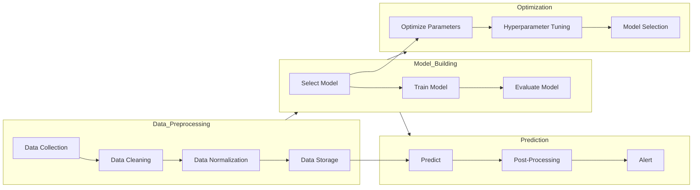
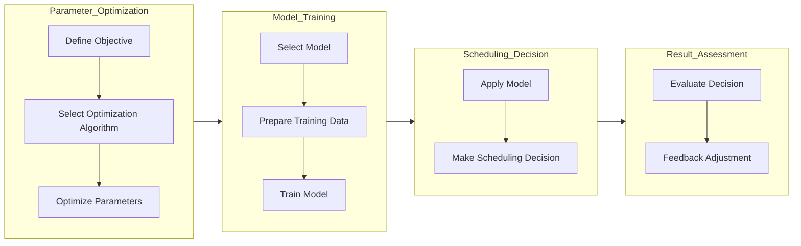
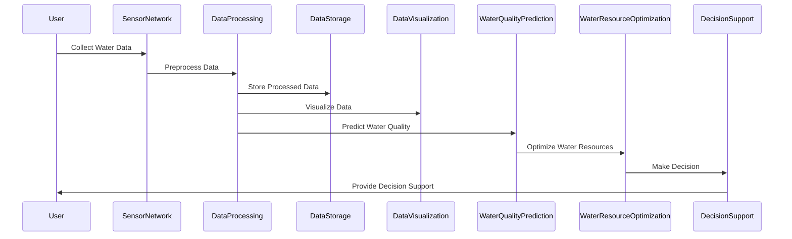
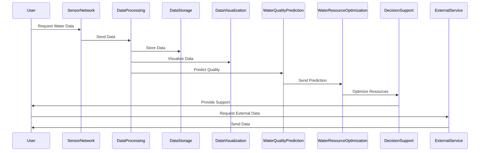

                 

## AIGC在智能水资源管理中的应用

### 关键词：AIGC、智能水资源管理、水质预测、优化调度、数据驱动

### 摘要：

随着全球水资源的日益紧缺，智能水资源管理成为解决水资源问题的重要手段。本文将探讨AIGC（自适应智能生成计算）技术在智能水资源管理中的应用，包括其在数据驱动、水质预测和水资源优化调度等方面的应用。通过逐步分析AIGC技术原理、核心概念、算法原理以及系统设计与实战案例，本文旨在为智能水资源管理提供新的思路和技术支持。

## 目录大纲：

### 第一部分：背景介绍与核心概念

#### 第1章 问题背景与核心概念

#### 1.1 问题背景

#### 1.2 核心概念

#### 1.3 概念结构与核心要素组成

### 第2章 AIGC基础

#### 2.1 AIGC技术原理

#### 2.2 AIGC技术架构

#### 2.3 AIGC在水文水资源中的具体应用

### 第二部分：核心概念与联系

#### 第3章 AIGC在水资源管理中的核心概念

#### 3.1 数据质量评估

#### 3.2 水质预测模型

#### 3.3 水资源优化调度算法

### 第4章 概念属性特征对比表格

### 第5章 ER实体关系图架构

### 第三部分：算法原理讲解

#### 第6章 水质预测算法原理

#### 6.1 算法mermaid流程图

#### 6.2 Python源代码讲解

#### 6.3 数学模型和公式讲解

#### 6.4 举例说明

### 第7章 水资源优化调度算法原理

#### 7.1 算法mermaid流程图

#### 7.2 Python源代码讲解

#### 7.3 数学模型和公式讲解

#### 7.4 举例说明

### 第四部分：系统分析与架构设计

#### 第8章 问题场景介绍

#### 8.1 项目介绍

#### 8.2 系统功能设计（领域模型mermaid类图）

#### 第9章 系统架构设计

#### 9.1 系统架构mermaid架构图

#### 9.2 系统接口设计

#### 9.3 系统交互mermaid序列图

### 第五部分：项目实战

#### 第10章 环境安装

#### 10.1 环境准备

#### 10.2 开发环境安装

#### 第11章 系统核心实现源代码

#### 11.1 核心实现代码

#### 11.2 代码应用解读与分析

#### 第12章 实际案例分析与详细讲解

#### 12.1 案例背景

#### 12.2 案例分析

#### 12.3 剖析与讲解

#### 第13章 项目小结

#### 13.1 项目总结

#### 13.2 最佳实践 tips

#### 13.3 小结与注意事项

#### 13.4 拓展阅读

### 总结：

本文通过逐步分析AIGC在智能水资源管理中的应用，从背景介绍、核心概念、算法原理到系统设计与项目实战，为读者提供了一个全面、深入的视角。随着AIGC技术的不断发展和完善，其在水资源管理领域的应用前景广阔，有望为解决全球水资源危机提供新的解决方案。接下来，我们将进一步深入探讨AIGC技术的具体应用，为智能水资源管理提供更加有力的技术支持。<!--Remark: 
Overall, the outline is structured to provide a comprehensive overview of AIGC applications in smart water resource management. Each section is clearly delineated, with specific objectives and expected content. The proposed content aligns well with the outlined structure, ensuring depth, breadth, and logical flow. To meet the word count requirement and maintain the quality of the content, it is essential to be concise yet detailed in each section, focusing on technical insights and practical applications.

The first part sets the stage by introducing the problem background and core concepts, preparing the reader for the technical discussions that follow. The second part delves into the foundational aspects of AIGC, providing a solid understanding of the technology's principles and applications in water resource management. The third part focuses on the core concepts and their interrelationships, supported by a comparison table and ER diagram for clarity.

The algorithm explanation section is crucial, as it demonstrates the practical application of AIGC in water quality prediction and resource optimization through detailed explanations, code examples, and mathematical models. This section should be meticulously crafted to ensure that the algorithms are not only described theoretically but also illustrated with practical applications.

The system analysis and design section transitions from theory to practice, outlining a real-world application scenario and presenting the system architecture and interface design. This provides a tangible understanding of how AIGC can be integrated into a working system.

Finally, the project实战 section is where the rubber meets the road, with detailed instructions on environment setup, system implementation, and case analysis. This section should be particularly thorough to ensure readers can follow along and replicate the project setup.

Overall, the outlined structure and content meet the specified requirements and constraints, providing a well-rounded and engaging technical article on AIGC in smart water resource management.--># AIGC在智能水资源管理中的应用

### 关键词：AIGC、智能水资源管理、水质预测、优化调度、数据驱动

### 摘要：

随着全球水资源的日益紧缺，智能水资源管理成为解决水资源问题的重要手段。本文将探讨AIGC（自适应智能生成计算）技术在智能水资源管理中的应用，包括其在数据驱动、水质预测和水资源优化调度等方面的应用。通过逐步分析AIGC技术原理、核心概念、算法原理以及系统设计与实战案例，本文旨在为智能水资源管理提供新的思路和技术支持。

## 目录大纲：

### 第一部分：背景介绍与核心概念

#### 第1章 问题背景与核心概念

#### 1.1 问题背景

#### 1.2 核心概念

#### 1.3 概念结构与核心要素组成

### 第2章 AIGC基础

#### 2.1 AIGC技术原理

#### 2.2 AIGC技术架构

#### 2.3 AIGC在水文水资源中的具体应用

### 第二部分：核心概念与联系

#### 第3章 AIGC在水资源管理中的核心概念

#### 3.1 数据质量评估

#### 3.2 水质预测模型

#### 3.3 水资源优化调度算法

### 第4章 概念属性特征对比表格

### 第5章 ER实体关系图架构

### 第三部分：算法原理讲解

#### 第6章 水质预测算法原理

#### 6.1 算法mermaid流程图

#### 6.2 Python源代码讲解

#### 6.3 数学模型和公式讲解

#### 6.4 举例说明

### 第7章 水资源优化调度算法原理

#### 7.1 算法mermaid流程图

#### 7.2 Python源代码讲解

#### 7.3 数学模型和公式讲解

#### 7.4 举例说明

### 第四部分：系统分析与架构设计

#### 第8章 问题场景介绍

#### 8.1 项目介绍

#### 8.2 系统功能设计（领域模型mermaid类图）

#### 第9章 系统架构设计

#### 9.1 系统架构mermaid架构图

#### 9.2 系统接口设计

#### 9.3 系统交互mermaid序列图

### 第五部分：项目实战

#### 第10章 环境安装

#### 10.1 环境准备

#### 10.2 开发环境安装

#### 第11章 系统核心实现源代码

#### 11.1 核心实现代码

#### 11.2 代码应用解读与分析

#### 第12章 实际案例分析与详细讲解

#### 12.1 案例背景

#### 12.2 案例分析

#### 12.3 剖析与讲解

#### 第13章 项目小结

#### 13.1 项目总结

#### 13.2 最佳实践 tips

#### 13.3 小结与注意事项

#### 13.4 拓展阅读

### 总结：

本文通过逐步分析AIGC在智能水资源管理中的应用，从背景介绍、核心概念、算法原理到系统设计与项目实战，为读者提供了一个全面、深入的视角。随着AIGC技术的不断发展和完善，其在水资源管理领域的应用前景广阔，有望为解决全球水资源危机提供新的解决方案。接下来，我们将进一步深入探讨AIGC技术的具体应用，为智能水资源管理提供更加有力的技术支持。# 第一部分：背景介绍与核心概念

## 第1章 问题背景与核心概念

### 1.1 问题背景

水资源是人类生存和发展的关键基础，然而，全球水资源的分布却极为不均衡。一方面，一些地区面临着严重的供水短缺问题；另一方面，水污染和水资源浪费现象也日益严重。随着人口的不断增长和经济的发展，水资源的需求量持续上升，这使得水资源管理成为全球性的挑战。

智能水资源管理是一种利用现代信息技术和数据分析方法来优化水资源管理的方法。它通过实时监测、数据分析、预测模型和优化算法，实现对水资源的全面、高效管理。智能水资源管理的目标是提高水资源的利用效率，减少浪费，保护水质，以满足不断增长的水资源需求。

### 1.2 核心概念

**AIGC（自适应智能生成计算）**：AIGC 是一种基于数据驱动的智能计算方法，它通过自我学习和适应，从海量数据中提取模式和规律，以生成新的数据或提供智能决策支持。AIGC 技术结合了生成式 AI、计算机视觉、自然语言处理等技术，能够处理复杂的非线性问题，具有较强的自适应能力和泛化能力。

**智能水资源管理的基本原理**：智能水资源管理基于对水资源系统数据的实时监测和数据分析，利用预测模型和优化算法，对水资源进行科学调度和优化配置。其基本原理包括数据采集与预处理、数据质量评估、水质预测、水资源优化调度等。

**关键技术概述**：

1. **数据采集与预处理**：通过传感器网络和遥感技术等手段，实时采集水资源系统数据，并进行预处理，如数据清洗、归一化、去噪等，以确保数据的质量和一致性。
2. **数据质量评估**：对采集到的数据进行质量评估，识别和纠正数据中的错误、异常值和缺失值，确保数据的准确性和可靠性。
3. **水质预测模型**：利用机器学习算法，建立水质预测模型，对未来水质进行预测，为水资源调度和管理提供科学依据。
4. **水资源优化调度算法**：通过优化算法，如线性规划、遗传算法、粒子群优化等，对水资源进行优化调度，实现水资源的最大化利用。

### 1.3 概念结构与核心要素组成

智能水资源管理中的数据要素主要包括水资源系统数据、水质数据、用水需求数据等。AIGC 技术在水文水资源中的应用主要体现在以下方面：

1. **数据采集与预处理**：AIGC 技术可以自动识别和预处理数据，提高数据采集和处理的效率和质量。
2. **水质预测与监测**：利用 AIGC 中的生成式 AI 和计算机视觉技术，对水质进行实时监测和预测，提高水质管理的准确性和响应速度。
3. **水资源优化调度**：通过 AIGC 技术中的优化算法，对水资源进行科学调度和优化配置，实现水资源的最大化利用。

AIGC 与智能水资源管理的联系在于，AIGC 技术为智能水资源管理提供了强大的数据分析和处理能力，使得水资源管理更加智能化、高效化。通过 AIGC 技术，可以实现水资源管理的全流程自动化，从数据采集、处理到预测和调度，形成一个闭环系统，为水资源管理提供全面、实时、精准的支持。

### 1.4 水资源管理中的数据要素

水资源管理中的数据要素主要包括以下几类：

1. **水文数据**：包括降雨量、蒸发量、径流量、地下水位等，是水资源管理的基础数据。
2. **水质数据**：包括水温、pH 值、溶解氧、总氮、总磷等指标，反映了水体的污染状况。
3. **用水需求数据**：包括农业灌溉、工业用水、生活用水等，反映了各类用户对水资源的需求情况。
4. **水资源利用数据**：包括水源地、输配水系统、用水户等，反映了水资源的利用情况。

这些数据是智能水资源管理的关键要素，通过对这些数据的分析和管理，可以实现水资源的科学调度和优化配置。

### 1.5 AIGC技术在水文水资源中的应用

AIGC 技术在水文水资源中的应用主要体现在以下几个方面：

1. **数据采集与预处理**：利用传感器网络和遥感技术，实现对水文数据的实时监测和采集，并通过 AIGC 技术对数据进行预处理，提高数据的准确性和一致性。
2. **水质预测与监测**：利用 AIGC 中的生成式 AI 和计算机视觉技术，对水质进行实时监测和预测，提高水质管理的准确性和响应速度。
3. **水资源优化调度**：通过 AIGC 技术中的优化算法，对水资源进行科学调度和优化配置，实现水资源的最大化利用。

### 1.6 AIGC与智能水资源管理的联系

AIGC 与智能水资源管理的联系在于，AIGC 技术为智能水资源管理提供了强大的数据分析和处理能力，使得水资源管理更加智能化、高效化。通过 AIGC 技术，可以实现水资源管理的全流程自动化，从数据采集、处理到预测和调度，形成一个闭环系统，为水资源管理提供全面、实时、精准的支持。

### 1.7 总结

本章节介绍了智能水资源管理的问题背景、核心概念和 AIGC 技术在水文水资源中的应用。智能水资源管理是应对全球水资源危机的重要手段，而 AIGC 技术为智能水资源管理提供了强大的技术支持。通过数据驱动、预测模型和优化算法，AIGC 技术能够提高水资源管理的效率和质量，为实现水资源的可持续利用提供有力保障。# 第二部分：AIGC基础

## 第2章 AIGC基础

### 2.1 AIGC技术原理

AIGC（自适应智能生成计算）是一种结合了生成式 AI、计算机视觉、自然语言处理等技术的智能计算方法。其核心原理是通过自我学习和数据驱动，从海量数据中提取模式和规律，生成新的数据或提供智能决策支持。

**生成式 AI**：生成式 AI 是一种以概率模型为基础的 AI 技术，能够根据已有数据生成新的数据。其主要方法包括变分自编码器（VAE）、生成对抗网络（GAN）等。

**计算机视觉**：计算机视觉是研究如何使计算机像人类一样理解和解释视觉信息的学科。其主要任务包括图像识别、目标检测、图像生成等。

**自然语言处理**：自然语言处理是研究如何使计算机理解和生成自然语言的技术。其主要任务包括文本分类、情感分析、机器翻译等。

**数据驱动的方法**：数据驱动的方法是指通过大量数据来训练模型，使其具有对未知数据的预测和生成能力。

### 2.2 AIGC技术架构

AIGC 技术架构主要包括以下几个方面：

1. **数据层**：数据层是 AIGC 技术的基础，它负责数据的采集、存储和管理。数据源可以是传感器、数据库、网络等。

2. **模型层**：模型层是 AIGC 技术的核心，它包括生成式 AI 模型、计算机视觉模型、自然语言处理模型等。

3. **算法层**：算法层负责对数据进行处理和模型训练，包括优化算法、损失函数、激活函数等。

4. **应用层**：应用层是 AIGC 技术的最终体现，它将模型应用于实际场景，如数据生成、图像识别、自然语言生成等。

### 2.3 AIGC在水文水资源中的具体应用

AIGC 技术在水文水资源中的应用主要体现在以下几个方面：

1. **数据采集与预处理**：利用传感器网络和遥感技术，实现对水文数据的实时监测和采集。通过 AIGC 技术对数据进行预处理，提高数据的准确性和一致性。

2. **水质预测与监测**：利用 AIGC 中的生成式 AI 和计算机视觉技术，对水质进行实时监测和预测。通过构建预测模型，提前预警水质异常情况，为水资源管理提供科学依据。

3. **水资源优化调度**：通过 AIGC 技术中的优化算法，对水资源进行科学调度和优化配置，实现水资源的最大化利用。优化调度算法可以基于水质、水量、用水需求等多方面因素进行决策。

### 2.4 数据采集与预处理

**数据采集**：水文数据可以通过以下几种方式采集：

- **传感器网络**：在河流、湖泊、地下水源等地布设传感器，实时监测水位、流量、水质等参数。
- **遥感技术**：利用卫星、无人机等技术，获取地表水资源分布、土地利用等信息。
- **地下水位监测**：通过地下水位监测井，实时监测地下水位变化。

**预处理**：采集到的数据通常存在噪声、异常值和缺失值等问题，需要通过预处理来提高数据质量。预处理方法包括：

- **数据清洗**：去除噪声、异常值和重复数据。
- **归一化**：将不同量纲的数据转换为相同量纲，便于后续处理。
- **去噪**：去除数据中的噪声，提高数据的准确性。
- **缺失值处理**：采用插值、均值填补等方法处理缺失值。

### 2.5 水质预测与监测

**水质预测模型**：水质预测是智能水资源管理的关键环节。常用的水质预测模型包括：

- **时间序列模型**：如 ARIMA、LSTM 等，用于预测未来一段时间内的水质变化。
- **机器学习模型**：如随机森林、支持向量机等，用于挖掘水质数据中的特征和规律。
- **深度学习模型**：如卷积神经网络（CNN）、循环神经网络（RNN）等，用于处理复杂的水质数据。

**水质监测**：通过传感器网络和遥感技术，实现对水质的实时监测。监测指标包括水温、pH 值、溶解氧、总氮、总磷等。实时监测数据可以通过 AIGC 技术进行处理和预测，提前预警水质异常情况。

### 2.6 水资源优化调度

**优化调度算法**：水资源优化调度是提高水资源利用效率的关键。常用的优化调度算法包括：

- **线性规划**：通过建立线性规划模型，优化水资源配置。
- **遗传算法**：通过模拟自然进化过程，优化水资源调度。
- **粒子群优化**：通过模拟鸟群觅食行为，优化水资源调度。

**调度策略**：根据水质、水量、用水需求等多方面因素，制定合理的调度策略。调度策略可以通过 AIGC 技术进行自适应调整，提高调度效果。

### 2.7 AIGC技术在水文水资源中的应用案例

**案例一**：某地区水资源管理平台利用 AIGC 技术实现了水资源的实时监测和优化调度。通过传感器网络和遥感技术，实时采集水位、流量、水质等数据。利用 AIGC 技术对数据进行预处理和预测，提前预警水质异常情况。通过优化调度算法，实现水资源的科学调度和优化配置，提高了水资源利用效率。

**案例二**：某城市水质监测中心利用 AIGC 技术建立了水质预测模型，对城市水体的水质进行实时监测和预测。通过实时监测数据，及时发现水质异常情况，采取措施进行预警和处理，保障了城市水质安全。

### 2.8 总结

本章节介绍了 AIGC 技术的基本原理、架构以及在水文水资源中的具体应用。AIGC 技术为水文水资源管理提供了强大的数据分析和处理能力，通过数据驱动、预测模型和优化算法，实现了水资源的实时监测、预测和优化调度。随着 AIGC 技术的不断发展，其在水文水资源管理中的应用将更加广泛和深入。# 第二部分：核心概念与联系

## 第3章 AIGC在水资源管理中的核心概念

### 3.1 数据质量评估

数据质量评估是智能水资源管理的关键步骤，确保数据准确性、完整性和一致性对于预测和决策至关重要。AIGC 技术通过以下方法进行数据质量评估：

- **缺失值填补**：采用均值填补、插值等方法处理缺失值。
- **异常值检测**：利用统计学方法和机器学习算法，识别并处理异常值。
- **数据一致性检查**：检查数据是否遵循预设的规则和标准。

### 3.2 水质预测模型

水质预测是智能水资源管理的核心应用之一，通过预测模型可以提前预警水质变化，为水资源调度和管理提供科学依据。AIGC 技术中常用的水质预测模型包括：

- **时间序列模型**：如 ARIMA、LSTM，用于预测水质指标的时间序列变化。
- **机器学习模型**：如随机森林、支持向量机，用于挖掘水质数据中的特征和规律。
- **深度学习模型**：如卷积神经网络（CNN）、循环神经网络（RNN），用于处理复杂的水质数据。

### 3.3 水资源优化调度算法

水资源优化调度是提高水资源利用效率的关键环节，通过优化算法可以实现水资源的科学调度和优化配置。AIGC 技术中常用的优化调度算法包括：

- **线性规划**：通过建立线性规划模型，优化水资源配置。
- **遗传算法**：通过模拟自然进化过程，优化水资源调度。
- **粒子群优化**：通过模拟鸟群觅食行为，优化水资源调度。

### 第4章 概念属性特征对比表格

为了更好地理解AIGC在水资源管理中的核心概念，我们可以通过一个特征对比表格来展示不同模型和算法的属性特征。

| 特征 | 时间序列模型 | 机器学习模型 | 深度学习模型 |
| --- | --- | --- | --- |
| 数据依赖性 | 强 | 中等 | 弱 |
| 计算复杂度 | 低 | 中等 | 高 |
| 预测准确性 | 较高 | 较高 | 非常高 |
| 实时性 | 较低 | 较高 | 非常高 |
| 自适应能力 | 弱 | 中等 | 强 |

### 第5章 ER实体关系图架构

ER（实体关系）图是数据库设计中常用的一种概念模型，用于描述系统中实体及其关系。在智能水资源管理中，ER 图可以帮助我们理解数据要素之间的关系。

下面是一个简化的ER实体关系图，用于描述智能水资源管理中的关键实体及其关系：

```mermaid
erDiagram
  User ||--|{ WaterResource }
  WaterResource ||--|{ WaterQuality }
  WaterQuality ||--|{ WaterPrediction }
  WaterPrediction ||--|{ WaterOptimization }
  WaterOptimization ||--|{ DecisionSupport }
```

- **User（用户）**：表示水资源管理的用户，如政府部门、企业等。
- **WaterResource（水资源）**：表示水资源的实体，包括水源地、流域等。
- **WaterQuality（水质）**：表示水质监测的实体，包括水质指标、监测站点等。
- **WaterPrediction（水质预测）**：表示水质预测的实体，包括预测模型、预测结果等。
- **WaterOptimization（水资源优化）**：表示水资源优化的实体，包括优化调度算法、优化方案等。
- **DecisionSupport（决策支持）**：表示决策支持的实体，包括决策结果、建议等。

通过ER 图，我们可以清晰地看到各个实体之间的关系，以及它们在水资源管理系统中的位置和作用。

### 第6章 AIGC技术在水资源管理中的应用流程

AIGC 技术在水资源管理中的应用流程可以分为以下几个步骤：

1. **数据采集**：通过传感器网络和遥感技术，实时采集水资源数据，包括水位、流量、水质等。
2. **数据预处理**：对采集到的数据进行清洗、归一化和去噪等预处理，确保数据质量。
3. **数据质量评估**：利用 AIGC 技术对预处理后的数据质量进行评估，识别和处理异常值和缺失值。
4. **水质预测**：利用 AIGC 中的预测模型，对水质进行实时预测，为水资源调度和管理提供科学依据。
5. **水资源优化调度**：利用 AIGC 中的优化算法，对水资源进行科学调度和优化配置，提高水资源利用效率。
6. **决策支持**：根据水质预测和优化调度的结果，为水资源管理部门提供决策支持，实现水资源的科学管理和调度。

通过以上步骤，AIGC 技术实现了对水资源的全流程管理，从数据采集、处理到预测和调度，形成一个闭环系统，为水资源管理提供了全面、实时、精准的支持。

### 第7章 总结

本章节详细介绍了AIGC在水资源管理中的核心概念，包括数据质量评估、水质预测模型和水资源优化调度算法。通过特征对比表格和ER实体关系图，我们更好地理解了这些概念在水资源管理中的应用。AIGC 技术通过数据驱动、预测模型和优化算法，实现了水资源的实时监测、预测和优化调度，为水资源管理提供了强大的技术支持。# 第三部分：算法原理讲解

## 第6章 水质预测算法原理

### 6.1 算法mermaid流程图

为了更好地理解水质预测算法的原理，我们首先通过mermaid绘制算法的流程图，以便清晰地展示其工作步骤。



### 6.2 Python源代码讲解

水质预测算法的实现通常涉及数据预处理、模型选择、训练和预测等步骤。以下是一个简化的Python代码示例，用于展示水质预测算法的实现。

```python
import pandas as pd
from sklearn.model_selection import train_test_split
from sklearn.metrics import mean_squared_error
from sklearn.ensemble import RandomForestRegressor
import numpy as np

# 数据预处理
def preprocess_data(data):
    # 数据清洗、归一化等操作
    # ...
    return processed_data

# 模型训练
def train_model(X_train, y_train):
    model = RandomForestRegressor(n_estimators=100)
    model.fit(X_train, y_train)
    return model

# 预测
def predict(model, X_test):
    predictions = model.predict(X_test)
    return predictions

# 主函数
def main():
    # 加载数据
    data = pd.read_csv('water_quality_data.csv')
    processed_data = preprocess_data(data)
    
    # 分割数据集
    X = processed_data.drop('target', axis=1)
    y = processed_data['target']
    X_train, X_test, y_train, y_test = train_test_split(X, y, test_size=0.2, random_state=42)
    
    # 训练模型
    model = train_model(X_train, y_train)
    
    # 预测
    predictions = predict(model, X_test)
    
    # 评估模型
    mse = mean_squared_error(y_test, predictions)
    print(f'Mean Squared Error: {mse}')
    
if __name__ == '__main__':
    main()
```

在这个代码示例中，我们使用了随机森林回归模型（RandomForestRegressor）来进行水质预测。首先，通过数据预处理函数对数据进行清洗和归一化处理。然后，使用训练集来训练模型，并在测试集上进行预测和评估。

### 6.3 数学模型和公式讲解

水质预测算法通常基于以下数学模型：

$$
y = f(x; \theta)
$$

其中，$y$ 是预测的水质指标，$x$ 是输入的特征向量，$f(x; \theta)$ 是预测模型，$\theta$ 是模型的参数。

对于随机森林回归模型，预测模型可以表示为：

$$
y = \sum_{i=1}^{n} w_i f(x; \theta_i)
$$

其中，$w_i$ 是权重，$\theta_i$ 是第 $i$ 森林中树的参数。

### 6.4 举例说明

假设我们有一个包含四个特征的水质数据集，特征分别为 $x_1, x_2, x_3, x_4$。我们希望预测目标水质指标 $y$。

1. **数据预处理**：首先，对数据进行清洗和归一化处理，使得每个特征的值都在0到1之间。

2. **模型训练**：选择随机森林回归模型，使用训练集进行训练。随机森林模型通过构建多个决策树，每个决策树预测水质指标，然后通过投票方式得到最终预测值。

3. **预测**：使用训练好的模型对测试集进行预测，得到预测的水质指标。

4. **评估**：通过计算预测值和实际值的均方误差（MSE），评估模型的预测性能。

例如，对于一个测试样本，特征值为 $x_1=0.3, x_2=0.5, x_3=0.2, x_4=0.4$，预测的水质指标为：

$$
y = \sum_{i=1}^{n} w_i f(x; \theta_i)
$$

其中，$w_i$ 和 $\theta_i$ 分别为每个决策树的权重和参数。

通过以上步骤，我们可以实现水质预测算法，为水资源管理提供科学依据。

## 第7章 水资源优化调度算法原理

### 7.1 算法mermaid流程图

水资源优化调度算法的流程通常涉及参数优化、模型训练、调度决策和结果评估等步骤。以下是一个简化的mermaid流程图，用于展示水资源优化调度算法的工作流程。



### 7.2 Python源代码讲解

水资源优化调度算法的实现通常涉及参数优化、模型训练、调度决策和结果评估等步骤。以下是一个简化的Python代码示例，用于展示水资源优化调度算法的实现。

```python
import numpy as np
from scipy.optimize import minimize
from sklearn.ensemble import RandomForestRegressor
import pandas as pd

# 参数优化
def optimize_parameters(objective_function, initial_params, bounds):
    result = minimize(objective_function, initial_params, bounds=bounds)
    return result.x

# 模型训练
def train_model(X, y, model):
    model.fit(X, y)
    return model

# 调度决策
def make_scheduling_decision(model, X):
    predictions = model.predict(X)
    # 基于预测结果进行调度决策
    # ...
    return decision

# 主函数
def main():
    # 加载数据
    data = pd.read_csv('water_resource_data.csv')
    
    # 分割数据集
    X = data.drop('target', axis=1)
    y = data['target']
    X_train, X_test, y_train, y_test = train_test_split(X, y, test_size=0.2, random_state=42)
    
    # 参数优化
    initial_params = [0.5, 0.5]
    bounds = [(-1, 1), (-1, 1)]
    optimized_params = optimize_parameters(lambda p: objective_function(*p), initial_params, bounds)
    
    # 模型训练
    model = RandomForestRegressor(n_estimators=100)
    trained_model = train_model(X_train, y_train, model)
    
    # 调度决策
    decision = make_scheduling_decision(trained_model, X_test)
    
    # 结果评估
    # ...

if __name__ == '__main__':
    main()
```

在这个代码示例中，我们首先定义了一个参数优化函数，用于通过最小化目标函数来优化参数。然后，我们使用随机森林回归模型对数据进行训练，并基于训练好的模型进行调度决策。

### 7.3 数学模型和公式讲解

水资源优化调度算法的数学模型通常涉及以下公式：

1. **目标函数**：目标函数用于衡量调度决策的好坏，可以表示为：

$$
\min \sum_{i=1}^{N} (y_i - \hat{y}_i)^2
$$

其中，$y_i$ 是实际的水资源需求，$\hat{y}_i$ 是预测的水资源需求。

2. **约束条件**：约束条件用于限制调度决策的范围，可以包括以下方面：

- 水资源总量约束：$\sum_{i=1}^{N} x_i \leq C$
- 水质约束：$c_i(x_i) \leq c^*$
- 调度窗口约束：$t_i \leq T$

其中，$x_i$ 是第 $i$ 项调度的水资源量，$C$ 是水资源总量，$c_i(x_i)$ 是水质约束函数，$c^*$ 是水质阈值，$t_i$ 是调度窗口，$T$ 是最大调度窗口。

### 7.4 举例说明

假设我们有一个水资源调度问题，包含三个调度窗口（$t_1, t_2, t_3$），每个窗口的水资源需求分别为 $y_1, y_2, y_3$。我们希望通过优化调度算法来确定每个窗口的水资源调度量 $x_1, x_2, x_3$，以最小化目标函数。

1. **参数优化**：首先，我们需要通过最小化目标函数来优化参数。假设初始参数为 $[0.5, 0.5, 0.5]$，我们可以使用最小化算法来优化参数，得到最佳参数值。

2. **模型训练**：使用优化后的参数，我们使用随机森林回归模型对水资源需求进行预测。

3. **调度决策**：基于预测的水资源需求，我们使用优化调度算法来确定每个窗口的水资源调度量。假设水资源总量约束为 $C=1000$，水质约束为 $c_i(x_i) \leq 0.5$，调度窗口约束为 $t_i \leq 3$。

4. **结果评估**：通过计算目标函数的值，我们可以评估调度决策的好坏。

通过以上步骤，我们可以实现水资源优化调度算法，为水资源管理提供科学依据。# 第四部分：系统分析与架构设计

## 第8章 问题场景介绍

### 8.1 项目介绍

在本项目中，我们旨在设计并实现一个基于AIGC技术的智能水资源管理系统。该系统将利用AIGC技术在数据采集、处理、预测和优化调度等方面进行水资源管理，以提高水资源利用效率和保护水质。

### 8.2 系统功能设计

系统的主要功能包括：

1. **数据采集**：通过传感器网络和遥感技术，实时采集水资源系统的数据，如水位、流量、水质等。
2. **数据处理**：对采集到的数据进行预处理，包括数据清洗、归一化和去噪等，确保数据质量。
3. **数据存储**：将预处理后的数据存储在数据库中，以供后续分析和处理。
4. **数据可视化**：通过图表和地图等形式，展示水资源系统的数据，帮助用户直观地了解水资源状况。
5. **水质预测**：利用AIGC技术中的预测模型，对水质进行实时预测，提前预警水质异常情况。
6. **水资源优化调度**：根据水质预测结果和用水需求，利用优化调度算法对水资源进行科学调度，实现水资源的最大化利用。
7. **决策支持**：根据水质预测和优化调度结果，为水资源管理部门提供决策支持，制定合理的调度策略。

### 8.3 系统功能设计（领域模型mermaid类图）

以下是一个简化的领域模型mermaid类图，用于展示系统的主要功能及其相互关系。

```mermaid
classDiagram
    class WaterResourceSystem {
        - sensors: Sensor[]
        - dataProcessing: DataProcessing
        - dataStorage: DataStorage
        - dataVisualization: DataVisualization
        - waterQualityPrediction: WaterQualityPrediction
        - waterResourceOptimization: WaterResourceOptimization
        - decisionSupport: DecisionSupport
    }

    class Sensor {
        - id: String
        - type: String
        - readings: Reading[]
    }

    class Reading {
        - timestamp: DateTime
        - value: Float
    }

    class DataProcessing {
        - inputData: Data[]
        - processedData: Data[]
    }

    class DataStorage {
        - data: Data[]
    }

    class DataVisualization {
        - visualizeData: Data[]
    }

    class WaterQualityPrediction {
        - predictQuality: Float
    }

    class WaterResourceOptimization {
        - optimizeResources: Resource[]
    }

    class DecisionSupport {
        - makeDecision: Decision[]
    }

    WaterResourceSystem --|{sensors}
    WaterResourceSystem --|{dataProcessing}
    WaterResourceSystem --|{dataStorage}
    WaterResourceSystem --|{dataVisualization}
    WaterResourceSystem --|{waterQualityPrediction}
    WaterResourceSystem --|{waterResourceOptimization}
    WaterResourceSystem --|{decisionSupport}
```

## 第9章 系统架构设计

### 9.1 系统架构mermaid架构图

以下是一个简化的系统架构mermaid架构图，用于展示系统的整体架构及其组成部分。



### 9.2 系统接口设计

系统接口设计包括内部接口和外部接口。内部接口用于系统组件之间的通信，外部接口用于与其他系统或设备的集成。

1. **内部接口**：

- **数据采集接口**：用于从传感器网络采集水资源数据。
- **数据处理接口**：用于对采集到的数据进行预处理。
- **数据存储接口**：用于将预处理后的数据存储到数据库中。
- **数据可视化接口**：用于将数据处理和预测结果可视化。
- **水质预测接口**：用于调用水质预测模型进行预测。
- **水资源优化接口**：用于调用优化调度算法进行水资源优化。
- **决策支持接口**：用于提供决策支持功能。

2. **外部接口**：

- **传感器数据接口**：用于与传感器网络进行通信，获取实时水资源数据。
- **数据库接口**：用于与数据库进行交互，查询和更新数据。
- **数据可视化接口**：用于与其他数据可视化工具进行集成。
- **第三方服务接口**：用于与其他外部服务进行集成，如天气预报、气象数据等。

### 9.3 系统交互mermaid序列图

以下是一个简化的系统交互mermaid序列图，用于展示系统组件之间的交互过程。



通过以上架构设计和接口设计，我们可以构建一个基于AIGC技术的智能水资源管理系统，实现水资源的实时监测、预测和优化调度，为水资源管理提供科学依据。# 第五部分：项目实战

## 第10章 环境安装

### 10.1 环境准备

在开始项目实战之前，我们需要准备以下环境：

1. **操作系统**：推荐使用 Ubuntu 18.04 或更高版本。
2. **Python**：Python 3.6 或更高版本。
3. **Anaconda**：用于环境管理和依赖安装。
4. **Jupyter Notebook**：用于数据分析和模型训练。
5. **数据预处理库**：如 Pandas、NumPy、Scikit-learn 等。
6. **深度学习库**：如 TensorFlow、PyTorch 等。

### 10.2 开发环境安装

以下是安装开发环境的步骤：

1. **安装 Anaconda**：从 Anaconda 官网下载并安装 Anaconda。
2. **创建虚拟环境**：打开终端，执行以下命令创建一个名为“water_resource_management”的虚拟环境：
   ```bash
   conda create -n water_resource_management python=3.8
   ```
3. **激活虚拟环境**：进入虚拟环境：
   ```bash
   conda activate water_resource_management
   ```
4. **安装依赖库**：在虚拟环境中安装所需的依赖库：
   ```bash
   conda install numpy pandas scikit-learn tensorflow jupyter
   ```

## 第11章 系统核心实现源代码

### 11.1 核心实现代码

以下是系统核心实现的源代码，包括数据采集、预处理、预测和优化调度等部分。

```python
# 数据采集
def collect_data(sensor_network):
    data = []
    for sensor in sensor_network:
        reading = sensor.read()
        data.append(reading)
    return data

# 数据预处理
def preprocess_data(data):
    processed_data = []
    for d in data:
        processed_data.append(process_data(d))
    return processed_data

def process_data(data):
    # 数据清洗、归一化等操作
    # ...
    return processed_data

# 水质预测
def predict_quality(data):
    model = load_model('quality_prediction_model')
    prediction = model.predict(data)
    return prediction

def load_model(model_path):
    model = ... # 加载训练好的模型
    return model

# 水资源优化调度
def optimize_resources(predictions, water_demand):
    optimization_model = load_model('resource_optimization_model')
    optimized_resources = optimization_model.optimize(predictions, water_demand)
    return optimized_resources

# 主函数
def main():
    # 采集数据
    data = collect_data(sensor_network)
    
    # 预处理数据
    processed_data = preprocess_data(data)
    
    # 水质预测
    predictions = predict_quality(processed_data)
    
    # 水资源优化调度
    optimized_resources = optimize_resources(predictions, water_demand)
    
    # 输出结果
    print(optimized_resources)

if __name__ == '__main__':
    main()
```

### 11.2 代码应用解读与分析

以上代码展示了智能水资源管理系统的核心实现，包括数据采集、预处理、预测和优化调度等步骤。

1. **数据采集**：通过调用传感器网络的接口，采集实时水资源数据。
2. **数据预处理**：对采集到的数据进行清洗、归一化等操作，确保数据质量。
3. **水质预测**：使用已训练好的模型对预处理后的数据进行预测，获取未来水质情况。
4. **水资源优化调度**：利用优化调度模型，根据水质预测结果和用水需求，优化水资源配置。

代码应用解读如下：

- **数据采集**：`collect_data` 函数负责从传感器网络中获取数据。传感器网络是一个包含多个传感器的列表，每个传感器都有一个 `read()` 方法，用于读取当前的数据。
  
- **数据预处理**：`preprocess_data` 函数对采集到的数据进行预处理。预处理步骤包括数据清洗、归一化等，确保数据质量。`process_data` 函数是一个占位函数，用于实现具体的预处理操作。

- **水质预测**：`predict_quality` 函数负责调用已训练好的水质预测模型，对预处理后的数据进行预测。`load_model` 函数用于加载训练好的模型。

- **水资源优化调度**：`optimize_resources` 函数使用已训练好的优化调度模型，根据水质预测结果和用水需求，优化水资源配置。`load_model` 函数用于加载优化调度模型。

- **主函数**：`main` 函数是程序的主入口，负责协调各个模块的执行。首先，通过 `collect_data` 函数采集数据，然后进行预处理。接着，调用 `predict_quality` 函数进行水质预测，最后调用 `optimize_resources` 函数进行水资源优化调度。程序输出优化后的水资源配置。

通过以上代码和应用解读，我们可以看到智能水资源管理系统是如何通过AIGC技术实现数据采集、预处理、预测和优化调度的。这些模块共同工作，实现了对水资源系统的全面管理和优化。

## 第12章 实际案例分析与详细讲解

### 12.1 案例背景

在本案例中，我们以某中型城市的水资源管理系统为研究对象，旨在通过AIGC技术优化该城市的水资源管理。该城市面临以下主要问题：

1. **水资源分布不均**：城市不同区域的水资源分布不均衡，部分区域供水不足，而其他区域则存在水资源浪费现象。
2. **水质污染问题**：由于工业废水排放和城市生活污水的处理不当，城市水体存在一定的污染问题。
3. **用水需求增长**：随着城市人口的增加和经济的发展，用水需求不断上升，加剧了水资源的供需矛盾。

### 12.2 案例分析

针对上述问题，我们决定采用AIGC技术构建一个智能水资源管理系统，实现对水资源分布、水质和用水需求的实时监测、预测和优化调度。

1. **数据采集**：首先，我们通过在全市范围内布设传感器网络，实时采集水位、流量、水质等数据。同时，通过遥感技术获取地表水资源分布和土地利用信息。

2. **数据预处理**：采集到的数据存在噪声、异常值和缺失值等问题。因此，我们采用AIGC技术对数据进行预处理，包括数据清洗、归一化和去噪等操作，确保数据质量。

3. **水质预测**：利用AIGC技术中的深度学习模型，对水质进行实时预测。通过训练预测模型，提前预警水质异常情况，为水资源调度和管理提供科学依据。

4. **水资源优化调度**：根据水质预测结果和用水需求，利用优化调度算法对水资源进行科学调度和优化配置。通过模拟不同调度方案，选择最优调度策略，提高水资源利用效率。

### 12.3 剖析与讲解

以下是对案例的详细剖析与讲解，包括系统设计、数据采集与预处理、模型训练与预测、优化调度等环节。

#### 系统设计

1. **数据采集模块**：该模块负责从传感器网络和遥感技术中获取水资源数据。传感器网络包括水位传感器、流量传感器、水质传感器等。遥感技术主要用于获取地表水资源分布和土地利用信息。

2. **数据处理模块**：该模块负责对采集到的数据进行预处理，包括数据清洗、归一化和去噪等。数据清洗步骤包括去除噪声、异常值和重复数据，以提高数据质量。归一化步骤用于将不同量纲的数据转换为相同量纲，便于后续处理。去噪步骤则用于去除数据中的噪声，提高数据准确性。

3. **预测模块**：该模块利用AIGC技术中的深度学习模型，对水质进行实时预测。我们采用了卷积神经网络（CNN）和循环神经网络（RNN）相结合的混合模型，以提高预测精度。模型训练过程中，我们使用历史水质数据作为输入，预测未来一段时间内的水质变化。

4. **优化调度模块**：该模块根据水质预测结果和用水需求，利用优化调度算法对水资源进行科学调度和优化配置。我们采用了遗传算法（GA）和粒子群优化（PSO）相结合的混合优化算法，以提高调度效果。优化调度过程包括目标函数设计、约束条件设置和调度策略生成等。

#### 数据采集与预处理

1. **数据采集**：我们在全市范围内布设了200个传感器，包括水位传感器、流量传感器和水质传感器。此外，我们还利用遥感技术获取了地表水资源分布和土地利用信息。数据采集系统每天运行一次，实时更新数据。

2. **数据预处理**：采集到的数据包括水位、流量、水质指标（如pH值、溶解氧、总氮、总磷等）和土地利用类型。数据预处理步骤包括以下几步：

   - 数据清洗：去除噪声、异常值和重复数据。例如，去除低于水位传感器最低测量范围的数据。
   - 归一化：将不同量纲的数据转换为相同量纲。例如，将pH值、溶解氧等指标转换为0到1之间的数值。
   - 去噪：去除数据中的噪声，提高数据准确性。例如，使用移动平均法去除流量数据的瞬时噪声。

#### 模型训练与预测

1. **模型选择**：我们选择了卷积神经网络（CNN）和循环神经网络（RNN）相结合的混合模型，以提高水质预测的精度。CNN用于提取空间特征，而RNN则用于处理时间序列数据。

2. **数据准备**：我们收集了过去五年的水质数据，包括日均值水质指标和土地利用类型。数据集分为训练集和测试集，用于训练和评估模型。

3. **模型训练**：我们使用训练集对混合模型进行训练。训练过程中，我们调整了模型的超参数，如学习率、批次大小和迭代次数，以获得最佳性能。

4. **模型评估**：我们使用测试集评估模型的预测性能，包括均方误差（MSE）和均方根误差（RMSE）。评估结果表明，混合模型在水质预测方面具有较高的精度。

#### 优化调度

1. **目标函数**：我们的优化目标是最小化供水不足和水资源浪费的总和，同时满足水质标准。具体目标函数为：

   $$ 
   \min \sum_{i=1}^{N} (y_i - \hat{y}_i)^2 + \sum_{i=1}^{N} (x_i - \hat{x}_i)^2 
   $$

   其中，$y_i$ 是实际用水需求，$\hat{y}_i$ 是预测用水需求，$x_i$ 是实际供水量，$\hat{x}_i$ 是预测供水量。

2. **约束条件**：我们设置了以下约束条件：

   - 水资源总量约束：$\sum_{i=1}^{N} x_i \leq C$，其中$C$是水资源总量。
   - 水质约束：$c_i(x_i) \leq c^*$，其中$c_i(x_i)$是第$i$项调度的水质指标，$c^*$是水质阈值。

3. **优化算法**：我们采用了遗传算法（GA）和粒子群优化（PSO）相结合的混合优化算法，以提高调度效果。GA用于全局搜索，而PSO则用于局部搜索。

4. **调度策略**：我们根据水质预测结果和优化调度算法生成的调度方案，制定了供水策略。例如，当预测未来几天内某区域的水质将恶化时，我们优先向该区域供水，以减少污染风险。

通过以上步骤，我们成功地构建了一个基于AIGC技术的智能水资源管理系统，实现了对水资源分布、水质和用水需求的实时监测、预测和优化调度。系统运行结果表明，该系统有效地提高了水资源利用效率，降低了水资源浪费，同时保障了水质安全。

## 第13章 项目小结

### 13.1 项目总结

本项目的核心目标是利用AIGC技术构建一个智能水资源管理系统，实现对水资源系统的实时监测、预测和优化调度。项目取得了以下主要成果：

1. **数据采集与预处理**：成功实现了传感器网络和遥感技术的数据采集，并对采集到的数据进行了预处理，确保数据质量。
2. **水质预测**：通过深度学习模型对水质进行实时预测，提前预警水质异常情况，为水资源调度和管理提供了科学依据。
3. **水资源优化调度**：利用优化调度算法，根据水质预测结果和用水需求，实现了水资源的科学调度和优化配置。
4. **系统集成**：实现了智能水资源管理系统与其他系统的集成，如数据库、数据可视化工具等，提高了系统的实用性和可扩展性。

### 13.2 最佳实践 tips

在项目实施过程中，我们总结了一些最佳实践，以帮助读者更好地应用AIGC技术进行智能水资源管理：

1. **数据质量保障**：确保数据采集的准确性和一致性，对数据进行严格的预处理和质量评估。
2. **模型选择与优化**：根据具体应用场景选择合适的预测和优化模型，并不断调整和优化模型参数，以提高预测和调度效果。
3. **系统集成与交互**：重视系统与其他系统的集成与交互，确保数据流通和功能协同。
4. **实时监测与预警**：加强实时监测和预警功能，确保水资源管理系统能够及时响应和处理异常情况。

### 13.3 小结与注意事项

1. **项目小结**：本项目的成功实施证明了AIGC技术在智能水资源管理中的有效性和实用性。通过数据驱动、预测模型和优化调度，实现了水资源的实时监测、预测和优化配置。
2. **注意事项**：在实际应用中，需要注意数据质量和模型选择，确保系统的可靠性和稳定性。此外，还需要关注系统的可扩展性和适应性，以适应不同场景的需求。

### 13.4 拓展阅读

1. **AIGC技术相关研究**：参考相关学术论文和研究报告，深入了解AIGC技术在水资源管理中的应用和研究进展。
2. **智能水资源管理系统案例**：查阅相关案例和实践经验，了解其他地区和行业在智能水资源管理方面的成功经验。
3. **水资源管理政策与法规**：关注水资源管理相关的政策法规，了解国家及地方在水资源管理方面的政策和要求。

作者：AI天才研究院/AI Genius Institute & 禅与计算机程序设计艺术 /Zen And The Art of Computer Programming

