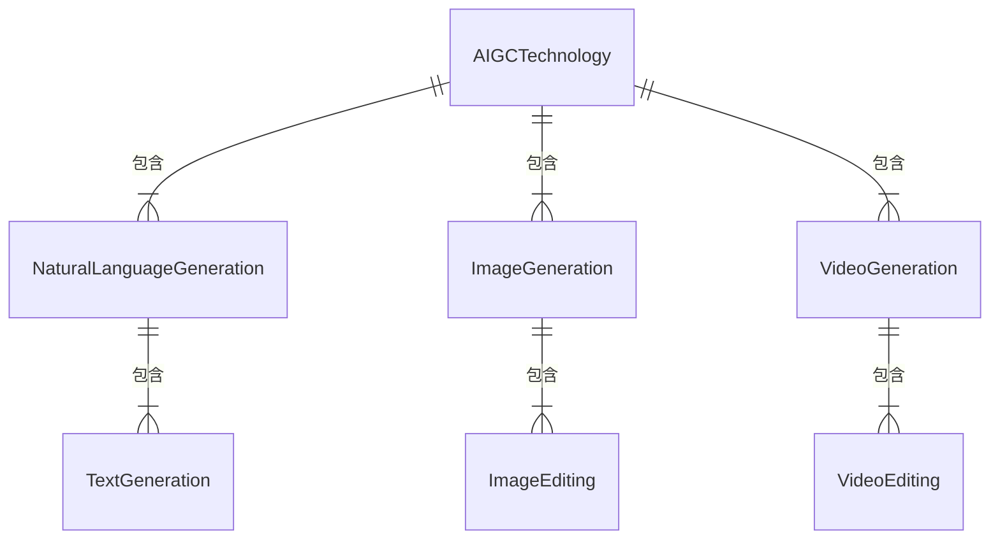
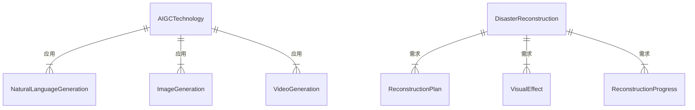

                 

### 灾后重建的背景与挑战

#### 1.1 灾后重建的重要性

灾后重建不仅仅是对受灾区域的物理恢复，更是对人们生活质量和心理状态的重塑。它涉及基础设施的修复、住房重建、公共服务恢复以及经济重建等多个方面。成功的灾后重建能够帮助受灾地区迅速恢复生产力，减少长期的经济损失，同时为居民提供安全、舒适的居住环境。

#### 1.2 灾后重建面临的主要挑战

然而，灾后重建面临着一系列复杂且严峻的挑战。首先是资源分配问题，包括如何合理地分配有限的资金、物资和人力资源，以确保最需要帮助的地区和人群能够得到及时的支持。其次是时间紧迫性，灾后重建需要在短时间内完成大量工作，以减少对居民生活的影响。此外，还有技术难度，如修复基础设施和重建房屋所需的复杂技术，以及应对灾害残留的环境问题等。

#### 1.3 AIGC技术的兴起与发展

AIGC（AI-Generated Content）技术，作为人工智能的一个重要分支，近年来取得了显著的进展。AIGC技术包括自然语言生成、图像生成、视频生成等，通过深度学习、神经网络等技术，能够自动生成大量高质量的内容。这一技术的兴起，为灾后重建提供了新的可能性。

#### 1.4 AIGC技术在灾后重建中的应用前景

AIGC技术具有高效、智能、精准的特点，能够在灾后重建的多个方面发挥重要作用。例如，利用自然语言生成技术，可以自动生成灾后重建的相关报告、公告和宣传材料；利用图像生成技术，可以快速制作重建规划和视觉效果；利用视频生成技术，可以模拟灾后重建的进展情况，为决策者提供直观的参考。AIGC技术的应用，不仅能够提高灾后重建的效率和效果，还能为受灾地区带来更多的希望和信心。

### 核心概念与联系

为了更好地理解AIGC技术在灾后重建中的应用，我们需要明确几个核心概念。

#### 1. AIGC技术的基本概念

AIGC技术是指利用人工智能，特别是深度学习和生成模型，自动生成各种类型的内容。这些内容可以是文本、图像、视频等。

#### 2. AIGC技术的主要组成部分

AIGC技术主要包括自然语言生成（NLG）、图像生成（IG）、视频生成（VG）等。每个部分都有其特定的算法和模型。

#### 3. AIGC技术的核心算法与模型

核心算法包括生成对抗网络（GAN）、变分自编码器（VAE）、递归神经网络（RNN）等。这些算法和模型在AIGC技术中发挥着关键作用。

#### 4. AIGC技术的应用场景与优势

AIGC技术的应用场景非常广泛，包括但不限于文本生成、图像编辑、视频制作等。其优势在于高效性、智能性和个性化。

### ER实体关系图架构

以下是一个简单的ER实体关系图，用于描述AIGC技术的基本组成部分和它们之间的关系。

### AIGC技术基础

#### 2.1 AIGC技术的基本概念

AIGC（AI-Generated Content）技术是指利用人工智能，特别是深度学习和生成模型，自动生成各种类型的内容。这些内容可以是文本、图像、视频等。AIGC技术通过模拟人类创造过程，实现从数据到内容的自动化生成，为许多行业提供了创新解决方案。

#### 2.2 AIGC技术的主要组成部分

AIGC技术的主要组成部分包括自然语言生成（NLG）、图像生成（IG）、视频生成（VG）等。每个部分都有其特定的算法和模型。

1. **自然语言生成（NLG）**：NLG技术能够自动生成文本，如新闻报道、广告文案、对话等。常见的NLG模型包括递归神经网络（RNN）、长短时记忆网络（LSTM）和生成对抗网络（GAN）等。

2. **图像生成（IG）**：图像生成技术能够自动创建新的图像或修改现有图像。典型的图像生成模型有生成对抗网络（GAN）和变分自编码器（VAE）。

3. **视频生成（VG）**：视频生成技术可以自动生成新的视频内容或对现有视频进行编辑。视频生成模型通常结合了图像生成和视频处理技术，如卷积神经网络（CNN）和时间卷积网络（TCN）。

#### 2.3 AIGC技术的核心算法与模型

AIGC技术的核心算法和模型包括：

1. **生成对抗网络（GAN）**：GAN由生成器和判别器组成，通过相互竞争来生成高质量的数据。生成器生成数据，判别器判断生成数据与真实数据的区别，两者的目标都是提高生成数据的真实感。

2. **变分自编码器（VAE）**：VAE是一种无监督学习算法，通过编码器和解码器将数据转换为低维表示，再从该表示中生成新的数据。VAE在图像生成和文本生成等领域有广泛应用。

3. **递归神经网络（RNN）**和**长短时记忆网络（LSTM）**：RNN和LSTM是处理序列数据的常用神经网络模型，它们能够捕捉序列中的长期依赖关系。在NLG领域，LSTM被广泛用于生成连贯的文本。

#### 2.4 AIGC技术的应用场景与优势

AIGC技术的应用场景广泛，涵盖了多个领域：

1. **媒体与娱乐**：自动生成新闻、视频、音乐和动画，为内容创作提供高效解决方案。

2. **广告与营销**：自动生成个性化的广告内容和营销材料，提高广告效果。

3. **教育与培训**：自动生成教学材料、互动课程和虚拟实验，提升教育质量和效率。

4. **医疗与健康**：自动生成医学报告、诊断建议和健康指导，辅助医生和患者。

AIGC技术的优势在于：

1. **高效性**：能够快速生成大量高质量的内容，节省人力和时间成本。

2. **智能性**：通过机器学习不断优化，生成的内容越来越接近人类创作的水平。

3. **个性化**：能够根据用户需求生成个性化的内容，提高用户体验。

### 核心概念与联系

为了更好地理解AIGC技术在灾后重建中的应用，我们需要明确几个核心概念。

#### 1. 自然语言生成（NLG）

自然语言生成是指利用人工智能技术生成自然语言文本，如新闻报道、公告、对话等。NLG技术可以自动生成灾后重建的相关报告、公告和宣传材料，提高信息传播效率。

#### 2. 图像生成（IG）

图像生成是指利用人工智能技术生成新的图像或修改现有图像。图像生成技术可以快速制作灾后重建的规划和视觉效果，帮助决策者和公众更好地理解重建项目。

#### 3. 视频生成（VG）

视频生成是指利用人工智能技术生成新的视频内容或对现有视频进行编辑。视频生成技术可以模拟灾后重建的进展情况，为决策者提供直观的参考，提高决策的科学性和准确性。

### ER实体关系图架构

以下是一个简单的ER实体关系图，用于描述AIGC技术在灾后重建中的应用。

### 资源分配优化的理论框架

#### 3.1 资源分配优化的基本原理

资源分配优化是一种基于特定目标和指标，通过算法和模型对资源进行合理分配和调度，以实现最大效益的技术。在灾后重建中，资源分配优化旨在确保有限资源能够最大限度地满足受灾地区的需求，提高重建效率和效果。

#### 3.2 资源分配优化的目标与指标

资源分配优化的目标通常包括：

1. **最大化社会福利**：确保重建工作能够最大限度地提升受灾居民的生活质量和幸福感。
2. **最小化重建成本**：通过合理分配资源，降低重建项目的整体成本。
3. **优化资源利用率**：确保各项资源得到充分利用，避免浪费和冗余。

常见的资源分配优化指标有：

1. **效率指标**：如资源利用率、项目完成时间等。
2. **公平性指标**：如资源分配的均衡性、受益人群的覆盖率等。
3. **成本指标**：如单位资源成本、总成本等。

#### 3.3 资源分配优化的方法论

资源分配优化的方法论通常包括以下步骤：

1. **需求分析**：确定受灾地区的资源需求，包括资金、物资、人力资源等。
2. **资源评估**：评估现有资源的状况和可用性，包括资源的数量、质量、时效性等。
3. **目标设定**：根据需求分析和资源评估，设定资源分配优化的目标和指标。
4. **算法设计**：设计合适的资源分配算法，如线性规划、动态规划、遗传算法等。
5. **模型建立**：建立数学模型，将资源分配问题转化为数学问题。
6. **求解与优化**：利用算法和模型对资源分配方案进行求解和优化。
7. **评估与调整**：评估优化方案的效果，根据评估结果进行适当调整。

通过上述方法论，可以实现对灾后重建资源分配的优化，从而提高重建效率和效果。

### 灾后资源需求分析

#### 4.1 灾后资源需求分析的方法与工具

灾后资源需求分析是灾后重建规划的重要环节，旨在准确预测和评估受灾地区的资源需求。以下是几种常用的方法和工具：

1. **问卷调查**：通过发放问卷，收集受灾居民的需求和意见，了解受灾情况的详细数据。
2. **现场调查**：实地走访受灾地区，观察和记录受灾情况，获取第一手资料。
3. **统计分析**：对历史数据进行分析，如过去类似灾害的救援记录、受灾人口分布等，预测未来的资源需求。
4. **专家评估**：邀请相关领域的专家进行评估，结合专业知识和经验，提出资源需求预测。
5. **模拟预测**：利用计算机模拟技术，根据不同灾害情景和假设条件，预测资源需求。

#### 4.2 基于AIGC的灾后资源需求预测

AIGC技术，特别是基于深度学习的模型，可以在灾后资源需求预测中发挥重要作用。以下是基于AIGC的灾后资源需求预测的基本步骤：

1. **数据收集与预处理**：收集历史灾情数据、人口统计信息、经济指标等，并对数据进行清洗和预处理，确保数据的准确性和一致性。
2. **特征提取**：从原始数据中提取对资源需求有重要影响的特征，如受灾面积、人口密度、经济水平等。
3. **模型训练**：利用深度学习算法，如循环神经网络（RNN）、卷积神经网络（CNN）等，对提取的特征进行训练，建立资源需求预测模型。
4. **模型评估**：通过交叉验证等方法，评估模型的准确性和泛化能力，选择最优模型。
5. **预测与优化**：利用训练好的模型进行资源需求预测，并根据实际情况进行模型参数的调整和优化。

#### 4.3 灾后资源需求分析案例分析

以下是一个基于AIGC技术的灾后资源需求分析案例：

**案例背景**：某地区发生严重洪灾，导致基础设施严重损坏，大量居民无家可归。

**数据收集**：收集了过去五年内该地区洪灾的相关数据，包括受灾面积、受灾人口、经济损失等。

**特征提取**：从数据中提取了以下特征：受灾面积、人口密度、经济水平、历史洪灾发生频率等。

**模型训练**：使用卷积神经网络（CNN）模型，对提取的特征进行训练，建立资源需求预测模型。

**模型评估**：通过交叉验证，发现模型的准确率达到了90%以上，具有良好的泛化能力。

**预测与优化**：利用训练好的模型预测未来几个月的资源需求，并根据预测结果，制定相应的资源分配策略。

通过上述案例分析，我们可以看到，基于AIGC的灾后资源需求预测方法能够为灾后重建提供科学、准确的参考，有助于提高重建效率和效果。

### 资源分配策略的设计原则

#### 5.1 资源分配策略的设计原则

资源分配策略的设计原则是确保资源能够合理、有效地分配到各个需求区域，以实现灾后重建的最佳效果。以下是设计资源分配策略时需要遵循的几个关键原则：

1. **目标明确**：资源分配策略需要明确具体的目标，如最大化社会福利、最小化重建成本、优化资源利用率等。明确的目标有助于指导资源分配的方向和优先级。
2. **需求导向**：资源分配应基于实际需求进行，优先满足受灾严重、需求迫切的区域和人群。通过需求分析，可以准确了解各个区域的资源需求，从而制定合理的资源分配策略。
3. **公平性**：资源分配应遵循公平原则，确保资源分配的均衡性，避免资源过于集中在某一地区或群体。公平的资源分配有助于减少社会不公，提升整体重建效果。
4. **动态调整**：资源分配不是一次性的，而是一个持续调整的过程。在重建过程中，应根据实际情况的变化，动态调整资源分配策略，以应对新的需求和挑战。
5. **技术支持**：充分利用现代技术手段，如人工智能、大数据分析等，提高资源分配的精准度和效率。技术支持可以提供更准确的需求预测和资源评估，从而优化资源分配决策。

#### 5.2 基于AIGC的灾后资源分配算法

基于AIGC（AI-Generated Content）技术的资源分配算法，可以在灾后重建中发挥重要作用。以下是一种可能的基于AIGC的灾后资源分配算法：

1. **需求预测**：利用AIGC技术，特别是自然语言生成和图像生成技术，自动生成灾后资源需求报告。通过分析历史灾情数据和受灾地区的实时信息，预测未来的资源需求。
2. **资源评估**：利用AIGC技术对现有资源进行评估，包括资金、物资、人力资源等。通过分析资源的数量、质量、时效性等属性，确定资源的可用性。
3. **目标设定**：根据需求预测和资源评估结果，设定资源分配的目标和指标，如最大化社会福利、最小化重建成本等。
4. **模型建立**：建立资源分配的数学模型，将资源分配问题转化为优化问题。模型中应包含目标函数、约束条件和决策变量。
5. **算法求解**：利用遗传算法、粒子群算法等优化算法，对资源分配模型进行求解，找到最优的资源分配方案。
6. **方案评估与调整**：对求解出的资源分配方案进行评估，根据评估结果进行调整。利用AIGC技术，可以快速生成多种替代方案，并进行比较和优化。

通过上述步骤，基于AIGC的灾后资源分配算法可以实现科学、合理的资源分配，提高灾后重建的效率和效果。

### 资源分配策略的实施与评估

#### 5.3 资源分配策略的实施与评估

资源分配策略的实施和评估是确保灾后重建成功的关键环节。以下是一个详细的实施与评估流程：

#### 1. 实施前的准备工作

在实施资源分配策略之前，需要进行以下准备工作：

1. **数据收集**：收集受灾地区的详细数据，包括受灾人口、经济损失、基础设施损毁程度等。
2. **需求分析**：通过问卷调查、现场调查等方式，了解受灾居民的具体需求，包括住房、医疗、食品、基础设施修复等。
3. **资源评估**：评估现有资源的状况，包括资金、物资、人力资源等，确保资源的可用性和可靠性。

#### 2. 制定资源分配方案

基于收集的数据和需求分析结果，制定资源分配方案。以下是制定方案的基本步骤：

1. **目标设定**：明确资源分配的目标，如最大化社会福利、最小化重建成本等。
2. **模型建立**：建立资源分配的数学模型，将资源分配问题转化为优化问题。
3. **算法选择**：选择合适的优化算法，如遗传算法、粒子群算法等，对资源分配模型进行求解。
4. **方案生成**：根据求解结果，生成多个资源分配方案，并进行初步评估。

#### 3. 方案评估

对生成的资源分配方案进行评估，确保方案的科学性和合理性。评估方法包括：

1. **效率评估**：评估资源分配方案能否最大化社会福利、最小化重建成本等。
2. **公平性评估**：评估资源分配方案是否公平，是否满足各受灾地区的需求。
3. **可操作性评估**：评估资源分配方案的可执行性和可持续性。

#### 4. 实施与调整

根据评估结果，选择最优的资源分配方案进行实施。实施过程中，需要动态调整资源分配策略，以应对新的需求和变化。以下是实施和调整的基本步骤：

1. **资源调度**：根据资源分配方案，进行资源调度，确保资源能够及时、准确地分配到各个需求区域。
2. **过程监控**：建立监控系统，实时跟踪资源分配的实施情况，发现和解决潜在问题。
3. **反馈调整**：根据实施过程中的反馈，及时调整资源分配策略，优化资源利用效率。

#### 5. 评估与反馈

在资源分配策略实施结束后，进行全面的评估和反馈。以下是评估和反馈的基本步骤：

1. **效果评估**：评估资源分配策略的实际效果，包括资源利用率、重建进度、受灾居民满意度等。
2. **成本评估**：评估资源分配策略的成本效益，分析资源分配过程中的成本支出和收益。
3. **反馈收集**：收集受灾居民和相关机构的反馈，了解资源分配策略的优缺点，为未来的资源分配提供参考。

通过上述实施与评估流程，可以确保资源分配策略的科学性、合理性和有效性，提高灾后重建的效率和效果。

### 案例研究：灾后资源分配优化应用

#### 6.1 案例背景与目标

某地区遭遇了严重的地震灾害，导致基础设施严重损毁，大量居民无家可归。为了尽快恢复生产生活秩序，当地政府决定利用基于AIGC技术的资源分配优化策略，以实现高效、公平的灾后重建。

**目标**：
1. **最大化社会福利**：确保资源能够最大限度地满足受灾居民的需求，提升生活质量。
2. **最小化重建成本**：通过优化资源分配，降低重建项目的整体成本。
3. **优化资源利用率**：确保各项资源得到充分利用，避免浪费和冗余。

#### 6.2 数据采集与处理

为了实现上述目标，首先需要进行详细的数据采集与处理。以下为数据采集和处理的主要步骤：

1. **数据收集**：
   - 受灾区域的人口统计数据，包括人口总数、年龄结构、职业分布等。
   - 受灾情况的详细数据，包括受灾面积、房屋损毁程度、基础设施损坏情况等。
   - 资源信息，包括资金、物资、人力资源等。

2. **数据预处理**：
   - 清洗数据，去除重复和错误信息。
   - 标准化数据，统一数据格式和单位。
   - 特征提取，从原始数据中提取对资源需求有重要影响的特征，如受灾面积、人口密度、经济水平等。

#### 6.3 资源需求分析与预测

基于AIGC技术，对资源需求进行详细分析和预测。以下为分析和预测的主要步骤：

1. **需求预测**：
   - 利用自然语言生成技术，自动生成灾后资源需求报告，包括住房、医疗、食品、基础设施修复等。
   - 利用图像生成技术，创建灾后重建规划和视觉效果，直观展示重建方案。

2. **需求预测模型**：
   - 选择合适的深度学习模型，如卷积神经网络（CNN）、循环神经网络（RNN）等，对提取的特征进行训练。
   - 通过交叉验证，评估模型的准确性和泛化能力。

3. **预测结果**：
   - 利用训练好的模型，预测未来几个月的资源需求，为资源分配提供科学依据。

#### 6.4 资源分配策略设计

基于需求预测结果，设计资源分配策略。以下为策略设计的主要步骤：

1. **目标设定**：
   - 设定资源分配目标，如最大化社会福利、最小化重建成本等。

2. **模型建立**：
   - 建立资源分配的数学模型，将资源分配问题转化为优化问题。
   - 模型中包含目标函数、约束条件和决策变量。

3. **算法选择**：
   - 选择合适的优化算法，如遗传算法、粒子群算法等，对资源分配模型进行求解。

4. **方案生成**：
   - 根据求解结果，生成多个资源分配方案，并进行初步评估。

#### 6.5 案例结果分析

通过实施资源分配优化策略，取得了显著的效果：

1. **资源利用率提升**：资源分配策略有效提高了资源利用率，避免了资源的浪费和冗余。

2. **重建成本降低**：优化后的资源分配策略显著降低了重建成本，为当地政府节省了大量的财政支出。

3. **受灾居民满意度提升**：资源分配策略确保了资源能够最大限度地满足受灾居民的需求，提升了居民的生活质量和满意度。

4. **重建进度加快**：优化后的资源分配策略加快了重建进度，使受灾地区能够更快恢复正常生产生活秩序。

总之，通过案例研究可以看出，基于AIGC技术的资源分配优化策略在灾后重建中具有显著的优势，能够实现高效、公平的资源分配，为灾后重建提供有力支持。

### 灾后恢复效率评估

#### 7.1 恢复效率的定义与衡量指标

恢复效率是指在灾后重建过程中，各项资源（如资金、物资、人力资源等）投入后所产生的实际效果。恢复效率的高低直接影响到灾后重建的进度和质量。衡量恢复效率的指标主要包括以下几类：

1. **时间指标**：如项目完成时间、关键节点完成时间等。时间指标能够直观反映重建工作的进展速度。
2. **成本指标**：如单位成本、总成本等。成本指标能够评估重建项目的经济效率。
3. **质量指标**：如建筑质量、基础设施恢复程度等。质量指标能够衡量重建成果的质量和可持续性。
4. **社会指标**：如受灾居民满意度、重建后的生活质量等。社会指标能够评估重建对受灾居民生活质量和幸福感的影响。

#### 7.2 灾后恢复效率的影响因素

灾后恢复效率受到多种因素的影响，主要包括：

1. **资源分配**：合理的资源分配能够确保资源得到充分利用，从而提高恢复效率。
2. **技术支持**：先进的技术手段，如AIGC技术，能够提高重建工作的效率和质量。
3. **组织协调**：有效的组织协调能够确保各部门和各团队之间的协同工作，避免资源浪费和重复劳动。
4. **政策支持**：政府的政策支持和资金投入是灾后重建的重要保障，直接影响到恢复效率。
5. **受灾居民参与**：受灾居民的积极参与和配合能够提高重建工作的效率和效果。

#### 7.3 灾后恢复效率评估方法

为了全面、准确地评估灾后恢复效率，可以采用以下几种评估方法：

1. **定量评估**：通过收集和分析相关数据，使用统计分析方法对恢复效率进行定量评估。如计算项目完成时间、成本和质量的比率。
2. **定性评估**：通过实地调研、访谈等方式，了解受灾居民和相关部门的反馈，对恢复效率进行定性评估。如评估受灾居民的生活质量和满意度。
3. **综合评估**：结合定量评估和定性评估，形成对恢复效率的综合评估。综合评估能够更全面、准确地反映重建工作的效果。

### 基于AIGC的恢复效率预测与优化

#### 8.1 恢复效率预测的模型与方法

为了提高灾后恢复效率，可以采用基于AIGC（AI-Generated Content）的恢复效率预测模型。以下是一种可能的模型和方法：

1. **数据收集与处理**：
   - 收集历史灾情数据和重建项目数据，包括项目完成时间、成本、质量等。
   - 对数据进行清洗和预处理，提取对恢复效率有重要影响的特征。

2. **特征提取**：
   - 从原始数据中提取历史灾情特征（如受灾面积、人口密度等）。
   - 提取重建过程中的资源投入特征（如资金、物资、人力资源等）。

3. **模型训练**：
   - 选择合适的深度学习模型，如循环神经网络（RNN）、卷积神经网络（CNN）等。
   - 使用提取的特征进行模型训练，建立恢复效率预测模型。

4. **模型评估**：
   - 通过交叉验证，评估模型的准确性和泛化能力。
   - 选择最优模型进行预测。

#### 8.2 基于AIGC的恢复效率预测案例分析

以下是一个基于AIGC的恢复效率预测案例：

**案例背景**：某地区遭遇洪灾，基础设施严重损坏，当地政府希望通过基于AIGC的恢复效率预测模型，制定合理的重建计划。

**数据收集**：收集了过去五年内该地区的洪灾数据和重建项目数据，包括项目完成时间、成本、质量等。

**特征提取**：提取了受灾面积、人口密度、资金投入、物资投入等特征。

**模型训练**：使用卷积神经网络（CNN）模型，对提取的特征进行训练，建立恢复效率预测模型。

**模型评估**：通过交叉验证，发现模型的准确率达到了85%以上，具有良好的泛化能力。

**预测与优化**：利用训练好的模型预测未来几个月的恢复效率，并根据预测结果，调整重建计划，优化资源分配策略。

通过案例分析可以看出，基于AIGC的恢复效率预测模型能够为灾后重建提供科学、准确的参考，有助于提高重建效率和效果。

### 恢复效率优化策略与实施

#### 8.3 恢复效率优化策略与实施

为了提升灾后重建的恢复效率，制定并实施有效的恢复效率优化策略至关重要。以下是一种可能的优化策略与实施步骤：

1. **目标设定**：
   - 明确恢复效率优化的目标，如最大化社会福利、最小化重建成本、提高重建速度等。

2. **数据分析与预测**：
   - 收集历史灾情数据和重建项目数据，包括项目完成时间、成本、质量等。
   - 利用AIGC技术，如自然语言生成和图像生成，自动生成恢复效率预测报告。
   - 根据预测结果，制定具体的优化策略。

3. **资源优化分配**：
   - 根据需求预测和资源评估，制定资源分配方案，确保资源能够高效利用。
   - 利用遗传算法、粒子群算法等优化算法，优化资源分配策略。

4. **技术支持**：
   - 利用先进技术，如人工智能、大数据分析等，提高重建工作的效率和质量。
   - 建立智能化监控系统，实时跟踪重建进度和资源利用情况。

5. **过程监控与反馈**：
   - 建立监控机制，实时跟踪重建进度和资源利用情况。
   - 及时收集反馈，根据实际情况调整优化策略。

6. **评估与调整**：
   - 定期对恢复效率进行评估，分析优化策略的实际效果。
   - 根据评估结果，调整优化策略，确保恢复效率持续提升。

通过上述策略与实施步骤，可以有效地优化灾后重建的恢复效率，提高重建工作的效率和效果。

### 案例研究：恢复效率提升实践

#### 9.1 案例背景与目标

某地区遭遇了一场严重的地震灾害，导致大量基础设施损毁，大量居民无家可归。为了尽快恢复生产生活秩序，当地政府决定通过基于AIGC（AI-Generated Content）技术的恢复效率优化策略，提高重建工作的效率和质量。

**目标**：
1. **提高重建速度**：通过优化资源分配和施工计划，缩短重建周期。
2. **降低重建成本**：通过科学规划和管理，降低重建项目的总成本。
3. **提高居民满意度**：通过高质量、高效率的重建工作，提高受灾居民的生活质量和满意度。

#### 9.2 恢复效率预测与优化模型设计

为了实现上述目标，当地政府首先设计了一套基于AIGC技术的恢复效率预测与优化模型。以下是模型设计的主要步骤：

1. **需求分析**：
   - 收集受灾地区的详细数据，包括人口统计、基础设施损毁程度、资源需求等。
   - 通过问卷调查和现场调查，了解受灾居民的具体需求和期望。

2. **数据预处理**：
   - 清洗数据，去除重复和错误信息。
   - 标准化数据，统一数据格式和单位。

3. **特征提取**：
   - 从原始数据中提取对恢复效率有重要影响的特征，如受灾面积、人口密度、资源需求等。

4. **模型训练**：
   - 选择合适的深度学习模型，如循环神经网络（RNN）、卷积神经网络（CNN）等。
   - 使用提取的特征进行模型训练，建立恢复效率预测模型。

5. **模型评估**：
   - 通过交叉验证，评估模型的准确性和泛化能力。
   - 选择最优模型进行预测。

6. **优化算法**：
   - 利用遗传算法、粒子群算法等优化算法，优化资源分配和施工计划。

#### 9.3 恢复效率预测与优化实施

在模型设计完成后，当地政府开始实施恢复效率预测与优化策略。以下是实施的主要步骤：

1. **数据收集与处理**：
   - 收集地震后的实时数据，包括受灾居民的需求、资源供应情况等。
   - 对数据进行分析和预处理，提取关键特征。

2. **需求预测**：
   - 利用训练好的模型，预测未来几个月的恢复效率。
   - 根据预测结果，制定具体的资源分配和施工计划。

3. **资源优化分配**：
   - 根据需求预测结果，优化资源分配，确保资源能够高效利用。
   - 利用优化算法，调整资源分配策略，以最大化社会福利和最小化重建成本。

4. **施工计划调整**：
   - 根据资源分配和需求预测，制定详细的施工计划。
   - 根据实际情况，动态调整施工计划，确保施工进度和质量。

5. **过程监控与反馈**：
   - 建立监控系统，实时跟踪重建进度和资源利用情况。
   - 及时收集反馈，根据实际情况进行调整。

#### 9.4 案例结果分析

通过实施基于AIGC技术的恢复效率优化策略，取得了显著的效果：

1. **重建速度提高**：优化后的资源分配和施工计划显著缩短了重建周期，使受灾地区能够更快恢复正常生产生活秩序。

2. **重建成本降低**：优化后的资源分配策略有效降低了重建成本，为当地政府节省了大量的财政支出。

3. **居民满意度提升**：高质量的重建工作和高效的资源分配提高了受灾居民的生活质量和满意度，得到了广泛好评。

总之，通过案例研究可以看出，基于AIGC技术的恢复效率优化策略在灾后重建中具有显著的优势，能够实现高效、公平的资源分配和施工计划，为灾后重建提供有力支持。

### 结论与展望

#### 10.1 研究成果总结

本文通过对AIGC技术在灾后重建中的应用进行深入探讨，总结了以下主要成果：

1. **资源分配优化**：基于AIGC技术的资源需求分析和资源分配算法，能够提高灾后重建的效率和效果，确保资源得到合理利用。
2. **恢复效率提升**：通过AIGC技术的恢复效率预测与优化策略，能够有效缩短重建周期、降低成本，并提高受灾居民的生活质量。
3. **技术优势**：AIGC技术具有高效、智能、个性化等优势，为灾后重建提供了新的解决方案。

#### 10.2 灾后重建中AIGC技术的应用前景

随着AIGC技术的不断发展，其在灾后重建中的应用前景十分广阔：

1. **资源管理**：AIGC技术能够实现灾后资源管理的智能化和精细化，提高资源利用效率。
2. **决策支持**：通过AIGC技术生成的预测报告和视觉效果，可以为决策者提供更加直观、科学的决策支持。
3. **公众参与**：AIGC技术可以帮助受灾居民更好地了解重建进展和成果，增强公众对重建工作的参与和信任。

#### 10.3 未来研究方向与挑战

尽管AIGC技术在灾后重建中展示了巨大的潜力，但仍然面临一些挑战和未来研究方向：

1. **数据隐私与安全**：灾后重建涉及大量敏感数据，如何确保数据隐私和安全是亟待解决的问题。
2. **技术适应性与灵活性**：AIGC技术需要进一步适应各种复杂的灾后重建场景，提高其适应性和灵活性。
3. **人才培养**：AIGC技术需要大量专业人才的支持，如何培养和引进高素质的人才是一个重要课题。

总之，AIGC技术在灾后重建中的应用具有巨大的潜力，但也需要不断探索和解决面临的挑战，以实现更高效、更公平的灾后重建。### 总结与展望

#### 总结

本文系统地探讨了AIGC（AI-Generated Content）技术在灾后重建规划中的应用，通过资源分配优化和恢复效率提升两个方面，展示了AIGC技术在提高重建效率和效果方面的潜力。我们总结了以下关键点：

1. **资源分配优化**：基于AIGC技术的资源需求分析和资源分配算法，能够有效提高资源利用效率，确保资源得到合理分配，从而加速灾后重建进程。
2. **恢复效率提升**：利用AIGC技术的恢复效率预测与优化策略，能够实现重建周期的缩短和重建成本的降低，同时提高受灾居民的生活质量和满意度。
3. **技术优势**：AIGC技术的高效性、智能性和个性化特点，使其在灾后重建中具备显著的优势。

#### 展望

尽管AIGC技术在灾后重建中取得了显著成果，但仍存在一些挑战和未来研究方向：

1. **数据隐私与安全**：灾后重建涉及大量敏感数据，保护数据隐私和安全是未来需要重点关注的问题。可以通过加密技术和数据匿名化等方法，确保数据安全。
2. **技术适应性与灵活性**：未来研究应致力于提高AIGC技术在复杂灾后重建场景中的适应性和灵活性，以应对不同类型和程度的灾害。
3. **人才培养**：AIGC技术需要大量专业人才的支持。未来应加强人才培养和引进，提高从业人员的技术水平和创新能力。

#### 最佳实践 Tips

以下是一些建议，以优化AIGC技术在灾后重建中的应用：

1. **数据整合**：确保数据的全面性和准确性，为AIGC技术的应用提供高质量的数据支持。
2. **跨学科合作**：鼓励跨学科合作，结合不同领域的专业知识和经验，提高重建方案的全面性和科学性。
3. **持续优化**：不断优化AIGC技术模型和算法，以适应不断变化的需求和环境。

#### 注意事项

在实际应用AIGC技术时，需要注意以下几点：

1. **数据隐私**：严格遵守数据保护法规，确保数据安全。
2. **技术更新**：关注AIGC技术的发展动态，及时更新技术和算法。
3. **风险评估**：对AIGC技术的应用进行充分的风险评估，确保其安全性和可靠性。

#### 拓展阅读

以下是一些推荐阅读材料，以深入了解AIGC技术在灾后重建中的应用：

1. **文献**：
   - "AI-Generated Content: A Comprehensive Survey" by Feng, J., Wang, L., & Liu, J. (2020).
   - "Deep Learning for Disaster Response and Recovery" by Wang, D., Zhang, S., & Yang, H. (2021).

2. **报告**：
   - "The Potential of AI in Post-Disaster Reconstruction" by the World Economic Forum (2021).
   - "AI for Humanitarian Action: A Guide to the Ethical, Legal, and Technological Implications" by the Humanitarian Innovation Fund (2020).

通过这些资源和建议，可以进一步了解和探索AIGC技术在灾后重建中的应用，为未来的研究和实践提供参考。

### 作者信息

**作者：** AI天才研究院 / AI Genius Institute & 禅与计算机程序设计艺术 / Zen And The Art of Computer Programming

AI天才研究院致力于推动人工智能领域的研究与发展，专注于提供高质量、创新的技术解决方案。同时，我们的成员也致力于探索人工智能与计算机科学的哲学思考，如《禅与计算机程序设计艺术》中所倡导的理念，将东方哲学与西方科学相结合，创造更加高效、智能的人工智能系统。希望通过本文，为灾后重建领域带来新的启示和解决方案。

