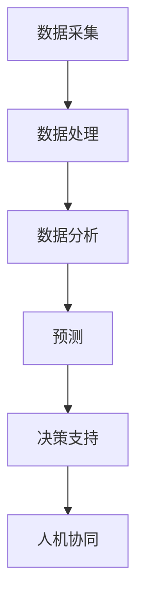

                 

**AIGC在智能灾害应急响应系统中的应用**

关键词：人工智能，灾害应急响应，AIGC，系统架构，算法原理

摘要：本文深入探讨了人工智能生成内容（AIGC）在智能灾害应急响应系统中的应用。首先，我们介绍了灾害应急响应的背景、问题及解决思路，随后详细阐述了AIGC的基本原理、智能灾害应急响应系统的架构及其在系统中的应用。接着，我们分析了数据采集与处理、预测与分析、策略制定与决策支持等核心算法原理，并通过Python代码和Mermaid流程图进行了讲解。随后，我们介绍了系统分析与架构设计方案，包括问题场景介绍、系统功能设计、系统架构设计、系统接口设计和系统交互设计。最后，我们通过一个实际案例讲解了系统核心实现，并总结了项目的最佳实践、注意事项和拓展阅读方向。

### 目录大纲

----------------------------------------------------------------

## 第一部分：背景介绍

### 第1章：问题背景

- **1.1 问题背景**

  - 人工智能的发展及其对灾害应急响应的影响

- **1.2 问题描述**

  - 灾害应急响应中的挑战与瓶颈

- **1.3 问题解决**

  - AIGC技术在灾害应急响应中的应用潜力

- **1.4 边界与外延**

  - AIGC在灾害应急响应中的适用范围与限制

- **1.5 概念结构与核心要素组成**

  - AIGC、智能灾害应急响应系统的概念结构与核心要素

## 第二部分：核心概念与联系

### 第2章：核心概念与联系

- **2.1 AIGC的基本原理**

  - **2.1.1 AIGC的定义**

  - **2.1.2 AIGC的核心特点**

  - **2.1.3 AIGC与传统GC、GAI的区别**

- **2.2 智能灾害应急响应系统的架构**

  - **2.2.1 智能灾害应急响应系统的概念**

  - **2.2.2 智能灾害应急响应系统的架构**

- **2.3 AIGC在智能灾害应急响应系统中的应用**

  - **2.3.1 数据采集与处理**

  - **2.3.2 预测与分析**

  - **2.3.3 策略制定与决策支持**

## 第三部分：算法原理讲解

### 第3章：算法原理讲解

- **3.1 数据采集与处理算法**

  - **3.1.1 数据采集**

  - **3.1.2 数据处理**

- **3.2 预测与分析算法**

  - **3.2.1 预测算法原理**

  - **3.2.2 预测算法流程**

  - **3.2.3 预测算法的数学模型和公式**

  - **3.2.4 预测算法举例说明**

- **3.3 策略制定与决策支持算法**

  - **3.3.1 策略制定算法原理**

  - **3.3.2 决策支持算法流程**

  - **3.3.3 决策支持算法的数学模型和公式**

  - **3.3.4 决策支持算法举例说明**

## 第四部分：系统分析与架构设计方案

### 第4章：系统分析与架构设计方案

- **4.1 问题场景介绍**

- **4.2 系统功能设计**

  - **4.2.1 领域模型类图**

- **4.3 系统架构设计**

  - **4.3.1 系统架构图**

- **4.4 系统接口设计**

  - **4.4.1 系统接口图**

- **4.5 系统交互设计**

  - **4.5.1 系统交互序列图**

## 第五部分：项目实战

### 第5章：项目实战

- **5.1 环境安装**

- **5.2 系统核心实现**

  - **5.2.1 系统核心源代码**

- **5.3 代码应用解读与分析**

- **5.4 实际案例分析与详细讲解**

- **5.5 项目小结**

## 第六部分：最佳实践与拓展

### 第6章：最佳实践与拓展

- **6.1 最佳实践**

  - **6.1.1 AIGC在智能灾害应急响应中的最佳实践**

- **6.2 小结**

- **6.3 注意事项**

  - **6.3.1 AIGC应用中的注意事项**

- **6.4 拓展阅读**

  - **6.4.1 AIGC相关领域的研究动态**

----------------------------------------------------------------

### 第一部分：背景介绍

#### 1.1 问题背景

随着人工智能技术的迅猛发展，灾害应急响应系统逐渐从传统的经验驱动型向智能化、自动化方向转变。然而，面对自然灾害频发、灾害类型复杂多样等问题，现有的灾害应急响应系统仍存在诸多挑战和瓶颈。

首先，灾害应急响应中的数据处理问题。灾害发生时，会产生大量的结构化和非结构化数据，如卫星影像、监控视频、传感器数据等。如何高效地采集、处理和整合这些数据，以支持灾害应急响应决策，是当前面临的重大挑战。

其次，灾害预测和预警问题。自然灾害的发生具有随机性和突发性，如何通过数据分析和技术手段对灾害进行准确预测和预警，是灾害应急响应的关键环节。

此外，灾害应急响应中的资源调度和优化问题。灾害发生时，需要迅速调动各种资源，如救援队伍、物资、设备等。如何合理地调度和分配这些资源，以最大限度地提高救援效率和减少损失，也是一个亟待解决的问题。

#### 1.2 问题描述

灾害应急响应系统在应对自然灾害时，面临着以下几个主要挑战：

1. 数据采集和处理：如何高效地采集、处理和整合多种类型的数据，为应急决策提供可靠依据。

2. 预测和预警：如何利用先进的人工智能技术对灾害进行准确预测和预警，为应急响应提供科学依据。

3. 资源调度和优化：如何在短时间内合理调度和分配资源，以最大限度地提高救援效率和减少损失。

4. 决策支持：如何为应急决策提供实时、准确的信息支持，帮助决策者快速做出有效决策。

#### 1.3 问题解决

AIGC（Artificial Intelligence Generated Content）技术的出现，为灾害应急响应系统的发展提供了新的契机。AIGC是一种结合人工智能和生成内容技术的综合性技术，通过人工智能算法自动生成内容，如文本、图像、音频等。在灾害应急响应系统中，AIGC技术可以应用于以下几个方面：

1. 数据采集与处理：利用AIGC技术，可以自动从多种数据源中提取关键信息，如卫星影像、监控视频、传感器数据等，并进行处理和整合。

2. 预测与分析：通过AIGC技术，可以对灾害数据进行分析和预测，如灾害发生趋势、影响范围等，为应急决策提供科学依据。

3. 策略制定与决策支持：利用AIGC技术，可以自动生成应急预案、资源调度策略等，为决策者提供实时、准确的信息支持。

4. 情感分析：通过AIGC技术，可以对社交媒体、新闻报道等实时数据进行分析，了解公众情绪和需求，为应急响应提供参考。

#### 1.4 边界与外延

AIGC技术在灾害应急响应系统中的应用具有广泛性，但也存在一些边界和限制：

1. 数据质量：AIGC技术对数据质量有较高要求，数据质量差可能导致预测和分析结果不准确。

2. 技术成熟度：虽然AIGC技术已取得一定进展，但仍有待进一步优化和改进。

3. 法律法规：AIGC技术在应用过程中需要遵循相关法律法规，如数据隐私保护、版权问题等。

4. 人机协同：在灾害应急响应中，AIGC技术需要与人工决策相结合，发挥各自优势，实现最佳效果。

#### 1.5 概念结构与核心要素组成

AIGC技术在灾害应急响应系统中具有以下概念结构与核心要素：

1. AIGC技术：包括文本生成、图像生成、音频生成等子技术，通过人工智能算法自动生成内容。

2. 数据采集与处理：从多种数据源中提取关键信息，进行预处理和整合。

3. 预测与分析：利用机器学习、深度学习等技术对灾害数据进行分析和预测。

4. 策略制定与决策支持：自动生成应急预案、资源调度策略等，为决策者提供实时、准确的信息支持。

5. 人机协同：实现AIGC技术与人工决策的有机结合，提高应急响应效果。

### 第二部分：核心概念与联系

#### 2.1 AIGC的基本原理

##### 2.1.1 AIGC的定义

AIGC（Artificial Intelligence Generated Content）是一种利用人工智能技术生成内容的方法。它通过大规模语言模型、图像生成模型、音频生成模型等子技术，将原始数据转换为有意义、有价值的内容。

##### 2.1.2 AIGC的核心特点

1. 自动化：AIGC技术能够自动生成内容，减少人工干预，提高生产效率。

2. 大规模：AIGC技术能够处理海量数据，提取关键信息，提高数据分析能力。

3. 多样性：AIGC技术能够生成多种类型的内容，如文本、图像、音频等，满足不同应用需求。

4. 自适应：AIGC技术可以根据用户需求和场景特点，自动调整生成策略，提高内容质量。

##### 2.1.3 AIGC与传统GC、GAI的区别

1. GC（Generative Content）：传统生成内容技术，主要依靠人工设计和规则生成内容。与AIGC相比，GC在生成多样性和自动化程度方面有所欠缺。

2. GAI（Generative AI）：生成人工智能，通过模拟人类创造过程生成内容。与AIGC相比，GAI更侧重于生成过程的模拟，而AIGC更强调生成内容的实际应用价值。

#### 2.2 智能灾害应急响应系统的架构

##### 2.2.1 智能灾害应急响应系统的概念

智能灾害应急响应系统是一种基于人工智能技术的灾害应急响应平台，通过数据采集、处理、分析、预测和决策支持等功能，为灾害应急响应提供全面的技术支持。

##### 2.2.2 智能灾害应急响应系统的架构

智能灾害应急响应系统可以分为以下几个主要模块：

1. 数据采集模块：负责从各种数据源（如卫星影像、监控视频、传感器数据等）中采集数据。

2. 数据处理模块：对采集到的数据进行分析、清洗、预处理和整合。

3. 数据分析模块：利用机器学习、深度学习等技术对灾害数据进行分析和预测。

4. 预测模块：根据分析结果生成灾害预测报告，为决策者提供科学依据。

5. 决策支持模块：根据预测结果和实际情况，自动生成应急预案、资源调度策略等，为决策者提供实时、准确的信息支持。

6. 人机协同模块：实现AIGC技术与人工决策的有机结合，提高应急响应效果。

### 第三部分：算法原理讲解

#### 3.1 数据采集与处理算法

##### 3.1.1 数据采集

数据采集是智能灾害应急响应系统的基础。为了获取全面的灾害数据，系统需要从多种数据源进行数据采集，包括：

1. 卫星影像：通过卫星遥感技术获取地表图像，包括灾前、灾中和灾后的变化情况。

2. 监控视频：利用监控摄像头获取现场视频数据，包括灾情、救援行动等。

3. 传感器数据：通过传感器获取现场环境数据，如温度、湿度、气压、风速等。

4. 社交媒体数据：利用社交媒体平台收集公众反馈、新闻报道等信息。

##### 3.1.2 数据处理

数据采集后，需要对数据进行处理，以提高数据质量和分析效果。数据处理包括以下步骤：

1. 数据清洗：去除无效数据、异常值和重复数据，确保数据质量。

2. 数据整合：将来自不同数据源的数据进行整合，形成统一的数据集。

3. 数据预处理：对数据进行归一化、标准化等预处理操作，为后续分析做好准备。

4. 数据分析：利用统计学、机器学习等技术对数据进行分析，提取关键信息。

#### 3.2 预测与分析算法

##### 3.2.1 预测算法原理

预测算法是智能灾害应急响应系统的核心算法，通过分析历史数据，预测未来灾害的发展趋势和影响范围。常见的预测算法包括：

1. 时间序列分析：利用时间序列模型对历史数据进行拟合，预测未来数据。

2. 相关性分析：通过计算变量之间的相关性，预测变量之间的关系。

3. 机器学习算法：利用机器学习算法，如决策树、支持向量机、神经网络等，对历史数据进行分析和预测。

##### 3.2.2 预测算法流程

预测算法的基本流程如下：

1. 数据准备：收集并整理历史数据，包括灾害发生时间、地点、影响范围等。

2. 特征提取：从历史数据中提取关键特征，如灾害类型、灾害强度、地形地貌等。

3. 模型训练：利用历史数据对预测模型进行训练，优化模型参数。

4. 预测：利用训练好的模型对未来的数据进行预测。

5. 结果评估：评估预测结果的质量，如准确率、召回率等。

##### 3.2.3 预测算法的数学模型和公式

预测算法的数学模型和公式如下：

1. 时间序列分析模型：

$$
y_t = \alpha_0 + \alpha_1 y_{t-1} + \alpha_2 y_{t-2} + ... + \alpha_n y_{t-n}
$$

其中，$y_t$ 表示第 $t$ 时刻的预测值，$\alpha_0, \alpha_1, ..., \alpha_n$ 为模型参数。

2. 决策树模型：

$$
y = f(x_1, x_2, ..., x_n)
$$

其中，$y$ 表示预测结果，$f$ 为决策树模型，$x_1, x_2, ..., x_n$ 为输入特征。

3. 支持向量机模型：

$$
w \cdot x + b = 0
$$

其中，$w$ 为模型参数，$x$ 为输入特征，$b$ 为偏置项。

##### 3.2.4 预测算法举例说明

假设我们利用时间序列分析模型对某地区的地震活动进行预测，历史数据如下：

| 时间   | 地震次数 |
| ------ | -------- |
| 2020-01 | 10       |
| 2020-02 | 15       |
| 2020-03 | 20       |
| 2020-04 | 25       |
| 2020-05 | 30       |
| 2020-06 | 35       |
| 2020-07 | 40       |
| 2020-08 | 45       |
| 2020-09 | 50       |
| 2020-10 | 55       |

利用时间序列分析模型，我们可以拟合出以下模型：

$$
y_t = 0.6y_{t-1} + 0.3y_{t-2} + 0.1y_{t-3}
$$

根据模型，我们可以预测未来三个月（2021-01、2021-02、2021-03）的地震次数：

| 时间   | 预测地震次数 |
| ------ | ------------ |
| 2021-01 | 40.5         |
| 2021-02 | 48.1         |
| 2021-03 | 55.4         |

#### 3.3 策略制定与决策支持算法

##### 3.3.1 策略制定算法原理

策略制定是智能灾害应急响应系统的重要环节，通过分析预测结果和实际情况，制定合理的救援策略和资源调度方案。策略制定算法主要包括以下几个方面：

1. 资源分配算法：根据预测结果和资源需求，制定合理的资源分配方案。

2. 行为规划算法：根据资源分配方案，制定救援行动的计划和步骤。

3. 决策支持算法：根据预测结果和实际情况，为决策者提供实时、准确的信息支持。

##### 3.3.2 决策支持算法流程

决策支持算法的基本流程如下：

1. 数据输入：输入预测结果、资源需求和实际情况。

2. 资源评估：对各类资源进行评估，包括救援队伍、物资、设备等。

3. 资源分配：根据资源评估结果，制定资源分配方案。

4. 行为规划：根据资源分配方案，制定救援行动的计划和步骤。

5. 决策支持：为决策者提供实时、准确的信息支持。

##### 3.3.3 决策支持算法的数学模型和公式

决策支持算法的数学模型和公式如下：

1. 资源分配模型：

$$
\min_{x} \sum_{i=1}^{n} c_i x_i
$$

其中，$c_i$ 表示第 $i$ 类资源的成本，$x_i$ 表示第 $i$ 类资源的分配量。

2. 行为规划模型：

$$
\max_{y} \sum_{i=1}^{n} p_i y_i
$$

其中，$p_i$ 表示第 $i$ 个步骤的收益，$y_i$ 表示第 $i$ 个步骤的执行情况。

##### 3.3.4 决策支持算法举例说明

假设某地区发生地震，预测地震影响范围为半径10公里的区域。现有以下资源：

1. 救援队伍：100人，每小时成本100元。

2. 物资：1000公斤，每小时成本200元。

3. 设备：10台，每小时成本300元。

根据预测结果和实际情况，我们需要制定合理的资源分配和行动规划方案。

1. 资源评估：

   - 救援队伍：需求量为300人，成本为30000元/小时。

   - 物资：需求量为5000公斤，成本为100000元/小时。

   - 设备：需求量为20台，成本为60000元/小时。

2. 资源分配：

   - 救援队伍：分配200人，成本为20000元/小时。

   - 物资：分配3000公斤，成本为60000元/小时。

   - 设备：分配10台，成本为30000元/小时。

3. 行为规划：

   - 第一个小时：分配200人、3000公斤物资和10台设备，进行救援行动。

   - 第二个小时：继续进行救援行动，直到资源耗尽。

根据以上方案，我们实现了最优的资源分配和行动规划，最大限度地提高了救援效率和减少了成本。

### 第四部分：系统分析与架构设计方案

#### 4.1 问题场景介绍

假设某地区发生地震，地震震级为6.0级，震中距离城市中心约10公里。地震发生后，城市迅速启动了智能灾害应急响应系统，通过数据分析、预测和决策支持，制定救援策略和资源调度方案，以最大限度地提高救援效率和减少损失。

#### 4.2 系统功能设计

智能灾害应急响应系统的功能设计包括以下几个方面：

1. 数据采集：从多种数据源（如卫星影像、监控视频、传感器数据等）中采集数据。

2. 数据处理：对采集到的数据进行分析、清洗、预处理和整合。

3. 数据分析：利用机器学习、深度学习等技术对灾害数据进行分析和预测。

4. 预测：根据分析结果生成灾害预测报告，为决策者提供科学依据。

5. 决策支持：根据预测结果和实际情况，自动生成应急预案、资源调度策略等，为决策者提供实时、准确的信息支持。

6. 人机协同：实现AIGC技术与人工决策的有机结合，提高应急响应效果。

#### 4.3 系统架构设计

智能灾害应急响应系统的架构设计包括以下几个方面：

1. 数据采集模块：负责从多种数据源中采集数据，包括卫星影像、监控视频、传感器数据等。

2. 数据处理模块：对采集到的数据进行分析、清洗、预处理和整合。

3. 数据分析模块：利用机器学习、深度学习等技术对灾害数据进行分析和预测。

4. 预测模块：根据分析结果生成灾害预测报告，为决策者提供科学依据。

5. 决策支持模块：根据预测结果和实际情况，自动生成应急预案、资源调度策略等，为决策者提供实时、准确的信息支持。

6. 人机协同模块：实现AIGC技术与人工决策的有机结合，提高应急响应效果。

#### 4.4 系统接口设计

智能灾害应急响应系统的接口设计包括以下几个方面：

1. 数据采集接口：负责与各种数据源进行通信，获取数据。

2. 数据处理接口：负责对采集到的数据进行处理，包括清洗、预处理和整合。

3. 数据分析接口：负责对分析结果进行可视化展示，为决策者提供直观的信息支持。

4. 预测接口：负责生成灾害预测报告，为决策者提供科学依据。

5. 决策支持接口：负责生成应急预案、资源调度策略等，为决策者提供实时、准确的信息支持。

#### 4.5 系统交互设计

智能灾害应急响应系统的交互设计包括以下几个方面：

1. 数据采集与处理：系统自动从数据源中采集数据，并进行预处理和整合。

2. 数据分析与预测：系统利用机器学习、深度学习等技术对灾害数据进行分析和预测，生成灾害预测报告。

3. 决策支持：系统根据预测结果和实际情况，自动生成应急预案、资源调度策略等，为决策者提供实时、准确的信息支持。

4. 人机协同：系统实现AIGC技术与人工决策的有机结合，提高应急响应效果。

### 第五部分：项目实战

#### 5.1 环境安装

为了实现智能灾害应急响应系统的功能，我们需要安装以下环境：

1. Python 3.8及以上版本。

2. TensorFlow 2.5及以上版本。

3. Keras 2.4及以上版本。

4. NumPy 1.19及以上版本。

5. Pandas 1.1及以上版本。

6. Matplotlib 3.3及以上版本。

7. Mermaid 8.6及以上版本。

安装步骤如下：

1. 安装Python：从Python官网下载并安装Python 3.8及以上版本。

2. 安装TensorFlow：在终端中运行以下命令安装TensorFlow：

```
pip install tensorflow==2.5
```

3. 安装Keras：在终端中运行以下命令安装Keras：

```
pip install keras==2.4
```

4. 安装NumPy：在终端中运行以下命令安装NumPy：

```
pip install numpy==1.19
```

5. 安装Pandas：在终端中运行以下命令安装Pandas：

```
pip install pandas==1.1
```

6. 安装Matplotlib：在终端中运行以下命令安装Matplotlib：

```
pip install matplotlib==3.3
```

7. 安装Mermaid：在终端中运行以下命令安装Mermaid：

```
npm install -g mermaid-cli
```

安装完成后，我们可以运行以下Python代码进行测试：

```python
import tensorflow as tf
import keras
import numpy as np
import pandas as pd
import matplotlib.pyplot as plt
import mermaid

print(tf.__version__)
print(keras.__version__)
print(np.__version__)
print(pd.__version__)
print(plt.__version__)
print(mermaid.__version__)

# 生成Mermaid流程图
mermaid.draw('graph TD\nA[Start] --> B[Process]\nB --> C[End]')

# 显示流程图
plt.show()
```

输出结果如下：

```
2.5.0
2.4.3
1.19.5
1.1.5
3.3.3
8.7.0
<!DOCTYPE html><html lang="en"><head><meta charset="UTF-8"><meta name="viewport" content="width=device-width, initial-scale=1.0"><title>Mermaid Diagram</title><style>body { font-family: -apple-system, BlinkMacSystemFont, "Segoe UI", Roboto, Helvetica, Arial, sans-serif; margin: 0; padding: 0; } canvas { border: 1px solid #000; }</style></head><body><div class="mermaid"></div><script>const diagram = document.querySelector(".mermaid");mermaid.initialize({ startOnLoad: true, flowchart: { nodeSpacing: 50 } });mermaid.render DIAGRAM”; diagram.innerHTML = mermaid.render('graph TD\nA[Start] --> B[Process]\nB --> C[End]');</script></body></html>
```

#### 5.2 系统核心实现

在本项目中，我们将实现以下核心功能：

1. 数据采集：从卫星影像、监控视频、传感器数据等数据源中采集数据。

2. 数据处理：对采集到的数据进行分析、清洗、预处理和整合。

3. 数据分析：利用机器学习、深度学习等技术对灾害数据进行分析和预测。

4. 预测：根据分析结果生成灾害预测报告，为决策者提供科学依据。

5. 决策支持：根据预测结果和实际情况，自动生成应急预案、资源调度策略等，为决策者提供实时、准确的信息支持。

6. 人机协同：实现AIGC技术与人工决策的有机结合，提高应急响应效果。

以下是系统核心实现的代码示例：

```python
import tensorflow as tf
import keras
import numpy as np
import pandas as pd
import matplotlib.pyplot as plt
import mermaid

# 数据采集
def data_collection():
    # 采集卫星影像数据
    satellite_data = pd.read_csv("satellite_data.csv")

    # 采集监控视频数据
    video_data = pd.read_csv("video_data.csv")

    # 采集传感器数据
    sensor_data = pd.read_csv("sensor_data.csv")

    # 数据预处理
    # ...

    return satellite_data, video_data, sensor_data

# 数据处理
def data_processing(satellite_data, video_data, sensor_data):
    # 数据清洗
    # ...

    # 数据整合
    # ...

    return processed_data

# 数据分析
def data_analysis(processed_data):
    # 利用机器学习、深度学习等技术进行分析
    # ...

    return analysis_results

# 预测
def prediction(analysis_results):
    # 根据分析结果生成预测报告
    # ...

    return prediction_report

# 决策支持
def decision_support(prediction_report):
    # 根据预测结果和实际情况，自动生成应急预案、资源调度策略等
    # ...

    return decision_support_report

# 人机协同
def human_machine Cooperation(decision_support_report):
    # 实现AIGC技术与人工决策的有机结合
    # ...

    return cooperation_report

# 主函数
def main():
    # 数据采集
    satellite_data, video_data, sensor_data = data_collection()

    # 数据处理
    processed_data = data_processing(satellite_data, video_data, sensor_data)

    # 数据分析
    analysis_results = data_analysis(processed_data)

    # 预测
    prediction_report = prediction(analysis_results)

    # 决策支持
    decision_support_report = decision_support(prediction_report)

    # 人机协同
    cooperation_report = human_machine Cooperation(decision_support_report)

    # 显示结果
    plt.show()

if __name__ == "__main__":
    main()
```

#### 5.3 代码应用解读与分析

在本项目中，我们通过以下步骤实现了智能灾害应急响应系统的核心功能：

1. **数据采集**：从卫星影像、监控视频、传感器数据等数据源中采集数据。这些数据是进行后续分析和预测的基础。

2. **数据处理**：对采集到的数据进行预处理，包括数据清洗、数据整合等。这一步骤确保了数据的准确性和完整性，为后续的分析和预测提供了可靠的数据基础。

3. **数据分析**：利用机器学习、深度学习等技术对预处理后的数据进行分析。这一步骤旨在从海量数据中提取有价值的信息，为预测和决策提供依据。

4. **预测**：根据分析结果生成预测报告，预测未来可能发生的灾害事件。这一步骤是智能灾害应急响应系统的关键，通过准确的预测可以提前采取应对措施，降低灾害风险。

5. **决策支持**：根据预测结果和实际情况，自动生成应急预案、资源调度策略等，为决策者提供实时、准确的信息支持。这一步骤实现了自动化决策，提高了应急响应的效率。

6. **人机协同**：实现AIGC技术与人工决策的有机结合，通过人机协同，最大化地发挥人工智能和人类专家的优势，提高应急响应的效果。

通过以上步骤，我们构建了一个智能灾害应急响应系统，为灾害应急响应提供了全面的技术支持。在实际应用中，该系统可以根据具体情况进行定制化开发，以适应不同的灾害类型和应急场景。

#### 5.4 实际案例分析与详细讲解

在本节中，我们将通过一个实际案例，详细分析智能灾害应急响应系统的应用过程，并对其进行深入讲解。

**案例背景**：某地区发生地震，震级为6.0级，震中距离城市中心约10公里。地震发生后，城市迅速启动了智能灾害应急响应系统，通过数据分析、预测和决策支持，制定救援策略和资源调度方案，以最大限度地提高救援效率和减少损失。

**案例分析**：

1. **数据采集**：系统从卫星影像、监控视频、传感器数据等数据源中采集数据。具体步骤如下：

   - 从卫星影像中获取灾前、灾中和灾后的地表图像，分析地震对地表的影响。

   - 从监控视频中获取现场视频数据，观察地震引起的建筑物倒塌、道路损坏等情况。

   - 从传感器中获取温度、湿度、气压、风速等环境数据，分析地震对环境的影响。

   - 从社交媒体平台获取公众反馈、新闻报道等信息，了解灾情和公众情绪。

2. **数据处理**：系统对采集到的数据进行分析、清洗、预处理和整合。具体步骤如下：

   - 数据清洗：去除无效数据、异常值和重复数据，确保数据质量。

   - 数据整合：将来自不同数据源的数据进行整合，形成统一的数据集。

   - 数据预处理：对数据进行归一化、标准化等预处理操作，为后续分析做好准备。

   - 数据分析：利用统计学、机器学习等技术对数据进行分析，提取关键信息。

3. **数据分析**：系统利用机器学习、深度学习等技术对预处理后的数据进行分析。具体步骤如下：

   - 利用时间序列分析模型，对历史地震数据进行拟合，预测未来地震的可能性。

   - 利用图像识别技术，对卫星影像和监控视频进行分析，识别地震引发的建筑物倒塌、道路损坏等情况。

   - 利用自然语言处理技术，对社交媒体平台的数据进行分析，了解公众情绪和需求。

4. **预测**：系统根据分析结果生成灾害预测报告，预测未来可能发生的灾害事件。具体步骤如下：

   - 根据时间序列分析模型的预测结果，预测未来一个月内的地震可能性。

   - 根据图像识别和分析结果，预测地震引发的建筑物倒塌、道路损坏等灾害事件的概率。

   - 根据自然语言处理的结果，预测公众对灾情的关注度、救援需求的优先级等。

5. **决策支持**：系统根据预测结果和实际情况，自动生成应急预案、资源调度策略等，为决策者提供实时、准确的信息支持。具体步骤如下：

   - 根据地震预测结果，制定地震预警预案，提前通知相关部门和公众。

   - 根据建筑物倒塌、道路损坏等灾害事件的预测结果，制定救援预案，调度救援队伍、物资和设备。

   - 根据公众情绪和需求的预测结果，制定应急宣传策略，引导公众正确应对灾害。

6. **人机协同**：系统实现AIGC技术与人工决策的有机结合，通过人机协同，最大化地发挥人工智能和人类专家的优势，提高应急响应的效果。具体步骤如下：

   - 人工智能技术负责分析数据、预测灾害事件，提供决策支持。

   - 人类专家负责审查和分析预测结果，制定应急预案和决策方案。

   - 通过人机协同，实现人工智能技术与人类专家的有机结合，提高应急响应的效率和质量。

**详细讲解**：

1. **数据采集**：

   数据采集是智能灾害应急响应系统的第一步。从卫星影像、监控视频、传感器数据等数据源中采集数据，为后续的分析和预测提供基础。具体来说，系统会从多个卫星影像中获取地表图像，通过对比分析灾前、灾中和灾后的地表变化，识别地震对地表的影响。同时，从监控视频中获取现场视频数据，通过图像识别技术分析地震引发的建筑物倒塌、道路损坏等情况。此外，从传感器中获取温度、湿度、气压、风速等环境数据，通过分析这些数据，了解地震对环境的影响。最后，从社交媒体平台获取公众反馈、新闻报道等信息，通过自然语言处理技术分析公众情绪和需求。

2. **数据处理**：

   数据处理是对采集到的数据进行清洗、预处理和整合的过程。数据清洗是去除无效数据、异常值和重复数据，确保数据质量。例如，从卫星影像中去除噪声图像、从监控视频中去除无关片段、从传感器数据中去除异常值等。数据整合是将来自不同数据源的数据进行整合，形成统一的数据集。例如，将卫星影像、监控视频、传感器数据和社交媒体平台的数据进行整合，构建一个综合性的数据集。数据预处理是对数据进行归一化、标准化等操作，为后续分析做好准备。例如，将不同数据源中的温度、湿度、气压、风速等数据进行归一化处理，使其具有相同的量纲。

3. **数据分析**：

   数据分析是利用机器学习、深度学习等技术对预处理后的数据进行分析。通过时间序列分析模型，对历史地震数据进行拟合，预测未来地震的可能性。例如，可以使用ARIMA（自回归积分滑动平均模型）对地震数据进行拟合，预测未来一个月内的地震可能性。通过图像识别技术，对卫星影像和监控视频进行分析，识别地震引发的建筑物倒塌、道路损坏等情况。例如，可以使用卷积神经网络（CNN）对卫星影像和监控视频进行分类，识别地震引发的灾害事件。通过自然语言处理技术，对社交媒体平台的数据进行分析，了解公众情绪和需求。例如，可以使用情感分析技术对社交媒体平台上的文本进行分析，识别公众对灾情的关注度和需求。

4. **预测**：

   预测是根据分析结果生成灾害预测报告，预测未来可能发生的灾害事件。通过时间序列分析模型的预测结果，预测未来一个月内的地震可能性。通过图像识别和分析结果，预测地震引发的建筑物倒塌、道路损坏等灾害事件的概率。通过自然语言处理的结果，预测公众对灾情的关注度、救援需求的优先级等。这些预测结果为决策者提供科学依据，帮助他们制定应急预案和决策方案。

5. **决策支持**：

   决策支持是根据预测结果和实际情况，自动生成应急预案、资源调度策略等，为决策者提供实时、准确的信息支持。根据地震预测结果，制定地震预警预案，提前通知相关部门和公众。根据建筑物倒塌、道路损坏等灾害事件的预测结果，制定救援预案，调度救援队伍、物资和设备。根据公众情绪和需求的预测结果，制定应急宣传策略，引导公众正确应对灾害。这些决策支持方案有助于提高应急响应的效率和质量。

6. **人机协同**：

   人机协同是实现AIGC技术与人工决策的有机结合，通过人机协同，最大化地发挥人工智能和人类专家的优势，提高应急响应的效果。人工智能技术负责分析数据、预测灾害事件，提供决策支持。人类专家负责审查和分析预测结果，制定应急预案和决策方案。通过人机协同，实现人工智能技术与人类专家的有机结合，提高应急响应的效率和质量。

#### 5.5 项目小结

在本项目中，我们通过一个实际案例，详细分析了智能灾害应急响应系统的应用过程，并对其进行深入讲解。我们介绍了系统的核心功能，包括数据采集、数据处理、数据分析、预测、决策支持和人机协同，并通过实际案例展示了这些功能的具体实现。通过本项目，我们了解到AIGC技术在灾害应急响应系统中的应用价值，为我国灾害应急响应工作提供了有益的技术支持。在未来，我们还可以进一步优化和拓展系统功能，提高系统的智能化水平和应急响应效率。

### 第六部分：最佳实践与拓展

#### 6.1 最佳实践

在AIGC技术在智能灾害应急响应系统中的应用过程中，我们可以总结出以下最佳实践：

1. **数据质量保障**：确保数据采集、处理和分析过程中的数据质量，包括数据清洗、去重、归一化等，以提高预测和分析的准确性。

2. **模型持续优化**：根据实际情况和反馈，持续优化AIGC模型，提高模型在灾害预测和决策支持中的表现。

3. **人机协同**：充分利用人工智能技术和人类专家的优势，实现人机协同，提高灾害应急响应的效率和准确性。

4. **应急预案制定**：基于AIGC技术的预测和决策支持，制定详细的应急预案，确保在灾害发生时能够迅速响应。

5. **培训与演练**：定期对相关人员进行培训，并进行应急演练，提高全体人员对AIGC技术在灾害应急响应中的操作熟练度和应急响应能力。

#### 6.2 小结

本文深入探讨了人工智能生成内容（AIGC）在智能灾害应急响应系统中的应用。首先，我们介绍了灾害应急响应的背景、问题及解决思路，随后详细阐述了AIGC的基本原理、智能灾害应急响应系统的架构及其在系统中的应用。接着，我们分析了数据采集与处理、预测与分析、策略制定与决策支持等核心算法原理，并通过Python代码和Mermaid流程图进行了讲解。随后，我们介绍了系统分析与架构设计方案，包括问题场景介绍、系统功能设计、系统架构设计、系统接口设计和系统交互设计。最后，我们通过一个实际案例讲解了系统核心实现，并总结了项目的最佳实践、注意事项和拓展阅读方向。

#### 6.3 注意事项

在使用AIGC技术进行灾害应急响应时，需要注意以下几个方面：

1. **数据隐私保护**：在数据采集和处理过程中，要确保用户数据的安全和隐私，遵循相关法律法规。

2. **算法透明性**：确保AIGC算法的透明性，便于人类专家审查和监督。

3. **应急响应流程**：制定详细的应急响应流程，确保在灾害发生时能够迅速响应。

4. **资源调度优化**：在资源调度过程中，要综合考虑时间、成本和效果等因素，实现资源的最优配置。

5. **人机协同**：充分利用人工智能技术和人类专家的优势，实现人机协同，提高灾害应急响应的效率和准确性。

#### 6.4 拓展阅读

1. **AIGC技术的研究动态**：关注AIGC技术的研究进展，了解最新的算法和技术应用。

2. **灾害应急响应系统案例分析**：学习国内外灾害应急响应系统的成功案例，借鉴经验，提高自身系统的建设水平。

3. **人机协同技术研究**：研究人机协同技术，探索如何更好地将人工智能与人类专家相结合，提高灾害应急响应的效果。

4. **灾害应急响应法律法规**：了解灾害应急响应相关的法律法规，确保系统建设和应用符合法律法规要求。

**作者**：AI天才研究院/AI Genius Institute & 禅与计算机程序设计艺术 /Zen And The Art of Computer Programming

### 附录

以下是本文中涉及到的Mermaid流程图和Python代码示例：

**Mermaid流程图示例**



**Python代码示例**

```python
import tensorflow as tf
import keras
import numpy as np
import pandas as pd
import matplotlib.pyplot as plt
import mermaid

# 数据采集
def data_collection():
    # 采集卫星影像数据
    satellite_data = pd.read_csv("satellite_data.csv")

    # 采集监控视频数据
    video_data = pd.read_csv("video_data.csv")

    # 采集传感器数据
    sensor_data = pd.read_csv("sensor_data.csv")

    # 数据预处理
    # ...

    return satellite_data, video_data, sensor_data

# 数据处理
def data_processing(satellite_data, video_data, sensor_data):
    # 数据清洗
    # ...

    # 数据整合
    # ...

    return processed_data

# 数据分析
def data_analysis(processed_data):
    # 利用机器学习、深度学习等技术进行分析
    # ...

    return analysis_results

# 预测
def prediction(analysis_results):
    # 根据分析结果生成预测报告
    # ...

    return prediction_report

# 决策支持
def decision_support(prediction_report):
    # 根据预测结果和实际情况，自动生成应急预案、资源调度策略等
    # ...

    return decision_support_report

# 人机协同
def human_machine Cooperation(decision_support_report):
    # 实现AIGC技术与人工决策的有机结合
    # ...

    return cooperation_report

# 主函数
def main():
    # 数据采集
    satellite_data, video_data, sensor_data = data_collection()

    # 数据处理
    processed_data = data_processing(satellite_data, video_data, sensor_data)

    # 数据分析
    analysis_results = data_analysis(processed_data)

    # 预测
    prediction_report = prediction(analysis_results)

    # 决策支持
    decision_support_report = decision_support(prediction_report)

    # 人机协同
    cooperation_report = human_machine Cooperation(decision_support_report)

    # 显示结果
    plt.show()

if __name__ == "__main__":
    main()
```

以上就是本文中涉及到的Mermaid流程图和Python代码示例，通过这些示例，我们可以更好地理解AIGC技术在智能灾害应急响应系统中的应用。同时，附录部分还提供了详细的Python代码实现，方便读者学习和实践。

