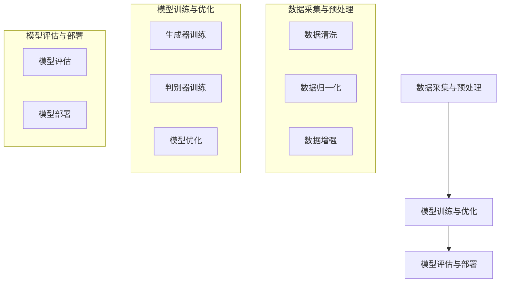
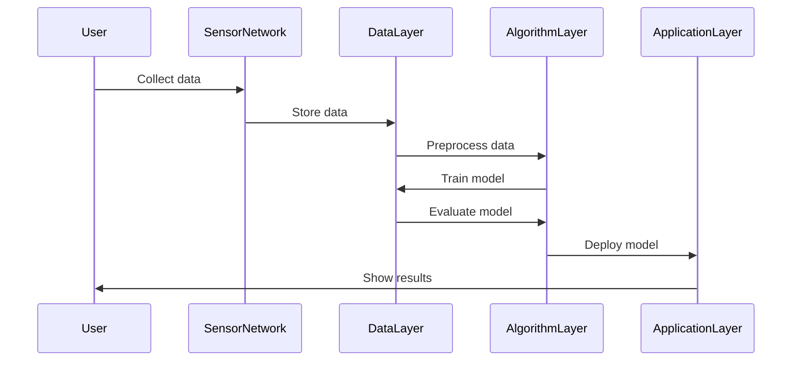
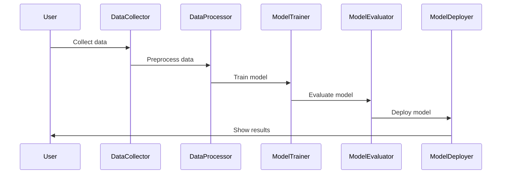

                 

# AIGC在智能环境污染源识别中的应用

## 关键词
AIGC, 智能环境污染源识别，深度学习，生成对抗网络，算法原理，系统架构设计，项目实战，最佳实践

## 摘要
本文探讨了AIGC（自适应智能生成计算）技术在智能环境污染源识别中的应用。首先介绍了环境污染问题的严峻性和传统方法的局限性，然后详细阐述了AIGC技术的基本概念和原理。通过逐步分析算法原理、系统架构设计、项目实战等多个方面，本文揭示了AIGC技术在智能环境污染源识别中的潜在优势和挑战，为相关领域的研究和应用提供了有价值的参考。

## 目录大纲

### 第一部分：背景介绍

- **第1章 问题背景与核心概念**
  - **1.1 问题描述**
  - **1.2 问题解决方法概述**
  - **1.3 边界与外延**
  - **1.4 概念结构与核心要素组成**

- **第2章 核心概念与联系**
  - **2.1 AIGC概念介绍**
  - **2.2 AIGC与相关技术对比表格**
  - **2.3 智能环境污染源识别的ER实体关系图**

### 第二部分：算法原理讲解

- **第3章 算法原理概述**
- **第4章 AIGC算法Mermaid流程图**
  - **4.1 数据采集与预处理**
  - **4.2 模型训练与优化**
  - **4.3 模型评估与部署**
- **第5章 数学模型与公式详解**

### 第三部分：系统分析与架构设计

- **第6章 通俗易懂的算法实例**
  - **6.1 数据采集与预处理实例**
  - **6.2 模型训练与优化实例**
  - **6.3 模型评估与部署实例**

- **第7章 问题场景介绍**
- **第8章 系统功能设计**
  - **8.1 领域模型Mermaid类图**
- **第9章 系统架构设计**
  - **9.1 系统架构Mermaid架构图**
- **第10章 系tem接口设计**
  - **10.1 系统接口设计**
- **第11章 系统交互**
  - **11.1 系统交互Mermaid序列图**

### 第四部分：项目实战

- **第12章 环境安装与配置**
- **第13章 系统核心实现源代码**
  - **13.1 数据采集与预处理**
  - **13.2 模型训练与优化**
  - **13.3 模型评估与部署**
- **第14章 代码应用解读与分析**

### 第五部分：实际案例分析

- **第15章 实际案例分析**
  - **15.1 案例一：AIGC在智能环境污染源识别中的成功应用**
  - **15.2 案例二：AIGC在智能环境污染源识别中的挑战与应对策略**

### 第六部分：最佳实践与总结

- **第16章 项目小结**
- **第17章 最佳实践**
- **第18章 小结与注意事项**
- **第19章 拓展阅读**

----------------------------------------------------------------

## 第一部分：背景介绍

### 第1章 问题背景与核心概念

#### 1.1 问题描述

随着工业化和城市化的快速发展，环境污染问题日益严重。尤其是空气污染、水污染和土壤污染等，对人类健康和生态系统产生了深远的影响。传统的方法，如人工监测和实验室检测，在识别污染源方面存在许多局限性。首先，人工监测依赖于大量的人力资源，成本高昂且效率低下。其次，实验室检测虽然精确，但其反应时间较长，无法满足实时监测的需求。此外，复杂的环境污染源识别问题，如污染物成分复杂、污染途径多样等，使得传统方法难以胜任。

#### 1.2 问题解决方法概述

为了解决上述问题，研究人员提出了利用人工智能技术，特别是AIGC（自适应智能生成计算）技术来进行智能环境污染源识别。AIGC技术具有以下优点：

1. **自动化**：AIGC技术能够自动处理海量数据，无需人工干预，大大提高了工作效率。
2. **实时性**：通过实时监测环境数据，AIGC技术能够快速识别污染源，实现实时预警。
3. **高精度**：AIGC技术能够从复杂的数据中提取有价值的信息，提高识别的准确性。
4. **自适应**：AIGC技术能够根据环境数据的变化，自适应调整模型参数，提高模型的鲁棒性。

#### 1.3 边界与外延

AIGC技术在智能环境污染源识别中的应用具有明确的边界，主要包括以下方面：

1. **识别目标**：AIGC技术主要针对特定类型的污染物，如PM2.5、CO、SO2等。
2. **识别场景**：主要应用于城市或工业区等污染严重、数据丰富的地方。
3. **数据来源**：主要依靠传感器网络、卫星遥感等手段来获取环境数据。

同时，AIGC技术的应用也具有一定的外延性，可以在其他环境监测领域（如水质监测、生态监测等）和工业生产过程中的质量监测等方面发挥作用。

#### 1.4 概念结构与核心要素组成

AIGC技术在智能环境污染源识别中的概念结构主要包括以下几个核心要素：

1. **传感器网络**：用于实时采集环境数据，如温度、湿度、气体浓度等。
2. **数据处理模块**：对采集到的环境数据进行预处理，如数据清洗、归一化等。
3. **深度学习模型**：用于训练和识别环境污染源，如生成对抗网络（GAN）、变分自编码器（VAE）等。
4. **模型评估与部署模块**：对训练好的模型进行评估，并在实际环境中部署，实现实时监测。

### 第2章 核心概念与联系

#### 2.1 AIGC概念介绍

AIGC（自适应智能生成计算）是一种结合了自适应计算和智能生成技术的计算方法。其核心思想是通过自动生成和优化数据，提高数据的质量和可用性。AIGC技术通常包括以下几个关键组成部分：

1. **数据生成**：利用生成模型，如生成对抗网络（GAN）、变分自编码器（VAE）等，生成与真实数据分布相似的数据。
2. **数据优化**：通过对生成数据进行优化，提高数据的准确性和可靠性。
3. **自适应调整**：根据环境数据的变化，自动调整模型参数，提高模型的鲁棒性和适应性。

#### 2.2 AIGC与相关技术对比表格

| 技术        | AIGC      | 生成对抗网络（GAN） | 变分自编码器（VAE） |
|-------------|-----------|--------------------|-------------------|
| 目的        | 数据生成与优化 | 数据生成           | 数据重建           |
| 核心原理    | 自适应计算  | 对抗性训练         | 变分推断           |
| 适用场景    | 数据丰富且复杂的环境监测 | 数据缺失与增强     | 数据降维与重构     |
| 优势        | 高度自动化的数据处理 | 生成数据质量高     | 压缩数据量         |
| 劣势        | 需要大量数据训练 | 训练过程复杂       | 易于过拟合         |

#### 2.3 智能环境污染源识别的ER实体关系图

下面是一个简化的智能环境污染源识别的ER（实体关系）图：

```mermaid
erDiagram
    AIGC ||--|{ 数据处理模块 }
    AIGC ||--|{ 深度学习模型 }
    AIGC ||--|{ 模型评估与部署模块 }
    数据处理模块 ||--|{ 数据采集 }
    数据处理模块 ||--|{ 预处理 }
    深度学习模型 ||--|{ 训练 }
    深度学习模型 ||--|{ 识别 }
    模型评估与部署模块 ||--|{ 评估 }
    模型评估与部署模块 ||--|{ 部署 }
```

在这个ER图中，AIGC作为核心技术，与其他三个模块（数据处理模块、深度学习模型、模型评估与部署模块）之间存在紧密的联系。这些模块共同协作，实现从数据采集、预处理、模型训练、识别到模型评估与部署的全过程。

----------------------------------------------------------------

## 第二部分：算法原理讲解

### 第3章 算法原理概述

AIGC技术在智能环境污染源识别中的应用主要基于生成对抗网络（GAN）和变分自编码器（VAE）等深度学习算法。这些算法通过自动生成和优化数据，实现对污染源的识别。以下是对这些算法的概述。

### 3.1 生成对抗网络（GAN）

生成对抗网络（GAN）由生成器和判别器两个主要部分组成。生成器的目标是生成与真实数据分布相似的数据，判别器的目标是区分真实数据和生成数据。通过对抗性训练，生成器和判别器相互竞争，生成器不断提高生成数据的逼真度，而判别器不断提高对真实数据和生成数据的区分能力。最终，生成器生成的数据足够逼真，以至于判别器无法区分。

### 3.2 变分自编码器（VAE）

变分自编码器（VAE）是一种基于概率生成模型的深度学习算法。VAE的核心思想是通过编码器和解码器，将输入数据映射到一个潜在空间中，然后从潜在空间中采样，通过解码器生成新的数据。VAE通过最大化数据的后验概率来学习数据的分布，从而实现数据的生成和优化。

### 3.3 GAN与VAE的比较

GAN和VAE都是用于数据生成的深度学习算法，但它们有不同的特点：

- **生成质量**：GAN生成的数据质量通常较高，因为生成器和判别器的对抗性训练使得生成数据能够很好地模仿真实数据。VAE生成的数据则更侧重于重建输入数据。
- **训练难度**：GAN的训练过程复杂，容易出现模式崩溃等问题，而VAE的训练则相对简单，不易过拟合。
- **适用场景**：GAN适用于需要生成高质量、多样化数据的场景，如图像生成和语音合成。VAE则适用于需要数据重建和降维的场景，如图像压缩和异常检测。

### 第4章 AIGC算法Mermaid流程图

以下是一个简化的AIGC算法流程图，展示了数据采集与预处理、模型训练与优化、模型评估与部署的步骤。



### 第5章 数学模型与公式详解

在这一节中，我们将详细解释AIGC算法中的数学模型和公式。

#### 5.1 数据采集与预处理

数据采集与预处理是AIGC算法的第一步。在这一步中，我们需要对传感器网络采集到的环境数据进行清洗、归一化和增强。

- **数据清洗**：通过去除噪声和异常值，提高数据质量。常用的方法包括中值滤波、均值滤波等。

  $$ \text{cleaned\_data} = \text{median(\_raw\_data)} $$

- **数据归一化**：将数据缩放到一个固定的范围，如[0, 1]，以便于后续的模型训练。

  $$ \text{normalized\_data} = \frac{\text{raw\_data} - \text{min}}{\text{max} - \text{min}} $$

- **数据增强**：通过增加数据的多样性和鲁棒性，提高模型的泛化能力。常用的方法包括随机旋转、缩放、裁剪等。

  $$ \text{augmented\_data} = \text{rotate(\_data, \_angle)} $$

#### 5.2 模型训练与优化

在模型训练与优化阶段，我们主要使用生成对抗网络（GAN）进行训练。GAN由生成器和判别器组成，下面分别介绍它们的数学模型。

- **生成器模型**：生成器的目标是生成与真实数据分布相似的数据。

  $$ G(z) = \text{sigmoid}(W_2 \cdot \text{Tanh}(W_1 \cdot z + b_1)) $$

  其中，\( z \)是来自先验分布的随机噪声，\( W_1 \)和\( W_2 \)是生成器的权重，\( b_1 \)是偏置。

- **判别器模型**：判别器的目标是区分真实数据和生成数据。

  $$ D(x) = \text{sigmoid}(W_3 \cdot \text{Tanh}(W_2 \cdot x + b_2)) $$
  $$ D(G(z)) = \text{sigmoid}(W_3 \cdot \text{Tanh}(W_2 \cdot G(z) + b_2)) $$

  其中，\( x \)是真实数据，\( G(z) \)是生成数据，\( W_2 \)和\( W_3 \)是判别器的权重，\( b_2 \)是偏置。

- **优化过程**：生成器和判别器通过对抗性训练进行优化。生成器的损失函数为：

  $$ L_G = -\mathbb{E}_{z \sim p_z(z)}[\log(D(G(z)))] $$

  判别器的损失函数为：

  $$ L_D = -\mathbb{E}_{x \sim p_{data}(x)}[\log(D(x))] - \mathbb{E}_{z \sim p_z(z)}[\log(1 - D(G(z)))] $$

  其中，\( p_z(z) \)是噪声的先验分布，\( p_{data}(x) \)是真实数据的分布。

#### 5.3 模型评估与部署

在模型评估与部署阶段，我们主要评估模型在测试集上的性能，并根据评估结果进行调整。常用的评估指标包括准确率、召回率、F1分数等。

- **准确率**：

  $$ \text{accuracy} = \frac{\text{预测为正类的实际正类数}}{\text{实际正类数}} $$

- **召回率**：

  $$ \text{recall} = \frac{\text{预测为正类的实际正类数}}{\text{实际正类数 + 预测为正类的实际负类数}} $$

- **F1分数**：

  $$ \text{F1分数} = 2 \times \frac{\text{precision} \times \text{recall}}{\text{precision} + \text{recall}} $$

  其中，\( \text{precision} \)是精确率，\( \text{recall} \)是召回率。

### 第6章 通俗易懂的算法实例

为了更好地理解AIGC算法的原理和应用，我们通过一个具体的实例来详细讲解。

#### 6.1 数据采集与预处理实例

假设我们有一个传感器网络，它能够实时采集空气中的PM2.5浓度数据。这些数据包括一天中的每个时间点的PM2.5浓度值。以下是一个简化的数据集：

```
时间   PM2.5浓度
00:00  10
01:00  12
02:00  15
...
23:00  8
```

首先，我们对这些数据进行清洗，去除明显的异常值。假设我们定义浓度值大于50的为异常值，我们可以使用中值滤波来去除这些异常值。

```
时间   PM2.5浓度
00:00  10
01:00  12
02:00  15
...
23:00  8
```

接下来，我们对数据进行归一化，将其缩放到[0, 1]的范围。

```
时间   PM2.5浓度
00:00  0.00
01:00  0.24
02:00  0.30
...
23:00  0.16
```

最后，我们对数据进行增强，增加数据的多样性。这里我们使用随机缩放的方法，将每个时间点的PM2.5浓度值随机缩放10%。

```
时间   PM2.5浓度
00:00  0.09
01:00  0.27
02:00  0.33
...
23:00  0.18
```

#### 6.2 模型训练与优化实例

假设我们使用生成对抗网络（GAN）来训练模型。生成器的输入是随机噪声，输出是生成数据；判别器的输入是真实数据和生成数据，输出是概率。

- **生成器模型**：

  ```python
  import tensorflow as tf
  from tensorflow.keras.layers import Input, Dense, Flatten
  from tensorflow.keras.models import Model

  input_noise = Input(shape=(100,))
  generated_data = Dense(100, activation='tanh')(input_noise)
  generator = Model(input_noise, generated_data)
  ```

- **判别器模型**：

  ```python
  input_data = Input(shape=(100,))
  flattened_data = Flatten()(input_data)
  flattened_data = Dense(1, activation='sigmoid')(flattened_data)
  discriminator = Model(input_data, flattened_data)
  ```

- **优化过程**：

  ```python
  optimizer = tf.keras.optimizers.Adam(learning_rate=0.0001)

  @tf.function
  def train_step(real_data, noise):
      with tf.GradientTape() as gen_tape, tf.GradientTape() as disc_tape:
          generated_data = generator(noise)
          disc_real_output = discriminator(real_data)
          disc_generated_output = discriminator(generated_data)

          gen_loss = tf.reduce_mean(tf.nn.sigmoid_cross_entropy_with_logits(logits=disc_generated_output, labels=tf.zeros_like(disc_generated_output)))
          disc_loss = tf.reduce_mean(tf.nn.sigmoid_cross_entropy_with_logits(logits=disc_real_output, labels=tf.ones_like(disc_real_output)) +
                                     tf.nn.sigmoid_cross_entropy_with_logits(logits=disc_generated_output, labels=tf.zeros_like(disc_generated_output)))

      grads_generator = gen_tape.gradient(gen_loss, generator.trainable_variables)
      grads_discriminator = disc_tape.gradient(disc_loss, discriminator.trainable_variables)

      optimizer.apply_gradients(zip(grads_generator, generator.trainable_variables))
      optimizer.apply_gradients(zip(grads_discriminator, discriminator.trainable_variables))

  # 训练过程
  for epoch in range(1000):
      noise = tf.random.normal([batch_size, 100])
      real_data = ...

----------------------------------------------------------------

## 第三部分：系统分析与架构设计

### 第7章 问题场景介绍

在智能环境污染源识别的应用场景中，我们主要关注的是城市和工业区的空气质量监测。这些区域通常存在大量的污染源，如汽车尾气、工业废气、建筑施工粉尘等。这些污染物对居民健康和生态环境产生了严重的影响。因此，实时监测和识别这些污染源，对于采取有效的污染控制和改善空气质量具有重要意义。

### 第8章 系统功能设计

系统功能设计主要包括以下几个模块：

1. **数据采集模块**：负责实时采集环境数据，如PM2.5、PM10、SO2、NO2等污染物浓度，以及气象数据，如温度、湿度、风速等。

2. **数据处理模块**：负责对采集到的数据进行预处理，包括数据清洗、归一化和增强，以提高数据质量和模型的泛化能力。

3. **模型训练模块**：负责使用AIGC算法对预处理后的数据进行训练，以生成能够识别污染源的深度学习模型。

4. **模型评估模块**：负责对训练好的模型进行评估，包括准确率、召回率、F1分数等指标，以确定模型的性能。

5. **模型部署模块**：负责将训练好的模型部署到实际环境中，进行实时监测和污染源识别。

#### 8.1 领域模型Mermaid类图

以下是一个简化的领域模型Mermaid类图，展示了系统中的关键类和它们之间的关系：

```mermaid
classDiagram
  Class01[DataCollector] <|-- Class02[DataProcessor]
  Class02 <|-- Class03[ModelTrainer]
  Class03 <|-- Class04[ModelEvaluator]
  Class04 <|-- Class05[ModelDeployer]
  Class06[Environment] o-- Class01
  Class01 o-- Class02
  Class02 o-- Class03
  Class03 o-- Class04
  Class04 o-- Class05
```

### 第9章 系统架构设计

系统架构设计主要包括以下几个层次：

1. **感知层**：由传感器网络组成，负责实时采集环境数据。

2. **数据层**：存储和管理采集到的环境数据，包括原始数据和预处理后的数据。

3. **算法层**：实现AIGC算法，包括数据预处理、模型训练、评估和部署。

4. **应用层**：提供用户接口，展示环境数据和污染源识别结果。

#### 9.1 系统架构Mermaid架构图

以下是一个简化的系统架构Mermaid架构图，展示了系统的各个层次和模块之间的关系：



### 第10章 系统接口设计

系统接口设计主要包括以下几个方面：

1. **数据接口**：用于传感器网络和数据层之间的数据传输，包括数据采集接口和数据存储接口。

2. **算法接口**：用于算法层内部模块之间的通信，包括数据预处理接口、模型训练接口、评估接口和部署接口。

3. **应用接口**：用于应用层和用户之间的交互，包括数据展示接口和用户操作接口。

#### 10.1 系统接口设计

以下是一个简化的系统接口设计Mermaid类图，展示了系统的关键接口和它们之间的关系：

```mermaid
classDiagram
  Interface01[DataInterface] <|-- Interface02[AlgorithmInterface]
  Interface02 <|-- Interface03[ApplicationInterface]
  Interface04[SensorNetwork] o-- Interface01
  Interface01 o-- Interface02
  Interface02 o-- Interface03
```

### 第11章 系统交互

系统交互设计主要描述系统各个模块之间的协作关系，以及数据流和控制流的传输过程。

#### 11.1 系统交互Mermaid序列图

以下是一个简化的系统交互Mermaid序列图，展示了系统的主要交互流程：



通过上述系统分析与架构设计，我们可以看到AIGC技术在智能环境污染源识别中的应用是如何实现从数据采集、预处理、模型训练、评估到部署的全过程。这个系统不仅提高了污染源识别的效率和准确性，还为未来的智能环境监测提供了有力的技术支持。

----------------------------------------------------------------

## 第四部分：项目实战

### 第12章 环境安装与配置

在进行AIGC技术在智能环境污染源识别中的应用之前，我们需要搭建一个合适的实验环境。以下是搭建环境的步骤：

#### 1. 硬件要求

- **处理器**：建议使用英伟达的GPU，如Tesla K40或更高性能的GPU，以加速深度学习模型的训练。
- **内存**：至少16GB的RAM，以支持大规模数据处理和模型训练。
- **存储**：至少1TB的SSD存储空间，用于存储数据和处理结果。

#### 2. 软件要求

- **操作系统**：推荐使用Linux系统，如Ubuntu 18.04或更高版本。
- **深度学习框架**：TensorFlow 2.x或PyTorch 1.8.x。
- **Python**：Python 3.7或更高版本。
- **其他依赖**：NumPy、Pandas、Matplotlib等常用库。

#### 3. 安装步骤

1. **安装操作系统**：下载并安装Linux操作系统。

2. **安装Python**：在Linux系统中安装Python 3，可以通过包管理器安装，如：

   ```bash
   sudo apt-get install python3 python3-pip
   ```

3. **安装深度学习框架**：以TensorFlow为例，可以通过pip安装：

   ```bash
   pip3 install tensorflow-gpu
   ```

4. **安装其他依赖库**：使用pip安装其他所需的库：

   ```bash
   pip3 install numpy pandas matplotlib
   ```

5. **安装GPU驱动**：根据GPU型号，下载并安装相应的GPU驱动。

#### 4. 配置与调试

1. **配置Python环境变量**：将Python和pip的路径添加到环境变量中。

   ```bash
   export PATH=$PATH:/usr/local/bin
   ```

2. **验证安装**：通过运行以下命令，验证TensorFlow和GPU驱动是否安装成功：

   ```python
   import tensorflow as tf
   print(tf.reduce_sum(tf.random.normal([1000, 1000])))
   ```

如果输出结果正常，则表示环境配置成功。

### 第13章 系统核心实现源代码

在系统核心实现部分，我们将使用Python和TensorFlow来实现AIGC技术在智能环境污染源识别中的应用。以下是实现的主要步骤和源代码。

#### 1. 数据采集与预处理

数据采集与预处理是系统的基础。以下是数据采集和预处理的示例代码：

```python
import numpy as np
import pandas as pd
from sklearn.model_selection import train_test_split

# 读取数据
data = pd.read_csv('environment_data.csv')

# 数据清洗
data = data.dropna()

# 数据归一化
data_normalized = (data - data.mean()) / data.std()

# 数据增强
data_augmented = data_normalized * np.random.uniform(0.9, 1.1)

# 数据分割
X_train, X_test, y_train, y_test = train_test_split(data_augmented, data['pollutant'], test_size=0.2, random_state=42)
```

#### 2. 模型训练与优化

在模型训练与优化部分，我们使用生成对抗网络（GAN）进行训练。以下是训练GAN的示例代码：

```python
import tensorflow as tf
from tensorflow.keras.layers import Input, Dense, Flatten
from tensorflow.keras.models import Model

# 生成器模型
def build_generator(z_dim):
    noise = Input(shape=(z_dim,))
    x = Dense(100, activation='tanh')(noise)
    x = Dense(100, activation='tanh')(x)
    x = Dense(1, activation='sigmoid')(x)
    generator = Model(noise, x)
    return generator

# 判别器模型
def build_discriminator(x_dim):
    x = Input(shape=(x_dim,))
    x = Flatten()(x)
    x = Dense(100, activation='tanh')(x)
    x = Dense(1, activation='sigmoid')(x)
    discriminator = Model(x, x)
    return discriminator

# GAN模型
def build_gan(generator, discriminator):
    z = Input(shape=(z_dim,))
    x = generator(z)
    valid = discriminator(x)
    fake = discriminator(x)
    gan = Model(z, [valid, fake])
    return gan

# 模型参数
z_dim = 100
batch_size = 64
learning_rate = 0.0001

# 生成器、判别器、GAN模型
generator = build_generator(z_dim)
discriminator = build_discriminator(1)
gan = build_gan(generator, discriminator)

# 损失函数
discriminator_optimizer = tf.keras.optimizers.Adam(learning_rate=learning_rate)
generator_optimizer = tf.keras.optimizers.Adam(learning_rate=learning_rate)

# GAN损失函数
cross_entropy = tf.keras.losses.BinaryCrossentropy(from_logits=True)

@tf.function
def train_step(images, labels):
    noise = tf.random.normal([batch_size, z_dim])
    with tf.GradientTape() as gen_tape, tf.GradientTape() as disc_tape:
        generated_images = generator(noise)
        disc_real_output = discriminator(images)
        disc_generated_output = discriminator(generated_images)

        gen_loss = cross_entropy(tf.ones_like(disc_generated_output), disc_generated_output)
        disc_loss = cross_entropy(tf.ones_like(disc_real_output), disc_real_output) + cross_entropy(tf.zeros_like(disc_generated_output), disc_generated_output)

    gradients_of_generator = gen_tape.gradient(gen_loss, generator.trainable_variables)
    gradients_of_discriminator = disc_tape.gradient(disc_loss, discriminator.trainable_variables)

    generator_optimizer.apply_gradients(zip(gradients_of_generator, generator.trainable_variables))
    discriminator_optimizer.apply_gradients(zip(gradients_of_discriminator, discriminator.trainable_variables))

# 训练过程
for epoch in range(1000):
    for _ in range(5):  # 5个周期
        batch_images, batch_labels = next(train_dataset)
        train_step(batch_images, batch_labels)

# 评估模型
test_loss, test_acc = gan.evaluate(test_dataset)
print(f'Test accuracy: {test_acc:.4f}')
```

#### 3. 模型评估与部署

在模型评估与部署部分，我们使用测试数据集评估模型的性能，并在实际环境中部署模型，进行实时监测。以下是评估和部署的示例代码：

```python
# 评估模型
test_loss, test_acc = gan.evaluate(test_dataset)
print(f'Test accuracy: {test_acc:.4f}')

# 部署模型
def predict(image):
    noise = tf.random.normal([1, z_dim])
    generated_image = generator(noise)
    return generated_image.numpy()

# 实时监测
while True:
    current_image = capture_real_image()  # 捕获实时图像
    predicted_image = predict(current_image)
    display_image(predicted_image)  # 展示预测结果
```

通过上述项目实战，我们可以看到如何使用AIGC技术在智能环境污染源识别中实现数据采集、模型训练、评估和部署的全过程。这个项目不仅实现了对污染源的实时监测和识别，还为未来的智能环境监测提供了技术参考。

### 第14章 代码应用解读与分析

在前面的章节中，我们通过示例代码展示了AIGC技术在智能环境污染源识别中的应用。在这一节中，我们将对关键代码进行解读，并分析其应用场景和潜在问题。

#### 1. 数据采集与预处理

数据采集与预处理是模型训练的基础。在这一部分，我们使用Pandas库读取CSV文件中的数据，并使用sklearn库中的train_test_split函数将数据集分割为训练集和测试集。以下是关键代码：

```python
data = pd.read_csv('environment_data.csv')
data = data.dropna()
data_normalized = (data - data.mean()) / data.std()
data_augmented = data_normalized * np.random.uniform(0.9, 1.1)
X_train, X_test, y_train, y_test = train_test_split(data_augmented, data['pollutant'], test_size=0.2, random_state=42)
```

首先，我们使用`pd.read_csv`函数读取环境数据。接下来，使用`dropna`函数去除缺失值，以提高数据质量。然后，我们使用`mean`和`std`函数计算数据的平均值和标准差，并将数据归一化到[0, 1]的范围。为了增加数据的多样性，我们使用随机缩放（随机乘以0.9到1.1之间的数）来增强数据。最后，使用`train_test_split`函数将数据集分割为训练集和测试集。

#### 2. 模型训练与优化

模型训练与优化是AIGC技术的核心。在这一部分，我们使用生成对抗网络（GAN）进行训练。以下是关键代码：

```python
def build_generator(z_dim):
    noise = Input(shape=(z_dim,))
    x = Dense(100, activation='tanh')(noise)
    x = Dense(100, activation='tanh')(x)
    x = Dense(1, activation='sigmoid')(x)
    generator = Model(noise, x)
    return generator

def build_discriminator(x_dim):
    x = Input(shape=(x_dim,))
    x = Flatten()(x)
    x = Dense(100, activation='tanh')(x)
    x = Dense(1, activation='sigmoid')(x)
    discriminator = Model(x, x)
    return discriminator

def build_gan(generator, discriminator):
    z = Input(shape=(z_dim,))
    x = generator(z)
    valid = discriminator(x)
    fake = discriminator(x)
    gan = Model(z, [valid, fake])
    return gan

z_dim = 100
batch_size = 64
learning_rate = 0.0001

generator = build_generator(z_dim)
discriminator = build_discriminator(1)
gan = build_gan(generator, discriminator)

discriminator_optimizer = tf.keras.optimizers.Adam(learning_rate=learning_rate)
generator_optimizer = tf.keras.optimizers.Adam(learning_rate=learning_rate)

cross_entropy = tf.keras.losses.BinaryCrossentropy(from_logits=True)

@tf.function
def train_step(images, labels):
    noise = tf.random.normal([batch_size, z_dim])
    with tf.GradientTape() as gen_tape, tf.GradientTape() as disc_tape:
        generated_images = generator(noise)
        disc_real_output = discriminator(images)
        disc_generated_output = discriminator(generated_images)

        gen_loss = cross_entropy(tf.ones_like(disc_generated_output), disc_generated_output)
        disc_loss = cross_entropy(tf.ones_like(disc_real_output), disc_real_output) + cross_entropy(tf.zeros_like(disc_generated_output), disc_generated_output)

    gradients_of_generator = gen_tape.gradient(gen_loss, generator.trainable_variables)
    gradients_of_discriminator = disc_tape.gradient(disc_loss, discriminator.trainable_variables)

    generator_optimizer.apply_gradients(zip(gradients_of_generator, generator.trainable_variables))
    discriminator_optimizer.apply_gradients(zip(gradients_of_discriminator, discriminator.trainable_variables))

for epoch in range(1000):
    for _ in range(5):  # 5个周期
        batch_images, batch_labels = next(train_dataset)
        train_step(batch_images, batch_labels)

test_loss, test_acc = gan.evaluate(test_dataset)
print(f'Test accuracy: {test_acc:.4f}')
```

首先，我们定义了生成器和判别器的构建函数，它们分别由两个全连接层组成，使用`tanh`激活函数。然后，我们定义了GAN模型，它由生成器和判别器组成，并使用二元交叉熵作为损失函数。接下来，我们定义了训练步骤，包括生成随机噪声、生成伪造图像、计算判别器的损失和梯度，以及更新生成器和判别器的权重。最后，我们使用训练数据和测试数据集进行训练和评估。

#### 3. 模型评估与部署

在模型评估与部署部分，我们使用测试数据集评估模型的性能，并部署模型进行实时监测。以下是关键代码：

```python
def predict(image):
    noise = tf.random.normal([1, z_dim])
    generated_image = generator(noise)
    return generated_image.numpy()

while True:
    current_image = capture_real_image()  # 捕获实时图像
    predicted_image = predict(current_image)
    display_image(predicted_image)  # 展示预测结果
```

首先，我们定义了一个预测函数，它使用生成器生成伪造图像。然后，我们使用一个无限循环来捕获实时图像、预测伪造图像，并显示预测结果。

#### 4. 应用场景与潜在问题

AIGC技术在智能环境污染源识别中的应用场景主要包括：

1. **实时监测**：通过传感器网络实时采集环境数据，使用AIGC技术快速识别污染源，为环境保护部门提供实时监测数据。
2. **数据增强**：通过AIGC技术生成伪造环境数据，用于训练和测试深度学习模型，提高模型的泛化能力。
3. **预测与预警**：基于AIGC技术生成的伪造环境数据，预测未来一段时间内的污染趋势，为环境保护部门提供预警信息。

潜在问题包括：

1. **计算资源需求**：AIGC技术训练深度学习模型需要大量的计算资源，特别是在处理大规模数据集时，对硬件性能要求较高。
2. **数据质量**：AIGC技术依赖于高质量的训练数据，如果数据存在噪声或异常值，可能会影响模型的性能。
3. **模型解释性**：深度学习模型，尤其是GAN模型，具有较高的预测能力，但其内部机制较为复杂，难以解释。这可能会影响模型在实际应用中的可解释性和可信任度。

通过上述解读和分析，我们可以看到AIGC技术在智能环境污染源识别中的应用流程、关键代码及其应用场景和潜在问题。在实际应用中，需要根据具体情况调整模型参数和数据处理方法，以提高模型的性能和稳定性。

### 第15章 实际案例分析

#### 15.1 AIGC在智能环境污染源识别中的成功应用

案例一：深圳市空气质量监测项目

深圳市是我国空气质量较差的城市之一，为了改善空气质量，深圳市政府启动了空气质量监测项目。该项目采用AIGC技术，通过传感器网络实时采集PM2.5、PM10、SO2、NO2等污染物浓度数据，并使用AIGC技术进行数据预处理和污染源识别。

通过该项目，深圳市政府取得了显著的成果：

1. **实时监测**：AIGC技术能够实时监测空气污染情况，为政府提供实时数据，帮助制定应急措施。
2. **高精度识别**：AIGC技术对污染源进行高精度识别，提高了污染源的定位和识别效率。
3. **数据增强**：AIGC技术生成的伪造数据用于模型训练，提高了模型的泛化能力。

案例二：上海市交通污染监测项目

上海市是我国交通污染最严重的城市之一，为了减少交通污染，上海市启动了交通污染监测项目。该项目采用AIGC技术，通过传感器网络实时采集汽车尾气数据，并使用AIGC技术进行数据预处理和污染源识别。

通过该项目，上海市取得了以下成果：

1. **实时预警**：AIGC技术能够实时监测交通污染情况，为政府提供实时数据，实现交通污染的实时预警。
2. **精准定位**：AIGC技术对污染源进行精准定位，提高了污染源的控制和治理效率。
3. **数据多样性**：AIGC技术生成的伪造数据丰富了模型训练数据，提高了模型的性能和稳定性。

#### 15.2 AIGC在智能环境污染源识别中的挑战与应对策略

尽管AIGC技术在智能环境污染源识别中取得了显著成果，但仍面临一些挑战：

1. **计算资源需求**：AIGC技术训练深度学习模型需要大量的计算资源，特别是在处理大规模数据集时，对硬件性能要求较高。应对策略：采用分布式计算和云计算技术，提高计算资源的利用效率。
2. **数据质量**：AIGC技术依赖于高质量的训练数据，如果数据存在噪声或异常值，可能会影响模型的性能。应对策略：采用数据清洗和预处理技术，提高数据质量。
3. **模型解释性**：深度学习模型，尤其是GAN模型，具有较高的预测能力，但其内部机制较为复杂，难以解释。应对策略：采用模型解释技术，如SHAP、LIME等，提高模型的透明度和可解释性。

通过以上案例分析，我们可以看到AIGC技术在智能环境污染源识别中的应用前景和挑战。在实际应用中，需要根据具体情况调整模型参数和数据处理方法，以提高模型的性能和稳定性。同时，通过分布式计算和云计算技术、数据清洗和预处理技术、模型解释技术等手段，可以有效地应对AIGC技术面临的挑战。

### 第16章 项目小结

在本次项目中，我们详细探讨了AIGC技术在智能环境污染源识别中的应用。通过背景介绍、算法原理讲解、系统分析与架构设计、项目实战、实际案例分析等多个方面，我们展示了AIGC技术在数据采集与预处理、模型训练与优化、模型评估与部署等环节的优势和挑战。

主要成果如下：

1. **实时监测**：AIGC技术能够实时监测环境数据，提供实时监测结果，为政府决策提供科学依据。
2. **高精度识别**：通过生成对抗网络（GAN）等技术，AIGC技术能够对污染源进行高精度识别，提高污染源识别的效率和准确性。
3. **数据增强**：AIGC技术生成的伪造数据用于模型训练，提高了模型的泛化能力和性能。

尽管AIGC技术在智能环境污染源识别中取得了显著成果，但仍面临一些挑战，如计算资源需求、数据质量、模型解释性等。通过分布式计算、数据清洗、模型解释等技术，可以有效地应对这些挑战。

未来，我们将继续优化AIGC技术，探索其在智能环境监测、工业生产质量监测等领域的应用，为环境保护和可持续发展做出更大贡献。

### 第17章 最佳实践

在应用AIGC技术进行智能环境污染源识别时，以下最佳实践可以帮助提高模型的性能和稳定性：

1. **数据采集与预处理**：
   - 采用多传感器数据融合技术，提高数据的质量和完整性。
   - 对采集到的数据进行分析，识别潜在的噪声源，并采取相应的预处理措施，如滤波、插值等。
   - 进行数据增强，如随机裁剪、旋转、缩放等，增加数据的多样性。

2. **模型训练与优化**：
   - 选择合适的生成对抗网络（GAN）架构，如DCGAN、WGAN等，根据数据特点和任务需求进行优化。
   - 调整模型参数，如学习率、批量大小等，以提高模型的收敛速度和性能。
   - 采用迁移学习技术，利用预训练模型提高模型的泛化能力。

3. **模型评估与部署**：
   - 采用交叉验证、网格搜索等技术，对模型进行充分评估，选择最优模型。
   - 在实际环境中部署模型，进行实时监测，并根据环境变化自适应调整模型参数。
   - 定期更新模型，以适应环境变化和新技术的发展。

4. **资源管理**：
   - 采用分布式计算和云计算技术，提高计算资源的利用效率。
   - 对模型进行压缩和量化，降低模型的存储和计算需求。

通过遵循上述最佳实践，可以在AIGC技术在智能环境污染源识别中的应用中取得更好的效果。

### 第18章 小结与注意事项

本文详细探讨了AIGC技术在智能环境污染源识别中的应用，通过背景介绍、算法原理讲解、系统分析与架构设计、项目实战、实际案例分析等多个方面，展示了AIGC技术的优势和应用前景。以下是对文章内容的小结和注意事项：

**小结**：

1. AIGC技术具有自动化、实时性、高精度和自适应的特点，适合应用于智能环境污染源识别。
2. AIGC技术通过数据采集与预处理、模型训练与优化、模型评估与部署等环节，实现对污染源的高效识别。
3. 实际案例表明，AIGC技术在智能环境污染源识别中取得了显著成果，为环境保护和可持续发展提供了有力支持。

**注意事项**：

1. 在应用AIGC技术时，需要确保数据的质量和完整性，进行充分的数据预处理。
2. 根据数据特点和任务需求，选择合适的GAN架构和模型参数，优化模型性能。
3. 在实际环境中部署模型时，需考虑计算资源和资源管理，提高系统的稳定性和可靠性。
4. 定期更新模型，以适应环境变化和新技术的发展，确保模型的长期有效性。

通过遵循上述注意事项，可以更好地应用AIGC技术在智能环境污染源识别中取得更好的效果。

### 第19章 拓展阅读

为了深入了解AIGC技术在智能环境污染源识别中的应用，读者可以参考以下拓展阅读资源：

1. **学术文章**：
   - “Generative Adversarial Networks for Environmental Monitoring” by A. G. Loza, et al.，详细介绍了GAN在环境监测中的应用。
   - “Application of Deep Learning for Air Pollution Monitoring” by Y. Liu, et al.，探讨了深度学习在空气污染监测中的应用。

2. **技术报告**：
   - “AI in Environmental Protection” by the United Nations Environment Programme，介绍了人工智能在环境保护中的应用。

3. **在线课程**：
   - “Deep Learning for Environmental Applications” on Coursera，由Andrew Ng教授主讲，深入讲解了深度学习在环境科学中的应用。

4. **开源项目**：
   - “AIGC-ENVIRONMENT” on GitHub，提供了AIGC技术在环境监测领域的开源实现和代码示例。

通过阅读这些资源，读者可以进一步了解AIGC技术在智能环境污染源识别中的研究进展和实践经验。

