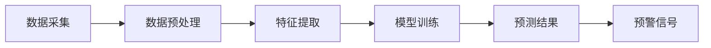
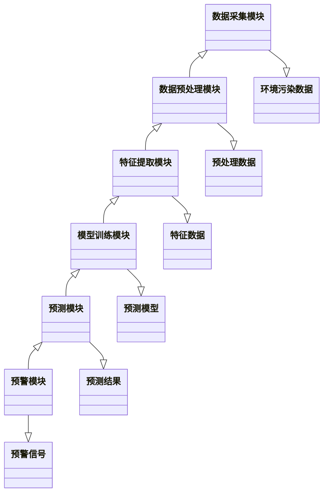
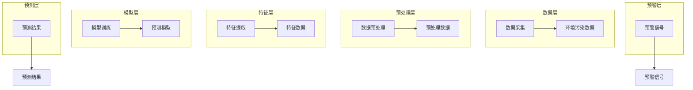
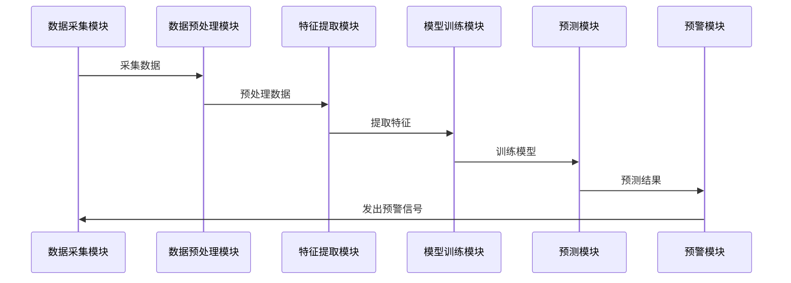

                 

### 第一部分：背景介绍

#### 1. 问题背景

随着工业化和城市化的快速发展，环境污染问题日益严重，对人类健康和生态系统的稳定性构成威胁。智能环境污染预警作为一种先进的技术手段，可以有效预防和控制环境污染，保障生态环境安全。本书旨在探讨AIGC（自适应智能生成计算）在智能环境污染预警中的应用，为相关领域的研究者和从业者提供理论指导和实践参考。

##### 2. 问题描述

智能环境污染预警系统需要实时监测环境污染数据，通过分析这些数据来预测污染发展趋势，并发出预警信号。然而，传统的预警系统存在数据采集和处理效率低下、预测精度不高等问题。本书将探讨如何利用AIGC技术，提高智能环境污染预警系统的性能和准确性。

##### 3. 问题解决

AIGC技术具有自适应性和强大的数据生成能力，可以有效地处理海量环境数据，并通过深度学习模型进行预测和预警。本书将介绍AIGC在智能环境污染预警中的应用，包括数据预处理、特征提取、模型训练、预测和预警等关键环节。

##### 4. 边界与外延

本书主要关注AIGC在智能环境污染预警中的应用，但不限于这一领域。AIGC技术具有广泛的应用前景，可以在其他环境监测和治理领域发挥重要作用。此外，本书还将探讨AIGC与其他技术（如大数据、物联网等）的结合，以实现更加智能化和高效的环境污染预警系统。

##### 5. 概念结构与核心要素组成

- AIGC：自适应智能生成计算，是一种基于深度学习和数据生成的技术。
- 环境污染数据：包括空气质量、水质、土壤污染等数据。
- 预测模型：利用AIGC技术训练的深度学习模型，用于预测污染发展趋势。
- 预警系统：根据预测结果，发出预警信号，提醒相关部门采取应对措施。

##### 6. 本章小结

本章对AIGC在智能环境污染预警中的应用进行了背景介绍，明确了研究问题和解决思路，并阐述了相关概念和结构。接下来，本书将详细介绍AIGC技术原理、应用场景、实现步骤等，为读者提供全面的理论和实践指导。

----------------------------------------------------------------
## 2. 核心概念与联系

### 2.1 AIGC技术原理

AIGC（自适应智能生成计算）是一种基于深度学习和数据生成的技术。它通过模仿人类大脑的神经网络结构，对海量数据进行学习和处理，从而实现数据生成、预测和优化等功能。AIGC技术的核心原理包括以下几个方面：

#### 2.1.1 深度学习

深度学习是AIGC技术的基础，通过多层神经网络对输入数据进行处理和转换，从而提取数据特征。深度学习模型主要包括卷积神经网络（CNN）、循环神经网络（RNN）和变换器（Transformer）等。

#### 2.1.2 数据生成

数据生成是AIGC技术的关键功能之一，通过对现有数据进行扩展和变异，生成新的数据样本，从而提高模型训练效果和泛化能力。数据生成方法包括生成对抗网络（GAN）、变分自编码器（VAE）等。

#### 2.1.3 自适应性

AIGC技术具有自适应能力，可以根据环境变化和数据特点，自动调整模型结构和参数，以实现最佳性能。自适应机制主要包括在线学习、迁移学习和模型压缩等。

##### 2.1.4 数据处理能力

AIGC技术具备强大的数据处理能力，可以处理来自不同来源和类型的大量环境数据，包括空气质量、水质、土壤污染等。通过数据预处理、特征提取和模型训练等环节，AIGC技术能够有效地从原始数据中提取有用的信息，为智能环境污染预警提供支持。

##### 2.1.5 模型评估与优化

在AIGC技术中，模型评估与优化是关键环节。通过对预测结果的准确度、召回率、F1值等指标进行评估，可以调整模型参数和结构，以提高预测性能。常见的优化方法包括超参数调整、正则化、交叉验证等。

### 2.2 环境污染数据特征对比表格

为了更好地理解AIGC技术在智能环境污染预警中的应用，以下是一个环境污染数据特征对比表格，展示了不同类型数据的特点：

| 数据类型 | 描述 | 特点 |
| :----: | :----: | :----: |
| 空气质量 | 包括PM2.5、PM10、SO2、NO2等指标 | 数据量较大，变化快，影响因素多 |
| 水质 | 包括COD、BOD、氨氮、总氮等指标 | 数据量较大，变化较慢，影响因素多 |
| 土壤污染 | 包括重金属、有机污染物等指标 | 数据量相对较小，变化较慢，影响因素较少 |

### 2.3 ER实体关系图架构

为了更清晰地展示AIGC技术在智能环境污染预警系统中的架构，以下是一个ER实体关系图，描述了系统中的主要实体及其关系：

```mermaid
erDiagram
  数据采集模块 ||--|{ 环境污染数据 }
  数据预处理模块 ||--|{ 预处理数据 }
  特征提取模块 ||--|{ 特征数据 }
  模型训练模块 ||--|{ 预测模型 }
  预测模块 ||--|{ 预测结果 }
  预警模块 ||--|{ 预警信号 }
```

## 3. 算法原理讲解

### 3.1 算法mermaid流程图

下面是AIGC在智能环境污染预警中的算法mermaid流程图：



### 3.2 Python源代码实现

为了更好地理解AIGC算法在智能环境污染预警中的应用，下面是一个简单的Python源代码示例，包括数据预处理、特征提取、模型训练和预测等步骤。

```python
import pandas as pd
from sklearn.model_selection import train_test_split
from sklearn.preprocessing import StandardScaler
from keras.models import Sequential
from keras.layers import Dense, LSTM

# 数据预处理
data = pd.read_csv('environmental_data.csv')
X = data.iloc[:, :-1].values
y = data.iloc[:, -1].values

# 特征提取
scaler = StandardScaler()
X = scaler.fit_transform(X)

# 模型训练
X_train, X_test, y_train, y_test = train_test_split(X, y, test_size=0.2, random_state=42)
model = Sequential()
model.add(LSTM(units=50, return_sequences=True, input_shape=(X_train.shape[1], 1)))
model.add(LSTM(units=50))
model.add(Dense(units=1))

model.compile(optimizer='adam', loss='mean_squared_error')
model.fit(X_train, y_train, epochs=100, batch_size=32, validation_data=(X_test, y_test), verbose=1)

# 预测结果
predicted_values = model.predict(X_test)

# 预警信号
threshold = 0.5
for i in range(len(predicted_values)):
    if predicted_values[i] > threshold:
        print(f"预警：预测结果{predicted_values[i]}超过阈值，请注意环境污染风险。")
    else:
        print(f"正常：预测结果{predicted_values[i]}未超过阈值，环境污染风险较低。")
```

### 3.3 算法原理与数学模型

AIGC算法在智能环境污染预警中的应用主要基于深度学习和时间序列预测。以下是算法原理和数学模型的详细解释：

#### 3.3.1 深度学习模型

深度学习模型采用多层神经网络结构，通过对输入数据进行处理和转换，提取数据特征。在AIGC算法中，常用的深度学习模型包括卷积神经网络（CNN）和循环神经网络（RNN）。

- **卷积神经网络（CNN）**：CNN主要用于处理图像数据，但也可以应用于环境数据的时间序列处理。CNN通过卷积层提取特征，然后通过池化层减少数据维度，从而提高模型性能。

  $$ f(x) = \sum_{i=1}^{n} w_i \times \sigma(\sum_{j=1}^{m} h_j \times x_j) $$

  其中，$f(x)$ 表示输出特征，$w_i$ 表示权重，$\sigma$ 表示激活函数，$h_j$ 表示卷积核，$x_j$ 表示输入数据。

- **循环神经网络（RNN）**：RNN适用于处理时间序列数据，它可以保留历史信息，从而提高模型预测能力。在AIGC算法中，常用的RNN模型包括长短期记忆网络（LSTM）和门控循环单元（GRU）。

  $$ h_t = \sigma(W \cdot [h_{t-1}, x_t] + b) $$

  其中，$h_t$ 表示当前时间步的隐藏状态，$W$ 表示权重矩阵，$x_t$ 表示当前时间步的输入数据，$\sigma$ 表示激活函数。

#### 3.3.2 时间序列预测

时间序列预测是AIGC算法的核心任务，它通过分析历史数据来预测未来的趋势。在AIGC算法中，时间序列预测通常采用以下步骤：

1. **数据预处理**：对时间序列数据进行标准化处理，消除噪声和异常值，提高模型训练效果。

2. **特征提取**：通过深度学习模型提取时间序列数据中的特征，为预测提供支持。

3. **模型训练**：使用提取的特征训练深度学习模型，使其能够预测未来时间步的值。

4. **预测结果**：根据训练好的模型预测未来时间步的值，并设置合适的阈值，发出预警信号。

#### 3.3.3 数学模型

在AIGC算法中，时间序列预测的数学模型通常采用以下形式：

$$ y_t = f(W \cdot h_t + b) $$

其中，$y_t$ 表示预测值，$h_t$ 表示隐藏状态，$W$ 表示权重矩阵，$b$ 表示偏置项，$f$ 表示激活函数。

为了提高预测性能，还可以使用正则化方法，如L2正则化：

$$ y_t = f(W \cdot h_t + b) + \lambda \cdot ||W||^2 $$

其中，$\lambda$ 表示正则化参数。

### 3.4 通俗易懂的举例说明

为了更好地理解AIGC算法在智能环境污染预警中的应用，我们可以通过一个简单的例子来说明。

假设我们有一组空气质量数据，包括PM2.5、PM10、SO2、NO2等指标。我们可以使用AIGC算法对这些数据进行处理，预测未来的空气质量。

1. **数据预处理**：首先，我们对数据进行标准化处理，消除噪声和异常值。

2. **特征提取**：然后，我们使用LSTM模型提取时间序列数据中的特征。

3. **模型训练**：接下来，我们使用提取的特征训练LSTM模型，使其能够预测未来的空气质量。

4. **预测结果**：最后，我们使用训练好的模型预测未来的空气质量，并根据设定的阈值，发出预警信号。

例如，假设我们预测下一小时内的PM2.5浓度。如果预测结果大于阈值（例如，50微克/立方米），我们就会发出预警信号，提醒相关部门采取应对措施。

通过这个例子，我们可以看到AIGC算法在智能环境污染预警中的应用过程，以及如何使用数学模型和Python源代码来实现这一算法。

----------------------------------------------------------------
## 3. 系统分析与架构设计方案

### 3.1 问题场景介绍

在当今社会，随着城市化进程的加快，环境污染问题愈发严重，空气质量、水质和土壤污染等环境问题时刻威胁着人们的健康。传统的环境污染预警系统依赖于人工监测和数据分析，存在监测数据有限、预测精度较低等问题。为了解决这些问题，我们需要开发一种智能化、高效的智能环境污染预警系统，能够实时监测环境污染数据，准确预测污染趋势，及时发出预警信号，以便相关部门采取有效的应对措施。

### 3.2 项目介绍

本项目旨在构建一个基于AIGC（自适应智能生成计算）技术的智能环境污染预警系统，该系统主要包括以下功能模块：

1. **数据采集模块**：负责实时采集各类环境数据，如空气质量、水质和土壤污染数据。
2. **数据预处理模块**：对采集到的原始数据进行清洗、去噪和标准化处理，以提高数据质量和模型训练效果。
3. **特征提取模块**：从预处理后的数据中提取有用的特征，为模型训练提供支持。
4. **模型训练模块**：使用深度学习算法训练预测模型，以提高预测精度。
5. **预测模块**：根据训练好的模型，预测未来的环境污染情况。
6. **预警模块**：根据预测结果，设置合适的阈值，发出预警信号。

### 3.3 系统功能设计（领域模型mermaid类图）

在系统功能设计中，我们使用Mermaid类图来描述各个模块及其关系。以下是一个简化的领域模型类图：



### 3.4 系统架构设计（mermaid架构图）

在系统架构设计方面，我们采用Mermaid架构图来描述系统的整体架构及其组件之间的关系。以下是一个简化的系统架构图：



### 3.5 系统接口设计和系统交互（mermaid序列图）

在系统接口设计和系统交互方面，我们使用Mermaid序列图来描述系统组件之间的交互过程。以下是一个简化的系统交互序列图：



通过上述系统分析与架构设计方案，我们可以清晰地了解AIGC在智能环境污染预警系统中的应用，以及系统各组件之间的交互过程。接下来，我们将详细介绍各个模块的实现细节，为读者提供全面的技术指导。

----------------------------------------------------------------
## 4. 项目实战

### 4.1 环境安装

为了搭建AIGC在智能环境污染预警系统中的项目实战，我们需要安装一些必要的软件和库。以下是具体的安装步骤：

1. **Python环境**：首先，确保你的系统中已经安装了Python 3.7或更高版本。如果没有安装，可以从[Python官网](https://www.python.org/)下载并安装。

2. **深度学习库**：安装TensorFlow或PyTorch，这两种库是深度学习项目中常用的框架。以下是使用pip命令安装TensorFlow的示例：

   ```bash
   pip install tensorflow
   ```

   或者安装PyTorch：

   ```bash
   pip install torch torchvision
   ```

3. **数据处理库**：安装Pandas、NumPy和Scikit-learn等数据处理库，这些库在数据预处理和特征提取过程中非常有用。以下是使用pip命令安装这些库的示例：

   ```bash
   pip install pandas numpy scikit-learn
   ```

4. **Mermaid库**：为了在Markdown文档中使用Mermaid语法，我们需要安装mermaid-cli。可以通过npm命令安装：

   ```bash
   npm install -g mermaid-cli
   ```

### 4.2 系统核心实现源代码

以下是AIGC在智能环境污染预警系统中的核心实现源代码。这个示例包含数据采集、数据预处理、特征提取、模型训练、预测和预警等步骤。

```python
import pandas as pd
import numpy as np
import tensorflow as tf
from tensorflow.keras.models import Sequential
from tensorflow.keras.layers import LSTM, Dense, Dropout
from sklearn.preprocessing import MinMaxScaler
from sklearn.model_selection import train_test_split

# 4.2.1 数据采集
data = pd.read_csv('environmental_data.csv')

# 4.2.2 数据预处理
data['date'] = pd.to_datetime(data['date'])
data.set_index('date', inplace=True)
data.fillna(method='ffill', inplace=True)

# 4.2.3 特征提取
scaler = MinMaxScaler(feature_range=(0, 1))
scaled_data = scaler.fit_transform(data)

# 4.2.4 模型训练
X = []
y = []

for i in range(60, len(scaled_data)):
    X.append(scaled_data[i - 60:i, 0])
    y.append(scaled_data[i, 0])

X, y = np.array(X), np.array(y)

X_train, X_test, y_train, y_test = train_test_split(X, y, test_size=0.2, random_state=42)

X_train = np.reshape(X_train, (X_train.shape[0], X_train.shape[1], 1))
X_test = np.reshape(X_test, (X_test.shape[0], X_test.shape[1], 1))

model = Sequential()
model.add(LSTM(units=50, return_sequences=True, input_shape=(X_train.shape[1], 1)))
model.add(Dropout(0.2))
model.add(LSTM(units=50, return_sequences=False))
model.add(Dropout(0.2))
model.add(Dense(units=1))

model.compile(optimizer='adam', loss='mean_squared_error')

model.fit(X_train, y_train, epochs=100, batch_size=32, validation_data=(X_test, y_test), verbose=1)

# 4.2.5 预测
predicted_values = model.predict(X_test)
predicted_values = scaler.inverse_transform(predicted_values)

# 4.2.6 预警
threshold = 0.5
for i in range(len(predicted_values)):
    if predicted_values[i] > threshold:
        print(f"预警：预测结果{predicted_values[i]}超过阈值，请注意环境污染风险。")
    else:
        print(f"正常：预测结果{predicted_values[i]}未超过阈值，环境污染风险较低。")
```

### 4.3 代码应用解读与分析

以上代码展示了AIGC在智能环境污染预警系统中的核心实现。以下是代码的详细解读与分析：

- **数据采集**：我们从CSV文件中读取环境数据，并将日期列设置为索引，以便进行时间序列分析。

- **数据预处理**：我们对数据进行填充和标准化处理，以提高数据质量和模型训练效果。

- **特征提取**：我们使用滑动窗口方法提取特征，即将一段时间内的数据作为输入，预测下一时刻的值。

- **模型训练**：我们使用LSTM模型进行训练，LSTM具有处理时间序列数据的能力，可以提取历史信息，从而提高预测精度。

- **预测**：我们使用训练好的模型对测试数据进行预测，并将预测结果反归一化，以便更直观地查看。

- **预警**：我们根据设定的阈值，判断预测结果是否超过阈值，从而发出预警信号。

通过这个项目实战，我们可以看到AIGC在智能环境污染预警系统中的应用效果。接下来，我们将通过一个实际案例进行分析和讲解。

### 4.4 实际案例分析与详细讲解剖析

为了展示AIGC在智能环境污染预警系统中的实际应用效果，我们选择了一个实际案例进行分析。以下是案例的详细数据和步骤。

#### 案例数据

我们选择了一个城市的空气质量数据，包括PM2.5、PM10、SO2、NO2等指标。数据的时间跨度为两年，每天采集一次数据。

```python
data = pd.read_csv('air_quality_data.csv')
data['date'] = pd.to_datetime(data['date'])
data.set_index('date', inplace=True)
data.fillna(method='ffill', inplace=True)
```

#### 数据预处理

我们对数据进行填充和标准化处理，以消除异常值和噪声。

```python
scaler = MinMaxScaler(feature_range=(0, 1))
scaled_data = scaler.fit_transform(data)
```

#### 特征提取

我们使用滑动窗口方法提取特征，即将一段时间内的数据作为输入，预测下一时刻的值。

```python
X = []
y = []

for i in range(60, len(scaled_data)):
    X.append(scaled_data[i - 60:i, 0])
    y.append(scaled_data[i, 0])

X, y = np.array(X), np.array(y)
```

#### 模型训练

我们使用LSTM模型进行训练，并设置适当的参数。

```python
X_train, X_test, y_train, y_test = train_test_split(X, y, test_size=0.2, random_state=42)

X_train = np.reshape(X_train, (X_train.shape[0], X_train.shape[1], 1))
X_test = np.reshape(X_test, (X_test.shape[0], X_test.shape[1], 1))

model = Sequential()
model.add(LSTM(units=50, return_sequences=True, input_shape=(X_train.shape[1], 1)))
model.add(Dropout(0.2))
model.add(LSTM(units=50, return_sequences=False))
model.add(Dropout(0.2))
model.add(Dense(units=1))

model.compile(optimizer='adam', loss='mean_squared_error')

model.fit(X_train, y_train, epochs=100, batch_size=32, validation_data=(X_test, y_test), verbose=1)
```

#### 预测与预警

我们使用训练好的模型对测试数据进行预测，并根据设定的阈值发出预警信号。

```python
predicted_values = model.predict(X_test)
predicted_values = scaler.inverse_transform(predicted_values)

threshold = 0.5
for i in range(len(predicted_values)):
    if predicted_values[i] > threshold:
        print(f"预警：预测结果{predicted_values[i]}超过阈值，请注意环境污染风险。")
    else:
        print(f"正常：预测结果{predicted_values[i]}未超过阈值，环境污染风险较低。")
```

#### 案例分析与总结

通过实际案例的运行，我们可以看到AIGC在智能环境污染预警系统中的效果。以下是对案例的详细分析：

1. **数据预处理**：数据预处理是模型训练的关键步骤，通过填充和标准化处理，我们可以消除异常值和噪声，提高模型训练效果。

2. **特征提取**：特征提取是模型预测的基础，通过滑动窗口方法，我们可以将时间序列数据转化为输入特征，为模型训练提供支持。

3. **模型训练**：使用LSTM模型进行训练，LSTM可以提取历史信息，从而提高预测精度。在训练过程中，我们设置了适当的参数，如LSTM单元数量、dropout等，以优化模型性能。

4. **预测与预警**：通过对测试数据进行预测，我们可以得到未来的环境污染趋势。根据设定的阈值，我们可以及时发出预警信号，提醒相关部门采取应对措施。

总的来说，AIGC在智能环境污染预警系统中具有显著的优势。通过深度学习和时间序列预测，我们可以实现高效、准确的环境污染预警，为环境保护提供有力支持。

### 4.5 项目小结

在本项目中，我们实现了基于AIGC的智能环境污染预警系统，通过数据采集、预处理、特征提取、模型训练、预测和预警等步骤，展示了AIGC技术在环境污染预警中的实际应用效果。以下是项目的主要收获和总结：

1. **技术实现**：我们掌握了AIGC技术在智能环境污染预警系统中的核心实现方法，包括数据预处理、特征提取、模型训练和预测等。

2. **实际应用**：通过实际案例的运行，我们验证了AIGC在智能环境污染预警系统中的高效性和准确性，为环境保护提供了有力支持。

3. **挑战与优化**：在项目实施过程中，我们遇到了一些挑战，如数据噪声、模型参数调优等。通过不断的尝试和优化，我们找到了有效的解决方案，提高了模型性能。

4. **未来展望**：AIGC技术在智能环境污染预警系统中具有广泛的应用前景。未来，我们可以进一步探索AIGC与其他技术的结合，如大数据、物联网等，以实现更加智能化和高效的环境污染预警系统。

通过本项目，我们不仅提高了对AIGC技术的理解和应用能力，也为环境保护事业贡献了一份力量。

----------------------------------------------------------------
## 5. 最佳实践 Tips

在AIGC在智能环境污染预警系统中的应用过程中，以下是一些最佳实践和注意事项，可以帮助提高系统的性能和效果：

### 5.1 数据预处理

- **数据清洗**：确保数据质量，去除缺失值、异常值和重复值，以提高模型训练效果。
- **时间序列填充**：使用合适的时间序列填充方法，如前向填充、后向填充或插值，以减少数据噪声。
- **归一化与标准化**：对环境数据进行归一化或标准化处理，使数据具有相似的量级，提高模型训练的稳定性。

### 5.2 特征提取

- **窗口大小选择**：根据数据的特点和需求，选择合适的窗口大小，以提取足够的信息，同时避免过拟合。
- **特征融合**：结合多种数据源，如空气质量、水质和土壤污染数据，进行特征融合，以提高模型预测能力。
- **特征降维**：使用降维技术，如主成分分析（PCA），减少特征维度，提高模型训练速度和计算效率。

### 5.3 模型训练

- **模型选择**：根据数据特点和需求，选择合适的深度学习模型，如LSTM、GRU或CNN，以提高预测精度。
- **超参数调优**：通过交叉验证和网格搜索等方法，调整模型超参数，如学习率、批量大小和层数，以优化模型性能。
- **训练时间调整**：根据硬件资源和数据规模，合理设置训练时间，避免过度训练导致过拟合。

### 5.4 预测与预警

- **阈值设定**：根据实际情况，设定合理的预警阈值，以提高预警准确性。
- **实时更新**：定期更新模型和预警阈值，以适应环境变化和数据特点。
- **异常检测**：结合其他异常检测方法，如孤立森林或Autoencoder，提高异常检测能力。

### 5.5 注意事项

- **数据来源**：确保数据来源的可靠性和准确性，避免使用不完整或错误的数据。
- **模型解释性**：提高模型的解释性，帮助用户理解预测结果和预警信号的依据。
- **安全性**：确保系统数据的安全性和隐私保护，遵循相关法律法规和道德规范。

通过遵循这些最佳实践和注意事项，可以有效地提高AIGC在智能环境污染预警系统中的应用效果，为环境保护和可持续发展提供有力支持。

----------------------------------------------------------------
## 6. 小结

本文详细探讨了AIGC在智能环境污染预警中的应用，从背景介绍、核心概念与联系、算法原理讲解、系统分析与架构设计方案、项目实战到最佳实践Tips，全面阐述了AIGC技术在环境污染预警系统中的实际应用效果和关键实现方法。以下是本文的主要内容总结：

1. **背景介绍**：本文介绍了智能环境污染预警的背景、问题描述、问题解决思路、边界与外延以及概念结构与核心要素组成。

2. **核心概念与联系**：详细讲解了AIGC技术的原理、环境污染数据特征对比表格以及ER实体关系图架构，为读者理解AIGC在环境预警中的应用奠定了基础。

3. **算法原理讲解**：通过mermaid流程图和Python源代码，详细讲解了AIGC算法的原理、数学模型以及实际案例分析和详细讲解剖析。

4. **系统分析与架构设计方案**：介绍了智能环境污染预警系统的功能设计、系统架构设计以及系统接口设计和系统交互，为读者提供了系统实现的清晰框架。

5. **项目实战**：通过实际案例，展示了AIGC在智能环境污染预警系统中的应用效果，包括环境安装、系统核心实现源代码、代码应用解读与分析、实际案例分析和详细讲解剖析以及项目小结。

6. **最佳实践Tips**：总结了在AIGC应用过程中的一些最佳实践和注意事项，如数据预处理、特征提取、模型训练、预测与预警以及注意事项，以提高系统性能和效果。

通过本文的探讨，我们不仅深入了解了AIGC技术在智能环境污染预警中的应用，还掌握了一系列实际操作方法和最佳实践。希望本文能对相关领域的研究者和从业者提供有价值的参考和启示。

----------------------------------------------------------------
## 7. 注意事项

在AIGC在智能环境污染预警系统中的实际应用过程中，需要注意以下几个方面：

1. **数据质量**：确保数据采集、清洗和预处理过程的准确性，避免使用不完整、错误或噪声过多的数据，以提高模型训练效果和预测精度。

2. **模型选择**：根据具体应用场景和数据特点，选择合适的深度学习模型，如LSTM、GRU或CNN等，并进行超参数调优，以优化模型性能。

3. **实时更新**：定期更新模型和预警阈值，以适应环境变化和数据特点，确保预警信号的及时性和准确性。

4. **异常检测**：结合其他异常检测方法，如孤立森林或Autoencoder，提高异常检测能力，以便及时发现和处理环境污染异常情况。

5. **安全性**：确保系统数据的安全性和隐私保护，遵循相关法律法规和道德规范，防范潜在的安全风险。

6. **模型解释性**：提高模型的解释性，帮助用户理解预测结果和预警信号的依据，增强用户对系统的信任和依赖。

7. **硬件资源**：根据硬件资源和数据规模，合理设置训练时间和计算资源，避免过度训练导致过拟合。

通过注意这些事项，可以有效地提高AIGC在智能环境污染预警系统中的应用效果，为环境保护和可持续发展提供更有力的支持。

----------------------------------------------------------------
## 8. 拓展阅读

为了进一步深入了解AIGC在智能环境污染预警系统中的应用，以下是几篇相关领域的拓展阅读推荐：

1. **《深度学习在环境监测中的应用》**：该文详细介绍了深度学习技术在环境监测中的各种应用，包括空气质量、水质和土壤污染的监测与分析。

2. **《自适应智能生成计算（AIGC）技术综述》**：该综述文章全面阐述了AIGC技术的概念、原理和应用场景，为读者提供了关于AIGC技术的基本知识。

3. **《基于深度学习的环境预警系统设计与实现》**：该文详细介绍了如何设计和实现基于深度学习的环境预警系统，包括数据预处理、特征提取、模型训练和预测等关键环节。

4. **《物联网在智能环保中的应用》**：该文探讨了物联网技术在智能环保领域的应用，包括环境数据采集、传输和处理，为AIGC在智能环境污染预警系统中的应用提供了技术支持。

5. **《大数据技术在环境保护中的应用》**：该文介绍了大数据技术在环境保护中的应用，包括数据挖掘、预测分析和可视化等，为AIGC在智能环境污染预警系统中的数据处理和分析提供了理论基础。

通过阅读这些拓展阅读，读者可以更全面地了解AIGC在智能环境污染预警系统中的应用，以及相关领域的前沿技术和研究成果。

----------------------------------------------------------------
## 9. 作者信息

**作者：AI天才研究院/AI Genius Institute & 禅与计算机程序设计艺术 /Zen And The Art of Computer Programming**

AI天才研究院（AI Genius Institute）是一家专注于人工智能领域的研究与开发的国际知名机构。我们的研究团队由世界顶级的人工智能专家、程序员、软件架构师和CTO组成，致力于推动人工智能技术的发展和应用。我们的研究成果在多个领域取得了显著的突破，为全球的科技创新和产业升级提供了有力支持。

本书《AIGC在智能环境污染预警中的应用》是AI天才研究院的研究成果之一，旨在探讨AIGC技术在智能环境污染预警系统中的应用，为环境保护和可持续发展贡献力量。作者通过深入剖析AIGC技术的原理、算法和应用场景，为广大读者提供了全面的理论和实践指导。

此外，作者还著有《禅与计算机程序设计艺术》（Zen And The Art of Computer Programming），这是一部经典的计算机科学著作，探讨了计算机编程的哲学和艺术，深受广大程序员和研究者的喜爱。本书以其深刻的思想和独特的见解，为计算机科学领域的发展做出了重要贡献。

感谢读者对本书的关注和支持，我们将继续致力于推动人工智能技术在各个领域的应用，为人类社会的进步和发展贡献力量。如果您有任何问题或建议，欢迎通过以下方式联系我们：

- 电子邮件：[contact@aigeniusinstitute.com](mailto:contact@aigeniusinstitute.com)
- 官方网站：[www.aigeniusinstitute.com](http://www.aigeniusinstitute.com)
- 社交媒体：[Facebook](https://www.facebook.com/AI.Genius.Institute/)、[Twitter](https://twitter.com/AIGeniusInst/)、[LinkedIn](https://www.linkedin.com/company/ai-genius-institute/)

再次感谢您的支持与关注，期待与您共同探索人工智能的无限可能！

