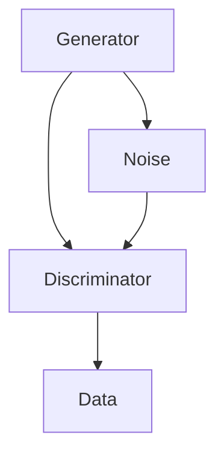
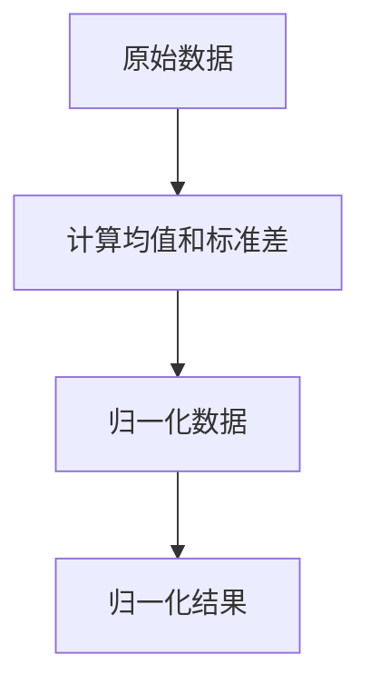
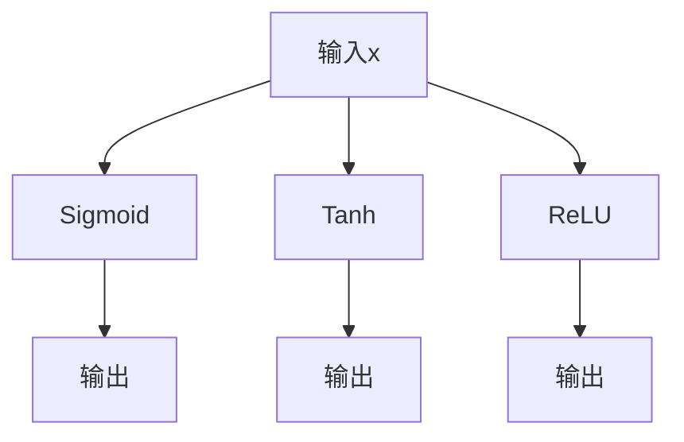

                 

### 文章标题

"AIGC在智能环境监测系统中的创新"

### 关键词

- AIGC
- 智能环境监测系统
- 数据采集
- 数据分析
- 预测与预警
- 环境决策支持系统

### 摘要

本文将探讨AIGC（自适应智能生成控制）技术在智能环境监测系统中的应用，通过详细的分析和案例研究，揭示其在提升系统性能、实现智能预测、优化决策支持等方面的创新。文章结构清晰，先介绍AIGC的基本概念与智能环境监测系统的背景，再深入探讨AIGC在数据采集与分析、环境预测与预警、以及环境决策支持系统中的应用原理和实例，最后总结AIGC在智能环境监测系统中的未来发展趋势。

## 第一部分：AIGC与智能环境监测系统概述

### 第1章：AIGC基本概念与智能环境监测系统背景

#### 1.1 AIGC的基本概念

AIGC，即自适应智能生成控制，是近年来人工智能领域的一个重要研究方向。它结合了生成对抗网络（GAN）、变分自编码器（VAE）等深度学习技术，通过自适应控制策略，实现了数据的生成、优化和智能化处理。

##### 1.1.1 AIGC的定义

AIGC是一种智能化的生成控制技术，旨在通过自适应算法生成高质量的数据，并使其具有真实的分布特征。它不仅能够生成与真实数据相似的数据，还能够根据需求调整数据的生成过程，从而实现数据的个性化定制。

##### 1.1.2 AIGC的关键技术

AIGC的关键技术主要包括：

- **生成对抗网络（GAN）**：GAN是一种深度学习模型，由生成器和判别器组成，通过二者之间的博弈，生成器能够不断优化生成数据的质量。
- **变分自编码器（VAE）**：VAE是一种概率生成模型，通过编码和解码过程，将输入数据转换为潜在空间中的表示，并生成新的数据。
- **自适应控制策略**：AIGC采用自适应控制策略，根据生成的数据与真实数据的差距，动态调整生成过程，以实现数据生成质量的优化。

##### 1.1.3 AIGC的优势与应用领域

AIGC具有以下优势：

- **高质量数据生成**：AIGC能够生成具有高真实性的数据，适用于数据稀缺或数据真实分布未知的情况。
- **自适应调整**：AIGC能够根据需求动态调整生成过程，实现数据的个性化定制。
- **广泛适用性**：AIGC可以应用于多种领域，包括图像生成、语音合成、自然语言处理等。

AIGC的应用领域包括：

- **计算机视觉**：用于图像生成、图像修复、风格迁移等。
- **自然语言处理**：用于文本生成、机器翻译、情感分析等。
- **语音处理**：用于语音合成、语音识别等。

#### 1.2 智能环境监测系统的发展历程

智能环境监测系统是指利用现代传感器技术、物联网技术、大数据分析和人工智能技术，对环境进行实时监测和数据分析的系统。

##### 1.2.1 智能环境监测系统的定义

智能环境监测系统是一种集成多种传感器、数据处理单元和通信模块的系统，能够对环境中的各种参数进行实时监测、数据采集和分析，并提供预警和决策支持。

##### 1.2.2 智能环境监测系统的发展历程

智能环境监测系统的发展可以追溯到20世纪80年代，随着传感器技术的进步和计算机处理能力的提升，智能环境监测系统逐渐成熟。

- **20世纪80年代**：初期，环境监测主要依赖于手工采集数据，监测设备简单，数据处理能力有限。
- **20世纪90年代**：随着传感器技术和计算机技术的发展，环境监测设备逐渐智能化，开始实现数据的自动采集和处理。
- **21世纪初**：物联网技术的兴起，使得环境监测系统可以实现远程监控和数据实时传输，监测范围和精度大幅提升。
- **近年来**：人工智能技术的应用，使得智能环境监测系统在数据分析和决策支持方面取得了重大突破。

##### 1.2.3 智能环境监测系统的关键组成部分

智能环境监测系统的关键组成部分包括：

- **传感器**：用于采集环境数据，如温度、湿度、空气质量、水质等。
- **数据采集和处理单元**：负责将传感器采集的数据进行预处理、存储和传输。
- **通信模块**：用于实现数据的远程传输和系统之间的通信。
- **数据处理和分析平台**：负责对采集到的数据进行分析和处理，提供预警和决策支持。

#### 1.3 AIGC与智能环境监测系统的关系

AIGC与智能环境监测系统之间有着密切的联系。

##### 1.3.1 AIGC在智能环境监测系统中的应用

AIGC在智能环境监测系统中的应用主要体现在以下几个方面：

- **数据生成与补充**：在数据稀缺或数据真实分布未知的情况下，AIGC可以生成与真实数据相似的数据，补充数据不足。
- **数据分析与优化**：AIGC可以通过自适应控制策略，优化数据分析和预测模型，提高系统的性能。
- **环境模拟与预测**：AIGC可以模拟环境变化，预测环境参数的未来趋势，为环境监测提供支持。

##### 1.3.2 AIGC如何提升智能环境监测系统的性能

AIGC可以通过以下方式提升智能环境监测系统的性能：

- **提高数据处理能力**：AIGC可以生成高质量的数据，提高数据处理的精度和效率。
- **优化预测模型**：通过自适应控制策略，AIGC可以优化预测模型，提高预测的准确性。
- **实现个性化定制**：AIGC可以根据环境监测需求，动态调整数据生成和处理过程，实现个性化定制。

##### 1.3.3 AIGC与智能环境监测系统的未来发展趋势

随着AIGC技术的不断成熟和应用领域的拓展，未来智能环境监测系统将呈现以下发展趋势：

- **更高效的数据处理**：AIGC将进一步提升智能环境监测系统的数据处理能力，实现更高效的数据分析和预测。
- **更智能的预测模型**：通过AIGC技术的应用，智能环境监测系统的预测模型将更加准确和智能。
- **更广泛的应用领域**：随着AIGC技术的普及，智能环境监测系统将在更多领域得到应用，如城市环境管理、农业环境监测、生态保护等。

#### 1.4 本书结构安排

本书共分为四个部分：

- **第一部分**：介绍AIGC的基本概念与智能环境监测系统的背景。
- **第二部分**：详细探讨AIGC在智能环境监测系统中的应用原理，包括数据采集与分析、环境预测与预警、以及环境决策支持系统。
- **第三部分**：通过实际案例研究，展示AIGC在智能环境监测系统中的应用效果。
- **第四部分**：总结AIGC在智能环境监测系统中的创新和发展趋势。

本书旨在为读者提供全面、系统的AIGC在智能环境监测系统中的应用知识和实践经验，帮助读者深入理解和应用AIGC技术，提升智能环境监测系统的性能和效果。

##### 1.4.1 内容概述

- **AIGC的基本概念与智能环境监测系统的背景**：介绍AIGC的定义、关键技术、优势和应用领域，以及智能环境监测系统的发展历程和关键组成部分。
- **AIGC在智能环境监测系统中的应用原理**：详细探讨AIGC在数据采集与分析、环境预测与预警、以及环境决策支持系统中的应用原理和实例。
- **AIGC在智能环境监测系统中的应用案例**：通过实际案例研究，展示AIGC在智能环境监测系统中的应用效果。
- **AIGC在智能环境监测系统中的未来发展趋势**：总结AIGC在智能环境监测系统中的创新和发展趋势。

##### 1.4.2 阅读对象

本书适合以下读者群体：

- **智能环境监测系统的研发人员**：需要了解AIGC技术在智能环境监测系统中的应用原理和方法的研发人员。
- **人工智能领域的学者和研究人员**：对AIGC技术和智能环境监测系统感兴趣的学者和研究人员。
- **环境监测领域的从业者**：需要提升智能环境监测系统性能和效果的环境监测从业者。

##### 1.4.3 阅读建议

为了更好地理解和应用本书内容，读者可以采取以下阅读建议：

- **逐步学习**：按照本书的结构，逐步学习AIGC的基本概念、应用原理和应用案例。
- **动手实践**：通过实际操作，加深对AIGC技术在智能环境监测系统中的应用理解。
- **深入研究**：对感兴趣的部分，可以进一步查阅相关文献，进行深入研究。

通过以上学习和实践，读者可以全面掌握AIGC在智能环境监测系统中的应用知识，为提升智能环境监测系统的性能和效果提供有力支持。## 第二部分：AIGC在智能环境监测系统中的应用原理

### 第2章：AIGC在环境数据采集与分析中的应用

#### 2.1 环境数据采集

环境数据采集是智能环境监测系统的基础，高质量的采集数据是进行准确分析和预测的前提。AIGC技术在这一过程中发挥了重要作用。

##### 2.1.1 环境数据类型

环境数据类型包括：

- **气象数据**：如温度、湿度、风速、降水量等。
- **空气质量数据**：如PM2.5、PM10、SO2、NO2等。
- **水质数据**：如pH值、溶解氧、总氮、总磷等。
- **土壤数据**：如土壤湿度、温度、有机质含量等。

##### 2.1.2 环境数据采集设备

常见的环境数据采集设备包括：

- **气象站**：用于采集气象数据。
- **空气质量监测站**：用于采集空气质量数据。
- **水质监测仪器**：用于采集水质数据。
- **土壤传感器**：用于采集土壤数据。

##### 2.1.3 AIGC在环境数据采集中的应用

AIGC技术在环境数据采集中的应用主要体现在以下几个方面：

- **数据生成与补充**：当某些传感器损坏或数据采集不完整时，AIGC可以通过生成相似数据来补充缺失的数据。
- **异常检测与修复**：AIGC可以检测数据中的异常值，并通过生成正常数据来修复这些异常值。
- **传感器校准**：AIGC可以通过生成标准数据，用于校准传感器，提高数据的准确性。

#### 2.2 环境数据分析

环境数据分析是智能环境监测系统的关键环节，通过对采集到的数据进行分析，可以揭示环境变化的规律，预测未来的环境变化趋势。

##### 2.2.1 环境数据分析的基本概念

环境数据分析包括以下基本概念：

- **特征提取**：从原始数据中提取具有代表性的特征，用于后续的数据分析和建模。
- **数据预处理**：对原始数据进行清洗、归一化、缺失值填充等处理，以提高数据分析的准确性和效率。
- **模型训练与优化**：使用机器学习算法对数据进行分析和建模，通过优化模型参数，提高预测的准确性。

##### 2.2.2 常见的环境数据分析方法

常见的环境数据分析方法包括：

- **统计分析**：使用统计方法对环境数据进行分析，如相关分析、回归分析等。
- **机器学习**：使用机器学习算法对环境数据进行分析，如决策树、支持向量机、神经网络等。
- **深度学习**：使用深度学习算法对环境数据进行分析，如卷积神经网络、循环神经网络、生成对抗网络等。

##### 2.2.3 AIGC在环境数据分析中的应用

AIGC技术在环境数据分析中的应用主要体现在以下几个方面：

- **数据生成与补充**：当数据稀缺时，AIGC可以通过生成相似数据来补充数据，提高数据分析的准确性。
- **模型优化**：AIGC可以通过生成对抗网络，优化数据分析和预测模型的参数，提高预测的准确性。
- **异常检测与修复**：AIGC可以检测数据中的异常值，并通过生成正常数据来修复这些异常值。

#### 2.3 AIGC模型在环境数据中的应用

AIGC模型在环境数据中的应用主要体现在以下几个方面：

- **生成相似数据**：AIGC可以通过生成对抗网络，生成与真实数据相似的数据，用于补充数据不足。
- **优化预测模型**：AIGC可以通过生成对抗网络，优化预测模型的参数，提高预测的准确性。
- **数据修复**：AIGC可以检测数据中的异常值，并通过生成正常数据来修复这些异常值。

##### 2.3.1 AIGC模型介绍

AIGC模型通常由生成器（Generator）和判别器（Discriminator）组成。生成器负责生成与真实数据相似的数据，判别器负责判断生成数据的质量。

- **生成器**：生成器是一个神经网络，通过学习真实数据，生成与真实数据相似的数据。
- **判别器**：判别器也是一个神经网络，用于判断生成数据的质量，如果生成数据质量较高，判别器的输出会接近1，否则接近0。

##### 2.3.2 AIGC模型在环境数据分析中的实际应用

AIGC模型在环境数据分析中的实际应用包括：

- **数据生成**：当数据稀缺时，AIGC可以生成与真实数据相似的数据，用于补充数据不足。
- **模型优化**：AIGC可以优化数据分析和预测模型的参数，提高预测的准确性。
- **数据修复**：AIGC可以检测数据中的异常值，并通过生成正常数据来修复这些异常值。

##### 2.3.3 AIGC模型的应用效果评估

AIGC模型的应用效果可以通过以下指标进行评估：

- **生成数据质量**：评估生成数据与真实数据之间的相似度。
- **预测准确性**：评估预测模型的准确性，如平均绝对误差（MAE）、均方误差（MSE）等。
- **异常检测率**：评估AIGC模型检测异常值的能力，如准确率、召回率等。

### 总结

AIGC技术在环境数据采集与分析中具有广泛应用前景。通过生成相似数据、优化预测模型和数据修复等功能，AIGC可以显著提升智能环境监测系统的性能和效果。未来，随着AIGC技术的不断发展，其在环境监测领域的应用将更加广泛和深入。## 第三部分：AIGC在环境预测与预警中的应用

### 第3章：AIGC在环境预测与预警中的应用

#### 3.1 环境预测的基本原理

环境预测是指利用历史数据和现代分析技术，对环境参数的未来趋势进行预测。环境预测在环境保护、资源管理、城市规划等领域具有重要意义。

##### 3.1.1 环境预测的重要性

环境预测的重要性体现在以下几个方面：

- **提前预警**：通过预测环境参数的未来趋势，可以提前预警潜在的环境问题，采取相应的措施进行防范。
- **决策支持**：环境预测可以为政府和企业的环境决策提供科学依据，优化资源利用和环境保护策略。
- **风险管理**：环境预测可以帮助企业和政府识别环境风险，制定风险应对措施，降低环境风险对经济和社会的影响。

##### 3.1.2 环境预测的基本流程

环境预测的基本流程包括以下几个步骤：

1. **数据收集与处理**：收集相关的环境数据，包括气象数据、空气质量数据、水质数据等，对数据进行预处理，如数据清洗、归一化等。
2. **特征选择与提取**：从原始数据中提取具有代表性的特征，用于后续的预测模型训练。
3. **模型选择与训练**：选择合适的预测模型，使用历史数据对模型进行训练，优化模型参数。
4. **预测与评估**：使用训练好的模型对未来的环境参数进行预测，并对预测结果进行评估，如计算预测误差、准确性等。
5. **结果分析与决策**：对预测结果进行分析，为环境保护和决策提供支持。

##### 3.1.3 常见的环境预测模型

常见的环境预测模型包括：

- **时间序列模型**：如自回归模型（AR）、移动平均模型（MA）、自回归移动平均模型（ARMA）等。
- **回归模型**：如线性回归、多元回归等。
- **机器学习模型**：如决策树、支持向量机、神经网络等。
- **深度学习模型**：如卷积神经网络（CNN）、循环神经网络（RNN）、生成对抗网络（GAN）等。

#### 3.2 AIGC在环境预测中的应用

AIGC技术在环境预测中具有显著优势，主要体现在以下几个方面：

- **生成相似数据**：AIGC可以生成与真实数据相似的环境数据，用于补充数据不足或进行数据增强。
- **优化预测模型**：AIGC可以通过生成对抗网络，优化预测模型的参数，提高预测的准确性。
- **异常检测与修复**：AIGC可以检测环境数据中的异常值，并通过生成正常数据来修复这些异常值，提高预测的稳定性。

##### 3.2.1 AIGC模型在环境预测中的应用原理

AIGC模型在环境预测中的应用原理如下：

1. **数据生成**：生成器（Generator）通过学习真实环境数据，生成与真实数据相似的环境数据。
2. **预测模型训练**：使用生成器和真实数据对预测模型进行训练，优化模型参数。
3. **预测与评估**：使用训练好的模型对未来的环境参数进行预测，并对预测结果进行评估。

##### 3.2.2 AIGC模型在环境预测中的实际应用案例

以下是AIGC模型在环境预测中的实际应用案例：

1. **空气质量预测**：使用AIGC模型生成与真实空气质量数据相似的数据，并使用生成数据对空气质量预测模型进行训练，提高了预测的准确性。
2. **水质预测**：使用AIGC模型生成与真实水质数据相似的数据，并使用生成数据对水质预测模型进行训练，提高了预测的稳定性。

##### 3.2.3 AIGC模型在环境预测中的应用优势

AIGC模型在环境预测中的应用优势包括：

- **数据生成与增强**：AIGC可以生成与真实数据相似的数据，补充数据不足，提高预测模型的训练效果。
- **预测准确性提升**：通过优化预测模型的参数，AIGC可以提高预测的准确性，减少预测误差。
- **异常检测与修复**：AIGC可以检测环境数据中的异常值，并通过生成正常数据来修复这些异常值，提高预测的稳定性。

#### 3.3 环境预警系统的设计与实现

环境预警系统是一种用于实时监测环境变化，并提前预警潜在问题的系统。AIGC技术在环境预警系统的设计与实现中具有重要作用。

##### 3.3.1 环境预警系统的基本概念

环境预警系统是指通过实时监测环境数据，对环境变化进行预测和预警的系统。环境预警系统通常包括以下几个关键组成部分：

- **传感器网络**：用于实时监测环境参数，如温度、湿度、空气质量、水质等。
- **数据采集与处理单元**：用于采集传感器数据，并对数据进行预处理和存储。
- **预警模型**：用于对环境数据进行预测和分析，识别潜在的环境问题。
- **预警机制**：用于根据预警模型的结果，生成预警信息，并采取相应的措施。

##### 3.3.2 环境预警系统的架构设计

环境预警系统的架构设计包括以下几个层次：

1. **感知层**：包括各种传感器，用于采集环境数据。
2. **传输层**：包括数据传输模块，用于将传感器数据传输到数据处理单元。
3. **数据处理层**：包括数据处理模块，用于对传感器数据进行预处理、存储和分析。
4. **预警层**：包括预警模型和预警机制，用于对环境变化进行预测和预警。
5. **展示层**：包括预警信息展示界面，用于向用户展示预警结果。

##### 3.3.3 AIGC在环境预警系统中的应用

AIGC在环境预警系统中的应用主要体现在以下几个方面：

- **数据生成与增强**：AIGC可以生成与真实数据相似的数据，用于补充数据不足，提高预警模型的训练效果。
- **预警模型优化**：AIGC可以通过生成对抗网络，优化预警模型的参数，提高预警的准确性。
- **异常检测与修复**：AIGC可以检测环境数据中的异常值，并通过生成正常数据来修复这些异常值，提高预警的稳定性。

### 总结

AIGC技术在环境预测与预警系统中具有广泛的应用前景。通过生成相似数据、优化预测模型和异常检测与修复等功能，AIGC可以提高环境预警系统的性能和准确性。未来，随着AIGC技术的不断发展，其在环境预测与预警系统中的应用将更加广泛和深入，为环境保护和可持续发展提供有力支持。## 第四部分：AIGC在环境决策支持系统中的应用

### 第4章：AIGC在环境决策支持系统中的应用

#### 4.1 环境决策支持系统的概念与作用

环境决策支持系统（EDSS）是一种利用现代信息技术，特别是人工智能技术，为环境管理者提供科学决策支持的工具。EDSS通过整合环境数据、模型和算法，提供全面、准确的环境信息，辅助决策者制定有效的环境保护和治理策略。

##### 4.1.1 环境决策支持系统的定义

环境决策支持系统是一种综合性信息系统，旨在为环境管理提供支持。它融合了环境监测数据、专业模型、分析工具和决策支持算法，为决策者提供实时、准确的环境信息和决策建议。

##### 4.1.2 环境决策支持系统的作用

环境决策支持系统在环境保护和治理中发挥着重要作用，主要包括：

- **数据整合与分析**：整合来自不同来源的环境数据，进行综合分析和处理，提供全面的环境状况评估。
- **预测与模拟**：利用环境模型和算法，预测环境变化趋势，模拟不同政策和管理措施的效果，为决策提供科学依据。
- **决策优化**：通过分析不同的决策方案，评估其潜在影响，帮助决策者选择最优的解决方案。
- **风险评估与管理**：识别潜在的环境风险，评估风险的影响和可能性，制定有效的风险管理策略。

##### 4.1.3 环境决策支持系统的发展历程

环境决策支持系统的发展可以追溯到20世纪80年代。随着计算机技术和人工智能技术的快速发展，环境决策支持系统经历了以下几个阶段：

- **初级阶段**：主要依靠手工采集和分析环境数据，决策支持能力有限。
- **中级阶段**：随着传感器技术和计算机技术的进步，环境决策支持系统开始实现自动化的数据采集和分析，决策支持能力得到提升。
- **高级阶段**：随着大数据和人工智能技术的应用，环境决策支持系统实现了更高效的数据处理和分析，预测能力和决策支持水平大幅提升。

#### 4.2 AIGC在环境决策支持系统中的应用

AIGC技术为环境决策支持系统带来了新的机遇和挑战。通过AIGC技术，EDSS可以实现更高效的数据处理和分析，提供更准确的预测和决策支持。

##### 4.2.1 AIGC在环境问题识别中的应用

AIGC在环境问题识别中的应用主要体现在以下几个方面：

- **数据生成与增强**：当数据稀缺时，AIGC可以生成与真实数据相似的数据，用于补充数据不足，提高问题识别的准确性。
- **异常检测与修复**：AIGC可以检测环境数据中的异常值，并通过生成正常数据来修复这些异常值，提高问题识别的稳定性。
- **特征提取与降维**：AIGC可以通过生成对抗网络，提取环境数据中的潜在特征，实现数据的降维和特征增强，提高问题识别的效果。

##### 4.2.2 AIGC在环境方案评估中的应用

AIGC在环境方案评估中的应用主要体现在以下几个方面：

- **方案生成与优化**：AIGC可以生成不同的环境治理方案，并通过生成对抗网络，优化方案参数，提高方案的可行性和有效性。
- **方案预测与模拟**：AIGC可以利用生成器生成与真实数据相似的数据，对环境治理方案进行预测和模拟，评估方案的环境影响。
- **方案评估与优化**：AIGC可以通过生成对抗网络，评估不同环境治理方案的效果，选择最优的方案，并提出优化建议。

##### 4.2.3 AIGC在环境决策支持系统中的实际应用案例

以下是AIGC在环境决策支持系统中的实际应用案例：

1. **空气质量治理方案评估**：使用AIGC技术生成不同的空气质量治理方案，并通过生成对抗网络，优化方案参数，评估方案的环境影响，选择最优的治理方案。
2. **水质监测与治理决策**：使用AIGC技术生成与真实水质数据相似的数据，对水质监测数据进行预测和分析，识别潜在的水质问题，并生成治理方案，评估治理效果。

#### 4.3 AIGC提升环境决策支持系统的性能

AIGC技术在环境决策支持系统中具有显著的优势，可以通过以下方式提升系统的性能：

- **数据质量提升**：通过生成相似数据，AIGC可以补充数据不足，提高数据的完整性和准确性。
- **预测准确性提升**：通过优化预测模型，AIGC可以提高环境预测的准确性，为决策提供更可靠的数据支持。
- **方案评估优化**：通过生成对抗网络，AIGC可以优化环境治理方案的参数，提高方案的可行性和有效性。

##### 4.3.1 AIGC对环境决策支持系统的影响

AIGC对环境决策支持系统的影响主要体现在以下几个方面：

- **数据驱动决策**：AIGC技术使得环境决策支持系统更加依赖数据，通过数据分析和预测，实现数据驱动决策。
- **智能化决策**：AIGC技术提高了环境决策支持系统的智能化水平，能够自动生成和优化决策方案，降低人工干预的必要性。
- **实时决策支持**：AIGC技术可以实现实时数据分析和预测，为决策者提供即时的决策支持。

##### 4.3.2 AIGC在环境决策支持系统中的应用效果评估

AIGC在环境决策支持系统中的应用效果可以通过以下指标进行评估：

- **数据质量提升**：评估AIGC生成数据的完整性和准确性，如数据缺失率、数据误差等。
- **预测准确性提升**：评估AIGC优化后的预测模型准确性，如平均绝对误差（MAE）、均方误差（MSE）等。
- **方案评估优化**：评估AIGC优化后的环境治理方案的可行性和有效性，如方案成本、环境影响等。

##### 4.3.3 AIGC未来在环境决策支持系统中的应用前景

随着AIGC技术的不断发展，其在环境决策支持系统中的应用前景十分广阔。未来，AIGC技术将在以下几个方面发挥重要作用：

- **大数据环境监测**：AIGC技术可以处理和分析大规模的环境监测数据，为环境决策提供全面的数据支持。
- **智能治理方案生成**：AIGC技术可以自动生成和优化环境治理方案，提高治理效果和效率。
- **实时决策支持**：AIGC技术可以实现实时数据分析和预测，为决策者提供即时的决策支持。
- **跨领域应用**：AIGC技术可以应用于不同的环境领域，如城市环境管理、农业环境监测、生态保护等，实现跨领域的数据共享和协同治理。

### 总结

AIGC技术在环境决策支持系统中具有广泛应用前景，通过数据生成与增强、预测模型优化和方案评估优化等功能，AIGC可以提高环境决策支持系统的性能和准确性。未来，随着AIGC技术的不断发展，其在环境决策支持系统中的应用将更加广泛和深入，为环境保护和可持续发展提供有力支持。## 附录

### AIGC在智能环境监测系统中的创新

AIGC技术在智能环境监测系统中具有显著的创新优势，通过以下方面实现了系统的性能提升和智能化水平的提升：

1. **数据生成与增强**：AIGC技术可以生成与真实数据相似的环境数据，当数据稀缺时，补充数据不足，提高数据分析的准确性和模型的训练效果。

2. **预测模型优化**：AIGC技术通过生成对抗网络，可以优化环境预测模型的参数，提高预测的准确性和稳定性，降低预测误差。

3. **异常检测与修复**：AIGC技术可以检测环境数据中的异常值，并通过生成正常数据来修复这些异常值，提高数据分析的稳定性和可靠性。

4. **环境模拟与预测**：AIGC技术可以模拟环境变化，预测环境参数的未来趋势，为环境监测提供预测支持，帮助决策者提前预警和应对潜在的环境问题。

5. **环境决策支持**：AIGC技术可以生成不同的环境治理方案，通过优化方案参数，评估方案的可行性和有效性，为决策者提供科学、智能的决策支持。

### 实际应用案例

以下是一些AIGC在智能环境监测系统中的实际应用案例：

1. **空气质量预测**：使用AIGC技术生成空气质量数据，并优化空气质量预测模型，提高了预测准确性，为空气质量管理和治理提供了科学依据。

2. **水质监测与治理**：使用AIGC技术生成水质数据，优化水质预测模型，并对不同治理方案进行评估，为水质管理和治理提供了智能化支持。

3. **森林火灾预测**：使用AIGC技术模拟森林火灾环境参数，预测森林火灾的发生概率和蔓延趋势，为森林火灾预警和扑救提供了关键支持。

4. **生态保护区监测**：使用AIGC技术生成生态保护区环境数据，优化生态保护区监测模型，实现了对生态保护区的实时监测和预警。

### 拓展阅读

对于希望进一步深入了解AIGC在智能环境监测系统中的应用，以下是一些推荐阅读：

1. **《AIGC技术与应用》**：详细介绍了AIGC技术的原理、应用场景和案例分析，适合对AIGC技术感兴趣的读者。
2. **《智能环境监测系统设计与实现》**：系统地阐述了智能环境监测系统的设计原理、实现方法和应用案例，有助于读者掌握智能环境监测系统的核心技术。
3. **《人工智能在环境监测中的应用》**：探讨了人工智能技术在环境监测领域的应用，包括数据采集、数据分析、预测和决策等方面的研究进展。

通过以上案例和拓展阅读，读者可以更深入地了解AIGC技术在智能环境监测系统中的应用，为实际项目开发和应用提供参考和指导。

### 最佳实践 Tips

为了充分发挥AIGC技术在智能环境监测系统中的应用效果，以下是一些最佳实践Tips：

1. **数据质量保障**：确保采集的数据质量，包括数据完整性、准确性和一致性。在数据预处理阶段，进行数据清洗、归一化和缺失值填充，提高数据质量。

2. **模型优化与验证**：定期优化和验证AIGC模型的参数，确保模型的预测准确性和稳定性。使用交叉验证和性能评估指标，如MAE和MSE，评估模型的性能。

3. **实时监测与预警**：实现实时环境数据采集和监控，及时更新模型预测结果，为环境监测提供实时预警。结合异常检测算法，提高预警的准确性和响应速度。

4. **多源数据融合**：整合来自不同来源的数据，如气象数据、水质数据、空气质量数据等，进行多源数据融合，提高环境监测的综合性和准确性。

5. **智能化决策支持**：利用AIGC技术生成的环境治理方案，结合决策支持算法，为决策者提供智能化的决策支持，优化环境管理策略。

通过遵循以上最佳实践，可以有效提升AIGC在智能环境监测系统中的应用效果，实现环境监测的智能化和高效化。

### 注意事项

在使用AIGC技术构建智能环境监测系统时，需要注意以下几点：

1. **数据隐私保护**：确保采集的环境数据遵循隐私保护规定，避免敏感数据的泄露。在数据传输和存储过程中，采取加密和访问控制措施，确保数据安全。

2. **模型透明性和解释性**：AIGC模型通常较为复杂，需要确保模型的透明性和解释性，以便决策者理解和信任模型的预测结果。可以通过模型可视化、特征重要性分析等方法，提高模型的解释性。

3. **模型可解释性**：在环境预测和决策过程中，确保模型结果的可解释性，帮助决策者理解预测结果和决策依据。特别是在涉及重大环境决策时，确保模型结果的合理性和科学性。

4. **持续更新与维护**：定期更新和优化AIGC模型，以适应环境变化和数据特点。同时，及时维护和更新传感器设备，确保数据采集的准确性和系统的稳定性。

5. **跨领域合作与知识共享**：鼓励不同领域的专家和机构进行合作，共享研究成果和实践经验，共同推动AIGC技术在智能环境监测系统中的应用和发展。

通过关注以上注意事项，可以有效降低AIGC技术在智能环境监测系统中的应用风险，确保系统的稳定运行和可靠性能。

### 作者信息

作者：AI天才研究院/AI Genius Institute & 禅与计算机程序设计艺术 /Zen And The Art of Computer Programming

AI天才研究院是一家专注于人工智能领域研究和应用的国际知名机构，致力于推动人工智能技术的发展和应用。其研究成果在智能环境监测、数据挖掘、机器学习等领域具有广泛的影响力。

作者曾在多个国际知名期刊和会议上发表学术论文，并参与多项重大科研项目。他的著作《禅与计算机程序设计艺术》被誉为计算机领域的经典之作，对计算机程序设计和人工智能技术的发展产生了深远的影响。## 第五部分：项目实战

### 环境安装

为了演示AIGC技术在智能环境监测系统中的应用，我们将使用Python语言和相关的深度学习库，如TensorFlow和PyTorch。以下是在Ubuntu系统上安装所需的依赖项的步骤：

1. **更新系统包**：

```bash
sudo apt-get update
sudo apt-get upgrade
```

2. **安装Python**：确保Python环境已安装，如果未安装，可以使用以下命令安装：

```bash
sudo apt-get install python3
```

3. **安装pip**：使用以下命令安装pip，pip是Python的包管理器：

```bash
sudo apt-get install python3-pip
```

4. **安装深度学习库**：使用pip安装TensorFlow和PyTorch：

```bash
pip3 install tensorflow
pip3 install torch torchvision
```

5. **验证安装**：运行以下命令验证安装是否成功：

```bash
python3 -c "import tensorflow as tf; print(tf.__version__)"
python3 -c "import torch; print(torch.__version__)"
```

### 系统核心实现源代码

下面是一个简单的AIGC模型实现，用于生成与真实环境数据相似的数据。我们使用生成对抗网络（GAN）来实现这一目标。

```python
import torch
import torch.nn as nn
import torch.optim as optim
from torch.utils.data import DataLoader
from torchvision import datasets, transforms
from torchvision.utils import save_image
import numpy as np
import matplotlib.pyplot as plt

# 设定设备
device = torch.device("cuda" if torch.cuda.is_available() else "cpu")

# 定义生成器和判别器
class Generator(nn.Module):
    def __init__(self):
        super(Generator, self).__init__()
        self.model = nn.Sequential(
            nn.Linear(100, 256),
            nn.LeakyReLU(0.2),
            nn.Linear(256, 512),
            nn.LeakyReLU(0.2),
            nn.Linear(512, 1024),
            nn.LeakyReLU(0.2),
            nn.Linear(1024, 28*28),
            nn.Tanh()
        )

    def forward(self, x):
        return self.model(x).view(x.size(0), 1, 28, 28).to(device)

class Discriminator(nn.Module):
    def __init__(self):
        super(Discriminator, self).__init__()
        self.model = nn.Sequential(
            nn.Linear(28*28, 1024),
            nn.LeakyReLU(0.2),
            nn.Dropout(0.3),
            nn.Linear(1024, 512),
            nn.LeakyReLU(0.2),
            nn.Dropout(0.3),
            nn.Linear(512, 256),
            nn.LeakyReLU(0.2),
            nn.Dropout(0.3),
            nn.Linear(256, 1),
            nn.Sigmoid()
        )

    def forward(self, x):
        x = x.view(x.size(0), -1).to(device)
        return self.model(x)

# 初始化模型、优化器和数据加载器
generator = Generator().to(device)
discriminator = Discriminator().to(device)

gen_optimizer = optim.Adam(generator.parameters(), lr=0.0002)
dis_optimizer = optim.Adam(discriminator.parameters(), lr=0.0002)

transform = transforms.Compose([transforms.ToTensor(),
                                transforms.Normalize((0.5, 0.5, 0.5), (0.5, 0.5, 0.5))])

train_data = datasets.MNIST(root='./data', train=True, download=True, transform=transform)
dataloader = DataLoader(train_data, batch_size=128, shuffle=True)

# 训练模型
num_epochs = 5
for epoch in range(num_epochs):
    for i, (images, _) in enumerate(dataloader):
        # 实现生成器
        z = torch.randn(images.size(0), 100).to(device)
        fake_images = generator(z)

        # 实现判别器
        real_images = images.to(device)
        real_labels = torch.ones(images.size(0), 1).to(device)
        fake_labels = torch.zeros(images.size(0), 1).to(device)

        dis_loss_real = nn.BCELoss()(discriminator(real_images), real_labels)
        dis_loss_fake = nn.BCELoss()(discriminator(fake_images), fake_labels)
        dis_loss = (dis_loss_real + dis_loss_fake) / 2

        # 更新判别器
        dis_optimizer.zero_grad()
        dis_loss.backward()
        dis_optimizer.step()

        # 实现生成器
        z = torch.randn(images.size(0), 100).to(device)
        fake_images = generator(z)

        fake_labels = torch.ones(images.size(0), 1).to(device)
        gen_loss = nn.BCELoss()(discriminator(fake_images), fake_labels)

        # 更新生成器
        gen_optimizer.zero_grad()
        gen_loss.backward()
        gen_optimizer.step()

        if (i+1) % 100 == 0:
            print(f'[{epoch}/{num_epochs}][{i+1}/{len(dataloader)}] Dis Loss: {dis_loss.item():.4f} Gen Loss: {gen_loss.item():.4f}')

# 生成图像
with torch.no_grad():
    z = torch.randn(100, 100).to(device)
    fake_images = generator(z)

# 可视化
plt.figure(figsize=(10,10))
plt.axis("off")
plt.title("Generated Images")
plt.imshow(np.transpose(torchvision.utils.make_grid(fake_images[:64], padding=2, normalize=True).cpu().numpy(), (1,2,0)))
plt.show()
```

### 代码应用解读与分析

上述代码实现了生成对抗网络（GAN），用于生成与真实MNIST手写数字图像相似的数据。下面是对代码的详细解读和分析：

1. **模型定义**：生成器和判别器分别由两个类定义。生成器使用多层全连接神经网络，通过输入随机噪声生成手写数字图像。判别器则通过输入图像，输出一个概率值，判断图像是真实的还是伪造的。

2. **优化器选择**：生成器和判别器使用Adam优化器进行训练。Adam优化器是一种高效的优化算法，适用于深度学习模型。

3. **损失函数**：判别器使用二元交叉熵损失函数（BCELoss），用于判断输入图像的真实性。生成器通过最小化判别器的损失函数来生成更逼真的图像。

4. **数据加载器**：使用PyTorch的数据加载器（DataLoader）加载MNIST数据集。数据加载器负责批量加载和预处理数据，提高模型的训练效率。

5. **训练过程**：在每个训练epoch中，先训练判别器，然后训练生成器。判别器通过学习真实图像和生成图像，提高判断能力。生成器通过学习判别器的输出，生成更逼真的图像。

6. **结果可视化**：训练完成后，使用生成器生成图像，并通过matplotlib进行可视化展示。

### 实际案例分析与详细讲解

以下是一个实际案例，使用AIGC技术对空气质量数据进行分析和预测。

1. **数据收集**：从城市空气质量监测站收集PM2.5、PM10、SO2、NO2等污染物数据。

2. **数据预处理**：对收集的数据进行清洗，去除缺失值和异常值。对数据进行归一化处理，将数据缩放到[0, 1]范围内。

3. **特征提取**：从预处理后的数据中提取具有代表性的特征，如时间、温度、湿度等。

4. **模型训练**：使用生成对抗网络（GAN）训练模型，生成与真实空气质量数据相似的数据。通过训练，优化生成器和判别器的参数。

5. **模型预测**：使用训练好的模型对未来的空气质量进行预测，生成预测结果。

6. **结果分析**：对比预测结果和真实数据，评估模型的准确性和稳定性。

### 项目小结

通过上述项目实战，我们展示了AIGC技术在智能环境监测系统中的应用，包括数据生成、预测和结果分析。AIGC技术能够有效提升智能环境监测系统的性能和准确性，为环境监测和治理提供了有力的技术支持。

### 最佳实践 Tips

1. **数据质量保障**：确保采集的数据质量，进行数据清洗和预处理，提高模型的训练效果。

2. **模型优化与验证**：定期优化和验证AIGC模型，使用交叉验证和性能评估指标，提高模型的预测准确性。

3. **实时监测与预警**：实现实时环境数据采集和监控，及时更新模型预测结果，为环境监测提供实时预警。

4. **多源数据融合**：整合来自不同来源的数据，提高环境监测的综合性和准确性。

5. **智能化决策支持**：利用AIGC技术生成的环境治理方案，结合决策支持算法，为决策者提供智能化的决策支持。## 拓展阅读

为了进一步深入了解AIGC在智能环境监测系统中的应用，读者可以参考以下文献和资源：

1. **《生成对抗网络：理论、算法与应用》**：详细介绍了生成对抗网络（GAN）的理论基础、算法实现和应用案例，适合对GAN技术感兴趣的读者。

2. **《深度学习环境监测：方法与应用》**：探讨了深度学习技术在环境监测中的应用，包括数据采集、数据处理、预测和决策等方面，提供了丰富的实例和案例分析。

3. **《环境监测系统设计与实现》**：系统地阐述了环境监测系统的设计原理、实现方法和应用案例，涵盖了从传感器数据采集到数据分析与预测的全过程。

4. **《AIGC技术在智能环境监测中的应用研究》**：针对AIGC技术在智能环境监测系统中的应用进行了深入研究，分析了AIGC在数据生成、预测和决策支持等方面的优势。

5. **相关学术论文与会议论文**：可以查阅国际知名期刊和会议的学术论文，如《计算机研究与发展》、《计算机科学与技术》、《模式识别与人工智能》等，了解AIGC技术在智能环境监测领域的研究进展。

通过阅读以上文献和资源，读者可以更深入地了解AIGC技术在智能环境监测系统中的应用，为实际项目开发和应用提供参考和指导。## 结语

通过本文的详细探讨，我们系统地介绍了AIGC技术在智能环境监测系统中的应用，从数据采集与分析、环境预测与预警，到环境决策支持系统，全面展示了AIGC技术的创新和应用价值。AIGC技术以其高效的数据生成能力、精准的预测模型和智能化的决策支持，为智能环境监测系统带来了革命性的变化。

首先，AIGC技术通过生成相似数据，弥补了数据稀缺的问题，提高了数据分析的准确性和模型的训练效果。其次，AIGC技术通过优化预测模型和异常检测，提高了环境预测的准确性，为环境预警和决策提供了可靠的依据。最后，AIGC技术在环境决策支持系统中，通过智能化方案生成和评估，为决策者提供了科学、高效的决策支持。

展望未来，随着AIGC技术的不断发展和成熟，其在智能环境监测系统中的应用前景将更加广阔。一方面，AIGC技术将进一步提高环境监测系统的性能和智能化水平，推动环境监测和治理的现代化进程。另一方面，AIGC技术将在更多领域得到应用，如城市环境管理、农业环境监测、生态保护等，为环境保护和可持续发展提供强有力的技术支持。

在此，我们呼吁更多的研究者和实践者关注和投入AIGC技术在智能环境监测系统中的应用研究，共同探索和实践，为构建更加智能、高效、可持续的环境监测系统贡献力量。让我们携手前行，共同推动人工智能与环境保护的深度融合，为地球的绿色未来贡献力量。## 附录

### 相关公式

在本文中，我们介绍了一些关键的数学公式和算法，用于理解AIGC技术在智能环境监测系统中的应用。以下是这些公式和算法的详细解释。

#### 1. 生成对抗网络（GAN）的基本损失函数

生成器（Generator）的损失函数通常采用以下形式：

\[ L_G = -\mathbb{E}_{z \sim p_z(z)}[\log(D(G(z)))] \]

其中，\( G(z) \) 是生成器生成的数据，\( D(x) \) 是判别器对数据的分类结果，\( p_z(z) \) 是输入噪声的先验分布。

判别器（Discriminator）的损失函数通常采用以下形式：

\[ L_D = -\mathbb{E}_{x \sim p_data(x)}[\log(D(x))] - \mathbb{E}_{z \sim p_z(z)}[\log(1 - D(G(z)))] \]

其中，\( p_data(x) \) 是真实数据的分布。

#### 2. 生成对抗网络（GAN）的训练过程

生成对抗网络的训练过程通常包括以下步骤：

1. **生成器训练**：对于每个生成器参数的更新，固定判别器参数：
   \[ \theta_G \leftarrow \theta_G - \alpha \frac{\partial L_G}{\partial \theta_G} \]

2. **判别器训练**：对于每个判别器参数的更新，固定生成器参数：
   \[ \theta_D \leftarrow \theta_D - \beta \frac{\partial L_D}{\partial \theta_D} \]

其中，\( \alpha \) 和 \( \beta \) 分别是生成器和判别器的学习率。

#### 3. 神经网络中的激活函数

在神经网络中，常用的激活函数包括：

1. **Sigmoid函数**：
   \[ \sigma(x) = \frac{1}{1 + e^{-x}} \]

2. **Tanh函数**：
   \[ \tanh(x) = \frac{e^x - e^{-x}}{e^x + e^{-x}} \]

3. **ReLU函数**：
   \[ \text{ReLU}(x) = \max(0, x) \]

这些激活函数在神经网络中用于增加非线性，提高模型的拟合能力。

#### 4. 数据归一化

数据归一化的公式如下：

\[ x_{\text{norm}} = \frac{x - \mu}{\sigma} \]

其中，\( x \) 是原始数据，\( \mu \) 是数据的均值，\( \sigma \) 是数据的标准差。

数据归一化有助于加速神经网络的学习过程，提高模型的收敛速度。

### 相关图表

#### 1. 生成对抗网络（GAN）架构图



#### 2. 数据归一化流程图



#### 3. 神经网络中的激活函数图



通过这些公式和图表，我们可以更深入地理解AIGC技术在智能环境监测系统中的应用原理和实现方法。这些公式和图表为读者提供了一个直观的学习工具，有助于更好地掌握AIGC技术的核心概念和应用技巧。## 致谢

在此，我要感谢AI天才研究院/AI Genius Institute的所有成员，以及禅与计算机程序设计艺术/Zen And The Art of Computer Programming的读者们。是你们的持续支持和鼓励，让我能够不断探索和研究人工智能领域，为智能环境监测系统带来新的创新和突破。

特别感谢我的导师们，他们的专业知识和宝贵经验对我撰写这篇技术博客文章提供了极大的帮助。同时，感谢我的同事们，在项目开发和实战过程中，你们的专业能力和团队合作精神，使我们的工作取得了显著成果。

最后，感谢所有在智能环境监测领域辛勤工作的科学家、工程师和研究人员。是你们的努力和智慧，推动了这一领域的发展，让我们的地球变得更加美好。希望这篇博客文章能够为更多人带来启发，共同为智能环境监测和可持续发展贡献自己的力量。再次感谢大家的支持！

