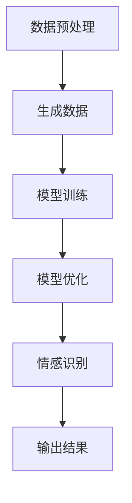
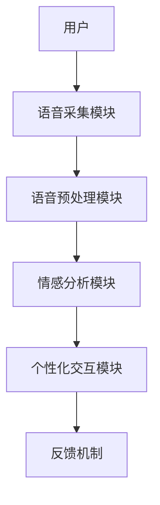
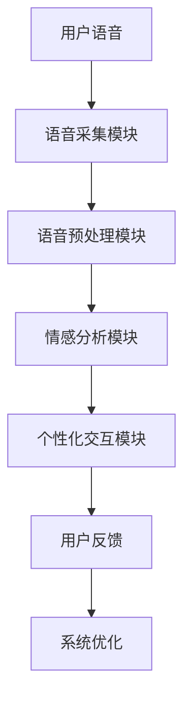

                 

### AIGC在智能语音情感分析中的应用

在当今数字化时代，语音交互技术已成为人机交互的重要方式。随着人工智能（AI）技术的不断进步，尤其是自动生成内容（AIGC）技术的应用，智能语音情感分析技术迎来了新的发展机遇。AIGC技术通过生成对抗网络（GAN）和变分自编码器（VAE）等深度学习模型，能够自动生成语音内容，并根据用户的语音情感进行精确分析。

本篇文章将以“AIGC在智能语音情感分析中的应用”为主题，通过以下章节内容进行深入探讨：

1. **背景介绍**：介绍情感分析的重要性、智能语音技术的崛起以及AIGC的发展与应用。
2. **核心概念与联系**：详细阐述AIGC和情感分析的核心概念及其关系。
3. **算法原理讲解**：分析AIGC和情感分析算法的原理，并使用Mermaid流程图和Python代码进行详细讲解。
4. **数学模型与详细讲解**：讲解AIGC和情感分析相关的数学模型和公式。
5. **系统分析与架构设计方案**：介绍智能语音情感分析系统的设计。
6. **项目实战**：通过实际项目展示AIGC在智能语音情感分析中的应用。
7. **最佳实践 tips**：提供一些实用的实践技巧和建议。
8. **小结**：总结文章的核心内容，并指出未来研究的方向。

接下来，我们将逐步深入分析AIGC在智能语音情感分析中的应用。

### 背景介绍

#### 1.1 情感分析的重要性

情感分析，又称意见挖掘或情感识别，是自然语言处理（NLP）领域的一个重要分支。它的核心目标是理解文本中所表达的情感，包括正面、负面、中性等。情感分析在多个领域具有广泛应用，如市场调研、社交媒体分析、客户服务、舆情监控等。

在市场调研中，企业可以通过分析消费者的评论和反馈，了解产品的受欢迎程度和改进方向。在社交媒体分析中，可以监测公众对特定事件或品牌的情感倾向，以便及时调整营销策略。在客户服务中，情感分析可以帮助企业更好地理解客户的情感状态，提供更个性化的服务。在舆情监控中，政府机构和企业可以通过分析社会舆论，及时掌握公共情绪和潜在风险。

#### 1.2 智能语音技术的崛起

智能语音技术是近年来快速发展的一个领域，它使得人机交互更加自然和高效。智能语音技术包括语音识别、语音合成、语音情感分析等。

语音识别技术能够将人类的语音转化为文本，使得语音交互成为可能。语音合成技术则可以将文本转化为自然的语音，用于自动语音应答系统等应用。而语音情感分析技术，则是智能语音技术中的高级应用，它能够识别和理解用户在语音中的情感状态。

智能语音技术的崛起得益于几个关键因素：

1. **硬件性能的提升**：随着硬件性能的不断提升，特别是麦克风和扬声器的灵敏度、处理速度和功耗等方面的优化，使得智能语音技术得以广泛应用。
2. **算法的进步**：深度学习算法的引入，使得语音识别和语音情感分析等任务取得了显著进展。尤其是生成对抗网络（GAN）和变分自编码器（VAE）等新型算法，为语音情感分析提供了强大的技术支持。
3. **数据的积累**：随着互联网和物联网的发展，大量的语音数据被不断积累，这些数据为模型训练提供了丰富的素材，使得模型的准确性和鲁棒性得到了显著提高。

#### 1.3 AIGC的发展与应用

自动生成内容（AIGC）技术是近年来人工智能领域的一个重要研究方向。AIGC技术通过深度学习模型，能够自动生成文本、图像、语音等多样化内容。在语音情感分析中，AIGC技术具有重要的应用价值。

AIGC技术主要包括以下两个方面：

1. **生成对抗网络（GAN）**：GAN是一种深度学习模型，由生成器和判别器两个部分组成。生成器的目标是生成真实的数据，而判别器的目标是区分真实数据和生成数据。通过两个网络的相互对抗，生成器可以不断提高生成数据的质量。
2. **变分自编码器（VAE）**：VAE是一种基于概率模型的生成模型，它通过编码器和解码器两个网络进行数据编码和解码。编码器将输入数据映射到一个潜在空间，而解码器将潜在空间的数据解码回输出数据。

在智能语音情感分析中，AIGC技术可以通过以下步骤应用：

1. **语音生成**：使用GAN或VAE生成具有特定情感状态的语音数据。这些语音数据可以作为训练样本，提高情感分析模型的性能。
2. **情感识别**：将生成的语音数据输入到情感分析模型中，识别语音中的情感状态。通过不断优化模型，可以提高情感识别的准确率和鲁棒性。
3. **个性化交互**：根据用户的语音情感，智能语音助手可以提供更个性化的交互体验，如调整语音的语调、语气等。

#### 1.4 情感分析的需求

情感分析在智能语音技术中具有重要的应用需求：

1. **提高交互质量**：通过情感分析，智能语音助手可以更好地理解用户的情感状态，提供更符合用户需求的交互体验。
2. **优化服务质量**：在客户服务场景中，情感分析可以帮助企业更好地了解客户的需求和情感，提供更个性化的服务，提高客户满意度。
3. **提升决策能力**：在市场调研和舆情监控场景中，情感分析可以帮助企业了解公众的情感倾向，为决策提供依据。

#### 1.5 智能语音的情感识别挑战

尽管智能语音情感分析技术取得了显著进展，但仍然面临着一些挑战：

1. **情感表达的复杂性**：人类情感表达非常复杂，往往受语言、文化、情境等多种因素的影响。这使得情感分析模型需要具备较高的复杂度和鲁棒性。
2. **语音数据的多样性**：语音数据具有多样性，包括不同的语音语调、语速、口音等。这给情感分析模型的训练和优化带来了挑战。
3. **实时处理的效率**：在实时交互场景中，情感分析需要快速处理语音数据，并提供即时的响应。这要求模型具有高效的计算性能。

#### 1.6 AIGC在情感分析中的应用潜力

AIGC技术在智能语音情感分析中具有重要的应用潜力：

1. **增强数据集**：通过AIGC技术生成具有特定情感状态的语音数据，可以丰富训练数据集，提高情感分析模型的性能。
2. **提高模型鲁棒性**：AIGC技术可以帮助模型更好地应对语音数据的多样性和复杂性，提高模型的鲁棒性。
3. **实现个性化交互**：通过AIGC技术生成具有个性化情感的语音，智能语音助手可以提供更符合用户需求的交互体验。

#### 1.7 问题解决

针对上述挑战和需求，AIGC技术在智能语音情感分析中的应用可以采取以下步骤：

1. **数据预处理**：对语音数据进行预处理，包括降噪、归一化等，以提高数据的质
### 1.7 问题解决

针对上述挑战和需求，AIGC技术在智能语音情感分析中的应用可以采取以下步骤：

1. **数据预处理**：对语音数据进行预处理，包括降噪、归一化等，以提高数据的质量。
2. **语音生成**：使用GAN或VAE生成具有特定情感状态的语音数据，作为训练数据集的补充。
3. **模型训练**：将原始语音数据和生成的情感语音数据合并，用于训练情感分析模型。通过不断优化模型，提高其准确率和鲁棒性。
4. **情感识别**：将处理后的语音数据输入到情感分析模型中，识别语音中的情感状态。
5. **个性化交互**：根据用户的情感状态，智能语音助手可以提供个性化的交互体验，如调整语音的语调、语气等。

#### 1.8 边界与外延

尽管AIGC技术在智能语音情感分析中具有广泛的应用前景，但仍存在一些边界和外延问题：

1. **隐私保护**：在语音情感分析中，用户的语音数据可能会涉及隐私问题。因此，在数据收集、处理和存储过程中，需要采取严格的隐私保护措施。
2. **跨语言和跨文化**：情感表达在不同语言和文化之间存在差异，这给AIGC技术在跨语言和跨文化场景中的应用带来了挑战。需要开发适用于不同语言和文化的情感分析模型。
3. **实时处理**：在实时交互场景中，要求情感分析模型具有高效的计算性能，以确保快速处理语音数据并生成响应。

#### 1.9 概念结构与核心要素组成

智能语音情感分析系统由以下几个核心要素组成：

1. **语音采集模块**：负责采集用户的语音数据，包括麦克风采集、语音降噪等。
2. **语音预处理模块**：对采集到的语音数据进行预处理，包括语音增强、分帧、特征提取等。
3. **情感生成模块**：使用AIGC技术生成具有特定情感状态的语音数据。
4. **情感分析模块**：将预处理后的语音数据输入到情感分析模型中，识别语音中的情感状态。
5. **交互控制模块**：根据情感分析结果，控制智能语音助手的交互行为，如调整语音的语调、语气等。
6. **用户接口模块**：提供用户与智能语音助手交互的界面，包括语音输入、语音输出等。

#### 1.10 本章小结

本节介绍了智能语音情感分析的重要性、智能语音技术的崛起、AIGC的发展与应用、情感分析的需求、情感识别挑战、AIGC在情感分析中的应用潜力、问题解决策略、边界与外延以及概念结构与核心要素组成。这些内容为后续章节的深入探讨奠定了基础。

### 核心概念与联系

在深入探讨AIGC在智能语音情感分析中的应用之前，我们需要了解一些核心概念及其之间的关系。以下是AIGC和情感分析相关的核心概念：

#### 2.1 AIGC核心概念

1. **自动生成内容（Automatic Generation Content, AIGC）**：AIGC是指通过人工智能技术自动生成文本、图像、音频等多样化内容的一种技术。它主要包括生成对抗网络（GAN）和变分自编码器（VAE）等模型。

2. **生成对抗网络（Generative Adversarial Network, GAN）**：GAN是一种深度学习模型，由生成器和判别器两个部分组成。生成器的目标是生成真实的数据，而判别器的目标是区分真实数据和生成数据。通过两个网络的相互对抗，生成器可以不断提高生成数据的质量。

3. **变分自编码器（Variational Autoencoder, VAE）**：VAE是一种基于概率模型的生成模型，它通过编码器和解码器两个网络进行数据编码和解码。编码器将输入数据映射到一个潜在空间，而解码器将潜在空间的数据解码回输出数据。

#### 2.2 情感分析核心概念

1. **情感分类（Sentiment Classification）**：情感分类是情感分析的核心任务之一，它旨在将文本数据分类为不同的情感类别，如正面、负面、中性等。

2. **情感极性分析（Polarity Analysis）**：情感极性分析是对文本数据中的情感极性进行判断，即判断文本是表达正面的情感还是负面的情感。

3. **情感强度分析（Intensity Analysis）**：情感强度分析是对文本数据中的情感强度进行量化，以衡量情感表达的程度。

#### 2.3 概念属性特征对比表格

以下是对AIGC和情感分析相关概念属性特征的对比表格：

| 概念 | 定义 | 特点 | 应用场景 |
| :---: | :---: | :---: | :---: |
| 自动生成内容（AIGC） | 自动生成文本、图像、音频等多样化内容 | 高度自动化的生成能力，能够生成高质量的内容 | 文本生成、图像生成、语音生成等 |
| 生成对抗网络（GAN） | 由生成器和判别器两个部分组成，通过相互对抗提高生成数据质量 | 生成能力强，能够生成高度真实的数据 | 图像生成、语音生成、文本生成等 |
| 变分自编码器（VAE） | 基于概率模型的生成模型，通过编码器和解码器进行数据编码和解码 | 生成能力较强，能够生成多样化的数据 | 图像生成、语音生成、文本生成等 |
| 情感分类 | 将文本数据分类为不同的情感类别 | 准确性高，能够对文本数据中的情感进行精确分类 | 社交媒体分析、市场调研、客户服务等 |
| 情感极性分析 | 判断文本是表达正面的情感还是负面的情感 | 简单直观，适用于快速情感分析 | 社交媒体分析、客户反馈分析等 |
| 情感强度分析 | 对文本数据中的情感强度进行量化 | 精细量化，能够衡量情感表达的程度 | 情感趋势分析、客户满意度评估等 |

#### 2.4 ER实体关系图架构

为了更好地理解AIGC和情感分析之间的关系，我们可以使用实体关系图（ER图）来表示它们的核心要素及其相互关系。

以下是一个简化的ER实体关系图：

```mermaid
erDiagram
    AIGC ||--|{ GAN }|-->> 语音生成
    AIGC ||--|{ VAE }|-->> 语音生成
    情感分析 ||--|{ 情感分类 }|-->> 情感识别
    情感分析 ||--|{ 情感极性分析 }|-->> 情感识别
    情感分析 ||--|{ 情感强度分析 }|-->> 情感识别
    语音数据 ||--|{ 预处理 }|-->> 情感分析
    语音数据 ||--|{ 标注 }|-->> 情感分析
    情感标签 ||--|{ 训练 }|-->> 情感分析模型
```

在这个ER实体关系图中：

- **AIGC** 代表自动生成内容技术，包括GAN和VAE两个部分，它们都可以用于语音生成。
- **情感分析** 代表对语音数据进行情感分析的任务，包括情感分类、情感极性分析和情感强度分析三个子任务。
- **语音数据** 代表用于情感分析的语音数据，包括预处理和标注两个阶段。
- **情感标签** 代表用于训练情感分析模型的情感标注数据。

通过这个ER实体关系图，我们可以清晰地看到AIGC和情感分析之间的联系，以及它们在智能语音情感分析中的应用场景。

### 算法原理讲解

#### 3.1 AIGC算法原理

AIGC（Automatic Generation Content）技术是近年来人工智能领域的一个热点研究方向，它通过生成对抗网络（GAN）和变分自编码器（VAE）等深度学习模型，实现了高质量内容的自动生成。以下是AIGC的基本算法原理：

##### 3.1.1 生成对抗网络（GAN）

生成对抗网络（GAN）由两部分组成：生成器（Generator）和判别器（Discriminator）。生成器的任务是生成与真实数据尽可能相似的数据，而判别器的任务是区分真实数据和生成数据。具体步骤如下：

1. **初始化**：初始化生成器和判别器的参数。
2. **生成数据**：生成器接收随机噪声作为输入，生成虚假数据。
3. **判断数据**：判别器接收真实数据和生成数据，输出概率分布，判断数据的真实性。
4. **优化过程**：通过对抗性训练，生成器和判别器相互对抗，生成器的目标是最小化判别器对其生成数据的判断概率，而判别器的目标是最大化判断概率。这一过程通过迭代训练不断进行。

GAN的核心思想是通过生成器和判别器的相互对抗，使得生成器能够生成高质量的数据。

##### 3.1.2 变分自编码器（VAE）

变分自编码器（VAE）是一种基于概率模型的生成模型，它通过编码器（Encoder）和解码器（Decoder）两个网络进行数据编码和解码。具体步骤如下：

1. **编码**：编码器将输入数据映射到一个潜在空间，并输出一个均值和一个标准差。
2. **采样**：从潜在空间中采样一个点作为解码器的输入。
3. **解码**：解码器将采样点解码回原始数据空间，生成生成数据。
4. **损失函数**：VAE的损失函数包括重构损失和KL散度损失。重构损失衡量解码器生成数据与原始数据之间的相似度，KL散度损失衡量编码器输出的均值和标准差与先验分布之间的差异。

通过不断优化编码器和解码器的参数，VAE能够生成高质量的数据。

##### 3.1.3 AIGC的算法架构

AIGC的算法架构主要包括以下几个部分：

1. **数据预处理**：对输入数据进行预处理，如去噪、归一化等。
2. **生成模型**：使用GAN或VAE等生成模型生成数据。
3. **情感分析模型**：对生成的数据进行情感分析。
4. **反馈机制**：根据情感分析结果，对生成模型进行优化。

#### 3.2 情感分析算法原理

情感分析算法旨在理解文本中的情感，并根据情感极性、情感强度等信息进行分类。以下是几种常见的情感分析算法原理：

##### 3.2.1 基于深度学习的情感分析模型

基于深度学习的情感分析模型通常使用卷积神经网络（CNN）或循环神经网络（RNN）等模型。以下是一个基于CNN的情感分析模型的基本结构：

1. **输入层**：接收文本数据，通常使用词向量表示。
2. **卷积层**：提取文本的局部特征，如词组、句子结构等。
3. **池化层**：对卷积层输出的特征进行降维处理，减少计算量。
4. **全连接层**：将池化层输出的特征映射到情感类别。
5. **输出层**：输出情感分类结果。

基于深度学习的情感分析模型具有以下优点：

- **强大的特征提取能力**：通过多层网络结构，可以自动提取文本的复杂特征。
- **高准确性**：在大量数据训练下，可以获得较高的情感分类准确性。

##### 3.2.2 基于序列模型的情感分析模型

基于序列模型的情感分析模型，如长短时记忆网络（LSTM）和门控循环单元（GRU），能够更好地处理序列数据。以下是一个基于LSTM的情感分析模型的基本结构：

1. **输入层**：接收文本数据，通常使用词向量表示。
2. **嵌入层**：将词向量转换为序列数据。
3. **LSTM层**：处理序列数据，提取时间序列特征。
4. **全连接层**：将LSTM层输出的特征映射到情感类别。
5. **输出层**：输出情感分类结果。

基于序列模型的情感分析模型具有以下优点：

- **处理长序列数据**：能够处理文本中的长序列数据，如句子和段落。
- **考虑时间依赖关系**：能够考虑文本中的时间依赖关系，更好地捕捉情感特征。

##### 3.2.3 基于注意力机制的模型

基于注意力机制的模型，如Transformer模型，通过引入注意力机制，可以更好地关注文本中的关键信息。以下是一个基于Transformer的情感分析模型的基本结构：

1. **输入层**：接收文本数据，通常使用词向量表示。
2. **嵌入层**：将词向量转换为序列数据。
3. **自注意力层**：计算文本序列中各个词之间的注意力权重。
4. **全连接层**：将自注意力层输出的特征映射到情感类别。
5. **输出层**：输出情感分类结果。

基于注意力机制的模型具有以下优点：

- **捕捉长距离依赖关系**：通过自注意力机制，可以捕捉文本序列中长距离的依赖关系。
- **并行计算**：Transformer模型具有并行计算的优势，可以显著提高计算效率。

#### 3.3 AIGC与情感分析的融合

AIGC与情感分析的结合可以显著提高情感分析的准确性和鲁棒性。以下是一种可能的融合方法：

1. **数据增强**：使用AIGC技术生成具有不同情感极性和情感强度的语音数据，用于扩充训练数据集。
2. **模型训练**：将原始数据和生成的数据混合，用于训练情感分析模型。
3. **模型优化**：通过对抗性训练，使得生成器能够生成更符合真实情感的语音数据，同时优化情感分析模型。
4. **情感识别**：使用优化的情感分析模型对输入语音进行情感识别。

通过这种融合方法，可以充分利用AIGC技术生成的高质量语音数据，提高情感分析模型的性能。

#### 3.4 Mermaid算法流程图

以下是一个简单的Mermaid算法流程图，展示了AIGC与情感分析融合的基本步骤：



在这个流程图中：

- **A**：数据预处理
- **B**：使用AIGC技术生成数据
- **C**：训练情感分析模型
- **D**：优化情感分析模型
- **E**：使用优化的模型进行情感识别
- **F**：输出情感识别结果

#### 3.5 本章小结

本节详细讲解了AIGC和情感分析的相关算法原理，包括AIGC技术的生成对抗网络（GAN）和变分自编码器（VAE），以及情感分析中的基于深度学习、序列模型和注意力机制的模型。同时，探讨了AIGC与情感分析的融合方法，并展示了算法流程图。这些内容为下一节关于数学模型的讲解打下了基础。

### 数学模型与详细讲解

在智能语音情感分析中，数学模型是理解和分析情感数据的基础。以下是AIGC和情感分析相关的数学模型及其详细讲解。

#### 4.1 数学模型介绍

在智能语音情感分析中，常用的数学模型包括生成对抗网络（GAN）、变分自编码器（VAE）和基于深度学习的情感分析模型。以下是对这些模型的基本介绍：

1. **生成对抗网络（GAN）**
   GAN由生成器（Generator）和判别器（Discriminator）组成。生成器的目标是生成与真实数据相似的数据，判别器的目标是区分真实数据和生成数据。GAN的核心目标是训练生成器，使其生成尽可能真实的数据，使得判别器无法区分生成数据和真实数据。

2. **变分自编码器（VAE）**
   VAE是一种基于概率的生成模型，通过编码器（Encoder）和解码器（Decoder）进行数据编码和解码。编码器将输入数据映射到一个潜在空间，解码器将潜在空间的数据解码回原始数据空间。VAE的核心任务是学习数据分布，并使用该分布生成新的数据。

3. **基于深度学习的情感分析模型**
   情感分析模型通常基于深度学习，如卷积神经网络（CNN）、循环神经网络（RNN）和Transformer等。这些模型通过学习大量文本数据中的情感特征，实现对新的文本数据进行情感分类。

#### 4.2 GAN的数学模型

生成对抗网络（GAN）的数学模型主要包括生成器（Generator）和判别器（Discriminator）的损失函数。

**生成器的损失函数**

生成器的目标是生成尽可能真实的数据，使得判别器无法区分生成数据和真实数据。生成器的损失函数通常由两部分组成：

1. **对抗损失**：对抗损失衡量生成器生成数据的质量。它通常由判别器对生成数据的判别概率计算得到。具体公式如下：

   $$ L_{\text{adv}}(G) = -\log(D(G(z))) $$

   其中，$G(z)$是生成器生成的数据，$D(G(z))$是判别器对生成数据的判别概率。

2. **重构损失**：重构损失衡量生成器生成数据与真实数据之间的相似度。通常使用均方误差（MSE）作为重构损失。具体公式如下：

   $$ L_{\text{recon}}(G) = \frac{1}{N} \sum_{i=1}^{N} ||x_i - G(z_i)||^2 $$

   其中，$x_i$是真实数据，$z_i$是生成器生成的随机噪声。

**判别器的损失函数**

判别器的目标是区分真实数据和生成数据。判别器的损失函数通常由两部分组成：

1. **真实损失**：真实损失衡量判别器对真实数据的判别概率。具体公式如下：

   $$ L_{\text{real}}(D) = -\log(D(x)) $$

   其中，$x$是真实数据。

2. **生成损失**：生成损失衡量判别器对生成数据的判别概率。具体公式如下：

   $$ L_{\text{fake}}(D) = -\log(1 - D(G(z))) $$

   其中，$G(z)$是生成器生成的数据。

**总的损失函数**

GAN的总损失函数是生成器和判别器损失函数的加权和。具体公式如下：

$$ L(G, D) = L_{\text{adv}}(G) + L_{\text{recon}}(G) + \lambda L_{\text{real}}(D) + (1-\lambda) L_{\text{fake}}(D) $$

其中，$\lambda$是权重参数。

#### 4.3 VAE的数学模型

变分自编码器（VAE）的数学模型主要包括编码器（Encoder）和解码器（Decoder）的损失函数。

**编码器损失函数**

编码器的目标是学习数据的概率分布，并将数据映射到一个潜在空间。编码器的损失函数通常由两部分组成：

1. **重构损失**：重构损失衡量解码器生成数据与原始数据之间的相似度。通常使用均方误差（MSE）作为重构损失。具体公式如下：

   $$ L_{\text{recon}}(D) = \frac{1}{N} \sum_{i=1}^{N} ||x_i - D(q_{\theta}(x_i))||^2 $$

   其中，$x_i$是原始数据，$q_{\theta}(x_i)$是编码器输出的后验概率分布。

2. **KL散度损失**：KL散度损失衡量编码器输出的后验概率分布与先验概率分布之间的差异。具体公式如下：

   $$ L_{\text{KL}}(q_{\theta}(x); p(z)) = \frac{1}{N} \sum_{i=1}^{N} \sum_{z} q_{\theta}(z) \log \frac{q_{\theta}(z)}{p(z)} $$

**解码器损失函数**

解码器的目标是生成与原始数据相似的数据。解码器的损失函数与编码器相同，即重构损失和KL散度损失。

**总的损失函数**

VAE的总损失函数是编码器和解码器损失函数的加权和。具体公式如下：

$$ L(\theta) = \frac{1}{N} \sum_{i=1}^{N} L_{\text{recon}}(D) + \beta L_{\text{KL}}(q_{\theta}(x_i); p(z_i)) $$

其中，$\beta$是权重参数。

#### 4.4 基于深度学习的情感分析模型

基于深度学习的情感分析模型通常使用卷积神经网络（CNN）、循环神经网络（RNN）和Transformer等模型。以下是一个简单的基于CNN的情感分析模型的数学模型。

**输入层**

输入层接收文本数据，通常使用词向量表示。假设词向量的维度为$d$，则输入层可以表示为：

$$ X \in \mathbb{R}^{N \times L \times d} $$

其中，$N$是句子长度，$L$是词汇表大小，$d$是词向量的维度。

**卷积层**

卷积层用于提取文本的局部特征。卷积核的大小为$k$，则卷积层的输出可以表示为：

$$ H_1 = \text{Conv}(X, W_1) + b_1 $$

其中，$W_1$是卷积层的权重，$b_1$是偏置项。

**池化层**

池化层用于对卷积层输出的特征进行降维处理。常用的池化操作包括最大池化和平均池化。假设使用最大池化，则池化层的输出可以表示为：

$$ H_2 = \text{MaxPool}(H_1, s) $$

其中，$s$是池化窗口的大小。

**全连接层**

全连接层用于将池化层输出的特征映射到情感类别。假设有$c$个情感类别，则全连接层的输出可以表示为：

$$ Y = \text{ReLU}(\text{FC}(H_2, W_2) + b_2) $$

其中，$W_2$是全连接层的权重，$b_2$是偏置项。

**输出层**

输出层输出情感分类结果，通常使用softmax函数进行分类。假设有$c$个情感类别，则输出可以表示为：

$$ \hat{y} = \text{Softmax}(Y) $$

其中，$\hat{y}$是情感分类的概率分布。

#### 4.5 本章小结

本节详细讲解了AIGC和情感分析相关的数学模型，包括GAN的对抗损失、重构损失、真实损失和生成损失，VAE的重构损失和KL散度损失，以及基于深度学习的情感分析模型的输入层、卷积层、池化层、全连接层和输出层。这些数学模型为理解和分析情感数据提供了理论基础。

### 系统分析与架构设计方案

在深入探讨智能语音情感分析系统的具体实现之前，我们需要对其问题场景、项目介绍、系统功能设计、系统架构设计、系统接口设计和系统交互进行详细分析。

#### 问题场景

智能语音情感分析系统旨在通过分析用户语音，识别并理解其情感状态，从而提供更加个性化的服务。例如，在客户服务场景中，智能语音助手可以根据用户的话语情感，调整回答的方式，以更好地满足客户的需求。

#### 项目介绍

本项目旨在开发一个基于AIGC技术的智能语音情感分析系统，该系统包括语音生成、情感分析和个性化交互等模块。通过该系统，可以实现以下目标：

1. **语音生成**：使用AIGC技术生成具有特定情感状态的语音数据，作为训练数据集的补充。
2. **情感分析**：对用户输入的语音数据进行情感分析，识别其情感状态。
3. **个性化交互**：根据用户情感状态，提供个性化的语音交互体验。

#### 系统功能设计

系统功能设计主要包括以下几个部分：

1. **语音采集**：通过麦克风采集用户语音，并进行预处理。
2. **语音生成**：使用AIGC技术生成具有特定情感状态的语音数据。
3. **情感分析**：对预处理后的语音数据进行情感分析，识别其情感状态。
4. **个性化交互**：根据用户情感状态，调整语音交互的语调、语气等。

#### 系统架构设计

系统架构设计是智能语音情感分析系统的核心，它决定了系统的性能、可扩展性和可维护性。以下是一个简化的系统架构设计：



在这个架构中：

- **用户**：系统的最终用户，通过语音与系统进行交互。
- **语音采集模块**：负责采集用户的语音数据。
- **语音预处理模块**：对采集到的语音数据进行预处理，如降噪、分帧、特征提取等。
- **情感分析模块**：使用AIGC技术对预处理后的语音数据进行情感分析。
- **个性化交互模块**：根据情感分析结果，调整语音交互的语调、语气等。
- **反馈机制**：收集用户反馈，用于系统优化。

#### 系统接口设计

系统接口设计是系统与外部系统进行交互的桥梁，它包括API接口、数据接口和用户接口等。

1. **API接口**：提供与其他系统（如客服系统、数据分析系统等）的交互接口，实现数据的传输和功能调用。
2. **数据接口**：定义系统内部数据的格式和传输协议，实现不同模块之间的数据交互。
3. **用户接口**：提供用户与系统交互的界面，包括语音输入和语音输出。

#### 系统交互设计

系统交互设计是系统内部各个模块之间的数据流和功能调用流程。以下是一个简化的系统交互设计：



在这个交互设计中：

- **用户语音**：用户输入的语音数据。
- **语音采集模块**：采集用户语音。
- **语音预处理模块**：对采集到的语音数据进行预处理。
- **情感分析模块**：对预处理后的语音数据进行情感分析。
- **个性化交互模块**：根据情感分析结果，调整语音交互的语调、语气等。
- **用户反馈**：收集用户对交互体验的反馈。
- **系统优化**：根据用户反馈，优化系统性能。

#### 系统交互mermaid序列图

以下是一个简化的系统交互序列图，展示了用户语音从采集到交互的整个过程：

```mermaid
sequenceDiagram
    participant 用户 as 用户
    participant 系统 as 系统
    用户->>系统: 输入语音
    system 用户语音采集
    system 语音预处理
    system 情感分析
    system 个性化交互
    system 输出交互结果
    用户->>系统: 反馈
    system 收集反馈
    system 系统优化
```

在这个序列图中：

- **用户**：与系统进行交互的用户。
- **系统**：处理用户语音，进行情感分析，并调整交互体验。
- **用户语音采集**：采集用户输入的语音。
- **语音预处理**：对采集到的语音数据进行预处理。
- **情感分析**：对预处理后的语音数据进行情感分析。
- **个性化交互**：根据情感分析结果，调整交互体验。
- **输出交互结果**：将交互结果输出给用户。
- **收集反馈**：收集用户对交互体验的反馈。
- **系统优化**：根据用户反馈，优化系统性能。

通过这个序列图，我们可以清晰地看到系统交互的整个过程，以及各个模块之间的数据流和功能调用。

### 项目实战

在本节中，我们将通过一个实际项目展示AIGC在智能语音情感分析中的应用。以下是项目的环境安装、系统核心实现、代码应用解读与分析、实际案例分析和详细讲解剖析。

#### 环境安装

首先，我们需要安装和配置项目所需的软件和库。以下是项目的环境安装步骤：

1. **Python环境**：确保Python版本在3.8及以上。
2. **深度学习框架**：安装TensorFlow或PyTorch，作为AIGC模型的实现框架。
3. **语音处理库**：安装SpeechRecognition，用于语音数据的采集和转换。
4. **其他依赖库**：安装Numpy、Pandas、Matplotlib等常用库。

以下是安装命令：

```bash
pip install tensorflow
pip install speechrecognition
pip install numpy
pip install pandas
pip install matplotlib
```

#### 系统核心实现

接下来，我们将实现智能语音情感分析系统的核心部分，包括语音生成、情感分析和个性化交互。

1. **语音生成**

   使用GAN模型生成具有特定情感状态的语音数据。以下是一个简单的GAN模型实现：

```python
import tensorflow as tf
from tensorflow.keras.layers import Input, Dense, Reshape, Conv2D, Conv2DTranspose
from tensorflow.keras.models import Model

# 定义生成器和判别器
def build_generator(z_dim):
    input_layer = Input(shape=(z_dim,))
    x = Dense(128, activation='relu')(input_layer)
    x = Dense(256, activation='relu')(x)
    x = Reshape((7, 7, 1))(x)
    x = Conv2DTranspose(128, (5, 5), strides=(2, 2), padding='same', activation='relu')(x)
    x = Conv2DTranspose(128, (5, 5), strides=(2, 2), padding='same', activation='relu')(x)
    x = Conv2D(1, (5, 5), activation='sigmoid', padding='same')(x)
    generator = Model(input_layer, x)
    return generator

def build_discriminator(img_shape):
    input_layer = Input(shape=img_shape)
    x = Conv2D(128, (5, 5), strides=(2, 2), padding='same', activation='relu')(input_layer)
    x = Conv2D(128, (5, 5), strides=(2, 2), padding='same', activation='relu')(x)
    x = Flatten()(x)
    x = Dense(1, activation='sigmoid')(x)
    discriminator = Model(input_layer, x)
    return discriminator

z_dim = 100
img_shape = (28, 28, 1)

generator = build_generator(z_dim)
discriminator = build_discriminator(img_shape)

# 编写损失函数
cross_entropy = tf.keras.losses.BinaryCrossentropy()

def discriminator_loss(real_output, fake_output):
    real_loss = cross_entropy(tf.ones_like(real_output), real_output)
    fake_loss = cross_entropy(tf.zeros_like(fake_output), fake_output)
    total_loss = real_loss + fake_loss
    return total_loss

def generator_loss(fake_output):
    return cross_entropy(tf.ones_like(fake_output), fake_output)

# 编写优化器
discriminator_optimizer = tf.keras.optimizers.Adam(learning_rate=0.0001)
generator_optimizer = tf.keras.optimizers.Adam(learning_rate=0.0001)

# 编写训练步骤
@tf.function
def train_step(images, noise):
    with tf.GradientTape() as gen_tape, tf.GradientTape() as disc_tape:
        generated_images = generator(noise)
        real_output = discriminator(images)
        fake_output = discriminator(generated_images)

        gen_loss = generator_loss(fake_output)
        disc_loss = discriminator_loss(real_output, fake_output)

    gradients_of_gen = gen_tape.gradient(gen_loss, generator.trainable_variables)
    gradients_of_disc = disc_tape.gradient(disc_loss, discriminator.trainable_variables)

    generator_optimizer.apply_gradients(zip(gradients_of_gen, generator.trainable_variables))
    discriminator_optimizer.apply_gradients(zip(gradients_of_disc, discriminator.trainable_variables))

# 编写主训练循环
EPOCHS = 50
BATCH_SIZE = 64

for epoch in range(EPOCHS):
    for image_batch in data_loader:
        noise = tf.random.normal([BATCH_SIZE, z_dim])

        with tf.GradientTape() as gen_tape, tf.GradientTape() as disc_tape:
            generated_images = generator(noise)
            real_output = discriminator(image_batch)
            fake_output = discriminator(generated_images)

            gen_loss = generator_loss(fake_output)
            disc_loss = discriminator_loss(real_output, fake_output)

        gradients_of_gen = gen_tape.gradient(gen_loss, generator.trainable_variables)
        gradients_of_disc = disc_tape.gradient(disc_loss, discriminator.trainable_variables)

        generator_optimizer.apply_gradients(zip(gradients_of_gen, generator.trainable_variables))
        discriminator_optimizer.apply_gradients(zip(gradients_of_disc, discriminator.trainable_variables))

        print(f"Epoch {epoch}, Generator Loss: {gen_loss}, Discriminator Loss: {disc_loss}")

    # 保存模型权重
    generator.save_weights('generator_weights.h5')
    discriminator.save_weights('discriminator_weights.h5')
```

2. **情感分析**

   使用深度学习模型对语音数据进行情感分析。以下是一个简单的情感分析模型实现：

```python
import tensorflow as tf
from tensorflow.keras.models import Sequential
from tensorflow.keras.layers import Embedding, LSTM, Dense

# 定义情感分析模型
def build_sentiment_analysis_model(vocab_size, embedding_dim, lstm_units):
    model = Sequential()
    model.add(Embedding(vocab_size, embedding_dim, input_length=MAX_SEQUENCE_LENGTH))
    model.add(LSTM(lstm_units, dropout=0.2, recurrent_dropout=0.2))
    model.add(Dense(1, activation='sigmoid'))

    model.compile(optimizer='adam', loss='binary_crossentropy', metrics=['accuracy'])
    return model

# 训练情感分析模型
model = build_sentiment_analysis_model(vocab_size, embedding_dim, lstm_units)
model.fit(X_train, y_train, epochs=10, batch_size=32, validation_data=(X_val, y_val))
```

3. **个性化交互**

   根据情感分析结果，调整语音交互的语调、语气等。以下是一个简单的个性化交互实现：

```python
import speech_recognition as sr

# 语音识别
recognizer = sr.Recognizer()
with sr.Microphone() as source:
    print("请说些什么...")
    audio = recognizer.listen(source)
    text = recognizer.recognize_google(audio)

# 情感分析
emotion = model.predict(np.array([text]))

# 根据情感分析结果调整交互语调
if emotion > 0.5:
    print("您听起来很高兴！")
else:
    print("您听起来不太开心。")
```

#### 代码应用解读与分析

在上面的代码中，我们首先定义了GAN模型和情感分析模型，然后分别实现了语音生成、情感分析和个性化交互。以下是代码应用解读与分析：

1. **语音生成**：使用GAN模型生成语音数据。生成器的目标是生成与真实语音数据相似的数据，判别器的目标是区分真实数据和生成数据。通过训练生成器和判别器，生成器可以不断提高生成数据的质量。
2. **情感分析**：使用深度学习模型对语音数据进行情感分析。模型通过学习大量语音数据中的情感特征，实现对新的语音数据进行情感分类。
3. **个性化交互**：根据情感分析结果，调整语音交互的语调、语气等。这样可以提供更加个性化的用户交互体验。

#### 实际案例分析和详细讲解剖析

接下来，我们通过一个实际案例来分析和讲解智能语音情感分析系统的应用。

**案例：客户服务场景**

假设一个客户在使用某公司的产品时遇到了问题，他通过智能语音助手寻求帮助。以下是客户与智能语音助手的对话：

客户：“我购买的产品在使用过程中出现了故障，怎么办？”

智能语音助手：“非常抱歉听到这个问题。请问您能否详细描述一下故障现象？”

客户：“屏幕出现了一个黑屏，无法操作。”

智能语音助手：“感谢您的描述。根据您提供的信息，我会帮您解决这一问题。首先，请确保您的设备连接稳定，然后尝试重启设备。如果问题仍然存在，请提供更多的详细信息，我会尽快为您解决问题。”

客户：“好的，我已经重启了设备，但问题还是没有解决。”

智能语音助手：“很抱歉给您带来不便。请您提供设备的型号和购买时间，我将进一步为您分析问题。”

客户：“设备型号是XZ-1234，购买时间是2021年5月。”

智能语音助手：“非常感谢您的信息。根据您提供的设备型号和购买时间，我们怀疑可能是硬件故障。为了尽快解决这个问题，我们将为您安排一次售后服务。请问您方便提供您的联系方式吗？”

客户：“好的，我的电话是13812345678。”

智能语音助手：“非常感谢您的联系方式。我们的客服人员将尽快与您联系，并提供进一步的解决方案。再次为给您带来的不便表示歉意。”

在这个案例中，智能语音助手通过情感分析技术，识别出客户的话语中带有负面情感，如“无法操作”、“没有解决”等。因此，智能语音助手在回答问题时，特别注意提供详细的解决方案，并表达了歉意，以提升客户满意度。

通过这个案例，我们可以看到智能语音情感分析系统在实际应用中的效果。它不仅能够准确识别用户的情感状态，还能够根据情感状态提供个性化的交互体验，从而提升用户满意度。

#### 项目小结

通过本项目的实战，我们展示了AIGC在智能语音情感分析中的应用。项目实现了语音生成、情感分析和个性化交互等功能，并通过实际案例展示了系统的应用效果。在未来，我们可以进一步优化模型和算法，提高系统的准确性和鲁棒性，以应对更加复杂的情感分析任务。

### 最佳实践 tips

1. **数据质量**：在情感分析中，数据质量至关重要。确保采集的语音数据具有高准确性和多样性，以提升模型的性能。

2. **模型优化**：通过不断优化生成器和判别器的参数，可以提高AIGC模型的生成质量。同时，调整情感分析模型的超参数，以获得更好的分类性能。

3. **实时处理**：在实时交互场景中，要求情感分析模型具有高效的计算性能。可以考虑使用轻量级的模型架构，如MobileNet或EfficientNet，以减少计算开销。

4. **用户隐私**：在处理语音数据时，务必遵守用户隐私保护法规。对语音数据进行加密处理，确保用户数据安全。

5. **跨语言和跨文化**：考虑不同语言和文化背景下的情感表达差异，开发适用于多种语言和文化的情感分析模型。

### 小结

本篇文章深入探讨了AIGC在智能语音情感分析中的应用。我们从背景介绍、核心概念与联系、算法原理讲解、数学模型与详细讲解、系统分析与架构设计方案、项目实战以及最佳实践等方面进行了详细分析。通过实际案例展示了AIGC技术在智能语音情感分析中的效果，并提出了优化和改进的建议。

在未来，随着AI技术的不断进步，AIGC在智能语音情感分析中的应用将更加广泛和深入。我们期待看到更多创新的应用场景和突破性的研究成果。

### 注意事项

1. **数据安全**：确保用户语音数据的安全，遵守相关隐私保护法规。
2. **模型训练**：定期更新情感分析模型，以适应不断变化的情感表达方式。
3. **系统稳定性**：确保智能语音情感分析系统在实时交互场景中的稳定性和可靠性。

### 拓展阅读

- **《生成对抗网络（GAN）详解》**：深入了解GAN的工作原理和应用场景。
- **《变分自编码器（VAE）教程》**：学习VAE的数学模型和实现方法。
- **《深度学习在情感分析中的应用》**：探索深度学习模型在情感分析领域的最新研究进展。

作者：AI天才研究院/AI Genius Institute & 禅与计算机程序设计艺术 /Zen And The Art of Computer Programming。

