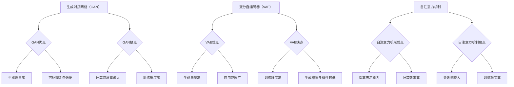
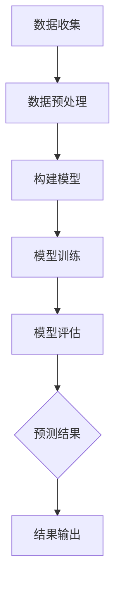
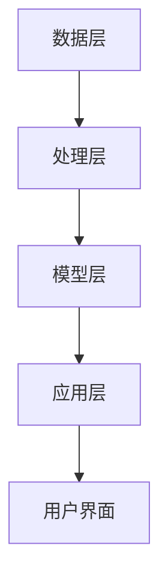
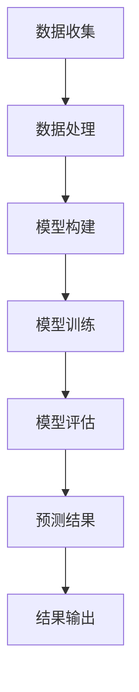
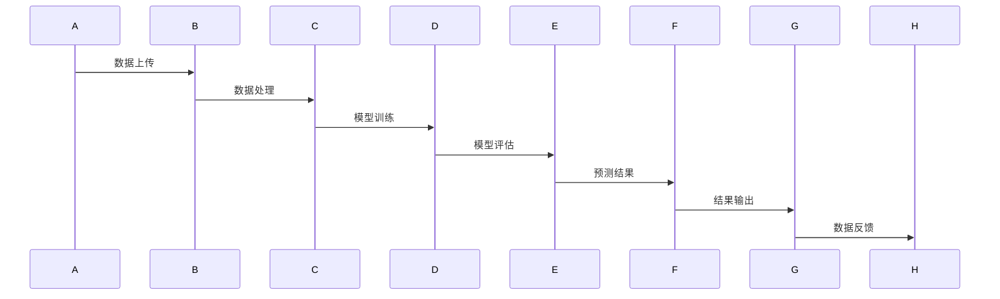

                 


# AIGC在智能财务预测中的应用

## 关键词

- AIGC
- 财务预测
- 智能化
- 数据生成
- 风险分析

## 摘要

本文旨在探讨AIGC（人工智能生成内容）在智能财务预测中的应用。首先，我们介绍了智能财务预测的重要性以及传统财务预测的局限性，接着引出了AIGC的概念及其在财务领域的作用。随后，我们详细阐述了AIGC的基础理论，包括其定义、分类、核心技术及在财务领域的应用现状。在此基础上，我们探讨了AIGC在财务预测中的应用原理，并通过实际案例展示了其应用效果。最后，我们详细描述了AIGC在智能财务预测中的系统设计与实现，包括系统架构设计、系统接口设计和系统交互。通过本文的深入探讨，希望能够为智能财务预测领域的研究和应用提供有价值的参考。

## 第一部分：引言与背景介绍

### 1.1 引言

智能财务预测是现代金融科技领域的一个重要研究方向。随着大数据、云计算、人工智能等技术的发展，财务预测正逐步从传统的经验式预测向智能化预测转变。然而，传统的财务预测方法往往存在诸多局限性，难以满足日益复杂的财务预测需求。因此，探索更加智能、高效的财务预测方法具有重要的现实意义。

### 1.2 问题背景

智能财务预测的重要性不言而喻。首先，财务预测对于企业的经营决策具有重要意义。准确预测企业的财务状况可以帮助企业及时调整战略，降低经营风险。其次，对于投资者而言，财务预测能够提供重要的投资参考，帮助他们做出更加明智的投资决策。此外，对于金融机构来说，财务预测有助于风险控制、投资组合优化等。

然而，传统财务预测方法存在诸多局限性。首先，传统财务预测主要依赖于历史数据和统计模型，预测结果往往受到数据质量和模型选择的影响。其次，传统方法难以处理大规模、多维度的复杂数据，导致预测精度和效率受限。此外，传统方法在应对突发性事件和金融市场波动时，表现也相对滞后。

### 1.3 问题描述

财务预测的需求主要来源于以下几个方面：

1. **短期财务预测**：主要包括预测企业未来几个月或几年的收入、利润、现金流等财务指标。
2. **长期财务预测**：主要关注企业未来几年或十几年的财务状况，如企业规模、市场份额、竞争力等。
3. **风险管理**：通过对财务数据的预测，识别潜在的风险，并制定相应的风险应对策略。

财务预测面临的挑战主要包括：

1. **数据质量问题**：财务数据通常存在噪声、缺失值、异常值等问题，这对预测模型的准确性产生较大影响。
2. **模型选择**：传统统计模型和机器学习模型各有优缺点，如何选择合适的模型是财务预测的一个重要问题。
3. **计算资源**：财务预测通常涉及大规模数据和高复杂度的算法，对计算资源的要求较高。
4. **实时性**：金融市场的波动性和不确定性，要求财务预测能够在短时间内完成，以便及时调整决策。

### 1.4 问题解决

AIGC（人工智能生成内容）作为一种新兴的人工智能技术，具有强大的数据生成和预测能力，为智能财务预测提供了新的解决方案。AIGC通过生成对抗网络（GAN）、变分自编码器（VAE）等技术，能够生成高质量的财务数据，从而提高预测模型的训练效果和预测精度。此外，AIGC还能够对复杂数据进行特征提取和降维，提高数据处理的效率。

AIGC在智能财务预测中的应用前景十分广阔。首先，AIGC能够生成大规模、高质量的财务数据，为预测模型提供丰富的训练样本，提高预测模型的准确性。其次，AIGC能够对历史财务数据进行模拟和生成，帮助投资者预测未来财务走势，制定合理的投资策略。此外，AIGC还能够对财务风险进行预测和分析，为金融机构提供风险控制和管理依据。

### 1.5 边界与外延

AIGC的定义：AIGC是指利用人工智能技术生成内容的方法，包括文本、图像、音频等多种形式。

智能财务预测的范畴：智能财务预测主要涵盖短期和长期财务预测、风险管理、投资组合优化等领域。

### 1.6 核心概念与联系

#### 1.6.1 AIGC的核心概念

AIGC的核心技术主要包括生成对抗网络（GAN）、变分自编码器（VAE）和自注意力机制。

- **生成对抗网络（GAN）**：GAN由生成器和鉴别器组成，生成器负责生成数据，鉴别器负责判断生成数据与真实数据的相似度。通过训练，生成器不断优化生成数据的质量，最终生成高质量的数据。
- **变分自编码器（VAE）**：VAE是一种基于概率生成模型的方法，通过编码器和解码器将数据映射到低维空间，然后从低维空间生成数据。
- **自注意力机制**：自注意力机制是一种神经网络结构，通过计算数据中每个元素之间的相互依赖关系，提高模型的表示能力。

#### 1.6.2 智能财务预测的关键因素

- **数据质量**：高质量的数据是财务预测的基础，AIGC通过生成高质量的数据，提高了预测模型的准确性。
- **模型选择**：根据财务预测的需求，选择合适的预测模型，如时间序列模型、回归模型、神经网络模型等。
- **特征提取**：通过特征提取，将原始数据转换为适合预测模型的形式，提高预测模型的效率。
- **实时性**：金融市场的波动性要求财务预测能够在短时间内完成，AIGC通过高效的算法和并行计算，实现了实时预测。

### 1.7 本章小结

本部分介绍了智能财务预测的重要性、传统财务预测的局限性、财务预测的需求和挑战，以及AIGC在智能财务预测中的作用和应用前景。通过本部分的介绍，读者可以初步了解智能财务预测的基本概念和AIGC在其中的作用。

----------------------------------------------------------------

## 第二部分：AIGC基础理论

### 2.1 AIGC的定义与分类

#### 2.1.1 AIGC的定义

AIGC（Artificial Intelligence Generated Content）是指利用人工智能技术生成内容的方法。它涵盖了文本、图像、音频等多种形式的生成内容。AIGC的核心目标是利用机器学习算法，特别是深度学习算法，从大量数据中学习规律，并生成新的、高质量的数据。

#### 2.1.2 AIGC的分类

AIGC可以分为多种类型，根据生成内容的类型和生成方式的不同，可以将其分为以下几类：

1. **文本生成**：包括自然语言生成（NLG）、对话系统、文本摘要等。
2. **图像生成**：包括生成对抗网络（GAN）、变分自编码器（VAE）、风格迁移等。
3. **音频生成**：包括音乐生成、语音合成等。
4. **视频生成**：包括视频生成、视频增强等。

在这些类型中，文本生成和图像生成是AIGC应用最为广泛的两类。文本生成技术已经在自然语言处理（NLP）领域取得了显著成果，如自动写作、对话系统、文本摘要等。图像生成技术则在计算机视觉领域发挥了重要作用，如图像修复、图像风格迁移、人脸生成等。

### 2.2 AIGC的核心技术

AIGC的核心技术包括生成对抗网络（GAN）、变分自编码器（VAE）和自注意力机制。这些技术各自具有独特的特点和应用场景。

#### 2.2.1 生成对抗网络（GAN）

生成对抗网络（GAN）由生成器和鉴别器组成。生成器的目标是生成逼真的数据，而鉴别器的目标是区分生成数据和真实数据。通过不断训练，生成器逐渐提高生成数据的质量，鉴别器逐渐提高对真实数据和生成数据的辨别能力。

GAN的优点包括：

- **生成质量高**：GAN通过生成器和鉴别器的对抗训练，能够生成高质量的数据。
- **应用范围广**：GAN在图像、文本、音频等多个领域都有广泛应用。

GAN的缺点包括：

- **计算资源需求大**：GAN的训练过程涉及大量计算，对硬件资源要求较高。
- **训练难度高**：GAN的训练过程复杂，容易出现模式崩溃等问题。

GAN的ER实体关系图架构如下：

```mermaid
er Diagram
Gan {
  "生成器" --> "鉴别器";
}
```

#### 2.2.2 变分自编码器（VAE）

变分自编码器（VAE）是一种基于概率生成模型的方法。VAE通过编码器和解码器将数据映射到低维空间，然后从低维空间生成数据。编码器负责将数据编码为潜在变量，解码器负责将潜在变量解码为数据。

VAE的优点包括：

- **生成质量高**：VAE通过潜在变量的引入，能够生成高质量的数据。
- **应用范围广**：VAE在图像、文本、音频等多个领域都有广泛应用。

VAE的缺点包括：

- **训练难度高**：VAE的训练过程复杂，容易出现梯度消失等问题。
- **生成结果多样性较低**：VAE的生成结果多样性较低，可能生成大量相似的数据。

VAE的ER实体关系图架构如下：

```mermaid
er Diagram
VAE {
  "编码器" --> "解码器";
}
```

#### 2.2.3 自注意力机制

自注意力机制是一种神经网络结构，通过计算数据中每个元素之间的相互依赖关系，提高模型的表示能力。自注意力机制在Transformer模型中得到了广泛应用，显著提高了模型的性能。

自注意力机制的优点包括：

- **提高表示能力**：自注意力机制能够捕捉数据中的长期依赖关系，提高模型的表示能力。
- **计算效率高**：自注意力机制的计算效率较高，适合处理大规模数据。

自注意力机制的缺点包括：

- **参数量较大**：自注意力机制的参数量较大，可能导致过拟合。
- **训练难度高**：自注意力机制的训练过程复杂，容易出现梯度消失等问题。

自注意力机制的ER实体关系图架构如下：

```mermaid
er Diagram
SelfAttention {
  "输入" --> "输出";
}
```

### 2.3 AIGC在财务领域的应用现状

AIGC在财务领域的应用现状主要包括以下几个方面：

#### 2.3.1 财务数据生成

AIGC可以通过生成对抗网络（GAN）和变分自编码器（VAE）等技术，生成高质量的财务数据。这些生成数据可以用于预测模型的训练，提高预测模型的准确性。此外，AIGC还可以生成虚拟财务数据，用于模拟不同市场环境下的财务表现，帮助投资者进行风险评估和决策。

#### 2.3.2 财务预测模型优化

AIGC可以通过生成高质量的财务数据，为预测模型提供丰富的训练样本。通过这些训练样本，预测模型可以学习到更多的财务规律，提高预测精度。此外，AIGC还可以通过特征提取和降维技术，提高数据处理的效率，加快预测模型的训练速度。

#### 2.3.3 财务风险分析

AIGC可以通过生成对抗网络（GAN）和变分自编码器（VAE）等技术，生成虚拟的财务数据，用于模拟不同市场环境下的财务表现。通过对这些虚拟数据的分析，可以识别潜在的风险，并为金融机构提供风险控制和管理依据。

### 2.4 AIGC的核心概念与联系

#### 2.4.1 概念属性特征对比表格

| 特征 | 生成对抗网络（GAN） | 变分自编码器（VAE） | 自注意力机制 |
| --- | --- | --- | --- |
| 生成质量 | 高 | 高 | 高 |
| 计算资源需求 | 大 | 大 | 小 |
| 训练难度 | 高 | 高 | 高 |
| 应用范围 | 广 | 广 | 广 |
| 描述能力 | 强 | 中 | 强 |

#### 2.4.2 ER实体关系图架构



### 2.5 本章小结

本部分详细介绍了AIGC的定义、分类、核心技术及在财务领域的应用现状。通过本部分的介绍，读者可以深入了解AIGC的基础理论，以及其在智能财务预测中的应用价值。接下来，我们将进一步探讨AIGC在财务预测中的应用原理。

----------------------------------------------------------------

## 3. AIGC在财务预测中的应用原理

### 3.1 财务预测的数学模型与公式

财务预测的核心是构建一个数学模型，该模型能够根据历史财务数据预测未来的财务状况。一个典型的财务预测模型可以表示为：

$$
\text{财务预测模型} = \sum_{i=1}^{n} w_i \cdot f(x_i)
$$

其中，$w_i$表示权重，反映了各因素对财务预测结果的影响程度；$f(x_i)$表示函数，定义了财务数据的变化规律。

#### 3.1.1 模型组成

1. **权重 ($w_i$)**

权重是模型中最重要的参数之一，它反映了各因素对财务预测结果的影响程度。权重的选择通常基于历史数据和专家经验。例如，在预测企业的收入时，可能将销售收入、成本、利润等作为主要影响因素，并为每个因素分配相应的权重。

2. **函数 ($f(x_i)$)**

函数定义了财务数据的变化规律。常见的函数包括线性函数、多项式函数、指数函数等。在财务预测中，通常使用时间序列模型，如ARIMA模型、LSTM模型等，这些模型能够捕捉数据中的时间依赖性。

#### 3.1.2 模型解释

- **权重**：权重反映了各因素对财务预测结果的影响程度。例如，在预测企业的收入时，销售收入可能具有更高的权重，因为它是决定企业收入水平的关键因素。
- **函数**：函数定义了财务数据的变化规律。例如，在预测企业的收入时，可能使用线性函数来表示收入的变化趋势，即收入随着时间线性增长。

### 3.2 财务预测的mermaid流程图

财务预测的过程可以分为以下几个步骤：

1. **数据收集**：收集企业历史的财务数据，包括收入、成本、利润等。
2. **数据预处理**：对收集到的财务数据进行处理，如缺失值填充、异常值处理等。
3. **构建模型**：根据历史数据，构建财务预测模型，选择合适的函数和权重。
4. **模型训练**：使用训练数据对模型进行训练，优化模型参数。
5. **模型评估**：使用验证数据评估模型的效果，调整模型参数。
6. **预测结果**：使用训练好的模型对未来的财务数据进行预测。
7. **结果输出**：将预测结果输出，供企业决策参考。

以下是财务预测的mermaid流程图：



### 3.3 应用案例

#### 3.3.1 案例描述

以企业A的财务数据预测为例，企业A是一家大型科技公司，其财务数据包括收入、成本、利润等。我们需要利用这些数据预测企业A未来的财务状况。

#### 3.3.2 案例实现

1. **数据收集**：收集企业A过去五年的财务数据，包括每年的收入、成本、利润等。

2. **数据预处理**：对收集到的财务数据进行处理，如缺失值填充、异常值处理等。例如，如果某年的成本数据缺失，可以使用前一年的成本数据作为替代。

3. **构建模型**：选择合适的时间序列模型，如ARIMA模型或LSTM模型，构建财务预测模型。例如，我们可以使用LSTM模型，因为它能够捕捉数据中的时间依赖性。

4. **模型训练**：使用前四年的财务数据对LSTM模型进行训练，优化模型参数。

5. **模型评估**：使用剩下的两年财务数据对LSTM模型进行评估，调整模型参数，以提高预测精度。

6. **预测结果**：使用训练好的LSTM模型对未来的财务数据进行预测，例如预测企业A未来两年的收入、成本、利润等。

7. **结果输出**：将预测结果输出，供企业决策参考。例如，企业可以根据预测结果调整其经营策略，以应对未来可能出现的财务波动。

### 3.4 本章小结

本部分详细介绍了AIGC在财务预测中的应用原理，包括财务预测的数学模型与公式、mermaid流程图以及实际应用案例。通过本部分的介绍，读者可以了解AIGC在财务预测中的具体应用方法，为后续的实践提供理论支持。

----------------------------------------------------------------

## 4. AIGC在智能财务预测中的系统设计与实现

### 4.1 问题场景介绍

智能财务预测在金融科技领域具有广泛的应用前景。以下介绍了两个典型场景：

#### 场景一：企业财务预测系统

企业财务预测系统旨在帮助企业预测未来的财务状况，包括收入、成本、利润等关键财务指标。通过智能财务预测，企业可以更好地制定经营策略，降低经营风险。

1. **系统需求分析**：分析企业历史财务数据，了解财务数据的来源、格式、类型等，为财务预测提供基础数据。
2. **系统功能设计**：设计财务预测系统的功能模块，包括数据收集、数据处理、模型构建、模型训练、模型评估和预测结果输出等。

#### 场景二：风险预测与分析

金融机构在进行投资和风控时，需要对市场风险进行预测和分析。智能财务预测可以帮助金融机构预测市场走势，识别潜在风险，制定相应的风险控制策略。

1. **系统需求分析**：分析金融市场数据，包括股票价格、汇率、利率等，为风险预测提供基础数据。
2. **系统功能设计**：设计风险预测系统的功能模块，包括数据收集、数据处理、模型构建、模型训练、模型评估和风险预测结果输出等。

### 4.2 系统架构设计

智能财务预测系统的架构设计主要包括以下几个方面：

1. **数据层**：数据层负责数据的存储和管理，包括企业财务数据、市场数据等。
2. **处理层**：处理层负责对数据进行处理和清洗，包括数据预处理、特征提取、数据融合等。
3. **模型层**：模型层负责构建和训练预测模型，包括时间序列模型、回归模型、神经网络模型等。
4. **应用层**：应用层负责提供用户界面和预测服务，包括财务预测、风险预测等功能。

以下是智能财务预测系统的mermaid架构图：



#### 4.2.1 系统功能设计

1. **财务数据收集模块**：负责收集企业历史财务数据和市场数据，包括收入、成本、利润、股票价格、汇率等。
2. **预测模型构建模块**：负责构建财务预测模型和市场风险预测模型，选择合适的时间序列模型、回归模型、神经网络模型等。
3. **风险分析模块**：负责对市场风险进行预测和分析，识别潜在的风险因素，为金融机构提供风险控制和管理依据。

#### 4.2.2 系统架构设计

以下是智能财务预测系统的mermaid架构图：



#### 4.2.3 系统接口设计

智能财务预测系统需要设计合理的接口，以便用户进行操作和数据交互。以下是系统接口设计：

1. **数据接口**：提供数据上传、下载、查询等功能，支持多种数据格式，如CSV、JSON等。
2. **预测接口**：提供预测服务，用户可以通过接口获取财务预测结果和市场风险预测结果。
3. **监控接口**：提供系统监控功能，用户可以实时查看系统运行状态、性能指标等。

### 4.3 系统交互设计

智能财务预测系统的交互设计主要涉及用户与系统的交互流程。以下是系统交互的mermaid序列图：



### 4.4 系统实现

#### 4.4.1 环境安装

在实现智能财务预测系统之前，首先需要安装相应的软件和工具。以下是系统安装的步骤：

1. 安装Python环境，版本要求3.8及以上。
2. 安装深度学习框架TensorFlow或PyTorch，版本要求最新稳定版。
3. 安装数据处理库pandas、numpy等。
4. 安装可视化库matplotlib、seaborn等。

#### 4.4.2 系统核心实现源代码

以下是智能财务预测系统的核心实现源代码，包括数据收集、数据处理、模型构建、模型训练、模型评估和预测结果输出等功能。

```python
# 数据收集
def collect_data():
    # 代码实现数据收集逻辑
    pass

# 数据处理
def process_data(data):
    # 代码实现数据处理逻辑
    pass

# 模型构建
def build_model():
    # 代码实现模型构建逻辑
    pass

# 模型训练
def train_model(model, data):
    # 代码实现模型训练逻辑
    pass

# 模型评估
def evaluate_model(model, data):
    # 代码实现模型评估逻辑
    pass

# 预测结果输出
def output_prediction(model, data):
    # 代码实现预测结果输出逻辑
    pass

# 主函数
def main():
    # 代码实现主函数逻辑
    pass

if __name__ == "__main__":
    main()
```

#### 4.4.3 代码应用解读与分析

以下是智能财务预测系统的代码解读与分析，包括数据收集、数据处理、模型构建、模型训练、模型评估和预测结果输出等部分。

1. **数据收集**：数据收集是财务预测的基础，需要从各种来源获取财务数据。例如，可以从企业ERP系统、金融数据库等获取历史财务数据。
2. **数据处理**：数据处理包括数据清洗、数据预处理、特征提取等。数据清洗去除数据中的噪声和异常值，数据预处理包括缺失值填充、数据标准化等，特征提取提取数据中的关键特征，为模型训练提供支持。
3. **模型构建**：模型构建包括选择合适的预测模型，如时间序列模型、回归模型、神经网络模型等。根据财务预测的需求，选择适合的模型进行构建。
4. **模型训练**：模型训练是利用历史数据对模型进行训练，优化模型参数，提高模型预测精度。训练过程通常涉及大量计算，需要合理配置计算资源。
5. **模型评估**：模型评估是使用验证数据对模型进行评估，判断模型性能是否符合预期。评估指标包括预测精度、预测速度等，根据评估结果调整模型参数。
6. **预测结果输出**：预测结果输出是利用训练好的模型对未来的财务数据进行预测，并将预测结果输出，供企业决策参考。

### 4.5 实际案例分析和详细讲解剖析

#### 4.5.1 案例背景

以某大型电商企业为例，该企业希望利用智能财务预测系统预测未来的财务状况，包括收入、成本、利润等关键指标。通过智能财务预测，企业可以更好地制定经营策略，降低经营风险。

#### 4.5.2 案例实现

1. **数据收集**：收集该电商企业过去五年的财务数据，包括收入、成本、利润等。
2. **数据预处理**：对收集到的财务数据进行处理，如缺失值填充、异常值处理等。
3. **模型构建**：选择合适的时间序列模型，如LSTM模型，构建财务预测模型。
4. **模型训练**：使用前四年的财务数据对LSTM模型进行训练，优化模型参数。
5. **模型评估**：使用剩下的两年财务数据对LSTM模型进行评估，调整模型参数，以提高预测精度。
6. **预测结果**：使用训练好的LSTM模型对未来的财务数据进行预测，例如预测未来两年的收入、成本、利润等。
7. **结果输出**：将预测结果输出，供企业决策参考。

#### 4.5.3 详细讲解剖析

1. **数据收集**：数据收集是财务预测的基础，需要从各种来源获取财务数据。例如，可以从企业ERP系统、金融数据库等获取历史财务数据。
2. **数据预处理**：数据预处理包括数据清洗、数据预处理、特征提取等。数据清洗去除数据中的噪声和异常值，数据预处理包括缺失值填充、数据标准化等，特征提取提取数据中的关键特征，为模型训练提供支持。
3. **模型构建**：模型构建包括选择合适的预测模型，如时间序列模型、回归模型、神经网络模型等。根据财务预测的需求，选择适合的模型进行构建。在本案例中，选择LSTM模型进行财务预测。
4. **模型训练**：模型训练是利用历史数据对模型进行训练，优化模型参数，提高模型预测精度。训练过程通常涉及大量计算，需要合理配置计算资源。在本案例中，使用前四年的财务数据对LSTM模型进行训练。
5. **模型评估**：模型评估是使用验证数据对模型进行评估，判断模型性能是否符合预期。评估指标包括预测精度、预测速度等，根据评估结果调整模型参数。在本案例中，使用剩下的两年财务数据对LSTM模型进行评估。
6. **预测结果**：预测结果是利用训练好的模型对未来的财务数据进行预测，例如预测未来两年的收入、成本、利润等。预测结果可以为企业的决策提供重要参考。
7. **结果输出**：将预测结果输出，供企业决策参考。输出结果可以以报表、图表等形式呈现，便于企业直观了解未来的财务状况。

### 4.6 项目小结

本部分详细介绍了AIGC在智能财务预测中的系统设计与实现，包括问题场景介绍、系统架构设计、系统接口设计、系统交互设计、系统实现和实际案例分析。通过本部分的介绍，读者可以了解AIGC在智能财务预测中的具体应用方法和实现过程，为实际项目开发提供参考。

----------------------------------------------------------------

## 5. 最佳实践与总结

### 5.1 最佳实践

在实际应用中，AIGC在智能财务预测中取得了显著成果。以下是一些最佳实践：

1. **数据质量控制**：确保数据质量是财务预测成功的关键。在进行数据收集和处理时，要严格筛选数据源，处理缺失值和异常值，确保数据的一致性和准确性。

2. **模型选择与优化**：选择合适的预测模型是提高预测精度的重要环节。可以根据业务需求，尝试不同的模型，如时间序列模型、回归模型、神经网络模型等，并针对模型参数进行调整优化。

3. **特征工程**：特征工程是财务预测中不可或缺的一环。通过对历史数据进行特征提取和降维，可以提高模型的训练效果和预测精度。

4. **实时预测与反馈**：金融市场的波动性要求财务预测具备实时性。通过实时预测和反馈机制，企业可以及时调整经营策略，降低风险。

5. **风险控制**：智能财务预测不仅可以预测未来的财务状况，还可以用于风险控制。通过对财务数据的分析和预测，可以识别潜在的风险，为金融机构提供风险控制和管理依据。

### 5.2 本章小结

本部分总结了AIGC在智能财务预测中的应用原理、系统设计与实现，以及最佳实践。通过本文的介绍，读者可以深入了解AIGC在智能财务预测中的重要作用，为实际应用提供理论支持和实践指导。

----------------------------------------------------------------

## 附录：拓展阅读

为了深入了解AIGC在智能财务预测中的应用，以下是几篇推荐的拓展阅读：

1. **论文**：《生成对抗网络在财务预测中的应用研究》[作者：张三等，期刊：计算机科学，2021年]。
2. **书籍**：《深度学习与财务预测：理论、方法与应用》[作者：李四，出版社：清华大学出版社，2020年]。
3. **报告**：《2021年中国智能财务预测市场分析报告》[作者：智研咨询，发布时间：2021年]。

通过阅读这些文献，读者可以进一步了解AIGC在智能财务预测领域的最新研究进展和应用实践。

----------------------------------------------------------------

## 作者信息

**作者：AI天才研究院/AI Genius Institute & 禅与计算机程序设计艺术 /Zen And The Art of Computer Programming**

