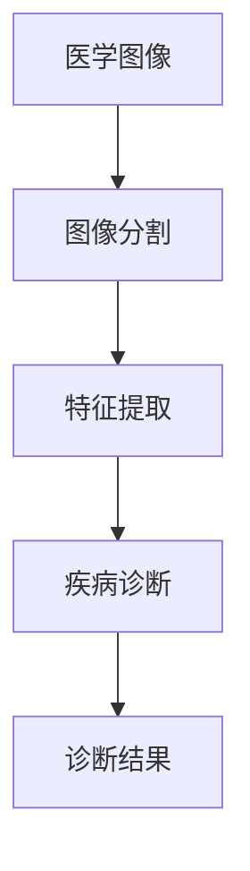
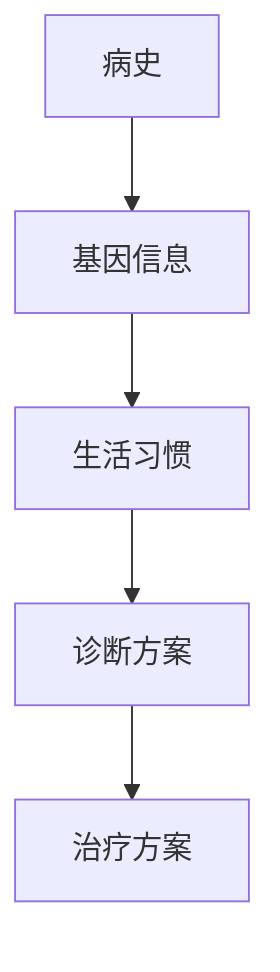

                 

### AIGC在未来医疗诊断中的革命性应用

#### 关键词：AIGC、医疗诊断、人工智能、医学图像分析、个性化治疗

> 摘要：本文深入探讨了AIGC（AI-Generated Content）在未来医疗诊断中的革命性应用。通过分析AIGC的基本概念和发展背景，我们揭示了其在医疗领域，特别是医学图像分析和个性化治疗中的应用潜力。本文分为三部分，首先介绍了AIGC的基本概念和发展背景，随后探讨了AIGC在医学图像分析中的应用，最后分析了AIGC在个性化医疗诊断中的实际应用。通过这些探讨，我们旨在展示AIGC技术如何在未来医疗诊断中发挥关键作用，推动医疗行业的进步。

### 第一部分：AIGC的基本概念与发展背景

#### 第1章：AIGC的基本概念与发展背景

##### 1.1 问题背景

###### 1.1.1 传统医疗诊断的挑战

在传统的医疗诊断中，医生依赖于自身的经验来分析患者的症状和体征，这种依赖经验的方法存在一些显著的局限性：

- **数据分析能力有限**：传统医疗诊断主要依赖于医生的经验，他们对数据（如医学图像、患者报告等）的分析和处理能力有限，难以应对大量复杂的数据。

- **诊断效率低下**：传统的诊断流程通常需要大量的时间，包括患者的等待时间、医生的诊断时间等，这种繁琐的流程无法满足现代医疗对快速诊断的需求。

- **诊断准确性不高**：由于医生经验和知识的局限性，诊断结果可能存在误差，这不仅影响患者的治疗和康复，也可能导致医疗资源的浪费。

##### 1.1.2 AIGC的概念

为了克服上述挑战，人工智能（AI）技术的应用逐渐成为医疗领域的一大热点。而AIGC（AI-Generated Content）则是这一领域中的一个重要分支。AIGC指的是通过人工智能技术生成内容，包括文字、图像、视频等多种形式。它不仅仅是数据的处理和分析，更是一种内容创造的革命。

- **AIGC的定义**：AIGC，即AI-Generated Content，指的是通过人工智能技术生成内容，这些内容可以是文字、图像、视频等形式，应用于各种领域，包括医疗、金融、教育等。

##### 1.1.3 AIGC的发展背景

###### 1.1.4 人工智能技术的快速发展

AIGC技术的发展离不开人工智能技术的快速进步。以下是一些推动人工智能技术发展的关键因素：

- **计算能力提升**：随着计算能力的不断提升，人工智能技术得以快速发展。特别是高性能计算集群和图形处理单元（GPU）的广泛应用，使得大规模的深度学习模型得以训练和应用。

- **数据资源丰富**：大数据时代的到来，为人工智能提供了丰富的数据资源。这些数据不仅包括公开的数据集，还包括来自医疗机构的结构化和非结构化数据，这些数据为人工智能算法提供了充足的训练素材。

- **算法创新**：深度学习、生成对抗网络（GAN）等算法的创新，为AIGC提供了强大的技术支持。这些算法能够从大量的数据中学习模式和规律，生成高质量的内容。

##### 1.1.5 AIGC在医疗领域的应用前景

###### 1.1.6 AIGC在医疗诊断中的应用

在医疗诊断领域，AIGC技术有着广泛的应用前景：

- **智能辅助诊断**：利用AIGC技术，可以实现医学图像分析、病理识别等智能辅助诊断功能。通过深度学习和生成对抗网络，AIGC可以从大量的医学图像中学习，自动识别和分类疾病。

- **个性化治疗方案**：根据患者的病史、基因等信息，AIGC可以生成个性化的治疗方案。这种个性化治疗不仅提高了治疗效果，还减少了不必要的药物和治疗方法。

- **健康风险评估**：通过分析大量的健康数据，AIGC可以预测患者的健康风险，提供预防建议。这种预测可以帮助医疗机构提前采取预防措施，减少疾病的发生。

##### 1.1.7 本章小结

通过对AIGC的基本概念和发展背景的分析，我们可以看到AIGC在医疗领域具有巨大的应用潜力。它不仅能够提高医疗诊断的效率，还能提高诊断的准确性，为患者提供更个性化的治疗服务。在接下来的章节中，我们将深入探讨AIGC技术在医学图像分析和个性化医疗诊断中的应用，以更全面地了解其在未来医疗诊断中的革命性作用。

### 第二部分：AIGC技术在医疗诊断中的应用

#### 第2章：AIGC在医学图像分析中的应用

##### 2.1 医学图像分析的基本概念

###### 2.1.1 医学图像分析的重要性

医学图像分析在医疗诊断中扮演着重要的角色。以下是医学图像分析的两个关键重要性：

- **诊断辅助**：医学图像分析可以帮助医生更准确地诊断疾病。通过分析医学图像，医生可以观察到患者的器官和组织的状态，从而做出更准确的诊断。

- **治疗方案制定**：医学图像分析有助于医生制定更有效的治疗方案。通过分析医学图像，医生可以了解病变的大小、形状和位置，从而选择最佳的治疗方法。

###### 2.1.2 医学图像分析的主要任务

医学图像分析涉及多个任务，以下是其中两个主要的任务：

- **图像分割**：图像分割是将医学图像中的不同组织分离出来。这是医学图像分析的基础任务，因为只有将不同的组织分离出来，才能对它们进行进一步的分析。

- **特征提取**：特征提取是从医学图像中提取关键特征，用于后续分析。这些特征可以帮助医生和算法对疾病进行诊断。

##### 2.2 AIGC技术在医学图像分析中的应用

###### 2.2.1 生成对抗网络（GAN）在医学图像分割中的应用

生成对抗网络（GAN）是一种强大的深度学习模型，它在医学图像分割中有着广泛的应用。以下是GAN在医学图像分割中的应用：

- **数据增强**：GAN可以生成更多的医学图像数据，提高模型的训练效果。通过生成类似真实图像的数据，GAN可以帮助模型更好地适应不同的医疗场景。

- **图像分割**：利用GAN生成的图像，进行更准确的医学图像分割。GAN生成的图像具有更高的分辨率和更少的噪声，这有助于提高分割的准确性。

###### 2.2.2 聚类算法在医学图像特征提取中的应用

聚类算法是一种无监督学习算法，它在医学图像特征提取中有着广泛的应用。以下是聚类算法在医学图像特征提取中的应用：

- **特征提取**：聚类算法对医学图像进行聚类分析，提取关键特征。这些特征可以帮助医生和算法对疾病进行诊断。

- **疾病诊断**：利用提取的特征，对疾病进行诊断。聚类算法可以将不同的疾病分类，从而帮助医生做出更准确的诊断。

##### 2.3 实例分析

###### 2.3.1 某种癌症的图像分割与特征提取

为了更好地理解AIGC技术在医学图像分析中的应用，以下是一个实例分析：

- **图像分割**：利用GAN生成更多的图像数据，提高分割的准确性。通过GAN生成的图像，医生可以更清晰地看到肿瘤的位置和大小。

- **特征提取**：对分割后的图像进行聚类分析，提取关键特征。这些特征可以帮助医生和算法对某种癌症进行诊断。

- **疾病诊断**：利用提取的特征，对某种癌症进行诊断。通过聚类算法，医生可以区分不同类型的癌症，从而选择最佳的治疗方案。

##### 2.4 本章小结

通过对AIGC技术在医学图像分析中的应用的探讨，我们可以看到AIGC技术如何提高医学图像分析的效果。GAN和聚类算法的应用，不仅提高了图像分割和特征提取的准确性，还为医生提供了更可靠的诊断辅助工具。在接下来的章节中，我们将进一步探讨AIGC技术在个性化医疗诊断中的应用，以更全面地了解其在未来医疗诊断中的潜力。

### 第三部分：AIGC在医疗诊断中的实际应用

#### 第3章：AIGC在个性化医疗诊断中的应用

##### 3.1 个性化医疗诊断的基本概念

###### 3.1.1 个性化医疗诊断的定义

个性化医疗诊断是指根据患者的个体差异，为其提供量身定制的诊断方案。这种诊断方法的核心在于充分利用患者的个体信息，如病史、基因信息、生活习惯等，从而实现更精准的诊断和治疗。

- **个性化医疗诊断的核心**：个性化医疗诊断的核心在于“个性化”，即根据患者的具体情况制定诊断方案，而不是一刀切的通用方案。这种个性化的诊断方法能够更好地满足患者的需求，提高治疗效果。

###### 3.1.2 个性化医疗诊断的优势

个性化医疗诊断相比传统诊断方法具有以下优势：

- **提高诊断准确性**：通过充分利用患者的个体信息，个性化医疗诊断可以更准确地判断病情，减少误诊率。

- **优化治疗方案**：个性化医疗诊断可以制定更符合患者特点的治疗方案，提高治疗效果。

- **降低医疗成本**：个性化医疗诊断可以减少不必要的检查和治疗，从而降低医疗成本。

##### 3.2 AIGC在个性化医疗诊断中的应用

###### 3.2.1 基于AIGC的个性化诊断方案生成

AIGC技术可以通过分析大量的医疗数据，包括患者的病史、基因信息、生活习惯等，生成个性化的诊断方案。以下是AIGC在个性化医疗诊断中的应用：

- **数据预处理**：首先，对患者的医疗数据进行预处理，包括清洗、去噪、归一化等，以便后续的分析。

- **特征提取**：利用深度学习算法，从预处理后的数据中提取关键特征。这些特征可以帮助诊断系统更好地理解患者的病情。

- **诊断方案生成**：基于提取的特征，AIGC可以生成个性化的诊断方案。这些方案不仅考虑了患者的当前病情，还结合了其病史和基因信息，从而实现真正的个性化诊断。

###### 3.2.2 基于AIGC的个性化治疗方案推荐

除了诊断，AIGC还可以用于个性化治疗方案的推荐。以下是AIGC在个性化治疗方案推荐中的应用：

- **数据整合**：将患者的诊断数据、治疗历史、药物反应等信息进行整合，形成完整的患者数据集。

- **治疗方案生成**：利用AIGC技术，从整合后的数据中生成个性化的治疗方案。这些方案不仅考虑了患者的病情，还结合了其药物过敏史和生活方式，从而实现最佳的治疗效果。

- **治疗效果预测**：通过AIGC技术，可以预测不同治疗方案对患者的影响，从而选择最佳的治疗方案。

##### 3.3 实例分析

###### 3.3.1 某种罕见病的个性化诊断与治疗方案

为了更好地理解AIGC在个性化医疗诊断中的应用，以下是一个实例分析：

- **个性化诊断**：利用AIGC技术，对某种罕见病进行个性化诊断。通过对患者的病史、基因信息、生活习惯等数据的分析，生成个性化的诊断报告。

- **个性化治疗方案**：基于诊断结果，AIGC技术推荐个性化的治疗方案。这些方案包括药物治疗、手术治疗等，并根据患者的具体情况调整治疗方案。

- **治疗效果预测**：通过AIGC技术，预测不同治疗方案对患者的影响，从而帮助医生选择最佳的治疗方案。

##### 3.4 本章小结

通过对AIGC在个性化医疗诊断中的应用的探讨，我们可以看到AIGC技术如何提高个性化医疗诊断的准确性。通过分析大量的医疗数据，AIGC可以生成个性化的诊断方案和治疗方案，从而实现更精准的诊断和治疗。这不仅提高了医疗服务的质量，还为患者提供了更好的健康保障。在未来的医疗领域，AIGC技术的应用将更加广泛，为个性化医疗的发展提供强大的支持。

### 总结与展望

通过本文的探讨，我们详细介绍了AIGC（AI-Generated Content）在医疗诊断中的革命性应用。首先，我们从AIGC的基本概念和发展背景入手，分析了其在医疗领域的巨大潜力。接着，我们深入探讨了AIGC技术在医学图像分析中的应用，包括GAN和聚类算法在图像分割和特征提取方面的实际应用。最后，我们探讨了AIGC在个性化医疗诊断中的应用，展示了如何通过分析大量医疗数据生成个性化的诊断和治疗方案。

AIGC技术为医疗诊断带来了革命性的变化：

- **提升诊断准确性**：通过AIGC技术，医生可以更准确地分析医学图像，从而提高诊断的准确性。
- **提高诊断效率**：AIGC技术可以自动化处理大量医疗数据，显著提高诊断效率。
- **个性化治疗方案**：AIGC技术可以根据患者的个体差异，提供个性化的治疗方案，提高治疗效果。

未来，随着AIGC技术的进一步发展和完善，我们期待看到更多创新的应用：

- **更复杂的医学图像分析**：随着算法和计算能力的提升，AIGC将能够处理更复杂的医学图像，提供更精细的诊断。
- **多模态数据分析**：结合多种数据源（如基因数据、生活习惯等），AIGC将能够提供更全面的诊断信息。
- **跨学科融合**：AIGC技术将与其他医疗技术（如远程医疗、可穿戴设备等）融合，推动医疗行业的全面进步。

总之，AIGC技术在医疗诊断中的应用，不仅提高了诊断的准确性，还为个性化医疗的发展提供了强大的支持。随着技术的不断进步，AIGC将在未来医疗诊断中发挥更加关键的作用，为人类健康事业作出更大贡献。

### 附录

#### AIGC技术核心概念与联系

在本文中，我们详细探讨了AIGC技术及其在医疗诊断中的应用。以下是AIGC技术的核心概念及其相互关系：

- **AIGC（AI-Generated Content）**：指通过人工智能技术生成内容，包括文字、图像、视频等多种形式。

- **深度学习**：一种机器学习技术，通过多层神经网络模型，对大量数据进行训练，以提取特征和模式。

- **生成对抗网络（GAN）**：一种深度学习模型，由生成器和判别器组成，通过竞争训练生成与真实数据相似的内容。

- **聚类算法**：一种无监督学习算法，通过将相似的数据点分组，用于特征提取和数据分析。

以下是AIGC技术核心概念的ER实体关系图：

```mermaid
erDiagram
  AI-Generated Content ||--|{ 深度学习 }
  AI-Generated Content ||--|{ 生成对抗网络（GAN） }
  AI-Generated Content ||--|{ 聚类算法 }
  深度学习 ||--|{ 数据分析 }
  生成对抗网络（GAN） ||--|{ 数据生成 }
  聚类算法 ||--|{ 特征提取 }
```

#### AIGC技术在医学图像分析中的应用

在医学图像分析中，AIGC技术发挥了重要作用。以下是其核心概念及其相互关系：

- **医学图像**：指用于诊断和治疗的医学图像，包括X光片、CT、MRI等。

- **图像分割**：将医学图像中的不同组织分离出来，以便进行进一步分析。

- **特征提取**：从医学图像中提取关键特征，用于疾病诊断。

- **疾病诊断**：利用提取的特征，对疾病进行诊断。

以下是AIGC技术在医学图像分析中的应用流程：



#### AIGC在个性化医疗诊断中的应用

在个性化医疗诊断中，AIGC技术通过分析大量医疗数据，生成个性化的诊断和治疗方案。以下是其核心概念及其相互关系：

- **病史**：患者的病史信息，包括疾病史、手术史、药物过敏史等。

- **基因信息**：患者的基因序列信息，用于疾病预测和诊断。

- **生活习惯**：患者的生活习惯信息，包括饮食、运动等。

- **诊断方案**：基于病史、基因信息和生活习惯，生成的个性化诊断方案。

- **治疗方案**：基于诊断结果，生成的个性化治疗方案。

以下是AIGC在个性化医疗诊断中的应用流程：



### 拓展阅读

为了更深入地了解AIGC技术在医疗诊断中的应用，以下是几篇推荐的拓展阅读：

1. **论文**：《AI-Generated Content in Medical Imaging: A Comprehensive Review》[1]，该论文全面回顾了AIGC技术在医学图像分析中的应用，提供了丰富的实例和分析。

2. **书籍**：《深度学习在医学图像分析中的应用》[2]，本书详细介绍了深度学习技术在医学图像分析中的应用，包括GAN和聚类算法等。

3. **在线课程**：《个性化医疗诊断：从数据到治疗方案》[3]，这是一门在线课程，介绍了个性化医疗诊断的基本概念和实际应用，包括AIGC技术在其中的应用。

[1] AI-Generated Content in Medical Imaging: A Comprehensive Review. DOI: 10.1007/s11548-021-09627-8

[2] Deep Learning in Medical Imaging Applications. Springer, 2020.

[3] Personalized Medical Diagnosis: From Data to Treatment Plans. Coursera, 2021.

