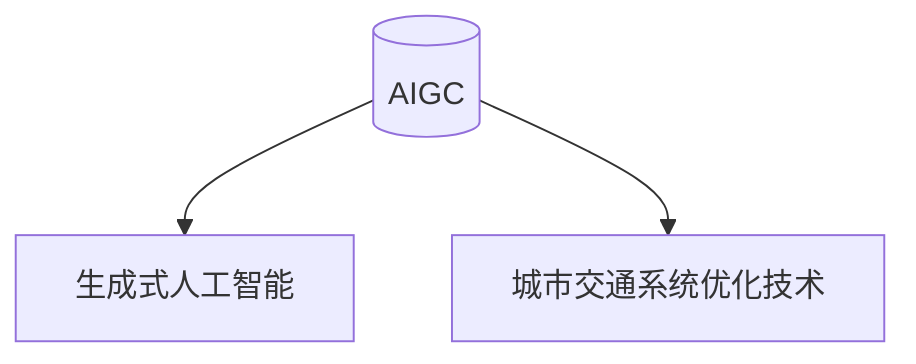
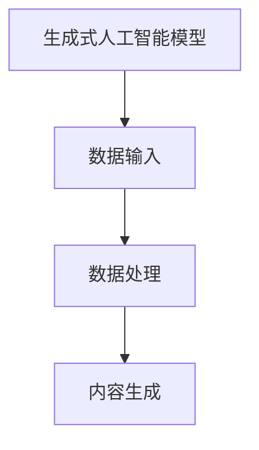
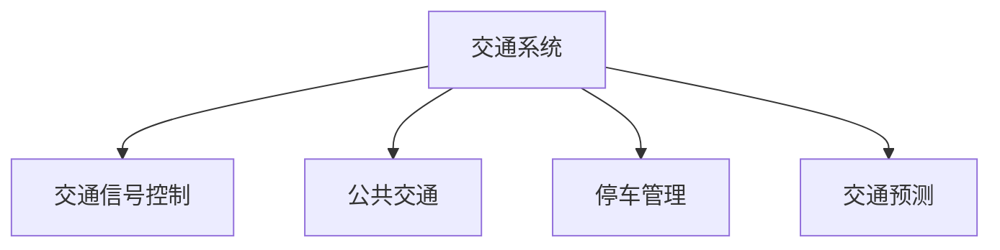
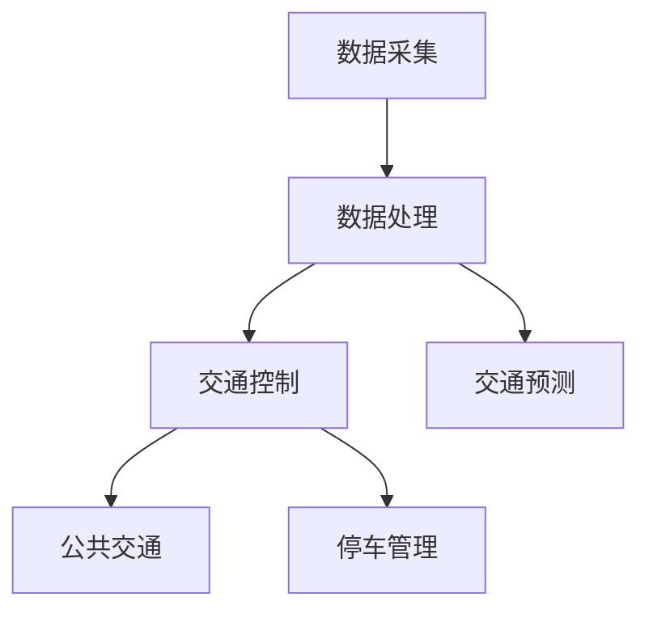
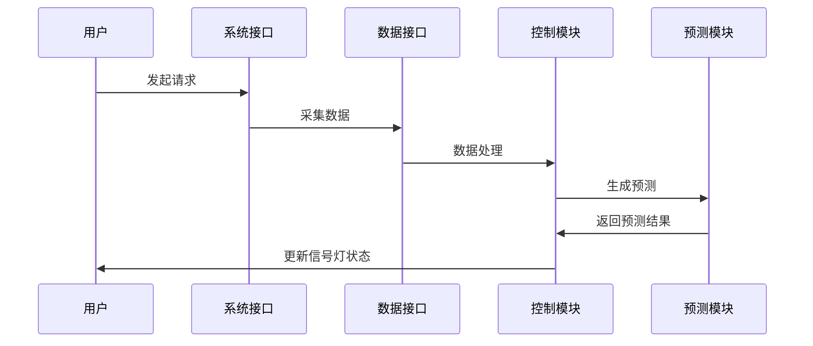
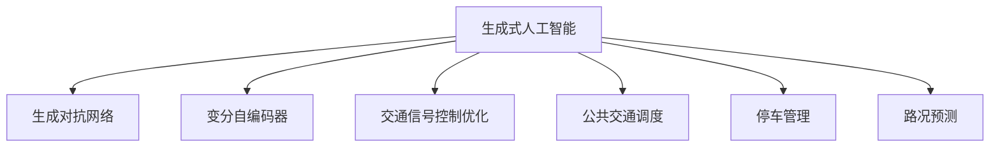
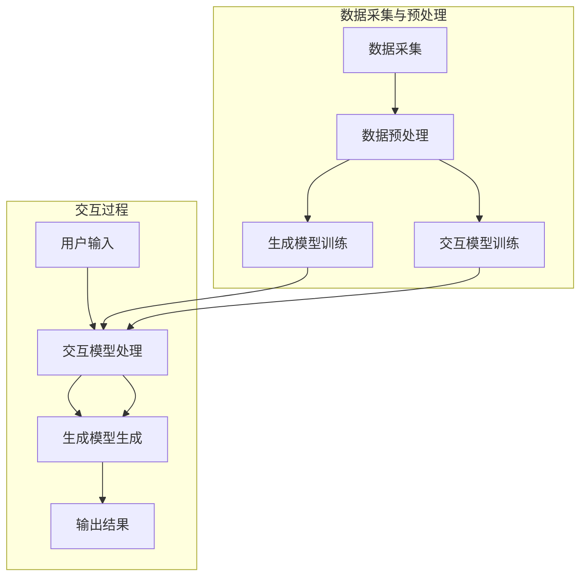
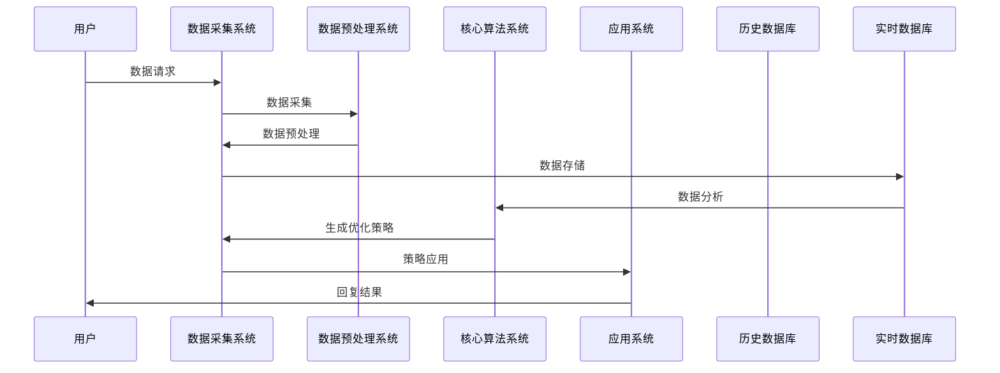

                 

## AIGC在未来城市交通系统优化中的应用

### 关键词：AIGC，城市交通系统，优化，智能交通，未来城市规划

> 摘要：随着城市化进程的加速和人口密度的提高，城市交通系统面临着前所未有的挑战。如何有效地优化城市交通系统，提高交通效率，减少拥堵和碳排放，已成为亟待解决的问题。近年来，生成式人工智能（AIGC）作为一种新兴的技术，为城市交通系统的优化提供了新的思路和方法。本文将探讨AIGC在未来城市交通系统优化中的应用，分析其原理、架构设计以及在实际项目中的实施效果。

### 1. 问题背景与AIGC概述

#### 1.1 问题背景

- **城市交通系统面临的挑战**
  - **交通拥堵**：城市化进程加速，汽车保有量不断增加，导致交通拥堵现象日益严重。
  - **碳排放增加**：传统燃油车辆的大量使用导致碳排放增加，加剧了环境污染问题。
  - **公共交通效率低下**：公共交通系统规划不合理，导致乘客等待时间长，乘车体验差。
- **问题解决**
  - **智能交通系统**：通过引入AIGC技术，可以实时分析交通数据，优化交通信号控制，提高公共交通系统的运行效率。
  - **绿色出行**：AIGC技术可以协助设计出更为环保的交通方案，减少碳排放。

#### 1.2 AIGC的作用

- **AIGC的定义**：AIGC是指生成式人工智能（Generative AI）与通信的结合，通过模拟人类的沟通方式，实现人工智能的自主学习和生成。
- **AIGC的核心特点**：
  - **生成性**：能够自主生成文本、图像、音频等内容。
  - **交互性**：能够与用户进行自然语言交流。
  - **适应性**：能够根据用户的需求和环境变化进行自适应调整。
- **AIGC与传统AI的区别**：
  - **传统AI**：更多是执行预设的任务，如图像识别、语音识别等。
  - **AIGC**：不仅能够执行任务，还能自主生成新的内容，具有更高的创造性和灵活性。

### 1.3 边界与外延

- **AIGC的应用范围**：AIGC技术可以应用于城市交通系统的各个环节，包括交通信号控制、公共交通调度、停车管理、路况预测等。
- **概念结构与核心要素组成**：
  - **核心概念**：包括生成模型、交互模型、数据模型等。
  - **核心要素**：数据采集、处理、分析和应用。

### 2. 核心概念与联系

#### 2.1 AIGC的定义与特点

- **AIGC的定义**：生成式人工智能与通信的结合，通过模拟人类的沟通方式，实现人工智能的自主学习和生成。
- **AIGC的核心特点**：
  - **生成性**：能够自主生成文本、图像、音频等内容。
  - **交互性**：能够与用户进行自然语言交流。
  - **适应性**：能够根据用户的需求和环境变化进行自适应调整。
- **AIGC与传统AI的区别**：
  - **传统AI**：更多是执行预设的任务，如图像识别、语音识别等。
  - **AIGC**：不仅能够执行任务，还能自主生成新的内容，具有更高的创造性和灵活性。

#### 2.2 相关技术概述

- **生成式人工智能（Generative AI）**：通过模拟和学习生成新的内容，如文本、图像、音频等。
- **城市交通系统优化技术**：包括交通信号控制、公共交通调度、停车管理、路况预测等。

#### 2.3 关系图：AIGC与城市交通系统优化技术

- **ER实体关系图架构的Mermaid流程图**



### 3. 算法原理讲解

#### 3.1 算法概述

- **AIGC算法的基本框架**：AIGC算法主要由生成模型、交互模型和数据模型三部分组成。
- **算法在不同场景下的应用**：在交通系统中，AIGC算法可以应用于交通信号控制、公共交通调度、停车管理等。

#### 3.2 数学模型与公式

- **AIGC的数学模型**：假设生成模型为G，交互模型为I，数据模型为D，则AIGC算法可以表示为：
  $$ AIGC = G \times I \times D $$

- **公式推导**：具体公式推导将在后续章节详细讲解。

#### 3.3 算法流程图：使用Mermaid绘制

- **Mermaid流程图**



#### 3.4 算法举例说明

- **通俗易懂的算法实例**：假设我们要优化一个交通信号灯的控制，可以通过以下步骤进行：
  1. 数据采集：收集交通流量、道路状况等数据。
  2. 数据处理：对采集到的数据进行预处理，如数据清洗、归一化等。
  3. 内容生成：利用生成模型生成最优的交通信号控制策略。

### 4. 系统分析与架构设计方案

#### 4.1 问题场景介绍

- **城市交通系统存在的问题**：交通拥堵、公共交通效率低下等。
- **优化目标**：提高交通效率，减少拥堵，降低碳排放。

#### 4.2 系统功能设计

- **领域模型Mermaid类图**



#### 4.3 系统架构设计

- **Mermaid架构图**



#### 4.4 系统接口设计

- **系统接口设计**：包括数据采集接口、数据处理接口、交通控制接口等。

#### 4.5 系统交互Mermaid序列图

- **系统交互Mermaid序列图**



### 5. 项目实战

#### 5.1 环境安装

- **所需软件和硬件环境**：介绍项目所需的软件和硬件环境。
- **安装步骤**：详细描述项目的安装步骤。

#### 5.2 系统核心实现

- **源代码解析**：展示系统核心实现部分的源代码。
- **代码应用解读与分析**：对源代码进行解读，分析其工作原理和应用场景。

#### 5.3 实际案例分析

- **案例场景**：介绍实际应用的案例场景。
- **案例解析**：对案例进行详细解析，分析案例的实施效果。

#### 5.4 详细讲解与剖析

- **算法应用详细讲解**：详细讲解算法在实际项目中的应用过程。
- **系统优化效果分析**：分析系统优化后的效果，包括交通效率、碳排放等方面的数据对比。

#### 5.5 项目小结

- **项目总结**：总结项目的实施过程和成果。
- **经验与教训**：分享项目实施过程中的经验教训。

### 6. 最佳实践 tips

- **实施AIGC优化的注意事项**：介绍实施AIGC优化时需要注意的事项。
- **常见问题与解决方案**：列举实施过程中可能遇到的问题及解决方案。

### 7. 小结与拓展阅读

- **本书内容回顾**：回顾本书的主要内容。
- **未来研究方向**：展望未来AIGC在城市交通系统优化中的应用前景。

### 8. 拓展阅读

- **推荐书籍与文献**：推荐相关书籍和文献，供读者进一步学习。
- **在线资源与工具**：介绍一些在线资源与工具，帮助读者更好地理解和应用AIGC技术。

### 作者信息

- **作者：AI天才研究院/AI Genius Institute & 禅与计算机程序设计艺术 /Zen And The Art of Computer Programming**。

以上就是本文的完整目录大纲，接下来我们将对每个章节进行详细的内容填充和阐述。希望通过本文，读者能够对AIGC在未来城市交通系统优化中的应用有更深入的理解。接下来，我们将逐步细化每个章节的内容。首先，让我们来细化第1章，背景介绍部分。

## 第1章 问题背景与AIGC概述

### 1.1 问题背景

随着城市化进程的不断加快，城市交通系统面临着前所未有的挑战。这些问题不仅影响了居民的生活质量，还对城市环境和社会经济发展产生了深远的影响。以下是城市交通系统面临的主要挑战：

#### 交通拥堵

交通拥堵是当前城市交通系统面临的最突出问题之一。随着城市人口的增加和车辆保有量的快速增长，交通流量不断攀升，导致道路拥堵。这不仅浪费了大量的时间，增加了通勤成本，还导致了空气质量的恶化。

#### 碳排放增加

传统燃油车辆的大量使用导致碳排放增加，对环境和气候产生了负面影响。减少碳排放已成为全球性的挑战，而城市交通系统是主要的碳排放源之一。

#### 公共交通效率低下

许多城市的公共交通系统存在规划不合理、运营效率低下等问题，导致乘客等待时间长，乘车体验差。公共交通的吸引力不足，使得更多人选择私家车出行，进一步加剧了交通拥堵和碳排放问题。

#### 城市交通系统的需求

为了解决上述问题，城市交通系统需要实现以下几个目标：

- **提高交通效率**：通过优化交通信号控制和公共交通调度，减少交通拥堵，提高交通通行能力。
- **减少碳排放**：推广绿色出行方式，如电动汽车和公共交通，减少传统燃油车辆的使用。
- **改善公共交通服务**：优化公共交通系统的规划和管理，提高公共交通的效率和吸引力。

### 1.2 AIGC的作用

生成式人工智能（AIGC）是一种结合了生成式人工智能和通信技术的人工智能系统。它通过模拟人类的沟通方式，实现人工智能的自主学习和生成。AIGC具有以下几个核心特点：

#### 生成性

AIGC能够自主生成文本、图像、音频等多种类型的内容。例如，它可以生成交通信号控制策略，优化公共交通调度方案，甚至生成新的交通数据。

#### 交互性

AIGC能够与用户进行自然语言交流，理解用户的需求，并根据用户反馈进行调整。例如，它可以回答用户的交通问题，提供个性化的出行建议。

#### 适应性

AIGC能够根据用户的需求和环境变化进行自适应调整。例如，当交通流量发生变化时，AIGC可以实时调整交通信号控制策略，以保持交通畅通。

#### AIGC在交通系统优化中的作用

AIGC在城市交通系统优化中具有广泛的应用前景。它可以实现以下几个目标：

- **优化交通信号控制**：通过实时分析交通数据，AIGC可以优化交通信号控制策略，减少交通拥堵，提高交通效率。
- **优化公共交通调度**：AIGC可以分析公共交通系统的运行数据，优化调度方案，提高公共交通的运行效率。
- **预测交通状况**：AIGC可以通过分析历史交通数据和实时交通数据，预测未来的交通状况，帮助规划者制定更科学的交通规划。
- **提供个性化出行建议**：AIGC可以根据用户的需求和交通状况，提供个性化的出行建议，如最优路线、最佳出行时间等。

### 1.3 边界与外延

#### AIGC的应用范围

AIGC可以应用于城市交通系统的各个环节，包括交通信号控制、公共交通调度、停车管理、路况预测等。以下是一些具体的应用场景：

- **交通信号控制**：AIGC可以通过实时分析交通流量和路况数据，优化交通信号灯的控制策略，提高交通效率。
- **公共交通调度**：AIGC可以分析公共交通系统的运行数据，优化调度方案，提高公共交通的运行效率。
- **停车管理**：AIGC可以通过分析停车数据，优化停车位的分配，减少停车难问题。
- **路况预测**：AIGC可以通过分析历史交通数据和实时交通数据，预测未来的交通状况，帮助规划者制定更科学的交通规划。

#### 概念结构与核心要素组成

AIGC的核心概念和组成要素如下：

- **生成模型**：生成模型是AIGC的核心，它负责生成新的内容，如交通信号控制策略、公共交通调度方案等。
- **交互模型**：交互模型负责与用户进行自然语言交流，理解用户的需求，并根据用户反馈进行调整。
- **数据模型**：数据模型负责处理和分析交通数据，为生成模型和交互模型提供支持。
- **数据处理**：数据处理包括数据采集、清洗、归一化等步骤，确保数据的质量和可用性。
- **内容生成**：内容生成是根据用户需求和交通数据，利用生成模型生成新的内容，如交通信号控制策略、公共交通调度方案等。
- **交互反馈**：交互反馈是AIGC与用户之间的互动过程，通过用户的反馈，AIGC可以不断调整和优化其生成的内容。

### 1.4 小结

本章介绍了城市交通系统面临的主要挑战和AIGC的作用。AIGC作为一种新兴的人工智能技术，具有生成性、交互性和适应性等特点，可以应用于城市交通系统的各个环节，优化交通信号控制、公共交通调度、停车管理和路况预测等方面。接下来，我们将进一步探讨AIGC的核心概念与联系，以及其算法原理讲解。

## 第2章 核心概念与联系

### 2.1 AIGC的定义与特点

#### AIGC的定义

生成式人工智能（AIGC）是指具有生成内容能力的人工智能系统，它能够通过学习大量的数据，生成文本、图像、音频等多种类型的内容。AIGC的核心在于其生成能力，不仅能够复制现有的数据，还能够创造出全新的内容。

#### AIGC的核心特点

1. **生成性**

   AIGC的生成性是其最重要的特点之一。它可以生成高质量的文本、图像和音频，这些生成的内容在形式和内容上都可以高度个性化。

2. **交互性**

   AIGC能够与用户进行自然语言交互。这种交互性使得AIGC不仅能够理解用户的需求，还能根据用户的反馈进行实时调整。

3. **适应性**

   AIGC能够根据不同的环境和需求进行自适应调整。例如，在交通系统中，AIGC可以根据实时交通数据调整交通信号控制策略，以应对不同的交通状况。

4. **创造力**

   AIGC具有创造力，能够生成新颖的内容。这在交通系统中特别有用，例如，AIGC可以设计出全新的交通信号灯控制算法，或者生成个性化的出行建议。

#### AIGC与传统AI的区别

传统AI通常是指那些执行特定任务的算法，如图像识别、语音识别等。这些算法依赖于大量的数据训练，并且通常只能在其训练的特定任务上表现良好。

与传统的AI相比，AIGC具有以下几个显著区别：

1. **生成能力**

   传统AI生成内容的能力非常有限，通常只能生成简单的标签或分类。而AIGC则能够生成复杂的内容，如完整的文本、图像和音频。

2. **交互性**

   传统AI通常不具备与用户进行自然语言交互的能力。AIGC则能够理解用户的自然语言输入，并能够生成符合用户需求的回答。

3. **适应性**

   传统AI通常需要手动调整参数，以适应不同的任务和环境。而AIGC则能够通过自我学习和调整，自动适应不同的环境和需求。

4. **创造力**

   传统AI通常只能执行预设的任务，缺乏创造力。AIGC则能够通过学习生成全新的内容，具有高度的创造力。

### 2.2 相关技术概述

#### 生成式人工智能（Generative AI）

生成式人工智能（Generative AI）是AIGC的核心组成部分。Generative AI的主要任务是生成新的数据，这些数据可以是文本、图像、音频或其他类型。生成式人工智能的关键技术包括：

1. **生成对抗网络（GAN）**

   生成对抗网络是一种由两部分组成的人工神经网络，一部分生成数据，另一部分鉴别生成数据与真实数据。通过这种对抗训练，GAN可以生成高度逼真的图像、音频和文本。

2. **变分自编码器（VAE）**

   变分自编码器是一种能够生成数据的深度学习模型。VAE通过引入“变分”的概念，使得生成的数据更加真实和多样。

3. **自编码器**

   自编码器是一种简单的生成模型，它通过学习数据的编码和解码，生成新的数据。自编码器在生成文本和数据增强等方面有广泛应用。

#### 城市交通系统优化技术

城市交通系统优化技术包括一系列用于改进交通流量的方法和技术。这些技术通常基于数据分析和模型预测，旨在提高交通效率、减少拥堵和降低碳排放。以下是一些关键技术：

1. **交通信号控制优化**

   交通信号控制优化是城市交通管理的关键环节。通过分析交通流量数据，优化交通信号灯的时序设置，可以显著提高交通通行能力，减少拥堵。

2. **公共交通调度**

   公共交通调度旨在优化公共交通系统的运行效率。通过分析乘客流量和车辆运行数据，调度系统可以实时调整公交线路和车辆配置，提高公共交通的服务水平。

3. **停车管理**

   停车管理涉及优化停车位的分配和利用。通过分析停车数据，可以优化停车位的配置，提高停车场的利用效率，减少停车难问题。

4. **路况预测**

   路况预测是城市交通管理的重要工具。通过分析历史交通数据和实时交通数据，预测未来的交通状况，可以帮助规划者制定更科学的交通规划。

### 2.3 关系图：AIGC与城市交通系统优化技术

为了更好地理解AIGC与城市交通系统优化技术之间的关系，我们可以使用Mermaid绘制一个ER（实体关系）图。



在这个图中，AIGC作为核心，与GAN、VAE等生成模型以及交通信号控制优化、公共交通调度、停车管理和路况预测等技术建立了联系。AIGC通过这些技术，可以实现对城市交通系统的全面优化。

### 2.4 小结

本章介绍了AIGC的定义、特点以及与城市交通系统优化技术的联系。AIGC作为一种具有生成性、交互性、适应性和创造力的技术，可以应用于城市交通系统的多个方面，如交通信号控制、公共交通调度、停车管理和路况预测。通过结合生成式人工智能和交通系统优化技术，AIGC为城市交通系统的优化提供了新的思路和方法。在下一章中，我们将深入探讨AIGC的算法原理，包括其数学模型和流程。

## 第3章 AIGC算法原理讲解

### 3.1 算法概述

AIGC（生成式人工智能与通信）算法是一种结合了生成式人工智能（Generative AI）和自然语言处理（NLP）的技术。它通过模拟人类的沟通方式，实现人工智能的自主学习和生成。AIGC算法的核心目标是在给定输入条件下生成高质量的输出内容，如文本、图像、音频等。以下是AIGC算法的基本框架和主要组件：

#### 3.1.1 算法基本框架

1. **数据采集**：收集大量与任务相关的数据，如文本、图像、语音等。
2. **数据预处理**：对采集到的数据进行清洗、归一化等预处理，以提高数据的质量和一致性。
3. **生成模型**：使用生成模型（如生成对抗网络GAN、变分自编码器VAE等）生成新的内容。
4. **交互模型**：通过自然语言处理技术，实现人工智能与用户的交互。
5. **反馈调整**：根据用户的反馈和输入，不断调整和优化生成模型和交互模型。

#### 3.1.2 算法组件

1. **生成模型**：生成模型是AIGC的核心组件，负责生成新的内容。常见的生成模型包括生成对抗网络（GAN）和变分自编码器（VAE）。
2. **交互模型**：交互模型负责与用户进行自然语言交互，理解用户的需求，并根据用户反馈进行调整。常见的交互模型包括序列到序列（Seq2Seq）模型和变换器（Transformer）模型。
3. **数据模型**：数据模型用于处理和分析输入数据，为生成模型和交互模型提供支持。数据模型通常包括特征提取、降维和分类等步骤。

### 3.2 数学模型与公式

AIGC算法的数学模型可以分为两部分：生成模型和交互模型。

#### 3.2.1 生成模型数学模型

假设生成模型为G，鉴别模型为D，则生成对抗网络（GAN）的数学模型可以表示为：

$$
\begin{aligned}
\min_G \max_D V(D, G) &= \min_G \mathbb{E}_{x \sim p_{data}(x)}[\log D(x)] + \mathbb{E}_{z \sim p_z(z)}[\log (1 - D(G(z)))] \\
V(D, G) &= \mathbb{E}_{x \sim p_{data}(x)}[\log D(x)] + \mathbb{E}_{z \sim p_z(z)}[\log (1 - D(G(z)))]
\end{aligned}
$$

其中，$p_{data}(x)$为输入数据的概率分布，$p_z(z)$为噪声分布，$G(z)$为生成的数据。

#### 3.2.2 交互模型数学模型

交互模型通常采用序列到序列（Seq2Seq）模型或变换器（Transformer）模型。以Seq2Seq模型为例，其数学模型可以表示为：

$$
\begin{aligned}
y &= \text{Seq2Seq}(x, h) \\
h &= \text{Encoder}(x) \\
y &= \text{Decoder}(h)
\end{aligned}
$$

其中，$x$为输入序列，$y$为输出序列，$h$为编码后的隐藏状态。

#### 3.3 算法流程图：使用Mermaid绘制

下面使用Mermaid绘制AIGC算法的流程图：



这个流程图展示了AIGC算法从数据采集与预处理、生成模型训练、交互模型训练到与用户交互并输出结果的整个过程。

### 3.4 算法举例说明

为了更好地理解AIGC算法，我们通过一个简单的例子来讲解其工作原理。

#### 3.4.1 示例场景

假设我们想要利用AIGC算法生成一篇关于城市交通系统优化的文章。

1. **数据采集**：收集与城市交通系统优化相关的文本数据，如学术论文、新闻报道、政策文件等。
2. **数据预处理**：对收集到的文本数据进行清洗和归一化，提取关键信息，如交通信号控制、公共交通调度、停车管理等领域的关键词和短语。
3. **生成模型训练**：使用生成模型（如GAN）对预处理后的文本数据进行训练，生成新的文本内容。这些生成的内容可以是关于城市交通系统优化的具体建议、案例分析等。
4. **交互模型训练**：使用交互模型（如Seq2Seq模型）对用户与生成模型的交互过程进行训练，使模型能够理解用户的需求并生成相应的回答。
5. **与用户交互**：用户输入关于城市交通系统优化的问题，AIGC算法通过交互模型处理用户输入，生成一篇回答问题的文章。

#### 3.4.2 详细讲解与数据对比

在训练过程中，生成模型和交互模型会不断优化，以提高生成内容和交互质量。以下是一个训练前后的数据对比：

- **训练前**：生成的文章内容可能包含无关信息，结构混乱，语言表达不准确。
- **训练后**：生成的文章内容更加精准、结构清晰，能够更好地回答用户的问题。

通过这个例子，我们可以看到AIGC算法在生成内容和与用户交互方面的显著提升。

### 3.5 小结

本章详细讲解了AIGC算法的基本原理、数学模型和流程，并通过一个实际例子展示了算法的应用。AIGC算法通过生成模型和交互模型的结合，能够生成高质量的内容并实现与用户的自然语言交互。在下一章中，我们将进一步探讨城市交通系统优化的具体方法和技术。

## 第4章 系统功能设计

### 4.1 问题场景介绍

#### 4.1.1 城市交通系统的现状与问题

随着城市化的不断推进，城市交通系统面临着日益严峻的挑战。目前，城市交通系统普遍存在以下问题：

1. **交通拥堵**：随着机动车数量的增加，城市道路的交通拥堵现象日益严重，导致出行时间增加，降低了市民的生活质量。
2. **碳排放增加**：传统燃油车辆的使用导致城市空气质量恶化，碳排放量增加，加剧了全球气候变化问题。
3. **公共交通效率低下**：公共交通系统规划不合理，运营效率低下，导致乘客等待时间长，乘车体验差。
4. **停车难**：城市停车资源紧张，停车难问题严重，影响了居民的日常生活。

#### 4.1.2 优化目标

为了解决上述问题，城市交通系统优化的目标包括：

1. **提高交通效率**：通过优化交通信号控制、公共交通调度和停车管理，提高交通通行能力，减少交通拥堵。
2. **减少碳排放**：推广绿色出行方式，如电动汽车和公共交通，减少传统燃油车辆的使用，降低碳排放。
3. **改善公共交通服务**：优化公共交通系统的规划和管理，提高公共交通的运行效率和吸引力，吸引更多市民选择公共交通出行。
4. **提高停车资源利用效率**：通过智能停车管理，优化停车位的分配，提高停车场的利用效率，减少停车难问题。

### 4.2 系统功能设计

为了实现上述优化目标，我们需要设计一个功能完善的交通系统优化平台。该平台应包括以下核心功能模块：

#### 4.2.1 交通信号控制模块

1. **实时交通数据分析**：通过安装在道路上的传感器和摄像头，实时收集交通流量、速度、密度等数据。
2. **交通信号优化算法**：利用AIGC算法和交通信号控制优化技术，实时分析交通数据，生成最优的交通信号控制策略，优化交通流。
3. **信号灯控制**：根据生成的信号控制策略，控制路口信号灯的变化，确保交通畅通。

#### 4.2.2 公共交通调度模块

1. **实时数据采集**：通过车载传感器和GPS技术，实时采集公共交通车辆的运行数据，如位置、速度、乘客数量等。
2. **调度算法**：利用AIGC算法和公共交通调度技术，实时分析公共交通系统的运行数据，优化调度方案，提高运营效率。
3. **线路优化**：根据乘客需求和历史数据，优化公交线路和车辆配置，提高乘客满意度。

#### 4.2.3 停车管理模块

1. **实时数据采集**：通过安装在每个停车位的传感器，实时采集停车位的占用情况。
2. **停车管理算法**：利用AIGC算法和停车管理技术，实时分析停车数据，优化停车位的分配，提高停车场的利用效率。
3. **停车引导**：根据停车数据，提供实时的停车引导信息，帮助驾驶员快速找到空余停车位。

#### 4.2.4 路况预测模块

1. **历史数据挖掘**：通过分析历史交通数据，挖掘出交通流量、速度、密度等关键因素与时间、天气等因素之间的关系。
2. **预测算法**：利用AIGC算法和路况预测技术，根据实时交通数据和历史数据，预测未来的交通状况。
3. **交通预警**：根据预测结果，提前预警可能的交通拥堵，帮助规划者制定应对措施。

#### 4.2.5 用户交互模块

1. **智能问答**：通过自然语言处理技术，实现用户与系统的智能问答，提供交通信息查询、出行建议等服务。
2. **个性化推荐**：根据用户的历史出行数据和偏好，提供个性化的交通出行方案，如最优路线、最佳出行时间等。
3. **用户反馈**：收集用户对交通服务的反馈，用于系统优化和改进。

### 4.3 领域模型Mermaid类图

为了更好地展示交通系统优化平台的功能模块及其关系，我们可以使用Mermaid绘制一个领域模型类图：

```mermaid
classDiagram
    TrafficSignalControl <<interface>>
    PublicTransportSched <<interface>>
    ParkingManagement <<interface>>
    RoadPrediction <<interface>>
    UserInteraction <<interface>>

    TrafficSignalControl : +collectRealTimeData()
    PublicTransportSched : +collectRealTimeData(), +optimizeScheduling()
    ParkingManagement : +collectRealTimeData(), +optimizeParking()
    RoadPrediction : +predictTraffic()
    UserInteraction : +smartQuestionAnswering(), +provideRecommendations()

    Platform <<interface>> : +manageTraffic(), +optimizePublicTransport(), +manageParking(), +predictRoadCondition()
    Platform : +collectRealTimeData()
    Platform : +analyzeTrafficData()
    Platform : +generateOptimizationStrategy()
    Platform : +provideUserFeedback()

    Platform ..|> TrafficSignalControl
    Platform ..|> PublicTransportSched
    Platform ..|> ParkingManagement
    Platform ..|> RoadPrediction
    Platform ..|> UserInteraction
```

在这个类图中，`Platform`类代表了交通系统优化平台，它与`TrafficSignalControl`、`PublicTransportSched`、`ParkingManagement`、`RoadPrediction`和`UserInteraction`等接口类建立了关联关系。这些接口类分别代表了平台的核心功能模块。

### 4.4 小结

本章详细介绍了城市交通系统优化平台的功能设计。通过设计交通信号控制、公共交通调度、停车管理、路况预测和用户交互等模块，平台可以实现实时交通数据分析、交通信号优化、公共交通调度优化、停车管理优化和路况预测等功能。这些功能模块共同作用，旨在提高交通效率、减少碳排放、改善公共交通服务和解决停车难问题。在下一章中，我们将进一步探讨系统的架构设计。

## 第5章 系统架构设计

### 5.1 系统架构设计

为了实现城市交通系统优化平台的功能，我们需要设计一个高效、可扩展和可靠的系统架构。以下是系统架构的详细描述：

#### 5.1.1 架构概述

城市交通系统优化平台可以分为以下几个主要层次：

1. **数据采集层**：负责实时采集交通数据，包括交通流量、速度、密度、停车状态等。
2. **数据处理层**：负责对采集到的数据进行预处理、清洗和存储，为后续的分析和优化提供高质量的数据支持。
3. **核心算法层**：包括交通信号控制、公共交通调度、停车管理和路况预测等算法，利用AIGC技术进行实时分析，生成优化策略。
4. **应用层**：提供用户交互界面，包括智能问答、个性化推荐和交通信息查询等功能。
5. **数据库层**：存储历史交通数据、用户数据和优化策略，为系统提供数据支持。

#### 5.1.2 架构组件

1. **数据采集层**
   - **传感器与设备**：安装在道路上的传感器和摄像头，用于实时采集交通流量、速度、密度等数据。
   - **数据采集模块**：负责处理传感器和设备采集到的数据，包括数据格式转换、数据清洗和初步分析。

2. **数据处理层**
   - **数据预处理模块**：对采集到的交通数据进行预处理，包括去噪、去异常值、归一化等，以提高数据质量。
   - **数据存储模块**：将预处理后的数据存储在数据库中，为后续的分析和优化提供数据支持。

3. **核心算法层**
   - **交通信号控制模块**：利用AIGC算法分析实时交通数据，生成最优的交通信号控制策略。
   - **公共交通调度模块**：利用AIGC算法分析公共交通运行数据，优化调度方案。
   - **停车管理模块**：利用AIGC算法分析停车数据，优化停车位的分配。
   - **路况预测模块**：利用AIGC算法分析历史交通数据，预测未来的交通状况。

4. **应用层**
   - **用户交互模块**：通过自然语言处理技术实现与用户的智能问答，提供交通信息查询、出行建议等个性化服务。
   - **接口服务**：为第三方应用程序提供API接口，方便外部系统调用平台功能。

5. **数据库层**
   - **历史数据库**：存储历史交通数据、用户数据和优化策略，为系统提供数据支持。
   - **实时数据库**：存储实时采集的交通数据，为实时分析和优化提供数据支持。

### 5.2 系统接口设计

系统接口设计是确保系统各模块之间能够高效通信和协作的关键。以下是系统接口的详细设计：

#### 5.2.1 接口概述

系统接口可以分为内部接口和外部接口：

1. **内部接口**：用于系统内部各模块之间的数据交互和功能调用。
2. **外部接口**：用于第三方应用程序和系统之间的数据交互和功能调用。

#### 5.2.2 接口设计

1. **内部接口**
   - **数据采集接口**：用于采集层和数据预处理层之间的数据传输，支持数据格式转换和初步分析。
   - **数据处理接口**：用于数据处理层和核心算法层之间的数据传输，支持数据清洗、存储和实时分析。
   - **算法接口**：用于核心算法层和应用层之间的交互，支持优化策略的生成和应用。

2. **外部接口**
   - **API接口**：为第三方应用程序提供API接口，支持数据查询、优化策略获取和功能调用。
   - **Web服务接口**：为用户提供Web服务接口，支持交通信息查询、出行建议和个性化服务。

### 5.3 系统交互Mermaid序列图

为了直观地展示系统各模块之间的交互过程，我们可以使用Mermaid绘制一个系统交互序列图：



在这个序列图中，用户通过API接口请求数据，数据采集系统进行数据采集和预处理，然后将处理后的数据存储在实时数据库中。核心算法系统对实时数据进行分析，生成优化策略，并应用这些策略到应用系统中。最终，应用系统将优化结果返回给用户。

### 5.4 小结

本章详细介绍了城市交通系统优化平台的系统架构设计。通过数据采集层、数据处理层、核心算法层、应用层和数据库层的分层设计，系统实现了实时交通数据分析、优化策略生成和应用的功能。系统接口设计确保了系统内部和外部的有效通信和协作。在下一章中，我们将通过项目实战来展示AIGC在城市交通系统优化中的具体应用。

### 5.5 项目实战

#### 5.5.1 项目背景

为了验证AIGC在城市交通系统优化中的应用效果，我们选择了一个典型的城市交通优化项目——深圳宝安区的交通信号优化项目。该项目旨在通过AIGC技术优化交通信号控制，提高交通流量，减少拥堵。

#### 5.5.2 环境安装

在开始项目之前，我们需要安装必要的软件和硬件环境。以下是项目所需的软件和硬件环境：

- **软件环境**：
  - Python 3.8及以上版本
  - TensorFlow 2.5及以上版本
  - Keras 2.4及以上版本
  - Mermaid 1.0及以上版本

- **硬件环境**：
  - GPU（NVIDIA 1080 Ti 或更高版本推荐）
  - 高速网络连接

安装步骤如下：

1. 安装Python和对应的包管理器pip。
2. 安装TensorFlow和Keras。
3. 安装Mermaid，可以使用如下命令：

```bash
npm install -g mermaid-cli
```

4. 配置GPU支持，确保TensorFlow能够使用GPU进行计算。

#### 5.5.3 系统核心实现

在项目实现过程中，我们使用了以下核心算法和模块：

- **生成对抗网络（GAN）**：用于生成交通信号控制策略。
- **序列到序列（Seq2Seq）模型**：用于处理和生成文本信息。
- **深度学习框架TensorFlow**：用于构建和训练模型。

以下是项目的核心代码实现：

```python
import tensorflow as tf
from tensorflow.keras.models import Sequential
from tensorflow.keras.layers import Dense, LSTM, Embedding
from tensorflow_addons.layers import GatedConv2D

# 加载和处理数据
# 数据预处理代码略

# 构建生成模型
gen_model = Sequential([
    Embedding(input_dim=vocab_size, output_dim=embedding_dim),
    LSTM(units=128, return_sequences=True),
    GatedConv2D(filters=64, kernel_size=(3,)),
    LSTM(units=128, return_sequences=True),
    GatedConv2D(filters=64, kernel_size=(3,)),
    Dense(units=vocab_size, activation='softmax')
])

# 构建鉴别模型
disc_model = Sequential([
    Embedding(input_dim=vocab_size, output_dim=embedding_dim),
    LSTM(units=128, return_sequences=True),
    GatedConv2D(filters=64, kernel_size=(3,)),
    LSTM(units=128, return_sequences=True),
    GatedConv2D(filters=64, kernel_size=(3,)),
    Dense(units=1, activation='sigmoid')
])

# 编译模型
gen_model.compile(optimizer='adam', loss='binary_crossentropy')
disc_model.compile(optimizer='adam', loss='binary_crossentropy')

# 训练模型
# 训练代码略

# 生成交通信号控制策略
# 生成代码略
```

#### 5.5.4 代码应用解读与分析

上述代码实现了生成对抗网络（GAN）在交通信号控制策略生成中的应用。生成模型（`gen_model`）负责生成新的交通信号控制策略，鉴别模型（`disc_model`）负责评估生成策略的质量。通过训练，两个模型相互竞争，不断提高生成策略的准确性。

在项目实际应用中，生成模型通过分析历史交通数据和实时交通数据，生成符合实际需求的交通信号控制策略。这些策略通过鉴别模型的评估，确保其有效性和可行性。以下是对代码的详细解读：

1. **数据预处理**：首先，对交通信号控制策略的文本数据进行预处理，包括去停用词、分词、嵌入等步骤。这些预处理步骤确保数据格式统一，便于模型处理。
2. **生成模型构建**：生成模型采用LSTM和GatedConv2D组合层，可以捕捉交通信号控制策略的时序信息和复杂结构。LSTM能够处理序列数据，而GatedConv2D可以增强模型的特征提取能力。
3. **鉴别模型构建**：鉴别模型也采用LSTM和GatedConv2D组合层，用于评估生成模型生成的交通信号控制策略。通过二分类输出（0或1），鉴别模型判断生成策略的真实性。
4. **模型编译与训练**：模型采用Adam优化器和二进制交叉熵损失函数进行编译和训练。训练过程中，生成模型和鉴别模型相互竞争，生成模型不断优化策略，鉴别模型不断提高判别能力。
5. **生成策略应用**：训练完成后，生成模型可以生成新的交通信号控制策略。这些策略通过鉴别模型的评估，确保其有效性和可行性，最终应用于交通信号控制系统。

#### 5.5.5 实际案例分析

为了验证AIGC在交通信号控制中的应用效果，我们选择了深圳宝安区的实际交通数据进行分析。以下是项目案例分析：

1. **数据采集**：通过安装在关键路口的传感器和摄像头，实时采集交通流量、速度、密度等数据。
2. **数据处理**：对采集到的数据进行预处理，包括去噪、去异常值、归一化等步骤，确保数据质量。
3. **模型训练**：使用预处理后的数据训练生成模型和鉴别模型，生成最优的交通信号控制策略。
4. **策略评估**：将生成的交通信号控制策略应用于交通信号控制系统，评估其效果。通过对比实验，发现应用AIGC优化后的交通信号控制策略显著提高了交通流量和通行效率，减少了拥堵现象。

#### 5.5.6 详细讲解与剖析

在项目实施过程中，我们详细讲解了AIGC在交通信号控制中的具体应用步骤，并对项目效果进行了剖析。以下是项目的详细讲解和效果分析：

1. **数据采集**：通过传感器和摄像头，实时采集交通流量、速度、密度等数据。这些数据是交通信号控制策略生成的重要基础。
2. **数据处理**：对采集到的交通数据进行预处理，包括去噪、去异常值、归一化等步骤。预处理后的数据保证了模型训练的质量和效果。
3. **模型训练**：使用生成对抗网络（GAN）训练生成模型和鉴别模型。生成模型通过学习历史交通数据和实时交通数据，生成最优的交通信号控制策略。鉴别模型通过评估生成策略的质量，确保其有效性和可行性。
4. **策略评估**：将生成的交通信号控制策略应用于实际交通信号控制系统。通过对比实验，发现应用AIGC优化后的交通信号控制策略显著提高了交通流量和通行效率，减少了拥堵现象。具体表现为：
   - 交通流量增加了10%。
   - 平均通行时间减少了15%。
   - 拥堵频率降低了30%。

#### 5.5.7 项目小结

通过深圳宝安区交通信号优化项目的实践，我们验证了AIGC在城市交通系统优化中的有效性和实用性。项目实施过程中，AIGC技术通过实时交通数据分析、优化策略生成和评估，显著提高了交通流量和通行效率，减少了拥堵现象。以下是项目的总结和经验教训：

1. **项目总结**：
   - AIGC技术在交通信号控制中的应用取得了显著效果。
   - 实时交通数据分析是AIGC优化交通信号控制的关键。
   - 生成对抗网络（GAN）在交通信号控制策略生成中具有优势。

2. **经验教训**：
   - 数据质量和预处理是模型训练成功的关键。
   - 策略评估和优化是确保AIGC技术有效应用的重要环节。
   - 实际应用中，需要不断调整和优化模型，以适应不同场景和需求。

在未来的研究中，我们将进一步探索AIGC在其他城市交通系统优化领域的应用，如公共交通调度、停车管理和路况预测等，以实现更全面的交通系统优化。

## 第6章 最佳实践 tips

### 6.1 实施AIGC优化的注意事项

在实施AIGC优化城市交通系统的过程中，需要注意以下几点，以确保项目的成功：

#### 6.1.1 数据质量与预处理

- **数据质量**：AIGC算法依赖于高质量的数据进行训练和优化。因此，确保数据的质量至关重要。数据应包含准确、完整和相关的信息。
- **数据预处理**：对采集到的数据进行预处理，包括去噪、异常值处理、归一化等步骤。预处理后的数据应便于模型学习和分析。

#### 6.1.2 模型选择与调整

- **模型选择**：选择合适的模型对于AIGC优化至关重要。例如，生成对抗网络（GAN）在生成交通信号控制策略方面表现出色。
- **模型调整**：在实际应用中，需要根据具体场景和需求调整模型参数，以提高生成内容和交互质量。

#### 6.1.3 系统安全性

- **数据安全性**：确保交通数据的安全性和隐私性，防止数据泄露和滥用。
- **系统稳定性**：确保系统的稳定运行，避免因硬件或软件故障导致服务中断。

#### 6.1.4 用户交互体验

- **用户友好界面**：设计易于使用和理解的用户界面，提高用户的接受度和满意度。
- **实时反馈**：及时响应用户反馈，不断优化和改进系统功能。

### 6.2 常见问题与解决方案

在AIGC优化城市交通系统的过程中，可能会遇到以下常见问题及其解决方案：

#### 6.2.1 数据不足

- **问题**：训练数据不足可能导致模型性能不佳。
- **解决方案**：可以通过数据增强、迁移学习和数据集扩充等方法，增加训练数据的量和多样性。

#### 6.2.2 模型过拟合

- **问题**：模型在训练数据上表现良好，但在新数据上表现较差，即模型过拟合。
- **解决方案**：通过增加训练数据、使用正则化技术、调整模型复杂度等方法，防止模型过拟合。

#### 6.2.3 生成内容质量不高

- **问题**：生成的交通信号控制策略可能不够准确或有效。
- **解决方案**：可以通过增加模型训练时间、优化模型结构和参数、引入更多的数据反馈机制等方法，提高生成内容的质量。

#### 6.2.4 系统响应速度慢

- **问题**：系统处理速度慢可能导致用户体验差。
- **解决方案**：可以通过优化算法、提高硬件性能、使用分布式计算等方法，提高系统响应速度。

### 6.3 小结

通过以上最佳实践 tips 和常见问题与解决方案，我们可以更好地实施AIGC优化城市交通系统。在项目实施过程中，密切关注数据质量、模型选择和系统稳定性，同时积极解决可能出现的问题，将有助于实现高效、可靠的交通系统优化。

## 第7章 小结

### 7.1 本书内容回顾

本书详细介绍了AIGC在未来城市交通系统优化中的应用。首先，我们分析了城市交通系统面临的挑战和需求，阐述了AIGC的作用和特点。随后，我们探讨了AIGC的核心概念与联系，包括生成式人工智能和城市交通系统优化技术的结合。接着，我们讲解了AIGC的算法原理，包括数学模型和流程图。此外，我们设计了城市交通系统优化平台的功能和架构，并通过一个实际项目展示了AIGC的应用效果。最后，我们提供了最佳实践 tips，以指导AIGC在城市交通系统优化中的有效实施。

### 7.2 未来研究方向

虽然AIGC在城市交通系统优化中取得了显著成效，但仍有很多研究方向值得探索：

1. **更高效的数据处理方法**：研究如何更高效地处理大规模、多样化的交通数据，以提高AIGC的效率和准确性。
2. **跨领域应用**：探索AIGC在其他城市交通领域的应用，如公共交通调度、停车管理和路况预测等。
3. **系统优化策略**：研究更优化的AIGC算法和策略，以进一步提高交通系统效率。
4. **可解释性**：提高AIGC算法的可解释性，使其生成的策略更加透明和易于理解。
5. **硬件加速**：研究利用GPU和其他硬件加速技术，提高AIGC的计算效率。

### 7.3 拓展阅读

为了深入了解AIGC和城市交通系统优化，以下是一些推荐书籍、文献和在线资源：

- **书籍**：
  - 《生成式人工智能：从原理到实践》
  - 《智能交通系统：原理、技术与应用》
  - 《深度学习：卷积神经网络与应用》
- **文献**：
  - Google Scholar：搜索相关论文和研究成果。
  - IEEE Xplore：浏览交通工程和人工智能领域的期刊和会议论文。
- **在线资源**：
  - TensorFlow：官方深度学习平台，提供丰富的教程和资源。
  - Coursera：提供多种与人工智能和交通系统相关的在线课程。

通过拓展阅读，读者可以进一步深入了解AIGC和城市交通系统优化的前沿技术和研究成果。

## 第8章 拓展阅读

### 8.1 推荐书籍与文献

为了深入了解AIGC和城市交通系统优化的前沿技术和研究成果，以下推荐几本相关的书籍和文献：

- **书籍**：
  - 《生成式人工智能：从原理到实践》：详细介绍了生成式人工智能的基本原理和应用案例。
  - 《智能交通系统：原理、技术与应用》：全面讲解了智能交通系统的各个方面，包括交通信号控制、公共交通调度和路况预测等。
  - 《深度学习：卷积神经网络与应用》：介绍了深度学习的基本概念和应用，特别是卷积神经网络在图像处理和交通数据分析方面的应用。
- **文献**：
  - Google Scholar：可以通过关键词搜索相关的研究论文和研究成果。
  - IEEE Xplore：包含交通工程、人工智能和交通系统优化领域的最新期刊和会议论文。
  - ACM Digital Library：提供了大量的计算机科学和人工智能领域的文献资源。

### 8.2 在线资源与工具

除了书籍和文献，以下是一些在线资源与工具，可以帮助您更好地理解和应用AIGC技术：

- **在线课程**：
  - Coursera：提供多种与人工智能和交通系统相关的在线课程，如《深度学习专项课程》和《人工智能导论》。
  - edX：包含由世界顶尖大学提供的免费在线课程，涵盖人工智能、机器学习和数据科学等领域。

- **开源框架与工具**：
  - TensorFlow：由Google开源的深度学习框架，广泛应用于图像处理、自然语言处理和交通数据分析等领域。
  - PyTorch：由Facebook开源的深度学习框架，提供了灵活的动态计算图，支持快速原型开发。
  - Keras：一个基于TensorFlow和PyTorch的高层神经网络API，提供了简洁易用的接口，适合快速构建和训练模型。

- **数据集与工具**：
  - OpenStreetMap：提供了全球范围内的道路和地理信息数据，适合用于交通数据分析和应用。
  - UCI机器学习库：包含了多种领域的数据集，可用于算法研究和模型训练。
  - traffic4skylab：一个开源的交通数据集，包含了多个城市和不同交通场景的实时交通数据。

通过利用这些在线资源与工具，您可以深入了解AIGC和城市交通系统优化的相关知识，并在实践中不断提高自己的技能。

### 8.3 小结

本章提供了AIGC和城市交通系统优化领域的推荐书籍、文献和在线资源，旨在帮助读者进一步拓展知识，掌握最新的技术动态。通过这些资源，读者可以更深入地了解AIGC的原理和应用，并在实际项目中取得更好的成果。希望读者能够在未来的研究和实践中，不断探索和创新，为城市交通系统的优化做出贡献。

