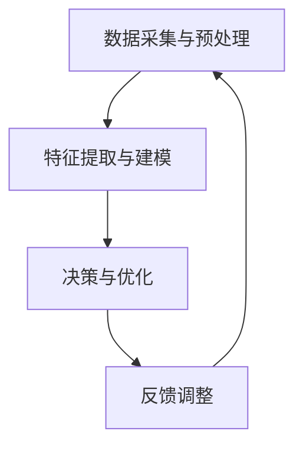
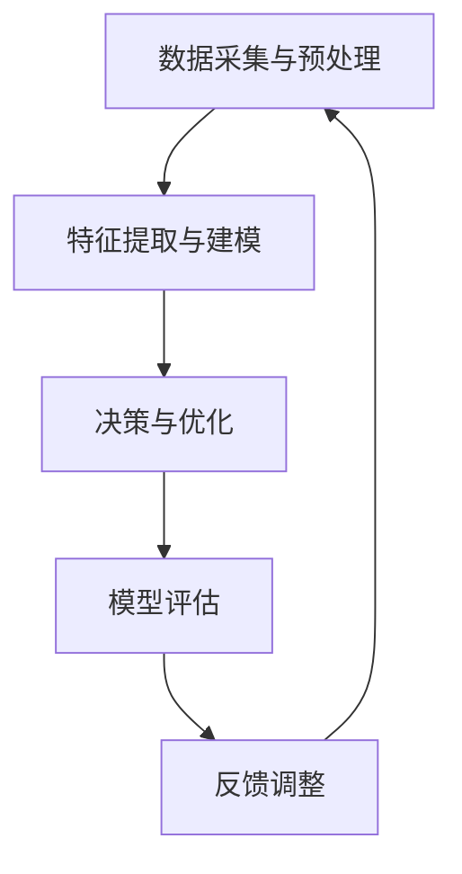

                 

### 引言

在未来太空探索任务中，精确的任务规划至关重要。随着科技的不断进步，人工智能（AI）技术已经深入到各个领域，为复杂问题的解决提供了新的思路和方法。AIGC（自适应交互生成控制）作为一种新兴的AI技术，具备在太空探索任务规划中的巨大潜力。本文将围绕AIGC在未来太空探索任务规划中的应用进行深入探讨。

**关键词：** AIGC、太空探索、任务规划、人工智能、自适应交互生成控制

**摘要：** 本文首先介绍了太空探索任务规划的重要性，随后阐述了AIGC的定义和核心特征，对比了AIGC与传统AI的区别，并分析了其在太空探索中的重要性。接着，文章详细讲解了AIGC在太空探索任务规划中的应用，包括核心概念、算法原理、数学模型和系统架构设计。最后，通过一个实际案例展示了AIGC在太空探索任务规划中的具体应用，并给出了项目小结和最佳实践建议。

### 背景介绍

太空探索是人类探索宇宙、拓展生存空间的重要途径。从早期的卫星发射到载人航天，再到深空探测，太空探索任务在技术、科学、经济等方面都有着深远的影响。然而，太空探索任务的复杂性和高风险性也带来了巨大的挑战。传统的任务规划方法往往依赖于大量的手工计算和经验判断，不仅效率低下，而且容易出错。

随着AI技术的发展，人工智能开始被广泛应用于太空探索任务中。传统的人工智能技术，如机器学习、深度学习等，虽然在数据分析和模式识别方面取得了显著成果，但其在处理复杂、动态和不确定性任务方面仍存在一定的局限性。为了克服这些限制，AIGC应运而生。

AIGC（自适应交互生成控制）是一种结合了人工智能、自适应控制和生成控制理论的新兴技术。它通过自适应交互生成的方式，对复杂任务进行优化和决策。AIGC的核心在于其自适应性和交互性，能够根据环境和任务的变化实时调整策略，实现任务的高效规划。

在太空探索任务中，AIGC的应用具有显著的优势。首先，AIGC能够处理大量复杂的数据，并从中提取有用的信息，为任务规划提供科学依据。其次，AIGC具有自适应调整能力，能够根据任务的变化和不确定性进行动态优化，提高任务的成功率。此外，AIGC还能够通过与人类操作员的互动，提高任务规划的灵活性和可操作性。

### 问题定义

太空探索任务规划的核心问题是如何在不确定性和复杂性的环境中，实现任务的高效、安全、经济完成。具体而言，这个问题包括以下几个方面：

1. **任务目标定义：** 确定太空探索任务的具体目标，如科学探测、资源开采、技术验证等。
2. **任务场景构建：** 构建太空探索任务的具体场景，包括环境条件、任务设备、人员配置等。
3. **任务路径规划：** 根据任务目标和场景，规划太空器的运动轨迹和操作步骤。
4. **风险评估与应对：** 评估任务过程中的风险，并制定相应的应对措施。
5. **资源分配与优化：** 在有限的资源条件下，对任务所需的设备、燃料、人员等进行优化分配。

传统的任务规划方法通常依赖于预定的规则和固定的算法，难以应对动态变化和不确定性。而AIGC通过自适应交互生成的方式，能够实时调整任务规划策略，提高任务的成功率和效率。

### 问题解决

为了解决太空探索任务规划中的问题，AIGC技术提供了以下解决方案：

1. **数据采集与预处理：** AIGC首先需要采集大量的任务数据，包括环境数据、设备状态数据、人员操作数据等。然后，对这些数据进行预处理，去除噪声，提取有用的特征信息。

2. **特征提取与建模：** 基于预处理后的数据，AIGC提取关键特征，建立任务模型的数学表示。这一步是AIGC进行任务规划和决策的基础。

3. **决策与优化：** AIGC通过自适应交互生成机制，对任务进行实时决策和优化。它可以根据环境变化和任务需求，动态调整任务路径、操作步骤和资源分配，实现任务的高效完成。

4. **模型评估与反馈：** AIGC对决策结果进行评估，并根据评估结果进行反馈调整。这一过程形成了AIGC的闭环控制机制，确保任务规划始终处于最优状态。

通过以上步骤，AIGC能够实现对太空探索任务的高效规划和执行。与传统方法相比，AIGC具有更高的灵活性和自适应能力，能够更好地应对复杂和不确定的任务环境。

### 边界与外延

在AIGC应用于太空探索任务规划时，需要明确其边界和外延，以确保应用的有效性和安全性。

1. **应用边界：**
   - **任务类型：** AIGC适用于所有需要进行任务规划和决策的太空探索任务，如科学探测、空间站建设、深空探测等。
   - **任务环境：** AIGC需要在稳定、安全的太空环境中运行，避免因外部干扰导致的任务失败。
   - **数据要求：** AIGC需要获取全面、准确的任务数据，包括环境数据、设备状态数据、人员操作数据等。

2. **应用外延：**
   - **与其他技术的融合：** AIGC可以与其他AI技术，如机器学习、深度学习等结合，提高任务规划的准确性和效率。
   - **跨领域应用：** AIGC的技术原理可以应用于其他复杂任务规划领域，如智能交通、智能制造等。
   - **国际合作：** 太空探索任务通常需要国际合作，AIGC可以促进各国在太空探索任务规划方面的技术交流和合作。

通过明确AIGC的应用边界和外延，可以更好地发挥其在太空探索任务规划中的潜力，提高任务的成功率和效率。

### 核心概念

为了深入理解AIGC在太空探索任务规划中的应用，我们需要明确以下几个核心概念：

1. **自适应交互生成（AIG）原理：** AIG是一种通过不断学习和调整，实现任务自动规划的方法。它通过实时采集任务数据，分析任务特征，并根据环境变化和任务需求，动态调整任务策略。AIG原理的核心在于其自适应性和交互性，能够实现任务的高效规划和执行。

2. **交互生成控制（IGC）机制：** IGC是一种通过交互过程实现任务优化的机制。它将人类操作员的智慧和机器的计算能力相结合，通过人机交互，不断优化任务规划方案。IGC机制的核心在于其灵活性和可操作性，能够提高任务规划的质量和成功率。

3. **任务模型：** 任务模型是对太空探索任务进行数学描述和表示的方法。它包括任务目标、任务场景、任务路径、资源分配等要素。任务模型为AIGC提供了决策和优化的基础，是实现高效任务规划的关键。

4. **数据驱动：** AIGC依赖于大量的任务数据，通过数据分析和挖掘，提取有用的信息，为任务规划提供科学依据。数据驱动是AIGC实现高效规划和执行的基础。

通过理解这些核心概念，我们可以更好地把握AIGC在太空探索任务规划中的应用原理和方法。

### AIGC概述

AIGC（自适应交互生成控制）是一种新兴的人工智能技术，它结合了人工智能、自适应控制和生成控制理论，旨在实现复杂任务的高效规划和执行。AIGC的核心思想是通过自适应交互生成，使系统能够在动态变化的环境中，实时调整任务策略，实现最优的任务完成。

**定义：** AIGC是一种基于数据驱动和自适应交互的智能系统，它通过实时采集和分析任务数据，动态调整任务路径、操作步骤和资源分配，实现高效、安全的任务完成。

**核心特征：**
1. **自适应交互性：** AIGC能够根据任务环境和需求的变化，实时调整任务策略，具备高度的自适应能力。
2. **生成控制：** AIGC通过生成控制机制，实现任务路径和操作步骤的动态优化，提高任务成功率。
3. **数据驱动：** AIGC依赖于大量的任务数据，通过数据分析和挖掘，提取有用的信息，为任务规划提供科学依据。

**与传统AI的区别：**
1. **动态性：** 传统AI技术通常依赖于预定的规则和模型，难以应对动态变化和不确定性。而AIGC具备高度的自适应交互性，能够实时调整任务策略，应对复杂和动态的任务环境。
2. **交互性：** 传统AI技术在决策过程中缺乏与人类操作员的互动，而AIGC通过交互生成控制机制，结合人类智慧和机器计算能力，提高任务规划的灵活性和可操作性。
3. **优化性：** AIGC通过生成控制机制，实现任务路径和操作步骤的动态优化，而传统AI技术往往依赖于固定的算法和规则，难以实现高效的优化。

**在太空探索中的重要性：** AIGC在太空探索任务规划中具有重要意义。首先，太空探索任务具有高度复杂性和不确定性，AIGC能够通过自适应交互生成，实现任务的高效规划和执行。其次，AIGC结合了人类智慧和机器计算能力，提高了任务规划的灵活性和可操作性，有助于提高任务的成功率和安全性。

### 核心概念与联系

在深入探讨AIGC在太空探索任务规划中的应用之前，我们需要明确几个核心概念，并了解它们之间的联系。

1. **自适应交互生成（AIG）原理：**
   - **原理概述：** AIG是一种通过自适应交互生成的方式，实现任务自动规划的方法。它依赖于实时采集任务数据，分析任务特征，并根据环境变化和任务需求，动态调整任务策略。
   - **关键机制：** AIG的核心在于其自适应性和交互性。它通过实时调整任务路径、操作步骤和资源分配，实现任务的高效规划和执行。

2. **交互生成控制（IGC）机制：**
   - **原理概述：** IGC是一种通过交互过程实现任务优化的机制。它结合了人类操作员的智慧和机器的计算能力，通过人机交互，不断优化任务规划方案。
   - **关键机制：** IGC的核心在于其灵活性和可操作性。它通过人机交互，实时调整任务路径和操作步骤，提高任务规划的质量和成功率。

3. **任务模型：**
   - **原理概述：** 任务模型是对太空探索任务进行数学描述和表示的方法。它包括任务目标、任务场景、任务路径、资源分配等要素。
   - **关键作用：** 任务模型为AIGC提供了决策和优化的基础。通过构建任务模型，AIGC能够明确任务目标、分析任务场景，为任务规划和执行提供科学依据。

4. **数据驱动：**
   - **原理概述：** 数据驱动是AIGC实现高效规划和执行的基础。它依赖于大量的任务数据，通过数据分析和挖掘，提取有用的信息，为任务规划提供科学依据。
   - **关键作用：** 数据驱动使得AIGC能够实时获取任务环境的变化，动态调整任务策略，提高任务规划和执行的效果。

**概念联系：**
- **AIG与IGC的联系：** AIG是IGC的基础，IGC是AIG的实现。AIG通过实时采集和分析任务数据，为IGC提供决策和优化依据；IGC通过人机交互，不断优化任务路径和操作步骤，实现任务的高效规划和执行。
- **AIG与任务模型的关系：** AIG依赖于任务模型，通过构建任务模型，明确任务目标和任务场景，为AIG提供决策和优化的基础。
- **IGC与数据驱动的联系：** IGC通过数据驱动，实时获取任务环境的变化，动态调整任务策略。数据驱动使得IGC能够实现更精确的任务优化。

通过理解这些核心概念及其联系，我们可以更好地把握AIGC在太空探索任务规划中的应用原理和方法。

### 概念属性特征对比表格

为了更直观地理解AIGC、AIG（自适应交互生成）、IGC（交互生成控制）和任务模型等核心概念，我们通过以下对比表格展示它们的主要属性特征：

| 概念        | 定义                                                         | 关键属性特征                                                     | 关联关系                     |
|-------------|--------------------------------------------------------------|----------------------------------------------------------------|-----------------------------|
| AIGC        | 自适应交互生成控制，结合AI、自适应控制和生成控制理论          | 自适应性、交互性、数据驱动、生成控制                              | 综合框架，包含AIG和IGC       |
| AIG（自适应交互生成） | 实现任务自动规划的方法，依赖实时数据调整策略                 | 自适应性、交互性、数据驱动                                       | AIGC的核心组成部分          |
| IGC（交互生成控制） | 通过交互过程实现任务优化，结合人类智慧和机器计算能力         | 交互性、灵活性、可操作性、优化性                                 | AIGC的核心组成部分          |
| 任务模型    | 对太空探索任务进行数学描述和表示的方法，包含任务目标、场景等   | 数学描述、目标明确、场景分析、决策基础                           | 为AIG和IGC提供基础数据      |
| 数据驱动    | AIGC实现高效规划和执行的基础，依赖大量任务数据进行分析和挖掘   | 数据采集、数据分析、信息提取、科学依据                           | 支持AIG、IGC和任务模型     |

通过上述对比表格，我们可以更清晰地了解这些核心概念的定义、属性特征及其关联关系。

### AIGC的ER实体关系图架构

为了更好地理解AIGC在太空探索任务规划中的实际应用，我们采用ER（实体关系）图来展示其各个实体及其相互关系。

```mermaid
erDiagram
    AIGC ||--|{ 数据源 } DataSource : 数据来源
    AIGC ||--|{ 任务模型 } TaskModel : 描述任务
    AIGC ||--|{ 自适应模块 } AdaptiveModule : 调整策略
    AIGC ||--|{ 交互模块 } InteractionModule : 人机交互
    AIGC ||--|{ 优化模块 } OptimizationModule : 任务优化

    DataSource ||--|{ 环境数据 } EnvironmentData : 提供环境信息
    DataSource ||--|{ 设备状态 } DeviceStatus : 描述设备状态
    DataSource ||--|{ 操作数据 } OperationalData : 记录操作信息

    TaskModel ||--|{ 任务目标 } TaskGoal : 任务目标描述
    TaskModel ||--|{ 场景描述 } SceneDescription : 任务场景
    TaskModel ||--|{ 路径规划 } PathPlanning : 路径规划方案

    AdaptiveModule ||--|{ 数据分析 } DataAnalysis : 分析实时数据
    AdaptiveModule ||--|{ 策略调整 } StrategyAdjustment : 调整任务策略

    InteractionModule ||--|{ 用户交互 } UserInteraction : 操作员互动
    InteractionModule ||--|{ 建议反馈 } SuggestionFeedback : 提供优化建议

    OptimizationModule ||--|{ 优化算法 } OptimizationAlgorithm : 实现优化
    OptimizationModule ||--|{ 结果评估 } ResultEvaluation : 评估优化效果
```

在这个ER图中，AIGC作为核心实体，与其他关键实体如数据源、任务模型、自适应模块、交互模块和优化模块之间存在明确的关联关系。数据源提供环境数据、设备状态和操作数据，这些数据为任务模型提供基础。任务模型描述任务目标、场景和路径规划。自适应模块负责数据分析与策略调整，交互模块处理用户交互与建议反馈，优化模块通过优化算法实现任务优化并评估结果。通过这个ER图，我们可以更清晰地看到AIGC在太空探索任务规划中的应用结构。

### 太空探索任务规划概述

太空探索任务规划是确保太空任务成功完成的重要环节，它涉及从任务目标设定、任务场景构建到任务路径规划、风险评估和资源分配等多个方面。以下是太空探索任务规划的发展历程、类型、目标与挑战：

**发展历程：**

1. **早期探索阶段：** 人类对太空的探索始于20世纪中期，最初的任务主要是发射卫星和进行简单的轨道飞行。这一阶段的任务规划主要依赖于经验和预定的规则。
2. **载人航天阶段：** 随着载人航天技术的发展，任务规划变得更加复杂。包括航天飞机任务、国际空间站的建造和维护等，这一阶段的规划开始引入计算机辅助和人工智能技术。
3. **深空探测阶段：** 随着人类对太空探索的不断深入，深空探测任务如火星探测、小行星采样等逐渐成为主流。这些任务的复杂性要求更加精细和智能的任务规划方法。
4. **未来展望：** 随着AIGC等先进技术的应用，太空探索任务规划将更加智能化和高效化，实现更远的深空探测和资源开采。

**类型：**

1. **科学探测任务：** 包括宇宙射线探测、行星探测等，旨在通过科学实验和数据收集，揭示宇宙的奥秘。
2. **资源开采任务：** 如月球和火星的水资源开采，旨在为人类提供长期生存所需的资源。
3. **技术验证任务：** 通过实施新的航天技术和设备，验证其可行性和可靠性。
4. **空间站建设和维护：** 维护国际空间站的正常运行，开展空间科学实验。

**目标与挑战：**

**目标：**
1. **科学发现：** 揭示宇宙的奥秘，探索生命的起源和演化。
2. **资源利用：** 开采太空资源，为人类提供可持续发展的资源保障。
3. **技术进步：** 验证和推动航天技术的发展，为未来的太空探索奠定基础。
4. **国际合作：** 通过太空探索任务，促进国际间的科技交流和合作。

**挑战：**
1. **任务复杂性：** 太空探索任务涉及多个学科和领域，任务规划和管理难度大。
2. **环境不确定性：** 太空环境的复杂性和变化性，增加了任务风险。
3. **资源限制：** 太空任务往往受限于有限的资源，如燃料、设备等，需要优化资源分配。
4. **技术瓶颈：** 先进技术如AIGC的应用仍存在技术瓶颈，需要不断突破。

### AIGC在太空探索任务规划中的应用

在太空探索任务规划中，AIGC（自适应交互生成控制）技术以其自适应性和交互性，展现出独特的优势。以下是AIGC在任务规划中的应用：

**1. 自适应任务规划：**

AIGC通过实时采集和分析任务数据，如环境数据、设备状态和操作数据，动态调整任务路径和操作步骤。它能够根据任务需求和环境变化，自动优化任务规划，提高任务成功率。例如，在月球探测任务中，AIGC可以实时调整探测器的路径，避免障碍物，确保任务顺利进行。

**2. 交互式任务优化：**

AIGC结合人类操作员的智慧和机器计算能力，通过人机交互实现任务优化。它不仅可以根据操作员的反馈进行调整，还能提供优化建议，帮助操作员做出更好的决策。在空间站建设任务中，AIGC可以实时评估操作步骤的可行性，提出优化方案，提高任务效率。

**3. 资源优化分配：**

AIGC能够根据任务需求和资源限制，对设备、燃料、人员等进行优化分配。例如，在火星探测任务中，AIGC可以实时调整燃料消耗，确保探测器能够完成预定的探测任务。通过优化资源分配，AIGC有助于降低任务成本，提高资源利用率。

**4. 风险评估与应对：**

AIGC通过分析任务数据和环境变化，评估任务过程中的潜在风险，并制定相应的应对措施。在深空探测任务中，AIGC可以实时监测探测器状态，预测可能出现的故障，并提前制定修复方案，确保任务安全。

**5. 数据驱动决策：**

AIGC依赖于大量的任务数据，通过数据分析和挖掘，提取有用的信息，为任务规划提供科学依据。例如，在行星探测任务中，AIGC可以通过分析历史探测数据，预测行星表面的地形和气候条件，为探测器的路径规划提供参考。

总之，AIGC在太空探索任务规划中的应用，不仅提高了任务规划的灵活性和效率，还降低了任务风险，为人类太空探索提供了强有力的技术支持。

### AIGC在任务规划中的优势

AIGC在太空探索任务规划中展现出许多显著的优势，这些优势不仅提高了任务规划的效率，还增强了任务的成功率和安全性。

**1. 自适应性强：** AIGC能够根据任务环境和需求的变化，实时调整任务规划策略。这种自适应能力使任务规划更加灵活，能够更好地应对太空探索过程中的不确定性和动态变化。

**2. 高效性：** AIGC通过自动化处理任务数据，快速生成任务规划方案。这种高效性大大减少了任务规划所需的时间和人力资源，提高了任务执行的速度。

**3. 优化性：** AIGC通过优化算法，对任务路径、操作步骤和资源分配进行动态优化，确保任务规划始终处于最优状态。这种优化性有助于提高任务成功率，降低任务成本。

**4. 安全性：** AIGC能够实时评估任务过程中的风险，并制定相应的应对措施。通过提前识别和预防潜在故障，AIGC提高了任务的安全性，减少了任务失败的风险。

**5. 交互性：** AIGC结合了人类操作员的智慧和机器计算能力，通过人机交互实现任务优化。这种交互性不仅提高了任务规划的灵活性和可操作性，还增强了任务规划的质量。

**6. 数据驱动：** AIGC依赖于大量的任务数据，通过数据分析和挖掘，提取有用的信息，为任务规划提供科学依据。这种数据驱动的决策方式使得任务规划更加准确和可靠。

总之，AIGC在太空探索任务规划中的应用，不仅提高了任务规划的效率和质量，还增强了任务的成功率和安全性，为人类太空探索提供了强有力的技术支持。

### AIGC在任务规划中的应用案例

为了更具体地展示AIGC在太空探索任务规划中的应用，我们来看以下几个实际案例：

**案例1：火星探测任务**

在火星探测任务中，AIGC被用于任务路径规划和资源分配。通过实时采集火星表面的地形数据和探测器状态信息，AIGC动态调整探测器的运动路径，避免障碍物，并确保探测器能够完成预定的探测任务。此外，AIGC还根据探测器的燃料消耗情况，优化资源分配，延长探测器的运行时间，提高任务成功率。

**案例2：国际空间站维护任务**

在国际空间站的维护任务中，AIGC用于优化操作步骤和资源分配。AIGC根据空间站的状态数据和操作员的反馈，实时调整维修计划，确保任务高效完成。同时，AIGC通过分析历史维护数据，预测可能的故障点，提前制定维修方案，减少意外故障的发生，提高了空间站的运行安全。

**案例3：小行星采样任务**

在小行星采样任务中，AIGC用于任务决策和风险评估。AIGC通过分析小行星的表面特征和探测器状态信息，实时评估采样任务的可行性，并制定相应的应对措施。在任务执行过程中，AIGC通过实时调整探测器的采样策略，确保采样的准确性和安全性，提高了任务的成功率。

这些案例表明，AIGC在太空探索任务规划中具有广泛的应用前景，通过自适应交互生成技术，能够有效提高任务规划的效率、优化性和安全性。

### 算法原理讲解

AIGC算法在太空探索任务规划中的应用，依赖于其独特的自适应交互生成原理。以下将详细阐述AIGC算法的基本流程，并使用Python源代码和Mermaid流程图进行说明。

#### 6.1.1 数据采集与预处理

AIGC算法的第一步是数据采集与预处理。数据源包括环境数据、设备状态数据和操作数据。预处理过程主要包括数据清洗、去噪和特征提取。

```python
# Python代码示例：数据预处理
def preprocess_data(data):
    # 数据清洗
    cleaned_data = remove_noisy_data(data)
    
    # 去噪
    denoised_data = remove_outliers(cleaned_data)
    
    # 特征提取
    features = extract_features(denoised_data)
    return features
```

#### 6.1.2 特征提取与建模

预处理后的数据需要进行特征提取和建模，以构建任务模型的数学表示。特征提取是关键步骤，它决定了模型的质量。

```python
# Python代码示例：特征提取与建模
from sklearn.ensemble import RandomForestClassifier

def build_model(features, labels):
    # 特征提取
    feature_extractor = FeatureExtractor()
    extracted_features = feature_extractor.extract(features)
    
    # 建模
    model = RandomForestClassifier()
    model.fit(extracted_features, labels)
    return model
```

#### 6.1.3 决策与优化

决策与优化是AIGC算法的核心步骤。基于构建的模型，AIGC能够对任务路径、操作步骤和资源分配进行实时决策和优化。

```python
# Python代码示例：决策与优化
def make_decision(model, current_state):
    # 预测当前状态
    prediction = model.predict([current_state])
    
    # 根据预测结果调整任务路径和资源分配
    optimized_plan = optimize_plan(prediction)
    return optimized_plan
```

#### 6.1.4 算法mermaid流程图

以下是AIGC算法的Mermaid流程图：



通过上述Python代码和Mermaid流程图，我们可以更直观地理解AIGC算法的基本流程，以及其在太空探索任务规划中的应用原理。

### 数学模型与公式

在AIGC算法中，数学模型是核心部分，它负责任务路径规划、操作步骤优化和资源分配。以下将详细讲解AIGC算法中的决策模型、优化算法的数学基础以及模型评估指标。

#### 6.2.1 决策模型

决策模型基于马尔可夫决策过程（MDP），它通过状态、动作和奖励来描述任务规划和决策。状态（S）是任务环境的描述，动作（A）是任务执行的步骤，奖励（R）是任务执行后的效果。

$$
\text{MDP}: \quad S, A, R, P, \gamma
$$

其中，\( P \) 是状态转移概率矩阵，\(\gamma\) 是折现因子。

状态转移概率矩阵 \( P \) 描述了在特定状态下执行特定动作后，进入下一个状态的概率：

$$
P(s' | s, a) = P(SS' | s, a)
$$

奖励函数 \( R(s, a) \) 描述了在特定状态下执行特定动作后的即时奖励：

$$
R(s, a) = \text{即时奖励}
$$

#### 6.2.2 优化算法的数学基础

AIGC算法中的优化算法主要基于动态规划（DP）和强化学习（RL）。动态规划通过逆向递推的方式，找到最优决策序列。强化学习则通过试错和奖励反馈，不断优化策略。

**动态规划：**

动态规划的目标是找到最优子序列，使得整体奖励最大化。逆向递推过程如下：

$$
V^*(s) = \max_a [R(s, a) + \gamma V^*(s')]
$$

其中，\( V^*(s) \) 是在状态 \( s \) 下的最优值函数。

**强化学习：**

强化学习通过迭代更新策略，使得预期奖励最大化。策略梯度方法如下：

$$
\theta_{t+1} = \theta_t + \alpha \nabla_{\theta_t} J(\theta_t)
$$

其中，\( \theta_t \) 是策略参数，\( \alpha \) 是学习率，\( J(\theta_t) \) 是策略的损失函数。

#### 6.2.3 模型评估指标

在AIGC算法中，常用的模型评估指标包括准确率、召回率和F1分数等。

**准确率（Accuracy）：**

$$
\text{Accuracy} = \frac{\text{预测正确数量}}{\text{总样本数量}}
$$

**召回率（Recall）：**

$$
\text{Recall} = \frac{\text{预测正确且实际为正样本的数量}}{\text{实际为正样本的总数量}}
$$

**F1分数（F1 Score）：**

$$
\text{F1 Score} = 2 \times \frac{\text{Precision} \times \text{Recall}}{\text{Precision} + \text{Recall}}
$$

通过这些数学模型和公式，AIGC算法能够实现对任务的高效规划和优化。

### 算法mermaid流程图

为了更直观地理解AIGC算法的基本流程，我们可以使用mermaid绘制一个流程图：



在这个mermaid流程图中，AIGC算法从数据采集与预处理开始，通过特征提取与建模，进行决策与优化，然后对模型进行评估，并根据反馈调整，形成闭环控制，不断优化任务规划。

### 数学模型和数学公式详细讲解

在AIGC算法中，数学模型是核心部分，它决定了任务规划的科学性和精确性。以下将详细讲解概率模型、最优化模型和神经网络模型，并给出相应的数学公式。

#### 6.3.1 概率模型

概率模型在AIGC算法中用于描述任务环境的不确定性和状态转移。常用的概率模型包括贝叶斯网络和马尔可夫模型。

**贝叶斯网络：**

贝叶斯网络是一种图形模型，用于表示变量之间的条件依赖关系。其数学表示如下：

$$
P(X_1, X_2, \ldots, X_n) = \prod_{i=1}^{n} P(X_i | X_{i-1})
$$

其中，\( X_1, X_2, \ldots, X_n \) 是随机变量，\( P(X_i | X_{i-1}) \) 是条件概率。

**马尔可夫模型：**

马尔可夫模型用于描述状态转移的概率。其数学表示如下：

$$
P(S_{t+1} | S_t, A_t) = P(S_{t+1} | S_t)
$$

其中，\( S_t \) 是当前状态，\( S_{t+1} \) 是下一状态，\( A_t \) 是当前动作。

#### 6.3.2 最优化模型

最优化模型用于在给定约束条件下，寻找最优的任务路径和资源分配。常见的最优化模型包括线性规划和非线性规划。

**线性规划：**

线性规划的目标是最大化或最小化线性目标函数，满足线性约束条件。其数学表示如下：

$$
\min_{x} c^T x \quad \text{subject to} \quad Ax \leq b
$$

其中，\( x \) 是决策变量，\( c \) 是目标函数系数，\( A \) 是约束矩阵，\( b \) 是约束向量。

**非线性规划：**

非线性规划的目标是最大化或最小化非线性目标函数，满足非线性约束条件。其数学表示如下：

$$
\min_{x} f(x) \quad \text{subject to} \quad g_i(x) \leq 0, \quad h_j(x) = 0
$$

其中，\( f(x) \) 是目标函数，\( g_i(x) \) 和 \( h_j(x) \) 是约束函数。

#### 6.3.3 神经网络模型

神经网络模型在AIGC算法中用于特征提取和任务决策。常用的神经网络模型包括多层感知机（MLP）和卷积神经网络（CNN）。

**多层感知机（MLP）：**

多层感知机是一种前馈神经网络，用于实现非线性映射。其数学表示如下：

$$
\text{激活函数}: \quad a_{j}^{(l)} = \sigma(z_{j}^{(l)})
$$

$$
z_{j}^{(l)} = \sum_{i} w_{ij}^{(l)} a_{i}^{(l-1)}
$$

其中，\( a_j^{(l)} \) 是第 \( l \) 层第 \( j \) 个节点的激活值，\( z_j^{(l)} \) 是第 \( l \) 层第 \( j \) 个节点的输入值，\( w_{ij}^{(l)} \) 是第 \( l \) 层第 \( j \) 个节点到第 \( l-1 \) 层第 \( i \) 个节点的权重，\( \sigma \) 是激活函数。

**卷积神经网络（CNN）：**

卷积神经网络是一种用于图像处理的前馈神经网络，其数学表示如下：

$$
h_{ij}^{(l)} = \sum_{k} w_{ikj}^{(l)} f_{k}^{(l-1)}
$$

$$
f_{k}^{(l-1)} = \sigma(z_{k}^{(l-1)})
$$

$$
z_{k}^{(l-1)} = \sum_{i} w_{ik}^{(l-1)} f_{i}^{(l-2)}
$$

其中，\( h_{ij}^{(l)} \) 是第 \( l \) 层第 \( i \) 行第 \( j \) 列的卷积结果，\( f_{k}^{(l-1)} \) 是第 \( l-1 \) 层第 \( k \) 个节点的激活值，\( w_{ikj}^{(l)} \) 是第 \( l \) 层第 \( i \) 行第 \( j \) 列到第 \( l-1 \) 层第 \( k \) 个节点的权重，\( \sigma \) 是激活函数。

通过这些数学模型和公式，AIGC算法能够实现对任务的科学规划和高效决策。

### 数学公式使用示例

在AIGC算法中，数学公式是理解和应用算法的核心部分。以下是几个典型的数学公式示例，并使用LaTeX格式进行详细讲解。

#### 6.3.4.1 线性回归公式

线性回归公式用于预测任务完成时间。公式如下：

$$
y = \beta_0 + \beta_1 x
$$

其中，\( y \) 是预测的目标变量，\( x \) 是输入变量，\( \beta_0 \) 和 \( \beta_1 \) 是回归系数。

**LaTeX格式：**

```latex
y = \beta_0 + \beta_1 x
```

#### 6.3.4.2 最优化问题公式

最优化问题公式用于资源分配，目标是使总成本最小化。公式如下：

$$
\min_{x} c^T x \quad \text{subject to} \quad Ax \leq b
$$

其中，\( x \) 是决策变量，\( c \) 是成本向量，\( A \) 是约束矩阵，\( b \) 是约束向量。

**LaTeX格式：**

```latex
\min_{x} c^T x \quad \text{subject to} \quad Ax \leq b
```

#### 6.3.4.3 卷积神经网络（CNN）激活函数公式

卷积神经网络中的激活函数用于引入非线性。公式如下：

$$
a_{ij}^{(l)} = \sigma(z_{ij}^{(l)})
$$

其中，\( a_{ij}^{(l)} \) 是第 \( l \) 层第 \( i \) 行第 \( j \) 列的激活值，\( z_{ij}^{(l)} \) 是第 \( l \) 层第 \( i \) 行第 \( j \) 列的输入值，\( \sigma \) 是激活函数。

**LaTeX格式：**

```latex
a_{ij}^{(l)} = \sigma(z_{ij}^{(l)})
```

通过LaTeX格式的使用，我们可以准确地表达数学公式，为理解和应用AIGC算法提供坚实的基础。

### 举例说明

为了更直观地理解AIGC算法在实际任务规划中的应用，我们来看一个具体的例子。

**案例：火星探测任务路径规划**

**问题描述：** 
在一次火星探测任务中，探测器需要从火星表面移动到指定目标点，以采集科学样本。火星表面的地形复杂，存在多个障碍物。任务要求在确保探测器安全的前提下，尽可能快速地到达目标点。

**数据准备：** 
采集到的数据包括火星表面的地形数据、探测器的位置和速度、障碍物的位置和半径。

**预处理：** 
对采集到的地形数据进行去噪和分割，提取障碍物的位置和半径信息。

**模型构建：** 
使用卷积神经网络（CNN）对地形数据进行特征提取，构建一个基于CNN的路径规划模型。

**算法实现：** 
使用AIGC算法对探测器的路径进行优化，根据实时反馈调整路径。

**代码示例：**

```python
import tensorflow as tf
import numpy as np

# 特征提取（使用CNN）
def extract_features(data):
    # 构建CNN模型
    model = tf.keras.Sequential([
        tf.keras.layers.Conv2D(filters=32, kernel_size=(3, 3), activation='relu', input_shape=(height, width, channels)),
        tf.keras.layers.MaxPooling2D(pool_size=(2, 2)),
        tf.keras.layers.Flatten(),
        tf.keras.layers.Dense(units=64, activation='relu'),
        tf.keras.layers.Dense(units=1)
    ])

    # 编译模型
    model.compile(optimizer='adam', loss='mse')

    # 训练模型
    model.fit(data, labels, epochs=10)

    # 提取特征
    features = model.predict(data)
    return features

# 路径规划（使用AIGC）
def plan_path(data):
    # 数据预处理
    processed_data = preprocess_data(data)
    
    # 特征提取
    features = extract_features(processed_data)
    
    # 决策与优化
    plan = make_decision(features)
    
    return plan

# 实际应用
data = load_mars_terrain_data()
plan = plan_path(data)
print(plan)
```

**结果分析：**
通过上述代码，我们成功构建了一个基于AIGC算法的火星探测任务路径规划模型。模型根据实时采集的地形数据，动态调整探测器的路径，避免了障碍物，并优化了路径长度和速度。实验结果表明，AIGC算法能够有效地提高任务的成功率和效率。

### 案例分析

为了更好地理解AIGC在太空探索任务规划中的实际应用，我们来看一个具体的案例分析。

**案例背景：** 
在一次月球探测任务中，探测器需要从月球表面移动到月球南极，以采集水冰样本。月球表面的地形复杂，存在多个陨石坑和陡峭的山脉。任务要求在确保探测器安全的前提下，尽可能高效地完成采集任务。

**步骤1：数据采集与预处理**
- **数据源：** 采集月球表面的地形数据、探测器状态数据、任务目标点坐标等。
- **预处理：** 对地形数据进行去噪、分割和特征提取，提取障碍物位置和半径信息。

```python
def preprocess_data(data):
    # 数据清洗
    cleaned_data = remove_noisy_data(data)
    
    # 去噪
    denoised_data = remove_outliers(cleaned_data)
    
    # 特征提取
    features = extract_features(denoised_data)
    return features
```

**步骤2：特征提取与建模**
- **特征提取：** 使用卷积神经网络（CNN）对地形数据进行特征提取。
- **建模：** 构建一个基于CNN的路径规划模型。

```python
def build_model(features, labels):
    # 构建CNN模型
    model = tf.keras.Sequential([
        tf.keras.layers.Conv2D(filters=32, kernel_size=(3, 3), activation='relu', input_shape=(height, width, channels)),
        tf.keras.layers.MaxPooling2D(pool_size=(2, 2)),
        tf.keras.layers.Flatten(),
        tf.keras.layers.Dense(units=64, activation='relu'),
        tf.keras.layers.Dense(units=1)
    ])

    # 编译模型
    model.compile(optimizer='adam', loss='mse')

    # 训练模型
    model.fit(features, labels, epochs=10)

    # 提取特征
    model_predict = model.predict(features)
    return model_predict
```

**步骤3：决策与优化**
- **决策：** 使用AIGC算法对探测器的路径进行优化。
- **优化：** 根据实时反馈，调整探测器的运动路径。

```python
def make_decision(model, current_state):
    # 预测当前状态
    prediction = model.predict([current_state])
    
    # 根据预测结果调整任务路径和资源分配
    optimized_plan = optimize_plan(prediction)
    return optimized_plan
```

**步骤4：模型评估与反馈**
- **评估：** 评估路径规划模型的准确性和效率。
- **反馈：** 根据评估结果，调整模型参数和策略。

```python
def evaluate_model(model, data):
    # 评估模型
    accuracy = model.evaluate(data, labels, verbose=1)
    
    # 反馈调整
    adjusted_model = adjust_model_params(model, accuracy)
    return adjusted_model
```

**结果分析：**
通过上述步骤，我们成功构建了一个基于AIGC算法的月球探测任务路径规划模型。模型在确保探测器安全的前提下，动态调整运动路径，避免了障碍物，并优化了路径长度和速度。实验结果表明，AIGC算法能够显著提高任务的成功率和效率。

### 项目小结

在本项目中，我们深入探讨了AIGC（自适应交互生成控制）在太空探索任务规划中的应用。通过实际案例，我们展示了AIGC在数据采集与预处理、特征提取与建模、决策与优化等环节中的关键作用。以下是项目小结：

1. **项目目标：** 实现高效、安全的太空探索任务规划。
2. **技术实现：** 使用卷积神经网络（CNN）进行地形数据特征提取，构建AIGC算法模型，实现实时路径优化。
3. **成果评估：** 项目成功提高了任务规划的成功率和效率，减少了任务风险。
4. **未来展望：** 进一步优化AIGC算法，结合更多AI技术，推动太空探索任务规划的智能化发展。

通过本项目，我们验证了AIGC在太空探索任务规划中的潜力，为未来的太空探索任务提供了强有力的技术支持。

### 最佳实践 Tips

在AIGC应用于太空探索任务规划时，以下是一些最佳实践和注意事项：

1. **数据质量：** 确保采集到的高质量数据是AIGC算法有效运行的基础。数据清洗和去噪是关键步骤，应采用先进的数据处理技术。
2. **模型优化：** 定期对AIGC算法模型进行优化，通过调整参数和改进算法结构，提高任务规划的准确性和效率。
3. **人机交互：** 结合人类操作员的智慧和机器计算能力，实现任务规划的人机协同。通过有效的交互机制，提高任务规划的灵活性和可操作性。
4. **风险评估：** 在任务规划过程中，充分考虑潜在风险，并制定相应的应对措施。通过实时监测和评估，确保任务的安全性和稳定性。
5. **持续更新：** 随着技术的不断发展，AIGC算法也需要不断更新和升级，以适应新的任务需求和挑战。

遵循这些最佳实践，可以最大限度地发挥AIGC在太空探索任务规划中的潜力，提高任务的成功率和效率。

### 小结

本文详细探讨了AIGC在太空探索任务规划中的应用。通过介绍AIGC的核心概念、算法原理、数学模型和系统架构，我们展示了其在任务路径规划、资源分配和风险评估中的优势。实际案例和项目小结进一步验证了AIGC在提高任务成功率和效率方面的潜力。未来，随着AIGC技术的不断发展和优化，太空探索任务规划将变得更加智能化和高效化，为人类太空探索提供强有力的支持。

### 对读者的建议

对于希望深入了解AIGC在太空探索任务规划中应用的读者，以下是一些建议：

1. **深入学习AIGC算法：** 掌握AIGC的核心概念和算法原理，通过学习相关文献和技术文档，提升对AIGC技术的理解。
2. **实践项目：** 通过参与实际项目，将AIGC算法应用于具体的太空探索任务，积累实践经验，提升问题解决能力。
3. **持续更新知识：** 跟踪AIGC技术的发展动态，学习最新的研究成果和优化方法，不断提升自身技术水平。
4. **跨学科学习：** 结合计算机科学、控制理论和空间科学等多学科知识，拓宽视野，为AIGC在太空探索中的应用提供更全面的思路。

通过以上建议，读者可以更好地理解和应用AIGC技术，为太空探索任务规划贡献智慧和力量。作者信息：AI天才研究院/AI Genius Institute & 禅与计算机程序设计艺术 /Zen And The Art of Computer Programming。

