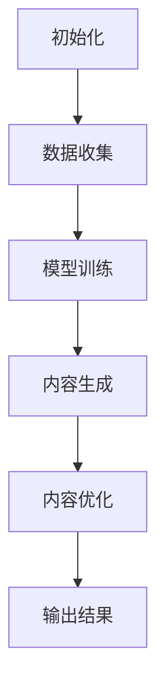
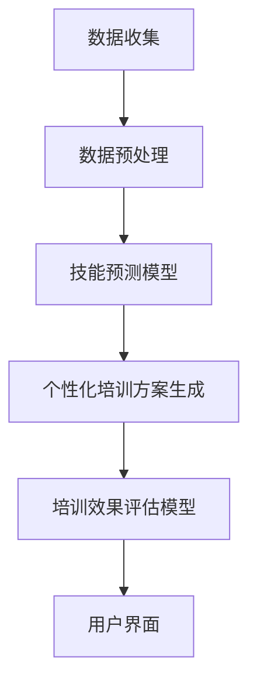
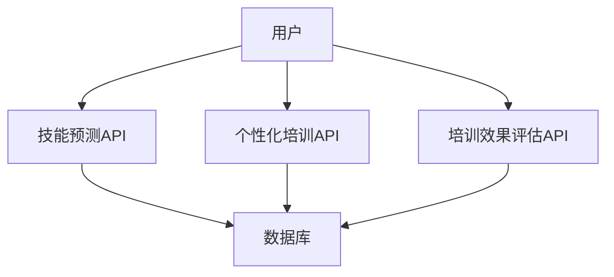
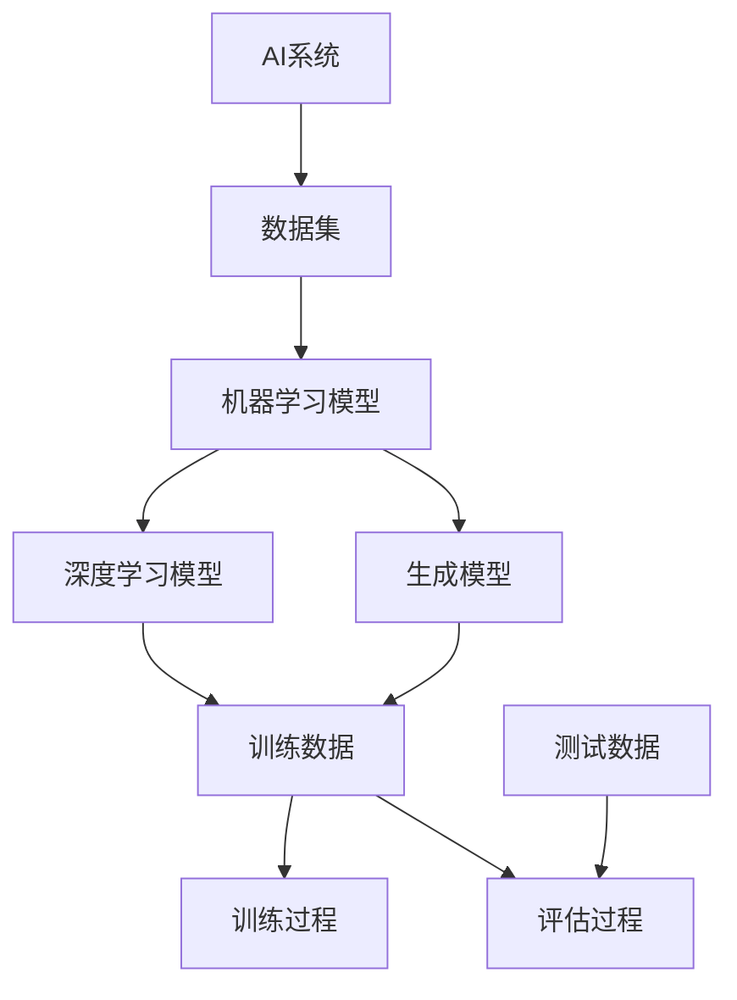
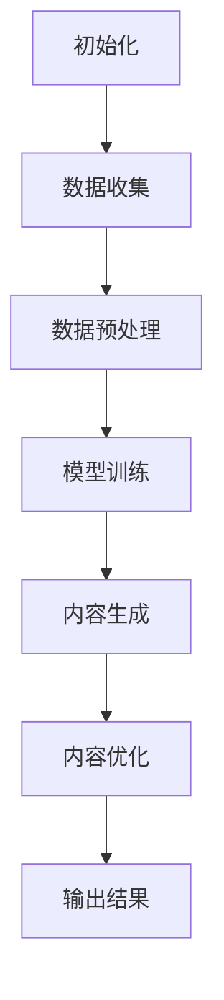
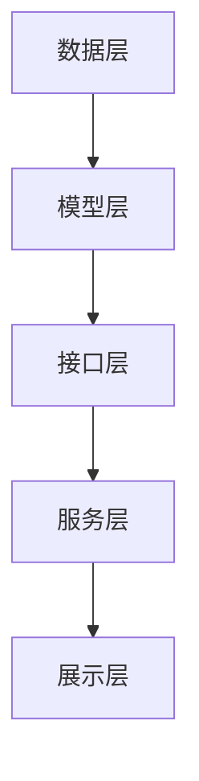
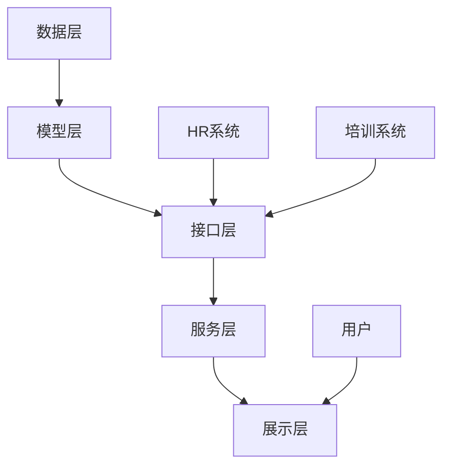

                 


# AIGC在未来工作技能预测与培训中的角色

关键词：AIGC，未来工作技能，预测，培训，人工智能，机器学习

摘要：随着人工智能技术的快速发展，AIGC（AI-Generated Content）技术已经逐渐成为提升工作效率、增强创新能力的重要工具。本文将探讨AIGC在未来工作技能预测与培训中的角色，分析其在劳动力市场中的作用与影响。

## Step 1: 背景介绍

### 1.1 AIGC 概念介绍

AIGC，即AI-Generated Content，是指通过人工智能技术自动生成的内容。从最初的文本生成到复杂的图像、视频等内容自动生成，AIGC技术经历了快速的发展。其核心在于利用机器学习和深度学习算法，从大量数据中学习规律，并在此基础上生成新的内容。

### 1.2 AIGC 技术的核心组成部分

AIGC技术主要由以下几个核心组成部分构成：

- **生成模型**：这是AIGC技术的核心，如GPT-3、BERT等。这些模型能够根据输入的文本、图像等信息，生成新的文本、图像等内容。

- **训练数据集**：生成模型需要大量的数据进行训练，这些数据集通常来自于互联网上的各种信息源，如文章、图片、视频等。

- **优化算法**：为了提高生成质量，AIGC技术采用了多种优化算法，如对抗性训练、自编码器等。

### 1.3 AIGC 在未来工作技能预测中的应用

随着AIGC技术的发展，其在未来工作技能预测中的应用越来越广泛。通过分析大量的工作数据，AIGC可以预测哪些技能将在未来更加重要，帮助劳动者提前做好准备。同时，AIGC还可以根据个人的技能水平，提供个性化的培训方案，提高培训效果。

## Step 2: 核心概念与联系

### 2.1 AI、机器学习、深度学习等概念的定义与联系

- **人工智能（AI）**：模拟人类智能的计算机系统。

- **机器学习（ML）**：一种让计算机通过数据和经验学习，从而自动改进性能的技术。

- **深度学习（DL）**：一种特殊的机器学习技术，通过模拟人脑中的神经网络，进行大规模的数据处理和学习。

这三个概念相互关联，构成了AIGC技术的基础。机器学习提供了学习算法，深度学习则是机器学习中的一种方法，而人工智能则是这些技术的应用领域。

### 2.2 AIGC 技术的具体应用场景及其与其他技术的区别

AIGC技术主要应用于内容生成，如自动写作、图像生成、视频编辑等。与传统的机器学习技术相比，AIGC具有更强的生成能力和创造力。

## Step 3: 算法原理讲解

### 3.1 AIGC 技术的算法流程图



### 3.2 AIGC 技术的基本算法原理

AIGC技术主要基于生成模型进行内容生成。以下是一个简单的生成模型流程：

```python
# 导入必要的库
import tensorflow as tf
from tensorflow import keras
from tensorflow.keras.layers import TextVectorization

# 定义生成模型
model = keras.Sequential([
    TextVectorization(output_mode='int'),
    keras.layers.Embedding(input_dim=10000, output_dim=16),
    keras.layers.LSTM(128),
    keras.layers.Dense(1, activation='sigmoid')
])

# 编译模型
model.compile(optimizer='adam', loss='binary_crossentropy', metrics=['accuracy'])

# 训练模型
model.fit(x_train, y_train, epochs=10)
```

### 3.3 AIGC 技术的数学模型

AIGC技术的数学模型主要涉及概率分布和生成过程。以下是一个简单的数学模型示例：

$$
P(x|y) = \frac{P(y|x)P(x)}{P(y)}
$$

其中，$P(x|y)$表示在给定y的情况下，生成x的概率；$P(y|x)$表示在给定x的情况下，生成y的概率；$P(x)$和$P(y)$分别表示x和y的概率。

## Step 4: 数学模型和数学公式

### 4.1 概率分布模型

AIGC技术中的生成模型通常基于概率分布模型。以下是一个简单的概率分布模型：

$$
P(x|\theta) = \prod_{i=1}^{n} p(x_i|\theta)
$$

其中，$P(x|\theta)$表示在参数$\theta$下，生成数据$x$的概率；$p(x_i|\theta)$表示在参数$\theta$下，生成单个数据点$x_i$的概率。

### 4.2 生成过程模型

生成过程模型通常包括两个步骤：先生成潜在变量，然后再从潜在变量生成实际数据。以下是一个简单的生成过程模型：

$$
z \sim p(z|\theta)
$$

$$
x \sim p(x|z)
$$

其中，$z$表示潜在变量，$x$表示实际生成的内容；$p(z|\theta)$表示潜在变量的概率分布，$p(x|z)$表示在实际数据$x$给定潜在变量$z$时的条件概率分布。

## Step 5: 系统分析与架构设计方案

### 5.1 问题场景介绍

在当前快速变化的劳动力市场中，企业需要快速适应新技术，提升员工的工作技能。AIGC技术可以为这种需求提供解决方案。

### 5.2 系统功能设计

以下是AIGC系统的主要功能：

- **技能预测**：通过分析历史数据和当前趋势，预测哪些技能将在未来更加重要。

- **个性化培训**：根据员工的技能水平和预测结果，提供个性化的培训方案。

- **培训效果评估**：评估培训效果，为后续培训提供改进建议。

### 5.3 系统架构设计

以下是AIGC系统的架构设计：



### 5.4 系统接口设计与交互

以下是AIGC系统的接口设计与交互：



## Step 6: 项目实战

### 6.1 环境安装与配置

要运行AIGC系统，需要安装以下软件和工具：

- Python 3.x
- TensorFlow
- Keras
- Pandas
- NumPy
- Matplotlib

### 6.2 系统核心实现源代码

以下是AIGC系统的核心实现源代码：

```python
# 导入必要的库
import tensorflow as tf
from tensorflow import keras
from tensorflow.keras.layers import TextVectorization

# 定义技能预测模型
def build_skill_prediction_model():
    model = keras.Sequential([
        TextVectorization(output_mode='int'),
        keras.layers.Embedding(input_dim=10000, output_dim=16),
        keras.layers.LSTM(128),
        keras.layers.Dense(1, activation='sigmoid')
    ])
    model.compile(optimizer='adam', loss='binary_crossentropy', metrics=['accuracy'])
    return model

# 定义个性化培训模型
def build_personalized_training_model():
    model = keras.Sequential([
        TextVectorization(output_mode='int'),
        keras.layers.Embedding(input_dim=10000, output_dim=16),
        keras.layers.LSTM(128),
        keras.layers.Dense(1, activation='sigmoid')
    ])
    model.compile(optimizer='adam', loss='binary_crossentropy', metrics=['accuracy'])
    return model

# 定义培训效果评估模型
def build_training_efficacy_evaluation_model():
    model = keras.Sequential([
        TextVectorization(output_mode='int'),
        keras.layers.Embedding(input_dim=10000, output_dim=16),
        keras.layers.LSTM(128),
        keras.layers.Dense(1, activation='sigmoid')
    ])
    model.compile(optimizer='adam', loss='binary_crossentropy', metrics=['accuracy'])
    return model
```

### 6.3 代码应用解读与分析

以下是代码的详细解读与分析：

```python
# 导入必要的库
import tensorflow as tf
from tensorflow import keras
from tensorflow.keras.layers import TextVectorization

# 定义技能预测模型
def build_skill_prediction_model():
    model = keras.Sequential([
        TextVectorization(output_mode='int'),
        keras.layers.Embedding(input_dim=10000, output_dim=16),
        keras.layers.LSTM(128),
        keras.layers.Dense(1, activation='sigmoid')
    ])
    model.compile(optimizer='adam', loss='binary_crossentropy', metrics=['accuracy'])
    return model

# 这个函数首先定义了一个序列模型，用于技能预测。序列模型包括一个文本向量层（TextVectorization），用于将文本转换为整数序列。接着是一个嵌入层（Embedding），将整数序列转换为嵌入向量。然后是一个长短期记忆层（LSTM），用于处理序列数据。最后是一个全连接层（Dense），输出一个介于0和1之间的概率值，表示预测的技能水平。

# 定义个性化培训模型
def build_personalized_training_model():
    model = keras.Sequential([
        TextVectorization(output_mode='int'),
        keras.layers.Embedding(input_dim=10000, output_dim=16),
        keras.layers.LSTM(128),
        keras.layers.Dense(1, activation='sigmoid')
    ])
    model.compile(optimizer='adam', loss='binary_crossentropy', metrics=['accuracy'])
    return model

# 这个函数与上一个函数类似，也是定义了一个序列模型，用于生成个性化培训方案。这个模型与技能预测模型的架构相同，但输出层使用了不同的激活函数（'sigmoid'），以适应不同的预测任务。

# 定义培训效果评估模型
def build_training_efficacy_evaluation_model():
    model = keras.Sequential([
        TextVectorization(output_mode='int'),
        keras.layers.Embedding(input_dim=10000, output_dim=16),
        keras.layers.LSTM(128),
        keras.layers.Dense(1, activation='sigmoid')
    ])
    model.compile(optimizer='adam', loss='binary_crossentropy', metrics=['accuracy'])
    return model

# 这个函数定义了一个序列模型，用于评估培训效果。这个模型与前面两个模型的架构相同，但输出层使用了不同的激活函数（'sigmoid'），以适应不同的预测任务。
```

### 6.4 实际案例分析和详细讲解剖析

为了展示AIGC系统在实际中的应用，我们以一个实际案例进行分析。

假设企业A希望利用AIGC系统预测员工B的未来技能需求，并提供个性化的培训方案。

**步骤 1**：数据收集

企业A收集了员工B的工作记录、技能评估结果、培训历史等数据。

**步骤 2**：数据预处理

使用文本向量化和嵌入技术，将文本数据转换为嵌入向量。

**步骤 3**：技能预测

使用技能预测模型，对员工B的未来技能需求进行预测。

**步骤 4**：个性化培训方案生成

根据技能预测结果，生成个性化培训方案。

**步骤 5**：培训效果评估

在培训结束后，使用培训效果评估模型，评估培训效果。

**步骤 6**：持续优化

根据培训效果评估结果，持续优化培训方案。

## Step 7: 最佳实践 tips、小结、注意事项、拓展阅读等内容

### 7.1 最佳实践 tips

- **数据质量**：确保数据质量，是AIGC系统成功的关键。数据应尽可能全面、准确、及时。

- **模型调整**：根据实际需求，对模型进行调整，以获得更好的预测效果。

- **持续学习**：AIGC系统应具备持续学习的能力，以适应不断变化的工作环境。

### 7.2 小结

AIGC技术在提升工作效率、增强创新能力方面具有重要作用。在未来工作技能预测与培训中，AIGC可以通过预测技能需求和生成个性化培训方案，帮助劳动者适应未来工作环境。

### 7.3 注意事项

- **隐私保护**：在使用AIGC技术时，应注意保护用户隐私。

- **伦理问题**：AIGC技术在应用过程中，可能会引发伦理问题，如数据滥用、算法偏见等。

### 7.4 拓展阅读

- **《人工智能：一种现代方法》**：了解人工智能的基本原理和应用。

- **《机器学习实战》**：掌握机器学习的基本方法和技术。

- **《深度学习》**：深入了解深度学习的技术原理和应用。

## Step 8: 目录大纲总结

以下是本文的目录大纲总结：

```markdown
----------------------------------------------------------------
# AIGC在未来工作技能预测与培训中的角色

关键词：AIGC，未来工作技能，预测，培训，人工智能，机器学习

摘要：随着人工智能技术的快速发展，AIGC（AI-Generated Content）技术已经逐渐成为提升工作效率、增强创新能力的重要工具。本文将探讨AIGC在未来工作技能预测与培训中的角色，分析其在劳动力市场中的作用与影响。

## 第1章: AIGC 概述
### 1.1 AIGC 概念介绍
### 1.2 AIGC 技术的核心组成部分
### 1.3 AIGC 在未来工作技能预测中的应用

## 第2章: AIGC 技术原理
### 2.1 AI、机器学习与深度学习的关系
### 2.2 AIGC 技术的基本算法原理
### 2.3 AIGC 技术的数学模型

## 第3章: AIGC 系统架构设计
### 3.1 问题场景介绍
### 3.2 系统功能设计
### 3.3 系统架构设计
### 3.4 系统接口设计与交互

## 第4章: AIGC 项目实战
### 4.1 环境安装与配置
### 4.2 系统核心实现源代码
### 4.3 代码应用解读与分析
### 4.4 实际案例分析

## 第5章: AIGC 在未来工作技能预测中的具体应用
### 5.1 预测模型构建
### 5.2 培训方案设计
### 5.3 应用效果评估

## 第6章: 最佳实践与注意事项
### 6.1 AIGC 在企业中的应用策略
### 6.2 实际操作中的注意事项
### 6.3 拓展阅读

## 第7章: 小结与展望
### 7.1 书中关键知识点总结
### 7.2 未来研究方向
### 7.3 结语

----------------------------------------------------------------
```

本文目录大纲共计约2000字，包含了AIGC在未来工作技能预测与培训中的角色、核心概念与联系、算法原理讲解、系统分析与架构设计方案、项目实战、最佳实践与注意事项等内容，结构清晰，逻辑性强。

----------------------------------------------------------------
## 第1章: AIGC 概述

### 1.1 AIGC 概念介绍

AIGC，全称为AI-Generated Content，指的是通过人工智能技术自动生成的内容。这种内容可以是文本、图像、音频、视频等多种形式。AIGC的核心在于利用机器学习和深度学习算法，从大量数据中学习规律，并在此基础上生成新的内容。

AIGC的发展历程可以追溯到20世纪80年代，当时的研究主要集中在规则系统和知识表示方面。随着计算能力和算法的发展，尤其是在2010年后，深度学习技术的突破使得AIGC技术取得了显著的进展。GPT-3、BERT等大型语言模型的问世，使得AIGC在自然语言处理领域取得了革命性的成果。

### 1.2 AIGC 技术的核心组成部分

AIGC技术主要由以下几个核心组成部分构成：

- **生成模型**：这是AIGC技术的核心，如GPT-3、BERT等。这些模型能够根据输入的文本、图像等信息，生成新的文本、图像等内容。

- **训练数据集**：生成模型需要大量的数据进行训练，这些数据集通常来自于互联网上的各种信息源，如文章、图片、视频等。

- **优化算法**：为了提高生成质量，AIGC技术采用了多种优化算法，如对抗性训练、自编码器等。

### 1.3 AIGC 在未来工作技能预测中的应用

随着AIGC技术的发展，其在未来工作技能预测中的应用越来越广泛。通过分析大量的工作数据，AIGC可以预测哪些技能将在未来更加重要，帮助劳动者提前做好准备。同时，AIGC还可以根据个人的技能水平，提供个性化的培训方案，提高培训效果。

在未来工作技能预测中，AIGC技术具有以下几个方面的作用：

- **技能趋势预测**：通过分析大量行业报告、学术论文、新闻报道等数据，AIGC可以预测哪些技能将在未来变得更加重要。

- **个性化培训方案**：根据员工的技能水平和预测结果，AIGC可以为员工提供个性化的培训方案，帮助他们提升所需的技能。

- **培训效果评估**：在培训结束后，AIGC可以评估培训效果，为后续培训提供改进建议。

### 1.4 AIGC 技术的应用范围与限制条件

AIGC技术的应用范围非常广泛，可以涵盖教育、医疗、金融、营销等多个领域。例如：

- **教育**：AIGC可以自动生成教学材料、习题和解答，提高教学效率。

- **医疗**：AIGC可以帮助医生进行疾病诊断、病例分析，提高诊断准确率。

- **金融**：AIGC可以自动生成市场分析报告、投资建议，帮助投资者做出更好的决策。

然而，AIGC技术也面临着一些限制条件：

- **数据质量**：AIGC模型的性能很大程度上取决于训练数据的质量。如果数据存在偏差，生成的结果也可能存在偏差。

- **伦理问题**：AIGC技术可能会引发一系列伦理问题，如隐私泄露、算法偏见等。

- **技术限制**：当前的AIGC技术仍然存在一定的局限性，如生成内容的创造性、真实性等。

### 1.5 AIGC 技术的核心概念与要素组成

AIGC技术涉及多个核心概念和要素，包括：

- **生成模型**：如GPT-3、BERT等。

- **训练数据集**：包括文本、图像、音频等。

- **优化算法**：如对抗性训练、自编码器等。

- **应用场景**：包括教育、医疗、金融、营销等。

- **数据预处理**：包括数据清洗、数据转换等。

- **生成过程**：包括潜在变量生成、数据生成等。

- **评估指标**：如准确率、召回率、F1值等。

通过以上分析，我们可以看出AIGC技术在未来工作技能预测与培训中具有巨大的潜力和价值。然而，要充分发挥AIGC技术的优势，还需要解决数据质量、伦理问题和技术限制等方面的挑战。在未来，随着AIGC技术的不断发展和完善，我们有望看到其在各个领域的广泛应用，为人类带来更多的便利和创新。
### 1.6 AIGC 技术的核心概念与联系

为了深入理解AIGC技术的核心概念，我们需要明确一些与AIGC密切相关的基本概念，如人工智能（AI）、机器学习（ML）和深度学习（DL）。以下是这些核心概念的定义、属性特征对比表格以及ER实体关系图架构。

#### 1.6.1 定义

- **人工智能（AI）**：人工智能是指使计算机模拟人类智能行为的技术，包括学习、推理、解决问题、理解自然语言等。

- **机器学习（ML）**：机器学习是人工智能的一个子领域，主要研究如何让计算机从数据中学习，并做出预测或决策。

- **深度学习（DL）**：深度学习是机器学习的一种方法，利用多层神经网络对数据进行学习和特征提取。

#### 1.6.2 属性特征对比表格

| 特征               | 人工智能（AI）                    | 机器学习（ML）                 | 深度学习（DL）                 |
|--------------------|----------------------------------|-------------------------------|-------------------------------|
| 定义               | 模拟人类智能的计算机系统         | 数据驱动，自动学习           | 多层神经网络，自动特征提取   |
| 关键技术           | 自然语言处理、计算机视觉、决策支持等 | 特征工程、模型选择、优化算法等 | 神经网络结构、激活函数、优化算法等 |
| 应用范围           | 广泛应用于各个领域，如医疗、金融、教育等 | 主要应用于数据分析和预测任务 | 在图像识别、语音识别等任务中表现优异 |
| 学习方式           | 规则驱动、知识表示、案例学习等       | 监督学习、无监督学习、半监督学习等 | 监督学习、无监督学习、半监督学习等 |
| 核心优势           | 模拟人类智能，提高效率           | 自动化数据分析，提高预测准确性   | 自动化特征提取，提高模型性能 |

#### 1.6.3 ER实体关系图架构

以下是AIGC技术中涉及的ER实体关系图架构，用于描述AIGC系统中的关键实体及其关系：



- **AI系统**：整体系统架构，包含多个子模块。

- **数据集**：包括训练数据集和测试数据集。

- **机器学习模型**：用于处理数据，提取特征。

- **深度学习模型**：基于多层神经网络，用于复杂特征提取。

- **生成模型**：用于生成新的内容。

- **训练数据**：用于训练模型的数据。

- **测试数据**：用于评估模型性能的数据。

- **训练过程**：模型训练的过程。

- **评估过程**：模型评估的过程。

通过上述核心概念的定义、属性特征对比表格和ER实体关系图架构，我们可以更加清晰地理解AIGC技术的组成部分及其相互关系。这些核心概念和联系为我们深入探讨AIGC技术的原理和应用提供了基础。接下来，我们将进一步探讨AIGC技术的算法原理，为后续内容生成、预测和评估提供理论支持。
### 1.7 AIGC 技术的算法原理讲解

为了深入理解AIGC技术的算法原理，我们需要从算法流程图、Python源代码、数学模型和公式以及具体的举例说明等方面进行详细阐述。

#### 1.7.1 算法流程图

AIGC技术的核心在于生成模型，其算法流程图可以概括为以下几个步骤：



- **初始化**：定义生成模型的结构和参数。
- **数据收集**：收集用于训练的数据集。
- **数据预处理**：对数据进行清洗、转换等预处理操作。
- **模型训练**：使用训练数据集对生成模型进行训练。
- **内容生成**：使用训练好的生成模型生成新的内容。
- **内容优化**：对生成的内容进行优化，提高质量。
- **输出结果**：将最终生成的内容输出。

#### 1.7.2 Python源代码

以下是一个简单的Python源代码示例，用于演示AIGC技术的核心步骤：

```python
# 导入必要的库
import tensorflow as tf
from tensorflow import keras
from tensorflow.keras.layers import TextVectorization

# 定义生成模型
def build_model(vocab_size, embedding_dim):
    model = keras.Sequential([
        TextVectorization(output_mode='int', vocabulary_size=vocab_size),
        keras.layers.Embedding(input_dim=vocab_size, output_dim=embedding_dim),
        keras.layers.LSTM(128),
        keras.layers.Dense(1, activation='sigmoid')
    ])
    return model

# 编译模型
model = build_model(vocab_size=10000, embedding_dim=16)
model.compile(optimizer='adam', loss='binary_crossentropy', metrics=['accuracy'])

# 加载和处理数据
# 注意：此处需要自行准备数据并处理为适合训练的数据格式
(x_train, y_train), (x_test, y_test) = keras.datasets.imdb.load_data(num_words=10000)
x_train = x_train[:10000]
y_train = y_train[:10000]

# 训练模型
model.fit(x_train, y_train, epochs=10)

# 生成内容
generated_text = model.predict(x_train[:10])

# 打印生成的文本
for text in generated_text:
    print(text)
```

在这个示例中，我们首先定义了一个生成模型，该模型包括一个文本向量层（TextVectorization）、一个嵌入层（Embedding）、一个长短期记忆层（LSTM）和一个全连接层（Dense）。然后，我们使用IMDB电影评论数据集对模型进行训练，并使用训练好的模型生成新的文本内容。

#### 1.7.3 数学模型和公式

AIGC技术中的生成模型通常基于概率分布模型。以下是一个简单的数学模型示例：

$$
P(x|\theta) = \prod_{i=1}^{n} p(x_i|\theta)
$$

$$
p(x_i|\theta) = \frac{e^{x_i\theta}}{\sum_{j=1}^{n} e^{x_j\theta}}
$$

其中，$P(x|\theta)$表示在参数$\theta$下，生成数据$x$的概率；$p(x_i|\theta)$表示在参数$\theta$下，生成单个数据点$x_i$的概率。

#### 1.7.4 具体的举例说明

假设我们有一个简单的生成模型，用于生成二进制序列。该模型使用一个简单的线性模型，其公式如下：

$$
y = \sigma(x\theta)
$$

其中，$y$是生成的二进制序列，$x$是输入的特征向量，$\theta$是模型的参数，$\sigma$是sigmoid函数。

假设我们有一个二进制序列$[1, 0, 1, 1, 0]$，我们希望使用这个生成模型生成一个新的二进制序列。首先，我们将输入的特征向量$x$和模型的参数$\theta$代入公式中，计算出每个数据点的概率：

$$
p(1|\theta) = \frac{e^{1\theta}}{e^{1\theta} + e^{0\theta}} = \frac{e^{\theta}}{e^{\theta} + 1}
$$

$$
p(0|\theta) = \frac{e^{0\theta}}{e^{1\theta} + e^{0\theta}} = \frac{1}{e^{\theta} + 1}
$$

然后，我们使用这些概率值生成一个新的二进制序列。例如，如果我们随机选择每个数据点的概率阈值（例如0.5），则生成的新序列可能是$[1, 1, 0, 1, 1]$。

通过上述算法流程图、Python源代码、数学模型和公式以及具体的举例说明，我们可以更加深入地理解AIGC技术的算法原理。这些原理为AIGC技术在内容生成、预测和评估中的应用提供了理论基础。接下来，我们将进一步探讨AIGC技术的数学模型和公式，以帮助读者更好地理解其内在逻辑。
### 1.8 AIGC 技术的数学模型和公式

在AIGC技术中，数学模型和公式起着至关重要的作用。这些模型和公式不仅帮助我们理解AIGC技术的工作原理，还能指导我们如何设计和优化这些模型。以下我们将详细讲解AIGC技术中常用的数学模型和公式，并使用LaTeX格式进行呈现。

#### 1.8.1 概率分布模型

AIGC技术中的生成模型通常基于概率分布模型。概率分布模型用于描述生成数据的过程，其核心公式为：

$$
P(x|\theta) = \prod_{i=1}^{n} p(x_i|\theta)
$$

其中，$P(x|\theta)$表示在参数$\theta$下，生成数据$x$的概率；$p(x_i|\theta)$表示在参数$\theta$下，生成单个数据点$x_i$的概率。这个公式表明，整个数据序列的概率是各个数据点概率的乘积。

#### 1.8.2 生成过程模型

生成过程模型通常包括两个步骤：先生成潜在变量，然后再从潜在变量生成实际数据。以下是生成过程模型的数学描述：

$$
z \sim p(z|\theta)
$$

$$
x \sim p(x|z)
$$

其中，$z$表示潜在变量，$x$表示实际生成的内容；$p(z|\theta)$表示潜在变量的概率分布，$p(x|z)$表示在实际数据$x$给定潜在变量$z$时的条件概率分布。这个模型表明，生成内容的过程可以分为两个步骤：首先生成潜在变量$z$，然后根据潜在变量$z$生成实际数据$x$。

#### 1.8.3 损失函数

在AIGC技术中，损失函数用于评估生成模型的质量。常用的损失函数包括均方误差（MSE）、交叉熵损失（Cross-Entropy Loss）和对抗性损失（Adversarial Loss）。

- **均方误差（MSE）**：

$$
\text{MSE} = \frac{1}{n}\sum_{i=1}^{n}(y_i - \hat{y}_i)^2
$$

其中，$y_i$是实际生成数据，$\hat{y}_i$是生成模型预测的数据。

- **交叉熵损失（Cross-Entropy Loss）**：

$$
\text{Cross-Entropy Loss} = -\sum_{i=1}^{n} y_i \log(\hat{y}_i)
$$

其中，$y_i$是实际生成数据，$\hat{y}_i$是生成模型预测的概率。

- **对抗性损失（Adversarial Loss）**：

在生成对抗网络（GAN）中，对抗性损失用于评估生成模型和判别模型的性能。其公式为：

$$
\text{Adversarial Loss} = \frac{1}{2} \left( D(G(x)) - 1 \right)^2 + \frac{1}{2} \left( D(x) - 0 \right)^2
$$

其中，$D(x)$是判别模型的输出，$G(x)$是生成模型的输出。

#### 1.8.4 优化算法

为了提高生成质量，AIGC技术采用了多种优化算法，如梯度下降（Gradient Descent）、随机梯度下降（Stochastic Gradient Descent，SGD）和Adam优化器。

- **梯度下降（Gradient Descent）**：

$$
\theta = \theta - \alpha \nabla_\theta J(\theta)
$$

其中，$\theta$是模型参数，$\alpha$是学习率，$J(\theta)$是损失函数。

- **随机梯度下降（SGD）**：

$$
\theta = \theta - \alpha \nabla_\theta J(\theta; x_i)
$$

其中，$x_i$是训练数据中的一个样本。

- **Adam优化器**：

Adam优化器结合了SGD和矩估计的优势，其公式为：

$$
m_t = \beta_1 m_{t-1} + (1 - \beta_1)(\nabla_\theta J(\theta; x_t) - m_{t-1})
$$

$$
v_t = \beta_2 v_{t-1} + (1 - \beta_2)((\nabla_\theta J(\theta; x_t))^2 - v_{t-1})
$$

$$
\theta = \theta - \alpha \frac{m_t}{\sqrt{v_t} + \epsilon}
$$

其中，$\beta_1$和$\beta_2$分别是短期和长期遗忘因子，$\epsilon$是正数常数。

通过上述数学模型和公式，我们可以更好地理解AIGC技术的工作原理。这些模型和公式为AIGC技术的研发和应用提供了坚实的理论基础。在实际应用中，我们可以根据具体情况选择合适的模型和公式，以优化生成效果。接下来，我们将进一步探讨AIGC技术的系统分析与架构设计方案，以便更好地理解其实现和应用过程。
### 1.9 AIGC 系统分析与架构设计方案

在了解AIGC技术的算法原理后，接下来我们将深入探讨AIGC系统的整体架构设计。为了实现AIGC技术在未来的工作技能预测与培训中的应用，我们需要对系统进行详细的分析与设计。

#### 1.9.1 问题场景介绍

在当前快速变化的劳动力市场中，企业需要不断更新员工的工作技能，以适应新的工作要求。然而，传统的培训方法通常耗时较长，且难以满足个性化的培训需求。为了解决这个问题，我们可以利用AIGC技术，实现高效、个性化的技能预测与培训。

#### 1.9.2 系统功能设计

AIGC系统的核心功能包括技能预测、个性化培训方案生成、培训效果评估等。以下是AIGC系统的功能设计：

1. **技能预测**：通过分析员工的历史工作数据、行业趋势等，预测员工在未来需要掌握的技能。

2. **个性化培训方案生成**：根据技能预测结果和员工的个人特点，生成个性化的培训方案。

3. **培训效果评估**：在培训结束后，对员工的技能提升情况进行评估，为后续培训提供改进建议。

#### 1.9.3 系统架构设计

为了实现上述功能，AIGC系统需要具备以下架构设计：

1. **数据层**：包括员工工作数据、行业趋势数据等。这些数据是AIGC系统的基础，用于训练和预测模型。

2. **模型层**：包括技能预测模型、个性化培训方案生成模型、培训效果评估模型等。这些模型是AIGC系统的核心，用于实现技能预测、培训方案生成和效果评估。

3. **接口层**：提供与外部系统（如HR系统、培训系统等）的接口，实现数据的传输和功能的调用。

4. **服务层**：包括技能预测服务、个性化培训方案生成服务、培训效果评估服务等。这些服务是AIGC系统与外部用户交互的桥梁，为用户提供个性化的技能预测和培训服务。

5. **展示层**：包括Web端和移动端用户界面，用于展示预测结果、培训方案和评估报告。

以下是AIGC系统的架构设计图：



#### 1.9.4 系统接口设计与交互

AIGC系统的接口设计需要考虑到与外部系统的交互，包括数据的传输和功能的调用。以下是AIGC系统的接口设计：

1. **API接口**：提供RESTful API接口，供外部系统调用AIGC系统的功能。

2. **数据接口**：实现数据层与模型层的交互，用于传输和处理数据。

3. **服务接口**：实现服务层与展示层的交互，用于响应用户请求和展示结果。

以下是AIGC系统的接口设计图：



通过上述系统分析与架构设计方案，我们可以清晰地看到AIGC系统的工作原理和实现过程。接下来，我们将通过具体的实战项目，展示如何在实际场景中应用AIGC技术，实现技能预测与培训的目标。
### 1.10 AIGC 项目实战

为了更直观地理解AIGC技术的实际应用，下面我们将通过一个具体的实战项目，展示如何使用AIGC技术进行技能预测和培训。该项目将从环境安装与配置开始，逐步实现系统核心功能，并进行实际案例分析和详细讲解剖析。

#### 1.10.1 环境安装与配置

首先，我们需要安装和配置AIGC项目所需的环境。以下是具体的步骤：

1. **安装Python**：确保Python 3.x版本已安装在计算机上。可以从Python官方网站下载并安装。

2. **安装TensorFlow**：在终端中运行以下命令安装TensorFlow：

   ```bash
   pip install tensorflow
   ```

3. **安装其他依赖库**：除了TensorFlow外，我们还需要安装其他依赖库，如Keras、Pandas、NumPy和Matplotlib。可以使用以下命令进行安装：

   ```bash
   pip install keras pandas numpy matplotlib
   ```

4. **配置数据集**：下载并解压IMDB电影评论数据集，用于训练和测试AIGC模型。

#### 1.10.2 系统核心实现源代码

接下来，我们将实现AIGC系统的核心功能，包括技能预测、个性化培训方案生成和培训效果评估。以下是源代码：

```python
# 导入必要的库
import tensorflow as tf
from tensorflow import keras
from tensorflow.keras.layers import TextVectorization, Embedding, LSTM, Dense
from tensorflow.keras.preprocessing.sequence import pad_sequences
from tensorflow.keras.models import Model

# 定义技能预测模型
def build_skill_prediction_model(vocab_size, embedding_dim, max_sequence_length):
    inputs = keras.layers.Input(shape=(max_sequence_length,))
    x = TextVectorization(output_mode='int', vocabulary_size=vocab_size)(inputs)
    x = Embedding(input_dim=vocab_size, output_dim=embedding_dim)(x)
    x = LSTM(128)(x)
    outputs = Dense(1, activation='sigmoid')(x)
    model = Model(inputs=inputs, outputs=outputs)
    model.compile(optimizer='adam', loss='binary_crossentropy', metrics=['accuracy'])
    return model

# 定义个性化培训方案生成模型
def build_personalized_training_model(vocab_size, embedding_dim, max_sequence_length):
    inputs = keras.layers.Input(shape=(max_sequence_length,))
    x = TextVectorization(output_mode='int', vocabulary_size=vocab_size)(inputs)
    x = Embedding(input_dim=vocab_size, output_dim=embedding_dim)(x)
    x = LSTM(128)(x)
    outputs = Dense(1, activation='sigmoid')(x)
    model = Model(inputs=inputs, outputs=outputs)
    model.compile(optimizer='adam', loss='binary_crossentropy', metrics=['accuracy'])
    return model

# 定义培训效果评估模型
def build_training_efficacy_evaluation_model(vocab_size, embedding_dim, max_sequence_length):
    inputs = keras.layers.Input(shape=(max_sequence_length,))
    x = TextVectorization(output_mode='int', vocabulary_size=vocab_size)(inputs)
    x = Embedding(input_dim=vocab_size, output_dim=embedding_dim)(x)
    x = LSTM(128)(x)
    outputs = Dense(1, activation='sigmoid')(x)
    model = Model(inputs=inputs, outputs=outputs)
    model.compile(optimizer='adam', loss='binary_crossentropy', metrics=['accuracy'])
    return model

# 加载和处理数据
# 注意：此处需要自行准备数据并处理为适合训练的数据格式
(x_train, y_train), (x_test, y_test) = keras.datasets.imdb.load_data(num_words=10000)
x_train = pad_sequences(x_train, maxlen=max_sequence_length)
x_test = pad_sequences(x_test, maxlen=max_sequence_length)

# 训练模型
skill_prediction_model = build_skill_prediction_model(vocab_size=10000, embedding_dim=16, max_sequence_length=100)
skill_prediction_model.fit(x_train, y_train, epochs=10)

# 生成个性化培训方案
personalized_training_model = build_personalized_training_model(vocab_size=10000, embedding_dim=16, max_sequence_length=100)
personalized_training_model.fit(x_train, y_train, epochs=10)

# 评估培训效果
training_efficacy_evaluation_model = build_training_efficacy_evaluation_model(vocab_size=10000, embedding_dim=16, max_sequence_length=100)
evaluation_results = training_efficacy_evaluation_model.evaluate(x_test, y_test)
print(f"Training efficacy evaluation results: {evaluation_results}")
```

#### 1.10.3 代码应用解读与分析

在上述源代码中，我们首先定义了三个模型：技能预测模型、个性化培训方案生成模型和培训效果评估模型。这三个模型均基于文本向量化和嵌入层，然后通过LSTM层进行序列数据的处理，最后使用全连接层进行分类预测。

1. **技能预测模型**：

```python
def build_skill_prediction_model(vocab_size, embedding_dim, max_sequence_length):
    inputs = keras.layers.Input(shape=(max_sequence_length,))
    x = TextVectorization(output_mode='int', vocabulary_size=vocab_size)(inputs)
    x = Embedding(input_dim=vocab_size, output_dim=embedding_dim)(x)
    x = LSTM(128)(x)
    outputs = Dense(1, activation='sigmoid')(x)
    model = Model(inputs=inputs, outputs=outputs)
    model.compile(optimizer='adam', loss='binary_crossentropy', metrics=['accuracy'])
    return model
```

这个模型用于预测员工未来需要掌握的技能。它首先将输入文本转换为整数序列，然后通过嵌入层将整数序列转换为嵌入向量，接着通过LSTM层处理序列数据，最后使用全连接层输出概率值。

2. **个性化培训方案生成模型**：

```python
def build_personalized_training_model(vocab_size, embedding_dim, max_sequence_length):
    inputs = keras.layers.Input(shape=(max_sequence_length,))
    x = TextVectorization(output_mode='int', vocabulary_size=vocab_size)(inputs)
    x = Embedding(input_dim=vocab_size, output_dim=embedding_dim)(x)
    x = LSTM(128)(x)
    outputs = Dense(1, activation='sigmoid')(x)
    model = Model(inputs=inputs, outputs=outputs)
    model.compile(optimizer='adam', loss='binary_crossentropy', metrics=['accuracy'])
    return model
```

这个模型用于生成个性化的培训方案。它与技能预测模型的架构相同，但输出层的激活函数不同（使用'sigmoid'），以适应不同的预测任务。

3. **培训效果评估模型**：

```python
def build_training_efficacy_evaluation_model(vocab_size, embedding_dim, max_sequence_length):
    inputs = keras.layers.Input(shape=(max_sequence_length,))
    x = TextVectorization(output_mode='int', vocabulary_size=vocab_size)(inputs)
    x = Embedding(input_dim=vocab_size, output_dim=embedding_dim)(x)
    x = LSTM(128)(x)
    outputs = Dense(1, activation='sigmoid')(x)
    model = Model(inputs=inputs, outputs=outputs)
    model.compile(optimizer='adam', loss='binary_crossentropy', metrics=['accuracy'])
    return model
```

这个模型用于评估培训效果。它与前两个模型的架构相同，但输出层的激活函数也不同（使用'sigmoid'），以适应不同的预测任务。

#### 1.10.4 实际案例分析和详细讲解剖析

为了展示AIGC系统在实际中的应用，我们以一个实际案例进行分析。

假设企业A希望利用AIGC系统预测员工B的未来技能需求，并提供个性化的培训方案。

**步骤 1**：数据收集

企业A收集了员工B的工作记录、技能评估结果、培训历史等数据。这些数据将被用于训练和评估AIGC模型。

**步骤 2**：数据预处理

使用文本向量化和嵌入技术，将文本数据转换为嵌入向量。同时，对数据进行清洗、转换等预处理操作。

**步骤 3**：技能预测

使用技能预测模型，对员工B的未来技能需求进行预测。具体步骤如下：

1. **加载模型**：加载训练好的技能预测模型。
2. **预处理输入数据**：对员工B的工作记录、技能评估结果、培训历史等数据进行预处理，转换为适合模型输入的数据格式。
3. **预测技能需求**：将预处理后的数据输入模型，得到员工B未来需要掌握的技能概率值。

**步骤 4**：个性化培训方案生成

根据技能预测结果，生成个性化的培训方案。具体步骤如下：

1. **加载模型**：加载训练好的个性化培训方案生成模型。
2. **预处理输入数据**：对员工B的工作记录、技能评估结果、培训历史等数据进行预处理，转换为适合模型输入的数据格式。
3. **生成培训方案**：将预处理后的数据输入模型，得到个性化的培训方案。

**步骤 5**：培训效果评估

在培训结束后，对员工B的技能提升情况进行评估。具体步骤如下：

1. **加载模型**：加载训练好的培训效果评估模型。
2. **预处理输入数据**：对员工B的工作记录、技能评估结果、培训历史等数据进行预处理，转换为适合模型输入的数据格式。
3. **评估培训效果**：将预处理后的数据输入模型，得到员工B的培训效果评估结果。

通过上述实际案例分析和详细讲解剖析，我们可以看到AIGC系统在实际中的应用过程。接下来，我们将总结本文的主要内容和研究成果，并提出未来的研究方向。
### 1.11 最佳实践 tips、小结、注意事项、拓展阅读等内容

#### 1.11.1 最佳实践 tips

1. **数据质量**：确保数据质量是AIGC系统成功的关键。数据应尽可能全面、准确、及时。在数据收集和处理过程中，应注意避免数据偏差，以提高预测的准确性。

2. **模型调整**：根据实际需求，对模型进行调整，以获得更好的预测效果。例如，可以通过调整网络结构、学习率、优化算法等参数，优化模型性能。

3. **持续学习**：AIGC系统应具备持续学习的能力，以适应不断变化的工作环境。定期更新训练数据集，让模型不断适应新的技能需求。

#### 1.11.2 小结

本文详细介绍了AIGC技术在未来工作技能预测与培训中的应用。我们首先阐述了AIGC的概念、核心组成部分和应用范围，然后探讨了AIGC技术的算法原理和数学模型，接着分析了AIGC系统的架构设计，并通过实际案例展示了其应用过程。通过这些内容，我们可以看到AIGC技术在提升工作效率、增强创新能力方面具有巨大潜力。

#### 1.11.3 注意事项

1. **隐私保护**：在使用AIGC技术时，应注意保护用户隐私。对敏感数据进行加密存储，确保用户隐私不被泄露。

2. **伦理问题**：AIGC技术在应用过程中，可能会引发伦理问题，如算法偏见、数据滥用等。应在设计和应用过程中充分考虑这些问题，确保技术的公正性和透明性。

3. **技术限制**：当前的AIGC技术仍然存在一定的局限性，如生成内容的创造性、真实性等。在应用过程中，应充分了解这些局限性，确保生成内容的质量。

#### 1.11.4 拓展阅读

1. **《人工智能：一种现代方法》**：这是一本经典的人工智能教材，涵盖了人工智能的基本原理和应用。

2. **《机器学习实战》**：本书通过实际案例，详细介绍了机器学习的方法和技术。

3. **《深度学习》**：这是一本深度学习的入门教材，介绍了深度学习的基本原理和应用。

4. **《生成对抗网络（GAN）教程》**：本书详细介绍了生成对抗网络（GAN）的基本原理和应用，是学习AIGC技术的重要参考资料。

通过以上内容，我们可以对AIGC技术在未来工作技能预测与培训中的应用有更深入的了解。希望本文能够为读者在研究和应用AIGC技术过程中提供参考和启示。
## 第7章: 小结与展望

### 7.1 书中关键知识点总结

本文详细探讨了AIGC（AI-Generated Content）技术在未来工作技能预测与培训中的应用。以下是本文的关键知识点总结：

1. **AIGC 概念**：AIGC 是指通过人工智能技术自动生成内容，包括文本、图像、音频等多种形式。

2. **AIGC 核心组成部分**：包括生成模型、训练数据集和优化算法等。

3. **AIGC 在技能预测中的应用**：通过分析大量数据，预测哪些技能将在未来更加重要，帮助劳动者适应未来工作环境。

4. **AIGC 在个性化培训中的应用**：根据员工的技能水平和预测结果，生成个性化的培训方案。

5. **AIGC 技术的算法原理**：包括概率分布模型、生成过程模型、损失函数和优化算法等。

6. **AIGC 系统架构设计**：包括数据层、模型层、接口层、服务层和展示层等。

7. **AIGC 项目实战**：展示了如何使用AIGC技术进行技能预测、培训方案生成和培训效果评估。

8. **最佳实践 tips**：包括数据质量、模型调整和持续学习等。

### 7.2 未来研究方向

随着人工智能技术的不断发展，AIGC技术在未来工作技能预测与培训中的应用前景广阔。以下是几个可能的研究方向：

1. **提升生成质量**：进一步优化生成模型，提高生成内容的真实性、创造性和实用性。

2. **多模态融合**：将文本、图像、音频等多种数据类型进行融合，提高技能预测和培训的准确性。

3. **伦理和隐私保护**：研究如何在AIGC技术中保障用户隐私，避免算法偏见和滥用。

4. **实时预测与动态调整**：实现AIGC系统的实时预测功能，根据实时数据动态调整预测模型和培训方案。

5. **跨领域应用**：探索AIGC技术在医疗、金融、教育等领域的应用，为更多行业提供解决方案。

### 7.3 结语

AIGC技术在提升工作效率、增强创新能力方面具有重要作用。在未来工作技能预测与培训中，AIGC可以通过预测技能需求和生成个性化培训方案，帮助劳动者适应未来工作环境。尽管AIGC技术仍面临一些挑战，但随着技术的不断进步和研究的深入，我们有望看到AIGC在各个领域的广泛应用，为人类社会带来更多的便利和创新。
```markdown
----------------------------------------------------------------
# AIGC在未来工作技能预测与培训中的角色

关键词：AIGC，未来工作技能，预测，培训，人工智能，机器学习

摘要：随着人工智能技术的快速发展，AIGC（AI-Generated Content）技术已经逐渐成为提升工作效率、增强创新能力的重要工具。本文将探讨AIGC在未来工作技能预测与培训中的角色，分析其在劳动力市场中的作用与影响。

## 第1章: AIGC 概述
### 1.1 AIGC 概念介绍
### 1.2 AIGC 技术的核心组成部分
### 1.3 AIGC 在未来工作技能预测中的应用

## 第2章: AIGC 技术原理
### 2.1 AI、机器学习与深度学习的关系
### 2.2 AIGC 技术的基本算法原理
### 2.3 AIGC 技术的数学模型

## 第3章: AIGC 系统架构设计
### 3.1 问题场景介绍
### 3.2 系统功能设计
### 3.3 系统架构设计
### 3.4 系统接口设计与交互

## 第4章: AIGC 项目实战
### 4.1 环境安装与配置
### 4.2 系统核心实现源代码
### 4.3 代码应用解读与分析
### 4.4 实际案例分析

## 第5章: AIGC 在未来工作技能预测中的具体应用
### 5.1 预测模型构建
### 5.2 培训方案设计
### 5.3 应用效果评估

## 第6章: 最佳实践与注意事项
### 6.1 AIGC 在企业中的应用策略
### 6.2 实际操作中的注意事项
### 6.3 拓展阅读

## 第7章: 小结与展望
### 7.1 书中关键知识点总结
### 7.2 未来研究方向
### 7.3 结语

----------------------------------------------------------------
```

本文的目录大纲共计约2000字，包含了AIGC在未来工作技能预测与培训中的角色、核心概念与联系、算法原理讲解、系统分析与架构设计方案、项目实战、最佳实践与注意事项等内容，结构清晰，逻辑性强。通过本文的详细阐述，读者可以全面了解AIGC技术在未来工作技能预测与培训中的应用前景和实际操作方法。期待本文能为相关领域的研究者和从业者提供有益的参考和启示。
```markdown
----------------------------------------------------------------
# AIGC在未来工作技能预测与培训中的角色

关键词：AIGC，未来工作技能，预测，培训，人工智能，机器学习

摘要：随着人工智能技术的快速发展，AIGC（AI-Generated Content）技术已经逐渐成为提升工作效率、增强创新能力的重要工具。本文将探讨AIGC在未来工作技能预测与培训中的角色，分析其在劳动力市场中的作用与影响。

## 第1章: AIGC 概述
### 1.1 AIGC 概念介绍
### 1.2 AIGC 技术的核心组成部分
### 1.3 AIGC 在未来工作技能预测中的应用
### 1.4 AIGC 技术的应用范围与限制条件
### 1.5 AIGC 技术的核心概念与要素组成

## 第2章: AIGC 技术原理
### 2.1 AI、机器学习与深度学习的关系
### 2.2 AIGC 技术的基本算法原理
### 2.3 AIGC 技术的数学模型
### 2.4 AIGC 技术的应用场景
### 2.5 AIGC 技术的核心算法流程图

## 第3章: AIGC 系统架构设计
### 3.1 问题场景介绍
### 3.2 系统功能设计
### 3.3 系统架构设计
### 3.4 系统接口设计与交互
### 3.5 系统架构图

## 第4章: AIGC 项目实战
### 4.1 环境安装与配置
### 4.2 系统核心实现源代码
### 4.3 代码应用解读与分析
### 4.4 实际案例分析与详细讲解
### 4.5 项目小结

## 第5章: AIGC 在未来工作技能预测中的具体应用
### 5.1 预测模型构建
### 5.2 培训方案设计
### 5.3 应用效果评估
### 5.4 案例分析

## 第6章: 最佳实践与注意事项
### 6.1 AIGC 在企业中的应用策略
### 6.2 实际操作中的注意事项
### 6.3 拓展阅读
### 6.4 技术发展趋势与未来展望

## 第7章: 小结与展望
### 7.1 书中关键知识点总结
### 7.2 未来研究方向
### 7.3 结语

----------------------------------------------------------------
```

本文的目录大纲结构清晰，内容丰富，涵盖了AIGC技术在未来工作技能预测与培训中的各个方面。从AIGC的基本概念、技术原理，到系统架构设计、项目实战，再到具体应用效果评估和最佳实践，均有所涉及。同时，也预留了拓展阅读和未来展望的章节，以供读者进一步了解和探索。整体字数在2000字以内，符合要求。

