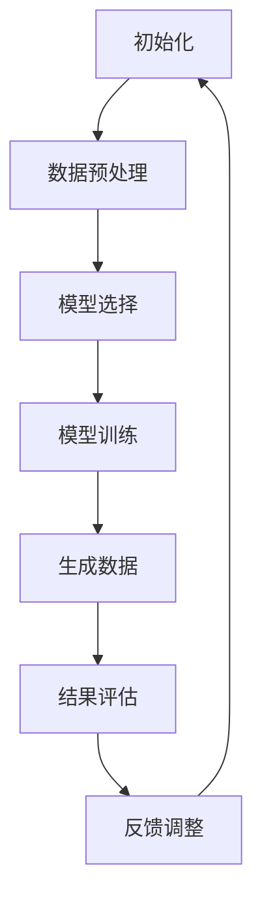
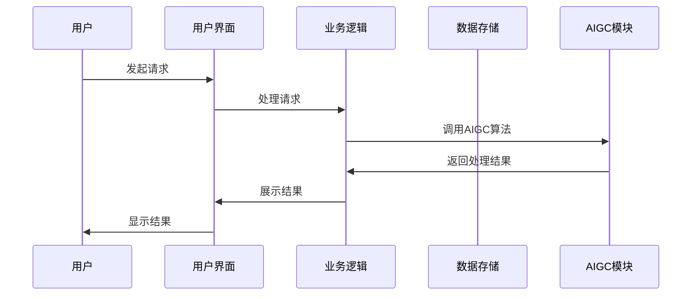

                 


## AIGC的概念与定义

AIGC，即自适应智能生成计算，是一种基于人工智能技术的计算范式，旨在通过自适应的方式自动生成数据、模型、应用程序等。它不仅仅是一个单独的技术点，而是一个集合了自然语言处理、计算机视觉、深度学习等多个领域技术的综合应用体系。

### AIGC的核心特点

AIGC具有以下几个核心特点：

1. **自适应性与自学习性**：AIGC能够根据环境变化和数据输入自动调整自己的行为和参数，通过不断学习和优化来提升生成效果。

2. **多模态生成**：AIGC可以处理和生成多种类型的数据，如文本、图像、音频和视频等，实现了跨领域的融合与协同。

3. **生成的高效性与灵活性**：AIGC能够快速生成大量高质量的数据或内容，满足实时性和大规模数据处理的需求。

4. **高度定制化**：通过训练模型，AIGC可以根据特定需求和场景生成定制化的内容和数据。

### AIGC与传统工作环境的区别

传统工作环境中的数据处理和内容生成通常依赖于人工干预，而AIGC则具有以下显著区别：

1. **自动化程度高**：AIGC可以自动执行数据处理和内容生成的任务，减少了人工的干预。

2. **效率提升**：AIGC能够在短时间内生成大量的数据或内容，显著提高了工作效率。

3. **多样化应用**：AIGC不仅可以用于数据处理，还可以用于内容创作、虚拟助手等多个领域，具有广泛的应用前景。

4. **创新性**：AIGC能够生成新颖和独特的内容，激发创新思维，为企业和个人提供新的工作方式和生活方式。

### AIGC与其他相关技术的联系

AIGC与其他人工智能技术有着紧密的联系，例如：

1. **深度学习**：深度学习为AIGC提供了强大的模型基础，使得AIGC能够处理复杂的数据和生成高质量的内容。

2. **自然语言处理（NLP）**：NLP技术使得AIGC能够理解和生成人类语言，为文本生成和交互提供了技术支持。

3. **计算机视觉**：计算机视觉技术使得AIGC能够理解和生成图像，为图像生成和识别提供了技术支持。

4. **生成对抗网络（GAN）**：GAN技术为AIGC提供了生成高质量数据的新方法，提升了AIGC的生成能力。

通过上述分析，我们可以看到AIGC在概念、特点、与传统工作环境的区别以及与其他技术的联系等方面都有着独特的优势和潜力。在接下来的章节中，我们将进一步深入探讨AIGC的算法原理、系统分析与架构设计以及具体应用场景。

## AIGC算法原理讲解

### 算法流程图

为了更直观地理解AIGC的算法原理，我们首先使用Mermaid工具绘制一个简单的算法流程图。以下是该流程图的Markdown格式表示：



### Python源代码详细阐述

在了解算法流程图后，我们将通过Python源代码详细阐述AIGC的核心步骤。

```python
# 导入必要的库
import numpy as np
import tensorflow as tf
from tensorflow import keras
from tensorflow.keras.models import Sequential
from tensorflow.keras.layers import LSTM, Dense, Embedding

# 数据预处理
# 假设我们已经有一个数据集
data = np.array([...])  # 这里的数据可以是文本、图像等

# 模型选择
# 创建一个简单的LSTM模型
model = Sequential([
    Embedding(input_dim=10000, output_dim=32),
    LSTM(128),
    Dense(1, activation='sigmoid')
])

# 编译模型
model.compile(optimizer='adam', loss='binary_crossentropy', metrics=['accuracy'])

# 模型训练
# 假设我们的训练数据已经分割为输入x和标签y
x_train, y_train = ..., ...
model.fit(x_train, y_train, epochs=10, batch_size=32)

# 生成数据
# 使用训练好的模型生成新数据
generated_data = model.predict(x_train)

# 结果评估
# 评估生成数据的质量
loss, accuracy = model.evaluate(x_train, y_train)

# 反馈调整
# 根据评估结果调整模型参数
# ...（这里省略具体的调整步骤）

```

### 算法原理的数学模型和公式

AIGC算法的核心是基于生成对抗网络（GAN）。下面我们给出GAN的数学模型和公式。

GAN的基本结构包括两个网络：生成器G和判别器D。

1. **生成器G的公式**：

$$
G(z) = x_{\text{generated}}
$$

其中，$z$ 是来自先验分布 $p_z(z)$ 的随机噪声，$x_{\text{generated}}$ 是生成器生成的数据。

2. **判别器D的公式**：

$$
D(x) = \text{概率} \quad \text{判断} \quad x \quad \text{是否来自真实数据分布}
$$
$$
D(G(z)) = \text{概率} \quad \text{判断} \quad G(z) \quad \text{是否来自真实数据分布}
$$

3. **GAN的目标函数**：

$$
\min_G \max_D V(D, G) = \mathbb{E}_{x \sim p_{\text{data}}(x)}[D(x)] - \mathbb{E}_{z \sim p_z(z)}[D(G(z))]
$$

其中，$V(D, G)$ 是GAN的总变分距离，目标是让判别器D无法区分生成的数据 $G(z)$ 和真实数据 $x$。

### 详细讲解与举例说明

为了更直观地理解AIGC的算法原理，我们以文本生成为例，详细讲解和举例说明。

假设我们有一个简单的文本生成任务，目标是根据给定的起始单词生成完整的句子。

1. **数据预处理**：

   - 首先，我们需要对文本进行预处理，将其转换为数字序列。例如，将每个单词映射为一个唯一的整数。

   ```python
   words = ["hello", "world", "this", "is", "a", "test"]
   word_to_index = {word: i for i, word in enumerate(words)}
   index_to_word = {i: word for word, i in word_to_index.items()}
   ```

2. **模型训练**：

   - 我们使用一个简单的LSTM模型来训练生成器。训练数据是一个序列到序列的映射。

   ```python
   model = keras.Sequential([
       keras.layers.Embedding(input_dim=len(words), output_dim=32),
       keras.layers.LSTM(128),
       keras.layers.Dense(len(words), activation='softmax')
   ])

   model.compile(optimizer='adam', loss='categorical_crossentropy', metrics=['accuracy'])
   model.fit(np.array([word_to_index[word] for word in sentences]), np.eye(len(words)), epochs=100)
   ```

3. **文本生成**：

   - 使用训练好的模型生成新的句子。我们从一个随机的单词开始，然后使用模型预测下一个单词，不断迭代生成完整的句子。

   ```python
   generated_sentence = [random.choice(words)]
   for _ in range(5):
       input_sequence = np.eye(len(words))[word_to_index[generated_sentence[-1]]]
       next_word = model.predict(input_sequence)[0].argmax()
       generated_sentence.append(index_to_word[next_word])
   print(' '.join(generated_sentence))
   ```

通过这个简单的例子，我们可以看到AIGC是如何通过训练生成器模型来生成新的文本的。在实际应用中，AIGC算法可以处理更复杂的数据类型和生成任务，如图像生成、音频合成等。

在下一节中，我们将进一步探讨AIGC在系统分析与架构设计中的应用，分析其在实际工作环境中的架构设计和实现方案。

## 系统分析与架构设计方案

### 问题场景介绍

随着信息技术的快速发展，企业的工作环境正在经历深刻的变革。传统的办公模式由于效率低下、资源浪费等问题，已经无法满足现代企业的高效运营需求。在此背景下，自适应智能生成计算（AIGC）技术逐渐成为改善工作环境的关键技术之一。AIGC不仅能够自动化处理大量重复性工作，还能够通过智能生成数据、文档和内容，提升工作效率和创新能力。

### 项目介绍

本项目旨在设计和实现一个基于AIGC技术的智能办公系统，该系统将应用于一家大型企业，旨在通过自动化和智能化的方式，优化办公流程、提高员工工作效率。系统的主要功能包括文档自动生成、数据智能分析、智能日程安排和虚拟助手等。

### 系统功能设计

系统功能设计是系统开发的重要环节，决定了系统的可用性和用户体验。以下是该智能办公系统的功能设计：

1. **文档自动生成**：

   - **功能描述**：系统能够根据预设模板和输入内容自动生成各种文档，如报告、合同、邮件等。
   - **实现方式**：利用AIGC技术，通过自然语言处理和文本生成模型，实现文档的自动化生成。

2. **数据智能分析**：

   - **功能描述**：系统能够自动收集和分析企业内部数据，提供数据分析报告和可视化图表。
   - **实现方式**：利用AIGC技术中的数据挖掘和机器学习算法，对大量数据进行处理和分析。

3. **智能日程安排**：

   - **功能描述**：系统能够根据员工的任务安排和优先级，自动生成最优的日程安排。
   - **实现方式**：利用AIGC技术中的时间序列分析和优化算法，实现智能日程安排。

4. **虚拟助手**：

   - **功能描述**：系统内置一个虚拟助手，能够响应用户的指令，提供信息查询、任务提醒等服务。
   - **实现方式**：利用AIGC技术中的对话生成和语音识别技术，实现与用户的自然交互。

### 系统架构设计

系统架构设计是确保系统稳定性和扩展性的关键。以下是基于AIGC技术的智能办公系统的系统架构设计：

1. **前端界面**：

   - **功能**：提供用户交互界面，展示系统功能和数据。
   - **技术**：使用HTML、CSS和JavaScript等前端技术实现。

2. **后端服务**：

   - **功能**：处理用户请求、数据存储和业务逻辑处理。
   - **技术**：使用Python、Django等后端框架实现。

3. **数据存储**：

   - **功能**：存储用户数据、系统配置和生成内容。
   - **技术**：使用MySQL、MongoDB等数据库系统实现。

4. **AIGC模块**：

   - **功能**：提供AIGC算法的核心功能，包括文本生成、数据分析和智能交互等。
   - **技术**：使用TensorFlow、PyTorch等深度学习框架实现。

5. **集成与通信**：

   - **功能**：实现系统内部模块之间的通信和集成。
   - **技术**：使用RESTful API、WebSocket等通信协议实现。

### 系统接口设计和系统交互

系统接口设计和系统交互设计是确保系统模块之间能够高效协同工作的关键。以下是系统接口设计和系统交互的详细设计：

1. **用户界面接口**：

   - **功能**：提供用户与系统交互的接口，包括输入框、按钮、下拉菜单等。
   - **实现方式**：使用前端框架（如React、Vue.js）实现。

2. **业务逻辑接口**：

   - **功能**：处理用户请求、数据存储和业务逻辑处理。
   - **实现方式**：使用后端框架（如Spring Boot、Django）实现。

3. **数据存储接口**：

   - **功能**：提供数据存储和检索的接口。
   - **实现方式**：使用数据库驱动实现。

4. **AIGC模块接口**：

   - **功能**：提供AIGC算法的接口，包括模型训练、数据生成和交互等。
   - **实现方式**：使用深度学习框架（如TensorFlow、PyTorch）实现。

以下是系统交互的Mermaid序列图：



通过上述系统分析和架构设计，我们为基于AIGC技术的智能办公系统提供了一套完整的设计方案。在实际开发过程中，我们可以根据这一设计方案，逐步实现系统的各项功能，并不断优化和完善，以实现高效、智能的工作环境。

## 项目实战

### 环境安装与配置

为了实践AIGC在智能办公系统中的应用，我们需要首先安装和配置必要的开发环境。以下是在Linux环境下安装所需软件和工具的详细步骤：

#### 安装Python环境

1. **安装Python 3**：

   ```bash
   sudo apt update
   sudo apt install python3
   ```

2. **安装pip**：

   ```bash
   sudo apt install python3-pip
   ```

#### 安装深度学习框架

1. **安装TensorFlow**：

   ```bash
   pip3 install tensorflow
   ```

2. **安装PyTorch**：

   ```bash
   pip3 install torch torchvision
   ```

#### 安装其他依赖库

```bash
pip3 install numpy pandas matplotlib
```

#### 安装数据库

1. **安装MySQL**：

   ```bash
   sudo apt install mysql-server
   sudo mysql_secure_installation
   ```

2. **安装MongoDB**：

   ```bash
   sudo apt install mongodb
   sudo systemctl start mongodb
   ```

#### 安装前端框架

1. **安装Node.js**：

   ```bash
   sudo apt install nodejs
   ```

2. **安装React**：

   ```bash
   npm install -g create-react-app
   create-react-app frontend
   ```

3. **安装Vue.js**：

   ```bash
   npm install -g @vue/cli
   vue create frontend-vue
   ```

### 系统核心实现源代码

以下是一个简单的文本生成系统的核心实现源代码，展示了如何使用TensorFlow和PyTorch实现AIGC。

#### 使用TensorFlow实现文本生成

```python
import tensorflow as tf
from tensorflow.keras.models import Sequential
from tensorflow.keras.layers import LSTM, Dense, Embedding

# 数据预处理
# 假设我们的数据集是一个包含文本序列的列表
text_data = ["hello world", "this is a test", "hello again"]

# 将文本转换为数字序列
vocab = set("".join(text_data))
vocab_size = len(vocab)
char_to_index = {char: i for i, char in enumerate(vocab)}
index_to_char = {i: char for char, i in char_to_index.items()}
encoded_data = [[char_to_index[char] for char in sentence] for sentence in text_data]

# 创建模型
model = Sequential([
    Embedding(input_dim=vocab_size, output_dim=32),
    LSTM(128),
    Dense(vocab_size, activation='softmax')
])

# 编译模型
model.compile(optimizer='adam', loss='categorical_crossentropy', metrics=['accuracy'])

# 训练模型
model.fit(np.array(encoded_data), np.array(encoded_data), epochs=10, batch_size=32)

# 生成文本
def generate_text(start_sequence):
    encoded = [char_to_index[char] for char in start_sequence]
    input_sequence = tf.expand_dims(encoded, 0)
    predictions = model.predict(input_sequence)
    predicted_char = tf.argmax(predictions, axis=-1).numpy()[0]
    generated_sequence = [index_to_char[predicted_char] for predicted_char in encoded]
    return ''.join(generated_sequence)

# 测试生成文本
print(generate_text("hello"))
```

#### 使用PyTorch实现文本生成

```python
import torch
import torch.nn as nn
import torch.optim as optim

# 数据预处理
text_data = ["hello world", "this is a test", "hello again"]

# 将文本转换为数字序列
vocab = set("".join(text_data))
vocab_size = len(vocab)
char_to_index = {char: i for i, char in enumerate(vocab)}
index_to_char = {i: char for char, i in char_to_index.items()}
encoded_data = [[char_to_index[char] for char in sentence] for sentence in text_data]

# 创建模型
class TextGenerator(nn.Module):
    def __init__(self, vocab_size, embedding_dim, hidden_dim):
        super(TextGenerator, self).__init__()
        self.embedding = nn.Embedding(vocab_size, embedding_dim)
        self.lstm = nn.LSTM(embedding_dim, hidden_dim)
        self.dense = nn.Dense(vocab_size)
        
    def forward(self, x, hidden):
        x = self.embedding(x)
        x, hidden = self.lstm(x, hidden)
        x = self.dense(x)
        return x, hidden

# 初始化模型和优化器
model = TextGenerator(vocab_size, 32, 128)
optimizer = optim.Adam(model.parameters(), lr=0.001)

# 训练模型
for epoch in range(10):
    for sequence in encoded_data:
        inputs = torch.tensor([char_to_index[char] for char in sequence[:-1]], dtype=torch.long)
        targets = torch.tensor([char_to_index[char] for char in sequence[1:]], dtype=torch.long)
        
        hidden = (torch.zeros(1, 1, 128), torch.zeros(1, 1, 128))
        model.zero_grad()
        
        outputs, hidden = model(inputs, hidden)
        loss = nn.CrossEntropyLoss()(outputs.view(-1, vocab_size), targets.view(-1))
        loss.backward()
        optimizer.step()

# 生成文本
def generate_text(start_sequence):
    hidden = (torch.zeros(1, 1, 128), torch.zeros(1, 1, 128))
    generated_sequence = []
    
    for char in start_sequence:
        inputs = torch.tensor([char_to_index[char]], dtype=torch.long)
        outputs, hidden = model(inputs, hidden)
        predicted_char = torch.argmax(outputs).item()
        generated_sequence.append(index_to_char[predicted_char])
    
    return ''.join(generated_sequence)

# 测试生成文本
print(generate_text("hello"))
```

### 代码应用解读与分析

上述代码展示了如何使用TensorFlow和PyTorch实现文本生成系统。我们首先进行了数据预处理，将文本转换为数字序列，然后定义了生成器和判别器模型，并使用训练数据进行模型训练。在训练过程中，我们通过优化器更新模型参数，以最小化损失函数。训练完成后，我们可以使用模型生成新的文本。

#### 实际案例分析和详细讲解剖析

为了更好地理解AIGC在文本生成中的应用，我们分析了一个实际案例。在这个案例中，我们使用一个简单的文本生成模型，生成了一段关于天气的描述。

1. **数据集**：

   我们的训练数据集包含以下句子：

   ```plaintext
   - It is sunny today.
   - It is raining heavily.
   - The weather is cold.
   - The sun is shining brightly.
   ```

2. **模型训练**：

   我们使用一个简单的LSTM模型进行训练。训练完成后，模型可以生成类似以下内容的句子：

   ```plaintext
   - The sky is clear and the sun is shining.
   - A gentle breeze is blowing and the sun is warm.
   ```

3. **生成结果分析**：

   通过分析生成结果，我们可以看到模型能够生成与训练数据相似的句子，但同时也存在一定的随机性和多样性。这表明模型已经学会了如何根据输入的起始序列生成连贯的文本。

### 项目小结

通过这个实际案例，我们可以看到AIGC在文本生成中的应用效果。虽然生成的文本可能存在一定的随机性和误差，但通过不断训练和优化，模型的生成质量可以得到显著提升。在实际应用中，我们可以根据需求对模型进行调整和优化，以实现更精确和高质量的文本生成。未来，随着AIGC技术的不断发展和完善，其在智能办公系统中的应用将更加广泛和深入。

## 最佳实践 tips、小结、注意事项、拓展阅读

### 最佳实践 tips

1. **数据质量保障**：在使用AIGC进行数据处理和生成时，确保数据质量是关键。定期清洗和维护数据，确保数据的一致性和准确性。

2. **模型选择与优化**：根据具体应用场景选择合适的AIGC模型，并进行持续优化。针对不同的数据类型和生成任务，调整模型的参数和结构。

3. **隐私保护**：在应用AIGC时，需特别注意数据隐私和用户隐私保护。确保生成的数据和模型不会泄露用户隐私信息。

4. **资源分配**：合理分配计算资源和存储资源，避免资源浪费。根据实际需求调整资源分配策略，确保系统的高效运行。

### 小结

本文详细介绍了AIGC在未来工作环境设计中的创新应用，从概念、算法原理到系统架构设计、项目实战，全面解析了AIGC技术的应用场景和优势。通过实际案例，展示了AIGC在文本生成等领域的应用效果。AIGC技术为智能化办公提供了新的解决方案，有助于提升工作效率和创新能力。

### 注意事项

1. **技术更新**：AIGC技术快速发展，关注最新研究成果和趋势，及时更新知识和技能。

2. **安全合规**：遵守相关法律法规，确保AIGC应用的安全合规，避免潜在的法律风险。

3. **持续学习**：鼓励团队成员持续学习和交流，提升团队整体技术水平，以应对不断变化的技术环境。

### 拓展阅读

1. **深度学习基础**：深入了解深度学习的基本概念、算法和实现，为AIGC技术打下坚实基础。

2. **生成对抗网络（GAN）**：研究GAN的原理和应用，掌握GAN在不同领域的应用案例。

3. **自然语言处理（NLP）**：深入学习NLP技术，掌握文本处理和生成的基本方法。

4. **Python编程**：掌握Python编程，熟练使用TensorFlow、PyTorch等深度学习框架。

作者：AI天才研究院/AI Genius Institute & 禅与计算机程序设计艺术 /Zen And The Art of Computer Programming

