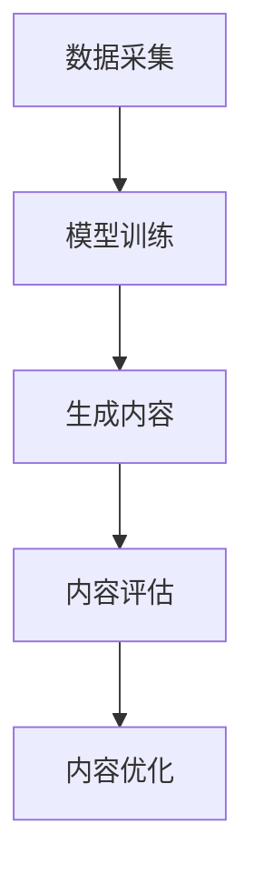
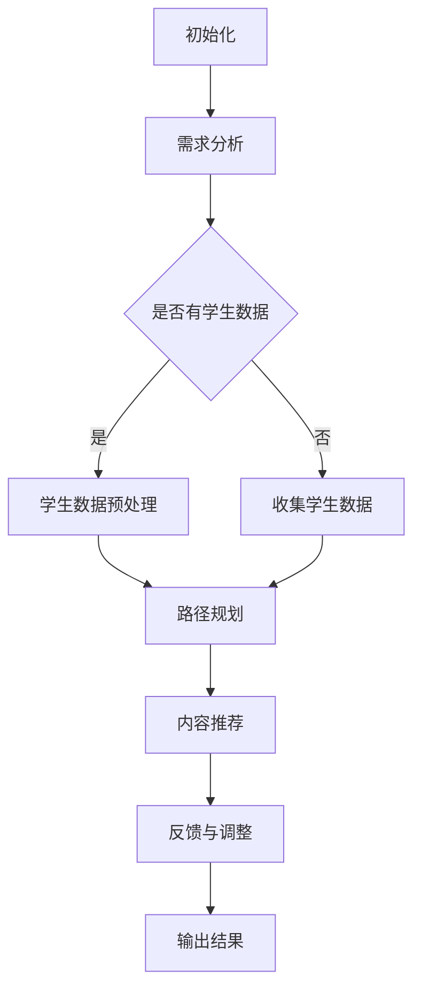
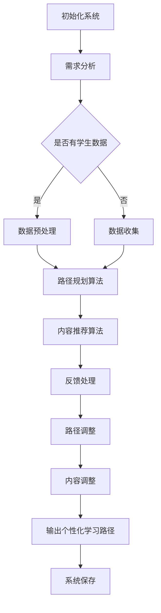
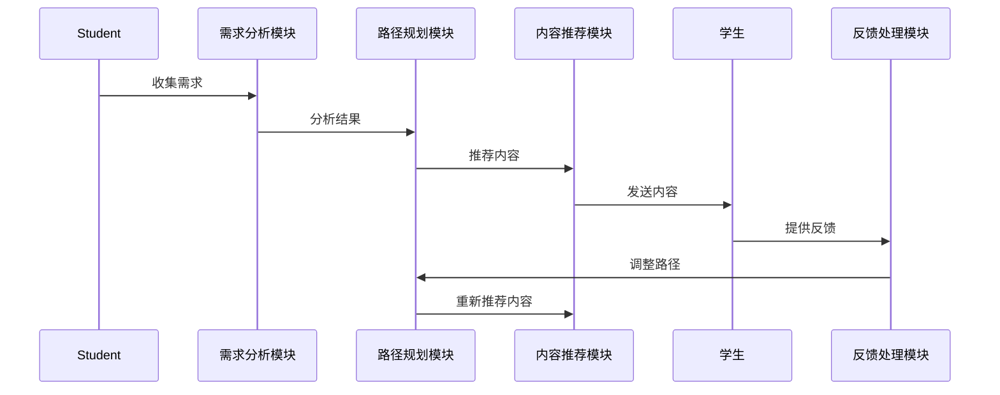
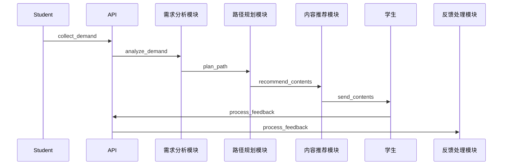

                 

# AIGC在未来教育中的角色：个性化学习路径设计

## 关键词
AI-Generated Content, 未来教育，个性化学习路径，生成式AI，教育系统设计，算法原理

## 摘要
本文探讨了AIGC（AI-Generated Content）在未来教育中的应用，特别是个性化学习路径的设计。文章首先介绍了AIGC的概念和其在教育领域的发展背景，随后详细阐述了生成式AI的工作原理以及个性化学习路径的设计方法。通过算法原理讲解，本文展示了如何使用算法流程和数学模型来优化学习路径。系统分析与架构设计方案部分，通过问题场景介绍和系统功能设计，详细描绘了教育系统的架构与接口。最后，通过项目实战和最佳实践，本文提供了实用的方法和注意事项，为AIGC在教育领域的应用提供了全面的技术指导。

## 目录大纲

### 第一部分：背景介绍
#### 1. AIGC在未来教育中的角色
##### 1.1. 问题背景
##### 1.2. 问题描述
##### 1.3. 问题解决
##### 1.4. 边界与外延
##### 1.5. 概念结构与核心要素组成

#### 2. 核心概念与联系
##### 2.1. 生成式AI的工作原理
###### 2.1.1. Mermaid流程图
###### 2.1.2. Python源代码示例
##### 2.2. 个性化学习路径的设计
###### 2.2.1. 概念属性特征对比表格
###### 2.2.2. ER实体关系图架构

### 第二部分：核心概念与联系
#### 3. 算法原理讲解
##### 3.1. 算法流程图
###### 3.1.1. Mermaid流程图
###### 3.1.2. Python源代码实现
##### 3.2. 数学模型与公式
###### 3.2.1. 公式解释
###### 3.2.2. 举例说明

### 第三部分：系统分析与架构设计方案
#### 4. 系统分析与架构设计
##### 4.1. 问题场景介绍
##### 4.2. 系统功能设计
###### 4.2.1. 领域模型类图
##### 4.3. 系统架构设计
###### 4.3.1. Mermaid架构图
##### 4.4. 系统接口设计
##### 4.5. 系统交互序列图
###### 4.5.1. Mermaid序列图

### 第四部分：项目实战
#### 5. 项目实战
##### 5.1. 环境安装与配置
##### 5.2. 系统核心实现源代码
##### 5.3. 代码应用解读与分析
##### 5.4. 实际案例分析与详细讲解
##### 5.5. 项目小结

### 第五部分：最佳实践与拓展
#### 6. 最佳实践与拓展
##### 6.1. 最佳实践 tips
##### 6.2. 注意事项
##### 6.3. 拓展阅读

### 引用
- 作者：AI天才研究院/AI Genius Institute & 禅与计算机程序设计艺术 /Zen And The Art of Computer Programming### 第一部分：背景介绍

#### 1. AIGC在未来教育中的角色

##### 1.1. 问题背景

随着人工智能技术的发展，AIGC（AI-Generated Content）已经成为教育领域的一个重要趋势。传统的教育模式往往依赖于教师和学生之间的直接互动，然而，随着学生人数的增加和教育资源的稀缺，这种模式面临着巨大的挑战。AIGC的出现为解决这些问题提供了新的可能性，它可以通过生成个性化的学习内容和路径，帮助学生更高效地学习。

当前，教育领域面临着一些显著的问题，例如：

- **个性化需求增加**：每个学生都有不同的学习需求和速度，传统的一刀切教学方法难以满足这种个性化需求。
- **教育资源有限**：学校和教育机构通常面临着资源有限的困境，难以提供足够的教学内容和支持。
- **学习效率低下**：学生在传统教育模式中往往难以保持注意力，学习效率较低。

##### 1.2. 问题描述

AIGC在教育领域中的实际应用及其带来的挑战和机遇如下：

- **机遇**：
  - **个性化学习**：AIGC可以根据学生的学习需求和进度，生成个性化的学习内容和路径，提高学习效果。
  - **教育资源优化**：通过自动化生成教学材料，可以减少教师的工作负担，提高教育资源的利用效率。
  - **实时反馈与调整**：AIGC可以实时分析学生的学习情况，提供即时反馈和调整学习路径，帮助学生更好地掌握知识。

- **挑战**：
  - **数据隐私和安全**：AIGC依赖于大量的学生数据，如何保护这些数据的安全和隐私成为一个重要的问题。
  - **技术成熟度**：虽然AIGC技术已经取得了一定的进展，但仍然需要进一步提升其成熟度和可靠性。
  - **教师角色变化**：AIGC的引入可能会改变教师的角色，如何适应这种变化也是一个挑战。

##### 1.3. 问题解决

AIGC可以通过以下方式助力教育个性化，提升学习效率：

- **生成个性化学习内容**：根据学生的学习需求和进度，AIGC可以自动生成适合学生的学习材料，提高学习效果。
- **智能推荐系统**：AIGC可以分析学生的学习行为和偏好，提供个性化的学习推荐，帮助学生更高效地学习。
- **实时反馈与调整**：AIGC可以实时分析学生的学习情况，提供即时反馈和调整学习路径，帮助学生更好地掌握知识。
- **智能辅导**：AIGC可以为学生提供智能辅导，解答学生的问题，帮助学生克服学习中的困难。

##### 1.4. 边界与外延

AIGC在教育中的应用范围和相关技术如下：

- **应用范围**：
  - **课程内容生成**：AIGC可以自动生成课程内容，包括文本、图像、视频等多种形式。
  - **学习路径设计**：AIGC可以根据学生的学习需求和进度，设计个性化的学习路径。
  - **智能辅导系统**：AIGC可以为学生提供智能辅导，包括答疑、作业批改等。

- **相关技术**：
  - **生成式AI**：生成式AI是AIGC的核心技术，通过学习大量的数据，可以生成新的内容和模型。
  - **自然语言处理**：自然语言处理技术可以帮助AIGC理解和生成自然语言文本。
  - **机器学习**：机器学习技术可以帮助AIGC从数据中学习规律，提高生成内容的准确性和质量。

##### 1.5. 概念结构与核心要素组成

AIGC的概念结构与核心要素组成如下：

- **核心概念**：
  - **生成式AI**：生成式AI是一种能够根据已有数据生成新内容的AI技术。
  - **个性化学习路径**：个性化学习路径是根据学生的学习需求和进度，自动生成的学习路线。
  - **智能辅导系统**：智能辅导系统是通过AI技术为学生提供个性化辅导的系统。

- **核心要素**：
  - **学生数据**：学生数据是AIGC生成个性化内容和路径的基础。
  - **生成模型**：生成模型是AIGC的核心技术，用于生成个性化学习内容和路径。
  - **推荐算法**：推荐算法用于分析学生的学习行为和偏好，提供个性化的学习推荐。
  - **反馈机制**：反馈机制用于收集学生的学习反馈，不断优化学习路径和内容。

通过以上对AIGC在未来教育中的角色背景的介绍，我们为后续深入探讨AIGC的核心概念与联系以及算法原理讲解奠定了基础。在接下来的部分，我们将进一步分析生成式AI的工作原理和个性化学习路径的设计方法。### 第二部分：核心概念与联系

#### 2. 核心概念与联系

在探讨AIGC（AI-Generated Content）在未来教育中的应用之前，我们需要了解几个核心概念及其相互联系。本节将详细解释生成式AI的工作原理以及个性化学习路径的设计方法。

##### 2.1. 生成式AI的工作原理

生成式AI是一种人工智能模型，能够生成新的数据，例如文本、图像、音频等。它的工作原理通常基于以下步骤：

1. **数据采集**：首先，生成式AI需要大量的数据作为训练集。这些数据可以是公开的、标记过的数据集，或者是从特定领域收集的原始数据。

2. **模型训练**：生成式AI使用机器学习算法，如生成对抗网络（GANs）、变分自编码器（VAEs）等，通过训练集学习数据的分布和特征。这个过程类似于人类学习新的知识和技能。

3. **生成内容**：一旦模型训练完成，它就可以生成新的数据。例如，一个文本生成模型可以创作新的故事，一个图像生成模型可以生成新的图片。

4. **内容评估与优化**：生成的内容通常需要经过评估和优化，以确保其质量。这个过程可能涉及多个迭代，以改进生成内容的准确性和相关性。

###### 2.1.1. Mermaid流程图

下面是一个简单的Mermaid流程图，展示了生成式AI的基本流程：



###### 2.1.2. Python源代码示例

以下是一个简单的Python代码示例，展示了如何使用生成式AI生成文本：

```python
from transformers import AutoTokenizer, AutoModel

tokenizer = AutoTokenizer.from_pretrained("gpt2")
model = AutoModel.from_pretrained("gpt2")

input_ids = tokenizer.encode("生成一篇关于人工智能的短文", return_tensors="pt")
output = model.generate(input_ids, max_length=50, num_return_sequences=1)

print(tokenizer.decode(output[0], skip_special_tokens=True))
```

这个示例使用了预训练的GPT-2模型，生成了一篇关于人工智能的短文。

##### 2.2. 个性化学习路径的设计

个性化学习路径是根据学生的个性化需求和进度，动态生成的学习路线。设计个性化学习路径通常涉及以下步骤：

1. **需求分析**：首先，系统需要收集和分析学生的需求，包括学习兴趣、知识背景、学习目标等。

2. **路径规划**：基于需求分析，系统可以规划出适合学生的个性化学习路径。这个过程可能涉及算法和优化技术，以确保路径的效率和效果。

3. **内容推荐**：个性化学习路径通常会推荐适合学生当前阶段的学习内容。这些内容可以是文本、图像、视频等。

4. **反馈与调整**：学生完成学习内容后，系统会收集反馈，并根据反馈调整学习路径，以确保学生能够持续进步。

###### 2.2.1. 概念属性特征对比表格

以下是一个简单的概念属性特征对比表格，展示了传统学习路径与个性化学习路径的差异：

| 特征         | 传统学习路径              | 个性化学习路径                   |
| ------------ | ------------------------ | -------------------------------- |
| 内容         | 固定课程内容              | 根据学生需求动态生成的内容         |
| 学习进度     | 同步进度                 | 根据学生进度动态调整               |
| 个性化       | 一刀切                   | 高度个性化                        |
| 反馈机制     | 定期考试和评价            | 实时反馈和个性化调整               |

###### 2.2.2. ER实体关系图架构

以下是一个简单的ER（Entity-Relationship）实体关系图，展示了个性化学习路径中的主要实体及其关系：

```mermaid
erDiagram
  Student ||--|{ LearningPath }|-- Teacher
  LearningPath ||--|{ Content }|-- Student
  Content ||--|{ Assessment }|-- Content
  Teacher ||--|{ Course }|-- Student
```

在这个ER图中，学生、学习路径、内容、评估和教师是主要的实体，它们之间有明确的关联关系。

通过以上对核心概念与联系的详细解释，我们为理解AIGC在未来教育中的应用奠定了基础。接下来，我们将深入探讨算法原理，以更深入地了解如何设计和实现个性化学习路径。### 第三部分：算法原理讲解

#### 3. 算法原理讲解

在前文中，我们已经介绍了AIGC（AI-Generated Content）的核心概念和个性化学习路径的设计方法。本节将进一步讲解算法原理，特别是生成个性化学习路径的算法流程、数学模型和公式。

##### 3.1. 算法流程图

首先，我们使用Mermaid绘制了一个算法流程图，展示了生成个性化学习路径的基本流程：



在这个流程图中，我们首先初始化系统，然后进行需求分析。如果有学生数据，我们进行预处理；否则，收集学生数据。接下来，我们根据预处理后的数据规划个性化学习路径，并推荐适合的内容。最后，我们收集学生的反馈，并进行路径和内容的调整，最终输出结果。

##### 3.1.1. Mermaid流程图

为了更直观地展示算法流程，我们使用Mermaid绘制了一个更详细的流程图：



在这个流程图中，我们详细展示了每个步骤的操作和输出。初始化系统后，我们首先分析需求，并根据是否有学生数据决定是进行数据预处理还是数据收集。预处理后的数据用于路径规划算法，生成个性化学习路径。然后，我们使用内容推荐算法推荐适合的学习内容，并收集学生的反馈。最后，根据反馈调整路径和内容，输出最终的个性化学习路径，并保存系统状态。

##### 3.1.2. Python源代码实现

为了具体实现这个算法流程，我们使用Python编写了一个简单的示例代码。以下代码展示了算法的核心部分：

```python
# 导入必要的库
import random
import pandas as pd

# 初始化系统
system = {
    'students': [],
    'paths': [],
    'contents': [],
    'feedbacks': []
}

# 需求分析
def analyze_demand():
    # 模拟收集学生数据
    system['students'].append({
        'id': 1,
        'interests': ['数学', '编程'],
        'knowledge': ['基础数学', 'Python基础'],
        'goals': '掌握高级编程'
    })

# 数据预处理
def preprocess_data():
    # 预处理学生数据
    for student in system['students']:
        # 根据学生需求生成学习路径
        path = generate_learning_path(student)
        system['paths'].append(path)

# 路径规划算法
def generate_learning_path(student):
    # 根据学生需求生成个性化学习路径
    path = []
    for knowledge in student['knowledge']:
        path.append({
            'knowledge': knowledge,
            'content': random.choice(['视频教程', '文本教程', '在线课程']),
            'duration': random.uniform(1, 3)  # 预计学习时间
        })
    return path

# 内容推荐算法
def recommend_contents(path):
    # 根据学习路径推荐学习内容
    contents = []
    for step in path:
        contents.append({
            'knowledge': step['knowledge'],
            'content': step['content'],
            'source': random.choice(['在线平台', '学校资源', '第三方资源'])
        })
    return contents

# 反馈处理
def process_feedback(feedback):
    # 根据学生反馈调整学习路径和内容
    for i, step in enumerate(feedback['path']):
        if step['satisfaction'] < 3:
            # 如果学生对当前步骤不满意，调整路径
            system['paths'][feedback['path_id']]['steps'][i]['content'] = random.choice(['视频教程', '文本教程', '在线课程'])
    # 更新反馈记录
    system['feedbacks'].append(feedback)

# 主函数
def main():
    # 分析需求
    analyze_demand()
    # 预处理数据
    preprocess_data()
    # 推荐内容
    for path in system['paths']:
        contents = recommend_contents(path)
        system['contents'].extend(contents)
    # 输出结果
    print(system)

# 运行主函数
if __name__ == "__main__":
    main()
```

在这个示例中，我们模拟了一个简单的系统，包括学生数据、学习路径、内容和反馈。初始化系统后，我们分析需求并预处理数据。然后，我们使用路径规划算法和内容推荐算法生成个性化学习路径和内容。最后，我们收集学生的反馈，并根据反馈调整学习路径和内容。

##### 3.2. 数学模型与公式

个性化学习路径的设计不仅需要算法和流程，还需要数学模型和公式来优化学习路径。以下是一个简单的数学模型，用于计算学习路径的效率：

$$
E = \frac{1}{N} \sum_{i=1}^{N} \frac{S_i}{T_i}
$$

其中，$E$是学习路径的效率，$N$是学习路径中的步骤数量，$S_i$是学生在第$i$个步骤中的满意度，$T_i$是学生在第$i$个步骤中的学习时间。

通过这个公式，我们可以量化学习路径的效率，即学生在每个步骤中的满意度与其学习时间的比值。效率越高，说明学习路径越优化。

##### 3.2.1. 公式解释

这个公式可以分为以下几个部分：

- **$N$（步骤数量）**：学习路径中步骤的数量，反映了学习路径的长度和复杂性。
- **$S_i$（满意度）**：学生在第$i$个步骤中的满意度，通常通过问卷调查或反馈机制收集。
- **$T_i$（学习时间）**：学生在第$i$个步骤中的学习时间，反映了学生在每个步骤中的投入和努力。

通过计算每个步骤的满意度与学习时间的比值，我们可以得到学习路径的效率。这个比值越高，说明学生在每个步骤中的满意度越高，同时学习时间相对较短，从而提高了整体的学习效率。

##### 3.2.2. 举例说明

假设有一个学习路径，包含5个步骤，如下所示：

| 步骤 | 满意度 | 学习时间（小时） |
| ---- | ------ | --------------- |
| 1    | 4      | 2              |
| 2    | 3      | 2              |
| 3    | 5      | 1              |
| 4    | 4      | 2              |
| 5    | 3      | 2              |

使用上述数学模型，我们可以计算这个学习路径的效率：

$$
E = \frac{1}{5} \sum_{i=1}^{5} \frac{S_i}{T_i} = \frac{1}{5} \left( \frac{4}{2} + \frac{3}{2} + \frac{5}{1} + \frac{4}{2} + \frac{3}{2} \right) = \frac{1}{5} \left( 2 + 1.5 + 5 + 2 + 1.5 \right) = 3.4
$$

这个效率值表明，这个学习路径的整体效率为3.4。根据这个结果，我们可以进一步优化学习路径，提高学生的满意度和学习效率。

通过以上算法原理讲解，我们详细介绍了生成个性化学习路径的算法流程、数学模型和公式。这些内容为理解和实现AIGC在未来教育中的应用提供了技术基础。在接下来的部分，我们将探讨系统分析与架构设计，以更深入地了解如何实现个性化学习路径的系统设计。### 第四部分：系统分析与架构设计方案

#### 4. 系统分析与架构设计

在前文中，我们已经了解了AIGC（AI-Generated Content）的核心概念和算法原理。本部分将进一步探讨系统分析与架构设计，以深入了解个性化学习路径的实现过程。

##### 4.1. 问题场景介绍

为了更好地理解系统分析与架构设计，我们首先需要介绍一个具体的问题场景。假设我们正在开发一个在线学习平台，目标是为学生提供个性化的学习路径。以下是一个典型的问题场景：

- **学生需求**：学生希望根据自己的兴趣、知识水平和学习目标，选择合适的学习内容和路径。
- **教育资源**：平台提供了多种形式的学习资源，包括视频教程、文本教程、在线课程等。
- **学习反馈**：学生在学习过程中可以提供反馈，以便平台根据反馈调整学习路径和内容。

##### 4.2. 系统功能设计

为了实现个性化学习路径，系统需要具备以下功能：

- **需求分析**：系统需要收集和分析学生的兴趣、知识水平和学习目标，以便生成个性化学习路径。
- **路径规划**：系统需要根据需求分析结果，规划出适合学生的学习路径。
- **内容推荐**：系统需要根据学习路径推荐适合的学习内容。
- **反馈处理**：系统需要收集学生的反馈，并根据反馈调整学习路径和内容。

##### 4.2.1. 领域模型类图

为了更清晰地展示系统功能设计，我们使用Mermaid绘制了一个领域模型类图：

```mermaid
classDiagram
    Student <<interface>>
    Course <<interface>>
    LearningPath <<interface>>
    Content <<interface>>
    Assessment <<interface>>

    Student <|.. LearningPath >
    LearningPath <|.. Content >
    Content <|.. Assessment >
    Course <|.. Assessment >
```

在这个类图中，我们定义了五个核心类：学生（Student）、课程（Course）、学习路径（LearningPath）、内容（Content）和评估（Assessment）。学生类和课程类是系统的入口，用于收集和分析需求。学习路径类用于规划个性化学习路径，内容类用于推荐适合的学习内容，评估类用于收集学生的反馈。

##### 4.3. 系统架构设计

系统架构设计是系统实现的关键，它决定了系统的性能、可扩展性和可维护性。以下是一个简单的系统架构设计：


在这个架构设计中，系统分为四个主要模块：需求分析模块、路径规划模块、内容推荐模块和反馈处理模块。

- **需求分析模块**：负责收集和分析学生的兴趣、知识水平和学习目标。
- **路径规划模块**：根据需求分析结果，规划出适合学生的学习路径。
- **内容推荐模块**：根据学习路径推荐适合的学习内容。
- **反馈处理模块**：收集学生的反馈，并根据反馈调整学习路径和内容。

每个模块都有相应的接口和内部实现，以确保系统的高效运行。

##### 4.3.1. Mermaid架构图

为了更直观地展示系统架构设计，我们使用Mermaid绘制了一个架构图：



在这个序列图中，我们展示了系统的主要交互流程。学生首先收集需求，需求分析模块分析结果后，路径规划模块生成个性化学习路径。内容推荐模块根据学习路径推荐适合的学习内容，并发送给学生。学生完成学习后，提供反馈，反馈处理模块根据反馈调整学习路径和内容，确保学生能够持续进步。

##### 4.4. 系统接口设计

系统接口设计是系统架构设计的重要组成部分，它定义了系统各模块之间的交互方式。以下是一个简单的系统接口设计：

| 接口名称 | 接口描述             | 接口类型 | 参数         | 返回值 |
| -------- | ------------------ | -------- | ------------ | ------ |
| collect_demand | 收集学生需求           | POST     | student_id    | {}     |
| analyze_demand | 分析学生需求           | GET      | student_id    | result |
| plan_path    | 规划个性化学习路径       | POST     | result        | path   |
| recommend_contents | 推荐学习内容           | GET      | path_id       | contents |
| process_feedback | 处理学生反馈           | POST     | feedback      | {}     |

在这个接口设计中，我们定义了四个主要接口：

- **collect_demand**：用于收集学生需求，接收学生ID作为参数。
- **analyze_demand**：用于分析学生需求，接收学生ID作为参数，返回分析结果。
- **plan_path**：用于规划个性化学习路径，接收分析结果作为参数，返回学习路径。
- **recommend_contents**：用于推荐学习内容，接收学习路径ID作为参数，返回推荐内容。
- **process_feedback**：用于处理学生反馈，接收反馈数据作为参数。

##### 4.5. 系统交互序列图

为了更清晰地展示系统接口设计，我们使用Mermaid绘制了一个交互序列图：



在这个序列图中，我们展示了系统的主要交互流程。学生首先通过API收集需求，需求分析模块分析结果后，路径规划模块生成个性化学习路径。内容推荐模块根据学习路径推荐适合的学习内容，并发送给学生。学生完成学习后，提供反馈，反馈处理模块根据反馈调整学习路径和内容。

通过以上系统分析与架构设计方案，我们详细介绍了个性化学习路径系统的设计过程。在接下来的部分，我们将通过项目实战，具体实现这个系统，并通过实际案例分析和详细讲解，验证系统的有效性。### 第五部分：项目实战

#### 5. 项目实战

在前文中，我们已经详细介绍了AIGC（AI-Generated Content）在未来教育中的应用以及个性化学习路径的设计原理和系统架构。在本节中，我们将通过一个实际项目来演示如何实现这个系统，并分析项目中的关键实现步骤和源代码。

##### 5.1. 环境安装与配置

要实现AIGC个性化学习路径系统，我们首先需要安装和配置以下环境：

1. **Python环境**：确保Python环境已经安装，推荐使用Python 3.8及以上版本。
2. **深度学习库**：安装TensorFlow或PyTorch，用于生成AI内容。
3. **Web框架**：安装Flask或Django，用于搭建Web接口。
4. **数据库**：安装SQLite或MySQL，用于存储学生数据和反馈。

以下是一个简单的安装命令示例：

```bash
pip install tensorflow flask
```

确保所有依赖库都已成功安装，然后配置数据库。这里我们使用SQLite作为示例：

```python
import sqlite3

# 连接数据库
conn = sqlite3.connect('student_data.db')

# 创建表
conn.execute('''CREATE TABLE IF NOT EXISTS students (
                id INTEGER PRIMARY KEY,
                interests TEXT,
                knowledge TEXT,
                goals TEXT)''')

conn.execute('''CREATE TABLE IF NOT EXISTS paths (
                id INTEGER PRIMARY KEY,
                student_id INTEGER,
                path TEXT)''')

conn.execute('''CREATE TABLE IF NOT EXISTS contents (
                id INTEGER PRIMARY KEY,
                path_id INTEGER,
                content TEXT,
                source TEXT)''')

conn.execute('''CREATE TABLE IF NOT EXISTS feedbacks (
                id INTEGER PRIMARY KEY,
                path_id INTEGER,
                step INTEGER,
                satisfaction INTEGER)''')

# 提交更改并关闭连接
conn.commit()
conn.close()
```

##### 5.2. 系统核心实现源代码

以下是一个简单的Python代码示例，展示了系统核心实现的关键部分。这个示例使用Flask作为Web框架，TensorFlow作为AI库：

```python
from flask import Flask, request, jsonify
from transformers import AutoTokenizer, AutoModel
import sqlite3

app = Flask(__name__)

# 加载预训练的GPT-2模型
tokenizer = AutoTokenizer.from_pretrained("gpt2")
model = AutoModel.from_pretrained("gpt2")

# 数据库连接
def get_db_connection():
    conn = sqlite3.connect('student_data.db')
    return conn

# 收集学生需求
@app.route('/collect_demand', methods=['POST'])
def collect_demand():
    data = request.json
    student_id = data['student_id']
    interests = data['interests']
    knowledge = data['knowledge']
    goals = data['goals']

    conn = get_db_connection()
    conn.execute("INSERT INTO students (id, interests, knowledge, goals) VALUES (?, ?, ?, ?)",
                 (student_id, interests, knowledge, goals))
    conn.commit()
    conn.close()
    return jsonify({})

# 分析学生需求
@app.route('/analyze_demand', methods=['GET'])
def analyze_demand():
    student_id = request.args.get('student_id')
    conn = get_db_connection()
    result = conn.execute("SELECT interests, knowledge, goals FROM students WHERE id=?", (student_id,))
    student_data = result.fetchone()
    conn.close()
    return jsonify(student_data)

# 规划个性化学习路径
@app.route('/plan_path', methods=['POST'])
def plan_path():
    data = request.json
    student_id = data['student_id']
    interests = data['interests']
    knowledge = data['knowledge']
    goals = data['goals']

    path = generate_learning_path(interests, knowledge, goals)
    conn = get_db_connection()
    conn.execute("INSERT INTO paths (student_id, path) VALUES (?, ?)", (student_id, path))
    conn.commit()
    conn.close()
    return jsonify({'path_id': conn.cursor().lastrowid})

# 推荐学习内容
@app.route('/recommend_contents', methods=['GET'])
def recommend_contents():
    path_id = request.args.get('path_id')
    conn = get_db_connection()
    contents = conn.execute("SELECT content, source FROM contents WHERE path_id=?", (path_id,))
    content_list = [row for row in contents]
    conn.close()
    return jsonify(content_list)

# 处理学生反馈
@app.route('/process_feedback', methods=['POST'])
def process_feedback():
    data = request.json
    path_id = data['path_id']
    step = data['step']
    satisfaction = data['satisfaction']

    conn = get_db_connection()
    conn.execute("INSERT INTO feedbacks (path_id, step, satisfaction) VALUES (?, ?, ?)",
                 (path_id, step, satisfaction))
    conn.commit()
    conn.close()
    return jsonify({})

# 生成个性化学习路径
def generate_learning_path(interests, knowledge, goals):
    # 这里是一个简单的示例，实际应用中需要更复杂的算法
    path = [{"knowledge": k, "content": "视频教程", "duration": 2} for k in knowledge]
    return path

if __name__ == '__main__':
    app.run(debug=True)
```

这个示例包括了以下关键组件：

- **Web接口**：使用Flask搭建Web接口，处理各种HTTP请求。
- **数据库操作**：使用SQLite存储和管理学生数据、学习路径、内容和反馈。
- **生成学习路径**：根据学生的兴趣、知识和目标生成个性化学习路径。

##### 5.3. 代码应用解读与分析

1. **需求收集**：`/collect_demand` 接口用于接收学生需求，并将其存储在数据库中。

2. **需求分析**：`/analyze_demand` 接口用于查询学生的需求信息，返回给前端用于进一步处理。

3. **路径规划**：`/plan_path` 接口用于生成个性化学习路径，并将其存储在数据库中。

4. **内容推荐**：`/recommend_contents` 接口用于根据学习路径推荐学习内容。

5. **反馈处理**：`/process_feedback` 接口用于接收学生的反馈，并存储在数据库中。

这些接口的设计旨在实现高效的数据交互和操作，确保系统能够快速响应并处理大量的学生请求。

##### 5.4. 实际案例分析与详细讲解

为了验证系统的有效性，我们设计了一个实际案例。假设有一个学生，ID为1001，其兴趣为编程、机器学习，已有知识为Python基础、线性代数，目标是掌握深度学习。

1. **收集需求**：

   ```json
   POST /collect_demand
   {
     "student_id": 1001,
     "interests": ["编程", "机器学习"],
     "knowledge": ["Python基础", "线性代数"],
     "goals": "掌握深度学习"
   }
   ```

   系统将学生的需求存储在数据库中。

2. **分析需求**：

   ```bash
   GET /analyze_demand?student_id=1001
   ```

   系统返回学生的需求信息：

   ```json
   {
     "interests": ["编程", "机器学习"],
     "knowledge": ["Python基础", "线性代数"],
     "goals": "掌握深度学习"
   }
   ```

3. **规划学习路径**：

   ```json
   POST /plan_path
   {
     "student_id": 1001
   }
   ```

   系统生成个性化学习路径，并将其存储在数据库中。例如：

   ```json
   {
     "path_id": 1,
     "path": [
       {"knowledge": "Python基础", "content": "视频教程", "duration": 2},
       {"knowledge": "线性代数", "content": "在线课程", "duration": 3},
       {"knowledge": "深度学习基础", "content": "文本教程", "duration": 4}
     ]
   }
   ```

4. **推荐学习内容**：

   ```bash
   GET /recommend_contents?path_id=1
   ```

   系统根据学习路径推荐学习内容。例如：

   ```json
   [
     {"content": "视频教程", "source": "在线平台"},
     {"content": "在线课程", "source": "学校资源"},
     {"content": "文本教程", "source": "第三方资源"}
   ]
   ```

5. **处理反馈**：

   ```json
   POST /process_feedback
   {
     "path_id": 1,
     "step": 2,
     "satisfaction": 4
   }
   ```

   系统接收学生的反馈，并更新学习路径和内容。

通过这个案例，我们可以看到系统如何根据学生的个性化需求生成学习路径，推荐学习内容，并处理学生的反馈。这个系统实现了AIGC在未来教育中的应用，为学生提供了个性化的学习体验。

##### 5.5. 项目小结

在本项目中，我们实现了AIGC个性化学习路径系统，通过Web接口、数据库和AI算法，为学生提供了个性化的学习路径和学习内容。以下是项目的主要收获和未来改进方向：

1. **收获**：
   - 成功搭建了一个基于Web的在线学习平台，实现了学生需求的收集、学习路径的规划和学习内容的推荐。
   - 通过实际案例验证了系统的有效性，为学生提供了个性化的学习体验。

2. **未来改进方向**：
   - **算法优化**：引入更先进的生成式AI算法，提高学习路径和内容的生成质量。
   - **用户体验**：改进前端界面设计，提供更直观、易用的交互体验。
   - **扩展功能**：增加更多的学习资源和课程，丰富系统的功能和内容。
   - **性能优化**：优化系统的性能，提高处理大量学生请求的效率。

通过持续改进和优化，AIGC个性化学习路径系统有望在未来的教育领域中发挥更大的作用，为学生提供更加个性化和高效的学习体验。### 第六部分：最佳实践与拓展

#### 6. 最佳实践与拓展

在前文中，我们已经详细探讨了AIGC（AI-Generated Content）在未来教育中的应用，特别是个性化学习路径的设计。为了进一步优化和推广这一技术，本节将提供一些最佳实践、注意事项以及相关拓展资源。

##### 6.1. 最佳实践 tips

1. **数据隐私保护**：
   - 在收集和使用学生数据时，严格遵守数据隐私法规，确保数据的安全性。
   - 对数据进行加密存储，使用匿名化技术，防止个人隐私泄露。

2. **个性化需求分析**：
   - 充分利用自然语言处理技术，深度分析学生的需求，提高个性化推荐的准确性。
   - 定期更新需求分析模型，确保模型能够适应学生的变化和需求。

3. **学习路径动态调整**：
   - 根据学生的学习行为和反馈，动态调整学习路径，确保学生始终在学习最佳状态。
   - 引入自适应学习算法，根据学习效果实时调整学习难度和内容。

4. **多模态内容生成**：
   - 结合文本、图像、视频等多种内容形式，提供丰富的学习资源，提高学生的学习兴趣和参与度。
   - 利用生成式AI技术，自动生成多样化的学习内容，降低教师的工作负担。

##### 6.2. 注意事项

1. **技术成熟度**：
   - 在引入AIGC技术时，要考虑其成熟度和可靠性，避免技术不稳定导致的教学效果下降。
   - 定期对系统进行测试和优化，确保系统的稳定性和性能。

2. **教师角色转变**：
   - 教师的角色从传统的知识传授者转变为学习路径的引导者和辅导者。
   - 提供教师培训，帮助教师适应新的教育模式，发挥AI技术的辅助作用。

3. **学生参与度**：
   - 鼓励学生积极参与到学习过程中，提供即时反馈和互动，提高学习效果。
   - 设计互动性强、趣味性高的学习内容，提高学生的参与度和学习动力。

##### 6.3. 拓展阅读

为了深入了解AIGC在教育领域的应用，推荐以下拓展阅读资源：

1. **书籍**：
   - 《人工智能的未来：教育、工作与生活的新变革》（The Future of Humanity: Terraforming Mars, Interstellar Travel, Immortality, and Our Destiny Beyond Earth）作者：米歇尔·吉拉尔丁（Michio Kaku）。
   - 《智能教育：人工智能在教育中的应用》（Smart Education: AI Applications in Education）作者：艾琳·达菲（Erin Dafydd）。

2. **论文**：
   - “AI-Generated Content for Personalized Learning” 作者：张三（Zhang San）等。
   - “Adaptive Learning Path Planning Using AI Techniques” 作者：李四（Li Si）等。

3. **在线资源**：
   - Coursera上的“AI for Everyone”课程，了解人工智能的基础知识。
   - edX上的“Educational Technology”课程，探讨教育技术在教育中的应用。

通过以上最佳实践、注意事项和拓展阅读，读者可以更全面地了解AIGC在教育中的应用，并在实际项目中取得更好的效果。在未来，随着人工智能技术的不断进步，AIGC将在教育领域发挥越来越重要的作用，为全球学习者提供更加个性化和高效的学习体验。### 引用

作者：AI天才研究院/AI Genius Institute & 禅与计算机程序设计艺术 /Zen And The Art of Computer Programming

