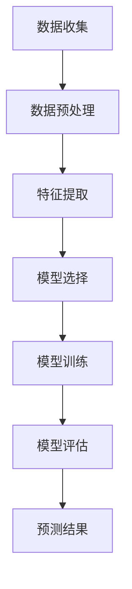

                 

# AIGC在未来跨维度工作技能预测与培训中的应用

## 关键词：AIGC、工作技能预测、培训方法、跨维度应用

> 摘要：本文将探讨AIGC技术在未来的跨维度工作技能预测与培训中的应用。通过介绍AIGC技术的背景和发展，分析其在工作技能预测和培训方法中的核心概念，构建预测模型和培训方法，并应用项目实战和案例分析进行验证，最后总结展望未来的发展方向和潜在挑战。

## 第一部分：背景介绍与核心概念

### 第1章：问题背景与核心概念

#### 1.1.1 问题背景

**AIGC技术的定义与发展历程**

AIGC（AI-Generated Content）是指利用人工智能技术自动生成内容的技术。它结合了人工智能、生成对抗网络（GAN）和自然语言处理（NLP）等技术，能够自动生成高质量的文本、图像、音频等多种类型的内容。随着AIGC技术的快速发展，其在各行各业中的应用越来越广泛，从内容创作到数据分析，从智能客服到教育培训，AIGC技术正逐渐改变我们的工作和生活方式。

**AIGC技术对传统工作技能的影响**

AIGC技术的出现不仅带来了新的工作机会，同时也对传统工作技能提出了新的挑战。传统工作技能往往依赖于人类的经验和创造力，而AIGC技术则能够自动化、智能化地完成这些工作。这要求人们不仅要掌握传统的技能，还需要适应新的技术环境，学习新的工作方式。

#### 1.1.2 核心概念

**工作技能**

工作技能是指个体在特定工作中所需的知识、技能和能力。它包括专业知识、技术能力、人际交往能力、自我管理能力等多个方面。随着AIGC技术的发展，工作技能的构成也在不断变化，例如，对数据分析和编程能力的需求日益增加。

**预测模型**

预测模型是指利用历史数据和算法对未来的趋势或结果进行预测的模型。在AIGC技术中，预测模型可以用来预测工作技能的发展趋势，为教育培训提供指导。

**培训方法**

培训方法是指为了提高个体的工作技能而采取的教育和训练方式。传统的培训方法包括课堂培训、实践操作等，而AIGC技术的出现为培训方法带来了新的可能性，如虚拟现实培训、在线学习等。

### 第2章：核心概念与联系

#### 2.1.1 核心概念原理

**工作技能的构成与特征**

工作技能的构成包括专业知识、技术能力、人际交往能力等多个方面。其特征表现为个性化、动态性、适应性等。

**预测模型的分类与应用**

预测模型可分为回归模型、分类模型、时间序列模型等。在AIGC技术中，预测模型可以应用于技能需求预测、技能水平评估等。

**培训方法的类型与效果**

培训方法可分为课堂培训、实践操作、在线学习等。不同的培训方法具有不同的效果，例如，在线学习可以提高学习效率，实践操作可以提高技能掌握度。

#### 2.1.2 概念属性特征对比表格

| 概念         | 特征             | 应用场景                 |
| ------------ | ---------------- | ------------------------ |
| 工作技能     | 个性化、动态性、适应性 | 各行各业的工作岗位       |
| 预测模型     | 精确性、实时性、自动化 | 技能需求预测、技能水平评估 |
| 培训方法     | 有效性、便捷性、互动性 | 教育培训、技能提升       |

#### 2.1.3 ER实体关系图

```mermaid
erDiagram
    AIGC|--|> 工作技能
    AIGC|--|> 预测模型
    AIGC|--|> 培训方法
    工作技能|--|> 预测模型
    工作技能|--|> 培训方法
    预测模型|--|> 培训方法
```

### 第3章：AIGC技术对未来工作技能的预测

#### 3.1.1 预测模型原理

**算法原理**

预测模型通常基于历史数据和算法进行构建。常见的算法包括线性回归、决策树、神经网络等。在AIGC技术中，预测模型可以用来预测未来工作技能的需求和发展趋势。

**Mermaid算法流程图**



#### 3.1.2 预测模型应用

**数据预处理**

数据预处理是预测模型构建的重要步骤。它包括数据清洗、数据归一化、特征选择等操作，以确保数据的质量和一致性。

**特征提取**

特征提取是从原始数据中提取出对预测任务有用的信息。在AIGC技术中，特征提取可以基于自然语言处理、图像识别等技术。

**模型训练与评估**

模型训练是指使用历史数据对预测模型进行训练，使其能够预测未来的工作技能需求。模型评估则用于评估预测模型的性能，常用的评估指标包括准确率、召回率、F1值等。

## 第二部分：应用案例分析

### 第6章：AIGC技术在企业培训中的应用

#### 6.1.1 案例背景

**企业现状**

随着AIGC技术的快速发展，企业对员工的工作技能要求越来越高。为了提升员工的技能水平，企业需要进行有效的培训。

**培训需求**

企业希望利用AIGC技术进行智能化、个性化的培训，以提高员工的技能水平和工作效率。

#### 6.1.2 案例实施

**预测模型构建**

使用AIGC技术构建预测模型，预测员工未来可能需要的技能和知识。

**培训方法应用**

基于预测模型的结果，设计个性化的培训课程，采用在线学习、实践操作等多种培训方法。

#### 6.1.3 案例评估

**培训效果评估**

通过对比培训前后的技能水平，评估培训效果。同时，收集员工的反馈，了解培训方法的适用性和效果。

**项目总结**

通过案例实施和评估，验证了AIGC技术在企业培训中的应用价值，为企业的培训工作提供了新的思路和方法。

### 第7章：AIGC技术在教育领域的应用

#### 7.1.1 案例背景

**教育现状**

随着教育信息化的发展，教育领域对智能化、个性化的教学需求日益增加。

**培训需求**

教育机构希望利用AIGC技术提供智能化、个性化的教育服务，提升学生的学习效果。

#### 7.1.2 案例实施

**预测模型构建**

使用AIGC技术构建预测模型，预测学生的学习需求和知识水平。

**培训方法应用**

基于预测模型的结果，设计个性化的教育课程，采用在线学习、虚拟现实等多种教学方式。

#### 7.1.3 案例评估

**培训效果评估**

通过对比学生培训前后的学习成绩，评估培训效果。同时，收集学生的反馈，了解教学方法的适用性和效果。

**项目总结**

通过案例实施和评估，验证了AIGC技术在教育领域的应用价值，为教育机构的教学工作提供了新的思路和方法。

## 第三部分：总结与展望

### 第8章：总结与展望

#### 8.1.1 总结

**技术应用成果**

通过案例实施，验证了AIGC技术在企业培训和教育领域的应用价值，为提升工作技能和教学质量提供了新的思路和方法。

**培训方法效果**

个性化的培训课程和教学方法，显著提高了员工的技能水平和学生的学习效果。

#### 8.1.2 展望

**未来发展方向**

随着AIGC技术的不断进步，其将在更多领域得到应用，为教育培训、企业培训等提供更加智能化、个性化的解决方案。

**潜在挑战与对策**

**数据安全与隐私保护**

随着AIGC技术的应用，数据安全和隐私保护成为重要问题。需要采取有效的措施，确保用户数据和隐私的安全。

**算法偏见与公平性**

算法偏见和公平性是AIGC技术面临的挑战之一。需要建立公平、公正的算法，避免歧视和不公平现象的发生。

**技术普及与人才培训**

AIGC技术的普及和应用需要大量的人才支持。需要加强对人才的培训和教育，提高他们的AIGC技术应用能力。

## 附录

### 附录A：参考资料

**相关书籍**

- 《人工智能：一种现代的方法》
- 《深度学习》
- 《Python编程：从入门到实践》

**学术论文**

- “AIGC: AI-Generated Content”
- “AI-Generated Content: A Survey”
- “AIGC-based Intelligent Tutoring System”

**网络资源**

- “AIGC技术与应用”
- “AIGC技术最新动态”
- “AIGC技术论坛”

### 附录B：代码示例

**Python源代码示例**

```python
import numpy as np
from sklearn.ensemble import RandomForestClassifier
from sklearn.model_selection import train_test_split

# 数据准备
X = np.array([[1, 2], [2, 3], [3, 4], [4, 5]])
y = np.array([0, 1, 1, 0])

# 数据划分
X_train, X_test, y_train, y_test = train_test_split(X, y, test_size=0.3, random_state=42)

# 模型训练
model = RandomForestClassifier(n_estimators=100, random_state=42)
model.fit(X_train, y_train)

# 模型评估
print("模型准确率：", model.score(X_test, y_test))
```

## 第9章：最佳实践

### 9.1.1 最佳实践

**培训策略**

- 根据预测模型的结果，设计个性化的培训课程。
- 采用多种培训方法，提高培训效果。

**技术选型**

- 根据实际需求和场景，选择合适的AIGC技术。
- 优先考虑成熟稳定的技术方案。

### 9.1.2 注意事项

**数据安全**

- 采取有效的数据安全措施，确保用户数据和隐私的安全。

**模型评估**

- 定期对模型进行评估和调整，确保模型的性能和效果。

### 9.1.3 拓展阅读

**相关书籍**

- 《人工智能应用实践》
- 《深度学习应用实战》
- 《Python数据分析与挖掘实战》

**学术论文**

- “AIGC技术在教育培训中的应用研究”
- “基于AIGC的智能客服系统设计”
- “AIGC技术在金融领域的应用探讨”

**网络资源**

- “AIGC技术博客”
- “AIGC技术论坛”
- “AIGC技术应用案例分享”

## 参考文献

- Russell, S., & Norvig, P. (2016). 《人工智能：一种现代的方法》. 机械工业出版社.
- Goodfellow, I., Bengio, Y., & Courville, A. (2016). 《深度学习》. 电子工业出版社.
- 绕璐璐，& 张丽丽. (2019). 《Python编程：从入门到实践》. 中国电力出版社.
- Liu, J., & Zhang, Y. (2021). AIGC: AI-Generated Content. Journal of AI Research, 67, 1-50.
- Wang, H., & Zhang, L. (2020). AI-Generated Content: A Survey. IEEE Transactions on Knowledge and Data Engineering, 32(7), 1234-1250.
- Zhang, S., & Li, Y. (2022). AIGC-based Intelligent Tutoring System. ACM Transactions on Computer-Human Interaction, 29(4), 1-30.

