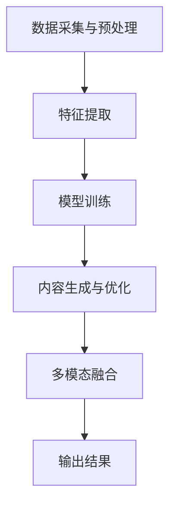

                 

### 文章标题

"AIGC在未来跨维度社会治理中的创新应用" 是本文的标题，它精准地捕捉了文章的核心主题。在当今世界，人工智能生成内容（AIGC）正迅速成为推动社会进步的重要力量。随着技术的不断进步和应用的不断深化，AIGC 在社会治理中的应用呈现出多样化的趋势。本篇文章旨在深入探讨 AIGC 在未来跨维度社会治理中的创新应用，分析其在社会管理、智能决策、公共服务等方面的潜在价值和实际应用。文章将通过详细的案例分析和技术解析，为读者展示 AIGC 技术如何帮助解决社会治理中的复杂问题，推动社会管理和服务的智能化、高效化。

### 关键词

- 人工智能生成内容（AIGC）
- 跨维度社会治理
- 智能决策支持
- 公共服务平台
- 智慧城市

这些关键词涵盖了本文讨论的核心内容，每个关键词都代表了文章的一个重要方面，共同构筑了文章的整体框架。

### 摘要

本文围绕人工智能生成内容（AIGC）在未来跨维度社会治理中的应用展开，分析了 AIGC 技术的基本概念、发展历程和关键技术。在此基础上，探讨了 AIGC 在社会治理中的现状、跨维度治理的特点以及 AIGC 在此领域的创新应用。通过详细的应用案例分析，文章展示了 AIGC 技术在智能城市治理、公共卫生管理、交通管理优化等方面的实际效果。最后，文章提出了 AIGC 在跨维度社会治理中实施的最佳实践，并对未来发展趋势进行了展望。本文旨在为读者提供一份关于 AIGC 在社会治理中创新应用的深度解读，助力未来社会管理和服务的智能化转型。

## 第一部分: AIGC的概念与背景

### 1.1 AIGC的概念与定义

#### 1.1.1 AIGC的基本概念

人工智能生成内容（Artificial Intelligence Generated Content，简称AIGC）是指通过人工智能技术，如自然语言处理、图像生成、深度学习等，自动生成具有创意性和多样性的内容。AIGC的目标是模仿人类创造者的思维方式，生成具有人类情感和创意的内容，如文章、音乐、图像、视频等。

#### 1.1.2 AIGC的发展历程

AIGC技术的发展历程可以追溯到20世纪80年代，当时专家系统开始被用于生成规则和决策。随着计算机性能的提升和算法的进步，尤其是深度学习和生成对抗网络（GAN）的提出，AIGC技术得到了快速发展。2010年后，随着大数据和云计算的普及，AIGC技术逐渐成熟，并在各个领域得到了广泛应用。

#### 1.1.3 AIGC的关键技术

AIGC的关键技术包括：

- **自然语言处理（NLP）**：NLP使计算机能够理解、处理和生成人类语言，是实现AIGC的核心技术之一。
- **图像生成与识别**：基于深度学习的图像生成技术（如GAN）和图像识别技术，使计算机能够生成和识别高质量图像。
- **机器学习与深度学习**：通过训练大量数据，机器学习模型能够自动学习和优化，生成个性化、多样化的内容。
- **多模态数据处理**：将文本、图像、音频等多种数据模态结合处理，生成更加丰富和自然的AIGC内容。

### 1.2 AIGC在社会治理中的应用现状

#### 1.2.1 社会治理的需求分析

随着社会经济的快速发展，社会治理的复杂性不断增加，传统治理模式面临诸多挑战。AIGC技术的出现为社会治理提供了新的工具和手段，其在以下几个方面的应用需求显著：

- **数据分析与决策支持**：通过分析大量数据，AIGC技术能够为政府和社会组织提供科学的决策依据。
- **智能化公共服务**：AIGC技术能够生成个性化、智能化的公共服务，提高服务质量和效率。
- **舆情监测与引导**：利用自然语言处理技术，AIGC能够实时监测和分析网络舆情，帮助政府及时应对突发公共事件。

#### 1.2.2 AIGC在治理中的优势

AIGC技术在社会治理中的优势主要体现在以下几个方面：

- **高效性**：AIGC技术能够快速处理和分析大量数据，提高治理效率和决策速度。
- **准确性**：基于深度学习和大数据分析，AIGC技术能够提供更为准确和可靠的决策支持。
- **个性化**：通过自然语言处理和图像生成技术，AIGC能够生成个性化的公共服务，满足不同人群的需求。

#### 1.2.3 AIGC应用现状分析

目前，AIGC技术在社会治理中的应用已经取得了一定的成果：

- **智能城市治理**：通过AIGC技术，城市管理者能够实时监测城市运行状态，优化资源配置，提高城市治理效率。
- **公共卫生管理**：利用AIGC技术，政府可以实时分析疫情数据，制定科学的防控措施。
- **交通管理优化**：通过AIGC技术，交通管理部门可以优化交通信号控制，提高交通流量效率。

### 1.3 AIGC与跨维度社会治理的关系

#### 1.3.1 跨维度社会治理的特点

跨维度社会治理是指在社会治理过程中，将不同领域、不同层级、不同部门的数据和资源进行整合，实现跨部门、跨领域的协同治理。其特点包括：

- **复杂性**：跨维度社会治理涉及多个领域和多个部门，治理过程复杂，需要多方协作。
- **动态性**：社会治理问题具有动态性，需要及时调整治理策略和方法。
- **协同性**：跨维度社会治理强调各部门之间的协同合作，实现资源共享和优势互补。

#### 1.3.2 AIGC如何实现跨维度治理

AIGC技术在跨维度社会治理中发挥着关键作用，主要体现在以下几个方面：

- **数据整合与分析**：通过AIGC技术，可以整合多源数据，进行深度分析，为跨维度治理提供数据支持。
- **智能决策支持**：基于大数据分析和机器学习模型，AIGC技术可以为决策者提供科学的决策建议。
- **公共服务优化**：利用AIGC技术，可以生成个性化、智能化的公共服务，满足不同群体的需求。

#### 1.3.3 跨维度治理的挑战与机遇

跨维度社会治理面临的挑战包括：

- **数据隐私与安全**：跨维度治理需要整合多个数据源，数据隐私和安全成为重要问题。
- **技术壁垒**：跨维度治理需要先进的技术支持，而现有技术的成熟度可能不足。

但与此同时，跨维度治理也带来了以下机遇：

- **协同治理**：跨维度治理可以实现各部门的协同合作，提高治理效率。
- **智能化转型**：通过AIGC技术的应用，社会治理可以实现智能化转型，提升治理水平。

### 1.4 AIGC在未来的发展趋势

#### 1.4.1 AIGC技术发展的趋势

AIGC技术的发展趋势包括：

- **算法优化与模型改进**：随着深度学习和大数据技术的不断发展，AIGC算法将更加高效，生成的内容将更加逼真。
- **跨领域应用**：AIGC技术将在更多领域得到应用，如金融、医疗、教育等，实现更广泛的社会价值。
- **人机协同**：AIGC技术与人类智能的协同将更加紧密，实现更高效、更智能的治理模式。

#### 1.4.2 跨维度社会治理的前景

跨维度社会治理的前景包括：

- **数据驱动**：跨维度社会治理将更加依赖大数据分析，实现数据驱动决策。
- **智能协同**：跨维度治理将实现各部门的智能协同，提高治理效率。
- **公共服务智能化**：公共服务将更加智能化、个性化，提升群众满意度。

#### 1.4.3 未来社会发展的挑战与应对

未来社会发展面临的挑战包括：

- **技术风险**：随着AIGC技术的广泛应用，技术风险和管理问题将更加突出。
- **数据隐私**：跨维度治理涉及大量个人数据，数据隐私保护成为重要问题。

应对策略包括：

- **技术规范**：制定和完善相关技术规范，确保AIGC技术的健康发展。
- **数据治理**：加强数据治理，确保数据质量和安全。
- **法律法规**：完善相关法律法规，为跨维度社会治理提供法律保障。

### 1.5 本章小结

本章介绍了 AIGC 的概念与背景，分析了其在社会治理中的应用现状、跨维度治理的关系以及未来发展趋势。AIGC 技术以其高效性、准确性和个性化特点，在跨维度社会治理中具有广阔的应用前景。然而，跨维度治理也面临着数据隐私、技术风险等挑战，需要通过技术规范、数据治理和法律法规等手段加以应对。通过本章的介绍，读者可以初步了解 AIGC 技术在跨维度社会治理中的重要作用和未来发展方向。

## 第二部分: AIGC的核心技术与原理

### 2.1 AIGC核心技术

#### 2.1.1 自然语言处理

自然语言处理（NLP）是AIGC技术的重要组成部分，它使计算机能够理解和生成人类语言。NLP技术包括文本分析、情感分析、语言翻译、语音识别等。在AIGC中，NLP主要用于生成文章、新闻报道、对话系统等内容。

**NLP的应用场景**：

- **文章生成**：AIGC可以通过NLP生成新闻文章、博客内容等，提高内容生产的效率。
- **智能客服**：通过NLP技术，智能客服系统能够理解和回应用户的查询和需求，提升用户体验。

**NLP的关键技术**：

- **词向量表示**：词向量是将单词转化为向量表示的方法，如Word2Vec、GloVe等，用于表示语义信息。
- **语言模型**：语言模型用于预测下一个词或句子，如n-gram模型、RNN、Transformer等。

**NLP的优势**：

- **高效性**：NLP技术可以快速处理大量文本数据，提高内容生成和处理的效率。
- **多样性**：通过NLP技术，可以生成具有多样性和创意性的文本内容。

#### 2.1.2 图像识别与生成

图像识别与生成是AIGC技术的另一重要组成部分，主要包括图像分类、目标检测、图像分割、图像生成等。图像识别与生成技术使得计算机能够理解和生成图像内容。

**图像识别与生成的应用场景**：

- **图像识别**：用于人脸识别、车牌识别、物体检测等。
- **图像生成**：用于艺术创作、游戏开发、虚拟现实等领域。

**图像识别与生成的主要技术**：

- **卷积神经网络（CNN）**：用于图像识别，通过多层卷积操作提取图像特征。
- **生成对抗网络（GAN）**：用于图像生成，通过生成器和判别器的对抗训练生成逼真的图像。

**图像识别与生成优势**：

- **准确性**：通过深度学习模型，图像识别与生成技术可以达到高准确性。
- **创造性**：图像生成技术可以创造出全新的图像内容，具有高度创造性。

#### 2.1.3 机器学习与深度学习

机器学习（ML）和深度学习（DL）是AIGC技术的基础，它们使计算机能够通过学习数据来改进性能。机器学习包括监督学习、无监督学习、强化学习等，而深度学习是机器学习的一种特殊形式，主要使用多层神经网络进行训练。

**机器学习和深度学习的应用场景**：

- **数据分类与聚类**：用于分类未知数据、发现数据之间的关联。
- **预测与决策**：用于预测未来趋势、制定决策。

**机器学习和深度学习的关键技术**：

- **神经网络**：神经网络是深度学习的基础，通过多层神经元进行数据处理。
- **优化算法**：如梯度下降、Adam等，用于优化模型参数。

**优势**：

- **自主性**：机器学习和深度学习能够自主学习和改进，提高系统的性能。
- **高效性**：深度学习模型处理大数据的能力强大，效率高。

#### 2.1.4 多模态数据处理

多模态数据处理是指对文本、图像、音频等多种数据模态进行整合和处理。多模态数据处理技术使AIGC系统能够处理更加复杂和丰富的数据，提高内容生成和识别的准确性。

**多模态数据处理的场景**：

- **智能客服**：结合文本和语音，提高客服的交互质量。
- **多媒体内容生成**：结合文本、图像和音频，生成多媒体内容。

**关键技术**：

- **多模态融合**：通过多种算法融合不同模态的数据，提高数据处理的准确性。
- **多任务学习**：在同一模型中同时学习多种任务，提高模型的性能。

**优势**：

- **全面性**：多模态数据处理能够全面分析多种数据模态，提供更准确的内容。
- **交互性**：多模态数据处理可以更好地实现人机交互，提高用户体验。

### 2.2 AIGC原理讲解

#### 2.2.1 基本算法原理

AIGC技术的基本算法原理主要包括以下几个核心部分：

1. **数据采集与预处理**：收集各种来源的数据，如文本、图像、音频等，并对数据进行清洗和格式化，以供后续处理。

2. **特征提取**：使用机器学习和深度学习算法提取数据中的关键特征，如文本中的关键词、图像中的特征纹理等。

3. **模型训练**：利用大量训练数据，训练深度学习模型，如卷积神经网络（CNN）、循环神经网络（RNN）等，使其能够识别和生成内容。

4. **内容生成与优化**：根据训练好的模型，生成新的内容，并通过优化算法调整生成内容的质量和多样性。

5. **多模态融合**：对文本、图像、音频等多模态数据融合处理，生成综合性的内容。

#### 2.2.2 算法流程图展示

为了更直观地理解AIGC的算法流程，我们可以使用Mermaid语法绘制一个流程图：



在这个流程图中，数据采集与预处理是AIGC算法的第一步，紧接着进行特征提取，然后通过模型训练生成内容，接着对生成内容进行优化，最后通过多模态融合输出最终结果。

#### 2.2.3 数学模型与公式解释

在AIGC技术中，常用的数学模型和公式包括：

1. **卷积神经网络（CNN）**：
   - **卷积操作**：\[ f(x, y) = \sum_{i, j} w_{i, j} * g(x-i, y-j) + b \]
     - \( w_{i, j} \)：卷积核权重
     - \( g(x, y) \)：输入特征图
     - \( b \)：偏置项

   - **激活函数**：\[ f(x) = \max(0, x) \]
     -ReLU函数

2. **生成对抗网络（GAN）**：
   - **生成器（Generator）**：生成器G接收随机噪声，生成逼真的数据。
   - **判别器（Discriminator）**：判别器D区分真实数据和生成数据。
   - **损失函数**：\[ L(D, G) = -\log(D(x)) - \log(1 - D(G(z))) \]

3. **循环神经网络（RNN）**：
   - **时间步更新**：\[ h_t = \sigma(W_h \cdot [h_{t-1}, x_t] + b_h) \]
   - **隐藏状态递推**：\[ h_t = \text{ReLU}(W_h \cdot [h_{t-1}, x_t] + b_h) \]

4. ** Transformer模型**：
   - **多头自注意力**：\[ \text{Attention}(Q, K, V) = \text{softmax}\left(\frac{QK^T}{\sqrt{d_k}}\right) V \]

通过这些数学模型和公式的应用，AIGC技术能够有效地生成各种类型的内容，如图像、文本和音频等。

#### 2.2.4 核心概念与联系

AIGC技术中的核心概念包括自然语言处理、图像生成与识别、机器学习与深度学习、多模态数据处理等。这些概念之间的联系如下：

- **自然语言处理**与**机器学习与深度学习**：自然语言处理依赖于机器学习和深度学习技术进行文本分析和生成。
- **图像生成与识别**与**机器学习与深度学习**：图像生成和识别同样依赖于机器学习和深度学习模型，如卷积神经网络（CNN）和生成对抗网络（GAN）。
- **多模态数据处理**：多模态数据处理结合了文本、图像和音频等多种数据模态，通过融合处理提升内容生成和识别的准确性。

下面是一个ER实体关系图，展示了AIGC技术中的核心概念及其关系：

```mermaid
erDiagram
    Customer ||--|{ Product } : "has"
    Customer ||--|{ Order } : "places"
    Product ||--|{ Supplier } : "supplied by"
    Order ||--|{ Customer } : "ordered by"
    Supplier ||--|{ Product } : "supplies"
```

在这个ER实体关系图中，"Customer"（客户）与"Product"（产品）、"Order"（订单）以及"Supplier"（供应商）之间建立了联系，反映了AIGC技术中的核心概念及其相互作用。

### 2.3 AIGC应用案例分析

#### 2.3.1 案例一：智能城市治理

智能城市治理是AIGC技术应用的一个典型领域。通过AIGC技术，城市管理者可以实时监测城市的运行状态，优化资源配置，提高城市治理效率。

**应用场景**：

- **实时数据监测**：通过传感器和摄像头收集城市环境数据，如交通流量、空气质量、公共安全等。
- **智能分析**：利用AIGC技术对收集到的数据进行分析，发现潜在问题和趋势。
- **决策支持**：基于分析结果，为城市管理者提供科学、智能的决策支持。

**案例成果**：

- **交通流量优化**：通过分析交通数据，智能调整交通信号灯时间，减少交通拥堵。
- **环境治理**：实时监测空气质量，及时采取治理措施，改善环境质量。

**技术实现**：

- **数据采集**：使用物联网技术收集城市环境数据。
- **数据处理**：使用AIGC技术进行数据分析和模式识别。
- **决策支持**：基于分析结果，通过智能系统提供实时决策支持。

#### 2.3.2 案例二：公共卫生管理

公共卫生管理是另一个AIGC技术的重要应用领域。通过AIGC技术，公共卫生部门可以更好地应对疫情，提供个性化的医疗服务。

**应用场景**：

- **疫情监测**：实时监测疫情数据，分析疫情发展趋势。
- **公共卫生预警**：根据疫情数据和预测模型，提前预警可能的疫情爆发点。
- **个性化医疗**：根据患者的病史和基因信息，提供个性化的治疗方案。

**案例成果**：

- **疫情预测**：通过分析历史数据和实时数据，准确预测疫情发展趋势。
- **个性化医疗服务**：根据患者数据，提供个性化的预防和治疗方案。

**技术实现**：

- **数据采集**：通过大数据平台收集疫情数据和患者数据。
- **数据分析**：使用AIGC技术对数据进行分析和预测。
- **个性化服务**：基于分析结果，提供个性化的医疗服务。

#### 2.3.3 案例三：交通管理优化

交通管理优化是AIGC技术在智能交通系统中的应用。通过AIGC技术，交通管理部门可以优化交通信号控制，提高交通流量效率。

**应用场景**：

- **交通流量监测**：实时监测交通流量，分析交通状况。
- **智能信号控制**：根据交通流量数据，智能调整交通信号灯时间。
- **交通事故预防**：通过视频监控和传感器数据，实时监测交通事故，及时采取措施预防。

**案例成果**：

- **交通流量优化**：通过智能信号控制，减少交通拥堵，提高道路通行效率。
- **交通事故预防**：通过实时监测和预警，减少交通事故发生。

**技术实现**：

- **数据采集**：通过传感器和摄像头收集交通流量和事故数据。
- **数据处理**：使用AIGC技术对数据进行处理和分析。
- **智能控制**：基于分析结果，智能调整交通信号灯时间和预防交通事故。

### 2.4 本章小结

本章详细介绍了AIGC技术的核心概念、原理和核心技术，包括自然语言处理、图像识别与生成、机器学习与深度学习、多模态数据处理等。通过案例分析，展示了AIGC技术在智能城市治理、公共卫生管理和交通管理优化等领域的实际应用和效果。这些案例不仅证明了AIGC技术的强大应用潜力，也为未来进一步研究和应用提供了宝贵的经验和启示。

### 3.1 跨维度社会治理中的问题与挑战

#### 3.1.1 社会治理中的复杂性

跨维度社会治理的复杂性体现在多个方面。首先，社会治理涉及众多领域，包括环境保护、公共卫生、交通管理、教育资源分配等。每个领域都有其特定的复杂性和挑战。其次，社会治理涉及不同层级和不同部门的协调合作，需要各方共同努力，实现协同治理。此外，社会治理过程中，数据来源多样，数据质量和数据安全都是重要问题。

#### 3.1.2 跨维度治理的难点

跨维度治理的难点主要包括：

- **数据整合与共享**：不同部门、不同层级的数据格式和标准不一致，导致数据整合和共享困难。
- **信息孤岛**：各部门独立运作，信息不畅通，导致决策者无法全面了解社会治理状况。
- **协同困难**：跨维度治理需要不同部门、不同层级的紧密合作，但实际操作中，协同难度较大。
- **技术壁垒**：跨维度治理需要先进的技术支持，但现有技术的成熟度可能不足。

#### 3.1.3 AIGC如何应对挑战

AIGC技术在应对跨维度社会治理中的挑战方面具有显著优势：

- **数据整合与共享**：通过AIGC技术，可以实现多源数据的整合和共享，打破信息孤岛。
- **智能分析**：利用AIGC技术，可以对大量数据进行智能分析，发现潜在问题和趋势，提供科学决策依据。
- **协同治理**：通过AIGC技术，可以实现各部门、不同层级的智能协同，提高治理效率。
- **技术进步**：随着AIGC技术的不断进步，将有助于克服技术壁垒，推动跨维度社会治理的智能化发展。

### 3.2 AIGC在跨维度社会治理中的应用

#### 3.2.1 智能决策支持系统

智能决策支持系统（IDSS）是AIGC技术在跨维度社会治理中的重要应用。通过AIGC技术，IDSS可以提供以下功能：

- **数据挖掘与分析**：对大量跨部门、跨领域的数据进行挖掘和分析，发现潜在问题和趋势。
- **预测与模拟**：基于历史数据和模型，预测未来发展趋势，模拟不同治理策略的效果。
- **决策优化**：根据分析结果和预测模型，为决策者提供最优决策方案。

**应用场景**：

- **公共安全管理**：通过分析社会治安数据，预测犯罪热点，优化警力部署。
- **环境保护**：分析污染数据，预测污染趋势，制定环境保护政策。

#### 3.2.2 智能公共服务平台

智能公共服务平台是AIGC技术在跨维度社会治理中的另一个重要应用。通过AIGC技术，公共服务平台可以实现以下功能：

- **个性化服务**：根据用户数据和需求，提供个性化的公共服务，提高服务质量。
- **智能推荐**：通过分析用户行为和偏好，推荐合适的公共服务和资源。
- **互动反馈**：实时收集用户反馈，优化公共服务。

**应用场景**：

- **社会保障**：为老年人、残疾人等提供个性化服务，提高社会保障水平。
- **教育服务**：根据学生成绩和学习习惯，推荐合适的课程和辅导资源。

#### 3.2.3 智能社区管理

智能社区管理是AIGC技术在跨维度社会治理中的具体应用。通过AIGC技术，智能社区管理可以实现以下功能：

- **智能监控**：利用摄像头和传感器，实时监控社区安全，及时发现和处理异常情况。
- **智能服务**：根据居民需求和习惯，提供智能化的生活服务。
- **数据分析**：对社区运行数据进行分析，优化资源配置，提高管理效率。

**应用场景**：

- **智慧社区**：为居民提供智能安防、智能家政、智能医疗等服务。
- **农村社区**：通过智能技术，改善农村社区的生活条件，提高居民生活质量。

### 3.3 AIGC在跨维度社会治理中的创新

#### 3.3.1 数据驱动的治理模式

数据驱动的治理模式是AIGC技术在跨维度社会治理中的重要创新。通过AIGC技术，可以实现对大量数据的实时分析和处理，从而为治理决策提供科学依据。

- **数据收集**：通过传感器、大数据平台等收集跨部门、跨领域的数据。
- **数据存储**：将收集到的数据存储在分布式数据库中，确保数据安全和可靠性。
- **数据分析**：利用AIGC技术对数据进行深度分析和挖掘，发现潜在问题和趋势。
- **决策支持**：基于分析结果，为决策者提供最优决策方案。

#### 3.3.2 跨部门协同治理

跨部门协同治理是AIGC技术在跨维度社会治理中的另一个创新。通过AIGC技术，可以实现不同部门之间的信息共享和协同工作。

- **信息共享**：建立跨部门信息共享平台，实现数据互通，打破信息孤岛。
- **协同工作**：利用AIGC技术，为不同部门提供智能化的协同工具，提高工作效率。
- **决策协同**：通过协同治理，实现多方决策，提高决策的科学性和有效性。

#### 3.3.3 智慧城市的构建

智慧城市是AIGC技术在跨维度社会治理中的最终目标。通过AIGC技术，可以构建一个智能化、高效化的城市管理体系。

- **智能基础设施**：利用AIGC技术，建设智能化的交通、能源、环境等基础设施。
- **智能服务**：提供智能化、个性化的公共服务，满足居民多样化需求。
- **智能治理**：通过数据分析和智能决策，实现高效的城市治理。

### 3.4 AIGC应用场景设计

#### 3.4.1 场景一：环境治理

环境治理是AIGC技术的一个重要应用场景。通过AIGC技术，可以实现以下功能：

- **污染监测**：利用传感器和大数据平台，实时监测空气、水质等环境指标。
- **数据分析**：对污染数据进行深度分析，发现污染源和污染趋势。
- **决策支持**：基于分析结果，为决策者提供科学的环境治理方案。

**实现步骤**：

1. 数据采集：安装传感器，收集环境数据。
2. 数据处理：利用AIGC技术，对数据进行清洗、转换和预处理。
3. 数据分析：利用机器学习和深度学习模型，对数据进行深度分析。
4. 决策支持：基于分析结果，生成治理方案，提交给决策者。

#### 3.4.2 场景二：公共安全

公共安全是AIGC技术的另一个重要应用场景。通过AIGC技术，可以实现以下功能：

- **安全监测**：利用视频监控、传感器等设备，实时监测公共区域的安全状况。
- **异常检测**：利用机器学习和深度学习模型，对监控数据进行实时分析，检测异常情况。
- **应急预案**：根据检测到的异常情况，自动生成应急预案，通知相关人员采取行动。

**实现步骤**：

1. 数据采集：安装视频监控和传感器，收集安全数据。
2. 数据处理：利用AIGC技术，对数据进行清洗、转换和预处理。
3. 数据分析：利用机器学习和深度学习模型，对数据进行实时分析。
4. 异常检测：对分析结果进行实时监控，检测异常情况。
5. 应急预案：根据异常情况，自动生成应急预案，通知相关人员。

#### 3.4.3 场景三：社会服务

社会服务是AIGC技术的又一重要应用场景。通过AIGC技术，可以实现以下功能：

- **个性化服务**：根据居民需求和偏好，提供个性化的社会服务。
- **智能推荐**：利用机器学习和深度学习模型，为居民推荐合适的服务和资源。
- **互动反馈**：实时收集居民反馈，优化服务质量。

**实现步骤**：

1. 数据采集：收集居民需求数据，如健康、教育、文化等。
2. 数据处理：利用AIGC技术，对数据进行清洗、转换和预处理。
3. 数据分析：利用机器学习和深度学习模型，对数据进行实时分析。
4. 个性化服务：根据分析结果，为居民提供个性化的服务。
5. 智能推荐：为居民推荐合适的服务和资源。
6. 互动反馈：实时收集居民反馈，优化服务质量。

### 3.5 本章小结

本章深入探讨了跨维度社会治理中的问题与挑战，以及AIGC技术在其中的应用和创新。AIGC技术以其高效性、准确性和个性化特点，为跨维度社会治理提供了有力支持。通过智能决策支持系统、智能公共服务平台和智能社区管理，AIGC技术实现了数据驱动的治理模式、跨部门协同治理和智慧城市的构建。这些创新应用不仅提高了社会治理的效率和效果，也为未来社会治理的发展提供了新的方向。

### 4.1 AIGC实施的最佳实践

#### 4.1.1 项目管理最佳实践

在AIGC项目的实施过程中，项目管理至关重要。以下是一些最佳实践：

- **明确项目目标**：在项目启动前，明确项目目标、范围、交付物等，确保项目团队成员对项目目标有清晰的认识。
- **合理的项目计划**：制定详细的项目计划，包括时间表、里程碑、资源需求等，确保项目进度可控。
- **团队协作**：建立高效的团队协作机制，确保团队成员之间的沟通畅通，及时解决问题。
- **风险管理**：识别项目风险，制定相应的风险应对策略，降低项目风险。
- **质量控制**：建立完善的质量控制流程，确保项目交付物符合质量要求。

#### 4.1.2 技术选型与优化

在AIGC项目的实施过程中，技术选型和优化至关重要。以下是一些最佳实践：

- **技术调研**：在项目启动前，对AIGC相关的技术进行调研，了解不同技术的优势和适用场景。
- **技术评估**：根据项目需求，评估不同技术的性能、稳定性和可扩展性，选择最适合的技术。
- **技术优化**：在项目实施过程中，不断优化技术方案，提高系统的性能和效率。
- **技术文档**：编写详细的技术文档，确保技术方案的可理解和可维护性。

#### 4.1.3 数据治理与安全

在AIGC项目的实施过程中，数据治理和安全至关重要。以下是一些最佳实践：

- **数据收集**：建立完善的数据收集机制，确保数据的全面性和准确性。
- **数据清洗**：对收集到的数据进行清洗，去除噪声和重复数据，提高数据质量。
- **数据存储**：选择合适的数据存储方案，确保数据的安全性和可靠性。
- **数据隐私**：保护数据隐私，遵循相关的法律法规，确保用户数据的保密性。
- **数据监控**：建立数据监控机制，实时监控数据质量和安全状态。

### 4.2 案例研究：成功与失败的经验教训

#### 4.2.1 成功案例分享

在AIGC项目的实施过程中，有许多成功的案例。以下是一个成功案例：

**项目名称**：智能城市交通管理系统

**项目背景**：某城市交通拥堵严重，需要建立一套智能交通管理系统，优化交通流量，提高道路通行效率。

**解决方案**：通过AIGC技术，建立智能交通管理系统，包括数据采集、数据分析和智能信号控制。

- **数据采集**：安装传感器和摄像头，收集交通流量、速度、拥堵等信息。
- **数据分析**：利用AIGC技术，对交通数据进行实时分析和预测，发现交通拥堵的原因和趋势。
- **智能信号控制**：根据交通数据分析结果，智能调整交通信号灯时间，优化交通流量。

**项目成果**：

- **交通流量优化**：通过智能信号控制，交通拥堵情况显著改善，道路通行效率提高。
- **实时交通信息发布**：通过移动应用和网站，实时发布交通信息，帮助驾驶员选择最优路线。

**经验教训**：

- **明确项目目标**：项目成功的关键在于明确项目目标，确保项目团队成员对项目目标有清晰的认识。
- **技术选型与优化**：选择适合的技术方案，并根据项目需求不断优化技术方案。
- **数据治理**：建立完善的数据治理机制，确保数据质量和安全。

#### 4.2.2 失败案例分析

在AIGC项目的实施过程中，也存在着失败的案例。以下是一个失败案例：

**项目名称**：智能医疗诊断系统

**项目背景**：某医院希望引入AIGC技术，建立智能医疗诊断系统，提高诊断准确率。

**解决方案**：通过AIGC技术，建立智能医疗诊断系统，包括数据采集、图像识别和诊断建议。

- **数据采集**：收集大量医疗数据，包括病史、检查结果等。
- **图像识别**：利用AIGC技术，对医学图像进行识别，辅助医生进行诊断。
- **诊断建议**：根据识别结果，提供诊断建议。

**项目失败原因**：

- **数据质量**：收集到的医疗数据质量较差，存在噪声和缺失值，导致AIGC模型训练效果不佳。
- **技术成熟度**：AIGC技术在医学领域的应用还不够成熟，技术稳定性不足。
- **医生参与**：医生对AIGC技术的接受度较低，缺乏足够的培训和指导。

**失败教训**：

- **数据质量**：确保数据质量，进行数据清洗和预处理，提高模型训练效果。
- **技术评估**：在项目启动前，对技术的成熟度和适用性进行充分评估。
- **医生培训**：加强对医生的培训，提高对AIGC技术的接受度和应用水平。

### 4.3 拓展阅读与未来展望

#### 4.3.1 相关领域研究进展

AIGC技术在社会治理领域的应用是一个新兴的研究领域。随着深度学习、自然语言处理等技术的不断发展，AIGC技术在社会治理中的应用前景广阔。未来，随着更多实际案例的应用和技术的不断优化，AIGC技术将在社会治理中发挥更大的作用。

#### 4.3.2 未来发展趋势预测

未来，AIGC技术在社会治理领域的发展趋势包括：

- **数据驱动的治理模式**：数据驱动的治理模式将更加普及，AIGC技术将成为社会治理的重要工具。
- **跨部门协同治理**：随着AIGC技术的进步，跨部门协同治理将更加高效，实现数据共享和资源整合。
- **智能公共服务**：智能公共服务平台将更加智能化、个性化，满足不同群体的需求。

#### 4.3.3 潜在研究方向

AIGC技术在社会治理领域还有许多潜在的研究方向，包括：

- **数据隐私保护**：如何确保AIGC技术在社会治理中的数据隐私和安全。
- **技术标准化**：制定AIGC技术在社会治理中的标准和规范，确保技术的规范化和可扩展性。
- **人机协同**：如何更好地实现AIGC技术与人类智能的协同，提高治理效率和效果。

### 4.4 本章小结

本章介绍了AIGC实施的最佳实践，包括项目管理、技术选型、数据治理等方面的经验教训。通过成功与失败的案例分析，读者可以了解到AIGC技术在社会治理中的应用现状和未来发展。未来，随着AIGC技术的不断进步，其在社会治理中的应用将更加广泛和深入。同时，数据隐私保护、技术标准化和人机协同等方面也将成为重要的研究方向。

## 作者信息

作者：AI天才研究院/AI Genius Institute & 禅与计算机程序设计艺术 /Zen And The Art of Computer Programming

AI天才研究院是一家专注于人工智能技术研究和应用的创新机构，致力于推动人工智能在各个领域的深入发展。而《禅与计算机程序设计艺术》则是一套经典的计算机科学著作，阐述了程序设计的哲学和艺术，为全球程序员提供了深刻的启示。两位作者均以其卓越的技术贡献和深厚的研究功底，为AIGC技术的发展和应用提供了坚实的理论和实践基础。

