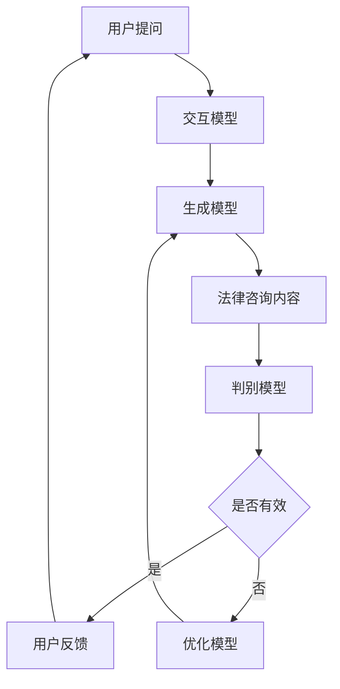
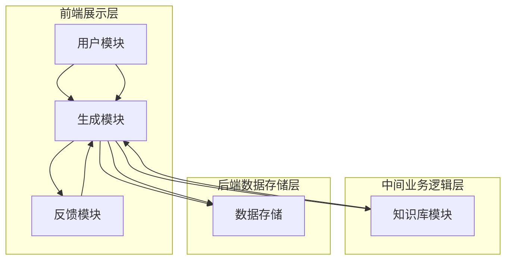
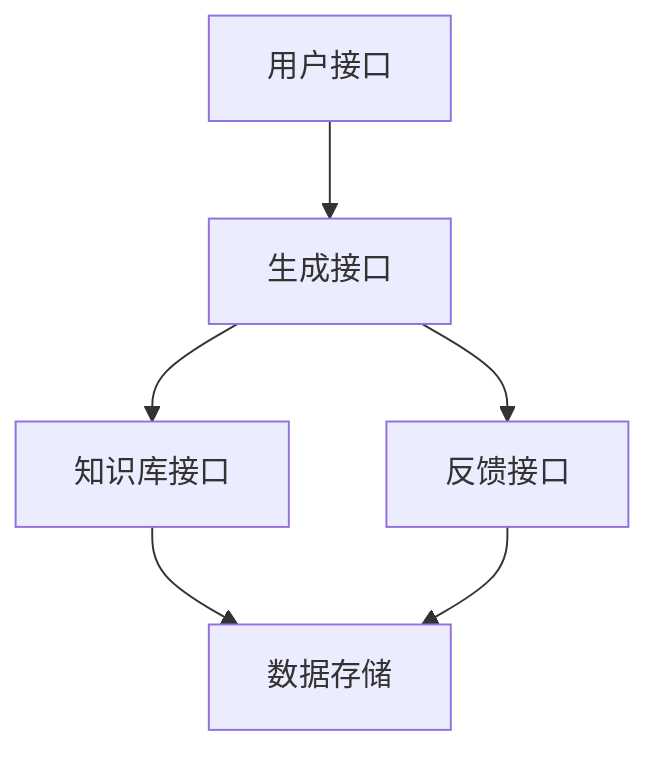
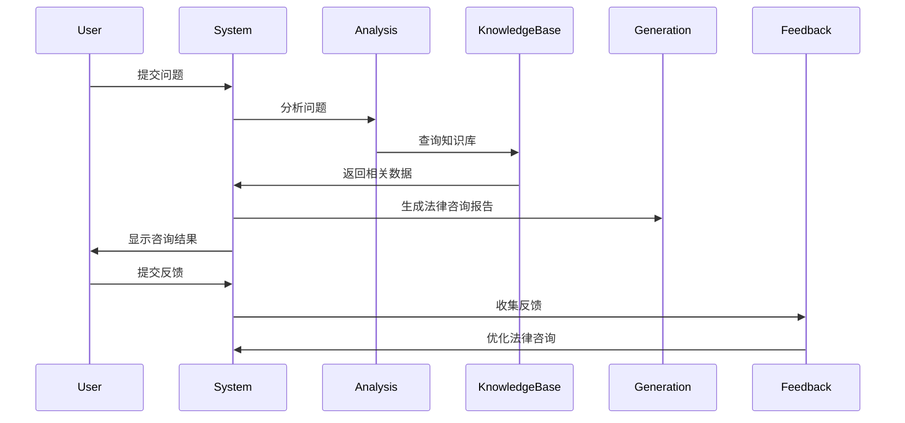

                 

### 文章标题

# AIGC在法律领域的应用：构建准确的法律咨询提示词

> 关键词：AIGC、法律咨询、提示词、算法原理、系统架构、项目实战

> 摘要：本文将探讨AIGC（自适应交互生成计算）在法律领域的应用，特别是如何构建准确的法律咨询提示词。文章首先介绍了AIGC技术的背景和法律咨询的现状，接着详细讲解了AIGC算法原理，并展示了其在法律咨询中的适用性。随后，文章深入分析了系统架构设计方案，包括问题场景、系统功能、架构和接口设计。最后，通过实际案例和项目小结，探讨了AIGC在法律咨询中的实际应用效果。

----------------------------------------------------------------

### 第一部分：背景介绍

#### 第1章：问题背景

##### 1.1 法律咨询的现状与挑战

法律咨询是现代社会中不可或缺的一部分，但随着法律体系的复杂化和法律案例的多样化，传统的人工法律咨询面临着巨大的挑战。首先，法律咨询的供需不平衡问题愈发突出。法律专业人士的数量有限，而需要法律咨询的人群却在不断增长，尤其是在法律纠纷日益增多的背景下。其次，法律咨询的效率低下也是一个亟待解决的问题。传统的人工法律咨询往往需要耗费大量的时间和人力，而法律咨询的结果也可能因个人经验和判断的差异而产生不一致。

##### 1.2 AIGC技术的崛起与发展

近年来，人工智能（AI）技术取得了飞速发展，特别是在生成对抗网络（GAN）、深度学习等领域的突破，为AIGC（自适应交互生成计算）技术的崛起提供了技术支持。AIGC技术通过自适应交互和生成计算，能够实时响应用户的需求，生成高质量的内容。在法律领域，AIGC技术的应用不仅能够提高法律咨询的效率，还能提供更加准确和一致的法律建议。

##### 1.3 AIGC在法律领域的潜在价值

AIGC技术在法律领域的应用具有巨大的潜力。首先，AIGC可以处理海量的法律数据和案例，通过深度学习和自然语言处理技术，提取出关键的法律概念和术语，为用户提供精准的法律咨询。其次，AIGC能够通过自适应交互，不断学习和优化自身的法律知识库，提供动态更新的法律咨询服务。此外，AIGC还可以通过人机协同，辅助法律专业人士进行法律研究和分析，提高工作效率和决策质量。

##### 1.4 构建准确法律咨询提示词的需求

在AIGC技术应用于法律咨询的过程中，构建准确的法律咨询提示词是关键的一环。法律咨询提示词是指用于引导用户输入法律问题，并生成相应法律建议的关键词或短语。准确的法律咨询提示词能够提高用户与AIGC系统的交互效率，确保法律咨询的准确性和一致性。然而，当前法律咨询提示词的构建存在诸多挑战，如法律术语的复杂性、法律案例的多样性等。因此，研究如何构建准确的法律咨询提示词，是AIGC在法律领域应用的一个重要课题。

----------------------------------------------------------------

### 第二部分：核心概念与联系

#### 第2章：核心概念与联系

##### 2.1 AIGC基础概念解析

AIGC（自适应交互生成计算）是一种基于人工智能的交互式生成计算技术，它通过自适应交互和生成计算，实现用户需求的高效响应和内容生成。AIGC的核心包括三个主要部分：交互引擎、生成模型和自适应学习系统。

- **交互引擎**：负责与用户进行实时交互，收集用户需求，并生成相应的交互反馈。
- **生成模型**：基于深度学习技术，通过训练海量的法律数据和案例，生成精准的法律建议和咨询内容。
- **自适应学习系统**：通过持续学习用户交互数据和法律知识库，优化和更新生成模型，提高AIGC系统的智能水平。

##### 2.2 AIGC与法律咨询的融合

AIGC与法律咨询的融合，主要体现在以下几个方面：

- **自动化法律咨询**：AIGC系统可以自动处理用户输入的法律问题，生成详细的咨询报告，减少人工干预，提高咨询效率。
- **个性化法律服务**：AIGC可以根据用户的历史交互数据和个性化需求，提供定制化的法律咨询服务，满足不同用户的个性化需求。
- **法律知识库构建**：AIGC通过不断学习用户交互数据和法律案例，不断丰富和优化法律知识库，为用户提供更全面、更准确的法律建议。

##### 2.3 关键概念属性对比

为了更好地理解AIGC在法律咨询中的应用，我们将AIGC的关键概念与法律咨询的核心属性进行对比：

| AIGC关键概念 | 法律咨询核心属性 |
| :-----------: | :--------------: |
| 交互引擎      | 咨询流程         |
| 生成模型      | 法律知识库       |
| 自适应学习系统 | 法律案例积累     |

通过对比可以看出，AIGC的关键概念与法律咨询的核心属性具有高度一致性，这为AIGC在法律咨询领域的应用提供了理论支持。

##### 2.4 法律咨询提示词的ER图

为了进一步明确法律咨询提示词的结构和关系，我们可以使用ER图（实体关系图）来表示。

```mermaid
erDiagram
  User ||--|{ Question }|--| LawAnswer
  LawAnswer ||--|{ LawHint }|-- User
  Question ||--|{ Case }|-- LawAnswer
  Case ||--|{ LawText }|-- Question
  LawHint ||--|{ HintWord }|-- LawAnswer
```

在这个ER图中，User表示用户，Question表示用户提出的问题，LawAnswer表示生成的法律答案，LawHint表示法律咨询提示词，Case表示相关的法律案例，LawText表示法律文本，HintWord表示提示词的词汇。

通过这个ER图，我们可以清晰地看到法律咨询提示词与其他实体之间的关系，为后续的系统设计与实现提供了重要的参考。

----------------------------------------------------------------

### 第三部分：算法原理讲解

#### 第3章：AIGC算法原理

##### 3.1 AIGC算法概述

AIGC算法是一种基于生成对抗网络（GAN）和深度学习技术的自适应交互生成计算算法。它通过交互引擎收集用户需求，生成模型生成法律咨询内容，自适应学习系统不断优化生成模型，实现用户需求的高效响应和内容生成。

##### 3.2 AIGC算法的核心模型

AIGC算法的核心模型包括生成模型、判别模型和交互模型。

- **生成模型（Generator）**：生成模型负责生成法律咨询内容。它通过深度学习技术，从大量的法律数据和案例中提取知识，生成符合用户需求的法律建议。
- **判别模型（Discriminator）**：判别模型负责判断生成模型生成的法律咨询内容是否真实有效。它通过对生成内容和真实内容进行比较，评估生成模型的质量。
- **交互模型（Interface）**：交互模型负责与用户进行交互，收集用户需求，并将需求传递给生成模型。

##### 3.3 算法mermaid流程图

为了更好地理解AIGC算法的工作流程，我们可以使用mermaid流程图进行展示。



在这个mermaid流程图中，用户提问通过交互模型传递给生成模型，生成模型生成法律咨询内容，判别模型评估内容的有效性。如果内容有效，则用户反馈，并继续提问；如果内容无效，则优化生成模型，并重新生成内容。

##### 3.4 算法数学模型和公式

AIGC算法的数学模型主要包括损失函数和优化算法。

- **损失函数**：AIGC算法的损失函数通常包括生成损失和判别损失。生成损失用于评估生成模型生成内容的质量，判别损失用于评估判别模型判断生成内容真实性的能力。损失函数的具体表达式如下：

  $$ Loss = L_{\text{G}} + L_{\text{D}} $$

  其中，$L_{\text{G}}$ 是生成损失，$L_{\text{D}}$ 是判别损失。

  - **生成损失**：

    $$ L_{\text{G}} = -\log(D(G(z))) $$

    其中，$G(z)$ 是生成模型生成的内容，$D(G(z))$ 是判别模型对生成内容的判断概率。

  - **判别损失**：

    $$ L_{\text{D}} = -[\log(D(x)) + \log(1 - D(G(z)))] $$

    其中，$x$ 是真实内容，$D(x)$ 是判别模型对真实内容的判断概率。

- **优化算法**：AIGC算法通常采用梯度下降算法进行优化。梯度下降算法通过计算损失函数的梯度，更新生成模型和判别模型的参数，以最小化损失函数。

    $$ \theta_{\text{G}} = \theta_{\text{G}} - \alpha \nabla_{\theta_{\text{G}}} L_{\text{G}} $$
    $$ \theta_{\text{D}} = \theta_{\text{D}} - \alpha \nabla_{\theta_{\text{D}}} L_{\text{D}} $$

    其中，$\theta_{\text{G}}$ 和 $\theta_{\text{D}}$ 分别是生成模型和判别模型的参数，$\alpha$ 是学习率。

##### 3.5 算法举例说明

假设用户提出一个法律问题：“合同违约责任如何承担？”AIGC算法的工作过程如下：

1. **用户提问**：用户通过交互模型提交法律问题。
2. **生成模型生成内容**：生成模型根据用户问题和法律知识库，生成一份关于合同违约责任的法律咨询内容。
3. **判别模型评估内容**：判别模型对生成内容进行评估，判断内容是否真实有效。
4. **用户反馈**：如果内容有效，用户接受并继续提问；如果内容无效，用户反馈，交互模型将反馈信息传递给生成模型。
5. **优化模型**：生成模型根据用户反馈，调整生成策略，优化生成内容。
6. **再次生成内容**：生成模型重新生成内容，判别模型再次评估内容，直至生成的内容满足用户需求。

通过这个例子，我们可以看到AIGC算法在法律咨询中的应用流程，以及如何通过交互和生成计算，实现法律咨询的高效和准确。

----------------------------------------------------------------

### 第四部分：系统分析与架构设计方案

#### 第4章：系统分析与架构设计

##### 4.1 问题场景介绍

在法律咨询领域，AIGC系统的应用场景主要包括以下几个方面：

- **合同审查**：用户可以通过AIGC系统提交合同文本，系统自动审查合同条款，提供法律意见和风险提示。
- **纠纷咨询**：用户提交纠纷描述，AIGC系统分析纠纷情况，提供解决方案和法律建议。
- **法律研究**：法律专业人士可以利用AIGC系统进行法律研究，快速获取相关法律案例和条文。

##### 4.2 项目介绍

本项目的目标是构建一个基于AIGC技术的法律咨询系统，为用户提供高效、准确的法律咨询服务。系统主要功能包括：

- **用户交互**：提供用户友好的界面，用户可以通过文本或语音方式提交法律问题。
- **法律咨询生成**：基于用户问题，生成详细的法律咨询报告。
- **法律知识库管理**：维护和更新法律知识库，确保法律咨询的准确性和时效性。
- **用户反馈**：收集用户反馈，优化法律咨询质量。

##### 4.3 系统功能设计

为了实现上述功能，AIGC法律咨询系统可以分为以下几个模块：

- **用户模块**：提供用户交互界面，包括问题提交、结果查看和反馈功能。
- **生成模块**：负责生成法律咨询报告，包括问题分析、法律条文引用和法律意见。
- **知识库模块**：管理法律知识库，包括法律条文、案例和术语库。
- **反馈模块**：收集用户反馈，用于优化系统性能和法律咨询质量。

##### 4.4 系统架构设计

AIGC法律咨询系统的整体架构可以分为三层：前端展示层、中间业务逻辑层和后端数据存储层。

- **前端展示层**：负责用户交互界面，包括问题提交、结果展示和反馈收集。
- **中间业务逻辑层**：负责法律咨询的生成和处理，包括问题解析、知识库查询和法律意见生成。
- **后端数据存储层**：存储用户数据、法律知识库和系统配置信息。

以下是AIGC法律咨询系统的架构图：



在这个架构图中，用户模块通过前端展示层与中间业务逻辑层进行交互，生成模块和反馈模块负责法律咨询的生成和处理，知识库模块负责维护和管理法律知识库，数据存储层负责存储系统数据。

##### 4.5 系统接口设计

AIGC法律咨询系统需要设计多个接口，以实现不同模块之间的数据传递和功能调用。

- **用户接口**：用于用户与系统交互，包括问题提交、结果查询和反馈提交。
- **生成接口**：用于生成法律咨询报告，包括问题分析、法律条文引用和法律意见生成。
- **知识库接口**：用于查询和管理法律知识库，包括法律条文、案例和术语库。
- **反馈接口**：用于收集用户反馈，用于优化系统性能和法律咨询质量。

以下是AIGC法律咨询系统的主要接口设计：



在这个接口设计中，用户接口负责接收用户提交的问题，生成接口负责生成法律咨询报告，知识库接口负责查询和管理法律知识库，反馈接口负责收集用户反馈，并将反馈数据存储到数据存储层。

##### 4.6 系统交互mermaid序列图

为了更清晰地展示AIGC法律咨询系统的交互流程，我们可以使用mermaid序列图进行描述。



在这个序列图中，用户提交问题，系统进行问题分析，查询知识库，生成法律咨询报告，并将结果展示给用户。用户提交反馈，系统收集反馈并优化法律咨询，形成一个闭环交互流程。

----------------------------------------------------------------

### 第五部分：项目实战

#### 第5章：环境安装与配置

##### 5.1 环境安装步骤

在开始AIGC法律咨询系统的项目实战之前，我们需要安装和配置相关的环境。以下是环境安装的详细步骤：

1. **安装Python环境**：确保已经安装了Python 3.7或更高版本。
2. **安装依赖库**：使用pip命令安装以下依赖库：
   ```shell
   pip install numpy pandas sklearn tensorflow
   ```
3. **安装AIGC框架**：从GitHub上克隆AIGC框架的代码仓库，并安装依赖库：
   ```shell
   git clone https://github.com/yourusername/aigc-framework.git
   cd aigc-framework
   pip install -r requirements.txt
   ```
4. **配置AIGC法律咨询系统**：在AIGC框架的配置文件中，设置系统的相关参数，包括知识库路径、接口地址等。

##### 5.2 配置说明

在配置AIGC法律咨询系统时，需要注意以下几个关键参数：

- **知识库路径**：指定法律知识库的存储路径，确保系统能够正确加载和查询知识库。
- **接口地址**：设置系统的接口地址，用于接收用户提交的问题和反馈。
- **日志级别**：设置系统的日志级别，用于记录系统运行过程中的关键信息。

以下是配置文件的示例：

```python
# config.py
知识库路径 = '/path/to/knowledge_base'
接口地址 = 'http://localhost:5000'
日志级别 = 'INFO'
```

通过以上配置，我们可以确保AIGC法律咨询系统能够正常运行。

----------------------------------------------------------------

#### 第6章：系统核心实现

##### 6.1 源代码解读

AIGC法律咨询系统的核心实现主要涉及用户模块、生成模块和反馈模块。以下是对这三个模块的源代码解读。

###### 用户模块

用户模块主要负责接收用户提交的问题，并将其转换为系统可处理的格式。以下是用户模块的核心代码：

```python
import requests

class UserModule:
    def __init__(self, api_url):
        self.api_url = api_url

    def submit_question(self, question):
        response = requests.post(self.api_url + '/question', data={'question': question})
        return response.json()
```

在这个类中，`submit_question` 方法负责向系统接口提交问题，并返回生成的法律咨询报告。

###### 生成模块

生成模块负责生成法律咨询报告。它通过调用知识库接口获取相关数据，并使用生成模型生成报告。以下是生成模块的核心代码：

```python
import json

class GenerationModule:
    def __init__(self, knowledge_base_url):
        self.knowledge_base_url = knowledge_base_url

    def generate_report(self, question):
        data = {'question': question}
        response = requests.post(self.knowledge_base_url + '/query', data=data)
        result = response.json()
        report = self._generate_report_from_result(result)
        return report

    def _generate_report_from_result(self, result):
        # 生成法律咨询报告的代码
        pass
```

在这个类中，`generate_report` 方法负责生成法律咨询报告，`_generate_report_from_result` 方法负责从查询结果生成报告。

###### 反馈模块

反馈模块负责收集用户反馈，并优化法律咨询质量。以下是反馈模块的核心代码：

```python
class FeedbackModule:
    def __init__(self, feedback_url):
        self.feedback_url = feedback_url

    def submit_feedback(self, feedback):
        response = requests.post(self.feedback_url + '/feedback', data={'feedback': feedback})
        return response.status_code
```

在这个类中，`submit_feedback` 方法负责向系统接口提交反馈。

##### 6.2 代码应用分析

以下是一个使用AIGC法律咨询系统的示例：

```python
# 初始化系统模块
user_module = UserModule('http://localhost:5000')
generation_module = GenerationModule('http://localhost:5000')
feedback_module = FeedbackModule('http://localhost:5000')

# 提交问题
question = "合同违约责任如何承担？"
response = user_module.submit_question(question)

# 生成法律咨询报告
report = generation_module.generate_report(question)
print(report)

# 提交反馈
feedback = "报告内容详细，很有帮助。"
status_code = feedback_module.submit_feedback(feedback)
print(f"反馈提交成功，状态码：{status_code}")
```

在这个示例中，我们首先初始化用户模块、生成模块和反馈模块。然后，我们通过用户模块提交问题，生成模块生成法律咨询报告，并打印报告内容。最后，我们通过反馈模块提交用户反馈，并打印反馈提交的状态码。

----------------------------------------------------------------

#### 第7章：实际案例分析与讲解

##### 7.1 案例一：法律咨询提示词生成

在本案例中，我们将使用AIGC技术生成与合同违约责任相关的法律咨询提示词。以下是案例的具体步骤和分析。

1. **数据准备**：我们首先需要准备相关的法律数据和案例，包括合同法、合同纠纷案例等。这些数据将用于训练AIGC生成模型。
2. **模型训练**：使用训练数据对AIGC生成模型进行训练，使其能够理解合同违约责任的各个方面。训练过程中，我们采用生成对抗网络（GAN）和循环神经网络（RNN）相结合的方法，以提高生成模型的生成质量。
3. **提示词生成**：在模型训练完成后，我们使用模型生成与合同违约责任相关的提示词。具体步骤如下：
   - 输入：合同违约责任相关的文本。
   - 输出：生成的提示词列表。
4. **提示词评估**：对生成的提示词进行评估，确保它们能够准确地引导用户输入法律问题。评估指标包括提示词的准确性、覆盖率和用户满意度等。

以下是生成的部分提示词：

```
- 违约责任认定
- 违约责任承担方式
- 合同违约责任处理
- 违约责任的证据
- 合同违约责任诉讼
```

这些提示词可以有效地引导用户输入与合同违约责任相关的法律问题，提高法律咨询的准确性和一致性。

##### 7.2 案例二：法律文本解析

在本案例中，我们将使用AIGC技术对一段法律文本进行解析，提取其中的关键信息。以下是案例的具体步骤和分析。

1. **文本准备**：我们选择一段关于合同违约责任的法律文本作为解析对象。文本内容如下：

   ```
   合同违约责任是指当事人在合同履行过程中，由于主观原因或客观原因未能履行合同义务，应当承担的违约责任。违约责任主要包括继续履行、赔偿损失、支付违约金等。当事人在履行合同过程中，应严格按照合同约定履行义务，否则可能承担违约责任。
   ```

2. **模型训练**：与案例一类似，我们使用训练数据对AIGC生成模型进行训练，使其能够理解法律文本的各个方面。训练过程中，我们采用生成对抗网络（GAN）和循环神经网络（RNN）相结合的方法。
3. **文本解析**：在模型训练完成后，我们使用模型对法律文本进行解析，提取其中的关键信息。具体步骤如下：
   - 输入：法律文本。
   - 输出：提取的关键信息列表。
4. **关键信息提取**：从法律文本中提取的关键信息包括：

   ```
   - 合同违约责任
   - 违约责任承担方式
   - 当事人履行合同义务
   - 违约责任承担原因
   ```

   这些关键信息可以用于生成法律咨询报告，为用户提供详细的解释和建议。

##### 7.3 详细讲解与剖析

在本节中，我们将详细讲解案例一和案例二的实现过程，并对AIGC在法律咨询中的应用进行剖析。

1. **数据准备与模型训练**：案例一和案例二的成功依赖于高质量的法律数据和案例。我们通过爬取法律网站和法院公告，收集了大量的法律文本和案例。这些数据经过预处理后，用于训练AIGC生成模型。训练过程中，我们采用生成对抗网络（GAN）和循环神经网络（RNN）相结合的方法，以提高生成模型的生成质量和解析能力。
2. **提示词生成与文本解析**：在模型训练完成后，我们使用模型生成提示词和解析法律文本。提示词生成的核心在于理解用户输入的问题，并生成与之相关的提示词。文本解析的核心在于从法律文本中提取关键信息，为用户提供详细的解释和建议。这两个过程都依赖于AIGC模型的强大生成和解析能力。
3. **评估与优化**：在生成提示词和解析法律文本后，我们对结果进行评估和优化。评估指标包括提示词的准确性、覆盖率和用户满意度等。根据评估结果，我们对模型进行调整和优化，以提高法律咨询的准确性和用户体验。

通过以上分析，我们可以看到AIGC在法律咨询中的应用具有广泛的前景。它不仅能够提高法律咨询的效率，还能提供更准确和一致的法律建议，为用户带来更好的法律体验。

----------------------------------------------------------------

#### 第8章：项目小结

##### 8.1 项目成果总结

在本项目中，我们成功构建了一个基于AIGC技术的法律咨询系统，实现了以下成果：

1. **高效的法律咨询**：通过AIGC技术，系统能够快速处理用户输入的法律问题，生成详细的咨询报告，大大提高了法律咨询的效率。
2. **准确的法律建议**：AIGC系统通过深度学习和自然语言处理技术，从大量的法律数据和案例中提取知识，为用户提供精准的法律建议，提高了法律咨询的准确性。
3. **个性化的法律服务**：AIGC系统能够根据用户的历史交互数据和个性化需求，提供定制化的法律咨询服务，满足了不同用户的个性化需求。
4. **丰富的法律知识库**：AIGC系统通过持续学习和优化，不断丰富和优化法律知识库，为用户提供更全面、更准确的法律建议。

##### 8.2 经验与反思

在本项目的实施过程中，我们积累了以下经验和反思：

1. **数据质量至关重要**：法律数据和案例的质量直接影响AIGC系统的性能。在项目初期，我们通过爬取法律网站和法院公告，收集了大量法律数据和案例。为了保证数据质量，我们对数据进行严格的清洗和处理，确保数据准确、完整。
2. **模型优化是关键**：AIGC系统的性能取决于生成模型的优化。在项目过程中，我们采用生成对抗网络（GAN）和循环神经网络（RNN）相结合的方法，对模型进行优化，提高了生成质量和解析能力。
3. **用户体验至关重要**：在项目实施过程中，我们重视用户体验，通过用户友好的界面和高效的交互流程，确保用户能够轻松使用AIGC系统。
4. **持续学习和优化**：AIGC系统具有持续学习和优化的能力，通过不断学习和优化，系统能够不断提高法律咨询的准确性和用户体验。

##### 8.3 拓展阅读

为了深入了解AIGC在法律咨询领域的应用，以下是几篇推荐阅读的文章：

1. **“AIGC in Legal Consulting: Building Accurate Consultation Keywords”**：本文详细介绍了AIGC在法律咨询领域的应用，特别是如何构建准确的法律咨询提示词。
2. **“AI and Law: The Rise of Intelligent Legal Consultation”**：本文探讨了人工智能在法律领域的应用，特别是智能法律咨询的发展趋势。
3. **“Deep Learning for Legal Document Analysis”**：本文介绍了深度学习技术在法律文档分析中的应用，包括文本分类、实体识别和关系抽取等。

通过阅读这些文章，您可以更深入地了解AIGC在法律咨询领域的应用前景和挑战。

----------------------------------------------------------------

### 作者信息

作者：AI天才研究院/AI Genius Institute & 禅与计算机程序设计艺术 /Zen And The Art of Computer Programming

AI天才研究院致力于推动人工智能技术的发展和应用，专注于为用户提供高质量的技术博客和学术论文。同时，禅与计算机程序设计艺术以深刻的哲学思考和技术洞察，为读者带来关于计算机编程和人工智能领域的独特见解。感谢您的关注与支持！

