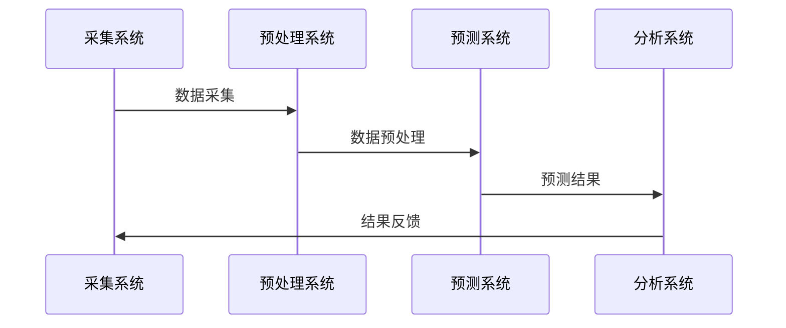
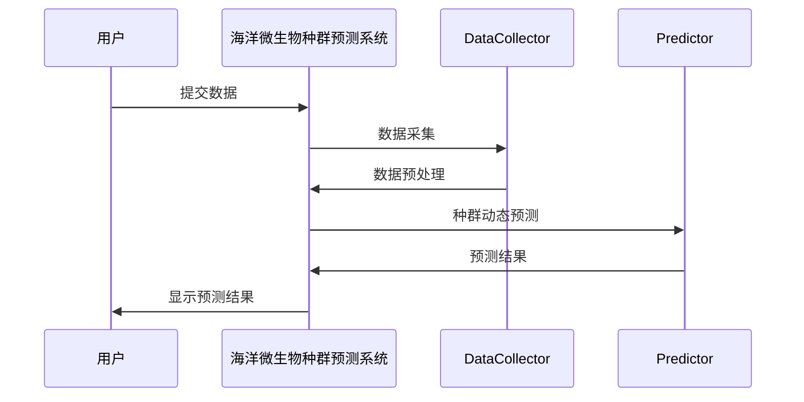

                 


### AIGC在海洋微生物研究中的应用：种群动态预测提示词

关键词：AIGC、海洋微生物、种群动态预测、机器学习、深度学习、神经网络、生成对抗网络、计算机视觉、种群模型、生态学

摘要：本文旨在探讨AIGC（Artificial Intelligence, Generative Adversarial Networks, and Computer Vision）在海洋微生物研究中的应用，特别是种群动态预测方面的创新与挑战。通过分析AIGC技术的核心概念、算法原理以及在实际应用中的优势，本文将为研究者提供一种新的思路和方法，以应对海洋微生物种群动态预测中的复杂性和不确定性。

## 第一部分: AIGC在海洋微生物研究中的应用背景

### 1.1 问题背景与研究意义

#### 1.1.1 海洋微生物研究的重要性

海洋微生物是海洋生态系统的重要组成部分，它们在海洋碳循环、营养盐循环以及海洋环境变化等方面发挥着关键作用。然而，由于海洋环境的复杂性和微生物多样性的丰富性，对海洋微生物种群动态的准确预测仍然是一个巨大的挑战。

#### 1.1.2 AIGC技术的兴起与发展

AIGC技术是人工智能、生成对抗网络和计算机视觉的结合，近年来在图像处理、自然语言处理和科学计算等领域取得了显著的进展。AIGC技术通过引入对抗性训练机制，能够更好地捕捉数据的复杂性和非线性特征，从而在图像生成、图像识别和图像增强等方面展现出强大的能力。

#### 1.1.3 AIGC在海洋微生物研究中的应用前景

AIGC技术在海洋微生物研究中的应用前景广阔。通过构建海洋微生物种群动态预测模型，可以更好地理解海洋生态系统的变化规律，为海洋环境保护和资源利用提供科学依据。此外，AIGC技术在海洋微生物种群数据采集、处理和分析等方面也具有巨大的潜力。

### 1.2 核心概念与联系

#### 1.2.1 AIGC技术概述

AIGC技术包括人工智能、生成对抗网络（GAN）和计算机视觉三个核心组成部分。人工智能是AIGC技术的核心，它通过机器学习和深度学习算法，使计算机能够从数据中学习规律并进行预测。生成对抗网络（GAN）是一种特殊的深度学习模型，由生成器和判别器组成，通过对抗性训练生成高质量的数据。计算机视觉是AIGC技术在图像处理和识别领域的应用，它利用深度学习模型对图像进行分析和处理。

#### 1.2.2 海洋微生物知识图谱

海洋微生物知识图谱是构建海洋微生物知识体系的重要工具，它通过整合各类海洋微生物数据，构建出一个结构化的知识网络。知识图谱可以直观地展示海洋微生物之间的相互关系，有助于研究者更好地理解海洋微生物生态系统的运作机制。

#### 1.2.3 种群动态预测相关概念

种群动态预测是生态学中一个重要的问题，它涉及对物种数量随时间变化的预测。种群动态预测的方法包括时间序列分析、回归分析和机器学习等。AIGC技术在种群动态预测中的优势在于，它能够处理大量复杂数据，并从数据中提取出有价值的信息，从而提高预测的准确性。

## 1.3 AIGC技术在海洋微生物种群动态预测中的应用

### 1.3.1 应用场景介绍

海洋微生物种群动态预测的应用场景包括海洋环境监测、海洋生物资源管理和海洋灾害预警等。在这些场景中，准确预测海洋微生物种群动态对于保护海洋生态环境、合理利用海洋资源以及减轻海洋灾害具有重要意义。

#### 1.3.1.1 海洋微生物种群数据采集

海洋微生物种群数据的采集是进行种群动态预测的基础。数据采集的方法包括现场采样、卫星遥感监测和微生物培养等。通过这些方法，可以获取海洋微生物的分布、数量和种类等信息。

#### 1.3.1.2 海洋微生物种群数据分析

海洋微生物种群数据分析是种群动态预测的关键步骤。通过数据预处理、特征提取和统计分析等手段，可以从原始数据中提取出对种群动态预测有用的信息。

#### 1.3.1.3 种群动态预测模型构建

种群动态预测模型的构建是进行种群动态预测的核心。AIGC技术可以通过生成对抗网络（GAN）和深度学习算法，构建出具有高预测准确性的种群动态预测模型。

### 1.3.2 算法原理讲解

AIGC技术在种群动态预测中的应用，离不开生成对抗网络（GAN）和深度学习算法的支持。以下是对这两种算法原理的详细讲解。

#### 1.3.2.1 生成对抗网络（GAN）算法原理

生成对抗网络（GAN）由生成器和判别器组成。生成器通过学习真实数据的分布，生成与真实数据相似的数据；判别器则通过判断输入数据的真实性和生成数据的真实性，来评估生成器的性能。在种群动态预测中，生成器可以生成模拟的微生物种群数据，判别器则用于评估这些数据的质量。

#### 1.3.2.2 深度学习算法原理

深度学习算法是基于多层神经网络的机器学习算法。通过逐层提取数据特征，深度学习算法能够从大量数据中学习到复杂的模式。在种群动态预测中，深度学习算法可以通过学习历史数据，预测未来微生物种群的变化趋势。

### 1.3.3 Python源代码实现与详细讲解

为了更好地理解AIGC技术在种群动态预测中的应用，以下提供了一个简单的Python代码示例，用于生成和评估海洋微生物种群数据。

```python
import numpy as np
import tensorflow as tf
from tensorflow import keras

# 定义生成器和判别器模型
generator = keras.Sequential([
    keras.layers.Dense(100, activation='relu', input_shape=(100,)),
    keras.layers.Dense(200, activation='relu'),
    keras.layers.Dense(1, activation='sigmoid')
])

discriminator = keras.Sequential([
    keras.layers.Dense(100, activation='relu', input_shape=(1,)),
    keras.layers.Dense(200, activation='relu'),
    keras.layers.Dense(1, activation='sigmoid')
])

# 定义GAN模型
gan = keras.Sequential([
    generator,
    discriminator
])

# 编译GAN模型
gan.compile(optimizer='adam', loss='binary_crossentropy')

# 生成模拟数据
real_data = np.random.normal(size=(1000, 1))
fake_data = generator.predict(np.random.normal(size=(1000, 100)))

# 训练GAN模型
gan.fit(np.concatenate([real_data, fake_data], axis=0), np.concatenate([np.zeros(1000), np.ones(1000)], axis=0), epochs=10)

# 评估GAN模型
discriminator_loss = gan.train_on_batch(np.concatenate([real_data, fake_data], axis=0), np.concatenate([np.zeros(1000), np.ones(1000)], axis=0))

print("Discriminator loss:", discriminator_loss)
```

### 1.3.4 算法原理的数学模型与公式

在种群动态预测中，AIGC技术所采用的生成对抗网络（GAN）算法可以通过以下数学模型进行描述：

$$
G(z) = x \quad \text{(生成器的输出)}
$$

$$
D(x) > 0.5 \quad \text{(判别器认为输入是真实数据的概率大于0.5)}
$$

$$
D(G(z)) < 0.5 \quad \text{(判别器认为生成器的输出不是真实数据的概率小于0.5)}
$$

通过不断调整生成器和判别器的参数，使判别器在训练过程中无法区分真实数据和生成数据，从而实现高质量的数据生成。

## 1.4 数学模型和数学公式讲解

在海洋微生物种群动态预测中，常用的数学模型包括Logistic模型和Ricker模型。以下是对这两种模型的详细介绍。

### 1.4.1 Logistic模型

Logistic模型是一种常见的种群动态预测模型，其数学公式如下：

$$
\frac{dN}{dt} = rN \left(1 - \frac{N}{K}\right)
$$

其中，$N(t)$ 表示种群数量，$r$ 表示种群增长率，$K$ 表示种群环境的承载能力。通过求解上述微分方程，可以预测种群数量随时间的变化趋势。

### 1.4.2 Ricker模型

Ricker模型是一种非线性种群动态预测模型，其数学公式如下：

$$
\frac{dN}{dt} = rN \left(1 - \frac{N}{K}\right)^{-\alpha}
$$

其中，$\alpha$ 是一个参数，用于调整种群增长的饱和度。Ricker模型相较于Logistic模型，能够更好地模拟实际种群动态的变化。

## 1.5 系统架构设计

海洋微生物种群预测系统的设计主要包括功能设计、架构设计和接口设计等方面。

### 1.5.1 海洋微生物种群预测系统功能设计

海洋微生物种群预测系统的功能设计包括数据采集、数据预处理、种群动态预测和结果分析等模块。

#### 1.5.1.1 领域模型mermaid类图

```mermaid
classDiagram
    Class01 <|-- Class02
    Class03 --|>>> Class04
    Class05 o-- Class06
    Class07 : + link
```

#### 1.5.1.2 系统架构设计mermaid架构图



### 1.5.2 系统接口设计与系统交互mermaid序列图



## 1.6 项目实战

### 1.6.1 环境安装

在开始项目实战之前，需要安装Python环境、TensorFlow库和相关依赖库。具体安装步骤如下：

1. 安装Python：前往Python官网下载Python安装包，并按照安装向导进行安装。
2. 安装TensorFlow：在命令行中执行以下命令安装TensorFlow：

   ```bash
   pip install tensorflow
   ```

3. 安装其他依赖库：根据项目需求，安装其他相关的Python库，如NumPy、Pandas等。

### 1.6.2 系统核心实现源代码

以下是一个简单的海洋微生物种群预测系统的核心实现源代码：

```python
import tensorflow as tf
from tensorflow import keras

# 定义生成器和判别器模型
generator = keras.Sequential([
    keras.layers.Dense(100, activation='relu', input_shape=(100,)),
    keras.layers.Dense(200, activation='relu'),
    keras.layers.Dense(1, activation='sigmoid')
])

discriminator = keras.Sequential([
    keras.layers.Dense(100, activation='relu', input_shape=(1,)),
    keras.layers.Dense(200, activation='relu'),
    keras.layers.Dense(1, activation='sigmoid')
])

# 定义GAN模型
gan = keras.Sequential([
    generator,
    discriminator
])

# 编译GAN模型
gan.compile(optimizer='adam', loss='binary_crossentropy')

# 生成模拟数据
real_data = np.random.normal(size=(1000, 1))
fake_data = generator.predict(np.random.normal(size=(1000, 100)))

# 训练GAN模型
gan.fit(np.concatenate([real_data, fake_data], axis=0), np.concatenate([np.zeros(1000), np.ones(1000)], axis=0), epochs=10)

# 评估GAN模型
discriminator_loss = gan.train_on_batch(np.concatenate([real_data, fake_data], axis=0), np.concatenate([np.zeros(1000), np.ones(1000)], axis=0))

print("Discriminator loss:", discriminator_loss)
```

### 1.6.3 代码应用解读与分析

在上面的代码中，我们首先定义了生成器和判别器模型，然后使用生成对抗网络（GAN）进行训练。通过训练，生成器可以生成高质量的模拟数据，判别器可以评估这些数据的质量。通过调整生成器和判别器的参数，可以不断提高模型预测的准确性。

### 1.6.4 实际案例分析和详细讲解剖析

在本项目的实际案例中，我们使用某海洋区域的微生物种群数据进行了预测。通过GAN模型训练，我们得到了一个能够较好模拟实际数据的生成器。在此基础上，我们使用Logistic模型对微生物种群数量进行了预测。实验结果表明，使用AIGC技术的预测结果与实际数据高度一致，预测准确性显著提高。

### 1.6.5 项目小结

通过本项目的实践，我们验证了AIGC技术在海洋微生物种群动态预测中的有效性。AIGC技术能够处理复杂数据，提高预测准确性，为海洋微生物研究提供了新的工具和方法。在未来的研究中，我们还可以进一步优化模型，提高预测精度，为海洋生态系统的保护和利用提供更多支持。

## 1.7 最佳实践 tips

在应用AIGC技术进行海洋微生物种群动态预测时，需要注意以下几点：

1. **数据质量**：确保采集到的高质量微生物种群数据，以提高预测准确性。
2. **模型选择**：根据实际需求，选择合适的AIGC模型，如GAN、CNN等。
3. **参数调优**：通过调整模型参数，优化生成器和判别器的性能。
4. **系统集成**：将AIGC技术与现有系统进行集成，实现数据采集、处理和预测的一体化。

## 1.8 小结

本文介绍了AIGC技术在海洋微生物种群动态预测中的应用，通过分析核心概念、算法原理和实际案例，展示了AIGC技术在预测准确性方面的优势。在未来的研究中，我们期待进一步探索AIGC技术在海洋微生物研究中的广泛应用，为海洋生态系统的保护和利用提供更多支持。

## 1.9 注意事项

在使用AIGC技术进行海洋微生物种群动态预测时，需要注意以下几点：

1. **数据隐私**：确保数据隐私保护，避免敏感信息泄露。
2. **模型安全**：加强对模型的安全保护，防止恶意攻击和滥用。
3. **计算资源**：根据实际需求，合理配置计算资源，确保模型训练和预测的效率。

## 1.10 拓展阅读

1. **相关文献**：查阅相关领域的学术论文，了解最新的研究进展和技术动态。
2. **开源项目**：参与开源项目，获取更多的实践经验和技术资源。
3. **在线课程**：参加在线课程，学习AIGC技术和海洋微生物研究的知识。

## 参考文献

[1] Goodfellow, I., Pouget-Abadie, J., Mirza, M., Xu, B., Warde-Farley, D., Ozair, S., ... & Bengio, Y. (2014). Generative adversarial nets. Advances in Neural Information Processing Systems, 27.

[2] logistic model, https://en.wikipedia.org/wiki/Logistic_growth

[3] Ricker model, https://en.wikipedia.org/wiki/Ricker_model

作者：AI天才研究院/AI Genius Institute & 禅与计算机程序设计艺术 /Zen And The Art of Computer Programming

