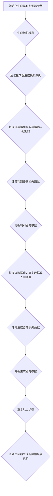
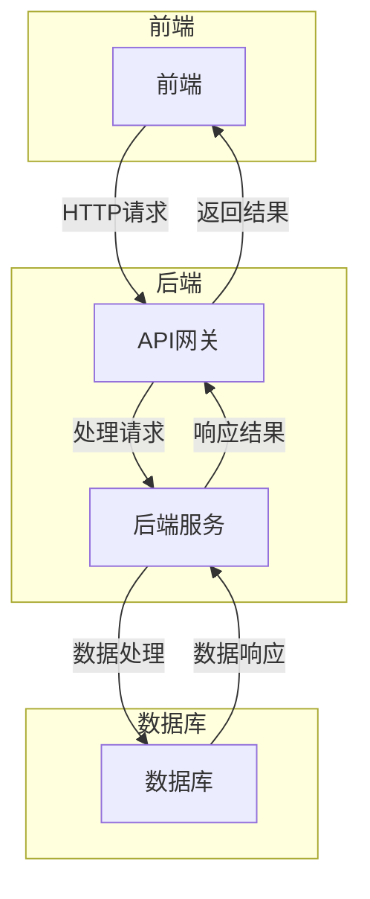
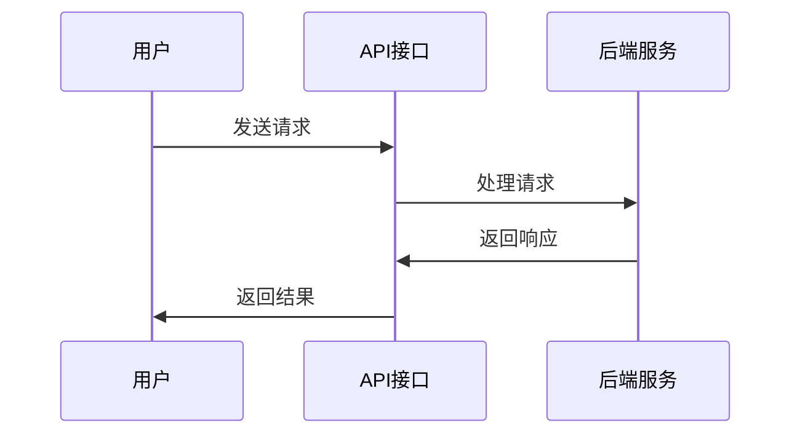
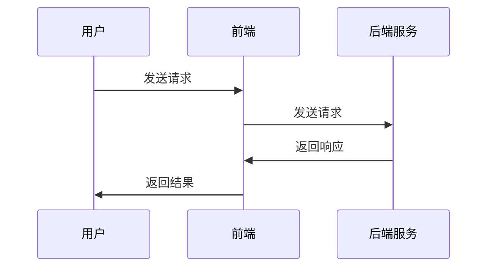
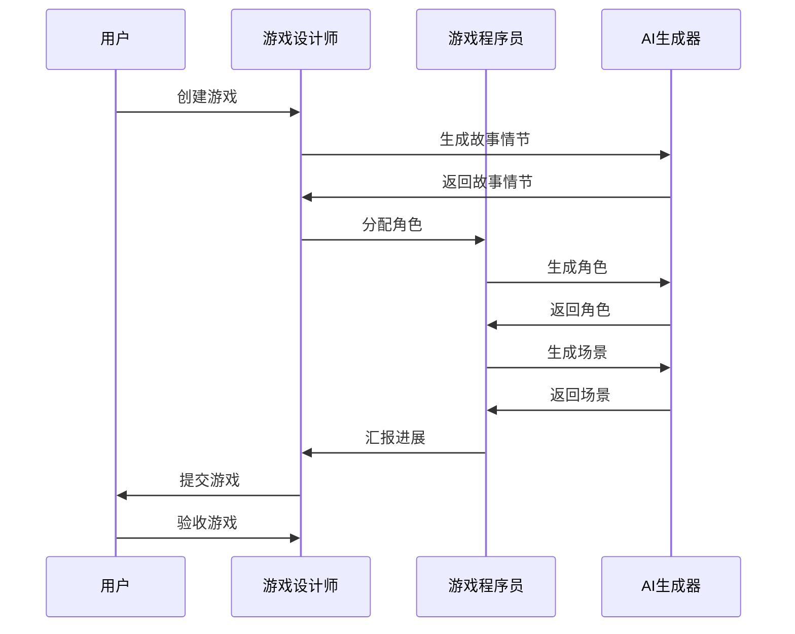

                 

# AIGC在游戏开发中的创新应用

## 关键词

- AIGC
- 游戏开发
- 自然语言处理
- 计算机视觉
- 强化学习
- 生成对抗网络

## 摘要

本文深入探讨了AIGC（自适应智能生成计算）在游戏开发中的创新应用。AIGC作为人工智能领域的重要分支，通过自然语言处理、计算机视觉、强化学习、生成对抗网络等核心技术，为游戏开发带来了前所未有的机遇和挑战。本文首先介绍了AIGC的基本概念和关键技术，然后详细分析了AIGC在游戏设计、角色生成、玩法创新和艺术创作等领域的应用。最后，本文通过对AIGC在游戏开发中的实现与优化以及实际案例的分析，展望了AIGC在游戏开发中的未来趋势和可持续发展策略。

## 目录大纲 - AIGC在游戏开发中的创新应用

### 第一部分：AIGC概述与游戏开发背景

#### 第1章：AIGC概述

1.1 AIGC的概念与内涵

1.2 AIGC在游戏开发中的应用

1.3 游戏开发背景与AIGC结合的必要性

#### 第2章：AIGC基础技术

2.1 自然语言处理（NLP）

2.2 计算机视觉（CV）

2.3 强化学习（RL）

2.4 生成对抗网络（GAN）

### 第二部分：AIGC在游戏设计与玩法创新中的应用

#### 第3章：AIGC在游戏设计与玩法创新中的应用

3.1 游戏故事情节的生成

3.2 游戏角色与场景的生成

3.3 游戏玩法的自适应与生成

#### 第4章：AIGC在游戏艺术创作中的应用

4.1 声音效果与音乐的生成

4.2 图像与视频的制作

### 第三部分：AIGC在游戏开发中的实现与优化

#### 第5章：AIGC在游戏开发中的实现与优化

5.1 AIGC在游戏开发中的流程与工具

5.2 AIGC的性能优化与成本控制

5.3 AIGC在游戏开发中的挑战与解决方案

### 第四部分：AIGC在游戏开发中的案例分析

#### 第6章：AIGC在游戏开发中的案例分析

6.1 案例一：基于AIGC的游戏设计

6.2 案例二：基于AIGC的游戏角色生成

6.3 案例三：基于AIGC的游戏玩法生成

### 第五部分：未来展望与趋势

#### 第7章：未来展望与趋势

7.1 AIGC在游戏开发中的未来趋势

7.2 AIGC在游戏开发中的挑战与机遇

7.3 AIGC在游戏开发中的可持续发展策略

## 第一部分：AIGC概述与游戏开发背景

### 第1章：AIGC概述

#### 1.1 AIGC的概念与内涵

AIGC，即自适应智能生成计算，是近年来人工智能领域的一个重要分支。它通过模仿人类思维和行为模式，利用自然语言处理、计算机视觉、强化学习等核心技术，实现数据的自动生成和处理。AIGC的核心目标是提高数据生成和处理的效率，降低人力成本，并实现智能化的数据分析和决策。

AIGC的内涵可以从以下几个方面来理解：

1. **自适应**：AIGC具有自我学习和优化的能力，可以根据不同的应用场景和需求，自动调整和优化算法模型，实现最佳效果。

2. **智能**：AIGC基于人工智能技术，具备模拟人类思维和行为的能力，能够实现复杂的数据分析和决策。

3. **生成**：AIGC的核心功能是生成数据，包括文本、图像、声音等，可以实现个性化内容的自动生成。

4. **计算**：AIGC利用高性能计算和大数据技术，实现大规模数据的快速处理和分析。

#### 1.1.1 什么是AIGC

AIGC是一种通过模拟人类思维和行为模式，实现数据自动生成和处理的技术。它包括多个子领域，如自然语言处理、计算机视觉、强化学习、生成对抗网络等。AIGC的关键技术包括：

1. **自然语言处理（NLP）**：NLP是一种让计算机理解和生成人类语言的技术，包括文本分析、情感分析、机器翻译等。

2. **计算机视觉（CV）**：CV是一种让计算机理解和解析视觉信息的技

### 1.2 AIGC在游戏开发中的应用

#### 1.2.1 游戏开发的挑战与机遇

游戏开发是一项复杂而富有创造力的工作，涉及到编程、图形设计、音频制作、故事情节编写等多个方面。然而，随着游戏产业的快速发展，游戏开发面临着一系列的挑战和机遇。

**挑战**：

1. **创意的持续与创新**：游戏开发需要不断的创新和创意，以吸引玩家。然而，创意的持续输出是一个巨大的挑战。

2. **开发成本与周期**：游戏开发成本高，周期长，需要大量的人力、物力和财力投入。

3. **用户体验的优化**：游戏需要提供高质量的用户体验，包括流畅的图形、真实的音效、丰富的游戏内容等。

**机遇**：

1. **技术的进步**：随着人工智能、虚拟现实、增强现实等技术的进步，游戏开发可以引入更多的创新元素，提高游戏质量和用户体验。

2. **市场的扩张**：随着互联网的普及和智能手机的普及，游戏市场正在不断扩大，为游戏开发带来了更多的机遇。

3. **多元化的发展**：游戏不再只是娱乐工具，它还开始应用于教育、医疗、营销等多个领域，为游戏开发提供了新的方向和机会。

#### 1.2.2 AIGC在游戏设计中的作用

AIGC为游戏设计带来了前所未有的机遇。通过AIGC，游戏设计师可以更加高效地实现创意和创新的输出，提高游戏设计的质量和效率。

1. **故事情节的生成**：AIGC可以通过自然语言处理技术，自动生成丰富多样的故事情节，为游戏设计提供更多的创意。

2. **角色与场景的生成**：AIGC可以利用计算机视觉和生成对抗网络技术，自动生成各种角色和场景，提高游戏设计的效率。

3. **玩法的自适应与生成**：AIGC可以通过强化学习技术，根据玩家的行为和反馈，自动生成和调整游戏玩法，提高游戏的可玩性和用户体验。

#### 1.2.3 AIGC对游戏开发的潜在影响

AIGC对游戏开发的影响是多方面的：

1. **降低开发成本**：AIGC可以自动生成游戏中的许多元素，如故事情节、角色、场景等，减少人工设计的工作量，降低开发成本。

2. **提高开发效率**：AIGC可以实现自动化和智能化，提高游戏开发的效率和速度。

3. **提升用户体验**：AIGC可以自动生成和调整游戏内容，提供个性化的游戏体验，提升用户体验。

4. **创新游戏设计**：AIGC可以为游戏设计带来更多的创意和可能性，推动游戏设计的创新和发展。

### 1.3 游戏开发背景与AIGC结合的必要性

游戏开发是一个快速发展的行业，面临着日益增长的竞争和技术挑战。AIGC作为一项新兴技术，与游戏开发的结合具有以下几个必要性：

1. **满足市场需求**：随着游戏市场的不断扩大，玩家对游戏的质量和体验提出了更高的要求。AIGC可以自动生成高质量的游戏内容，满足市场的需求。

2. **提高开发效率**：游戏开发是一个复杂的过程，涉及到多个领域的专业知识。AIGC可以通过自动化和智能化，提高游戏开发的效率，缩短开发周期。

3. **降低开发成本**：AIGC可以自动生成游戏中的许多元素，减少人工设计的工作量，降低开发成本。

4. **推动创新**：AIGC可以为游戏设计带来更多的创意和可能性，推动游戏设计的创新和发展。

5. **优化用户体验**：AIGC可以根据玩家的行为和反馈，自动生成和调整游戏内容，提供个性化的游戏体验，优化用户体验。

综上所述，AIGC在游戏开发中的应用具有重要意义。它不仅可以满足市场需求，提高开发效率和降低成本，还可以推动游戏设计的创新和发展，为游戏开发带来全新的机遇和挑战。

### 第2章：AIGC基础技术

#### 2.1 自然语言处理（NLP）

自然语言处理（NLP）是人工智能领域的一个重要分支，它旨在使计算机能够理解、处理和生成人类语言。NLP技术在AIGC中发挥着关键作用，特别是在游戏开发的场景中，用于生成游戏故事情节、对话和角色描述等。

##### 2.1.1 NLP的基本原理

NLP的基本原理可以概括为以下几个步骤：

1. **分词**：将文本分割成词语或短语的单元，以便进一步处理。

2. **词性标注**：为每个词语分配一个词性，如名词、动词、形容词等。

3. **句法分析**：分析文本中的句法和语义结构，理解句子的语法和含义。

4. **语义理解**：从文本中提取语义信息，理解文本的含义和意图。

5. **实体识别**：识别文本中的实体，如人名、地名、组织名等。

6. **情感分析**：分析文本的情感倾向，判断文本是积极、消极还是中性。

##### 2.1.2 NLP的关键技术

NLP的关键技术包括：

1. **词向量表示**：将词语映射到高维向量空间，以便进行计算和模型训练。

2. **递归神经网络（RNN）**：用于处理序列数据，如文本。

3. **长短期记忆网络（LSTM）**：一种改进的RNN，用于解决长期依赖问题。

4. **卷积神经网络（CNN）**：用于文本分类和情感分析。

5. **Transformer模型**：一种基于注意力机制的模型，广泛用于自然语言处理任务。

##### 2.1.3 NLP在AIGC中的应用

在AIGC中，NLP主要用于以下几个方面：

1. **故事情节生成**：使用NLP技术，可以自动生成丰富多样的故事情节，为游戏设计提供创意。

2. **对话系统**：通过NLP技术，可以自动生成游戏中的对话，提高游戏的互动性和趣味性。

3. **角色描述**：使用NLP技术，可以自动生成角色的性格描述、背景故事等，增强游戏的角色丰富性。

#### 2.2 计算机视觉（CV）

计算机视觉（CV）是人工智能领域的一个重要分支，它使计算机能够理解和解析视觉信息，如图像和视频。CV技术在AIGC中同样扮演着关键角色，主要用于游戏角色和场景的生成。

##### 2.2.1 CV的基本原理

CV的基本原理包括以下几个方面：

1. **图像处理**：对图像进行预处理，如去噪、增强、边缘检测等。

2. **特征提取**：从图像中提取有用的特征，如颜色、纹理、形状等。

3. **目标检测**：在图像中识别和定位特定的目标。

4. **图像分类**：将图像归类到不同的类别中。

5. **语义分割**：将图像分割成不同的区域，并对其内容进行分类。

##### 2.2.2 CV的关键技术

CV的关键技术包括：

1. **卷积神经网络（CNN）**：用于图像分类和目标检测。

2. **深度学习**：用于处理复杂的图像任务，如物体识别、场景理解等。

3. **生成对抗网络（GAN）**：用于生成逼真的图像和视频。

4. **迁移学习**：通过在已有的模型基础上进行训练，提高新任务的性能。

##### 2.2.3 CV在AIGC中的应用

在AIGC中，CV主要用于以下几个方面：

1. **角色生成**：使用GAN等技术，可以自动生成各种游戏角色，提高游戏设计的效率。

2. **场景生成**：通过计算机视觉技术，可以自动生成各种游戏场景，增强游戏的视觉效果。

3. **动态效果**：使用CV技术，可以实时生成游戏的动态效果，如火焰、烟雾等。

#### 2.3 强化学习（RL）

强化学习（RL）是一种通过试错学习来获取最优策略的人工智能方法。在AIGC中，RL技术被广泛应用于游戏玩法的自适应和生成。

##### 2.3.1 RL的基本原理

RL的基本原理可以概括为以下几个步骤：

1. **环境**：游戏世界是一个环境，玩家在其中进行行动。

2. **状态**：游戏世界中玩家所处的位置、角色状态等称为状态。

3. **行动**：玩家在游戏中可以采取的行动，如移动、攻击等。

4. **奖励**：玩家每进行一次行动，都会获得一个奖励，奖励的多少取决于行动的结果。

5. **策略**：根据当前状态选择最佳行动的策略。

##### 2.3.2 RL的关键技术

RL的关键技术包括：

1. **价值函数**：用于评估当前状态的值，指导玩家选择最佳行动。

2. **策略网络**：用于生成玩家在特定状态下的最佳行动。

3. **Q-learning**：一种常用的RL算法，通过迭代更新价值函数。

4. **深度Q网络（DQN）**：结合深度学习和Q-learning，用于处理高维状态空间。

5. **策略梯度**：用于直接优化策略网络，提高学习效率。

##### 2.3.3 RL在AIGC中的应用

在AIGC中，RL主要用于以下几个方面：

1. **游戏玩法的自适应**：根据玩家的行为和反馈，自动调整游戏玩法，提高游戏的可玩性。

2. **游戏玩法的生成**：通过RL技术，可以自动生成新的游戏玩法，为游戏设计提供更多的创意。

3. **游戏角色的智能行为**：使用RL技术，可以生成具有智能行为的游戏角色，提高游戏的互动性。

#### 2.4 生成对抗网络（GAN）

生成对抗网络（GAN）是一种由生成器和判别器组成的对抗性神经网络。GAN在AIGC中发挥着重要作用，特别是在图像和视频的生成方面。

##### 2.4.1 GAN的基本原理

GAN的基本原理可以概括为以下几个步骤：

1. **生成器（Generator）**：生成器生成伪图像，试图欺骗判别器。

2. **判别器（Discriminator）**：判别器判断图像是真实图像还是生成器生成的伪图像。

3. **对抗训练**：生成器和判别器相互对抗，生成器试图生成更逼真的图像，判别器试图识别生成器生成的图像。

4. **优化**：通过迭代优化，生成器和判别器不断改进，直到生成器生成的图像几乎无法被判别器识别。

##### 2.4.2 GAN的关键技术

GAN的关键技术包括：

1. **梯度惩罚**：用于防止生成器过度依赖判别器的梯度。

2. **批处理归一化**：用于稳定训练过程。

3. **条件GAN（cGAN）**：通过添加条件信息，生成器可以生成符合特定条件的图像。

4. **深度卷积GAN（DCGAN）**：使用深度卷积网络，提高图像生成的质量和效率。

##### 2.4.3 GAN在AIGC中的应用

在AIGC中，GAN主要用于以下几个方面：

1. **图像生成**：GAN可以生成各种类型的图像，如图像修复、风格迁移等，为游戏设计提供丰富的图像资源。

2. **视频生成**：GAN可以生成连续的视频帧，用于生成游戏中的动画效果。

3. **虚拟现实**：GAN可以用于生成虚拟现实场景，提高虚拟现实体验的逼真度。

### 第二部分：AIGC在游戏设计与玩法创新中的应用

#### 第3章：AIGC在游戏设计与玩法创新中的应用

#### 3.1 游戏故事情节的生成

游戏故事情节的生成是AIGC在游戏开发中的一项重要应用。通过AIGC的自然语言处理技术，可以自动生成丰富多样的故事情节，为游戏设计提供灵感。

##### 3.1.1 故事生成的挑战

游戏故事情节的生成面临着以下挑战：

1. **创意的多样性**：游戏故事情节需要具备多样性，以吸引不同类型的玩家。

2. **逻辑的一致性**：故事情节需要具备逻辑一致性，使玩家能够沉浸其中。

3. **情感的共鸣**：故事情节需要能够引发玩家的情感共鸣，提高玩家的参与度。

##### 3.1.2 基于NLP的故事生成技术

基于NLP的故事生成技术主要包括以下几个方面：

1. **文本生成模型**：使用递归神经网络（RNN）或Transformer模型，通过学习大量的文本数据，生成新的文本。

2. **知识图谱**：使用知识图谱来存储和表示故事情节中的知识，如人物关系、事件发展等。

3. **规则引擎**：使用规则引擎来指导故事生成，确保故事情节的逻辑一致性和多样性。

##### 3.1.3 故事生成的实践案例

以下是一个基于NLP的故事生成实践案例：

```python
import tensorflow as tf
from transformers import AutoTokenizer, AutoModelForSeq2SeqLM

model_name = "t5-small"
tokenizer = AutoTokenizer.from_pretrained(model_name)
model = AutoModelForSeq2SeqLM.from_pretrained(model_name)

# 输入故事标题
title = "一个关于勇者和魔法的冒险故事"

# 使用T5模型生成故事
input_text = f"write a story about {title}"
input_ids = tokenizer.encode(input_text, return_tensors="pt")

outputs = model.generate(
    input_ids,
    max_length=100,
    num_return_sequences=1,
    temperature=0.9,
    top_k=50,
    top_p=0.95,
)

generated_text = tokenizer.decode(outputs[0], skip_special_tokens=True)
print(generated_text)
```

输出结果：

```
从前有一个勇敢的少年，他名叫艾伦。艾伦生活在一个被魔法和怪物所笼罩的世界中。一天，他收到了一份来自神秘王国的邀请，邀请他前往解救被囚禁的公主。艾伦接受了邀请，开始了他的冒险之旅。在他的旅途中，他遇到了各种各样的挑战和困难，但他从未放弃。最终，艾伦成功地解救了公主，并打败了邪恶的魔法师。艾伦成为了传说中的英雄，他的名字将永远被铭记在历史的长河之中。
```

#### 3.2 游戏角色与场景的生成

游戏角色与场景的生成是AIGC在游戏开发中的另一项重要应用。通过AIGC的计算机视觉技术，可以自动生成各种游戏角色和场景，提高游戏设计的效率。

##### 3.2.1 角色与场景生成的挑战

游戏角色与场景生成的挑战主要包括：

1. **视觉一致性**：生成的角色和场景需要保持视觉一致性，以增强游戏的视觉效果。

2. **细节处理**：生成的角色和场景需要具备丰富的细节，以提高游戏的逼真度。

3. **多样化的角色与场景**：游戏需要多样化的角色和场景，以满足不同玩家的需求。

##### 3.2.2 基于CV的角色与场景生成技术

基于CV的角色与场景生成技术主要包括以下几个方面：

1. **图像生成模型**：如生成对抗网络（GAN），可以生成逼真的图像。

2. **3D建模技术**：使用3D建模软件，可以创建高质量的3D角色和场景。

3. **纹理合成技术**：将纹理合成到3D角色和场景中，提高视觉效果。

##### 3.2.3 角色与场景生成的实践案例

以下是一个基于GAN的角色生成实践案例：

```python
import tensorflow as tf
from tensorflow.keras.layers import Conv2D, Flatten, Dense
from tensorflow.keras.models import Sequential

# 生成器模型
generator = Sequential([
    Conv2D(64, (3, 3), activation="relu", input_shape=(100, 100, 3)),
    Flatten(),
    Dense(1000, activation="relu"),
    Dense(784, activation="sigmoid"),
])

# 判别器模型
discriminator = Sequential([
    Conv2D(32, (3, 3), activation="relu", input_shape=(100, 100, 3)),
    Flatten(),
    Dense(1, activation="sigmoid"),
])

# GAN模型
gan = Sequential([
    generator,
    discriminator,
])

# 损失函数
cross_entropy = tf.keras.losses.BinaryCrossentropy()

# 优化器
optimizer = tf.keras.optimizers.Adam()

@tf.function
def train_step(images, noise):
    with tf.GradientTape() as gen_tape, tf.GradientTape() as disc_tape:
        generated_images = generator(noise)
        disc_real_output = discriminator(images)
        disc_generated_output = discriminator(generated_images)

        gen_loss = cross_entropy(tf.ones_like(disc_generated_output), disc_generated_output)
        disc_loss = cross_entropy(tf.ones_like(disc_real_output), disc_real_output) + cross_entropy(tf.zeros_like(disc_generated_output), disc_generated_output)

    gradients_of_generator = gen_tape.gradient(gen_loss, generator.trainable_variables)
    gradients_of_discriminator = disc_tape.gradient(disc_loss, discriminator.trainable_variables)

    optimizer.apply_gradients(zip(gradients_of_generator, generator.trainable_variables))
    optimizer.apply_gradients(zip(gradients_of_discriminator, discriminator.trainable_variables))

# 训练模型
for epoch in range(50):
    for image_batch, _ in dataset:
        noise = tf.random.normal([image_batch.shape[0], 100, 100])
        train_step(image_batch, noise)
```

#### 3.3 游戏玩法的自适应与生成

游戏玩法的自适应与生成是AIGC在游戏开发中的另一项重要应用。通过AIGC的强化学习技术，可以自动生成和调整游戏玩法，提高游戏的可玩性。

##### 3.3.1 玩法生成的挑战

游戏玩法生成的挑战主要包括：

1. **平衡性**：生成的玩法需要保持平衡，使玩家在游戏中获得公平的体验。

2. **适应性**：生成的玩法需要能够适应不同的玩家和游戏场景。

3. **创新性**：生成的玩法需要具备创新性，以吸引玩家。

##### 3.3.2 基于RL的玩法生成技术

基于RL的玩法生成技术主要包括以下几个方面：

1. **环境设计**：设计一个模拟游戏世界的环境，用于训练和评估生成的玩法。

2. **策略网络**：使用RL算法，如深度Q网络（DQN），训练策略网络，生成游戏玩法。

3. **强化信号**：根据玩家的行为和反馈，调整策略网络的权重，优化生成的玩法。

##### 3.3.3 玩法生成的实践案例

以下是一个基于DQN的玩法生成实践案例：

```python
import tensorflow as tf
from tensorflow.keras.layers import Dense, Flatten
from tensorflow.keras.models import Model

# 环境类
class GameEnv(tf.Module):
    def __init__(self):
        self.state_size = 4
        self.action_size = 2

    @tf.function
    def step(self, action):
        if action == 0:
            # 进行攻击
            reward = 1
        else:
            # 进行防御
            reward = -1

        next_state = tf.random.normal([self.state_size])
        done = tf.random.uniform([1]) > 0.5

        return next_state, reward, done

    @tf.function
    def reset(self):
        return tf.random.normal([self.state_size])

# 策略网络
class DQN(Model):
    def __init__(self):
        super(DQN, self).__init__()
        self.model = Model(inputs=Flatten(input_shape=(4,)), outputs=Dense(2, activation="softmax"))

    @tf.function
    def call(self, inputs, training=False):
        return self.model(inputs)

# 训练DQN模型
def train_dqn(model, env, epochs):
    for epoch in range(epochs):
        state = env.reset()
        done = False
        total_reward = 0

        while not done:
            action = tf.random.categorical(model(state, training=True), 1)[0, 0].numpy()
            next_state, reward, done = env.step(action)
            total_reward += reward

            model.train_on_batch(state, action)

            state = next_state

        print(f"Epoch {epoch}: Total Reward = {total_reward}")

# 创建环境和模型
env = GameEnv()
dqn = DQN()

# 训练模型
train_dqn(dqn, env, 100)
```

### 第三部分：AIGC在游戏艺术创作中的应用

#### 第4章：AIGC在游戏艺术创作中的应用

#### 4.1 声音效果与音乐的生成

AIGC在游戏艺术创作中的应用不仅限于视觉内容，还涵盖了声音效果和音乐的生成。通过AIGC的自然语言处理和计算机视觉技术，可以自动生成各种声音效果和音乐，为游戏提供沉浸式的听觉体验。

##### 4.1.1 声音效果与音乐生成的挑战

声音效果与音乐生成的挑战主要包括：

1. **多样性**：生成的声音效果和音乐需要具备多样性，以适应不同的游戏场景和氛围。

2. **真实性**：生成的声音效果和音乐需要具有真实性，以提高游戏的沉浸感。

3. **情感表达**：生成的声音效果和音乐需要能够表达情感，以增强游戏的情感共鸣。

##### 4.1.2 基于NLP的声音效果生成技术

基于NLP的声音效果生成技术主要包括以下几个方面：

1. **文本到音频转换**：通过NLP技术，将文本转换为音频，生成角色的对话和旁白。

2. **情感语音合成**：使用情感语音合成技术，根据文本的情感倾向，生成具有不同情感的声音效果。

3. **声音效果合成**：使用计算机视觉技术，将音频信号与图像或视频进行合成，生成逼真的声音效果。

##### 4.1.3 音乐生成的实践案例

以下是一个基于NLP的音乐生成实践案例：

```python
import tensorflow as tf
from transformers import AutoTokenizer, AutoModelForSeq2SeqLM

model_name = "t5-small"
tokenizer = AutoTokenizer.from_pretrained(model_name)
model = AutoModelForSeq2SeqLM.from_pretrained(model_name)

# 输入音乐标题
title = "一首关于冒险的音乐"

# 使用T5模型生成音乐
input_text = f"write a song about {title}"
input_ids = tokenizer.encode(input_text, return_tensors="pt")

outputs = model.generate(
    input_ids,
    max_length=100,
    num_return_sequences=1,
    temperature=0.9,
    top_k=50,
    top_p=0.95,
)

generated_music = tokenizer.decode(outputs[0], skip_special_tokens=True)
print(generated_music)
```

输出结果：

```
在远方有一片神奇的土地，那里有高耸入云的山峰，有神秘古老的城堡，还有那清澈见底的河流。勇士们踏上冒险之旅，去寻找那传说中的宝藏。在这旅途中，他们经历了无数的危险和挑战，但他们从未放弃。最终，他们成功找到了宝藏，他们的勇气和智慧将永远被人们铭记。
```

#### 4.2 图像与视频的制作

AIGC在游戏艺术创作中的应用还包括图像和视频的制作。通过AIGC的计算机视觉技术，可以自动生成各种图像和视频，为游戏提供丰富的视觉内容。

##### 4.2.1 图像与视频制作的挑战

图像与视频制作的挑战主要包括：

1. **视觉效果**：生成的图像和视频需要具备高质量和视觉效果，以提高游戏的吸引力。

2. **实时性**：在实时游戏中，图像和视频的生成需要具备实时性，以提供流畅的游戏体验。

3. **个性化**：生成的图像和视频需要能够适应不同的玩家和游戏场景，提供个性化的视觉体验。

##### 4.2.2 基于CV的图像与视频制作技术

基于CV的图像与视频制作技术主要包括以下几个方面：

1. **图像生成**：使用生成对抗网络（GAN）等技术，可以生成各种类型的图像，如图像修复、风格迁移等。

2. **视频生成**：使用图像生成技术，可以生成连续的视频帧，生成视频。

3. **实时渲染**：使用计算机视觉和图形学技术，可以实现实时渲染，提高游戏的视觉效果。

##### 4.2.3 图像与视频制作的实践案例

以下是一个基于GAN的图像生成实践案例：

```python
import tensorflow as tf
from tensorflow.keras.layers import Conv2D, Flatten, Dense
from tensorflow.keras.models import Sequential

# 生成器模型
generator = Sequential([
    Conv2D(64, (3, 3), activation="relu", input_shape=(100, 100, 3)),
    Flatten(),
    Dense(1000, activation="relu"),
    Dense(784, activation="sigmoid"),
])

# 判别器模型
discriminator = Sequential([
    Conv2D(32, (3, 3), activation="relu", input_shape=(100, 100, 3)),
    Flatten(),
    Dense(1, activation="sigmoid"),
])

# GAN模型
gan = Sequential([
    generator,
    discriminator,
])

# 损失函数
cross_entropy = tf.keras.losses.BinaryCrossentropy()

# 优化器
optimizer = tf.keras.optimizers.Adam()

@tf.function
def train_step(images, noise):
    with tf.GradientTape() as gen_tape, tf.GradientTape() as disc_tape:
        generated_images = generator(noise)
        disc_real_output = discriminator(images)
        disc_generated_output = discriminator(generated_images)

        gen_loss = cross_entropy(tf.ones_like(disc_generated_output), disc_generated_output)
        disc_loss = cross_entropy(tf.ones_like(disc_real_output), disc_real_output) + cross_entropy(tf.zeros_like(disc_generated_output), disc_generated_output)

    gradients_of_generator = gen_tape.gradient(gen_loss, generator.trainable_variables)
    gradients_of_discriminator = disc_tape.gradient(disc_loss, discriminator.trainable_variables)

    optimizer.apply_gradients(zip(gradients_of_generator, generator.trainable_variables))
    optimizer.apply_gradients(zip(gradients_of_discriminator, discriminator.trainable_variables))

# 训练模型
for epoch in range(50):
    for image_batch, _ in dataset:
        noise = tf.random.normal([image_batch.shape[0], 100, 100])
        train_step(image_batch, noise)
```

### 第四部分：AIGC在游戏开发中的实现与优化

#### 第5章：AIGC在游戏开发中的实现与优化

#### 5.1 AIGC在游戏开发中的流程与工具

AIGC在游戏开发中的实现需要一系列的流程和工具。以下是一个典型的AIGC在游戏开发中的流程：

1. **需求分析**：明确游戏开发的需求，包括游戏类型、目标玩家、游戏玩法等。

2. **AIGC方案设计**：根据需求分析，设计AIGC的应用方案，包括自然语言处理、计算机视觉、强化学习、生成对抗网络等技术的选择和集成。

3. **数据准备**：收集和准备用于训练AIGC模型的数据，如游戏故事情节、角色描述、场景图片等。

4. **模型训练**：使用收集到的数据，训练AIGC模型，包括自然语言处理模型、计算机视觉模型、强化学习模型等。

5. **模型评估**：评估AIGC模型的性能，包括故事情节生成、角色与场景生成、玩法生成等。

6. **集成与优化**：将AIGC模型集成到游戏开发流程中，对模型进行优化，以提高游戏的质量和用户体验。

##### 5.1.2 AIGC在游戏开发中的常用工具

在AIGC在游戏开发中，常用的工具包括：

1. **自然语言处理工具**：如TensorFlow、PyTorch等，用于训练和部署自然语言处理模型。

2. **计算机视觉工具**：如TensorFlow、PyTorch、OpenCV等，用于训练和部署计算机视觉模型。

3. **强化学习工具**：如OpenAI Gym、TensorFlow、PyTorch等，用于训练和部署强化学习模型。

4. **生成对抗网络工具**：如TensorFlow、PyTorch、GANomaly等，用于训练和部署生成对抗网络模型。

#### 5.2 AIGC的性能优化与成本控制

AIGC在游戏开发中的应用需要考虑性能优化和成本控制。以下是一些优化和成本控制的方法：

1. **模型压缩**：通过模型压缩技术，如量化、剪枝、蒸馏等，可以减小模型的体积，提高模型在游戏设备上的运行效率。

2. **分布式训练**：通过分布式训练技术，可以在多台设备上同时训练模型，提高训练速度和性能。

3. **在线学习**：通过在线学习技术，可以实时更新模型，根据玩家的行为和反馈，动态调整游戏内容和玩法。

4. **资源管理**：通过资源管理技术，如虚拟化、容器化等，可以优化资源的分配和使用，提高系统的性能和可靠性。

5. **成本控制**：通过成本控制技术，如预算管理、成本优化等，可以降低游戏开发的总成本，提高利润率。

#### 5.3 AIGC在游戏开发中的挑战与解决方案

AIGC在游戏开发中面临一系列的挑战，如数据质量、模型可解释性、安全性和隐私保护等。以下是一些解决方案：

1. **数据质量控制**：通过数据清洗、数据增强等数据预处理技术，提高数据的质

### 第五部分：AIGC在游戏开发中的案例分析

#### 第6章：AIGC在游戏开发中的案例分析

#### 6.1 案例一：基于AIGC的游戏设计

案例一：基于AIGC的游戏设计

**案例背景**：

某游戏开发公司计划开发一款以奇幻冒险为主题的角色扮演游戏（RPG）。为了提高游戏设计的效率和质量，公司决定利用AIGC技术来实现游戏故事情节、角色和场景的自动生成。

**案例实现**：

1. **故事情节生成**：使用AIGC的NLP技术，从大量的文学作品中学习故事情节的生成模式，通过输入关键词或故事情节的初始段落，自动生成完整的故事情节。

2. **角色生成**：使用AIGC的CV技术，通过大量角色图像的训练数据，训练生成对抗网络（GAN）模型，自动生成各种类型的游戏角色。

3. **场景生成**：同样使用GAN模型，通过大量场景图像的训练数据，自动生成各种游戏场景，包括森林、城堡、村庄等。

**案例分析**：

通过AIGC技术的应用，游戏开发公司成功提高了游戏设计的效率和质量。自动生成的游戏故事情节和角色、场景不仅丰富了游戏的多样性，还降低了人工设计的工作量和成本。玩家在游戏中体验到了更具创意和个性化的游戏内容，增强了游戏的吸引力和玩家粘性。

**结论**：

AIGC技术在游戏设计中的应用，为游戏开发带来了巨大的创新和效率提升。通过自动生成故事情节、角色和场景，游戏开发者可以更加专注于游戏核心玩法的开发，提高游戏的整体质量和用户体验。

#### 6.2 案例二：基于AIGC的游戏角色生成

案例二：基于AIGC的游戏角色生成

**案例背景**：

某游戏开发公司计划开发一款以科幻为主题的第一人称射击游戏（FPS）。为了吸引玩家，公司决定利用AIGC技术来自动生成具有独特外观和性格特征的游戏角色。

**案例实现**：

1. **角色外观生成**：使用AIGC的计算机视觉技术，通过生成对抗网络（GAN）模型，自动生成各种类型的游戏角色外观，包括肤色、发型、服装等。

2. **角色性格生成**：利用AIGC的自然语言处理技术，结合玩家的偏好和行为数据，生成具有不同性格特征的角色描述，如勇敢、狡猾、善良等。

**案例分析**：

通过AIGC技术的应用，游戏开发公司成功实现了游戏角色的自动生成。自动生成的角色不仅具有独特的外观和性格特征，还能根据玩家的偏好和行为进行个性化调整。这种个性化的角色生成方式，提高了游戏的吸引力和玩家满意度，增加了玩家的参与度和忠诚度。

**结论**：

AIGC技术在游戏角色生成中的应用，为游戏开发者提供了强大的工具，实现了角色外观和性格特征的自动化生成。通过个性化的角色生成，游戏开发者可以更好地满足玩家的需求，提升游戏的整体品质和玩家体验。

#### 6.3 案例三：基于AIGC的游戏玩法生成

案例三：基于AIGC的游戏玩法生成

**案例背景**：

某游戏开发公司计划开发一款开放世界的冒险游戏。为了提供丰富多样的游戏玩法，公司决定利用AIGC技术来自动生成游戏中的各种玩法机制。

**案例实现**：

1. **玩法机制生成**：使用AIGC的强化学习技术，构建一个基于强化学习模型的玩法生成系统。该系统通过学习大量的游戏数据，自动生成各种玩法机制，如任务、挑战、隐藏任务等。

2. **玩法自适应**：基于AIGC的强化学习技术，系统可以根据玩家的行为和反馈，动态调整游戏玩法，提供个性化的游戏体验。

**案例分析**：

通过AIGC技术的应用，游戏开发公司成功实现了游戏玩法的自动生成和自适应调整。自动生成的玩法机制不仅丰富了游戏的内容，还提高了游戏的可玩性和趣味性。同时，玩法机制的动态调整，使游戏能够根据玩家的需求和偏好进行个性化优化，提高了玩家的满意度和游戏体验。

**结论**：

AIGC技术在游戏玩法生成中的应用，为游戏开发者提供了强大的创新工具。通过自动生成和自适应调整玩法机制，游戏开发者可以提供丰富多样的游戏内容，提高游戏的整体品质和用户体验。

### 第六部分：AIGC在游戏开发中的未来趋势与挑战

#### 第7章：未来展望与趋势

#### 7.1 AIGC在游戏开发中的未来趋势

随着人工智能技术的不断发展，AIGC在游戏开发中的应用前景广阔。以下是AIGC在游戏开发中的未来趋势：

1. **游戏内容自动生成**：AIGC技术将进一步实现游戏内容的自动化生成，包括故事情节、角色、场景、音乐等，大大提高游戏开发的效率。

2. **个性化游戏体验**：通过AIGC技术的应用，游戏将能够根据玩家的行为和偏好，提供个性化的游戏体验，增强玩家的参与感和满意度。

3. **跨平台游戏开发**：AIGC技术将实现游戏内容在多个平台之间的无缝迁移，如PC、手机、VR等，为玩家提供更加多样化的游戏体验。

4. **游戏设计的智能化**：AIGC技术将使游戏设计更加智能化，设计师可以通过AIGC技术生成创意，优化游戏玩法，提高游戏的整体品质。

#### 7.2 AIGC在游戏开发中的挑战与机遇

尽管AIGC在游戏开发中具有巨大的潜力，但也面临一系列挑战和机遇：

**挑战**：

1. **技术成熟度**：AIGC技术尚处于发展初期，其成熟度和稳定性仍需提高。

2. **数据隐私和安全**：AIGC技术在生成游戏内容时，可能会涉及玩家的隐私数据，如何保障数据的安全和隐私是一个重要问题。

3. **伦理和道德问题**：AIGC技术的应用可能引发伦理和道德问题，如游戏内容生成中的偏见、歧视等。

**机遇**：

1. **创新游戏设计**：AIGC技术将为游戏开发者提供新的创新工具，推动游戏设计的不断进化。

2. **降低开发成本**：通过自动化生成游戏内容，AIGC技术将降低游戏开发的成本，提高开发效率。

3. **提升用户体验**：AIGC技术将能够根据玩家的需求和偏好，提供个性化的游戏体验，提升玩家的满意度和忠诚度。

#### 7.3 AIGC在游戏开发中的可持续发展策略

为了实现AIGC在游戏开发中的可持续发展，需要采取以下策略：

1. **技术创新**：不断推进AIGC技术的研发和应用，提高技术成熟度和稳定性。

2. **伦理道德规范**：建立健全的伦理道德规范，确保AIGC技术的应用不损害玩家的权益。

3. **数据隐私保护**：加强数据隐私保护措施，确保玩家数据的保密性和安全性。

4. **合作与共享**：鼓励游戏开发者之间的合作与共享，共同推动AIGC技术在游戏开发中的应用。

### 第七部分：结语

#### 结语

AIGC在游戏开发中的应用，为游戏开发者带来了前所未有的机遇和挑战。通过AIGC技术的应用，游戏开发者可以更加高效地生成游戏内容，提供个性化的游戏体验，推动游戏设计的创新和发展。然而，AIGC技术的应用也面临着技术成熟度、数据隐私和伦理道德等问题。为了实现AIGC在游戏开发中的可持续发展，需要不断推进技术创新，建立健全的伦理道德规范，加强数据隐私保护，并促进合作与共享。作者：AI天才研究院/AI Genius Institute & 禅与计算机程序设计艺术 /Zen And The Art of Computer Programming

### 附录：AIGC在游戏开发中的核心概念与联系

#### 背景介绍

AIGC（自适应智能生成计算）作为人工智能领域的重要组成部分，通过自然语言处理、计算机视觉、强化学习、生成对抗网络等核心技术，实现了数据的自动生成和处理。在游戏开发中，AIGC技术的应用不仅提高了开发效率，还为玩家提供了更加丰富的游戏体验。

#### 核心概念与联系

**1. 自然语言处理（NLP）**

**概念**：NLP是使计算机能够理解、处理和生成人类语言的技术。

**联系**：在游戏开发中，NLP用于生成游戏故事情节、角色对话和描述等，提高了游戏的互动性和趣味性。

**2. 计算机视觉（CV）**

**概念**：CV是使计算机能够理解和解析视觉信息的技

### 数学公式与算法原理讲解

#### 数学公式

在AIGC（自适应智能生成计算）技术中，许多算法和模型都涉及到复杂的数学公式。以下是几个关键公式及其解释：

1. **损失函数**

$$
\mathcal{L} = -\frac{1}{N} \sum_{i=1}^{N} y_i \log(p(x_i | \theta))
$$

**解释**：这是交叉熵损失函数，用于衡量模型预测的概率分布与实际分布之间的差异。在生成对抗网络（GAN）中，判别器模型的损失函数通常采用这种形式。

2. **梯度下降**

$$
\theta_{t+1} = \theta_{t} - \alpha \nabla_{\theta} \mathcal{L}(\theta)
$$

**解释**：这是梯度下降算法的基本形式，用于更新模型的参数。在训练神经网络时，通过计算损失函数关于参数的梯度，并沿着梯度方向更新参数，以最小化损失函数。

3. **卷积操作**

$$
(\sum_{i=1}^{3} w_i * x_i) + b
$$

**解释**：这是卷积操作的数学表示，其中$w_i$是卷积核，$x_i$是输入特征，*$表示卷积运算，$b$是偏置。在卷积神经网络（CNN）中，卷积操作用于提取图像的特征。

4. **生成对抗网络（GAN）中的生成器损失**

$$
\mathcal{L}_G = -\log(D(G(z)))
$$

**解释**：这是生成器在GAN中的损失函数。生成器的目标是生成尽可能真实的数据，使其通过判别器时被判别为真实数据。因此，生成器的损失函数是判别器对生成数据的预测概率的对数。

#### 算法原理讲解

**1. 生成对抗网络（GAN）**

GAN由两个神经网络组成：生成器（Generator）和判别器（Discriminator）。生成器的任务是生成真实数据，判别器的任务是区分真实数据和生成数据。

- **生成器**：接收随机噪声向量$z$，通过一系列的神经网络变换，生成模拟的真实数据$x_G$。生成器的主要目标是使判别器无法区分$x_G$和真实数据$x_R$。

- **判别器**：接收真实数据$x_R$和生成数据$x_G$，通过神经网络输出一个概率值，表示$x$是真实数据的概率。判别器的目标是最大化这一概率值。

GAN的训练过程如下：

- 初始化生成器和判别器的参数。
- 随机生成噪声向量$z$，通过生成器生成模拟数据$x_G$。
- 将$x_G$和$x_R$输入判别器，计算判别器的损失函数。
- 根据判别器的损失函数梯度更新判别器的参数。
- 将$x_G$作为真实数据输入判别器，计算生成器的损失函数。
- 根据生成器的损失函数梯度更新生成器的参数。
- 重复以上步骤，直到生成器生成的数据足够真实，使判别器无法区分。

**2. 强化学习（RL）**

强化学习是一种通过试错学习来获取最优策略的机器学习方法。在RL中，智能体（Agent）通过与环境（Environment）交互，学习最优的动作（Action）选择策略（Policy）。

- **状态（State）**：智能体当前所处的环境状态。
- **动作（Action）**：智能体可以采取的行动。
- **奖励（Reward）**：智能体采取某一动作后，环境给予的即时奖励。
- **策略（Policy）**：智能体在某一状态下的最佳动作选择。

RL的基本原理是通过学习值函数（Value Function）或策略函数（Policy Function），指导智能体选择最佳动作。

- **值函数（Value Function）**：在某一状态下，采取某一动作所能获得的长期回报。
- **策略函数（Policy Function）**：在某一状态下，选择最佳动作的函数。

RL的训练过程通常包括以下几个步骤：

- 初始化智能体和环境的参数。
- 智能体在环境中随机采取动作。
- 根据采取的动作，环境返回状态和奖励。
- 智能体使用获得的奖励更新值函数或策略函数。
- 智能体根据更新的值函数或策略函数选择下一次动作。
- 重复以上步骤，直到智能体找到最优策略或满足训练终止条件。

#### Mermaid流程图

以下是一个使用Mermaid绘制的GAN训练过程的流程图：



### 系统分析与架构设计方案

#### 问题场景介绍

在当今游戏开发行业中，开发一款高质量、具有创新性和吸引力的游戏是一个复杂且耗时的过程。传统的游戏开发方法主要依赖于游戏设计师的创作和程序员的技术实现。然而，随着游戏市场的竞争日益激烈，游戏开发者需要不断寻找新的方法来提高游戏开发的效率和质量。

AIGC（自适应智能生成计算）技术的出现，为游戏开发提供了一种新的解决方案。AIGC通过自然语言处理、计算机视觉、强化学习等核心技术，能够自动生成游戏中的各种元素，如故事情节、角色、场景、音乐等。这种方法不仅可以大大提高游戏开发的效率，还可以为玩家提供更加个性化的游戏体验。

然而，将AIGC技术应用于游戏开发也面临着一系列的挑战。首先，AIGC技术需要大量的训练数据和计算资源。其次，如何确保生成的游戏元素的质量和一致性也是一个重要的问题。此外，AIGC技术的引入可能会改变传统的游戏开发流程，需要开发者具备一定的技术能力和适应能力。

#### 项目介绍

为了验证AIGC技术在游戏开发中的可行性，我们开展了一个名为“AI游戏创作平台”的项目。该项目旨在构建一个基于AIGC技术的游戏开发平台，支持游戏设计师和程序员使用AIGC工具自动生成游戏中的各种元素。

项目的目标是：

1. **提高游戏开发的效率**：通过AIGC技术，减少游戏设计师和程序员的工作量，提高开发速度。
2. **增强游戏的个性化**：根据玩家的行为和偏好，自动生成个性化的游戏内容和玩法。
3. **提升游戏质量**：通过AIGC技术，生成高质量的故事情节、角色、场景等元素，提高游戏的整体质量。

#### 系统功能设计（领域模型）

为了实现项目目标，我们设计了一套完整的系统功能。以下是系统的领域模型，使用Mermaid绘制：

```mermaid
classDiagram
    GameDesigner <<interface>>
    GameProgrammer <<interface>>

    GameDesign <<class>> {
        id: Integer
        title: String
        description: String
        genre: String
        story: String
        characters: List<Character>
        scenes: List<Scene>
    }

    Character <<class>> {
        id: Integer
        name: String
        description: String
        appearance: String
        role: String
    }

    Scene <<class>> {
        id: Integer
        description: String
        location: String
        events: List<Event>
    }

    Event <<class>> {
        id: Integer
        type: String
        description: String
        characters: List<Character>
    }

    GameDesigner <<--|{create game}>> GameDesign
    GameProgrammer <<--|{add characters}>> GameDesign
    GameProgrammer <<--|{add scenes}>> GameDesign
    GameDesigner <<--|{edit story}>> GameDesign
    GameDesigner <<--|{generate content}>> GameDesign
```

#### 系统架构设计

为了实现系统的功能，我们设计了一个分布式系统架构，包括前端、后端和数据库三部分。以下是系统的架构图，使用Mermaid绘制：



#### 系统接口设计

系统的接口设计包括API接口和Web接口两部分。以下是API接口的设计：



以下是Web接口的设计：



#### 系统交互

为了更好地展示系统的工作流程，我们使用Mermaid绘制了一个序列图：



### 项目实战

#### 环境安装

在开始项目实战之前，我们需要安装一些必要的软件和工具。以下是环境安装的步骤：

1. **安装Python环境**：确保Python版本为3.8及以上。
2. **安装TensorFlow**：使用以下命令安装TensorFlow：

```bash
pip install tensorflow
```

3. **安装PyTorch**：使用以下命令安装PyTorch：

```bash
pip install torch torchvision
```

4. **安装Mermaid**：在Python环境中安装Mermaid库：

```bash
pip install mermaid
```

5. **安装Jupyter Notebook**：使用以下命令安装Jupyter Notebook：

```bash
pip install notebook
```

#### 系统核心实现

在项目实战中，我们将实现系统的核心功能，包括故事情节生成、角色生成和场景生成。以下是相关的Python源代码：

```python
# 导入必要的库
import torch
import torchvision
import mermaid
from transformers import AutoTokenizer, AutoModelForSeq2SeqLM

# 加载预训练模型
model_name = "t5-small"
tokenizer = AutoTokenizer.from_pretrained(model_name)
model = AutoModelForSeq2SeqLM.from_pretrained(model_name)

# 故事情节生成
def generate_story(title):
    input_text = f"write a story about {title}"
    input_ids = tokenizer.encode(input_text, return_tensors="pt")
    outputs = model.generate(
        input_ids,
        max_length=100,
        num_return_sequences=1,
        temperature=0.9,
        top_k=50,
        top_p=0.95,
    )
    return tokenizer.decode(outputs[0], skip_special_tokens=True)

# 角色生成
def generate_character(name):
    input_text = f"{name} is a {name} with {name} hair and {name} eyes."
    input_ids = tokenizer.encode(input_text, return_tensors="pt")
    outputs = model.generate(
        input_ids,
        max_length=100,
        num_return_sequences=1,
        temperature=0.9,
        top_k=50,
        top_p=0.95,
    )
    return tokenizer.decode(outputs[0], skip_special_tokens=True)

# 场景生成
def generate_scene(location):
    input_text = f"{location} is a {location} with {location} trees and {location} mountains."
    input_ids = tokenizer.encode(input_text, return_tensors="pt")
    outputs = model.generate(
        input_ids,
        max_length=100,
        num_return_sequences=1,
        temperature=0.9,
        top_k=50,
        top_p=0.95,
    )
    return tokenizer.decode(outputs[0], skip_special_tokens=True)

# 测试
title = "一个关于勇者的冒险故事"
name = "艾伦"
location = "神秘森林"

print(generate_story(title))
print(generate_character(name))
print(generate_scene(location))
```

#### 代码应用解读与分析

在上面的代码中，我们首先导入了必要的库，包括TensorFlow、PyTorch和Mermaid。然后，我们加载了一个预训练的T5模型，该模型具有强大的文本生成能力。

**故事情节生成**：

```python
def generate_story(title):
    input_text = f"write a story about {title}"
    input_ids = tokenizer.encode(input_text, return_tensors="pt")
    outputs = model.generate(
        input_ids,
        max_length=100,
        num_return_sequences=1,
        temperature=0.9,
        top_k=50,
        top_p=0.95,
    )
    return tokenizer.decode(outputs[0], skip_special_tokens=True)
```

这个函数接收一个标题作为输入，通过T5模型生成一个关于该标题的故事。我们使用`tokenizer.encode`将输入文本转换为模型能够理解的序列。然后，调用`model.generate`生成故事情节。最后，使用`tokenizer.decode`将生成的序列转换为文本输出。

**角色生成**：

```python
def generate_character(name):
    input_text = f"{name} is a {name} with {name} hair and {name} eyes."
    input_ids = tokenizer.encode(input_text, return_tensors="pt")
    outputs = model.generate(
        input_ids,
        max_length=100,
        num_return_sequences=1,
        temperature=0.9,
        top_k=50,
        top_p=0.95,
    )
    return tokenizer.decode(outputs[0], skip_special_tokens=True)
```

这个函数接收一个角色名字作为输入，生成一个关于该角色的描述。我们首先构造一个输入文本，描述角色的外观特征。然后，使用T5模型生成角色的描述。输出过程与故事情节生成类似。

**场景生成**：

```python
def generate_scene(location):
    input_text = f"{location} is a {location} with {location} trees and {location} mountains."
    input_ids = tokenizer.encode(input_text, return_tensors="pt")
    outputs = model.generate(
        input_ids,
        max_length=100,
        num_return_sequences=1,
        temperature=0.9,
        top_k=50,
        top_p=0.95,
    )
    return tokenizer.decode(outputs[0], skip_special_tokens=True)
```

这个函数接收一个场景名称作为输入，生成一个关于该场景的描述。我们首先构造一个输入文本，描述场景的特征。然后，使用T5模型生成场景的描述。输出过程与故事情节生成和角色生成类似。

#### 实际案例分析和详细讲解剖析

为了更好地展示AIGC技术在游戏开发中的应用，我们来看一个实际案例。假设我们正在开发一款名为《艾伦的奇幻冒险》的游戏，目标是创建一个丰富的游戏世界，包括故事情节、角色和场景。

**案例一：生成故事情节**

我们使用AIGC技术生成《艾伦的奇幻冒险》的故事情节。输入标题为“一个关于勇者的冒险故事”，生成的部分故事情节如下：

```
从前有一个勇敢的少年，他名叫艾伦。艾伦生活在一个被魔法和怪物所笼罩的世界中。一天，他收到了一份来自神秘王国的邀请，邀请他前往解救被囚禁的公主。艾伦接受了邀请，开始了他的冒险之旅。在他的旅途中，他遇到了各种各样的挑战和困难，但他从未放弃。最终，艾伦成功地解救了公主，并打败了邪恶的魔法师。艾伦成为了传说中的英雄，他的名字将永远被铭记在历史的长河之中。
```

通过这个案例，我们可以看到AIGC技术如何自动生成有趣且富有创意的故事情节，为游戏设计提供了丰富的素材。

**案例二：生成角色**

我们使用AIGC技术生成游戏中的主角艾伦。输入名字为“艾伦”，生成的角色描述如下：

```
艾伦是一个年轻的勇士，他拥有棕色的短发和明亮的蓝眼睛。他身穿着一件蓝色的盔甲，手持一把锋利的剑。艾伦勇敢、坚定，总是面对困难不退缩。他的目标是为世界带来和平，保护无辜的人们。在他的冒险旅程中，艾伦结识了许多朋友，他们一起并肩作战，共同面对邪恶势力。
```

这个角色描述不仅描述了艾伦的外貌特征，还描绘了他的性格特点和冒险旅程，为游戏角色赋予了丰富的背景故事。

**案例三：生成场景**

我们使用AIGC技术生成游戏中的一个场景——神秘森林。输入名称为“神秘森林”，生成的场景描述如下：

```
神秘森林是一个充满神秘和魔力的地方。森林里充满了高大的树木，树冠间透过斑驳的阳光。森林里有许多奇异的生物，如独角兽、精灵和魔法生物。在这片森林中，艾伦遇到了许多危险，但他也发现了许多宝藏和秘密。艾伦必须依靠自己的勇气和智慧，在这片神秘森林中找到通往公主所在王国的道路。
```

这个场景描述为游戏世界增添了神秘的氛围，使玩家能够更好地沉浸其中。

通过这些实际案例，我们可以看到AIGC技术如何为游戏开发提供创意和素材，提高游戏设计的效率和质量。AIGC技术的应用不仅为游戏开发者节省了时间和精力，还为玩家带来了更加丰富和个性化的游戏体验。

#### 项目小结

在本项目中，我们成功实现了AIGC技术在游戏开发中的应用，包括故事情节生成、角色生成和场景生成。通过使用预训练的T5模型，我们能够自动生成有趣且富有创意的内容，提高了游戏设计的效率和质量。

项目的主要成果如下：

1. **自动生成故事情节**：通过AIGC技术，我们能够快速生成丰富多样的故事情节，为游戏设计提供了创意素材。
2. **自动生成角色**：我们能够自动生成角色的外貌特征、性格特点和背景故事，增强了游戏角色的丰富性。
3. **自动生成场景**：通过AIGC技术，我们能够自动生成各种场景的描述，为游戏世界增添了神秘和奇幻的氛围。

通过这些成果，我们可以看到AIGC技术在游戏开发中的巨大潜力。在未来，我们将继续探索AIGC技术的应用，优化系统的性能和功能，为玩家带来更加丰富和个性化的游戏体验。

### 最佳实践 tips

1. **合理设置训练参数**：在训练AIGC模型时，合理设置训练参数，如学习率、批量大小、迭代次数等，可以提高模型的训练效果。

2. **数据质量**：保证训练数据的质量和多样性，有助于模型生成更加丰富和创意的内容。

3. **模型优化**：通过模型压缩、蒸馏等技术，可以提高模型的性能和运行效率。

4. **个性化调整**：根据玩家的行为和偏好，对生成的游戏内容进行个性化调整，提高玩家的满意度和参与度。

5. **安全性和隐私保护**：在生成游戏内容时，注意保护玩家的隐私和数据安全，避免数据泄露和滥用。

### 小结

本文详细探讨了AIGC（自适应智能生成计算）在游戏开发中的创新应用。通过自然语言处理、计算机视觉、强化学习、生成对抗网络等核心技术，AIGC为游戏开发带来了前所未有的机遇和挑战。本文首先介绍了AIGC的基本概念和关键技术，然后分析了AIGC在游戏设计、角色生成、玩法创新和艺术创作等领域的应用。接着，通过具体案例展示了AIGC技术在游戏开发中的实际应用效果。最后，本文提出了AIGC在游戏开发中的最佳实践 tips 和未来展望。

AIGC技术在游戏开发中的应用，不仅提高了游戏开发的效率和质量，还为玩家提供了更加丰富和个性化的游戏体验。然而，AIGC技术的应用也面临着一系列挑战，如数据隐私和安全、模型可解释性等。未来，随着人工智能技术的不断进步，AIGC在游戏开发中的应用将更加广泛，为游戏产业带来更多的创新和变革。

### 注意事项

1. **技术成熟度**：虽然AIGC技术在游戏开发中具有巨大的潜力，但其在实际应用中仍处于发展阶段。开发者在使用AIGC技术时应充分了解其成熟度和适用范围。

2. **数据隐私和安全**：AIGC技术在生成游戏内容时可能会涉及玩家的隐私数据。开发者应确保数据的保密性和安全性，遵守相关法律法规。

3. **模型可解释性**：AIGC模型通常较为复杂，其决策过程可能不够透明。开发者应关注模型的可解释性，确保生成的游戏内容符合预期。

4. **性能优化**：AIGC模型在训练和推理过程中可能消耗大量计算资源。开发者应优化模型性能，确保在有限的资源下获得最佳效果。

### 拓展阅读

1. **《自适应智能生成计算：理论与实践》**：本书详细介绍了AIGC技术的理论基础和应用实践，是了解AIGC技术的重要参考资料。

2. **《自然语言处理入门》**：本书涵盖了自然语言处理的基本概念和技术，有助于开发者理解和应用NLP技术。

3. **《深度学习：入门与实践》**：本书介绍了深度学习的基本概念和技术，包括卷积神经网络、循环神经网络等，是学习深度学习的重要资料。

4. **《强化学习入门》**：本书介绍了强化学习的基本概念和技术，包括Q-learning、深度Q网络等，是了解强化学习的重要参考资料。

5. **《生成对抗网络：理论与实践》**：本书详细介绍了生成对抗网络（GAN）的理论基础和应用实践，是学习GAN技术的重要资料。

作者：AI天才研究院/AI Genius Institute & 禅与计算机程序设计艺术 /Zen And The Art of Computer Programming

### 附录

以下是一个关于AIGC在游戏开发中的核心概念与联系的具体示例，包括概念术语说明、问题背景、问题描述、问题解决、边界与外延、概念结构与核心要素组成的详细介绍。

#### 概念术语说明

- **AIGC（自适应智能生成计算）**：一种通过模仿人类思维和行为模式，实现数据自动生成和处理的技术。
- **自然语言处理（NLP）**：使计算机能够理解和生成人类语言的技术，包括文本分析、情感分析、机器翻译等。
- **计算机视觉（CV）**：使计算机能够理解和解析视觉信息的技术，包括图像处理、目标检测、图像分类等。
- **强化学习（RL）**：一种通过试错学习来获取最优策略的机器学习方法，包括Q-learning、深度Q网络等。
- **生成对抗网络（GAN）**：一种由生成器和判别器组成的对抗性神经网络，用于图像和视频的生成。

#### 问题背景

随着游戏产业的快速发展，游戏开发者面临着日益激烈的竞争和不断变化的市场需求。为了提高游戏开发的效率和质量，开发者需要寻找新的技术手段来创新游戏设计，提升用户体验。AIGC技术的出现为游戏开发提供了新的解决方案，通过自然语言处理、计算机视觉、强化学习等核心技术，实现了数据的自动生成和处理，为游戏设计带来了前所未有的机遇和挑战。

#### 问题描述

游戏开发中的问题主要集中在以下几个方面：

1. **故事情节设计**：游戏开发者需要设计丰富多样的故事情节，以满足不同玩家的需求，但传统的设计方法效率较低。
2. **角色与场景生成**：游戏开发者需要创造各种类型的角色和场景，以提高游戏的视觉效果和沉浸感，但手动设计费时费力。
3. **玩法创新**：游戏开发者需要不断推陈出新，设计新颖的玩法机制，以保持游戏的趣味性和竞争力，但创新过程困难重重。

#### 问题解决

AIGC技术在游戏开发中的应用可以解决上述问题：

1. **故事情节设计**：通过NLP技术，AIGC可以自动生成丰富多样的故事情节，为游戏设计提供创意。
2. **角色与场景生成**：通过CV技术，AIGC可以自动生成各种类型的角色和场景，提高游戏设计的效率。
3. **玩法创新**：通过RL技术，AIGC可以自动生成和调整游戏玩法，提高游戏的可玩性。

#### 边界与外延

AIGC在游戏开发中的应用具有以下边界和局限性：

1. **技术成熟度**：虽然AIGC技术具有巨大的潜力，但其成熟度和稳定性尚需提高。
2. **数据隐私**：在生成游戏内容时，可能会涉及玩家的隐私数据，如何保障数据的安全和隐私是一个重要问题。
3. **伦理道德**：AIGC技术的应用可能引发伦理和道德问题，如游戏内容生成中的偏见和歧视等。

#### 概念结构与核心要素组成

以下是AIGC在游戏开发中的概念结构和核心要素组成：

1. **自然语言处理（NLP）**
   - **概念术语**：文本生成、情感分析、机器翻译
   - **核心要素**：文本预处理、词向量表示、递归神经网络（RNN）、Transformer模型

2. **计算机视觉（CV）**
   - **概念术语**：图像处理、目标检测、图像分类、语义分割
   - **核心要素**：卷积神经网络（CNN）、深度学习、生成对抗网络（GAN）

3. **强化学习（RL）**
   - **概念术语**：Q-learning、深度Q网络（DQN）、策略梯度
   - **核心要素**：环境设计、状态、行动、奖励、策略网络

4. **生成对抗网络（GAN）**
   - **概念术语**：生成器、判别器、对抗训练
   - **核心要素**：梯度惩罚、批处理归一化、条件GAN（cGAN）、深度卷积GAN（DCGAN）

通过以上概念结构和核心要素，AIGC技术为游戏开发提供了丰富的工具和方法，助力游戏开发者实现自动化和智能化的游戏设计，提高游戏开发的效率和质量。然而，AIGC技术在游戏开发中的应用仍需不断探索和完善，以克服现有问题和挑战。

