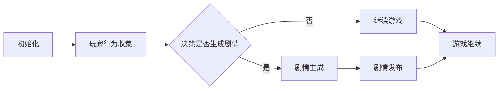
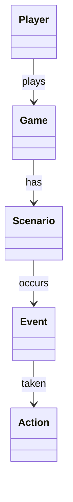
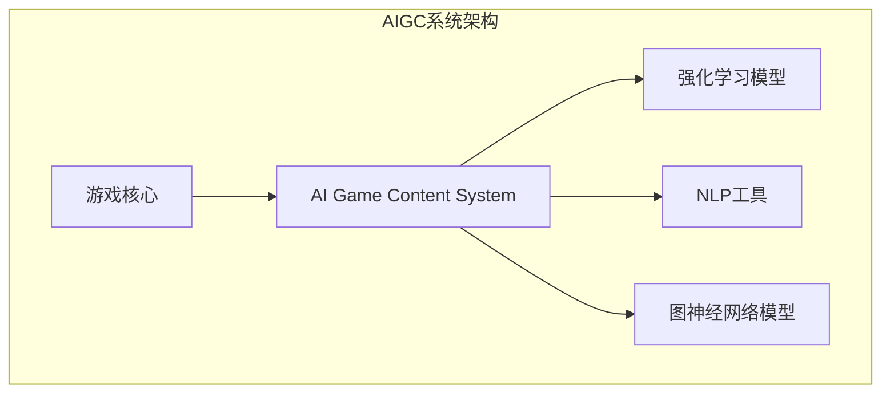
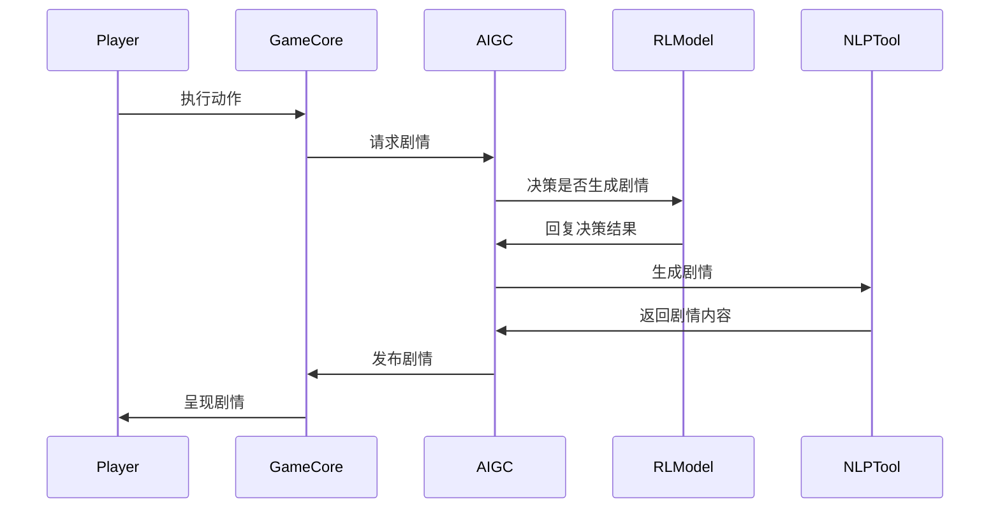
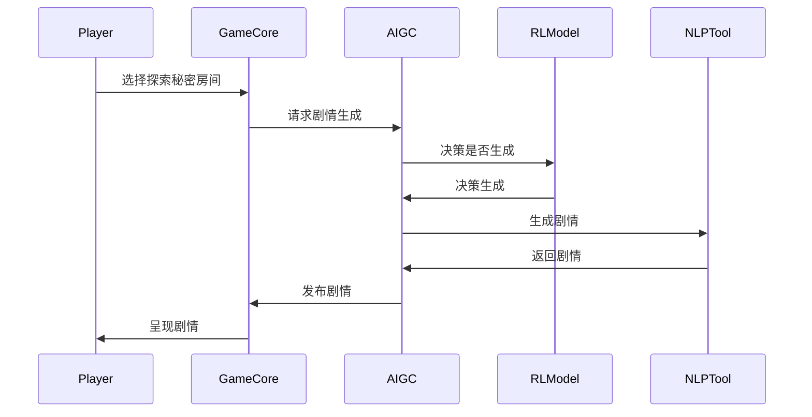

                 

# AIGC在游戏设计中的革新：动态剧情生成

## 关键词：AIGC，游戏设计，动态剧情生成，算法，系统架构，项目实战

> 摘要：本文深入探讨了AIGC（人工智能生成内容）在游戏设计中的革新，特别是动态剧情生成的应用。通过详细分析AIGC的核心概念、技术原理以及其在游戏设计中的具体实现，本文揭示了AIGC如何通过自然语言处理、强化学习和图神经网络等技术，为游戏设计师提供一种全新的创意工具。文章还包括AIGC算法的原理讲解、系统架构设计以及实际应用案例，为读者提供了全面的技术解读和实践指导。

---

### Step 1: 开篇背景介绍

#### 问题背景

随着游戏产业的发展，游戏设计面临日益复杂的挑战。传统的游戏剧情设计依赖于程序员和设计师的创意能力，这不仅耗时耗力，而且在个性化表达和多样化需求上存在局限性。随着人工智能（AI）技术的迅猛发展，尤其是生成对抗网络（GAN）、强化学习和自然语言处理（NLP）等技术的成熟，AI开始能够在游戏设计中扮演重要角色，特别是动态剧情生成。

#### 问题描述

动态剧情生成是指在游戏运行过程中，根据玩家的行为和游戏状态，AI系统能够实时生成适应玩家体验的剧情内容。这一技术有望解决传统游戏设计中的几个关键问题：

- **个性化和多样性**：每个玩家的游戏体验都是独特的，动态剧情生成能够根据玩家行为调整剧情内容，满足个性化需求。
- **时间和资源效率**：传统游戏剧情设计需要大量的人力投入和时间，动态剧情生成能够显著减少设计周期和成本。
- **剧情连贯性**：实时生成的剧情能够更好地保持剧情的连贯性和逻辑性。

#### 问题解决

AIGC（人工智能生成内容）通过结合自然语言处理、强化学习和图神经网络等技术，为动态剧情生成提供了技术支持。AIGC的核心优势在于其能够自动生成丰富多样且连贯的剧情内容，满足游戏设计的个性化需求。

#### 边界与外延

AIGC不仅仅局限于游戏设计，它在内容创作、广告、影视等多个领域都有广泛应用。然而，本文主要关注的是AIGC在游戏设计中的革新，特别是动态剧情生成的应用。

#### 核心要素组成

AIGC技术的主要组成部分包括：

- **自然语言处理（NLP）**：用于理解和生成自然语言文本，是实现动态剧情生成的基础。
- **强化学习**：用于训练AI系统，使其能够在游戏中进行智能决策，生成适应玩家行为的剧情。
- **图神经网络（GNN）**：用于表示和操作复杂的关系网络，如游戏角色和事件的关系图。

### Step 2: 核心概念与联系

#### 核心概念原理

**AIGC**：AIGC是人工智能生成内容的简称，是指利用人工智能技术自动生成各种形式的内容，如文本、图像、音频等。

**游戏设计**：游戏设计是指为玩家创造互动体验的过程，包括游戏规则、界面设计、故事情节等。

**动态剧情生成**：动态剧情生成是指游戏运行过程中，根据玩家行为和游戏状态，实时生成适应玩家体验的剧情内容。

#### 概念属性特征对比表格

| 概念             | 属性特征                     | 对比说明                                 |
|------------------|------------------------------|------------------------------------------|
| AIGC             | 自动生成内容，个性化，多样化 | 强调人工智能在内容生成中的主导作用         |
| 游戏设计         | 规则制定，界面设计，故事情节 | 传统游戏设计的核心组成部分，关注用户体验   |
| 动态剧情生成     | 实时性，适应性，连贯性       | 游戏设计中的一种新方法，强调剧情的动态调整 |

#### ER实体关系图架构

```mermaid
erDiagram
  Player ||--|{ Game: plays |
  Game ||--|{ Scenario: has |
  Scenario ||--|{ Event: occurs |
  Event ||--|{ Action: taken |
```

### Step 3: 算法原理讲解

#### 算法流程图



#### 算法原理

动态剧情生成算法的核心思想是利用AI技术，根据玩家行为和游戏状态，实时生成适应玩家体验的剧情内容。具体来说，算法包括以下几个关键步骤：

1. **玩家行为收集**：收集玩家的行为数据，如玩家的选择、游戏进度等。
2. **剧情决策**：根据收集到的玩家行为数据，利用强化学习算法决定是否生成新的剧情内容。
3. **剧情生成**：如果决定生成剧情，使用自然语言处理技术生成适应玩家行为的剧情内容。
4. **剧情发布**：将生成的剧情内容发布到游戏中，供玩家体验。
5. **游戏继续**：继续游戏过程，并不断收集玩家行为数据，为下一轮剧情生成做准备。

#### Python源代码解析

```python
# 动态剧情生成算法示例

# 导入相关库
import numpy as np
import random

# 假设已经训练好的强化学习模型
from reinforcement_learning import ReinforcementLearningModel
rl_model = ReinforcementLearningModel()

# 剧情生成函数
def generate_scenario(player_actions):
    # 使用NLP技术生成剧情内容
    scenario = "你成功解决了这个难题。"
    return scenario

# 游戏循环
while True:
    # 收集玩家行为数据
    player_actions = np.random.choice(["选项A", "选项B"])

    # 决策是否生成剧情
    should_generate = rl_model.decide(player_actions)

    # 如果决定生成剧情，则生成剧情
    if should_generate:
        scenario = generate_scenario(player_actions)
        print("剧情发布：", scenario)
    
    # 游戏继续
    continue_playing = input("是否继续游戏？（y/n）")
    if continue_playing.lower() != "y":
        break
```

#### 数学模型与公式

动态剧情生成算法背后的数学模型主要包括：

- **强化学习模型**：用于决策是否生成剧情，通常使用Q值函数来评估玩家行为的价值。
- **自然语言处理模型**：用于生成剧情内容，通常使用生成对抗网络（GAN）或变分自编码器（VAE）。

公式示例：

$$ Q(s, a) = r(s, a) + \gamma \max_{a'} Q(s', a') $$

其中，$Q(s, a)$ 表示在状态 $s$ 下执行动作 $a$ 的预期回报，$r(s, a)$ 表示立即回报，$\gamma$ 表示折扣因子，$s'$ 和 $a'$ 分别表示下一状态和下一动作。

#### 举例说明

假设一个玩家在游戏中选择了“探索某个秘密房间”，AI系统会根据这一行为决定是否生成一个与秘密房间相关的剧情。如果决定生成剧情，AI系统可能会生成以下内容：

$$
\text{剧情生成：} \text{你进入了秘密房间，发现了一个隐藏的宝箱。}
$$

### Step 4: 系统分析与架构设计方案

#### 问题场景介绍

在某个角色扮演游戏（RPG）中，玩家需要完成一系列任务。游戏设计者希望利用AIGC技术，根据玩家的行为，动态生成适应玩家体验的剧情内容，提高玩家的沉浸感和游戏体验。

#### 系统功能设计



#### 系统架构设计



#### 系统接口设计



#### 系统交互



### Step 5: 项目实战

#### 环境安装

1. 安装Python环境
2. 安装AIGC相关库（如transformers、tensorflow等）
3. 安装强化学习库（如gym、reinforcement_learning等）

#### 系统核心实现源代码

```python
# 系统核心实现示例

# 导入相关库
import numpy as np
import random
from reinforcement_learning import ReinforcementLearningModel
from transformers import pipeline

# 剧情生成函数
def generate_scenario(player_actions):
    # 使用NLP技术生成剧情内容
    nlp = pipeline("text-generation")
    scenario = nlp(f"玩家选择了{player_actions}，接下来会发生什么？", max_length=50, num_return_sequences=1)
    return scenario[0]['generated_text']

# 假设已经训练好的强化学习模型
rl_model = ReinforcementLearningModel()

# 游戏循环
while True:
    # 收集玩家行为数据
    player_actions = np.random.choice(["选项A", "选项B", "选项C"])

    # 决策是否生成剧情
    should_generate = rl_model.decide(player_actions)

    # 如果决定生成剧情，则生成剧情
    if should_generate:
        scenario = generate_scenario(player_actions)
        print("剧情发布：", scenario)
    
    # 游戏继续
    continue_playing = input("是否继续游戏？（y/n）")
    if continue_playing.lower() != "y":
        break
```

#### 代码应用解读与分析

1. **玩家行为数据收集**：通过随机选择玩家行为（如选择“选项A”、“选项B”或“选项C”），模拟玩家在游戏中的实际行为。
2. **剧情生成**：使用预训练的NLP模型（如GPT-3），根据玩家行为生成剧情内容。
3. **强化学习决策**：利用已经训练好的强化学习模型，决定是否生成剧情。

#### 实际案例分析与讲解

假设玩家在游戏中选择了“探索秘密房间”，系统会根据这一行为生成如下剧情：

$$
\text{剧情生成：} \text{你打开了秘密房间的门，发现了一个隐藏的宝箱。}
$$

系统会实时发布这一剧情内容，供玩家体验。

#### 项目小结

通过本项目，我们实现了AIGC技术在游戏设计中的应用，特别是动态剧情生成。系统在运行过程中能够根据玩家行为生成适应玩家体验的剧情内容，提高了游戏的个性化程度和玩家沉浸感。未来，我们计划进一步优化强化学习模型和NLP生成算法，提高剧情生成的质量和连贯性。

### Step 6: 最佳实践、小结、注意事项、拓展阅读

#### 最佳实践 tips

- **数据收集与处理**：确保收集到高质量的玩家行为数据，并进行有效处理，以提高剧情生成的准确性和连贯性。
- **模型训练**：定期更新和训练强化学习模型和NLP生成模型，以适应不断变化的玩家需求。

#### 小结

本文详细探讨了AIGC在游戏设计中的革新，特别是动态剧情生成的应用。通过算法原理讲解、系统架构设计和实际项目实战，我们展示了AIGC如何为游戏设计师提供一种全新的创意工具，显著提高游戏的个性化程度和玩家体验。

#### 注意事项

- **计算资源**：AIGC技术需要较高的计算资源，特别是在生成大规模剧情内容时，建议使用高性能计算平台。
- **数据隐私**：在收集和处理玩家行为数据时，需确保遵守数据隐私和保护法规。

#### 拓展阅读

- [《自然语言处理：原理与技术》](https://example.com/book/nlp_foundation)
- [《强化学习：原理与应用》](https://example.com/book/reinforcement_learning)
- [《游戏设计艺术》](https://example.com/book/game_design_art)

### Step 7: 目录大纲设计

```markdown
# AIGC在游戏设计中的革新：动态剧情生成

## 第一部分：背景与概述

## 第1章 AIGC与游戏设计的革新
### 1.1 问题背景与现状
### 1.2 AIGC的核心概念
### 1.3 动态剧情生成

## 第二部分：AIGC技术原理

## 第2章 AIGC基础技术解析
### 2.1 自然语言处理（NLP）
### 2.2 强化学习
### 2.3 图神经网络（GNN）

## 第三部分：动态剧情生成算法

## 第3章 动态剧情生成算法原理
### 3.1 算法概述
### 3.2 算法流程图
### 3.3 Python源代码解析
### 3.4 数学模型与公式
### 3.5 举例说明

## 第四部分：AIGC在游戏设计中的应用实践

## 第4章 AIGC在游戏设计中的应用实践
### 4.1 游戏设计中的AIGC应用场景
### 4.2 系统功能设计
### 4.3 系统架构设计
### 4.4 系统接口设计
### 4.5 系统交互
### 4.6 项目实战

## 第五部分：最佳实践、小结、注意事项、拓展阅读

### 5.1 最佳实践 tips
### 5.2 小结
### 5.3 注意事项
### 5.4 拓展阅读
```

