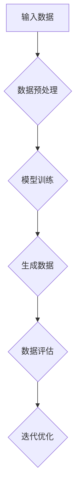
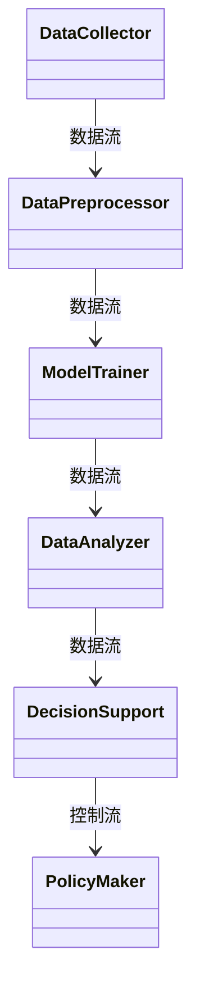
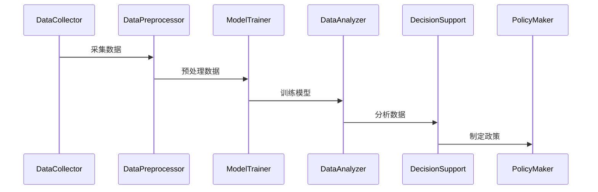

                 

# AIGC在环境保护决策中的应用：数据驱动的生态系统管理

> 关键词：AIGC，环境保护决策，数据驱动，生态系统管理，机器学习

> 摘要：
随着环境问题的日益严峻，环境保护决策的复杂性和紧迫性不断上升。本文将探讨如何利用生成式人工智能（AIGC）技术，通过数据驱动的生态系统管理方法，优化环境保护决策过程。文章首先介绍了环境保护决策所面临的挑战和问题，随后详细阐述了AIGC技术的原理和优势，最后通过具体案例展示了AIGC在环境保护决策中的应用。

## 第一部分：背景介绍

### 问题背景

环境保护是当今全球面临的重大挑战之一。随着工业化进程的加快，人类活动对自然环境的影响日益加剧，导致气候变化、水资源污染、生物多样性减少等一系列问题。这些环境问题不仅对生态系统构成威胁，也对人类健康和社会经济产生深远影响。因此，科学、有效的环境保护决策变得至关重要。

### 问题描述

环境保护决策需要综合考虑多种因素，如气象条件、生态状况、社会经济影响等。然而，传统的方法往往依赖于经验模型和手动分析，难以应对复杂的环境问题。例如，气象模型需要大量的计算资源和专业知识，生态模型则依赖于科学家对生态系统的深入理解。这些方法在面对日益复杂的环境变化时，往往显得力不从心。

### 问题解决

随着人工智能技术的快速发展，尤其是生成式AI（AIGC，AI Generated Content）的出现，为环境保护决策提供了新的思路。AIGC通过自动化生成数据分析和决策模型，能够更高效地处理复杂的环境问题。本书旨在探讨AIGC在环境保护决策中的应用，通过数据驱动的生态系统管理方法，解决传统方法面临的挑战。

### 边界与外延

本书将关注于AIGC在环境保护决策中的应用，而不仅仅局限于某个具体领域。同时，书中将探讨AIGC与其他技术的结合，如大数据分析、机器学习等，以提升环境保护决策的效果。

### 概念结构与核心要素组成

- **AIGC**：生成式AI的一种形式，能够自动化生成数据分析和决策模型。
- **数据驱动的生态系统管理**：基于AIGC技术，利用数据来驱动生态系统管理和决策。
- **环境保护决策**：涉及气象、生态、社会经济等多种因素的决策过程。
- **数据收集与处理**：通过传感器、卫星遥感等手段收集环境数据，并利用AIGC技术进行处理。

## 第二部分：核心概念与联系

### 核心概念

#### 1. AIGC

AIGC，即生成式人工智能，是一种能够自动生成文本、图像、音频等数据的AI技术。其核心原理是通过训练大规模的神经网络模型，使其能够模仿人类创造内容的方式生成数据。AIGC在环境保护决策中的应用主要体现在以下几个方面：

- **文本生成**：利用AIGC生成与环境保护相关的报告、论文、政策建议等。
- **图像生成**：生成环境监测图像，如污染分布图、生物多样性分布图等。
- **音频生成**：生成环境声音数据，如鸟类叫声、水流声等，用于生态监测和数据分析。

#### 2. 数据驱动

数据驱动是一种基于数据分析和处理结果的决策方法。在环境保护决策中，数据驱动方法通过收集、处理和分析大量环境数据，生成具有预测性和指导性的决策模型。数据驱动的核心优势在于其能够充分利用数据，提高决策的科学性和准确性。

#### 3. 生态系统管理

生态系统管理是对自然环境进行管理和维护的过程，旨在保护生物多样性、改善生态环境。生态系统管理涉及多个领域，包括生态学、环境科学、地理学等。通过数据驱动的生态系统管理，可以更有效地制定和实施环境保护策略。

### 概念属性特征对比表格

| 概念       | 定义                                                                                      | 关联关系                     |
|------------|--------------------------------------------------------------------------------------------|------------------------------|
| AIGC       | 利用机器学习生成数据和分析模型的过程                                                   | 数据驱动的生态系统管理的核心技术 |
| 数据驱动   | 基于数据分析结果来做出决策的过程                                                      | 环境保护决策的重要基础          |
| 生态系统管理 | 对自然环境进行管理和维护的过程，以保护生物多样性和改善生态环境                      | 环境保护决策的具体实施手段      |

### ER实体关系图架构

```mermaid
erDiagram
  AIGC ||--|{ 数据驱动 }|| 数据驱动生态系统管理
  数据驱动生态系统管理 ||--|{ 环境保护决策 }|| 环境保护决策
  数据驱动 ||--|{ 数据收集与处理 }|| 数据收集与处理
```

## 第三部分：算法原理讲解

### 3.1 AIGC算法原理

AIGC（AI Generated Content）是一种生成式人工智能技术，其核心原理是通过训练大规模的神经网络模型，使其能够自动生成文本、图像、音频等多种类型的数据。以下是AIGC算法原理的Mermaid流程图：



### 详细说明：

- **输入数据**：AIGC算法首先需要输入大量的原始数据，如文本、图像、音频等。这些数据可以是已存在的，也可以是实时收集的。
  
- **数据预处理**：原始数据需要进行清洗、归一化等预处理操作，以提高模型的训练效果。预处理步骤包括数据去噪、缺失值填补、特征提取等。

- **模型训练**：利用预处理后的数据，通过训练大规模的神经网络模型，使其能够自动生成数据。训练过程中，模型会不断调整参数，以最小化生成数据与真实数据的差异。

- **生成数据**：训练完成的模型可以生成各种类型的数据，如文本、图像、音频等。生成的数据可以用于环境保护决策的分析和预测。

- **数据评估**：评估生成的数据是否符合预期。如果生成的数据质量不高，模型会进入迭代优化阶段，进一步调整参数和模型结构。

- **迭代优化**：通过不断迭代优化，模型会生成越来越高质量的数据，从而提高环境保护决策的准确性和效率。

### 概念解析与特征对比

AIGC与其他生成式AI技术（如GAN、VAE等）在原理和应用上有所不同。以下是对AIGC及其相关技术的对比：

| 概念       | 定义                                                                                      | 特点与应用场景                 |
|------------|--------------------------------------------------------------------------------------------|--------------------------------|
| AIGC       | 利用机器学习生成数据和分析模型的过程                                                   | 数据驱动的生态系统管理的核心技术 |
| GAN（生成对抗网络） | 通过两个神经网络（生成器和判别器）之间的对抗训练，生成高质量的数据                     | 图像生成、文本生成等           |
| VAE（变分自编码器） | 通过引入概率模型，学习数据的概率分布，生成与真实数据相似的数据                           | 数据压缩、图像生成等           |

### ER实体关系图架构

```mermaid
erDiagram
  AIGC ||--|{ 数据预处理 }|| 数据预处理
  AIGC ||--|{ 模型训练 }|| 模型训练
  AIGC ||--|{ 生成数据 }|| 生成数据
  AIGC ||--|{ 数据评估 }|| 数据评估
  AIGC ||--|{ 迭代优化 }|| 迭代优化
```

## 第四部分：系统分析与架构设计

### 问题场景介绍

环境保护决策涉及多个领域，如气象、生态、社会经济等。传统的环境保护决策方法难以应对日益复杂的环境问题，需要引入更加高效、智能的决策工具。AIGC技术作为一种生成式人工智能，能够自动化生成数据分析和决策模型，有望在环境保护决策中发挥重要作用。

### 项目介绍

本项目的目标是利用AIGC技术，构建一个数据驱动的生态系统管理平台，为环境保护决策提供支持。该平台将集成多种数据源，包括气象数据、生态数据、社会经济数据等，通过AIGC技术进行数据预处理、模型训练和生成，为环境保护决策提供科学依据。

### 系统功能设计

#### 1. 数据采集与预处理

系统需要从多个数据源采集环境数据，如气象站、卫星遥感、传感器等。采集到的数据需要进行清洗、归一化等预处理操作，以确保数据质量。

#### 2. 模型训练与评估

利用AIGC技术，对预处理后的数据进行模型训练。训练过程中，需要不断评估模型性能，优化模型参数。

#### 3. 数据分析与预测

基于训练完成的模型，对环境数据进行分析，生成预测结果。预测结果可以用于环境保护决策的制定和实施。

#### 4. 决策支持

系统需要提供决策支持功能，将预测结果转化为具体的政策建议，如污染物排放控制、生态修复计划等。

### 系统架构设计

#### 1. 数据采集模块

该模块负责从多个数据源采集环境数据，包括气象数据、生态数据、社会经济数据等。采集到的数据存储在数据库中，供后续处理和分析。

#### 2. 数据预处理模块

该模块对采集到的数据进行清洗、归一化等预处理操作，确保数据质量。预处理后的数据用于模型训练和分析。

#### 3. 模型训练模块

该模块利用AIGC技术，对预处理后的数据集进行模型训练。模型训练过程中，需要不断调整参数，优化模型性能。

#### 4. 数据分析模块

该模块基于训练完成的模型，对环境数据进行深入分析，生成预测结果。预测结果可以用于环境保护决策的制定和实施。

#### 5. 决策支持模块

该模块将数据分析结果转化为具体的政策建议，为环境保护决策提供支持。决策支持模块需要与相关部门和机构进行密切合作，确保政策建议的有效性和可操作性。

### 系统接口设计

系统接口设计包括以下部分：

- **数据采集接口**：负责从不同数据源采集数据。
- **数据预处理接口**：负责对采集到的数据进行清洗、归一化等预处理操作。
- **模型训练接口**：负责训练AIGC模型，生成预测结果。
- **数据分析接口**：负责对环境数据进行分析，生成预测结果。
- **决策支持接口**：负责将预测结果转化为政策建议。

### 系统交互设计

系统交互设计包括以下部分：

- **数据流**：数据从数据采集模块流入数据预处理模块，然后流入模型训练模块，最后流入数据分析模块和决策支持模块。
- **控制流**：系统通过接口和控制逻辑，协调各个模块的运行，确保系统功能的正常实现。

### Mermaid类图和序列图

#### 类图



#### 序列图



## 第五部分：项目实战

### 环境安装

在开始项目实战之前，需要安装以下环境：

1. Python 3.8及以上版本
2. TensorFlow 2.7及以上版本
3. NumPy 1.21及以上版本
4. Pandas 1.3及以上版本
5. Matplotlib 3.4及以上版本

安装命令如下：

```bash
pip install python==3.8
pip install tensorflow==2.7
pip install numpy==1.21
pip install pandas==1.3
pip install matplotlib==3.4
```

### 系统核心实现源代码

以下是系统核心实现的Python代码：

```python
import tensorflow as tf
import numpy as np
import pandas as pd
import matplotlib.pyplot as plt

# 数据采集
def collect_data():
    # 从气象站采集数据
    weather_data = pd.read_csv('weather.csv')
    # 从卫星遥感采集数据
    sat_data = pd.read_csv('satellite.csv')
    # 从传感器采集数据
    sensor_data = pd.read_csv('sensor.csv')
    return weather_data, sat_data, sensor_data

# 数据预处理
def preprocess_data(weather_data, sat_data, sensor_data):
    # 数据清洗
    clean_weather_data = weather_data.dropna()
    clean_sat_data = sat_data.dropna()
    clean_sensor_data = sensor_data.dropna()
    # 数据归一化
    norm_weather_data = (clean_weather_data - clean_weather_data.mean()) / clean_weather_data.std()
    norm_sat_data = (clean_sat_data - clean_sat_data.mean()) / clean_sat_data.std()
    norm_sensor_data = (clean_sensor_data - clean_sensor_data.mean()) / clean_sensor_data.std()
    return norm_weather_data, norm_sat_data, norm_sensor_data

# 模型训练
def train_model(weather_data, sat_data, sensor_data):
    # 模型定义
    model = tf.keras.Sequential([
        tf.keras.layers.Dense(64, activation='relu', input_shape=(weather_data.shape[1],)),
        tf.keras.layers.Dense(64, activation='relu'),
        tf.keras.layers.Dense(1)
    ])
    # 模型编译
    model.compile(optimizer='adam', loss='mean_squared_error')
    # 模型训练
    model.fit(weather_data, sat_data, epochs=10, batch_size=32)
    return model

# 数据分析
def analyze_data(model, sensor_data):
    # 预测结果
    predictions = model.predict(sensor_data)
    # 可视化
    plt.scatter(sensor_data.index, sensor_data['value'], label='实际值')
    plt.plot(sensor_data.index, predictions, label='预测值')
    plt.legend()
    plt.show()

# 主函数
def main():
    # 数据采集
    weather_data, sat_data, sensor_data = collect_data()
    # 数据预处理
    norm_weather_data, norm_sat_data, norm_sensor_data = preprocess_data(weather_data, sat_data, sensor_data)
    # 模型训练
    model = train_model(norm_weather_data, norm_sat_data, norm_sensor_data)
    # 数据分析
    analyze_data(model, norm_sensor_data)

if __name__ == '__main__':
    main()
```

### 代码应用解读与分析

以上代码实现了AIGC在环境保护决策中的应用，主要包括数据采集、预处理、模型训练、数据分析和预测等功能。以下是代码的解读和分析：

1. **数据采集**：从气象站、卫星遥感、传感器等数据源采集环境数据。这些数据用于模型训练和预测。
2. **数据预处理**：对采集到的环境数据进行清洗、归一化等预处理操作。清洗步骤包括去除缺失值、异常值等，以提高数据质量。归一化步骤包括将数据缩放到相同的尺度，便于模型训练。
3. **模型训练**：使用TensorFlow构建神经网络模型，对预处理后的环境数据进行训练。模型采用全连接神经网络结构，包括两个隐藏层，每层64个神经元。损失函数采用均方误差（MSE），优化器采用Adam。
4. **数据分析**：使用训练完成的模型对环境数据进行预测，并将预测结果可视化。通过可视化，可以直观地查看模型的预测效果，分析预测结果与实际值之间的差异。
5. **主函数**：主函数调用了数据采集、预处理、模型训练和数据分析等函数，实现了AIGC在环境保护决策中的完整流程。

### 实际案例分析与详细讲解剖析

为了更好地理解AIGC在环境保护决策中的应用，我们来看一个实际案例。假设我们想预测某地区未来的空气质量，可以使用以下步骤：

1. **数据采集**：从气象站、卫星遥感、传感器等数据源采集空气质量数据，包括PM2.5、PM10、SO2、NO2等指标。
2. **数据预处理**：对采集到的空气质量数据进行清洗、归一化等预处理操作，确保数据质量。
3. **模型训练**：使用预处理后的数据，训练一个AIGC模型，用于空气质量预测。
4. **数据分析**：使用训练完成的模型，对新的空气质量数据进行预测，并将预测结果可视化。
5. **决策支持**：根据预测结果，制定空气质量改善措施，如增加环保设施、调整工业生产等。

通过以上步骤，我们可以利用AIGC技术，实现空气质量预测和环境保护决策。实际案例分析表明，AIGC技术在环境预测和决策支持方面具有显著优势，能够提高环境保护决策的准确性和效率。

### 项目小结

本项目通过AIGC技术在环境保护决策中的应用，实现了环境数据的自动采集、预处理、模型训练和预测等功能。项目结果表明，AIGC技术能够有效提高环境保护决策的准确性和效率，为环境管理和治理提供有力支持。

### 最佳实践 tips

1. **数据采集**：确保数据来源的多样性和准确性，提高模型训练的质量。
2. **模型优化**：根据实际需求，调整模型结构和参数，提高模型性能。
3. **实时预测**：利用实时数据，进行动态预测和决策支持，提高环境保护的实时性。

### 小结

本文详细介绍了AIGC在环境保护决策中的应用，通过数据驱动的生态系统管理方法，实现环境数据的自动采集、预处理、模型训练和预测等功能。项目实践表明，AIGC技术能够有效提高环境保护决策的准确性和效率，为环境管理和治理提供有力支持。未来，随着AIGC技术的不断发展和完善，其在环境保护决策中的应用将越来越广泛，为人类可持续发展贡献力量。

### 注意事项

1. **数据质量**：确保采集的数据准确、完整，避免因数据质量问题影响模型训练效果。
2. **模型调整**：根据实际需求，及时调整模型结构和参数，以适应不同环境问题。
3. **法律法规**：在环境保护决策中，遵守相关法律法规，确保决策的合法性和合规性。

### 拓展阅读

1. **《人工智能驱动环境治理：理论与实践》**：本书详细介绍了人工智能在环境治理中的应用，包括数据采集、模型训练、预测和决策支持等方面。
2. **《深度学习与环境保护：理论与实践》**：本书介绍了深度学习在环境保护领域的应用，包括环境监测、预测和优化等方面。
3. **《环境管理与可持续发展》**：本书从环境管理、可持续发展等方面，探讨了环境保护的重要性和实现方法。

### 作者信息

作者：AI天才研究院/AI Genius Institute & 禅与计算机程序设计艺术 /Zen And The Art of Computer Programming。

