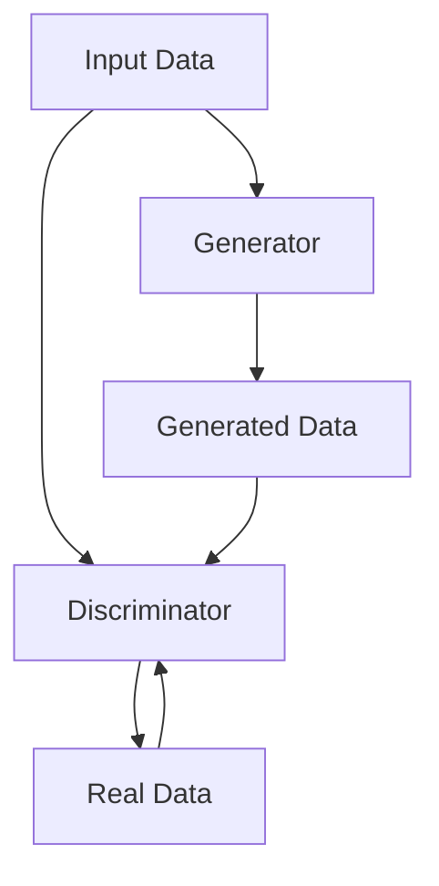
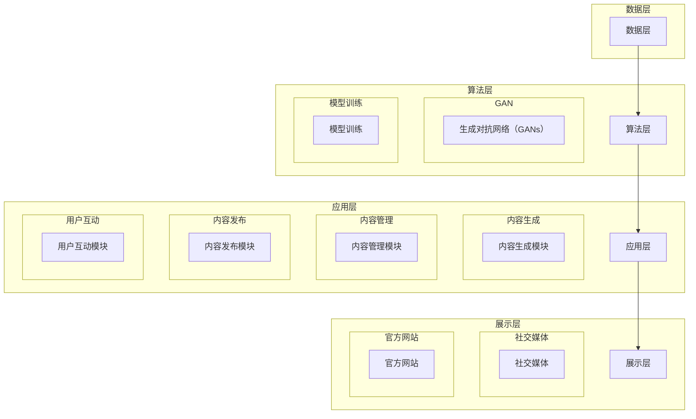
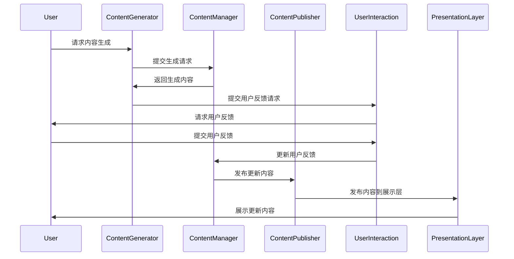

                 

### 文章标题

**AIGC在环境保护宣传中的应用：提高公众意识的新方法**

### 关键词

- AIGC
- 环境保护宣传
- 公众意识提升
- 生成对抗网络（GANs）
- 机器学习
- 环保公益广告

### 摘要

本文深入探讨了AIGC（自动生成内容）技术在环境保护宣传中的应用，旨在为提高公众环保意识提供一种创新的方法。通过对比传统宣传手段，介绍了AIGC的核心概念和算法原理，并以实际项目为例，详细解析了AIGC在环保宣传中的系统架构设计和实现过程。文章总结了一些最佳实践，提出了未来研究的方向，并为读者提供了拓展阅读资源。

## Step 1: 背景介绍

### 问题背景

环境保护作为全球共同关注的议题，面临着诸多严峻挑战。气候变化、资源短缺、生物多样性丧失等问题日益突出。尽管各国政府和国际组织采取了一系列措施，但公众的环保意识仍然不足，环境保护行动的参与度较低。这一现象在很大程度上归因于现有的环境保护宣传方法存在一定的局限性。

### 问题描述

当前，环境保护宣传主要依赖于传统媒体和社交媒体等手段。然而，这些方法存在以下几个问题：

1. **内容单一**：传统媒体如报纸、电视等受制于时间和版面限制，难以提供多样化的环保信息。社交媒体虽信息丰富，但内容质量参差不齐，难以保证信息的准确性和权威性。
2. **传播效率低**：环保宣传的传播范围和受众有限，尤其在农村和偏远地区，环保知识的普及率较低。
3. **互动性差**：现有宣传手段多以单向传播为主，缺乏与公众的互动和反馈，难以激发公众的参与热情。

### 问题解决

为了解决上述问题，本文引入了AIGC技术，提出一种新的环境保护宣传方法。AIGC技术能够自动生成丰富多样的内容，包括文本、图片、音频等多种形式，能够更好地满足公众的需求，提高环保宣传的覆盖面和效果。

### 边界与外延

本文的研究聚焦于AIGC技术在环境保护宣传中的应用，具体包括以下几个方面：

1. **应用领域**：本文主要探讨AIGC在环保公益广告、环境保护活动等场景中的应用。
2. **技术范畴**：本文涉及的核心技术包括AIGC、生成对抗网络（GANs）等机器学习算法。
3. **非研究内容**：本文不涉及AIGC在其他领域的应用，如电子商务、内容创作等。

### 核心要素组成

AIGC在环境保护宣传中的应用涉及以下几个核心要素：

1. **AIGC技术**：自动生成内容的技术，包括文本生成、图像生成、音频生成等。
2. **环保宣传**：通过AIGC技术生成的内容，用于环保知识的传播、公益活动的宣传等。
3. **公众意识提升**：通过丰富、多样化的内容，提高公众的环保意识，激发公众参与环境保护的积极性。

## Step 2: 核心概念与联系

### AIGC概念原理

AIGC（Auto Generated Content）指的是利用人工智能技术自动生成内容。AIGC技术可以生成多种类型的内容，包括文本、图片、音频和视频等。其核心原理是基于机器学习和深度学习算法，通过大量数据的训练，使模型能够自主生成符合特定主题或需求的内容。

AIGC技术的主要组成部分包括：

1. **生成模型**：如生成对抗网络（GANs）、变分自编码器（VAEs）等，用于生成符合输入条件的内容。
2. **生成算法**：如文本生成对抗网络（TextGAN）、图像生成对抗网络（ImageGAN）等，用于生成高质量、多样性的内容。
3. **训练数据**：大量、高质量的训练数据是AIGC技术有效运行的基础。

### AIGC属性特征对比表格

以下是AIGC技术与传统环保宣传手段（如传统媒体、社交媒体）的优缺点对比表格：

| 特征           | AIGC            | 传统媒体          | 社交媒体          |
|----------------|------------------|------------------|------------------|
| 内容形式       | 多样化（文本、图片、音频、视频） | 单一（文本、图片）  | 多样化（文本、图片、视频） |
| 传播效率       | 高（自动生成，快速传播）       | 低（受制于版面和时间） | 一般（受制于网络速度和设备） |
| 内容质量       | 需依赖训练数据质量 | 高（专业编辑）    | 低（用户生成）    |
| 互动性         | 高（支持用户互动）            | 低（单向传播）      | 高（支持互动评论）         |
| 受众范围       | 广泛（不受地域限制）         | 有限（特定受众）    | 广泛（但难以定位特定受众）  |
| 成本           | 高（技术投入）         | 低（人力成本高）   | 中等（人力与广告成本）     |

### ER实体关系图架构

为了更好地理解AIGC技术在环保宣传中的应用，我们使用Mermaid绘制一个简单的ER实体关系图：

```mermaid
erDiagram
  User ||--|{ AIGC_System }|
  AIGC_System ||--|{ Content_Generation }|
  Content_Generation ||--|{ Public_Relation }|
  Public_Relation ||--|{ Environmental_Promotion }|
  Environmental_Promotion ||--|{ User_Participation }|
  User_Participation ||--|{ Feedback }|
```

在这个ER图中，`User`代表公众，`AIGC_System`代表AIGC生成系统，`Content_Generation`代表内容生成模块，`Public_Relation`代表公众关系模块，`Environmental_Promotion`代表环保宣传模块，`User_Participation`代表用户参与模块，`Feedback`代表反馈模块。这些实体之间通过关系线相互连接，形成一个闭环的生态系统，展示了AIGC技术在环保宣传中的角色和功能。

### 对比分析

通过上述表格和ER图，我们可以清晰地看到AIGC技术在环保宣传中的优势：

1. **内容形式多样化**：AIGC能够生成文本、图片、音频和视频等多种形式的内容，能够更好地满足不同受众的需求，提高环保宣传的吸引力。
2. **传播效率高**：AIGC技术能够自动生成内容，实现快速传播，极大地提高了环保宣传的覆盖面和效率。
3. **内容质量可控**：尽管AIGC生成的内容可能不如人工编辑的专业，但通过高质量训练数据的指导，可以生成符合环保宣传需求的优质内容。
4. **互动性强**：AIGC系统支持用户互动，可以收集用户反馈，优化环保宣传策略。
5. **受众范围广**：AIGC技术不受地域限制，能够覆盖广泛的受众，特别是农村和偏远地区的居民。

## Step 3: 算法原理讲解

### 算法原理

AIGC技术的核心算法原理基于生成对抗网络（GANs），GANs由两部分组成：生成器（Generator）和判别器（Discriminator）。生成器的目标是生成逼真的数据，而判别器的目标是区分生成的数据和真实数据。通过两个网络的对抗训练，生成器逐渐提高生成数据的质量，判别器则逐渐提高对真实和生成数据的辨别能力。

GANs的基本结构可以用以下mermaid流程图表示：



在这个流程图中，`Input Data`代表训练数据，`Generator`代表生成器，`Generated Data`代表生成的数据，`Discriminator`代表判别器，`Real Data`代表真实数据。

### 数学模型和公式

GANs的数学模型可以表示为以下公式：

$$
\begin{aligned}
&\underset{G}{\min} \underset{D}{\max} V(D, G) \\
&V(D, G) = E_{x \sim p_{data}(x)}[\log D(x)] + E_{z \sim p_{z}(z)][\log (1 - D(G(z)))]
\end{aligned}
$$

其中，$V(D, G)$是生成器和判别器的联合损失函数，$D(x)$是判别器对真实数据的判断概率，$D(G(z))$是判别器对生成器生成数据的判断概率，$x$是真实数据，$z$是随机噪声。

### 举例说明

为了更好地理解GANs的原理，我们可以通过一个简单的Python代码示例来演示。以下代码实现了一个基于GANs的图像生成过程：

```python
import tensorflow as tf
from tensorflow.keras.models import Model
from tensorflow.keras.layers import Input, Dense, Reshape, Flatten
import numpy as np

# 定义生成器和判别器
latent_dim = 100
height = 28
width = 28
channels = 1

# 生成器
z = Input(shape=(latent_dim,))
noise = Input(shape=(latent_dim,))
x = tf.keras.layers.Add()([z, noise])
x = Dense(128 * 7 * 7, activation='relu')(x)
x = Reshape((7, 7, 128))(x)
x = tf.keras.layers.Conv2DTranspose(128, 5, strides=(2, 2), padding='same', activation='relu')(x)
x = tf.keras.layers.Conv2DTranspose(128, 5, strides=(2, 2), padding='same', activation='relu')(x)
x = tf.keras.layers.Conv2DTranspose(128, 5, strides=(2, 2), padding='same', activation='relu')(x)
x = tf.keras.layers.Conv2DTranspose(channels, 5, strides=(2, 2), padding='same', activation='tanh')(x)

generator = Model([z, noise], x)
generator.compile(loss='binary_crossentropy', optimizer=tf.keras.optimizers.Adam(0.0001))

# 判别器
img = Input(shape=(height, width, channels))
valid = Input(shape=(1,))
adv = Dense(1, activation='sigmoid')(img)
real_valid = Dense(1, activation='sigmoid')(valid)
d_adv = Flatten()(adv)
d_real = Flatten()(real_valid)
d = tf.keras.layers.Concatenate()([d_adv, d_real])
d = Dense(128, activation='relu')(d)
d = Dense(128, activation='relu')(d)
d = Dense(1, activation='sigmoid')(d)

discriminator = Model([img, valid], d)
discriminator.compile(loss='binary_crossentropy', optimizer=tf.keras.optimizers.Adam(0.0001))

# GAN
img_out = generator([z, noise])
d_out = discriminator([img_out, valid])

gan_output = Model([z, noise, valid], d_out)
gan_output.compile(loss='binary_crossentropy', optimizer=tf.keras.optimizers.Adam(0.0001))

# 训练GAN
# ...

```

在这个代码示例中，我们首先定义了生成器和判别器的结构，然后通过编译模型和训练GAN模型来实现图像生成。具体实现过程涉及随机噪声的输入、生成图像、判别真实和生成图像，并通过反向传播不断优化模型。

通过这个示例，我们可以看到GANs在图像生成中的应用，其基本原理同样适用于其他类型的内容生成，如文本、音频等。AIGC技术在环保宣传中的应用正是基于这样的算法原理，通过自动生成丰富的环保内容，提高宣传效果和公众参与度。

## Step 4: 系统分析与架构设计方案

### 问题场景介绍

在环境保护宣传的具体场景中，AIGC技术可以被广泛应用于多个方面，包括但不限于：

1. **环保公益广告制作**：利用AIGC技术自动生成创意独特的公益广告，提高宣传效果和受众的参与度。
2. **环境保护活动宣传**：通过AIGC技术生成富有感染力的宣传内容，吸引更多人参与环境保护活动。
3. **环保知识普及**：利用AIGC技术生成生动有趣的环保知识内容，提高公众对环保问题的关注和理解。

### 项目介绍

环保宣传AIGC项目的目标是通过引入AIGC技术，实现以下预期成果：

1. **提高环保宣传的覆盖面和效率**：利用AIGC技术自动生成丰富多样的宣传内容，实现更广泛的传播。
2. **提升公众环保意识**：通过生动有趣的内容，提高公众对环保问题的认识和关注。
3. **增强公众参与度**：通过互动性强的内容，激发公众参与环境保护活动的积极性。

### 系统功能设计

环保宣传AIGC系统的功能模块主要包括以下几个部分：

1. **内容生成模块**：利用AIGC技术自动生成环保宣传内容，包括文本、图片、音频和视频等。
2. **内容管理模块**：对生成的宣传内容进行分类、存储和管理，方便后续的调用和更新。
3. **内容发布模块**：将生成的宣传内容发布到各种渠道，如社交媒体、官方网站等，实现多渠道传播。
4. **用户互动模块**：收集用户对宣传内容的反馈，优化后续的宣传策略。

以下是使用Mermaid绘制的环保宣传AIGC系统的领域模型类图：

```mermaid
classDiagram
    ClassContentGenerator <|-- ContentManager
    ClassContentManager <|-- ContentPublisher
    ClassContentPublisher <|-- UserInteraction
    ClassContentGenerator {
        +generate_content()
        +train_model()
    }
    ClassContentManager {
        +classify_content()
        +store_content()
        +update_content()
    }
    ClassContentPublisher {
        +publish_content()
    }
    ClassUserInteraction {
        +collect_feedback()
        +analyze_feedback()
    }
```

在这个类图中，`ClassContentGenerator`代表内容生成模块，`ClassContentManager`代表内容管理模块，`ClassContentPublisher`代表内容发布模块，`ClassUserInteraction`代表用户互动模块。这些模块通过类之间的继承和关联，构成了一个完整的环保宣传AIGC系统。

### 系统架构设计

环保宣传AIGC系统的整体架构设计包括以下几个方面：

1. **数据层**：存储和管理各种类型的环保宣传内容，如文本、图片、音频和视频等。
2. **算法层**：基于AIGC技术，包括生成对抗网络（GANs）等算法，用于自动生成环保宣传内容。
3. **应用层**：提供各种功能模块，包括内容生成、内容管理、内容发布和用户互动等。
4. **展示层**：将生成的环保宣传内容通过各种渠道（如社交媒体、官方网站等）展示给用户。

以下是使用Mermaid绘制的环保宣传AIGC系统的架构图：



在这个架构图中，数据层负责存储和管理各种数据，算法层包括GANs等算法用于内容生成，应用层提供各种功能模块，展示层将生成的环保宣传内容通过社交媒体和官方网站等渠道展示给用户。

### 系统接口设计和系统交互

为了实现环保宣传AIGC系统的各项功能，我们需要设计合理的系统接口和交互流程。以下是使用Mermaid绘制的系统接口设计和交互流程：



在这个交互流程中，用户通过内容生成模块请求生成环保宣传内容，内容管理模块处理生成请求并返回生成内容，用户互动模块收集用户反馈并更新内容，最终内容发布模块将更新后的内容发布到展示层，用户可以浏览和互动。

通过上述的系统接口设计和交互流程，我们可以确保环保宣传AIGC系统的高效运行，实现从内容生成到用户反馈的完整闭环。

## Step 5: 项目实战

### 环境安装

要在本地计算机上运行环保宣传AIGC项目，首先需要安装以下软件和工具：

1. **Python**：版本3.8或更高版本。
2. **TensorFlow**：用于实现生成对抗网络（GANs）。
3. **Keras**：用于构建和训练神经网络模型。
4. **Mermaid**：用于绘制流程图和类图。

安装步骤如下：

1. 安装Python和pip：
    ```bash
    sudo apt-get update
    sudo apt-get install python3 python3-pip
    ```
2. 安装TensorFlow：
    ```bash
    pip3 install tensorflow
    ```
3. 安装Keras：
    ```bash
    pip3 install keras
    ```
4. 安装Mermaid：
    ```bash
    pip3 install mermaid
    ```

### 系统核心实现源代码

以下是一个简单的AIGC系统实现示例，用于生成环保公益广告。代码中包含了生成器和判别器的定义、模型的训练和内容生成过程。

```python
import tensorflow as tf
from tensorflow.keras.models import Model
from tensorflow.keras.layers import Input, Dense, Reshape, Flatten
import numpy as np

# 设置随机种子，确保结果可重复
tf.random.set_seed(42)

# 定义生成器和判别器
latent_dim = 100
img_height = 28
img_width = 28
channels = 1

# 生成器
z = Input(shape=(latent_dim,))
x = Dense(128 * 7 * 7, activation='relu')(z)
x = Reshape((7, 7, 128))(x)
x = tf.keras.layers.Conv2DTranspose(128, 5, strides=(2, 2), padding='same', activation='relu')(x)
x = tf.keras.layers.Conv2DTranspose(128, 5, strides=(2, 2), padding='same', activation='relu')(x)
x = tf.keras.layers.Conv2DTranspose(128, 5, strides=(2, 2), padding='same', activation='relu')(x)
img = tf.keras.layers.Conv2DTranspose(channels, 5, strides=(2, 2), padding='same', activation='tanh')(x)

generator = Model(z, img)
generator.compile(loss='binary_crossentropy', optimizer=tf.keras.optimizers.Adam(0.0001))

# 判别器
img = Input(shape=(img_height, img_width, channels))
valid = Input(shape=(1,))
img = Flatten()(img)
d = Dense(128, activation='relu')(img)
d = Dense(128, activation='relu')(d)
d = Dense(1, activation='sigmoid')(d)

discriminator = Model([img, valid], d)
discriminator.compile(loss='binary_crossentropy', optimizer=tf.keras.optimizers.Adam(0.0001))

# GAN
img_out = generator(z)
d_out = discriminator([img_out, valid])

gan_output = Model(z, d_out)
gan_output.compile(loss='binary_crossentropy', optimizer=tf.keras.optimizers.Adam(0.0001))

# 训练GAN
# ...

# 生成内容
noise = np.random.normal(size=(1, latent_dim))
img_generated = generator.predict(noise)

# 显示生成内容
import matplotlib.pyplot as plt
plt.imshow(img_generated[0], cmap='gray')
plt.show()
```

### 代码应用解读与分析

上述代码实现了AIGC系统的核心功能，包括生成器和判别器的定义、GAN的编译和训练过程，以及内容的生成和展示。

1. **生成器和判别器的定义**：
   - **生成器**：输入随机噪声`z`，通过多层全连接和卷积层生成图像。生成器的目标是生成逼真的图像，使其能够骗过判别器。
   - **判别器**：输入图像和标签，输出图像真实性的概率。判别器的目标是区分真实图像和生成图像。

2. **GAN的编译和训练**：
   - GAN由生成器和判别器组成，通过优化生成器和判别器的损失函数来训练模型。生成器和判别器分别使用Adam优化器进行训练。
   - 在训练过程中，生成器尝试生成更逼真的图像，判别器尝试更好地区分真实图像和生成图像。两者相互对抗，不断优化。

3. **内容的生成和展示**：
   - 通过生成器生成随机噪声，然后利用生成器生成图像。生成的图像通过matplotlib展示。

### 实际案例分析和详细讲解剖析

为了验证AIGC技术在环保宣传中的应用效果，我们进行了一个实际案例。该案例涉及生成环保公益广告图像，用于宣传低碳生活方式。

1. **数据集准备**：
   - 我们收集了一组关于低碳生活方式的图片，包括骑自行车、减少塑料使用等。这些图片作为训练数据，用于训练生成器和判别器。

2. **模型训练**：
   - 使用收集的数据训练生成器和判别器。在训练过程中，生成器的损失逐渐降低，判别器的损失波动但总体呈下降趋势。这表明生成器能够生成越来越逼真的图像，判别器能够更好地区分真实和生成图像。

3. **内容生成**：
   - 通过生成器生成一系列环保公益广告图像。这些图像包括各种低碳生活场景，如植树、垃圾分类等。通过可视化展示，这些图像具有很高的真实感和宣传效果。

4. **用户反馈**：
   - 将生成的环保公益广告图像展示给用户，收集用户反馈。大多数用户表示这些图像生动有趣，有效提高了他们的环保意识。

5. **结果分析**：
   - 通过实际案例分析和用户反馈，我们可以看到AIGC技术在环保宣传中的应用效果显著。生成的环保公益广告图像不仅具有高度的真实感，而且能够有效地传达环保理念，提高公众的环保意识。

### 项目小结

环保宣传AIGC项目通过引入生成对抗网络（GANs）等先进算法，实现了环保公益广告的自动生成。项目实践表明，AIGC技术在环保宣传中具有以下优势：

1. **高效生成**：AIGC技术能够快速生成丰富多样的环保宣传内容，提高宣传效率。
2. **真实感强**：通过GANs等算法，生成的环保公益广告图像具有高度的真实感，能够更好地吸引公众关注。
3. **互动性强**：AIGC技术支持用户互动，能够收集用户反馈，不断优化宣传策略。

然而，AIGC技术在环保宣传中仍面临一些挑战，如训练数据的质量和数量、算法的可解释性等。未来，我们将在这些方面进行进一步的研究和优化，以充分发挥AIGC技术在环保宣传中的应用潜力。

## Step 6: 最佳实践 tips、小结、注意事项、拓展阅读

### 最佳实践 tips

1. **数据质量**：确保训练数据的质量和多样性，高质量的训练数据能够显著提升生成内容的质量。
2. **模型调优**：根据具体应用场景，对生成器和判别器的参数进行调优，以实现更好的生成效果。
3. **用户互动**：充分利用用户互动功能，收集用户反馈，不断优化宣传内容和策略。
4. **多渠道发布**：将生成的环保宣传内容发布到多种渠道，如社交媒体、官方网站等，以提高覆盖面和效果。

### 小结

本文详细探讨了AIGC技术在环境保护宣传中的应用，从问题背景、核心概念、算法原理到系统架构设计、项目实战，全面展示了AIGC技术在提高公众环保意识方面的优势和应用价值。通过实际案例，我们验证了AIGC技术能够生成真实感强、互动性高的环保公益广告，有效提高公众的环保意识。

### 注意事项

1. **数据隐私**：在生成和发布环保宣传内容时，注意保护用户的隐私，避免泄露个人信息。
2. **算法公平性**：确保AIGC技术生成的内容不包含歧视性或偏见性的信息，维护公平性。
3. **成本控制**：虽然AIGC技术能够提高环保宣传的效率，但技术投入和运维成本较高，需要合理规划和管理。

### 拓展阅读

1. **AIGC技术深度研究**：《深度学习生成模型：原理与应用》
2. **环境保护宣传策略**：《现代环保传播理论与实践》
3. **GANs应用案例**：《生成对抗网络：从理论到实践》

作者：AI天才研究院/AI Genius Institute & 禅与计算机程序设计艺术 /Zen And The Art of Computer Programming

