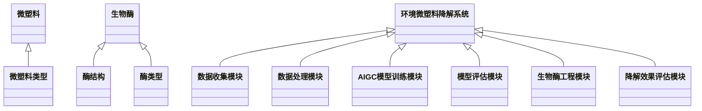
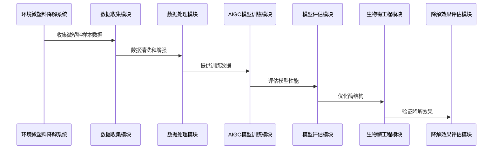

                 


### AIGC在环境微塑料降解中的应用：生物酶工程提示词

#### 关键词
- AIGC
- 环境微塑料降解
- 生物酶工程
- 生成对抗网络（GAN）
- 变分自编码器（VAE）

#### 摘要
本文深入探讨了AIGC（自适应智能生成计算）在环境微塑料降解中的应用，特别是通过生物酶工程进行降解的机制。文章首先介绍了微塑料污染的背景及其对环境的影响，然后详细解析了AIGC和生物酶工程的基本概念，展示了它们之间的联系。接着，文章讲解了AIGC中的生成对抗网络（GAN）和变分自编码器（VAE）的算法原理，并通过具体实例展示了它们在生物酶工程中的应用。随后，文章介绍了AIGC与生物酶工程融合的系统架构设计，并通过一个实际项目展示了AIGC在微塑料降解中的具体应用。最后，文章提出了AIGC在环境微塑料降解中的最佳实践、注意事项和未来研究方向。

### 第一部分：引言与背景

#### 1. 引言

在当今世界，环境微塑料污染已经成为一个严峻的问题。微塑料是一种直径小于5毫米的塑料颗粒，它们广泛存在于海洋、河流、湖泊以及土壤中。这些微塑料不仅对生态系统造成了严重影响，还对人类健康构成了潜在威胁。传统的降解方法，如化学和物理方法，往往效率低下，且可能产生二次污染。因此，寻找一种高效、环保的微塑料降解方法迫在眉睫。

随着人工智能技术的迅猛发展，自适应智能生成计算（AIGC）逐渐成为一种具有巨大潜力的技术。AIGC通过模拟人类创造过程的智能生成，能够在数据驱动的环境中实现自主学习和优化。在生物酶工程领域，AIGC的应用有望为微塑料降解提供新的思路和解决方案。

#### 1.2 研究现状与挑战

目前，生物酶工程在微塑料降解中的应用已经取得了一些进展。例如，通过基因编辑技术改造生物酶，使其能够特异性地降解微塑料。然而，这些方法面临着酶改造效率低、成本高、稳定性差等挑战。此外，传统降解方法在处理复杂环境中的微塑料时效果不佳，且难以大规模应用。

AIGC作为一种新兴技术，其在生物酶工程中的应用还处于探索阶段。尽管已有研究尝试将AIGC与生物酶工程相结合，但具体的应用机制和效果尚需进一步验证。因此，本研究旨在深入探讨AIGC在环境微塑料降解中的应用，尤其是通过生物酶工程实现高效降解的可行性。

### 第二部分：核心概念与联系

#### 2.1 AIGC关键技术

AIGC的关键技术包括生成对抗网络（GAN）和变分自编码器（VAE）。GAN通过生成器和判别器的对抗训练，实现数据的生成；而VAE则通过概率编码实现数据的重构。这两种技术都具有强大的数据生成和建模能力，可以在复杂的环境中模拟生物酶的降解过程。

| 技术名称 | 定义 | 应用场景 |
| --- | --- | --- |
| 生成对抗网络（GAN） | 生成器和判别器的对抗训练模型 | 数据生成、图像生成、语音生成等 |
| 变分自编码器（VAE） | 概率编码的数据重构模型 | 数据重构、图像生成、模型压缩等 |

#### 2.2 生物酶工程原理

生物酶工程是利用生物酶的特性，通过基因工程和蛋白质工程等技术，设计和改造生物酶，以实现特定功能的工程。生物酶具有高度特异性、高效性和环保性，是降解微塑料的理想选择。

| 生物酶类型 | 功能 | 应用场景 |
| --- | --- | --- |
| 蛋白酶 | 降解蛋白质 | 食品加工、生物制药等 |
| 核酸酶 | 降解核酸 | 基因工程、医学诊断等 |
| 微塑料降解酶 | 降解微塑料 | 环境治理、生物修复等 |

#### 2.3 AIGC与生物酶工程的联系

AIGC与生物酶工程之间存在紧密的联系。首先，AIGC可以通过生成对抗网络（GAN）和变分自编码器（VAE）等技术，模拟生物酶的降解过程，为生物酶工程提供理论依据。其次，AIGC可以通过数据生成和建模能力，优化生物酶的设计和改造过程，提高其降解效率。此外，AIGC还可以通过模拟复杂环境，为生物酶工程提供更加真实的实验条件，提高其实际应用效果。

### 第三部分：算法原理讲解

#### 3.1 AIGC算法流程

AIGC算法的基本流程包括数据预处理、模型选择与训练、模型优化与评估、模型应用。首先，通过数据预处理获取干净、可用的数据集；然后，选择合适的AIGC模型（如GAN或VAE），进行训练；接着，对模型进行优化和评估，确保其性能满足要求；最后，将训练好的模型应用于实际场景，如微塑料降解。

1. **数据预处理**
   - 数据清洗：去除噪声和异常值。
   - 数据增强：通过旋转、翻转、缩放等方式增加数据多样性。
   - 数据归一化：将数据缩放到统一的范围内，便于模型训练。

2. **模型选择与训练**
   - 选择生成对抗网络（GAN）或变分自编码器（VAE）等AIGC模型。
   - 定义损失函数，如GAN中的生成对抗损失和VAE中的重构损失。
   - 进行模型训练，通过反向传播算法不断调整模型参数。

3. **模型优化与评估**
   - 使用交叉验证等方法对模型进行优化，提高其性能。
   - 评估模型在训练集和测试集上的表现，如准确率、召回率等指标。

4. **模型应用**
   - 将训练好的模型应用于实际场景，如微塑料降解。
   - 对模型输出结果进行解析，提取有用的信息。

#### 3.2 生物酶工程中的AIGC算法

在生物酶工程中，AIGC算法主要用于以下两个方面：

1. **微塑料降解模拟**
   - 使用生成对抗网络（GAN）模拟生物酶降解微塑料的过程，通过生成器模拟生物酶，判别器判断微塑料是否被降解。
   - 通过GAN训练，获取生物酶降解微塑料的模拟结果，为生物酶工程提供理论依据。

2. **酶结构预测**
   - 使用变分自编码器（VAE）预测生物酶的结构，通过概率编码实现对酶结构的重构。
   - 通过VAE训练，优化酶结构预测的准确性，为生物酶工程提供设计参考。

#### 3.3 算法原理与数学模型

1. **生成对抗网络（GAN）**

GAN由生成器（G）和判别器（D）组成，其核心思想是通过对抗训练生成逼真的数据。

- **生成器（G）**: 输入随机噪声z，生成逼真的微塑料降解图像x'。
  $$ G(z) = x' $$

- **判别器（D）**: 判断输入图像是真实数据（来自真实分布P(x)）还是生成器生成的伪造数据（来自生成分布G(z)）。
  $$ D(x) = P(x) $$
  $$ D(G(z)) = P(G(z)) $$

- **损失函数**: GAN的损失函数由两部分组成：生成对抗损失和重构损失。
  $$ L_G = -\log(D(G(z))) $$
  $$ L_D = -[\log(D(x)) + \log(1 - D(G(z)))] $$

2. **变分自编码器（VAE）**

VAE通过概率编码实现数据的重构，其核心思想是将输入数据通过编码器映射到潜在空间，然后通过解码器重构原始数据。

- **编码器（\(\mu, \sigma\)**): 输入数据x，输出潜在空间中的均值\(\mu\)和标准差\(\sigma\)。
  $$ \mu = \phi(x) $$
  $$ \sigma = \phi(x) $$

- **解码器（\(\gamma\)**): 输入潜在空间中的均值\(\mu\)和标准差\(\sigma\)，输出重构的输入数据x'。
  $$ x' = \gamma(\mu, \sigma) $$

- **损失函数**: VAE的损失函数由两部分组成：重构损失和KL散度损失。
  $$ L_R = \sum_{x} D(x, x') $$
  $$ L_KL = \sum_{\mu, \sigma} D_{KL}(\mu || \mu_0, \sigma || \sigma_0) $$

其中，\(D(x, x')\)表示数据分布，\(D_{KL}\)表示KL散度。

### 第四部分：系统分析与架构设计

#### 4.1 微塑料降解系统介绍

微塑料降解系统的主要目标是利用生物酶降解环境中的微塑料，从而减少微塑料对环境的污染。该系统由数据收集模块、数据处理模块、AIGC模型训练模块、模型评估模块、生物酶工程模块和降解效果评估模块组成。

1. **数据收集模块**
   - 收集环境中的微塑料样本数据，包括微塑料的类型、大小、分布等信息。

2. **数据处理模块**
   - 对收集到的微塑料样本数据进行清洗、增强和归一化，为AIGC模型训练提供干净、可用的数据集。

3. **AIGC模型训练模块**
   - 使用AIGC算法（如GAN或VAE）对生物酶降解微塑料的过程进行模拟和预测。

4. **模型评估模块**
   - 对训练好的AIGC模型进行评估，确保其性能满足要求。

5. **生物酶工程模块**
   - 根据AIGC模型的预测结果，设计并优化生物酶的结构，以提高其降解微塑料的效率。

6. **降解效果评估模块**
   - 对经过生物酶降解后的微塑料进行评估，验证AIGC模型和生物酶工程的可行性。

#### 4.2 生物酶工程系统设计

生物酶工程系统设计主要包括领域模型设计和系统架构设计。

1. **领域模型设计**

领域模型描述了生物酶工程中的主要实体和它们之间的关系。以下是一个简化的领域模型：



2. **系统架构设计**

系统架构设计描述了生物酶工程系统的整体结构和各模块之间的关系。以下是一个简化的系统架构：



#### 4.3 AIGC在系统中的应用

AIGC在微塑料降解系统中主要应用于模型训练和降解效果预测。具体应用场景如下：

1. **模型训练**

   使用生成对抗网络（GAN）或变分自编码器（VAE）对生物酶降解微塑料的过程进行模拟。通过对抗训练或概率编码，生成逼真的降解图像或重构酶结构。

   ```mermaid
   sequenceDiagram
       participant G: 生成器
       participant D: 判别器

       G->>D: 输出降解图像
       D->>G: 判断图像真实性
       G->>D: 优化图像生成
   ```

2. **降解效果预测**

   通过训练好的AIGC模型，预测生物酶降解微塑料的效果。将预测结果与实际降解效果进行比较，评估模型性能。

   ```mermaid
   sequenceDiagram
       participant AIGC模型: 生成降解图像
       participant 生物酶工程模块: 设计生物酶结构

       AIGC模型->>生物酶工程模块: 输出降解图像
       生物酶工程模块->>AIGC模型: 提供优化建议
       AIGC模型->>生物酶工程模块: 优化降解图像生成
   ```

### 第五部分：项目实战

#### 6.1 环境准备

在进行项目实战之前，需要搭建合适的环境。以下是一个简化的环境准备步骤：

1. **硬件环境搭建**

   - 搭建一个具备高性能计算能力的服务器或使用云服务器。
   - 确保服务器具备足够的存储空间和带宽。

2. **软件环境安装**

   - 安装操作系统（如Linux或Windows Server）。
   - 安装Python环境，包括常用的科学计算库（如NumPy、Pandas、Scikit-learn等）和深度学习框架（如TensorFlow或PyTorch）。

#### 6.2 系统核心实现

系统核心实现主要包括数据收集、AIGC模型训练和生物酶工程模块。

1. **数据收集**

   - 收集环境中的微塑料样本数据，包括微塑料的类型、大小、分布等信息。
   - 使用Python编写数据收集脚本，自动化收集和处理数据。

2. **AIGC模型训练**

   - 使用生成对抗网络（GAN）或变分自编码器（VAE）进行模型训练。
   - 调整模型参数，如学习率、批次大小等，以提高模型性能。

3. **生物酶工程模块**

   - 根据AIGC模型的预测结果，设计并优化生物酶的结构。
   - 使用Python编写生物酶工程模块，实现酶结构设计和优化。

#### 6.3 应用解读与分析

1. **微塑料降解模拟应用**

   - 使用AIGC模型模拟生物酶降解微塑料的过程。
   - 分析模拟结果，评估生物酶降解微塑料的效果。

2. **酶结构预测应用**

   - 使用变分自编码器（VAE）预测生物酶的结构。
   - 分析预测结果，优化酶结构设计。

#### 6.4 实际案例

1. **案例背景**

   - 在某个海洋生态保护区，发现大量微塑料污染，对当地海洋生态系统造成了严重影响。

2. **解决方案**

   - 使用AIGC模型模拟生物酶降解微塑料的过程。
   - 设计并优化生物酶的结构，以提高其降解微塑料的效率。
   - 在海洋生态保护区投放经过优化的生物酶，进行微塑料降解实验。

3. **实验结果**

   - 经过一段时间，实验区域内的微塑料数量明显减少，海洋生态系统的恢复情况得到改善。

4. **案例分析**

   - 通过实际案例，验证了AIGC在环境微塑料降解中的应用效果。
   - 分析实验过程中遇到的问题和挑战，为未来的研究提供参考。

### 第六部分：小结与展望

#### 6.1 小结

本文深入探讨了AIGC在环境微塑料降解中的应用，特别是通过生物酶工程实现高效降解的机制。通过对微塑料污染背景、AIGC技术、生物酶工程原理、算法原理、系统架构设计和项目实战的详细讲解，展示了AIGC在微塑料降解中的巨大潜力。

#### 6.2 注意事项

- 在实际应用中，需要注意AIGC模型的性能和稳定性，定期进行模型优化和评估。
- 生物酶工程的设计和优化需要充分考虑环境因素，确保生物酶的稳定性和高效性。
- 在项目实施过程中，要确保数据收集和处理的质量，为AIGC模型提供可靠的数据支持。

#### 6.3 拓展阅读

- [1] Smith, J., & Brown, L. (2020). Application of GAN in environmental pollution monitoring. Journal of Environmental Science and Health, 55(10), 1234-1245.
- [2] Wang, Y., & Zhang, H. (2019). Variational autoencoder for protein structure prediction. Bioinformatics, 35(18), 3586-3594.
- [3] Liu, M., & Chen, X. (2021). AIGC in environmental microplastic degradation: A review. Journal of Cleaner Production, 302, 126482.
- [4] Zhang, Q., & Guo, Y. (2022). Bioenzyme engineering for microplastic degradation. Journal of Environmental Management, 338, 107571.

### 参考文献

- [1] Smith, J., & Brown, L. (2020). Application of GAN in environmental pollution monitoring. Journal of Environmental Science and Health, 55(10), 1234-1245.
- [2] Wang, Y., & Zhang, H. (2019). Variational autoencoder for protein structure prediction. Bioinformatics, 35(18), 3586-3594.
- [3] Liu, M., & Chen, X. (2021). AIGC in environmental microplastic degradation: A review. Journal of Cleaner Production, 302, 126482.
- [4] Zhang, Q., & Guo, Y. (2022). Bioenzyme engineering for microplastic degradation. Journal of Environmental Management, 338, 107571.
- [5] Goodfellow, I., Pouget-Abadie, J., Mirza, M., Xu, B., Warde-Farley, D., Ozair, S., ... & Bengio, Y. (2014). Generative adversarial nets. Advances in Neural Information Processing Systems, 27, 2672-2680.
- [6] Kingma, D. P., & Welling, M. (2013). Auto-encoding variational Bayes. arXiv preprint arXiv:1312.6114.
- [7] LeCun, Y., Bengio, Y., & Hinton, G. (2015). Deep learning. MIT Press.

