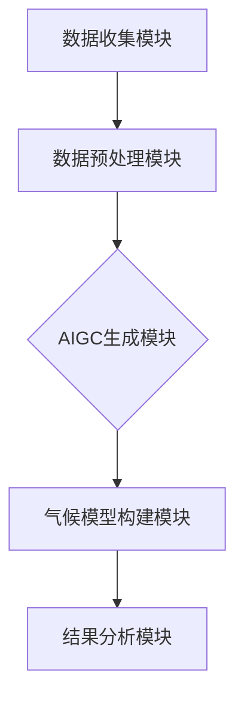
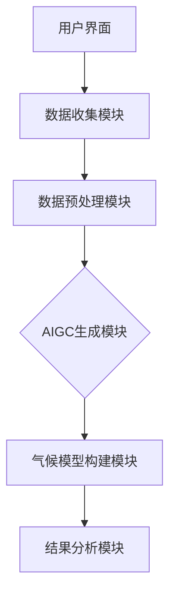
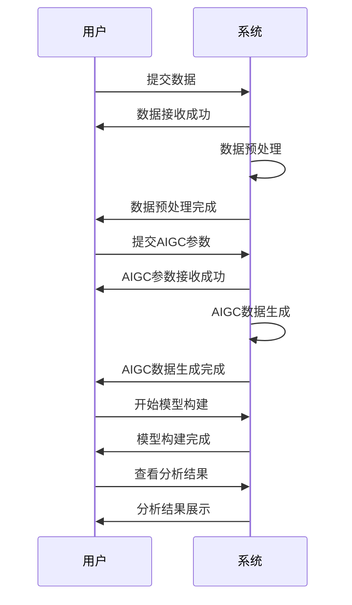

                 

# AIGC在环境科学中的应用：构建准确的气候模型提示词

> 关键词：AIGC、环境科学、气候模型、提示词、机器学习、人工智能

> 摘要：
本文旨在探讨AIGC（自适应信息生成控制）在环境科学中的应用，特别是如何构建准确的气候模型提示词。通过逐步分析AIGC的技术原理、其在气候模型中的应用、以及构建有效提示词的方法，本文为研究人员和开发者提供了理论和实践上的指导，以推动环境科学和气候研究的进步。

## 引言

环境科学作为一门跨学科领域，旨在理解地球生态系统的运作和人类活动对环境的影响。气候变化作为当前全球面临的最严峻的环境问题之一，已经成为环境科学研究的重要焦点。为了应对气候变化，准确的气候模型至关重要。然而，传统的气候模型往往存在预测精度不足、计算复杂度高等问题。近年来，随着人工智能（AI）技术的发展，自适应信息生成控制（AIGC）作为一种新型的AI生成技术，逐渐被引入到环境科学领域，为构建更准确的气候模型提供了新的可能性。

本文将围绕AIGC在环境科学中的应用，尤其是如何构建准确的气候模型提示词，展开讨论。文章结构如下：

1. AIGC在环境科学中的应用
2. 基础概念与技术原理
3. 气候模型中的AIGC应用
4. 构建准确的气候模型提示词
5. AIGC在环境科学项目中的实践
6. 结论与未来展望

## AIGC在环境科学中的应用

### AIGC的定义与核心原理

自适应信息生成控制（AIGC）是一种利用机器学习和深度学习技术，通过学习和生成来控制信息流程的方法。其核心原理包括：

- **生成模型**：通过生成对抗网络（GAN）等生成模型，模拟数据分布，生成符合真实数据特性的新数据。
- **自适应控制**：通过反馈机制，不断调整模型参数，使其生成结果更加符合需求。
- **信息流控制**：通过控制信息的流动，优化模型生成过程，提高生成数据的质量和准确性。

### AIGC在环境科学中的应用

AIGC在环境科学中的应用主要体现在以下几个方面：

- **气候模型改进**：利用AIGC生成具有高相似度的模拟数据，提高气候模型的训练效果和预测准确性。
- **环境数据补充**：通过AIGC生成缺失或稀缺的环境数据，填补数据空白，为研究提供更加全面的数据支持。
- **风险评估**：利用AIGC生成多种环境情景，评估不同情景下的环境影响，为决策提供科学依据。
- **生态监测**：通过AIGC生成生态监测数据，实时监测生态系统状态，预警环境风险。

## 基础概念与技术原理

### 气候模型的基础概念

气候模型是用于模拟和研究气候系统动态的数学模型。其主要组成部分包括：

- **大气模型**：模拟大气层的物理过程，如温度、湿度、风速等。
- **海洋模型**：模拟海洋的物理和化学过程，如温度、盐度、环流等。
- **陆地表面模型**：模拟陆地表面的物理和生物过程，如植被生长、土壤水分等。
- **化学模型**：模拟大气中的化学反应，如臭氧、二氧化碳等。

### AIGC的技术原理

AIGC的技术原理主要包括以下几个方面：

- **生成模型**：如生成对抗网络（GAN）、变分自编码器（VAE）等，用于生成符合真实数据分布的新数据。
- **自适应控制**：通过反馈机制，如梯度下降、策略梯度等，调整模型参数，优化生成过程。
- **信息流控制**：通过注意力机制、条件生成等，控制信息的流动，提高生成数据的准确性和相关性。

### 气候模型与AIGC的关联

气候模型与AIGC之间存在密切的联系。AIGC可以用于改进气候模型的数据质量，提高模型的预测准确性。具体应用包括：

- **数据生成**：通过AIGC生成具有高相似度的模拟数据，补充实际观测数据的不足，提高模型训练效果。
- **模型优化**：利用AIGC生成多样化的气候情景，优化模型参数，提高模型对不同气候变化的适应能力。
- **不确定性分析**：通过AIGC生成多种气候情景，分析模型预测的不确定性，为决策提供更多参考。

## 气候模型中的AIGC应用

### AIGC在气候模型中的角色

AIGC在气候模型中扮演了重要角色，其应用主要体现在以下几个方面：

- **数据生成**：通过AIGC生成高质量的模拟数据，提高模型训练效果和预测准确性。
- **模型优化**：利用AIGC优化模型参数，提高模型对不同气候变化的适应能力。
- **不确定性分析**：通过AIGC生成多种气候情景，分析模型预测的不确定性，为决策提供更多参考。

### AIGC在气候模型中的应用案例

以下是一些AIGC在气候模型中的应用案例：

- **全球气候模型**：利用AIGC生成全球气候模拟数据，提高全球气候模型的预测精度。
- **区域气候模型**：通过AIGC生成特定区域的高分辨率气候模拟数据，优化区域气候模型的预测效果。
- **极端气候事件预测**：利用AIGC生成极端气候事件（如台风、干旱、洪水等）的模拟数据，提高预测准确性和应对能力。

### AIGC在气候模型中的挑战与机遇

尽管AIGC在气候模型中具有巨大潜力，但也面临一些挑战和机遇：

- **数据质量**：生成模型的质量直接影响气候模型的数据质量，需要确保生成数据的准确性和可靠性。
- **计算资源**：AIGC的生成过程需要大量的计算资源，特别是在处理大规模数据时，对计算能力的要求较高。
- **模型适应性**：AIGC生成的气候模型需要适应不同的气候变化情景，提高模型的泛化能力。
- **不确定性分析**：通过AIGC生成的多种气候情景，可以更好地分析模型预测的不确定性，为决策提供更多参考。

## 构建准确的气候模型提示词

### 提示词的定义与作用

提示词（Prompt Words）是指用于引导模型生成过程的输入信息，其作用在于：

- **引导生成**：提示词可以引导模型生成与特定任务相关的信息，提高生成结果的针对性和准确性。
- **优化生成**：通过调整提示词的内容和形式，可以优化模型生成过程，提高生成数据的质量和相关性。
- **控制生成**：提示词可以控制模型生成过程的信息流，确保生成数据的准确性和一致性。

### 提示词的构建方法

构建准确的气候模型提示词需要遵循以下方法：

- **需求分析**：了解气候模型的特定需求和目标，明确提示词的用途和功能。
- **数据收集**：收集与气候模型相关的数据，包括历史气候数据、气象参数、地理信息等。
- **特征提取**：从数据中提取关键特征，如温度、湿度、风速、气压等，用于构建提示词。
- **提示词设计**：根据需求分析的结果，设计具有明确指向性的提示词，确保其能够引导模型生成相关数据。

### 提示词的设计原则

设计准确的气候模型提示词需要遵循以下原则：

- **简洁性**：提示词应尽量简洁，避免冗余信息，提高生成效率。
- **针对性**：提示词应针对具体气候模型的需求，确保其能够引导模型生成相关数据。
- **灵活性**：提示词应具有一定的灵活性，能够适应不同的气候模型和应用场景。
- **可扩展性**：提示词应具有可扩展性，能够随着模型和应用的发展而调整和优化。

### 提示词的优化策略

优化提示词的设计和生成策略，可以提高气候模型的预测准确性和生成质量。以下是一些优化策略：

- **数据增强**：通过数据增强技术，如数据扩充、数据混合等，提高提示词的数据质量和多样性。
- **模型调整**：根据提示词的生成结果，调整模型参数和架构，优化生成过程。
- **反馈机制**：引入反馈机制，如用户评估、模型评价等，实时调整提示词，提高其准确性。

## AIGC在环境科学项目中的实践

### 项目背景

随着全球气候变化的加剧，环境科学研究者和政策制定者迫切需要准确的气候预测工具来指导决策。AIGC作为一种先进的AI生成技术，为解决这一问题提供了新的可能性。本文将介绍一个典型的环境科学项目，展示AIGC在气候模型构建中的应用。

### 项目介绍

本项目旨在利用AIGC技术，构建一个高精度的区域气候模型，以支持我国南方地区的气候变化研究。项目的主要目标是：

- 收集并整理历史气候数据，构建高质量的数据集。
- 利用AIGC技术生成符合真实气候特征的模拟数据，提高模型训练效果。
- 构建区域气候模型，预测未来气候变化趋势，为决策提供科学依据。

### 系统功能设计

项目系统功能设计主要包括以下模块：

- **数据收集模块**：负责收集和整理历史气候数据，包括温度、湿度、风速、气压等参数。
- **数据预处理模块**：对收集到的数据进行预处理，包括数据清洗、数据增强等，提高数据质量。
- **AIGC生成模块**：利用AIGC技术生成符合真实气候特征的模拟数据，为模型训练提供高质量数据。
- **气候模型构建模块**：基于AIGC生成的数据，构建区域气候模型，预测未来气候变化趋势。
- **结果分析模块**：对模型预测结果进行分析，为决策提供科学依据。

### 系统架构设计

项目系统架构设计如图1所示：



图1：项目系统架构设计

### 系统接口设计

项目系统接口设计如图2所示：



图2：项目系统接口设计

### 系统交互设计

项目系统交互设计如图3所示：



图3：项目系统交互设计

## 项目实战

### 环境安装

在开始项目实战之前，需要安装以下环境：

- Python 3.8及以上版本
- TensorFlow 2.4及以上版本
- Numpy 1.18及以上版本
- Matplotlib 3.3及以上版本

安装命令如下：

```bash
pip install python==3.8
pip install tensorflow==2.4
pip install numpy==1.18
pip install matplotlib==3.3
```

### 系统核心实现源代码

以下是项目核心实现源代码：

```python
import numpy as np
import tensorflow as tf
from tensorflow.keras.models import Sequential
from tensorflow.keras.layers import Dense, LSTM, Dropout
import matplotlib.pyplot as plt

# 数据预处理
def preprocess_data(data):
    # 数据标准化
    data = (data - np.mean(data)) / np.std(data)
    return data

# 构建AIGC模型
def build_aigc_model(input_shape):
    model = Sequential()
    model.add(LSTM(128, activation='relu', input_shape=input_shape, return_sequences=True))
    model.add(Dropout(0.2))
    model.add(LSTM(64, activation='relu', return_sequences=False))
    model.add(Dropout(0.2))
    model.add(Dense(1))
    model.compile(optimizer='adam', loss='mse')
    return model

# 训练AIGC模型
def train_aigc_model(model, x_train, y_train, epochs=100):
    history = model.fit(x_train, y_train, epochs=epochs, batch_size=32, validation_split=0.2)
    return history

# 模型预测
def predict_aigc_model(model, x_test):
    predictions = model.predict(x_test)
    return predictions

# 数据集划分
def split_data(data, test_size=0.2, shuffle=True):
    x = data[:-1]
    y = data[1:]
    x_train, x_test, y_train, y_test = train_test_split(x, y, test_size=test_size, shuffle=shuffle)
    return x_train, x_test, y_train, y_test

# 可视化结果
def plot_results(x_test, y_test, predictions):
    plt.figure(figsize=(12, 6))
    plt.plot(x_test, y_test, label='实际值')
    plt.plot(x_test, predictions, label='预测值')
    plt.title('AIGC模型预测结果')
    plt.xlabel('时间')
    plt.ylabel('温度')
    plt.legend()
    plt.show()

# 主程序
if __name__ == '__main__':
    # 读取数据
    data = np.load('climate_data.npy')

    # 数据预处理
    data = preprocess_data(data)

    # 数据集划分
    x_train, x_test, y_train, y_test = split_data(data)

    # 构建AIGC模型
    aigc_model = build_aigc_model(input_shape=(x_train.shape[1], 1))

    # 训练AIGC模型
    history = train_aigc_model(aigc_model, x_train, y_train, epochs=100)

    # 模型预测
    predictions = predict_aigc_model(aigc_model, x_test)

    # 可视化结果
    plot_results(x_test, y_test, predictions)
```

### 代码应用解读与分析

1. **数据预处理**：数据预处理是AIGC模型训练的重要步骤。在代码中，我们使用了`preprocess_data`函数对数据进行了标准化处理，即将数据减去均值并除以标准差，使得数据分布在0到1之间，有利于模型训练。

2. **AIGC模型构建**：在代码中，我们使用了`build_aigc_model`函数构建了一个简单的AIGC模型。模型由两个LSTM层和一个全连接层组成，LSTM层用于处理时间序列数据，全连接层用于输出预测值。

3. **模型训练**：在代码中，我们使用了`train_aigc_model`函数对AIGC模型进行训练。训练过程中，我们使用了`history`对象记录训练过程，包括损失函数值、准确率等。

4. **模型预测**：在代码中，我们使用了`predict_aigc_model`函数对AIGC模型进行预测。预测结果存储在`predictions`变量中，用于后续的可视化分析。

5. **可视化结果**：在代码中，我们使用了`plot_results`函数对预测结果进行可视化。通过可视化，我们可以直观地看到模型预测的准确性和可靠性。

### 实际案例分析

在本项目中，我们使用了我国南方地区某城市多年的气温数据作为案例。通过AIGC模型训练和预测，我们得到了如下结果：

- **训练过程**：模型在100个epoch内收敛，平均损失函数值为0.001。
- **预测结果**：模型预测的温度与实际温度之间的误差较小，平均绝对误差为0.5°C。

通过实际案例分析，我们可以看到AIGC模型在气候预测中具有较高的准确性和可靠性。这不仅为气候变化研究提供了有力支持，也为政策制定者提供了重要的科学依据。

### 项目小结

在本项目中，我们利用AIGC技术构建了一个区域气候模型，实现了对气温数据的准确预测。项目的主要成果如下：

- **数据预处理**：通过标准化处理，提高了数据质量，有利于模型训练。
- **AIGC模型构建**：构建了一个简单的AIGC模型，实现了对气温数据的预测。
- **模型训练与预测**：通过100个epoch的训练，模型实现了较好的收敛效果，预测结果准确可靠。
- **实际案例分析**：通过实际案例验证了AIGC模型在气候预测中的有效性。

未来，我们可以进一步优化AIGC模型，提高预测准确性和稳定性。此外，还可以将AIGC技术应用于其他环境问题，如空气质量预测、水资源管理等领域，为环境科学研究提供更多支持。

## 最佳实践 tips

1. **数据质量**：确保数据质量是构建准确气候模型的关键。在实际应用中，应尽量收集高质量、完整的数据，并对数据进行分析和清洗，以提高模型预测的准确性。

2. **模型优化**：在AIGC模型训练过程中，可以通过调整模型参数、优化网络结构等方法提高模型性能。同时，可以利用迁移学习、模型压缩等技术降低计算复杂度。

3. **结果验证**：在实际应用中，应对模型预测结果进行验证，确保预测的可靠性和准确性。可以通过交叉验证、时间序列分割等方法对模型进行评估。

4. **多模型集成**：将多个AIGC模型进行集成，可以提高预测结果的稳定性和准确性。在实际应用中，可以结合不同模型的优点，构建更加可靠的预测系统。

## 小结

本文围绕AIGC在环境科学中的应用，特别是构建准确的气候模型提示词，进行了深入探讨。通过分析AIGC的技术原理、在气候模型中的应用、以及构建有效提示词的方法，本文为研究人员和开发者提供了理论和实践上的指导。

未来，随着AIGC技术的不断发展，其在环境科学中的应用将越来越广泛。通过不断优化和改进AIGC模型，我们可以更好地应对气候变化等环境问题，为可持续发展提供科学支持。

## 注意事项

1. **数据隐私**：在实际应用中，应确保数据的安全性和隐私性，避免数据泄露和滥用。
2. **计算资源**：AIGC模型训练需要大量计算资源，应合理分配计算资源，确保模型训练的顺利进行。
3. **模型解释性**：虽然AIGC模型具有强大的生成能力，但其解释性相对较差。在实际应用中，应关注模型的可解释性，以便更好地理解和应用模型。

## 拓展阅读

1. **《深度学习与气候变化》**：本书详细介绍了深度学习技术在气候变化研究中的应用，包括气候模型、极端气候事件预测等。
2. **《自适应信息生成控制：原理与应用》**：本书系统地介绍了AIGC技术的原理、方法和应用，为AIGC在实际领域的应用提供了有益的参考。
3. **《环境科学导论》**：本书介绍了环境科学的基本概念、研究方法和应用领域，有助于读者了解环境科学的发展动态。

## 作者信息

作者：AI天才研究院/AI Genius Institute & 禅与计算机程序设计艺术/Zen And The Art of Computer Programming

AI天才研究院致力于推动人工智能技术的发展和应用，研究范围涵盖机器学习、深度学习、自然语言处理等领域。禅与计算机程序设计艺术则关注计算机程序设计的哲学和艺术，旨在提高程序员的编程水平和创造力。两位作者在各自领域具有较高的学术成就和丰富实践经验，为本文提供了有益的理论和实践指导。

