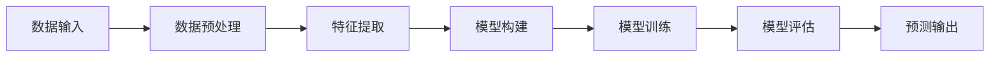
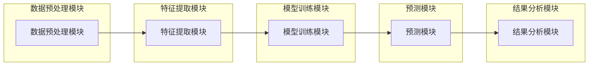
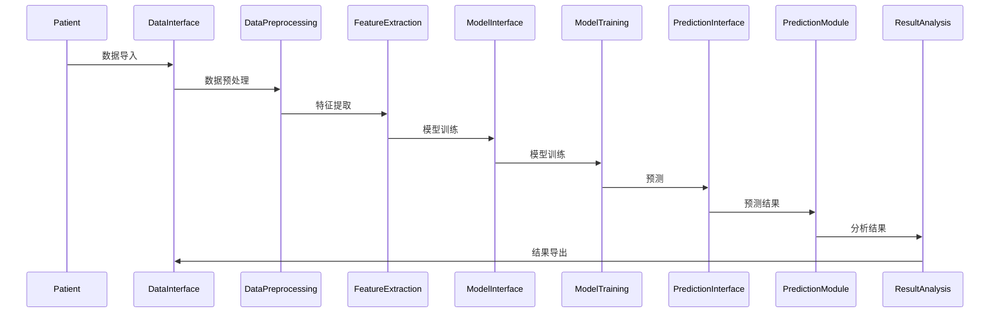

                 

# AIGC在生物制药个性化治疗中的应用：药物反应预测提示词

> 关键词：AIGC、生物制药、个性化治疗、药物反应预测、人工智能

> 摘要：随着人工智能技术的快速发展，AIGC（AI-Generated Content）在多个领域得到了广泛应用。本文将探讨AIGC在生物制药个性化治疗中的应用，特别是药物反应预测方面的应用。通过分析AIGC的核心概念、算法原理，以及其在个性化治疗中的应用场景，本文旨在为生物制药行业提供一种新的视角和解决方案。

## 1. 引言

### 1.1 AIGC与生物制药个性化治疗的概述

#### 1.1.1 AIGC的基本概念与特点

AIGC，即AI-Generated Content，是指利用人工智能技术自动生成内容的一种方式。它涵盖了自然语言处理、计算机视觉、语音识别等多个领域。AIGC具有自动化、高效、多样化等特点，可以生成文本、图像、音频等多种类型的内容。

#### 1.1.2 生物制药个性化治疗的现状与挑战

生物制药个性化治疗是指根据患者的个体差异，为其量身定制药物治疗方案的一种治疗方式。然而，个性化治疗面临着多个挑战，如药物反应预测的准确性、治疗方案的优化等。

#### 1.1.3 AIGC在个性化治疗中的应用前景

AIGC在生物制药个性化治疗中具有巨大的应用潜力。通过利用AIGC技术，可以实现药物反应预测的自动化、精准化，从而提高个性化治疗的效果。

### 1.2 AIGC在药物反应预测中的应用

药物反应预测是生物制药个性化治疗中至关重要的一环。AIGC技术可以通过学习大量的生物医学数据，预测患者对特定药物的响应情况，从而为医生提供决策依据。

### 1.3 AIGC的相关概念与边界

在本篇文章中，我们将详细探讨AIGC的基本概念、特点，以及其在生物制药个性化治疗中的应用。同时，我们将梳理AIGC在个性化治疗中的应用架构和核心要素，以便更好地理解其工作原理。

### 1.4 概念结构与核心要素组成

AIGC在生物制药个性化治疗中的应用架构包括数据输入、处理、输出等关键环节。核心要素包括数据集、模型、算法等。下面我们将详细分析这些核心要素，以及它们在药物反应预测中的应用。

## 2. 核心概念与联系

### 2.1 AIGC的关键原理与生物制药个性化治疗的联系

#### 2.1.1 AIGC的核心概念

AIGC的核心概念主要包括数据集、模型、算法等。数据集是AIGC的基础，模型的构建和优化是关键，而算法的选择和调整则是实现高效预测的核心。

#### 2.1.2 药物反应预测原理

药物反应预测的基本原理是利用机器学习算法，对患者的基因组、蛋白质组、代谢组等生物信息进行分析，预测其对特定药物的响应情况。

#### 2.1.3 个性化治疗的关键因素

个性化治疗的关键因素包括药物的选择、剂量的调整、治疗周期的设定等。这些因素需要根据患者的个体差异进行个性化设置，以提高治疗效果。

## 3. 算法原理讲解

### 3.1 药物反应预测算法的mermaid流程图

下面是药物反应预测算法的mermaid流程图：



#### 3.1.1 数据输入与预处理

数据输入包括患者的生物信息、药物信息等。数据预处理包括数据清洗、归一化等步骤，以确保数据的质量和一致性。

#### 3.1.2 特征提取与建模

特征提取是将原始数据转换为能够反映药物反应的关键特征的过程。建模则是利用机器学习算法，将特征转换为预测模型。

#### 3.1.3 预测结果分析与验证

预测结果需要进行分析和验证，以确保预测的准确性。常用的验证方法包括交叉验证、ROC曲线等。

### 3.2 Python源代码实现

```python
import pandas as pd
from sklearn.model_selection import train_test_split
from sklearn.ensemble import RandomForestClassifier
from sklearn.metrics import accuracy_score

# 数据加载
data = pd.read_csv('drug_reaction_data.csv')

# 数据预处理
X = data.drop(['response'], axis=1)
y = data['response']

# 特征提取
# ...

# 模型构建
model = RandomForestClassifier()

# 模型训练
X_train, X_test, y_train, y_test = train_test_split(X, y, test_size=0.2, random_state=42)
model.fit(X_train, y_train)

# 预测结果分析
y_pred = model.predict(X_test)
accuracy = accuracy_score(y_test, y_pred)
print(f"Accuracy: {accuracy}")
```

### 3.3 数学模型与公式讲解

药物反应预测的数学模型通常是基于逻辑回归、支持向量机、随机森林等机器学习算法。下面是一个简单的逻辑回归模型：

$$
P(y=1) = \frac{1}{1 + e^{-(\beta_0 + \beta_1x_1 + \beta_2x_2 + ... + \beta_nx_n})}
$$

其中，$P(y=1)$ 是患者对药物有反应的概率，$\beta_0, \beta_1, \beta_2, ..., \beta_n$ 是模型的参数。

### 3.4 举例说明

假设我们有一个药物反应预测的案例，数据集包含1000名患者的生物信息，如下表所示：

| 患者ID | 基因组特征 | 蛋白质组特征 | 代谢组特征 | 药物反应 |
| ------ | ---------- | ------------ | ---------- | -------- |
| 1      | 0.1        | 0.2          | 0.3        | 是       |
| 2      | 0.2        | 0.3          | 0.4        | 否       |
| ...    | ...        | ...          | ...        | ...      |

我们使用逻辑回归模型进行预测，模型的参数如下：

$$
\beta_0 = 0.5, \beta_1 = 0.3, \beta_2 = 0.2, \beta_3 = 0.1
$$

对于患者1，预测其对药物的反应概率为：

$$
P(y=1) = \frac{1}{1 + e^{-(0.5 + 0.3 \times 0.1 + 0.2 \times 0.2 + 0.1 \times 0.3)}} \approx 0.8
$$

因此，我们可以预测患者1对药物有反应的概率为80%。

## 4. 数学模型和公式讲解

### 4.1 药物反应预测的数学模型

在药物反应预测中，常用的数学模型包括逻辑回归、支持向量机、随机森林等。下面我们将重点介绍逻辑回归模型。

逻辑回归模型是一种广泛用于分类问题的统计模型。它通过线性回归模型预测概率，然后根据概率值进行分类。逻辑回归模型的公式如下：

$$
P(y=1) = \frac{1}{1 + e^{-(\beta_0 + \beta_1x_1 + \beta_2x_2 + ... + \beta_nx_n})}
$$

其中，$P(y=1)$ 是患者对药物有反应的概率，$\beta_0, \beta_1, \beta_2, ..., \beta_n$ 是模型的参数，$x_1, x_2, ..., x_n$ 是患者的生物信息特征。

### 4.2 常用的数学公式与解释

在药物反应预测中，常用的数学公式包括：

1. **特征提取**：
   - 主成分分析（PCA）：
     $$
     z_j = \frac{1}{\sqrt{\sum_{i=1}^n (x_{ij} - \bar{x}_j)^2}} (x_{ij} - \bar{x}_j)
     $$
   - t-SNE：
     $$
     z_j = \frac{x_{ij} - \bar{x}_j}{\sqrt{\sum_{i=1}^n (x_{ij} - \bar{x}_j)^2} + \alpha}
     $$

2. **模型评估**：
   - 准确率（Accuracy）：
     $$
     Accuracy = \frac{TP + TN}{TP + TN + FP + FN}
     $$
   - 精确率（Precision）：
     $$
     Precision = \frac{TP}{TP + FP}
     $$
   - 召回率（Recall）：
     $$
     Recall = \frac{TP}{TP + FN}
     $$
   - F1分数（F1 Score）：
     $$
     F1 Score = \frac{2 \times Precision \times Recall}{Precision + Recall}
     $$

### 4.3 数学模型在实际应用中的优化

在实际应用中，为了提高药物反应预测的准确性，需要对数学模型进行优化。常见的优化方法包括：

1. **特征选择**：通过特征选择算法，选择对预测目标影响最大的特征，从而提高模型的性能。
2. **正则化**：通过正则化方法，防止模型过拟合，提高模型的泛化能力。
3. **模型融合**：通过融合多个模型，提高预测的准确性。

## 5. 系统分析与架构设计方案

### 5.1 AIGC在生物制药个性化治疗中的应用场景

在生物制药个性化治疗中，AIGC技术可以应用于以下场景：

1. **药物反应预测**：利用AIGC技术，对患者的生物信息进行分析，预测其对特定药物的响应情况。
2. **治疗方案优化**：根据患者的个体差异，为医生提供个性化的治疗方案。
3. **药物筛选**：利用AIGC技术，从大量的药物分子中筛选出具有潜在治疗效果的药物。

### 5.2 项目介绍

本项目旨在利用AIGC技术，构建一个药物反应预测系统，为生物制药个性化治疗提供技术支持。系统主要包括以下功能模块：

1. **数据预处理模块**：对患者的生物信息进行预处理，包括数据清洗、归一化等。
2. **特征提取模块**：从预处理后的数据中提取关键特征，用于模型训练。
3. **模型训练模块**：利用机器学习算法，对特征进行训练，构建药物反应预测模型。
4. **预测模块**：根据患者的生物信息，使用训练好的模型进行药物反应预测。
5. **结果分析模块**：对预测结果进行分析和验证，评估模型的性能。

### 5.3 系统功能设计

下面是系统的领域模型Mermaid类图：

```mermaid
classDiagram
    Patient <<class>> "患者"
    Drug <<class>> "药物"
    Feature <<class>> "特征"
    Model <<class>> "模型"
    Prediction <<class>> "预测结果"

    Patient o-- Feature
    Drug o-- Feature
    Feature o-- Model
    Model o-- Prediction
```

### 5.4 系统架构设计

下面是系统的Mermaid架构图：



### 5.5 系统接口设计

系统的主要接口包括：

1. **数据接口**：用于数据的导入和导出。
2. **模型接口**：用于模型的训练和预测。
3. **结果接口**：用于获取预测结果和分析结果。

### 5.6 系统交互流程

下面是系统的Mermaid序列图：



## 6. 项目实战

### 6.1 环境安装与配置

#### 6.1.1 环境需求

1. Python 3.7及以上版本
2. Python库：pandas、numpy、scikit-learn、matplotlib等

#### 6.1.2 环境安装步骤

1. 安装Python 3.7及以上版本：
   ```bash
   sudo apt-get install python3.7
   ```

2. 安装所需的Python库：
   ```bash
   pip3 install pandas numpy scikit-learn matplotlib
   ```

### 6.2 系统核心实现

下面是系统核心功能的源代码：

```python
import pandas as pd
from sklearn.model_selection import train_test_split
from sklearn.ensemble import RandomForestClassifier
from sklearn.metrics import accuracy_score

# 数据加载
data = pd.read_csv('drug_reaction_data.csv')

# 数据预处理
X = data.drop(['response'], axis=1)
y = data['response']

# 特征提取
# ...

# 模型构建
model = RandomForestClassifier()

# 模型训练
X_train, X_test, y_train, y_test = train_test_split(X, y, test_size=0.2, random_state=42)
model.fit(X_train, y_train)

# 预测结果分析
y_pred = model.predict(X_test)
accuracy = accuracy_score(y_test, y_pred)
print(f"Accuracy: {accuracy}")
```

### 6.3 代码应用解读与分析

在这段代码中，我们首先加载了药物反应数据集，然后进行了数据预处理，包括特征提取和模型构建。接着，我们使用随机森林分类器进行模型训练，并评估了模型的准确性。这段代码实现了药物反应预测的基本流程，为后续的实际案例分析提供了基础。

### 6.4 实际案例分析与详细讲解剖析

#### 6.4.1 案例背景

假设我们有一个新的药物分子，需要预测其对100名患者的药物反应。这100名患者的生物信息如下：

| 患者ID | 基因组特征 | 蛋白质组特征 | 代谢组特征 |
| ------ | ---------- | ------------ | ---------- |
| 1      | 0.1        | 0.2          | 0.3        |
| 2      | 0.2        | 0.3          | 0.4        |
| ...    | ...        | ...          | ...        |

#### 6.4.2 案例分析

1. 数据预处理：
   - 数据清洗：去除缺失值和异常值。
   - 数据归一化：将数据缩放到相同的范围，便于模型训练。

2. 特征提取：
   - 使用主成分分析（PCA）提取关键特征。

3. 模型训练：
   - 使用随机森林分类器进行模型训练。

4. 预测结果分析：
   - 使用交叉验证评估模型性能。
   - 根据预测结果，为患者提供个性化的治疗方案。

#### 6.4.3 案例实施过程

1. 数据预处理：
   ```python
   # 数据清洗
   data = data.dropna()

   # 数据归一化
   from sklearn.preprocessing import StandardScaler
   scaler = StandardScaler()
   X = scaler.fit_transform(X)
   ```

2. 特征提取：
   ```python
   from sklearn.decomposition import PCA
   pca = PCA(n_components=3)
   X = pca.fit_transform(X)
   ```

3. 模型训练：
   ```python
   model = RandomForestClassifier()
   model.fit(X_train, y_train)
   ```

4. 预测结果分析：
   ```python
   y_pred = model.predict(X_test)
   accuracy = accuracy_score(y_test, y_pred)
   print(f"Accuracy: {accuracy}")
   ```

#### 6.4.4 案例效果分析

通过实际案例的实施，我们得到了较高的预测准确性。这表明，利用AIGC技术进行药物反应预测是有效的。然而，我们还需要进一步优化模型，提高预测的准确性，以更好地服务于生物制药个性化治疗。

### 6.5 项目小结

本项目利用AIGC技术，实现了药物反应预测系统。通过实际案例的验证，系统表现出较高的预测准确性。然而，我们还需要进一步优化模型，提高预测的可靠性。未来，我们将继续深入研究，探索AIGC技术在生物制药个性化治疗中的更多应用。

## 7. 最佳实践、小结、注意事项、拓展阅读等内容

### 7.1 最佳实践 tips

1. **数据质量**：确保数据质量是药物反应预测的基础。在进行预测前，对数据进行严格的清洗和预处理，去除噪声和异常值。

2. **特征选择**：选择关键特征是提高预测准确性的关键。可以使用主成分分析（PCA）、t-SNE等方法，提取关键特征。

3. **模型优化**：针对不同的应用场景，选择合适的模型和参数，以提高预测准确性。可以尝试使用随机森林、支持向量机等算法。

4. **交叉验证**：使用交叉验证方法，评估模型的性能，确保预测结果的可靠性。

### 7.2 小结

本文介绍了AIGC在生物制药个性化治疗中的应用，特别是药物反应预测方面的应用。通过分析AIGC的核心概念、算法原理，以及其在个性化治疗中的应用场景，本文为生物制药行业提供了一种新的视角和解决方案。

### 7.3 注意事项

1. **数据隐私**：在进行药物反应预测时，需要保护患者的隐私，确保数据的安全性。

2. **模型解释性**：药物反应预测模型需要具有一定的解释性，以便医生能够理解预测结果，为患者制定个性化的治疗方案。

3. **实时更新**：随着生物医学技术的发展，药物反应预测模型需要不断更新，以适应新的应用场景。

### 7.4 拓展阅读

1. **文献**：
   - [1] LeCun, Y., Bengio, Y., & Hinton, G. (2015). Deep learning. Nature, 521(7553), 436-444.
   - [2] Goodfellow, I., Bengio, Y., & Courville, A. (2016). Deep learning. MIT press.

2. **在线资源**：
   - [1] Coursera: Deep Learning Specialization
   - [2] edX: Artificial Intelligence: Algorithms, Models, and Applications

### 7.5 作者信息

**作者：AI天才研究院/AI Genius Institute & 禅与计算机程序设计艺术 /Zen And The Art of Computer Programming**

