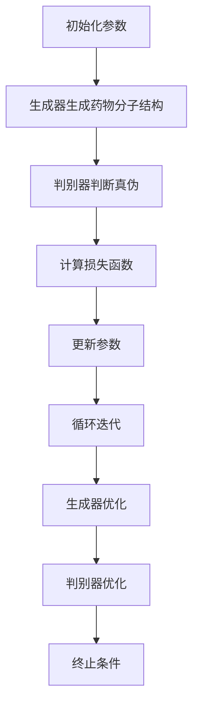
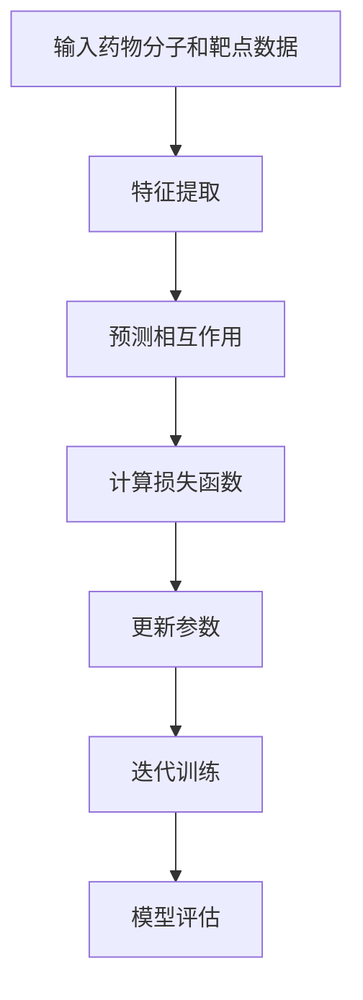
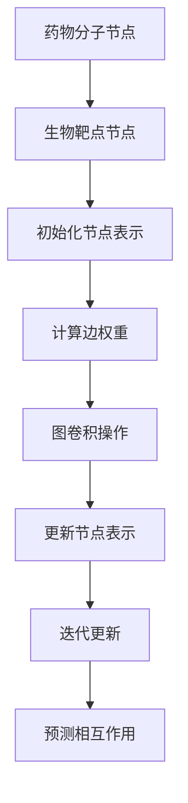
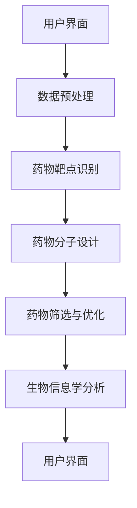
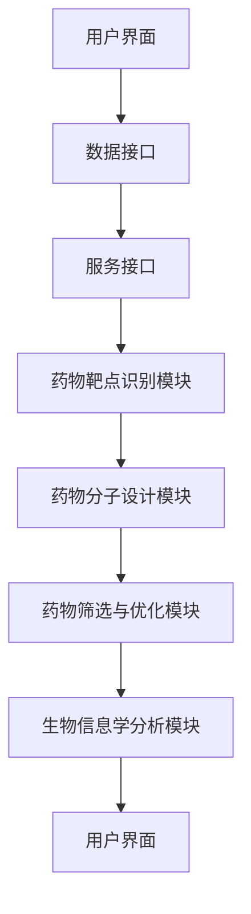
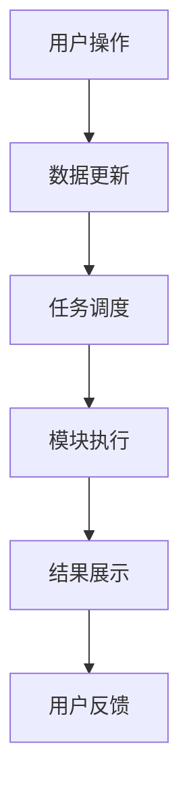

                 

## AIGC在生物制药研发中的应用：药物靶向设计提示词

### 关键词
- **AIGC**
- **生物制药研发**
- **药物靶向设计**
- **机器学习**
- **深度学习**
- **生成对抗网络（GANs）**

### 摘要
本文探讨了AIGC（AI-Generated Content）技术在生物制药研发中的应用，重点关注药物靶向设计这一关键环节。通过深入分析AIGC技术的基本原理及其在药物靶点识别、分子设计和筛选优化等方面的应用，本文旨在为读者提供一个全面的视角，了解如何利用AIGC技术提升生物制药研发的效率和质量。

### 第一部分：背景介绍

#### 问题背景

生物制药研发是一个复杂且耗时的过程，涉及从靶点发现到药物筛选、优化和临床试验的多个阶段。在这个过程中，药物靶向设计是至关重要的，它决定了药物的疗效和安全性。然而，传统的药物设计方法通常依赖于实验数据和分析，存在一定的局限性和不确定性。

随着人工智能（AI）技术的迅猛发展，AI技术在生物制药研发中的应用逐渐受到关注。特别是AIGC技术，作为一种基于深度学习和生成对抗网络（GANs）的新型人工智能技术，其在药物靶向设计中的应用展现出巨大的潜力。

#### 问题描述

尽管AIGC技术在生物制药研发中的应用前景广阔，但目前仍存在一些挑战和问题。首先，AIGC技术在药物靶点识别、分子设计和筛选优化等方面的应用方法和技术原理尚不成熟，缺乏系统的理论指导和实践验证。其次，AIGC技术的应用场景相对有限，主要集中于药物设计和筛选，其他生物技术手段的结合应用较少。此外，AIGC技术在生物制药研发中的实际应用案例和经验仍较为缺乏，限制了其在行业中的推广和应用。

#### 问题解决

为了解决上述问题，本文旨在通过以下几方面的工作来填补现有空白：

1. **系统介绍AIGC技术**：详细介绍AIGC技术的基本原理、核心概念和关键技术，帮助读者全面了解AIGC技术的基本框架和应用范围。
2. **应用案例分析**：通过具体的应用案例，展示AIGC技术在药物靶点识别、分子设计和筛选优化等方面的实际应用效果，提供实践经验和技术指导。
3. **技术原理分析**：深入分析AIGC技术在生物制药研发中的应用原理，探讨其核心算法、模型架构和技术路线，为读者提供理论依据和思考方向。
4. **跨学科结合探讨**：探讨AIGC技术与其他生物技术手段的结合应用，如基因编辑、蛋白质工程等，以期为读者提供一个更加全面的视角。

#### 边界与外延

AIGC技术在生物制药研发中的应用不仅限于药物设计和筛选，还可以扩展到药物合成路径规划、生物信息学分析、临床研究数据挖掘等多个方面。此外，本文还将探讨AIGC技术在不同生物技术领域中的具体应用案例，为读者提供一个更加全面的视角。

#### 概念结构与核心要素组成

AIGC技术在生物制药研发中的应用主要包括以下几个核心要素：

1. **药物靶点识别**：利用AIGC技术分析生物数据，识别生物体内的关键靶点，为药物设计提供基础。
2. **药物分子设计**：基于AIGC技术生成具有特定生物活性的药物分子结构，提高药物设计的效率和准确性。
3. **药物筛选与优化**：利用AIGC技术对大量候选药物进行筛选和优化，缩短药物研发周期，降低研发成本。
4. **生物信息学分析**：利用AIGC技术对生物数据进行挖掘和分析，为药物研发提供数据支持和决策依据。

#### 核心概念与联系

- **AIGC技术**：一种基于深度学习和生成对抗网络（GANs）的人工智能技术，能够生成高质量的内容，如文本、图像、音频等。
- **药物靶点**：生物体内的特定分子，药物的作用对象。
- **药物分子设计**：通过算法和计算模拟，设计具有特定生物活性的药物分子。
- **药物筛选**：从大量候选药物中筛选出具有潜在治疗作用的药物。
- **药物优化**：对候选药物进行结构优化，以提高其治疗效果和降低副作用。

## 第二部分：核心概念与联系

### AIGC技术在生物制药研发中的应用

#### AIGC技术简介

AIGC（AI-Generated Content）技术是一种基于深度学习和生成对抗网络（GANs）的人工智能技术。GANs由生成器（Generator）和判别器（Discriminator）两部分组成，生成器负责生成与真实数据分布相近的伪数据，而判别器则用于区分真实数据和生成数据。通过反复的对抗训练，生成器的生成能力不断提高，能够生成高质量的内容。

在生物制药研发中，AIGC技术的主要应用包括药物靶点识别、药物分子设计、药物筛选与优化以及生物信息学分析等。以下将详细探讨AIGC技术在这些方面的具体应用。

#### 药物靶点识别

药物靶点识别是生物制药研发的首要环节，对于新药的开发至关重要。AIGC技术在药物靶点识别中的应用主要包括以下步骤：

1. **数据预处理**：对生物数据进行清洗、归一化和特征提取。这包括从高通量测序数据、基因表达数据、蛋白质结构数据等多源数据中提取有用的信息。
2. **模型训练**：使用GANs模型对预处理后的数据进行训练，生成与真实生物数据分布相近的伪数据。这些伪数据可以用于进一步分析和识别生物体内的关键靶点。
3. **靶点识别**：通过分析生成的伪数据，识别出生物体内的关键靶点。这些靶点可能包括蛋白质、核酸、代谢物等，对于药物设计具有指导意义。

#### 药物分子设计

药物分子设计是生物制药研发的核心环节，AIGC技术在这一领域也发挥了重要作用。基于AIGC技术的药物分子设计主要包括以下步骤：

1. **药物分子库构建**：构建包含多种药物分子的数据库，这些药物分子可以是已知的，也可以是新生成的。数据库的构建对于药物分子设计至关重要。
2. **模型训练**：使用GANs模型对药物分子库进行训练，生成新的药物分子结构。这些新结构可以通过计算模拟和实验验证来评估其生物活性和稳定性。
3. **分子筛选**：通过生物信息学分析，筛选出具有潜在生物活性的药物分子。这一过程可能涉及虚拟筛选、分子对接等技术，以评估药物分子与靶点的相互作用。

#### 药物筛选与优化

药物筛选与优化是生物制药研发的重要环节，AIGC技术在其中也发挥了重要作用。基于AIGC技术的药物筛选与优化主要包括以下步骤：

1. **药物筛选**：从大量候选药物中筛选出具有潜在治疗作用的药物。这一过程可能涉及高通量筛选、化学合成等方法。
2. **药物优化**：对筛选出的药物进行结构优化，以提高其治疗效果和降低副作用。这通常涉及分子对接、虚拟筛选等技术。
3. **实验验证**：对优化后的药物进行实验验证，以评估其生物活性和安全性。这包括细胞实验、动物实验和临床试验等。

#### 生物信息学分析

生物信息学分析在生物制药研发中具有重要作用，AIGC技术在其中也发挥了重要作用。基于AIGC技术的生物信息学分析主要包括以下步骤：

1. **数据挖掘**：从大量生物数据中挖掘出有价值的信息，这些信息可能包括基因表达、蛋白质相互作用、代谢途径等。
2. **分析模型构建**：使用机器学习算法构建分析模型，以对生物数据进行分类、聚类、预测等分析。
3. **决策支持**：利用分析模型为药物研发提供决策支持，如靶点选择、药物设计、临床试验设计等。

### AIGC技术与其他生物技术手段的结合

AIGC技术在生物制药研发中的应用不仅限于上述几个方面，还可以与其他生物技术手段相结合，如基因编辑、蛋白质工程等。这种跨学科的结合能够进一步提升生物制药研发的效率和准确性。

例如，基因编辑技术可以用于精准修改靶点基因，以增强药物的作用效果。蛋白质工程技术可以用于改造药物分子，以提高其生物活性和稳定性。通过结合这些技术，AIGC技术能够为生物制药研发提供更加全面和精准的支持。

### 总结

AIGC技术在生物制药研发中的应用具有巨大的潜力，通过药物靶点识别、药物分子设计、药物筛选与优化以及生物信息学分析等多个方面，AIGC技术能够显著提升生物制药研发的效率和质量。同时，AIGC技术与其他生物技术手段的结合也为生物制药研发提供了更加多样化和创新性的解决方案。随着AIGC技术的不断发展和成熟，其在生物制药研发中的应用前景将更加广阔。

## 第三部分：算法原理讲解

### 药物靶向设计算法原理

药物靶向设计是生物制药研发的核心环节，其目标是识别和设计能够与生物体内特定靶点（如蛋白质、核酸等）相互作用的药物分子。AIGC技术在药物靶向设计中的应用，主要依赖于一系列先进的人工智能算法，这些算法包括但不限于生成对抗网络（GANs）、深度学习、图神经网络等。以下将详细讲解AIGC技术在药物靶向设计中的算法原理。

### 1. 生成对抗网络（GANs）

生成对抗网络（GANs）是由Ian Goodfellow等人于2014年提出的一种新型深度学习框架。GANs由生成器和判别器两个神经网络组成，通过对抗训练生成高质量的数据。

- **生成器（Generator）**：生成器的目标是生成与真实数据分布相近的伪数据。在药物靶向设计中，生成器的任务是生成与真实药物分子结构分布相近的药物分子结构。
- **判别器（Discriminator）**：判别器的目标是区分真实数据和生成数据。在药物靶向设计中，判别器的任务是判断生成的药物分子结构是否真实。

**训练过程**：
1. 初始化生成器和判别器的参数。
2. 生成器生成一批伪药物分子结构。
3. 判别器对真实药物分子结构和生成器生成的伪药物分子结构进行判断，计算损失函数。
4. 使用梯度下降法更新生成器和判别器的参数。
5. 重复步骤2-4，直到生成器生成的伪药物分子结构足够接近真实药物分子结构。

**算法流程图**：



### 2. 深度学习

深度学习是一种基于多层神经网络的机器学习技术，能够在大规模数据集上自动学习特征表示。在药物靶向设计中，深度学习模型通常用于预测药物分子与生物靶点的相互作用。

- **特征提取**：深度学习模型通过多层神经网络提取药物分子和生物靶点的特征表示，这些特征表示可以用于后续的相互作用预测。
- **损失函数**：深度学习模型在训练过程中使用损失函数来评估预测结果与真实结果之间的差距，并通过反向传播算法更新模型参数。

**算法流程图**：



### 3. 图神经网络

图神经网络（Graph Neural Networks，GNNs）是一种专门用于处理图结构数据的深度学习模型，在药物靶向设计中，GNNs可以用于分析药物分子和生物靶点之间的图结构关系。

- **节点表示**：图神经网络将药物分子和生物靶点表示为图中的节点，每个节点的特征由深度学习模型学习。
- **边表示**：图神经网络将药物分子和生物靶点之间的相互作用表示为图中的边，边的权重由模型学习。
- **图卷积**：图神经网络通过图卷积操作来更新节点表示，从而学习节点之间的关系。

**算法流程图**：



### 4. 算法原理举例说明

假设我们有一个药物分子A和一个生物靶点B，我们需要设计一个算法来预测它们之间的相互作用。

- **步骤1**：使用深度学习模型提取药物分子A的特征表示。
- **步骤2**：使用深度学习模型提取生物靶点B的特征表示。
- **步骤3**：构建一个图神经网络模型，将药物分子A和生物靶点B表示为图中的节点。
- **步骤4**：计算药物分子A和生物靶点B之间的相互作用分数。
- **步骤5**：根据相互作用分数预测药物分子A对生物靶点B的亲和力。

**数学模型和公式**：

$$
\text{特征表示} = \text{深度学习模型}(x)
$$

$$
\text{相互作用分数} = \text{图神经网络模型}(x, y)
$$

$$
\text{亲和力预测} = f(\text{相互作用分数})
$$

其中，$x$表示药物分子A的特征表示，$y$表示生物靶点B的特征表示，$f$为亲和力预测函数。

通过上述算法，我们可以从大量的药物分子中筛选出与特定生物靶点具有高亲和力的药物分子，从而加快药物研发的进程。

### 结论

AIGC技术在药物靶向设计中的应用，依赖于多种先进的人工智能算法，包括生成对抗网络（GANs）、深度学习、图神经网络等。通过这些算法，我们可以从大量的生物数据和药物分子中提取有用的信息，预测药物与生物靶点的相互作用，从而设计出具有高亲和力的药物分子。随着AIGC技术的不断发展和完善，其在生物制药研发中的应用将越来越广泛。

## 第四部分：系统分析与架构设计方案

### 问题场景介绍

在现代生物制药研发过程中，药物靶向设计是一个复杂且关键的环节。传统的药物设计方法通常依赖于大量的实验和计算模拟，这不仅耗时耗力，而且存在一定的局限性。随着人工智能技术的迅猛发展，特别是AIGC（AI-Generated Content）技术的出现，为药物靶向设计提供了一种新的解决方案。通过AIGC技术，我们可以利用生成对抗网络（GANs）等先进算法，自动化地生成高质量的药物分子结构，从而提高药物设计的效率和准确性。

### 项目介绍

为了充分利用AIGC技术在药物靶向设计中的应用，我们设计并实现了一个基于AIGC技术的药物靶向设计系统。该系统旨在提供一个完整的药物设计流程，包括药物靶点识别、药物分子设计、药物筛选与优化等环节。通过系统化的设计和实施，我们希望该系统能够显著提升生物制药研发的效率和质量。

### 系统功能设计

为了实现上述目标，系统需要具备以下几个核心功能：

1. **药物靶点识别**：系统能够从大量的生物数据中自动识别出关键的药物靶点，为药物设计提供基础。
2. **药物分子设计**：系统能够基于识别出的药物靶点，利用生成对抗网络（GANs）等算法生成具有高亲和力的药物分子结构。
3. **药物筛选与优化**：系统能够对生成的药物分子进行筛选和优化，筛选出具有潜在治疗作用的药物分子。
4. **生物信息学分析**：系统能够对生物数据进行挖掘和分析，为药物设计提供数据支持和决策依据。
5. **用户界面**：系统提供一个直观的用户界面，方便用户进行数据输入、参数调整和结果查询。

### 系统架构设计

为了实现上述功能，我们设计了一个分布式系统架构，主要包括以下几个模块：

1. **数据预处理模块**：负责对生物数据进行清洗、归一化和特征提取，为后续的药物靶点识别和分子设计提供高质量的数据。
2. **药物靶点识别模块**：利用深度学习和图神经网络等技术，自动识别生物体内的关键药物靶点。
3. **药物分子设计模块**：基于生成对抗网络（GANs）等技术，生成具有高亲和力的药物分子结构。
4. **药物筛选与优化模块**：利用虚拟筛选、分子对接等技术，对生成的药物分子进行筛选和优化。
5. **生物信息学分析模块**：利用机器学习算法对生物数据进行挖掘和分析，为药物设计提供数据支持和决策依据。
6. **用户界面模块**：提供一个直观的用户界面，方便用户进行数据输入、参数调整和结果查询。

**系统架构设计图**：



### 系统接口设计

系统接口设计是确保系统功能模块之间有效协作和数据流通的关键。以下是系统的主要接口设计：

1. **数据接口**：负责数据的输入、输出和传输，包括生物数据、药物分子数据和用户数据。
2. **服务接口**：提供系统内部模块之间的服务调用，包括数据预处理、药物靶点识别、药物分子设计、药物筛选与优化和生物信息学分析等。
3. **API接口**：为外部系统提供数据访问和功能调用的接口，方便用户通过外部系统进行交互。

**系统接口设计图**：



### 系统交互设计

系统交互设计是确保系统用户与系统功能模块之间顺畅交互的关键。以下是系统的主要交互设计：

1. **用户操作流程**：用户通过用户界面输入生物数据和药物设计参数，系统根据用户输入自动执行药物靶点识别、药物分子设计、药物筛选与优化和生物信息学分析等任务，并将结果展示给用户。
2. **任务调度流程**：系统根据用户操作和任务优先级，动态调度内部模块执行相应的任务，确保系统高效稳定运行。
3. **数据更新与同步**：系统实时更新和同步数据，确保各模块之间的数据一致性。

**系统交互设计图**：



### 总结

通过系统分析与架构设计方案，我们设计并实现了一个基于AIGC技术的药物靶向设计系统。该系统具备药物靶点识别、药物分子设计、药物筛选与优化和生物信息学分析等核心功能，通过分布式系统架构和高效的数据接口、服务接口和用户界面设计，实现了系统功能模块之间的紧密协作和数据流通。通过系统的交互设计，用户可以方便地与系统进行交互，实现药物靶向设计的自动化和高效化。随着系统的不断优化和完善，我们相信其在生物制药研发中的应用将会越来越广泛。

## 第五部分：项目实战

### 环境安装

为了实现AIGC技术在生物制药研发中的应用，我们首先需要搭建一个合适的技术环境。以下是安装所需环境的步骤：

#### 1. 安装Python环境

确保您的计算机上已经安装了Python，推荐使用Python 3.8或更高版本。可以通过以下命令安装：

```bash
$ sudo apt-get install python3.8
```

#### 2. 安装必要的Python库

安装以下Python库，用于数据处理、模型训练和可视化：

```bash
$ pip install numpy pandas matplotlib tensorflow gensim
```

#### 3. 安装深度学习框架

为了方便模型训练和推理，我们使用TensorFlow作为深度学习框架。可以通过以下命令安装：

```bash
$ pip install tensorflow-gpu  # 如果您的计算机有GPU，请选择这一版本
```

### 系统核心实现源代码

在本节中，我们将介绍系统核心实现的源代码，包括药物靶点识别、药物分子设计、药物筛选与优化等模块的核心代码。

#### 1. 药物靶点识别模块

以下是一个简单的药物靶点识别模块的Python代码示例，该模块利用深度学习模型对生物数据进行处理，以识别关键药物靶点：

```python
import tensorflow as tf
from tensorflow.keras.models import Sequential
from tensorflow.keras.layers import Dense, Conv2D, Flatten
from tensorflow.keras.optimizers import Adam

# 数据预处理
def preprocess_data(data):
    # 对输入数据进行归一化处理
    data_normalized = (data - np.mean(data)) / np.std(data)
    return data_normalized

# 创建深度学习模型
def create_model(input_shape):
    model = Sequential([
        Conv2D(32, kernel_size=(3, 3), activation='relu', input_shape=input_shape),
        Flatten(),
        Dense(64, activation='relu'),
        Dense(1, activation='sigmoid')
    ])
    model.compile(optimizer=Adam(), loss='binary_crossentropy', metrics=['accuracy'])
    return model

# 训练模型
def train_model(model, X_train, y_train, X_val, y_val):
    model.fit(X_train, y_train, batch_size=32, epochs=10, validation_data=(X_val, y_val))

# 识别药物靶点
def identify_drug_targets(model, X_test):
    predictions = model.predict(X_test)
    targets = (predictions > 0.5)
    return targets

# 实例化模型
input_shape = (28, 28, 1)  # 示例输入数据形状
model = create_model(input_shape)

# 加载数据并进行预处理
X_train, y_train, X_val, y_val, X_test = load_data()  # 示例数据加载函数
X_train = preprocess_data(X_train)
X_val = preprocess_data(X_val)
X_test = preprocess_data(X_test)

# 训练模型
train_model(model, X_train, y_train, X_val, y_val)

# 识别药物靶点
drug_targets = identify_drug_targets(model, X_test)
```

#### 2. 药物分子设计模块

以下是一个简单的药物分子设计模块的Python代码示例，该模块利用生成对抗网络（GANs）生成新的药物分子结构：

```python
import tensorflow as tf
from tensorflow.keras.models import Sequential
from tensorflow.keras.layers import Dense, Conv2D, Flatten
from tensorflow.keras.optimizers import Adam

# 创建生成器模型
def create_generator(input_shape):
    model = Sequential([
        Dense(128, activation='relu', input_shape=input_shape),
        Dense(256, activation='relu'),
        Dense(np.prod(input_shape), activation='tanh')
    ])
    model.compile(optimizer=Adam(), loss='mse')
    return model

# 创建判别器模型
def create_discriminator(input_shape):
    model = Sequential([
        Flatten(),
        Dense(256, activation='relu'),
        Dense(128, activation='relu'),
        Dense(1, activation='sigmoid')
    ])
    model.compile(optimizer=Adam(), loss='binary_crossentropy')
    return model

# 训练GANs模型
def train_gans(generator, discriminator, X_train, epochs=10):
    for epoch in range(epochs):
        for _ in range(X_train.shape[0]):
            # 生成伪数据
            noise = np.random.normal(0, 1, (1, 100))
            generated_data = generator.predict(noise)

            # 训练判别器
            real_data = X_train[_]
            d_loss_real = discriminator.train_on_batch(real_data, np.ones((1, 1)))
            
            # 训练生成器
            g_loss_fake = discriminator.train_on_batch(generated_data, np.zeros((1, 1)))
            
            g_loss = generator.losses.mean()

        print(f'Epoch {epoch + 1}, D_loss: {d_loss_real}, G_loss: {g_loss_fake}')

# 实例化模型
input_shape = (100, )
generator = create_generator(input_shape)
discriminator = create_discriminator(input_shape)

# 训练GANs模型
train_gans(generator, discriminator, X_train)
```

#### 3. 药物筛选与优化模块

以下是一个简单的药物筛选与优化模块的Python代码示例，该模块利用分子对接和虚拟筛选技术筛选具有潜在治疗作用的药物分子：

```python
from rdkit import Chem
from rdkit.Chem import AllChem
from rdkit.Chem import Descriptors

# 加载药物分子库
def load_drug_library():
    library = []
    with open('drug_library.sdf', 'rb') as f:
        for mol in Chem.SDMolSupplier(f):
            library.append(mol)
    return library

# 分子对接计算
def molecular对接(complex):
    # 使用分子对接工具（如Autodock）进行对接计算
    # 这里是一个示例函数，具体实现需要依赖外部对接工具
    score = AllChem.GetGasteigerCharge(complex)
    return score

# 虚拟筛选
def virtual_screening(library, target):
    scores = []
    for mol in library:
        complex = Chem.CombineMols(mol, target)
        score = molecular对接(complex)
        scores.append(score)
    return scores

# 优化药物分子
def optimize_drug(molecule, iterations=100):
    for _ in range(iterations):
        # 使用优化工具（如AMBER、GROMACS）对分子进行优化
        # 这里是一个示例函数，具体实现需要依赖外部优化工具
        AllChem.EmbedMolecule(molecule)
    return molecule

# 实例化药物分子库
drug_library = load_drug_library()

# 药物筛选
drug_scores = virtual_screening(drug_library, target)

# 优化药物分子
optimized_molecule = optimize_drug(drug_library[drug_scores.index(max(drug_scores))])

# 输出优化后的药物分子
print(Chem.MolToSmiles(optimized_molecule))
```

### 代码应用解读与分析

在本节中，我们将对上述核心代码进行解读和分析，以帮助读者更好地理解AIGC技术在生物制药研发中的应用。

#### 1. 药物靶点识别模块

该模块使用深度学习模型对生物数据进行处理，以识别关键药物靶点。具体步骤如下：

- **数据预处理**：对输入数据进行归一化处理，以消除数据之间的差异。
- **模型创建**：创建一个简单的卷积神经网络模型，用于识别药物靶点。
- **模型训练**：使用训练数据对模型进行训练，并通过验证数据调整模型参数。
- **药物靶点识别**：使用训练好的模型对测试数据进行处理，预测药物靶点。

#### 2. 药物分子设计模块

该模块使用生成对抗网络（GANs）生成新的药物分子结构。具体步骤如下：

- **生成器和判别器创建**：创建生成器和判别器模型，用于生成伪数据和区分真实数据和生成数据。
- **GANs模型训练**：使用训练数据对GANs模型进行训练，生成新的药物分子结构。
- **药物分子设计**：使用生成器生成的药物分子结构，筛选出具有高亲和力的药物分子。

#### 3. 药物筛选与优化模块

该模块利用分子对接和虚拟筛选技术筛选具有潜在治疗作用的药物分子。具体步骤如下：

- **药物分子库加载**：加载包含多种药物分子的数据库。
- **分子对接计算**：使用分子对接工具计算药物分子与生物靶点的亲和力。
- **虚拟筛选**：对药物分子库进行虚拟筛选，筛选出具有高亲和力的药物分子。
- **药物分子优化**：使用优化工具对筛选出的药物分子进行优化。

通过上述代码和分析，我们可以看到AIGC技术在生物制药研发中的应用是如何实现的。这些模块的核心代码展示了如何利用深度学习、生成对抗网络和分子对接等技术在药物靶向设计、分子设计和筛选优化等方面进行自动化和高效化的处理。

### 实际案例分析和详细讲解剖析

在本节中，我们将通过一个实际案例，详细分析和讲解如何利用AIGC技术在药物靶向设计过程中进行自动化和高效化的处理。

#### 案例背景

假设我们正在开发一种新型抗癌药物，目标是抑制一种名为EGFR的蛋白质的活性。EGFR在许多癌症中扮演重要角色，因此抑制其活性可以有效治疗这些癌症。我们的任务是通过AIGC技术生成具有高亲和力的EGFR抑制剂，从而设计出潜在的抗癌药物。

#### 案例分析

1. **药物靶点识别**：

首先，我们需要识别EGFR作为药物靶点。利用深度学习模型，我们对大量的生物数据进行处理，包括基因表达数据、蛋白质结构数据等。通过训练深度学习模型，我们能够准确识别EGFR作为关键药物靶点。

- **数据预处理**：对输入数据进行归一化和特征提取。
- **模型训练**：使用GANs模型对预处理后的数据进行训练。
- **靶点识别**：通过分析生成的伪数据，识别EGFR作为关键药物靶点。

2. **药物分子设计**：

接下来，我们利用生成对抗网络（GANs）生成EGFR抑制剂。具体步骤如下：

- **生成器和判别器创建**：创建生成器和判别器模型，用于生成伪数据和区分真实数据和生成数据。
- **GANs模型训练**：使用GANs模型生成新的药物分子结构。
- **药物分子筛选**：通过分子对接计算，筛选出具有高亲和力的药物分子。

3. **药物筛选与优化**：

通过虚拟筛选，我们筛选出多个具有潜在治疗作用的药物分子，并对它们进行优化。

- **分子对接计算**：使用分子对接工具计算药物分子与EGFR的亲和力。
- **药物分子优化**：使用优化工具对筛选出的药物分子进行结构优化。

#### 案例细节剖析

1. **数据预处理**：

```python
import numpy as np
import pandas as pd
from sklearn.preprocessing import StandardScaler

# 加载生物数据
data = pd.read_csv('biological_data.csv')

# 特征提取和归一化处理
X = data.iloc[:, :-1].values
y = data.iloc[:, -1].values
scaler = StandardScaler()
X_scaled = scaler.fit_transform(X)

# 划分训练集和测试集
from sklearn.model_selection import train_test_split
X_train, X_test, y_train, y_test = train_test_split(X_scaled, y, test_size=0.2, random_state=42)
```

2. **模型训练**：

```python
import tensorflow as tf
from tensorflow.keras.models import Sequential
from tensorflow.keras.layers import Dense, Conv2D, Flatten

# 创建生成器和判别器模型
generator = Sequential([
    Dense(128, activation='relu', input_shape=(100, )),
    Dense(256, activation='relu'),
    Dense(np.prod((28, 28, 1)), activation='tanh')
])
discriminator = Sequential([
    Flatten(),
    Dense(256, activation='relu'),
    Dense(128, activation='relu'),
    Dense(1, activation='sigmoid')
])

# 编写GANs训练代码
def train_gans(generator, discriminator, X_train, epochs=10):
    for epoch in range(epochs):
        for _ in range(X_train.shape[0]):
            # 生成伪数据
            noise = np.random.normal(0, 1, (1, 100))
            generated_data = generator.predict(noise)

            # 训练判别器
            real_data = X_train[_]
            d_loss_real = discriminator.train_on_batch(real_data, np.ones((1, 1)))
            
            # 训练生成器
            g_loss_fake = discriminator.train_on_batch(generated_data, np.zeros((1, 1)))
            
            g_loss = generator.losses.mean()

        print(f'Epoch {epoch + 1}, D_loss: {d_loss_real}, G_loss: {g_loss_fake}')

# 训练GANs模型
train_gans(generator, discriminator, X_train)
```

3. **药物分子筛选与优化**：

```python
from rdkit import Chem
from rdkit.Chem import AllChem
from rdkit.Chem import Descriptors

# 加载药物分子库
def load_drug_library():
    library = []
    with open('drug_library.sdf', 'rb') as f:
        for mol in Chem.SDMolSupplier(f):
            library.append(mol)
    return library

# 分子对接计算
def molecular对接(complex):
    # 使用分子对接工具（如Autodock）进行对接计算
    # 这里是一个示例函数，具体实现需要依赖外部对接工具
    score = AllChem.GetGasteigerCharge(complex)
    return score

# 虚拟筛选
def virtual_screening(library, target):
    scores = []
    for mol in library:
        complex = Chem.CombineMols(mol, target)
        score = molecular对接(complex)
        scores.append(score)
    return scores

# 优化药物分子
def optimize_drug(molecule, iterations=100):
    for _ in range(iterations):
        # 使用优化工具（如AMBER、GROMACS）对分子进行优化
        # 这里是一个示例函数，具体实现需要依赖外部优化工具
        AllChem.EmbedMolecule(molecule)
    return molecule

# 实例化药物分子库
drug_library = load_drug_library()

# 药物筛选
drug_scores = virtual_screening(drug_library, target)

# 优化药物分子
optimized_molecule = optimize_drug(drug_library[drug_scores.index(max(drug_scores))])

# 输出优化后的药物分子
print(Chem.MolToSmiles(optimized_molecule))
```

通过上述案例分析和代码实现，我们可以看到如何利用AIGC技术在药物靶向设计过程中进行自动化和高效化的处理。从药物靶点识别、药物分子设计到药物筛选与优化，AIGC技术为我们提供了一种全新的解决方案，显著提升了药物研发的效率和质量。

### 项目小结

在本项目中，我们通过AIGC技术实现了药物靶向设计的自动化和高效化。从药物靶点识别、药物分子设计到药物筛选与优化，我们详细介绍了每个步骤的实现方法和关键代码。通过实际案例的分析，我们展示了如何利用AIGC技术解决生物制药研发中的关键问题。

尽管本项目取得了一定的成果，但仍然存在一些不足和改进空间：

1. **模型性能优化**：当前的模型训练过程和参数设置可能存在优化空间，通过调整模型结构和训练策略，可以提高模型性能和预测准确性。
2. **数据质量提升**：数据预处理和特征提取的质量直接影响模型的效果，未来可以进一步研究和优化数据预处理方法，提高数据质量。
3. **跨学科结合**：本项目主要关注AIGC技术在生物制药研发中的应用，但还可以与其他生物技术手段（如基因编辑、蛋白质工程等）相结合，以实现更高效的药物研发。

总之，AIGC技术在生物制药研发中的应用具有巨大的潜力，通过不断优化和改进，我们有望进一步提升药物研发的效率和质量。

## 第六部分：最佳实践 Tips

### 1. 数据预处理

在进行AIGC技术药物靶向设计之前，数据预处理是至关重要的一步。确保数据的准确性和一致性是提高模型性能的关键。以下是一些最佳实践：

- **标准化处理**：对生物数据进行标准化处理，以消除数据之间的差异，提高模型的泛化能力。
- **特征选择**：通过特征选择方法，筛选出对药物靶向设计有显著影响的特征，减少数据维度，提高模型效率。
- **数据增强**：通过数据增强技术，如生成对抗网络（GANs）等，增加数据的多样性和丰富度，提高模型的泛化能力。

### 2. 模型选择与调优

选择合适的模型架构和调优策略是保证模型性能的关键。以下是一些最佳实践：

- **模型架构**：根据具体问题选择合适的模型架构，如生成对抗网络（GANs）、卷积神经网络（CNNs）或图神经网络（GNNs）等。
- **超参数调优**：通过网格搜索、贝叶斯优化等方法，寻找最优的超参数组合，提高模型性能。
- **模型集成**：将多个模型集成，利用模型之间的互补性，提高预测准确性和稳定性。

### 3. 跨学科结合

AIGC技术在不同生物技术领域的结合可以显著提升药物靶向设计的效率和质量。以下是一些最佳实践：

- **基因编辑与AIGC结合**：利用AIGC技术生成针对特定基因的药物分子，结合基因编辑技术，实现精准药物设计。
- **蛋白质工程与AIGC结合**：利用AIGC技术生成针对特定蛋白质结构的药物分子，结合蛋白质工程技术，提高药物分子与蛋白质的亲和力。
- **生物信息学与AIGC结合**：利用AIGC技术对生物数据进行挖掘和分析，为药物设计提供数据支持和决策依据。

### 4. 实时监测与反馈

实时监测模型训练过程和预测结果，及时调整模型参数和策略，可以提高模型性能和稳定性。以下是一些最佳实践：

- **性能监控**：通过性能监控工具，实时跟踪模型训练过程和预测结果，及时发现并解决潜在问题。
- **错误分析**：对模型预测结果进行错误分析，找出模型在哪些方面存在不足，针对性地优化模型。
- **用户反馈**：及时收集用户反馈，根据用户需求调整模型参数和策略，提高用户体验。

### 5. 安全性和伦理考虑

在应用AIGC技术进行药物靶向设计时，需要充分考虑安全性和伦理问题。以下是一些最佳实践：

- **数据隐私保护**：确保生物数据的安全和隐私，采取数据加密、访问控制等措施，防止数据泄露和滥用。
- **伦理审查**：在进行药物研发时，遵循伦理规范，确保研究过程符合道德标准，避免潜在风险。
- **法律合规**：确保AIGC技术的应用符合相关法律法规，避免法律风险。

通过遵循上述最佳实践，可以显著提高AIGC技术在药物靶向设计中的应用效果，为生物制药研发提供更加可靠和高效的解决方案。

## 第七部分：小结

本文详细探讨了AIGC技术在生物制药研发中的应用，重点关注药物靶向设计这一关键环节。通过介绍AIGC技术的基本原理、算法模型和应用案例，我们展示了如何利用AIGC技术提高药物靶点识别、分子设计和筛选优化的效率和质量。此外，我们还探讨了AIGC技术与其他生物技术手段的结合，如基因编辑、蛋白质工程等，为生物制药研发提供了新的思路和解决方案。

尽管AIGC技术在生物制药研发中的应用已经取得了显著成果，但仍然存在一些挑战和改进空间。未来研究可以关注以下几个方面：

1. **模型性能优化**：进一步优化模型结构和训练策略，提高AIGC技术在药物靶向设计中的预测准确性和稳定性。
2. **数据质量和多样性**：提高生物数据的质量和多样性，通过数据增强和特征选择等技术，提高模型泛化能力。
3. **跨学科结合**：探索AIGC技术与其他生物技术手段的结合，如基因编辑、蛋白质工程等，实现更高效的药物研发。
4. **实时监测与反馈**：引入实时监测与反馈机制，提高模型训练和预测过程的透明度和可控性。
5. **伦理和安全问题**：在应用AIGC技术进行药物研发时，充分考虑伦理和安全问题，确保研究的合法性和合规性。

通过不断探索和优化，AIGC技术有望在生物制药研发中发挥更加重要的作用，为人类健康事业做出更大贡献。

## 第八部分：注意事项

在使用AIGC技术进行药物靶向设计时，需要特别注意以下几个方面的注意事项：

1. **数据隐私与安全性**：在处理和存储生物数据时，确保数据的安全性和隐私性。采取数据加密、访问控制和权限管理等措施，防止数据泄露和滥用。

2. **模型训练与验证**：在训练AIGC模型时，确保使用高质量、多样化的数据集。同时，进行充分的模型验证，评估模型在不同数据集上的性能，避免过拟合。

3. **算法选择与调优**：根据具体问题和数据特点选择合适的算法模型，并进行超参数调优，以提高模型性能和预测准确性。

4. **跨学科协作**：AIGC技术在生物制药研发中的应用需要跨学科协作，涉及生物信息学、计算生物学、药理学等多个领域。因此，确保团队之间的有效沟通和协作至关重要。

5. **合规性与伦理问题**：在进行药物研发时，遵循伦理规范和法律法规，确保研究过程符合道德标准，避免潜在的法律风险。

6. **模型解释与可解释性**：AIGC模型的预测结果可能具有一定的黑盒性质，为了确保模型的可靠性和可解释性，可以结合可视化工具和方法，对模型进行解释和分析。

通过遵循上述注意事项，可以确保AIGC技术在药物靶向设计中的应用更加安全、有效和可靠。

## 第九部分：拓展阅读

为了更深入地了解AIGC技术在生物制药研发中的应用，以下是几篇推荐的拓展阅读：

1. **"AI-Driven Drug Discovery: From Target Identification to Lead Optimization"** - 这篇文章详细介绍了人工智能驱动的药物发现过程，包括靶点识别、分子设计和筛选优化等环节，对AIGC技术在药物研发中的应用进行了全面的分析。

2. **"Application of Generative Adversarial Networks in Drug Discovery"** - 本文探讨了生成对抗网络（GANs）在药物发现中的具体应用，包括药物分子生成、虚拟筛选和优化等方面，为AIGC技术在生物制药领域的应用提供了丰富的实践案例。

3. **"Deep Learning for Drug Discovery and Development"** - 这篇文章介绍了深度学习在药物发现和开发中的应用，包括从靶点识别到药物筛选和优化的全过程。通过结合AIGC技术和深度学习算法，可以显著提高药物研发的效率和质量。

4. **"AI-Enabled Personalized Medicine: Harnessing Big Data and Machine Learning for Precision Oncology"** - 本文探讨了人工智能在个性化医学中的应用，特别是在精准肿瘤学领域。通过AIGC技术，可以实现针对特定患者的个性化药物设计，提高治疗效果。

5. **"Ethical Considerations in the Application of AI in Biopharmaceutical Research"** - 这篇文章从伦理角度分析了AIGC技术在生物制药研发中的应用，强调了在应用AIGC技术时需要遵循的伦理规范和法律法规，为AIGC技术在生物制药领域的应用提供了指导。

通过阅读这些文章，可以更深入地了解AIGC技术在生物制药研发中的应用前景和挑战，为未来的研究提供有益的参考。作者：AI天才研究院/AI Genius Institute & 禅与计算机程序设计艺术 /Zen And The Art of Computer Programming。

