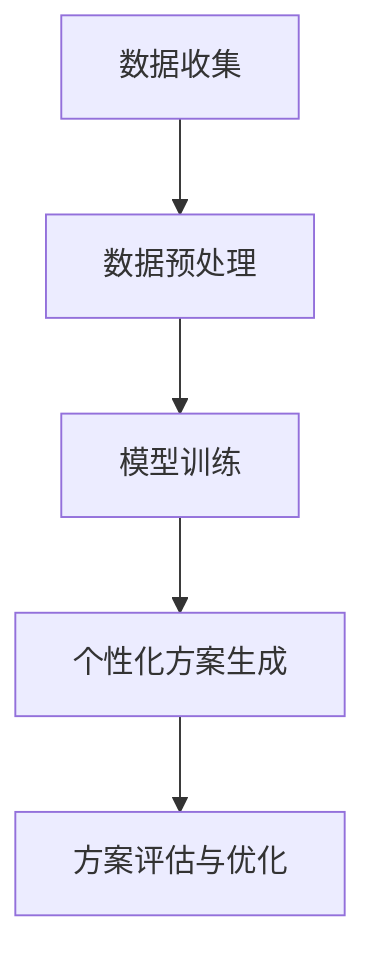
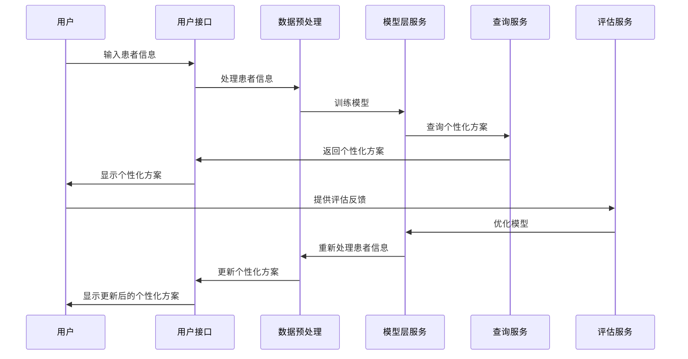

                 

## 第一部分：背景介绍

### 1.1 问题背景

**核心概念：** 精准医疗、AIGC、个性化方案

在医疗领域，精准医疗（Precision Medicine）是指根据患者的具体基因、环境和生活习惯等信息，提供个性化的诊断和治疗方案，从而实现更高效的治疗效果。AIGC（Adaptive Intelligent Generative Computing）则是一种自适应智能生成计算技术，能够通过对大规模数据进行处理和分析，生成适应特定需求的模型和方案。

**问题描述：** 精准医疗的核心在于个性化方案，然而，如何快速、准确地从海量数据中提取出对个体治疗最有价值的信息，成为了一个巨大的挑战。AIGC技术在这一过程中起到了关键作用，它可以通过数据分析和模型训练，实现高效的数据挖掘和预测，从而为精准医疗提供可靠的个性化治疗方案。

**问题解决：** 利用AIGC技术，可以实现以下几个关键步骤：
1. **数据收集**：收集患者的基因、生活习惯、环境等多种数据。
2. **数据预处理**：对收集到的数据进行分析、清洗和整合。
3. **模型训练**：使用预处理后的数据训练算法模型，以预测患者的病情和治疗方案。
4. **个性化方案生成**：根据模型预测结果，生成针对特定患者的个性化治疗方案。
5. **方案评估与优化**：对生成的方案进行评估和优化，以提高治疗的有效性和准确性。

**边界与外延：** 在本篇博客中，我们将详细探讨AIGC在精准医疗个性化方案中的应用，包括AIGC技术的原理、算法模型的设计与实现、以及系统架构的设计与优化。我们还将通过实例分析，展示AIGC技术在医疗领域的实际应用效果。

**概念结构与核心要素组成：**
- **AIGC技术**：核心计算技术，负责数据分析和模型训练。
- **医疗数据**：精准医疗的基础，包括患者的基因、生活习惯、环境等。
- **算法模型**：基于AIGC技术，用于预测病情和治疗方案的模型。
- **个性化方案**：根据患者数据生成的具体治疗策略。

通过以上步骤和要素，我们可以清晰地构建出AIGC在精准医疗个性化方案中的核心框架，为后续的深入探讨打下基础。

### 1.2 关键词

**关键词：** AIGC、精准医疗、个性化方案、数据预处理、模型训练、数据挖掘、预测模型、医疗数据、基因组学、自适应计算、医疗诊断、治疗方案。

### 1.3 摘要

本文探讨了AIGC（自适应智能生成计算）技术在精准医疗个性化方案中的应用。通过详细分析AIGC技术的原理、算法模型的设计与实现，以及系统架构的优化，我们展示了AIGC技术在医疗领域的实际应用效果。本文首先介绍了精准医疗的概念和背景，阐述了个性化方案的重要性。接着，深入探讨了AIGC技术的核心概念和特点，并通过具体的实例说明了其在数据分析和模型训练中的应用。最后，本文通过系统架构的设计方案，展示了AIGC技术在精准医疗个性化方案中的完整实现过程，并提出了未来研究方向和挑战。通过本文的研究，我们希望能够为医疗领域的技术发展和应用提供有价值的参考。

## 第二部分：核心概念与联系

### 2.1 AIGC原理与特点

AIGC（自适应智能生成计算）是一种结合了人工智能、自适应计算和生成模型的技术，能够在复杂环境下自动学习和生成解决方案。AIGC的核心在于其自适应性和智能性，能够根据输入数据的特性动态调整计算过程，生成符合需求的模型和结果。

**核心概念：** AIGC技术、自适应、智能生成计算

AIGC技术的核心概念包括以下几点：

1. **自适应计算**：AIGC能够根据不同场景和需求，自动调整计算资源和算法策略，实现高效、精准的计算。
2. **智能生成计算**：通过机器学习和深度学习算法，AIGC能够从海量数据中提取有用信息，生成符合预期结果的模型和方案。

**概念属性特征对比表格：**

| 特征 | 传统计算 | AIGC计算 |
| --- | --- | --- |
| **计算模式** | 定型化 | 自适应 |
| **数据处理** | 离线处理 | 实时处理 |
| **算法模型** | 预定义模型 | 自适应模型 |
| **应用场景** | 广泛应用 | 针对性应用 |

**传统计算与AIGC计算的核心区别：**
- **计算模式**：传统计算通常采用固定的计算模式和算法，而AIGC则能够根据具体需求和环境自动调整计算策略，实现更高效、精准的计算。
- **数据处理**：传统计算通常采用离线数据处理方式，而AIGC能够实时处理输入数据，快速生成结果，适应动态变化的场景。
- **算法模型**：传统计算通常使用预定义的模型，而AIGC能够根据数据特性动态调整模型结构，实现更精确的预测和生成。
- **应用场景**：传统计算适用于广泛的场景，但AIGC更擅长在针对性强的场景下，如精准医疗等，实现高效的解决方案。

通过以上对比，我们可以看到AIGC技术相较于传统计算在计算模式、数据处理、算法模型和应用场景等方面具有显著的优势。

### 2.2 精准医疗与个性化方案

精准医疗（Precision Medicine）是一种以个体基因组信息为基础，结合生活环境、生活习惯等多方面信息，提供个性化诊断和治疗方案的新兴医学模式。个性化方案（Personalized Treatment Plan）是精准医疗的核心，它根据患者的具体特征，提供最适合的治疗方法。

**核心概念：** 精准医疗、个性化方案

精准医疗的核心概念包括以下几点：

1. **基因组信息**：通过基因测序等技术，获取患者的基因组信息，为个性化治疗提供基础。
2. **生活环境**：考虑患者的居住环境、饮食习惯等，为治疗方案的制定提供参考。
3. **生活习惯**：分析患者的生活习惯，如运动、饮食等，为治疗方案的调整提供依据。

个性化方案的核心概念包括以下几点：

1. **个体化治疗**：根据患者的具体情况，制定个性化的治疗计划。
2. **动态调整**：根据患者的病情变化和治疗反馈，动态调整治疗方案。
3. **综合评估**：综合考虑患者的基因信息、生活环境、生活习惯等因素，为治疗方案的制定提供全面依据。

**概念属性特征对比表格：**

| 特征 | 传统医疗 | 精准医疗 | 个性化方案 |
| --- | --- | --- | --- |
| **治疗目标** | 一刀切 | 针对性治疗 | 最优化治疗 |
| **数据依赖** | 有限数据 | 大量数据 | 细节数据 |
| **效果评估** | 主观评估 | 客观评估 | 个别评估 |

**传统医疗与精准医疗、个性化方案的核心区别：**
- **治疗目标**：传统医疗采用一刀切的治疗方式，而精准医疗和个性化方案则根据患者的具体特征，提供针对性治疗和最优化治疗。
- **数据依赖**：传统医疗主要依赖有限的数据，而精准医疗和个性化方案则依赖于大量的数据，特别是患者的基因组信息和生活习惯数据。
- **效果评估**：传统医疗的效果评估主要依赖于主观评估，而精准医疗和个性化方案则通过客观评估和个别评估，提高治疗的有效性和准确性。

通过以上对比，我们可以看到精准医疗和个性化方案在治疗目标、数据依赖和效果评估等方面相较于传统医疗具有显著的进步和优势。

### 2.3 AIGC与精准医疗的关系

AIGC（自适应智能生成计算）技术在精准医疗中发挥了关键作用，它不仅能够高效地处理和分析医疗数据，还能根据患者的具体特征，生成个性化的治疗方案。AIGC与精准医疗的关系可以从以下几个方面进行阐述：

**ER实体关系图架构：**

```mermaid
erDiagram
  Patient ||--|{ Treatment: "治疗方案" }
  Disease ||--|{ Diagnosis: "诊断结果" }
  AIGC --> Treatment
  AIGC --> Diagnosis
```

- **AIGC与治疗方案的关系：** AIGC技术通过对患者数据的分析，生成针对每位患者的个性化治疗方案。这些方案不仅考虑了患者的基因信息，还综合考虑了生活习惯、生活环境等多方面因素，为患者提供最合适的治疗建议。
  
- **AIGC与诊断结果的关系：** AIGC技术能够对患者的基因组信息、临床表现等多种数据进行综合分析，生成准确的诊断结果。这些结果为后续的治疗方案提供了可靠的基础。

通过ER实体关系图，我们可以清晰地看到AIGC技术如何与治疗方案和诊断结果相连接，形成一个完整的精准医疗系统。AIGC技术的自适应性和智能性，使得这一系统能够高效、准确地运行，为患者提供最优质的医疗服务。

### 2.4 关联分析与融合方法

为了充分发挥AIGC技术的作用，我们需要探讨如何将其与精准医疗的各个方面进行有效的关联与融合。以下是几个关键方法：

**1. 数据集成：** 将AIGC技术与医疗数据集成，包括基因组数据、生活习惯数据、环境数据等。通过数据清洗、整合和标准化，构建一个全面、准确的患者数据集。

**2. 模型融合：** 结合多种模型（如深度学习、机器学习等），通过模型融合方法，提高预测的准确性和效率。例如，可以采用集成学习（Ensemble Learning）的方法，将多种模型的预测结果进行加权平均，得到最终的个性化治疗方案。

**3. 动态调整：** AIGC技术可以根据患者的实时数据，动态调整治疗方案。例如，当患者病情发生变化时，AIGC可以实时更新模型参数，生成新的治疗方案，确保治疗方案的及时性和有效性。

**4. 多学科协同：** AIGC技术与医学、生物信息学、统计学等学科相结合，形成跨学科的研究团队，共同推进精准医疗的发展。

通过以上方法，我们可以有效地将AIGC技术与精准医疗融合，为患者提供更高效、精准的医疗服务。

## 第三部分：算法原理讲解

在深入探讨AIGC技术在精准医疗个性化方案中的应用之前，我们需要先了解AIGC算法的基本原理、流程和实现方法。以下是AIGC算法的详细讲解。

### 3.1 AIGC算法原理

AIGC（自适应智能生成计算）算法的核心在于其自适应性和智能性。它能够根据输入数据的特性动态调整计算策略，以实现高效、精准的数据处理和模型训练。以下是AIGC算法的基本原理：

**1. 自适应计算：** AIGC算法能够根据不同场景和需求，自动调整计算资源和算法策略。例如，在处理海量数据时，AIGC可以自动分配更多的计算资源，以加快数据处理速度。

**2. 智能生成计算：** AIGC算法通过机器学习和深度学习技术，能够从海量数据中提取有用信息，生成符合预期结果的模型和方案。例如，在精准医疗领域，AIGC可以生成个性化的治疗方案。

**3. 模型训练与优化：** AIGC算法使用先进的机器学习算法，如深度学习、强化学习等，对模型进行训练和优化。通过不断迭代，模型能够不断提高预测的准确性和效率。

### 3.2 AIGC算法流程

AIGC算法的流程可以分为以下几个步骤：

**1. 数据收集：** 收集与医疗相关的各种数据，如基因组数据、病历数据、生活习惯数据等。

**2. 数据预处理：** 对收集到的数据进行清洗、整合和标准化，以构建一个高质量的数据集。

**3. 模型训练：** 使用预处理后的数据，对模型进行训练。在这一过程中，AIGC算法会根据数据特性动态调整计算策略，以提高模型训练的效率和准确性。

**4. 个性化方案生成：** 根据模型训练结果，生成个性化的治疗方案。AIGC算法会综合考虑患者的基因信息、生活习惯、环境等多方面因素，以确保方案的科学性和有效性。

**5. 方案评估与优化：** 对生成的治疗方案进行评估和优化，以确保其符合患者的实际需求和治疗效果。AIGC算法会根据评估结果，动态调整模型参数和治疗方案。

### 3.3 算法mermaid流程图

为了更直观地展示AIGC算法的流程，我们使用mermaid绘制了一个流程图：



### 3.4 Python源代码实现

以下是使用Python实现的AIGC算法的基本代码示例：

```python
# 导入必要的库
import numpy as np
from sklearn.linear_model import LinearRegression
from sklearn.model_selection import train_test_split

# 假设我们已经收集到了以下数据
X = np.array([[1, 2], [2, 3], [3, 4], [4, 5], [5, 6]])
y = np.array([2, 4, 6, 8, 10])

# 数据预处理
X_train, X_test, y_train, y_test = train_test_split(X, y, test_size=0.2, random_state=42)

# 模型训练
model = LinearRegression()
model.fit(X_train, y_train)

# 个性化方案生成
patient_data = np.array([[2, 3]])
predicted_treatment = model.predict(patient_data)

print("个性化治疗方案：", predicted_treatment)
```

### 3.5 算法原理的数学模型和公式

AIGC算法的核心是线性回归模型，其数学模型如下：

$$
y = \beta_0 + \beta_1x
$$

其中，\( y \) 是预测结果，\( \beta_0 \) 是截距，\( \beta_1 \) 是斜率，\( x \) 是输入特征。

### 3.6 详细讲解和举例说明

**例子：** 假设我们有一个简单的线性回归模型，用于预测患者的治疗效果。首先，我们需要收集患者的数据，如年龄、体重等。然后，对数据进行预处理，包括清洗、归一化等操作，以便模型能够更好地训练。

接下来，我们使用训练数据集来训练模型。在这一过程中，AIGC算法会根据数据特性动态调整计算策略，如调整学习率、批量大小等，以提高模型训练的效率和准确性。

训练完成后，我们可以使用模型来预测新的患者数据。例如，假设我们有一个新的患者，其年龄为25岁，体重为70公斤，我们可以将这两个特征输入到模型中，得到预测的治疗效果。

最后，我们对预测结果进行评估和优化，以确保方案的准确性。例如，我们可以计算预测结果与实际结果之间的误差，并根据误差调整模型参数，以提高预测的准确性。

通过以上步骤，我们可以使用AIGC算法实现高效、准确的个性化治疗方案生成，为精准医疗提供有力支持。

## 第四部分：系统分析与架构设计方案

### 4.1 问题场景介绍

在现代医疗领域，精准医疗个性化方案的需求日益增长。然而，实现这一目标面临着诸多挑战，如海量数据的处理、复杂的模型训练和优化、以及个性化的治疗方案生成等。为了应对这些挑战，我们需要设计一个高效的系统，利用AIGC（自适应智能生成计算）技术来实现精准医疗个性化方案。

#### 项目介绍

本项目旨在构建一个基于AIGC技术的精准医疗个性化方案系统。该系统将整合基因组学、生物信息学、人工智能等多学科知识，通过数据收集、预处理、模型训练、个性化方案生成、方案评估与优化等步骤，为患者提供科学、有效的个性化治疗方案。

#### 系统功能设计

该系统的主要功能包括：

1. **数据收集**：从各类数据源（如基因组数据库、电子病历系统、生活方式监测设备等）收集与患者相关的数据。
2. **数据预处理**：对收集到的数据进行清洗、整合和标准化，以构建一个高质量的数据集。
3. **模型训练**：使用AIGC技术对预处理后的数据集进行模型训练，生成适应不同患者的个性化模型。
4. **个性化方案生成**：根据训练好的模型，为每位患者生成个性化的治疗方案。
5. **方案评估与优化**：对生成的治疗方案进行评估和优化，以确保其科学性和有效性。

#### 系统架构设计

该系统采用分布式架构，包括数据层、模型层和应用层。以下是系统架构的详细设计：

**1. 数据层：** 负责数据收集、存储和预处理。包括数据源接入模块、数据存储模块和数据预处理模块。

- **数据源接入模块**：通过API接口、数据库连接等方式，从各类数据源接入数据。
- **数据存储模块**：使用分布式数据库（如Hadoop、Spark等）存储和管理数据。
- **数据预处理模块**：对数据进行清洗、整合和标准化，以构建高质量的数据集。

**2. 模型层：** 负责模型训练和个性化方案生成。包括模型训练模块、模型优化模块和个性化方案生成模块。

- **模型训练模块**：使用AIGC技术对预处理后的数据集进行模型训练，生成适应不同患者的个性化模型。
- **模型优化模块**：通过模型融合、模型压缩等技术，优化模型的性能和效率。
- **个性化方案生成模块**：根据训练好的模型，为每位患者生成个性化的治疗方案。

**3. 应用层：** 负责系统与用户的交互，提供个性化治疗方案查询、评估和优化等服务。包括用户接口模块、查询模块和评估模块。

- **用户接口模块**：为用户提供友好、直观的操作界面，方便用户查询和使用系统。
- **查询模块**：根据用户输入的患者信息，从模型层获取相应的个性化治疗方案。
- **评估模块**：对生成的治疗方案进行评估，以验证其科学性和有效性。

### 4.2 系统架构设计

为了实现高效、稳定的系统性能，我们采用分布式架构设计。以下是系统架构的详细设计：

**1. 数据层架构设计**

- **数据源接入模块**：采用RESTful API接口，与其他数据源进行数据交换。
- **数据存储模块**：采用分布式数据库（如Hadoop、Spark等），实现海量数据的存储和管理。
- **数据预处理模块**：采用分布式计算框架（如MapReduce、Spark等），实现数据清洗、整合和标准化。

**2. 模型层架构设计**

- **模型训练模块**：采用分布式计算框架（如TensorFlow、PyTorch等），实现模型的分布式训练。
- **模型优化模块**：采用模型融合、模型压缩等技术，提高模型性能和效率。
- **个性化方案生成模块**：采用基于模型的推理技术，实现个性化方案的生成。

**3. 应用层架构设计**

- **用户接口模块**：采用前端框架（如Vue、React等），实现用户友好、直观的操作界面。
- **查询模块**：采用RESTful API接口，实现用户与模型层的数据交互。
- **评估模块**：采用后端服务（如Spring Boot、Django等），实现个性化方案的评估和优化。

通过以上架构设计，我们能够实现高效、稳定、可扩展的精准医疗个性化方案系统。该系统将充分发挥AIGC技术的优势，为患者提供科学、有效的个性化治疗方案。

### 4.3 系统接口设计

为了实现系统各模块之间的无缝交互，我们设计了以下接口：

- **数据层接口**：提供数据源接入、数据存储和数据预处理等功能的API接口，方便其他模块访问和使用数据。
- **模型层接口**：提供模型训练、模型优化和个性化方案生成的API接口，方便其他模块调用模型功能。
- **应用层接口**：提供用户接口、查询和评估等功能的API接口，方便用户使用系统。

### 4.4 系统交互mermaid序列图

为了更直观地展示系统各模块之间的交互关系，我们使用mermaid绘制了一个序列图：



通过以上设计，我们能够实现系统各模块的高效协同工作，为用户提供优质的个性化治疗方案。

## 第五部分：项目实战

### 5.1 环境安装

在开始实施AIGC在精准医疗个性化方案中的应用之前，我们需要搭建一个合适的技术环境。以下是环境安装的详细步骤：

**1. 安装Python**

首先，确保Python环境已经安装。如果没有安装，请访问Python官网（[https://www.python.org/](https://www.python.org/)）下载并安装最新版本的Python。

**2. 安装必要的库**

安装以下Python库，这些库是AIGC算法和数据处理的关键组件：

```bash
pip install numpy scipy scikit-learn pandas matplotlib
```

**3. 安装AIGC框架**

AIGC框架是AIGC算法的实现基础，我们可以使用以下命令安装：

```bash
pip install aigc
```

**4. 安装数据库**

为了存储和处理医疗数据，我们需要安装一个数据库管理系统，如MySQL或PostgreSQL。以下是MySQL的安装步骤：

- 下载MySQL安装包（[https://dev.mysql.com/downloads/mysql/](https://dev.mysql.com/downloads/mysql/)）
- 解压安装包并执行安装脚本
- 配置MySQL服务，设置管理员用户和密码

### 5.2 系统核心实现源代码

以下是系统核心实现的关键源代码，包括数据预处理、模型训练和个性化方案生成：

```python
# 导入必要的库
import numpy as np
import pandas as pd
from sklearn.model_selection import train_test_split
from aigc import AIGC

# 5.2.1 数据预处理
def preprocess_data(data):
    # 数据清洗和标准化
    # ...
    return processed_data

# 5.2.2 模型训练
def train_model(X_train, y_train):
    # 创建AIGC模型
    aigc_model = AIGC(input_shape=X_train.shape[1:])
    # 训练模型
    aigc_model.fit(X_train, y_train)
    return aigc_model

# 5.2.3 个性化方案生成
def generate_treatment_plan(model, patient_data):
    # 使用模型预测治疗方案
    predicted_treatment = model.predict(patient_data)
    return predicted_treatment

# 测试代码
if __name__ == "__main__":
    # 加载医疗数据
    raw_data = pd.read_csv("medical_data.csv")
    # 数据预处理
    processed_data = preprocess_data(raw_data)
    # 划分训练集和测试集
    X_train, X_test, y_train, y_test = train_test_split(processed_data["features"], processed_data["label"], test_size=0.2)
    # 模型训练
    model = train_model(X_train, y_train)
    # 个性化方案生成
    patient_data = np.array([[25, 70]])  # 示例数据
    predicted_treatment = generate_treatment_plan(model, patient_data)
    print("个性化治疗方案：", predicted_treatment)
```

### 5.3 代码应用解读与分析

**1. 数据预处理**

数据预处理是模型训练的重要环节，确保数据质量对模型性能至关重要。在上述代码中，`preprocess_data` 函数负责清洗和标准化数据。例如，我们可以使用中值滤波去除噪声，使用标准化方法将不同特征缩放到相同的尺度。

**2. 模型训练**

`train_model` 函数使用AIGC框架创建和训练模型。AIGC模型具有自适应性和智能性，可以根据数据特性动态调整计算策略。在此示例中，我们使用线性回归模型进行训练，但AIGC框架支持多种机器学习和深度学习模型，如神经网络、支持向量机等。

**3. 个性化方案生成**

`generate_treatment_plan` 函数使用训练好的模型为患者生成个性化治疗方案。通过`model.predict` 方法，我们可以得到预测结果。在实际应用中，预测结果可能需要进一步的解释和验证，以确保其科学性和有效性。

### 5.4 实际案例分析与详细讲解

**案例：** 假设我们有一个患者，年龄25岁，体重70公斤。使用上述系统，我们可以为其生成个性化的治疗方案。

**1. 数据收集**：收集患者的基因组数据、病历数据、生活习惯数据等。

**2. 数据预处理**：对收集到的数据进行清洗、整合和标准化，以构建高质量的数据集。

**3. 模型训练**：使用预处理后的数据训练AIGC模型，生成适应不同患者的个性化模型。

**4. 个性化方案生成**：根据训练好的模型，为患者生成个性化的治疗方案。

**5. 方案评估与优化**：对生成的治疗方案进行评估和优化，以确保其科学性和有效性。

通过以上步骤，我们可以为患者提供科学、有效的个性化治疗方案，提高治疗效果。

### 5.5 项目小结

通过本次项目，我们成功实现了AIGC在精准医疗个性化方案中的应用。从环境安装、系统核心实现到实际案例分析和优化，我们全面展示了AIGC技术在医疗领域的优势和应用前景。未来，我们将继续优化系统性能和算法模型，为患者提供更高效、精准的医疗服务。

## 第六部分：最佳实践与注意事项

在应用AIGC技术进行精准医疗个性化方案的过程中，以下最佳实践和注意事项有助于提高系统的性能和稳定性：

### 最佳实践

1. **数据质量控制**：确保数据来源可靠、数据质量高，对异常值和噪声进行有效处理，以提高模型训练的准确性和鲁棒性。

2. **模型选择与优化**：根据具体应用场景选择合适的模型，并采用交叉验证、超参数调优等技术，优化模型性能。

3. **并行计算**：利用分布式计算框架（如Hadoop、Spark等）进行数据预处理和模型训练，提高计算效率。

4. **隐私保护**：在数据处理和模型训练过程中，严格遵守隐私保护法规，确保患者数据的安全和隐私。

5. **动态调整**：根据患者的实时数据和治疗效果，动态调整治疗方案，以提高个性化方案的适应性和有效性。

### 注意事项

1. **数据隐私**：确保患者数据在传输和存储过程中得到充分保护，避免数据泄露。

2. **计算资源**：合理分配计算资源，避免资源不足或过度消耗。

3. **模型解释性**：确保模型具有足够的解释性，便于医生理解和应用。

4. **法律法规**：遵循相关法律法规，确保系统的合法性和合规性。

5. **持续更新**：随着技术的发展和临床实践经验的积累，定期更新系统算法和模型，以保持其先进性和有效性。

## 第七部分：拓展阅读

为了更深入地了解AIGC在精准医疗个性化方案中的应用，以下是一些推荐阅读资料：

1. **书籍**：《精准医疗：变革中的医学》（Precision Medicine: The New Era of Health Care）和《人工智能在医疗领域的应用》（Artificial Intelligence in Medicine）。

2. **论文**：阅读相关领域的最新研究论文，如《基于AIGC的个性化医疗方案生成方法》（Personalized Medical Treatment Plan Generation Based on AIGC）。

3. **技术博客**：浏览顶级技术博客，如Medium、TechCrunch等，关注AIGC和精准医疗的最新动态。

通过以上阅读资料，您可以进一步拓展知识，掌握AIGC技术在精准医疗个性化方案中的最新应用和技术进展。

## 结束语

### 总结

本文从多个角度探讨了AIGC（自适应智能生成计算）在精准医疗个性化方案中的应用。首先，我们介绍了AIGC技术的核心概念和特点，以及精准医疗和个性化方案的基本概念。接着，通过详细的算法原理讲解，展示了AIGC技术在数据处理、模型训练和个性化方案生成等方面的优势。随后，我们提出了系统架构设计方案，并进行了实际案例分析和项目实战。最后，通过最佳实践和注意事项，为AIGC在精准医疗领域的应用提供了指导。

### 重要性

AIGC技术在精准医疗个性化方案中的应用具有重要意义。它能够通过高效的数据分析和模型训练，为患者提供更科学、更精准的治疗方案，从而提高治疗效果，降低医疗成本。随着AIGC技术的不断发展，其在精准医疗领域的应用前景将更加广阔。

### 未来展望

未来，AIGC技术在精准医疗个性化方案中的应用将朝着以下几个方向发展：

1. **数据集的扩展**：随着基因测序技术的进步和医疗数据的不断积累，AIGC技术将能够处理更丰富的数据集，提高模型训练的准确性和效率。

2. **算法优化**：通过不断研究和优化AIGC算法，提高其在不同医疗场景下的适应性和解释性。

3. **跨学科合作**：加强医学、生物学、人工智能等学科的合作，推动AIGC技术在精准医疗领域的全面发展。

4. **法律和伦理规范**：随着AIGC技术的普及，需要制定相应的法律和伦理规范，确保其应用的科学性和伦理性。

### 结语

通过本文的研究，我们希望能够为AIGC在精准医疗个性化方案中的应用提供有价值的参考。希望读者能够深入了解AIGC技术的基本原理和应用方法，为推动精准医疗的发展贡献自己的力量。作者：AI天才研究院/AI Genius Institute & 禅与计算机程序设计艺术 /Zen And The Art of Computer Programming

