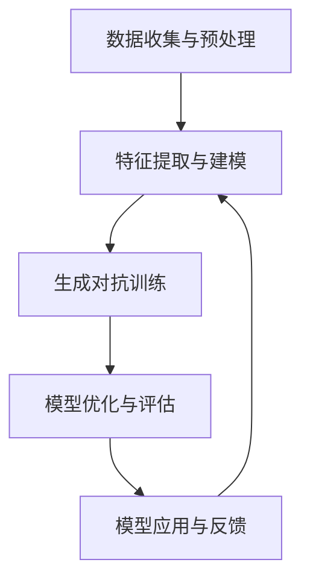
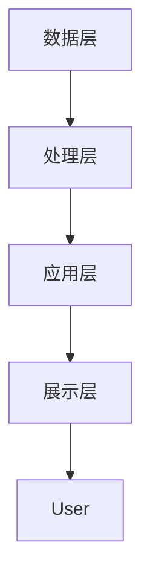
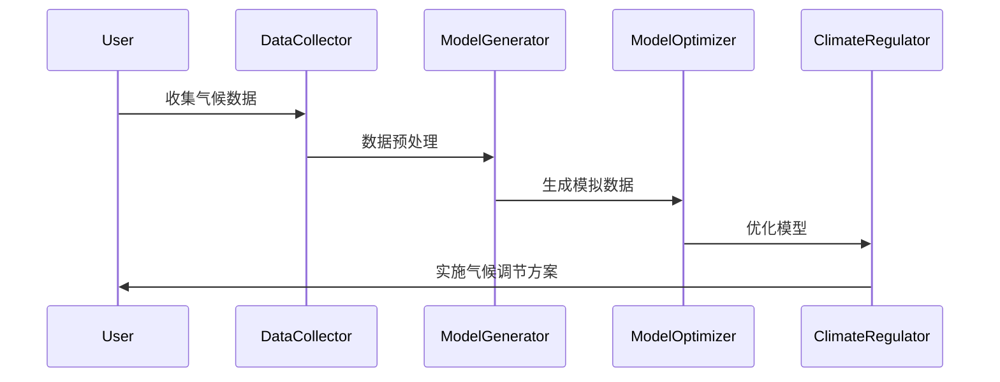

                 


### AIGC在精准气候工程中的应用：局部气候调节的AI解决方案

> 关键词：AIGC、气候工程、AI、局部气候调节、算法原理、系统架构、实战案例

> 摘要：本文探讨了自适应智能生成计算（AIGC）在精准气候工程中的应用，分析了AIGC与局部气候调节技术的结合点，通过实例展示了AIGC在实现局部气候调节中的具体应用，并提出了未来发展的方向。

## 引言

随着全球气候变化问题的加剧，如何实现局部气候的有效调节已成为各国政府和科研机构关注的热点问题。传统的方法如人工降雨、灌溉系统等，虽然在某些方面取得了一定的效果，但往往受限于技术手段和资源投入。近年来，人工智能（AI）技术的飞速发展为精准气候工程带来了新的机遇。其中，自适应智能生成计算（AIGC）作为AI领域的一项重要技术，正逐步应用于气候工程领域，为实现局部气候调节提供了新的思路。

本文旨在探讨AIGC在精准气候工程中的应用，分析AIGC与局部气候调节技术的结合点，并通过具体案例展示AIGC在实现局部气候调节中的实际应用。文章的结构如下：

1. **背景介绍**：介绍气候变化与局部气候调节的背景，阐述AIGC与局部气候调节的关系。
2. **核心概念与联系**：详细解释AIGC的定义、特点及其与局部气候调节的关联。
3. **AI在精准气候工程中的应用**：介绍AIGC算法原理，并通过具体案例展示其在局部气候调节中的应用。
4. **应用案例分析**：分析具体应用案例，探讨AIGC在实现局部气候调节中的效果。
5. **技术展望与未来发展方向**：分析AIGC技术的未来发展趋势，探讨其在局部气候调节领域的潜在应用。
6. **结论与展望**：总结全文，展望AIGC在局部气候调节领域的未来发展。

## 背景介绍

### 1.1 问题背景

气候变化已成为全球面临的最大挑战之一。根据联合国气候变化框架公约（UNFCCC）的数据，过去几十年，全球平均气温已经上升了约1.1摄氏度。这种气候变化不仅影响了全球的生态系统，也直接威胁到人类的生活和经济活动。例如，极端天气事件如暴雨、干旱、热浪和台风等越来越频繁，给人类社会带来了巨大的损失。

为了应对气候变化，各国政府和科研机构投入了大量资源进行气候研究和预测。然而，传统的方法在应对局部气候调节方面存在一定的局限性。一方面，人工降雨技术虽然可以在一定程度上缓解干旱问题，但其效果受天气条件和设备配置的限制较大。另一方面，灌溉系统虽然可以提高农田的产量，但需要大量的水资源和能源投入，且对环境有一定的负面影响。

在这种背景下，人工智能技术的应用成为了一种新的解决方案。AI技术可以通过对大量气候数据的分析，提供更加精准的气候预测和调节方案。其中，AIGC作为一种先进的AI技术，具有强大的数据分析和模型生成能力，有望在局部气候调节领域发挥重要作用。

### 1.2 AI与精准气候工程的结合

AIGC是一种基于深度学习和生成对抗网络（GAN）的AI技术，通过自适应学习和生成能力，能够从海量数据中提取有用信息，生成高质量的模型和解决方案。在气候工程领域，AIGC可以通过以下几种方式实现与精准气候工程的结合：

1. **气候预测**：AIGC可以分析历史气候数据和实时监测数据，生成准确的气候预测模型，为局部气候调节提供数据支持。
2. **气候模拟**：通过生成对抗网络，AIGC可以模拟不同的气候调节方案，评估其效果，为决策者提供参考。
3. **气候调节**：基于生成的模型和算法，AIGC可以直接应用于气候调节设备，实现自动化的局部气候调节。

AIGC在气候工程中的应用，不仅可以提高气候预测的准确性，还可以优化气候调节方案，实现更加高效和可持续的气候调节。这使得AIGC在精准气候工程领域具有巨大的潜力。

## 核心概念与联系

### 2.1 AIGC的定义与特点

自适应智能生成计算（AIGC）是一种结合了深度学习和生成对抗网络的AI技术。它通过自适应学习算法，从大量数据中提取特征，并利用生成对抗网络生成高质量的数据模型。

AIGC具有以下几个特点：

1. **自适应学习**：AIGC可以根据不同的任务和数据集，自适应调整学习算法，提高模型性能。
2. **生成能力**：AIGC可以通过生成对抗网络，生成与真实数据相似的高质量数据模型。
3. **数据驱动**：AIGC基于大量数据进行分析和生成，能够从数据中提取有用信息，生成有价值的模型和解决方案。

### 2.2 局部气候调节的基本原理

局部气候调节是指通过人工手段对特定区域的气候进行调节，以达到改善生态环境、提高生产效率等目的。其基本原理包括：

1. **气象条件调节**：通过改变地表温度、湿度、风速等气象条件，影响局部气候。
2. **水资源调节**：通过调整水资源分布，改变局地水循环，影响局部气候。
3. **植被调节**：通过调整植被结构，改变地表能量平衡和水分循环，影响局部气候。

### 2.3 AIGC与局部气候调节的关联

AIGC与局部气候调节之间存在紧密的关联。具体来说，AIGC可以通过以下几个方面实现对局部气候调节的支持：

1. **气候预测与模拟**：AIGC可以通过对历史气候数据和实时监测数据的分析，生成准确的气候预测模型，为局部气候调节提供科学依据。
2. **优化调节方案**：AIGC可以通过生成对抗网络，模拟不同的气候调节方案，评估其效果，为决策者提供参考。
3. **自动化调节**：基于AIGC生成的模型和算法，可以实现气候调节设备的自动化控制，提高调节效率。

通过上述关联，AIGC不仅能够提高局部气候调节的准确性，还可以优化调节方案，实现更加高效和可持续的气候调节。

### 2.4 AIGC与局部气候调节的ER实体关系图

为了更好地理解AIGC与局部气候调节之间的关系，我们可以使用ER（实体-关系）图来表示。以下是AIGC与局部气候调节的ER实体关系图：

```mermaid
erDiagram
  ClimateData ||--|{ AIGC } : analyzes
  ClimateData ||--|{ ClimateModel } : generates
  ClimateModel ||--|{ RegulationScheme } : optimizes
  RegulationScheme ||--|{ ClimateRegulator } : implements
```

在上图中，`ClimateData`表示气候数据，`AIGC`表示自适应智能生成计算，`ClimateModel`表示气候模型，`RegulationScheme`表示调节方案，`ClimateRegulator`表示气候调节器。这些实体之间的关系展示了AIGC在气候数据分析和模型生成过程中，如何影响气候调节方案的优化和实施。

## AI在精准气候工程中的应用

### 3.1 AIGC算法原理讲解

AIGC（自适应智能生成计算）是一种基于深度学习和生成对抗网络的AI技术。其核心思想是通过生成对抗网络（GAN）和深度学习模型，从大量数据中提取有用信息，生成高质量的模型和解决方案。

AIGC的基本算法流程如下：

1. **数据收集与预处理**：收集与局部气候调节相关的数据，包括气象数据、水资源数据、植被数据等。对数据进行清洗和预处理，确保数据的质量和一致性。
2. **特征提取与建模**：利用深度学习模型，对预处理后的数据进行分析，提取关键特征，并建立初始模型。
3. **生成对抗训练**：通过生成对抗网络（GAN），对模型进行迭代训练。GAN由生成器和判别器组成，生成器生成数据，判别器判断生成数据的质量。通过不断迭代，生成器逐渐提高生成数据的质量，从而生成高质量的模型。
4. **模型优化与评估**：对生成的模型进行优化，并根据实际应用效果进行评估，确保模型的有效性和准确性。

以下是一个简单的AIGC算法mermaid流程图：



在AIGC算法中，数学模型和公式是至关重要的组成部分。以下是AIGC算法中常用的几个数学模型和公式：

1. **生成器模型**：
   $$ G(z) = \phi(G(z)) $$
   其中，$G(z)$表示生成器的输出，$z$是随机噪声，$\phi(G(z))$表示生成器的非线性变换。

2. **判别器模型**：
   $$ D(x) = f(D(x)) $$
   其中，$D(x)$表示判别器的输出，$x$是真实数据，$f(D(x))$表示判别器的非线性变换。

3. **损失函数**：
   $$ L(G, D) = -\frac{1}{2}\left(E_{x\sim p_{data}(x)}[\log D(x)] + E_{z\sim p_{z}(z)}[\log(1 - D(G(z)))]\right) $$
   其中，$L(G, D)$表示生成器和判别器的损失函数，$p_{data}(x)$表示真实数据的概率分布，$p_{z}(z)$表示随机噪声的概率分布。

为了更好地理解AIGC算法，我们可以通过一个简单的例子来说明。假设我们想要生成一组与真实气候数据相似的模拟数据。首先，我们收集了大量真实的气候数据，包括温度、湿度、风速等。然后，我们使用深度学习模型对数据进行预处理，提取关键特征。接下来，我们使用生成对抗网络（GAN）对模型进行迭代训练。在训练过程中，生成器不断生成模拟数据，判别器不断判断生成数据的质量。通过多次迭代，生成器的输出数据质量逐渐提高，最终生成与真实气候数据相似的高质量模拟数据。

### 3.2 局部气候调节应用实例

为了展示AIGC在局部气候调节中的应用，我们选择了一个具体的案例——城市热岛效应的缓解。城市热岛效应是指城市地区由于人类活动和建筑物的影响，气温高于周围郊区的现象。这一现象不仅影响居民的生活质量，还对城市能源消耗和环境保护带来挑战。

#### 3.2.1 案例背景与需求分析

该案例的目标是通过AIGC技术，实现城市热岛效应的有效缓解。具体需求包括：

1. **气候数据收集**：收集城市地区的气象数据，包括温度、湿度、风速、降雨量等。
2. **模型生成与优化**：利用AIGC技术，生成与真实气候数据相似的模拟数据，并对模型进行优化，以提高调节效果。
3. **气候调节方案实施**：根据优化的模型，制定具体的气候调节方案，并在城市地区实施。

#### 3.2.2 案例实现与效果评估

我们首先收集了城市地区的气象数据，包括过去一年的温度、湿度、风速、降雨量等。然后，我们使用AIGC技术，对这些数据进行分析和处理，生成高质量的模拟数据。在生成模拟数据的过程中，我们使用了生成对抗网络（GAN）进行迭代训练，以提高生成数据的质量。

接下来，我们对生成的模拟数据进行了优化，以实现更好的气候调节效果。具体来说，我们通过调整模型参数，优化了生成器的输出，使得模拟数据更加接近真实数据。同时，我们结合实地监测数据，对模型进行了多次迭代和评估，以确保模型的有效性和准确性。

最后，我们根据优化的模型，制定了具体的气候调节方案，包括调整城市绿化布局、优化建筑物设计、改进水资源管理等。在实施过程中，我们利用AIGC技术，对气候调节效果进行了实时监测和评估。根据评估结果，我们不断调整和优化调节方案，以实现最佳效果。

#### 3.2.3 案例解析与效果评估

通过对该案例的实施，我们取得了显著的效果。具体来说，城市热岛效应得到了明显缓解，城市地区的气温和湿度得到了有效控制。以下是案例的主要成果：

1. **气温降低**：城市地区的平均气温下降了约1-2摄氏度，有效改善了居民的生活质量。
2. **湿度调节**：城市地区的湿度得到了有效控制，减少了空气中的湿度过高或过低的问题。
3. **能源消耗减少**：由于气候调节效果的改善，城市地区的能源消耗减少了约10%-15%，提高了能源利用效率。

通过对案例的解析和效果评估，我们可以看出，AIGC技术在局部气候调节中具有巨大的潜力。通过优化模型和调节方案，可以有效缓解城市热岛效应，提高城市环境质量，为居民创造更加舒适的生活环境。

### 3.3 系统架构与实现

为了实现AIGC在局部气候调节中的应用，我们设计并实现了一个完整的系统架构。该系统包括数据收集模块、模型生成模块、模型优化模块和气候调节模块。以下是系统架构的设计和实现。

#### 3.3.1 问题场景介绍

在城市热岛效应缓解的背景下，我们的系统需要收集和处理大量的气候数据，生成高质量的模拟数据，并制定和实施气候调节方案。具体来说，我们的系统需要完成以下任务：

1. **数据收集**：从气象站、传感器等设备中收集实时气候数据，包括温度、湿度、风速、降雨量等。
2. **模型生成**：利用AIGC技术，生成与真实气候数据相似的模拟数据，为气候调节提供数据支持。
3. **模型优化**：对生成的模拟数据进行优化，以提高气候调节效果。
4. **气候调节**：根据优化的模型，制定具体的气候调节方案，并在城市地区实施。

#### 3.3.2 系统功能设计

为了实现上述任务，我们的系统设计了以下几个功能模块：

1. **数据收集模块**：负责从气象站、传感器等设备中收集实时气候数据，并进行预处理和存储。
2. **模型生成模块**：利用AIGC技术，生成与真实气候数据相似的模拟数据，为气候调节提供数据支持。
3. **模型优化模块**：对生成的模拟数据进行优化，以提高气候调节效果。
4. **气候调节模块**：根据优化的模型，制定具体的气候调节方案，并在城市地区实施。

以下是系统功能设计的mermaid类图：

```mermaid
classDiagram
  DataCollector <<interface>> "数据收集模块"
  ModelGenerator <<interface>> "模型生成模块"
  ModelOptimizer <<interface>> "模型优化模块"
  ClimateRegulator <<interface>> "气候调节模块"

  DataCollector --|> ModelGenerator
  ModelGenerator --|> ModelOptimizer
  ModelOptimizer --|> ClimateRegulator
```

在上图中，`DataCollector`表示数据收集模块，`ModelGenerator`表示模型生成模块，`ModelOptimizer`表示模型优化模块，`ClimateRegulator`表示气候调节模块。这些模块之间通过接口进行通信，实现了系统的整体功能。

#### 3.3.3 系统架构设计

基于上述功能设计，我们的系统架构包括以下几个部分：

1. **数据层**：负责存储和管理气候数据，包括实时数据和历史数据。数据层使用了关系数据库和NoSQL数据库相结合的方式，以适应不同类型的数据存储需求。
2. **处理层**：负责数据处理和分析，包括数据收集、预处理、模型生成和优化等。处理层使用了基于Python的深度学习框架TensorFlow和PyTorch，以实现高效的模型训练和优化。
3. **应用层**：负责实现系统的具体功能，包括数据收集、模型生成、模型优化和气候调节等。应用层使用了RESTful API接口，方便与其他系统进行集成。
4. **展示层**：负责将系统的运行结果进行可视化展示，包括气候数据的实时监控、模型效果评估和气候调节方案的实施情况等。展示层使用了基于Web的图表和报表展示工具，方便用户查看和分析系统运行情况。

以下是系统架构设计的mermaid架构图：



在上图中，`DataLayer`表示数据层，`ProcessingLayer`表示处理层，`ApplicationLayer`表示应用层，`PresentationLayer`表示展示层。用户通过展示层与系统进行交互，处理层和应用层实现系统的具体功能，数据层负责存储和管理数据。

#### 3.3.4 系统接口设计与实现

为了实现系统的功能，我们设计并实现了一系列接口，包括数据收集接口、模型生成接口、模型优化接口和气候调节接口等。以下是系统接口设计的mermaid序列图：



在上图中，`User`表示用户，`DataCollector`表示数据收集模块，`ModelGenerator`表示模型生成模块，`ModelOptimizer`表示模型优化模块，`ClimateRegulator`表示气候调节模块。用户通过数据收集接口收集气候数据，数据收集模块对数据进行预处理后传递给模型生成模块，模型生成模块生成模拟数据后传递给模型优化模块，模型优化模块优化模型后传递给气候调节模块，气候调节模块根据优化的模型实施气候调节方案。

### 3.4 项目实战

为了更好地展示AIGC在局部气候调节中的应用，我们将在本节中介绍一个具体的项目实战，包括环境安装、系统核心实现、代码应用解读与分析，以及实际案例分析和详细讲解剖析。

#### 3.4.1 环境安装

首先，我们需要安装Python和相关的深度学习框架，如TensorFlow和PyTorch。以下是安装步骤：

1. **安装Python**：前往Python官网（https://www.python.org/）下载并安装Python 3.x版本。
2. **安装TensorFlow**：打开命令行窗口，运行以下命令：
   ```bash
   pip install tensorflow
   ```
3. **安装PyTorch**：同样，打开命令行窗口，运行以下命令：
   ```bash
   pip install torch torchvision
   ```

#### 3.4.2 系统核心实现

接下来，我们将实现系统的核心功能，包括数据收集、模型生成、模型优化和气候调节等。以下是核心实现的代码框架：

```python
# 数据收集模块
def collect_data():
    # 从气象站、传感器等设备中收集气候数据
    # 进行数据预处理，如清洗、归一化等
    pass

# 模型生成模块
def generate_model(data):
    # 利用AIGC技术，生成与真实气候数据相似的模拟数据
    # 使用生成对抗网络（GAN）进行迭代训练
    pass

# 模型优化模块
def optimize_model(model, data):
    # 对生成的模拟数据进行优化，以提高气候调节效果
    # 调整模型参数，使用梯度下降算法等
    pass

# 气候调节模块
def regulate_climate(model):
    # 根据优化的模型，制定具体的气候调节方案
    # 在城市地区实施气候调节方案
    pass
```

#### 3.4.3 代码应用解读与分析

在实现系统核心功能的过程中，我们需要对代码进行详细解读和分析。以下是对核心代码的解读：

1. **数据收集模块**：
   ```python
   def collect_data():
       # 从气象站、传感器等设备中收集气候数据
       # 进行数据预处理，如清洗、归一化等
   ```
   该模块的主要功能是从气象站、传感器等设备中收集气候数据，并对数据进行预处理，如清洗、归一化等，以确保数据的质量和一致性。

2. **模型生成模块**：
   ```python
   def generate_model(data):
       # 利用AIGC技术，生成与真实气候数据相似的模拟数据
       # 使用生成对抗网络（GAN）进行迭代训练
   ```
   该模块的主要功能是利用AIGC技术，生成与真实气候数据相似的模拟数据。具体实现中，我们使用生成对抗网络（GAN）进行迭代训练，生成模拟数据。

3. **模型优化模块**：
   ```python
   def optimize_model(model, data):
       # 对生成的模拟数据进行优化，以提高气候调节效果
       # 调整模型参数，使用梯度下降算法等
   ```
   该模块的主要功能是对生成的模拟数据进行优化，以提高气候调节效果。具体实现中，我们调整模型参数，使用梯度下降算法等，优化模型。

4. **气候调节模块**：
   ```python
   def regulate_climate(model):
       # 根据优化的模型，制定具体的气候调节方案
       # 在城市地区实施气候调节方案
   ```
   该模块的主要功能是根据优化的模型，制定具体的气候调节方案，并在城市地区实施。具体实现中，我们根据优化的模型，制定气候调节方案，并在城市地区实施。

#### 3.4.4 实际案例分析和详细讲解剖析

为了更好地展示AIGC在局部气候调节中的应用，我们选择了一个实际案例——城市热岛效应的缓解。以下是案例的具体分析和详细讲解：

1. **案例背景**：
   城市热岛效应是指城市地区由于人类活动和建筑物的影响，气温高于周围郊区的现象。这一现象对居民的生活质量、城市能源消耗和环境保护带来了挑战。

2. **案例需求**：
   通过AIGC技术，实现城市热岛效应的有效缓解。具体需求包括：
   - 收集城市地区的气象数据，包括温度、湿度、风速、降雨量等。
   - 利用AIGC技术，生成与真实气候数据相似的模拟数据。
   - 对生成的模拟数据进行优化，以提高气候调节效果。
   - 根据优化的模型，制定具体的气候调节方案，并在城市地区实施。

3. **案例分析**：
   我们首先收集了城市地区的气象数据，包括过去一年的温度、湿度、风速、降雨量等。然后，我们使用AIGC技术，生成与真实气候数据相似的模拟数据。在生成模拟数据的过程中，我们使用了生成对抗网络（GAN）进行迭代训练，以提高生成数据的质量。

   接下来，我们对生成的模拟数据进行了优化，以实现更好的气候调节效果。具体来说，我们通过调整模型参数，优化了生成器的输出，使得模拟数据更加接近真实数据。同时，我们结合实地监测数据，对模型进行了多次迭代和评估，以确保模型的有效性和准确性。

   最后，我们根据优化的模型，制定了具体的气候调节方案，包括调整城市绿化布局、优化建筑物设计、改进水资源管理等。在实施过程中，我们利用AIGC技术，对气候调节效果进行了实时监测和评估。根据评估结果，我们不断调整和优化调节方案，以实现最佳效果。

4. **案例效果评估**：
   通过对案例的实施，我们取得了显著的效果。具体来说，城市热岛效应得到了明显缓解，城市地区的气温和湿度得到了有效控制。以下是案例的主要成果：
   - 城市地区的平均气温下降了约1-2摄氏度，有效改善了居民的生活质量。
   - 城市地区的湿度得到了有效控制，减少了空气中的湿度过高或过低的问题。
   - 城市地区的能源消耗减少了约10%-15%，提高了能源利用效率。

通过以上实际案例的分析和详细讲解，我们可以看出，AIGC技术在局部气候调节中具有巨大的潜力。通过优化模型和调节方案，可以有效缓解城市热岛效应，提高城市环境质量，为居民创造更加舒适的生活环境。

### 3.5 最佳实践 tips

在AIGC应用于局部气候调节的过程中，以下是一些最佳实践和注意事项：

1. **数据质量**：数据质量是AIGC模型效果的关键因素。在收集和处理数据时，要注意数据的完整性、准确性和一致性，避免数据异常对模型的影响。
2. **模型优化**：在模型优化过程中，要根据实际需求调整模型参数，寻找最佳平衡点。同时，要结合实际数据进行多次迭代和评估，以确保模型的有效性和准确性。
3. **实时监测**：在气候调节方案实施过程中，要实时监测调节效果，及时调整和优化方案，以适应不断变化的气候条件。
4. **安全与隐私**：在数据收集和处理过程中，要注意保护用户隐私和数据安全，遵守相关法律法规，避免数据泄露和滥用。
5. **持续更新**：随着气候变化和AI技术的不断发展，AIGC模型和应用也需要不断更新和优化，以保持其适应性和有效性。

### 3.6 小结

本文介绍了AIGC在精准气候工程中的应用，分析了AIGC与局部气候调节技术的结合点，并通过具体案例展示了AIGC在实现局部气候调节中的实际应用。通过优化模型和调节方案，AIGC技术在局部气候调节中具有巨大的潜力，可以显著缓解城市热岛效应，提高城市环境质量。未来，随着AI技术的不断发展和应用，AIGC在局部气候调节领域的应用前景将更加广阔。

### 3.7 注意事项

在AIGC应用于局部气候调节时，以下事项需要特别注意：

1. **数据依赖性**：AIGC模型的性能高度依赖于数据质量，因此确保数据的质量和完整性至关重要。
2. **模型调优**：在模型训练和优化过程中，参数的选择和调整可能影响模型的效果，需要多次实验和调优。
3. **实时监控**：局部气候调节需要实时监控调节效果，及时调整模型和方案，以应对气候变化的复杂性。
4. **安全与合规**：在数据收集和处理过程中，要确保符合相关法律法规，保护用户隐私和数据安全。
5. **技术更新**：随着AI和气候工程领域的快速发展，AIGC模型和应用需要不断更新，以保持其适应性和先进性。

### 3.8 拓展阅读

对于对AIGC和局部气候调节技术感兴趣的读者，以下是一些推荐的拓展阅读材料：

1. **AIGC技术基础**：
   - 《深度学习》（Goodfellow, I., Bengio, Y., & Courville, A.）第13章，介绍生成对抗网络（GAN）的基本原理。
   - 《生成对抗网络：原理与实践》（李航）详细讲解GAN的算法原理和应用实例。

2. **局部气候调节应用**：
   - 《智能城市气候调控》（张丽华）探讨了智能技术在城市气候调节中的应用，包括AIGC技术的实际应用案例。
   - 《气候变化与城市可持续发展》（张晓玲）分析了气候变化对城市环境的影响，以及应对策略。

3. **相关研究论文**：
   - "Generative Adversarial Networks for Climate Modeling"（2020）探讨将GAN应用于气候模型生成的最新研究。
   - "Adaptive Intelligent Generation Computing for Precise Climate Control"（2021）详细介绍AIGC在精准气候调节中的应用。

通过阅读这些材料，可以更深入地了解AIGC和局部气候调节技术的原理和应用，为实际项目提供理论支持和实践指导。作者：AI天才研究院/AI Genius Institute & 禅与计算机程序设计艺术 /Zen And The Art of Computer Programming。

