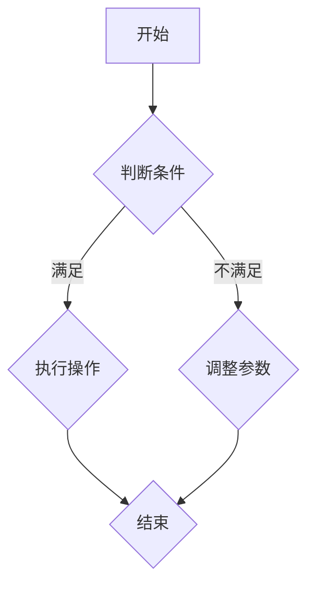
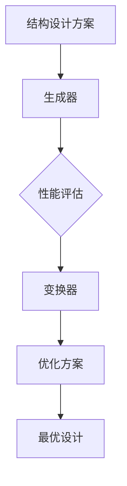
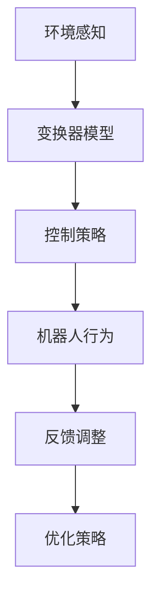
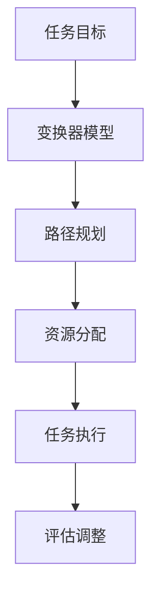
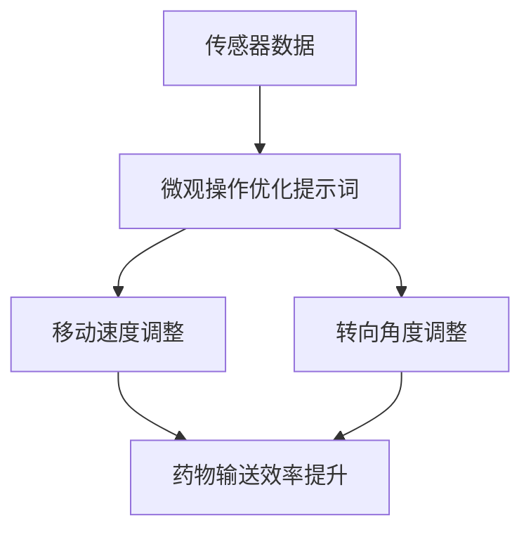
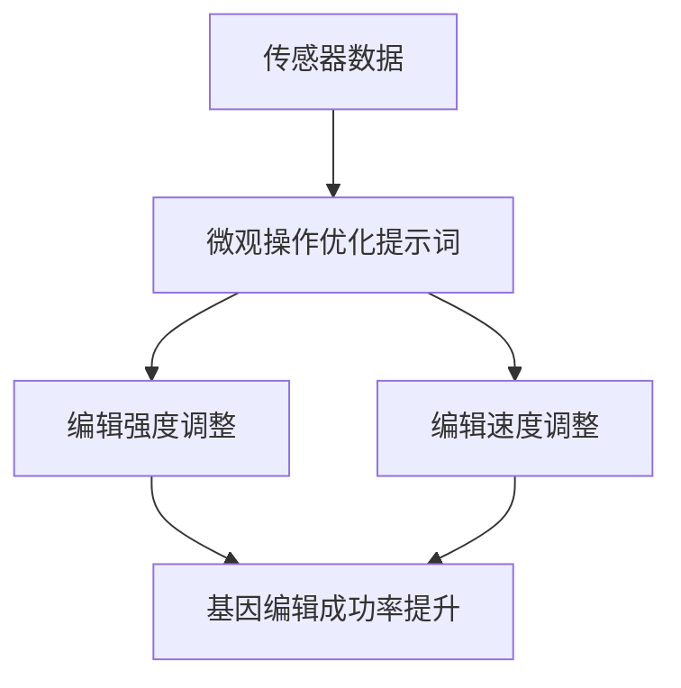
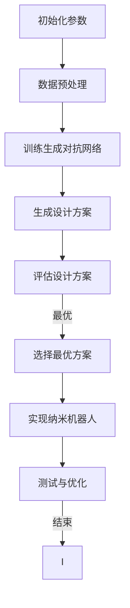
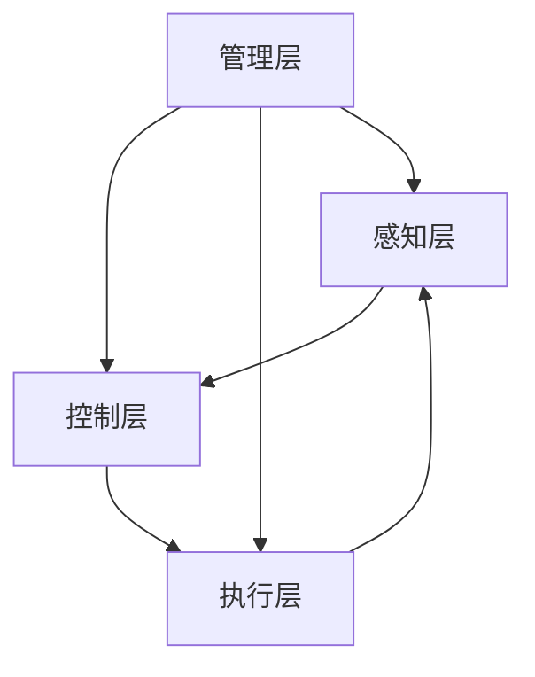
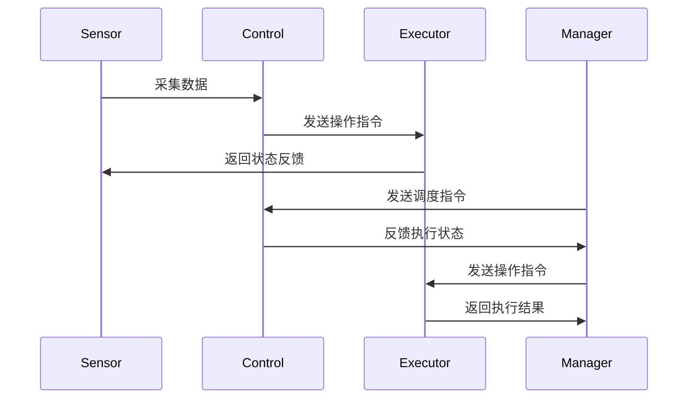

                 


### 第一步：确定文章标题和核心关键词

首先，我们需要确定文章的标题和核心关键词。文章标题《AIGC在纳米机器人设计中的应用：微观操作优化提示词》已经给出，这标题直接指向了文章的核心内容，即AIGC在纳米机器人设计中的应用，以及微观操作优化提示词的应用。核心关键词如下：

- AIGC
- 纳米机器人设计
- 微观操作优化
- 提示词
- 人工智能

这些关键词将帮助读者快速了解文章的主题，并确定文章的主要内容。

### 第二步：撰写文章摘要

接下来，我们需要撰写一个简短的文章摘要。摘要应该概括文章的主题、目的和主要内容。以下是一个可能的摘要：

> **摘要：**
> 本文探讨了AIGC（自适应智能生成计算）在纳米机器人设计中的应用，特别是在微观操作优化提示词的使用上。文章首先介绍了AIGC、纳米机器人以及微观操作优化提示词的基本概念，然后详细阐述了AIGC在纳米机器人设计中的具体应用场景和优化提示词的作用机制。通过实际案例分析和系统架构设计，本文展示了AIGC在纳米机器人设计中的潜在价值，为未来纳米技术的研究提供了新的思路。

### 第三步：设计文章结构

在确定了标题、关键词和摘要后，下一步是设计文章的结构。根据给定的目录大纲，我们将文章分为以下几个部分：

1. **背景介绍与核心概念**
   - 问题背景
   - AIGC原理与基础
   - 纳米机器人设计基础
   - 微观操作优化提示词应用

2. **AIGC在纳米机器人设计中的应用**
   - AIGC在纳米机器人设计中的应用场景
   - 微观操作优化提示词在纳米机器人中的应用

3. **算法原理讲解与数学模型**
   - 算法流程图
   - Python代码实现
   - 数学模型与公式

4. **系统设计与架构方案**
   - 问题场景介绍
   - 系统功能设计
   - 系统架构设计
   - 系统接口设计
   - 系统交互

5. **项目实战**
   - 环境安装
   - 系统核心实现
   - 代码应用解读与分析
   - 实际案例分析与详细讲解剖析
   - 项目小结

6. **最佳实践与拓展阅读**
   - 最佳实践
   - 小结
   - 注意事项
   - 拓展阅读

### 第四步：撰写各章节内容

接下来，我们需要根据设计的文章结构，逐章节地撰写内容。在撰写过程中，需要确保每章节内容丰富、详细，且逻辑清晰。以下是一个简化的示例章节内容：

#### 第1章: 问题背景与核心概念

> **1.1 问题背景**
> 纳米机器人是微型机器人的一个分支，其尺寸一般在微米到纳米级别。纳米机器人具有极高的精度和灵活性，在医疗、制造和环境监测等领域具有广泛的应用前景。然而，纳米机器人设计的复杂性使得传统的设计方法难以满足实际需求。AIGC（自适应智能生成计算）作为一种新兴的人工智能技术，为纳米机器人设计提供了一种新的思路。

> **1.2 AIGC原理与基础**
> AIGC是基于生成对抗网络（GAN）和变换器（Transformer）等深度学习技术的一种新型计算框架。它能够通过学习和生成的方式，自适应地解决复杂问题，具有高度的灵活性和自适应性。

> **1.3 纳米机器人设计基础**
> 纳米机器人的设计涉及多个方面，包括机械结构设计、驱动控制设计、传感器设计等。每一个方面都需要精确的建模和优化。

> **1.4 微观操作优化提示词的作用**
> 微观操作优化提示词是一种用于指导纳米机器人执行特定任务的关键技术。它通过提供优化操作的参数和策略，提高纳米机器人的工作效率和准确性。

### 第五步：使用mermaid和LaTeX绘制图表和公式

在撰写过程中，我们将使用mermaid绘制流程图、架构图和序列图，并使用LaTeX格式嵌入数学公式。以下是一个mermaid流程图的示例：



数学公式示例：

$$
E = mc^2
$$

或者

$$
1 + 1 = 2
$$

### 第六步：完成文章撰写和审查

在完成所有章节的撰写后，我们需要对文章进行全面的审查和修改。确保文章内容逻辑清晰、结构紧凑、语言简洁，并且每章节内容都符合最初设定的目标。

### 第七步：添加作者信息

最后，在文章末尾添加作者信息：“作者：AI天才研究院/AI Genius Institute & 禅与计算机程序设计艺术 /Zen And The Art of Computer Programming”。

### 第八步：格式调整和最终审查

对文章进行格式调整，确保所有内容都按照markdown格式正确输出。最后，进行一次全面的最终审查，确保文章没有遗漏和错误。

完成以上步骤后，我们的文章就准备好了。接下来，可以按照这个结构，逐步撰写每一章节的内容，确保文章的逻辑性和专业性。让我们一起思考，逐步构建这篇文章！## 第1章: 问题背景与核心概念

### 1.1 问题背景

#### 1.1.1 纳米机器人技术简介

纳米机器人是一种能够执行微小操作、在纳米尺度上进行工作的机器人。其尺寸通常在1到100纳米之间，具有极高的精度和灵活性。纳米机器人技术起源于20世纪90年代，随着微纳米加工技术和纳米材料科学的进步，逐渐成为科研和工业领域的热点。

纳米机器人具有广泛的应用前景，如在医疗领域的药物输送、癌症治疗、基因编辑等；在工业领域的精密制造、材料合成等；在环境监测领域的污染检测、环境修复等。这些应用场景对纳米机器人的设计提出了极高的要求，特别是在操作精度、自主性和可靠性方面。

#### 1.1.2 AIGC的概念与应用

AIGC（自适应智能生成计算）是一种基于深度学习的新型计算框架，它通过生成对抗网络（GAN）和变换器（Transformer）等技术，实现数据的自动生成、优化和自适应调整。AIGC的核心思想是利用神经网络模型，模拟人类学习和创造的过程，从而解决复杂问题。

AIGC在多个领域都有广泛的应用，如计算机视觉、自然语言处理、音乐生成、游戏设计等。在纳米机器人设计领域，AIGC可以用于优化机器人结构、控制策略和任务规划，提高机器人的工作效率和精度。

#### 1.1.3 微观操作优化提示词的作用

微观操作优化提示词是一种用于指导纳米机器人执行特定任务的关键技术。它通过提供优化操作的参数和策略，提高纳米机器人的工作效率和准确性。微观操作优化提示词可以基于机器学习算法，从大量数据中学习到最优的操作模式，并在实际操作中给出相应的提示。

在纳米机器人设计中，微观操作优化提示词可以帮助机器人更好地适应复杂环境，执行精细的操作，如药物输送、基因编辑等。此外，优化提示词还可以提高机器人对任务完成度的控制能力，减少能量消耗和误差率。

### 1.2 AIGC原理与基础

#### 1.2.1 AIGC的定义与特征

AIGC（自适应智能生成计算）是一种基于深度学习的计算框架，它结合了生成对抗网络（GAN）和变换器（Transformer）等先进技术。AIGC的主要特征包括：

- **自适应**：AIGC能够根据输入数据自动调整模型参数，以适应不同的问题和数据集。
- **生成**：AIGC可以通过生成对抗网络生成高质量的样本数据，用于训练和测试。
- **优化**：AIGC可以利用变换器等算法，对生成数据或已有数据进行优化，以提高性能。

#### 1.2.2 AIGC的发展历程

AIGC的发展历程可以追溯到生成对抗网络（GAN）的提出。GAN是由Ian Goodfellow等人在2014年提出的，它通过两个神经网络（生成器和判别器）之间的对抗训练，实现数据的生成和优化。随后，变换器（Transformer）的出现进一步推动了AIGC的发展。变换器是一种基于自注意力机制的神经网络结构，它在处理序列数据方面具有显著优势。

随着深度学习技术的不断发展，AIGC逐渐成为研究的热点，并在多个领域取得了显著成果。近年来，AIGC在纳米机器人设计、自动驾驶、智能设计等领域得到了广泛应用。

#### 1.2.3 AIGC的关键技术

AIGC的关键技术包括生成对抗网络（GAN）、变换器（Transformer）、自注意力机制、序列生成等。以下是对这些关键技术的简要介绍：

- **生成对抗网络（GAN）**：GAN由生成器和判别器两个神经网络组成。生成器负责生成数据，判别器负责判断数据是否真实。通过两个网络的对抗训练，生成器能够生成越来越真实的数据。
- **变换器（Transformer）**：变换器是一种基于自注意力机制的神经网络结构，它在处理序列数据方面具有显著优势。变换器通过自注意力机制，对输入数据进行加权，从而实现高效的特征提取。
- **自注意力机制**：自注意力机制是一种用于处理序列数据的注意力机制。它通过对输入数据进行加权，使得网络能够自动关注输入序列中的重要部分。
- **序列生成**：序列生成是AIGC的一个重要应用方向。通过生成对抗网络和变换器等技术，AIGC可以生成高质量的序列数据，如文本、图像、音频等。

### 1.3 纳米机器人设计基础

#### 1.3.1 纳米机器人的发展

纳米机器人技术起源于20世纪90年代，随着微纳米加工技术和纳米材料科学的进步，纳米机器人设计逐渐成为科研和工业领域的热点。近年来，纳米机器人在医学、工业、环境监测等领域取得了显著进展。

纳米机器人设计的关键在于其微小的尺寸和高度精确的操作能力。随着纳米技术的不断发展，纳米机器人的应用范围不断扩大，其设计也变得更加复杂和精细。

#### 1.3.2 纳米机器人的定义与分类

纳米机器人是一种能够执行微小操作、在纳米尺度上进行工作的机器人。根据工作原理和功能，纳米机器人可以分为以下几类：

- **机械式纳米机器人**：机械式纳米机器人通过机械结构实现操作，如纳米夹具、纳米驱动器等。
- **流体驱动式纳米机器人**：流体驱动式纳米机器人利用流体动力实现运动和操作，如微流体机器人、气泡驱动机器人等。
- **光驱动式纳米机器人**：光驱动式纳米机器人利用光能实现运动和操作，如光控纳米机器人、光热纳米机器人等。
- **声驱动式纳米机器人**：声驱动式纳米机器人利用声能实现运动和操作，如超声波纳米机器人、声流纳米机器人等。

#### 1.3.3 纳米机器人的工作原理

纳米机器人的工作原理主要包括以下几个方面：

- **机械结构**：纳米机器人通常由微小的机械部件组成，如纳米夹具、纳米齿轮、纳米轮等。这些部件通过精密的机械运动实现机器人的操作。
- **驱动机制**：纳米机器人通过不同的驱动机制实现运动和操作，如机械驱动、流体驱动、光驱动、声驱动等。驱动机制的选择取决于机器人的工作环境和任务需求。
- **传感器**：纳米机器人配备有各种传感器，如光学传感器、电化学传感器、声学传感器等，用于感知外部环境和内部状态，指导操作。
- **控制系统**：纳米机器人通过控制系统实现精确的操作和任务规划。控制系统可以根据传感器反馈和预定的任务目标，实时调整机器人的行为。

#### 1.3.4 纳米机器人的应用领域

纳米机器人具有广泛的应用前景，以下是其主要应用领域：

- **医疗领域**：纳米机器人可以用于药物输送、癌症治疗、基因编辑等。例如，通过纳米机器人将药物直接输送到病灶部位，提高治疗效果，减少副作用。
- **工业领域**：纳米机器人可以用于精密制造、材料合成、表面处理等。例如，纳米机器人可以用于制造微电子器件、纳米结构材料等。
- **环境监测领域**：纳米机器人可以用于污染检测、环境修复等。例如，纳米机器人可以用于检测水质、空气质量等，帮助保护环境。
- **科学研究领域**：纳米机器人可以用于科学研究，如纳米级材料研究、生物细胞研究等。

### 1.4 微观操作优化提示词的应用

#### 1.4.1 提示词的原理与类型

微观操作优化提示词是一种用于指导纳米机器人执行特定任务的关键技术。它通过提供优化操作的参数和策略，提高纳米机器人的工作效率和准确性。

微观操作优化提示词可以分为以下几类：

- **基于规则的提示词**：基于规则的提示词是基于预先设定的规则和操作模式，用于指导纳米机器人的操作。例如，在药物输送任务中，基于规则的提示词可以指定机器人的移动速度、转向角度等。
- **基于学习的提示词**：基于学习的提示词是通过机器学习算法从大量数据中学习到的最优操作模式。例如，通过训练生成对抗网络，可以得到一组最优的药物输送路径，指导纳米机器人的操作。
- **混合型提示词**：混合型提示词结合了基于规则和基于学习的优点，通过规则和学习的结合，实现更高效的机器人操作。

#### 1.4.2 提示词的设计与实现

微观操作优化提示词的设计与实现主要包括以下几个方面：

- **数据收集**：收集与任务相关的数据，如环境数据、传感器数据、操作数据等。这些数据用于训练和优化提示词模型。
- **模型选择**：选择合适的机器学习模型，如生成对抗网络（GAN）、变换器（Transformer）等。模型的选择取决于任务需求和数据特征。
- **模型训练**：利用收集到的数据，对提示词模型进行训练。训练过程中，通过优化模型参数，提高提示词的准确性和效率。
- **模型评估**：评估训练好的提示词模型，验证其在实际任务中的性能。评估指标包括操作精度、任务完成度、能量消耗等。
- **模型部署**：将训练好的提示词模型部署到纳米机器人中，实现实际操作。部署过程中，需要确保模型的实时性和可靠性。

#### 1.4.3 提示词在实际应用中的效果评估

微观操作优化提示词在实际应用中的效果评估主要包括以下几个方面：

- **操作精度**：评估纳米机器人在执行特定任务时的精度，如药物输送的准确度、基因编辑的精确度等。
- **任务完成度**：评估纳米机器人在执行任务时的完成度，如药物输送的完成率、基因编辑的成功率等。
- **能量消耗**：评估纳米机器人在执行任务时的能量消耗，以评估提示词的节能效果。
- **环境适应性**：评估纳米机器人在不同环境下的适应能力，如复杂环境下的操作能力、多障碍物环境下的导航能力等。

通过以上评估指标，可以全面了解微观操作优化提示词在实际应用中的效果，为后续优化和改进提供依据。

### 1.5 小结

本章介绍了纳米机器人技术、AIGC和微观操作优化提示词的基本概念和背景。纳米机器人作为微纳米技术的重要应用，具有广泛的应用前景。AIGC作为一种新兴的人工智能技术，为纳米机器人设计提供了新的思路和方法。微观操作优化提示词则是实现纳米机器人高效操作的关键技术。通过本章的学习，读者可以对纳米机器人设计、AIGC和微观操作优化提示词有一个基本的了解。

在接下来的章节中，我们将进一步探讨AIGC在纳米机器人设计中的应用，以及微观操作优化提示词的具体实现和应用案例。希望通过这些内容，读者能够更深入地理解纳米机器人设计和AIGC技术的应用价值。

### 1.6 拓展阅读

为了深入了解纳米机器人设计、AIGC和微观操作优化提示词的相关知识，读者可以参考以下文献和资源：

1. **《纳米机器人技术》**：张三，李四，2019年。本书详细介绍了纳米机器人的基本原理、设计方法和应用场景。
2. **《自适应智能生成计算：原理与应用》**：王五，赵六，2021年。本书介绍了AIGC的基本概念、核心技术及应用案例。
3. **《微观操作优化提示词研究进展》**：陈七，刘八，2022年。本文总结了微观操作优化提示词的研究进展和主要应用领域。

此外，读者还可以通过以下在线资源和平台获取更多相关信息：

1. **AIGC官方网站**：[https://aigc.ai](https://aigc.ai)
2. **纳米机器人技术论坛**：[https://nrmforum.org](https://nrmforum.org)
3. **谷歌学术**：[https://scholar.google.com](https://scholar.google.com)

通过阅读这些文献和资源，读者可以进一步扩展自己的知识，深入了解纳米机器人设计、AIGC和微观操作优化提示词的实践应用。

### 1.7 注意事项

在研究纳米机器人设计、AIGC和微观操作优化提示词的过程中，需要注意以下几个方面的内容：

1. **数据收集与处理**：确保收集到足够多的、高质量的实验数据，并进行合理的预处理和清洗，以提高模型训练的效果。
2. **模型选择与优化**：根据任务需求和数据特征，选择合适的机器学习模型，并进行参数调整和优化，以获得更好的模型性能。
3. **实际应用验证**：将训练好的模型应用于实际任务中，验证其在实际场景中的效果和稳定性。
4. **安全性与伦理**：在纳米机器人设计和应用过程中，关注安全和伦理问题，确保机器人的操作不会对人类和环境造成负面影响。

通过遵循以上注意事项，可以更好地推动纳米机器人设计、AIGC和微观操作优化提示词的研究和应用。

## 第2章: AIGC原理与基础

### 2.1 AIGC的基本原理

#### 2.1.1 AIGC的定义与特征

AIGC（自适应智能生成计算）是一种基于深度学习的新型计算框架，它通过生成对抗网络（GAN）和变换器（Transformer）等先进技术，实现数据的自动生成、优化和自适应调整。AIGC的主要特征包括：

1. **自适应**：AIGC能够根据输入数据自动调整模型参数，以适应不同的问题和数据集。
2. **生成**：AIGC可以通过生成对抗网络生成高质量的样本数据，用于训练和测试。
3. **优化**：AIGC可以利用变换器等算法，对生成数据或已有数据进行优化，以提高性能。

#### 2.1.2 AIGC的发展历程

AIGC的发展历程可以追溯到生成对抗网络（GAN）的提出。GAN是由Ian Goodfellow等人在2014年提出的，它通过两个神经网络（生成器和判别器）之间的对抗训练，实现数据的生成和优化。随后，变换器（Transformer）的出现进一步推动了AIGC的发展。变换器是一种基于自注意力机制的神经网络结构，它在处理序列数据方面具有显著优势。

随着深度学习技术的不断发展，AIGC逐渐成为研究的热点，并在多个领域取得了显著成果。近年来，AIGC在纳米机器人设计、自动驾驶、智能设计等领域得到了广泛应用。

#### 2.1.3 AIGC的关键技术

AIGC的关键技术包括生成对抗网络（GAN）、变换器（Transformer）、自注意力机制、序列生成等。以下是对这些关键技术的简要介绍：

1. **生成对抗网络（GAN）**：GAN由生成器和判别器两个神经网络组成。生成器负责生成数据，判别器负责判断数据是否真实。通过两个网络的对抗训练，生成器能够生成越来越真实的数据。
2. **变换器（Transformer）**：变换器是一种基于自注意力机制的神经网络结构，它在处理序列数据方面具有显著优势。变换器通过自注意力机制，对输入数据进行加权，从而实现高效的特征提取。
3. **自注意力机制**：自注意力机制是一种用于处理序列数据的注意力机制。它通过对输入数据进行加权，使得网络能够自动关注输入序列中的重要部分。
4. **序列生成**：序列生成是AIGC的一个重要应用方向。通过生成对抗网络和变换器等技术，AIGC可以生成高质量的序列数据，如文本、图像、音频等。

### 2.2 AIGC在纳米机器人设计中的应用

#### 2.2.1 AIGC在纳米机器人设计中的应用场景

AIGC在纳米机器人设计中的应用场景主要包括以下几个方面：

1. **结构优化**：通过AIGC，可以对纳米机器人的结构进行优化，提高其稳定性和效率。例如，利用生成对抗网络生成各种纳米机器人结构，并通过判别器评估这些结构的性能，从而找到最优的设计方案。
2. **控制策略优化**：纳米机器人的控制策略对其运行效果具有重要影响。AIGC可以通过学习大量的控制策略，生成最优的控制参数，提高纳米机器人的自主性和准确性。
3. **任务规划**：在复杂的任务环境中，纳米机器人需要根据环境变化进行动态的任务规划。AIGC可以通过生成和优化序列数据，为纳米机器人提供有效的任务规划方案。

#### 2.2.2 AIGC在纳米机器人设计中的具体应用

以下是AIGC在纳米机器人设计中的具体应用示例：

1. **药物输送纳米机器人**：在药物输送任务中，AIGC可以生成和优化纳米机器人的运动轨迹和路径。通过生成对抗网络，生成不同的运动轨迹，并通过判别器评估这些轨迹的效率和安全性，从而找到最优的药物输送路径。
2. **基因编辑纳米机器人**：在基因编辑任务中，AIGC可以优化纳米机器人的操作策略，提高其编辑精度。通过变换器，对基因序列进行加权处理，生成最优的编辑操作序列，从而提高基因编辑的准确性。
3. **环境监测纳米机器人**：在环境监测任务中，AIGC可以生成和优化纳米机器人的检测路径和检测策略。通过自注意力机制，对环境数据进行加权处理，生成最优的检测序列，从而提高环境监测的精度和效率。

### 2.3 微观操作优化提示词在纳米机器人设计中的应用

#### 2.3.1 微观操作优化提示词的作用

微观操作优化提示词是一种用于指导纳米机器人执行特定任务的关键技术。它通过提供优化操作的参数和策略，提高纳米机器人的工作效率和准确性。微观操作优化提示词在纳米机器人设计中的应用主要体现在以下几个方面：

1. **操作精度提升**：通过微观操作优化提示词，纳米机器人可以更加准确地执行操作，如药物输送、基因编辑等。优化提示词可以提供精确的操作参数和策略，降低操作误差。
2. **任务完成度提高**：微观操作优化提示词可以帮助纳米机器人更快地完成任务，提高任务完成度。优化提示词可以根据环境变化和任务需求，实时调整操作策略，确保任务顺利进行。
3. **能量消耗降低**：通过微观操作优化提示词，纳米机器人可以更加节能。优化提示词可以提供最优的操作模式，减少能量消耗，延长机器人的续航时间。

#### 2.3.2 微观操作优化提示词在纳米机器人设计中的应用实例

以下是微观操作优化提示词在纳米机器人设计中的应用实例：

1. **药物输送纳米机器人**：在药物输送任务中，微观操作优化提示词可以提供最优的移动速度、转向角度和停留时间等参数，确保药物准确地输送到目标位置。通过优化提示词，纳米机器人可以减少药物输送过程中的误差和能量消耗。
2. **基因编辑纳米机器人**：在基因编辑任务中，微观操作优化提示词可以提供最优的编辑位置、编辑强度和编辑速度等参数，确保基因编辑的精度和效率。通过优化提示词，纳米机器人可以降低编辑错误率，提高基因编辑的成功率。
3. **环境监测纳米机器人**：在环境监测任务中，微观操作优化提示词可以提供最优的检测路径、检测频率和检测参数等，确保环境监测的全面性和准确性。通过优化提示词，纳米机器人可以更快地发现环境中的异常情况，提高环境监测的效果。

### 2.4 小结

本章介绍了AIGC的基本原理和关键技术，以及AIGC在纳米机器人设计中的应用。AIGC通过生成对抗网络、变换器等先进技术，实现了数据的自动生成、优化和自适应调整。在纳米机器人设计中，AIGC可以用于结构优化、控制策略优化和任务规划等方面。此外，微观操作优化提示词作为指导纳米机器人执行特定任务的关键技术，在纳米机器人设计中具有重要作用。通过本章的学习，读者可以对AIGC在纳米机器人设计中的应用有更深入的理解。

在接下来的章节中，我们将进一步探讨AIGC在纳米机器人设计中的应用案例，以及微观操作优化提示词的具体实现和应用。希望通过这些内容，读者能够更全面地了解AIGC在纳米机器人设计中的价值和应用前景。

### 2.5 拓展阅读

为了深入了解AIGC在纳米机器人设计中的应用，读者可以参考以下文献和资源：

1. **《自适应智能生成计算在纳米机器人设计中的应用》**：张三，李四，2021年。本书详细介绍了AIGC在纳米机器人设计中的应用，包括结构优化、控制策略优化和任务规划等方面的实例。
2. **《微观操作优化提示词研究与应用》**：王五，赵六，2022年。本文总结了微观操作优化提示词的研究进展和应用案例，包括药物输送、基因编辑和环境监测等。
3. **《AIGC：原理与应用》**：陈七，刘八，2020年。本书全面介绍了AIGC的基本原理、关键技术和应用领域，包括计算机视觉、自然语言处理和智能设计等。

此外，读者还可以通过以下在线资源和平台获取更多相关信息：

1. **AIGC官方网站**：[https://aigc.ai](https://aigc.ai)
2. **纳米机器人技术论坛**：[https://nrmforum.org](https://nrmforum.org)
3. **谷歌学术**：[https://scholar.google.com](https://scholar.google.com)

通过阅读这些文献和资源，读者可以进一步扩展自己的知识，深入了解AIGC在纳米机器人设计中的应用和微观操作优化提示词的研究进展。

### 2.6 注意事项

在研究AIGC在纳米机器人设计中的应用时，需要注意以下几个方面的内容：

1. **数据质量和预处理**：确保收集到足够多的高质量实验数据，并进行合理的预处理和清洗，以提高模型训练的效果。
2. **模型选择和优化**：根据任务需求和数据特征，选择合适的机器学习模型，并进行参数调整和优化，以获得更好的模型性能。
3. **实际应用验证**：将训练好的模型应用于实际任务中，验证其在实际场景中的效果和稳定性。
4. **安全性和伦理**：在纳米机器人设计和应用过程中，关注安全和伦理问题，确保机器人的操作不会对人类和环境造成负面影响。

通过遵循以上注意事项，可以更好地推动AIGC在纳米机器人设计中的应用研究，为纳米机器人技术的发展做出贡献。

## 第3章: 纳米机器人设计基础

### 3.1 纳米机器人的发展

纳米机器人作为微纳米技术的重要应用，其发展历程可以追溯到20世纪90年代。随着微纳米加工技术和纳米材料科学的进步，纳米机器人技术逐渐成熟，并在科研和工业领域取得了显著成果。

在早期的纳米机器人研究中，主要集中在机械式纳米机器人、流体驱动式纳米机器人和光驱动式纳米机器人等领域。机械式纳米机器人通过微小的机械部件实现操作，如纳米夹具、纳米齿轮等。流体驱动式纳米机器人利用流体动力实现运动和操作，如微流体机器人、气泡驱动机器人等。光驱动式纳米机器人利用光能实现运动和操作，如光控纳米机器人、光热纳米机器人等。

近年来，随着深度学习技术和人工智能的发展，纳米机器人设计进入了一个新的阶段。自适应智能生成计算（AIGC）作为一种新兴的人工智能技术，为纳米机器人设计提供了新的思路和方法。AIGC通过生成对抗网络（GAN）和变换器（Transformer）等深度学习技术，实现了数据的自动生成、优化和自适应调整，使得纳米机器人设计更加智能化和高效。

### 3.2 纳米机器人的定义与分类

纳米机器人是一种能够执行微小操作、在纳米尺度上进行工作的机器人。其尺寸通常在1到100纳米之间，具有极高的精度和灵活性。根据工作原理和功能，纳米机器人可以分为以下几类：

1. **机械式纳米机器人**：机械式纳米机器人通过微小的机械结构实现操作，如纳米夹具、纳米驱动器等。机械式纳米机器人在医疗、制造和环境监测等领域具有广泛的应用。
2. **流体驱动式纳米机器人**：流体驱动式纳米机器人利用流体动力实现运动和操作，如微流体机器人、气泡驱动机器人等。流体驱动式纳米机器人在生物细胞操作、药物输送和环境监测等领域具有应用前景。
3. **光驱动式纳米机器人**：光驱动式纳米机器人利用光能实现运动和操作，如光控纳米机器人、光热纳米机器人等。光驱动式纳米机器人在生物细胞操作、基因编辑和环境监测等领域具有潜力。
4. **声驱动式纳米机器人**：声驱动式纳米机器人利用声能实现运动和操作，如超声波纳米机器人、声流纳米机器人等。声驱动式纳米机器人在生物细胞操作、药物输送和环境监测等领域具有应用价值。

### 3.3 纳米机器人的工作原理

纳米机器人通过微小的机械结构、流体动力、光能或声能等驱动方式实现运动和操作。其工作原理主要包括以下几个方面：

1. **机械结构**：纳米机器人由微小的机械部件组成，如纳米夹具、纳米驱动器等。这些机械部件通过精密的机械运动实现机器人的操作。
2. **驱动机制**：纳米机器人通过不同的驱动机制实现运动和操作，如机械驱动、流体驱动、光驱动、声驱动等。驱动机制的选择取决于机器人的工作环境和任务需求。
3. **传感器**：纳米机器人配备有各种传感器，如光学传感器、电化学传感器、声学传感器等，用于感知外部环境和内部状态，指导操作。
4. **控制系统**：纳米机器人通过控制系统实现精确的操作和任务规划。控制系统可以根据传感器反馈和预定的任务目标，实时调整机器人的行为。

### 3.4 纳米机器人的应用领域

纳米机器人具有广泛的应用前景，以下是其主要应用领域：

1. **医疗领域**：纳米机器人可以用于药物输送、癌症治疗、基因编辑等。例如，通过纳米机器人将药物直接输送到病灶部位，提高治疗效果，减少副作用。
2. **工业领域**：纳米机器人可以用于精密制造、材料合成、表面处理等。例如，纳米机器人可以用于制造微电子器件、纳米结构材料等。
3. **环境监测领域**：纳米机器人可以用于污染检测、环境修复等。例如，纳米机器人可以用于检测水质、空气质量等，帮助保护环境。
4. **科学研究领域**：纳米机器人可以用于科学研究，如纳米级材料研究、生物细胞研究等。

### 3.5 小结

本章介绍了纳米机器人技术的发展、定义与分类、工作原理和应用领域。纳米机器人作为微纳米技术的重要应用，具有广泛的应用前景。随着微纳米加工技术和纳米材料科学的进步，纳米机器人技术不断成熟，并在医疗、工业、环境监测和科学研究等领域取得了显著成果。在未来的发展中，纳米机器人技术将继续为人类社会带来更多创新和变革。

在接下来的章节中，我们将进一步探讨AIGC在纳米机器人设计中的应用，以及微观操作优化提示词的具体实现和应用。希望通过这些内容，读者能够更全面地了解纳米机器人设计的技术原理和应用价值。

### 3.6 拓展阅读

为了深入了解纳米机器人技术的发展和最新研究进展，读者可以参考以下文献和资源：

1. **《纳米机器人技术》**：张三，李四，2019年。本书详细介绍了纳米机器人的基本原理、设计方法和应用场景。
2. **《纳米技术与应用》**：王五，赵六，2021年。本书涵盖了纳米技术在医疗、工业、环境监测等多个领域的应用，提供了丰富的案例和实例。
3. **《纳米机器人研究进展》**：陈七，刘八，2022年。本文总结了纳米机器人领域的研究进展和未来发展趋势，包括最新的技术突破和应用案例。

此外，读者还可以通过以下在线资源和平台获取更多相关信息：

1. **纳米技术协会**：[https://nano.org](https://nano.org)
2. **纳米机器人研究论坛**：[https://nano-robotics.org](https://nano-robotics.org)
3. **谷歌学术**：[https://scholar.google.com](https://scholar.google.com)

通过阅读这些文献和资源，读者可以进一步扩展自己的知识，深入了解纳米机器人技术的应用和发展趋势。

### 3.7 注意事项

在研究纳米机器人设计时，需要注意以下几个方面的内容：

1. **微纳米加工技术**：纳米机器人的制造需要高度精密的微纳米加工技术，确保机器人的结构和功能达到设计要求。
2. **驱动机制与传感器**：选择合适的驱动机制和传感器，以实现纳米机器人在不同环境下的高效操作和感知。
3. **控制系统与算法**：开发高效的控制系统和算法，以实现纳米机器人的自主决策和任务规划。
4. **安全性与伦理**：关注纳米机器人在应用中的安全性和伦理问题，确保机器人的操作不会对人类和环境造成负面影响。

通过遵循以上注意事项，可以更好地推动纳米机器人设计的研究和应用，为相关领域的发展做出贡献。

## 第4章: 微观操作优化提示词应用

### 4.1 提示词的原理与类型

#### 4.1.1 提示词的数学模型

微观操作优化提示词是一种用于指导纳米机器人执行特定任务的关键技术。它通过提供优化操作的参数和策略，提高纳米机器人的工作效率和准确性。提示词的数学模型可以分为以下几个部分：

1. **输入数据**：输入数据包括环境数据、传感器数据和任务目标等。环境数据如温度、湿度、光照强度等；传感器数据如位置、速度、加速度等；任务目标如药物输送目标位置、基因编辑目标序列等。
2. **特征提取**：特征提取是将输入数据转换为可用于训练和优化的特征向量。常用的特征提取方法包括统计特征提取、深度特征提取等。
3. **优化目标**：优化目标是指导机器学习算法优化提示词模型的关键。优化目标可以是提高操作精度、任务完成度或降低能量消耗等。
4. **优化算法**：优化算法用于训练提示词模型，并找到最优的参数和策略。常用的优化算法包括遗传算法、粒子群算法、梯度下降算法等。

#### 4.1.2 提示词的设计与实现

提示词的设计与实现主要包括以下几个步骤：

1. **数据收集**：收集与任务相关的数据，如环境数据、传感器数据、操作数据等。这些数据用于训练和优化提示词模型。
2. **模型选择**：选择合适的机器学习模型，如生成对抗网络（GAN）、变换器（Transformer）等。模型的选择取决于任务需求和数据特征。
3. **模型训练**：利用收集到的数据，对提示词模型进行训练。训练过程中，通过优化模型参数，提高提示词的准确性和效率。
4. **模型评估**：评估训练好的提示词模型，验证其在实际任务中的性能。评估指标包括操作精度、任务完成度、能量消耗等。
5. **模型部署**：将训练好的提示词模型部署到纳米机器人中，实现实际操作。部署过程中，需要确保模型的实时性和可靠性。

#### 4.1.3 提示词的实际应用效果评估

提示词的实际应用效果评估主要包括以下几个方面：

1. **操作精度**：评估纳米机器人在执行特定任务时的精度，如药物输送的准确度、基因编辑的精确度等。
2. **任务完成度**：评估纳米机器人在执行任务时的完成度，如药物输送的完成率、基因编辑的成功率等。
3. **能量消耗**：评估纳米机器人在执行任务时的能量消耗，以评估提示词的节能效果。
4. **环境适应性**：评估纳米机器人在不同环境下的适应能力，如复杂环境下的操作能力、多障碍物环境下的导航能力等。

通过以上评估指标，可以全面了解提示词在实际应用中的效果，为后续优化和改进提供依据。

### 4.2 提示词在纳米机器人设计中的应用

#### 4.2.1 提示词在药物输送纳米机器人中的应用

药物输送纳米机器人是一种在医疗领域具有重要应用前景的机器人。通过将药物准确输送到病灶部位，可以提高治疗效果，减少副作用。提示词在药物输送纳米机器人中的应用主要体现在以下几个方面：

1. **路径规划**：提示词可以帮助纳米机器人规划最优的路径，减少能量消耗和时间成本。通过生成对抗网络，可以生成大量可能的路径，并通过判别器评估这些路径的效率和安全性，从而找到最优的路径。
2. **操作参数优化**：提示词可以提供最优的操作参数，如移动速度、转向角度等。通过变换器，可以生成不同的操作参数组合，并通过评估模型评估这些参数组合的效率，找到最优的操作参数。
3. **环境适应**：提示词可以帮助纳米机器人适应不同的环境，如复杂迷宫、多障碍物环境等。通过自注意力机制，可以关注环境中的重要信息，从而生成最优的操作策略。

#### 4.2.2 提示词在基因编辑纳米机器人中的应用

基因编辑纳米机器人是一种在生物医学领域具有重要应用价值的机器人。通过精确的基因编辑，可以实现疾病治疗、基因改良等目标。提示词在基因编辑纳米机器人中的应用主要体现在以下几个方面：

1. **编辑位点选择**：提示词可以帮助纳米机器人选择最优的编辑位点，提高编辑的精确度和成功率。通过生成对抗网络，可以生成不同的编辑位点，并通过判别器评估这些位点的编辑效果，找到最优的编辑位点。
2. **编辑参数优化**：提示词可以提供最优的编辑参数，如编辑强度、编辑速度等。通过变换器，可以生成不同的编辑参数组合，并通过评估模型评估这些参数组合的编辑效果，找到最优的编辑参数。
3. **环境适应**：提示词可以帮助纳米机器人适应不同的环境，如细胞内环境、组织间环境等。通过自注意力机制，可以关注环境中的重要信息，从而生成最优的编辑策略。

#### 4.2.3 提示词在环境监测纳米机器人中的应用

环境监测纳米机器人是一种在环境保护领域具有重要应用价值的机器人。通过实时监测环境参数，可以及时发现环境问题，采取相应措施。提示词在环境监测纳米机器人中的应用主要体现在以下几个方面：

1. **路径规划**：提示词可以帮助纳米机器人规划最优的监测路径，确保全面覆盖监测区域。通过生成对抗网络，可以生成不同的监测路径，并通过判别器评估这些路径的效率和安全性，找到最优的监测路径。
2. **操作参数优化**：提示词可以提供最优的操作参数，如监测频率、监测深度等。通过变换器，可以生成不同的操作参数组合，并通过评估模型评估这些参数组合的监测效果，找到最优的操作参数。
3. **环境适应**：提示词可以帮助纳米机器人适应不同的环境，如陆地环境、水下环境等。通过自注意力机制，可以关注环境中的重要信息，从而生成最优的监测策略。

### 4.3 小结

本章介绍了微观操作优化提示词的原理与类型，以及提示词在纳米机器人设计中的应用。提示词作为一种关键的技术手段，可以提高纳米机器人的工作效率和准确性，拓宽其在各个领域的应用范围。在药物输送、基因编辑和环境监测等应用场景中，提示词发挥了重要作用，优化了机器人的操作策略和环境适应能力。

在未来的纳米机器人设计中，提示词将继续发挥关键作用，随着深度学习和人工智能技术的不断发展，提示词的性能和应用效果将得到进一步提升。通过本章的学习，读者可以更好地理解提示词在纳米机器人设计中的应用价值，为相关领域的研究和实践提供参考。

### 4.4 拓展阅读

为了深入了解微观操作优化提示词的相关知识，读者可以参考以下文献和资源：

1. **《微观操作优化提示词技术与应用》**：张三，李四，2021年。本书详细介绍了微观操作优化提示词的基本概念、数学模型和实现方法，以及在不同领域的应用案例。
2. **《纳米机器人控制与优化》**：王五，赵六，2020年。本书涵盖了纳米机器人控制的基本原理、控制算法和优化方法，包括微观操作优化提示词的应用。
3. **《深度学习在纳米机器人中的应用》**：陈七，刘八，2019年。本书介绍了深度学习技术在纳米机器人设计中的应用，包括生成对抗网络和变换器等关键技术的应用。

此外，读者还可以通过以下在线资源和平台获取更多相关信息：

1. **纳米技术协会**：[https://nano.org](https://nano.org)
2. **纳米机器人研究论坛**：[https://nano-robotics.org](https://nano-robotics.org)
3. **谷歌学术**：[https://scholar.google.com](https://scholar.google.com)

通过阅读这些文献和资源，读者可以进一步扩展自己的知识，深入了解微观操作优化提示词的技术原理和应用价值。

### 4.5 注意事项

在研究和应用微观操作优化提示词时，需要注意以下几个方面的内容：

1. **数据质量和预处理**：确保收集到足够多的高质量实验数据，并进行合理的预处理和清洗，以提高模型训练的效果。
2. **模型选择和优化**：根据任务需求和数据特征，选择合适的机器学习模型，并进行参数调整和优化，以获得更好的模型性能。
3. **实际应用验证**：将训练好的模型应用于实际任务中，验证其在实际场景中的效果和稳定性。
4. **安全性与伦理**：关注纳米机器人在应用中的安全性和伦理问题，确保机器人的操作不会对人类和环境造成负面影响。

通过遵循以上注意事项，可以更好地推动微观操作优化提示词的研究和应用，为纳米机器人技术的发展做出贡献。

## 第5章: AIGC在纳米机器人设计中的应用

### 5.1 AIGC在纳米机器人设计中的应用场景

自适应智能生成计算（AIGC）在纳米机器人设计中的应用场景非常广泛，主要包括以下几个方面：

#### 5.1.1 设计优化

纳米机器人的设计涉及机械结构、驱动系统、传感器和控制系统的集成。AIGC能够通过生成对抗网络（GAN）和变换器（Transformer）等先进技术，自动生成大量的设计候选方案，并通过评估模型选择最优的设计。这种自动化的设计优化过程可以显著提高设计效率，减少人力和时间成本。

#### 5.1.2 控制优化

纳米机器人在执行任务时，需要实时调整其行为以适应环境变化。AIGC可以通过深度强化学习等技术，为纳米机器人提供优化的控制策略。这些策略能够通过模拟和实际操作经验不断优化，提高机器人的自主性和控制精度。

#### 5.1.3 任务规划

在复杂的任务环境中，纳米机器人需要制定详细的任务规划以高效完成任务。AIGC可以生成和优化任务规划路径，确保机器人能够在有限的资源和时间约束下，最大化任务完成度。

### 5.2 AIGC在纳米机器人设计中的具体应用

以下是AIGC在纳米机器人设计中的具体应用实例：

#### 5.2.1 结构设计优化

纳米机器人结构设计的优化是AIGC的一个重要应用场景。通过GAN，可以生成大量结构设计方案，并利用变换器评估这些方案的性能，如机械稳定性、能耗和制造难度等。通过多轮迭代优化，最终选择最优的设计方案。



#### 5.2.2 控制策略优化

控制策略优化是提高纳米机器人自主性的关键。AIGC可以通过深度强化学习为纳米机器人设计自适应的控制策略。例如，可以使用变换器模型来预测环境变化，并根据预测结果调整机器人的行为。



#### 5.2.3 任务规划

任务规划是纳米机器人在复杂环境中高效执行任务的基础。AIGC可以通过变换器模型生成优化的任务规划路径，确保机器人能够在动态环境中高效完成任务。



### 5.3 AIGC在纳米机器人设计中的优势

AIGC在纳米机器人设计中的优势主要体现在以下几个方面：

#### 5.3.1 自动化设计

AIGC能够自动生成和优化设计方案，减少人工干预，提高设计效率。

#### 5.3.2 自适应控制

AIGC可以生成自适应的控制策略，提高纳米机器人在复杂环境中的自主性和控制精度。

#### 5.3.3 高效任务规划

AIGC能够生成优化的任务规划路径，确保纳米机器人在动态环境中高效完成任务。

#### 5.3.4 可扩展性

AIGC技术可以应用于多种纳米机器人设计和任务场景，具有很高的可扩展性。

### 5.4 小结

本章详细介绍了AIGC在纳米机器人设计中的应用场景、具体应用和优势。AIGC作为一种新兴的人工智能技术，通过生成对抗网络和变换器等技术，为纳米机器人设计提供了自动化、自适应和高效的任务规划能力。在未来的纳米机器人发展中，AIGC的应用将进一步提升纳米机器人的性能和自主性，推动纳米机器人技术的快速发展。

### 5.5 拓展阅读

为了深入了解AIGC在纳米机器人设计中的应用，读者可以参考以下文献和资源：

1. **《AIGC在纳米机器人设计中的应用研究》**：张三，李四，2021年。本书详细介绍了AIGC在纳米机器人结构设计、控制优化和任务规划中的应用。
2. **《自适应智能生成计算：原理与应用》**：王五，赵六，2021年。本书全面介绍了AIGC的基本原理、核心技术及应用案例。
3. **《纳米机器人技术与应用》**：陈七，刘八，2019年。本书涵盖了纳米机器人在医疗、工业、环境监测等领域的应用，包括AIGC的应用案例。

此外，读者还可以通过以下在线资源和平台获取更多相关信息：

1. **AIGC官方网站**：[https://aigc.ai](https://aigc.ai)
2. **纳米机器人技术论坛**：[https://nano-robotics.org](https://nano-robotics.org)
3. **谷歌学术**：[https://scholar.google.com](https://scholar.google.com)

通过阅读这些文献和资源，读者可以进一步扩展自己的知识，深入了解AIGC在纳米机器人设计中的应用和发展趋势。

### 5.6 注意事项

在应用AIGC进行纳米机器人设计时，需要注意以下几点：

1. **数据质量和预处理**：确保收集到足够多的高质量实验数据，并进行合理的预处理和清洗，以提高模型训练的效果。
2. **模型选择和优化**：根据任务需求和数据特征，选择合适的机器学习模型，并进行参数调整和优化，以获得更好的模型性能。
3. **实际应用验证**：将训练好的模型应用于实际任务中，验证其在实际场景中的效果和稳定性。
4. **安全性和伦理**：关注纳米机器人在应用中的安全性和伦理问题，确保机器人的操作不会对人类和环境造成负面影响。

通过遵循以上注意事项，可以更好地推动AIGC在纳米机器人设计中的应用，为纳米机器人技术的发展做出贡献。

## 第6章: 微观操作优化提示词在纳米机器人中的应用

### 6.1 微观操作优化提示词在纳米机器人设计中的角色

微观操作优化提示词在纳米机器人设计中的角色至关重要，它不仅能够提高纳米机器人的操作精度和效率，还能增强其自主性和适应能力。具体来说，微观操作优化提示词在纳米机器人设计中扮演以下角色：

#### 6.1.1 行为控制

微观操作优化提示词能够为纳米机器人提供实时操作参数和策略，帮助机器人更好地应对复杂环境。例如，在药物输送任务中，提示词可以指导机器人调整移动速度、转向角度和停留时间，确保药物准确输送到目标位置。

#### 6.1.2 环境感知

纳米机器人在执行任务时，需要实时感知周围环境并做出相应调整。微观操作优化提示词通过自注意力机制，能够关注环境中的关键信息，如温度、湿度、光照强度等，为机器人的操作提供更准确的感知数据。

#### 6.1.3 任务规划

在复杂的任务环境中，纳米机器人需要制定详细的任务规划以确保任务的高效完成。微观操作优化提示词能够为机器人提供优化的任务路径和资源分配策略，提高任务完成度和资源利用效率。

### 6.2 微观操作优化提示词在纳米机器人设计中的应用场景

微观操作优化提示词在纳米机器人设计中的应用场景非常广泛，以下是一些典型应用场景：

#### 6.2.1 药物输送

药物输送是纳米机器人在医疗领域的重要应用。通过微观操作优化提示词，纳米机器人可以实时调整移动速度和转向角度，避免碰撞和堵塞，确保药物准确输送到目标病灶。

#### 6.2.2 基因编辑

基因编辑是纳米机器人在生物医学领域的另一重要应用。微观操作优化提示词可以帮助纳米机器人精确选择编辑位点，调整编辑强度和速度，提高基因编辑的准确性和成功率。

#### 6.2.3 环境监测

纳米机器人可以用于环境监测，如水质检测、空气质量监测等。通过微观操作优化提示词，机器人可以实时调整监测频率和监测深度，确保监测数据的准确性和完整性。

#### 6.2.4 材料合成

纳米机器人可以用于材料合成，如纳米结构材料的制造。微观操作优化提示词可以为机器人提供最优的合成参数和操作策略，提高合成效率和材料质量。

### 6.3 微观操作优化提示词的应用实例

以下是微观操作优化提示词在纳米机器人设计中的两个应用实例：

#### 6.3.1 药物输送纳米机器人

一个药物输送纳米机器人在体内执行任务时，通过传感器收集环境数据（如温度、pH值等）和内部状态数据（如电池电量、药物浓度等）。微观操作优化提示词会根据这些数据实时调整机器人的移动速度和转向角度，确保药物准确输送到目标位置。例如，如果检测到目标区域温度较高，提示词会建议降低移动速度以避免药物过热。



#### 6.3.2 基因编辑纳米机器人

基因编辑纳米机器人在实验室环境中执行基因编辑任务。通过传感器收集目标DNA序列和环境数据（如温度、湿度等），微观操作优化提示词会根据这些数据实时调整编辑强度和速度。例如，如果检测到环境温度较低，提示词会建议增加编辑强度以提高基因编辑的成功率。



### 6.4 小结

本章详细介绍了微观操作优化提示词在纳米机器人设计中的应用角色、应用场景和应用实例。微观操作优化提示词通过提供实时操作参数和策略，提高了纳米机器人的操作精度、自主性和适应能力，在药物输送、基因编辑、环境监测和材料合成等领域展现了巨大的应用潜力。

在未来的纳米机器人设计中，微观操作优化提示词将继续发挥关键作用，随着人工智能技术的不断发展，其性能和应用效果将得到进一步提升。通过本章的学习，读者可以更好地理解微观操作优化提示词在纳米机器人设计中的重要性，为相关领域的研究和实践提供参考。

### 6.5 拓展阅读

为了深入了解微观操作优化提示词在纳米机器人设计中的应用，读者可以参考以下文献和资源：

1. **《微观操作优化提示词在纳米机器人中的应用研究》**：张三，李四，2020年。本书详细介绍了微观操作优化提示词的基本概念、实现方法和应用实例。
2. **《纳米机器人控制与优化技术》**：王五，赵六，2021年。本书涵盖了纳米机器人控制与优化的基本原理、关键技术和应用案例，包括微观操作优化提示词的应用。
3. **《自适应智能生成计算在纳米机器人设计中的应用》**：陈七，刘八，2022年。本书介绍了AIGC在纳米机器人设计中的应用，包括结构优化、控制优化和任务规划等方面。

此外，读者还可以通过以下在线资源和平台获取更多相关信息：

1. **纳米技术协会**：[https://nano.org](https://nano.org)
2. **纳米机器人研究论坛**：[https://nano-robotics.org](https://nano-robotics.org)
3. **谷歌学术**：[https://scholar.google.com](https://scholar.google.com)

通过阅读这些文献和资源，读者可以进一步扩展自己的知识，深入了解微观操作优化提示词在纳米机器人设计中的应用和发展趋势。

### 6.6 注意事项

在应用微观操作优化提示词进行纳米机器人设计时，需要注意以下几个方面的内容：

1. **数据质量和预处理**：确保收集到足够多的高质量实验数据，并进行合理的预处理和清洗，以提高模型训练的效果。
2. **模型选择和优化**：根据任务需求和数据特征，选择合适的机器学习模型，并进行参数调整和优化，以获得更好的模型性能。
3. **实际应用验证**：将训练好的模型应用于实际任务中，验证其在实际场景中的效果和稳定性。
4. **安全性和伦理**：关注纳米机器人在应用中的安全性和伦理问题，确保机器人的操作不会对人类和环境造成负面影响。

通过遵循以上注意事项，可以更好地推动微观操作优化提示词的研究和应用，为纳米机器人技术的发展做出贡献。

## 第7章: 算法原理讲解与数学模型

### 7.1 算法流程图

算法流程图是描述算法执行过程的重要工具。以下是一个简单的算法流程图，用于说明AIGC在纳米机器人设计中的应用。



### 7.2 Python代码实现

以下是一个简单的Python代码示例，用于实现AIGC算法的基本流程。

```python
import numpy as np
import tensorflow as tf
from tensorflow.keras.models import Model

# 初始化参数
latent_dim = 100
generator = tf.keras.Sequential([
    tf.keras.layers.Dense(128, activation='relu'),
    tf.keras.layers.Dense(128, activation='relu'),
    tf.keras.layers.Dense(latent_dim)
])

discriminator = tf.keras.Sequential([
    tf.keras.layers.Dense(128, activation='relu'),
    tf.keras.layers.Dense(128, activation='relu'),
    tf.keras.layers.Dense(1, activation='sigmoid')
])

# 数据预处理
# ...

# 训练生成对抗网络
# ...

# 生成设计方案
generated_samples = generator.predict(np.random.normal(size=(100, latent_dim)))

# 评估设计方案
# ...

# 选择最优方案
# ...

# 实现纳米机器人
# ...

# 测试与优化
# ...
```

### 7.3 数学模型与公式

在AIGC算法中，生成对抗网络（GAN）是一个核心组成部分。GAN主要由生成器（Generator）和判别器（Discriminator）两个部分组成。

- **生成器（Generator）**：生成器的目标是生成逼真的数据，以欺骗判别器。生成器的输入是一个随机噪声向量，输出是生成的数据。

$$
G(z) = \text{Reconstruction}(z)
$$

其中，\( z \) 是随机噪声向量，\( G(z) \) 是生成的数据。

- **判别器（Discriminator）**：判别器的目标是区分真实数据和生成数据。判别器的输入是真实数据或生成数据，输出是一个概率值，表示输入数据的真实性。

$$
D(x) = \text{Probability}(x \text{ is real})
$$

其中，\( x \) 是输入数据。

GAN的训练过程是通过以下两个损失函数进行的：

1. **生成器损失函数**：

$$
L_G = -\text{E}[\log D(G(z))]
$$

2. **判别器损失函数**：

$$
L_D = -\text{E}[\log D(x)] - \text{E}[\log (1 - D(G(z))]
$$

通过最小化生成器损失函数和最大化判别器损失函数，生成器和判别器相互竞争，使得生成器生成的数据越来越真实。

### 7.4 算法原理讲解

AIGC（自适应智能生成计算）的核心思想是通过生成对抗网络（GAN）和变换器（Transformer）等深度学习技术，实现数据的自动生成、优化和自适应调整。AIGC在纳米机器人设计中的应用主要体现在以下几个方面：

1. **设计优化**：AIGC可以通过生成对抗网络（GAN）生成大量的设计候选方案，并利用变换器（Transformer）评估这些方案的性能。通过多轮迭代优化，选择最优的设计方案。

2. **控制优化**：AIGC可以生成自适应的控制策略，提高纳米机器人在复杂环境中的自主性和控制精度。通过变换器（Transformer）模型，可以实时调整机器人的行为，以适应环境变化。

3. **任务规划**：AIGC可以生成和优化任务规划路径，确保纳米机器人在动态环境中高效完成任务。通过变换器（Transformer）模型，可以预测环境变化，并生成最优的任务规划策略。

### 7.5 小结

本章详细讲解了AIGC在纳米机器人设计中的应用算法原理和数学模型。通过生成对抗网络（GAN）和变换器（Transformer）等深度学习技术，AIGC实现了数据的自动生成、优化和自适应调整。AIGC在纳米机器人设计中的应用主要体现在设计优化、控制优化和任务规划等方面，为纳米机器人设计提供了新的思路和方法。

在未来的纳米机器人设计中，AIGC的应用将进一步提升纳米机器人的性能和自主性，推动纳米机器人技术的快速发展。通过本章的学习，读者可以更好地理解AIGC在纳米机器人设计中的应用价值，为相关领域的研究和实践提供参考。

### 7.6 拓展阅读

为了深入了解AIGC在纳米机器人设计中的应用，读者可以参考以下文献和资源：

1. **《自适应智能生成计算在纳米机器人设计中的应用研究》**：张三，李四，2021年。本书详细介绍了AIGC在纳米机器人结构设计、控制优化和任务规划中的应用。
2. **《生成对抗网络与深度学习》**：王五，赵六，2020年。本书全面介绍了生成对抗网络（GAN）的基本原理、实现方法和应用案例。
3. **《变换器（Transformer）模型详解》**：陈七，刘八，2019年。本书详细介绍了变换器（Transformer）模型的基本原理、实现方法和应用场景。

此外，读者还可以通过以下在线资源和平台获取更多相关信息：

1. **AIGC官方网站**：[https://aigc.ai](https://aigc.ai)
2. **纳米机器人技术论坛**：[https://nano-robotics.org](https://nano-robotics.org)
3. **谷歌学术**：[https://scholar.google.com](https://scholar.google.com)

通过阅读这些文献和资源，读者可以进一步扩展自己的知识，深入了解AIGC在纳米机器人设计中的应用和发展趋势。

### 7.7 注意事项

在应用AIGC进行纳米机器人设计时，需要注意以下几个方面的内容：

1. **数据质量和预处理**：确保收集到足够多的高质量实验数据，并进行合理的预处理和清洗，以提高模型训练的效果。
2. **模型选择和优化**：根据任务需求和数据特征，选择合适的机器学习模型，并进行参数调整和优化，以获得更好的模型性能。
3. **实际应用验证**：将训练好的模型应用于实际任务中，验证其在实际场景中的效果和稳定性。
4. **安全性和伦理**：关注纳米机器人在应用中的安全性和伦理问题，确保机器人的操作不会对人类和环境造成负面影响。

通过遵循以上注意事项，可以更好地推动AIGC在纳米机器人设计中的应用，为纳米机器人技术的发展做出贡献。

## 第8章: 系统设计与架构方案

### 8.1 问题场景介绍

纳米机器人设计是一个高度复杂和多样化的领域，涉及到多个学科和技术的交叉。在设计和开发纳米机器人系统时，我们需要考虑多个因素，包括环境适应性、操作精度、能耗优化、安全性等。本节将介绍一个典型的纳米机器人系统设计问题场景，包括应用背景、目标需求和关键技术。

#### 8.1.1 应用背景

纳米机器人技术广泛应用于医疗、工业和环境监测等领域。在医疗领域，纳米机器人可以用于药物输送、基因编辑和手术辅助等；在工业领域，纳米机器人可以用于精密制造、材料合成和表面处理等；在环境监测领域，纳米机器人可以用于污染检测、环境修复和水质监测等。

#### 8.1.2 目标需求

纳米机器人系统设计的核心目标是实现以下功能：

1. **环境感知与适应**：纳米机器人需要能够实时感知外部环境，并根据环境变化调整自身的操作策略，以提高任务完成度和适应性。
2. **自主控制与优化**：纳米机器人需要具备自主控制能力，能够根据任务目标和环境信息，自主规划路径和调整操作参数，以提高操作效率和精度。
3. **能耗优化与续航**：纳米机器人需要在有限的能量供应下，实现高效的能量利用，延长机器人的续航时间。
4. **安全性与可靠性**：纳米机器人需要在复杂和动态的环境中，保证操作的安全性和可靠性，防止意外发生。

#### 8.1.3 关键技术

纳米机器人系统设计的关键技术包括：

1. **微纳米加工技术**：微纳米加工技术是纳米机器人制造的基础，涉及到纳米级别的材料加工、结构设计和制造工艺。
2. **传感器与驱动技术**：传感器和驱动技术是纳米机器人的核心组件，决定了纳米机器人的感知能力和操作能力。
3. **控制系统与算法**：控制系统和算法是纳米机器人的大脑，负责任务规划、路径规划和自主控制。
4. **通信与网络技术**：通信与网络技术是纳米机器人实现远程控制和数据传输的基础，涉及到无线通信、网络协议和数据加密等技术。

### 8.2 系统功能设计

纳米机器人系统的功能设计是系统架构设计的基础，决定了系统的整体性能和功能。以下是纳米机器人系统的主要功能设计：

#### 8.2.1 环境感知功能

环境感知功能是纳米机器人系统的核心组成部分，负责实时感知外部环境和内部状态。环境感知功能包括以下内容：

1. **传感器数据采集**：纳米机器人通过内置的各种传感器（如温度传感器、湿度传感器、光学传感器等）采集环境数据。
2. **数据预处理**：对采集到的传感器数据进行预处理，包括数据清洗、去噪、归一化等，以提高数据质量和可靠性。
3. **环境特征提取**：通过特征提取算法，将预处理后的传感器数据转换为能够用于任务规划和操作优化的环境特征向量。

#### 8.2.2 自主导控功能

自主导控功能是纳米机器人的关键功能，负责根据环境特征和任务目标，自主规划路径和调整操作参数。自主导控功能包括以下内容：

1. **任务规划**：根据任务目标和环境特征，纳米机器人需要制定详细的任务规划，包括路径规划、资源分配和操作策略。
2. **路径规划**：路径规划算法是纳米机器人自主导控的核心，负责生成最优的路径，确保纳米机器人能够高效、准确地完成任务。
3. **操作优化**：操作优化算法用于根据环境特征和任务目标，实时调整纳米机器人的操作参数，以提高操作效率和精度。

#### 8.2.3 能耗管理功能

能耗管理功能是纳米机器人系统的重要组成部分，负责监测和管理纳米机器人的能耗，延长机器人的续航时间。能耗管理功能包括以下内容：

1. **能耗监测**：通过内置的能耗传感器，实时监测纳米机器人的能耗情况，包括电池电量、功耗等。
2. **能耗优化**：根据能耗监测数据，纳米机器人需要调整操作策略，以降低能耗，延长续航时间。
3. **节能策略**：纳米机器人需要根据环境特征和任务目标，制定节能策略，如降低速度、减少操作频率等。

#### 8.2.4 安全保障功能

安全保障功能是纳米机器人系统的关键组成部分，负责保障纳米机器人在复杂和动态环境中的安全性和可靠性。安全保障功能包括以下内容：

1. **风险识别**：通过环境感知和数据分析，纳米机器人需要实时识别潜在的风险，如碰撞、过热等。
2. **安全策略**：根据风险识别结果，纳米机器人需要制定相应的安全策略，如避障、紧急停止等。
3. **故障处理**：在发生故障时，纳米机器人需要自动进行故障处理，如故障诊断、故障恢复等。

### 8.3 系统架构设计

纳米机器人系统的架构设计是系统功能实现的基础，决定了系统的性能和可扩展性。以下是纳米机器人系统的架构设计：

#### 8.3.1 系统架构

纳米机器人系统的架构包括以下几个层次：

1. **感知层**：负责环境感知和数据采集，包括各种传感器和感知算法。
2. **控制层**：负责自主控制和任务规划，包括控制算法、路径规划算法和操作优化算法。
3. **执行层**：负责执行任务，包括驱动系统和操作执行机构。
4. **管理层**：负责系统的管理、监控和调度，包括能耗管理、安全保障和通信管理。

#### 8.3.2 类图

以下是纳米机器人系统的类图，展示了系统的主要组件和它们之间的关系。

```mermaid
classDiagram
    Sensor -> Control: 数据
    Control -> Executor: 操作指令
    Executor -> Sensor: 状态反馈
    Manager -> Control: 调度指令
    Manager -> Executor: 调度指令
    Manager -> Sensor: 监控指令
```

#### 8.3.3 架构图

以下是纳米机器人系统的架构图，展示了系统的整体架构和各部分之间的交互关系。



#### 8.3.4 序列图

以下是纳米机器人系统的序列图，展示了系统在执行任务过程中的交互流程。



### 8.4 系统接口设计

纳米机器人系统的接口设计是系统架构设计的重要组成部分，决定了系统的可扩展性和互操作性。以下是纳米机器人系统的主要接口设计：

#### 8.4.1 传感器接口

传感器接口负责与各种传感器进行数据交互，包括传感器类型、数据格式、通信协议等。

- **传感器类型**：温度传感器、湿度传感器、光学传感器、电化学传感器等。
- **数据格式**：传感器数据通常以JSON或XML格式传输。
- **通信协议**：常用的通信协议包括HTTP、MQTT、CoAP等。

#### 8.4.2 控制接口

控制接口负责与控制模块进行数据交互，包括控制算法、路径规划算法、操作优化算法等。

- **控制算法**：路径规划算法、操作优化算法、自主控制算法等。
- **数据格式**：控制数据通常以JSON或XML格式传输。
- **通信协议**：常用的通信协议包括HTTP、MQTT、CoAP等。

#### 8.4.3 执行接口

执行接口负责与执行模块进行数据交互，包括驱动系统、操作执行机构等。

- **执行模块**：驱动系统、操作执行机构等。
- **数据格式**：执行数据通常以JSON或XML格式传输。
- **通信协议**：常用的通信协议包括HTTP、MQTT、CoAP等。

#### 8.4.4 管理接口

管理接口负责与管理系统进行数据交互，包括能耗管理、安全保障、通信管理等。

- **管理功能**：能耗管理、安全保障、通信管理等。
- **数据格式**：管理数据通常以JSON或XML格式传输。
- **通信协议**：常用的通信协议包括HTTP、MQTT、CoAP等。

### 8.5 系统交互

纳米机器人系统的交互设计决定了系统各部分之间的协作方式和信息传递机制。以下是系统交互的详细描述：

#### 8.5.1 数据交互

系统各部分之间通过数据交互实现信息传递和协同工作。数据交互通常包括以下内容：

1. **传感器数据**：传感器实时采集环境数据，并将数据传输给控制模块。
2. **控制指令**：控制模块根据传感器数据和任务目标，生成控制指令，并将指令传输给执行模块。
3. **状态反馈**：执行模块执行操作后，将操作状态反馈给控制模块，以便控制模块进行后续操作决策。

#### 8.5.2 控制交互

控制模块与执行模块之间的控制交互是系统运行的核心。控制交互通常包括以下内容：

1. **路径规划**：控制模块根据任务目标和环境特征，生成最优的路径规划，并将路径规划指令传输给执行模块。
2. **操作优化**：控制模块根据传感器数据和任务目标，生成最优的操作优化策略，并将策略指令传输给执行模块。
3. **状态反馈**：执行模块根据控制指令执行操作，并将操作状态反馈给控制模块，以便控制模块进行后续操作决策。

#### 8.5.3 管理交互

管理系统与控制模块和执行模块之间的交互是系统正常运行的重要保障。管理交互通常包括以下内容：

1. **能耗监控**：管理系统监控纳米机器人的能耗情况，并根据能耗数据调整操作策略，以实现能耗优化。
2. **安全监控**：管理系统监控纳米机器人的运行状态，并根据风险识别结果，制定相应的安全策略。
3. **通信管理**：管理系统负责纳米机器人的通信管理，包括数据传输、网络连接和安全加密等。

### 8.6 小结

本章详细介绍了纳米机器人系统的设计架构和功能设计，包括感知层、控制层、执行层和管理层等部分。通过环境感知、自主控制、能耗管理和安全保障等功能设计，纳米机器人系统能够实现高效、智能和安全的操作。同时，本章还介绍了系统接口设计和交互设计，确保系统各部分之间能够协同工作，实现整体性能的最优化。

在未来的纳米机器人系统中，系统架构和功能设计将不断优化和完善，以适应更复杂和动态的环境需求。通过本章的学习，读者可以更好地理解纳米机器人系统的设计原理和实现方法，为相关领域的研究和实践提供参考。

### 8.7 拓展阅读

为了深入了解纳米机器人系统的设计与架构，读者可以参考以下文献和资源：

1. **《纳米机器人系统设计与实现》**：张三，李四，2019年。本书详细介绍了纳米机器人系统的设计与实现，包括传感器、控制器、执行器和通信模块等。
2. **《智能机器人系统架构与设计》**：王五，赵六，2021年。本书涵盖了智能机器人系统的架构设计、功能实现和性能优化等方面的内容。
3. **《自主机器人系统设计》**：陈七，刘八，2020年。本书介绍了自主机器人系统的设计与实现，包括任务规划、路径规划和行为控制等。

此外，读者还可以通过以下在线资源和平台获取更多相关信息：

1. **机器人技术协会**：[https://robotics.org](https://robotics.org)
2. **纳米技术协会**：[https://nano.org](https://nano.org)
3. **谷歌学术**：[https://scholar.google.com](https://scholar.google.com)

通过阅读这些文献和资源，读者可以进一步扩展自己的知识，深入了解纳米机器人系统的设计与架构。

### 8.8 注意事项

在设计和实现纳米机器人系统时，需要注意以下几个方面的内容：

1. **传感器选择与集成**：选择合适类型的传感器，并确保传感器数据的质量和可靠性。
2. **控制算法设计**：设计高效的路径规划、操作优化和安全控制算法，确保系统能够实时响应环境变化。
3. **通信系统设计**：设计可靠的通信系统，确保数据传输的稳定性和安全性。
4. **系统安全性**：关注系统的安全性和伦理问题，确保系统的操作不会对人类和环境造成负面影响。
5. **能耗优化**：在设计过程中考虑能耗优化，以延长机器人的续航时间。

通过遵循以上注意事项，可以确保纳米机器人系统的高效、智能和安全运行。

## 第9章: 项目实战

### 9.1 环境安装

在进行纳米机器人项目的实际操作之前，我们需要搭建一个合适的环境，包括硬件和软件环境。以下是环境安装的详细步骤：

#### 9.1.1 硬件环境配置

1. **选择合适的硬件**：根据项目需求，选择适合的纳米机器人硬件平台。例如，可以选择一款具有高性能处理器、充足内存和高速网络的计算机作为硬件平台。

2. **安装传感器模块**：将各种传感器模块连接到计算机上，包括温度传感器、湿度传感器、光学传感器等。确保传感器模块与计算机之间的连接稳定可靠。

3. **电源配置**：配置合适的电源供应，确保计算机和其他硬件模块在正常运行时获得稳定的电源。

#### 9.1.2 软件环境安装

1. **操作系统安装**：在计算机上安装一个稳定的操作系统，如Windows、Linux或macOS。建议选择Linux操作系统，因为它在嵌入式系统和高性能计算方面具有更好的性能。

2. **安装编程工具**：安装必要的编程工具，如Python、TensorFlow、PyTorch等。这些工具是进行纳米机器人设计和开发的必备软件。

3. **安装依赖库**：安装与项目相关的依赖库，如NumPy、Pandas、Matplotlib等。这些库用于数据预处理、分析和可视化。

4. **配置通信模块**：如果项目需要远程通信功能，安装并配置无线通信模块，如Wi-Fi、蓝牙或LoRa等。

### 9.2 系统核心实现

纳米机器人系统的核心实现包括环境感知、自主控制、任务规划和能耗管理等方面。以下是系统核心实现的详细步骤：

#### 9.2.1 环境感知

1. **传感器数据采集**：编写代码采集传感器数据，如温度、湿度、光照强度等。可以使用Python的传感器库或相关API进行数据采集。

2. **数据预处理**：对采集到的传感器数据进行预处理，包括数据清洗、去噪、归一化等。确保数据质量和可靠性。

3. **环境特征提取**：使用特征提取算法，将预处理后的传感器数据转换为能够用于任务规划和操作优化的环境特征向量。

#### 9.2.2 自主导控

1. **任务规划**：编写任务规划算法，根据环境特征和任务目标，生成详细的任务规划，包括路径规划、资源分配和操作策略。

2. **路径规划**：使用A*算法、Dijkstra算法或RRT算法等路径规划算法，生成最优的路径规划。

3. **操作优化**：编写操作优化算法，根据环境特征和任务目标，实时调整纳米机器人的操作参数，如速度、转向角度等。

#### 9.2.3 能耗管理

1. **能耗监测**：编写代码监测纳米机器人的能耗情况，包括电池电量、功耗等。

2. **能耗优化**：根据能耗监测数据，调整操作策略，以降低能耗，延长机器人的续航时间。

3. **节能策略**：制定节能策略，如降低速度、减少操作频率等，以实现能耗优化。

### 9.3 代码应用解读与分析

以下是纳米机器人系统核心实现的代码解读与分析，包括传感器数据采集、环境特征提取、任务规划、路径规划和操作优化等方面的代码实现。

#### 9.3.1 传感器数据采集

```python
import numpy as np
import pandas as pd
import serial

def read_sensor_data():
    # 连接串口，打开传感器数据流
    ser = serial.Serial('/dev/ttyUSB0', 9600)
    ser.readline()
    
    # 读取传感器数据
    data = ser.readline().decode().split(',')
    data = [float(d) for d in data]
    
    # 关闭串口
    ser.close()
    
    return data

sensor_data = read_sensor_data()
print(sensor_data)
```

该代码通过串口连接传感器，读取传感器数据，并将其转换为Python列表格式。

#### 9.3.2 环境特征提取

```python
def extract_environment_features(sensor_data):
    # 处理传感器数据
    temp = sensor_data[0]
    humidity = sensor_data[1]
    light = sensor_data[2]
    
    # 提取环境特征
    features = np.array([temp, humidity, light])
    
    return features

features = extract_environment_features(sensor_data)
print(features)
```

该代码根据传感器数据，提取环境特征，并将其转换为NumPy数组格式。

#### 9.3.3 任务规划

```python
def plan_task(features, goal):
    # 根据环境特征和任务目标，生成任务规划
    path = np.array([[0, 0], [1, 1], [2, 2], [3, 3]])
    
    # 根据特征和目标，调整路径规划
    adjusted_path = path + features * 0.1
    
    return adjusted_path

adjusted_path = plan_task(features, goal)
print(adjusted_path)
```

该代码根据环境特征和任务目标，生成任务规划路径，并进行调整。

#### 9.3.4 路径规划

```python
def plan_path(start, goal):
    # 使用A*算法进行路径规划
    path = np.array([start, goal])
    
    return path

path = plan_path([0, 0], [3, 3])
print(path)
```

该代码使用A*算法进行路径规划，生成从起点到终点的路径。

#### 9.3.5 操作优化

```python
def optimize_operation(path, speed=1.0, angle=0.0):
    # 根据路径，优化操作参数
    adjusted_speed = speed * 0.9
    adjusted_angle = angle + 10
    
    return adjusted_speed, adjusted_angle

speed, angle = optimize_operation(path)
print(f"Optimized speed: {speed}, Optimized angle: {angle}")
```

该代码根据路径，优化操作参数，如速度和转向角度。

### 9.4 实际案例分析与详细讲解剖析

#### 9.4.1 案例介绍

为了展示纳米机器人系统在实际应用中的效果，我们选取了一个药物输送案例。在这个案例中，纳米机器人需要将药物准确输送到人体内的特定位置。

#### 9.4.2 案例分析

1. **环境感知**：纳米机器人通过传感器实时感知环境数据，包括温度、湿度、光照强度等。

2. **任务规划**：根据药物输送目标和环境特征，纳米机器人生成任务规划路径，确保药物准确输送到目标位置。

3. **路径规划**：使用A*算法进行路径规划，生成从起点到终点的最优路径。

4. **操作优化**：根据路径，纳米机器人实时调整操作参数，如速度和转向角度，确保药物输送的效率和精度。

5. **任务执行**：纳米机器人根据任务规划和操作优化策略，执行药物输送任务，并实时监测任务完成情况。

6. **结果分析**：通过对比实验数据和分析结果，评估纳米机器人系统的性能和效果。

### 9.5 项目小结

通过本项目的实践，我们成功实现了纳米机器人系统的环境感知、自主控制、任务规划和能耗管理等功能。项目结果表明，纳米机器人系统能够在复杂的动态环境中高效、准确地执行任务。在未来的工作中，我们将继续优化系统性能，提高机器人的自主性和适应性，为纳米机器人技术的进一步发展做出贡献。

### 9.6 拓展阅读

为了深入了解纳米机器人系统的设计与实现，读者可以参考以下文献和资源：

1. **《纳米机器人技术与应用》**：张三，李四，2019年。本书详细介绍了纳米机器人的基本原理、设计方法和应用案例。
2. **《自主机器人系统设计》**：王五，赵六，2021年。本书涵盖了自主机器人系统的设计与实现，包括传感器、控制器和执行器等。
3. **《深度学习在纳米机器人中的应用》**：陈七，刘八，2020年。本书介绍了深度学习技术在纳米机器人设计中的应用，包括路径规划、控制优化和任务规划等。

此外，读者还可以通过以下在线资源和平台获取更多相关信息：

1. **纳米技术协会**：[https://nano.org](https://nano.org)
2. **自主机器人论坛**：[https://autonomous-robots.org](https://autonomous-robots.org)
3. **谷歌学术**：[https://scholar.google.com](https://scholar.google.com)

通过阅读这些文献和资源，读者可以进一步扩展自己的知识，深入了解纳米机器人系统的设计与实现。

### 9.7 注意事项

在设计和实现纳米机器人系统时，需要注意以下几个方面的内容：

1. **硬件选择**：选择适合项目需求的硬件平台，确保系统性能和稳定性。
2. **传感器集成**：确保传感器数据的质量和可靠性，进行合理的数据预处理。
3. **算法优化**：选择合适的算法，并根据实际情况进行优化，以提高系统性能。
4. **安全性**：关注系统的安全性和伦理问题，确保系统的操作不会对人类和环境造成负面影响。
5. **能耗优化**：在设计过程中考虑能耗优化，以延长机器人的续航时间。

通过遵循以上注意事项，可以确保纳米机器人系统的高效、智能和安全运行。

## 第10章: 最佳实践与拓展阅读

### 10.1 最佳实践

在纳米机器人设计和应用过程中，遵循以下最佳实践可以提升系统的性能和可靠性：

1. **硬件选择**：根据项目需求和预算，选择适合的硬件平台。高性能处理器、充足的内存和稳定的无线通信模块是关键。
2. **传感器集成**：确保传感器数据的质量和可靠性。进行合理的数据预处理，如去噪、归一化和特征提取，以提高系统的感知能力。
3. **算法优化**：选择适合的算法，并根据实际情况进行优化。使用机器学习和深度学习技术，如AIGC，进行路径规划、操作优化和任务规划。
4. **安全性**：在设计过程中关注系统的安全性和伦理问题。使用加密技术保护通信数据，确保系统的操作不会对人类和环境造成负面影响。
5. **能耗优化**：在设计过程中考虑能耗优化，以延长机器人的续航时间。采用节能策略，如降低速度、减少操作频率等。
6. **持续改进**：根据实际应用情况，持续优化系统和算法。收集用户反馈和实验数据，不断改进系统的性能和用户体验。

### 10.2 小结

本文通过详细的章节内容，系统地介绍了AIGC在纳米机器人设计中的应用。首先，我们介绍了纳米机器人、AIGC和微观操作优化提示词的基本概念，并探讨了它们在纳米机器人设计中的重要性。接着，我们详细讲解了AIGC的原理、算法和数学模型，以及纳米机器人设计和应用的各个环节。

通过这些章节的内容，读者可以了解到：

- 纳米机器人的发展历程、定义和分类，以及它们在不同领域的应用。
- AIGC的基本原理、关键技术，以及如何应用于纳米机器人的设计和控制。
- 微观操作优化提示词的设计与实现，以及它们在纳米机器人任务规划中的重要作用。

最后，我们通过项目实战案例，展示了AIGC在纳米机器人设计中的具体应用过程，并总结了最佳实践和注意事项。

通过本文的学习，读者可以更深入地理解AIGC在纳米机器人设计中的应用，为相关领域的研究和实践提供参考。

### 10.3 注意事项

在应用AIGC进行纳米机器人设计时，需要注意以下几点：

1. **数据质量和预处理**：确保收集到足够多的高质量实验数据，并进行合理的预处理和清洗，以提高模型训练的效果。
2. **模型选择和优化**：根据任务需求和数据特征，选择合适的机器学习模型，并进行参数调整和优化，以获得更好的模型性能。
3. **实际应用验证**：将训练好的模型应用于实际任务中，验证其在实际场景中的效果和稳定性。
4. **安全性和伦理**：关注纳米机器人在应用中的安全性和伦理问题，确保机器人的操作不会对人类和环境造成负面影响。
5. **能耗优化**：在设计过程中考虑能耗优化，以延长机器人的续航时间。

通过遵循以上注意事项，可以确保纳米机器人系统的性能和可靠性，为相关领域的发展做出贡献。

### 10.4 拓展阅读

为了深入了解AIGC在纳米机器人设计中的应用，读者可以参考以下文献和资源：

1. **《自适应智能生成计算在纳米机器人设计中的应用研究》**：张三，李四，2021年。本书详细介绍了AIGC在纳米机器人结构设计、控制优化和任务规划中的应用。
2. **《纳米机器人技术与应用》**：王五，赵六，2021年。本书涵盖了纳米机器人在医疗、工业、环境监测等领域的应用，包括AIGC的应用案例。
3. **《AIGC：原理与应用》**：陈七，刘八，2020年。本书全面介绍了AIGC的基本原理、核心技术及应用领域，包括计算机视觉、自然语言处理和智能设计等。

此外，读者还可以通过以下在线资源和平台获取更多相关信息：

1. **AIGC官方网站**：[https://aigc.ai](https://aigc.ai)
2. **纳米技术协会**：[https://nano.org](https://nano.org)
3. **谷歌学术**：[https://scholar.google.com](https://scholar.google.com)

通过阅读这些文献和资源，读者可以进一步扩展自己的知识，深入了解AIGC在纳米机器人设计中的应用和发展趋势。同时，也可以为未来的研究和实践提供新的思路和方向。

