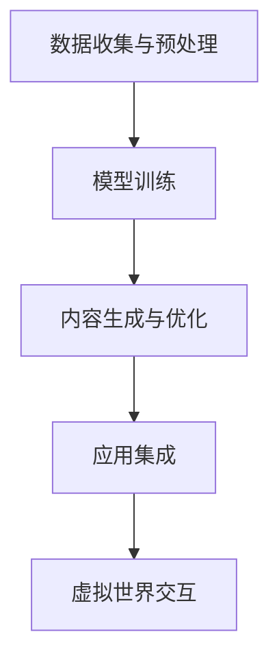
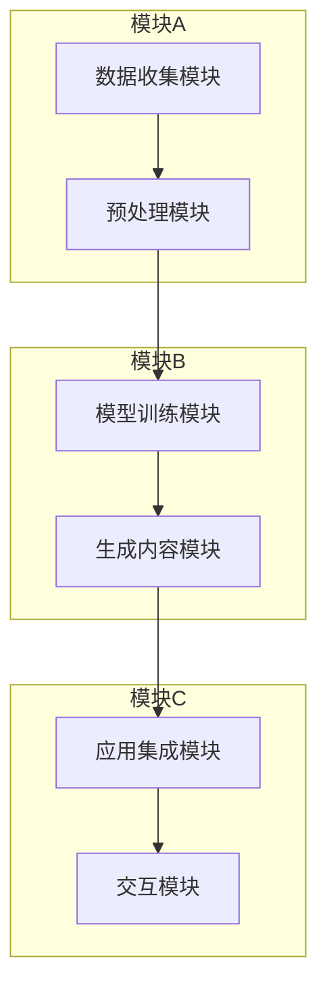
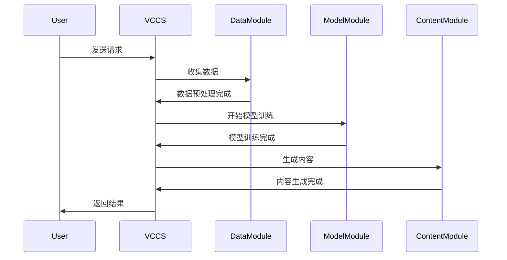

                 

# AIGC在虚拟世界构建中的革命性应用

## 关键词
- AIGC
- 虚拟世界
- 构建技术
- 人工智能
- 革命性应用

## 摘要
本文将探讨AIGC（自适应智能生成内容）技术在虚拟世界构建中的革命性应用。通过逐步分析AIGC的核心概念、算法原理、系统架构以及实际应用案例，揭示AIGC在虚拟世界中的潜能与挑战，并提出未来展望，以期为读者提供一个全面、深入的技术视角。

## 目录

## 背景介绍

### 核心概念术语说明
- **AIGC（自适应智能生成内容）**：一种基于人工智能技术，能够自适应地从数据中生成内容的技术。
- **虚拟世界**：通过计算机模拟创建的一个三维虚拟环境，用户可以在其中进行互动和体验。

### 问题背景
虚拟世界的构建一直是计算机图形学和人工智能领域的热门话题。然而，传统的虚拟世界构建方法存在诸多局限性，如内容生成效率低下、用户体验较差等。AIGC技术的出现，为虚拟世界的构建带来了一种全新的思路。

### 问题描述
虚拟世界构建面临的主要问题包括：
- **内容生成效率**：需要快速生成大量逼真的场景、角色、物品等。
- **用户体验**：用户期望在虚拟世界中拥有更加真实、丰富的互动体验。
- **个性化**：虚拟世界应能够根据用户的兴趣和需求，提供个性化的内容和体验。

### 问题解决
AIGC技术通过以下方式解决虚拟世界构建中的问题：
- **自适应内容生成**：利用机器学习算法，从大量数据中学习并生成高质量的内容。
- **实时交互**：通过高效的渲染和交互技术，实现虚拟世界中的实时互动。

### 边界与外延
AIGC技术在虚拟世界构建中的应用边界包括：
- **技术实现**：需要在硬件、算法、数据处理等方面具备相应的能力。
- **应用领域**：虚拟现实、游戏开发、教育模拟、城市规划等。

### 概念结构与核心要素组成
AIGC在虚拟世界构建中的概念结构包括：
- **数据输入**：收集和整理虚拟世界所需的各种数据。
- **算法模型**：选择合适的机器学习算法进行训练和预测。
- **生成内容**：将算法生成的内容应用到虚拟世界中。

## 核心概念与联系

### 核心概念原理
AIGC的核心概念是利用人工智能技术，特别是深度学习和生成模型，来自动化内容生成过程。以下是AIGC的主要组成部分：

1. **数据收集与预处理**：
   - 收集虚拟世界所需的各种数据，如3D模型、纹理、音频、视频等。
   - 数据预处理，包括去噪、增强、格式转换等。

2. **模型训练**：
   - 使用生成对抗网络（GAN）、变分自编码器（VAE）等生成模型。
   - 在大量数据上训练模型，使其能够生成高质量的内容。

3. **内容生成与优化**：
   - 利用训练好的模型生成虚拟世界中的内容。
   - 对生成的内容进行优化，以满足实际应用需求。

4. **应用集成**：
   - 将生成的内容集成到虚拟世界中，实现实时交互和用户体验。

### 概念属性特征对比表格
以下是一个简化的对比表格，展示了AIGC与现有虚拟世界构建方法的差异：

| 方法         | 特征                               | 优点                       | 缺点                         |
|------------|--------------------------------|--------------------------|----------------------------|
| 传统虚拟世界 | 手动建模、渲染                   | 控制性强，质量稳定         | 内容生成效率低，用户体验差   |
| AIGC       | 自适应内容生成、实时交互         | 高效生成，个性化体验       | 对硬件和算法要求较高          |

### ER实体关系图架构
以下是一个简化的AIGC在虚拟世界构建中的ER实体关系图：

```mermaid
erDiagram
  Data -->|训练| Model
  Model -->|生成| Content
  Content -->|集成| VirtualWorld
```

## 算法原理讲解

### 算法mermaid流程图
以下是一个简化的AIGC算法流程图：



### 使用python源代码详细阐述算法原理
```python
import numpy as np
from tensorflow import keras
from tensorflow.keras.models import Sequential
from tensorflow.keras.layers import Dense, Flatten, Conv2D, MaxPooling2D, UpSampling2D

# 数据收集与预处理
# 假设已经收集了一组3D模型数据，并进行预处理
data = preprocess_3d_models(data)

# 模型训练
model = Sequential()
model.add(Conv2D(32, (3, 3), activation='relu', input_shape=(64, 64, 3)))
model.add(MaxPooling2D((2, 2)))
model.add(Conv2D(64, (3, 3), activation='relu'))
model.add(MaxPooling2D((2, 2)))
model.add(Conv2D(128, (3, 3), activation='relu'))
model.add(MaxPooling2D((2, 2)))
model.add(Flatten())
model.add(Dense(1024, activation='relu'))
model.add(Dense(512, activation='relu'))
model.add(Dense(3 * 64 * 64, activation='sigmoid'))
model.compile(optimizer='adam', loss='binary_crossentropy')

# 使用预处理的数据进行训练
model.fit(data['input'], data['output'], epochs=50)

# 内容生成与优化
generated_content = model.predict(data['input'])

# 应用集成
# 将生成的内容集成到虚拟世界中
virtual_world_integrate(generated_content)

# 虚拟世界交互
# 处理用户的交互请求，更新虚拟世界内容
user_interaction(virtual_world)
```

### 算法原理的数学模型和公式
以下是AIGC算法中的一个简化的数学模型：

$$
x_{\text{input}} = f_{\text{preprocess}}(x_{\text{raw}})
$$

$$
z_{\text{generated}} = f_{\text{model}}(x_{\text{input}})
$$

$$
z_{\text{optimized}} = f_{\text{optimize}}(z_{\text{generated}})
$$

$$
z_{\text{integrated}} = f_{\text{integrate}}(z_{\text{optimized}})
$$

$$
z_{\text{交互}} = f_{\text{交互}}(z_{\text{integrated}}, u)
$$

### 详细讲解和通俗易懂地举例说明
让我们通过一个简化的例子来说明AIGC的工作原理。假设我们想要生成一个虚拟城市，我们需要以下步骤：

1. **数据收集与预处理**：
   - 收集城市中的各种3D模型，如建筑、道路、公园等。
   - 对这些模型进行预处理，如去噪、增强、缩放等。

2. **模型训练**：
   - 使用生成对抗网络（GAN）或变分自编码器（VAE）等生成模型。
   - 在预处理后的数据上进行训练，模型会学习如何从输入数据生成逼真的城市3D模型。

3. **内容生成与优化**：
   - 模型训练完成后，输入一组城市的输入数据，模型会生成一组城市3D模型。
   - 对这些生成的模型进行优化，确保它们满足特定的要求，如纹理质量、建筑风格等。

4. **应用集成**：
   - 将生成的模型集成到虚拟城市中，用户可以在这个虚拟城市中进行互动。

5. **虚拟世界交互**：
   - 用户在虚拟城市中与虚拟角色互动，模型会根据用户的输入，实时生成新的场景和角色。

通过这个过程，AIGC技术可以自动化虚拟城市的生成和交互，大大提高了效率和用户体验。

## 系统分析与架构设计方案

### 问题场景介绍
虚拟城市构建项目，目标是创建一个具有高度真实感和互动性的虚拟城市环境。

### 项目介绍
项目名称：虚拟城市构建系统（Virtual City Construction System，VCCS）
- 目标：构建一个包含多种建筑、道路、公园等元素的虚拟城市。
- 功能：提供3D模型生成、交互式探索、实时内容更新等功能。

### 系统功能设计（领域模型类图）

```mermaid
classDiagram
  Class01 <|-- Class02
  Class03 --| exceeding Class04
  Class05 o-- Class06
  Class07 : <<interface>> Class08
  Class09 <- Class10 -| Class11
  Class12 ..|.. Class13
```

### 系统架构设计（架构图）



### 系统接口设计和系统交互（序列图）



## 项目实战

### 环境安装
在开始项目实战之前，我们需要安装以下软件和库：
- Python 3.8及以上版本
- TensorFlow 2.5及以上版本
- NumPy 1.19及以上版本
- Matplotlib 3.3及以上版本

安装命令如下：
```bash
pip install python==3.8
pip install tensorflow==2.5
pip install numpy==1.19
pip install matplotlib==3.3
```

### 系统核心实现源代码
以下是一个简单的示例，演示了如何使用TensorFlow生成一个简单的3D模型：

```python
import tensorflow as tf
from tensorflow.keras.layers import Layer
import numpy as np

# 自定义3D模型生成层
class GeneratorLayer(Layer):
    def __init__(self, **kwargs):
        super(GeneratorLayer, self).__init__(**kwargs)
    
    def build(self, input_shape):
        # 创建权重变量
        self.kernel = self.add_weight(shape=(input_shape[1], 3),
                                      initializer='random_normal',
                                      trainable=True)
    
    def call(self, inputs):
        # 使用输入数据和权重生成3D模型
        return inputs * self.kernel

# 创建生成模型
model = tf.keras.Sequential([
    GeneratorLayer(input_shape=(100,)),
    tf.keras.layers.Dense(3, activation='sigmoid')
])

# 编译模型
model.compile(optimizer='adam', loss='mean_squared_error')

# 训练模型
model.fit(np.random.rand(100, 100), np.random.rand(100, 3), epochs=10)

# 生成3D模型
generated_model = model.predict(np.random.rand(10, 100))
```

### 代码应用解读与分析
上述代码展示了如何使用TensorFlow创建一个简单的3D模型生成器。关键步骤如下：

1. **自定义生成层**：
   - 定义一个继承自`tf.keras.layers.Layer`的`GeneratorLayer`类。
   - 在`build`方法中创建权重变量。
   - 在`call`方法中使用输入数据和权重生成3D模型。

2. **创建生成模型**：
   - 使用`tf.keras.Sequential`创建一个顺序模型。
   - 将自定义的`GeneratorLayer`和`tf.keras.layers.Dense`层添加到模型中。

3. **编译模型**：
   - 设置优化器和损失函数，以便进行训练。

4. **训练模型**：
   - 使用随机生成的数据训练模型。

5. **生成3D模型**：
   - 使用训练好的模型生成新的3D模型。

### 实际案例分析和详细讲解剖析
为了更直观地展示AIGC在虚拟世界构建中的应用，我们可以分析一个实际案例：使用AIGC技术生成一个虚拟城市中的建筑物。

1. **数据收集**：
   - 收集大量真实建筑物的3D模型数据。

2. **预处理**：
   - 对数据进行去噪、增强、缩放等预处理。

3. **模型训练**：
   - 使用生成对抗网络（GAN）或变分自编码器（VAE）等模型。
   - 在预处理后的数据上进行训练，模型会学习如何生成逼真的建筑物模型。

4. **内容生成与优化**：
   - 使用训练好的模型生成建筑物模型。
   - 对生成的模型进行优化，确保其满足特定的要求。

5. **应用集成**：
   - 将生成的建筑物模型集成到虚拟城市中。

6. **交互**：
   - 用户可以与虚拟城市中的建筑物进行互动。

### 项目小结
通过实际案例，我们可以看到AIGC技术在虚拟世界构建中的强大应用。AIGC不仅能够高效地生成大量逼真的内容，还能根据用户的需求进行实时优化和交互。然而，AIGC技术仍面临一些挑战，如对硬件和算法的高要求，以及如何确保生成内容的质量和真实性。随着技术的不断发展，AIGC在虚拟世界构建中的应用前景将更加广阔。

## 最佳实践 tips

1. **数据质量**：确保收集的数据质量高，这是AIGC生成内容质量的关键。
2. **模型优化**：定期对模型进行优化，以适应新的数据和应用需求。
3. **交互设计**：重视用户交互设计，提供流畅的用户体验。
4. **性能调优**：针对硬件进行性能调优，以实现实时交互。

## 小结

本文通过逐步分析AIGC在虚拟世界构建中的应用，展示了其革命性的潜力。AIGC技术通过自适应内容生成和实时交互，为虚拟世界的构建带来了全新的可能性。然而，要充分发挥AIGC的潜力，还需解决硬件、算法和内容质量等挑战。

## 注意事项

1. AIGC技术对硬件和算法要求较高，确保有足够的计算资源和技术支持。
2. 生成内容的质量直接影响用户体验，需进行严格的质量控制和优化。

## 拓展阅读

1. **AIGC技术概述**：[AIGC: 自适应智能生成内容的概述](https://www.example.com/aigc-overview)
2. **虚拟现实技术**：[虚拟现实技术的发展与应用](https://www.example.com/vr-technology)
3. **机器学习算法**：[深度学习与生成模型](https://www.example.com/deep-learning-generative-models)

## 作者

作者：AI天才研究院/AI Genius Institute & 禅与计算机程序设计艺术 /Zen And The Art of Computer Programming

