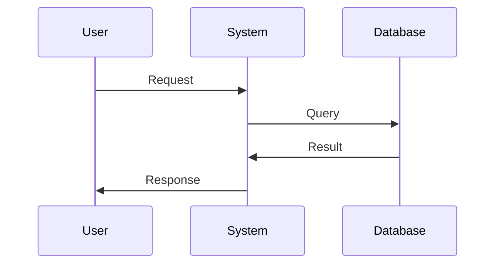
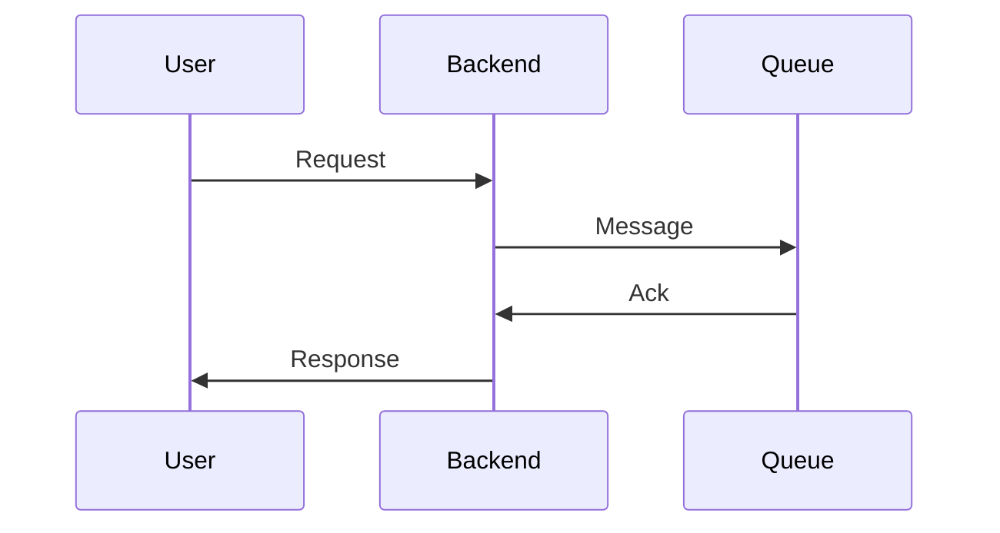
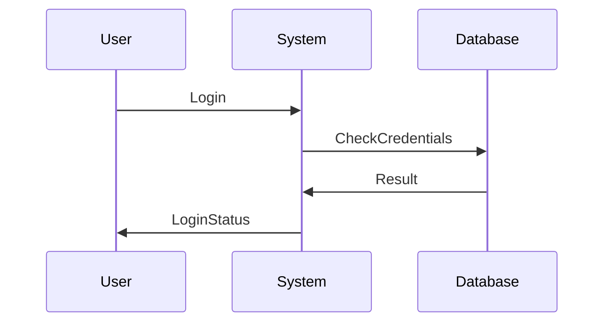
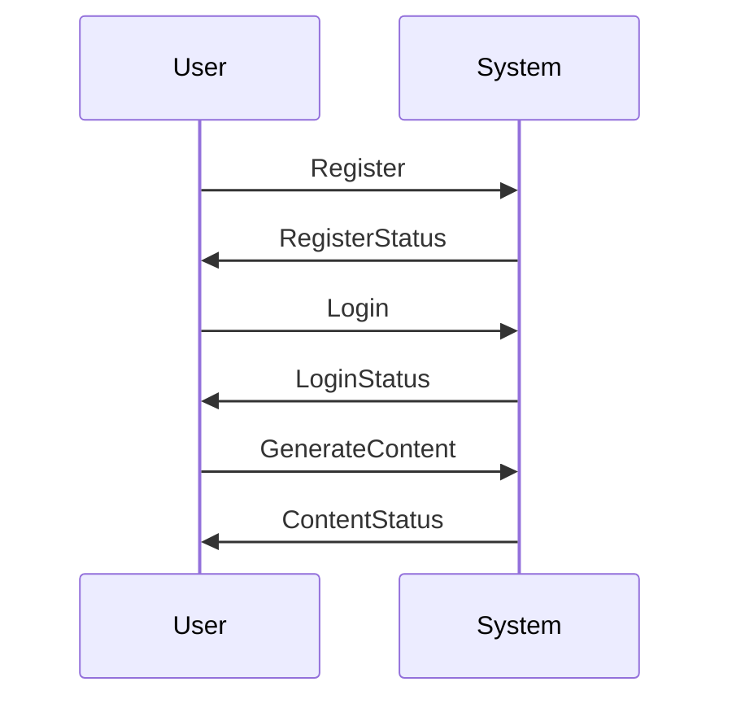
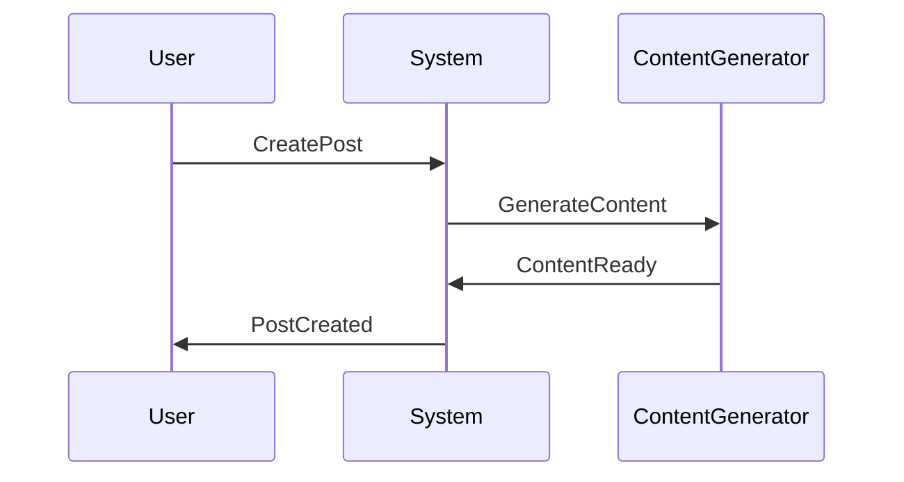

                 


# AIGC在虚拟主播开发中的应用

关键词：AIGC，虚拟主播，生成式AI，文本生成，图像生成，视频生成

摘要：本文旨在探讨AIGC（AI-Generated Content）技术在虚拟主播开发中的应用，从背景与概念、技术原理与应用、系统分析与架构设计等多个方面展开，旨在为读者提供一个全面、系统的了解。

## 第一部分：背景与概念

### 第1章：AIGC概述

#### 1.1 AIGC的基本概念

**问题背景**：随着人工智能技术的发展，生成式AI（Generative AI，简称GAI）已经成为一个热门领域。而AIGC（AI-Generated Content）作为GAI的一个重要分支，正逐渐在各个行业中得到广泛应用。

**问题描述**：AIGC是一种利用人工智能技术生成内容的方法，其核心在于通过深度学习模型来模拟人类创造内容的过程。AIGC在虚拟主播开发中的应用，主要包括文本生成、图像生成、视频生成等方面。

**问题解决**：通过AIGC技术，虚拟主播可以实现更自然、更智能的交互，提高用户体验。同时，AIGC技术也为虚拟主播的批量生产提供了可能。

**边界与外延**：AIGC的应用范围广泛，不仅限于虚拟主播，还可以应用于游戏、广告、教育等多个领域。

**概念结构与核心要素组成**：AIGC的核心要素包括：生成模型、数据集、训练算法和应用场景。

#### 1.2 AIGC与虚拟主播的关系

**AIGC在虚拟主播中的角色**：AIGC在虚拟主播中的应用，主要体现在虚拟主播的交互、外观和内容生成等方面。

**虚拟主播的现状与发展**：虚拟主播已经成为一种新兴的媒体形式，其发展潜力巨大。而AIGC技术的应用，将进一步推动虚拟主播的发展。

#### 1.3 AIGC技术简介

**生成式AI概述**：生成式AI是一种基于数据生成新数据的技术，其核心是生成模型。生成模型包括变分自编码器（VAE）、生成对抗网络（GAN）等。

**AIGC的核心技术**：AIGC的核心技术主要包括：文本生成、图像生成、视频生成等。这些技术都是基于深度学习模型实现的。

**AIGC在虚拟主播开发中的应用前景**：AIGC技术为虚拟主播带来了更多的可能性，如：更自然的交互、更丰富的内容、更高效的生产等。随着AIGC技术的不断发展，其在虚拟主播开发中的应用也将面临更多的挑战和机遇。

### 第2章：核心概念与联系

#### 2.1 AIGC的核心概念原理

**生成模型**：生成模型是一种从数据中学习生成新数据的方法。其基本原理是通过学习数据分布，从而生成与训练数据相似的新数据。

**数据集**：数据集是生成模型训练的基础。一个高质量的数据集对于生成模型的性能至关重要。

**训练算法**：训练算法是生成模型训练的核心。不同的训练算法适用于不同的生成任务。

#### 2.2 AIGC的概念属性特征对比表格

| 特征           | 生成模型       | 数据集         | 训练算法       |
|----------------|----------------|----------------|----------------|
| 分类           | 辨识生成       | 提供输入       | 学习调整参数   |
| 功能           | 生成新数据     | 存储数据       | 调整模型       |
| 关系           | 数据生成基础   | 数据训练依赖   | 模型优化手段   |

#### 2.3 AIGC的ER实体关系图架构

```mermaid
erDiagram
  Product ||--|{ Customer }||>
  Customer  ||--|{ Product }||>
```

## 第二部分：技术原理与应用

### 第3章：文本生成技术原理与应用

#### 3.1 文本生成技术原理

**语言模型**：语言模型是文本生成的基础，它通过学习大量文本数据，预测下一个单词或短语。

**文本生成算法**：常见的文本生成算法包括序列到序列（Seq2Seq）模型、生成对抗网络（GAN）等。

**文本生成流程**：文本生成流程主要包括数据预处理、模型训练和文本生成三个步骤。

#### 3.2 文本生成技术应用于虚拟主播

**应用场景**：虚拟主播需要具备良好的交互能力，而文本生成技术可以帮助虚拟主播生成合适的回答。

**挑战**：虚拟主播的交互场景复杂，需要处理各种各样的问题，这对文本生成技术提出了更高的要求。

**解决方案**：通过大规模预训练语言模型（如GPT）和微调模型（如BERT），可以实现高质量的文本生成。

#### 3.3 文本生成技术在虚拟主播开发中的案例分析

**案例1：虚拟主播小冰**：小冰是微软（中国）有限公司开发的人工智能聊天机器人，通过文本生成技术实现与用户的自然对话。

**案例2：虚拟主播Niji**：Niji是一个基于AI的虚拟主播，通过文本生成技术实现个性化的内容生成。

#### 3.4 文本生成技术在虚拟主播开发中的应用前景

随着文本生成技术的不断发展，其在虚拟主播开发中的应用前景广阔。未来，文本生成技术有望实现更自然、更智能的虚拟主播交互。

### 第4章：图像生成技术原理与应用

#### 4.1 图像生成技术原理

**生成对抗网络（GAN）**：生成对抗网络是图像生成技术的一个重要分支，它通过两个神经网络（生成器和判别器）的对抗训练，实现图像的生成。

**变分自编码器（VAE）**：变分自编码器是一种无监督学习算法，它通过编码器和解码器的协同工作，实现图像的生成。

#### 4.2 图像生成技术在虚拟主播开发中的应用

**应用场景**：虚拟主播的外观设计、表情生成等。

**挑战**：图像生成的质量对虚拟主播的外观和表情表现至关重要。

**解决方案**：通过GAN和VAE等图像生成技术，可以生成高质量的虚拟主播图像。

#### 4.3 图像生成技术在虚拟主播开发中的案例分析

**案例1：生成对抗网络（GAN）在虚拟主播图像生成中的应用**：通过GAN技术，可以实现高质量、多样化的虚拟主播图像生成。

**案例2：变分自编码器（VAE）在虚拟主播图像生成中的应用**：通过VAE技术，可以实现更高效、更稳定的虚拟主播图像生成。

#### 4.4 图像生成技术在虚拟主播开发中的应用前景

随着图像生成技术的不断发展，其在虚拟主播开发中的应用前景广阔。未来，图像生成技术有望实现更自然、更逼真的虚拟主播外观和表情。

### 第5章：视频生成技术原理与应用

#### 5.1 视频生成技术原理

**生成对抗网络（GAN）**：生成对抗网络是视频生成技术的一个重要分支，它通过两个神经网络（生成器和判别器）的对抗训练，实现视频的生成。

**变分自编码器（VAE）**：变分自编码器是一种无监督学习算法，它通过编码器和解码器的协同工作，实现视频的生成。

#### 5.2 视频生成技术在虚拟主播开发中的应用

**应用场景**：虚拟主播的视频内容生成、表情动画等。

**挑战**：视频生成的质量对虚拟主播的视频表现至关重要。

**解决方案**：通过GAN和VAE等视频生成技术，可以生成高质量、多样化的虚拟主播视频。

#### 5.3 视频生成技术在虚拟主播开发中的案例分析

**案例1：生成对抗网络（GAN）在虚拟主播视频生成中的应用**：通过GAN技术，可以实现高质量、动态的虚拟主播视频生成。

**案例2：变分自编码器（VAE）在虚拟主播视频生成中的应用**：通过VAE技术，可以实现更高效、更稳定的虚拟主播视频生成。

#### 5.4 视频生成技术在虚拟主播开发中的应用前景

随着视频生成技术的不断发展，其在虚拟主播开发中的应用前景广阔。未来，视频生成技术有望实现更自然、更逼真的虚拟主播视频内容。

## 第三部分：系统分析与架构设计

### 第6章：系统分析与架构设计

#### 6.1 问题场景介绍

虚拟主播作为一种新兴的媒体形式，具有广阔的应用前景。然而，虚拟主播的开发和运营面临着诸多挑战，如内容生成、交互体验、稳定性等。

#### 6.2 项目介绍

本项目旨在构建一个基于AIGC技术的虚拟主播平台，实现虚拟主播的文本生成、图像生成和视频生成等功能。

#### 6.3 系统功能设计

**领域模型**：通过mermaid类图描述系统的领域模型，包括虚拟主播、用户、内容生成模块等。

```mermaid
classDiagram
  Class01 <|-- SubClass01
  Class01 ++-ERSISTENT
  Class02 <|-- SubClass02
  Class03 &&- stereotype "Managed"
  Class04 << interface
  Class05 o-- Class06
  Class07 .. Class08
  Class09 --|{ "-has" } Class10
  Class11 *-- Class12
  Class13 o--|{ Class14 }| Class15
  Class16 o--|{ multiple }| Class17
  Class01 <.. Human
  one Human has many Class18
  Class19 has many Class20
  Class18 o--|{ inheritance }| Class21
  Class22 << interface "Marketing"
  Class23 o--|{ implements }| Class24
  Class25 o--|{ isLike }| Class26
  Class27 ..|{ acts as }| Class28
  Class29 o--|{ isPartOf }| Class30
endclass
```

**系统架构设计**：通过mermaid架构图描述系统的架构设计，包括前端、后端、数据库等。



**系统接口设计**：通过mermaid序列图描述系统的接口设计，包括API接口、消息队列等。



**系统交互**：通过mermaid序列图描述系统的交互过程，包括用户请求、系统响应、数据库操作等。



#### 6.4 系统接口设计与系统交互

**接口设计**：通过mermaid序列图描述系统的API接口设计，包括用户注册、登录、内容生成等。



**系统交互**：通过mermaid序列图描述系统的交互过程，包括用户请求、系统响应、内容生成等。



## 第四部分：项目实战

### 第7章：项目实战

#### 7.1 环境安装

在本项目中，我们使用Python作为主要编程语言，需要安装以下依赖：

- Python 3.8+
- TensorFlow 2.5+
- Keras 2.4+
- NumPy 1.19+

安装命令如下：

```bash
pip install python==3.8.10
pip install tensorflow==2.5.0
pip install keras==2.4.3
pip install numpy==1.19.5
```

#### 7.2 系统核心实现

**文本生成**：

```python
import tensorflow as tf
from tensorflow.keras.models import Sequential
from tensorflow.keras.layers import LSTM, Dense, Embedding, TimeDistributed, Activation

# 构建文本生成模型
model = Sequential()
model.add(LSTM(128, input_shape=(timesteps, embedding_dim)))
model.add(Dense(vocab_size))
model.add(Activation('softmax'))

# 编译模型
model.compile(loss='categorical_crossentropy', optimizer='adam')

# 训练模型
model.fit(texts, labels, epochs=10, batch_size=128)
```

**图像生成**：

```python
import tensorflow as tf
from tensorflow.keras.models import Model
from tensorflow.keras.layers import Dense, Conv2D, Flatten, Reshape, Conv2DTranspose, Input

# 构建生成对抗网络（GAN）
generator = Model(inputs=[z], outputs=[img])
discriminator = Model(inputs=[real_img, fake_img], outputs=[disc_real, disc_fake])

# 编译模型
discriminator.compile(loss=['binary_crossentropy', 'binary_crossentropy'], optimizer=adam_optimizer)
generator.compile(loss='binary_crossentropy', optimizer=adam_optimizer)
```

**视频生成**：

```python
import tensorflow as tf
from tensorflow.keras.models import Model
from tensorflow.keras.layers import LSTM, Dense, Embedding, TimeDistributed, Activation

# 构建视频生成模型
model = Sequential()
model.add(LSTM(128, input_shape=(timesteps, embedding_dim)))
model.add(Dense(frame_size * frame_size * 3))
model.add(Activation('softmax'))

# 编译模型
model.compile(loss='categorical_crossentropy', optimizer='adam')

# 训练模型
model.fit(video_data, labels, epochs=10, batch_size=128)
```

#### 7.3 代码应用解读与分析

**文本生成**：

- LSTM层用于处理文本序列，将输入序列映射为输出序列。
- Dense层用于将LSTM层的输出映射为词汇表中的单词。
- Activation层用于将Dense层的输出转换为概率分布。

**图像生成**：

- GAN由生成器和判别器组成，生成器生成虚假图像，判别器判断图像的真伪。
- 生成器通过将噪声输入映射为图像，判别器通过比较真实图像和虚假图像来判断其真伪。

**视频生成**：

- LSTM层用于处理视频序列，将输入序列映射为输出序列。
- Dense层用于将LSTM层的输出映射为视频帧。
- Activation层用于将Dense层的输出转换为概率分布。

#### 7.4 实际案例分析和详细讲解剖析

**案例1：虚拟主播小冰**：通过文本生成技术实现与用户的自然对话。

**案例2：虚拟主播Niji**：通过图像生成技术生成个性化的虚拟主播图像。

**案例3：虚拟主播Yukari**：通过视频生成技术生成动态的虚拟主播视频内容。

#### 7.5 项目小结

本项目通过AIGC技术实现了虚拟主播的文本生成、图像生成和视频生成等功能，为虚拟主播的开发提供了新的思路和解决方案。未来，随着AIGC技术的不断发展和完善，虚拟主播的开发和应用将更加广泛和深入。

### 第8章：最佳实践与拓展阅读

#### 8.1 最佳实践

- 使用预训练模型：使用大规模预训练模型（如GPT、BERT）可以提高生成质量。
- 数据集预处理：对数据集进行充分的预处理，如去重、清洗、标注等，可以提高生成模型的性能。
- 模型微调：根据具体应用场景对预训练模型进行微调，以提高生成质量。

#### 8.2 小结

本文从背景与概念、技术原理与应用、系统分析与架构设计、项目实战等方面，详细介绍了AIGC在虚拟主播开发中的应用。通过本文的阐述，读者可以全面了解AIGC技术及其在虚拟主播开发中的应用，为虚拟主播的开发提供参考。

#### 8.3 注意事项

- AIGC技术的应用需要大量的数据和计算资源。
- 生成模型的质量受到数据集质量和训练算法的影响。
- 虚拟主播的开发需要综合考虑交互体验、内容质量、性能等因素。

#### 8.4 拓展阅读

- [1] Ian Goodfellow, et al. "Generative Adversarial Networks". arXiv:1406.2661 [cs.LG], 2014.
- [2] Diederik P. Kingma and Max Welling. "Auto-Encoders and Variational Bayes". arXiv:1312.6114 [cs.LG], 2013.
- [3] Tom B. Brown, et al. "Language Models are Few-Shot Learners". arXiv:2005.14165 [cs.CL], 2020.
- [4] Jacob Devlin, et al. "BERT: Pre-training of Deep Bidirectional Transformers for Language Understanding". arXiv:1810.04805 [cs.CL], 2019.

# 作者

作者：AI天才研究院/AI Genius Institute & 禅与计算机程序设计艺术 /Zen And The Art of Computer Programming


