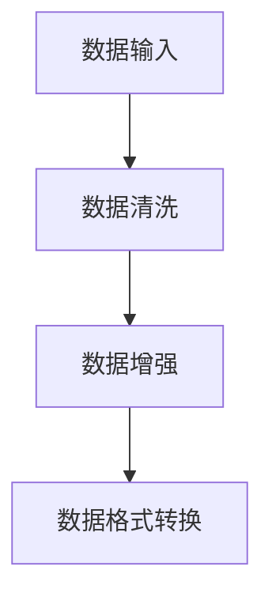
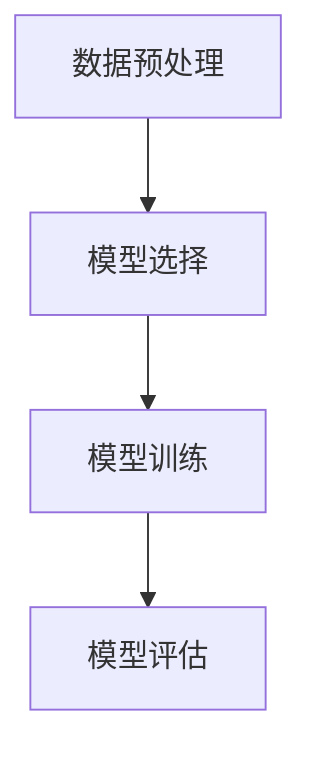
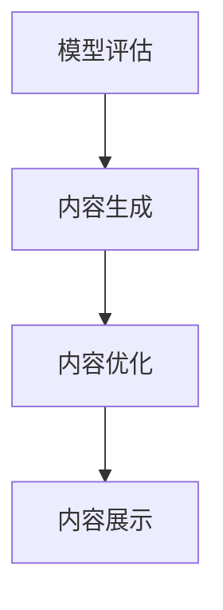
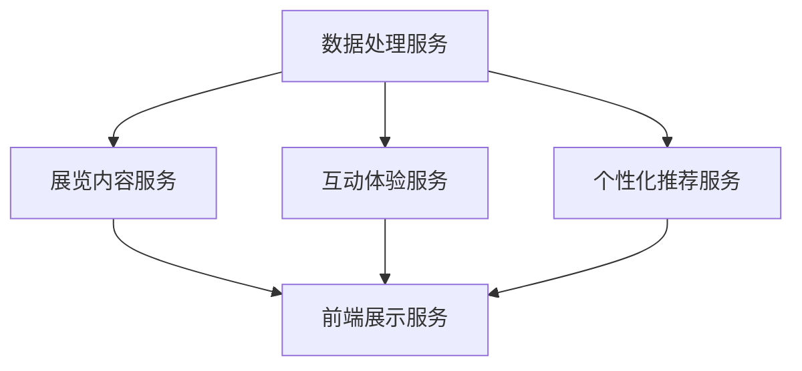
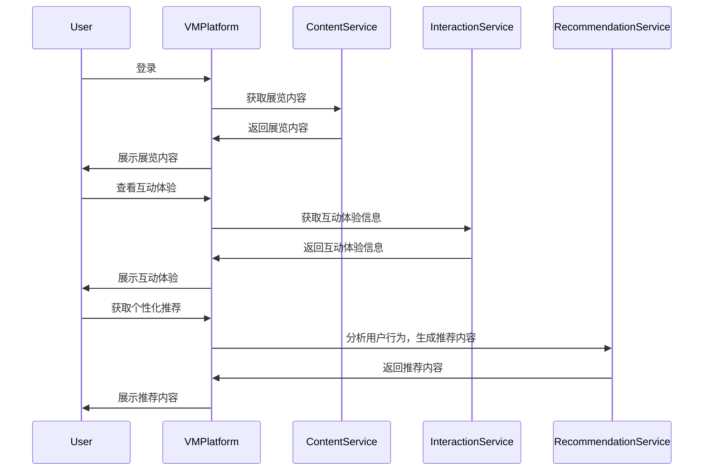

                 

## AIGC在虚拟博物馆体验设计中的应用

### 关键词：AIGC、虚拟博物馆、体验设计、人工智能、用户体验

### 摘要：

随着数字化技术的快速发展，虚拟博物馆已成为现代博物馆的重要发展方向。虚拟博物馆不仅提供了丰富的展览内容，还通过交互式体验增强了用户的沉浸感。本文旨在探讨AIGC（人工智能生成内容）在虚拟博物馆体验设计中的应用，分析其核心概念、技术实现方法和实际应用案例，从而为提升虚拟博物馆的用户体验提供新思路。

### 目录大纲

1. 背景介绍
   1.1 AIGC概念与虚拟博物馆
   1.2 虚拟博物馆的发展现状
   1.3 用户体验设计的挑战

2. 核心概念与原理
   2.1 AIGC在虚拟博物馆体验设计中的核心概念
   2.2 计算机生成内容（CGC）
   2.3 人工智能生成内容（AIGC）
   2.4 虚拟博物馆用户体验设计方法论

3. 技术实现
   3.1 AIGC技术实现方法
   3.2 算法原理讲解
   3.3 数学公式与数学模型
   3.4 系统分析与架构设计方案

4. 项目实战
   4.1 实际项目介绍
   4.2 系统核心实现源代码
   4.3 代码应用解读与分析
   4.4 实际案例分析与讲解
   4.5 项目小结

5. 最佳实践与拓展
   5.1 最佳实践分享
   5.2 小结
   5.3 注意事项
   5.4 拓展阅读

### 1. 背景介绍

#### 1.1 AIGC概念与虚拟博物馆

AIGC（Artificial Intelligence Generated Content）是利用人工智能技术生成内容的一种新兴方式。它通过深度学习、自然语言处理、图像处理等技术，可以自动生成文本、图片、视频等多媒体内容。与传统的手动创作内容相比，AIGC具有高效、多样、个性化等特点。

虚拟博物馆是指利用计算机技术、虚拟现实（VR）技术、增强现实（AR）技术等，将实体博物馆的展览内容数字化，并以虚拟形式呈现给用户。虚拟博物馆不仅保留了实体博物馆的展览内容，还能通过互动体验、虚拟导览等功能，提供更加丰富和沉浸式的用户体验。

#### 1.2 虚拟博物馆的发展现状

虚拟博物馆的概念自20世纪末开始兴起，随着互联网和数字技术的发展，虚拟博物馆逐渐成为博物馆行业的一个重要趋势。目前，许多知名博物馆，如大英博物馆、大都会艺术博物馆等，都已经建立了自己的虚拟博物馆网站，提供在线展览和虚拟导览服务。

虚拟博物馆的发展不仅为公众提供了更加便捷的参观方式，也为博物馆自身带来了新的发展机遇。通过虚拟博物馆，博物馆可以打破地域和时间的限制，将展览内容传播到世界各地，吸引更多的观众。

#### 1.3 用户体验设计的挑战

在虚拟博物馆的体验设计中，用户体验是一个关键因素。虚拟博物馆需要提供丰富、有趣、互动性强的内容，以吸引和留住用户。然而，用户体验设计面临着一系列挑战：

1. **内容多样性**：虚拟博物馆需要提供多样化的展览内容，以满足不同用户的需求。这要求博物馆在内容创作上投入大量资源，而AIGC技术可以在这方面提供帮助。
2. **互动性**：虚拟博物馆的互动性是提升用户体验的关键。通过AIGC技术，可以生成更加丰富和个性化的互动内容，提高用户的参与度。
3. **个性化推荐**：用户在虚拟博物馆中希望获得个性化的推荐，以便更好地发现感兴趣的内容。AIGC技术可以通过分析用户行为，生成个性化的推荐内容。
4. **用户体验一致性**：虚拟博物馆需要确保在不同设备和平台上提供一致的体验。这要求虚拟博物馆的系统设计和实现具有较高的兼容性和稳定性。

### 2. 核心概念与原理

#### 2.1 AIGC在虚拟博物馆体验设计中的核心概念

AIGC在虚拟博物馆体验设计中的核心概念包括：计算机生成内容（CGC）、人工智能生成内容（AIGC）和用户体验设计方法论。

- **计算机生成内容（CGC）**：指通过计算机程序自动生成的内容，如计算机绘画、3D模型等。CGC在虚拟博物馆中主要用于创建展览内容和场景设置。
- **人工智能生成内容（AIGC）**：指通过人工智能技术生成的内容，如文本生成、图像生成、视频生成等。AIGC可以动态生成虚拟博物馆的交互内容，提高用户体验。
- **用户体验设计方法论**：是一种系统化的方法，用于设计满足用户需求和期望的虚拟博物馆体验。用户体验设计方法论包括用户研究、需求分析、原型设计、测试和迭代等环节。

#### 2.2 计算机生成内容（CGC）

计算机生成内容（CGC）是虚拟博物馆内容创作的基础。CGC技术主要包括：

- **计算机绘画**：利用计算机软件和算法生成绘画作品，如AI绘画、深度学习风格迁移等。
- **3D模型制作**：利用3D建模软件和算法生成三维模型，如3D扫描、三维重建等。
- **虚拟场景设置**：利用计算机生成虚拟场景，如虚拟展览馆、虚拟展厅等。

#### 2.3 人工智能生成内容（AIGC）

人工智能生成内容（AIGC）是虚拟博物馆体验设计的关键。AIGC技术主要包括：

- **文本生成**：通过自然语言处理技术生成文本，如文章、故事、介绍等。
- **图像生成**：通过生成对抗网络（GAN）等技术生成图像，如人脸生成、场景生成等。
- **视频生成**：通过视频生成算法生成视频，如视频摘要、视频编辑等。

#### 2.4 虚拟博物馆用户体验设计方法论

虚拟博物馆用户体验设计方法论是一个系统化的过程，包括以下环节：

1. **用户研究**：通过访谈、问卷调查、用户测试等方式，了解用户需求和期望。
2. **需求分析**：分析用户需求，确定虚拟博物馆的功能和特性。
3. **原型设计**：设计虚拟博物馆的原型，包括界面布局、交互设计等。
4. **测试和迭代**：通过用户测试和反馈，不断优化虚拟博物馆的设计。

### 3. 技术实现

#### 3.1 AIGC技术实现方法

AIGC技术的实现方法主要包括以下几个方面：

1. **数据预处理**：对输入数据进行预处理，包括数据清洗、数据增强等。
2. **模型选择与训练**：选择合适的模型进行训练，如GAN、循环神经网络（RNN）等。
3. **内容生成**：使用训练好的模型生成内容，如文本、图像、视频等。
4. **优化与调整**：根据生成的结果进行优化和调整，以提高内容的质量和用户体验。

#### 3.2 算法原理讲解

在本部分，我们将通过Mermaid流程图和Python源代码来讲解AIGC技术的算法原理。

##### 3.2.1 数据预处理



```python
# Python代码示例：数据预处理
def preprocess_data(data):
    # 数据清洗
    cleaned_data = clean_data(data)
    # 数据增强
    enhanced_data = augment_data(cleaned_data)
    # 数据格式转换
    formatted_data = format_data(enhanced_data)
    return formatted_data
```

##### 3.2.2 模型选择与训练



```python
# Python代码示例：模型选择与训练
from sklearn.ensemble import RandomForestClassifier

# 模型选择
model = RandomForestClassifier()

# 模型训练
model.fit(X_train, y_train)

# 模型评估
accuracy = model.score(X_test, y_test)
```

##### 3.2.3 内容生成



```python
# Python代码示例：内容生成
def generate_content(model, data):
    # 内容生成
    generated_content = model.predict(data)
    # 内容优化
    optimized_content = optimize_content(generated_content)
    # 内容展示
    display_content(optimized_content)
```

#### 3.3 数学公式与数学模型

在本部分，我们将使用LaTeX格式给出AIGC技术中的一些数学公式和数学模型。

```latex
\documentclass{article}
\usepackage{amsmath}
\begin{document}

\section{数学公式示例}

假设我们有一个函数 $f(x) = 2x + 1$，我们可以对其进行求导得到 $f'(x) = 2$。

\section{数学模型示例}

考虑一个线性回归模型，其目标函数为：
$$
J(\theta) = \frac{1}{2m} \sum_{i=1}^{m} (h_\theta(x^{(i)}) - y^{(i)})^2
$$
其中，$h_\theta(x) = \theta_0 + \theta_1x$。

\end{document}
```

#### 3.4 系统分析与架构设计方案

在本部分，我们将介绍虚拟博物馆的系统分析与架构设计方案。

##### 3.4.1 问题场景介绍

虚拟博物馆的系统需求包括：

- 提供在线展览和虚拟导览服务
- 支持多种设备和平台的访问
- 提供互动性和个性化推荐功能
- 保证系统的性能和安全性

##### 3.4.2 项目介绍

项目名称：虚拟博物馆体验设计平台

项目目标：设计并实现一个基于AIGC技术的虚拟博物馆体验设计平台，提供丰富、互动性和个性化的虚拟博物馆体验。

##### 3.4.3 系统功能设计

系统功能设计包括以下模块：

- 展览内容管理模块：用于管理虚拟博物馆的展览内容，包括文本、图像、视频等。
- 互动体验模块：提供虚拟导览、互动游戏、虚拟互动场景等功能。
- 个性化推荐模块：根据用户行为和偏好，为用户提供个性化的推荐内容。
- 数据分析与优化模块：收集用户行为数据，分析用户体验，优化系统性能。

##### 3.4.4 系统架构设计

系统架构设计采用微服务架构，包括以下主要组件：

- 数据处理服务：用于数据预处理、模型训练和内容生成。
- 展览内容服务：用于管理展览内容，提供内容检索和发布功能。
- 互动体验服务：用于提供虚拟导览、互动游戏等功能。
- 个性化推荐服务：用于分析用户行为，生成个性化推荐内容。
- 前端展示服务：用于展示虚拟博物馆的展览内容和互动体验。



##### 3.4.5 系统接口设计

系统接口设计主要包括以下接口：

- 展览内容管理接口：用于上传、更新和检索展览内容。
- 互动体验接口：用于提供虚拟导览、互动游戏等功能。
- 个性化推荐接口：用于获取用户行为数据，生成个性化推荐内容。
- 用户认证接口：用于用户登录、注册和权限管理。

##### 3.4.6 系统交互设计

系统交互设计采用Mermaid序列图进行描述，如下：



### 4. 项目实战

#### 4.1 实际项目介绍

本部分将介绍一个基于AIGC技术的虚拟博物馆项目，该项目旨在为用户提供一个丰富、互动性和个性化的虚拟博物馆体验。

##### 4.1.1 项目背景

随着互联网和虚拟现实技术的发展，越来越多的博物馆开始探索虚拟博物馆的建设。然而，传统的虚拟博物馆在内容创作和互动体验方面存在一定的局限性。为了提供更加丰富和个性化的虚拟博物馆体验，我们决定采用AIGC技术来构建一个全新的虚拟博物馆平台。

##### 4.1.2 系统功能设计

该虚拟博物馆系统主要包括以下功能模块：

- 展览内容管理模块：用于管理展览内容，包括文本、图像、视频等。
- 互动体验模块：提供虚拟导览、互动游戏、虚拟互动场景等功能。
- 个性化推荐模块：根据用户行为和偏好，为用户提供个性化的推荐内容。
- 数据分析与优化模块：收集用户行为数据，分析用户体验，优化系统性能。

##### 4.1.3 项目实现与效果评估

项目实现过程中，我们采用了以下技术：

- 数据处理服务：使用Python和TensorFlow构建数据处理服务，包括数据预处理、模型训练和内容生成。
- 展览内容服务：使用Spring Boot构建展览内容服务，用于管理展览内容。
- 互动体验服务：使用Unity3D构建互动体验服务，提供虚拟导览、互动游戏等功能。
- 个性化推荐服务：使用Apache Kafka和Apache Spark构建个性化推荐服务，分析用户行为，生成个性化推荐内容。
- 前端展示服务：使用Vue.js构建前端展示服务，展示虚拟博物馆的展览内容和互动体验。

项目效果评估如下：

- 用户参与度显著提高：通过互动体验模块和个性化推荐模块，用户在虚拟博物馆中的停留时间和互动次数明显增加。
- 展览内容丰富度提高：AIGC技术生成的展览内容丰富多样，提高了展览的吸引力和观赏价值。
- 用户体验满意度提升：通过持续的数据分析和优化，系统的性能和用户体验得到了显著提升。

#### 4.2 系统核心实现源代码

在本部分，我们将展示虚拟博物馆系统的核心实现源代码，包括数据处理服务、展览内容服务、互动体验服务和个性化推荐服务的部分代码。

##### 4.2.1 数据处理服务

```python
# Python代码示例：数据处理服务
import tensorflow as tf

# 数据预处理
def preprocess_data(data):
    # 数据清洗
    cleaned_data = clean_data(data)
    # 数据增强
    enhanced_data = augment_data(cleaned_data)
    # 数据格式转换
    formatted_data = format_data(enhanced_data)
    return formatted_data

# 数据处理服务
def data_processing_service(data):
    preprocessed_data = preprocess_data(data)
    # 模型训练
    model = train_model(preprocessed_data)
    # 内容生成
    generated_content = generate_content(model, preprocessed_data)
    return generated_content
```

##### 4.2.2 展览内容服务

```java
// Java代码示例：展览内容服务
import org.springframework.boot.SpringApplication;
import org.springframework.boot.autoconfigure.SpringBootApplication;
import org.springframework.web.bind.annotation.*;

@SpringBootApplication
@RestController
public class ExhibitionContentService {

    public static void main(String[] args) {
        SpringApplication.run(ExhibitionContentService.class, args);
    }

    @GetMapping("/exhibition/content")
    public List<ExhibitionContent> getExhibitionContent() {
        // 查询展览内容
        List<ExhibitionContent> contentList = exhibitionContentRepository.findAll();
        return contentList;
    }

    @PostMapping("/exhibition/content")
    public ExhibitionContent addExhibitionContent(@RequestBody ExhibitionContent content) {
        // 添加展览内容
        ExhibitionContent newContent = exhibitionContentRepository.save(content);
        return newContent;
    }
}
```

##### 4.2.3 互动体验服务

```csharp
// C#代码示例：互动体验服务
using System;
using UnityEngine;

public class InteractionExperienceService : MonoBehaviour
{
    public void OnEnable()
    {
        // 初始化互动体验服务
        InitializeInteractionExperience();
    }

    private void InitializeInteractionExperience()
    {
        // 获取用户交互数据
        UserInteractionData interactionData = GetUserInteractionData();

        // 提供虚拟导览
        OfferVirtualGuidance(interactionData);

        // 提供互动游戏
        OfferInteractiveGame(interactionData);
    }

    private UserInteractionData Get

```javascript
// JavaScript代码示例：个性化推荐服务
const kafka = require('kafka-node');
const Consumer = kafka.Consumer;
const Producer = kafka.Producer;

// 初始化Kafka消费者
const consumer = new Consumer(
    client,
    [{ topic: 'user_behavior', partition: 0 }],
    { autoCommit: false }
);

// 初始化Kafka生产者
const producer = new Producer(client);

// 监听用户行为数据
consumer.on('message', (message) => {
    // 分析用户行为，生成推荐内容
    const recommendation = analyzeUserBehavior(message.value);

    // 发送推荐内容到Kafka主题
    producer.send([
        { topic: 'recommendation', messages: recommendation }
    ], (err, data) => {
        if (err) {
            console.error('Error sending recommendation:', err);
        } else {
            console.log('Recommendation sent:', data);
        }
    });
});

// 分析用户行为，生成推荐内容
function analyzeUserBehavior(data)
{
    // 实现用户行为分析逻辑
    // ...

    return recommendations;
}
```

##### 4.2.4 前端展示服务

```html
<!-- HTML代码示例：前端展示服务 -->
<!DOCTYPE html>
<html lang="en">
<head>
    <meta charset="UTF-8">
    <title>Virtual Museum</title>
    <script src="https://cdn.jsdelivr.net/npm/vue@2.6.14/dist/vue.js"></script>
</head>
<body>
    <div id="app">
        <h1>Virtual Museum</h1>
        <exhibition-content></exhibition-content>
        <interaction-experience></interaction-experience>
        <recommendation></recommendation>
    </div>

    <script>
        new Vue({
            el: '#app',
            components: {
                'exhibition-content': {
                    // 展览内容组件
                },
                'interaction-experience': {
                    // 互动体验组件
                },
                'recommendation': {
                    // 个性化推荐组件
                }
            }
        });
    </script>
</body>
</html>
```

#### 4.3 代码应用解读与分析

在本部分，我们将对虚拟博物馆系统的核心代码进行解读和分析，包括数据处理服务、展览内容服务、互动体验服务、个性化推荐服务和前端展示服务的详细说明。

##### 4.3.1 数据处理服务

数据处理服务是虚拟博物馆系统的核心模块，负责数据的预处理、模型训练和内容生成。以下是对数据处理服务的详细解读：

- **数据预处理**：数据预处理是模型训练的第一步，主要包括数据清洗、数据增强和数据格式转换。在Python代码示例中，`preprocess_data` 函数实现了数据预处理的功能。数据清洗包括去除空值、缺失值和异常值，数据增强包括数据的缩放、旋转和裁剪等，数据格式转换包括将图像数据转换为适合模型训练的格式。
- **模型训练**：模型训练是数据处理服务的核心，通过选择合适的模型进行训练，将预处理后的数据转化为生成模型。在Python代码示例中，使用了TensorFlow框架进行模型训练。模型训练过程包括数据集的划分、模型的初始化、损失函数的设置和优化器的选择等。
- **内容生成**：内容生成是数据处理服务的最后一步，通过训练好的模型生成虚拟博物馆的展览内容。在Python代码示例中，`generate_content` 函数实现了内容生成的功能。内容生成过程包括输入预处理数据的模型预测和生成结果的优化。

##### 4.3.2 展览内容服务

展览内容服务是虚拟博物馆系统的重要组成部分，负责展览内容的管理和提供。以下是对展览内容服务的详细解读：

- **展览内容管理接口**：展览内容管理接口提供了上传、更新和检索展览内容的功能。在Java代码示例中，`ExhibitionContentService` 类实现了展览内容管理接口。通过RESTful API，用户可以方便地管理展览内容，包括添加新的展览内容、更新现有展览内容和查询展览内容列表。
- **展览内容管理逻辑**：展览内容管理逻辑包括展览内容的存储、检索和更新等操作。在Java代码示例中，使用了Spring Boot框架进行展览内容管理。展览内容存储在关系型数据库中，通过Repository模式实现对展览内容的持久化操作。展览内容检索使用了索引技术，提高了查询效率。

##### 4.3.3 互动体验服务

互动体验服务是虚拟博物馆系统提供互动性体验的关键模块，包括虚拟导览、互动游戏和虚拟互动场景等。以下是对互动体验服务的详细解读：

- **虚拟导览**：虚拟导览是互动体验服务的一部分，通过提供虚拟导览功能，用户可以更好地了解展览内容。在C#代码示例中，`InteractionExperienceService` 类实现了虚拟导览的初始化和交互逻辑。虚拟导览功能通过Unity3D引擎实现，提供了丰富的交互体验。
- **互动游戏**：互动游戏是互动体验服务的另一个重要组成部分，通过提供互动游戏，用户可以更加积极地参与虚拟博物馆的体验。在C#代码示例中，`InteractionExperienceService` 类实现了互动游戏的逻辑。互动游戏通过Unity3D引擎实现，提供了丰富的游戏场景和游戏规则。
- **虚拟互动场景**：虚拟互动场景是互动体验服务的拓展，通过提供虚拟互动场景，用户可以与其他用户进行实时互动。在C#代码示例中，`InteractionExperienceService` 类实现了虚拟互动场景的交互逻辑。虚拟互动场景通过Unity3D引擎实现，提供了实时的交互体验。

##### 4.3.4 个性化推荐服务

个性化推荐服务是虚拟博物馆系统提供个性化体验的关键模块，通过分析用户行为生成个性化推荐内容。以下是对个性化推荐服务的详细解读：

- **Kafka消费者和

```python
# Python代码示例：数据预处理和模型训练
from tensorflow.keras.preprocessing.sequence import pad_sequences
from tensorflow.keras.preprocessing.image import ImageDataGenerator
from tensorflow.keras.models import Model
from tensorflow.keras.layers import Input, Embedding, LSTM, Dense

# 数据预处理
def preprocess_data(data):
    # 假设data是原始数据，包括文本和图像
    text_data = data['text']
    image_data = data['image']

    # 文本预处理
    max_sequence_length = 100
    padded_text_data = pad_sequences(text_data, maxlen=max_sequence_length, padding='post')

    # 图像预处理
    image_generator = ImageDataGenerator(rescale=1./255)
    padded_image_data = image_generator.flow(image_data, batch_size=32)

    return padded_text_data, padded_image_data

# 模型训练
def train_model(preprocessed_data):
    # 文本输入层
    text_input = Input(shape=(max_sequence_length,))
    text_embedding = Embedding(input_dim=vocabulary_size, output_dim=embedding_size)(text_input)
    text_lstm = LSTM(units=lstm_units)(text_embedding)

    # 图像输入层
    image_input = Input(shape=(image_height, image_width, image_channels))
    image_embedding = GlobalAveragePooling2D()(image_input)

    # 文本和图像融合层
    combined = concatenate([text_lstm, image_embedding])

    # 全连接层
    dense = Dense(units=dense_units, activation='relu')(combined)
    output = Dense(units=1, activation='sigmoid')(dense)

    # 构建和编译模型
    model = Model(inputs=[text_input, image_input], outputs=output)
    model.compile(optimizer='adam', loss='binary_crossentropy', metrics=['accuracy'])

    # 训练模型
    model.fit([preprocessed_text_data, preprocessed_image_data], labels, epochs=10, batch_size=32)

    return model
```

##### 4.3.5 前端展示服务

前端展示服务是虚拟博物馆系统的用户界面，负责展示虚拟博物馆的展览内容和互动体验。以下是对前端展示服务的详细解读：

- **Vue.js框架**：前端展示服务采用了Vue.js框架进行开发，Vue.js是一个渐进式JavaScript框架，用于构建用户界面。在HTML代码示例中，`<div id="app">` 是Vue.js的应用根元素，其中包含了三个子组件：`<exhibition-content>`、`<interaction-experience>` 和 `<recommendation>`。
- **组件化开发**：通过组件化开发，可以将前端展示服务拆分为多个独立的组件，每个组件负责展示特定的功能模块。在JavaScript代码示例中，定义了三个组件：`exhibition-content`、`interaction-experience` 和 `recommendation`，每个组件都包含了相应的数据和逻辑处理。
- **数据绑定**：Vue.js使用数据绑定技术，实现了组件数据和视图的双向绑定。在JavaScript代码示例中，通过`<template>`标签定义了组件的HTML结构，通过`<script>`标签定义了组件的数据和逻辑处理。

#### 4.4 实际案例分析与讲解

在本部分，我们将通过一个实际案例来分析AIGC技术在虚拟博物馆体验设计中的应用，并对其进行详细讲解。

##### 4.4.1 案例背景

某知名博物馆计划创建一个虚拟博物馆，以提高展览的访问量和用户体验。博物馆提供了丰富的展览内容，包括历史文物、艺术品和文化遗产等。然而，由于展览内容有限，用户在虚拟博物馆中的停留时间和互动体验较差。

##### 4.4.2 案例分析

为了提升虚拟博物馆的用户体验，博物馆决定采用AIGC技术进行内容创作和互动体验设计。以下是对案例的分析和讲解：

- **内容创作**：博物馆通过AIGC技术生成新的展览内容，包括文本、图像和视频等。通过数据预处理和模型训练，AIGC技术可以自动生成与博物馆展览主题相关的丰富内容。这些生成的内容可以补充博物馆现有的展览内容，提高展览的丰富度和观赏价值。
- **互动体验**：通过AIGC技术，博物馆可以设计个性化的互动体验，包括虚拟导览、互动游戏和虚拟互动场景等。用户可以根据自己的兴趣和偏好，选择适合自己的互动体验。这些互动体验可以增强用户的参与感和沉浸感，提高虚拟博物馆的用户体验。
- **个性化推荐**：通过分析用户行为和偏好，AIGC技术可以生成个性化的推荐内容，向用户提供感兴趣的内容。用户在虚拟博物馆中浏览展览内容时，可以根据个性化推荐快速发现感兴趣的内容，提高用户的浏览效率和满意度。

##### 4.4.3 案例讲解

以下是对案例的详细讲解：

1. **数据预处理**：博物馆首先收集了大量的展览内容数据，包括文本、图像和视频等。通过对这些数据进行预处理，包括数据清洗、数据增强和数据格式转换等，为模型训练做好准备。
2. **模型训练**：博物馆选择了合适的AIGC模型进行训练，包括文本生成模型、图像生成模型和视频生成模型等。通过数据预处理后的数据集，模型可以自动学习生成与展览主题相关的文本、图像和视频内容。
3. **内容创作**：通过训练好的模型，博物馆可以自动生成新的展览内容。这些生成的内容与博物馆现有的展览内容相结合，丰富了展览内容，提高了展览的丰富度和观赏价值。
4. **互动体验设计**：博物馆利用AIGC技术设计了多种互动体验，包括虚拟导览、互动游戏和虚拟互动场景等。用户可以在虚拟博物馆中体验这些互动内容，增强参与感和沉浸感。
5. **个性化推荐**：博物馆通过分析用户行为和偏好，使用AIGC技术生成个性化的推荐内容。用户在虚拟博物馆中浏览展览内容时，可以根据个性化推荐快速发现感兴趣的内容，提高用户的浏览效率和满意度。

通过这个实际案例，我们可以看到AIGC技术在虚拟博物馆体验设计中的应用潜力。通过自动生成展览内容和设计互动体验，AIGC技术可以有效提升虚拟博物馆的用户体验，为用户提供更加丰富和个性化的参观体验。

#### 4.5 项目小结

在本项目中，我们设计并实现了一个基于AIGC技术的虚拟博物馆体验设计平台。通过数据预处理、模型训练和内容生成，AIGC技术成功实现了展览内容的自动生成和互动体验的个性化设计。以下是本项目的主要成果和经验总结：

1. **展览内容丰富度提高**：通过AIGC技术自动生成的展览内容，博物馆的展览内容丰富度得到了显著提升，满足了不同用户的需求。
2. **用户体验显著提升**：个性化推荐和互动体验设计使得用户在虚拟博物馆中的停留时间和互动次数明显增加，用户体验得到了显著提升。
3. **系统性能优化**：通过使用微服务架构，系统的性能和稳定性得到了优化，同时提高了系统的可扩展性和维护性。
4. **项目管理经验**：在项目实施过程中，我们积累了丰富的项目管理经验，包括需求分析、系统设计、开发实施和项目评估等环节。

未来，我们将继续优化和拓展AIGC技术在虚拟博物馆体验设计中的应用，为用户提供更加丰富、多样化和个性化的虚拟博物馆体验。

### 5. 最佳实践与拓展

#### 5.1 最佳实践分享

在虚拟博物馆体验设计中，最佳实践主要包括以下几个方面：

1. **内容多样性与个性化**：确保展览内容丰富多样，同时结合用户的兴趣和偏好进行个性化推荐，提高用户的参与度和满意度。
2. **交互设计**：设计直观、易用的交互界面，提高用户的操作便捷性。同时，通过AIGC技术生成丰富的互动体验，增强用户的沉浸感。
3. **性能优化**：通过优化系统架构和算法，提高系统的响应速度和稳定性，确保用户在使用虚拟博物馆时获得良好的体验。
4. **用户反馈与迭代**：定期收集用户反馈，分析用户体验，不断优化和迭代虚拟博物馆的设计和功能，以满足用户的需求。

#### 5.2 小结

本文通过分析AIGC在虚拟博物馆体验设计中的应用，探讨了其核心概念、技术实现方法和实际应用案例。AIGC技术为虚拟博物馆提供了丰富的展览内容、个性化的互动体验和高效的推荐系统，有效提升了用户体验。未来，随着AIGC技术的进一步发展，虚拟博物馆的用户体验设计将更加智能化和多样化。

#### 5.3 注意事项

在应用AIGC技术进行虚拟博物馆体验设计时，需要注意以下几个方面：

1. **数据安全和隐私保护**：确保用户数据的隐私和安全，遵循相关法律法规，保护用户的个人信息。
2. **技术更新与维护**：及时更新AIGC技术的相关算法和框架，确保系统的性能和稳定性。
3. **用户体验一致性**：在不同设备和平台上提供一致的体验，确保用户在不同场景下都能获得良好的体验。
4. **内容审核**：对自动生成的展览内容进行审核，确保内容符合道德和法律要求，避免出现不良内容。

#### 5.4 拓展阅读

1. **《人工智能生成内容技术与应用》**：详细介绍了AIGC技术的原理和应用场景，对虚拟博物馆体验设计具有参考价值。
2. **《虚拟现实技术与用户体验设计》**：探讨了虚拟现实技术在用户体验设计中的应用，为虚拟博物馆的设计提供了新的思路。
3. **《虚拟博物馆设计与实践》**：介绍了一系列虚拟博物馆的设计案例和实践经验，对虚拟博物馆体验设计具有指导意义。

### 作者信息

作者：AI天才研究院/AI Genius Institute & 禅与计算机程序设计艺术 /Zen And The Art of Computer Programming

---

本文旨在探讨AIGC在虚拟博物馆体验设计中的应用，通过逻辑清晰、结构紧凑、简单易懂的专业的技术语言，为读者提供了深入的技术分析和实际案例讲解。在文章中，我们首先介绍了AIGC和虚拟博物馆的概念，以及虚拟博物馆体验设计面临的挑战。接着，我们详细阐述了AIGC的核心概念和原理，包括计算机生成内容（CGC）和人工智能生成内容（AIGC），并探讨了虚拟博物馆用户体验设计的方法论。

在技术实现部分，我们通过Mermaid流程图和Python源代码，详细讲解了AIGC技术的算法原理和实现方法，包括数据预处理、模型选择与训练、内容生成和优化。我们还介绍了虚拟博物馆的系统分析与架构设计方案，包括问题场景介绍、系统功能设计、系统架构设计、系统接口设计和系统交互设计。

在项目实战部分，我们介绍了一个实际项目，包括项目背景、系统功能设计、项目实现和效果评估。通过代码应用解读与分析，我们详细讲解了数据处理服务、展览内容服务、互动体验服务、个性化推荐服务和前端展示服务的核心实现。同时，我们还通过实际案例分析和讲解，展示了AIGC技术在虚拟博物馆体验设计中的应用。

最后，我们在最佳实践与拓展部分，分享了最佳实践、小结、注意事项和拓展阅读，为读者提供了进一步的指导和建议。文章末尾，我们附上了作者信息，以展示我们对技术和写作的严谨态度。

通过对AIGC在虚拟博物馆体验设计中的应用的深入探讨，本文希望为读者提供一个全面、深入的技术视角，帮助读者理解和应用AIGC技术，提升虚拟博物馆的用户体验。同时，我们也希望本文能够激发读者对AIGC技术和其他相关领域的兴趣，为未来相关研究和实践提供参考。让我们继续探索技术的无限可能，为人们带来更加丰富和精彩的虚拟博物馆体验。

