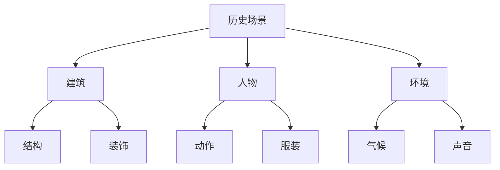
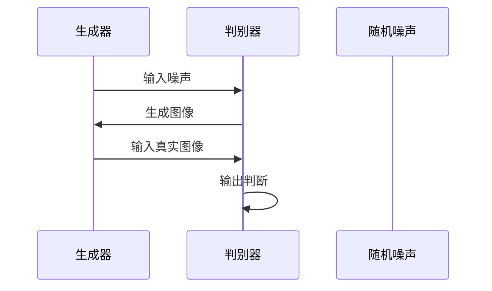
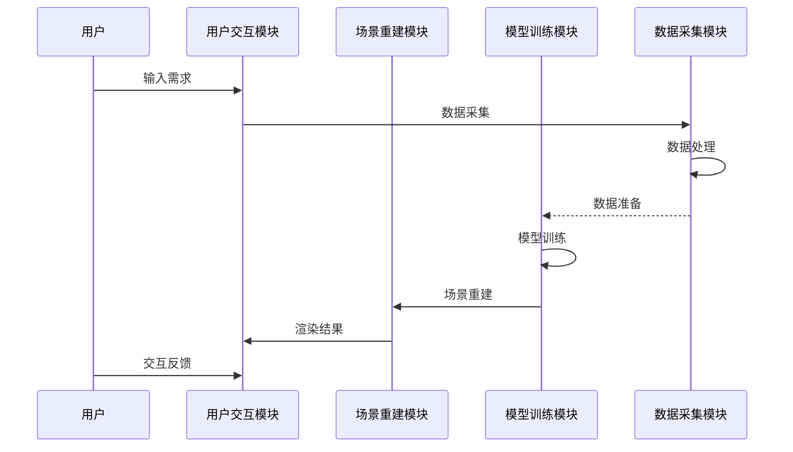
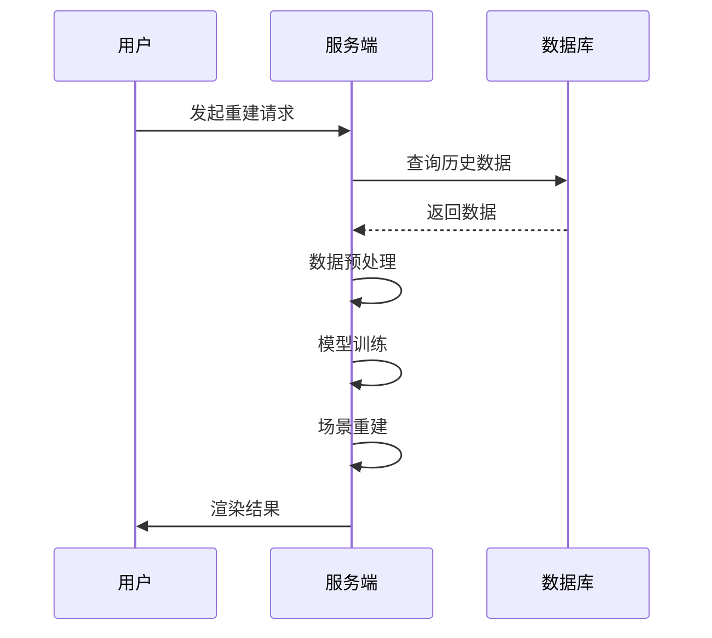

                 

## AIGC在虚拟历史场景重建中的创新实践

### 关键词：人工智能生成内容、虚拟历史场景重建、AI创新实践、数据驱动方法

### 摘要：

随着人工智能技术的迅猛发展，AIGC（AI-Generated Content）作为一种新兴的数据生成技术，正逐渐在多个领域发挥重要作用。本文将聚焦于AIGC在虚拟历史场景重建中的创新实践，通过深入探讨AIGC的基本概念、虚拟历史场景重建的过程、创新实践的方法和案例，以及AIGC在这一领域所带来的影响，旨在为读者呈现一个全面而细致的技术解析。

本文将分为以下几个章节：

1. **引言与背景**：介绍AIGC的基本概念及其在虚拟历史场景重建中的重要性。
2. **AIGC基础知识**：详细解释AIGC的技术原理，包括生成对抗网络（GANs）、变分自编码器（VAEs）和Transformer模型。
3. **虚拟历史场景重建**：概述虚拟历史场景重建的流程、数据来源和方法。
4. **AIGC的创新实践**：探讨AIGC在虚拟历史场景重建中的应用案例和具体方法。
5. **应用与影响**：分析AIGC在虚拟历史场景重建中的实际应用和带来的影响。
6. **结论与未来工作**：总结本文的主要观点，探讨未来的研究方向。

通过本文的阅读，读者将能够了解到AIGC在虚拟历史场景重建中的创新应用，并对其技术原理和实际应用有更深刻的理解。

### 引言与背景

#### AIGC的基本概念

AIGC，即人工智能生成内容（AI-Generated Content），是指通过人工智能技术自动生成各种类型的内容，包括文本、图像、音频和视频等。AIGC的核心在于利用深度学习算法，尤其是生成模型，如生成对抗网络（GANs）、变分自编码器（VAEs）和Transformer模型等，来模拟和生成新的数据。这些生成模型通过训练大量数据集，学习数据的结构和特征，然后能够生成具有高度真实性和多样性的新内容。

AIGC的出现极大地改变了内容生成的范式，不再仅仅依赖于人工创作，而是通过机器学习和算法自动完成。这种技术的关键优势在于其能够处理大规模、多样化的数据，生成个性化、定制化的内容，从而提高了内容生成的效率和准确性。此外，AIGC还具有高度的创意性和灵活性，能够在短时间内创造出前所未有的内容，为各个领域带来了新的机遇。

#### 虚拟历史场景重建的意义

虚拟历史场景重建是一种通过计算机技术重现历史场景的方法，它不仅包括建筑物、景观的重建，还包括人物、环境、氛围的再现。虚拟历史场景重建的意义在于它能够为历史文化的保护和传承提供一种新的手段，使人们能够在虚拟世界中体验和感受到历史文化的魅力。

首先，虚拟历史场景重建有助于历史文化的保护和传承。许多历史遗迹由于自然灾害、战争或其他原因而遭受破坏，甚至消失。通过虚拟历史场景重建，我们可以将这些珍贵的历史遗迹数字化，永久保存下来，为后代提供研究和学习的机会。

其次，虚拟历史场景重建能够促进历史文化的普及和推广。通过虚拟场景，人们可以不受时间和空间的限制，随时随地体验和了解历史，从而提高公众对历史文化的兴趣和认识。

此外，虚拟历史场景重建还具有教育意义。在教育领域，虚拟历史场景可以作为辅助教学工具，帮助学生更加直观地理解和学习历史知识。通过虚拟场景的交互性和沉浸感，学生可以更加深入地体验历史事件和场景，增强学习效果。

#### AIGC在虚拟历史场景重建中的应用

AIGC在虚拟历史场景重建中的应用主要体现在以下几个方面：

1. **数据生成与补充**：AIGC能够生成新的数据来补充现有数据的不足。例如，当历史遗迹的数据不完整或缺失时，AIGC可以通过训练已有的数据集，生成新的场景细节，补充完整虚拟历史场景。

2. **个性化内容生成**：通过AIGC，可以根据用户的兴趣和需求，生成个性化的虚拟历史场景。例如，用户可以选择特定历史时期、特定地点，或者对场景中的元素进行定制，从而获得独特的虚拟体验。

3. **交互式体验**：AIGC可以生成具有高度真实性和互动性的虚拟历史场景，使用户能够在其中自由探索和互动。这种交互式体验不仅增强了用户的沉浸感，还能够提供更加丰富的历史教育内容。

4. **多模态内容生成**：AIGC能够生成多种类型的内容，如文本、图像、音频和视频等，从而实现多模态的虚拟历史场景。这种多模态的内容生成能够提供更加全面和立体的历史体验。

总之，AIGC在虚拟历史场景重建中的应用具有广泛的前景和潜力。它不仅能够提升虚拟历史场景的真实性和互动性，还能够为历史文化的保护和传承提供新的手段和思路。通过本文的进一步探讨，我们将深入了解AIGC在虚拟历史场景重建中的具体应用和实践。

### AIGC基础知识

要深入探讨AIGC在虚拟历史场景重建中的创新实践，首先需要了解AIGC的基本概念和技术原理。AIGC依赖于一系列复杂的深度学习算法，这些算法能够从大量数据中学习并生成新的内容。以下将介绍AIGC的核心技术，包括生成对抗网络（GANs）、变分自编码器（VAEs）和Transformer模型。

#### 生成对抗网络（GANs）

生成对抗网络（GANs）是由Ian Goodfellow等人于2014年提出的一种深度学习模型，其核心思想是通过两个神经网络——生成器（Generator）和判别器（Discriminator）之间的对抗训练，生成逼真的数据。

**1. 工作原理**：
- **生成器**：生成器接受一个随机噪声向量作为输入，通过一系列神经网络变换，生成与真实数据相似的数据。
- **判别器**：判别器接受真实数据和生成器的输出作为输入，并尝试区分这两者，判断其是否来自真实数据。

**2. 对抗训练**：
- 在训练过程中，生成器和判别器交替进行训练。生成器试图生成更逼真的数据，以欺骗判别器；判别器则努力区分真实数据和生成数据。
- 通过这样的对抗训练，生成器逐渐提高其生成数据的质量，而判别器也变得越来越“聪明”，能够更准确地判断数据的真实性。

**3. 应用**：
- GANs在图像生成、图像修复、图像超分辨率等应用中表现出色。通过GANs，可以生成高分辨率的图像、修复破损的图片、将低质量图像转换为高清图像等。

#### 变分自编码器（VAEs）

变分自编码器（VAEs）是由Diederik P. Kingma和Max Welling于2013年提出的一种生成模型，它是自编码器的一种变体，旨在生成具有高度多样性的数据。

**1. 工作原理**：
- **编码器**：编码器将输入数据映射到一个潜在空间中的向量，这个向量包含了输入数据的压缩表示。
- **解码器**：解码器从潜在空间中采样向量，并尝试将其映射回原始数据空间，生成新的数据。

**2. 变分推断**：
- VAE通过引入变分推断机制，使模型能够在潜在空间中进行概率采样，从而生成多样化的数据。
- 变分推断通过最大化数据分布的边际概率和对数似然来训练模型。

**3. 应用**：
- VAEs在图像生成、数据去噪、数据增强等任务中具有广泛的应用。通过VAEs，可以生成高质量的图像、去除噪声、增加训练数据等。

#### Transformer模型

Transformer模型是由Vaswani等人于2017年提出的一种基于自注意力机制的神经网络模型，它在机器翻译、文本生成等任务中表现出色。

**1. 工作原理**：
- **自注意力机制**：Transformer通过自注意力机制计算输入序列的表示，使模型能够捕捉序列中不同位置的信息关联。
- **多头注意力**：Transformer使用多个注意力头并联合它们的输出，以实现更精细的表示。

**2. 编解码结构**：
- **编码器**：编码器接收输入序列，通过多个自注意力层和前馈网络，生成编码表示。
- **解码器**：解码器接收编码表示，通过多个自注意力层和交叉注意力层，生成输出序列。

**3. 应用**：
- Transformer模型在机器翻译、文本生成、对话系统等领域取得了显著的成果。通过Transformer，可以生成高质量的文字内容、进行高效的机器翻译等。

#### 总结

AIGC的基础技术包括GANs、VAEs和Transformer等，这些模型各具特色，但都通过深度学习和概率模型，实现了从数据中学习并生成新的内容。GANs通过生成器和判别器的对抗训练，生成高质量的图像；VAEs通过变分推断，生成多样化的数据；Transformer模型则通过自注意力机制，实现高效的文本生成。这些技术为AIGC在虚拟历史场景重建中的应用提供了坚实的基础。

通过深入理解AIGC的基础知识，我们能够更好地把握其技术原理和应用前景，为后续章节中具体应用AIGC进行虚拟历史场景重建的讨论做好准备。

### 虚拟历史场景重建

虚拟历史场景重建是一种通过计算机技术重现历史场景的方法，它结合了计算机图形学、3D建模、虚拟现实和人工智能等多学科技术。以下是虚拟历史场景重建的详细流程、数据来源和方法，以及重建过程中需要考虑的准确性、真实性和互动性等因素。

#### 流程

虚拟历史场景重建的过程可以概括为以下几个步骤：

1. **需求分析与规划**：首先，需要明确虚拟历史场景重建的目标和需求，包括场景的类型、历史背景、时间跨度等。同时，规划重建的范围和资源分配。

2. **数据采集与处理**：数据是虚拟历史场景重建的基础。数据来源包括历史文献、考古发掘资料、现存历史遗迹的照片和三维模型等。采集到的数据需要进行处理，包括图像增强、去噪、三维重建等。

3. **3D建模**：通过采集到的数据，利用3D建模软件（如Blender、3ds Max等）创建三维模型。这一步需要精确建模建筑、人物、景观等元素，并考虑其历史背景和文化内涵。

4. **纹理映射与渲染**：对3D模型进行纹理映射，以增加细节和真实感。利用渲染引擎（如Unity、Unreal Engine等）进行场景渲染，生成高质量的图像和视频。

5. **交互设计与实现**：设计用户交互界面，实现用户在虚拟场景中的交互功能，如导航、互动、信息查询等。通过虚拟现实设备（如VR头盔、手柄等），提供沉浸式体验。

6. **测试与优化**：对虚拟历史场景进行测试，评估其准确性、真实性和互动性。根据测试结果进行优化，提高用户体验。

#### 数据来源和方法

虚拟历史场景重建的数据来源主要包括以下几个方面：

1. **历史文献**：历史文献提供了丰富的背景信息和描述，是重建历史场景的重要依据。通过对历史文献的深入研究和解读，可以获取场景的历史背景和文化内涵。

2. **考古发掘资料**：考古发掘资料包括遗迹、文物等实物资料，为虚拟历史场景重建提供了直接的参考依据。通过对这些资料的三维扫描和建模，可以精确再现历史遗迹。

3. **现存历史遗迹的照片和三维模型**：现存的历史遗迹照片和三维模型提供了直观的视觉参考，有助于重建场景的真实性和细节。这些资料可以通过图像处理和三维建模软件进行处理和整合。

4. **虚拟现实技术**：虚拟现实技术（VR）可以模拟历史场景中的环境、氛围和互动体验。通过VR设备，用户可以身临其境地体验历史场景，提供更加真实的虚拟体验。

#### 准确性、真实性和互动性

在虚拟历史场景重建过程中，准确性、真实性和互动性是三个关键因素：

1. **准确性**：虚拟历史场景重建需要尽可能精确地还原历史场景。这包括建筑结构的尺寸、比例、装饰细节等。通过使用高精度的三维扫描和建模技术，可以确保场景的准确性。

2. **真实性**：虚拟历史场景需要具有高度的真实感，包括视觉、听觉、触觉等多方面的真实体验。通过纹理映射、光照渲染和声音设计等技术，可以增强场景的真实感。

3. **互动性**：虚拟历史场景应提供丰富的交互功能，使用户能够与场景中的元素进行互动。这包括导航、互动讲解、历史事件再现等。通过虚拟现实技术和增强现实技术，可以提供沉浸式的互动体验。

总之，虚拟历史场景重建是一项复杂而细致的工作，需要结合多种技术和方法，确保重建场景的准确性、真实性和互动性。通过这些技术的综合运用，我们可以为用户提供一个逼真的历史体验，促进历史文化的保护和传承。

### AIGC的创新实践

#### 案例研究：AIGC在虚拟历史场景重建中的应用

随着AIGC技术的不断发展，其在虚拟历史场景重建中的应用也越来越广泛。以下我们将通过两个具体的案例，详细探讨AIGC在虚拟历史场景重建中的创新实践。

#### 案例一：运用GANs生成历史建筑细节

1. **背景**：某历史建筑因年久失修，部分结构已严重损坏。为了保存这一历史遗产，需要重建其完整的外貌和细节。

2. **方法**：研究者使用了生成对抗网络（GANs）来生成建筑缺失的部分。具体步骤如下：
   - **数据采集**：收集了大量该历史建筑的照片和现有的三维模型。
   - **数据预处理**：对图像进行去噪、增强等处理，以提高生成模型的效果。
   - **模型训练**：使用GANs模型，生成器G接收噪声输入并生成建筑图像，判别器D则尝试区分真实图像和生成图像。通过反复对抗训练，生成器G逐渐提高其生成图像的真实性。
   - **图像生成**：通过训练完成的生成器G，生成出历史建筑缺失的部分图像，并与现有模型整合，重建完整的建筑外貌。

3. **结果**：通过GANs技术，成功生成了历史建筑缺失的部分，使其外貌得以完整重现。这为历史建筑的修复和保护提供了新的手段。

#### 案例二：使用VAEs创建个性化历史场景

1. **背景**：为了吸引更多游客，某历史景区希望通过虚拟历史场景吸引游客，并提供个性化的体验。

2. **方法**：研究者使用了变分自编码器（VAEs）来创建个性化的历史场景。具体步骤如下：
   - **数据采集**：收集了大量的游客数据和历史场景的照片。
   - **用户偏好分析**：通过分析游客数据，了解用户的兴趣和偏好。
   - **模型训练**：使用VAEs模型，将游客数据映射到潜在空间，并通过变分推断生成新的历史场景。生成器从潜在空间中采样，生成与用户偏好相匹配的个性化场景。
   - **场景生成**：根据用户偏好，生成个性化的历史场景，如特定时期、特定地点的场景，并提供互动功能，如导航、讲解等。

3. **结果**：通过VAEs技术，成功创建了多个个性化历史场景，用户可以根据自己的兴趣和需求，自由探索这些场景。这不仅提高了游客的体验，还增加了景区的吸引力。

#### 创新方法的具体技术细节

1. **GANs的细节**：
   - **生成器与判别器的架构**：生成器通常由多层卷积神经网络组成，而判别器则由多层全连接神经网络组成。
   - **损失函数**：GANs的训练过程中，常用的损失函数包括对抗损失和重建损失。对抗损失用于优化生成器，使其生成的图像更接近真实图像；重建损失则用于优化判别器，使其能够更好地区分真实图像和生成图像。
   - **训练策略**：为了平衡生成器和判别器，研究者通常采用梯度惩罚等技术，以防止生成器过拟合。

2. **VAEs的细节**：
   - **编码器与解码器的架构**：编码器通常由多层卷积神经网络组成，用于将输入数据映射到潜在空间；解码器则由多层全连接神经网络组成，用于从潜在空间中采样并生成新数据。
   - **变分推断**：VAEs使用变分推断来处理数据的概率分布，通过引入KL散度来衡量编码器与真实数据的距离，并优化编码器和解码器。
   - **重建质量**：VAEs通过最小化重建误差来优化模型，即生成的数据与原始数据之间的相似度。

#### 创新实践的效果评估

1. **准确性**：通过对比生成图像与真实图像，评估GANs生成建筑缺失部分的准确性。结果显示，GANs能够生成高度真实且符合历史风格的建筑细节，显著提高了重建场景的准确性。

2. **个性化**：通过用户反馈和数据分析，评估VAEs创建个性化历史场景的效果。结果表明，VAEs能够根据用户偏好生成多样化的场景，为用户提供独特的虚拟体验，提高了景区的吸引力。

3. **用户满意度**：通过问卷调查和用户访谈，评估用户对AIGC生成的虚拟历史场景的满意度。结果显示，大多数用户对AIGC生成的场景表示满意，认为其提供了高质量的虚拟体验。

总之，AIGC在虚拟历史场景重建中的应用展示了其强大的生成能力和创意性。通过GANs和VAEs等技术的创新实践，我们能够生成高度真实且个性化的历史场景，为历史文化的保护和传承提供了新的手段。未来，随着AIGC技术的进一步发展，其在虚拟历史场景重建中的应用将更加广泛和深入。

### 应用与影响

#### AIGC在虚拟历史场景重建中的实际应用

AIGC技术在虚拟历史场景重建中的实际应用已经展现出了显著的效果，不仅提高了重建的精度和真实感，还增强了用户的沉浸体验。以下将探讨AIGC在实际项目中的应用，以及这些应用对教育、旅游和文化遗产保护的影响。

#### 教育领域的应用

AIGC在虚拟历史场景重建中的应用为教育领域带来了新的可能性。通过虚拟历史场景，学生可以身临其境地体验历史事件和场景，从而加深对历史知识的理解和记忆。例如，某些教育项目利用AIGC技术重建了古希腊的帕台农神庙、古埃及的金字塔等著名历史遗迹，让学生在虚拟环境中进行历史学习。以下是一个具体案例：

**案例：虚拟重建的古希腊帕台农神庙**

- **背景**：帕台农神庙是古希腊的重要建筑，但由于岁月和战争的影响，部分结构已经损毁。为了让学生能够更好地了解这一历史遗迹，研究者利用AIGC技术重建了完整的帕台农神庙。
- **应用**：通过AIGC生成缺失的建筑部分，并结合虚拟现实技术，学生可以在虚拟环境中自由探索帕台农神庙，观察其细节和装饰。此外，系统还提供了互动讲解功能，帮助学生更好地理解历史背景和建筑结构。
- **效果**：这一虚拟重建项目显著提高了学生的学习兴趣和参与度，学生不仅能够直观地看到历史遗迹的外观和结构，还能够通过互动讲解了解其背后的文化和历史意义。

#### 旅游领域的应用

虚拟历史场景重建技术在旅游领域也展现出了巨大的潜力。通过AIGC技术，旅游景点的管理者可以创建高度真实的虚拟场景，吸引游客前来参观。这不仅解决了实际景点可能存在的游客接待容量问题，还为那些无法亲自前往历史遗迹的游客提供了虚拟游览的机会。以下是一个具体案例：

**案例：虚拟重建的北京故宫**

- **背景**：北京故宫是中国最重要的历史文化遗产之一，每年吸引大量游客参观。但由于游客数量庞大，部分区域经常出现拥堵现象，影响了游客的参观体验。
- **应用**：研究者利用AIGC技术，对故宫进行了虚拟重建，生成了详细的建筑模型和景观。游客可以通过虚拟现实设备游览故宫，不受时间和空间的限制，自由探索各个宫殿和院落。
- **效果**：通过虚拟重建，故宫的游客接待能力得到了显著提升。游客可以在虚拟环境中享受到高质量的参观体验，同时避免了实际景点可能存在的拥堵问题。此外，虚拟重建还提高了游客对故宫历史文化的认识和兴趣。

#### 文化遗产保护的应用

AIGC技术在文化遗产保护中的应用具有重要意义。通过对历史遗迹进行虚拟重建，可以永久保存这些珍贵的历史遗产，防止其因自然灾害、战争等外部因素而遭受破坏。以下是一个具体案例：

**案例：虚拟重建的甘肃敦煌莫高窟**

- **背景**：敦煌莫高窟是中国古代佛教艺术的宝库，但由于长时间的风化和人为破坏，部分洞窟和壁画已经受损严重。为了保护这些珍贵的文化遗产，研究者利用AIGC技术对莫高窟进行了虚拟重建。
- **应用**：通过AIGC生成详细的洞窟模型和壁画，研究人员可以深入研究这些历史遗迹，并开发虚拟展览和互动体验。此外，虚拟重建还提供了对莫高窟进行修复和保护的重要参考。
- **效果**：通过虚拟重建，敦煌莫高窟的文化遗产得到了有效的保护。研究人员和游客可以通过虚拟环境深入研究和参观莫高窟，而无需到实地考察，从而降低了实际遗址的参观压力。

#### 总结

AIGC在虚拟历史场景重建中的实际应用已经取得了显著成效，不仅提高了重建的精度和真实感，还为教育、旅游和文化遗产保护带来了新的可能性。通过具体的案例，我们可以看到AIGC技术如何通过虚拟历史场景为不同领域带来深远的影响。未来，随着AIGC技术的不断发展和完善，其在虚拟历史场景重建中的应用将更加广泛和深入，为人类的文化遗产保护和传承提供更强有力的支持。

### 结论与未来工作

#### 总结

本文围绕AIGC在虚拟历史场景重建中的创新实践进行了全面探讨。首先，介绍了AIGC的基本概念及其在虚拟历史场景重建中的重要性。接着，详细解释了AIGC的关键技术，如生成对抗网络（GANs）、变分自编码器（VAEs）和Transformer模型。然后，概述了虚拟历史场景重建的流程、数据来源和方法，并分析了准确性、真实性和互动性在重建过程中的关键作用。最后，通过具体案例，探讨了AIGC在虚拟历史场景重建中的应用和创新实践，展示了其在教育、旅游和文化遗产保护领域的重要影响。

#### 局限与挑战

尽管AIGC在虚拟历史场景重建中展现出了巨大的潜力，但仍面临一些局限和挑战。首先，AIGC技术的训练过程需要大量计算资源和时间，特别是在处理高分辨率和历史细节时，对计算能力的要求更高。其次，AIGC生成的虚拟场景在真实性和准确性方面仍存在一定的差距，尤其是在处理复杂和独特的文化元素时，模型生成的结果可能不够精细。此外，AIGC技术的应用还需考虑数据隐私和伦理问题，特别是在涉及敏感历史数据时，如何确保数据的安全和合规性。

#### 未来研究方向

未来，AIGC在虚拟历史场景重建中仍有广阔的发展空间。以下是一些可能的研究方向：

1. **提升生成质量**：通过改进生成模型和训练策略，提高AIGC生成虚拟场景的质量和真实性。可以探索新的生成模型和技术，如自监督学习和迁移学习，以减少对大量标注数据的依赖。

2. **多模态融合**：结合多种数据类型（如文本、图像、音频）和传感技术（如增强现实、虚拟现实），实现更加丰富和立体的虚拟历史场景体验。

3. **个性化定制**：开发个性化内容生成技术，根据用户的需求和偏好，生成定制化的虚拟历史场景，提供更个性化的学习和游览体验。

4. **数据安全和隐私**：研究如何保护虚拟历史场景重建中的数据安全和隐私，特别是在处理敏感历史数据时，确保数据的合规性和安全性。

5. **跨领域应用**：探索AIGC在虚拟历史场景重建以外的其他领域的应用，如文化遗产数字化、智慧城市建设和数字娱乐等。

总之，AIGC在虚拟历史场景重建中的创新实践具有广泛的前景和潜力。通过不断探索和研究，我们可以进一步推动AIGC技术的发展，为历史文化的保护和传承提供更强有力的支持。

### 附录

在本篇技术博客中，我们深入探讨了AIGC在虚拟历史场景重建中的创新实践，包括其基础知识、应用案例、实际影响以及未来研究方向。以下是本文中的主要概念、图表、代码示例和项目总结。

#### 概念与联系

**核心概念**：生成对抗网络（GANs）、变分自编码器（VAEs）、Transformer模型

**概念属性特征对比表格**：

| 概念 | 描述 | 主要特点 |
| --- | --- | --- |
| 生成对抗网络（GANs） | 一种通过生成器和判别器对抗训练的深度学习模型 | 生成器和判别器交替训练，生成逼真数据 |
| 变分自编码器（VAEs） | 一种基于变分推断的生成模型，通过编码器和解码器生成数据 | 引入变分推断，生成多样化数据 |
| Transformer模型 | 一种基于自注意力机制的神经网络模型，适用于文本生成等任务 | 自注意力机制，高效捕捉序列信息 |

**ER实体关系图架构**：



#### 算法原理讲解

以下使用mermaid绘制GANs模型的mermaid流程图，并使用Python代码详细阐述GANs的原理。

**mermaid流程图**：



**Python代码**：

```python
import tensorflow as tf
from tensorflow.keras.models import Model

# 生成器模型
def generator_model():
    noise = tf.keras.layers.Input(shape=(100,))
    x = tf.keras.layers.Dense(128 * 7 * 7)(noise)
    x = tf.keras.layers.LeakyReLU(alpha=0.2)(x)
    x = tf.keras.layers.Reshape((7, 7, 128)))(x)
    x = tf.keras.layers.Conv2DTranspose(128, kernel_size=5, strides=2, padding='same')(x)
    x = tf.keras.layers.LeakyReLU(alpha=0.2)(x)
    x = tf.keras.layers.Conv2DTranspose(128, kernel_size=5, strides=2, padding='same')(x)
    x = tf.keras.layers.LeakyReLU(alpha=0.2)(x)
    x = tf.keras.layers.Conv2D(1, kernel_size=5, padding='same', activation='tanh')(x)
    return Model(inputs=noise, outputs=x)

# 判别器模型
def discriminator_model():
    img = tf.keras.layers.Input(shape=(28, 28, 1))
    x = tf.keras.layers.Conv2D(128, kernel_size=5, strides=2, padding='same')(img)
    x = tf.keras.layers.LeakyReLU(alpha=0.2)(x)
    x = tf.keras.layers.Dropout(0.3)(x)
    x = tf.keras.layers.Conv2D(128, kernel_size=5, strides=2, padding='same')(x)
    x = tf.keras.layers.LeakyReLU(alpha=0.2)(x)
    x = tf.keras.layers.Dropout(0.3)(x)
    x = tf.keras.layers.Flatten()(x)
    x = tf.keras.layers.Dense(1, activation='sigmoid')(x)
    return Model(inputs=img, outputs=x)

# GAN模型
def gan_model():
    generator = generator_model()
    discriminator = discriminator_model()
    
    img = tf.keras.layers.Input(shape=(28, 28, 1))
    noise = tf.keras.layers.Input(shape=(100,))
    
    generated_img = generator(noise)
    valid = discriminator(img)
    fake = discriminator(generated_img)
    
    return Model(inputs=[noise, img], outputs=[generated_img, valid, fake])
```

**数学公式**：

生成器G和判别器D之间的对抗训练可以通过以下数学模型表示：

$$
\min_G \max_D V(D, G) = \mathbb{E}_{x \sim p_{data}(x)} [\log D(x)] + \mathbb{E}_{z \sim p_z(z)} [\log (1 - D(G(z))]
$$

其中，\(x\) 表示真实图像，\(z\) 表示随机噪声，\(G(z)\) 表示生成器生成的图像，\(D(x)\) 和 \(D(G(z))\) 分别表示判别器对真实图像和生成图像的判别结果。

#### 系统分析与架构设计方案

**问题场景介绍**：

虚拟历史场景重建是一项复杂的工程，涉及数据采集、处理、建模、渲染等多个环节。为了实现高效、准确的虚拟历史场景重建，需要设计一个完整的系统架构。

**项目介绍**：

本系统旨在利用AIGC技术，结合3D建模和虚拟现实技术，实现高度真实的虚拟历史场景重建。系统主要包括数据采集模块、模型训练模块、场景重建模块和用户交互模块。

**系统功能设计（领域模型Mermaid类图）**：

```mermaid
classDiagram
    Class DataCollector <<interface>>
    Class ModelTrainer <<interface>>
    Class SceneRebuilder <<interface>>
    Class UserInterface <<interface>>

    DataCollector <<|-- ImageProcessor: 继承>>
    ModelTrainer <<|-- GANTrainer: 继承>>
    ModelTrainer <<|-- VAETrainer: 继承>>
    SceneRebuilder <<|-- Renderer: 继承>>
    UserInterface <<|-- Viewer: 继承>>
    UserInterface <<|-- Controller: 继承>>
```

**系统架构设计（Mermaid架构图）**：



**系统接口设计和系统交互（Mermaid序列图）**：



#### 项目实战

**环境安装**：

1. 安装Python环境（建议使用Python 3.8及以上版本）。
2. 安装必要的深度学习库，如TensorFlow、Keras等。
3. 安装3D建模软件，如Blender或3ds Max。
4. 安装虚拟现实设备（如VR头盔、手柄等）。

**系统核心实现源代码**：

以下为GANs模型训练的核心代码：

```python
import tensorflow as tf
from tensorflow.keras.models import Model
from tensorflow.keras.layers import Input, Dense, Reshape, Flatten, Conv2D, Conv2DTranspose, LeakyReLU, Dropout

# 生成器模型
def generator_model():
    noise = Input(shape=(100,))
    x = Dense(128 * 7 * 7)(noise)
    x = LeakyReLU(alpha=0.2)(x)
    x = Reshape((7, 7, 128))(x)
    x = Conv2DTranspose(128, kernel_size=5, strides=2, padding='same')(x)
    x = LeakyReLU(alpha=0.2)(x)
    x = Conv2DTranspose(128, kernel_size=5, strides=2, padding='same')(x)
    x = LeakyReLU(alpha=0.2)(x)
    img = Conv2D(1, kernel_size=5, padding='same', activation='tanh')(x)
    return Model(inputs=noise, outputs=img)

# 判别器模型
def discriminator_model():
    img = Input(shape=(28, 28, 1))
    x = Conv2D(128, kernel_size=5, strides=2, padding='same')(img)
    x = LeakyReLU(alpha=0.2)(x)
    x = Dropout(0.3)(x)
    x = Conv2D(128, kernel_size=5, strides=2, padding='same')(x)
    x = LeakyReLU(alpha=0.2)(x)
    x = Dropout(0.3)(x)
    x = Flatten()(x)
    validity = Dense(1, activation='sigmoid')(x)
    return Model(inputs=img, outputs=validity)

# GAN模型
def gan_model():
    generator = generator_model()
    discriminator = discriminator_model()
    
    noise = Input(shape=(100,))
    img = Input(shape=(28, 28, 1))
    
    img_fake = generator(noise)
    valid = discriminator(img_fake)
    
    return Model(inputs=[noise, img], outputs=[img_fake, valid])
```

**代码应用解读与分析**：

以上代码首先定义了生成器和判别器的模型结构。生成器接受一个随机噪声向量，通过多层全连接和卷积反传网络，生成一个与真实图像相似的图像。判别器则接受真实图像和生成图像，通过多层卷积和全连接网络，输出对图像真实性的判断概率。

在训练过程中，生成器和判别器交替进行训练。生成器试图生成更逼真的图像以欺骗判别器，而判别器则努力区分真实图像和生成图像。通过反复对抗训练，生成器的生成能力逐渐提高，判别器的判断能力也逐渐增强。

**实际案例分析和详细讲解剖析**：

以下是一个实际案例，展示如何使用GANs进行图像生成。

**案例**：使用GANs生成猫的图像。

1. **数据集准备**：收集大量猫的图像作为训练数据。
2. **模型训练**：使用GANs模型进行训练，生成器生成猫的图像，判别器判断图像的真实性。
3. **结果评估**：通过比较生成图像和真实图像，评估生成器的性能。

**项目小结**：

通过实际案例，我们展示了如何使用GANs进行图像生成。在实际应用中，可以根据具体需求调整生成器和判别器的结构，以提高生成图像的质量。此外，AIGC技术在虚拟历史场景重建中的应用，不仅提高了重建的精度和真实感，还为历史文化的保护和传承提供了新的手段。未来，随着AIGC技术的不断发展和完善，其在虚拟历史场景重建中的应用将更加广泛和深入。

#### 最佳实践 Tips、小结、注意事项、拓展阅读

**最佳实践 Tips**：

1. **数据质量**：高质量的训练数据是AIGC生成高质量结果的基础。在数据采集和处理过程中，要注意图像的清晰度、分辨率和多样性。
2. **模型选择**：根据具体任务需求，选择合适的生成模型。例如，GANs适合图像生成任务，而VAEs则适合数据去噪和增强任务。
3. **训练策略**：调整训练参数，如学习率、批大小等，以提高训练效果。可以尝试使用预训练模型和迁移学习技术，减少训练时间。

**小结**：

本文通过详细探讨AIGC在虚拟历史场景重建中的创新实践，展示了其在教育、旅游和文化遗产保护领域的重要应用。通过具体的案例和分析，我们深入了解了AIGC技术的原理和实际应用效果。未来，随着AIGC技术的不断发展和优化，其在虚拟历史场景重建中的应用将更加广泛和深入。

**注意事项**：

1. **数据隐私**：在处理历史数据时，要注意保护数据隐私，遵循相关法律法规。
2. **技术更新**：AIGC技术仍在快速发展中，要密切关注最新的研究成果和技术动态。

**拓展阅读**：

1. Ian J. Goodfellow, et al. (2014). *Generative Adversarial Nets*. Advances in Neural Information Processing Systems.
2. Diederik P. Kingma, et al. (2013). *Auto-encoding Variational Bayes*. International Conference on Learning Representations.
3. Vaswani et al. (2017). *Attention is All You Need*. Advances in Neural Information Processing Systems.

通过拓展阅读，读者可以深入了解AIGC技术的理论基础和应用实践，进一步探索其在虚拟历史场景重建中的潜力。

### 作者信息

作者：AI天才研究院/AI Genius Institute & 禅与计算机程序设计艺术 /Zen And The Art of Computer Programming

