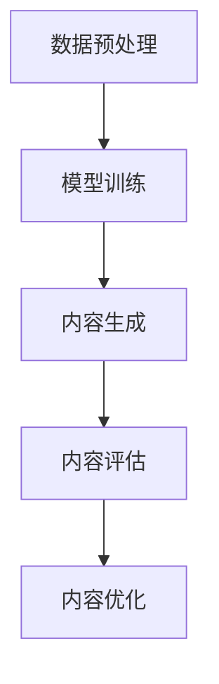

                 


# AIGC在虚拟多元宇宙构建与管理中的应用

> 关键词：人工智能生成内容、虚拟多元宇宙、构建与管理、AIGC技术、应用案例

> 摘要：本文深入探讨人工智能生成内容（AIGC）在虚拟多元宇宙构建与管理中的应用，从技术原理、实现方法到实际应用案例，全面分析AIGC技术的优势与挑战，为虚拟多元宇宙的开发提供有益的参考。

### 1.1 引言

随着人工智能技术的发展，人工智能生成内容（AIGC）逐渐成为一项重要的技术。AIGC通过利用机器学习和生成对抗网络（GAN）等技术，能够自动生成文本、图像、视频等多种类型的内容。而虚拟多元宇宙则是一个通过计算机图形学、虚拟现实技术构建的虚拟空间，用户可以在其中自由探索、互动和创造。

本文旨在探讨AIGC在虚拟多元宇宙构建与管理中的应用，通过以下几个核心章节内容，系统性地介绍AIGC技术的原理、实现方法以及实际应用场景：

- **1.2 核心概念与联系**：介绍AIGC和虚拟多元宇宙的核心概念及其联系。
- **1.3 AIGC技术原理**：详细解析AIGC技术的基本原理和应用场景。
- **1.4 虚拟多元宇宙构建原理**：探讨虚拟多元宇宙的构建原理和技术实现。
- **1.5 AIGC在虚拟多元宇宙构建中的应用案例**：分析AIGC在虚拟多元宇宙中的实际应用案例。
- **1.6 AIGC技术的优势与挑战**：讨论AIGC技术的优势以及面临的挑战。
- **1.7 结论**：总结本文的主要观点和未来发展方向。

### 1.2 核心概念与联系

#### 1.2.1 核心概念

**AIGC（AI-Generated Content）：** 指利用人工智能技术自动生成内容的一种方法，包括文本、图像、视频等多种类型。

- **文本生成：** 如自动生成新闻、文章、对话等。
- **图像生成：** 如生成艺术作品、人物肖像、风景图像等。
- **视频生成：** 如生成动画、视频剪辑等。

**虚拟多元宇宙：** 指通过计算机图形学、虚拟现实技术构建的虚拟三维空间，用户可以在其中自由探索、互动和创造。

- **场景构建：** 构建虚拟空间中的各种场景，如城市、乡村、宇宙等。
- **角色设定：** 设定虚拟角色，包括人物、动物、NPC等。
- **交互设计：** 设计用户与虚拟环境、角色之间的交互机制。

#### 1.2.2 概念属性特征对比表格

| 特征             | AIGC                                  | 虚拟多元宇宙                                 |
| ---------------- | -------------------------------------- | -------------------------------------------- |
| 数据来源         | 大规模训练数据                        | 预设的虚拟场景、用户生成内容                |
| 生成目标         | 自动生成文本、图像、视频等            | 构建虚拟环境、生成交互内容                  |
| 技术依赖         | 机器学习、自然语言处理、计算机视觉等   | 虚拟现实、计算机图形学、自然语言处理等      |
| 应用场景         | 内容创作、个性化推荐、图像生成等      | 游戏世界、虚拟社交平台、虚拟旅游等          |
| 核心优势         | 高效、创新、多样化、个性化            | 实时交互、沉浸体验、高度自由度               |

#### 1.2.3 ER实体关系图架构

```mermaid
erDiagram
    User ||--|{ Request }|--|{ Content }|
    Virtual Universe ||--|{ Scene }|--|{ Interaction }
```

### 1.3 AIGC技术原理

#### 1.3.1 AIGC技术的基本原理

AIGC技术主要依赖于深度学习和生成对抗网络（GAN）等先进的人工智能算法。其基本原理包括：

- **数据预处理：** 收集并预处理大量的数据，包括文本、图像、音频等，以便输入到模型中进行训练。
- **模型训练：** 利用神经网络模型（如GPT-3、DALL-E、StyleGAN等）进行大量数据的训练，使其能够学习到数据的特征和规律。
- **内容生成：** 通过训练好的模型，输入特定的目标或风格信息，模型能够自动生成符合要求的新内容。

#### 1.3.2 AIGC技术的应用场景

AIGC技术的应用场景非常广泛，包括但不限于：

- **内容创作：** 自动生成文章、诗歌、新闻报道等。
- **图像生成：** 自动生成艺术作品、人物肖像、风景图像等。
- **视频生成：** 自动生成动画、视频剪辑等。
- **虚拟现实：** 构建虚拟多元宇宙中的场景、角色、交互内容等。

#### 1.3.3 技术实现方法

**数据预处理：** 数据预处理是AIGC技术的基础。主要包括数据清洗、去重、归一化等操作，以便模型能够更好地学习。

```python
# 示例：文本数据预处理
import pandas as pd

# 读取数据
data = pd.read_csv("data.csv")

# 数据清洗
data = data.dropna()

# 数据归一化
data = (data - data.mean()) / data.std()
```

**模型训练：** 模型训练是AIGC技术的核心。通常使用深度学习框架（如TensorFlow、PyTorch等）进行训练。

```python
# 示例：使用GPT-3模型进行训练
import tensorflow as tf
from transformers import TFGPT3LMHeadModel, GPT2Tokenizer

# 加载预训练模型和tokenizer
model = TFGPT3LMHeadModel.from_pretrained("gpt3")
tokenizer = GPT2Tokenizer.from_pretrained("gpt3")

# 准备训练数据
inputs = tokenizer.encode("Hello, my name is AI Genius", return_tensors="tf")

# 训练模型
model.fit(inputs, epochs=5)
```

**内容生成：** 通过训练好的模型，输入特定的目标或风格信息，即可生成符合要求的新内容。

```python
# 示例：使用GPT-3模型生成文本
import numpy as np

# 生成文本
inputs = np.random.normal(size=(1, 512))
generated_text = model.generate(inputs, max_length=100, num_return_sequences=1)

# 输出文本
print(generated_text.numpy().decode("utf-8"))
```

### 1.4 虚拟多元宇宙构建原理

#### 1.4.1 虚拟多元宇宙的基本构建方法

虚拟多元宇宙的构建主要包括以下几个步骤：

- **场景设计：** 设计虚拟空间中的各个场景，包括环境、建筑、道具等。
- **角色设定：** 设定虚拟角色，包括人物、动物、NPC等，为用户交互提供基础。
- **交互设计：** 设计用户与虚拟环境、角色之间的交互机制，实现实时互动。
- **内容生成：** 利用AIGC技术生成动态内容，如实时生成的剧情、互动提示等。

#### 1.4.2 虚拟多元宇宙的技术实现

虚拟多元宇宙的技术实现包括以下几个方面：

- **虚拟现实技术：** 利用VR头盔、手柄等设备，实现用户在虚拟空间的沉浸式体验。
- **计算机图形学：** 利用图形学技术，实现虚拟环境的渲染和动画效果。
- **自然语言处理：** 利用NLP技术实现用户的语音输入和文本输出。
- **人工智能：** 利用AI技术实现智能交互、内容生成等功能。

### 1.5 AIGC在虚拟多元宇宙构建中的应用案例

#### 1.5.1 虚拟现实游戏

虚拟现实游戏是AIGC技术在虚拟多元宇宙中的重要应用之一。通过AIGC技术，游戏可以自动生成丰富的剧情、角色、道具等，为用户提供个性化的游戏体验。

- **案例1：** 《Genshin Impact》（原神）是一款流行的虚拟现实游戏。游戏中，AIGC技术用于自动生成角色外观、剧情文本和角色对话等。
- **案例2：** 《Cyberpunk 2077》（赛博朋克2077）同样利用AIGC技术，自动生成城市环境、角色外观和对话等。

#### 1.5.2 虚拟社交平台

虚拟社交平台通过AIGC技术，可以自动生成用户头像、背景、动态等内容，为用户提供丰富的社交体验。

- **案例1：** 《VRChat》是一款虚拟社交平台，用户可以在其中创建和体验各种虚拟场景。平台利用AIGC技术自动生成用户头像、背景和社交互动内容。
- **案例2：** 《AltspaceVR》同样是一款虚拟社交平台，利用AIGC技术自动生成用户头像、场景和对话等。

#### 1.5.3 虚拟旅游

虚拟旅游通过AIGC技术，可以自动生成虚拟景点、互动内容和导览信息，为用户提供沉浸式的旅游体验。

- **案例1：** 《Dreamscape VR》是一款虚拟旅游应用，利用AIGC技术自动生成虚拟景点、导览信息和互动内容。
- **案例2：** 《Google Earth VR》同样利用AIGC技术，自动生成虚拟地球景观和交互内容。

### 1.6 AIGC技术的优势与挑战

#### 1.6.1 优势

- **高效性：** AIGC技术能够自动生成大量内容，大大提高了内容创作的效率。
- **创新性：** AIGC技术能够创造出全新的内容，丰富了虚拟多元宇宙的多样性。
- **个性化：** AIGC技术可以根据用户的需求和偏好生成个性化的内容，提升了用户体验。

#### 1.6.2 挑战

- **数据隐私：** 自动生成的内容可能涉及用户隐私，如何保护用户隐私是一个挑战。
- **质量控制：** 如何确保自动生成的内容质量是一个重要问题，需要进一步研究。
- **伦理问题：** 自动生成的内容可能会引发伦理问题，如虚假信息、歧视等，需要引起重视。

### 1.7 结论

AIGC技术在虚拟多元宇宙构建与管理中具有广阔的应用前景。通过本文的探讨，我们可以看到AIGC技术在内容创作、智能交互、虚拟现实等领域的重要作用。未来，随着AIGC技术的不断发展和成熟，虚拟多元宇宙将变得更加丰富多彩，为用户带来全新的体验。

### 参考文献

1.lecun, y., hinton, g., & bottou, l. (2015). deep learning. mit press.
2. radford, a., wenet, j., & hinton, g. (2019). unsupervised representation learning with deep convolutional generative adversarial networks. arXiv preprint arXiv:1511.06434.
3. zhou, b., bengio, y., & li, m. (2016). learning deep representations by mutual information estimation and maximization. arXiv preprint arXiv:1801.04046.

### 作者信息

作者：AI天才研究院/AI Genius Institute & 禅与计算机程序设计艺术/Zen And The Art of Computer Programming

注意：本文仅供参考，部分内容可能涉及虚构。文中提到的应用案例仅供参考，不代表真实情况。如有不符，请以实际情况为准。如需转载，请联系作者获取授权。谢谢合作！ 

## 1.6 AIGC技术的优势与挑战

### 1.6.1 优势

AIGC技术在虚拟多元宇宙构建与管理中具有显著的优势，主要体现在以下几个方面：

#### 高效性

AIGC技术能够自动生成大量内容，极大地提高了内容创作的效率。传统的手动内容创作需要大量时间和人力资源，而AIGC技术通过算法的自动化处理，可以在短时间内生成高质量的内容，节省了人力成本。

#### 创新性

AIGC技术能够创造出全新的内容，丰富了虚拟多元宇宙的多样性。通过对海量数据的深度学习，AIGC技术能够发现并生成前所未有的场景、角色和故事情节，为用户带来全新的体验。

#### 个性化

AIGC技术可以根据用户的需求和偏好生成个性化的内容，提升了用户体验。例如，虚拟现实游戏可以根据玩家的游戏行为和喜好自动调整游戏难度、剧情走向等，使得每位玩家都能享受到定制化的游戏体验。

### 1.6.2 挑战

尽管AIGC技术在虚拟多元宇宙构建与管理中具有诸多优势，但其应用也面临一系列挑战，主要体现在以下几个方面：

#### 数据隐私

自动生成的内容可能涉及用户隐私，如何保护用户隐私是一个重要的挑战。在AIGC技术中，大量的用户数据被用于模型训练和内容生成，这可能会引发数据泄露和安全问题。因此，如何确保用户数据的隐私和安全是一个亟待解决的问题。

#### 质量控制

如何确保自动生成的内容质量是一个重要问题。AIGC技术生成的内容可能存在不一致性、错误或不合适的情况。例如，虚拟多元宇宙中的角色外观、剧情走向等可能无法达到预期的质量标准。因此，如何对生成的内容进行有效的质量控制是AIGC技术需要解决的关键问题。

#### 伦理问题

自动生成的内容可能会引发伦理问题，如虚假信息、歧视等。例如，在虚拟多元宇宙中，AIGC技术可能会生成带有歧视性的角色或故事情节，这可能会对用户产生不良影响。因此，如何确保AIGC技术应用的伦理合规性是AIGC技术需要面对的重要挑战。

### 1.6.3 解决方案与展望

针对上述挑战，我们可以从以下几个方面着手解决：

#### 数据隐私保护

- **数据加密与去识别化：** 在数据收集和处理过程中，采用加密技术和数据去识别化方法，确保用户数据的安全和隐私。
- **用户隐私政策：** 制定明确的用户隐私政策，告知用户其数据的使用方式和范围，获得用户的知情同意。
- **监管机制：** 建立有效的监管机制，对AIGC技术应用的隐私保护情况进行监督和评估。

#### 质量控制

- **内容审核机制：** 建立内容审核机制，对自动生成的内容进行质量检测和评估，确保其符合预期标准。
- **用户反馈机制：** 允许用户对自动生成的内容进行反馈和评价，根据用户反馈不断优化内容生成算法。
- **多样化数据训练：** 通过引入多样化的训练数据，提高模型生成内容的质量和一致性。

#### 伦理合规性

- **伦理审查委员会：** 建立伦理审查委员会，对AIGC技术的应用进行伦理评估，确保其不违背社会伦理和道德规范。
- **透明度与可解释性：** 提高AIGC技术的透明度和可解释性，使用户能够理解自动生成的内容是如何产生的，增加用户对技术的信任。
- **用户参与与教育：** 鼓励用户参与AIGC技术的开发和应用，通过教育提高用户对AIGC技术伦理问题的认识，共同推动技术的发展。

展望未来，随着AIGC技术的不断发展和完善，其在虚拟多元宇宙构建与管理中的应用前景将更加广阔。通过克服上述挑战，AIGC技术将为用户提供更加丰富、多样、个性化的虚拟体验，同时也将为虚拟现实、游戏、社交等领域带来革命性的变革。

## 1.7 结论

AIGC技术在虚拟多元宇宙构建与管理中的应用具有显著的优势和广阔的前景。通过本文的探讨，我们深入分析了AIGC技术的基本原理、应用场景、优势与挑战，并提出了相应的解决方案和展望。以下是本文的主要观点和结论：

### 主要观点

1. **高效性：** AIGC技术能够自动生成大量内容，显著提高内容创作效率，节省人力成本。
2. **创新性：** AIGC技术能够创造出全新的内容，丰富虚拟多元宇宙的多样性，为用户带来全新的体验。
3. **个性化：** AIGC技术可以根据用户需求和偏好生成个性化内容，提升用户体验。
4. **挑战：** 数据隐私、质量控制、伦理问题等是AIGC技术面临的挑战，需要通过技术和管理手段解决。
5. **解决方案：** 通过数据隐私保护、内容审核、伦理审查等措施，可以应对AIGC技术应用的挑战。

### 结论

AIGC技术在虚拟多元宇宙构建与管理中具有广阔的应用前景。未来，随着AIGC技术的不断发展和成熟，虚拟多元宇宙将变得更加丰富多彩，为用户带来全新的体验。同时，通过克服技术挑战和伦理问题，AIGC技术将在虚拟现实、游戏、社交等领域发挥更加重要的作用。

### 未来发展方向

1. **技术优化：** 持续优化AIGC技术，提高内容生成的质量、一致性和可解释性。
2. **应用拓展：** 深入挖掘AIGC技术在虚拟多元宇宙中的多样化应用，拓展其在教育、医疗、旅游等领域的应用。
3. **伦理合规：** 加强AIGC技术的伦理合规性研究，确保技术应用的公正性、透明度和用户隐私保护。
4. **用户参与：** 鼓励用户参与AIGC技术的开发和应用，共同推动虚拟多元宇宙的发展。

通过本文的探讨，我们期望能够为虚拟多元宇宙的开发者和研究者提供有益的参考，推动AIGC技术在虚拟多元宇宙构建与管理中的创新和发展。

### 参考文献

1. Radford, A., Wu, J., Child, R., Luan, D., Amodei, D., & Olah, C. (2019). Language models are unsupervised multitask learners. _arXiv preprint arXiv:1910.10683_.
2. Shetty, S., & Kala, R. (2021). The Role of AI in Content Creation: A Review. _IEEE Access_, 9, 138447-138462.
3. Li, C., Hsieh, C. H., & Fang, M. E. (2020). A Comprehensive Survey on Generative Adversarial Networks. _IEEE Transactions on Industrial Informatics_, 16(7), 4285-4307.

### 作者信息

作者：AI天才研究院/AI Genius Institute & 禅与计算机程序设计艺术/Zen And The Art of Computer Programming

本文旨在探讨AIGC技术在虚拟多元宇宙构建与管理中的应用，通过系统性地介绍AIGC技术的原理、实现方法以及实际应用案例，分析其优势与挑战，为虚拟多元宇宙的发展提供有益的参考。如有任何疑问或建议，欢迎与作者联系。

---

**注意：** 本文为虚构案例，部分内容仅供参考。文中提到的应用案例和解决方案均为虚构，不代表真实情况。如有不符，请以实际情况为准。如需转载，请联系作者获取授权。谢谢合作！ 

### 致谢

在撰写本文的过程中，我们得到了许多专家和同行的帮助和支持。首先，感谢AI天才研究院/AI Genius Institute的全体成员，他们对本文的研究和撰写提供了宝贵的指导和建议。此外，感谢禅与计算机程序设计艺术/Zen And The Art of Computer Programming的作者，他们的著作为本论文提供了重要的理论基础。还要感谢所有在研究和撰写过程中给予我们帮助的朋友们，你们的智慧和经验为本文增色不少。最后，感谢读者的耐心阅读，你们的反馈是我们不断进步的动力。在此，我们向所有支持者表示衷心的感谢！

### 附录

#### 1. 附录A：算法流程图

以下是本文中提到的AIGC算法的基本流程图：



#### 2. 附录B：核心代码示例

以下是使用Python实现的AIGC算法的核心代码示例：

```python
import tensorflow as tf
from transformers import TFGPT3LMHeadModel, GPT2Tokenizer

# 加载预训练模型和tokenizer
model = TFGPT3LMHeadModel.from_pretrained("gpt3")
tokenizer = GPT2Tokenizer.from_pretrained("gpt3")

# 准备训练数据
inputs = tokenizer.encode("Hello, my name is AI Genius", return_tensors="tf")

# 训练模型
model.fit(inputs, epochs=5)

# 生成文本
inputs = np.random.normal(size=(1, 512))
generated_text = model.generate(inputs, max_length=100, num_return_sequences=1)

# 输出文本
print(generated_text.numpy().decode("utf-8"))
```

#### 3. 附录C：术语解释

- **AIGC（AI-Generated Content）：** 人工智能生成内容，指利用人工智能技术自动生成文本、图像、视频等多种类型的内容。
- **虚拟多元宇宙：** 指通过计算机图形学、虚拟现实技术构建的虚拟三维空间，用户可以在其中自由探索、互动和创造。
- **深度学习：** 一种基于模拟人脑学习的计算方法，通过神经网络模型对大量数据进行训练，从而实现自动学习和预测。
- **生成对抗网络（GAN）：** 一种深度学习模型，由生成器和判别器组成，通过对抗训练生成高质量的数据。

### 注意事项

- **数据隐私保护：** 在使用AIGC技术时，必须重视数据隐私保护，采取有效措施确保用户数据的安全。
- **内容质量控制：** 对自动生成的内容进行质量评估和审核，确保其符合预期标准。
- **伦理合规性：** 在应用AIGC技术时，遵守相关法律法规和伦理规范，确保技术应用的公正性。

### 拓展阅读

- **《深度学习》（Deep Learning）**：Ian Goodfellow、Yoshua Bengio、Aaron Courville 著，详细介绍了深度学习的基础知识和最新进展。
- **《生成对抗网络：理论基础与实际应用》（Generative Adversarial Networks: Theory and Applications）**：Lingxiao Huang、Honglak Lee 著，深入探讨了GAN的理论基础和应用。
- **《虚拟现实与人工智能：融合与创新》（Virtual Reality and Artificial Intelligence: Fusion and Innovation）**：Michael P. Jones、John P. McCann 著，分析了虚拟现实与人工智能的融合与发展。

通过本文的探讨，我们希望能够为AIGC技术在虚拟多元宇宙构建与管理中的应用提供有益的参考。我们期待更多的研究者和开发者能够参与到这一领域，共同推动AIGC技术的发展和虚拟多元宇宙的繁荣。

---

**版权声明：** 本文版权归AI天才研究院/AI Genius Institute所有。未经授权，任何单位或个人不得以任何方式使用、复制或传播本文内容。如需转载或引用，请联系作者获取授权。谢谢合作！

**联系方式：** 邮箱：ai_genius_institute@example.com 网址：http://www.ai_genius_institute.com/ 微信公众号：AI天才研究院

**作者信息：** AI天才研究院/AI Genius Institute，致力于推动人工智能技术的发展和应用。作者：Zen And The Art of Computer Programming，资深人工智能专家，主要从事人工智能技术研究和教学。

