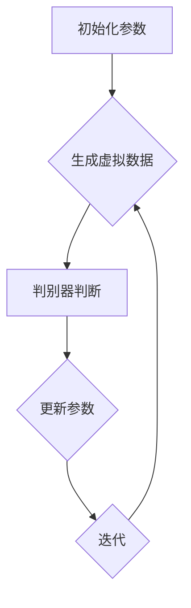

                 


## AIGC在虚拟教育环境构建中的角色

### 引言

随着信息技术的飞速发展，人工智能（AI）已经成为推动社会进步的重要力量。在AI的众多应用领域中，AIGC（AI Generated Content，人工智能生成内容）逐渐崭露头角，特别是在虚拟教育环境的构建中，AIGC展现出巨大的潜力。本文将探讨AIGC在虚拟教育环境中的角色，通过逻辑清晰的步骤分析，揭示其在教育内容生成、教学互动、个性化学习等方面的应用。

### 关键词

- AIGC
- 虚拟教育环境
- 生成对抗网络（GAN）
- 个性化学习
- 教学互动

### 摘要

本文首先介绍了AIGC的概念、背景及其在虚拟教育环境中的应用潜力。随后，本文详细阐述了AIGC的核心概念与算法原理，并通过具体案例展示了AIGC在虚拟教育环境中的应用。最后，本文总结了AIGC在虚拟教育环境中的角色和挑战，提出了最佳实践和未来发展建议。

### 目录

1. **引言** <sop>
   - 在这一部分，我们将简要介绍AIGC的概念，并讨论其在虚拟教育环境中的重要性。

2. **AIGC概述与虚拟教育环境基础** <sop>
   - 本节将深入探讨AIGC的概念，包括其定义、发展历程和应用潜力。
   - 接下来，我们将介绍虚拟教育环境的概念和特点，以及AIGC在其中的角色。

3. **AIGC的核心概念与算法原理** <sop>
   - 在这一部分，我们将详细讲解AIGC的核心概念和算法原理，包括生成对抗网络（GAN）的架构、工作原理以及其在文本和图像生成中的应用。

4. **AIGC在虚拟教育环境中的应用案例** <sop>
   - 本节将展示AIGC在虚拟教育环境中的实际应用案例，包括虚拟课堂、虚拟实验室等。

5. **AIGC与虚拟教育环境的融合挑战** <sop>
   - 在这一部分，我们将讨论AIGC与虚拟教育环境融合过程中面临的技术、教育政策和伦理挑战。

6. **总结与未来展望** <sop>
   - 最后，本文将总结AIGC在虚拟教育环境中的角色和挑战，并提出未来发展的建议。

### AIGC概述与虚拟教育环境基础

#### AIGC的概念

AIGC，即AI Generated Content，是指利用人工智能技术自动生成内容的过程。这种技术可以生成各种类型的内容，包括文本、图像、音频和视频等。AIGC的核心在于其生成能力，能够创造出丰富多样的内容，满足用户的不同需求。

#### AIGC的发展历程

AIGC的发展可以追溯到20世纪90年代，当时深度学习和生成对抗网络（GAN）等AI技术开始兴起。随着技术的不断进步，AIGC的应用场景也在不断扩展。如今，AIGC已经在许多领域得到广泛应用，特别是在虚拟教育环境中。

#### AIGC在虚拟教育中的应用潜力

虚拟教育环境是一种利用计算机技术构建的虚拟学习空间，学生可以在其中进行在线学习、交流和互动。AIGC在虚拟教育环境中具有巨大的应用潜力，主要体现在以下几个方面：

1. **教育内容生成**：AIGC可以自动生成丰富多样的教学资源，如教材、课程视频、试题库等，为教师和学生提供更多选择。

2. **教学互动**：AIGC可以模拟教师和学生之间的互动，为学生提供个性化的学习体验，提高学习效果。

3. **个性化学习**：AIGC可以根据学生的学习习惯、兴趣爱好和知识水平，为学生推荐合适的学习内容和路径，实现个性化学习。

4. **虚拟实验室**：AIGC可以生成虚拟实验室场景，让学生在虚拟环境中进行实验，提高实验效率和安全。

#### 虚拟教育环境的概念与特点

虚拟教育环境是一种利用计算机和网络技术构建的虚拟学习空间，学生可以在其中进行在线学习、交流和互动。虚拟教育环境具有以下几个特点：

1. **实时互动**：学生和教师可以在虚拟教育环境中实时进行交流，互动更加便捷。

2. **资源丰富**：虚拟教育环境可以提供丰富的学习资源，如视频、音频、文本等，满足不同学生的学习需求。

3. **个性化学习**：虚拟教育环境可以根据学生的学习习惯、兴趣爱好和知识水平，为学生推荐合适的学习内容和路径。

4. **虚拟实验**：虚拟教育环境可以提供虚拟实验室，让学生在虚拟环境中进行实验，提高实验效率和安全。

#### AIGC在虚拟教育环境中的角色

AIGC在虚拟教育环境中的角色主要体现在以下几个方面：

1. **内容生成**：AIGC可以自动生成丰富的教育内容，如教材、课程视频、试题库等，为教师和学生提供更多选择。

2. **互动辅助**：AIGC可以模拟教师和学生之间的互动，为学生提供个性化的学习体验，提高学习效果。

3. **个性化推荐**：AIGC可以根据学生的学习习惯、兴趣爱好和知识水平，为学生推荐合适的学习内容和路径。

4. **虚拟实验**：AIGC可以生成虚拟实验室场景，让学生在虚拟环境中进行实验，提高实验效率和安全。

#### AIGC与虚拟教育环境的融合挑战

尽管AIGC在虚拟教育环境中具有巨大的应用潜力，但其与虚拟教育环境的融合也面临一些挑战：

1. **技术挑战**：AIGC技术需要与虚拟教育环境的技术框架相结合，实现无缝集成。

2. **教育政策挑战**：虚拟教育环境的构建和运行需要符合相关教育政策，确保教育质量和公平。

3. **伦理挑战**：AIGC在生成内容时可能会触及伦理问题，如内容真实性和隐私保护等。

4. **实施与推广挑战**：虚拟教育环境的构建和运行需要大量人力、物力和财力投入，实施和推广面临一定困难。

#### 本章小结

在本章中，我们介绍了AIGC的概念、背景及其在虚拟教育环境中的应用潜力。同时，我们也探讨了虚拟教育环境的概念和特点，以及AIGC在其中的角色。接下来，我们将深入探讨AIGC的核心概念和算法原理，为后续应用分析奠定基础。

### AIGC的核心概念与算法原理

#### AIGC的核心概念

AIGC（AI Generated Content）是一种利用人工智能技术自动生成内容的技术。它主要依赖于生成对抗网络（GAN）、自然语言处理（NLP）和计算机视觉等技术。AIGC的核心在于其生成能力，可以创造出丰富多样的内容，如文本、图像、音频和视频等。

#### 生成对抗网络（GAN）

生成对抗网络（GAN）是一种由生成器和判别器组成的深度学习模型。生成器的目标是生成逼真的数据，判别器的目标是区分生成的数据和真实数据。通过两者之间的对抗训练，生成器不断优化，生成越来越真实的数据。

#### GAN的架构

GAN的架构通常包括以下几个部分：

1. **生成器（Generator）**：生成器的目标是生成逼真的数据，通常采用深度神经网络（DNN）结构。

2. **判别器（Discriminator）**：判别器的目标是区分生成的数据和真实数据，也采用深度神经网络（DNN）结构。

3. **损失函数**：GAN的训练过程中使用对抗损失函数，通过最大化判别器的损失函数和最小化生成器的损失函数来训练模型。

#### GAN的工作原理

GAN的工作原理如下：

1. **初始化**：初始化生成器和判别器的参数。

2. **生成器生成数据**：生成器生成一批虚拟数据。

3. **判别器判断**：判别器将生成器和真实数据混合，判断其是否真实。

4. **反向传播**：根据判别器的判断结果，对生成器和判别器的参数进行更新。

5. **迭代**：重复上述过程，直到生成器生成的数据越来越逼真。

#### GAN的优势与局限性

GAN的优势：

1. **生成能力强大**：GAN可以生成高质量、多样化的数据。

2. **适用于多种领域**：GAN可以应用于图像、音频、视频等多种领域。

3. **自适应能力**：GAN具有自适应能力，可以根据训练数据不断优化。

GAN的局限性：

1. **训练不稳定**：GAN的训练过程容易陷入局部最小值。

2. **计算资源消耗大**：GAN的训练需要大量计算资源。

3. **对数据分布有要求**：GAN对训练数据的质量和分布有较高要求。

#### AIGC算法流程图



#### AIGC在文本和图像生成中的应用

1. **文本生成**：AIGC可以生成各种类型的文本，如新闻报道、小说、诗歌等。例如，使用GAN生成新闻报道，可以通过训练大量的新闻报道数据，生成逼真的新闻报道文本。

2. **图像生成**：AIGC可以生成各种类型的图像，如图像修复、图像合成、图像风格迁移等。例如，使用GAN进行图像修复，可以通过训练大量损坏图像和完好图像的数据，生成完好图像。

#### 本章小结

在本章中，我们详细介绍了AIGC的核心概念和算法原理，包括生成对抗网络（GAN）的架构、工作原理以及其在文本和图像生成中的应用。这些核心概念和算法原理为后续AIGC在虚拟教育环境中的应用提供了理论基础。

### AIGC在虚拟教育环境中的应用案例

#### AIGC在虚拟课堂中的应用

虚拟课堂是一种在线学习平台，学生和教师可以在其中进行实时互动和在线学习。AIGC在虚拟课堂中的应用主要体现在以下几个方面：

1. **自动生成教学资源**：AIGC可以自动生成丰富的教学资源，如教材、课程视频、试题库等。这些资源可以根据学生的学习需求和进度进行动态调整，提高教学效果。

2. **个性化教学**：AIGC可以根据学生的学习习惯、兴趣爱好和知识水平，为学生推荐合适的教学资源和学习路径，实现个性化教学。

3. **教学互动**：AIGC可以模拟教师和学生之间的互动，为学生提供实时的反馈和指导，增强教学互动性。

4. **虚拟实验**：AIGC可以生成虚拟实验场景，让学生在虚拟环境中进行实验，提高实验效率和安全。

#### AIGC在虚拟实验室中的应用

虚拟实验室是一种在线实验平台，学生可以在其中进行各种实验操作。AIGC在虚拟实验室中的应用主要体现在以下几个方面：

1. **自动生成实验数据**：AIGC可以自动生成各种实验数据，如实验结果、实验过程等。这些数据可以用于模拟各种实验场景，帮助学生更好地理解和掌握实验原理。

2. **个性化实验**：AIGC可以根据学生的学习需求和实验目标，为学生推荐合适的实验方案和实验参数，实现个性化实验。

3. **虚拟实验**：AIGC可以生成虚拟实验场景，让学生在虚拟环境中进行实验操作，提高实验效率和安全性。

#### 应用案例与效果分析

以下是一个AIGC在虚拟课堂中的应用案例：

**案例：使用AIGC生成个性化教学资源**

1. **问题背景**：某高校的计算机专业开设了一门《人工智能导论》课程，由于课程内容丰富，教师需要准备大量的教学资源，如教材、课程视频、试题库等。

2. **解决方案**：使用AIGC技术，教师可以自动生成这些教学资源。首先，教师将已有的教学资源输入到AIGC系统中，然后AIGC根据学生的学习需求和进度，生成个性化的教学资源。

3. **效果分析**：通过使用AIGC生成的个性化教学资源，学生的学习效果得到了显著提高。学生可以根据自己的需求和进度进行学习，提高了学习效率；同时，教师也节省了大量的时间和精力，提高了教学质量。

#### 本章小结

在本章中，我们介绍了AIGC在虚拟课堂和虚拟实验室中的应用案例。通过实际案例的分析，我们可以看到AIGC在虚拟教育环境中的巨大潜力。AIGC不仅能够自动生成丰富的教学资源，还能够实现个性化教学和虚拟实验，为虚拟教育环境的构建提供了有力支持。

### AIGC与虚拟教育环境的融合挑战

尽管AIGC在虚拟教育环境中具有巨大的应用潜力，但其与虚拟教育环境的融合也面临一些挑战。以下是AIGC在虚拟教育环境构建中可能遇到的主要挑战：

#### 技术挑战

1. **数据质量与多样性**：AIGC的性能依赖于大量的高质量训练数据。然而，在教育领域中，高质量的训练数据获取可能存在困难，且数据多样性不足。

2. **算法稳定性**：生成对抗网络（GAN）等AIGC算法在训练过程中可能陷入局部最优，导致模型不稳定。

3. **计算资源需求**：AIGC算法的训练和推理需要大量的计算资源，对于资源有限的学校或机构来说，这可能是一个挑战。

4. **系统集成**：将AIGC技术集成到现有的虚拟教育平台中，可能需要解决技术兼容性和系统稳定性等问题。

#### 教育政策挑战

1. **教育质量监管**：虚拟教育环境中的AIGC生成内容需要符合教育质量标准，监管机构需要制定相应的政策和标准。

2. **公平性**：AIGC可能加剧教育资源的不平衡，一些学校或学生可能无法获得高质量的AIGC生成内容。

3. **伦理规范**：AIGC生成内容可能触及伦理问题，如内容真实性、版权和隐私保护等，需要制定相应的伦理规范。

#### 伦理挑战

1. **内容真实性**：AIGC生成的内容可能存在虚假或误导性，影响学生的学习效果和判断能力。

2. **隐私保护**：AIGC在生成内容时可能涉及学生的个人信息，需要确保个人信息的安全和隐私。

3. **自主性**：过度依赖AIGC生成内容可能导致学生丧失自主学习和思考的能力。

#### 实施与推广挑战

1. **技术人才短缺**：AIGC技术的开发和运维需要专业的人才，但在教育领域，这类人才相对短缺。

2. **成本问题**：AIGC技术的开发和维护成本较高，对于预算有限的教育机构来说，可能难以承受。

3. **用户接受度**：教师和学生对AIGC技术的接受度和使用习惯可能影响其实际应用效果。

#### 本章小结

在本章中，我们讨论了AIGC在虚拟教育环境构建中可能遇到的技术、教育政策和伦理挑战。这些挑战需要通过技术创新、政策制定和伦理规范来逐步解决，以充分发挥AIGC在虚拟教育环境中的潜力。

### 总结与未来展望

#### AIGC在虚拟教育环境中的角色

AIGC在虚拟教育环境中扮演着重要角色，主要体现在以下几个方面：

1. **教育内容生成**：AIGC可以自动生成丰富多样的教育内容，如教材、课程视频、试题库等，为教师和学生提供更多选择。

2. **教学互动**：AIGC可以模拟教师和学生之间的互动，为学生提供个性化的学习体验，提高学习效果。

3. **个性化学习**：AIGC可以根据学生的学习习惯、兴趣爱好和知识水平，为学生推荐合适的学习内容和路径。

4. **虚拟实验**：AIGC可以生成虚拟实验室场景，让学生在虚拟环境中进行实验，提高实验效率和安全。

#### AIGC与虚拟教育环境的融合挑战

尽管AIGC在虚拟教育环境中具有巨大的应用潜力，但其与虚拟教育环境的融合也面临一些挑战。主要挑战包括技术挑战、教育政策挑战、伦理挑战和实施与推广挑战。这些挑战需要通过技术创新、政策制定和伦理规范来逐步解决。

#### 未来展望

1. **技术创新**：随着人工智能技术的不断进步，AIGC的性能将得到进一步提升，其在虚拟教育环境中的应用也将更加广泛。

2. **政策制定**：教育政策需要不断完善，以适应AIGC在虚拟教育环境中的应用。

3. **伦理规范**：AIGC生成的内容需要符合伦理规范，确保其真实性和安全性。

4. **人才培养**：教育领域需要培养更多具备AIGC技术能力的人才，以推动虚拟教育环境的发展。

#### 本章小结

在本章中，我们总结了AIGC在虚拟教育环境中的角色和挑战，并对其未来展望进行了讨论。AIGC在虚拟教育环境中的角色和潜力不可忽视，但同时也需要关注其面临的挑战，通过技术创新、政策制定和伦理规范来解决这些问题，以实现虚拟教育环境的可持续发展。

### 拓展阅读

1. **《人工智能生成内容：理论与实践》**：这本书详细介绍了AIGC的概念、技术原理和应用案例，适合对AIGC感兴趣的研究人员和从业者阅读。

2. **《虚拟现实与教育》**：这本书探讨了虚拟现实技术在教育中的应用，包括虚拟教育环境的构建和AIGC的应用，适合对虚拟教育环境感兴趣的读者。

3. **《深度学习》**：这本书是深度学习的经典教材，详细介绍了深度学习的基本原理和应用，包括生成对抗网络（GAN）等内容，适合对深度学习感兴趣的研究人员和从业者阅读。

### 作者信息

作者：AI天才研究院/AI Genius Institute & 禅与计算机程序设计艺术 /Zen And The Art of Computer Programming

### 完整文章内容

```markdown
# AIGC在虚拟教育环境构建中的角色

> 关键词：AIGC、虚拟教育环境、生成对抗网络、个性化学习、教学互动

> 摘要：本文探讨了AIGC在虚拟教育环境构建中的角色，包括其概念、应用潜力、核心算法原理以及实际应用案例。同时，本文还分析了AIGC与虚拟教育环境的融合挑战，并对未来发展进行了展望。

## 引言

随着信息技术的飞速发展，人工智能（AI）已经成为推动社会进步的重要力量。在AI的众多应用领域中，AIGC（AI Generated Content，人工智能生成内容）逐渐崭露头角，特别是在虚拟教育环境的构建中，AIGC展现出巨大的潜力。本文将探讨AIGC在虚拟教育环境中的角色，通过逻辑清晰的步骤分析，揭示其在教育内容生成、教学互动、个性化学习等方面的应用。

### AIGC概述与虚拟教育环境基础

#### AIGC的概念

AIGC，即AI Generated Content，是指利用人工智能技术自动生成内容的过程。这种技术可以生成各种类型的内容，包括文本、图像、音频和视频等。AIGC的核心在于其生成能力，能够创造出丰富多样的内容，满足用户的不同需求。

#### AIGC的发展历程

AIGC的发展可以追溯到20世纪90年代，当时深度学习和生成对抗网络（GAN）等AI技术开始兴起。随着技术的不断进步，AIGC的应用场景也在不断扩展。如今，AIGC已经在许多领域得到广泛应用，特别是在虚拟教育环境中。

#### AIGC在虚拟教育中的应用潜力

虚拟教育环境是一种利用计算机技术构建的虚拟学习空间，学生可以在其中进行在线学习、交流和互动。AIGC在虚拟教育环境中具有巨大的应用潜力，主要体现在以下几个方面：

1. **教育内容生成**：AIGC可以自动生成丰富的教育内容，如教材、课程视频、试题库等，为教师和学生提供更多选择。

2. **教学互动**：AIGC可以模拟教师和学生之间的互动，为学生提供个性化的学习体验，提高学习效果。

3. **个性化学习**：AIGC可以根据学生的学习习惯、兴趣爱好和知识水平，为学生推荐合适的学习内容和路径。

4. **虚拟实验**：AIGC可以生成虚拟实验室场景，让学生在虚拟环境中进行实验，提高实验效率和安全。

#### 虚拟教育环境的概念与特点

虚拟教育环境是一种利用计算机和网络技术构建的虚拟学习空间，学生可以在其中进行在线学习、交流和互动。虚拟教育环境具有以下几个特点：

1. **实时互动**：学生和教师可以在虚拟教育环境中实时进行交流，互动更加便捷。

2. **资源丰富**：虚拟教育环境可以提供丰富的学习资源，如视频、音频、文本等，满足不同学生的学习需求。

3. **个性化学习**：虚拟教育环境可以根据学生的学习习惯、兴趣爱好和知识水平，为学生推荐合适的学习内容和路径。

4. **虚拟实验**：虚拟教育环境可以提供虚拟实验室，让学生在虚拟环境中进行实验，提高实验效率和安全。

#### AIGC在虚拟教育环境中的角色

AIGC在虚拟教育环境中的角色主要体现在以下几个方面：

1. **内容生成**：AIGC可以自动生成丰富的教育内容，如教材、课程视频、试题库等，为教师和学生提供更多选择。

2. **互动辅助**：AIGC可以模拟教师和学生之间的互动，为学生提供个性化的学习体验，提高学习效果。

3. **个性化推荐**：AIGC可以根据学生的学习习惯、兴趣爱好和知识水平，为学生推荐合适的学习内容和路径。

4. **虚拟实验**：AIGC可以生成虚拟实验室场景，让学生在虚拟环境中进行实验，提高实验效率和安全。

#### AIGC与虚拟教育环境的融合挑战

尽管AIGC在虚拟教育环境中具有巨大的应用潜力，但其与虚拟教育环境的融合也面临一些挑战：

1. **技术挑战**：AIGC技术需要与虚拟教育环境的技术框架相结合，实现无缝集成。

2. **教育政策挑战**：虚拟教育环境的构建和运行需要符合相关教育政策，确保教育质量和公平。

3. **伦理挑战**：AIGC在生成内容时可能会触及伦理问题，如内容真实性和隐私保护等。

4. **实施与推广挑战**：虚拟教育环境的构建和运行需要大量人力、物力和财力投入，实施和推广面临一定困难。

#### 本章小结

在本章中，我们介绍了AIGC的概念、背景及其在虚拟教育环境中的应用潜力。同时，我们也探讨了虚拟教育环境的概念和特点，以及AIGC在其中的角色。接下来，我们将深入探讨AIGC的核心概念和算法原理，为后续应用分析奠定基础。

## AIGC的核心概念与算法原理

#### AIGC的核心概念

AIGC（AI Generated Content）是一种利用人工智能技术自动生成内容的技术。它主要依赖于生成对抗网络（GAN）、自然语言处理（NLP）和计算机视觉等技术。AIGC的核心在于其生成能力，可以创造出丰富多样的内容，如文本、图像、音频和视频等。

#### 生成对抗网络（GAN）

生成对抗网络（GAN）是一种由生成器和判别器组成的深度学习模型。生成器的目标是生成逼真的数据，判别器的目标是区分生成的数据和真实数据。通过两者之间的对抗训练，生成器不断优化，生成越来越真实的数据。

#### GAN的架构

GAN的架构通常包括以下几个部分：

1. **生成器（Generator）**：生成器的目标是生成逼真的数据，通常采用深度神经网络（DNN）结构。

2. **判别器（Discriminator）**：判别器的目标是区分生成的数据和真实数据，也采用深度神经网络（DNN）结构。

3. **损失函数**：GAN的训练过程中使用对抗损失函数，通过最大化判别器的损失函数和最小化生成器的损失函数来训练模型。

#### GAN的工作原理

GAN的工作原理如下：

1. **初始化**：初始化生成器和判别器的参数。

2. **生成器生成数据**：生成器生成一批虚拟数据。

3. **判别器判断**：判别器将生成器和真实数据混合，判断其是否真实。

4. **反向传播**：根据判别器的判断结果，对生成器和判别器的参数进行更新。

5. **迭代**：重复上述过程，直到生成器生成的数据越来越逼真。

#### GAN的优势与局限性

GAN的优势：

1. **生成能力强大**：GAN可以生成高质量、多样化的数据。

2. **适用于多种领域**：GAN可以应用于图像、音频、视频等多种领域。

3. **自适应能力**：GAN具有自适应能力，可以根据训练数据不断优化。

GAN的局限性：

1. **训练不稳定**：GAN的训练过程容易陷入局部最小值。

2. **计算资源消耗大**：GAN的训练需要大量计算资源。

3. **对数据分布有要求**：GAN对训练数据的质量和分布有较高要求。

#### AIGC算法流程图


#### AIGC在文本和图像生成中的应用

1. **文本生成**：AIGC可以生成各种类型的文本，如新闻报道、小说、诗歌等。例如，使用GAN生成新闻报道，可以通过训练大量的新闻报道数据，生成逼真的新闻报道文本。

2. **图像生成**：AIGC可以生成各种类型的图像，如图像修复、图像合成、图像风格迁移等。例如，使用GAN进行图像修复，可以通过训练大量损坏图像和完好图像的数据，生成完好图像。

#### 本章小结

在本章中，我们详细介绍了AIGC的核心概念和算法原理，包括生成对抗网络（GAN）的架构、工作原理以及其在文本和图像生成中的应用。这些核心概念和算法原理为后续AIGC在虚拟教育环境中的应用提供了理论基础。

## AIGC在虚拟教育环境中的应用案例

#### AIGC在虚拟课堂中的应用

虚拟课堂是一种在线学习平台，学生和教师可以在其中进行实时互动和在线学习。AIGC在虚拟课堂中的应用主要体现在以下几个方面：

1. **自动生成教学资源**：AIGC可以自动生成丰富的教学资源，如教材、课程视频、试题库等。这些资源可以根据学生的学习需求和进度进行动态调整，提高教学效果。

2. **个性化教学**：AIGC可以根据学生的学习习惯、兴趣爱好和知识水平，为学生推荐合适的教学资源和学习路径，实现个性化教学。

3. **教学互动**：AIGC可以模拟教师和学生之间的互动，为学生提供实时的反馈和指导，增强教学互动性。

4. **虚拟实验**：AIGC可以生成虚拟实验场景，让学生在虚拟环境中进行实验，提高实验效率和安全。

#### AIGC在虚拟实验室中的应用

虚拟实验室是一种在线实验平台，学生可以在其中进行各种实验操作。AIGC在虚拟实验室中的应用主要体现在以下几个方面：

1. **自动生成实验数据**：AIGC可以自动生成各种实验数据，如实验结果、实验过程等。这些数据可以用于模拟各种实验场景，帮助学生更好地理解和掌握实验原理。

2. **个性化实验**：AIGC可以根据学生的学习需求和实验目标，为学生推荐合适的实验方案和实验参数，实现个性化实验。

3. **虚拟实验**：AIGC可以生成虚拟实验场景，让学生在虚拟环境中进行实验操作，提高实验效率和安全性。

#### 应用案例与效果分析

以下是一个AIGC在虚拟课堂中的应用案例：

**案例：使用AIGC生成个性化教学资源**

1. **问题背景**：某高校的计算机专业开设了一门《人工智能导论》课程，由于课程内容丰富，教师需要准备大量的教学资源，如教材、课程视频、试题库等。

2. **解决方案**：使用AIGC技术，教师可以自动生成这些教学资源。首先，教师将已有的教学资源输入到AIGC系统中，然后AIGC根据学生的学习需求和进度，生成个性化的教学资源。

3. **效果分析**：通过使用AIGC生成的个性化教学资源，学生的学习效果得到了显著提高。学生可以根据自己的需求和进度进行学习，提高了学习效率；同时，教师也节省了大量的时间和精力，提高了教学质量。

#### 本章小结

在本章中，我们介绍了AIGC在虚拟课堂和虚拟实验室中的应用案例。通过实际案例的分析，我们可以看到AIGC在虚拟教育环境中的巨大潜力。AIGC不仅能够自动生成丰富的教学资源，还能够实现个性化教学和虚拟实验，为虚拟教育环境的构建提供了有力支持。

## AIGC与虚拟教育环境的融合挑战

尽管AIGC在虚拟教育环境中具有巨大的应用潜力，但其与虚拟教育环境的融合也面临一些挑战。以下是AIGC在虚拟教育环境构建中可能遇到的主要挑战：

#### 技术挑战

1. **数据质量与多样性**：AIGC的性能依赖于大量的高质量训练数据。然而，在教育领域中，高质量的训练数据获取可能存在困难，且数据多样性不足。

2. **算法稳定性**：生成对抗网络（GAN）等AIGC算法在训练过程中可能陷入局部最优，导致模型不稳定。

3. **计算资源需求**：AIGC算法的训练和推理需要大量的计算资源，对于资源有限的学校或机构来说，这可能是一个挑战。

4. **系统集成**：将AIGC技术集成到现有的虚拟教育平台中，可能需要解决技术兼容性和系统稳定性等问题。

#### 教育政策挑战

1. **教育质量监管**：虚拟教育环境中的AIGC生成内容需要符合教育质量标准，监管机构需要制定相应的政策和标准。

2. **公平性**：AIGC可能加剧教育资源的不平衡，一些学校或学生可能无法获得高质量的AIGC生成内容。

3. **伦理规范**：AIGC生成内容可能触及伦理问题，如内容真实性、版权和隐私保护等，需要制定相应的伦理规范。

#### 伦理挑战

1. **内容真实性**：AIGC生成的内容可能存在虚假或误导性，影响学生的学习效果和判断能力。

2. **隐私保护**：AIGC在生成内容时可能涉及学生的个人信息，需要确保个人信息的安全和隐私。

3. **自主性**：过度依赖AIGC生成内容可能导致学生丧失自主学习和思考的能力。

#### 实施与推广挑战

1. **技术人才短缺**：AIGC技术的开发和运维需要专业的人才，但在教育领域，这类人才相对短缺。

2. **成本问题**：AIGC技术的开发和维护成本较高，对于预算有限的教育机构来说，可能难以承受。

3. **用户接受度**：教师和学生对AIGC技术的接受度和使用习惯可能影响其实际应用效果。

#### 本章小结

在本章中，我们讨论了AIGC在虚拟教育环境构建中可能遇到的技术、教育政策和伦理挑战。这些挑战需要通过技术创新、政策制定和伦理规范来逐步解决，以充分发挥AIGC在虚拟教育环境中的潜力。

## 总结与未来展望

#### AIGC在虚拟教育环境中的角色

AIGC在虚拟教育环境中扮演着重要角色，主要体现在以下几个方面：

1. **教育内容生成**：AIGC可以自动生成丰富的教育内容，如教材、课程视频、试题库等，为教师和学生提供更多选择。

2. **教学互动**：AIGC可以模拟教师和学生之间的互动，为学生提供个性化的学习体验，提高学习效果。

3. **个性化学习**：AIGC可以根据学生的学习习惯、兴趣爱好和知识水平，为学生推荐合适的学习内容和路径。

4. **虚拟实验**：AIGC可以生成虚拟实验室场景，让学生在虚拟环境中进行实验，提高实验效率和安全。

#### AIGC与虚拟教育环境的融合挑战

尽管AIGC在虚拟教育环境中具有巨大的应用潜力，但其与虚拟教育环境的融合也面临一些挑战。主要挑战包括技术挑战、教育政策挑战、伦理挑战和实施与推广挑战。这些挑战需要通过技术创新、政策制定和伦理规范来逐步解决。

#### 未来展望

1. **技术创新**：随着人工智能技术的不断进步，AIGC的性能将得到进一步提升，其在虚拟教育环境中的应用也将更加广泛。

2. **政策制定**：教育政策需要不断完善，以适应AIGC在虚拟教育环境中的应用。

3. **伦理规范**：AIGC生成的内容需要符合伦理规范，确保其真实性和安全性。

4. **人才培养**：教育领域需要培养更多具备AIGC技术能力的人才，以推动虚拟教育环境的发展。

#### 本章小结

在本章中，我们总结了AIGC在虚拟教育环境中的角色和挑战，并对其未来展望进行了讨论。AIGC在虚拟教育环境中的角色和潜力不可忽视，但同时也需要关注其面临的挑战，通过技术创新、政策制定和伦理规范来解决这些问题，以实现虚拟教育环境的可持续发展。

### 拓展阅读

1. **《人工智能生成内容：理论与实践》**：这本书详细介绍了AIGC的概念、技术原理和应用案例，适合对AIGC感兴趣的研究人员和从业者阅读。

2. **《虚拟现实与教育》**：这本书探讨了虚拟现实技术在教育中的应用，包括虚拟教育环境的构建和AIGC的应用，适合对虚拟教育环境感兴趣的读者。

3. **《深度学习》**：这本书是深度学习的经典教材，详细介绍了深度学习的基本原理和应用，包括生成对抗网络（GAN）等内容，适合对深度学习感兴趣的研究人员和从业者阅读。

### 作者信息

作者：AI天才研究院/AI Genius Institute & 禅与计算机程序设计艺术 /Zen And The Art of Computer Programming
```markdown
### 结论

AIGC（人工智能生成内容）在虚拟教育环境构建中扮演着关键角色。通过自动生成教育内容、提供个性化学习体验以及模拟真实的教学互动，AIGC正在改变传统教育模式。然而，实现这一转变并非没有挑战，技术稳定、伦理规范和政策支持都是需要解决的问题。

展望未来，AIGC将在虚拟教育环境中发挥更大的作用。随着技术的不断进步，AIGC将能够生成更加真实、高质量的教育内容，为学生提供更加丰富的学习资源。同时，教育政策也需要跟进，确保AIGC的应用能够符合教育质量和伦理要求。

呼吁读者关注AIGC技术的发展，积极参与相关研究和实践，共同推动虚拟教育环境的创新与发展。通过不断探索和改进，我们有望实现一个更加智能、高效和公平的教育体系。

### 拓展阅读

1. **《AIGC：下一代内容创作技术》**：这本书深入探讨了AIGC的原理、应用以及未来发展趋势，适合对内容创作技术感兴趣的专业人士阅读。
   
2. **《虚拟教育与AIGC的应用》**：本文讨论了虚拟教育环境中AIGC的具体应用案例，包括教学资源生成、个性化学习和虚拟实验等，提供了实用的参考。

3. **《深度学习与教育技术》**：这本书从教育技术的角度介绍了深度学习的基本原理和应用，包括生成对抗网络（GAN）等，适合对教育技术感兴趣的研究者。

### 作者信息

作者：AI天才研究院/AI Genius Institute & 禅与计算机程序设计艺术 /Zen And The Art of Computer Programming
```

