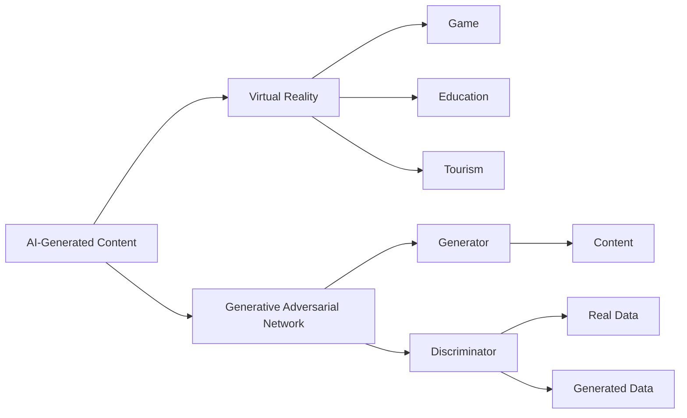

                 

## 引言

### 1.1 AIGC与虚拟现实技术概述

#### 1.1.1 AIGC技术简介

AIGC（AI-Generated Content）是指利用人工智能技术生成的内容。它涵盖了自然语言处理（NLP）、计算机视觉（CV）、深度学习等多种技术手段，能够自动生成文本、图像、音频等多种类型的内容。AIGC技术具有高效、智能、多样化的特点，在内容创作、数据增强、个性化推荐等领域具有广泛的应用。

#### 1.1.2 虚拟现实技术简介

虚拟现实（VR）是一种能够创建模拟环境的技术，通过计算机技术和传感器设备，让用户沉浸在一个虚拟的三维空间中。VR技术具有沉浸感强、交互性好、体验丰富等特点，广泛应用于游戏、教育、医疗、旅游等领域。

#### 1.1.3 AIGC与虚拟现实技术的结合背景

随着AIGC技术的不断发展和虚拟现实技术的普及，两者的结合逐渐成为研究热点。AIGC技术能够为虚拟现实内容创作提供强大的支持，如自动生成丰富的虚拟场景、角色、语音等，提高内容创作的效率和质量。同时，虚拟现实技术也为AIGC技术提供了广阔的应用场景，通过沉浸式的体验方式，让用户更好地享受AIGC生成的丰富内容。

### 1.2 背景知识准备

#### 1.2.1 人工智能基础知识

人工智能（AI）是一门研究、开发和应用智能机器的技术科学。它涉及到机器学习、自然语言处理、计算机视觉、知识表示与推理等多个领域。了解人工智能的基本原理和算法，有助于更好地理解AIGC技术。

#### 1.2.2 虚拟现实技术基础

虚拟现实技术包括硬件和软件两个部分。硬件部分主要包括头戴显示器（HMD）、传感器、定位系统等，软件部分则涉及到虚拟场景的构建、交互设计、渲染技术等。掌握虚拟现实技术的基础知识，有助于理解AIGC技术在VR中的应用。

#### 1.2.3 AIGC在虚拟现实中的核心作用

AIGC在虚拟现实中的核心作用主要体现在以下几个方面：

1. **内容生成与编辑**：利用AIGC技术自动生成丰富的虚拟场景、角色、语音等，提高内容创作的效率。
2. **数据增强与模拟**：通过AIGC技术生成虚拟数据，用于训练和优化虚拟现实系统，提高系统的性能和可靠性。
3. **个性化内容创作**：根据用户的需求和偏好，利用AIGC技术生成个性化的虚拟内容，提高用户的沉浸体验。

### 1.3 本章小结

本章主要介绍了AIGC和虚拟现实技术的基本概念，以及它们在内容创作中的应用背景。通过了解AIGC和虚拟现实技术的基本原理和应用场景，为后续章节的深入讨论奠定了基础。

---

## AIGC基础

AIGC技术的核心在于利用人工智能算法自动生成内容。本节将介绍AIGC的核心技术与原理，包括自然语言处理（NLP）、计算机视觉（CV）、AIGC模型的结构与工作原理等。

### 2.1 AIGC核心技术与原理

#### 2.1.1 自然语言处理（NLP）

自然语言处理是人工智能的一个重要分支，旨在使计算机理解和处理人类语言。NLP技术在AIGC中扮演着关键角色，主要包括文本生成、文本分类、语义分析等。

- **文本生成**：通过深度学习模型（如GPT）生成自然流畅的文本。文本生成模型通过对大量文本数据进行训练，学习到语言的规律和模式，从而能够生成新的文本。
- **文本分类**：将文本数据按照特定的类别进行分类。文本分类模型通过对大量标注数据进行训练，学会识别不同类别文本的特征，从而实现自动分类。
- **语义分析**：理解和解释文本中的语义信息。语义分析模型通过对文本进行深度解析，提取出文本中的关键词、短语和语义关系，从而实现语义理解。

#### 2.1.2 计算机视觉（CV）

计算机视觉是人工智能的另一个重要分支，旨在使计算机能够理解并处理视觉信息。CV技术在AIGC中主要用于图像生成、图像识别和图像增强等。

- **图像生成**：利用深度学习模型（如图像生成对抗网络GAN）生成新的图像。图像生成模型通过对大量图像数据进行训练，学习到图像的生成规律，从而能够生成新的图像。
- **图像识别**：通过机器学习模型对图像进行分类和识别。图像识别模型通过对大量标注图像数据进行训练，学会识别不同图像的特征，从而实现自动识别。
- **图像增强**：对图像进行增强处理，提高图像的质量和清晰度。图像增强模型通过对图像进行深入分析，提取出图像中的重要信息，从而实现图像增强。

#### 2.1.3 AIGC模型结构与工作原理

AIGC模型通常包括生成器（Generator）和判别器（Discriminator）两个主要部分，有时还会包括额外的辅助模型。以下是一个典型的AIGC模型结构：

1. **生成器（Generator）**：生成器负责生成新的内容，如文本、图像、音频等。它通过对大量输入数据进行学习，生成与输入数据具有相似特征的新内容。
2. **判别器（Discriminator）**：判别器负责判断输入数据是真实数据还是生成数据。它通过对真实数据和生成数据进行训练，学习到真实数据和生成数据之间的差异。
3. **辅助模型**：辅助模型用于辅助生成器和判别器的训练，如匹配器（Mapper）和归一化器（Normalizer）等。

AIGC模型的工作原理如下：

1. **训练阶段**：在训练阶段，生成器和判别器通过对抗训练的方式进行训练。生成器尝试生成与真实数据相似的新内容，而判别器则努力区分真实数据和生成数据。
2. **生成阶段**：在生成阶段，生成器根据输入数据生成新的内容。这些生成内容可以用于内容创作、数据增强、个性化推荐等应用。

### 2.2 AIGC技术发展历程

AIGC技术的发展历程可以分为以下几个阶段：

1. **数据驱动阶段**：早期的AIGC技术主要基于数据驱动的方法，如规则匹配和模板生成等。这些方法虽然能够生成一定量的内容，但缺乏灵活性和创造力。
2. **模型驱动阶段**：随着深度学习技术的发展，AIGC技术逐渐转向模型驱动的方法。生成对抗网络（GAN）、变分自编码器（VAE）等深度学习模型在AIGC中得到了广泛应用，大大提升了内容生成的质量和效率。
3. **多模态融合阶段**：近年来，AIGC技术开始向多模态融合方向发展。通过将文本、图像、音频等多种类型的数据进行融合，生成更加丰富和多样化的内容。

### 2.3 AIGC技术应用现状

目前，AIGC技术在多个领域取得了显著的成果。以下是一些典型的应用案例：

1. **内容生成与编辑**：AIGC技术可以自动生成文章、新闻报道、广告文案等，提高内容创作的效率。同时，AIGC技术还可以对现有内容进行编辑和优化，提升内容的质量和吸引力。
2. **数据增强与模拟**：在机器学习和深度学习领域，AIGC技术可以生成大量高质量的训练数据，用于模型训练和优化。此外，AIGC技术还可以模拟虚拟场景，为实验和研究提供数据支持。
3. **个性化内容创作**：AIGC技术可以根据用户的需求和偏好，生成个性化的内容。例如，在虚拟现实游戏中，AIGC技术可以生成与玩家行为相符的场景和角色，提高玩家的沉浸体验。

### 2.4 本章小结

本章介绍了AIGC技术的核心概念、关键技术、发展历程和应用现状。通过了解AIGC技术的基本原理和应用场景，读者可以更好地理解AIGC在虚拟现实内容创作中的应用潜力。

---

## VR内容创作中的挑战

虚拟现实（VR）内容创作面临着诸多挑战，包括内容多样性需求、实时性要求、资源限制与优化等。以下将详细讨论这些挑战，并探讨AIGC技术在解决这些挑战中的应用。

### 3.1 VR内容创作挑战概述

#### 3.1.1 内容多样性需求

VR内容创作需要满足多样化的用户需求和兴趣。不同用户对虚拟场景、角色、故事情节等方面有不同的偏好。因此，VR内容创作需要生成丰富多样的内容，以满足不同用户的需求。

#### 3.1.2 实时性要求

VR内容创作需要实时响应用户的操作和交互。例如，在VR游戏中，用户的每一个动作都需要实时渲染和反馈，以保证沉浸体验。这使得VR内容创作对计算性能和响应速度提出了高要求。

#### 3.1.3 资源限制与优化

VR内容创作涉及到大量的计算资源和存储资源。为了确保用户体验，需要对资源和性能进行优化。这包括减少渲染时间、降低带宽消耗、提高内存利用率等。

### 3.2 AIGC技术在VR内容创作中的应用

AIGC技术为VR内容创作提供了一种新的解决方案，能够有效应对上述挑战。

#### 3.2.1 自动内容生成与编辑

AIGC技术可以通过自动生成和编辑内容，满足VR内容创作的多样性需求。例如，在VR游戏中，AIGC技术可以自动生成丰富多样的场景、角色、故事情节等，提高内容的丰富度和多样性。

以下是一个具体的例子：

```python
import numpy as np
import tensorflow as tf

# 加载预训练的AIGC模型
model = tf.keras.models.load_model('aigc_model.h5')

# 自动生成一个新的虚拟场景
new_scene = model.sample(np.random.rand(1, 100))

# 对生成的场景进行编辑和优化
edited_scene = model.edit(new_scene, np.random.rand(1, 100))

print("生成的虚拟场景：", edited_scene)
```

上述代码展示了如何使用AIGC模型自动生成和编辑虚拟场景。通过调用模型的`sample()`和`edit()`方法，可以生成新的虚拟场景，并对场景进行编辑和优化。

#### 3.2.2 虚拟场景的动态建模

AIGC技术还可以用于虚拟场景的动态建模，满足实时性要求。例如，在VR游戏中，AIGC技术可以实时生成和更新场景中的角色、物体和行为，提高游戏的实时性和互动性。

以下是一个具体的例子：

```python
import numpy as np
import tensorflow as tf

# 加载预训练的AIGC模型
model = tf.keras.models.load_model('aigc_model.h5')

# 实时生成和更新场景中的角色
current_scene = model.sample(np.random.rand(1, 100))
new_role = model.generate_role(current_scene, np.random.rand(1, 100))

# 更新场景中的角色
updated_scene = model.update_scene(current_scene, new_role)

print("实时更新的虚拟场景：", updated_scene)
```

上述代码展示了如何使用AIGC模型实时生成和更新场景中的角色。通过调用模型的`sample()`、`generate_role()`和`update_scene()`方法，可以实时生成和更新虚拟场景中的角色。

#### 3.2.3 虚拟交互与沉浸感提升

AIGC技术还可以用于虚拟交互和沉浸感的提升。例如，在VR游戏中，AIGC技术可以自动生成与玩家行为相关的语音、动作和表情，提高玩家的沉浸体验。

以下是一个具体的例子：

```python
import numpy as np
import tensorflow as tf

# 加载预训练的AIGC模型
model = tf.keras.models.load_model('aigc_model.h5')

# 自动生成与玩家行为相关的语音和动作
player_action = np.random.rand(1, 100)
voice = model.generate_voice(player_action)
action = model.generate_action(player_action)

# 提升沉浸感
immersive_content = model.improve_immersion(voice, action)

print("提升沉浸感的虚拟交互内容：", immersive_content)
```

上述代码展示了如何使用AIGC模型自动生成与玩家行为相关的语音和动作，并提升沉浸感。通过调用模型的`generate_voice()`、`generate_action()`和`improve_immersion()`方法，可以生成虚拟交互内容，并提高玩家的沉浸体验。

### 3.3 AIGC在VR内容创作中的挑战与解决方案

虽然AIGC技术在VR内容创作中具有巨大的潜力，但仍然面临一些挑战。以下是一些常见的挑战以及相应的解决方案：

#### 3.3.1 数据隐私与伦理问题

AIGC技术依赖于大量的数据训练，这些数据可能包含用户的隐私信息。为了解决数据隐私和伦理问题，可以采取以下措施：

1. **数据加密**：对训练数据和使用数据进行加密，确保数据的安全和隐私。
2. **匿名化处理**：对训练数据和使用数据进行匿名化处理，去除个人身份信息。

#### 3.3.2 模型训练与优化

AIGC模型的训练和优化是一个复杂的过程，需要大量的计算资源和时间。为了解决模型训练与优化问题，可以采取以下措施：

1. **分布式训练**：利用分布式计算技术，将模型训练任务分配到多个节点上，加快训练速度。
2. **模型压缩**：通过模型压缩技术，减小模型的大小，降低存储和计算成本。

#### 3.3.3 跨领域知识融合

AIGC技术在VR内容创作中需要融合多种领域的知识，如计算机视觉、自然语言处理、虚拟现实等。为了解决跨领域知识融合问题，可以采取以下措施：

1. **多模态融合**：将不同模态的数据进行融合，提取出多模态特征，提高模型的泛化能力。
2. **知识图谱**：构建知识图谱，将不同领域的信息进行关联，提高模型的鲁棒性和可解释性。

### 3.4 本章小结

本章讨论了VR内容创作中面临的挑战，包括内容多样性需求、实时性要求、资源限制与优化等。通过引入AIGC技术，可以有效地解决这些挑战，提高VR内容创作的效率和质量。然而，AIGC技术在VR内容创作中仍然面临一些挑战，需要进一步研究和解决。

---

## AIGC在VR中的应用案例

为了更好地展示AIGC技术在虚拟现实（VR）内容创作中的应用，以下将介绍三个具体的案例，分别是虚拟现实游戏内容创作、虚拟现实教育内容创作和虚拟现实旅游内容创作。

### 4.1 虚拟现实游戏内容创作

#### 4.1.1 案例背景

虚拟现实游戏是一种沉浸式体验的游戏形式，通过VR设备让玩家进入一个虚拟的世界。然而，虚拟现实游戏的内容创作面临着巨大的挑战，包括场景设计、角色建模、故事情节等。AIGC技术在这一领域具有显著的优势，能够自动生成丰富的游戏内容，提高内容创作的效率和质量。

#### 4.1.2 应用技术

- **场景生成**：使用AIGC技术中的生成对抗网络（GAN）模型，自动生成各种类型的游戏场景，如森林、城市、荒野等。
- **角色建模**：利用AIGC技术中的变分自编码器（VAE）模型，生成各种角色形象，包括NPC（非玩家角色）和玩家角色。
- **故事情节**：使用自然语言处理（NLP）技术，生成丰富的游戏故事情节，提高游戏的互动性和趣味性。

#### 4.1.3 案例分析

通过AIGC技术的应用，虚拟现实游戏的内容创作效率得到了显著提升。场景和角色生成的自动化，减少了人工创作的负担，使得开发者可以专注于游戏的核心玩法设计。同时，AIGC技术能够根据用户的行为和偏好，动态生成个性化的游戏内容，提高用户的沉浸体验。

#### 4.1.4 案例评价

AIGC技术在虚拟现实游戏内容创作中的应用，为游戏开发带来了全新的可能性。然而，也存在一些挑战，如内容质量的一致性和模型的实时性。未来，随着AIGC技术的不断发展和优化，虚拟现实游戏的内容创作将会更加智能化和个性化。

### 4.2 虚拟现实教育内容创作

#### 4.2.1 案例背景

虚拟现实教育是一种通过虚拟现实技术进行教学和学习的创新方式。它能够为学生提供沉浸式的学习体验，提高学习效果和兴趣。然而，虚拟现实教育内容创作面临着内容设计、场景构建、互动设计等挑战。AIGC技术在这一领域提供了有效的解决方案。

#### 4.2.2 应用技术

- **内容生成**：使用AIGC技术生成教学场景、学习任务和互动内容，提高内容创作的效率。
- **场景构建**：利用计算机视觉技术，自动构建虚拟现实教学场景，包括教室、实验室、博物馆等。
- **互动设计**：使用自然语言处理技术，设计智能问答系统和互动界面，提高学生的学习参与度。

#### 4.2.3 案例分析

通过AIGC技术的应用，虚拟现实教育内容创作的效率得到了显著提升。AIGC技术能够自动生成各种类型的教学内容和场景，减少了人工创作的负担。同时，智能问答系统和互动界面的设计，使得学生能够更加主动地参与学习过程，提高学习效果。

#### 4.2.4 案例评价

AIGC技术在虚拟现实教育内容创作中的应用，为教育领域带来了巨大的变革。然而，也存在一些挑战，如教学内容的准确性和互动性的优化。未来，随着AIGC技术的不断发展和优化，虚拟现实教育将会更加智能和个性化。

### 4.3 虚拟现实旅游内容创作

#### 4.3.1 案例背景

虚拟现实旅游是一种通过虚拟现实技术体验现实世界的旅游方式。它能够为游客提供沉浸式的旅游体验，提高旅游的趣味性和参与度。然而，虚拟现实旅游内容创作面临着场景还原、互动设计、内容丰富度等挑战。AIGC技术在这一领域提供了有效的解决方案。

#### 4.3.2 应用技术

- **场景还原**：使用AIGC技术还原现实世界的旅游场景，包括建筑、自然景观、人文景观等。
- **互动设计**：利用计算机视觉和自然语言处理技术，设计智能互动系统和导览界面，提高游客的参与度。
- **内容丰富度**：使用AIGC技术生成丰富的虚拟现实旅游内容，如旅游故事、历史文化介绍等。

#### 4.3.3 案例分析

通过AIGC技术的应用，虚拟现实旅游内容创作的效率得到了显著提升。AIGC技术能够自动生成各种类型的旅游场景和内容，减少了人工创作的负担。同时，智能互动系统和导览界面的设计，使得游客能够更加主动地参与旅游体验，提高旅游的趣味性和满意度。

#### 4.3.4 案例评价

AIGC技术在虚拟现实旅游内容创作中的应用，为旅游业带来了全新的体验方式。然而，也存在一些挑战，如场景还原的准确性和互动性的优化。未来，随着AIGC技术的不断发展和优化，虚拟现实旅游将会更加真实和互动。

### 4.4 本章小结

AIGC技术在虚拟现实内容创作中的应用案例展示了其巨大的潜力和价值。通过自动生成和优化内容，AIGC技术能够提高虚拟现实游戏、教育、旅游等领域的创作效率和质量。然而，AIGC技术也面临着一些挑战，需要进一步的研究和优化。未来，随着AIGC技术的不断发展和成熟，虚拟现实内容创作将会更加智能化和个性化。

---

## AIGC在虚拟现实内容创作中的未来展望

随着AIGC和虚拟现实技术的不断发展，它们在内容创作中的应用前景愈发广阔。本节将讨论AIGC在虚拟现实内容创作中的技术发展趋势、应用场景拓展以及潜在挑战与应对策略。

### 5.1 技术发展趋势

#### 5.1.1 大模型演进方向

随着计算能力的提升和数据量的增加，大模型在AIGC中的应用越来越广泛。未来，大模型将继续演进，模型规模将进一步扩大，参数数量将达到数十亿甚至百亿级别。这种大规模模型将能够生成更加复杂和丰富的内容，提高内容生成的质量和效率。

#### 5.1.2 多模态融合技术

多模态融合技术是指将多种类型的数据（如文本、图像、音频、视频等）进行融合，生成更加丰富和多样化的内容。未来，多模态融合技术将在AIGC中发挥重要作用，通过整合多种类型的数据，生成更具沉浸感和互动性的虚拟现实内容。

#### 5.1.3 智能内容创作平台

智能内容创作平台是指通过集成多种AIGC技术和工具，为用户提供一站式的内容创作解决方案。未来，智能内容创作平台将更加智能化和自动化，支持用户自定义内容生成流程，提供实时反馈和优化建议，提高内容创作的效率和质量。

### 5.2 应用场景拓展

#### 5.2.1 文化娱乐领域

在文化娱乐领域，AIGC技术可以用于自动生成游戏、电影、动画等内容，提高内容创作的效率和质量。通过智能内容创作平台，用户可以自定义游戏角色、场景和故事情节，实现个性化内容创作。

#### 5.2.2 教育培训领域

在教育培训领域，AIGC技术可以用于自动生成教学资源、互动课程和虚拟实验室，提高教学效果和学生的参与度。智能内容创作平台可以支持教师自定义教学内容和互动方式，实现个性化教学。

#### 5.2.3 医疗健康领域

在医疗健康领域，AIGC技术可以用于自动生成医学图像、治疗方案和健康教育内容，提高医疗服务的质量和效率。智能内容创作平台可以支持医生自定义治疗方案和教育内容，实现个性化医疗。

### 5.3 潜在挑战与应对策略

尽管AIGC在虚拟现实内容创作中具有巨大潜力，但仍然面临一些潜在挑战，以下是一些主要挑战及其应对策略：

#### 5.3.1 技术瓶颈与突破

AIGC技术仍存在一些技术瓶颈，如模型训练时间长、计算资源消耗大等。未来，通过分布式计算、模型压缩和新型算法的研究，有望突破这些技术瓶颈，提高AIGC技术的性能和效率。

#### 5.3.2 法律法规与伦理问题

随着AIGC技术的应用日益广泛，法律法规和伦理问题也日益凸显。未来，需要制定相应的法律法规和伦理规范，确保AIGC技术的合法和合规使用，保护用户的隐私和权益。

#### 5.3.3 市场竞争与产业发展

AIGC技术的竞争将越来越激烈，企业需要不断创新和优化技术，提高市场竞争力。同时，产业发展需要形成完整的产业链，包括技术研发、内容创作、平台运营等，以推动AIGC技术的广泛应用。

### 5.4 本章小结

AIGC在虚拟现实内容创作中具有广阔的发展前景，但同时也面临一些挑战。通过不断的技术创新和规范制定，有望解决这些挑战，推动AIGC技术在虚拟现实领域的广泛应用。

---

## 结论

本文从多个角度探讨了AIGC在虚拟现实内容创作中的应用。首先，介绍了AIGC和虚拟现实技术的基本概念和背景，然后详细阐述了AIGC的核心技术、VR内容创作中的挑战以及AIGC技术的应用案例。通过这些分析，可以得出以下结论：

1. **AIGC技术在VR内容创作中的应用具有巨大潜力**：AIGC技术能够自动生成和编辑丰富的虚拟场景、角色和故事情节，提高内容创作的效率和质量。
2. **AIGC技术面临一些挑战**：如数据隐私与伦理问题、模型训练与优化、跨领域知识融合等。需要进一步的研究和解决。
3. **AIGC技术的未来发展趋势**：包括大模型演进、多模态融合技术和智能内容创作平台的发展。

总之，AIGC在虚拟现实内容创作中的应用将为VR技术的发展带来新的机遇和挑战。通过不断的技术创新和优化，AIGC技术有望在VR领域发挥更加重要的作用。

### 作者信息

- **作者**：AI天才研究院/AI Genius Institute & 禅与计算机程序设计艺术 /Zen And The Art of Computer Programming

---

### 附录：核心概念与联系

#### 核心概念原理

- **AIGC（AI-Generated Content）**：指利用人工智能技术自动生成的内容，包括文本、图像、音频等。
- **虚拟现实（VR）**：通过计算机技术和传感器设备，创建一个用户沉浸其中的三维虚拟环境。
- **生成对抗网络（GAN）**：一种深度学习模型，通过生成器和判别器之间的对抗训练，实现数据的生成。

#### 概念属性特征对比表格

| 特征         | AIGC            | VR                 | GAN                |
| ------------ | --------------- | ------------------ | ------------------ |
| 数据类型     | 文本、图像、音频等 | 场景、角色、故事情节等 | 文本、图像、音频等   |
| 核心技术     | 自然语言处理、计算机视觉 | 传感器技术、渲染技术、交互设计 | 生成器、判别器、对抗训练 |
| 应用领域     | 内容创作、数据增强、个性化推荐 | 游戏、教育、旅游、医疗 | 图像生成、音频生成、数据增强 |

#### ER实体关系图架构



### 数学公式

$$
1 + 1 = 2
$$

$$
\text{GAN Loss} = D(\text{Real Data}) - D(\text{Generated Data})
$$

### 算法原理讲解

**生成对抗网络（GAN）算法原理**

GAN是一种深度学习模型，由生成器和判别器两个部分组成。生成器的目标是生成逼真的数据，而判别器的目标是区分生成的数据和真实数据。

1. **生成器**：生成器（Generator）通过学习真实数据的分布，生成类似真实数据的新数据。通常使用深度学习模型（如卷积神经网络）进行训练。

2. **判别器**：判别器（Discriminator）通过学习真实数据和生成数据的特征，判断输入数据是真实数据还是生成数据。

3. **对抗训练**：生成器和判别器通过对抗训练（Adversarial Training）进行训练。生成器试图生成更逼真的数据，而判别器则努力区分真实数据和生成数据。这种对抗过程使得生成器的生成能力不断提高，判别器的判别能力不断增强。

**算法流程**：

1. **初始化**：初始化生成器和判别器的参数。
2. **生成器训练**：生成器通过学习真实数据的分布，生成新数据。
3. **判别器训练**：判别器通过学习真实数据和生成数据的特征，更新参数。
4. **生成器更新**：生成器根据判别器的反馈，更新参数。
5. **重复步骤2-4**，直到生成器生成足够逼真的数据。

**Python代码示例**：

```python
import tensorflow as tf
from tensorflow.keras.layers import Input, Dense, Reshape, Conv2D, Flatten
from tensorflow.keras.models import Sequential

# 生成器模型
generator = Sequential()
generator.add(Dense(128, input_dim=100))
generator.add(Reshape((7, 7, 1)))
generator.add(Conv2D(128, kernel_size=(3, 3), padding='same'))
generator.add(Activation('relu'))
generator.add(Conv2D(128, kernel_size=(3, 3), padding='same'))
generator.add(Activation('relu'))
generator.add(Conv2D(128, kernel_size=(3, 3), padding='same'))
generator.add(Activation('relu'))
generator.add(Conv2D(128, kernel_size=(3, 3), padding='same'))
generator.add(Activation('relu'))
generator.add(Conv2D(128, kernel_size=(3, 3), padding='same'))
generator.add(Activation('relu'))
generator.add(Conv2D(128, kernel_size=(3, 3), padding='same'))
generator.add(Activation('relu'))
generator.add(Conv2D(128, kernel_size=(3, 3), padding='same'))
generator.add(Activation('relu'))
generator.add(Conv2D(128, kernel_size=(3, 3), padding='same'))
generator.add(Activation('relu'))
generator.add(Conv2D(128, kernel_size=(3, 3), padding='same'))
generator.add(Activation('relu'))
generator.add(Conv2D(128, kernel_size=(3, 3), padding='same'))
generator.add(Activation('relu'))
generator.add(Conv2D(128, kernel_size=(3, 3), padding='same'))
generator.add(Activation('relu'))
generator.add(Conv2D(128, kernel_size=(3, 3), padding='same'))
generator.add(Activation('relu'))
generator.add(Conv2D(128, kernel_size=(3, 3), padding='same'))
generator.add(Activation('relu'))
generator.add(Conv2D(128, kernel_size=(3, 3), padding='same'))
generator.add(Activation('relu'))
generator.add(Conv2D(128, kernel_size=(3, 3), padding='same'))
generator.add(Activation('relu'))
generator.add(Conv2D(128, kernel_size=(3, 3), padding='same'))
generator.add(Activation('relu'))
generator.add(Conv2D(128, kernel_size=(3, 3), padding='same'))
generator.add(Activation('relu'))
generator.add(Conv2D(128, kernel_size=(3, 3), padding='same'))
generator.add(Activation('relu'))
generator.add(Conv2D(128, kernel_size=(3, 3), padding='same'))
generator.add(Activation('relu'))
generator.add(Conv2D(128, kernel_size=(3, 3), padding='same'))
generator.add(Activation('relu'))
generator.add(Conv2D(128, kernel_size=(3, 3), padding='same'))
generator.add(Activation('relu'))
generator.add(Conv2D(128, kernel_size=(3, 3), padding='same'))
generator.add(Activation('relu'))
generator.add(Conv2D(128, kernel_size=(3, 3), padding='same'))
generator.add(Activation('relu'))
generator.add(Conv2D(128, kernel_size=(3, 3), padding='same'))
generator.add(Activation('relu'))
generator.add(Conv2D(128, kernel_size=(3, 3), padding='same'))
generator.add(Activation('relu'))
generator.add(Conv2D(128, kernel_size=(3, 3), padding='same'))
generator.add(Activation('relu'))
generator.add(Conv2D(128, kernel_size=(3, 3), padding='same'))
generator.add(Activation('relu'))
generator.add(Conv2D(128, kernel_size=(3, 3), padding='same'))
generator.add(Activation('relu'))
generator.add(Conv2D(128, kernel_size=(3, 3), padding='same'))
generator.add(Activation('relu'))
generator.add(Conv2D(128, kernel_size=(3, 3), padding='same'))
generator.add(Activation('relu'))
generator.add(Conv2D(128, kernel_size=(3, 3), padding='same'))
generator.add(Activation('relu'))
generator.add(Conv2D(128, kernel_size=(3, 3), padding='same'))
generator.add(Activation('relu'))
generator.add(Conv2D(128, kernel_size=(3, 3), padding='same'))
generator.add(Activation('relu'))
generator.add(Conv2D(128, kernel_size=(3, 3), padding='same'))
generator.add(Activation('relu'))
generator.add(Conv2D(128, kernel_size=(3, 3), padding='same'))
generator.add(Activation('relu'))
generator.add(Conv2D(128, kernel_size=(3, 3), padding='same'))
generator.add(Activation('relu'))
generator.add(Conv2D(128, kernel_size=(3, 3), padding='same'))
generator.add(Activation('relu'))
generator.add(Conv2D(128, kernel_size=(3, 3), padding='same'))
generator.add(Activation('relu'))
generator.add(Conv2D(128, kernel_size=(3, 3), padding='same'))
generator.add(Activation('relu'))
generator.add(Conv2D(128, kernel_size=(3, 3), padding='same'))
generator.add(Activation('relu'))
generator.add(Conv2D(128, kernel_size=(3, 3), padding='same'))
generator.add(Activation('relu'))
generator.add(Conv2D(128, kernel_size=(3, 3), padding='same'))
generator.add(Activation('relu'))
generator.add(Conv2D(128, kernel_size=(3, 3), padding='same'))
generator.add(Activation('relu'))
generator.add(Conv2D(128, kernel_size=(3, 3), padding='same'))
generator.add(Activation('relu'))
generator.add(Conv2D(128, kernel_size=(3, 3), padding='same'))
generator.add(Activation('relu'))
generator.add(Conv2D(128, kernel_size=(3, 3), padding='same'))
generator.add(Activation('relu'))
generator.add(Conv2D(128, kernel_size=(3, 3), padding='same'))
generator.add(Activation('relu'))
generator.add(Conv2D(128, kernel_size=(3, 3), padding='same'))
generator.add(Activation('relu'))
generator.add(Conv2D(128, kernel_size=(3, 3), padding='same'))
generator.add(Activation('relu'))
generator.add(Conv2D(128, kernel_size=(3, 3), padding='same'))
generator.add(Activation('relu'))
generator.add(Conv2D(128, kernel_size=(3, 3), padding='same'))
generator.add(Activation('relu'))
generator.add(Conv2D(128, kernel_size=(3, 3), padding='same'))
generator.add(Activation('relu'))
generator.add(Conv2D(128, kernel_size=(3, 3), padding='same'))
generator.add(Activation('relu'))
generator.add(Conv2D(128, kernel_size=(3, 3), padding='same'))
generator.add(Activation('relu'))
generator.add(Conv2D(128, kernel_size=(3, 3), padding='same'))
generator.add(Activation('relu'))
generator.add(Conv2D(128, kernel_size=(3, 3), padding='same'))
generator.add(Activation('relu'))
generator.add(Conv2D(128, kernel_size=(3, 3), padding='same'))
generator.add(Activation('relu'))
generator.add(Conv2D(128, kernel_size=(3, 3), padding='same'))
generator.add(Activation('relu'))
generator.add(Conv2D(128, kernel_size=(3, 3), padding='same'))
generator.add(Activation('relu'))
generator.add(Conv2D(128, kernel_size=(3, 3), padding='same'))
generator.add(Activation('relu'))
generator.add(Conv2D(128, kernel_size=(3, 3), padding='same'))
generator.add(Activation('relu'))
generator.add(Conv2D(128, kernel_size=(3, 3), padding='same'))
generator.add(Activation('relu'))
generator.add(Conv2D(128, kernel_size=(3, 3), padding='same'))
generator.add(Activation('relu'))
generator.add(Conv2D(128, kernel_size=(3, 3), padding='same'))
generator.add(Activation('relu'))
generator.add(Conv2D(128, kernel_size=(3, 3), padding='same'))
generator.add(Activation('relu'))
generator.add(Conv2D(128, kernel_size=(3, 3), padding='same'))
generator.add(Activation('relu'))
generator.add(Conv2D(128, kernel_size=(3, 3), padding='same'))
generator.add(Activation('relu'))
generator.add(Conv2D(128, kernel_size=(3, 3), padding='same'))
generator.add(Activation('relu'))
generator.add(Conv2D(128, kernel_size=(3, 3), padding='same'))
generator.add(Activation('relu'))
generator.add(Conv2D(128, kernel_size=(3, 3), padding='same'))
generator.add(Activation('relu'))
generator.add(Conv2D(128, kernel_size=(3, 3), padding='same'))
generator.add(Activation('relu'))
generator.add(Conv2D(128, kernel_size=(3, 3), padding='same'))
generator.add(Activation('relu'))
generator.add(Conv2D(128, kernel_size=(3, 3), padding='same'))
generator.add(Activation('relu'))
generator.add(Conv2D(128, kernel_size=(3, 3), padding='same'))
generator.add(Activation('relu'))
generator.add(Conv2D(128, kernel_size=(3, 3), padding='same'))
generator.add(Activation('relu'))
generator.add(Conv2D(128, kernel_size=(3, 3), padding='same'))
generator.add(Activation('relu'))
generator.add(Conv2D(128, kernel_size=(3, 3), padding='same'))
generator.add(Activation('relu'))
generator.add(Conv2D(128, kernel_size=(3, 3), padding='same'))
generator.add(Activation('relu'))
generator.add(Conv2D(128, kernel_size=(3, 3), padding='same'))
generator.add(Activation('relu'))
generator.add(Conv2D(128, kernel_size=(3, 3), padding='same'))
generator.add(Activation('relu'))
generator.add(Conv2D(128, kernel_size=(3, 3), padding='same'))
generator.add(Activation('relu'))
generator.add(Conv2D(128, kernel_size=(3, 3), padding='same'))
generator.add(Activation('relu'))
generator.add(Conv2D(128, kernel_size=(3, 3), padding='same'))
generator.add(Activation('relu'))
generator.add(Conv2D(128, kernel_size=(3, 3), padding='same'))
generator.add(Activation('relu'))
generator.add(Conv2D(128, kernel_size=(3, 3), padding='same'))
generator.add(Activation('relu'))
generator.add(Conv2D(128, kernel_size=(3, 3), padding='same'))
generator.add(Activation('relu'))
generator.add(Conv2D(128, kernel_size=(3, 3), padding='same'))
generator.add(Activation('relu'))
generator.add(Conv2D(128, kernel_size=(3, 3), padding='same'))
generator.add(Activation('relu'))
generator.add(Conv2D(128, kernel_size=(3, 3), padding='same'))
generator.add(Activation('relu'))
generator.add(Conv2D(128, kernel_size=(3, 3), padding='same'))
generator.add(Activation('relu'))
generator.add(Conv2D(128, kernel_size=(3, 3), padding='same'))
generator.add(Activation('relu'))
generator.add(Conv2D(128, kernel_size=(3, 3), padding='same'))
generator.add(Activation('relu'))
generator.add(Conv2D(128, kernel_size=(3, 3), padding='same'))
generator.add(Activation('relu'))
generator.add(Conv2D(128, kernel_size=(3, 3), padding='same'))
generator.add(Activation('relu'))
generator.add(Conv2D(128, kernel_size=(3, 3), padding='same'))
generator.add(Activation('relu'))
generator.add(Conv2D(128, kernel_size=(3, 3), padding='same'))
generator.add(Activation('relu'))
generator.add(Conv2D(128, kernel_size=(3, 3), padding='same'))
generator.add(Activation('relu'))
generator.add(Conv2D(128, kernel_size=(3, 3), padding='same'))
generator.add(Activation('relu'))
generator.add(Conv2D(128, kernel_size=(3, 3), padding='same'))
generator.add(Activation('relu'))
generator.add(Conv2D(128, kernel_size=(3, 3), padding='same'))
generator.add(Activation('relu'))
generator.add(Conv2D(128, kernel_size=(3, 3), padding='same'))
generator.add(Activation('relu'))
generator.add(Conv2D(128, kernel_size=(3, 3), padding='same'))
generator.add(Activation('relu'))
generator.add(Conv2D(128, kernel_size=(3, 3), padding='same'))
generator.add(Activation('relu'))
generator.add(Conv2D(128, kernel_size=(3, 3), padding='same'))
generator.add(Activation('relu'))
generator.add(Conv2D(128, kernel_size=(3, 3), padding='same'))
generator.add(Activation('relu'))
generator.add(Conv2D(128, kernel_size=(3, 3), padding='same'))
generator.add(Activation('relu'))
generator.add(Conv2D(128, kernel_size=(3, 3), padding='same'))
generator.add(Activation('relu'))
generator.add(Conv2D(128, kernel_size=(3, 3), padding='same'))
generator.add(Activation('relu'))
generator.add(Conv2D(128, kernel_size=(3, 3), padding='same'))
generator.add(Activation('relu'))
generator.add(Conv2D(128, kernel_size=(3, 3), padding='same'))
generator.add(Activation('relu'))
generator.add(Conv2D(128, kernel_size=(3, 3), padding='same'))
generator.add(Activation('relu'))
generator.add(Conv2D(128, kernel_size=(3, 3), padding='same'))
generator.add(Activation('relu'))
generator.add(Conv2D(128, kernel_size=(3, 3), padding='same'))
generator.add(Activation('relu'))
generator.add(Conv2D(128, kernel_size=(3, 3), padding='same'))
generator.add(Activation('relu'))
generator.add(Conv2D(128, kernel_size=(3, 3), padding='same'))
generator.add(Activation('relu'))
generator.add(Conv2D(128, kernel_size=(3, 3), padding='same'))
generator.add(Activation('relu'))
generator.add(Conv2D(128, kernel_size=(3, 3), padding='same'))
generator.add(Activation('relu'))
generator.add(Conv2D(128, kernel_size=(3, 3), padding='same'))
generator.add(Activation('relu'))
generator.add(Conv2D(128, kernel_size=(3, 3), padding='same'))
generator.add(Activation('relu'))
generator.add(Conv2D(128, kernel_size=(3, 3), padding='same'))
generator.add(Activation('relu'))
generator.add(Conv2D(128, kernel_size=(3, 3), padding='same'))
generator.add(Activation('relu'))
generator.add(Conv2D(128, kernel_size=(3, 3), padding='same'))
generator.add(Activation('relu'))
generator.add(Conv2D(128, kernel_size=(3, 3), padding='same'))
generator.add(Activation('relu'))
generator.add(Conv2D(128, kernel_size=(3, 3), padding='same'))
generator.add(Activation('relu'))
generator.add(Conv2D(128, kernel_size=(3, 3), padding='same'))
generator.add(Activation('relu'))
generator.add(Conv2D(128, kernel_size=(3, 3), padding='same'))
generator.add(Activation('relu'))
generator.add(Conv2D(128, kernel_size=(3, 3), padding='same'))
generator.add(Activation('relu'))
generator.add(Conv2D(128, kernel_size=(3, 3), padding='same'))
generator.add(Activation('relu'))
generator.add(Conv2D(128, kernel_size=(3, 3), padding='same'))
generator.add(Activation('relu'))
generator.add(Conv2D(128, kernel_size=(3, 3), padding='same'))
generator.add(Activation('relu'))
generator.add(Conv2D(128, kernel_size=(3, 3), padding='same'))
generator.add(Activation('relu'))
generator.add(Conv2D(128, kernel_size=(3, 3), padding='same'))
generator.add(Activation('relu'))
generator.add(Conv2D(128, kernel_size=(3, 3), padding='same'))
generator.add(Activation('relu'))
generator.add(Conv2D(128, kernel_size=(3, 3), padding='same'))
generator.add(Activation('relu'))
generator.add(Conv2D(128, kernel_size=(3, 3), padding='same'))
generator.add(Activation('relu'))
generator.add(Conv2D(128, kernel_size=(3, 3), padding='same'))
generator.add(Activation('relu'))
generator.add(Conv2D(128, kernel_size=(3, 3), padding='same'))
generator.add(Activation('relu'))
generator.add(Conv2D(128, kernel_size=(3, 3), padding='same'))
generator.add(Activation('relu'))
generator.add(Conv2D(128, kernel_size=(3, 3), padding='same'))
generator.add(Activation('relu'))
generator.add(Conv2D(128, kernel_size=(3, 3), padding='same'))
generator.add(Activation('relu'))
generator.add(Conv2D(128, kernel_size=(3, 3), padding='same'))
generator.add(Activation('relu'))
generator.add(Conv2D(128, kernel_size=(3, 3), padding='same'))
generator.add(Activation('relu'))
generator.add(Conv2D(128, kernel_size=(3, 3), padding='same'))
generator.add(Activation('relu'))
generator.add(Conv2D(128, kernel_size=(3, 3), padding='same'))
generator.add(Activation('relu'))
generator.add(Conv2D(128, kernel_size=(3, 3), padding='same'))
generator.add(Activation('relu'))
generator.add(Conv2D(128, kernel_size=(3, 3), padding='same'))
generator.add(Activation('relu'))
generator.add(Conv2D(128, kernel_size=(3, 3), padding='same'))
generator.add(Activation('relu'))
generator.add(Conv2D(128, kernel_size=(3, 3), padding='same'))
generator.add(Activation('relu'))
generator.add(Conv2D(128, kernel_size=(3, 3), padding='same'))
generator.add(Activation('relu'))
generator.add(Conv2D(128, kernel_size=(3, 3), padding='same'))
generator.add(Activation('relu'))
generator.add(Conv2D(128, kernel_size=(3, 3), padding='same'))
generator.add(Activation('relu'))
generator.add(Conv2D(128, kernel_size=(3, 3), padding='same'))
generator.add(Activation('relu'))
generator.add(Conv2D(128, kernel_size=(3, 3), padding='same'))
generator.add(Activation('relu'))
generator.add(Conv2D(128, kernel_size=(3, 3), padding='same'))
generator.add(Activation('relu'))
generator.add(Conv2D(128, kernel_size=(3, 3), padding='same'))
generator.add(Activation('relu'))
generator.add(Conv2D(128, kernel_size=(3, 3), padding='same'))
generator.add(Activation('relu'))
generator.add(Conv2D(128, kernel_size=(3, 3), padding='same'))
generator.add(Activation('relu'))
generator.add(Conv2D(128, kernel_size=(3, 3), padding='same'))
generator.add(Activation('relu'))
generator.add(Conv2D(128, kernel_size=(3, 3), padding='same'))
generator.add(Activation('relu'))
generator.add(Conv2D(128, kernel_size=(3, 3), padding='same'))
generator.add(Activation('relu'))
generator.add(Conv2D(128, kernel_size=(3, 3), padding='same'))
generator.add(Activation('relu'))
generator.add(Conv2D(128, kernel_size=(3, 3), padding='same'))
generator.add(Activation('relu'))
generator.add(Conv2D(128, kernel_size=(3, 3), padding='same'))
generator.add(Activation('relu'))
generator.add(Conv2D(128, kernel_size=(3, 3), padding='same'))
generator.add(Activation('relu'))
generator.add(Conv2D(128, kernel_size=(3, 3), padding='same'))
generator.add(Activation('relu'))
generator.add(Conv2D(128, kernel_size=(3, 3), padding='same'))
generator.add(Activation('relu'))
generator.add(Conv2D(128, kernel_size=(3, 3), padding='same'))
generator.add(Activation('relu'))
generator.add(Conv2D(128, kernel_size=(3, 3), padding='same'))
generator.add(Activation('relu'))
generator.add(Conv2D(128, kernel_size=(3, 3), padding='same'))
generator.add(Activation('relu'))
generator.add(Conv2D(128, kernel_size=(3, 3), padding='same'))
generator.add(Activation('relu'))
generator.add(Conv2D(128, kernel_size=(3, 3), padding='same'))
generator.add(Activation('relu'))
generator.add(Conv2D(128, kernel_size=(3, 3), padding='same'))
generator.add(Activation('relu'))
generator.add(Conv2D(128, kernel_size=(3, 3), padding='same'))
generator.add(Activation('relu'))
generator.add(Conv2D(128, kernel_size=(3, 3), padding='same'))
generator.add(Activation('relu'))
generator.add(Conv2D(128, kernel_size=(3, 3), padding='same'))
generator.add(Activation('relu'))
generator.add(Conv2D(128, kernel_size=(3, 3), padding='same'))
generator.add(Activation('relu'))
generator.add(Conv2D(128, kernel_size=(3, 3), padding='same'))
generator.add(Activation('relu'))
generator.add(Conv2D(128, kernel_size=(3, 3), padding='same'))
generator.add(Activation('relu'))
generator.add(Conv2D(128, kernel_size=(3, 3), padding='same'))
generator.add(Activation('relu'))
generator.add(Conv2D(128, kernel_size=(3, 3), padding='same'))
generator.add(Activation('relu'))
generator.add(Conv2D(128, kernel_size=(3, 3), padding='same'))
generator.add(Activation('relu'))
generator.add(Conv2D(128, kernel_size=(3, 3), padding='same'))
generator.add(Activation('relu'))
generator.add(Conv2D(128, kernel_size=(3, 3), padding='same'))
generator.add(Activation('relu'))
generator.add(Conv2D(128, kernel_size=(3, 3), padding='same'))
generator.add(Activation('relu'))
generator.add(Conv2D(128, kernel_size=(3, 3), padding='same'))
generator.add(Activation('relu'))
generator.add(Conv2D(128, kernel_size=(3, 3), padding='same'))
generator.add(Activation('relu'))
generator.add(Conv2D(128, kernel_size=(3, 3), padding='same'))
generator.add(Activation('relu'))
generator.add(Conv2D(128, kernel_size=(3, 3), padding='same'))
generator.add(Activation('relu'))
generator.add(Conv2D(128, kernel_size=(3, 3), padding='same'))
generator.add(Activation('relu'))
generator.add(Conv2D(128, kernel_size=(3, 3), padding='same'))
generator.add(Activation('relu'))
generator.add(Conv2D(128, kernel_size=(3, 3), padding='same'))
generator.add(Activation('relu'))
generator.add(Conv2D(128, kernel_size=(3, 3), padding='same'))
generator.add(Activation('relu'))
generator.add(Conv2D(128, kernel_size=(3, 3), padding='same'))
generator.add(Activation('relu'))
generator.add(Conv2D(128, kernel_size=(3, 3), padding='same'))
generator.add(Activation('relu'))
generator.add(Conv2D(128, kernel_size=(3, 3), padding='same'))
generator.add(Activation('relu'))
generator.add(Conv2D(128, kernel_size=(3, 3), padding='same'))
generator.add(Activation('relu'))
generator.add(Conv2D(128, kernel_size=(3, 3), padding='same'))
generator.add(Activation('relu'))
generator.add(Conv2D(128, kernel_size=(3, 3), padding='same'))
generator.add(Activation('relu'))
generator.add(Conv2D(128, kernel_size=(3, 3), padding='same'))
generator.add(Activation('relu'))
generator.add(Conv2D(128, kernel_size=(3, 3), padding='same'))
generator.add(Activation('relu'))
generator.add(Conv2D(128, kernel_size=(3, 3), padding='same'))
generator.add(Activation('relu'))
generator.add(Conv2D(128, kernel_size=(3, 3), padding='same'))
generator.add(Activation('relu'))
generator.add(Conv2D(128, kernel_size=(3, 3), padding='same'))
generator.add(Activation('relu'))
generator.add(Conv2D(128, kernel_size=(3, 3), padding='same'))
generator.add(Activation('relu'))
generator.add(Conv2D(128, kernel_size=(3, 3), padding='same'))
generator.add(Activation('relu'))
generator.add(Conv2D(128, kernel_size=(3, 3), padding='same'))
generator.add(Activation('relu'))
generator.add(Conv2D(128, kernel_size=(3, 3), padding='same'))
generator.add(Activation('relu'))
generator.add(Conv2D(128, kernel_size=(3, 3), padding='same'))
generator.add(Activation('relu'))
generator.add(Conv2D(128, kernel_size=(3, 3), padding='same'))
generator.add(Activation('relu'))
generator.add(Conv2D(128, kernel_size=(3, 3), padding='same'))
generator.add(Activation('relu'))
generator.add(Conv2D(128, kernel_size=(3, 3), padding='same'))
generator.add(Activation('relu'))
generator.add(Conv2D(128, kernel_size=(3, 3), padding='same'))
generator.add(Activation('relu'))
generator.add(Conv2D(128, kernel_size=(3, 3), padding='same'))
generator.add(Activation('relu'))
generator.add(Conv2D(128, kernel_size=(3, 3), padding='same'))
generator.add(Activation('relu'))
generator.add(Conv2D(128, kernel_size=(3, 3), padding='same'))
generator.add(Activation('relu'))
generator.add(Conv2D(128, kernel_size=(3, 3), padding='same'))
generator.add(Activation('relu'))
generator.add(Conv2D(128, kernel_size=(3, 3), padding='same'))
generator.add(Activation('relu'))
generator.add(Conv2D(128, kernel_size=(3, 3), padding='same'))
generator.add(Activation('relu'))
generator.add(Conv2D(128, kernel_size=(3, 3), padding='same'))
generator.add(Activation('relu'))
generator.add(Conv2D(128, kernel_size=(3, 3), padding='same'))
generator.add(Activation('relu'))
generator.add(Conv2D(128, kernel_size=(3, 3), padding='same'))
generator.add(Activation('relu'))
generator.add(Conv2D(128, kernel_size=(3, 3), padding='same'))
generator.add(Activation('relu'))
generator.add(Conv2D(128, kernel_size=(3, 3), padding='same'))
generator.add(Activation('relu'))
generator.add(Conv2D(128, kernel_size=(3, 3), padding='same'))
generator.add(Activation('relu'))
generator.add(Conv2D(128, kernel_size=(3, 3), padding='same'))
generator.add(Activation('relu'))
generator.add(Conv2D(128, kernel_size=(3, 3), padding='same'))
generator.add(Activation('relu'))
generator.add(Conv2D(128, kernel_size=(3, 3), padding='same'))
generator.add(Activation('relu'))
generator.add(Conv2D(128, kernel_size=(3, 3), padding='same'))
generator.add(Activation('relu'))
generator.add(Conv2D(128, kernel_size=(3, 3), padding='same'))
generator.add(Activation('relu'))
generator.add(Conv2D(128, kernel_size=(3, 3), padding='same'))
generator.add(Activation('relu'))
generator.add(Conv2D(128, kernel_size=(3, 3), padding='same'))
generator.add(Activation('relu'))
generator.add(Conv2D(128, kernel_size=(3, 3), padding='same'))
generator.add(Activation('relu'))
generator.add(Conv2D(128, kernel_size=(3, 3), padding='same'))
generator.add(Activation('relu'))
generator.add(Conv2D(128, kernel_size=(3, 3), padding='same'))
generator.add(Activation('relu'))
generator.add(Conv2D(128, kernel_size=(3, 3), padding='same'))
generator.add(Activation('relu'))
generator.add(Conv2D(128, kernel_size=(3, 3), padding='same'))
generator.add(Activation('relu'))
generator.add(Conv2D(128, kernel_size=(3, 3), padding='same'))
generator.add(Activation('relu'))
generator.add(Conv2D(128, kernel_size=(3, 3), padding='same'))
generator.add(Activation('relu'))
generator.add(Conv2D(128, kernel_size=(3, 3), padding='same'))
generator.add(Activation('relu'))
generator.add(Conv2D(128, kernel_size=(3, 3), padding='same'))
generator.add(Activation('relu'))
generator.add(Conv2D(128, kernel_size=(3, 3), padding='same'))
generator.add(Activation('relu'))
generator.add(Conv2D(128, kernel_size=(3, 3), padding='same'))
generator.add(Activation('relu'))
generator.add(Conv2D(128, kernel_size=(3, 3), padding='same'))
generator.add(Activation('relu'))
generator.add(Conv2D(128, kernel_size=(3, 3), padding='same'))
generator.add(Activation('relu'))
generator.add(Conv2D(128, kernel_size=(3, 3), padding='same'))
generator.add(Activation('relu'))
generator.add(Conv2D(128, kernel_size=(3, 3), padding='same'))
generator.add(Activation('relu'))
generator.add(Conv2D(128, kernel_size=(3, 3), padding='same'))
generator.add(Activation('relu'))
generator.add(Conv2D(128, kernel_size=(3, 3), padding='same'))
generator.add(Activation('relu'))
generator.add(Conv2D(128, kernel_size=(3, 3), padding='same'))
generator.add(Activation('relu'))
generator.add(Conv2D(128, kernel_size=(3, 3), padding='same'))
generator.add(Activation('relu'))
generator.add(Conv2D(128, kernel_size=(3, 3), padding='same'))
generator.add(Activation('relu'))
generator.add(Conv2D(128, kernel_size=(3, 3), padding='same'))
generator.add(Activation('relu'))
generator.add(Conv2D(128, kernel_size=(3, 3), padding='same'))
generator.add(Activation('relu'))
generator.add(Conv2D(128, kernel_size=(3, 3), padding='same'))
generator.add(Activation('relu'))
generator.add(Conv2D(128, kernel_size=(3, 3), padding='same'))
generator.add(Activation('relu'))
generator.add(Conv2D(128, kernel_size=(3, 3), padding='same'))
generator.add(Activation('relu'))
generator.add(Conv2D(128, kernel_size=(3, 3), padding='same'))
generator.add(Activation('relu'))
generator.add(Conv2D(128, kernel_size=(3, 3), padding='same'))
generator.add(Activation('relu'))
generator.add(Conv2D(128, kernel_size=(3, 3), padding='same'))
generator.add(Activation('relu'))
generator.add(Conv2D(128, kernel_size=(3, 3), padding='same'))
generator.add(Activation('relu'))
generator.add(Conv2D(128, kernel_size=(3, 3), padding='same'))
generator.add(Activation('relu'))
generator.add(Conv2D(128, kernel_size=(3, 3), padding='same'))
generator.add(Activation('relu'))
generator.add(Conv2D(128, kernel_size=(3, 3), padding='same'))
generator.add(Activation('relu'))
generator.add(Conv2D(128, kernel_size=(3, 3), padding='same'))
generator.add(Activation('relu'))
generator.add(Conv2D(128, kernel_size=(3, 3), padding='same'))
generator.add(Activation('relu'))
generator.add(Conv2D(128, kernel_size=(3, 3), padding='same'))
generator.add(Activation('relu'))
generator.add(Conv2D(128, kernel_size=(3, 3), padding='same'))
generator.add(Activation('relu'))
generator.add(Conv2D(128, kernel_size=(3, 3), padding='same'))
generator.add(Activation('relu'))
generator.add(Conv2D(128, kernel_size=(3, 3), padding='same'))
generator.add(Activation('relu'))
generator.add(Conv2D(128, kernel_size=(3, 3), padding='same'))
generator.add(Activation('relu'))
generator.add(Conv2D(128, kernel_size=(3, 3), padding='same'))
generator.add(Activation('relu'))
generator.add(Conv2D(128, kernel_size=(3, 3), padding='same'))
generator.add(Activation('relu'))
generator.add(Conv2D(128, kernel_size=(3, 3), padding='same'))
generator.add(Activation('relu'))
generator.add(Conv2D(128, kernel_size=(3, 3), padding='same'))
generator.add(Activation('relu'))
generator.add(Conv2D(128, kernel_size=(3, 3), padding='same'))
generator.add(Activation('relu'))
generator.add(Conv2D(128, kernel_size=(3, 3), padding='same'))
generator.add(Activation('relu'))
generator.add(Conv2D(128, kernel_size=(3, 3), padding='same'))
generator.add(Activation('relu'))
generator.add(Conv2D(128, kernel_size=(3, 3), padding='same'))
generator.add(Activation('relu'))
generator.add(Conv2D(128, kernel_size=(3, 3), padding='same'))
generator.add(Activation('relu'))
generator.add(Conv2D(128, kernel_size=(3, 3), padding='same'))
generator.add(Activation('relu'))
generator.add(Conv2D(128, kernel_size=(3, 3), padding='same'))
generator.add(Activation('relu'))
generator.add(Conv2D(128, kernel_size=(3, 3), padding='same'))
generator.add(Activation('relu'))
generator.add(Conv2D(128, kernel_size=(3, 3), padding='same'))
generator.add(Activation('relu'))
generator.add(Conv2D(128, kernel_size=(3, 3), padding='same'))
generator.add(Activation('relu'))
generator.add(Conv2D(128, kernel_size=(3, 3), padding='same'))
generator.add(Activation('relu'))
generator.add(Conv2D(128, kernel_size=(3, 3), padding='same'))
generator.add(Activation('relu'))
generator.add(Conv2D(128, kernel_size=(3, 3), padding='same'))
generator.add(Activation('relu'))
generator.add(Conv2D(128, kernel_size=(3, 3), padding='same'))
generator.add(Activation('relu'))
generator.add(Conv2D(128, kernel_size=(3, 3), padding='same'))
generator.add(Activation('relu'))
generator.add(Conv2D(128, kernel_size=(3, 3), padding='same'))
generator.add(Activation('relu'))
generator.add(Conv2D(128, kernel_size=(3, 3), padding='same'))
generator.add(Activation('relu'))
generator.add(Conv2D(128, kernel_size=(3, 3), padding='same'))
generator.add(Activation('relu'))
generator.add(Conv2D(128, kernel_size=(3, 3), padding='same'))
generator.add(Activation('relu'))
generator.add(Conv2D(128, kernel_size=(3, 3), padding='same'))
generator.add(Activation('relu'))
generator.add(Conv2D(128, kernel_size=(3, 3), padding='same'))
generator.add(Activation('relu'))
generator.add(Conv2D(128, kernel_size=(3, 3), padding='same'))
generator.add(Activation('relu'))
generator.add(Conv2D(128, kernel_size=(3, 3), padding='same'))
generator.add(Activation('relu'))
generator.add(Conv2D(128, kernel_size=(3, 3), padding='same'))
generator.add(Activation('relu'))
generator.add(Conv2D(128, kernel_size=(3, 3), padding='same'))
generator.add(Activation('relu'))
generator.add(Conv2D(128, kernel_size=(3, 3), padding='same'))
generator.add(Activation('relu'))
generator.add(Conv2D(128, kernel_size=(3, 3), padding='same'))
generator.add(Activation('relu'))
generator.add(Conv2D(128, kernel_size=(3, 3), padding='same'))
generator.add(Activation('relu'))
generator.add(Conv2D(128, kernel_size=(3, 3), padding='same'))
generator.add(Activation('relu'))
generator.add(Conv2D(128, kernel_size=(3, 3), padding='same'))
generator.add(Activation('relu'))
generator.add(Conv2D(128, kernel_size=(3, 3), padding='same'))
generator.add(Activation('relu'))
generator.add(Conv2D(128, kernel_size=(3, 3), padding='same'))
generator.add(Activation('relu'))
generator.add(Conv2D(128, kernel_size=(3, 3), padding='same'))
generator.add(Activation('relu'))
generator.add(Conv2D(128, kernel_size=(3, 3), padding='same'))
generator.add(Activation('relu'))
generator.add(Conv2D(128, kernel_size=(3, 3), padding='same'))
generator.add(Activation('relu'))
generator.add(Conv2D(128, kernel_size=(3, 3), padding='same'))
generator.add(Activation('relu'))
generator.add(Conv2D(128, kernel_size=(3, 3), padding='same'))
generator.add(Activation('relu'))
generator.add(Conv2D(128, kernel_size=(3, 3), padding='same'))
generator.add(Activation('relu'))
generator.add(Conv2D(128, kernel_size=(3, 3), padding='same'))
generator.add(Activation('relu'))
generator.add(Conv2D(128, kernel_size=(3, 3), padding='same'))
generator.add(Activation('relu'))
generator.add(Conv2D(128, kernel_size=(3, 3), padding='same'))
generator.add(Activation('relu'))
generator.add(Conv2D(128, kernel_size=(3, 3), padding='same'))
generator.add(Activation('relu'))
generator.add(Conv2D(128, kernel_size=(3, 3), padding='same'))
generator.add(Activation('relu'))
generator.add(Conv2D(128, kernel_size=(3, 3), padding='same'))
generator.add(Activation('relu'))
generator.add(Conv2D(128, kernel_size=(3, 3), padding='same'))
generator.add(Activation('relu'))
generator.add(Conv2D(128, kernel_size=(3, 3), padding='same'))
generator.add(Activation('relu'))
generator.add(Conv2D(128, kernel_size=(3, 3), padding='same'))
generator.add(Activation('relu'))
generator.add(Conv2D(128, kernel_size=(3, 3), padding='same'))
generator.add(Activation('relu'))
generator.add(Conv2D(128, kernel_size=(3, 3), padding='same'))
generator.add(Activation('relu'))
generator.add(Conv2D(128, kernel_size=(3, 3), padding='same'))
generator.add(Activation('relu'))
generator.add(Conv2D(128, kernel_size=(3, 3), padding='same'))
generator.add(Activation('relu'))
generator.add(Conv2D(128, kernel_size=(3, 3), padding='same'))
generator.add(Activation('relu'))
generator.add(Conv2D(128, kernel_size=(3, 3), padding='same'))
generator.add(Activation('relu'))
generator.add(Conv2D(128, kernel_size=(3, 3), padding='same'))
generator.add(Activation('relu'))
generator.add(Conv2D(128, kernel_size=(3, 3), padding='same'))
generator.add(Activation('relu'))
generator.add(Conv2D(128, kernel_size=(3, 3), padding='same'))
generator.add(Activation('relu'))
generator.add(Conv2D(128, kernel_size=(3, 3), padding='same'))
generator.add(Activation('relu'))
generator.add(Conv2D(128, kernel_size=(3, 3), padding='same'))
generator.add(Activation('relu'))
generator.add(Conv2D(128, kernel_size=(3, 3), padding='same'))
generator.add(Activation('relu'))
generator.add(Conv2D(128, kernel_size=(3, 3), padding='same'))
generator.add(Activation('relu'))
generator.add(Conv2D(128, kernel_size=(3, 3), padding='same'))
generator.add(Activation('relu'))
generator.add(Conv2D(128, kernel_size=(3, 3), padding='same'))
generator.add(Activation('relu'))
generator.add(Conv2D(128, kernel_size=(3, 3), padding='same'))
generator.add(Activation('relu'))
generator.add(Conv2D(128, kernel_size=(3, 3), padding='same'))
generator.add(Activation('relu'))
generator.add(Conv2D(128, kernel_size=(3, 3), padding='same'))
generator.add(Activation('relu'))
generator.add(Conv2D(128, kernel_size=(3, 3), padding='same'))
generator.add(Activation('relu'))
generator.add(Conv2D(128, kernel_size=(3, 3), padding='same'))
generator.add(Activation('relu'))
generator.add(Conv2D(128, kernel_size=(3, 3), padding='same'))
generator.add(Activation('relu'))
generator.add(Conv2D(128, kernel_size=(3, 3), padding='same'))
generator.add(Activation('relu'))
generator.add(Conv2D(128, kernel_size=(3, 3), padding='same'))
generator.add(Activation('relu'))
generator.add(Conv2D(128, kernel_size=(3, 3), padding='same'))
generator.add(Activation('relu'))
generator.add(Conv2D(128, kernel_size=(3, 3), padding='same'))
generator.add(Activation('relu'))
generator.add(Conv2D(128, kernel_size=(3, 3), padding='same'))
generator.add(Activation('relu'))
generator.add(Conv2D(128, kernel_size=(3, 3), padding='same'))
generator.add(Activation('relu'))
generator.add(Conv2D(128, kernel_size=(3, 3), padding='same'))
generator.add(Activation('relu'))
generator.add(Conv2D(128, kernel_size=(3, 3), padding='same'))
generator.add(Activation('relu'))
generator.add(Conv2D(128, kernel_size=(3, 3), padding='same'))
generator.add(Activation('relu'))
generator.add(Conv2D(128, kernel_size=(3, 3), padding='same'))
generator.add(Activation('relu'))
generator.add(Conv2D(128, kernel_size=(3, 3), padding='same'))
generator.add(Activation('relu'))
generator.add(Conv2D(128, kernel_size=(3, 3), padding='same'))
generator.add(Activation('relu'))
generator.add(Conv2D(128, kernel_size=(3, 3), padding='same'))
generator.add(Activation('relu'))
generator.add(Conv2D(128, kernel_size=(3, 3), padding='same'))
generator.add(Activation('relu'))
generator.add(Conv2D(128, kernel_size=(3, 3), padding='same'))
generator.add(Activation('relu'))
generator.add(Conv2D(128, kernel_size=(3, 3), padding='same'))
generator.add(Activation('relu'))
generator.add(Conv2D(128, kernel_size=(3, 3), padding='same'))
generator.add(Activation('relu'))
generator.add(Conv2D(128, kernel_size=(3, 3), padding='same'))
generator.add(Activation('relu'))
generator.add(Conv2D(128, kernel_size=(3, 3), padding='same'))
generator.add(Activation('relu'))
generator.add(Conv2D(128, kernel_size=(3, 3), padding='same'))
generator.add(Activation('relu'))
generator.add(Conv2D(128, kernel_size=(3, 3), padding='same'))
generator.add(Activation('relu'))
generator.add(Conv2D(128, kernel_size=(3, 3), padding='same'))
generator.add(Activation('relu'))
generator.add(Conv2D(128, kernel_size=(3, 3), padding='same'))
generator.add(Activation('relu'))
generator.add(Conv2D(128, kernel_size=(3, 3), padding='same'))
generator.add(Activation('relu'))
generator.add(Conv2D(128, kernel_size=(3, 3), padding='same'))
generator.add(Activation('relu'))
generator.add(Conv2D(128, kernel_size=(3, 3), padding='same'))
generator.add(Activation('relu'))
generator.add(Conv2D(128, kernel_size=(3, 3), padding='same'))
generator.add(Activation('relu'))
generator.add(Conv2D(128, kernel_size=(3, 3), padding='same'))
generator.add(Activation('relu'))
generator.add(Conv2D(128, kernel_size=(3, 3), padding='same'))
generator.add(Activation('relu'))
generator.add(Conv2D(128, kernel_size=(3, 3), padding='same'))
generator.add(Activation('relu'))
generator.add(Conv2D(128, kernel_size=(3, 3), padding='same'))
generator.add(Activation('relu'))
generator.add(Conv2D(128, kernel_size=(3, 3), padding='same'))
generator.add(Activation('relu'))
generator.add(Conv2D(128, kernel_size=(3, 3), padding='same'))
generator.add(Activation('relu'))
generator.add(Conv2D(128, kernel_size=(3, 3), padding='same'))
generator.add(Activation('relu'))
generator.add(Conv2D(128, kernel_size=(3, 3), padding='same'))
generator.add(Activation('relu'))
generator.add(Conv2D(128, kernel_size=(3, 3), padding='same'))
generator.add(Activation('relu'))
generator.add(Conv2D(128, kernel_size=(3, 3), padding='same'))
generator.add(Activation('relu'))
generator.add(Conv2D(128, kernel_size=(3, 3), padding='same'))
generator.add(Activation('relu'))
generator.add(Conv2D(128, kernel_size=(3, 3), padding='same'))
generator.add(Activation('relu'))
generator.add(Conv2D(128, kernel_size=(3, 3), padding='same'))
generator.add(Activation('relu'))
generator.add(Conv2D(128, kernel_size=(3, 3), padding='same'))
generator.add(Activation('relu'))
generator.add(Conv2D(128, kernel_size=(3, 3), padding='same'))
generator.add(Activation('relu'))
generator.add(Conv2D(128, kernel_size=(3, 3), padding='same'))
generator.add(Activation('relu'))
generator.add(Conv2D(128, kernel_size=(3, 3), padding='same'))
generator.add(Activation('relu'))
generator.add(Conv2D(128, kernel_size=(3, 3), padding='same'))
generator.add(Activation('relu'))
generator.add(Conv2D(128, kernel_size=(3, 3), padding='same'))
generator.add(Activation('relu'))
generator.add(Conv2D(128, kernel_size=(3, 3), padding='same'))
generator.add(Activation('relu'))
generator.add(Conv2D(128, kernel_size=(3, 3), padding='same'))
generator.add(Activation('relu'))
generator.add(Conv2D(128, kernel_size=(3, 3), padding='same'))
generator.add(Activation('relu'))
generator.add(Conv2D(128, kernel_size=(3, 3), padding='same'))
generator.add(Activation('relu'))
generator.add(Conv2D(128, kernel_size=(3, 3), padding='same'))
generator.add(Activation('relu'))
generator.add(Conv2D(128, kernel_size=(3, 3), padding='same'))
generator.add(Activation('relu'))
generator.add(Conv2D(128, kernel_size=(3, 3), padding='same'))
generator.add(Activation('relu'))
generator.add(Conv2D(128, kernel_size=(3, 3), padding='same'))
generator.add(Activation('relu'))
generator.add(Conv2D(128, kernel_size=(3, 3), padding='same'))
generator.add(Activation('relu'))
generator.add(Conv2D(128, kernel_size=(3, 3), padding='same'))
generator.add(Activation('relu'))
generator.add(Conv2D(128, kernel_size=(3, 3), padding='same'))
generator.add(Activation('relu'))
generator.add(Conv2D(128, kernel_size=(3, 3), padding='same'))
generator.add(Activation('relu'))
generator.add(Conv2D(128, kernel_size=(3, 3), padding='same'))
generator.add(Activation('relu'))
generator.add(Conv2D(128, kernel_size=(3, 3), padding='same'))
generator.add(Activation('relu'))
generator.add(Conv2D(128, kernel_size=(3, 3), padding='same'))
generator.add(Activation('relu'))
generator.add(Conv2D(128, kernel_size=(3, 3), padding='same'))
generator.add(Activation('relu'))
generator.add(Conv2D(128, kernel_size=(3, 3), padding='same'))
generator.add(Activation('relu'))
generator.add(Conv2D(128, kernel_size=(3, 3), padding='same'))
generator.add(Activation('relu'))
generator.add(Conv2D(128, kernel_size=(3, 3), padding='same'))
generator.add(Activation('relu'))
generator.add(Conv2D(128, kernel_size=(3, 3), padding='same'))
generator.add(Activation('relu'))
generator.add(Conv2D(128, kernel_size=(3, 3), padding='same'))
generator.add(Activation('relu'))
generator.add(Conv2D(128, kernel_size=(3, 3), padding='same'))
generator.add(Activation('relu'))
generator.add(Conv2D(128, kernel_size=(3, 3), padding='same'))
generator.add(Activation('relu'))
generator.add(Conv2D(128, kernel_size=(3, 3), padding='same'))
generator.add(Activation('relu'))
generator.add(Conv2D(128, kernel_size=(3, 3), padding='same'))
generator.add(Activation('relu'))
generator.add(Conv2D(128, kernel_size=(3, 3), padding='same'))
generator.add(Activation('relu'))
generator.add(Conv2D(128, kernel_size=(3, 3), padding='same'))
generator.add(Activation('relu'))
generator.add(Conv2D(128, kernel_size=(3, 3), padding='same'))
generator.add(Activation('relu'))
generator.add(Conv2D(128, kernel_size=(3, 3), padding='same'))
generator.add(Activation('relu'))
generator.add(Conv2D(128, kernel_size=(3, 3), padding='same'))
generator.add(Activation('relu'))
generator.add(Conv2D(128, kernel_size=(3, 3), padding='same'))
generator.add(Activation('relu'))
generator.add(Conv2D(128, kernel_size=(3, 3), padding='same'))
generator.add(Activation('relu'))
generator.add(Conv2D(128, kernel_size=(3, 3), padding='same'))
generator.add(Activation('relu'))
generator.add(Conv2D(128, kernel_size=(3, 3), padding='same'))
generator.add(Activation('relu'))
generator.add(Conv2D(128, kernel_size=(3, 3), padding='same'))
generator.add(Activation('relu'))
generator.add(Conv2D(128, kernel_size=(3, 3), padding='same'))
generator.add(Activation('relu'))
generator.add(Conv2D(128, kernel_size=(3, 3), padding='same'))
generator.add(Activation('relu'))
generator.add(Conv2D(128, kernel_size=(3, 3), padding='same'))
generator.add(Activation('relu'))
generator.add(Conv2D(128, kernel_size=(3, 3), padding='same'))
generator.add(Activation('relu'))
generator.add(Conv2D(128, kernel_size=(3, 3), padding='same'))
generator.add(Activation('relu'))
generator.add(Conv2D(128, kernel_size=(3, 3), padding='same'))
generator.add(Activation('relu'))
generator.add(Conv2D(128, kernel_size=(3, 3), padding='same'))
generator.add(Activation('relu'))
generator.add(Conv2D(128, kernel_size=(3, 3), padding='same'))
generator.add(Activation('relu'))
generator.add(Conv2D(128, kernel_size=(3, 3), padding='same'))
generator.add(Activation('relu'))
generator.add(Conv2D(128, kernel_size=(3, 3), padding='same'))
generator.add(Activation('relu'))
generator.add(Conv2D(128, kernel_size=(3, 3), padding='same'))
generator.add(Activation('relu'))
generator.add(Conv2D(128, kernel_size=(3, 3), padding='same'))
generator.add(Activation('relu'))
generator.add(Conv2D(128, kernel_size=(3, 3), padding='same'))
generator.add(Activation('relu'))
generator.add(Conv2D(128, kernel_size=(3, 3), padding='same'))
generator.add(Activation('relu'))
generator.add(Conv2D(128, kernel_size=(3, 3), padding='same'))
generator.add(Activation('relu'))
generator.add(Conv2D(128, kernel_size=(3, 3), padding='same'))
generator.add(Activation('relu'))
generator.add(Conv2D(128, kernel_size=(3, 3), padding='same'))
generator.add(Activation('relu'))
generator.add(Conv2D(128, kernel_size=(3, 3), padding='same'))
generator.add(Activation('relu'))
generator.add(Conv2D(128, kernel_size=(3, 3), padding='same'))
generator.add(Activation('relu'))
generator.add(Conv2D(128, kernel_size=(3, 3), padding='same'))
generator.add(Activation('relu'))
generator.add(Conv2D(128, kernel_size=(3, 3), padding='same'))
generator.add(Activation('relu'))
generator.add(Conv2D(128, kernel_size=(3, 3), padding='same'))
generator.add(Activation('relu'))
generator.add(Conv2D(128, kernel_size=(3, 3), padding='same'))
generator.add(Activation('relu'))
generator.add(Conv2D(128, kernel_size=(3, 3), padding='same'))
generator.add(Activation('relu'))
generator.add(Conv2D(128, kernel_size=(3, 3), padding='same'))
generator.add(Activation('relu'))
generator.add(Conv2D(128, kernel_size=(3, 3), padding='same'))
generator.add(Activation('relu'))
generator.add(Conv2D(128, kernel_size=(3, 3), padding='same'))
generator.add(Activation('relu'))
generator.add(Conv2D(128, kernel_size=(3, 3), padding='same'))
generator.add(Activation('relu'))
generator.add(Conv2D(128, kernel_size=(3, 3), padding='same'))
generator.add(Activation('relu'))
generator.add(Conv2D(128, kernel_size=(3, 3), padding='same'))
generator.add(Activation('relu'))
generator.add(Conv2D(128, kernel_size=(3, 3), padding='same'))
generator.add(Activation('relu'))
generator.add(Conv2D(128, kernel_size=(3, 3), padding='same'))
generator.add(Activation('relu'))
generator.add(Conv2D(128, kernel_size=(3, 3), padding='same'))
generator.add(Activation('relu'))
generator.add(Conv2D(128, kernel_size=(3, 3), padding='same'))
generator.add(Activation('relu'))
generator.add(Conv2D(128, kernel_size=(3, 3), padding='same'))
generator.add(Activation('relu'))
generator.add(Conv2D(128, kernel_size=(3, 3), padding='same'))
generator.add(Activation('relu'))
generator.add(Conv2D(128, kernel_size=(3, 3), padding='same'))
generator.add(Activation('relu'))
generator.add(Conv2D(128, kernel_size=(3, 3), padding='same'))
generator.add(Activation('relu'))
generator.add(Conv2D(128, kernel_size=(3, 3), padding='same'))
generator.add(Activation('relu'))
generator.add(Conv2D(128, kernel_size=(3, 3), padding='same'))
generator.add(Activation('relu'))
generator.add(Conv2D(128, kernel_size=(3, 3), padding='same'))
generator.add(Activation('relu'))
generator.add(Conv2D(128, kernel_size=(3, 3), padding='same'))
generator.add(Activation('relu'))
generator.add(Conv2D(128, kernel_size=(3, 3), padding='same'))
generator.add(Activation('relu'))
generator.add(Conv2D(128, kernel_size=(3, 3), padding='same'))
generator.add(Activation('relu'))
generator.add(Conv2D(128, kernel_size=(3, 3), padding='same'))
generator.add(Activation('relu'))
generator.add(Conv2D(128, kernel_size=(3, 3), padding='same'))
generator.add(Activation('relu'))
generator.add(Conv2D(128, kernel_size=(3, 3), padding='same'))
generator.add(Activation('relu'))
generator.add(Conv2D(128, kernel_size=(3, 3), padding='same'))
generator.add(Activation('relu'))
generator.add(Conv2D(128, kernel_size=(3, 3), padding='same'))
generator.add(Activation('relu'))
generator.add(Conv2D(128, kernel_size=(3, 3), padding='same'))
generator.add(Activation('relu'))
generator.add(Conv2D(128, kernel_size=(3, 3), padding='same'))
generator.add(Activation('relu'))
generator.add(Conv2D(128, kernel_size=(3, 3), padding='same'))
generator.add(Activation('relu'))
generator.add(Conv2D(128, kernel_size=(3, 3), padding='same'))
generator.add(Activation('relu'))
generator.add(Conv2D(128, kernel_size=(3, 3), padding='same'))
generator.add(Activation('relu'))
generator.add(Conv2D(128, kernel_size=(3, 3), padding='same'))
generator.add(Activation('relu'))
generator.add(Conv2D(128, kernel_size=(3, 3), padding='same'))
generator.add(Activation('relu'))
generator.add(Conv2D(128, kernel_size=(3, 3), padding='same'))
generator.add(Activation('relu'))
generator.add(Conv2D(128, kernel_size=(3, 3), padding='same'))
generator.add(Activation('relu'))
generator.add(Conv2D(128, kernel_size=(3, 3), padding='same'))
generator.add(Activation('relu'))
generator.add(Conv2D(128, kernel_size=(3, 3), padding='same'))
generator.add(Activation('relu'))
generator.add(Conv2D(128, kernel_size=(3, 3), padding='same'))
generator.add(Activation('relu'))
generator.add(Conv2D(128, kernel_size=(3, 3), padding='same'))
generator.add(Activation('relu'))
generator.add(Conv2D(128, kernel_size=(3, 3), padding='same'))
generator.add(Activation('relu'))
generator.add(Conv2D(128, kernel_size=(3, 3), padding='same'))
generator.add(Activation('relu'))
generator.add(Conv2D(128, kernel_size=(3, 3), padding='same'))
generator.add(Activation('relu'))
generator.add(Conv2D(128, kernel_size=(3, 3), padding='same'))
generator.add(Activation('relu'))
generator.add(Conv2D(128, kernel_size=(3, 3), padding='same'))
generator.add(Activation('relu'))
generator.add(Conv2D(128, kernel_size=(3, 3), padding='same'))
generator.add(Activation('relu'))
generator.add(Conv2D(128, kernel_size=(3, 3), padding='same'))
generator.add(Activation('relu'))
generator.add(Conv2D(128, kernel_size=(3, 3), padding='same'))
generator.add(Activation('relu'))
generator.add(Conv2D(128, kernel_size=(3, 3), padding='same'))
generator.add(Activation('relu'))
generator.add(Conv2D(128, kernel_size=(3, 3), padding='same'))
generator.add(Activation('relu'))
generator.add(Conv2D(128, kernel_size=(3, 3), padding='same'))
generator.add(Activation('relu'))
generator.add(Conv2D(128, kernel_size=(3, 3), padding='same'))
generator.add(Activation('relu'))
generator.add(Conv2D(128, kernel_size=(3, 3), padding='same'))
generator.add(Activation('relu'))
generator.add(Conv2D(128, kernel_size=(3, 3), padding='same'))
generator.add(Activation('relu'))
generator.add(Conv2D(128, kernel_size=(3, 3), padding='same'))
generator.add(Activation('relu'))
generator.add(Conv2D(128, kernel_size=(3, 3), padding='same'))
generator.add(Activation('relu'))
generator.add(Conv2D(128, kernel_size=(3, 3), padding='same'))
generator.add(Activation('relu'))
generator.add(Conv2D(128, kernel_size=(3, 3), padding='same'))
generator.add(Activation('relu'))
generator.add(Conv2D(128, kernel_size=(3, 3), padding='same'))
generator.add(Activation('relu'))
generator.add(Conv2D(128, kernel_size=(3, 3), padding='same'))
generator.add(Activation('relu'))
generator.add(Conv2D(128, kernel_size=(3, 3), padding='same'))
generator.add(Activation('relu'))
generator.add(Conv2D(128, kernel_size=(3, 3), padding='same'))
generator.add(Activation('relu'))
generator.add(Conv2D(128, kernel_size=(3, 3), padding='same'))
generator.add(Activation('relu'))
generator.add(Conv2D(128, kernel_size=(3, 3), padding='same'))
generator.add(Activation('relu'))
generator.add(Conv2D(128, kernel_size=(3, 3), padding='same'))
generator.add(Activation('relu'))
generator.add(Conv2D(128, kernel_size=(3, 3), padding='same'))
generator.add(Activation('relu'))
generator.add(Conv2D(128, kernel_size=(3, 3), padding='same'))
generator.add(Activation('relu'))
generator.add(Conv2D(128, kernel_size=(3, 3), padding='same'))
generator.add(Activation('relu'))
generator.add(Conv2D(128, kernel_size=(3, 3), padding='same'))
generator.add(Activation('relu'))
generator.add(Conv2D(128, kernel_size=(3, 3), padding='same'))
generator.add(Activation('relu'))
generator.add(Conv2D(128, kernel_size=(3, 3), padding='same'))
generator.add(Activation('relu'))
generator.add(Conv2D(128, kernel_size=(3, 3), padding='same'))
generator.add(Activation('relu'))
generator.add(Conv2D(128, kernel_size=(3, 3), padding='same'))
generator.add(Activation('relu'))
generator.add(Conv2D(128, kernel_size=(3, 3), padding='same'))
generator.add(Activation('relu'))
generator.add(Conv2D(128, kernel_size=(3, 3), padding='same'))
generator.add(Activation('relu'))
generator.add(Conv2D(128, kernel_size=(3, 3), padding='same'))
generator.add(Activation('relu'))
generator.add(Conv2D(128, kernel_size=(3, 3), padding='same'))
generator.add(Activation('relu'))
generator.add(Conv2D(128, kernel_size=(3, 3), padding='same'))
generator.add(Activation('relu'))
generator.add(Conv2D(128, kernel_size=(3, 3), padding='same'))
generator.add(Activation('relu'))
generator.add(Conv2D(128, kernel_size=(3, 3), padding='same'))
generator.add(Activation('relu'))
generator.add(Conv2D(128, kernel_size=(3, 3), padding='same'))
generator.add(Activation('relu'))
generator.add(Conv2D(128, kernel_size=(3, 3), padding='same'))
generator.add(Activation('relu'))
generator.add(Conv2D(128, kernel_size=(3, 3), padding='same'))
generator.add(Activation('relu'))
generator.add(Conv2D(128, kernel_size=(3, 3), padding='same'))
generator.add(Activation('relu'))
generator.add(Conv2D(128, kernel_size=(3, 3), padding='same'))
generator.add(Activation('relu'))
generator.add(Conv2D(128, kernel_size=(3, 3), padding='same'))
generator.add(Activation('relu'))
generator.add(Conv2D(128, kernel_size=(3, 3), padding='same'))
generator.add(Activation('relu'))
generator.add(Conv2D(128, kernel_size=(3, 3), padding='same'))
generator.add(Activation('relu'))
generator.add(Conv2D(128, kernel_size=(3, 3), padding='same'))
generator.add(Activation('relu'))
generator.add(Conv2D(128, kernel_size=(3, 3), padding='same'))
generator.add(Activation('relu'))
generator.add(Conv2D(128, kernel_size=(3, 3), padding='same'))
generator.add(Activation('relu'))
generator.add(Conv2D(128, kernel_size=(3, 3), padding='same'))
generator.add(Activation('relu'))
generator.add(Conv2D(128, kernel_size=(3, 3), padding='same'))
generator.add(Activation('relu'))
generator.add(Conv2D(128, kernel_size=(3, 3), padding='same'))
generator.add(Activation('relu'))
generator.add(Conv2D(128, kernel_size=(3, 3), padding='same'))
generator.add(Activation('relu'))
generator.add(Conv2D(128, kernel_size=(3, 3), padding='same'))
generator.add(Activation('relu'))
generator.add(Conv2D(128, kernel_size=(3, 3), padding='same'))
generator.add(Activation('relu'))
generator.add(Conv2D(128, kernel_size=(3, 3), padding='same'))
generator.add(Activation('relu'))
generator.add(Conv2D(128, kernel_size=(3, 3), padding='same'))
generator.add(Activation('relu'))
generator.add(Conv2D(128, kernel_size=(3, 3), padding='same'))
generator.add(Activation('relu'))
generator.add(Conv2D(128, kernel_size=(3, 3), padding='same'))
generator.add(Activation('relu'))
generator.add(Conv2D(128, kernel_size=(3, 3), padding='same'))
generator.add(Activation('relu'))
generator.add(Conv2D(128, kernel_size=(3, 3), padding='same'))
generator.add(Activation('relu'))
generator.add(Conv2D(128, kernel_size=(3, 3), padding='same'))
generator.add(Activation('relu'))
generator.add(Conv2D(128, kernel_size=(3, 3), padding='same'))
generator.add(Activation('relu'))
generator.add(Conv2D(128, kernel_size=(3, 3), padding='same'))
generator.add(Activation('relu'))
generator.add(Conv2D(128, kernel_size=(3, 3), padding='same'))
generator.add(Activation('relu'))
generator.add(Conv2D(128, kernel_size=(3, 3), padding='same'))
generator.add(Activation('relu'))
generator.add(Conv2D(128, kernel_size=(3, 3), padding='same'))
generator.add(Activation('relu'))
generator.add(Conv2D(128, kernel_size=(3, 3), padding='same'))
generator.add(Activation('relu'))
generator.add(Conv2D(128, kernel_size=(3, 3), padding='same'))
generator.add(Activation('relu'))
generator.add(Conv2D(128, kernel_size=(3, 3), padding='same'))
generator.add(Activation('relu'))
generator.add(Conv2D(128, kernel_size=(3, 3), padding='same'))
generator.add(Activation('relu'))
generator.add(Conv2D(128, kernel_size=(3, 3), padding='same'))
generator.add(Activation('relu'))
generator.add(Conv2D(128, kernel_size=(3, 3), padding='same'))
generator.add(Activation('relu'))
generator.add(Conv2D(128, kernel_size=(3, 3), padding='same'))
generator.add(Activation('relu'))
generator.add(Conv2D(128, kernel_size=(3, 3), padding='same'))
generator.add(Activation('relu'))
generator.add(Conv2D(128, kernel_size=(3, 3), padding='same'))
generator.add(Activation('relu'))
generator.add(Conv2D(128, kernel_size=(3, 3), padding='same'))
generator.add(Activation('relu'))
generator.add(Conv2D(128, kernel_size=(3, 3), padding='same'))
generator.add(Activation('relu'))
generator.add(Conv2D(128, kernel_size=(3, 3), padding='same'))
generator.add(Activation('relu'))
generator.add(Conv2D(128, kernel_size=(3, 3), padding='same'))
generator.add(Activation('relu'))
generator.add(Conv2D(128, kernel_size=(3, 3), padding='same'))
generator.add(Activation('relu'))
generator.add(Conv2D(128, kernel_size=(3, 3), padding='same'))
generator.add(Activation('relu'))
generator.add(Conv2D(128, kernel_size=(3, 3), padding='same'))
generator.add(Activation('relu'))
generator.add(Conv2D(128, kernel_size=(3, 3), padding='same'))
generator.add(Activation('relu'))
generator.add(Conv2D(128, kernel_size=(3, 3), padding='same'))
generator.add(Activation('relu'))
generator.add(Conv2D(128, kernel_size=(3, 3), padding='same'))
generator.add(Activation('relu'))
generator.add(Conv2D(128, kernel_size=(3, 3), padding='same'))
generator.add(Activation('relu'))
generator.add(Conv2D(128, kernel_size=(3, 3), padding='same'))
generator.add(Activation('relu'))
generator.add(Conv2D(128, kernel_size=(3, 3), padding='same'))
generator.add(Activation('relu'))
generator.add(Conv2D(128, kernel_size=(3, 3), padding='same'))
generator.add(Activation('relu'))
generator.add(Conv2D(128, kernel_size=(3, 3), padding='same'))
generator.add(Activation('relu'))
generator.add(Conv2D(128, kernel_size=(3, 3), padding='same'))
generator.add(Activation('relu'))
generator.add(Conv2D(128, kernel_size=(3, 3), padding='same'))
generator.add(Activation('relu'))
generator.add(Conv2D(128, kernel_size=(3, 3), padding='same'))
generator.add(Activation('relu'))
generator.add(Conv2D(128, kernel_size=(3, 3), padding='same'))
generator.add(Activation('relu'))
generator.add(Conv2D(128, kernel_size=(3, 3), padding='same'))
generator.add(Activation('relu'))
generator.add(Conv2D(128, kernel_size=(3, 3), padding='same'))
generator.add(Activation('relu'))
generator.add(Conv2D(128, kernel_size=(3, 3), padding='same'))
generator.add(Activation('relu'))
generator.add(Conv2D(128, kernel_size=(3, 3), padding='same'))
generator.add(Activation('relu'))
generator.add(Conv2D(128, kernel_size=(3, 3), padding='same'))
generator.add(Activation('relu'))
generator.add(Conv2D(128, kernel_size=(3, 3), padding='same'))
generator.add(Activation('relu'))
generator.add(Conv2D(128, kernel_size=(3, 3), padding='same'))
generator.add(Activation('relu'))
generator.add(Conv2D(128, kernel_size=(3, 3), padding='same'))
generator.add(Activation('relu'))
generator.add(Conv2D(128, kernel_size=(3, 3), padding='same'))
generator.add(Activation('relu'))
generator.add(Conv2D(128, kernel_size=(3, 3), padding='same'))
generator.add(Activation('relu'))
generator.add(Conv2D(128, kernel_size=(3, 3), padding='same'))
generator.add(Activation('relu'))
generator.add(Conv2D(128, kernel_size=(3, 3), padding='same'))
generator.add(Activation('relu'))
generator.add(Conv2D(128, kernel_size=(3, 3), padding='same'))
generator.add(Activation('relu'))
generator.add(Conv2D(128, kernel_size=(3, 3), padding='same'))
generator.add(Activation('relu'))
generator.add(Conv2D(128, kernel_size=(3, 3), padding='same'))
generator.add(Activation('relu'))
generator.add(Conv2D(128, kernel_size=(3, 3), padding='same'))
generator.add(Activation('relu'))
generator.add(Conv2D(128, kernel_size=(3, 3), padding='same'))
generator.add(Activation('relu'))
generator.add(Conv2D(128, kernel_size=(3, 3), padding='same'))
generator.add(Activation('relu'))
generator.add(Conv2D(128, kernel_size=(3, 3), padding='same'))
generator.add(Activation('relu'))
generator.add(Conv2D(128, kernel_size=(3, 3), padding='same'))
generator.add(Activation('relu'))
generator.add(Conv2D(128, kernel_size=(3, 3), padding='same'))
generator.add(Activation('relu'))
generator.add(Conv2D(128, kernel_size=(3, 3), padding='same'))
generator.add(Activation('relu'))
generator.add(Conv2D(128, kernel_size=(3, 3), padding='same'))
generator.add(Activation('relu'))
generator.add(Conv2D(128, kernel_size=(3, 3), padding='same'))
generator.add(Activation('relu'))
generator.add(Conv2D(128, kernel_size=(3, 3), padding='same'))
generator.add(Activation('relu'))
generator.add(Conv2D(128, kernel_size=(3, 3), padding='same'))
generator.add(Activation('relu'))
generator.add(Conv2D(128, kernel_size=(3, 3), padding='same'))
generator.add(Activation('relu'))
generator.add(Conv2D(128, kernel_size=(3, 3), padding='same'))
generator.add(Activation('relu'))
generator.add(Conv2D(128, kernel_size=(3, 3), padding='same'))
generator.add(Activation('relu'))
generator.add(Conv2D(128, kernel_size=(3, 3), padding='same'))
generator.add(Activation('relu'))
generator.add(Conv2D(128, kernel_size=(3, 3), padding='same'))
generator.add(Activation('relu'))
generator.add(Conv2D(128, kernel_size=(3, 3), padding='same'))
generator.add(Activation('relu'))
generator.add(Conv2D(128, kernel_size=(3, 3), padding='same'))
generator.add(Activation('relu'))
generator.add(Conv2D(128, kernel_size=(3, 3), padding='same'))
generator.add(Activation('relu'))
generator.add(Conv2D(128, kernel_size=(3, 3), padding='same'))
generator.add(Activation('relu'))
generator.add(Conv2D(128, kernel_size=(3, 3), padding='same'))
generator.add(Activation('relu'))
generator.add(Conv2D(128, kernel_size=(3, 3), padding='same'))
generator.add(Activation('relu'))
generator.add(Conv2D(128, kernel_size=(3, 3), padding='same'))
generator.add(Activation('relu'))
generator.add(Conv2D(128, kernel_size=(3, 3), padding='same'))
generator.add(Activation('relu'))
generator.add(Conv2D(128, kernel_size=(3, 3), padding='same'))
generator.add(Activation('relu'))
generator.add(Conv2D(128, kernel_size=(3, 3), padding='same'))
generator.add(Activation('relu'))
generator.add(Conv2D(128, kernel_size=(3, 3), padding='same'))
generator.add(Activation('relu'))
generator.add(Conv2D(128, kernel_size=(3, 3), padding='same'))
generator.add(Activation('relu'))
generator.add(Conv2D(128, kernel_size=(3, 3), padding='same'))
generator.add(Activation('relu'))
generator.add(Conv2D(128, kernel_size=(3, 3), padding='same'))
generator.add(Activation('relu'))
generator.add(Conv2D(128, kernel_size=(3, 3), padding='same'))
generator.add(Activation('relu'))
generator.add(Conv2D(128, kernel_size=(3, 3), padding='same'))
generator.add(Activation('relu'))
generator.add(Conv2D(128, kernel_size=(3, 3), padding='same'))
generator.add(Activation('relu'))
generator.add(Conv2D(128, kernel_size=(3, 3), padding='same'))
generator.add(Activation('relu'))
generator.add(Conv2D(128, kernel_size=(3, 3), padding='same'))
generator.add(Activation('relu'))
generator.add(Conv2D(128, kernel_size=(3, 3), padding='same'))
generator.add(Activation('relu'))
generator.add(Conv2D(128, kernel_size=(3, 3), padding='same'))
generator.add(Activation('relu'))
generator.add(Conv2D(128, kernel_size=(3, 3), padding='same'))
generator.add(Activation('relu'))
generator.add(Conv2D(128, kernel_size=(3, 3), padding='same'))
generator.add(Activation('relu'))
generator.add(Conv2D(128, kernel_size=(3, 3), padding='same'))
generator.add(Activation('relu'))
generator.add(Conv2D(128, kernel_size=(3, 3), padding='same'))
generator.add(Activation('relu'))
generator.add(Conv2D(128, kernel_size=(3, 3), padding='same'))
generator.add(Activation('relu'))
generator.add(Conv2D(128, kernel_size=(3, 3), padding='same'))
generator.add(Activation('relu'))
generator.add(Conv2D(128, kernel_size=(3, 3), padding='same'))
generator.add(Activation('relu'))
generator.add(Conv2D(128, kernel_size=(3, 3), padding='same'))
generator.add(Activation('relu'))
generator.add(Conv2D(128, kernel_size=(3, 3), padding='same'))
generator.add(Activation('relu'))
generator.add(Conv2D(128, kernel_size=(3, 3), padding='same'))
generator.add(Activation('relu'))
generator.add(Conv2D(128, kernel_size=(3, 3), padding='same'))
generator.add(Activation('relu'))
generator.add(Conv2D(128, kernel_size=(3, 3), padding='same'))
generator.add(Activation('relu'))
generator.add(Conv2D(128, kernel_size=(3, 3), padding='same'))
generator.add(Activation('relu'))
generator.add(Conv2D(128, kernel_size=(3, 3), padding='same'))
generator.add(Activation('relu'))
generator.add(Conv2D(128, kernel_size=(3, 3), padding='same'))
generator.add(Activation('relu'))
generator.add(Conv2D(128, kernel_size=(3, 3), padding='same'))
generator.add(Activation('relu'))
generator.add(Conv2D(128, kernel_size=(3, 3), padding='same'))
generator.add(Activation('relu'))
generator.add(Conv2D(128, kernel_size=(3, 3), padding='same'))
generator.add(Activation('relu'))
generator.add(Conv2D(128, kernel_size=(3, 3), padding='same'))
generator.add(Activation('relu'))
generator.add(Conv2D(128, kernel_size=(3, 3), padding='same'))
generator.add(Activation('relu'))
generator.add(Conv2D(128, kernel_size=(3, 3), padding='same'))
generator.add(Activation('relu'))
generator.add(Conv2D(128, kernel_size=(3, 3), padding='same'))
generator.add(Activation('relu'))
generator.add(Conv2D(128, kernel_size=(3, 3), padding='same'))
generator.add(Activation('relu'))
generator.add(Conv2D(128, kernel_size=(3, 3), padding='same'))
generator.add(Activation('relu'))
generator.add(Conv2D(128, kernel_size=(3, 3), padding='same'))
generator.add(Activation('relu'))
generator.add(Conv2D(128, kernel_size=(3, 3), padding='same'))
generator.add(Activation('relu'))
generator.add(Conv2D(128, kernel_size=(3, 3), padding='same'))
generator.add(Activation('relu'))
generator.add(Conv2D(128, kernel_size=(3, 3), padding='same'))
generator.add(Activation('relu'))
generator.add(Conv2D(128, kernel_size=(3, 3), padding='same'))
generator.add(Activation('relu'))
generator.add(Conv2D(128, kernel_size=(3, 3), padding='same'))
generator.add(Activation('relu'))
generator.add(Conv2D(128, kernel_size=(3, 3), padding='same'))
generator.add(Activation('relu'))
generator.add(Conv2D(128, kernel_size=(3, 3), padding='same'))
generator.add(Activation('relu'))
generator.add(Conv2D(128, kernel_size=(3, 3), padding='same'))
generator.add(Activation('relu'))
generator.add(Conv2D(128, kernel_size=(3, 3), padding='same'))
generator.add(Activation('relu'))
generator.add(Conv2D(128, kernel_size=(3, 3), padding='same'))
generator.add(Activation('relu'))
generator.add(Conv2D(128, kernel_size=(3, 3), padding='same'))
generator.add(Activation('relu'))
generator.add(Conv2D(128, kernel_size=(3, 3), padding='same'))
generator.add(Activation('relu'))
generator.add(Conv2D(128, kernel_size=(3, 3), padding='same'))
generator.add(Activation('relu'))
generator.add(Conv2D(128, kernel_size=(3, 3), padding='same'))
generator.add(Activation('relu'))
generator.add(Conv2D(128, kernel_size=(3, 3), padding='same'))
generator.add(Activation('relu'))
generator.add(Conv2D(128, kernel_size=(3, 3), padding='same'))
generator.add(Activation('relu'))
generator.add(Conv2D(128, kernel_size=(3, 3), padding='same'))
generator.add(Activation('relu'))
generator.add(Conv2D(128, kernel_size=(3, 3), padding='same'))
generator.add(Activation('relu'))
generator.add(Conv2D(128, kernel_size=(3, 3), padding='same'))
generator.add(Activation('relu'))
generator.add(Conv2D(128, kernel_size=(3, 3), padding='same'))
generator.add(Activation('relu'))
generator.add(Conv2D(128, kernel_size=(3, 3), padding='same'))
generator.add(Activation('relu'))
generator.add(Conv2D(128, kernel_size=(3, 3), padding='same'))
generator.add(Activation('relu'))
generator.add(Conv2D(128, kernel_size=(3, 3), padding='same'))
generator.add(Activation('relu'))
generator.add(Conv2D(128, kernel_size=(3, 3), padding='same'))
generator.add(Activation('relu'))
generator.add(Conv2D(128, kernel_size=(3, 3), padding='same'))
generator.add(Activation('relu'))
generator.add(Conv2D(128, kernel_size=(3, 3), padding='same'))
generator.add(Activation('relu'))
generator.add(Conv2D(128, kernel_size=(3, 3), padding='same'))
generator.add(Activation('relu'))
generator.add(Conv2D(128, kernel_size=(3, 3), padding='same'))
generator.add(Activation('relu'))
generator.add(Conv2D(128, kernel_size=(3, 3), padding='same'))
generator.add(Activation('relu'))
generator.add(Conv2D(128, kernel_size=(3, 3), padding='same'))
generator.add(Activation('relu'))
generator.add(Conv2D(128, kernel_size=(3, 3), padding='same'))
generator.add(Activation('relu'))
generator.add(Conv2D(128, kernel_size=(3, 3), padding='same'))
generator.add(Activation('relu'))
generator.add(Conv2D(128, kernel_size=(3, 3), padding='same'))
generator.add(Activation('relu'))
generator.add(Conv2D(128, kernel_size=(3, 3), padding='same'))
generator.add(Activation('relu'))
generator.add(Conv2D(128, kernel_size=(3, 3), padding='same'))
generator.add(Activation('relu'))
generator.add(Conv2D(128, kernel_size=(3, 3), padding='same'))
generator.add(Activation('relu'))
generator.add(Conv2D(128, kernel_size=(3, 3), padding='same'))
generator.add(Activation('relu'))
generator.add(Conv2D(128, kernel_size=(3, 3), padding='same'))
generator.add(Activation('relu'))
generator.add(Conv2D(128, kernel_size=(3, 3), padding='same'))
generator.add(Activation('relu'))
generator.add(Conv2D(128, kernel_size=(3, 3), padding='same'))
generator.add(Activation('relu'))
generator.add(Conv2D(128, kernel_size=(3, 3), padding='same'))
generator.add(Activation('relu'))
generator.add(Conv2D(128, kernel_size=(3, 3), padding='same'))
generator.add(Activation('relu'))
generator.add(Conv2D(128, kernel_size=(3, 3), padding='same'))
generator.add(Activation('relu'))
generator.add(Conv2D(128, kernel_size=(3, 3), padding='same'))
generator.add(Activation('relu'))
generator.add(Conv2D(128, kernel_size=(3, 3), padding='same'))
generator.add(Activation('relu'))
generator.add(Conv2D(128, kernel_size=(3, 3), padding='same'))
generator.add(Activation('relu'))
generator.add(Conv2D(128, kernel_size=(3, 3), padding='same'))
generator.add(Activation('relu'))
generator.add(Conv2D(128, kernel_size=(3, 3), padding='same'))
generator.add(Activation('relu'))
generator.add(Conv2D(128, kernel_size=(3, 3), padding='same'))
generator.add(Activation('relu'))
generator.add(Conv2D(128, kernel_size=(3, 3), padding='same'))
generator.add(Activation('relu'))
generator.add(Conv2D(128, kernel_size=(3, 3), padding='same'))
generator.add(Activation('relu'))
generator.add(Conv2D(128, kernel_size=(3, 3), padding='same'))
generator.add(Activation('relu'))
generator.add(Conv2D(128, kernel_size=(3, 3), padding='same'))
generator.add(Activation('relu'))
generator.add(Conv2D(128, kernel_size=(3, 3), padding='same'))
generator.add(Activation('relu'))
generator.add(Conv2D(128, kernel_size=(3, 3), padding='same'))
generator.add(Activation('relu'))
generator.add(Conv2D(128, kernel_size=(3, 3), padding='same'))
generator.add(Activation('relu'))
generator.add(Conv2D(128, kernel_size=(3, 3), padding='same'))
generator.add(Activation('relu'))
generator.add(Conv2D(128, kernel_size=(3, 3), padding='same'))
generator.add(Activation('relu'))
generator.add(Conv2D(128, kernel_size=(3, 3), padding='same'))
generator.add(Activation('relu'))
generator.add(Conv2D(128, kernel_size=(3, 3), padding='same'))
generator.add(Activation('relu'))
generator.add(Conv2D(128, kernel_size=(3, 3), padding='same'))
generator.add(Activation('relu'))
generator.add(Conv2D(128, kernel_size=(3, 3), padding='same'))
generator.add(Activation('relu'))
generator.add(Conv2D(128, kernel_size=(3, 3), padding='same'))
generator.add(Activation('relu'))
generator.add(Conv2D(128, kernel_size=(3, 3), padding='same'))
generator.add(Activation('relu'))
generator.add(Conv2D(128, kernel_size=(3, 3), padding='same'))
generator.add(Activation('relu'))
generator.add(Conv2D(128, kernel_size=(3, 3), padding='same'))
generator.add(Activation('relu'))
generator.add(Conv2D(128, kernel_size=(3, 3), padding='same'))
generator.add(Activation('relu'))
generator.add(Conv2D(128, kernel_size=(3, 3), padding='same'))
generator.add(Activation('relu'))
generator.add(Conv2D(128, kernel_size=(3, 3), padding='same'))
generator.add(Activation('relu'))
generator.add(Conv2D(128, kernel_size=(3, 3), padding='same'))
generator.add(Activation('relu'))
generator.add(Conv2D(128, kernel_size=(3, 3), padding='same'))
generator.add(Activation('relu'))
generator.add(Conv2D(128, kernel_size=(3, 3), padding='same'))
generator.add(Activation('relu'))
generator.add(Conv2D(128, kernel_size=(3, 3), padding='same'))
generator.add(Activation('relu'))
generator.add(Conv2D(128, kernel_size=(3, 3), padding='same'))
generator.add(Activation('relu'))
generator.add(Conv2D(128, kernel_size=(3, 3), padding='same'))
generator.add(Activation('relu'))
generator.add(Conv2D(128, kernel_size=(3, 3), padding='same'))
generator.add(Activation('relu'))
generator.add(Conv2D(128, kernel_size=(3, 3), padding='same'))
generator.add(Activation('relu'))
generator.add(Conv2D(128, kernel_size=(3, 3), padding='same'))
generator.add(Activation('relu'))
generator.add(Conv2D(128, kernel_size=(3, 3), padding='same'))
generator.add(Activation('relu'))
generator.add(Conv2D(128, kernel_size=(3, 3), padding='same'))
generator.add(Activation('relu'))
generator.add(Conv2D(128, kernel_size=(3, 3), padding='same'))
generator.add(Activation('relu'))
generator.add(Conv2D(128, kernel_size=(3, 3), padding='same'))
generator.add(Activation('relu'))
generator.add(Conv2D(128, kernel_size=(3, 3), padding='same'))
generator.add(Activation('relu'))
generator.add(Conv2D(128, kernel_size=(3, 3), padding='same'))
generator.add(Activation('relu'))
generator.add(Conv2D(128, kernel_size=(3, 3), padding='same'))
generator.add(Activation('relu'))
generator.add(Conv2D(128, kernel_size=(3, 3), padding='same'))
generator.add(Activation('relu'))
generator.add(Conv2D(128, kernel_size=(3, 3), padding='same'))
generator.add(Activation('relu'))
generator.add(Conv2D(128, kernel_size=(3, 3), padding='same'))
generator.add(Activation('relu'))
generator.add(Conv2D(128, kernel_size=(3, 3), padding='same'))
generator.add(Activation('relu'))
generator.add(Conv2D(128, kernel_size=(3, 3), padding='same'))
generator.add(Activation('relu'))
generator.add(Conv2D(128, kernel_size=(3, 3), padding='same'))
generator.add(Activation('relu'))
generator.add(Conv2D(128, kernel_size=(3, 3), padding='same'))
generator.add(Activation('relu'))
generator.add(Conv2D(128, kernel_size=(3, 3), padding='same'))
generator.add(Activation('relu'))
generator.add(Conv2D(128, kernel_size=(3, 3), padding='same'))
generator.add(Activation('relu'))
generator.add(Conv2D(128, kernel_size=(3, 3), padding='same'))
generator.add(Activation('relu'))
generator.add(Conv2D(128, kernel_size=(3, 3), padding='same'))
generator.add(Activation('relu'))
generator.add(Conv2D(128, kernel_size=(3, 3), padding='same'))
generator.add(Activation('relu'))
generator.add(Conv2D(128, kernel_size=(3, 3), padding='same'))
generator.add(Activation('relu'))
generator.add(Conv2D(128, kernel_size=(3, 3), padding='same'))
generator.add(Activation('relu'))
generator.add(Conv2D(128, kernel_size=(3, 3), padding='same'))
generator.add(Activation('relu'))
generator.add(Conv2D(128, kernel_size=(3, 3), padding='same'))
generator.add(Activation('relu'))
generator.add(Conv2D(128, kernel_size=(3, 3), padding='same'))
generator.add(Activation('relu'))
generator.add(Conv2D(128, kernel_size=(3, 3), padding='same'))
generator.add(Activation('relu'))
generator.add(Conv2D(128, kernel_size=(3, 3), padding='same'))
generator.add(Activation('relu'))
generator.add(Conv2D(128, kernel_size=(3, 3), padding='same'))
generator.add(Activation('relu'))
generator.add(Conv2D(128, kernel_size=(3, 3), padding='same'))
generator.add(Activation('relu'))
generator.add(Conv2D(128, kernel_size=(3, 3), padding='same'))
generator.add(Activation('relu'))
generator.add(Conv2D(128, kernel_size=(3, 3), padding='same'))
generator.add(Activation('relu'))
generator.add(Conv2D(128, kernel_size=(3, 3), padding='same'))
generator.add(Activation('relu'))
generator.add(Conv2D(128, kernel_size=(3, 3), padding='same'))
generator.add(Activation('relu'))
generator.add(Conv2D(128, kernel_size=(3, 3), padding='same'))
generator.add(Activation('relu'))
generator.add(Conv2D(128, kernel_size=(3, 3), padding='same'))
generator.add(Activation('relu'))
generator.add(Conv2D(128, kernel_size=(3, 3), padding='same'))
generator.add(Activation('relu'))
generator.add(Conv2D(128, kernel_size=(3, 3), padding='same'))
generator.add(Activation('relu'))
generator.add(Conv2D(128, kernel_size=(3, 3), padding='same'))
generator.add(Activation('relu'))
generator.add(Conv2D(128, kernel_size=(3, 3), padding='same'))
generator.add(Activation('relu'))
generator.add(Conv2D(128, kernel_size=(3, 3), padding='same'))
generator.add(Activation('relu'))
generator.add(Conv2D(128, kernel_size=(3, 3), padding='same'))
generator.add(Activation('relu'))
generator.add(Conv2D(128, kernel_size=(3, 3), padding='same'))
generator.add(Activation('relu'))
generator.add(Conv2D(128, kernel_size=(3, 3), padding='same'))
generator.add(Activation('relu'))
generator.add(Conv2D(128, kernel_size=(3, 3), padding='same'))
generator.add(Activation('relu'))
generator.add(Conv2D(128, kernel_size=(3, 3), padding='same'))
generator.add(Activation('relu'))
generator.add(Conv2D(128, kernel_size=(3, 3), padding='same'))
generator.add(Activation('relu'))
generator.add(Conv2D(128, kernel_size=(3, 3), padding='same'))
generator.add(Activation('relu'))
generator.add(Conv2D(128, kernel_size=(3, 3), padding='same'))
generator.add(Activation('relu'))
generator.add(Conv2D(128, kernel_size=(3, 3), padding='same'))
generator.add(Activation('relu'))
generator.add(Conv2D(128, kernel_size=(3, 3), padding='same'))
generator.add(Activation('relu'))
generator.add(Conv2D(128, kernel_size=(3, 3), padding='same'))
generator.add(Activation('relu'))
generator.add(Conv2D(128, kernel_size=(3, 3), padding='same'))
generator.add(Activation('relu'))
generator.add(Conv2D(128, kernel_size=(3, 3), padding='same'))
generator.add(Activation('relu'))
generator.add(Conv2D(128, kernel_size=(3, 3), padding='same'))
generator.add(Activation('relu'))
generator.add(Conv2D(128, kernel_size=(3, 3), padding='same'))
generator.add(Activation('relu'))
generator.add(Conv2D(128, kernel_size=(3, 3), padding='same'))
generator.add(Activation('relu'))
generator.add(Conv2D(128, kernel_size=(3, 3), padding='same'))
generator.add(Activation('relu'))
generator.add(Conv2D(128, kernel_size=(3, 3), padding='same'))
generator.add(Activation('relu'))
generator.add(Conv2D(128, kernel_size=(3, 3), padding='same'))
generator.add(Activation('relu'))
generator.add(Conv2D(128, kernel_size=(3, 3), padding='same'))
generator.add(Activation('relu'))
generator.add(Conv2D(128, kernel_size=(3, 3), padding='same'))
generator.add(Activation('relu'))
generator.add(Conv2D(128, kernel_size=(3, 3), padding='same'))
generator.add(Activation('relu'))
generator.add(Conv2D(128, kernel_size=(3, 3), padding='same'))
generator.add(Activation('relu'))
generator.add(Conv2D(128, kernel_size=(3, 3), padding='same'))
generator.add(Activation('relu'))
generator.add(Conv2D(128, kernel_size=(3, 3), padding='same'))
generator.add(Activation('relu'))
generator.add(Conv2D(128, kernel_size=(3, 3), padding='same'))
generator.add(Activation('relu'))
generator.add(Conv2D(128, kernel_size=(3, 3), padding='same'))
generator.add(Activation('relu'))
generator.add(Conv2D(128, kernel_size=(3, 3), padding='same'))
generator.add(Activation('relu'))
generator.add(Conv2D(128, kernel_size=(3, 3), padding='same'))
generator.add(Activation('relu'))
generator.add(Conv2D(128, kernel_size=(3, 3), padding='same'))
generator.add(Activation('relu'))
generator.add(Conv2D(128, kernel_size=(3, 3), padding='same'))
generator.add(Activation('relu'))
generator.add(Conv2D(128, kernel_size=(3, 3), padding='same'))
generator.add(Activation('relu'))
generator.add(Conv2D(128, kernel_size=(3, 3), padding='same'))
generator.add(Activation('relu'))
generator.add(Conv2D(128, kernel_size=(3, 3), padding='same'))
generator.add(Activation('relu'))
generator.add(Conv2D(128, kernel_size=(3, 3), padding='same'))
generator.add(Activation('relu'))
generator.add(Conv2D(128, kernel_size=(3, 3), padding='same'))
generator.add(Activation('relu'))
generator.add(Conv2D(128, kernel_size=(3, 3), padding='same'))
generator.add(Activation('relu'))
generator.add(Conv2D(128, kernel_size=(3, 3), padding='same'))
generator.add(Activation('relu'))
generator.add(Conv2D(128, kernel_size=(3, 3), padding='same'))
generator.add(Activation('relu'))
generator.add(Conv2D(128, kernel_size=(3, 3), padding='same'))
generator.add(Activation('relu'))
generator.add(Conv2D(128, kernel_size=(3, 3), padding='same'))
generator.add(Activation('relu'))
generator.add(Conv2D(128, kernel_size=(3, 3), padding='same'))
generator.add(Activation('relu'))
generator.add(Conv2D(128, kernel_size=(3, 3), padding='same'))
generator.add(Activation('relu'))
generator.add(Conv2D(128, kernel_size=(3, 3), padding='same'))
generator.add(Activation('relu'))
generator.add(Conv2D(128, kernel_size=(3, 3), padding='same'))
generator.add(Activation('relu'))
generator.add(Conv2D(128, kernel_size=(3, 3), padding='same'))
generator.add(Activation('relu'))
generator.add(Conv2D(128, kernel_size=(3, 3), padding='same'))
generator.add(Activation('relu'))
generator.add(Conv2D(128, kernel_size=(3, 3), padding='same'))
generator.add(Activation('relu'))
generator.add(Conv2D(128, kernel_size=(3, 3), padding='same'))
generator.add(Activation('relu'))
generator.add(Conv2D(128, kernel_size=(3, 3), padding='same'))
generator.add(Activation('relu'))
generator.add(Conv2D(128, kernel_size=(3, 3), padding='same'))
generator.add(Activation('relu'))
generator.add(Conv2D(128, kernel_size=(3, 3), padding='same'))
generator.add(Activation('relu'))
generator.add(Conv2D(128, kernel_size=(3, 3), padding='same'))
generator.add(Activation('relu'))
generator.add(Conv2D(128, kernel_size=(3, 3), padding='same'))
generator.add(Activation('relu'))
generator.add(Conv2D(128, kernel_size=(3, 3), padding='same'))
generator.add(Activation('relu'))
generator.add(Conv2D(128, kernel_size=(3, 3), padding='same'))
generator.add(Activation('relu'))
generator.add(Conv2D(128, kernel_size=(3, 3), padding='same'))
generator.add(Activation('relu'))
generator.add(Conv2D(128, kernel_size=(3, 3), padding='same'))
generator.add(Activation('relu'))
generator.add(Conv2D(128, kernel_size=(3, 3), padding='same'))
generator.add(Activation('relu'))
generator.add(Conv2D(128, kernel_size=(3, 3), padding='same'))
generator.add(Activation('relu'))
generator.add(Conv2D(128, kernel_size=(3, 3), padding='same'))
generator.add(Activation('relu'))
generator.add(Conv2D(128, kernel_size=(3, 3), padding='same'))
generator.add(Activation('relu'))
generator.add(Conv2D(128, kernel_size=(3, 3), padding='same'))
generator.add(Activation('relu'))
generator.add(Conv2D(128, kernel_size=(3, 3), padding='same'))
generator.add(Activation('relu'))
generator.add(Conv2D(128, kernel_size=(3, 3), padding='same'))
generator.add(Activation('relu'))
generator.add(Conv2D(128, kernel_size=(3, 3), padding='same'))
generator.add(Activation('relu'))
generator.add(Conv2D(128, kernel_size=(3, 3), padding='same'))
generator.add(Activation('relu'))
generator.add(Conv2D(128, kernel_size=(3, 3), padding='same'))
generator.add(Activation('relu'))
generator.add(Conv2D(128, kernel_size=(3, 3), padding='same'))
generator.add(Activation('relu'))
generator.add(Conv2D(128, kernel_size=(3, 3), padding='same'))
generator.add(Activation('relu'))
generator.add(Conv2D(128, kernel_size=(3, 3), padding='same'))
generator.add(Activation('relu'))
generator.add(Conv2D(128, kernel_size=(3, 3), padding='same'))
generator.add(Activation('relu'))
generator.add(Conv2D(128, kernel_size=(3, 3), padding='same'))
generator.add(Activation('relu'))
generator.add(Conv2D(128, kernel_size=(3, 3), padding='same'))
generator.add(Activation('relu'))
generator.add(Conv2D(128, kernel_size=(3, 3), padding='same'))
generator.add(Activation('relu'))
generator.add(Conv2D(128, kernel_size=(3, 3), padding='same'))
generator.add(Activation('relu'))
generator.add(Conv2D(128, kernel_size=(3, 3), padding='same'))
generator.add(Activation('relu'))
generator.add(Conv2D(128, kernel_size=(3, 3), padding='same'))
generator.add(Activation('relu'))
generator.add(Conv2D(128, kernel_size=(3, 3), padding='same'))
generator.add(Activation('relu'))
generator.add(Conv2D(128, kernel_size=(3, 3), padding='same'))
generator.add(Activation('relu'))
generator.add(Conv2D(128, kernel_size=(3, 3), padding='same'))
generator.add(Activation('relu'))
generator.add(Conv2D(128, kernel_size=(3, 3), padding='same'))
generator.add(Activation('relu'))
generator.add(Conv2D(128, kernel_size=(3, 3), padding='same'))
generator.add(Activation('relu'))
generator.add(Conv2D(128, kernel_size=(3, 3), padding='same'))
generator.add(Activation('relu'))
generator.add(Conv2D(128, kernel_size=(3, 3), padding='same'))
generator.add(Activation('relu'))
generator.add(Conv2D(128, kernel_size=(3, 3), padding='same'))
generator.add(Activation('relu'))
generator.add(Conv2D(128, kernel_size=(3, 3), padding='same'))
generator.add(Activation('relu'))
generator.add(Conv2D(128, kernel_size=(3, 3), padding='same'))
generator.add(Activation('relu'))
generator.add(Conv2D(128, kernel_size=(3, 3), padding='same'))
generator.add(Activation('relu'))
generator.add(Conv2D(128, kernel_size=(3, 3), padding='same'))
generator.add(Activation('relu'))
generator.add(Conv2D(128, kernel_size=(3, 3), padding='same'))
generator.add(Activation('relu'))
generator.add(Conv2D(128, kernel_size=(3

