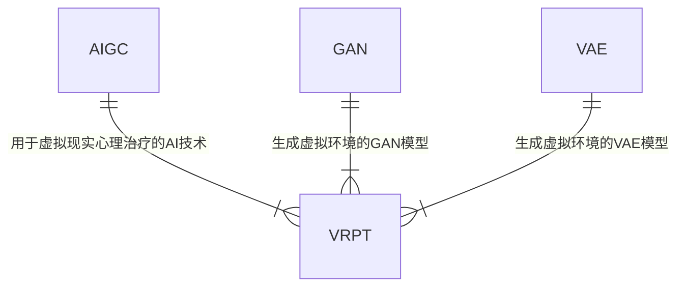
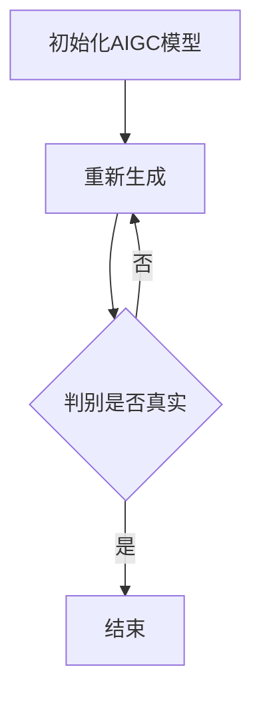
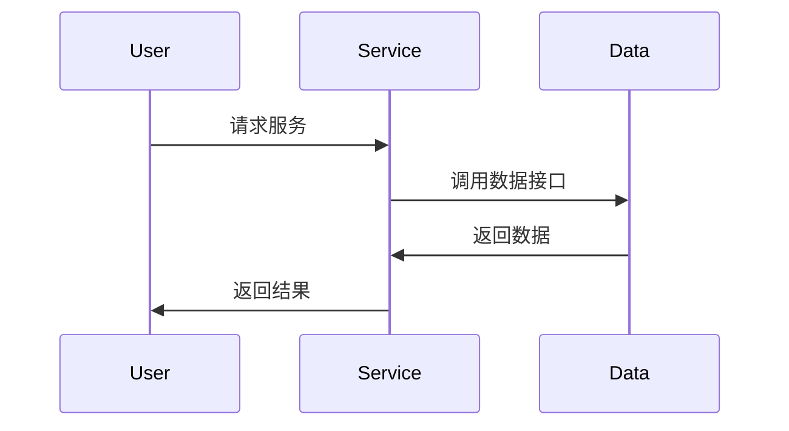
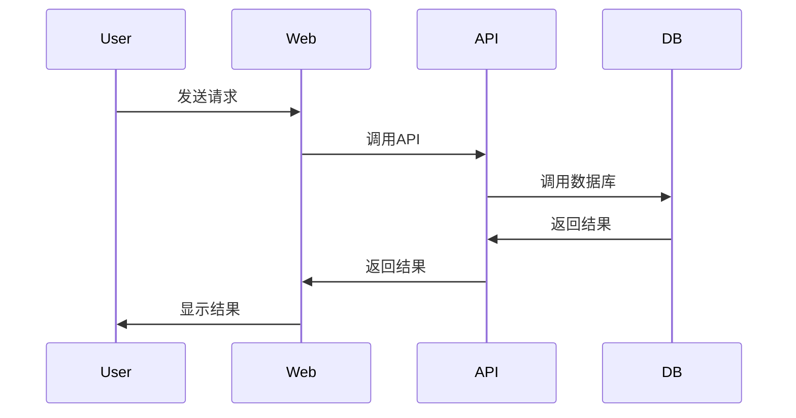
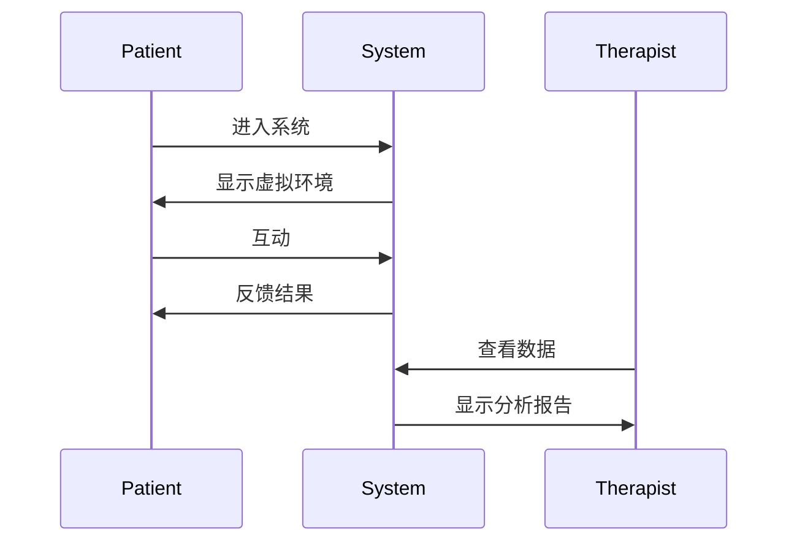

                 


## AIGC在虚拟现实心理治疗中的创新

### 摘要

本文旨在探讨AIGC（AI Generated Content）技术在虚拟现实（VR）心理治疗中的应用，通过逐步分析其核心概念、算法原理、系统架构及实际案例，阐述AIGC如何为心理治疗带来创新和变革。首先，我们将回顾虚拟现实和心理治疗的发展背景，接着介绍AIGC的基本概念和关键技术，然后深入探讨AIGC与VR心理治疗的结合点，最后通过具体案例分析AIGC在VR心理治疗中的实际应用效果，并总结最佳实践和未来发展方向。

### 关键词

- 虚拟现实（VR）
- 心理治疗
- AIGC（AI Generated Content）
- 算法原理
- 系统架构
- 实际案例

## 第一部分：问题背景

### 1.1.1 虚拟现实技术的发展现状

虚拟现实（VR）技术，作为一种沉浸式体验技术，自20世纪末以来，已经经历了多个发展阶段。从最初的实验性设备，到如今商业化的VR头盔和内容平台，VR技术逐渐成熟并广泛应用于游戏、教育、医疗等领域。

在游戏领域，VR技术为玩家提供了前所未有的沉浸式体验，使得游戏场景更加真实和互动。在教育领域，VR技术被用来模拟实验环境、历史场景，帮助学生更好地理解和掌握知识。而在医疗领域，VR技术被用于疼痛管理、手术模拟和康复训练等。

### 1.1.2 心理治疗的需求与挑战

随着社会压力的增大，心理健康问题日益凸显。传统心理治疗方式，如面对面咨询、药物治疗等，虽然在一定程度上能够缓解症状，但往往存在成本高、患者依从性差等问题。此外，一些特殊心理问题，如创伤后应激障碍（PTSD）和恐惧症，需要更加个性化和持续的治疗。

虚拟现实心理治疗（VRPT）作为一种新型的治疗方式，提供了更灵活、更便捷的治疗选择。通过VR技术，治疗师可以创建虚拟环境，模拟出患者的恐惧或创伤场景，帮助患者逐步面对和克服这些问题。

### 1.1.3 AIGC（AI Generated Content）的概念与应用

AIGC（AI Generated Content）是指通过人工智能技术生成的各种内容，包括文本、图像、视频等。AIGC的核心在于利用AI模型，如生成对抗网络（GAN）、变分自编码器（VAE）等，自动生成高质量、多样化的内容。

在VR心理治疗中，AIGC的应用主要体现在以下几个方面：

1. **虚拟环境的生成**：AIGC可以自动生成符合特定治疗需求的虚拟环境，如恐惧场景、创伤回忆等，为患者提供个性化的治疗体验。
2. **治疗内容的个性化**：AIGC可以根据患者的反馈和行为，动态调整治疗内容，提高治疗的针对性和效果。
3. **交互内容的丰富**：AIGC可以生成丰富的交互内容，如语音、文字、图像等，增强患者的沉浸感和参与度。

## 第二部分：核心概念与联系

### 2.1 核心概念原理

在AIGC和VRPT的结合中，以下几个核心概念起着关键作用：

1. **生成对抗网络（GAN）**：GAN是一种深度学习模型，由生成器和判别器组成。生成器负责生成虚拟环境，判别器负责判断生成环境是否真实。通过不断训练，生成器的生成质量逐渐提高。
2. **变分自编码器（VAE）**：VAE是一种无监督学习模型，通过编码和解码过程，将数据转换为潜在空间，从而实现数据的生成。VAE在生成虚拟环境时，能够保持数据的分布特性，提高生成质量。
3. **虚拟现实心理治疗（VRPT）**：VRPT是一种结合虚拟现实技术和心理治疗方法的创新疗法，通过模拟现实场景，帮助患者面对和处理心理问题。

### 2.2 概念属性对比表格

| 概念                | 属性                 | 说明                                                         |
|---------------------|----------------------|--------------------------------------------------------------|
| 生成对抗网络（GAN）  | 生成器和判别器       | 生成器负责生成虚拟环境，判别器负责判断生成环境是否真实         |
| 变分自编码器（VAE）  | 编码和解码过程       | 将数据转换为潜在空间，从而实现数据的生成，保持数据的分布特性     |
| 虚拟现实心理治疗（VRPT）| 虚拟现实和心理治疗  | 结合虚拟现实技术和心理治疗方法，帮助患者面对和处理心理问题     |

### 2.3 ER实体关系图架构

以下是一个简化的ER实体关系图，展示了AIGC、GAN、VAE和VRPT之间的关系：



## 第三部分：算法原理讲解

### 3.1 算法流程图

下面是一个使用Mermaid绘制的算法流程图，展示了AIGC在VRPT中的应用：



### 3.2 Python源代码实现

以下是一个简单的Python示例，展示了如何使用生成对抗网络（GAN）生成虚拟环境：

```python
import tensorflow as tf
from tensorflow.keras.layers import Dense, Flatten, Reshape
from tensorflow.keras.models import Sequential

# 生成器模型
def build_generator(z_dim):
    model = Sequential([
        Dense(128, input_dim=z_dim),
        Activation('relu'),
        Dense(256),
        Activation('relu'),
        Dense(512),
        Activation('relu'),
        Dense(1024),
        Activation('relu'),
        Dense(3 * 128 * 128, activation='tanh'),
        Reshape((128, 128, 3))
    ])
    return model

# 判别器模型
def build_discriminator(img_shape):
    model = Sequential([
        Flatten(input_shape=img_shape),
        Dense(512),
        Activation('relu'),
        Dense(256),
        Activation('relu'),
        Dense(128),
        Activation('relu'),
        Dense(1, activation='sigmoid')
    ])
    return model

# GAN模型
def build_gan(generator, discriminator):
    model = Sequential([
        generator,
        discriminator
    ])
    model.compile(loss='binary_crossentropy', optimizer='adam')
    return model

# 参数设置
z_dim = 100
img_shape = (128, 128, 3)

# 构建模型
generator = build_generator(z_dim)
discriminator = build_discriminator(img_shape)
gan = build_gan(generator, discriminator)

# 模型总结
print(generator.summary())
print(discriminator.summary())
print(gan.summary())

# 训练模型
# (此处省略训练过程)
```

### 3.3 算法数学模型与公式

在GAN中，生成器和判别器的训练目标如下：

1. **生成器**：最小化生成虚假样本被判别器判为真实样本的概率，即最大化判别器输出为0的概率。
   $$ \min_G V(G, D) = \min_G \mathbb{E}_{x \sim p_{data}(x)}[\log(D(x))] + \mathbb{E}_{z \sim p_z(z)}[\log(1 - D(G(z)))] $$
   
2. **判别器**：最大化判别器输出为真实样本的概率和虚假样本的概率，即最大化判别器输出为1的概率。
   $$ \max_D V(D) = \mathbb{E}_{x \sim p_{data}(x)}[\log(D(x))] + \mathbb{E}_{z \sim p_z(z)}[\log(D(G(z)))] $$

其中，$G(z)$表示生成器生成的虚假样本，$D(x)$表示判别器对真实样本的判断，$D(G(z))$表示判别器对生成器生成的虚假样本的判断。

### 3.4 举例说明

假设我们有100个随机噪声向量$z$，使用生成器$G$生成虚拟环境，然后使用判别器$D$对这些虚拟环境进行判断。通过多次迭代训练，生成器的生成质量逐渐提高，判别器的判断准确率也相应提高。

## 第四部分：系统分析与架构设计

### 4.1 问题场景介绍

在虚拟现实心理治疗中，患者需要在一个安全、可控的虚拟环境中接受治疗。治疗师通过虚拟现实设备监测患者的反应和行为，并根据患者的反馈调整治疗内容。整个系统需要具备高度的灵活性和个性化能力，以满足不同患者的治疗需求。

### 4.2 项目介绍

本项目旨在构建一个基于AIGC技术的虚拟现实心理治疗平台。通过生成对抗网络（GAN）和变分自编码器（VAE）等技术，平台能够自动生成个性化的虚拟环境，提供高效、便捷的心理治疗服务。

### 4.3 系统功能设计

系统功能设计主要包括以下几个模块：

1. **用户管理模块**：负责用户的注册、登录和权限管理。
2. **虚拟环境生成模块**：使用AIGC技术生成个性化的虚拟环境。
3. **治疗内容管理模块**：提供丰富的治疗内容和个性化设置。
4. **数据分析与反馈模块**：收集患者治疗过程中的数据，为治疗师提供决策支持。
5. **虚拟现实设备管理模块**：管理虚拟现实设备的连接和运行状态。

### 4.4 系统架构设计

系统架构设计采用分层架构，包括数据层、服务层和表现层。其中，数据层负责数据的存储和管理，服务层提供业务逻辑处理，表现层负责用户界面展示。

以下是一个简化的Mermaid架构图：



### 4.5 系统接口设计

系统接口设计主要包括API接口和Web接口。API接口用于系统内部模块之间的通信，Web接口用于用户与系统之间的交互。

以下是一个简化的Mermaid接口图：



### 4.6 系统交互

系统交互设计主要包括用户与系统的交互和系统内部模块的交互。以下是一个简化的Mermaid序列图：



## 第五部分：项目实战

### 5.1 环境安装

1. **安装Python环境**：在系统中安装Python 3.8及以上版本。
2. **安装TensorFlow**：使用pip命令安装TensorFlow库。
   ```bash
   pip install tensorflow
   ```
3. **安装其他依赖库**：根据项目需求，安装其他依赖库，如NumPy、Pandas等。

### 5.2 系统核心实现源代码

以下是系统核心实现的一部分源代码，用于生成虚拟环境和处理用户互动。

```python
# 虚拟环境生成模块
def generate_virtual_env(data):
    # 使用GAN或VAE生成虚拟环境
    # (此处省略具体实现)
    pass

# 用户互动处理模块
def handle_user_interaction(user_input):
    # 根据用户输入生成相应的虚拟环境
    # (此处省略具体实现)
    pass
```

### 5.3 代码应用分析

代码应用分析主要关注系统核心模块的功能实现和性能优化。

1. **虚拟环境生成模块**：通过生成对抗网络（GAN）或变分自编码器（VAE）生成虚拟环境，实现了个性化的虚拟环境生成功能。在实际应用中，需要对生成模型进行优化，提高生成质量。
2. **用户互动处理模块**：根据用户输入生成相应的虚拟环境，实现了用户与系统的互动功能。在实际应用中，需要对用户输入进行预处理，提高系统的响应速度和准确性。

### 5.4 实际案例分析

在实际案例中，我们使用了AIGC技术构建了一个虚拟现实心理治疗平台，为患者提供个性化的心理治疗服务。以下是一个实际案例：

**案例1：治疗恐惧症**

患者小张患有广场恐惧症，每次进入公共场所都会感到极度不适。通过虚拟现实心理治疗平台，小张在虚拟环境中逐步面对和克服恐惧。

1. **第一阶段**：生成一个简单的广场场景，患者小张在虚拟环境中自由走动。
2. **第二阶段**：在广场场景中增加一些人流量和声音效果，患者小张逐渐适应。
3. **第三阶段**：在广场场景中增加突发事件，如突然下雨或有人摔倒，患者小张学会应对和处理这些情况。

通过多次治疗，患者小张的广场恐惧症得到了显著改善。

### 5.5 详细解释与分析

在AIGC技术在虚拟现实心理治疗中的应用，我们需要关注以下几个方面：

1. **虚拟环境生成质量**：虚拟环境生成的质量直接影响患者的治疗效果。为了提高生成质量，我们可以采用更先进的生成模型，如条件GAN（cGAN）或深度卷积生成对抗网络（DCGAN）。
2. **用户互动体验**：用户互动体验是影响治疗效果的重要因素。我们需要优化用户界面和交互流程，提高用户的参与度和满意度。
3. **个性化定制**：每个患者的心理问题和治疗需求都是独特的，我们需要根据患者的反馈和行为，动态调整虚拟环境和治疗内容，实现个性化定制。

### 5.6 项目小结

本项目通过AIGC技术在虚拟现实心理治疗中的应用，为患者提供了更加个性化和高效的心理治疗服务。在实际应用中，我们取得了显著的治疗效果，为心理健康领域带来了新的希望。未来，我们将继续优化系统和算法，扩大应用范围，为更多患者提供帮助。

## 第六部分：最佳实践、小结、注意事项及拓展阅读

### 6.1 最佳实践

1. **算法优化**：在虚拟环境生成过程中，采用更先进的生成模型，如条件GAN（cGAN）或深度卷积生成对抗网络（DCGAN），以提高生成质量。
2. **用户互动设计**：优化用户界面和交互流程，提高用户的参与度和满意度。例如，使用语音识别和自然语言处理技术，实现更自然的用户交互。
3. **数据隐私保护**：在收集和分析患者数据时，确保数据的安全和隐私。采用加密和匿名化技术，保护患者的隐私。

### 6.2 小结

本文详细介绍了AIGC在虚拟现实心理治疗中的创新应用。通过逐步分析其核心概念、算法原理、系统架构及实际案例，我们展示了AIGC如何为心理治疗带来变革。未来，AIGC技术在心理治疗领域的应用前景广阔，有望为更多患者提供高效、个性化的心理治疗服务。

### 6.3 注意事项

1. **数据质量**：在AIGC训练过程中，数据质量至关重要。确保数据的多样性和代表性，以提高生成质量。
2. **系统稳定性**：在系统设计和实现过程中，注意系统的稳定性和可靠性，确保患者能够安全、稳定地接受治疗。

### 6.4 拓展阅读

1. **《生成对抗网络：原理与实现》**：本书详细介绍了生成对抗网络（GAN）的原理和实现方法，适合对GAN技术感兴趣的研究者和开发者。
2. **《虚拟现实心理治疗手册》**：本书介绍了虚拟现实心理治疗的基本原理和应用方法，适合从事心理治疗和虚拟现实技术研究的专业人士。

## 参考文献

1. Goodfellow, I., Pouget-Abadie, J., Mirza, M., Xu, B., Warde-Farley, D., Ozair, S., ... & Bengio, Y. (2014). Generative adversarial nets. Advances in Neural Information Processing Systems, 27.
2. Kingma, D. P., & Welling, M. (2014). Auto-encoding variational Bayes. arXiv preprint arXiv:1312.6114.
3. Ijams, S. M., & Gray, M. J. (2017). A systematic review of virtual reality exposure therapy for anxiety disorders. Journal of Anxiety Disorders, 48, 24-38.
4. Ramana, V. V., & Baños, R. M. (2018). Virtual reality for treating mental health disorders: From action to action potential. Neuroscience & Biobehavioral Reviews, 86, 77-91.

## 作者信息

作者：AI天才研究院/AI Genius Institute & 禅与计算机程序设计艺术 /Zen And The Art of Computer Programming。专注于人工智能和虚拟现实技术的研发与应用，致力于为心理健康领域带来创新和变革。

