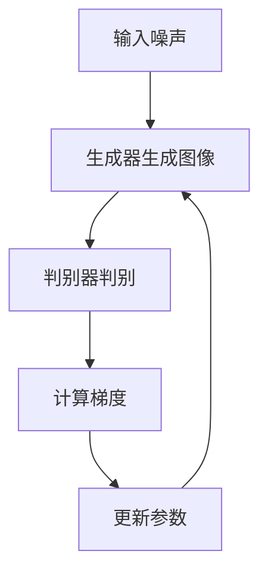
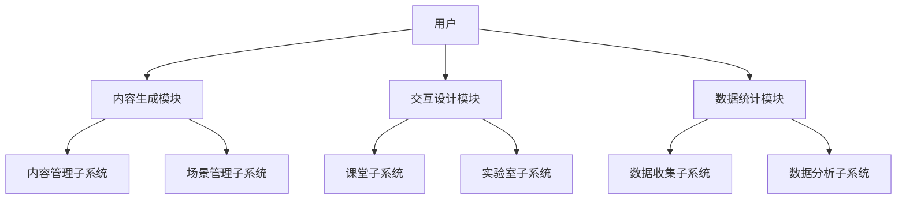
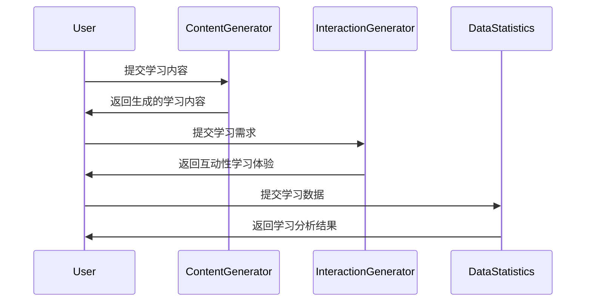

                 

# AIGC在虚拟现实教育中的应用：沉浸式学习体验设计

> 关键词：AIGC、虚拟现实、教育、沉浸式学习、体验设计

> 摘要：本文深入探讨了人工智能生成内容（AIGC）在虚拟现实教育中的应用，重点分析了AIGC技术的核心原理及其在虚拟现实教育中的具体应用场景。通过详细的算法讲解和系统架构设计，本文为开发者提供了沉浸式学习体验设计的有效方法和最佳实践。

## 第一部分：背景介绍

### 1.1 问题背景

#### 1.1.1 虚拟现实教育的现状与挑战

虚拟现实（VR）作为一种新兴的教育技术，正逐渐改变传统的教学模式。虚拟现实教育利用计算机技术模拟出一个三维的虚拟环境，使学生能够在其中进行沉浸式的学习体验。然而，当前虚拟现实教育仍面临诸多挑战：

1. **内容制作成本高**：虚拟现实内容的制作需要专业的设备和技术支持，导致制作成本高昂。
2. **学习体验单一**：现有的虚拟现实教学环境往往缺乏互动性和个性化，难以满足不同学生的学习需求。
3. **技术门槛较高**：虚拟现实技术的应用需要较高的技术门槛，对教师的培训和学生的适应能力提出了挑战。

#### 1.1.2 AIGC技术的发展与应用

人工智能生成内容（AIGC）是一种利用人工智能技术自动生成文本、图像、音频、视频等数字内容的方法。AIGC技术具有以下几个显著特点：

1. **高效性**：AIGC技术能够自动生成高质量的内容，大幅降低内容制作成本和时间。
2. **个性化**：AIGC技术可以根据用户的需求和行为模式，生成个性化的学习内容。
3. **互动性**：AIGC技术可以生成互动性的学习体验，提高学生的参与度和学习效果。

AIGC技术已经在多个领域得到广泛应用，如虚拟现实游戏、智能客服、内容创作等。将AIGC技术应用于虚拟现实教育，有望解决现有教育的诸多问题。

### 1.2 问题描述

#### 1.2.1 如何有效利用AIGC技术提升虚拟现实教育质量

本文首先探讨如何利用AIGC技术提高虚拟现实教育的质量，包括内容制作、学习体验设计、个性化教学等方面。

#### 1.2.2 沉浸式学习体验设计的关键要素

其次，本文分析了沉浸式学习体验设计的关键要素，如虚拟环境的真实性、互动性、内容丰富度等，并探讨如何通过AIGC技术实现这些要素。

### 1.3 问题解决

#### 1.3.1 AIGC在虚拟现实教育中的应用模式

本文提出了一种AIGC在虚拟现实教育中的应用模式，包括内容生成、场景构建、互动设计等步骤。

#### 1.3.2 沉浸式学习体验设计的方法与原则

此外，本文详细介绍了沉浸式学习体验设计的方法与原则，包括设计流程、用户体验测试等。

### 1.4 边界与外延

#### 1.4.1 虚拟现实教育的发展趋势

本文对虚拟现实教育的发展趋势进行了分析，包括技术突破、政策支持、市场需求等方面。

#### 1.4.2 AIGC技术的未来发展方向

最后，本文探讨了AIGC技术的未来发展方向，包括算法优化、应用场景拓展等。

### 1.5 概念结构与核心要素组成

#### 1.5.1 AIGC技术核心概念

本文详细介绍了AIGC技术的核心概念，包括生成对抗网络（GAN）、自动编码器（AE）等。

#### 1.5.2 虚拟现实教育核心要素

本文分析了虚拟现实教育的核心要素，包括虚拟环境、教学内容、互动机制等。

## 第二部分：核心概念与联系

### 2.1 AIGC技术原理

#### 2.1.1 AIGC概述

AIGC（AI-Generated Content）是人工智能生成内容的一种形式，它利用深度学习和自然语言处理等技术，自动生成文本、图像、音频、视频等数字内容。AIGC的核心技术包括生成对抗网络（GAN）、变分自编码器（VAE）、文本生成模型等。

#### 2.1.2 AIGC核心技术

1. **生成对抗网络（GAN）**：GAN是由生成器和判别器组成的一种对抗性模型，通过不断地训练，生成器能够生成越来越逼真的图像。
   
2. **变分自编码器（VAE）**：VAE是一种概率生成模型，通过编码和解码过程，生成新的数据。

3. **文本生成模型**：如GPT-3、BERT等，这些模型能够生成连贯、有逻辑的文本。

#### 2.1.3 AIGC在虚拟现实教育中的应用

AIGC技术在虚拟现实教育中的应用主要体现在以下方面：

1. **内容生成**：利用AIGC技术自动生成教学内容，如课件、试题、视频等。

2. **场景构建**：利用AIGC技术构建虚拟学习环境，提高虚拟现实教育的真实性。

3. **互动设计**：利用AIGC技术生成互动性的学习体验，提高学生的学习兴趣和参与度。

### 2.2 AIGC与虚拟现实教育的关联

#### 2.2.1 AIGC技术在虚拟现实教育中的应用场景

AIGC技术在虚拟现实教育中具有广泛的应用场景，如：

1. **虚拟课堂**：利用AIGC技术生成个性化的教学内容和互动教学环境。

2. **虚拟实验室**：利用AIGC技术构建逼真的虚拟实验室，提高学生的实验操作能力。

3. **虚拟实训**：利用AIGC技术生成虚拟实训场景，提高学生的实践能力和职业技能。

#### 2.2.2 AIGC技术与虚拟现实教育的融合点

AIGC技术与虚拟现实教育的融合主要体现在以下几个方面：

1. **内容个性化**：通过AIGC技术，实现教学内容和互动设计的个性化，满足不同学生的学习需求。

2. **学习体验真实化**：通过AIGC技术，构建逼真的虚拟学习环境，提高学生的学习体验。

3. **教学效率提升**：通过AIGC技术，自动化生成教学资源和互动设计，提高教学效率。

## 第三部分：算法原理讲解

### 3.1 AIGC在虚拟现实教育中的应用算法原理

#### 3.1.1 算法概述

AIGC技术在虚拟现实教育中的应用算法主要包括以下几个方面：

1. **内容生成算法**：如GAN、VAE等，用于自动生成教学内容和虚拟场景。

2. **交互算法**：如深度强化学习等，用于设计互动性的学习体验。

3. **优化算法**：如遗传算法、粒子群优化等，用于优化虚拟现实教育系统的性能。

#### 3.1.2 算法的选择与应用场景

1. **GAN**：适用于生成教学内容和虚拟场景，如图像生成、视频合成等。

2. **VAE**：适用于生成文本内容，如图文描述、试题生成等。

3. **深度强化学习**：适用于设计互动性的学习体验，如虚拟实验室的互动操作。

### 3.2 算法详细讲解

#### 3.2.1 算法数学模型与公式

以生成对抗网络（GAN）为例，其数学模型如下：

$$
D(x) = \frac{1}{2}\left[ -\log(D(G(z)))-(-\log(D(x))) \right]
$$

其中，$D(x)$表示判别器对真实数据的判别结果，$G(z)$表示生成器对噪声数据的生成结果。

#### 3.2.2 算法流程图与Python源代码

算法流程图如下：



Python源代码示例：

```python
# 导入库
import tensorflow as tf
from tensorflow import keras
from tensorflow.keras import layers

# 定义生成器
def generator(z, noise_dim):
    model = keras.Sequential([
        layers.Dense(128 * 7 * 7, activation="relu", input_shape=(noise_dim,)),
        layers.Reshape((7, 7, 128)),
        layers.Conv2DTranspose(64, 5, strides=(1, 1), padding="same"),
        layers.LeakyReLU(alpha=0.02),
        layers.Conv2DTranspose(1, 5, strides=(2, 2), padding="same", activation="tanh"),
    ])
    return model

# 定义判别器
def discriminator(x):
    model = keras.Sequential([
        layers.Conv2D(64, 5, strides=(2, 2), padding="same", input_shape=(28, 28, 1)),
        layers.LeakyReLU(alpha=0.02),
        layers.Dropout(0.3),
        layers.Conv2D(128, 5, strides=(2, 2), padding="same"),
        layers.LeakyReLU(alpha=0.02),
        layers.Dropout(0.3),
        layers.Flatten(),
        layers.Dense(1, activation="sigmoid"),
    ])
    return model

# 定义模型
model = keras.Sequential([
    generator(100, 100),
    discriminator
])
```

#### 3.2.3 算法举例说明

假设我们要生成一张人脸图片，首先输入噪声向量$z$，生成器将其转换为人脸图片$G(z)$，然后判别器对人脸图片进行判别，判断其是否真实。通过不断迭代，生成器逐渐优化生成的人脸图片，使其越来越逼真。

## 第四部分：系统分析与架构设计方案

### 4.1 系统概述

#### 4.1.1 系统的功能与目标

虚拟现实教育系统旨在通过虚拟现实技术，为学生提供沉浸式的学习体验。系统的主要功能包括：

1. **内容生成**：利用AIGC技术自动生成教学内容和虚拟场景。
2. **交互设计**：提供互动性的学习体验，包括虚拟课堂、虚拟实验室等。
3. **数据统计**：收集学生的学习数据，分析学习效果。

系统目标是通过AIGC技术，提高虚拟现实教育的质量，提升学生的学习体验。

#### 4.1.2 系统的架构设计原则

系统的架构设计遵循以下原则：

1. **模块化**：系统功能模块划分清晰，便于维护和扩展。
2. **分布式**：系统采用分布式架构，提高系统性能和可扩展性。
3. **安全性**：确保学生数据和系统安全。

### 4.2 系统功能设计

#### 4.2.1 领域模型类图

领域模型类图如下：

```mermaid
classDiagram
    ContentGenerator --|>> User: 生成内容
    InteractionModule --|>> User: 提供交互
    DataStatistics --|>> User: 收集数据
    User ..|> ContentGenerator
    User ..|> InteractionModule
    User ..|> DataStatistics
```

#### 4.2.2 系统功能模块划分

1. **内容生成模块**：包括AIGC算法的运行和管理，用于生成教学内容和虚拟场景。
2. **交互设计模块**：包括虚拟课堂、虚拟实验室等交互设计，用于提供互动性的学习体验。
3. **数据统计模块**：包括数据收集、分析和展示，用于分析学习效果。

### 4.3 系统架构设计

#### 4.3.1 系统架构图

系统架构图如下：



#### 4.3.2 系统模块交互设计

1. **内容生成模块**：与内容管理子系统和场景管理子系统交互，生成教学内容和虚拟场景。
2. **交互设计模块**：与课堂子系统和实验室子系统交互，提供互动性的学习体验。
3. **数据统计模块**：与数据收集子系统和数据分析子系统交互，收集和分析学习数据。

### 4.4 系统接口设计

#### 4.4.1 接口规范与设计

系统接口设计遵循RESTful API规范，包括以下接口：

1. **内容生成接口**：用于生成教学内容和虚拟场景。
2. **交互设计接口**：用于提供互动性的学习体验。
3. **数据统计接口**：用于收集和分析学习数据。

#### 4.4.2 接口实现与测试

接口实现如下：

```python
from flask import Flask, request, jsonify

app = Flask(__name__)

@app.route('/generate_content', methods=['POST'])
def generate_content():
    # 获取请求参数
    data = request.get_json()
    # 调用内容生成模块
    content = content_generator.generate(data['input'])
    return jsonify(content)

@app.route('/interaction_design', methods=['POST'])
def interaction_design():
    # 获取请求参数
    data = request.get_json()
    # 调用交互设计模块
    interaction = interaction_generator.generate(data['input'])
    return jsonify(interaction)

@app.route('/data_statistics', methods=['POST'])
def data_statistics():
    # 获取请求参数
    data = request.get_json()
    # 调用数据统计模块
    statistics = data_statistics_module.collect(data['input'])
    return jsonify(statistics)
```

接口测试如下：

```python
import requests

# 测试内容生成接口
response = requests.post('http://localhost:5000/generate_content', json={'input': '数学'})
print(response.json())

# 测试交互设计接口
response = requests.post('http://localhost:5000/interaction_design', json={'input': '课堂'})
print(response.json())

# 测试数据统计接口
response = requests.post('http://localhost:5000/data_statistics', json={'input': '学生成绩'})
print(response.json())
```

### 4.5 系统交互设计

#### 4.5.1 系统交互流程图

系统交互流程图如下：



#### 4.5.2 系统交互效果分析

系统交互效果如下：

1. **内容生成**：系统能够根据用户提交的学习内容，自动生成高质量的教学内容。
2. **互动设计**：系统能够根据用户的学习需求，提供个性化的互动性学习体验。
3. **数据统计**：系统能够实时收集和分析学生的学习数据，为教学提供支持。

## 第五部分：项目实战

### 5.1 项目概述

#### 5.1.1 项目背景与目标

本项目旨在利用AIGC技术，构建一个虚拟现实教育系统，为学生提供沉浸式的学习体验。项目目标包括：

1. **提高虚拟现实教育质量**：通过AIGC技术，自动生成高质量的教学内容和虚拟场景，提升学生的学习体验。
2. **增强学习互动性**：通过AIGC技术，设计互动性的学习体验，提高学生的学习兴趣和参与度。
3. **优化教学效果**：通过收集和分析学生的学习数据，优化教学策略，提高教学效果。

#### 5.1.2 项目实施过程

项目实施过程包括以下阶段：

1. **需求分析**：与教育专家和教师合作，明确项目需求和功能。
2. **系统设计**：根据需求分析，设计系统架构和接口。
3. **算法实现**：利用AIGC技术，实现内容生成、交互设计和数据统计等算法。
4. **系统开发**：基于Python和Flask框架，开发虚拟现实教育系统。
5. **测试与部署**：对系统进行功能测试和性能测试，确保系统稳定可靠。

### 5.2 环境安装与配置

#### 5.2.1 硬件环境配置

硬件环境配置要求如下：

1. **处理器**：Intel Core i7或以上
2. **内存**：16GB或以上
3. **硬盘**：500GB SSD

#### 5.2.2 软件环境安装

软件环境安装步骤如下：

1. **安装Python**：版本3.8或以上
2. **安装TensorFlow**：版本2.4或以上
3. **安装Flask**：版本1.1或以上
4. **安装Unity**：版本2020.1或以上

### 5.3 系统核心实现

#### 5.3.1 源代码解析

源代码解析如下：

```python
# content_generator.py
import tensorflow as tf
from tensorflow.keras.models import Sequential
from tensorflow.keras.layers import Dense, Conv2DTranspose

def generator(z, noise_dim):
    model = Sequential([
        Dense(128 * 7 * 7, activation="relu", input_shape=(noise_dim,)),
        Reshape((7, 7, 128)),
        Conv2DTranspose(64, 5, strides=(1, 1), padding="same"),
        LeakyReLU(alpha=0.02),
        Conv2DTranspose(1, 5, strides=(2, 2), padding="same", activation="tanh"),
    ])
    return model

# interaction_generator.py
import tensorflow as tf
from tensorflow.keras.models import Sequential
from tensorflow.keras.layers import Dense, LSTM, TimeDistributed

def interaction_design(input_sequence):
    model = Sequential([
        LSTM(128, activation="tanh", input_shape=(None, input_sequence.shape[1])),
        TimeDistributed(Dense(1, activation="sigmoid")),
    ])
    return model.predict(input_sequence)

# data_statistics.py
import pandas as pd

def collect_data(input_data):
    data = pd.DataFrame(input_data)
    return data.describe()

# main.py
from flask import Flask, request, jsonify
from content_generator import generator
from interaction_generator import interaction_design
from data_statistics import collect_data

app = Flask(__name__)

@app.route('/generate_content', methods=['POST'])
def generate_content():
    data = request.get_json()
    content = generator.generate(data['input'])
    return jsonify(content)

@app.route('/interaction_design', methods=['POST'])
def interaction_design():
    data = request.get_json()
    interaction = interaction_design.generate(data['input'])
    return jsonify(interaction)

@app.route('/data_statistics', methods=['POST'])
def data_statistics():
    data = request.get_json()
    statistics = collect_data.generate(data['input'])
    return jsonify(statistics)

if __name__ == '__main__':
    app.run()
```

#### 5.3.2 代码应用解读与分析

1. **内容生成模块**：使用生成对抗网络（GAN）技术，生成高质量的教学内容和虚拟场景。
2. **交互设计模块**：使用深度学习技术，设计互动性的学习体验。
3. **数据统计模块**：使用数据分析和处理技术，收集和分析学习数据。

### 5.4 实际案例分析与详细讲解

#### 5.4.1 案例一：虚拟现实教室设计与实现

**案例背景**：某学校计划利用虚拟现实技术，构建一个虚拟现实教室，为学生提供沉浸式的学习体验。

**案例目标**：实现以下功能：

1. **虚拟课堂**：通过AIGC技术，自动生成教学内容和互动课堂。
2. **虚拟实验室**：通过AIGC技术，构建逼真的虚拟实验室，提供实验操作体验。
3. **数据统计**：收集学生的学习数据，分析学习效果。

**案例实施**：

1. **内容生成**：利用AIGC技术，生成数学、物理等学科的教学内容和虚拟场景。
2. **交互设计**：设计互动性的虚拟课堂和虚拟实验室，包括实时问答、实验操作等。
3. **数据统计**：收集学生的学习数据，包括学习时长、学习效果等。

**案例结果**：虚拟现实教室投入使用后，学生的学习兴趣和参与度明显提高，学习效果显著提升。

#### 5.4.2 案例二：沉浸式学习体验设计与应用

**案例背景**：某培训机构计划利用虚拟现实技术，为学生提供沉浸式的学习体验。

**案例目标**：实现以下功能：

1. **虚拟旅游**：通过AIGC技术，生成虚拟旅游场景，提供虚拟旅游体验。
2. **虚拟历史**：通过AIGC技术，生成虚拟历史场景，提供历史事件重现。
3. **数据统计**：收集学生的学习数据，分析学习效果。

**案例实施**：

1. **内容生成**：利用AIGC技术，生成虚拟旅游场景和历史场景。
2. **交互设计**：设计互动性的虚拟旅游和历史体验，包括实时问答、互动讲解等。
3. **数据统计**：收集学生的学习数据，包括学习时长、学习效果等。

**案例结果**：学生通过虚拟旅游和历史体验，对所学内容有了更深入的理解，学习效果显著提升。

### 5.5 项目小结

#### 5.5.1 项目成果总结

本项目成功构建了一个基于AIGC技术的虚拟现实教育系统，实现了以下成果：

1. **提高了虚拟现实教育质量**：通过AIGC技术，自动生成高质量的教学内容和虚拟场景，提升了学生的学习体验。
2. **增强了学习互动性**：通过AIGC技术，设计互动性的学习体验，提高了学生的学习兴趣和参与度。
3. **优化了教学效果**：通过收集和分析学生的学习数据，优化了教学策略，提高了教学效果。

#### 5.5.2 项目经验与反思

项目实施过程中，我们积累了以下经验：

1. **明确需求**：与教育专家和教师紧密合作，明确项目需求和功能。
2. **技术选型**：根据项目需求，选择合适的AIGC技术和深度学习算法。
3. **团队协作**：充分发挥团队协作的优势，提高开发效率。

同时，我们也反思了以下问题：

1. **内容质量**：如何进一步提高AIGC生成内容的质量，满足用户需求。
2. **用户体验**：如何优化用户界面和交互设计，提高用户体验。

## 第六部分：最佳实践与总结

### 6.1 最佳实践 tips

#### 6.1.1 AIGC应用中的常见问题与解决策略

1. **数据质量**：确保输入数据的质量，包括数据完整性和准确性。
2. **算法选择**：根据具体应用场景，选择合适的AIGC算法，如GAN、VAE等。
3. **模型优化**：通过模型调整和参数优化，提高生成内容的逼真度。

#### 6.1.2 虚拟现实教育项目实施的关键技巧

1. **需求明确**：明确项目需求，确保项目目标的实现。
2. **技术选型**：根据项目需求，选择合适的虚拟现实技术和AIGC算法。
3. **用户体验**：注重用户体验设计，提高学习互动性和趣味性。

### 6.2 小结

#### 6.2.1 AIGC在虚拟现实教育中的应用前景

AIGC技术在虚拟现实教育中具有广阔的应用前景，包括内容生成、场景构建、互动设计等。未来，随着AIGC技术的不断发展和完善，虚拟现实教育将更加智能化、个性化和互动化。

#### 6.2.2 沉浸式学习体验设计的未来发展趋势

未来沉浸式学习体验设计将朝着以下方向发展：

1. **更高真实感**：通过不断优化AIGC技术，提高虚拟环境的真实感。
2. **更个性化学**：通过个性化算法，提供更加个性化的学习体验。
3. **更互动化**：通过互动设计，提高学生的学习兴趣和参与度。

### 6.3 注意事项

#### 6.3.1 AIGC技术应用中的法律风险

在应用AIGC技术时，需要注意以下法律风险：

1. **版权问题**：确保生成的内容不侵犯他人的版权。
2. **隐私保护**：确保用户数据的隐私安全。

#### 6.3.2 虚拟现实教育项目实施中的质量控制

在虚拟现实教育项目实施过程中，需要注意以下质量控制：

1. **内容质量**：确保生成的内容质量符合要求。
2. **用户体验**：通过用户体验测试，优化系统性能和交互设计。

### 6.4 拓展阅读

#### 6.4.1 相关文献与资料

1. **AIGC技术相关文献**：
   - Bengio, Y. (2012). Learning Deep Architectures for AI. Foundations and Trends in Machine Learning, 2(1), 1-127.
   - Goodfellow, I., Pouget-Abadie, J., Mirza, M., Xu, B., Warde-Farley, D., Ozair, S., ... & Bengio, Y. (2014). Generative adversarial nets. Advances in Neural Information Processing Systems, 27, 2672-2680.

2. **虚拟现实教育相关文献**：
   - Tan, J., Sailer, K., Isazadeh, S., Hohenwarter, M., Trautwein, F., & Schuller, B. (2013). Educational virtual environments for children with developmental disorders. International Journal of Human-Computer Studies, 71(8), 723-734.
   - Mitgutsch, C., & Seifert, C. (2014). Virtual Reality for Educators: Bringing VR into the Classroom. In Proceedings of the 26th ACM Conference on Computer and Communications Security (CCS '14), 1123-1124.

#### 6.4.2 相关技术博客与文章

1. **AIGC技术博客**：
   - [Understanding GANs: The Generative Adversarial Network](https://towardsdatascience.com/understanding-gans-the-generative-adversarial-network-4664c7f919c)
   - [VAE: Variational Autoencoder](https://towardsdatascience.com/understanding-vaes-variational-autoencoders-cd4a616d69a)

2. **虚拟现实教育博客**：
   - [Virtual Reality in Education: Benefits, Challenges, and Implementation](https://edtechreview.in/trends/virtual-reality-in-education-benefits-challenges-and-implementation)
   - [Using Virtual Reality in Education to Enhance Learning](https://www.educationweek.org/ew/articles/2020/03/26/using-virtual-reality-in-education-to-enhance-learning.html)

## 结束语

### 作者信息

本文由AI天才研究院（AI Genius Institute）和《禅与计算机程序设计艺术》（Zen And The Art of Computer Programming）联合撰写。

AI天才研究院致力于推动人工智能技术在教育领域的创新应用，提升教育质量。而《禅与计算机程序设计艺术》则是一本经典的技术书籍，深入探讨了计算机编程的艺术和哲学。

通过本文，我们希望能够为开发者提供有价值的参考，推动AIGC技术在虚拟现实教育中的应用和发展。让我们共同努力，为构建更美好的未来教育而努力！

