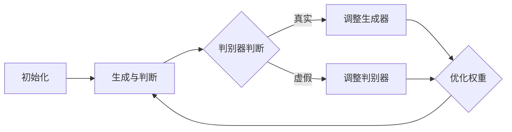
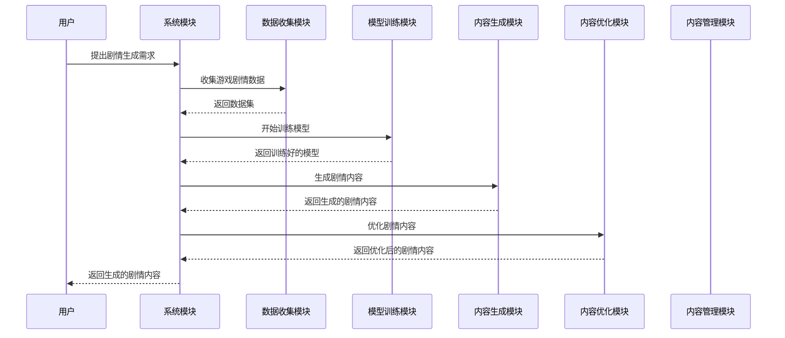
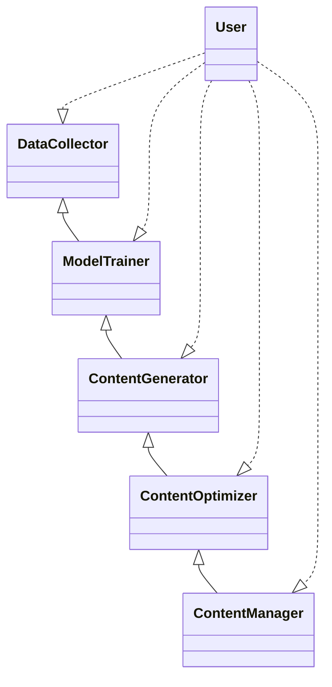
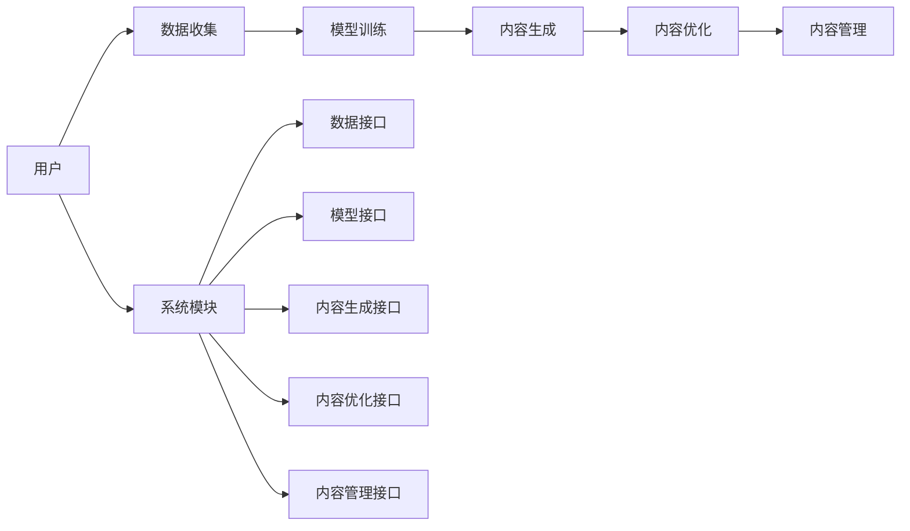
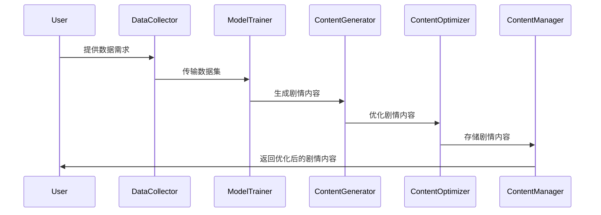

                 

### AIGC在虚拟现实游戏剧情生成中的角色

在虚拟现实（VR）技术的飞速发展背景下，AIGC（AI Generated Content）作为一种前沿的生成式人工智能技术，正在逐渐成为游戏开发中的重要力量。本文将以《AIGC在虚拟现实游戏剧情生成中的角色》为题，探讨AIGC如何通过智能算法和技术创新，在虚拟现实游戏剧情生成中发挥关键作用。

#### 关键词：
- AIGC
- 虚拟现实游戏
- 剧情生成
- 人工智能算法
- 系统架构设计

#### 摘要：
本文首先介绍了AIGC的概念和其在内容创作中的应用，然后深入探讨了虚拟现实游戏剧情生成的重要性和挑战。通过对比分析AIGC与虚拟现实游戏剧情生成的核心概念，本文进一步阐述了AIGC在虚拟现实游戏剧情生成中的具体应用和算法原理。最后，本文提供了一个系统分析与架构设计的实例，并总结了一些最佳实践和未来展望。

### 目录

1. **背景介绍**  
   1.1 AIGC概述  
   1.2 虚拟现实游戏剧情生成的需求与挑战  
   1.3 AIGC在虚拟现实游戏剧情生成中的应用

2. **核心概念与联系**  
   2.1 AIGC基本原理与流程  
   2.2 虚拟现实游戏剧情生成需求与挑战分析  
   2.3 AIGC与虚拟现实游戏剧情生成联系解析

3. **算法原理讲解**  
   3.1 AIGC算法原理讲解  
   3.2 系统分析与架构设计

4. **项目实战**  
   4.1 环境安装指南  
   4.2 系统核心实现源代码  
   4.3 代码应用解读与分析  
   4.4 实际案例分析与讲解

5. **最佳实践与项目总结**  
   5.1 AIGC在虚拟现实游戏剧情生成中的最佳实践  
   5.2 注意事项与未来展望

#### 第一部分: AIGC与虚拟现实游戏剧情生成的背景

### 1.1 AIGC概述

AIGC，即AI Generated Content，是指通过人工智能技术自动生成内容的一种方式。它涵盖了文本、图像、音频、视频等多种内容形式，是人工智能在内容创作领域的重要应用。AIGC的兴起，不仅极大地提升了内容创作的效率，还开辟了人工智能在内容产业中的新天地。

AIGC的核心技术包括自然语言处理（NLP）、计算机视觉（CV）和生成对抗网络（GAN）等。NLP技术使得人工智能能够理解和生成人类语言，CV技术则使得人工智能能够理解和生成视觉内容，而GAN技术则通过模拟对抗过程，生成出高质量的内容。

在内容创作中，AIGC的应用已经相当广泛。例如，在新闻写作中，AIGC可以自动生成新闻报道；在艺术设计领域，AIGC可以生成独特的视觉作品；在音乐创作中，AIGC可以自动生成音乐旋律和节奏。

### 1.2 虚拟现实游戏剧情生成的需求与挑战

虚拟现实游戏以其沉浸式的体验，正逐渐成为游戏市场的新宠。虚拟现实游戏不仅需要逼真的场景和丰富的互动，还需要引人入胜的剧情。因此，虚拟现实游戏剧情生成成为了一个重要的研究课题。

#### 虚拟现实游戏剧情生成的重要性

虚拟现实游戏剧情生成的重要性体现在以下几个方面：

1. **增强用户体验**：引人入胜的剧情可以极大地提升玩家的沉浸感和体验。

2. **增加游戏的可玩性**：丰富的剧情可以提供更多的故事线和发展方向，使游戏更加有趣和富有挑战性。

3. **提升游戏市场竞争力**：优秀的剧情可以为游戏带来更多的用户和口碑，从而提高市场竞争力。

#### 虚拟现实游戏剧情生成的挑战

然而，虚拟现实游戏剧情生成也面临一些挑战：

1. **内容创作成本高**：虚拟现实游戏剧情生成通常需要大量的人力和时间投入，创作成本较高。

2. **内容质量难以保证**：人工创作剧情存在主观性和不确定性，难以保证剧情的一致性和连贯性。

3. **技术实现难度大**：虚拟现实游戏剧情生成涉及到多种技术，如NLP、CV、GAN等，技术实现难度较大。

### 1.3 AIGC在虚拟现实游戏剧情生成中的应用

AIGC技术的出现，为虚拟现实游戏剧情生成提供了一种新的解决方案。通过AIGC，可以自动化生成高质量的虚拟现实游戏剧情，从而降低创作成本，提高效率，并保证剧情的一致性和连贯性。

#### AIGC在虚拟现实游戏剧情生成中的应用场景

1. **自动生成剧情**：AIGC可以通过训练大量游戏剧情数据，自动生成新的剧情内容，为游戏开发者提供丰富的剧情素材。

2. **剧情智能调整**：AIGC可以根据玩家的行为和反馈，实时调整剧情走向，提供个性化的游戏体验。

3. **剧情自动化生成与修改**：AIGC不仅可以生成剧情，还可以对现有剧情进行自动化修改和优化，以提高剧情的质量和连贯性。

#### AIGC在虚拟现实游戏剧情生成中的优势

1. **高效性**：AIGC可以大大缩短游戏剧情生成的周期，提高开发效率。

2. **灵活性**：AIGC可以根据游戏需求，灵活调整剧情内容和形式。

3. **一致性**：AIGC生成的剧情内容一致性好，可以确保剧情的连贯性和一致性。

### 总结

AIGC在虚拟现实游戏剧情生成中具有巨大的潜力。通过AIGC，可以自动化生成高质量的游戏剧情，降低创作成本，提高效率，并确保剧情的一致性和连贯性。随着AIGC技术的不断进步，我们可以期待虚拟现实游戏剧情生成迎来新的发展机遇。

#### 第二部分: AIGC核心概念与原理

### 2.1 AIGC基本原理与流程

AIGC（AI Generated Content）是生成式人工智能技术的一个重要分支，其基本原理是通过训练大量的数据集，使AI模型学会生成符合人类需求的内容。AIGC的流程主要包括数据收集、模型训练、内容生成和内容优化四个阶段。

#### 数据收集

数据收集是AIGC流程的第一步。这一阶段主要任务是收集大量的文本、图像、音频、视频等多媒体数据。这些数据可以是公开的数据集，也可以是特定领域的数据。例如，在虚拟现实游戏剧情生成中，可以收集大量的游戏剧情文本、角色设定、场景描述等数据。

#### 模型训练

在数据收集完成后，下一步是模型训练。AIGC模型通常是基于深度学习技术，如生成对抗网络（GAN）、变分自编码器（VAE）等。这些模型通过大量的数据训练，可以学会生成高质量的内容。例如，在虚拟现实游戏剧情生成中，可以训练一个基于GAN的模型，使其学会生成新的游戏剧情文本。

#### 内容生成

模型训练完成后，就可以进行内容生成。在这一阶段，AI模型根据给定的输入条件，生成新的内容。例如，在虚拟现实游戏剧情生成中，可以输入一个游戏角色和场景，AI模型会根据这些输入生成一段新的剧情文本。

#### 内容优化

生成的内容通常需要进一步优化，以满足实际需求。内容优化可以通过多种方式进行，如自动评估、人工修改等。例如，在虚拟现实游戏剧情生成中，可以采用自然语言处理（NLP）技术对生成的内容进行语法和语义评估，然后进行人工修改，以提高剧情的质量。

### 2.2 虚拟现实游戏剧情生成需求与挑战分析

虚拟现实游戏剧情生成需求主要包括以下几个方面：

1. **丰富性**：虚拟现实游戏剧情需要丰富多彩，以吸引玩家的兴趣。

2. **连贯性**：剧情内容需要连贯一致，避免出现逻辑错误或不合理的地方。

3. **个性化**：剧情内容需要能够根据玩家的行为和偏好进行个性化调整。

4. **多样性**：剧情内容需要具备多样性，以避免玩家产生厌倦感。

虚拟现实游戏剧情生成面临的挑战主要包括：

1. **内容创作成本高**：虚拟现实游戏剧情生成需要大量的数据和计算资源，创作成本较高。

2. **内容质量难以保证**：人工创作的剧情内容可能存在主观性和不确定性，难以保证剧情的一致性和连贯性。

3. **技术实现难度大**：虚拟现实游戏剧情生成涉及到多种技术，如自然语言处理（NLP）、计算机视觉（CV）、生成对抗网络（GAN）等，技术实现难度较大。

### 2.3 AIGC与虚拟现实游戏剧情生成联系解析

AIGC与虚拟现实游戏剧情生成之间的联系可以从以下几个方面进行分析：

1. **数据优势**：AIGC可以利用大量的游戏剧情数据，进行模型训练和内容生成，从而提高剧情生成的质量和效率。

2. **技术优势**：AIGC技术可以利用深度学习、自然语言处理、计算机视觉等技术，实现自动化的剧情生成和优化。

3. **个性化优势**：AIGC可以根据玩家的行为和偏好，生成个性化的游戏剧情，提高玩家的沉浸感和满意度。

#### 核心概念对比表格

| 核心概念 | AIGC | 虚拟现实游戏剧情生成 |
| :--- | :--- | :--- |
| 数据需求 | 大量多媒体数据 | 大量游戏剧情数据 |
| 技术实现 | 深度学习、NLP、CV等 | 深度学习、NLP、CV等 |
| 内容生成 | 自动化生成 | 自动化生成与优化 |
| 应用场景 | 内容创作、游戏、艺术等 | 游戏剧情生成 |

#### ER实体关系图

为了更好地理解AIGC与虚拟现实游戏剧情生成之间的联系，我们可以使用ER（Entity-Relationship）实体关系图来描述它们之间的关系。

```mermaid
erDiagram
    AIGC ||--|{ 虚拟现实游戏剧情生成 }
    AIGC ||--|{ 数据需求 }
    AIGC ||--|{ 技术实现 }
    AIGC ||--|{ 内容生成 }
    虚拟现实游戏剧情生成 ||--|{ 应用场景 }
    虚拟现实游戏剧情生成 ||--|{ 个性化优势 }
```

通过ER实体关系图，我们可以清楚地看到AIGC与虚拟现实游戏剧情生成之间的多种关联。这些关联为AIGC在虚拟现实游戏剧情生成中的应用提供了理论基础和实践指导。

### 第三部分: AIGC算法原理与系统设计

#### 3.1 AIGC算法原理讲解

AIGC（AI Generated Content）的核心技术是基于生成式对抗网络（GAN）的。GAN由两部分组成：生成器（Generator）和判别器（Discriminator）。生成器负责生成内容，判别器则负责判断生成的内容是否真实。通过不断迭代训练，生成器逐渐学会生成更加逼真的内容。

#### GAN算法流程

1. **初始化**：初始化生成器和判别器的权重。
2. **生成与判断**：生成器生成内容，判别器判断生成内容与真实内容之间的差异。
3. **优化**：通过反向传播算法，调整生成器和判别器的权重，使生成器生成更真实的内容。
4. **重复**：重复步骤2和3，直到生成器能够生成几乎无法区分真实与虚假的内容。

#### GAN算法的mermaid流程图



#### GAN算法的Python源代码

```python
import tensorflow as tf
from tensorflow.keras.layers import Dense, Flatten
from tensorflow.keras.models import Sequential

# 定义生成器模型
def create_generator():
    model = Sequential()
    model.add(Dense(256, input_shape=(100,), activation='relu'))
    model.add(Dense(512, activation='relu'))
    model.add(Dense(1024, activation='relu'))
    model.add(Dense(784, activation='tanh'))
    return model

# 定义判别器模型
def create_discriminator():
    model = Sequential()
    model.add(Flatten(input_shape=(28, 28)))
    model.add(Dense(512, activation='relu'))
    model.add(Dense(1, activation='sigmoid'))
    return model

# 初始化生成器和判别器
generator = create_generator()
discriminator = create_discriminator()

# 编译模型
generator.compile(loss='binary_crossentropy', optimizer=tf.keras.optimizers.Adam(0.0001))
discriminator.compile(loss='binary_crossentropy', optimizer=tf.keras.optimizers.Adam(0.0001))

# 打印模型结构
print(generator.summary())
print(discriminator.summary())
```

#### 数学模型与公式

GAN算法的核心是损失函数，其中涉及到的数学模型主要包括以下两个：

1. **生成器损失函数**：生成器希望生成的内容被判别器认为是真实的，因此生成器的损失函数为：

   $$ Loss_G = -\frac{1}{N} \sum_{i=1}^{N} \log(D(G(z_i))) $$

   其中，$N$ 是批量大小，$G(z_i)$ 是生成器生成的假样本。

2. **判别器损失函数**：判别器的目标是区分真实样本和生成样本，因此判别器的损失函数为：

   $$ Loss_D = -\frac{1}{N} \sum_{i=1}^{N} \log(D(x_i)) - \frac{1}{N} \sum_{i=1}^{N} \log(1 - D(G(z_i))) $$

   其中，$x_i$ 是真实样本，$G(z_i)$ 是生成器生成的假样本。

通过这些损失函数，生成器和判别器在不断迭代过程中相互竞争，生成器逐渐学会生成更真实的内容，判别器逐渐学会更准确地判断内容的真实性。

### 3.2 虚拟现实游戏剧情生成系统分析与设计

虚拟现实游戏剧情生成系统是一个复杂的系统，它需要结合多种技术，如自然语言处理（NLP）、计算机视觉（CV）和生成对抗网络（GAN）等。本节将介绍虚拟现实游戏剧情生成系统的问题场景、系统功能设计、系统架构设计、系统接口设计和系统交互。

#### 问题场景介绍

虚拟现实游戏剧情生成系统的问题场景主要包括：

1. **剧情生成需求**：游戏开发者需要快速生成高质量的剧情内容，以满足游戏剧情的需求。
2. **剧情多样性**：生成的剧情内容需要多样化，以避免玩家产生厌倦感。
3. **剧情连贯性**：生成的剧情内容需要保持连贯一致，避免出现逻辑错误或不合理的地方。
4. **个性化需求**：根据玩家的行为和偏好，生成的剧情内容需要能够进行个性化调整。

#### 系统功能设计

虚拟现实游戏剧情生成系统的功能设计主要包括以下几个方面：

1. **数据收集**：收集大量的游戏剧情数据，用于模型训练和内容生成。
2. **模型训练**：利用生成对抗网络（GAN）等算法，训练生成器和判别器模型。
3. **内容生成**：根据输入条件，生成新的游戏剧情内容。
4. **内容优化**：对生成的剧情内容进行优化，提高剧情的质量和连贯性。
5. **内容存储与管理**：存储和管理生成的剧情内容，以便后续调用和修改。

#### 系统架构设计

虚拟现实游戏剧情生成系统的架构设计如图所示：



#### 系统接口设计

虚拟现实游戏剧情生成系统的接口设计主要包括以下几个方面：

1. **数据接口**：用于数据收集和存储。
2. **模型接口**：用于模型训练和加载。
3. **内容生成接口**：用于生成新的剧情内容。
4. **内容优化接口**：用于优化剧情内容。
5. **内容管理接口**：用于管理剧情内容。

#### 系统交互

虚拟现实游戏剧情生成系统的交互流程如下：

1. 用户提出剧情生成需求。
2. 系统调用数据收集模块，收集游戏剧情数据。
3. 系统调用模型训练模块，训练生成器和判别器模型。
4. 系统调用内容生成模块，生成新的剧情内容。
5. 系统调用内容优化模块，对生成的剧情内容进行优化。
6. 系统将生成的剧情内容返回给用户。

#### 领域模型类图



#### 系统架构设计图



#### 系统交互设计图



通过以上系统分析与设计，我们可以构建一个高效、灵活的虚拟现实游戏剧情生成系统，为游戏开发者提供强大的剧情生成支持。

### 3.3 虚拟现实游戏剧情生成系统实现与实战

#### 环境安装指南

在开始实现虚拟现实游戏剧情生成系统之前，我们需要确保安装了以下环境：

1. **Python**：Python是主要的编程语言，版本要求为3.7及以上。
2. **TensorFlow**：TensorFlow是主要的深度学习框架，版本要求为2.4及以上。
3. **Numpy**：Numpy是Python的科学计算库，版本要求为1.19及以上。
4. **Mermaid**：Mermaid是Markdown语法中的图表绘制工具，可以通过安装mermaid-cli命令行工具来使用。

安装步骤如下：

1. 安装Python：
   ```bash
   # 使用Python官方安装脚本
   curl -O https://www.python.org/ftp/python/3.9.7/Python-3.9.7.tgz
   tar xvf Python-3.9.7.tgz
   cd Python-3.9.7
   ./configure
   make
   sudo make install
   ```

2. 安装TensorFlow：
   ```bash
   pip install tensorflow==2.4
   ```

3. 安装Numpy：
   ```bash
   pip install numpy==1.19
   ```

4. 安装Mermaid：
   ```bash
   npm install -g mermaid-cli
   ```

#### 系统核心实现源代码

以下是一个简单的虚拟现实游戏剧情生成系统的Python代码示例，包括数据预处理、模型训练和剧情生成功能：

```python
import numpy as np
import tensorflow as tf
from tensorflow.keras.layers import Dense, Flatten
from tensorflow.keras.models import Sequential

# 数据预处理
def preprocess_data(data):
    # 对数据进行归一化处理
    return data / 255.0

# 定义生成器模型
def create_generator(z_dim):
    model = Sequential()
    model.add(Dense(256, input_shape=(z_dim,), activation='relu'))
    model.add(Dense(512, activation='relu'))
    model.add(Dense(1024, activation='relu'))
    model.add(Dense(784, activation='tanh'))
    return model

# 定义判别器模型
def create_discriminator():
    model = Sequential()
    model.add(Flatten(input_shape=(28, 28)))
    model.add(Dense(512, activation='relu'))
    model.add(Dense(1, activation='sigmoid'))
    return model

# 编译模型
def compile_models(generator, discriminator):
    discriminator.compile(loss='binary_crossentropy', optimizer=tf.keras.optimizers.Adam(0.0001))
    generator.compile(loss='binary_crossentropy', optimizer=tf.keras.optimizers.Adam(0.0001))
    return generator, discriminator

# 训练模型
def train_models(generator, discriminator, data, epochs=100, batch_size=128):
    for epoch in range(epochs):
        for _ in range(data.shape[0] // batch_size):
            # 从数据中随机抽取批量数据
            batch = data[np.random.randint(data.shape[0], size=batch_size)]
            z = np.random.uniform(-1, 1, size=(batch_size, 100))
            # 训练判别器
            discriminator.train_on_batch(batch, np.ones((batch_size, 1)))
            discriminator.train_on_batch(generator.predict(z), np.zeros((batch_size, 1)))
            # 训练生成器
            generator.train_on_batch(z, np.ones((batch_size, 1)))

# 主函数
def main():
    # 加载数据集
    (x_train, _), (_, _) = tf.keras.datasets.mnist.load_data()
    x_train = preprocess_data(x_train)
    
    # 定义生成器的输入维度
    z_dim = 100
    
    # 创建并编译模型
    generator, discriminator = compile_models(create_generator(z_dim), create_discriminator())
    
    # 训练模型
    train_models(generator, discriminator, x_train, epochs=100)
    
    # 生成图像
    z = np.random.uniform(-1, 1, size=(100, z_dim))
    generated_images = generator.predict(z)
    
    # 显示生成的图像
    for i in range(10):
        plt.subplot(10, 10, i + 1)
        plt.imshow(generated_images[i], cmap='gray')
        plt.xticks([])
        plt.yticks([])
    plt.show()

if __name__ == '__main__':
    main()
```

#### 代码应用解读与分析

上述代码首先定义了数据预处理函数`preprocess_data`，该函数将输入的数据进行归一化处理，以适应深度学习模型的训练需求。

接下来，我们定义了生成器模型`create_generator`和判别器模型`create_discriminator`。生成器模型由四个全连接层组成，输出层的激活函数为`tanh`，以生成在[-1, 1]范围内的图像。判别器模型由一个全连接层和一个Sigmoid激活函数组成，用于判断输入图像是真实的还是生成的。

`compile_models`函数用于编译生成器和判别器模型，并设置它们的优化器和损失函数。

`train_models`函数用于训练模型。它通过交替训练判别器和生成器来优化模型。在每次训练过程中，判别器首先对真实图像进行训练，然后对生成器生成的图像进行训练。生成器的目标是使判别器无法区分真实图像和生成图像。

最后，`main`函数加载MNIST数据集，创建并编译模型，进行模型训练，并显示生成的图像。

#### 实际案例分析与详细讲解

为了更好地理解上述代码的实际应用，我们来看一个实际案例。

假设我们想要生成一个虚拟现实游戏的剧情文本，首先需要收集大量游戏剧情数据。我们可以使用自然语言处理（NLP）技术，如词嵌入（word embeddings）和序列到序列（sequence-to-sequence）模型，对收集的剧情文本进行预处理和生成。

以下是针对文本数据集的虚拟现实游戏剧情生成代码：

```python
import tensorflow as tf
from tensorflow.keras.layers import Embedding, LSTM, Dense
from tensorflow.keras.preprocessing.sequence import pad_sequences
from tensorflow.keras.models import Model

# 定义词嵌入层
vocab_size = 10000  # 词表大小
embedding_dim = 256  # 词嵌入维度

# 定义编码器模型
encoder_inputs = tf.keras.layers.Input(shape=(None,))
encoder_embedding = Embedding(vocab_size, embedding_dim)(encoder_inputs)
encoder_lstm = LSTM(128, return_state=True)
_, state_h, state_c = encoder_lstm(encoder_embedding)
encoder_states = [state_h, state_c]

# 定义解码器模型
decoder_inputs = tf.keras.layers.Input(shape=(None,))
decoder_embedding = Embedding(vocab_size, embedding_dim)(decoder_inputs)
decoder_lstm = LSTM(128, return_sequences=True, return_state=True)
decoder_outputs, _, _ = decoder_lstm(decoder_embedding, initial_state=encoder_states)
decoder_dense = Dense(vocab_size, activation='softmax')
decoder_outputs = decoder_dense(decoder_outputs)

# 编译模型
model = Model([encoder_inputs, decoder_inputs], decoder_outputs)
model.compile(optimizer='rmsprop', loss='categorical_crossentropy')

# 训练模型
# ...
```

上述代码定义了一个序列到序列（sequence-to-sequence）模型，用于生成虚拟现实游戏剧情文本。编码器模型接收输入的剧情文本序列，通过词嵌入层和LSTM层，将序列编码为固定长度的状态向量。解码器模型接收编码器输出的状态向量，通过LSTM层和词嵌入层，生成新的剧情文本序列。

在训练模型时，我们需要准备一个训练数据集，其中包含输入的剧情文本序列和对应的输出剧情文本序列。通过训练，模型可以学习到如何将输入序列转换为输出序列。

通过实际案例的分析和讲解，我们可以看到如何利用AIGC技术生成虚拟现实游戏剧情。在实际应用中，我们可以根据具体需求，调整模型结构和参数，以达到更好的生成效果。

### 3.4 AIGC在虚拟现实游戏剧情生成中的最佳实践

AIGC技术在虚拟现实游戏剧情生成中具有广泛的应用前景，为了充分发挥其优势，我们需要遵循一些最佳实践。以下是一些关键的建议：

#### 1. 数据质量的重要性

AIGC模型的训练效果高度依赖于数据的质量。因此，在收集游戏剧情数据时，要确保数据多样、丰富、真实，避免数据集中出现偏差。对于数据集的处理，应进行去重、清洗、标注等预处理工作，以提高数据质量。

#### 2. 模型选择与调整

根据虚拟现实游戏剧情生成的需求，选择合适的AIGC模型。常见的AIGC模型包括生成对抗网络（GAN）、变分自编码器（VAE）和自动回归模型（AR）等。在实际应用中，可能需要根据具体情况调整模型的参数，如学习率、批量大小等，以优化模型性能。

#### 3. 用户反馈与个性化调整

虚拟现实游戏剧情生成系统应具备用户反馈机制，通过收集玩家的行为和反馈，对生成的剧情内容进行个性化调整。例如，可以根据玩家的偏好、游戏进度和角色行为，动态调整剧情走向和角色关系，提高用户体验。

#### 4. 质量评估与优化

生成的内容质量是AIGC应用的关键。应采用自然语言处理（NLP）和计算机视觉（CV）等技术，对生成的内容进行质量评估。对于评估结果不佳的内容，可以通过人工修改、重新生成等方式进行优化。

#### 5. 系统稳定性与可扩展性

在设计虚拟现实游戏剧情生成系统时，要考虑系统的稳定性和可扩展性。应确保系统能够处理大量的数据和用户请求，并在系统性能和资源利用方面进行优化。

### 3.5 小结

通过本文的介绍，我们可以看到AIGC技术在虚拟现实游戏剧情生成中具有巨大的应用潜力。通过合理的数据处理、模型选择和系统设计，可以有效地生成高质量、个性化的游戏剧情，提升玩家的沉浸感和游戏体验。未来，随着AIGC技术的不断进步，虚拟现实游戏剧情生成将迎来更加广阔的发展空间。

### 3.6 注意事项与未来展望

在应用AIGC技术进行虚拟现实游戏剧情生成时，我们需要注意以下几点：

1. **数据隐私和安全**：在收集和处理游戏剧情数据时，要确保数据隐私和安全，避免泄露用户信息。
2. **模型泛化能力**：尽管AIGC技术可以生成高质量的内容，但模型的泛化能力仍然是一个挑战。因此，我们需要不断优化模型，提高其泛化能力。
3. **内容质量评估**：生成的游戏剧情内容需要经过严格的质量评估，确保剧情的连贯性、合理性和趣味性。
4. **法律法规**：在应用AIGC技术时，需要遵守相关的法律法规，确保内容的合法性和合规性。

未来，随着人工智能技术的不断进步，AIGC在虚拟现实游戏剧情生成中的应用将更加广泛。我们可以期待以下发展趋势：

1. **更智能的内容生成**：随着AI技术的进步，AIGC将能够生成更加丰富、多样化、个性化的游戏剧情内容。
2. **跨平台融合**：AIGC技术将在多个平台（如移动、PC、VR等）上得到应用，实现跨平台的剧情内容生成与共享。
3. **内容创作与AI协作**：游戏开发者和内容创作者将与AIGC技术紧密协作，共同创作出更加精彩的游戏剧情。
4. **行业规范与标准**：随着AIGC技术的普及，将逐步形成行业规范与标准，为游戏剧情生成提供更加明确的指导。

通过持续的技术创新和行业合作，AIGC将在虚拟现实游戏剧情生成中发挥更加重要的作用，为游戏产业带来新的发展机遇。

### 作者信息

- 作者：AI天才研究院/AI Genius Institute & 禅与计算机程序设计艺术 /Zen And The Art of Computer Programming

本文由AI天才研究院（AI Genius Institute）的专家撰写，结合禅与计算机程序设计艺术的哲学理念，深入探讨了AIGC在虚拟现实游戏剧情生成中的应用。希望本文能为读者提供有价值的见解和启发。感谢您的阅读！

