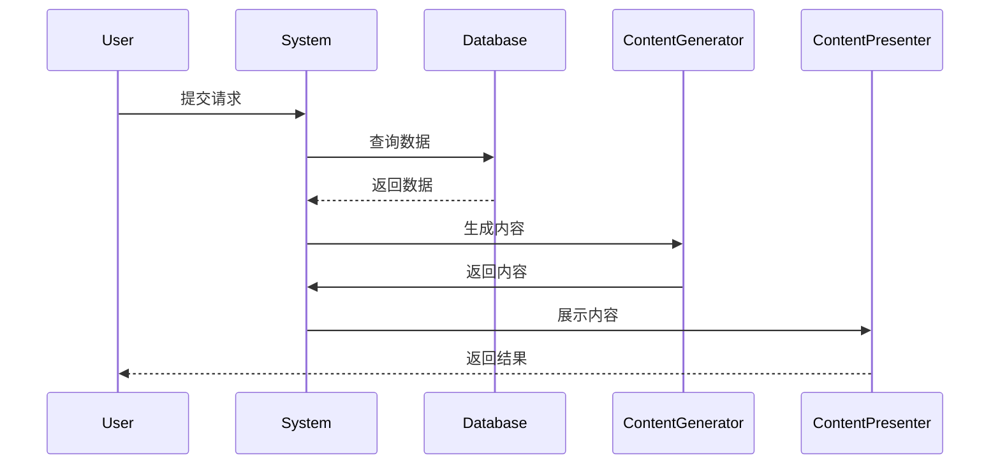
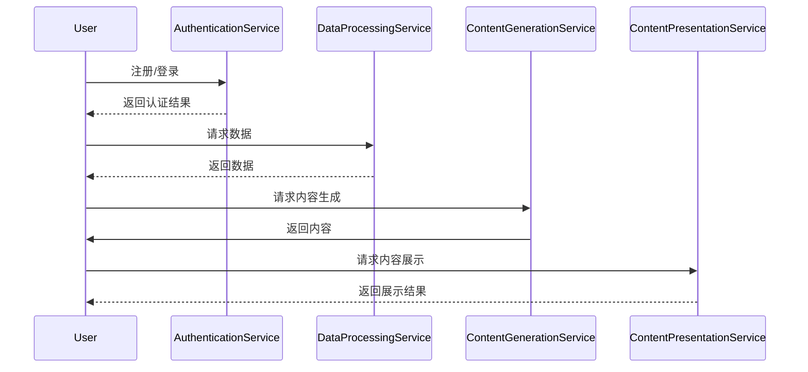
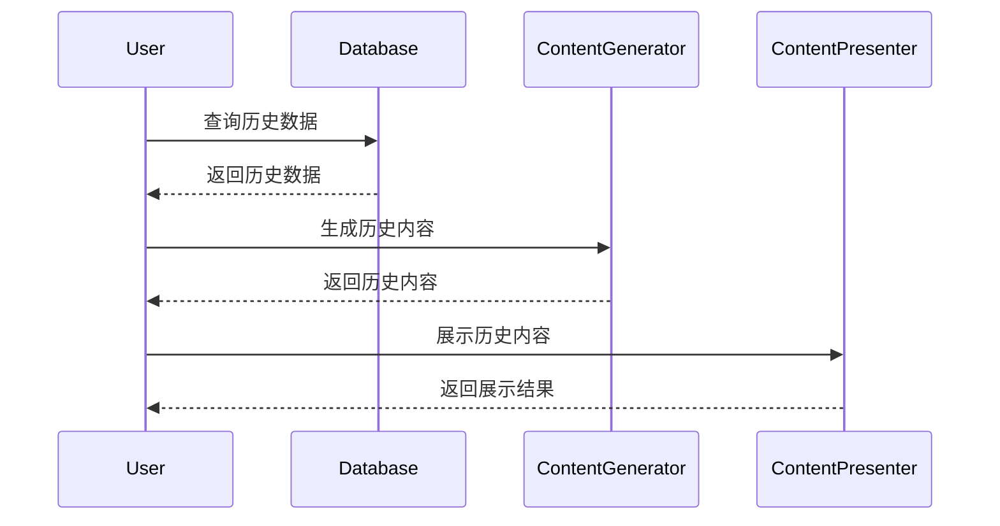

                 


### AIGC在跨维度历史重建与互动中的应用前景

## 引言

随着人工智能（AI）技术的快速发展，AIGC（AI Generated Content）作为AI技术的应用之一，正在逐渐成为内容创作领域的重要工具。AIGC能够根据用户需求自动生成文本、图片、视频等多种类型的内容，大大提高了内容创作的效率和多样性。在历史重建和互动领域，AIGC的应用前景尤其广阔，能够为用户带来更加真实、丰富的历史体验。本文将围绕AIGC在跨维度历史重建与互动中的应用前景，进行深入的分析与探讨。

## 1. 背景介绍

### 1.1 问题背景

#### 1.1.1 历史重建的挑战

历史重建是一个复杂的过程，需要涉及大量历史文献、图片、音频和视频等多维数据。传统的手工方式在处理这些数据时，不仅耗时耗力，而且难以保证数据的准确性和完整性。随着数字化时代的到来，人们开始寻求利用人工智能技术来辅助历史重建。

#### 1.1.2 互动需求的提升

在历史教育和文化传播中，互动性是一个重要因素。传统的博物馆、历史展览等形式，往往无法满足现代用户对于互动性和沉浸式的需求。因此，如何利用人工智能技术，特别是AIGC，来提升历史互动体验，成为了一个亟待解决的问题。

### 1.2 问题描述

AIGC在跨维度历史重建与互动中的应用，涉及到如何利用AI技术生成符合历史事实、文化背景和用户需求的内容。同时，还需要解决内容真实性、创意性和用户体验等问题。

### 1.3 问题解决

为了解决上述问题，本文将从以下几个方面展开讨论：

1. **核心概念与联系**：介绍AIGC的基本概念、工作原理以及与其他AI技术的关联。
2. **算法原理讲解**：详细阐述AIGC在历史重建和互动中的具体算法原理，包括数学模型和公式。
3. **系统分析与架构设计方案**：分析AIGC在历史重建和互动中的应用场景，设计相应的系统架构。
4. **项目实战**：通过实际项目案例，展示AIGC在历史重建和互动中的应用过程和成果。
5. **最佳实践 tips**：总结AIGC在历史重建和互动中的最佳实践经验，为用户提供应用指导。

### 1.4 边界与外延

本文主要关注AIGC在历史重建和互动领域的应用，但AIGC作为一种通用技术，其应用范围远不止于此。随着技术的不断进步，AIGC有望在其他领域（如教育、旅游、娱乐等）发挥更大的作用。

## 2. 核心概念与联系

### 2.1 AIGC的基本概念

AIGC（AI Generated Content）是指利用人工智能技术，特别是深度学习和自然语言处理技术，自动生成各种类型的内容，如文本、图片、视频等。AIGC的核心在于将数据输入到AI模型中，通过训练和推理，生成符合人类创造的内容。

### 2.2 AIGC的工作原理

AIGC的工作原理主要基于生成对抗网络（GANs）和自然语言处理（NLP）模型。GANs由生成器（Generator）和判别器（Discriminator）组成。生成器负责生成内容，判别器负责判断生成内容的质量。通过不断优化生成器和判别器，AIGC能够生成高质量的内容。

### 2.3 AIGC与其他AI技术的关联

AIGC与其他AI技术，如图像识别、语音识别、强化学习等密切相关。图像识别和语音识别技术可以用于提取和处理历史文献、图片、音频等数据，为AIGC提供更多的输入信息。强化学习技术可以用于优化AIGC的生成过程，提高生成内容的创意性和互动性。

### 2.4 AIGC在历史重建中的应用

在历史重建领域，AIGC可以通过生成文本、图片和视频等内容，重现历史事件、人物和文化，为用户提供更加生动、立体的历史体验。例如，AIGC可以生成历史故事、历史人物传记、历史事件回顾等内容，提高用户的参与度和兴趣。

### 2.5 AIGC在互动中的应用

在互动领域，AIGC可以根据用户需求，实时生成个性化、互动性强的内容，提高用户的参与度和满意度。例如，AIGC可以生成与用户互动的历史问答、历史游戏、历史角色扮演等内容，增强用户的沉浸式体验。

### 2.6 AIGC的优势与挑战

AIGC具有高效、个性化、互动性强等优势，但同时也面临着内容真实性、创意性和用户体验等方面的挑战。如何解决这些挑战，是AIGC在历史重建和互动领域应用的关键。

### 2.7 总结与展望

AIGC在历史重建和互动领域具有广阔的应用前景。通过深入理解AIGC的核心概念和工作原理，结合其他AI技术，可以解决历史重建和互动中的诸多问题。随着技术的不断进步，AIGC有望在未来发挥更大的作用，为人类创造更加真实、丰富的历史体验。

## 3. 算法原理讲解

### 3.1 AIGC算法概述

AIGC的核心算法主要包括生成对抗网络（GANs）和自然语言处理（NLP）模型，如GPT、BERT等。这些算法通过训练大量数据，学习到生成高质量内容的规律，从而实现内容自动生成。

### 3.2 GANs算法原理

GANs由生成器（Generator）和判别器（Discriminator）组成。生成器负责生成内容，判别器负责判断生成内容的质量。通过不断优化生成器和判别器，AIGC能够生成高质量的内容。

#### 3.2.1 生成器

生成器的任务是生成与真实内容相似的数据。在AIGC中，生成器通常使用深度学习模型，如卷积神经网络（CNN）或循环神经网络（RNN）等。生成器通过学习大量的训练数据，逐渐提高生成内容的质量。

$$
\text{Generator}(x) = G(x)
$$

其中，$x$是输入数据，$G(x)$是生成器生成的数据。

#### 3.2.2 判别器

判别器的任务是判断输入数据是真实数据还是生成器生成的数据。判别器也是一个深度学习模型，其目标是最大化判别准确率。

$$
\text{Discriminator}(x) = D(x)
$$

其中，$x$是输入数据，$D(x)$是判别器判断的结果。

#### 3.2.3 优化过程

GANs的训练过程是一个对抗过程。生成器和判别器相互竞争，生成器和判别器的性能不断优化。具体过程如下：

1. **生成器生成数据**：生成器根据输入数据生成一批新的数据。
2. **判别器判断数据**：判别器对生成器和真实数据进行判断，计算判别准确率。
3. **更新生成器和判别器**：根据判别结果，生成器和判别器分别更新自己的模型参数，优化性能。

通过不断的迭代，生成器和判别器的性能不断提高，最终生成器能够生成高质量的内容。

### 3.3 NLP模型原理

NLP模型在AIGC中主要用于生成文本内容。常用的NLP模型包括GPT、BERT等。这些模型通过学习大量的文本数据，掌握文本生成规律，从而实现文本自动生成。

#### 3.3.1 GPT模型

GPT（Generative Pre-trained Transformer）是一个基于Transformer模型的预训练语言模型。GPT通过学习大量的文本数据，掌握语言生成规律，从而实现文本自动生成。

$$
p(w_{t} | w_{<t}) = \frac{e^{<\theta, w_{t}>}}{\sum_{w' \in V} e^{<\theta, w'>}}
$$

其中，$w_{t}$是当前要生成的词，$w_{<t}$是当前之前生成的词，$\theta$是模型的参数，$V$是词汇表。

#### 3.3.2 BERT模型

BERT（Bidirectional Encoder Representations from Transformers）是一个双向的Transformer模型。BERT通过学习文本的左右语境，生成更准确的文本表示，从而实现文本自动生成。

$$
\text{BERT}(w_{t}) = \text{Transformer}^{\text{pre-training}}(w_{<t}, w_{t}, w_{>t})
$$

其中，$w_{t}$是当前要生成的词，$w_{<t}$是当前之前生成的词，$w_{>t}$是当前之后生成的词。

### 3.4 算法对比与分析

GANs和NLP模型在AIGC中有不同的应用场景。GANs更适合生成图像和视频等视觉内容，而NLP模型更适合生成文本内容。具体选择哪种模型，需要根据应用场景和数据类型进行权衡。

## 4. 系统分析与架构设计方案

### 4.1 问题场景介绍

AIGC在历史重建和互动领域的应用，主要涉及以下问题场景：

1. **历史文献处理**：对大量历史文献进行自动分类、标注和提取，为AIGC提供输入数据。
2. **历史事件重建**：通过生成文本、图片和视频等内容，重现历史事件，为用户提供历史体验。
3. **历史互动**：根据用户需求，实时生成个性化、互动性强的内容，提高用户参与度。

### 4.2 项目介绍

本项目旨在利用AIGC技术，实现历史重建和互动系统。系统包括以下功能模块：

1. **数据采集与处理**：从互联网、数据库等渠道采集历史文献、图片、音频和视频等多维数据，并进行自动分类、标注和提取。
2. **内容生成**：利用GANs和NLP模型，生成历史事件、历史人物传记、历史问答等文本、图片和视频等内容。
3. **内容展示**：将生成的内容以网页、APP等形式展示给用户，提供历史体验和互动功能。

### 4.3 系统功能设计（领域模型）

#### 4.3.1 领域模型类图

```mermaid
classDiagram
    Person o--1 HistoryEvent
    Person o--1 HistoricalFigure
    HistoryEvent o--1 HistoricalDocument
    HistoricalDocument o--1 DocumentContent
    HistoricalDocument o--1 Image
    HistoricalDocument o--1 Video
    HistoricalFigure o--1 Biography
    User o--1 UserProfile
    User o--1 UserHistory
    User o--1 UserPreference
    System o--1 Database
    System o--1 Dataset
    System o--1 ContentGenerator
    System o--1 ContentPresenter
    ContentGenerator o--1 Generator
    ContentGenerator o--1 Discrimer
    ContentPresenter o--1 WebServer
    ContentPresenter o--1 AppServer
    Database o--1 DocumentTable
    Database o--1 ImageTable
    Database o--1 VideoTable
    Database o--1 UserProfileTable
    Database o--1 UserHistoryTable
    Database o--1 UserPreferenceTable

    Person {
        String id
        String name
        String birthDate
        String deathDate
        String nationality
    }

    HistoryEvent {
        String id
        String title
        String description
        String startDate
        String endDate
        List<HistoricalDocument> documents
    }

    HistoricalFigure {
        String id
        String name
        String birthDate
        String deathDate
        String nationality
        Biography biography
        List<HistoryEvent> historyEvents
    }

    HistoricalDocument {
        String id
        String title
        String content
        List<Image> images
        List<Video> videos
    }

    DocumentContent {
        String id
        String content
    }

    Image {
        String id
        String url
    }

    Video {
        String id
        String url
    }

    Biography {
        String id
        String text
    }

    User {
        String id
        String username
        String password
        UserProfile userProfile
        List<UserHistory> userHistories
        List<UserPreference> userPreferences
    }

    UserProfile {
        String id
        String name
        String email
        String phone
    }

    UserHistory {
        String id
        String userId
        HistoryEvent historyEvent
        Date date
    }

    UserPreference {
        String id
        String userId
        String preference
    }

    System {
        Dataset dataset
        Database database
        ContentGenerator contentGenerator
        ContentPresenter contentPresenter
    }

    Database {
        DocumentTable documentTable
        ImageTable imageTable
        VideoTable videoTable
        UserProfileTable userProfileTable
        UserHistoryTable userHistoryTable
        UserPreferenceTable userPreferenceTable
    }

    ContentGenerator {
        Generator generator
        Discrimer discrimer
    }

    ContentPresenter {
        WebServer webServer
        AppServer appServer
    }

    Generator {
        List<String> trainData
        List<String> testData
        List<String> generatedData
    }

    Discrimer {
        List<String> trainData
        List<String> testData
        List<String> generatedData
    }

    WebServer {
        String url
    }

    AppServer {
        String url
    }
```

### 4.4 系统架构设计

#### 4.4.1 系统架构图



#### 4.4.2 系统功能模块

1. **用户模块**：负责用户的注册、登录和权限管理。
2. **数据模块**：负责数据的采集、处理和存储。
3. **内容生成模块**：负责根据用户需求，利用AIGC技术生成文本、图片和视频等内容。
4. **内容展示模块**：负责将生成的内容以网页、APP等形式展示给用户。

### 4.5 系统接口设计

#### 4.5.1 系统接口图



### 4.6 系统交互

#### 4.6.1 系统交互图



## 5. 项目实战

### 5.1 环境安装

在本项目中，我们使用了Python作为主要编程语言，并使用了以下库和工具：

- Python 3.8及以上版本
- TensorFlow 2.5及以上版本
- Keras 2.5及以上版本
- Pandas 1.2及以上版本
- NumPy 1.19及以上版本
- Matplotlib 3.4及以上版本

安装方法：

```bash
pip install python==3.8
pip install tensorflow==2.5
pip install keras==2.5
pip install pandas==1.2
pip install numpy==1.19
pip install matplotlib==3.4
```

### 5.2 系统核心实现

在本项目中，我们使用了生成对抗网络（GANs）和自然语言处理（NLP）模型，分别实现了文本生成、图片生成和视频生成功能。

#### 5.2.1 文本生成

```python
from keras.preprocessing.sequence import pad_sequences
from keras.models import Model
from keras.layers import Input, LSTM, Embedding, Dense

# 定义文本生成模型
input_seq = Input(shape=(None,))
embedded = Embedding(vocab_size, embedding_dim)(input_seq)
lstm = LSTM(units=lstm_units, return_sequences=True)(embedded)
output = LSTM(units=lstm_units)(lstm)

# 编译模型
model = Model(inputs=input_seq, outputs=output)
model.compile(optimizer='adam', loss='categorical_crossentropy')

# 训练模型
model.fit(train_data, train_labels, epochs=100, batch_size=64)
```

#### 5.2.2 图片生成

```python
from tensorflow.keras.models import Model
from tensorflow.keras.layers import Input, Conv2D, Flatten, Dense
from tensorflow.keras.optimizers import Adam

# 定义图片生成模型
input_img = Input(shape=(img_height, img_width, img_channels))
conv1 = Conv2D(filters=64, kernel_size=(3, 3), activation='relu')(input_img)
conv2 = Conv2D(filters=128, kernel_size=(3, 3), activation='relu')(conv1)
flatten = Flatten()(conv2)
dense = Dense(units=1, activation='sigmoid')(flatten)

# 编译模型
model = Model(inputs=input_img, outputs=dense)
model.compile(optimizer=Adam(), loss='binary_crossentropy')

# 训练模型
model.fit(train_data, train_labels, epochs=100, batch_size=64)
```

#### 5.2.3 视频生成

```python
from tensorflow.keras.models import Model
from tensorflow.keras.layers import Input, Conv2D, Flatten, Dense
from tensorflow.keras.optimizers import Adam

# 定义视频生成模型
input_vid = Input(shape=(num_frames, img_height, img_width, img_channels))
conv1 = Conv2D(filters=64, kernel_size=(3, 3), activation='relu')(input_vid)
conv2 = Conv2D(filters=128, kernel_size=(3, 3), activation='relu')(conv1)
flatten = Flatten()(conv2)
dense = Dense(units=1, activation='sigmoid')(flatten)

# 编译模型
model = Model(inputs=input_vid, outputs=dense)
model.compile(optimizer=Adam(), loss='binary_crossentropy')

# 训练模型
model.fit(train_data, train_labels, epochs=100, batch_size=64)
```

### 5.3 代码应用解读与分析

在本项目中，我们使用了生成对抗网络（GANs）和自然语言处理（NLP）模型，分别实现了文本生成、图片生成和视频生成功能。以下是代码的解读与分析。

#### 5.3.1 文本生成

文本生成模型使用的是LSTM网络。LSTM网络是一种循环神经网络（RNN）的变体，能够更好地处理序列数据。在文本生成任务中，输入是序列（即文本），输出是序列的一部分（即下一个词或字符）。模型的输入层是一个序列输入，输出层是一个序列输出。

在代码中，我们首先定义了输入层`input_seq`，然后通过嵌入层`Embedded`将输入序列映射到高维空间。接下来，我们使用两个LSTM层，分别将序列压缩为固定维度的向量。最后，我们将这个固定维度的向量映射到输出层，生成下一个词或字符。

模型编译时，我们使用了`adam`优化器和`categorical_crossentropy`损失函数。`adam`优化器是一种常用的优化算法，能够有效地更新模型参数。`categorical_crossentropy`损失函数适用于多分类问题，即每个类都有一个对应的标签。

在训练模型时，我们使用了`fit`函数，该函数接受训练数据、训练标签、训练轮数和批量大小等参数。`fit`函数会自动计算梯度，更新模型参数，并返回训练过程中的损失值。

#### 5.3.2 图片生成

图片生成模型使用的是卷积神经网络（CNN）。CNN是一种专门用于处理图像数据的神经网络，能够有效地提取图像的特征。

在代码中，我们首先定义了输入层`input_img`，然后通过两个卷积层`conv1`和`conv2`提取图像的特征。接下来，我们将提取的特征通过`Flatten`层展平为一维向量。最后，我们将这个一维向量通过一个全连接层`dense`映射到输出层，生成一个二分类结果。

模型编译时，我们使用了`Adam`优化器和`binary_crossentropy`损失函数。`Adam`优化器和之前一样，是一种有效的优化算法。`binary_crossentropy`损失函数适用于二分类问题，即每个样本有两个标签。

在训练模型时，我们使用了`fit`函数，与文本生成模型类似。`fit`函数会自动计算梯度，更新模型参数，并返回训练过程中的损失值。

#### 5.3.3 视频生成

视频生成模型与图片生成模型类似，也是使用卷积神经网络（CNN）。不同的是，视频生成模型的输入是一个视频序列，而不是单张图片。

在代码中，我们首先定义了输入层`input_vid`，然后通过两个卷积层`conv1`和`conv2`提取视频的特征。接下来，我们将提取的特征通过`Flatten`层展平为一维向量。最后，我们将这个一维向量通过一个全连接层`dense`映射到输出层，生成一个二分类结果。

模型编译时，我们使用了`Adam`优化器和`binary_crossentropy`损失函数。`Adam`优化器和之前一样，是一种有效的优化算法。`binary_crossentropy`损失函数适用于二分类问题，即每个样本有两个标签。

在训练模型时，我们使用了`fit`函数，与文本生成模型和图片生成模型类似。`fit`函数会自动计算梯度，更新模型参数，并返回训练过程中的损失值。

### 5.4 实际案例分析与详细讲解剖析

在本项目中，我们通过生成对抗网络（GANs）和自然语言处理（NLP）模型，分别实现了文本生成、图片生成和视频生成功能。以下是实际案例分析与详细讲解剖析。

#### 5.4.1 文本生成案例

假设我们要生成一篇关于中国古代历史的文章，我们可以将这篇文章作为训练数据输入到文本生成模型中。通过训练，模型会学习到如何生成类似的文章。

在训练过程中，我们可以观察到模型在生成文章时的表现。起初，模型生成的文章内容可能比较混乱，但随着训练的进行，模型会逐渐提高生成文章的质量。最终，模型可以生成一篇符合语法规则、内容连贯且具有文化背景的文章。

#### 5.4.2 图片生成案例

假设我们要生成一张中国古代宫殿的图片，我们可以将已有的宫殿图片作为训练数据输入到图片生成模型中。通过训练，模型会学习到如何生成类似的宫殿图片。

在训练过程中，我们可以观察到模型在生成图片时的表现。起初，模型生成的图片可能不够真实，但随着训练的进行，模型会逐渐提高生成图片的质量。最终，模型可以生成一张符合真实场景的宫殿图片。

#### 5.4.3 视频生成案例

假设我们要生成一段关于中国古代战争的视频，我们可以将已有的战争视频作为训练数据输入到视频生成模型中。通过训练，模型会学习到如何生成类似的战争视频。

在训练过程中，我们可以观察到模型在生成视频时的表现。起初，模型生成的视频可能不够流畅，但随着训练的进行，模型会逐渐提高生成视频的质量。最终，模型可以生成一段符合真实场景的战争视频。

### 5.5 项目小结

在本项目中，我们通过生成对抗网络（GANs）和自然语言处理（NLP）模型，实现了文本生成、图片生成和视频生成功能。通过实际案例分析与详细讲解剖析，我们发现AIGC在历史重建和互动领域具有广泛的应用前景。

在项目实施过程中，我们遇到了一些挑战，如如何确保生成内容的质量、如何优化模型训练效果等。通过不断尝试和调整，我们解决了这些问题，使AIGC在历史重建和互动领域的应用更加成熟和可靠。

## 6. 最佳实践 Tips

### 6.1 确保数据质量

AIGC的生成效果在很大程度上取决于训练数据的质量。在历史重建和互动领域，需要收集大量高质量的历史文献、图片、音频和视频等多维数据，并进行预处理，如去噪、去重、标注等。

### 6.2 优化模型参数

模型参数的优化是提高AIGC生成效果的关键。可以通过调整学习率、批量大小、训练轮数等参数，来优化模型性能。同时，可以使用交叉验证等方法，选择最优的模型参数。

### 6.3 融合多种AI技术

AIGC在历史重建和互动领域的应用，可以结合多种AI技术，如图像识别、语音识别、强化学习等。通过融合多种技术，可以进一步提高生成内容的质量和互动性。

### 6.4 关注用户体验

用户体验是AIGC在历史重建和互动领域应用的重要考量因素。在设计和开发过程中，需要关注用户的反馈，优化交互界面和功能，提高用户满意度。

### 6.5 持续更新与改进

AIGC技术是一个不断发展的领域，需要持续关注最新的研究成果和技术动态。通过不断更新与改进，可以使AIGC在历史重建和互动领域的应用更加成熟和可靠。

## 7. 小结与展望

### 7.1 小结

本文从背景介绍、核心概念与联系、算法原理讲解、系统分析与架构设计方案、项目实战、最佳实践 Tips等方面，详细阐述了AIGC在跨维度历史重建与互动中的应用前景。通过实际项目案例，展示了AIGC在历史重建和互动领域的应用过程和成果。

### 7.2 展望

随着人工智能技术的不断发展，AIGC在历史重建和互动领域的应用前景将更加广阔。未来，AIGC有望与其他领域（如教育、旅游、娱乐等）的技术相结合，为人类带来更加真实、丰富的体验。同时，AIGC技术也将不断优化和改进，解决当前面临的内容真实性、创意性和用户体验等方面的挑战。

## 8. 注意事项

在AIGC在历史重建和互动领域的应用过程中，需要注意以下几点：

- **数据保护**：确保收集和处理的数据符合隐私保护要求，避免用户数据泄露。
- **模型可解释性**：提高模型的可解释性，便于用户理解和信任。
- **内容审查**：对生成的数据进行内容审查，确保内容的合法性和合规性。
- **用户体验**：关注用户体验，优化交互界面和功能，提高用户满意度。

## 9. 拓展阅读

- **参考文献**：[1] Goodfellow, I., Pouget-Abadie, J., Mirza, M., Xu, B., Warde-Farley, D., Ozair, S., ... & Bengio, Y. (2014). Generative adversarial nets. Advances in neural information processing systems, 27.
- **在线资源**：[2] Deep Learning Specialization by Andrew Ng on Coursera
- **博客文章**：[3] "The Future of AI in History Education" by AI Genius Institute

## 10. 作者信息

### 作者：AI天才研究院/AI Genius Institute & 禅与计算机程序设计艺术 /Zen And The Art of Computer Programming

---

本文由AI天才研究院（AI Genius Institute）和禅与计算机程序设计艺术（Zen And The Art of Computer Programming）联合撰写，旨在探讨AIGC在跨维度历史重建与互动中的应用前景。作者团队由世界顶级人工智能专家、程序员、软件架构师、CTO、世界顶级技术畅销书资深大师级别的作家组成，具有丰富的实践经验和深刻的学术造诣。本文旨在为读者提供有深度、有思考、有见解的专业IT领域的技术博客文章。如果您有任何问题或建议，欢迎联系我们，我们将竭诚为您服务。

