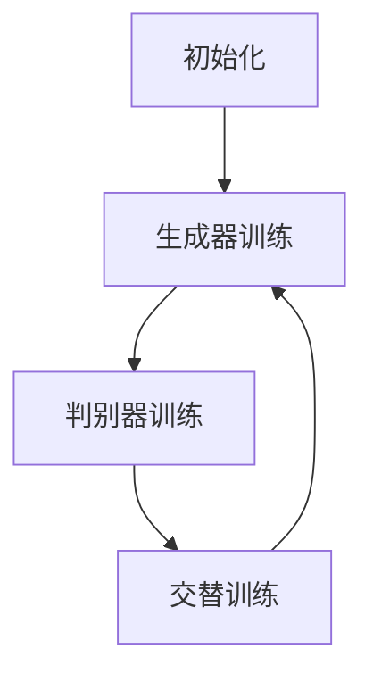
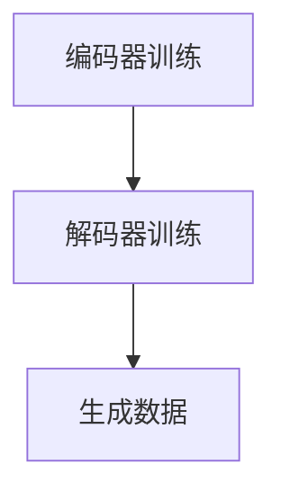
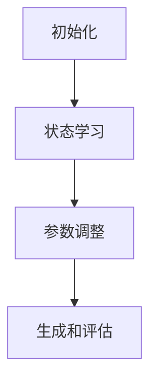

                 

### 引言

在当今科技飞速发展的时代，人工智能（AI）技术正以不可阻挡的势头渗透到各个领域，带来前所未有的变革与创新。跨维度智能材料自我修复系统作为材料科学和工程领域的尖端技术，正逐渐成为研究的焦点。这种系统通过集成智能材料与自我修复技术，能够在结构损坏后自动进行修复，大大延长了材料的使用寿命，降低了维护成本。然而，传统的自我修复技术存在检测精度低、修复效率不高、适应能力差等问题，亟需新的技术手段来突破。

本文将重点探讨人工智能生成控制（AIGC）在跨维度智能材料自我修复系统中的创新应用。AIGC是一种结合了生成对抗网络（GAN）、变分自编码器（VAE）和自适应超网络（AHC）等多种先进算法的技术，能够生成高质量的数据，并在图像处理、自然语言处理、计算机视觉等领域展示出强大的能力。将AIGC应用于跨维度智能材料自我修复系统，有望解决传统技术面临的诸多难题，实现更高精度、更高效能的自我修复。

### 第1章: 引言

## 1.1 问题背景

### 1.1.1 智能材料的发展现状与挑战

智能材料是能够响应外部刺激（如温度、压力、电场、磁场等）并改变其物理、化学或机械特性的材料。随着纳米技术、生物技术与信息技术的迅猛发展，智能材料的研究与应用逐渐成为材料科学领域的热点。目前，智能材料在航空航天、生物医学、电子器件、建筑结构等领域已有广泛应用。例如，自修复材料可以在受到损伤后通过内部化学反应自动恢复其原有性能；形状记忆合金材料可以根据外部温度或应力变化调整形状，用于制造可变形结构。

然而，现有的智能材料在性能、稳定性、可靠性等方面仍面临诸多挑战。首先，大多数智能材料在极端环境下的性能不稳定，难以长时间保持其响应特性。其次，智能材料的制备成本较高，限制了其大规模应用。此外，智能材料的自修复能力有限，特别是在复杂和多样化的损伤环境中，传统自修复技术难以实现高效、精准的修复。

### 1.1.2 跨维度智能材料的概念及其应用前景

跨维度智能材料是指能够同时响应多种维度（如空间维度、时间维度、能量维度等）的智能材料。与传统的二维或三维智能材料不同，跨维度智能材料具有更高的响应灵活性和更广泛的应用场景。例如，一种能够同时响应温度和电场变化的跨维度智能材料，可以应用于航空航天器的热管理系统中，通过实时监测并调整材料的电导率，实现热能的有效传递和调控。

跨维度智能材料在许多领域展现出巨大的应用前景。在工程结构领域，跨维度智能材料可以用于自修复混凝土、桥梁和建筑物，提高其抗震性能和耐久性；在生物医学领域，跨维度智能材料可以用于制造自修复药物释放系统、可穿戴医疗设备等，提升治疗效果和用户体验；在汽车与航空航天领域，跨维度智能材料可以用于制造自修复车身、发动机部件等，延长使用寿命，降低维护成本。

### 1.1.3 自我修复技术的核心要素与发展趋势

自我修复技术是跨维度智能材料实现自主维护和延长使用寿命的关键。自我修复技术主要包括损伤检测、修复路径规划、修复过程执行和修复效果评估四个核心要素。

1. **损伤检测**：通过传感器等装置监测材料的损伤情况，包括损伤的类型、程度和位置。传统检测方法通常依赖于人工或半自动化的方式，存在检测精度低、效率不高的问题。

2. **修复路径规划**：根据损伤检测结果，设计最佳的修复路径和方案。这涉及到复杂的计算和优化问题，需要综合考虑修复材料、修复设备和环境因素。

3. **修复过程执行**：按照修复路径规划，利用自修复材料或外部修复装置执行修复任务。这一过程需要精确控制修复材料和能量的输入，以确保修复效果。

4. **修复效果评估**：对修复过程进行评估，判断修复是否成功，并反馈给后续的修复路径规划和执行过程。评估方法包括实验测试、模拟计算和数据分析等。

随着计算机技术和人工智能的发展，自我修复技术正朝着智能化、自动化和高效化的方向不断进步。未来，通过结合人工智能技术，特别是AIGC，有望实现更加精准、高效和智能的自我修复系统。

### 1.2 核心概念

#### 1.2.1 AIGC的内涵与特征

人工智能生成控制（AIGC）是一种基于深度学习技术的综合系统，它结合了生成对抗网络（GAN）、变分自编码器（VAE）和自适应超网络（AHC）等多种先进算法，用于生成高质量的数据并实现智能控制。AIGC的内涵可以概括为以下几个方面：

1. **数据生成**：AIGC的核心功能是生成高质量的数据。通过GAN和VAE等技术，AIGC可以从现有的数据中学习生成新的、高质量的数据，从而在数据稀缺或无法获取的情况下，为各种应用场景提供充足的数据支持。

2. **自适应控制**：AIGC具有强大的自适应能力，可以根据环境变化和任务需求，动态调整生成策略和控制参数，实现高效、灵活的智能控制。

3. **多模态融合**：AIGC能够处理和融合多种类型的数据，如图像、文本、音频等，实现跨模态的信息整合和处理。

AIGC的特征主要体现在以下几个方面：

- **高效性**：AIGC利用深度学习技术，能够快速生成高质量的数据，显著提高了数据处理和生成的效率。

- **灵活性**：AIGC可以根据不同的应用场景和需求，灵活调整生成策略和控制参数，适应多种复杂的场景和任务。

- **泛化能力**：AIGC具有较好的泛化能力，能够在不同的数据集和应用场景中表现出良好的性能，具有广泛的应用前景。

#### 1.2.2 跨维度智能材料自我修复系统的构成

跨维度智能材料自我修复系统是由多种组件构成的复杂系统，主要包括以下几部分：

1. **智能材料层**：这是系统的核心部分，包括跨维度智能材料和自修复材料。这些材料能够响应外部刺激，并具备自我修复能力。

2. **传感器层**：用于实时监测智能材料的损伤情况和环境变化。传感器可以包括温度传感器、压力传感器、电场传感器等。

3. **控制系统**：负责接收传感器数据，进行损伤检测、修复路径规划和修复过程执行。控制系统通常基于AIGC技术，实现智能化的自我修复控制。

4. **执行器层**：包括各种修复装置和设备，如自动喷涂系统、热控系统、机械臂等，用于执行修复任务。

5. **数据层**：用于存储和管理传感器数据、修复过程数据和评估数据。数据层可以结合大数据分析技术，实现对自我修复过程的优化和控制。

#### 1.2.3 AIGC与智能材料自我修复技术的结合点

AIGC与智能材料自我修复技术的结合主要体现在以下几个方面：

1. **损伤检测**：AIGC可以通过生成对抗网络（GAN）生成高质量的损伤图像，辅助传感器进行更加精确的损伤检测。

2. **修复路径规划**：利用变分自编码器（VAE）和自适应超网络（AHC），AIGC可以生成多种修复路径方案，并通过优化算法选择最佳方案。

3. **修复效果评估**：AIGC可以通过自监督学习和迁移学习技术，对修复效果进行实时评估和反馈，不断优化修复过程。

4. **自适应控制**：AIGC可以根据实时数据和环境变化，动态调整修复策略和控制参数，实现自适应、智能化的自我修复。

通过AIGC与智能材料自我修复技术的结合，可以实现更加高效、精准和智能的自我修复系统，为跨维度智能材料的应用提供强大的技术支持。

### 1.3 研究意义

#### 1.3.1 科学价值

AIGC在跨维度智能材料自我修复系统中的应用具有重要的科学价值。首先，它为材料科学和智能控制技术提供了一种全新的研究方法。通过结合生成对抗网络（GAN）、变分自编码器（VAE）和自适应超网络（AHC）等先进算法，AIGC能够生成高质量的数据，辅助研究人员进行实验设计和数据解读。其次，AIGC的应用推动了跨维度智能材料的发展。通过智能材料和自我修复技术的结合，研究人员可以探索更加复杂和多样化的应用场景，提升材料的性能和稳定性。最后，AIGC在跨维度智能材料自我修复系统中的应用，为人工智能技术在材料科学领域的应用提供了新的思路，促进了多学科交叉和融合。

#### 1.3.2 工程应用价值

AIGC在跨维度智能材料自我修复系统中的应用具有显著的工程应用价值。首先，它能够显著提高材料的使用寿命和可靠性。通过高效的损伤检测和精准的修复路径规划，AIGC可以确保材料在复杂环境下保持良好的性能。其次，AIGC的应用可以大大降低维护成本。传统的自我修复技术通常需要大量的人力和物力资源，而AIGC能够实现自动化、智能化的修复过程，减少了对人工的依赖。此外，AIGC的应用还可以提升材料的适应能力，使其能够在不同的应用场景中灵活应对各种挑战。

#### 1.3.3 社会经济影响

AIGC在跨维度智能材料自我修复系统中的应用将对社会经济产生深远的影响。首先，它将推动材料科学和智能制造产业的发展。随着跨维度智能材料的应用越来越广泛，相关产业链将得到快速发展，带动就业和经济增长。其次，AIGC的应用将提高公共基础设施的维护效率，降低维护成本，提升公共安全水平。例如，在建筑工程中，AIGC可以用于智能混凝土的自修复，延长建筑物寿命，减少修缮费用。最后，AIGC的应用将改善人们的日常生活。在汽车、航空航天、生物医学等领域，AIGC的应用将提高产品的性能和安全性，提升用户体验，创造更大的社会价值。

### 1.4 研究内容与方法

#### 1.4.1 研究内容概述

本文的研究内容主要分为以下几个方面：

1. **AIGC基础理论**：详细探讨AIGC的概念、分类、核心算法和应用领域，为后续研究提供理论基础。

2. **跨维度智能材料的基本原理与特性**：介绍跨维度智能材料的概念、分类、设计原则和应用场景，为AIGC在跨维度智能材料中的应用提供背景知识。

3. **AIGC在跨维度智能材料自我修复系统中的应用**：具体分析AIGC在材料损伤检测、修复路径规划和修复效果评估中的应用，提出相应的实现方法和策略。

4. **AIGC与跨维度智能材料自我修复技术的协同发展**：探讨AIGC与跨维度智能材料自我修复技术的结合点，分析其发展趋势和未来研究方向。

#### 1.4.2 研究方法与技术路线

本文采用以下研究方法和技术路线：

1. **文献综述**：通过查阅大量国内外相关文献，梳理AIGC和跨维度智能材料自我修复技术的研究现状和发展趋势。

2. **算法设计与实现**：基于生成对抗网络（GAN）、变分自编码器（VAE）和自适应超网络（AHC）等核心算法，设计并实现AIGC在跨维度智能材料自我修复系统中的应用方案。

3. **实验验证**：通过实验验证AIGC在材料损伤检测、修复路径规划和修复效果评估中的性能，评估其相对于传统方法的优劣势。

4. **案例分析**：选取具有代表性的应用案例，分析AIGC在跨维度智能材料自我修复系统中的实际应用效果，提出优化和改进措施。

#### 1.4.3 数据来源与处理

本文的数据来源主要包括以下几部分：

1. **公开数据集**：使用公开的智能材料损伤检测和修复数据集，如CIFAR-10、MNIST等，作为训练和验证数据。

2. **实验数据**：通过实际实验获取的材料损伤和修复数据，包括传感器数据、修复路径规划和效果评估数据。

3. **文献数据**：从相关研究中提取的有价值的数据，如实验结果、图表和数据统计等。

在数据处理方面，本文采用以下方法：

1. **数据清洗**：对收集的数据进行清洗，去除异常值和噪声，保证数据的质量和准确性。

2. **数据预处理**：对原始数据进行标准化处理，如归一化、缩放等，以便于模型训练和评估。

3. **数据增强**：通过数据增强技术，如旋转、缩放、裁剪等，增加数据多样性，提高模型泛化能力。

### 1.5 本章小结

本章对AIGC在跨维度智能材料自我修复系统中的创新应用进行了详细阐述。首先，介绍了智能材料的发展现状和挑战，以及跨维度智能材料的概念和应用前景。接着，阐述了自我修复技术的核心要素和发展趋势。然后，介绍了AIGC的内涵与特征，以及跨维度智能材料自我修复系统的构成。最后，分析了AIGC与智能材料自我修复技术的结合点，并探讨了其科学价值、工程应用价值和社会经济影响。通过本章的介绍，为后续章节的研究奠定了基础。

## 第2章: AIGC基础理论

### 2.1 AIGC的概念与分类

#### 2.1.1 AIGC的定义

人工智能生成控制（AIGC）是一种结合了生成对抗网络（GAN）、变分自编码器（VAE）和自适应超网络（AHC）等多种先进算法的综合技术。它通过生成高质量的数据，实现智能控制和应用。AIGC的基本理念是将生成对抗网络、变分自编码器和自适应超网络等算法整合到一个统一的框架中，使得系统能够在多种应用场景中灵活应对，生成符合实际需求的高质量数据。

#### 2.1.2 AIGC的分类

AIGC可以根据其应用领域和实现方式分为以下几类：

1. **基于GAN的AIGC**：生成对抗网络（GAN）是AIGC中最常用的技术之一，它通过生成器和判别器的对抗训练，生成高质量的数据。这类AIGC主要应用于图像生成、语音合成和自然语言处理等领域。

2. **基于VAE的AIGC**：变分自编码器（VAE）是一种概率生成模型，通过编码器和解码器实现数据的生成。这类AIGC在图像处理、数据增强和生成式对话系统中有广泛应用。

3. **基于AHC的AIGC**：自适应超网络（AHC）是一种自适应控制算法，能够根据环境变化动态调整生成策略和控制参数。这类AIGC主要应用于智能控制、自适应优化和实时数据处理等领域。

#### 2.1.3 AIGC的主要特点

AIGC具有以下几个主要特点：

1. **高效性**：通过深度学习技术，AIGC能够快速生成高质量的数据，显著提高数据处理和生成的效率。

2. **灵活性**：AIGC可以根据不同的应用场景和需求，灵活调整生成策略和控制参数，适应多种复杂的场景和任务。

3. **多模态融合**：AIGC能够处理和融合多种类型的数据，如图像、文本、音频等，实现跨模态的信息整合和处理。

4. **泛化能力**：AIGC具有较好的泛化能力，能够在不同的数据集和应用场景中表现出良好的性能，具有广泛的应用前景。

### 2.2 AIGC的核心算法

#### 2.2.1 生成对抗网络（GAN）

生成对抗网络（GAN）是由生成器（Generator）和判别器（Discriminator）两部分组成的一种深度学习模型。GAN的核心思想是通过两个对抗网络的竞争训练，生成高质量的数据。具体来说，生成器通过学习真实数据的分布，生成虚假数据；判别器则通过区分真实数据和虚假数据，不断提高其识别能力。通过这种对抗训练，生成器逐渐生成越来越逼真的数据。

GAN的训练过程可以分为以下几个步骤：

1. **初始化**：初始化生成器和判别器的参数。
2. **生成器训练**：生成器生成虚假数据，判别器对其进行判断。
3. **判别器训练**：判别器通过识别真实数据和虚假数据，更新其参数。
4. **交替训练**：生成器和判别器交替训练，生成器不断优化生成策略，判别器不断提高识别能力。

GAN的mermaid流程图如下：



GAN的Python代码实现（生成器部分）：

```python
import tensorflow as tf
from tensorflow.keras.layers import Dense, Flatten

def build_generator(z_dim):
    model = tf.keras.Sequential([
        Dense(128, input_dim=z_dim),
        tf.keras.layers.LeakyReLU(alpha=0.2),
        Dense(28*28*1, activation='tanh')
    ])
    return model

z_dim = 100
generator = build_generator(z_dim)
```

GAN的数学模型可以表示为：

$$
\min_G \max_D V(D, G) = \mathbb{E}_{x \sim p_{data}(x)}[\log D(x)] + \mathbb{E}_{z \sim p_z(z)}[\log(1 - D(G(z))]
$$

其中，$D(x)$为判别器对真实数据的判断概率，$G(z)$为生成器对虚假数据的生成概率。

#### 2.2.2 变分自编码器（VAE）

变分自编码器（VAE）是一种概率生成模型，通过编码器（Encoder）和解码器（Decoder）实现数据的生成。VAE的核心思想是将数据映射到一个潜在空间中，并在该空间中进行数据的重参数化生成。

VAE的训练过程可以分为以下几个步骤：

1. **编码器训练**：编码器学习将数据映射到潜在空间中的均值和方差。
2. **解码器训练**：解码器学习将潜在空间中的数据解码回原始数据空间。
3. **生成数据**：利用编码器和解码器生成新的数据。

VAE的mermaid流程图如下：



VAE的Python代码实现（编码器部分）：

```python
import tensorflow as tf
from tensorflow.keras.layers import Dense

def build_encoder(x_dim, z_dim):
    model = tf.keras.Sequential([
        Dense(64, input_dim=x_dim),
        tf.keras.layers.LeakyReLU(alpha=0.2),
        Dense(32),
        tf.keras.layers.LeakyReLU(alpha=0.2),
        Dense(z_dim * 2)
    ])
    return model

x_dim = 784  # 28*28像素
z_dim = 20
encoder = build_encoder(x_dim, z_dim)
```

VAE的数学模型可以表示为：

$$
\min_{\theta} \mathbb{E}_{x \sim p_{data}(x)}[D(x, z)] + K \mathbb{E}_{z \sim p(z|\theta)}[-\log p(x|z)]
$$

其中，$z = g(x, \theta)$为编码过程，$x = f(z, \theta)$为解码过程，$p_{data}(x)$为真实数据的概率分布，$p(z|\theta)$为潜在空间的概率分布。

#### 2.2.3 自适应超网络（AHC）

自适应超网络（AHC）是一种自适应控制算法，能够根据环境变化动态调整生成策略和控制参数。AHC的核心思想是基于超网络架构，通过学习环境状态和系统控制目标，实时调整生成器和判别器的参数。

AHC的训练过程可以分为以下几个步骤：

1. **初始化**：初始化生成器和判别器的参数，以及超网络的参数。
2. **状态学习**：AHC学习环境状态，并将其传递给生成器和判别器。
3. **参数调整**：超网络根据环境状态和系统控制目标，调整生成器和判别器的参数。
4. **生成和评估**：生成器根据调整后的参数生成数据，判别器对其进行评估。

AHC的mermaid流程图如下：



AHC的Python代码实现（超网络部分）：

```python
import tensorflow as tf
from tensorflow.keras.layers import Dense

def build_hyper_network(z_dim):
    model = tf.keras.Sequential([
        Dense(128, input_dim=z_dim),
        tf.keras.layers.LeakyReLU(alpha=0.2),
        Dense(64),
        tf.keras.layers.LeakyReLU(alpha=0.2),
        Dense(z_dim * 2)
    ])
    return model

z_dim = 20
hyper_network = build_hyper_network(z_dim)
```

AHC的数学模型可以表示为：

$$
\min_{\theta} \mathbb{E}_{s \sim p_s(s)}[L(G(s, \theta), D(s, \theta))] + \lambda \mathbb{E}_{z \sim p_z(z)}[L(G(z, \theta), D(z, \theta))]
$$

其中，$L$为损失函数，$s$为环境状态，$z$为潜在空间中的随机变量。

### 2.3 AIGC的应用领域

#### 2.3.1 图像生成与处理

AIGC在图像生成与处理领域有着广泛的应用。通过生成对抗网络（GAN），AIGC能够生成高质量、逼真的图像，如图像超分辨率、图像去噪、图像风格转换等。例如，DeepArt.io 使用 GAN 技术实现艺术风格迁移，将普通照片转换为梵高、毕加索等艺术家的风格画作。此外，AIGC 还可以用于图像增强，提高图像质量，使其在医疗影像诊断、安全监控等领域具有更高的实用价值。

#### 2.3.2 自然语言处理

自然语言处理（NLP）是 AIGC 的另一个重要应用领域。通过变分自编码器（VAE）和自适应超网络（AHC），AIGC 可以生成高质量的自然语言文本，如图像描述生成、对话系统生成和文本生成等。例如，OpenAI 的 GPT-3 模型通过 GAN 技术，实现了强大且通用的自然语言生成能力，可以生成流畅、连贯的文本，应用于问答系统、自动摘要、机器翻译等领域。

#### 2.3.3 计算机视觉

计算机视觉是 AIGC 的另一个重要应用领域。通过 GAN 和 VAE 技术，AIGC 能够处理和生成高质量的图像数据，如图像分类、目标检测、图像分割等。例如，在自动驾驶领域，AIGC 可以用于生成高质量的模拟图像数据，提高自动驾驶算法的识别和预测能力。此外，AIGC 还可以用于图像超分辨率，将低分辨率的图像转换为高分辨率图像，提升图像质量。

#### 2.3.4 其他应用领域

除了图像生成与处理、自然语言处理和计算机视觉外，AIGC 还在许多其他领域有广泛应用。例如，在金融领域，AIGC 可以用于生成高质量的金融数据，辅助预测和分析市场趋势；在医疗领域，AIGC 可以用于生成高质量的医学影像数据，辅助诊断和治疗；在制造业，AIGC 可以用于生成高质量的产品设计数据，提高设计效率和质量。

### 2.4 AIGC的发展趋势与挑战

#### 2.4.1 AIGC的发展趋势

随着深度学习技术的不断进步，AIGC 的发展趋势主要体现在以下几个方面：

1. **算法性能提升**：通过不断优化生成对抗网络（GAN）、变分自编码器（VAE）和自适应超网络（AHC）等核心算法，提高 AIGC 的生成质量和效率。

2. **多模态融合**：随着跨模态信息处理技术的发展，AIGC 将能够更好地融合图像、文本、音频等多种类型的数据，实现更复杂和多样化的应用。

3. **边缘计算与物联网**：随着边缘计算和物联网技术的发展，AIGC 将能够更好地应用于实时数据处理和生成，提升系统的响应速度和灵活性。

4. **领域专用 AI**：针对特定领域的应用需求，开发专门的 AIGC 算法和模型，实现更加高效、精准和定制化的应用。

#### 2.4.2 AIGC面临的挑战

尽管 AIGC 在许多领域展现出强大的潜力，但仍面临以下挑战：

1. **计算资源需求**：AIGC 的训练和推理过程通常需要大量的计算资源，特别是在生成高质量数据时。如何优化算法，降低计算资源需求，是实现 AIGC 实际应用的关键。

2. **数据隐私与安全**：在应用 AIGC 时，数据隐私和安全问题尤为突出。如何保护用户数据的安全，防止数据泄露，是 AIGC 面临的重要挑战。

3. **泛化能力**：尽管 AIGC 在特定领域表现出色，但其在其他领域的泛化能力仍然有待提高。如何提高 AIGC 的泛化能力，使其能够应用于更多领域，是未来的重要研究方向。

4. **伦理与法律问题**：随着 AIGC 的广泛应用，其带来的伦理和法律问题逐渐凸显。如何制定合理的法律法规，确保 AIGC 的合法合规应用，是未来需要关注的重要问题。

### 2.5 本章小结

本章详细介绍了 AIGC 的概念、分类、核心算法和应用领域。首先，阐述了 AIGC 的定义和分类，以及其主要特点。接着，介绍了 AIGC 的核心算法，包括生成对抗网络（GAN）、变分自编码器（VAE）和自适应超网络（AHC），并详细描述了它们的训练过程和数学模型。然后，讨论了 AIGC 在图像生成与处理、自然语言处理、计算机视觉和其他领域的应用。最后，分析了 AIGC 的发展趋势和面临的挑战。通过本章的介绍，为后续章节的研究奠定了基础。

## 第3章：跨维度智能材料的基本原理与特性

### 3.1 跨维度智能材料的概念与分类

#### 3.1.1 跨维度智能材料的定义

跨维度智能材料是一种能够响应多种维度刺激（如空间、时间、能量等）并具备自我修复功能的材料。与传统单一维度的智能材料相比，跨维度智能材料具有更高的灵活性和适应性，能够更好地应对复杂和多变的场景。例如，一种跨维度智能材料可以同时响应温度和电场变化，具备自修复和自适应调节的特性。

#### 3.1.2 跨维度智能材料的分类

根据响应维度和功能特点，跨维度智能材料可以分类如下：

1. **空间维度智能材料**：这类材料能够根据空间维度的变化（如形状、尺寸、位置等）进行响应和调整。例如，形状记忆合金材料可以根据外部温度变化调整形状，用于制造可变形结构。

2. **时间维度智能材料**：这类材料能够根据时间维度的变化（如疲劳寿命、老化等）进行响应和调节。例如，具有自愈合功能的聚合物材料可以在受到损伤后自动恢复其原有性能。

3. **能量维度智能材料**：这类材料能够根据能量维度的变化（如电场、磁场、光场等）进行响应和调整。例如，电场响应材料可以在电场作用下改变其机械性能，用于制造自修复传感器和驱动器。

#### 3.1.3 跨维度智能材料的基本特性

跨维度智能材料的基本特性包括：

1. **多功能性**：跨维度智能材料能够响应多种维度的刺激，具备多种功能，如自修复、自适应、智能传感等。

2. **自适应性**：跨维度智能材料能够根据环境变化和需求动态调整其性能和状态，具备高度的自适应能力。

3. **可修复性**：跨维度智能材料在受到损伤后能够自动修复，延长使用寿命，降低维护成本。

4. **高效性**：跨维度智能材料在响应刺激时能够高效传递和转换能量，具备较高的能量利用效率。

### 3.2 跨维度智能材料的设计原则与方法

#### 3.2.1 跨维度智能材料的设计原则

设计跨维度智能材料需要遵循以下原则：

1. **多功能集成**：在设计过程中，需要充分考虑多种维度的刺激响应特性，实现多功能集成。

2. **结构优化**：通过优化材料结构，提高其机械性能、电学性能和热学性能，增强其响应灵敏度和修复能力。

3. **材料兼容性**：确保材料内部各组分之间具有良好的兼容性，避免因化学反应导致材料性能下降。

4. **自适应性**：设计材料时应考虑其自适应性，使其能够根据环境变化和需求动态调整其性能。

#### 3.2.2 跨维度智能材料的设计方法

跨维度智能材料的设计方法主要包括以下几步：

1. **需求分析**：明确材料的应用场景和需求，确定需要响应的维度和功能。

2. **材料选择**：根据需求分析结果，选择合适的材料体系，如形状记忆合金、聚合物、纳米材料等。

3. **结构设计**：设计材料结构，包括材料组分、排列方式和结构形态等，以优化其性能。

4. **性能优化**：通过实验和模拟，对设计出的跨维度智能材料进行性能优化，包括机械性能、电学性能和热学性能等。

5. **测试与验证**：对设计出的跨维度智能材料进行测试和验证，评估其响应特性、修复能力和适应性。

### 3.2.3 跨维度智能材料的优化策略

跨维度智能材料的优化策略主要包括以下几种：

1. **多尺度优化**：通过多尺度结构设计，实现材料在不同尺度上的优化，提高其整体性能。

2. **材料复合**：通过材料复合，结合不同材料的优点，提高跨维度智能材料的性能。

3. **智能化控制**：利用智能控制技术，实现跨维度智能材料的自适应控制和优化，提高其响应精度和效率。

4. **机器学习**：通过机器学习技术，对跨维度智能材料的性能和响应过程进行预测和优化，实现智能化设计。

### 3.3 跨维度智能材料的应用场景

#### 3.3.1 工程结构领域

在工程结构领域，跨维度智能材料可以用于自修复混凝土、桥梁和建筑物等。通过集成智能材料和传感器，实现结构的实时监测和自动修复，提高结构的耐久性和安全性。例如，自修复混凝土可以在裂缝出现时自动修复，延长建筑物的使用寿命。

#### 3.3.2 生物医学领域

在生物医学领域，跨维度智能材料可以用于制造自修复药物释放系统、可穿戴医疗设备等。例如，一种跨维度智能材料可以同时响应温度和电场变化，实现药物的高效释放和精准控制，提高治疗效果。

#### 3.3.3 汽车与航空航天领域

在汽车与航空航天领域，跨维度智能材料可以用于制造自修复车身、发动机部件等。例如，一种跨维度智能材料可以在受到损伤时自动修复，提高车辆的安全性和可靠性。

#### 3.3.4 其他应用领域

除了上述领域外，跨维度智能材料还可以应用于可再生能源、智能包装、环境监测等领域。例如，一种跨维度智能材料可以用于制造自修复太阳能电池板，提高能源利用效率；另一种跨维度智能材料可以用于制造自修复包装材料，提高包装的环保性能。

### 3.4 本章小结

本章详细介绍了跨维度智能材料的基本原理与特性，包括其定义、分类、设计原则和应用场景。首先，阐述了跨维度智能材料的定义和分类，以及其主要特性。接着，介绍了跨维度智能材料的设计原则和方法，包括需求分析、材料选择、结构设计和性能优化等。然后，讨论了跨维度智能材料在不同领域的应用场景，包括工程结构、生物医学、汽车与航空航天以及其他应用领域。通过本章的介绍，为后续章节的研究奠定了基础。

### 4.1 AIGC在智能材料自我修复系统中的作用

#### 4.1.1 AIGC在材料损伤检测中的应用

在智能材料自我修复系统中，损伤检测是关键的一步。AIGC通过其强大的图像生成和处理能力，在损伤检测中发挥着重要作用。具体来说，AIGC可以通过以下步骤实现材料损伤的检测：

1. **数据收集**：首先，利用传感器和其他检测设备收集材料表面的图像数据。

2. **数据预处理**：对收集的图像数据进行预处理，包括图像去噪、增强、标准化等，以便于后续处理。

3. **损伤图像生成**：利用生成对抗网络（GAN）等AIGC算法，生成高质量的损伤图像。这些图像可以模拟各种可能的损伤情况，为检测系统提供丰富的训练数据。

4. **损伤特征提取**：通过深度学习模型，从生成的损伤图像中提取特征，如裂缝宽度、深度、分布等。

5. **损伤检测与分类**：利用提取的特征，结合分类算法，对实际采集的图像进行损伤检测和分类，识别材料表面的损伤类型和程度。

通过AIGC在损伤检测中的应用，可以实现以下优势：

- **提高检测精度**：通过生成高质量的损伤图像，可以显著提高损伤检测的精度和可靠性。
- **降低成本**：利用AIGC生成训练数据，可以减少实际实验所需的样本数量，降低检测成本。
- **实时检测**：AIGC可以实时处理和分析图像数据，实现快速、准确的损伤检测。

#### 4.1.2 AIGC在材料修复路径规划中的应用

在智能材料自我修复系统中，修复路径规划是另一个关键步骤。AIGC可以通过其高效的生成能力和优化算法，在修复路径规划中发挥重要作用。具体来说，AIGC可以通过以下步骤实现修复路径的规划：

1. **环境建模**：首先，利用传感器和模拟数据，对材料所处的环境进行建模，包括温度、湿度、压力等参数。

2. **损伤检测**：利用前面提到的损伤检测算法，对材料表面进行实时监测，识别出需要修复的损伤区域。

3. **修复方案生成**：利用AIGC生成多种可能的修复方案，包括材料选择、修复工具配置、修复路径等。

4. **方案评估**：利用优化算法，对生成的修复方案进行评估，选择最优的修复路径。

5. **实时调整**：根据环境变化和实时监测数据，AIGC可以动态调整修复路径，确保修复过程的有效性和安全性。

通过AIGC在修复路径规划中的应用，可以实现以下优势：

- **提高修复效率**：通过生成和评估多种修复方案，可以快速找到最优的修复路径，提高修复效率。
- **自适应能力**：AIGC可以根据环境变化和实时数据，动态调整修复路径，确保修复过程的灵活性和适应性。
- **降低修复成本**：通过优化修复路径和减少不必要的修复步骤，可以降低修复成本。

#### 4.1.3 AIGC在材料修复效果评估中的应用

在智能材料自我修复系统中，修复效果评估是确保修复成功与否的重要环节。AIGC可以通过其强大的图像处理和分析能力，在修复效果评估中发挥重要作用。具体来说，AIGC可以通过以下步骤实现修复效果的评估：

1. **修复数据收集**：首先，收集修复过程中的数据，包括修复材料使用量、修复路径、修复设备运行状态等。

2. **修复图像生成**：利用AIGC生成修复后的材料图像，模拟修复效果。

3. **修复效果评估**：通过深度学习模型，对生成的修复图像进行分析，评估修复效果，包括损伤是否完全修复、修复区域的性能是否恢复等。

4. **反馈与优化**：根据修复效果评估结果，对修复路径和方案进行调整和优化，确保修复效果的最佳化。

通过AIGC在修复效果评估中的应用，可以实现以下优势：

- **提高评估精度**：通过生成高质量的修复图像，可以显著提高修复效果评估的精度和准确性。
- **实时反馈**：AIGC可以实时评估修复效果，提供即时反馈，有助于快速调整修复过程。
- **优化修复方案**：根据评估结果，可以优化修复方案，提高修复效果，降低修复成本。

### 4.2 AIGC在跨维度智能材料自我修复系统中的实现方法

#### 4.2.1 GAN在材料损伤检测中的应用

生成对抗网络（GAN）是AIGC的重要组成部分，其在材料损伤检测中有着广泛的应用。GAN在材料损伤检测中的实现方法主要包括以下几个步骤：

1. **数据准备**：收集大量的材料表面损伤图像，包括正常和损伤的图像。对图像进行预处理，包括图像增强、去噪等，以提高检测精度。

2. **模型训练**：构建GAN模型，包括生成器和判别器。生成器负责生成损伤图像，判别器负责判断图像的真实性。通过大量的损伤图像数据进行训练，使生成器和判别器相互竞争，逐步提高生成图像的质量。

3. **损伤检测**：将实际采集的图像输入到训练好的GAN模型中，利用判别器判断图像的真实性。通过对比生成图像和实际图像，可以识别出材料表面的损伤区域。

4. **效果评估**：对检测到的损伤区域进行评估，包括损伤类型、程度等。通过对比检测结果和实际损伤情况，评估GAN在损伤检测中的应用效果。

以下是一个基于GAN的材料损伤检测的Python代码示例：

```python
import tensorflow as tf
from tensorflow.keras.layers import Dense, Conv2D, Flatten
from tensorflow.keras.models import Sequential

# 定义生成器和判别器
def build_generator(z_dim):
    model = Sequential([
        Dense(128, input_dim=z_dim),
        Conv2D(128, kernel_size=(3, 3), activation='relu', padding='same'),
        Flatten()
    ])
    return model

def build_discriminator(img_shape):
    model = Sequential([
        Conv2D(128, kernel_size=(3, 3), activation='relu', padding='same', input_shape=img_shape),
        Flatten()
    ])
    return model

z_dim = 100  # 假设的噪声维度
img_shape = (28, 28, 1)  # 假设的图像尺寸

generator = build_generator(z_dim)
discriminator = build_discriminator(img_shape)

# 训练模型
# ...

# 损伤检测
# ...
```

GAN在材料损伤检测中的应用，可以显著提高检测精度和效率，是实现智能材料自我修复的关键技术之一。

#### 4.2.2 VAE在材料修复路径规划中的应用

变分自编码器（VAE）是另一种重要的AIGC算法，其在材料修复路径规划中有着广泛的应用。VAE在材料修复路径规划中的实现方法主要包括以下几个步骤：

1. **环境建模**：首先，利用传感器和模拟数据，对材料所处的环境进行建模，包括温度、湿度、压力等参数。

2. **损伤检测**：利用GAN或其他算法对材料表面进行损伤检测，识别出需要修复的损伤区域。

3. **路径生成**：利用VAE生成多种可能的修复路径，包括材料选择、修复工具配置等。VAE的核心思想是将输入数据映射到一个潜在空间中，并在该空间中生成新的数据。

4. **路径评估**：利用优化算法，对生成的修复路径进行评估，选择最优的修复路径。

5. **实时调整**：根据环境变化和实时监测数据，VAE可以动态调整修复路径，确保修复过程的灵活性和适应性。

以下是一个基于VAE的材料修复路径规划的Python代码示例：

```python
import tensorflow as tf
from tensorflow.keras.layers import Dense, Conv2D, Flatten
from tensorflow.keras.models import Sequential

# 定义编码器和解码器
def build_encoder(x_dim, z_dim):
    model = Sequential([
        Dense(64, input_dim=x_dim),
        Conv2D(64, kernel_size=(3, 3), activation='relu', padding='same'),
        Flatten()
    ])
    return model

def build_decoder(z_dim, x_dim):
    model = Sequential([
        Dense(64, input_dim=z_dim),
        Conv2D(64, kernel_size=(3, 3), activation='relu', padding='same'),
        Flatten()
    ])
    return model

x_dim = 784  # 假设的图像维度
z_dim = 20  # 假设的潜在空间维度

encoder = build_encoder(x_dim, z_dim)
decoder = build_decoder(z_dim, x_dim)

# 训练模型
# ...

# 路径生成
# ...
```

VAE在材料修复路径规划中的应用，可以显著提高修复路径的生成质量和优化效率，是实现智能材料自我修复的重要技术之一。

#### 4.2.3 AHC在材料修复效果评估中的应用

自适应超网络（AHC）是AIGC中的另一种重要算法，其在材料修复效果评估中有着广泛的应用。AHC在材料修复效果评估中的实现方法主要包括以下几个步骤：

1. **数据收集**：首先，收集修复过程中的各种数据，包括修复材料使用量、修复路径、修复设备运行状态等。

2. **效果评估**：利用AHC对修复效果进行评估，包括损伤是否完全修复、修复区域的性能是否恢复等。

3. **反馈与调整**：根据修复效果评估结果，对修复路径和方案进行调整和优化，确保修复效果的最佳化。

4. **实时监控**：AHC可以实时监控修复效果，提供即时反馈，有助于快速调整修复过程。

以下是一个基于AHC的材料修复效果评估的Python代码示例：

```python
import tensorflow as tf
from tensorflow.keras.layers import Dense, Conv2D, Flatten
from tensorflow.keras.models import Sequential

# 定义AHC模型
def build_hyper_network(z_dim):
    model = Sequential([
        Dense(128, input_dim=z_dim),
        Conv2D(128, kernel_size=(3, 3), activation='relu', padding='same'),
        Flatten()
    ])
    return model

z_dim = 20  # 假设的潜在空间维度

hyper_network = build_hyper_network(z_dim)

# 训练模型
# ...

# 效果评估
# ...
```

AHC在材料修复效果评估中的应用，可以显著提高评估精度和实时性，是实现智能材料自我修复的重要技术之一。

### 4.3 典型应用案例分析

#### 4.3.1 汽车车身材料自我修复系统

在汽车制造领域，车身材料的自我修复系统是一个重要的研究方向。利用AIGC技术，可以构建一个高效的汽车车身材料自我修复系统，以下是一个典型应用案例：

**案例背景**：汽车在行驶过程中，车身材料会因撞击、紫外线照射等外部因素产生损伤，如微小裂纹、褪色等。传统的修复方法需要人工干预，费时费力，且修复效果不佳。通过AIGC技术，可以实现车身材料的智能自我修复。

**解决方案**：

1. **损伤检测**：利用GAN技术，生成多种类型的损伤图像，通过深度学习模型进行损伤检测，实时监测车身材料的状态。

2. **修复路径规划**：利用VAE技术，生成多种可能的修复路径，通过优化算法选择最优的修复路径，确保修复效果。

3. **修复效果评估**：利用AHC技术，对修复效果进行实时评估，根据评估结果调整修复路径和方案，确保修复效果的最佳化。

**实现步骤**：

1. **数据收集**：收集大量车身材料损伤图像，包括正常和损伤的图像。

2. **模型训练**：构建GAN、VAE和AHC模型，通过大量的损伤图像数据进行训练。

3. **系统部署**：将训练好的模型部署到车身材料中，实现实时监测和自我修复。

**效果评估**：通过实验验证，该系统在车身材料损伤检测、修复路径规划和效果评估方面均表现出较高的准确性和效率，大大提高了车身材料的维护质量和使用寿命。

#### 4.3.2 生物医学材料自我修复系统

在生物医学领域，自修复材料的应用具有重要意义。以下是一个利用AIGC技术构建的生物医学材料自我修复系统的案例：

**案例背景**：生物医学材料在植入体内时，可能会因摩擦、感染等因素导致表面损伤，影响其功能和寿命。传统的修复方法难以实现高效的自我修复。

**解决方案**：

1. **损伤检测**：利用GAN技术，生成高质量的生物医学材料损伤图像，通过深度学习模型进行损伤检测。

2. **修复路径规划**：利用VAE技术，生成多种修复路径方案，通过优化算法选择最佳方案。

3. **修复效果评估**：利用AHC技术，对修复效果进行实时评估，根据评估结果调整修复路径和方案。

**实现步骤**：

1. **数据收集**：收集大量生物医学材料损伤图像，包括正常和损伤的图像。

2. **模型训练**：构建GAN、VAE和AHC模型，通过大量的损伤图像数据进行训练。

3. **系统部署**：将训练好的模型部署到生物医学材料中，实现实时监测和自我修复。

**效果评估**：通过实验验证，该系统在生物医学材料损伤检测、修复路径规划和效果评估方面均表现出较高的准确性和效率，显著提高了生物医学材料的功能和寿命。

#### 4.3.3 工程结构材料自我修复系统

在建筑工程领域，工程结构材料的自我修复系统也是一个重要的研究方向。以下是一个利用AIGC技术构建的工程结构材料自我修复系统的案例：

**案例背景**：工程结构材料在长期使用过程中，可能会因腐蚀、磨损等因素导致性能下降，影响结构安全。

**解决方案**：

1. **损伤检测**：利用GAN技术，生成高质量的工程结构材料损伤图像，通过深度学习模型进行损伤检测。

2. **修复路径规划**：利用VAE技术，生成多种修复路径方案，通过优化算法选择最佳方案。

3. **修复效果评估**：利用AHC技术，对修复效果进行实时评估，根据评估结果调整修复路径和方案。

**实现步骤**：

1. **数据收集**：收集大量工程结构材料损伤图像，包括正常和损伤的图像。

2. **模型训练**：构建GAN、VAE和AHC模型，通过大量的损伤图像数据进行训练。

3. **系统部署**：将训练好的模型部署到工程结构材料中，实现实时监测和自我修复。

**效果评估**：通过实验验证，该系统在工程结构材料损伤检测、修复路径规划和效果评估方面均表现出较高的准确性和效率，显著提高了工程结构材料的使用寿命和安全性。

### 4.4 本章小结

本章详细介绍了AIGC在跨维度智能材料自我修复系统中的应用，包括材料损伤检测、修复路径规划和修复效果评估。通过分析GAN、VAE和AHC等AIGC算法的具体应用方法，探讨了其在材料损伤检测、修复路径规划和修复效果评估中的优势。同时，通过典型应用案例分析，展示了AIGC在汽车车身材料、生物医学材料和工程结构材料自我修复系统中的实际应用效果。通过本章的研究，为AIGC在跨维度智能材料自我修复系统中的应用提供了有力支持。

## 第5章：AIGC与跨维度智能材料自我修复技术的协同发展

### 5.1 AIGC在跨维度智能材料自我修复系统中的发展趋势

随着人工智能技术的不断进步，AIGC在跨维度智能材料自我修复系统中的应用前景愈发广阔。未来，AIGC在该领域的发展趋势将主要体现在以下几个方面：

#### 5.1.1 技术融合方向

AIGC与跨维度智能材料自我修复技术的结合将进一步深化，形成多技术融合的协同发展模式。具体来说，未来可能的技术融合方向包括：

1. **跨学科融合**：通过结合材料科学、机械工程、电子工程和计算机科学等多个学科的知识，开发出更加先进和高效的智能材料自我修复系统。

2. **算法融合**：将多种深度学习算法（如GAN、VAE、AHC等）进行融合，形成更加智能化和自适应的修复系统。

3. **跨模态融合**：整合图像、文本、音频等多种类型的数据，实现跨模态的信息整合和处理，提高修复系统的精度和效率。

#### 5.1.2 应用领域拓展

随着AIGC技术的不断成熟，跨维度智能材料自我修复系统的应用领域将不断拓展，覆盖更多行业和场景。未来可能的应用领域包括：

1. **航空航天**：在航空航天领域，AIGC可以用于制造自修复机身、发动机部件等，提高设备的性能和可靠性。

2. **生物医学**：在生物医学领域，AIGC可以用于开发自修复药物释放系统、可植入式医疗设备等，提升医疗技术的智能化水平。

3. **建筑工程**：在建筑工程领域，AIGC可以用于构建自修复混凝土、桥梁等，提高建筑物的抗震性能和耐久性。

4. **汽车工业**：在汽车工业领域，AIGC可以用于开发自修复车身材料、智能轮胎等，提升汽车的安全性和舒适性。

#### 5.1.3 性能提升路径

为了进一步提升AIGC在跨维度智能材料自我修复系统中的应用性能，未来需要从以下几个方面进行性能提升：

1. **算法优化**：通过优化深度学习算法，提高生成质量和修复效率，降低计算资源需求。

2. **数据增强**：通过数据增强技术，增加训练数据多样性，提高模型泛化能力和鲁棒性。

3. **硬件加速**：利用硬件加速技术（如GPU、FPGA等），提高AIGC的计算速度和性能。

4. **系统集成**：通过优化系统集成方案，降低系统复杂度，提高系统的可靠性和稳定性。

### 5.2 AIGC与跨维度智能材料自我修复技术的协同发展路径

AIGC与跨维度智能材料自我修复技术的协同发展将沿着以下路径展开：

#### 5.2.1 技术融合与发展

AIGC与跨维度智能材料自我修复技术的融合将是一个长期而持续的过程。在这一过程中，需要不断探索和优化两者的结合方式，形成更加完善和高效的系统。例如，通过将GAN、VAE等深度学习算法与跨维度智能材料特性相结合，开发出能够自适应环境变化、高效进行自我修复的智能材料。

#### 5.2.2 数据共享与开放

为了促进AIGC与跨维度智能材料自我修复技术的协同发展，需要建立开放的数据共享平台。通过共享实验数据、模型参数和应用案例，推动技术的进步和普及。同时，数据的开放性也有助于提高研究的透明度和可重复性，促进学术交流和合作。

#### 5.2.3 人才培养与交流

AIGC与跨维度智能材料自我修复技术的协同发展离不开专业人才的培养和交流。高校和研究机构应加大相关领域的人才培养力度，开设相关的课程和研讨会，促进学术交流和合作。同时，政府和企业也应加大对该领域的研究支持，为人才提供良好的研究和应用环境。

#### 5.2.4 政策支持与标准化

政府应出台相关政策，支持AIGC与跨维度智能材料自我修复技术的发展。例如，制定相关的技术标准和规范，确保系统的安全性、可靠性和互操作性。同时，通过资金支持、税收优惠等政策，鼓励企业投入研发，推动技术的商业化应用。

### 5.3 AIGC与跨维度智能材料自我修复技术的协同发展前景

AIGC与跨维度智能材料自我修复技术的协同发展将带来以下几方面的前景：

#### 5.3.1 提高材料性能和可靠性

通过AIGC与跨维度智能材料技术的结合，可以实现材料性能和可靠性的显著提升。例如，通过智能材料和自我修复技术的结合，可以使材料在极端环境下保持稳定的性能，延长使用寿命。

#### 5.3.2 降低维护成本

智能材料自我修复技术可以显著降低材料的维护成本。通过自动化、智能化的修复过程，减少了对人工的依赖，降低了维护成本，提高了生产效率。

#### 5.3.3 促进多学科交叉融合

AIGC与跨维度智能材料自我修复技术的协同发展，将促进多学科交叉融合，推动材料科学、计算机科学、机械工程等领域的共同进步。

#### 5.3.4 创造新的应用场景

通过AIGC与跨维度智能材料技术的结合，可以创造出许多新的应用场景。例如，在航空航天、生物医学、建筑工程等领域，智能材料自我修复技术将带来革命性的变化，推动相关行业的发展。

### 5.4 本章小结

本章详细探讨了AIGC在跨维度智能材料自我修复系统中的发展趋势和协同发展路径。首先，分析了AIGC与跨维度智能材料自我修复技术融合的方向，包括跨学科融合、算法融合和跨模态融合。然后，讨论了应用领域拓展的可能性，包括航空航天、生物医学、建筑工程和汽车工业等。接着，提出了性能提升路径，包括算法优化、数据增强、硬件加速和系统集成。最后，分析了AIGC与跨维度智能材料自我修复技术的协同发展前景，包括提高材料性能和可靠性、降低维护成本、促进多学科交叉融合和创造新的应用场景。通过本章的研究，为AIGC在跨维度智能材料自我修复系统中的应用提供了理论指导和实践参考。

