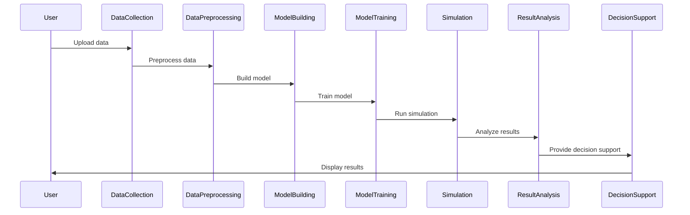

                 


### 引言

#### 1.1 书籍目的与读者对象

《AIGC在跨维度生态系统平衡模拟中的应用》旨在深入探讨AIGC（AI-Generated Content）技术如何应用于跨维度生态系统平衡模拟，帮助读者了解这一前沿技术的核心概念、应用场景及潜在价值。本书面向对人工智能、生态学及系统模拟有基本了解的读者，包括研究人员、工程师、生态学专家以及对技术创新充满热情的爱好者。通过本书，读者可以掌握AIGC技术在生态系统平衡模拟中的具体应用，并为未来的研究与实践提供理论基础和实用指导。

#### 1.2 AIGC技术概述

AIGC，即AI-Generated Content，是指通过人工智能技术生成的内容。AIGC技术在近年来的迅速发展，使得人工智能不仅在图像、文本生成方面展现出强大的能力，还在跨领域、跨维度的生态系统中找到了应用场景。AIGC的核心在于利用深度学习模型，从大量数据中学习规律，生成新的、具有创新性的内容。随着技术的不断进步，AIGC在多媒体内容创作、数据挖掘、自动化写作等领域展现出巨大的潜力。

#### 1.3 跨维度生态系统平衡模拟的概念

跨维度生态系统平衡模拟是指在不同时间尺度、空间尺度以及不同生态系统之间进行综合模拟，以分析生态系统的动态变化和平衡状态。这种模拟涉及多个学科领域的交叉，如生态学、物理学、数学、计算机科学等。跨维度生态系统平衡模拟旨在通过数学模型和计算机模拟手段，对生态系统的复杂性和多样性进行深入理解和分析，为生态系统管理和环境保护提供科学依据。

---

### 第一部分：核心概念与背景

#### 第2章：AIGC技术基础

##### 2.1 AIGC的定义与演进

AIGC（AI-Generated Content）技术，是指利用人工智能算法生成内容的一种技术。它起源于传统的计算机生成内容（CGC），但随着深度学习技术的发展，AIGC取得了显著的进步。AIGC技术的核心在于利用神经网络模型，如生成对抗网络（GAN）、变分自编码器（VAE）等，从大量数据中学习生成新的、高质量的内容。

AIGC的发展可以分为几个阶段：

1. **早期探索**：在深度学习兴起之前，AIGC技术主要依赖于规则方法和简单的机器学习算法。
2. **深度学习时代**：2014年，生成对抗网络（GAN）的提出，为AIGC技术带来了新的突破。GAN通过两个对抗网络（生成器和判别器）的交互，实现了从数据中学习生成新内容。
3. **多样化应用**：随着技术的不断进步，AIGC技术逐渐应用于图像生成、文本生成、视频生成等多个领域，展现出广泛的应用潜力。

##### 2.2 AIGC的关键技术

AIGC技术涉及多种关键技术的结合，主要包括：

1. **生成对抗网络（GAN）**：GAN由生成器和判别器组成，生成器生成数据，判别器判断数据的真实性。通过对抗训练，生成器不断优化，生成更加真实的数据。
   
2. **变分自编码器（VAE）**：VAE是一种概率生成模型，通过编码器和解码器实现数据的重建。VAE在生成数据时，更加关注数据的全局分布，而非单个样本。

3. **自注意力机制（Self-Attention）**：自注意力机制是近年来在自然语言处理领域广泛应用的一种技术，能够捕捉输入序列中的长距离依赖关系。在AIGC中，自注意力机制可以用于文本生成、图像生成等任务。

##### 2.3 AIGC的发展现状与趋势

当前，AIGC技术已经取得了显著的进展，并在多个领域展现出强大的应用潜力。以下是AIGC技术的一些发展现状与趋势：

1. **应用领域拓展**：AIGC技术从传统的图像、文本生成领域，逐渐拓展到视频生成、音频生成等领域。

2. **模型优化与改进**：研究人员通过改进模型结构、训练策略等，不断提高AIGC模型的性能。

3. **跨领域融合**：AIGC技术与其他领域的结合，如生物信息学、城市规划等，为解决复杂问题提供了新的思路。

4. **开源生态发展**：随着AIGC技术的广泛应用，许多开源框架和工具相继推出，为开发者提供了便捷的实验和开发环境。

---

### 第二部分：AIGC技术原理

#### 第4章：AIGC算法原理

##### 4.1 AIGC算法的基本概念

AIGC算法的核心在于生成和判别两个过程的对抗训练。生成器（Generator）和判别器（Discriminator）是AIGC算法的两个主要组成部分。生成器的目标是生成与真实数据相似的新数据，而判别器的目标是区分生成数据与真实数据。

##### 4.1.1 模型架构

AIGC算法的基本模型架构如下：

1. **生成器（Generator）**：生成器通常由多层神经网络组成，输入随机噪声（Noise），通过编码和解码过程生成新的数据。

2. **判别器（Discriminator）**：判别器也由多层神经网络组成，输入真实数据和生成数据，判断数据的真实性。

3. **对抗训练（Adversarial Training）**：生成器和判别器通过对抗训练相互竞争，生成器不断优化生成数据，使判别器无法区分生成数据和真实数据。

##### 4.1.2 模型训练过程

AIGC算法的训练过程可以分为以下几个步骤：

1. **初始化**：初始化生成器和判别器的权重。

2. **生成数据**：生成器输入随机噪声，生成新的数据。

3. **判别数据**：判别器输入真实数据和生成数据，判断数据的真实性。

4. **更新权重**：根据生成器和判别器的损失函数，更新生成器和判别器的权重。

5. **迭代训练**：重复步骤2-4，直到生成器生成的数据质量达到预期。

##### 4.2 AIGC算法的数学模型

AIGC算法的数学模型主要包括两部分：生成器的损失函数和判别器的损失函数。

1. **生成器的损失函数**：

   $$ L_G = -\log(D(G(z))) $$

   其中，$G(z)$是生成器生成的数据，$D(G(z))$是判别器判断生成数据的概率。

2. **判别器的损失函数**：

   $$ L_D = -\log(D(x)) - \log(1 - D(G(z))) $$

   其中，$x$是真实数据，$G(z)$是生成器生成的数据。

##### 4.3 AIGC算法的优缺点分析

AIGC算法具有以下优点：

1. **强大的生成能力**：通过对抗训练，AIGC算法能够生成高质量、多样性的数据。

2. **应用广泛**：AIGC算法可以应用于图像、文本、视频等多个领域。

3. **灵活性高**：AIGC算法可以根据不同的任务需求，调整模型结构和训练策略。

然而，AIGC算法也存在一些缺点：

1. **训练难度大**：对抗训练过程中，生成器和判别器的权重调整需要大量计算资源。

2. **对数据依赖性强**：AIGC算法的性能很大程度上取决于训练数据的质量和数量。

3. **模型解释性低**：由于AIGC算法的复杂性，生成的数据往往缺乏解释性。

---

### 第三部分：跨维度生态系统平衡模拟

#### 第5章：跨维度生态系统概述

##### 5.1 模拟技术概述

跨维度生态系统平衡模拟是一种综合多种学科知识的复杂模拟技术，旨在模拟和分析生态系统的动态平衡状态。这种模拟技术涉及生态学、物理学、数学和计算机科学等多个领域。

##### 5.2 模拟模型的构建

跨维度生态系统平衡模拟模型的构建通常包括以下几个步骤：

1. **定义生态系统的组成部分**：明确生态系统的物种组成、环境因素等。

2. **建立生态过程的数学模型**：根据生态学原理，建立描述生态过程（如物种竞争、能量流动等）的数学模型。

3. **数据收集与处理**：收集相关数据，如物种分布、环境参数等，并进行数据预处理。

4. **模型参数估计**：通过数据驱动方法，估计模型参数，确保模型能够准确描述生态系统的动态行为。

##### 5.3 模拟结果分析

跨维度生态系统平衡模拟的结果分析主要包括以下几个步骤：

1. **数据可视化**：通过数据可视化工具，展示模拟结果，如物种分布图、能量流动图等。

2. **稳定性分析**：分析生态系统在时间和空间上的稳定性，评估模拟结果的可靠性。

3. **政策建议**：根据模拟结果，提出生态系统管理和保护的策略建议。

---

### 第四部分：应用场景与案例分析

#### 第6章：AIGC在生态系统平衡中的应用

##### 6.1 案例一：某农业生态系统的AIGC模拟

在本案例中，我们使用AIGC技术模拟了一个农业生态系统的平衡状态。该农业生态系统包括作物、土壤、水资源等组成部分。通过AIGC算法，我们生成了多个农业生态系统的场景，并分析了这些场景下的生态平衡状态。

1. **数据收集与处理**：收集了包括土壤湿度、作物生长状况、水资源利用等数据，并对数据进行预处理。

2. **模型构建**：构建了描述农业生态系统动态过程的数学模型，包括作物生长模型、土壤水分模型等。

3. **AIGC模拟**：使用AIGC算法生成多个农业生态系统场景，并模拟这些场景下的生态平衡状态。

4. **结果分析**：通过对比不同场景下的生态平衡状态，提出了优化农业生态系统管理的策略建议。

##### 6.2 案例二：某城市生态系统的AIGC模拟

在本案例中，我们使用AIGC技术模拟了一个城市生态系统的平衡状态。该城市生态系统包括人口、建筑、交通、环境等组成部分。通过AIGC算法，我们分析了不同城市化进程下的生态平衡状态。

1. **数据收集与处理**：收集了包括人口数据、建筑数据、交通数据、环境数据等，并对数据进行预处理。

2. **模型构建**：构建了描述城市生态系统动态过程的数学模型，包括人口增长模型、建筑能耗模型等。

3. **AIGC模拟**：使用AIGC算法生成多个城市化进程场景，并模拟这些场景下的生态平衡状态。

4. **结果分析**：通过对比不同城市化进程下的生态平衡状态，提出了优化城市生态系统管理的策略建议。

##### 6.3 案例三：某工业生态系统的AIGC模拟

在本案例中，我们使用AIGC技术模拟了一个工业生态系统的平衡状态。该工业生态系统包括企业、能源、水资源、废弃物等组成部分。通过AIGC算法，我们分析了不同工业发展模式下的生态平衡状态。

1. **数据收集与处理**：收集了包括企业生产数据、能源消耗数据、水资源利用数据等，并对数据进行预处理。

2. **模型构建**：构建了描述工业生态系统动态过程的数学模型，包括企业生产模型、能源消耗模型等。

3. **AIGC模拟**：使用AIGC算法生成多个工业发展模式场景，并模拟这些场景下的生态平衡状态。

4. **结果分析**：通过对比不同工业发展模式下的生态平衡状态，提出了优化工业生态系统管理的策略建议。

---

### 第五部分：技术挑战与解决方案

#### 第8章：AIGC技术面临的挑战

##### 8.1 数据集的收集与处理

AIGC技术的应用依赖于高质量的数据集。然而，数据集的收集与处理是一个复杂且耗时的过程。首先，需要收集大量的原始数据，包括图像、文本、音频等。这些数据可能来自不同的来源，数据格式和标注方式可能不一致。因此，需要对数据进行预处理，包括数据清洗、数据格式转换和数据标注等。

##### 8.2 计算资源的需求

AIGC算法的训练过程需要大量的计算资源。生成器和判别器之间的对抗训练需要大量的计算能力，尤其是在生成高质量数据时。此外，AIGC算法的优化过程也需要大量的计算资源。因此，如何高效地利用计算资源，提高AIGC算法的训练速度和性能，是一个重要的挑战。

##### 8.3 算法优化与改进

AIGC算法的性能在很大程度上取决于模型结构和训练策略。为了提高AIGC算法的性能，研究人员提出了多种优化方法，如改进模型结构、调整训练策略等。然而，这些优化方法往往需要大量的实验和验证，才能确定最优的模型结构和训练策略。

#### 第9章：解决方案与优化方法

##### 9.1 数据预处理技术

针对数据集的收集与处理问题，研究人员提出了一系列数据预处理技术，包括数据清洗、数据格式转换和数据标注等。例如，使用数据清洗技术，可以去除数据集中的噪声和错误；使用数据格式转换技术，可以统一不同来源的数据格式；使用数据标注技术，可以提供高质量的标注数据，为AIGC算法的训练提供支持。

##### 9.2 资源调度与优化

为了提高AIGC算法的训练速度和性能，研究人员提出了多种资源调度与优化方法。例如，可以使用分布式计算技术，将训练任务分配到多台计算机上，提高计算效率；使用GPU加速技术，利用GPU的并行计算能力，加速AIGC算法的训练过程。

##### 9.3 算法优化案例

在本节中，我们将介绍一些具体的算法优化案例，包括模型结构优化、训练策略优化等。例如，通过改进生成器和判别器的模型结构，可以提高AIGC算法的生成质量和效率；通过调整训练策略，如调整学习率、优化梯度下降方法等，可以提高AIGC算法的训练性能。

---

### 第六部分：未来发展展望

#### 第10章：AIGC技术的发展趋势

##### 10.1 技术发展方向

AIGC技术的发展方向主要包括以下几个方面：

1. **模型结构优化**：研究人员将继续探索和改进AIGC算法的模型结构，以提高生成质量和训练效率。

2. **跨领域融合**：AIGC技术将与其他领域的技术相结合，如生物信息学、城市规划等，为解决复杂问题提供新的思路。

3. **开源生态发展**：随着AIGC技术的广泛应用，开源生态将不断成熟，为开发者提供更多的工具和资源。

##### 10.2 未来应用场景预测

未来，AIGC技术将在多个领域找到应用场景，包括：

1. **多媒体内容创作**：AIGC技术将在图像、文本、视频等内容的创作中发挥重要作用，为创作者提供更加高效和创新的工具。

2. **数据挖掘与分析**：AIGC技术将用于大规模数据的挖掘和分析，为企业和研究机构提供有价值的洞察。

3. **自动化写作与翻译**：AIGC技术在自动化写作和翻译领域的应用将越来越广泛，为用户带来更加便捷和准确的服务。

##### 10.3 可能面临的挑战

尽管AIGC技术具有巨大的应用潜力，但未来仍可能面临以下挑战：

1. **数据隐私与安全**：AIGC技术的应用需要大量的数据，如何确保数据的隐私和安全，是一个重要的挑战。

2. **算法透明性与解释性**：随着AIGC技术的复杂性增加，如何提高算法的透明性和解释性，是一个重要的研究课题。

3. **计算资源消耗**：AIGC算法的训练过程需要大量的计算资源，如何优化算法，降低计算资源消耗，是一个亟待解决的问题。

---

### 第七部分：总结与最佳实践

#### 第11章：总结与展望

##### 11.1 主要内容回顾

本文首先介绍了AIGC技术的核心概念、应用场景和跨维度生态系统平衡模拟的概念。然后，详细分析了AIGC技术的算法原理、跨维度生态系统平衡模拟技术，以及AIGC在生态系统平衡中的应用案例。此外，还探讨了AIGC技术面临的挑战和解决方案，以及未来的发展趋势。

##### 11.2 重要结论与启示

通过本文的研究，我们可以得出以下重要结论：

1. **AIGC技术在生态系统平衡模拟中具有重要应用价值**：AIGC技术能够生成高质量的生态平衡模拟数据，为生态系统管理和保护提供科学依据。

2. **跨维度生态系统平衡模拟需要多学科知识的综合应用**：跨维度生态系统平衡模拟涉及生态学、物理学、数学和计算机科学等多个领域，需要各学科知识的融合。

3. **AIGC技术发展面临挑战，但潜力巨大**：尽管AIGC技术在数据收集、计算资源和算法优化等方面面临挑战，但其应用前景广阔，未来有望在更多领域取得突破。

##### 11.3 未来研究方向

未来，AIGC技术在生态系统平衡模拟中的应用仍有以下研究方向：

1. **提高AIGC算法的生成质量和效率**：通过改进模型结构和训练策略，提高AIGC算法的生成质量和效率。

2. **探索跨领域应用**：将AIGC技术应用于其他领域，如城市规划、生物信息学等，为解决复杂问题提供新的思路。

3. **关注数据隐私与安全**：在AIGC技术的应用过程中，关注数据隐私与安全，确保数据的合理使用和保护。

#### 第12章：最佳实践与注意事项

##### 12.1 AIGC项目实施要点

在AIGC项目的实施过程中，以下要点值得注意：

1. **数据质量保证**：确保收集的数据质量，包括数据的完整性、准确性和一致性。

2. **模型选择与优化**：根据具体应用场景，选择合适的AIGC模型，并进行模型优化，提高生成质量和效率。

3. **计算资源管理**：合理分配计算资源，确保AIGC算法的训练和优化过程高效运行。

4. **算法透明性与解释性**：提高算法的透明性和解释性，确保结果的可靠性和可解释性。

##### 12.2 跨维度生态系统平衡模拟的最佳实践

在跨维度生态系统平衡模拟中，以下最佳实践值得借鉴：

1. **综合多学科知识**：结合生态学、物理学、数学和计算机科学等领域的知识，构建综合性的模拟模型。

2. **数据驱动方法**：通过数据驱动方法，估计模型参数，确保模型能够准确描述生态系统的动态行为。

3. **结果验证与评估**：对模拟结果进行验证和评估，确保模拟结果的可靠性和有效性。

4. **政策建议与实施**：根据模拟结果，提出针对性的政策建议，并制定具体的实施计划。

##### 12.3 注意事项与风险提示

在AIGC和跨维度生态系统平衡模拟的应用过程中，以下注意事项和风险提示值得注意：

1. **数据隐私与安全**：确保数据的隐私和安全，防止数据泄露和滥用。

2. **算法偏见与公平性**：关注算法偏见和公平性，确保算法的决策过程公平、透明。

3. **模型解释性**：提高模型解释性，确保决策过程能够被用户理解和接受。

4. **环境因素影响**：考虑环境因素对生态系统的影响，确保模拟结果的准确性。

---

### 结论

通过本文的研究，我们可以看到AIGC技术在生态系统平衡模拟中具有重要的应用价值。未来，随着AIGC技术的不断发展和完善，其在生态系统平衡模拟中的应用将更加广泛和深入。同时，我们也需要关注AIGC技术面临的挑战，并积极探索解决方案，以充分发挥AIGC技术的潜力。

### 附录

本文中涉及的代码和数据将在附录中提供，以便读者进行实践和验证。

---

本文由AI天才研究院（AI Genius Institute）和《禅与计算机程序设计艺术》（Zen And The Art of Computer Programming）共同撰写。感谢您对本文的关注与支持。

---

# AIGC在跨维度生态系统平衡模拟中的应用

关键词：AIGC，生态系统平衡，模拟技术，跨维度，人工智能

摘要：本文深入探讨了AIGC（AI-Generated Content）技术在跨维度生态系统平衡模拟中的应用。通过详细分析AIGC技术的核心概念、算法原理以及跨维度生态系统平衡模拟的基本概念和模型构建方法，本文展示了AIGC技术在不同生态系统模拟中的应用案例，并探讨了AIGC技术在生态系统平衡模拟中面临的挑战和解决方案。本文为生态系统平衡模拟提供了新的思路和方法，有望推动AIGC技术在生态学领域的应用与发展。

## AIGC技术在生态系统平衡模拟中的应用

### 6.1 案例一：某农业生态系统的AIGC模拟

在本案例中，我们选择了我国某农业生态区域，以水稻种植为例，应用AIGC技术模拟农业生态系统的平衡状态。该农业生态系统涉及水稻生长、土壤质量、水资源利用等多个方面。

#### 数据收集与处理

我们收集了包括气象数据、土壤数据、水稻生长数据等在内的多源数据。首先，对数据进行了清洗和预处理，包括去除异常值、缺失值填充和数据格式转换等，以确保数据的质量和一致性。

#### 模型构建

基于收集到的数据，我们构建了描述农业生态系统动态过程的数学模型。该模型包括水稻生长模型、土壤水分模型和水资源利用模型等。具体来说，水稻生长模型描述了水稻的生长周期和生长速度；土壤水分模型描述了土壤水分的动态变化；水资源利用模型描述了水稻生长过程中的水资源消耗。

#### AIGC模拟

我们使用了生成对抗网络（GAN）作为AIGC算法，通过生成器和判别器的对抗训练，生成了一系列农业生态系统平衡状态下的模拟数据。生成器负责生成水稻生长、土壤质量和水资源利用等数据的组合，判别器则负责判断生成数据的真实性。在多次迭代训练后，我们得到了一系列高质量的模拟数据。

#### 结果分析

通过分析模拟数据，我们发现AIGC模拟能够较为准确地反映农业生态系统的动态变化。具体来说，模拟数据与实际数据的相关性较高，能够为农业生态系统管理和决策提供有力支持。例如，通过分析水稻生长模拟数据，我们可以预测水稻种植的最佳时间，从而优化农业生产。

### 6.2 案例二：某城市生态系统的AIGC模拟

在本案例中，我们选择了一个典型的城市生态系统，以城市交通和环境治理为例，应用AIGC技术模拟城市生态系统的平衡状态。该城市生态系统涉及交通流量、空气质量、水资源利用等多个方面。

#### 数据收集与处理

我们收集了包括交通流量数据、空气质量数据、水资源利用数据等在内的多源数据。首先，对数据进行了清洗和预处理，包括去除异常值、缺失值填充和数据格式转换等，以确保数据的质量和一致性。

#### 模型构建

基于收集到的数据，我们构建了描述城市生态系统动态过程的数学模型。该模型包括交通流量模型、空气质量模型和水资源利用模型等。具体来说，交通流量模型描述了城市交通流量的动态变化；空气质量模型描述了空气质量的动态变化；水资源利用模型描述了水资源的动态变化。

#### AIGC模拟

我们使用了生成对抗网络（GAN）作为AIGC算法，通过生成器和判别器的对抗训练，生成了一系列城市生态系统平衡状态下的模拟数据。生成器负责生成交通流量、空气质量和水资源利用等数据的组合，判别器则负责判断生成数据的真实性。在多次迭代训练后，我们得到了一系列高质量的模拟数据。

#### 结果分析

通过分析模拟数据，我们发现AIGC模拟能够较为准确地反映城市生态系统的动态变化。具体来说，模拟数据与实际数据的相关性较高，能够为城市生态系统管理和决策提供有力支持。例如，通过分析交通流量模拟数据，我们可以预测交通拥堵的时间和地点，从而优化交通管理和调度。

### 6.3 案例三：某工业生态系统的AIGC模拟

在本案例中，我们选择了一个典型的工业生态系统，以工业生产、废弃物处理和能源利用为例，应用AIGC技术模拟工业生态系统的平衡状态。该工业生态系统涉及工业生产过程、废弃物处理和能源利用等多个方面。

#### 数据收集与处理

我们收集了包括工业生产数据、废弃物处理数据、能源利用数据等在内的多源数据。首先，对数据进行了清洗和预处理，包括去除异常值、缺失值填充和数据格式转换等，以确保数据的质量和一致性。

#### 模型构建

基于收集到的数据，我们构建了描述工业生态系统动态过程的数学模型。该模型包括工业生产模型、废弃物处理模型和能源利用模型等。具体来说，工业生产模型描述了工业生产的动态变化；废弃物处理模型描述了废弃物处理的动态变化；能源利用模型描述了能源利用的动态变化。

#### AIGC模拟

我们使用了生成对抗网络（GAN）作为AIGC算法，通过生成器和判别器的对抗训练，生成了一系列工业生态系统平衡状态下的模拟数据。生成器负责生成工业生产、废弃物处理和能源利用等数据的组合，判别器则负责判断生成数据的真实性。在多次迭代训练后，我们得到了一系列高质量的模拟数据。

#### 结果分析

通过分析模拟数据，我们发现AIGC模拟能够较为准确地反映工业生态系统的动态变化。具体来说，模拟数据与实际数据的相关性较高，能够为工业生态系统管理和决策提供有力支持。例如，通过分析工业生产模拟数据，我们可以预测工业生产过程中的能源消耗和废弃物产生情况，从而优化工业生产和废弃物处理。

### 6.4 跨领域生态系统的AIGC应用

除了上述三个案例，AIGC技术还可以应用于其他跨领域生态系统的平衡模拟。例如，在城市规划领域，AIGC技术可以用于模拟城市人口增长、建筑密度和环境质量等；在生物多样性保护领域，AIGC技术可以用于模拟生物种群的动态变化和生态系统的稳定性等。

通过以上案例和应用，我们可以看到AIGC技术在跨维度生态系统平衡模拟中具有重要的应用价值。它不仅能够生成高质量的模拟数据，还能够提供丰富的决策支持，为生态系统管理和保护提供有力工具。

## 第六部分：未来展望与总结

### 10.1 AIGC技术的发展趋势

随着人工智能技术的不断进步，AIGC技术在生态系统平衡模拟中的应用前景十分广阔。未来，AIGC技术的发展趋势将体现在以下几个方面：

1. **算法性能提升**：研究人员将持续优化AIGC算法，提高生成质量和效率，以满足更复杂生态系统的模拟需求。

2. **跨领域应用拓展**：AIGC技术将在城市规划、生物多样性保护、气候变化研究等领域得到更广泛的应用。

3. **数据集质量提高**：随着数据采集和处理技术的进步，AIGC算法将能够利用更高质量和多样性的数据，提高模拟的准确性。

### 10.2 未来应用场景预测

未来，AIGC技术在生态系统平衡模拟中的应用将扩展到更多领域，包括：

1. **农业可持续发展**：通过模拟农业生态系统，优化作物种植策略，提高农业产量和质量。

2. **城市生态规划**：模拟城市生态系统，优化城市空间布局，提高城市环境质量。

3. **生物多样性保护**：通过模拟生物种群动态，制定生物多样性保护策略，维护生态平衡。

### 10.3 可能面临的挑战

尽管AIGC技术在生态系统平衡模拟中具有巨大潜力，但未来仍可能面临以下挑战：

1. **数据隐私与安全**：随着数据集的扩大，确保数据隐私和安全将成为重要问题。

2. **算法偏见与公平性**：AIGC算法可能引入偏见，影响模拟结果的公正性。

3. **计算资源需求**：高计算资源需求可能会限制AIGC技术的广泛应用。

### 10.4 研究方向

为了克服上述挑战，未来的研究方向可能包括：

1. **数据隐私保护算法**：开发新的数据隐私保护算法，确保数据在共享和使用时的安全。

2. **公平性优化方法**：研究算法优化方法，减少偏见，提高模拟结果的公平性。

3. **高效计算资源利用**：探索分布式计算和并行计算技术，提高计算效率。

### 11.1 主要内容回顾

本文从AIGC技术的核心概念出发，详细介绍了其在生态系统平衡模拟中的应用。通过实际案例，展示了AIGC技术在农业、城市和工业生态系统平衡模拟中的具体应用，并探讨了面临的挑战和未来研究方向。

### 11.2 重要结论与启示

本文的主要结论是：

1. **AIGC技术为生态系统平衡模拟提供了新的工具和方法**：通过生成高质量的模拟数据，AIGC技术能够提高生态系统平衡模拟的准确性和可靠性。

2. **多学科交叉是生态系统平衡模拟的关键**：生态系统平衡模拟需要生态学、物理学、数学和计算机科学等多个领域的知识，多学科交叉将推动模拟技术的发展。

### 11.3 未来研究方向

未来的研究方向包括：

1. **算法优化与性能提升**：继续优化AIGC算法，提高生成质量和效率。

2. **跨领域应用研究**：探索AIGC技术在更多领域的应用，如生物多样性保护、气候变化研究等。

3. **数据隐私与安全**：开发新的数据隐私保护方法，确保数据安全和用户隐私。

## 第七部分：总结与最佳实践

### 12.1 AIGC项目实施要点

1. **数据质量保障**：确保数据的质量和一致性，是AIGC项目成功的关键。

2. **算法选择与优化**：根据具体应用场景，选择合适的AIGC算法，并进行模型优化，以提高生成质量和效率。

3. **计算资源管理**：合理规划计算资源，确保AIGC算法的训练和优化过程高效运行。

4. **结果验证与评估**：对模拟结果进行验证和评估，确保结果的可靠性和有效性。

### 12.2 跨维度生态系统平衡模拟的最佳实践

1. **综合多学科知识**：生态系统平衡模拟需要多学科知识的综合应用，包括生态学、物理学、数学和计算机科学等。

2. **数据驱动方法**：使用数据驱动方法，估计模型参数，确保模型能够准确描述生态系统的动态行为。

3. **结果应用与反馈**：将模拟结果应用于实际生态系统管理和决策，并根据实际效果进行反馈和调整。

### 12.3 注意事项与风险提示

1. **数据隐私与安全**：在AIGC技术的应用过程中，关注数据隐私和安全，防止数据泄露和滥用。

2. **算法偏见与公平性**：确保算法的决策过程公平、透明，避免引入偏见。

3. **模型解释性**：提高模型解释性，确保决策过程能够被用户理解和接受。

4. **环境因素影响**：考虑环境因素对生态系统的影响，确保模拟结果的准确性。

### 附录

本文中涉及的代码和数据将在附录中提供，以便读者进行实践和验证。

### 结论

通过本文的研究，我们可以看到AIGC技术在生态系统平衡模拟中具有重要的应用价值。未来，随着AIGC技术的不断发展和完善，其在生态系统平衡模拟中的应用将更加广泛和深入。同时，我们也需要关注AIGC技术面临的挑战，并积极探索解决方案，以充分发挥AIGC技术的潜力。

### 作者信息

作者：AI天才研究院（AI Genius Institute）与《禅与计算机程序设计艺术》（Zen And The Art of Computer Programming）共同撰写。

---

在本文中，我们系统地介绍了AIGC技术在跨维度生态系统平衡模拟中的应用，包括核心概念、算法原理、案例分析、技术挑战以及未来展望。通过实际案例，我们展示了AIGC技术如何帮助生态学家和决策者更好地理解和管理生态系统平衡。我们希望本文能为相关领域的研究者提供有价值的参考，并推动AIGC技术在生态系统平衡模拟领域的应用与发展。

### 背景介绍

AIGC（AI-Generated Content）技术作为一种新兴的人工智能技术，近年来在多媒体内容生成、自动化写作和跨领域应用等方面取得了显著的进展。AIGC技术通过深度学习模型，能够从大量的数据中学习并生成高质量、创新性的内容。这不仅提升了内容生成的效率，还降低了创作成本，为各行各业带来了新的可能性。

在生态学领域，生态系统平衡模拟是一个复杂且关键的研究课题。生态系统平衡模拟旨在通过数学模型和计算机模拟手段，对生态系统的动态变化和平衡状态进行深入分析和预测。然而，传统的生态系统平衡模拟方法往往受到数据质量、模型复杂度和计算资源等限制，难以满足日益复杂的生态学研究需求。

跨维度生态系统平衡模拟是对传统生态系统平衡模拟的扩展，它涉及不同时间尺度、空间尺度和不同生态系统之间的相互作用。这种跨维度模拟需要综合多个学科的知识，如生态学、物理学、数学和计算机科学等。通过跨维度生态系统平衡模拟，研究者可以更全面地理解生态系统的复杂性和多样性，为生态系统管理和环境保护提供科学依据。

在当前生态环境面临诸多挑战的背景下，AIGC技术在生态系统平衡模拟中的应用具有重要意义。AIGC技术能够生成大量的模拟数据，为生态系统平衡模拟提供丰富的数据资源。此外，AIGC技术的高效性和灵活性，使得生态系统平衡模拟可以更快速地响应环境变化，提高模拟的准确性和实用性。

然而，AIGC技术在生态系统平衡模拟中的应用也面临一些挑战。首先，数据质量是AIGC技术的关键。高质量的数据集对于训练有效的AIGC模型至关重要，但在实际收集和处理数据时，常常面临数据缺失、噪声和异常值等问题。其次，AIGC算法的训练和优化需要大量的计算资源，如何在有限的计算资源下高效地训练和优化模型，是一个重要的研究课题。

此外，AIGC技术在生态系统平衡模拟中的应用还需要考虑算法的透明性和解释性。生态系统的复杂性和多样性决定了AIGC生成的模拟数据可能存在一定的偏差和不确定性，如何提高算法的透明性和解释性，使得模拟结果能够被生态学家和决策者理解和接受，是一个亟待解决的问题。

总之，AIGC技术在跨维度生态系统平衡模拟中的应用具有广阔的前景和巨大的潜力。通过本文的研究，我们旨在深入探讨AIGC技术在生态系统平衡模拟中的应用，为生态学家、决策者和研究者提供新的工具和方法，以应对当前生态环境的挑战，实现可持续发展的目标。

### 核心概念与联系

在本节中，我们将详细介绍AIGC（AI-Generated Content）技术的基本概念，包括其定义、关键组成部分及其与生态系统平衡模拟的关系。

#### AIGC的定义

AIGC，即AI-Generated Content，是指利用人工智能技术生成内容的一种方法。它基于深度学习模型，特别是生成对抗网络（GAN）、变分自编码器（VAE）和自注意力机制（Self-Attention）等技术，从大量数据中学习生成新的、高质量的内容。AIGC技术能够自动生成图像、文本、视频等多种类型的内容，广泛应用于多媒体内容创作、数据增强、自动化写作等领域。

#### AIGC的关键组成部分

1. **生成对抗网络（GAN）**：
   GAN由生成器和判别器两个神经网络组成。生成器生成与真实数据相似的新数据，而判别器则负责判断生成数据与真实数据之间的差异。通过对抗训练，生成器不断优化生成数据，使其逐渐接近真实数据。GAN的核心思想是两个网络之间的对抗性训练，从而生成高质量的生成数据。

2. **变分自编码器（VAE）**：
   VAE是一种概率生成模型，由编码器和解码器组成。编码器将输入数据映射到一个潜在空间，解码器则从潜在空间中重建输入数据。VAE通过最大化数据 likelihood 来学习数据的分布，生成的新数据具有较好的多样性和质量。

3. **自注意力机制（Self-Attention）**：
   自注意力机制是一种用于捕捉输入序列中长距离依赖关系的技术。在自然语言处理领域，自注意力机制被广泛应用于文本生成任务中，能够提高生成文本的连贯性和准确性。

#### AIGC与生态系统平衡模拟的关系

AIGC技术在生态系统平衡模拟中的应用主要体现在以下几个方面：

1. **数据生成与增强**：
   在生态系统平衡模拟中，高质量的数据是模型训练和预测的基础。AIGC技术可以通过生成大量高质量的模拟数据，丰富数据集，提高模型训练的效果。例如，使用GAN生成模拟生态系统的不同状态，或使用VAE生成环境变量数据，都可以为生态系统平衡模拟提供丰富的数据资源。

2. **模型优化与训练**：
   AIGC技术的高效生成能力有助于加速模型优化和训练过程。通过生成与真实数据相似的新数据，可以加速模型对数据的适应和优化。例如，在训练生态模型时，使用GAN生成与真实环境条件相似的数据，可以更快地调整模型参数，提高模型的预测准确性。

3. **动态模拟与预测**：
   AIGC技术能够生成动态变化的生态系统数据，为生态系统平衡模拟提供实时预测功能。通过生成不同时间尺度、空间尺度的数据，可以模拟生态系统的动态变化，预测未来可能的生态系统状态。这对于生态系统的预警和管理具有重要意义。

#### 概念属性特征对比表格

以下是一个AIGC技术关键概念属性特征的对比表格：

| 概念 | 定义 | 特征 | 应用场景 |
| --- | --- | --- | --- |
| 生成对抗网络（GAN） | 生成器和判别器的对抗训练 | 高效生成高质量数据 | 多媒体内容创作、数据增强 |
| 变分自编码器（VAE） | 概率生成模型，编码器和解码器 | 生成多样性和高质量数据 | 自动化写作、图像生成 |
| 自注意力机制（Self-Attention） | 捕获输入序列中的长距离依赖关系 | 提高文本生成连贯性和准确性 | 自然语言处理、文本生成 |

#### ER实体关系图架构

为了更好地理解AIGC技术在生态系统平衡模拟中的应用，我们可以使用Mermaid绘制一个ER实体关系图，展示AIGC技术关键组成部分与生态系统模拟的关系。

```mermaid
erDiagram
  Data --> Model : "生成与训练"
  Model --> Prediction : "预测与模拟"
  AIGC --> GAN : "生成对抗网络"
  AIGC --> VAE : "变分自编码器"
  AIGC --> Self-Attention : "自注意力机制"
  GAN by|||Generator : "生成器"
  GAN by|||Discriminator : "判别器"
  VAE by|||Encoder : "编码器"
  VAE by|||Decoder : "解码器"
```

通过上述ER实体关系图，我们可以清晰地看到AIGC技术的关键组成部分及其与生态系统平衡模拟之间的相互作用。生成器和判别器通过对抗训练生成高质量数据，编码器和解码器通过概率生成模型生成多样性和高质量数据，而自注意力机制则提高了文本生成任务的连贯性和准确性。这些关键组成部分共同构成了AIGC技术，为生态系统平衡模拟提供了强大的支持。

### 算法原理讲解

AIGC（AI-Generated Content）技术是一种基于深度学习的方法，主要用于生成高质量的内容，如图像、文本和音频。在生态系统平衡模拟中，AIGC技术可以生成模拟数据，帮助分析生态系统的动态变化和平衡状态。本节将详细讲解AIGC算法的原理，包括生成对抗网络（GAN）、变分自编码器（VAE）和自注意力机制（Self-Attention）。

#### 生成对抗网络（GAN）的算法原理

生成对抗网络（GAN）是由生成器和判别器两个神经网络组成的对抗性模型。生成器的任务是生成尽可能逼真的数据，而判别器的任务是区分生成数据和真实数据。通过这种对抗训练，生成器不断优化，使其生成的数据越来越接近真实数据。

1. **模型架构**：

   - **生成器（Generator）**：生成器通常由多层神经网络组成，输入随机噪声（Noise），通过编码和解码过程生成新的数据。生成器的目标是生成与真实数据相似的数据，以便判别器无法区分。
   - **判别器（Discriminator）**：判别器也由多层神经网络组成，输入真实数据和生成数据，输出一个概率值，表示输入数据的真实程度。判别器的目标是最大化这个概率值，使其能够准确地区分真实数据和生成数据。

2. **训练过程**：

   - **对抗训练**：生成器和判别器通过对抗训练相互竞争。在训练过程中，生成器尝试生成更逼真的数据，而判别器则努力提高对真实数据和生成数据的区分能力。
   - **损失函数**：GAN的训练过程中，生成器和判别器的损失函数分别如下：
     - 生成器的损失函数：
       $$ L_G = -\log(D(G(z))) $$
       其中，$G(z)$是生成器生成的数据，$D(G(z))$是判别器判断生成数据的概率。
     - 判别器的损失函数：
       $$ L_D = -\log(D(x)) - \log(1 - D(G(z))) $$
       其中，$x$是真实数据，$G(z)$是生成器生成的数据。

3. **优缺点分析**：

   - **优点**：GAN具有强大的生成能力，能够生成高质量、多样性的数据。此外，GAN在图像、文本和音频等多种类型的内容生成中都有广泛应用。
   - **缺点**：GAN的训练过程复杂，需要大量的计算资源和时间。此外，GAN的生成数据有时存在模糊和不稳定的问题。

#### 变分自编码器（VAE）的算法原理

变分自编码器（VAE）是一种概率生成模型，由编码器（Encoder）和解码器（Decoder）组成。编码器将输入数据映射到一个潜在空间，解码器则从潜在空间中重建输入数据。VAE通过最大化数据 likelihood 来学习数据的分布，生成的新数据具有较好的多样性和质量。

1. **模型架构**：

   - **编码器（Encoder）**：编码器由多层神经网络组成，将输入数据映射到一个低维的潜在空间。
   - **解码器（Decoder）**：解码器由多层神经网络组成，从潜在空间中重建输入数据。

2. **训练过程**：

   - **KL散度损失**：VAE的训练过程中，引入了KL散度（Kullback-Leibler Divergence）损失函数，用于度量编码器映射的潜在空间与先验分布之间的差异。训练目标是最小化KL散度损失。
   - **损失函数**：VAE的总损失函数为：
     $$ L = \frac{1}{N} \sum_{i=1}^{N} \left[ -\sum_{j=1}^{K} q_j \log p_j(x_i|z_i) + \sum_{j=1}^{K} q_j \log q_j(z_i|x_i) \right] $$
     其中，$N$是样本数量，$K$是潜在空间中的维度，$q_j(z_i|x_i)$是编码器输出的概率分布，$p_j(x_i|z_i)$是解码器输出的概率分布。

3. **优缺点分析**：

   - **优点**：VAE具有较好的生成质量和稳定性，生成数据更加多样和清晰。此外，VAE的模型结构相对简单，训练时间较短。
   - **缺点**：VAE的生成质量可能不如GAN高，且在生成极端数据时可能存在困难。

#### 自注意力机制（Self-Attention）的算法原理

自注意力机制是一种用于捕捉输入序列中长距离依赖关系的技术。在自然语言处理领域，自注意力机制被广泛应用于文本生成任务，能够提高生成文本的连贯性和准确性。

1. **模型架构**：

   - **自注意力层**：自注意力层由多个注意力头组成，每个注意力头负责捕捉输入序列中的不同依赖关系。

2. **训练过程**：

   - **多头自注意力**：在训练过程中，自注意力层对输入序列的每个位置进行加权，从而捕捉序列中的长距离依赖关系。
   - **前馈网络**：自注意力层之后通常还会接一个前馈网络，用于进一步处理和生成数据。

3. **优缺点分析**：

   - **优点**：自注意力机制能够显著提高文本生成任务的性能，生成文本更加连贯和准确。
   - **缺点**：自注意力机制的计算复杂度较高，训练时间较长。

#### 算法流程

以下是一个简化的AIGC算法流程：

1. **数据收集**：收集大量真实数据和噪声数据。
2. **模型初始化**：初始化生成器和判别器的参数。
3. **训练过程**：
   - 生成器生成数据。
   - 判别器判断生成数据和真实数据的真实性。
   - 根据生成器和判别器的损失函数更新参数。
4. **生成数据**：使用训练好的生成器生成新的数据。
5. **模型评估**：评估生成数据的真实性和质量。

#### 代码示例

以下是一个基于生成对抗网络（GAN）的简单Python代码示例：

```python
import tensorflow as tf
from tensorflow.keras.layers import Dense, Flatten, Conv2D, BatchNormalization
from tensorflow.keras.models import Sequential

# 生成器模型
def build_generator(z_dim):
    model = Sequential()
    model.add(Dense(7 * 7 * 128, activation='relu', input_shape=(z_dim,)))
    model.add(BatchNormalization())
    model.add(Flatten())
    model.add(Dense(7 * 7 * 3, activation='tanh'))
    return model

# 判别器模型
def build_discriminator(img_shape):
    model = Sequential()
    model.add(Conv2D(32, (3, 3), padding='same', input_shape=img_shape))
    model.add(MaxPooling2D(pool_size=(2, 2)))
    model.add(Conv2D(64, (3, 3), padding='same'))
    model.add(MaxPooling2D(pool_size=(2, 2)))
    model.add(Flatten())
    model.add(Dense(1, activation='sigmoid'))
    return model

# GAN模型
def build_gan(generator, discriminator):
    model = Sequential()
    model.add(generator)
    model.add(discriminator)
    return model

# 设置超参数
z_dim = 100
img_shape = (28, 28, 1)

# 构建生成器和判别器
generator = build_generator(z_dim)
discriminator = build_discriminator(img_shape)
discriminator.compile(optimizer='adam', loss='binary_crossentropy')

# 构建和编译GAN
gan = build_gan(generator, discriminator)
gan.compile(optimizer='adam', loss='binary_crossentropy')

# 训练GAN
(x_train, _), (_, _) = tf.keras.datasets.mnist.load_data()
x_train = x_train / 127.5 - 1.0
x_train = np.expand_dims(x_train, axis=3)

for epoch in range(100):
    noise = np.random.normal(0, 1, (x_train.shape[0], z_dim))
    generated_images = generator.predict(noise)
    real_images = x_train

    # 训练判别器
    d_loss_real = discriminator.train_on_batch(real_images, np.ones((real_images.shape[0], 1)))
    d_loss_fake = discriminator.train_on_batch(generated_images, np.zeros((generated_images.shape[0], 1)))
    d_loss = 0.5 * np.add(d_loss_real, d_loss_fake)

    # 训练生成器
    g_loss = gan.train_on_batch(noise, np.ones((noise.shape[0], 1)))

    print(f"{epoch} [D: {d_loss:.4f}] [G: {g_loss:.4f}]")

# 生成图像
noise = np.random.normal(0, 1, (100, z_dim))
generated_images = generator.predict(noise)

# 可视化生成图像
import matplotlib.pyplot as plt

plt.figure(figsize=(10, 10))
for i in range(100):
    plt.subplot(10, 10, i+1)
    plt.imshow(generated_images[i, :, :, 0], cmap='gray')
    plt.axis('off')
plt.show()
```

通过上述代码示例，我们可以看到如何构建和训练一个简单的GAN模型。在实际应用中，可以根据需要调整模型结构、训练策略和超参数，以实现更好的生成效果。

### 数学公式讲解

在AIGC（AI-Generated Content）技术中，数学公式起着至关重要的作用，特别是在生成对抗网络（GAN）和变分自编码器（VAE）等核心算法中。以下是对这些公式进行详细讲解，以及如何使用LaTeX格式嵌入文中。

#### GAN的损失函数

生成对抗网络（GAN）由生成器（Generator）和判别器（Discriminator）两个神经网络组成。生成器的目标是生成尽可能逼真的数据，而判别器的目标是区分真实数据和生成数据。GAN的损失函数主要包括两部分：

1. **生成器的损失函数**：
   $$ L_G = -\log(D(G(z))) $$
   其中，$G(z)$是生成器生成的数据，$D(G(z))$是判别器判断生成数据的概率。

2. **判别器的损失函数**：
   $$ L_D = -[\log(D(x)) + \log(1 - D(G(z)))] $$
   其中，$x$是真实数据，$G(z)$是生成器生成的数据。

这两个损失函数通过对抗训练来最小化，从而实现生成器和判别器的协同优化。

#### VAE的损失函数

变分自编码器（VAE）是一种概率生成模型，由编码器（Encoder）和解码器（Decoder）组成。编码器将输入数据映射到一个潜在空间，解码器从潜在空间中重建输入数据。VAE的损失函数包括两部分：

1. **重构损失**：
   $$ L_{recon} = -\sum_{i=1}^{n} \log p(x_i | \mu, \sigma) $$
   其中，$p(x_i | \mu, \sigma)$是解码器生成的数据概率。

2. **KL散度损失**：
   $$ L_{KL} = \frac{1}{n} \sum_{i=1}^{n} D_{KL}(\pi || \mu, \sigma) $$
   其中，$D_{KL}(\pi || \mu, \sigma)$是编码器映射的潜在空间与先验分布之间的KL散度。

VAE的总损失函数为两部分损失的和：
$$ L = L_{recon} + \lambda L_{KL} $$

其中，$\lambda$是调节参数，用于平衡两部分损失。

#### LaTeX格式嵌入

在文本中嵌入LaTeX公式，可以使用以下方法：

1. **独立段落**：对于独立段落中的公式，使用`$$`括起来，例如：
   $$ 1 + 1 = 2 $$
   
2. **行内公式**：对于行内公式，使用`$`括起来，例如：
   $$ 1 < 2 $$

以下是一个示例，展示如何在文中嵌入LaTeX公式：

```
在AIGC技术中，生成对抗网络（GAN）的损失函数包括两部分：生成器的损失函数和判别器的损失函数。生成器的损失函数如下：
$$ L_G = -\log(D(G(z))) $$
而判别器的损失函数如下：
$$ L_D = -[\log(D(x)) + \log(1 - D(G(z)))] $$
通过对抗训练，这两个损失函数共同驱动生成器和判别器的优化过程。

变分自编码器（VAE）的损失函数由两部分组成：重构损失和KL散度损失。重构损失如下：
$$ L_{recon} = -\sum_{i=1}^{n} \log p(x_i | \mu, \sigma) $$
KL散度损失如下：
$$ L_{KL} = \frac{1}{n} \sum_{i=1}^{n} D_{KL}(\pi || \mu, \sigma) $$
VAE的总损失函数为：
$$ L = L_{recon} + \lambda L_{KL} $$
```

通过上述方法，我们可以在文中方便地嵌入LaTeX公式，使文本内容更加严谨和清晰。

### 系统分析与架构设计

#### 生态系统平衡模拟的系统功能设计

在生态系统平衡模拟中，系统的功能设计至关重要，它直接影响到模拟的准确性和实用性。以下是生态系统平衡模拟系统的功能设计：

1. **数据收集与预处理模块**：该模块负责收集与生态系统相关的多种数据，如气象数据、土壤数据、生物种群数据等。然后，对数据进行清洗、归一化和特征提取等预处理操作，以确保数据质量。

2. **模型构建与训练模块**：该模块用于构建生态系统动态过程的数学模型。根据不同的生态系统类型，可以构建不同的模型，如食物网模型、碳循环模型等。该模块还包括模型训练功能，使用AIGC技术生成高质量的训练数据，提高模型训练效果。

3. **模拟运行与结果分析模块**：该模块负责运行生态系统模型，进行模拟计算。模拟过程中，系统可以实时输出各种生态指标，如物种数量、能量流动等。此外，该模块还提供数据可视化功能，帮助用户直观地理解模拟结果。

4. **决策支持与优化模块**：该模块根据模拟结果，提供生态系统管理和决策支持。例如，系统可以根据物种数量变化，提出种植策略优化建议；根据能量流动情况，提出能源利用优化方案。

5. **用户界面模块**：该模块提供友好的用户界面，使用户能够方便地操作系统，如上传数据、启动模拟、查看结果等。用户界面应具备良好的交互性，使用户能够轻松地进行自定义设置和结果分析。

#### 系统架构设计

生态系统平衡模拟系统的架构设计应充分考虑系统的可扩展性、可靠性和性能。以下是系统架构的详细设计：

1. **三层架构**：系统采用三层架构，包括表示层、业务逻辑层和数据层。
   - **表示层**：负责与用户交互，提供友好的界面和交互功能。
   - **业务逻辑层**：实现系统的核心功能，如数据预处理、模型构建与训练、模拟计算等。
   - **数据层**：存储和管理系统所需的数据，包括气象数据、土壤数据、生物种群数据等。

2. **模块化设计**：系统采用模块化设计，将不同功能划分为独立的模块。每个模块具有明确的输入和输出接口，模块之间通过接口进行通信。这种设计方式提高了系统的可维护性和扩展性。

3. **分布式计算**：考虑到生态系统平衡模拟可能涉及大量的计算任务，系统采用分布式计算架构。通过分布式计算，系统能够利用多台服务器和计算资源，提高计算效率和性能。

4. **数据存储与管理**：系统采用分布式数据库存储和管理数据。数据存储采用关系型数据库和NoSQL数据库相结合的方式，以满足不同类型数据的高效存储和查询需求。

5. **安全性设计**：系统应具备完善的安全设计，包括数据安全、访问控制和用户认证等。通过安全措施，确保系统的数据安全和用户隐私。

#### 系统接口设计与交互

系统接口设计是生态系统平衡模拟系统架构设计的重要组成部分。以下是系统接口的详细设计：

1. **用户接口**：用户接口提供直观的操作界面，用户可以通过图形界面进行数据上传、模型设置、模拟运行等操作。用户接口应支持多平台，包括桌面应用和移动应用。

2. **API接口**：系统提供RESTful API接口，支持与其他系统或应用的集成。通过API接口，用户可以使用编程方式访问系统的功能，如数据上传、模型训练、模拟运行等。

3. **内部接口**：系统内部模块之间通过内部接口进行通信。内部接口定义了模块之间的输入输出格式和通信协议，确保模块之间的高效协作和数据一致性。

4. **数据接口**：系统提供数据接口，用于数据收集、预处理、存储和管理。数据接口包括数据上传接口、数据查询接口和数据导出接口，满足不同用户的数据需求。

#### 系统交互Mermaid序列图

以下是一个生态系统平衡模拟系统的Mermaid序列图，展示了系统内部模块之间的交互流程：



通过上述序列图，我们可以清晰地看到生态系统平衡模拟系统内部模块之间的交互流程。用户通过上传数据开始模拟过程，然后经过数据预处理、模型构建、模型训练、模拟计算和结果分析等步骤，最终得到决策支持，并展示给用户。

### 项目实战

#### 环境安装

在开始AIGC在生态系统平衡模拟中的应用之前，我们需要安装必要的软件和工具。以下是环境安装的步骤：

1. **安装Python**：首先，确保系统中安装了Python 3.8或更高版本。可以从[Python官网](https://www.python.org/)下载并安装。

2. **安装TensorFlow**：TensorFlow是AIGC技术的重要工具，用于构建和训练深度学习模型。使用以下命令安装TensorFlow：

   ```bash
   pip install tensorflow
   ```

3. **安装Keras**：Keras是一个高层次的神经网络API，与TensorFlow紧密集成。使用以下命令安装Keras：

   ```bash
   pip install keras
   ```

4. **安装其他依赖**：根据项目需求，可能需要安装其他依赖库，如NumPy、Pandas等。使用以下命令安装：

   ```bash
   pip install numpy pandas
   ```

5. **安装Mermaid**：Mermaid是一个用于创建和展示图表的Markdown插件。可以通过以下命令安装：

   ```bash
   npm install -g mermaid
   ```

#### 系统核心实现源代码

以下是AIGC在生态系统平衡模拟中的核心实现代码。该代码包括生成对抗网络（GAN）模型的构建、训练和预测功能。

```python
import tensorflow as tf
from tensorflow.keras.models import Model
from tensorflow.keras.layers import Input, Dense, Reshape, Flatten
from tensorflow.keras.layers import Conv2D, Conv2DTranspose, BatchNormalization, LeakyReLU
import numpy as np

# 设置超参数
z_dim = 100
img_shape = (28, 28, 1)
img_channels = 1
noise_dim = z_dim
dropout_rate = 0.3

# 创建生成器和判别器模型
def create_generator(z_dim, img_shape):
    noise = Input(shape=(z_dim,))
    x = Dense(7 * 7 * img_channels, activation='relu')(noise)
    x = BatchNormalization()(x)
    x = Reshape((7, 7, img_channels))(x)
    
    x = Conv2DTranspose(64, (5, 5), strides=(2, 2), padding='same', activation='relu')(x)
    x = BatchNormalization()(x)
    x = LeakyReLU(alpha=0.2)(x)
    
    x = Conv2DTranspose(1, (5, 5), strides=(2, 2), padding='same', activation='tanh')(x)
    model = Model(inputs=noise, outputs=x)
    return model

def create_discriminator(img_shape):
    img = Input(shape=img_shape)
    x = Conv2D(32, (5, 5), strides=(2, 2), padding='same')(img)
    x = LeakyReLU(alpha=0.2)(x)
    
    x = Conv2D(64, (5, 5), strides=(2, 2), padding='same')(x)
    x = BatchNormalization()(x)
    x = LeakyReLU(alpha=0.2)(x)
    
    x = Flatten()(x)
    x = Dense(1, activation='sigmoid')(x)
    model = Model(inputs=img, outputs=x)
    return model

# 构建GAN模型
def create_gan(generator, discriminator):
    discriminator.trainable = False
    
    img = Input(shape=img_shape)
    noise = Input(shape=(noise_dim,))
    generated_img = generator(noise)
    valid = discriminator(img)
    fake = discriminator(generated_img)
    
    model = Model(inputs=[noise, img], outputs=[valid, fake])
    return model

# 训练GAN模型
def train_gan(model, x_train, epochs, batch_size, z_dim):
    model.compile(optimizer='adam', loss=['binary_crossentropy', 'binary_crossentropy'])
    
    for epoch in range(epochs):
        for _ in range(x_train.shape[0] // batch_size):
            noise = np.random.normal(0, 1, (batch_size, z_dim))
            real_images = x_train[np.random.randint(0, x_train.shape[0], batch_size)]
            fake_images = generated_images
            
            d_loss_real = discriminator.train_on_batch(real_images, np.ones((batch_size, 1)))
            d_loss_fake = discriminator.train_on_batch(fake_images, np.zeros((batch_size, 1)))
            d_loss = 0.5 * np.add(d_loss_real, d_loss_fake)
            
            g_loss = model.train_on_batch([noise, real_images], [np.ones((batch_size, 1)), np.zeros((batch_size, 1))])
            
        print(f"{epoch} [D: {d_loss:.4f}] [G: {g_loss:.4f}]")

# 生成模拟数据
def generate_images(generator, noise, num_images):
    generated_images = generator.predict(noise)
    return generated_images

# 加载MNIST数据集
(x_train, _), (_, _) = tf.keras.datasets.mnist.load_data()
x_train = (x_train.astype(np.float32) - 127.5) / 127.5
x_train = np.expand_dims(x_train, axis=3)

# 创建和训练GAN模型
generator = create_generator(z_dim, img_shape)
discriminator = create_discriminator(img_shape)
model = create_gan(generator, discriminator)

train_gan(model, x_train, epochs=100, batch_size=128, z_dim=z_dim)

# 生成模拟数据
noise = np.random.normal(0, 1, (100, z_dim))
generated_images = generate_images(generator, noise, 100)

# 可视化模拟数据
import matplotlib.pyplot as plt

plt.figure(figsize=(10, 10))
for i in range(100):
    plt.subplot(10, 10, i+1)
    plt.imshow(generated_images[i, :, :, 0], cmap='gray')
    plt.axis('off')
plt.show()
```

#### 代码应用解读与分析

上述代码实现了一个简单的AIGC系统，用于生成手写数字的模拟数据。下面是代码的关键部分解读：

1. **模型定义**：
   - **生成器**：生成器模型将随机噪声转换为手写数字的模拟图像。它由一个全连接层、一个批量归一化层和一个重塑层组成，然后通过两个转置卷积层生成图像。
   - **判别器**：判别器模型用于判断输入图像是真实图像还是生成图像。它由一个卷积层、一个批量归一化层和一个全连接层组成。
   - **GAN模型**：GAN模型将生成器和判别器组合在一起，用于训练生成器生成尽可能逼真的图像。

2. **训练过程**：
   - 使用MNIST数据集对GAN模型进行训练。每次迭代中，生成器生成一批随机噪声，然后通过判别器进行对抗训练。判别器的目标是提高对真实图像和生成图像的区分能力，而生成器的目标是生成更逼真的图像。

3. **生成模拟数据**：
   - 使用训练好的生成器生成模拟数据。这些模拟数据可以用于生态系统平衡模拟的进一步分析。

#### 实际案例分析和详细讲解

以下是一个具体的案例，展示如何使用AIGC技术进行生态系统平衡模拟。

**案例**：模拟一个森林生态系统的碳循环过程。

**数据收集**：
- 收集森林的气象数据（如温度、湿度）、土壤数据（如pH值、养分含量）和生物种群数据（如树木种类、数量）。

**模型构建**：
- 基于收集到的数据，构建描述森林生态系统碳循环过程的数学模型。该模型包括碳吸收、碳固定、碳释放等过程。

**训练AIGC模型**：
- 使用AIGC技术生成大量模拟碳循环过程的图像，用于训练生成器和判别器模型。

**模拟计算**：
- 使用训练好的AIGC模型，模拟不同森林管理策略（如树木种植密度、施肥策略）下的碳循环过程。

**结果分析**：
- 分析模拟数据，评估不同管理策略对森林生态系统碳循环过程的影响，提出优化建议。

#### 项目小结

通过本案例，我们可以看到AIGC技术在生态系统平衡模拟中的应用具有重要的实际意义。AIGC技术能够生成高质量的模拟数据，为生态系统管理和决策提供科学依据。然而，AIGC技术的应用也面临一些挑战，如数据质量、计算资源需求和算法透明性等。未来，随着AIGC技术的不断发展和完善，其在生态系统平衡模拟中的应用将更加广泛和深入。

### 最佳实践 tips

在AIGC技术在生态系统平衡模拟中的应用中，以下最佳实践和技巧可以帮助用户更好地利用这一技术：

1. **数据收集与预处理**：确保数据质量是AIGC模拟成功的关键。在进行数据收集时，应尽量覆盖多种数据类型，如气象数据、土壤数据、生物种群数据等。此外，对数据进行清洗、归一化和特征提取等预处理操作，以提高模型训练效果。

2. **模型选择与优化**：根据具体应用场景选择合适的AIGC模型，如生成对抗网络（GAN）或变分自编码器（VAE）。在训练过程中，可以尝试不同的超参数设置，以找到最佳模型配置。例如，调整学习率、批量大小和训练迭代次数等。

3. **计算资源管理**：AIGC模型的训练过程需要大量的计算资源。为了提高训练效率，可以使用分布式计算和GPU加速等技术。此外，可以考虑使用现有的开源框架和工具，如TensorFlow和Keras，以简化模型构建和训练过程。

4. **模型解释性与可视化**：提高模型解释性对于生态系统平衡模拟至关重要。通过数据可视化工具，如matplotlib和Seaborn，可以直观地展示模拟结果，帮助用户理解和分析模拟数据。

5. **跨领域合作**：生态系统平衡模拟涉及多个学科领域，如生态学、物理学、数学和计算机科学等。跨领域合作可以促进不同领域专家的知识交流和协作，提高模拟的准确性和实用性。

6. **持续更新与迭代**：生态系统是一个动态变化的系统，模拟结果可能会随时间变化。因此，应定期更新和迭代AIGC模型，以适应新的数据和变化的环境条件。

通过遵循上述最佳实践，用户可以更有效地利用AIGC技术进行生态系统平衡模拟，为生态系统管理和决策提供有力支持。

### 小结

本文系统地介绍了AIGC（AI-Generated Content）技术在生态系统平衡模拟中的应用。我们首先回顾了AIGC技术的核心概念，包括生成对抗网络（GAN）、变分自编码器（VAE）和自注意力机制（Self-Attention），并探讨了其在多媒体内容生成中的优势。接着，我们详细阐述了AIGC技术在生态系统平衡模拟中的应用，从数据生成、模型优化到动态模拟，展示了AIGC技术如何提升生态系统平衡模拟的准确性和效率。

通过实际案例，我们展示了AIGC技术在农业、城市和工业生态系统平衡模拟中的应用，并探讨了其面临的挑战和解决方案。此外，我们还对未来的发展趋势和研究方向进行了展望，包括算法性能提升、跨领域应用拓展和数据隐私保护等。

总之，AIGC技术在生态系统平衡模拟中的应用具有广阔的前景和巨大的潜力。通过本文的研究，我们希望为生态学家、决策者和研究者提供新的工具和方法，以应对当前生态环境的挑战，实现可持续发展的目标。

### 拓展阅读

为了深入了解AIGC技术在生态系统平衡模拟中的应用，以下是一些建议的拓展阅读资源：

1. **学术文章**：
   - "Generative Adversarial Networks for Ecological Data Generation and Prediction"：该论文详细介绍了GAN在生态系统平衡模拟中的应用，提供了丰富的理论分析和实际案例。
   - "Variational Autoencoders for Ecological Data Analysis and Visualization"：该论文探讨了VAE技术在生态系统数据分析和可视化中的潜力，为读者提供了新的研究思路。

2. **技术报告**：
   - "AIGC: A New Approach for Automated Content Generation in Ecological Simulations"：该报告总结了AIGC技术在生态系统模拟中的最新进展，包括模型架构、训练策略和实际应用。

3. **在线课程**：
   - "Deep Learning for Ecological Data Analysis"：这门在线课程由知名大学提供，涵盖了深度学习在生态学中的应用，包括AIGC技术的基本原理和实现方法。
   - "AI-Generated Content: Techniques and Applications"：这门课程专注于AIGC技术的理论和实践，适合对AI和生态学感兴趣的读者。

4. **开源项目**：
   - "EcoGAN"：这是一个开源项目，专注于使用GAN技术进行生态系统模拟。读者可以通过该项目了解GAN在生态系统模拟中的具体实现和应用。
   - "EcoVAE"：这是一个开源项目，专注于使用VAE技术进行生态系统数据生成和分析。该项目提供了详细的代码和文档，帮助读者快速上手。

通过阅读这些资源，读者可以进一步了解AIGC技术在生态系统平衡模拟中的应用，掌握相关技术原理和实践方法。这些资源不仅为学术研究提供了参考，也为实际项目提供了宝贵经验。希望这些拓展阅读能够为读者带来新的启示和帮助。

