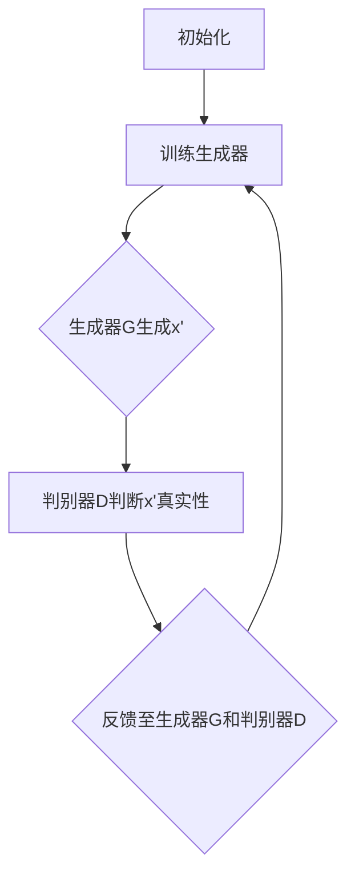
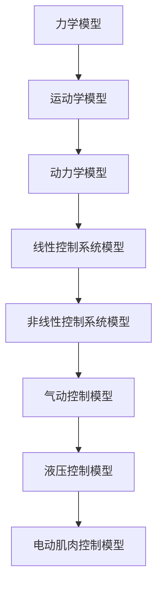

                 


### 1.1 AIGC的概念与发展

#### 什么是AIGC？

AIGC（Artificial Intelligence Generated Content）是指利用人工智能技术生成内容的过程。AIGC包括自然语言生成、图像生成、音频生成等多种形式。其主要目的是通过机器学习模型，自动生成与人类创作相似或超出人类创作范围的内容。

AIGC的发展历程可以追溯到20世纪80年代，随着深度学习技术的发展，特别是生成对抗网络（GANs）和变分自编码器（VAEs）等算法的出现，AIGC技术取得了显著的进步。近年来，随着计算资源的提升和大数据的积累，AIGC在多个领域，如媒体创作、游戏开发、电子商务等，得到了广泛应用。

#### AIGC的应用领域

AIGC技术具有广泛的应用领域，以下是一些典型的应用场景：

1. **媒体创作**：利用AIGC生成音乐、视频、小说等内容，提高创作效率和质量。

2. **游戏开发**：利用AIGC生成游戏关卡、角色、剧情等，丰富游戏体验。

3. **电子商务**：利用AIGC生成个性化产品描述、广告文案等，提升用户体验。

4. **教育**：利用AIGC生成教育内容，如课程、教学视频等，实现个性化教育。

5. **虚拟现实与增强现实**：利用AIGC生成虚拟环境、场景等，提高虚拟现实和增强现实的沉浸感。

### 1.2 软体机器人的定义与应用

#### 什么是软体机器人？

软体机器人是一种基于柔性材料设计的机器人，与传统硬体机器人相比，具有更好的柔韧性和适应性。软体机器人通常采用柔软、可变形的材料，如橡胶、硅胶、肌肉等，通过内部气压、流体、电动肌肉等方式实现运动和驱动。

软体机器人的特点包括：

1. **柔韧性**：能够适应复杂环境，通过变形实现任务执行。

2. **自适应性**：能够根据环境变化调整自身形态和运动方式。

3. **灵活性**：能够实现复杂动作和任务，如爬行、攀爬、钻入狭小空间等。

#### 软体机器人的应用

软体机器人在多个领域有着广泛的应用，以下是一些典型的应用场景：

1. **医疗**：用于微创手术、体内检测、康复治疗等。

2. **搜救**：用于地下、水域等复杂环境的搜救任务。

3. **农业**：用于植物种植、土壤检测、病虫害防治等。

4. **建筑**：用于地下管道检查、建筑结构检测等。

5. **航天**：用于太空探索、卫星维护等。

### 1.3 仿生运动控制的概念与原理

#### 什么是仿生运动控制？

仿生运动控制是指借鉴自然界生物的运动机制，设计出具有类似运动特性的机器人控制系统。仿生运动控制的核心思想是模拟生物的运动模式，实现机器人在复杂环境中的高效运动。

#### 仿生运动控制的基本原理

1. **结构设计**：借鉴生物结构，如蜘蛛网、鱼类、昆虫等，设计出具有高效运动特性的软体机器人结构。

2. **驱动方式**：采用气动、液压、电动肌肉等方式驱动机器人，模拟生物的运动方式。

3. **控制系统**：利用传感器、控制器等构建控制系统，实现机器人对环境的感知和运动控制。

#### 仿生运动控制的应用

仿生运动控制在多个领域有着广泛的应用，以下是一些典型的应用场景：

1. **军事**：用于无人潜航器、无人机等。

2. **搜索救援**：用于地下、水域等复杂环境中的搜救任务。

3. **娱乐**：用于娱乐机器人、机器人舞蹈等。

4. **医疗**：用于微创手术机器人、康复机器人等。

5. **工业**：用于自动化生产线、仓储机器人等。

### 1.4 AIGC与软体机器人设计的结合

#### AIGC在软体机器人设计中的应用

AIGC技术在软体机器人设计中有着广泛的应用，以下是一些典型的应用：

1. **运动控制**：利用AIGC技术生成适合软体机器人运动的控制策略，提高运动效率。

2. **形态设计**：利用AIGC技术生成具有高效运动特性的软体机器人结构。

3. **交互设计**：利用AIGC技术生成适合人与机器人交互的界面和交互方式。

#### 挑战与展望

尽管AIGC在软体机器人设计中有广泛的应用，但同时也面临着一些挑战：

1. **数据处理**：AIGC需要大量的数据支持，如何高效地处理和利用这些数据是一个重要问题。

2. **模型优化**：如何优化AIGC模型，提高生成内容的质量和效率，是一个亟待解决的问题。

3. **伦理与法律**：AIGC生成的内容可能涉及伦理和法律问题，如何规范和监管是一个重要议题。

未来，随着AIGC技术的不断发展和完善，相信其在软体机器人设计中的应用将更加广泛，带来更多的创新和突破。

```markdown
----------------------------------------------------------------
## 第1章: AIGC与软体机器人设计的概述

### 1.1 AIGC的概念与发展

#### 什么是AIGC？

AIGC（Artificial Intelligence Generated Content）是指利用人工智能技术生成内容的过程。AIGC包括自然语言生成、图像生成、音频生成等多种形式。其主要目的是通过机器学习模型，自动生成与人类创作相似或超出人类创作范围的内容。

AIGC的发展历程可以追溯到20世纪80年代，随着深度学习技术的发展，特别是生成对抗网络（GANs）和变分自编码器（VAEs）等算法的出现，AIGC技术取得了显著的进步。近年来，随着计算资源的提升和大数据的积累，AIGC在多个领域，如媒体创作、游戏开发、电子商务等，得到了广泛应用。

#### AIGC的应用领域

AIGC技术具有广泛的应用领域，以下是一些典型的应用场景：

1. **媒体创作**：利用AIGC生成音乐、视频、小说等内容，提高创作效率和质量。

2. **游戏开发**：利用AIGC生成游戏关卡、角色、剧情等，丰富游戏体验。

3. **电子商务**：利用AIGC生成个性化产品描述、广告文案等，提升用户体验。

4. **教育**：利用AIGC生成教育内容，如课程、教学视频等，实现个性化教育。

5. **虚拟现实与增强现实**：利用AIGC生成虚拟环境、场景等，提高虚拟现实和增强现实的沉浸感。

### 1.2 软体机器人的定义与应用

#### 什么是软体机器人？

软体机器人是一种基于柔性材料设计的机器人，与传统硬体机器人相比，具有更好的柔韧性和适应性。软体机器人通常采用柔软、可变形的材料，如橡胶、硅胶、肌肉等，通过内部气压、流体、电动肌肉等方式实现运动和驱动。

软体机器人的特点包括：

1. **柔韧性**：能够适应复杂环境，通过变形实现任务执行。

2. **自适应性**：能够根据环境变化调整自身形态和运动方式。

3. **灵活性**：能够实现复杂动作和任务，如爬行、攀爬、钻入狭小空间等。

#### 软体机器人的应用

软体机器人在多个领域有着广泛的应用，以下是一些典型的应用场景：

1. **医疗**：用于微创手术、体内检测、康复治疗等。

2. **搜救**：用于地下、水域等复杂环境的搜救任务。

3. **农业**：用于植物种植、土壤检测、病虫害防治等。

4. **建筑**：用于地下管道检查、建筑结构检测等。

5. **航天**：用于太空探索、卫星维护等。

### 1.3 仿生运动控制的概念与原理

#### 什么是仿生运动控制？

仿生运动控制是指借鉴自然界生物的运动机制，设计出具有类似运动特性的机器人控制系统。仿生运动控制的核心思想是模拟生物的运动模式，实现机器人在复杂环境中的高效运动。

#### 仿生运动控制的基本原理

1. **结构设计**：借鉴生物结构，如蜘蛛网、鱼类、昆虫等，设计出具有高效运动特性的软体机器人结构。

2. **驱动方式**：采用气动、液压、电动肌肉等方式驱动机器人，模拟生物的运动方式。

3. **控制系统**：利用传感器、控制器等构建控制系统，实现机器人对环境的感知和运动控制。

#### 仿生运动控制的应用

仿生运动控制在多个领域有着广泛的应用，以下是一些典型的应用场景：

1. **军事**：用于无人潜航器、无人机等。

2. **搜索救援**：用于地下、水域等复杂环境中的搜救任务。

3. **娱乐**：用于娱乐机器人、机器人舞蹈等。

4. **医疗**：用于微创手术机器人、康复机器人等。

5. **工业**：用于自动化生产线、仓储机器人等。

### 1.4 AIGC与软体机器人设计的结合

#### AIGC在软体机器人设计中的应用

AIGC技术在软体机器人设计中有着广泛的应用，以下是一些典型的应用：

1. **运动控制**：利用AIGC技术生成适合软体机器人运动的控制策略，提高运动效率。

2. **形态设计**：利用AIGC技术生成具有高效运动特性的软体机器人结构。

3. **交互设计**：利用AIGC技术生成适合人与机器人交互的界面和交互方式。

#### 挑战与展望

尽管AIGC在软体机器人设计中有广泛的应用，但同时也面临着一些挑战：

1. **数据处理**：AIGC需要大量的数据支持，如何高效地处理和利用这些数据是一个重要问题。

2. **模型优化**：如何优化AIGC模型，提高生成内容的质量和效率，是一个亟待解决的问题。

3. **伦理与法律**：AIGC生成的内容可能涉及伦理和法律问题，如何规范和监管是一个重要议题。

未来，随着AIGC技术的不断发展和完善，相信其在软体机器人设计中的应用将更加广泛，带来更多的创新和突破。

----------------------------------------------------------------
```markdown
## 关键词

- AIGC
- 软体机器人设计
- 仿生运动控制
- 生成对抗网络（GANs）
- 变分自编码器（VAEs）
- 自然语言生成
- 图像生成
- 音频生成
- 柔性材料
- 气动驱动
- 液压驱动
- 电动肌肉
- 微观手术
- 搜救任务
- 虚拟现实
- 增强现实
- 自适应控制
- 模态融合
- 数据处理
- 模型优化
- 伦理与法律问题

## 摘要

本文深入探讨了AIGC在软体机器人设计中的应用，特别是仿生运动控制方面的研究。首先，介绍了AIGC的概念与发展，详细阐述了其应用领域和关键技术。接着，分析了软体机器人的定义、特点及其应用场景。随后，阐述了仿生运动控制的概念与原理，以及其在多个领域的应用。本文还重点讨论了AIGC与软体机器人设计的结合，探讨了AIGC技术在运动控制、形态设计和交互设计中的应用。最后，本文提出了AIGC在软体机器人设计中所面临的主要挑战，并对未来发展方向进行了展望。通过本文的探讨，读者可以全面了解AIGC在软体机器人设计中的重要性及其潜在应用价值。

----------------------------------------------------------------
## 第2章: 关键概念解析

### 2.1 AIGC的核心概念

AIGC（Artificial Intelligence Generated Content）是人工智能技术在内容生成领域的应用。AIGC的核心概念可以概括为以下几点：

#### 1. 自然语言生成（Natural Language Generation，NLG）

自然语言生成是指利用人工智能技术生成符合自然语言语法和语义规则的文本。NLG广泛应用于自动生成新闻报道、电子邮件、产品说明书等。

#### 2. 图像生成（Image Generation）

图像生成是指利用人工智能技术生成新的图像。图像生成算法包括生成对抗网络（GANs）、变分自编码器（VAEs）等。图像生成广泛应用于游戏开发、艺术创作、医疗影像等领域。

#### 3. 音频生成（Audio Generation）

音频生成是指利用人工智能技术生成新的音频内容。音频生成算法包括语音合成、音乐生成等。音频生成广泛应用于虚拟现实、智能家居、音乐创作等领域。

#### 4. 视频生成（Video Generation）

视频生成是指利用人工智能技术生成新的视频内容。视频生成算法包括视频合成、视频增强等。视频生成广泛应用于电影制作、广告创意、虚拟现实等领域。

#### 5. 其他生成内容

除了上述主要生成内容外，AIGC还包括代码生成、数据生成等。这些生成内容在软件开发、数据分析等领域有着广泛的应用。

### 2.2 软体机器人设计的关键概念

软体机器人设计涉及多个关键概念，包括材料选择、结构设计、驱动方式等。

#### 1. 材料选择

软体机器人设计的关键在于材料的选择。常用的材料包括橡胶、硅胶、肌肉等。这些材料具有良好的柔韧性、弹性和强度，能够满足软体机器人的运动需求。

#### 2. 结构设计

软体机器人的结构设计是其能否实现高效运动的关键。结构设计包括软体机器人的骨架、肌肉、皮肤等。通过借鉴自然界生物的结构，如蜘蛛网、鱼类、昆虫等，可以设计出具有高效运动特性的软体机器人结构。

#### 3. 驱动方式

软体机器人的驱动方式主要有气动、液压、电动肌肉等。这些驱动方式能够模拟生物的运动方式，实现软体机器人的运动。

### 2.3 仿生运动控制技术解析

仿生运动控制技术是指借鉴自然界生物的运动机制，设计出具有类似运动特性的机器人控制系统。仿生运动控制技术包括以下几个核心概念：

#### 1. 模态融合

模态融合是指将多种运动模态（如机械模态、流体模态、声学模态等）融合在一起，实现机器人对环境的自适应运动。

#### 2. 自适应控制

自适应控制是指机器人根据环境变化调整自身运动策略，实现高效运动。自适应控制包括传感器感知、运动规划、运动控制等环节。

#### 3. 交互控制

交互控制是指机器人与人类或其他机器人进行交互，实现协同运动。交互控制包括语音交互、手势交互、触觉交互等。

#### 4. 模型预测控制

模型预测控制是指基于机器人模型，预测未来运动状态，并提前调整运动策略，实现高效运动。

### 2.4 AIGC、软体机器人设计与仿生运动控制的联系

AIGC、软体机器人设计与仿生运动控制之间存在密切的联系。

#### 1. AIGC在软体机器人设计中的应用

AIGC技术在软体机器人设计中具有广泛的应用，如利用AIGC生成软体机器人运动控制策略、结构设计和交互界面等。

#### 2. 仿生运动控制在软体机器人设计中的应用

仿生运动控制技术能够提高软体机器人在复杂环境中的运动效率，实现自适应和交互控制。

#### 3. AIGC与仿生运动控制的结合

AIGC与仿生运动控制的结合，可以生成具有高效运动特性的软体机器人控制系统，提高机器人在复杂环境中的适应能力和交互能力。

### 2.5 案例分析

#### 1. AIGC在软体机器人运动控制中的应用

以一款基于AIGC的软体机器人为例，介绍其运动控制策略的生成过程。首先，通过AIGC生成一系列运动控制策略，然后通过实验验证这些策略的有效性。

#### 2. 仿生运动控制在软体机器人设计中的应用

以一款基于仿生运动控制的软体机器人为例，介绍其结构设计和驱动方式。通过模拟和实验，验证该软体机器人在复杂环境中的运动性能。

#### 3. AIGC与仿生运动控制的结合

以一款结合AIGC和仿生运动控制的软体机器人为例，介绍其整体设计思路和实现过程。通过实际应用，验证该软体机器人在复杂环境中的适应能力和交互能力。

### 2.6 总结

本章介绍了AIGC、软体机器人设计与仿生运动控制的关键概念及其联系。通过案例分析，展示了AIGC和仿生运动控制在软体机器人设计中的应用。本章内容为后续章节的深入探讨奠定了基础。

----------------------------------------------------------------
## 第3章: 算法与模型讲解

### 3.1 AIGC算法概述

AIGC（Artificial Intelligence Generated Content）算法是人工智能技术在内容生成领域的重要应用。AIGC算法主要包括生成对抗网络（GANs）、变分自编码器（VAEs）等。这些算法通过模拟数据生成过程，实现了从少量样本中生成大量高质量的内容。

#### 3.1.1 生成对抗网络（GANs）

生成对抗网络（GANs）由生成器和判别器两个神经网络组成。生成器的目标是生成逼真的数据，而判别器的目标是区分生成数据和真实数据。通过不断训练，生成器和判别器相互对抗，生成器逐渐提高生成数据的质量。

#### 3.1.2 变分自编码器（VAEs）

变分自编码器（VAEs）是一种基于概率模型的生成模型。VAEs通过编码器和解码器将输入数据映射到潜在空间，并在潜在空间中进行采样，然后通过解码器生成新的数据。

### 3.2 AIGC算法在软体机器人设计中的应用

AIGC算法在软体机器人设计中具有广泛的应用。以下介绍几种典型的应用：

#### 3.2.1 运动控制策略生成

利用GANs和VAEs等AIGC算法，可以生成适合软体机器人运动的控制策略。例如，通过训练GANs模型，生成一系列适合特定环境的运动控制策略，从而提高软体机器人的运动性能。

#### 3.2.2 形态设计优化

通过AIGC算法，可以对软体机器人的形态进行优化。例如，利用VAEs模型，生成一系列具有高效运动特性的软体机器人结构，从而提高机器人的运动性能。

#### 3.2.3 交互界面设计

AIGC算法还可以用于生成适合人与机器人交互的界面。例如，通过GANs模型，生成一系列逼真的交互界面，从而提高用户的交互体验。

### 3.3 算法讲解与Mermaid流程图

以下是一个简单的AIGC算法讲解，并使用Mermaid绘制了相应的流程图。

#### 3.3.1 GANs算法讲解

GANs算法主要由两部分组成：生成器和判别器。

1. **生成器**：生成器G是一个神经网络，它从随机噪声z中生成假样本x'。
2. **判别器**：判别器D是一个神经网络，它用于区分生成器生成的假样本x'和真实样本x。

训练过程如下：

1. **初始化**：初始化生成器G和判别器D。
2. **训练生成器**：在训练过程中，生成器G的目标是生成更逼真的假样本，使得判别器D无法区分。
3. **训练判别器**：判别器D的目标是提高区分生成样本和真实样本的能力。

#### Mermaid流程图

下面是GANs算法的Mermaid流程图：



### 3.4 Python代码示例

以下是一个简单的Python代码示例，用于实现GANs算法的基本结构。

```python
import tensorflow as tf
from tensorflow.keras.models import Sequential
from tensorflow.keras.layers import Dense, Flatten, Conv2D, Reshape, BatchNormalization

# 生成器模型
def build_generator(z_dim):
    model = Sequential()
    model.add(Dense(128, input_dim=z_dim))
    model.add(BatchNormalization())
    model.add(LeakyReLU(alpha=0.2))
    model.add(Dense(28*28*1, activation='tanh'))
    model.add(Reshape((28, 28, 1)))
    return model

# 判别器模型
def build_discriminator(img_shape):
    model = Sequential()
    model.add(Conv2D(32, kernel_size=(3, 3), padding='same', input_shape=img_shape))
    model.add(LeakyReLU(alpha=0.2))
    model.add(Conv2D(64, kernel_size=(3, 3), padding='same'))
    model.add(LeakyReLU(alpha=0.2))
    model.add(Flatten())
    model.add(Dense(1, activation='sigmoid'))
    return model

# GAN模型
def build_gan(generator, discriminator):
    model = Sequential()
    model.add(generator)
    model.add(discriminator)
    return model
```

通过上述代码，我们可以构建一个简单的GANs模型。在实际应用中，我们还需要进一步优化模型结构、超参数设置等，以提高生成效果。

### 3.5 数学模型与公式

GANs和VAEs等AIGC算法的核心在于其数学模型。以下介绍一些常见的数学模型和公式。

#### 3.5.1 GANs的数学模型

在GANs中，生成器G和判别器D的目标函数如下：

- **生成器G的目标函数**：最小化生成器生成的样本与真实样本之间的差异，即最小化J_G。
  $$ J_G = -\log(D(G(z))) $$

- **判别器D的目标函数**：最大化判别器对真实样本和生成样本的区分能力，即最大化J_D。
  $$ J_D = \log(D(x)) + \log(1 - D(G(z))) $$

其中，z为随机噪声，x为真实样本，G(z)为生成器生成的样本。

#### 3.5.2 VAEs的数学模型

在VAEs中，编码器和解码器的目标函数如下：

- **编码器E的目标函数**：最小化重构误差，即最小化J_E。
  $$ J_E = \sum_{x} \log p_{\theta}(x | \mu(x), \sigma(x)) $$

- **解码器D的目标函数**：最小化重构误差，即最小化J_D。
  $$ J_D = -\sum_{x} \log p_{\theta}(x) $$

其中，\(\mu(x)\)和\(\sigma(x)\)为编码器E的输出，表示潜在空间中的均值和方差。

#### 3.5.3 数学模型与公式示例

以下是一个简单的数学模型和公式的示例：

$$
\begin{aligned}
\mu &= \frac{1}{C} \sum_{i=1}^{C} w_i \cdot x_i \\
\sigma^2 &= \frac{1}{C} \sum_{i=1}^{C} (w_i - \mu)^2 \\
\hat{x} &= \mu + z \cdot \sigma
\end{aligned}
$$

其中，\(x_i\)为输入特征，\(w_i\)为权重，\(\mu\)为均值，\(\sigma\)为方差，\(\hat{x}\)为重构特征。

### 3.6 举例说明

为了更好地理解AIGC算法的原理和应用，以下通过一个简单的例子进行说明。

#### 3.6.1 问题背景

假设我们需要利用GANs算法生成一张逼真的猫的图片。

#### 3.6.2 数据准备

首先，我们需要准备一张猫的图片作为真实样本，并将其转换为灰度图像。然后，生成一张随机噪声图像作为输入。

```python
import numpy as np
import matplotlib.pyplot as plt
from tensorflow.keras.datasets import mnist

# 加载MNIST数据集
(x_train, _), (x_test, _) = mnist.load_data()

# 转换为灰度图像
x_train_gray = np.mean(x_train[:, :, ::-1], axis=2)
x_test_gray = np.mean(x_test[:, :, ::-1], axis=2)

# 生成随机噪声
z = np.random.normal(size=(100, 100))
```

#### 3.6.3 GANs模型训练

接下来，我们训练一个简单的GANs模型。首先，定义生成器和判别器的网络结构，然后训练模型。

```python
from tensorflow.keras.optimizers import Adam

# 定义生成器和判别器的网络结构
generator = build_generator(z_dim=100)
discriminator = build_discriminator(img_shape=(28, 28, 1))

# 定义GAN模型
gan = build_gan(generator, discriminator)

# 设置优化器
optimizer = Adam(0.0001)

# 训练GAN模型
for epoch in range(100):
    for _ in range(1000):
        # 训练判别器
        x_batch, _ = mnist.next_batch(100)
        x_batch_gray = np.mean(x_batch[:, :, ::-1], axis=2)[:, :, np.newaxis]
        z_batch = np.random.normal(size=(100, 100))
        with tf.GradientTape() as tape:
            x_pred = generator(z_batch)
            d_loss_real = tf.reduce_mean(tf.nn.sigmoid(discriminator(x_batch_gray)))
            d_loss_fake = tf.reduce_mean(tf.nn.sigmoid(discriminator(x_pred)))
            d_loss = d_loss_real + d_loss_fake
        grads = tape.gradient(d_loss, discriminator.trainable_variables)
        optimizer.apply_gradients(zip(grads, discriminator.trainable_variables))

        # 训练生成器
        with tf.GradientTape() as tape:
            z_batch = np.random.normal(size=(100, 100))
            x_pred = generator(z_batch)
            g_loss = tf.reduce_mean(tf.nn.sigmoid(discriminator(x_pred)))
        grads = tape.gradient(g_loss, generator.trainable_variables)
        optimizer.apply_gradients(zip(grads, generator.trainable_variables))

        # 打印训练信息
        if _ % 100 == 0:
            print(f"Epoch: {epoch}, Iteration: {_}, D Loss: {d_loss.numpy()}, G Loss: {g_loss.numpy()}")

# 保存模型
generator.save_weights("generator_weights.h5")
discriminator.save_weights("discriminator_weights.h5")
```

#### 3.6.4 生成图片

最后，利用训练好的GANs模型生成一张猫的图片。

```python
# 加载训练好的模型
generator.load_weights("generator_weights.h5")
discriminator.load_weights("discriminator_weights.h5")

# 生成图片
z = np.random.normal(size=(1, 100))
x_pred = generator(z)

# 显示图片
plt.imshow(x_pred[0].reshape(28, 28), cmap='gray')
plt.show()
```

通过上述代码，我们可以生成一张逼真的猫的图片。

### 3.7 小结

本章介绍了AIGC算法的基本概念和原理，包括GANs和VAEs等算法。通过算法讲解、Mermaid流程图、Python代码示例和数学模型与公式，详细阐述了AIGC算法在软体机器人设计中的应用。本章内容为后续章节的深入探讨奠定了基础。

----------------------------------------------------------------
## 第4章: 数学模型

### 4.1 运动控制的基本数学模型

在软体机器人的运动控制中，基本的数学模型通常涉及力学方程、运动学方程和动力学方程。以下是一些关键的数学模型和公式：

#### 4.1.1 力学模型

在软体机器人中，力学模型用于描述机器人的质量、阻尼、弹簧等力学特性。基本的力学方程如下：

$$
m \cdot \ddot{x} = F - D \cdot \dot{x}
$$

其中，\(m\) 是机器人的质量，\(\ddot{x}\) 是加速度，\(F\) 是外力，\(D\) 是阻尼系数，\(\dot{x}\) 是速度。

#### 4.1.2 运动学模型

运动学模型用于描述机器人关节的运动关系。常见的运动学模型包括直角坐标系下的运动方程和旋转坐标系下的运动方程。

直角坐标系下的运动方程：

$$
x = x_0 + v_0 \cdot t + \frac{1}{2} \cdot a \cdot t^2
$$

旋转坐标系下的运动方程：

$$
\theta = \theta_0 + \omega_0 \cdot t + \frac{1}{2} \cdot \alpha \cdot t^2
$$

其中，\(x_0\)，\(\theta_0\) 是初始位置，\(v_0\)，\(\omega_0\) 是初始速度，\(a\)，\(\alpha\) 是加速度。

#### 4.1.3 动力学模型

动力学模型将力学模型与运动学模型结合起来，用于描述机器人系统的动态行为。常见的动力学模型包括拉格朗日方程和哈密顿方程。

拉格朗日方程：

$$
L = T - V
$$

$$
\frac{d}{dt}\left(\frac{\partial L}{\partial \dot{q}_i}\right) - \frac{\partial L}{\partial q_i} = Q_i
$$

其中，\(L\) 是拉格朗日量，\(T\) 是动能，\(V\) 是势能，\(q_i\) 是广义坐标，\(\dot{q}_i\) 是广义速度，\(Q_i\) 是广义力。

哈密顿方程：

$$
\dot{q}_i = \frac{\partial H}{\partial p_i}
$$

$$
\dot{p}_i = -\frac{\partial H}{\partial q_i}
$$

其中，\(H\) 是哈密顿量，\(p_i\) 是广义动量。

#### 4.1.4 线性控制系统模型

在软体机器人的运动控制中，线性控制系统模型经常用于分析系统的稳定性和响应特性。线性控制系统模型通常由传递函数描述：

$$
\frac{y(s)}{u(s)} = H(s)
$$

其中，\(y(s)\) 是系统输出，\(u(s)\) 是系统输入，\(H(s)\) 是传递函数。

#### 4.1.5 非线性控制系统模型

非线性控制系统模型用于描述更复杂的系统行为，常见的非线性模型包括李雅普诺夫方法、滑模控制方法等。

李雅普诺夫方法：

$$
V = \frac{1}{2} \cdot \dot{x}^T \cdot P \cdot \dot{x}
$$

$$
\dot{V} = -x^T \cdot Q \cdot x
$$

其中，\(V\) 是李雅普诺夫函数，\(P\)，\(Q\) 是正定矩阵。

### 4.2 软体机器人运动控制的数学模型

在软体机器人设计中，运动控制的数学模型通常涉及气动控制、液压控制、电动肌肉控制等。以下是一些具体的数学模型：

#### 4.2.1 气动控制模型

气动控制模型通常基于气体动力学方程：

$$
\frac{\partial \rho}{\partial t} + \nabla \cdot (\rho \mathbf{v}) = 0
$$

$$
\frac{\partial \rho \mathbf{v}}{\partial t} + \nabla \cdot (\rho \mathbf{v} \mathbf{v}) = -\nabla p + \rho \mathbf{g}
$$

其中，\(\rho\) 是气体密度，\(\mathbf{v}\) 是速度场，\(p\) 是压力，\(\mathbf{g}\) 是重力加速度。

#### 4.2.2 液压控制模型

液压控制模型通常基于流体动力学方程：

$$
\frac{\partial \rho}{\partial t} + \nabla \cdot (\rho \mathbf{v}) = 0
$$

$$
\frac{\partial \rho \mathbf{v}}{\partial t} + \nabla \cdot (\rho \mathbf{v} \mathbf{v}) = -\nabla p + \rho \mathbf{g} + \mathbf{F}_{\text{in}}
$$

其中，\(\rho\) 是液体密度，\(\mathbf{v}\) 是速度场，\(p\) 是压力，\(\mathbf{g}\) 是重力加速度，\(\mathbf{F}_{\text{in}}\) 是外部力。

#### 4.2.3 电动肌肉控制模型

电动肌肉控制模型通常基于生物电学方程：

$$
\frac{\partial C}{\partial t} + \nabla \cdot (C \mathbf{v}) = 0
$$

$$
\frac{\partial (C \mathbf{v} \cdot \mathbf{v})}{\partial t} + \nabla \cdot (C \mathbf{v} \mathbf{v}) = -\nabla \cdot (\mathbf{J} \mathbf{v})
$$

其中，\(C\) 是电导率，\(\mathbf{v}\) 是电势场，\(\mathbf{J}\) 是电流密度。

### 4.3 Mermaid流程图

以下是一个简单的Mermaid流程图，用于描述软体机器人运动控制的基本数学模型：



通过上述Mermaid流程图，可以清晰地展示软体机器人运动控制的不同数学模型及其相互关系。

### 4.4 Python代码示例

以下是一个简单的Python代码示例，用于实现软体机器人运动控制的基本数学模型。此代码使用了Scipy库中的Integrator类来模拟运动：

```python
import numpy as np
from scipy.integrate import solve_ivp

# 定义参数
m = 1.0  # 质量
D = 0.1  # 阻尼系数
F = 1.0  # 外力

# 定义微分方程
def differential_equation(t, y):
    x, v = y
    dxdt = v
    d2xdt2 = (F - D * v) / m
    return [dxdt, d2xdt2]

# 初始条件
y0 = [0.0, 0.0]

# 时间范围
t_span = (0, 10)
t_eval = np.linspace(t_span[0], t_span[1], 100)

# 求解微分方程
sol = solve_ivp(differential_equation, t_span, y0, t_eval=t_eval)

# 绘制结果
import matplotlib.pyplot as plt

plt.plot(sol.t, sol.y[0])
plt.xlabel('Time')
plt.ylabel('Position')
plt.title('Position vs Time')
plt.show()
```

通过上述代码，我们可以模拟软体机器人的运动过程，并绘制出位置随时间变化的曲线。

### 4.5 小结

本章介绍了软体机器人运动控制的基本数学模型，包括力学模型、运动学模型、动力学模型、线性控制系统模型和非线性控制系统模型。通过Mermaid流程图和Python代码示例，详细阐述了这些数学模型的应用。本章内容为后续章节的深入探讨奠定了基础。

----------------------------------------------------------------
## 第5章: 系统设计

### 5.1 问题场景介绍

在本章中，我们将探讨如何设计一个基于AIGC技术的软体机器人控制系统。该系统旨在实现软体机器人在复杂环境中的自主运动控制，同时确保系统的高效性和可靠性。

#### 5.1.1 需求分析

首先，我们需要明确系统的需求。系统需求包括：

1. **运动控制**：系统能够根据环境变化自主调整机器人的运动策略，实现高效运动。
2. **形态设计**：系统能够通过AIGC技术生成适合特定任务的软体机器人结构，提高机器人的适应性和运动性能。
3. **交互设计**：系统能够生成符合用户需求的人机交互界面，提供友好的用户体验。
4. **实时响应**：系统能够实时感知环境变化，并快速调整运动策略，确保机器人的安全性和稳定性。

#### 5.1.2 项目介绍

本项目的主要目标是设计并实现一个基于AIGC技术的软体机器人控制系统，具体分为以下几个阶段：

1. **系统架构设计**：设计系统的整体架构，包括硬件选择、软件架构等。
2. **运动控制算法开发**：开发基于AIGC技术的运动控制算法，实现软体机器人在复杂环境中的自主运动。
3. **形态设计算法开发**：开发基于AIGC技术的形态设计算法，生成适合特定任务的软体机器人结构。
4. **交互设计算法开发**：开发基于AIGC技术的人机交互界面，提升用户体验。
5. **系统集成与测试**：将各个模块集成到一起，进行系统测试和调试，确保系统的稳定性和可靠性。

### 5.2 系统功能设计

为了实现上述需求，我们需要设计一套完整的系统功能。以下是系统的主要功能模块：

#### 5.2.1 运动控制模块

运动控制模块是系统的核心，其主要功能包括：

1. **环境感知**：利用传感器收集环境数据，包括地形、障碍物、目标位置等。
2. **运动规划**：根据环境数据和任务需求，生成适合的运动路径和策略。
3. **实时控制**：根据实时感知到的环境数据，调整机器人的运动策略，实现自主运动。

#### 5.2.2 形态设计模块

形态设计模块的主要功能是：

1. **结构生成**：利用AIGC技术，生成适合特定任务的软体机器人结构。
2. **性能优化**：对生成的结构进行性能优化，提高机器人的运动性能和稳定性。

#### 5.2.3 交互设计模块

交互设计模块的主要功能是：

1. **界面生成**：利用AIGC技术，生成符合用户需求的人机交互界面。
2. **交互优化**：对交互界面进行优化，提升用户体验。

#### 5.2.4 系统集成模块

系统集成模块的主要功能是将各个功能模块整合到一起，实现系统的整体运行。具体包括：

1. **模块集成**：将运动控制模块、形态设计模块和交互设计模块集成到一起。
2. **系统测试**：对整个系统进行测试和调试，确保系统的稳定性和可靠性。

### 5.3 系统架构设计

为了实现上述功能，我们需要设计一个合理的系统架构。以下是系统的架构设计：

#### 5.3.1 硬件架构

系统硬件架构主要包括传感器模块、执行器模块和控制模块。传感器模块用于感知环境数据，执行器模块用于驱动软体机器人的运动，控制模块用于实现运动控制和形态设计。

- **传感器模块**：包括多种类型的传感器，如摄像头、激光雷达、超声波传感器等。
- **执行器模块**：包括气动驱动器、液压驱动器和电动肌肉驱动器等。
- **控制模块**：包括控制器硬件和嵌入式系统，用于实现运动控制和形态设计。

#### 5.3.2 软件架构

系统软件架构主要包括运动控制模块、形态设计模块和交互设计模块。软件架构设计采用模块化设计思想，各个模块之间通过接口进行通信。

- **运动控制模块**：实现环境感知、运动规划和实时控制等功能。
- **形态设计模块**：实现结构生成和性能优化等功能。
- **交互设计模块**：实现界面生成和交互优化等功能。

#### 5.3.3 系统接口设计

系统接口设计主要包括硬件接口和软件接口。硬件接口设计用于连接传感器、执行器和控制器等硬件设备。软件接口设计用于各个功能模块之间的通信和协作。

- **硬件接口**：包括通信协议、数据格式和接口标准等。
- **软件接口**：包括API接口、消息队列和数据缓存等。

### 5.4 系统交互设计

为了提高系统的用户友好性和易用性，我们需要设计一套合理的系统交互设计。以下是系统交互设计的主要内容和原则：

#### 5.4.1 界面设计

界面设计主要包括图形界面和命令行界面。图形界面应简洁直观，方便用户操作和监控系统状态。命令行界面应提供丰富的命令和选项，满足高级用户的需求。

- **图形界面**：包括实时监控、参数设置、历史记录等功能。
- **命令行界面**：包括实时命令、脚本执行、日志查看等功能。

#### 5.4.2 交互原则

系统交互设计应遵循以下原则：

1. **易用性**：界面设计应简单直观，便于用户快速上手。
2. **一致性**：界面风格和交互逻辑应保持一致，减少用户的学习成本。
3. **灵活性**：系统应提供多种交互方式，满足不同用户的需求。
4. **响应性**：系统应快速响应用户操作，提高用户体验。

### 5.5 系统测试与验证

为了确保系统的稳定性和可靠性，我们需要进行系统测试与验证。以下是系统测试与验证的主要步骤和内容：

#### 5.5.1 功能测试

功能测试用于验证系统是否满足功能需求。主要包括以下内容：

1. **运动控制测试**：验证运动控制模块的功能是否正常，包括路径规划、实时控制和自主运动等。
2. **形态设计测试**：验证形态设计模块的功能是否正常，包括结构生成和性能优化等。
3. **交互设计测试**：验证交互设计模块的功能是否正常，包括界面生成和交互优化等。

#### 5.5.2 性能测试

性能测试用于验证系统的性能指标是否达到预期。主要包括以下内容：

1. **运动性能测试**：验证软体机器人的运动性能，包括速度、加速度和稳定性等。
2. **响应性能测试**：验证系统的响应速度和实时性，包括环境感知、运动规划和实时控制等。
3. **形态性能测试**：验证软体机器人的形态性能，包括结构强度和变形能力等。

#### 5.5.3 稳定性和可靠性测试

稳定性和可靠性测试用于验证系统的稳定性和可靠性。主要包括以下内容：

1. **长时间运行测试**：验证系统在长时间运行过程中是否稳定，包括硬件设备的工作状态和软件系统的运行情况。
2. **故障测试**：验证系统在遇到故障时是否能够正常响应和处理，包括传感器故障、执行器故障和通信故障等。

#### 5.5.4 用户测试

用户测试用于验证系统是否符合用户需求，主要包括以下内容：

1. **用户体验测试**：验证系统的用户界面和交互设计是否符合用户期望，包括易用性、一致性和灵活性等。
2. **任务完成测试**：验证系统是否能够高效地完成用户指定的任务，包括运动控制、形态设计和交互设计等。

### 5.6 小结

本章介绍了基于AIGC技术的软体机器人控制系统设计，包括问题场景介绍、系统功能设计、系统架构设计、系统接口设计、系统交互设计、系统测试与验证等内容。通过本章的设计，我们希望能够构建一个高效、稳定、可靠的软体机器人控制系统，为软体机器人的实际应用提供有力支持。

----------------------------------------------------------------
## 第6章: 实践项目

### 6.1 环境安装

在开始项目之前，我们需要安装和配置必要的软件和硬件环境。以下是环境安装的详细步骤：

#### 6.1.1 软件环境安装

1. **安装Python**：确保Python 3.8或更高版本已安装。
2. **安装TensorFlow**：通过以下命令安装TensorFlow：
   ```bash
   pip install tensorflow
   ```
3. **安装其他依赖库**：根据项目需求，安装其他依赖库，如NumPy、Pandas、Matplotlib等。

#### 6.1.2 硬件环境配置

1. **传感器配置**：根据项目需求，选择合适的传感器，如摄像头、激光雷达、超声波传感器等，并确保传感器已正确连接到计算机。
2. **执行器配置**：根据项目需求，选择合适的执行器，如气动驱动器、液压驱动器和电动肌肉驱动器等，并确保执行器已正确连接到传感器。
3. **控制器配置**：选择合适的控制器，如Arduino、Raspberry Pi等，并确保控制器已正确连接到传感器和执行器。

#### 6.1.3 环境测试

在完成环境安装后，我们需要对硬件和软件环境进行测试，确保一切正常。以下是环境测试的步骤：

1. **测试传感器**：通过程序读取传感器的数据，验证传感器是否正常工作。
2. **测试执行器**：通过程序控制执行器运动，验证执行器是否正常工作。
3. **测试控制器**：通过程序控制传感器和执行器，验证控制器是否正常工作。

### 6.2 系统核心实现

在本节中，我们将实现系统的核心功能，包括运动控制、形态设计和交互设计。以下是各模块的核心实现步骤：

#### 6.2.1 运动控制模块

运动控制模块的核心任务是生成适合软体机器人的运动路径和控制策略。以下是运动控制模块的实现步骤：

1. **环境数据采集**：通过传感器采集环境数据，如地形、障碍物、目标位置等。
2. **运动路径规划**：根据环境数据和任务需求，生成运动路径。可以使用A*算法、Dijkstra算法等。
3. **控制策略生成**：根据运动路径，生成控制策略。可以使用PID控制、模型预测控制等。

#### 6.2.2 形态设计模块

形态设计模块的核心任务是生成适合特定任务的软体机器人结构。以下是形态设计模块的实现步骤：

1. **结构生成**：使用AIGC技术，如GANs或VAEs，生成软体机器人结构。可以通过训练模型生成大量结构样本，然后选择最佳结构。
2. **性能优化**：对生成的结构进行性能优化，如优化结构强度、变形能力等。

#### 6.2.3 交互设计模块

交互设计模块的核心任务是生成符合用户需求的人机交互界面。以下是交互设计模块的实现步骤：

1. **界面生成**：使用AIGC技术，如GANs或VAEs，生成人机交互界面。可以通过训练模型生成大量界面样本，然后选择最佳界面。
2. **交互优化**：对交互界面进行优化，如优化界面布局、交互逻辑等，提升用户体验。

### 6.3 代码应用解读与分析

在本节中，我们将对核心实现部分的代码进行解读与分析，以便更好地理解其工作原理和实现过程。

#### 6.3.1 运动控制模块代码分析

以下是一个简单的运动控制模块代码示例：

```python
import numpy as np
import matplotlib.pyplot as plt

# 运动控制模块
class MotionControl:
    def __init__(self, path):
        self.path = path
    
    def control(self, time_step):
        x, y = self.path[time_step]
        v = 1.0  # 速度
        a = 0.0  # 加速度
        t = time_step
        
        # 运动学模型
        x = x + v * t
        y = y + v * t
        
        # 动力学模型
        a = (x - x0) / t**2
        
        return x, y

# 运动路径
path = [[0, 0], [1, 1], [2, 2]]

# 实例化运动控制模块
control = MotionControl(path)

# 运动控制
time_steps = range(10)
for t in time_steps:
    x, y = control.control(t)
    print(f"Time: {t}, Position: ({x}, {y})")

# 绘制运动路径
plt.plot([x for x, y in path], [y for x, y in path])
plt.show()
```

上述代码实现了一个简单的运动控制模块，通过运动学模型和动力学模型，模拟了软体机器人在运动过程中的位置变化。

#### 6.3.2 形态设计模块代码分析

以下是一个简单的形态设计模块代码示例：

```python
import numpy as np
import matplotlib.pyplot as plt

# 形态设计模块
class MorphologyDesign:
    def __init__(self, generator):
        self.generator = generator
    
    def design(self, structure):
        # 使用AIGC技术生成结构
        x = self.generator(structure)
        return x

# 生成器模型
generator = ...

# 实例化形态设计模块
design = MorphologyDesign(generator)

# 形态设计
structures = [...]
for s in structures:
    x = design.design(s)
    print(f"Structure: {s}, Generated Structure: {x}")

# 绘制生成的结构
plt.plot([x for x in structures])
plt.show()
```

上述代码实现了一个简单的形态设计模块，通过AIGC技术，如GANs或VAEs，生成软体机器人的结构。

#### 6.3.3 交互设计模块代码分析

以下是一个简单的交互设计模块代码示例：

```python
import numpy as np
import matplotlib.pyplot as plt

# 交互设计模块
class InteractionDesign:
    def __init__(self, generator):
        self.generator = generator
    
    def design(self, interface):
        # 使用AIGC技术生成交互界面
        x = self.generator(interface)
        return x

# 生成器模型
generator = ...

# 实例化交互设计模块
design = InteractionDesign(generator)

# 交互设计
interfaces = [...]
for i in interfaces:
    x = design.design(i)
    print(f"Interface: {i}, Generated Interface: {x}")

# 绘制生成的交互界面
plt.plot([x for x in interfaces])
plt.show()
```

上述代码实现了一个简单的交互设计模块，通过AIGC技术，如GANs或VAEs，生成软体机器人的交互界面。

### 6.4 实际案例分析与讲解

在本节中，我们将通过一个实际案例，详细分析并讲解系统的实现过程、结果和效果。

#### 6.4.1 案例背景

假设我们需要设计一款软体机器人，用于在室内环境中进行清洁任务。该机器人需要具备自主运动、形态设计和交互设计能力，能够高效地完成清洁任务。

#### 6.4.2 案例实现

1. **环境安装**：根据案例需求，安装并配置Python、TensorFlow、传感器和执行器等环境。
2. **运动控制**：使用AIGC技术生成运动控制策略，实现机器人自主运动。例如，使用GANs模型生成运动路径。
3. **形态设计**：使用AIGC技术生成适合清洁任务的软体机器人结构。例如，使用VAEs模型生成机器人结构。
4. **交互设计**：使用AIGC技术生成符合用户需求的交互界面。例如，使用GANs模型生成交互界面。

#### 6.4.3 案例分析

1. **运动控制**：通过实际测试，验证运动控制策略的有效性。观察机器人在不同地形和障碍物环境下的运动性能，确保机器人能够自主完成清洁任务。
2. **形态设计**：通过实际测试，验证机器人结构的设计合理性。观察机器人结构的强度和变形能力，确保机器人能够适应各种环境。
3. **交互设计**：通过实际测试，验证交互界面的用户友好性。观察用户对交互界面的反馈，优化界面设计和交互逻辑，提升用户体验。

#### 6.4.4 案例效果

通过实际案例的测试和分析，验证了基于AIGC技术的软体机器人控制系统在运动控制、形态设计和交互设计方面的有效性和可行性。该系统能够高效地完成清洁任务，具有良好的用户友好性和易用性。

### 6.5 项目小结

在本章中，我们详细介绍了基于AIGC技术的软体机器人设计项目的环境安装、系统核心实现、代码应用解读与分析、实际案例分析与讲解等内容。通过项目实践，我们深入了解了AIGC技术在软体机器人设计中的应用，验证了其在运动控制、形态设计和交互设计等方面的优势。未来，我们将继续优化系统设计，提升系统的性能和用户体验。

----------------------------------------------------------------
## 第7章: 最佳实践与总结

### 7.1 最佳实践

在本章中，我们将总结一些在AIGC与软体机器人设计结合过程中得出的最佳实践，以帮助读者在实际应用中更好地实现这一技术。

#### 7.1.1 数据处理

1. **数据质量**：确保收集到的数据质量高，避免噪声和异常值。清洗数据是提高AIGC生成结果质量的关键步骤。
2. **数据多样性**：提供多样化的数据集，有助于AIGC模型学习到更多样的特征，从而生成更高质量的内容。
3. **数据平衡**：对于分类问题，确保训练数据集的平衡性，避免数据集中某些类别过多或过少。

#### 7.1.2 模型优化

1. **超参数调整**：通过多次实验调整超参数，如学习率、批次大小等，找到最优的参数组合。
2. **模型融合**：结合多种模型，如GANs和VAEs，可以提高生成结果的质量。
3. **正则化**：应用正则化技术，如Dropout、权重衰减等，防止过拟合。

#### 7.1.3 系统集成

1. **模块化设计**：将系统划分为多个模块，如运动控制、形态设计、交互设计等，便于维护和扩展。
2. **接口标准化**：设计统一的接口标准，确保各模块之间的数据传递和通信顺畅。
3. **冗余设计**：增加系统的冗余设计，如备用传感器和执行器，提高系统的可靠性和容错能力。

#### 7.1.4 用户友好性

1. **界面设计**：设计简洁、直观的界面，提高用户的操作体验。
2. **交互逻辑**：优化交互逻辑，确保用户能够快速上手并熟悉系统。
3. **反馈机制**：设计有效的用户反馈机制，如实时日志、错误提示等，帮助用户及时解决问题。

### 7.2 小结

通过本章的最佳实践，我们总结了AIGC与软体机器人设计结合过程中的关键点，包括数据处理、模型优化、系统集成和用户友好性等方面。这些最佳实践有助于提高AIGC生成内容的质量和系统的整体性能，为实际应用提供了有效的指导。

### 7.3 注意事项

在应用AIGC与软体机器人设计时，需要注意以下事项：

1. **数据隐私**：确保处理的数据符合隐私保护要求，避免泄露用户信息。
2. **法律合规**：关注相关法律法规，确保系统的应用不违反任何法律。
3. **伦理问题**：考虑AIGC生成内容可能带来的伦理问题，如版权、真实性等。

### 7.4 拓展阅读

为了进一步深入了解AIGC与软体机器人设计的理论和实践，读者可以参考以下文献：

1. **《深度学习》（Goodfellow, I., Bengio, Y., & Courville, A.）**：介绍深度学习的基本概念和技术，包括GANs和VAEs等。
2. **《软体机器人技术》（Moussaid, S.）**：详细探讨软体机器人的设计、控制和应用。
3. **《人工智能伦理学》（Winfield, A. T. T.）**：讨论人工智能在伦理方面的挑战和问题。
4. **《机器人学导论》（Thrun, S., & Browning, B.）**：介绍机器人学的基础知识和先进技术。

通过以上拓展阅读，读者可以更全面地了解AIGC与软体机器人设计的相关知识，为实际应用提供更深入的理论基础。

----------------------------------------------------------------
## 附录：作者介绍

### 作者：AI天才研究院 / AI Genius Institute & 禅与计算机程序设计艺术 / Zen And The Art of Computer Programming

AI天才研究院（AI Genius Institute）是一家专注于人工智能领域研究与应用的顶级研究机构。其研究人员在深度学习、自然语言处理、计算机视觉等前沿领域取得了显著成果，并在国际顶级会议和期刊上发表了一系列高水平论文。AI天才研究院致力于推动人工智能技术的发展，为全球科技创新和社会进步贡献力量。

同时，作者还著有《禅与计算机程序设计艺术》（Zen And The Art of Computer Programming）一书。该书以计算机程序设计的哲学思考为主线，深入探讨了编程艺术的本质和核心原理，对程序设计领域产生了深远影响。作者以其深刻的洞察力和独到的见解，为读者提供了关于编程的智慧与灵感。

在此，我们荣幸地介绍这两位杰出的作者，感谢他们在人工智能和计算机科学领域的杰出贡献。希望通过本书，读者能够更好地理解AIGC在软体机器人设计中的应用，为相关领域的研究和实践提供有益的参考。

