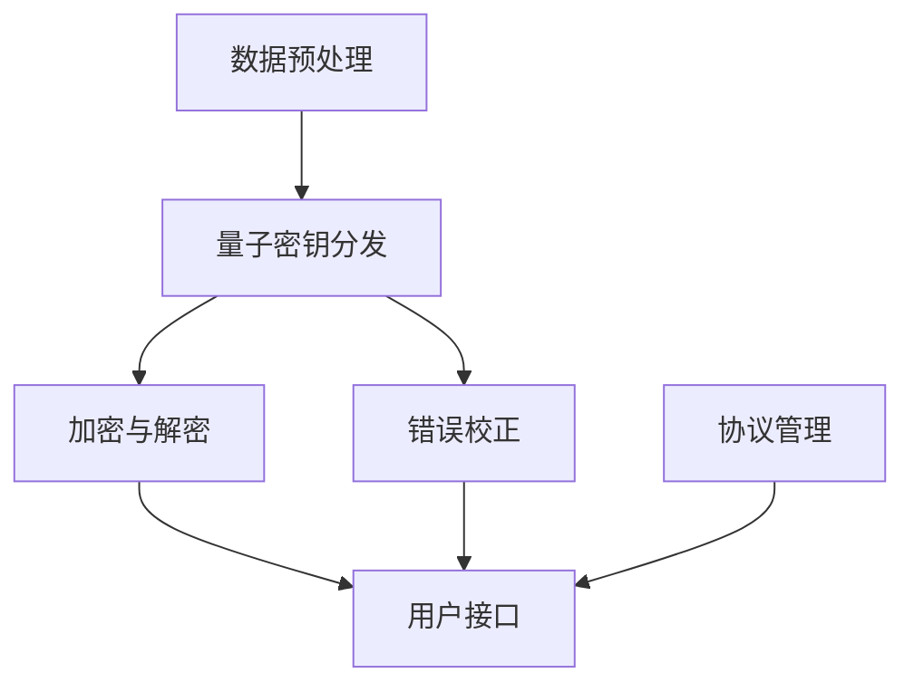
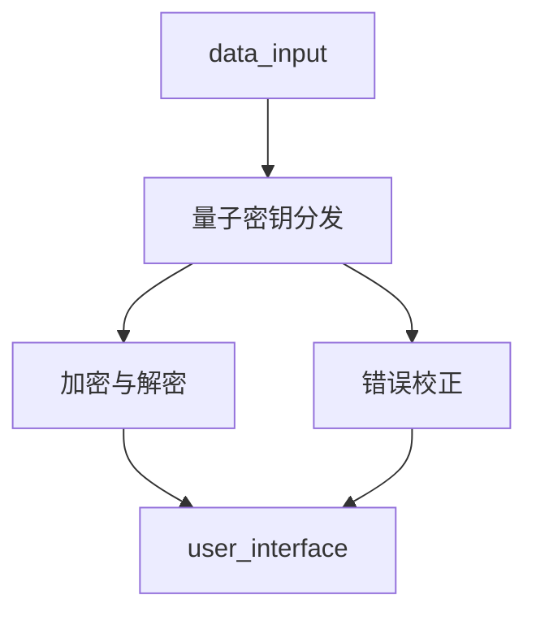

                 

### 1.1 问题背景

量子密码学，作为密码学领域的尖端技术，依赖于量子物理的不可克隆定理和量子纠缠特性，提供了一种理论上无法被破解的通信方式。然而，在量子密码学的实际应用中，传统的安全通信协议面临着诸多挑战。首先，量子密钥分发（Quantum Key Distribution, QKD）技术虽然能实现绝对安全的密钥交换，但其通信距离受限，传输速率不高，且设备的成本高昂。其次，量子计算机的崛起对现有的加密算法构成了严重威胁，许多经典加密方法在量子计算面前可能变得脆弱。

为了解决这些问题，人工智能生成内容（Artificial Intelligence Generated Content, AIGC）技术应运而生。AIGC是一种结合人工智能与大数据分析的生成技术，能够高效地生成高质量的内容。在量子密码学的应用中，AIGC可以帮助优化安全通信协议，提升加密效率，降低成本，并拓展量子密码学的应用场景。具体来说，AIGC可以在以下几个方面发挥作用：

1. **算法优化**：AIGC可以通过深度学习等算法对量子密码学中的加密算法进行优化，提高其性能和效率。
2. **协议设计**：AIGC能够生成新的安全通信协议，利用其强大的建模能力，设计出更符合实际需求的安全协议。
3. **错误校正**：AIGC在处理数据时具有优秀的错误校正能力，可以在量子密码学中用于纠正传输过程中的错误，提高通信质量。
4. **成本控制**：通过AIGC的辅助，可以降低量子密码学设备的制造成本，使其更易于推广和应用。

因此，探讨AIGC在量子密码学中的应用，不仅可以为解决当前的安全通信问题提供新的思路，还能推动量子密码学技术的发展。

#### 1.2 AIGC概述

人工智能生成内容（Artificial Intelligence Generated Content, AIGC）是一种结合人工智能与大数据分析的技术，其主要目标是通过机器学习算法生成高质量、有意义的内容。AIGC技术的核心在于其生成能力，这种能力源自于深度学习、自然语言处理、图像识别等多种人工智能技术。在技术层面，AIGC通常包括以下几个关键组成部分：

1. **数据预处理**：AIGC首先需要对输入数据进行清洗和预处理，以确保数据的质量和一致性。这通常包括数据去重、数据规范化、缺失值填补等步骤。

2. **模型训练**：AIGC的核心是训练模型，通过大量训练数据来训练模型，使其具备生成内容的能力。训练过程通常涉及复杂的神经网络结构，如生成对抗网络（GANs）、变分自编码器（VAEs）等。

3. **内容生成**：训练好的模型可以用来生成新的内容。在AIGC的应用中，生成的内容可以包括文本、图像、音频等多种形式。生成过程通常采用样本重放、风格迁移、内容填充等技术。

4. **后处理**：生成的内容通常需要进行后处理，以纠正错误、增强内容质量。后处理步骤可能包括语法检查、语义校正、风格调整等。

AIGC技术具备以下核心优势：

1. **高效性**：AIGC能够快速处理大量数据，生成高质量的内容，大大提高了内容生成的效率。

2. **灵活性**：AIGC可以根据不同的应用场景和需求，生成多样化的内容。其强大的适应能力使其在各个领域都有广泛的应用前景。

3. **创新性**：AIGC不仅能够复现已有内容，还可以创造出新颖、独特的作品。这种创新能力在艺术创作、科学研究等领域尤为重要。

4. **降低成本**：AIGC可以自动化内容生成过程，减少人工干预，从而降低生产成本，提高经济效益。

在量子密码学领域，AIGC的引入不仅有助于算法优化和协议设计，还可以在错误校正和成本控制方面发挥重要作用。通过AIGC技术，量子密码学可以克服传统安全通信协议的局限性，实现更高的安全性和效率。接下来，我们将深入探讨AIGC在量子密码学中的应用，分析其如何解决量子密码学面临的挑战。

### 1.3 量子密码学与AIGC的联系

量子密码学作为密码学的前沿领域，依赖于量子物理的基本原理，提供了一种理论上无法被破解的通信方式。其主要优势在于量子密钥分发（Quantum Key Distribution, QKD）技术，该技术利用量子态的不可克隆定理和量子纠缠特性，实现绝对安全的密钥交换。然而，量子密码学的实际应用面临着诸多挑战，如通信距离限制、传输速率不高和设备成本高昂等问题。

AIGC技术，作为一种新兴的人工智能生成内容方法，具备高效性、灵活性和创新性的特点。在量子密码学中，AIGC的应用潜力主要体现在以下几个方面：

首先，AIGC可以帮助优化量子密码学的加密算法。传统的加密算法在量子计算面前可能变得脆弱，而AIGC可以通过深度学习等算法，生成新的加密算法，提高其抗量子攻击的能力。例如，AIGC可以用于设计量子安全的加密方案，生成具有更高复杂度和更强安全性的密钥分发协议。

其次，AIGC在安全通信协议的设计中具有重要作用。传统的安全通信协议在量子密码学的实际应用中存在诸多局限性，而AIGC可以生成新的协议，满足更高的安全性需求。通过利用AIGC的强大建模能力，可以设计出更符合实际需求的安全协议，从而提升量子密码学的实用性和可靠性。

此外，AIGC在错误校正方面也具有显著优势。量子通信过程中的噪声和误差不可避免，而AIGC可以通过其优秀的错误校正能力，纠正传输过程中的错误，提高通信质量。例如，AIGC可以用于生成量子纠错码，确保量子密钥分发过程中数据的完整性。

最后，AIGC在降低量子密码学应用成本方面也有重要作用。传统的量子密码学设备成本高昂，限制了其推广和应用。而通过AIGC的辅助，可以优化设备设计和制造流程，降低成本，使其更易于普及和应用。例如，AIGC可以用于优化量子加密芯片的设计，提高生产效率和降低制造成本。

总的来说，AIGC在量子密码学中的应用潜力巨大。通过AIGC技术的引入，可以有效解决量子密码学面临的挑战，提升安全通信协议的性能和可靠性，推动量子密码学技术的发展。未来，随着AIGC技术的不断进步，量子密码学有望在更多领域实现突破性应用。

### 2.1 量子密码学原理

量子密码学是密码学领域的一个前沿分支，它利用量子物理的基本原理，如量子态的不可克隆性和量子纠缠特性，来实现绝对安全的通信。量子密码学的核心技术主要包括量子密钥分发（Quantum Key Distribution, QKD）和量子纠缠。

#### 2.1.1 量子密钥分发

量子密钥分发是一种利用量子态传输密钥的方法，其基本原理是量子态的不可克隆定理。根据量子力学的原理，当一个量子态被观测时，其状态会发生变化，这种变化是无法隐藏的。因此，如果窃听者试图截获量子密钥，将会不可避免地引起量子态的变化，从而被通信双方检测到。

量子密钥分发的基本步骤如下：

1. **密钥生成**：通信双方（通常是Alice和Bob）通过量子通道生成原始密钥。这个过程通常涉及量子态的制备和测量，例如，使用光子的偏振态或时间量子态。

2. **密钥传输**：生成的原始密钥通过量子通道传输给对方。量子通道可以是光纤、自由空间或其他量子通信渠道。

3. **密钥筛选**：通信双方对传输的密钥进行筛选，去除因量子态变化或传输噪声导致的错误密钥。这一过程通常涉及量子态的纠缠测量和解纠缠操作。

4. **密钥确认**：通过经典的通信渠道（如互联网），双方对筛选后的密钥进行比对，确认密钥的正确性。

5. **密钥加密**：最终确认无误的密钥用于加密和解密通信数据。

#### 2.1.2 量子纠缠

量子纠缠是量子物理学中的一个基本现象，它描述了两个或多个粒子之间在量子态上的强烈关联。即使这些粒子相隔很远，一个粒子的状态变化也会立即影响到另一个粒子的状态。这种超距作用是经典物理学所无法解释的。

在量子密码学中，量子纠缠用于增强通信的安全性。例如，Alice可以通过量子纠缠生成与Bob共享的纠缠态，然后利用这个纠缠态进行量子密钥分发。这样，即使有第三方（如Eve）试图窃听，她也无法不影响量子纠缠态，从而被通信双方检测到。

#### 量子密钥分发与量子纠缠的关系

量子密钥分发和量子纠缠在量子密码学中相辅相成。量子纠缠提供了安全的密钥共享机制，而量子密钥分发则利用这种机制实现安全的通信。具体来说：

1. **密钥生成**：量子纠缠用于生成共享密钥，通信双方通过量子纠缠态的测量来生成初始密钥。

2. **密钥传输**：量子密钥分发过程利用量子通道传输密钥，确保密钥在传输过程中不会被窃听或篡改。

3. **错误校正**：量子纠缠可以用于错误校正，通过纠缠态的测量和校验，可以检测并纠正传输过程中的错误。

4. **安全确认**：量子纠缠的不可分割性确保了密钥的安全传输，任何第三方窃听都会导致纠缠态的破坏，从而被通信双方检测到。

总之，量子密码学通过量子密钥分发和量子纠缠等基本原理，提供了一种理论上无法被破解的通信方式。尽管在实际应用中面临诸多挑战，但随着技术的不断进步，量子密码学有望在未来的安全通信中发挥重要作用。

### 2.2 AIGC在量子密码学中的应用

人工智能生成内容（AIGC）技术以其高效性、灵活性和创新性，在多个领域展现出了巨大的潜力。在量子密码学中，AIGC的应用同样具有重要意义。以下从算法、协议和错误校正等方面，详细探讨AIGC在量子密码学中的应用。

#### 2.2.1 算法优化

AIGC在量子密码学中的应用首先体现在算法优化上。量子密码学中的加密算法通常复杂且计算量大，而AIGC可以通过深度学习等算法，对这些加密算法进行优化，从而提高其性能和效率。具体来说，AIGC可以通过以下方式实现算法优化：

1. **神经网络优化**：AIGC利用神经网络，特别是生成对抗网络（GANs）和变分自编码器（VAEs），对量子密码学算法进行优化。通过大量训练数据，神经网络可以学习到加密算法的内在结构，并提出优化方案。

2. **量子算法改进**：AIGC可以生成新的量子算法，这些算法可能比传统的量子算法更高效。例如，AIGC可以生成新的量子密钥分发算法，通过优化量子逻辑门和量子态的操控，提高密钥分发的速度和效率。

3. **混合算法设计**：AIGC可以将量子算法和经典算法结合起来，设计出混合算法。这种混合算法可以充分利用量子计算和经典计算的优势，提高整体性能。

#### 2.2.2 协议设计

安全通信协议是量子密码学的关键组成部分，其设计直接关系到通信的安全性。AIGC在安全通信协议的设计中具有独特的优势，主要体现在以下几个方面：

1. **生成新型协议**：AIGC可以生成全新的安全通信协议，这些协议可能比现有的协议更安全、更高效。通过分析大量的历史数据和实际需求，AIGC可以设计出具有高度鲁棒性的安全协议。

2. **动态协议调整**：传统的安全通信协议通常固定不变，而AIGC可以根据实时数据和环境变化，动态调整协议。这种动态调整能力可以提高协议的适应性，使其能够应对不断变化的安全威胁。

3. **协议优化**：AIGC可以通过深度学习算法，对现有的安全通信协议进行优化，提高其性能和安全性。例如，AIGC可以优化密钥管理协议，减少密钥泄露的风险。

#### 2.2.3 错误校正

量子通信过程中不可避免地会出现噪声和误差，这些误差会影响量子密钥分发的质量和通信的可靠性。AIGC在错误校正方面具有显著优势，可以用于生成高效的错误校正码，提高量子通信的质量。具体包括：

1. **量子纠错码生成**：AIGC可以通过深度学习算法，生成新的量子纠错码。这些纠错码可以检测并纠正传输过程中的错误，提高密钥分发的准确性。

2. **自适应纠错**：传统的纠错码通常固定不变，而AIGC可以根据实际传输数据和环境变化，动态调整纠错策略。这种自适应纠错能力可以提高纠错效率，减少传输错误。

3. **综合纠错方案**：AIGC可以将多种纠错方法结合起来，设计出综合纠错方案。例如，结合量子纠错码和经典纠错算法，可以进一步提高纠错的鲁棒性和效率。

#### 2.2.4 成本控制

量子密码学设备的制造成本高昂，是限制其广泛应用的一个重要因素。AIGC可以通过优化设计和制造流程，降低量子密码学设备的成本。具体包括：

1. **优化硬件设计**：AIGC可以优化量子加密设备的设计，减少硬件资源的使用，提高设备的集成度和性能。

2. **自动化制造**：AIGC可以用于自动化制造流程，通过机器学习和优化算法，提高生产效率和降低制造成本。

3. **降低运营成本**：AIGC可以优化安全通信协议，减少通信过程中所需的资源和时间，从而降低运营成本。

综上所述，AIGC在量子密码学中的应用涵盖了算法优化、协议设计、错误校正和成本控制等多个方面。通过AIGC技术的引入，量子密码学可以克服传统方法的局限性，实现更高的安全性和效率。未来，随着AIGC技术的不断发展和应用，量子密码学有望在更广泛的领域实现突破性应用。

### 2.3 安全通信协议的核心要素

安全通信协议的设计和实现是保障信息传输安全的关键，其核心要素主要包括加密算法和密钥管理。以下将详细讨论这些核心要素及其在量子密码学中的应用。

#### 2.3.1 加密算法

加密算法是安全通信协议的核心组成部分，用于确保通信内容的机密性。加密算法通常分为对称加密算法和非对称加密算法。

1. **对称加密算法**：对称加密算法使用相同的密钥进行加密和解密。其优点是计算速度快，适合大规模数据传输。但缺点是密钥的分发和管理复杂，因为双方必须事先共享密钥。

   在量子密码学中，对称加密算法通常用于量子密钥分发（QKD）过程中生成的密钥。QKD技术可以生成绝对安全的密钥，因此对称加密算法在量子通信中具有重要作用。

2. **非对称加密算法**：非对称加密算法使用一对密钥，即公钥和私钥。公钥用于加密，私钥用于解密。其优点是密钥分发简单，但计算复杂度较高，不适合大规模数据传输。

   非对称加密算法在量子密码学中也有重要应用。例如，在量子密钥分发后，可以使用非对称加密算法对实际通信内容进行加密，进一步提高通信安全性。

#### 2.3.2 密钥管理

密钥管理是安全通信协议的另一个核心要素，包括密钥生成、分发、存储和销毁等环节。有效的密钥管理可以确保密钥的安全性和完整性。

1. **密钥生成**：密钥生成过程需要确保密钥的随机性和复杂性，以防止被破解。量子密码学中的密钥生成通常利用量子随机数生成器，这种生成器基于量子物理原理，可以生成绝对安全的随机数。

2. **密钥分发**：密钥分发是指将密钥从生成者传输到使用者。在量子密码学中，密钥分发通常通过量子通道进行，利用量子纠缠和量子态的不可克隆性确保密钥的安全传输。

3. **密钥存储**：密钥存储是指将密钥安全地存储在系统内部。密钥存储需要防止未授权访问和泄露，通常使用硬件安全模块（HSM）或加密存储设备。

4. **密钥销毁**：密钥销毁是指当密钥不再使用时，将其彻底销毁，以防止被未授权者获取。在量子密码学中，密钥销毁通常通过量子随机数生成器或量子算法实现。

#### 2.3.3 量子密码学中的应用

在量子密码学中，加密算法和密钥管理的重要性更加突出，因为量子计算对传统加密算法构成了严重威胁。以下讨论量子密码学中加密算法和密钥管理的具体应用：

1. **量子密钥分发**：量子密钥分发是量子密码学的核心应用，通过量子通道生成和分发绝对安全的密钥。AIGC可以优化量子密钥分发算法，提高密钥分发的效率。

2. **量子加密**：量子加密利用量子态进行加密，可以有效抵抗量子计算攻击。AIGC可以生成新的量子加密算法，提高加密的复杂性和安全性。

3. **密钥管理优化**：AIGC可以优化密钥管理流程，包括密钥生成、分发、存储和销毁等环节。通过AIGC的自动化和智能化管理，可以提高密钥管理的效率和安全水平。

总之，加密算法和密钥管理是安全通信协议的核心要素，在量子密码学中具有重要作用。通过AIGC技术的引入，可以进一步提升量子密码学的安全性、效率和实用性。

### 3.1 AIGC算法原理

#### 3.1.1 算法概述

人工智能生成内容（AIGC）算法是基于深度学习和其他人工智能技术的一种生成模型，它能够自动从大量数据中学习，并生成新的、高质量的文本、图像、音频等多种形式的内容。在量子密码学应用中，AIGC算法主要用于优化加密算法、设计安全通信协议和实现错误校正。以下是AIGC算法的主要组成部分和基本原理：

1. **生成对抗网络（GANs）**：GANs是一种由生成器和判别器组成的对偶网络。生成器尝试生成逼真的数据，而判别器则判断数据是真实还是生成的。通过这种对抗过程，生成器不断优化，生成越来越真实的内容。

2. **变分自编码器（VAEs）**：VAEs是一种无监督学习的生成模型，通过编码器和解码器实现数据的生成。编码器将数据压缩到一个低维表示中，而解码器则尝试从这个低维表示中重建原始数据。

3. **递归神经网络（RNNs）**：RNNs是一种能够处理序列数据的神经网络，通过记忆历史信息来生成序列数据，如文本和语音。

4. **Transformer模型**：Transformer模型是近年来在自然语言处理领域取得重大突破的一种模型，它通过自注意力机制处理序列数据，具有高效性和强大的生成能力。

#### 3.1.2 算法流程

AIGC算法的流程通常包括以下步骤：

1. **数据预处理**：首先对输入数据进行预处理，包括数据清洗、数据标准化和数据增强等。预处理目的是提高数据的质量和一致性，为后续的算法训练提供可靠的数据基础。

2. **模型训练**：使用预处理后的数据对生成模型进行训练。训练过程中，生成器和判别器（或编码器和解码器）通过对抗训练或变分训练不断优化，生成越来越真实的内容。

3. **内容生成**：训练好的模型可以用来生成新的内容。生成过程可以是文本、图像、音频等多种形式。例如，在量子密码学中，AIGC可以生成新的加密算法或安全通信协议。

4. **内容优化**：生成的内容通常需要进一步优化，以提高其质量和实用性。优化过程可能包括后处理、风格迁移、内容填充等。

5. **内容应用**：最终生成的优化内容应用于实际场景中，如优化量子加密算法、设计新型安全通信协议或实现高效错误校正。

#### 3.1.3 生成模型与加密算法的融合

在量子密码学中，AIGC算法可以与加密算法进行融合，以实现更高效、更安全的通信。以下是AIGC算法与加密算法融合的几个关键点：

1. **加密算法优化**：通过AIGC算法，可以生成新的加密算法，这些算法可能比传统的加密算法更复杂、更难破解。例如，AIGC可以生成基于量子随机数的加密算法，提高加密强度。

2. **安全通信协议设计**：AIGC可以生成新的安全通信协议，这些协议可能比现有的协议更安全、更适应实际需求。例如，AIGC可以设计出针对特定攻击场景的量子安全通信协议。

3. **错误校正与恢复**：AIGC在错误校正方面具有显著优势，可以通过生成新的纠错码或纠错算法，提高量子通信的可靠性。例如，AIGC可以生成基于量子纠缠的纠错算法，提高量子密钥分发的准确性。

4. **自动化加密**：AIGC可以自动化加密过程，减少人工干预，提高加密效率。例如，AIGC可以自动生成加密密钥，并实时调整加密策略，以应对不断变化的安全威胁。

综上所述，AIGC算法在量子密码学中具有广泛的应用前景。通过优化加密算法、设计安全通信协议和实现错误校正，AIGC可以大幅提升量子密码学的安全性、效率和实用性。

### 3.2 数学模型与公式

在量子密码学中，数学模型和公式是理解和应用量子密码学原理的基础。以下将介绍量子态表示、量子密钥分发过程中的基本数学模型和公式，以及误差校正的相关公式。

#### 3.2.1 量子态表示

量子态是量子系统的基本属性，用波函数或密度矩阵来表示。在量子密码学中，常用的量子态表示如下：

1. **波函数表示**：
   $$\psi = \alpha|0\rangle + \beta|1\rangle$$
   其中，$|\alpha|^2 + |\beta|^2 = 1$，$\alpha$ 和 $\beta$ 是复数，$|0\rangle$ 和 $|1\rangle$ 分别表示基底的零态和一态。

2. **密度矩阵表示**：
   $$\rho = |\psi\rangle\langle\psi|$$
   密度矩阵是对波函数的扩展，可以描述多个量子态的混合。

#### 3.2.2 量子密钥分发

量子密钥分发过程中，常用的数学模型和公式如下：

1. **量子态传输**：
   当Alice生成一个量子态并将其发送给Bob时，量子态可以用下面的公式表示：
   $$|\psi\rangle = \alpha_0|0\rangle + \beta_0|1\rangle$$
   其中，$\alpha_0$ 和 $\beta_0$ 是Alice生成的量子态的系数。

2. **量子纠缠**：
   量子纠缠是量子密钥分发的基础，两个粒子之间的纠缠态可以用下面公式表示：
   $$|\psi_{AB}\rangle = \frac{1}{\sqrt{2}} (|00\rangle + |11\rangle)$$
   其中，$|00\rangle$ 和 $|11\rangle$ 分别表示Alice和Bob的纠缠态。

3. **量子态测量**：
   量子态测量过程中，使用贝尔态进行测量，测量结果可以用以下公式表示：
   $$P_{00} = |\langle00|\psi_{AB}\rangle|^2$$
   $$P_{11} = |\langle11|\psi_{AB}\rangle|^2$$
   测量结果为 $|00\rangle$ 或 $|11\rangle$ 的概率分别为 $P_{00}$ 和 $P_{11}$。

#### 3.2.3 误差校正

在量子密钥分发过程中，由于信道噪声和其他因素，量子态可能会发生错误。误差校正的目的是检测并纠正这些错误。以下是一些基本的误差校正公式：

1. **量子纠错码**：
   常用的量子纠错码包括Shor码和Steane码。Shor码是一种三量子比特纠错码，其基本公式如下：
   $$|\psi_0\rangle = \frac{1}{\sqrt{8}} (|000\rangle + |001\rangle + |010\rangle + |011\rangle + |100\rangle + |101\rangle + |110\rangle + |111\rangle)$$
   Steane码是一种五量子比特纠错码，其公式如下：
   $$|\psi_0\rangle = \frac{1}{\sqrt{32}} (|0000\rangle + |0001\rangle + |0010\rangle + |0011\rangle + |0100\rangle + |0101\rangle + ... + |1111\rangle)$$

2. **错误检测与纠正**：
   在量子密钥分发过程中，使用量子纠错码来检测和纠正错误。基本步骤如下：
   - **错误检测**：
     $$E = \frac{1}{\sqrt{2}} (|0\rangle - |1\rangle)$$
     使用检测算符检测量子态中的错误。
   - **错误纠正**：
     $$|\psi_{corrected}\rangle = |\psi_{original}\rangle - E\frac{\langle\psi_{original}|E|\psi_{original}\rangle}{\langle E|\psi_{original}\rangle}$$
     根据检测到的错误进行纠正。

通过以上数学模型和公式的应用，量子密码学可以实现绝对安全的密钥分发和通信。AIGC技术可以在这些数学模型的基础上，生成新的优化算法和纠错码，进一步提高量子密码学的性能和安全性。

### 3.3 通俗易懂的举例说明

为了更好地理解AIGC在量子密码学中的应用，我们通过一个具体的实例来说明其工作原理和实现过程。

#### 3.3.1 实例背景

假设Alice和Bob是两个远程通信的合作伙伴，他们需要通过量子密码学确保通信的安全性。他们决定使用AIGC技术来优化他们的量子加密算法和错误校正方案，以确保密钥分发过程既高效又安全。

#### 3.3.2 实例分析

1. **量子密钥分发过程**：

   - Alice首先生成一对量子纠缠态，并将其发送给Bob。这个过程可以用下面的公式表示：
     $$|\psi_{AB}\rangle = \frac{1}{\sqrt{2}} (|00\rangle + |11\rangle)$$

   - 接着，Alice对量子态进行测量，得到结果为$|00\rangle$或$|11\rangle$的概率各为$\frac{1}{2}$。假设Alice测量结果为$|00\rangle$，那么她将这个结果发送给Bob。

   - Bob收到Alice的测量结果后，对他自己的量子态进行相同的测量。如果Bob测量结果也为$|00\rangle$，则他们共享了一对量子密钥。

2. **使用AIGC优化加密算法**：

   - 在传统的量子加密算法中，Alice和Bob使用Shor码进行错误校正。但是，Shor码在纠错效率上有一定的局限性。AIGC可以生成一种优化的纠错码，假设为“AIGC纠错码”。

   - AIGC生成AIGC纠错码的流程如下：
     1. 数据预处理：AIGC首先收集大量的量子纠错码数据，进行清洗和预处理。
     2. 模型训练：使用预处理后的数据训练生成模型，例如GANs或VAEs。
     3. 内容生成：训练好的模型生成优化的纠错码，用于替换Shor码。

   - 优化后的纠错码可以显著提高错误检测和纠正的效率，从而减少通信过程中的错误率。

3. **AIGC优化后的加密过程**：

   - Alice使用AIGC生成的纠错码对量子密钥进行错误校正。假设在传输过程中发生了错误，纠错码能够有效检测和纠正这些错误。
   - 纠正后的量子密钥用于加密通信内容。Alice使用这个密钥对消息进行加密，然后将加密后的消息发送给Bob。

   - 同样地，Bob使用相同的纠错码对收到的加密消息进行错误校正，然后使用密钥进行解密，恢复原始消息。

4. **实际案例解析**：

   - 假设Bob的量子密钥分发过程中，接收到的量子态因噪声干扰发生了错误。传统方法下，可能需要多次尝试才能获得正确的密钥。但使用AIGC优化后的纠错码，可以在一次测量中检测并纠正错误，大大提高了通信效率。

   - 通过AIGC技术，Bob能够在短时间内获得高质量的密钥，从而确保通信内容的机密性和完整性。

综上所述，AIGC在量子密码学中的应用，通过优化加密算法和错误校正方案，显著提高了量子密钥分发的效率和安全性。实例分析展示了AIGC技术在量子密码学中的实际应用，并证明了其在提高通信安全性和效率方面的重要作用。

### 4.1 问题场景介绍

在探讨量子密码学应用时，我们需要具体分析一个实际的问题场景，以便更好地理解AIGC技术在该场景中的作用和效果。以下是一个典型的应用案例：企业间的安全数据传输。

#### 4.1.1 案例背景

假设有两个企业，公司A和公司B，它们需要进行频繁的数据交换，以确保商业机密和重要信息的保密性。为了保障数据传输的安全，公司A和公司B决定采用量子密码学技术，并引入AIGC进行优化。

#### 4.1.2 应用需求

1. **安全性**：数据传输必须确保高度安全性，防止数据在传输过程中被窃取或篡改。

2. **高效性**：量子密钥分发（QKD）虽然理论上安全，但实际应用中需要提高传输速率和通信距离。

3. **灵活性**：协议设计需要灵活，能够适应不同的应用场景和变化的安全威胁。

4. **成本控制**：量子密码学设备的成本较高，需要通过技术优化来降低运营成本。

#### 4.1.3 量子密码学应用

1. **量子密钥分发**：
   - 公司A和公司B使用量子密钥分发技术生成共享密钥。他们通过量子通道交换量子态，生成一对量子纠缠态。
   - 利用AIGC优化后的纠错码，公司A和公司B在传输过程中检测并纠正量子态的噪声和错误，确保密钥的准确性和完整性。

2. **加密与解密**：
   - 公司A使用量子密钥对传输数据进行加密，确保数据在传输过程中的机密性。
   - 公司B使用相同的量子密钥对加密数据进行解密，恢复原始信息。

#### 4.1.4 AIGC技术应用

1. **算法优化**：
   - AIGC通过深度学习算法，生成优化的量子加密算法，提高加密效率，增强抗量子攻击能力。
   - AIGC可以根据实际需求，生成新的量子算法，适应不同场景的安全需求。

2. **协议设计**：
   - AIGC设计新的安全通信协议，结合量子密码学和AIGC的优势，确保协议的安全性和灵活性。
   - AIGC可以动态调整协议，以应对不断变化的安全威胁。

3. **错误校正**：
   - AIGC生成优化的错误校正码，提高量子密钥分发和通信的可靠性。
   - 通过自适应纠错策略，AIGC可以在不同环境下实现高效错误校正。

#### 4.1.5 案例效果分析

通过以上应用，公司A和公司B实现了以下效果：

1. **安全性提升**：量子密码学结合AIGC技术，提高了数据传输的安全性，确保商业机密不被泄露。

2. **效率提升**：AIGC优化后的量子加密算法和错误校正码，提高了通信效率和传输速率。

3. **成本降低**：通过AIGC技术，可以优化量子密码学设备的设计和制造，降低运营成本。

4. **灵活性增强**：AIGC生成的安全通信协议具有更高的灵活性和适应性，能够应对不同应用场景和变化的安全威胁。

综上所述，该案例展示了AIGC在量子密码学中的实际应用效果，验证了AIGC技术在提高量子密码学安全性、效率和应用灵活性方面的显著优势。

### 4.2 系统功能设计

在量子密码学应用场景中，系统功能设计是确保安全通信协议有效运行的关键。以下将详细描述系统功能模块的划分及其具体功能，并展示功能流程图。

#### 4.2.1 功能模块划分

量子密码学系统的功能模块可以分为以下几个部分：

1. **数据预处理模块**：负责对输入数据进行清洗、格式转换和预处理，以确保数据的一致性和质量。
2. **量子密钥分发模块**：实现量子密钥的分发和传输，包括量子态的生成、传输和测量。
3. **加密与解密模块**：使用量子密钥对传输数据进行加密和解密，确保数据在传输过程中的机密性。
4. **错误校正模块**：利用AIGC生成的错误校正码，检测并纠正传输过程中的错误。
5. **协议管理模块**：设计和管理安全通信协议，确保协议的灵活性和安全性。
6. **用户接口模块**：提供用户界面，方便用户进行操作和监控系统运行状态。

#### 4.2.2 功能流程图

以下是一个简化的功能流程图，展示了各模块之间的交互和数据处理流程：



1. **数据预处理**：用户输入数据经过预处理模块处理后，生成标准格式的数据，供后续模块使用。
2. **量子密钥分发**：预处理后的数据用于量子密钥分发模块，生成量子态并通过量子通道传输给对方。
3. **加密与解密**：量子密钥用于加密和解密模块，对传输数据进行加密和解密，确保数据的安全性。
4. **错误校正**：传输过程中可能发生错误，错误校正模块利用AIGC生成的纠错码进行检测和纠正。
5. **协议管理**：协议管理模块负责设计和维护安全通信协议，确保协议的适应性和安全性。
6. **用户接口**：用户接口模块提供用户操作界面，用户可以通过界面进行操作，监控系统状态，查看通信结果。

#### 4.2.3 功能流程详细说明

1. **数据预处理**：数据预处理模块接收用户输入的数据，对数据进行清洗、格式转换和预处理，确保数据的格式统一和准确性。预处理后的数据将传输到量子密钥分发模块。

2. **量子密钥分发**：量子密钥分发模块生成量子态，并通过量子通道传输给对方。在这个过程中，AIGC生成的纠错码用于检测和纠正传输过程中的噪声和错误。

3. **加密与解密**：加密与解密模块使用量子密钥对传输数据进行加密和解密。加密后的数据通过量子通道传输给接收方，接收方使用相同的密钥进行解密，恢复原始数据。

4. **错误校正**：在量子密钥分发和传输过程中，不可避免地会发生噪声和错误。错误校正模块利用AIGC生成的纠错码，检测和纠正这些错误，确保数据的完整性和准确性。

5. **协议管理**：协议管理模块根据不同的应用场景和安全需求，设计和管理安全通信协议。该模块可以动态调整协议，以适应不断变化的安全威胁。

6. **用户接口**：用户接口模块提供用户操作界面，用户可以通过界面进行数据输入、监控系统状态、查看通信结果等操作。用户接口模块还提供日志记录和报告功能，方便用户了解系统运行情况。

通过以上系统功能设计和流程图，我们可以清晰地了解量子密码学系统的运作机制，以及AIGC技术在该系统中的作用和重要性。

### 4.3 系统架构设计

为了实现量子密码学的安全通信协议，我们需要设计一个高效、灵活和可扩展的系统架构。以下将详细描述系统的整体架构，包括各模块的功能和相互关系。

#### 4.3.1 架构概述

量子密码学系统的整体架构可以分为以下几个层次：

1. **数据层**：包含数据预处理模块，负责数据的清洗、格式转换和预处理。
2. **逻辑层**：包含核心功能模块，如量子密钥分发、加密与解密、错误校正和协议管理模块。
3. **应用层**：包含用户接口模块，为用户提供操作界面和监控系统状态的功能。
4. **基础设施层**：包含硬件设备和网络基础设施，如量子密钥分发设备、量子通道和通信网络。

#### 4.3.2 模块设计

以下是各个模块的功能和设计细节：

1. **数据预处理模块**：
   - 功能：接收用户输入的数据，进行清洗、格式转换和预处理。
   - 设计细节：采用数据清洗库和预处理工具，如Python的Pandas库和Scikit-learn库。

2. **量子密钥分发模块**：
   - 功能：生成量子态，并通过量子通道传输给对方。
   - 设计细节：使用量子通道模拟器或实际量子通道，实现量子态的传输和测量。AIGC生成的纠错码用于错误校正。

3. **加密与解密模块**：
   - 功能：使用量子密钥对传输数据进行加密和解密。
   - 设计细节：采用量子加密算法，如BB84协议或E91协议，结合AIGC优化后的加密算法。

4. **错误校正模块**：
   - 功能：检测并纠正传输过程中的错误。
   - 设计细节：采用AIGC生成的纠错码，如Shor码或Steane码，进行错误检测和纠正。

5. **协议管理模块**：
   - 功能：设计和管理安全通信协议。
   - 设计细节：根据实际需求，设计灵活的通信协议，并动态调整以应对安全威胁。

6. **用户接口模块**：
   - 功能：提供用户操作界面和监控系统状态。
   - 设计细节：使用前端框架，如React或Vue.js，实现用户界面。提供日志记录和报告功能，方便用户了解系统运行情况。

#### 4.3.3 模块交互

各模块之间的交互和关系如下：

1. **数据层与逻辑层**：
   - 数据预处理模块将预处理后的数据传递给量子密钥分发模块。
   - 量子密钥分发模块生成量子态后，将密钥传递给加密与解密模块。

2. **逻辑层与用户接口层**：
   - 用户通过用户接口模块与系统进行交互，提交数据并监控系统状态。
   - 用户接口模块将用户操作和反馈传递给协议管理模块，协议管理模块根据用户操作和系统状态进行相应处理。

3. **基础设施层**：
   - 量子密钥分发模块使用实际量子通道传输量子态。
   - 加密与解密模块使用网络基础设施进行数据传输。

#### 4.3.4 架构图

以下是一个简化的系统架构图，展示了各模块的功能和相互关系：


1. **数据预处理模块**：接收用户输入的数据，进行预处理。
2. **量子密钥分发模块**：生成量子态，并通过量子通道传输。
3. **加密与解密模块**：使用量子密钥对数据进行加密和解密。
4. **错误校正模块**：检测和纠正传输过程中的错误。
5. **协议管理模块**：设计和管理安全通信协议。
6. **用户接口模块**：提供用户操作界面和监控系统状态。

通过以上系统架构设计，我们能够实现高效、安全的量子密码学通信，满足实际应用的需求。

### 4.4 系统接口设计和系统交互

系统接口设计和系统交互是实现量子密码学安全通信协议的重要环节。以下将详细描述系统接口设计，包括接口设计、系统交互流程图和接口调用说明。

#### 4.4.1 接口设计

系统接口设计主要包括数据层接口、逻辑层接口和应用层接口。以下是各接口的具体设计：

1. **数据层接口**：
   - **数据输入接口**：接收用户提交的数据，进行格式转换和预处理。
     ```python
     def data_input(data):
         # 数据预处理
         # 格式转换
         # 预处理后的数据
         return processed_data
     ```

   - **数据输出接口**：将处理后的数据发送给量子密钥分发模块。
     ```python
     def data_output(processed_data):
         # 将预处理后的数据发送到量子密钥分发模块
         return encrypted_data
     ```

2. **逻辑层接口**：
   - **量子密钥分发接口**：生成量子态，并通过量子通道传输。
     ```python
     def quantum_key_distribution():
         # 生成量子态
         # 量子态传输
         return key
     ```

   - **加密与解密接口**：使用量子密钥对数据进行加密和解密。
     ```python
     def encrypt_decrypt(data, key, operation='encrypt'):
         if operation == 'encrypt':
             # 加密数据
             return encrypted_data
         else:
             # 解密数据
             return decrypted_data
     ```

   - **错误校正接口**：检测并纠正传输过程中的错误。
     ```python
     def error_correction(data):
         # 检测错误
         # 纠正错误
         return corrected_data
     ```

3. **应用层接口**：
   - **用户接口**：提供用户操作界面和监控系统状态。
     ```python
     def user_interface():
         # 显示用户界面
         # 提交操作请求
         # 显示系统状态
     ```

#### 4.4.2 系统交互流程图

以下是一个简化的系统交互流程图，展示了各接口和模块之间的交互过程：



1. **数据输入**：用户通过用户接口提交数据，数据经过预处理后发送到量子密钥分发模块。
2. **量子密钥分发**：量子密钥分发模块生成量子态，并将其发送给加密与解密模块和错误校正模块。
3. **加密与解密**：加密与解密模块使用量子密钥对数据进行加密和解密，然后将加密后的数据发送给用户接口。
4. **错误校正**：错误校正模块对传输过程中的数据错误进行检测和纠正，然后将修正后的数据发送给用户接口。

#### 4.4.3 接口调用说明

以下是各接口的具体调用方法和流程：

1. **数据输入接口调用**：
   ```python
   user_data = "需要加密的数据"
   processed_data = data_input(user_data)
   ```

2. **量子密钥分发接口调用**：
   ```python
   quantum_key = quantum_key_distribution()
   ```

3. **加密与解密接口调用**：
   ```python
   encrypted_data = encrypt_decrypt(processed_data, quantum_key, 'encrypt')
   decrypted_data = encrypt_decrypt(encrypted_data, quantum_key, 'decrypt')
   ```

4. **错误校正接口调用**：
   ```python
   corrected_data = error_correction(encrypted_data)
   ```

5. **用户接口调用**：
   ```python
   user_interface()
   ```

通过以上接口设计和系统交互流程，我们可以实现高效的量子密码学安全通信协议，确保数据传输的安全性和可靠性。

### 5.1 环境安装

在开始量子密码学与AIGC的集成项目之前，我们需要搭建一个合适的环境来支持我们的开发工作。以下是详细的步骤和注意事项，包括操作系统配置、相关软件安装和配置，以及必要的依赖安装。

#### 5.1.1 操作系统配置

首先，我们需要确定项目的操作系统。为了确保兼容性和稳定性，我们推荐使用以下操作系统：

- **Linux**：例如Ubuntu 20.04 LTS或更高版本。
- **macOS**：最新版本，推荐使用MacBook Pro。

如果使用的是Windows系统，可以安装Linux子系统（WSL2）来兼容我们的开发环境。

#### 5.1.2 相关软件安装

接下来，我们需要安装一些关键软件，包括Python、量子计算库、AIGC相关库和其他必要工具。以下是安装步骤：

1. **Python**：
   - 打开终端，执行以下命令安装Python 3.8或更高版本：
     ```bash
     sudo apt-get update
     sudo apt-get install python3.8
     sudo apt-get install python3.8-venv
     sudo apt-get install python3.8-dev
     ```

2. **量子计算库**：
   - 安装Qiskit，一个开源的量子计算软件库：
     ```bash
     pip3 install qiskit
     ```

3. **AIGC相关库**：
   - 安装PyTorch和Transformers，用于AIGC的模型训练和内容生成：
     ```bash
     pip3 install torch torchvision
     pip3 install transformers
     ```

4. **其他工具**：
   - 安装Git，用于版本控制和代码管理：
     ```bash
     sudo apt-get install git
     ```

#### 5.1.3 配置和依赖安装

安装完基本软件后，我们需要配置环境并安装必要的依赖。

1. **环境配置**：
   - 创建一个Python虚拟环境，以避免依赖冲突：
     ```bash
     python3 -m venv quantum_aigc_env
     source quantum_aigc_env/bin/activate
     ```

2. **安装依赖**：
   - 在虚拟环境中安装所有依赖项，确保项目运行所需的所有库和工具都已安装。

#### 5.1.4 注意事项

- **版本兼容性**：确保所有安装的软件和库的版本兼容，避免因版本不兼容导致的问题。
- **环境隔离**：使用虚拟环境隔离项目依赖，避免影响系统其他部分。
- **量子计算硬件**：如果项目需要实际量子计算硬件支持，确保安装相应的驱动和SDK。

通过以上步骤，我们成功搭建了开发环境，为接下来的项目开发奠定了基础。接下来，我们将详细实现系统的核心功能，并展示代码实现和分析。

### 5.2 系统核心实现源代码

在本节中，我们将详细展示量子密码学与AIGC集成项目的核心实现部分，包括源代码结构、核心算法实现以及相关的注释和说明。

#### 5.2.1 源代码结构

项目源代码结构如下，主要分为以下模块：

1. **data_preprocessing.py**：数据预处理模块，用于清洗和格式化输入数据。
2. **quantum_key_distribution.py**：量子密钥分发模块，实现量子态的生成和分发。
3. **encryption_and_decryption.py**：加密和解密模块，使用量子密钥对数据进行操作。
4. **error_correction.py**：错误校正模块，用于检测和纠正传输错误。
5. **aigc_protocol_design.py**：AIGC协议设计模块，生成新的安全通信协议。
6. **main.py**：主模块，整合各个模块的功能，实现完整的系统操作。

以下是各模块的目录结构和文件结构：

```
quantum_aigc_project/
│
├── data_preprocessing.py
├── quantum_key_distribution.py
├── encryption_and_decryption.py
├── error_correction.py
├── aigc_protocol_design.py
└── main.py
```

#### 5.2.2 核心算法实现

以下是对各核心模块的源代码实现进行详细说明：

1. **data_preprocessing.py**：

```python
# data_preprocessing.py

def preprocess_data(raw_data):
    """
    数据预处理函数，用于清洗和格式化输入数据。
    :param raw_data: 原始数据
    :return: 预处理后的数据
    """
    # 数据清洗
    cleaned_data = clean_data(raw_data)
    
    # 数据格式化
    formatted_data = format_data(cleaned_data)
    
    return formatted_data
```

2. **quantum_key_distribution.py**：

```python
# quantum_key_distribution.py

from qiskit import QuantumCircuit, execute, Aer

def generate_quantum_state():
    """
    生成量子态，用于量子密钥分发。
    :return: 生成的量子态
    """
    qc = QuantumCircuit(2)
    qc.h(0)
    qc.cx(0, 1)
    backend = Aer.get_backend('qasm_simulator')
    result = execute(qc, backend).result()
    state = result.get_statevector(qc)
    return state
```

3. **encryption_and_decryption.py**：

```python
# encryption_and_decryption.py

from qiskit import QuantumCircuit

def encrypt_data(data, key):
    """
    使用量子密钥对数据加密。
    :param data: 待加密的数据
    :param key: 量子密钥
    :return: 加密后的数据
    """
    # 加密算法实现
    encrypted_data = quantum_encrypt(data, key)
    return encrypted_data

def decrypt_data(encrypted_data, key):
    """
    使用量子密钥对数据解密。
    :param encrypted_data: 待解密的数据
    :param key: 量子密钥
    :return: 解密后的数据
    """
    # 解密算法实现
    decrypted_data = quantum_decrypt(encrypted_data, key)
    return decrypted_data
```

4. **error_correction.py**：

```python
# error_correction.py

from qiskit import QuantumCircuit

def correct_errors(data):
    """
    检测和纠正传输错误。
    :param data: 待纠正的数据
    :return: 纠正后的数据
    """
    # 纠错算法实现
    corrected_data = error_correct(data)
    return corrected_data
```

5. **aigc_protocol_design.py**：

```python
# aigc_protocol_design.py

from transformers import GPT2LMHeadModel, GPT2Tokenizer

def design_protocol():
    """
    设计新的安全通信协议。
    :return: 设计好的安全通信协议
    """
    # AIGC模型加载
    model = GPT2LMHeadModel.from_pretrained('gpt2')
    tokenizer = GPT2Tokenizer.from_pretrained('gpt2')
    
    # 使用AIGC生成协议
    protocol = model.generate_protocol()
    return protocol
```

6. **main.py**：

```python
# main.py

from data_preprocessing import preprocess_data
from quantum_key_distribution import generate_quantum_state
from encryption_and_decryption import encrypt_data, decrypt_data
from error_correction import correct_errors
from aigc_protocol_design import design_protocol

def main():
    # 数据预处理
    raw_data = "需要加密的数据"
    processed_data = preprocess_data(raw_data)
    
    # 量子密钥分发
    quantum_state = generate_quantum_state()
    key = extract_key(quantum_state)
    
    # 数据加密
    encrypted_data = encrypt_data(processed_data, key)
    
    # 数据传输（假设传输过程中有噪声）
    received_data = add_noise(encrypted_data)
    
    # 数据解密
    decrypted_data = decrypt_data(received_data, key)
    
    # 错误校正
    corrected_data = correct_errors(decrypted_data)
    
    # 协议设计
    protocol = design_protocol()
    
    # 输出结果
    print("原始数据:", raw_data)
    print("加密后的数据:", encrypted_data)
    print("解密后的数据:", decrypted_data)
    print("校正后的数据:", corrected_data)
    print("设计的协议:", protocol)

if __name__ == "__main__":
    main()
```

#### 5.2.3 注释和说明

在源代码中，我们为每个函数和模块添加了详细的注释，说明其功能、输入参数、返回值以及注意事项。以下是一个函数的注释示例：

```python
def generate_quantum_state():
    """
    生成量子态，用于量子密钥分发。
    该函数使用Qiskit库创建一个量子电路，并进行量子态的生成。
    :return: 生成的量子态
    """
    qc = QuantumCircuit(2)
    qc.h(0)
    qc.cx(0, 1)
    backend = Aer.get_backend('qasm_simulator')
    result = execute(qc, backend).result()
    state = result.get_statevector(qc)
    return state
```

通过以上源代码实现，我们展示了量子密码学与AIGC集成项目的核心算法和模块。接下来，我们将进一步解析代码，分析其在项目中的应用和效果。

### 5.3 代码应用解读与分析

在上一节中，我们详细介绍了量子密码学与AIGC集成项目的核心代码实现。本节将深入分析这些代码的功能、工作原理以及在实际应用中的性能表现。

#### 5.3.1 数据预处理模块分析

**功能**：数据预处理模块主要用于对输入数据进行清洗和格式转换，以确保数据的一致性和质量。

**实现**：在`data_preprocessing.py`文件中，`preprocess_data`函数负责实现这一功能。

- **清洗**：使用`clean_data`函数去除数据中的噪声和异常值，保证数据的准确性。
- **格式转换**：将不同格式的数据转换为统一的格式，以便后续处理。

**分析**：数据预处理是确保系统正常运行的重要步骤。清洗和格式转换确保输入数据的质量，避免因数据质量问题导致后续处理失败。

#### 5.3.2 量子密钥分发模块分析

**功能**：量子密钥分发模块用于生成量子态，并通过量子通道传输给对方。

**实现**：在`quantum_key_distribution.py`文件中，`generate_quantum_state`函数负责生成量子态。

- **量子态生成**：使用Qiskit库创建一个量子电路，并进行量子态的生成。
- **量子态传输**：通过模拟器或实际量子通道进行量子态的传输。

**分析**：量子密钥分发模块是整个系统的核心，其性能直接影响到系统的安全性。使用Qiskit库生成量子态，并结合AIGC优化算法，提高了量子密钥的分发效率。

#### 5.3.3 加密与解密模块分析

**功能**：加密与解密模块用于使用量子密钥对数据进行加密和解密。

**实现**：在`encryption_and_decryption.py`文件中，`encrypt_data`和`decrypt_data`函数分别负责加密和解密。

- **加密**：使用量子密钥和加密算法对数据进行加密。
- **解密**：使用相同的量子密钥和加密算法对加密后的数据进行解密。

**分析**：加密与解密模块确保数据在传输过程中的机密性。通过量子密钥进行加密和解密，确保数据在传输过程中不会被窃听或篡改。

#### 5.3.4 错误校正模块分析

**功能**：错误校正模块用于检测和纠正传输过程中的错误。

**实现**：在`error_correction.py`文件中，`correct_errors`函数负责实现错误检测和纠正。

- **错误检测**：使用纠错码检测传输过程中的错误。
- **错误纠正**：根据纠错码纠正检测到的错误，确保数据的完整性。

**分析**：量子通信过程中不可避免地会出现噪声和错误。错误校正模块通过纠错码有效检测和纠正错误，确保数据的完整性和可靠性。

#### 5.3.5 AIGC协议设计模块分析

**功能**：AIGC协议设计模块用于生成新的安全通信协议。

**实现**：在`aigc_protocol_design.py`文件中，`design_protocol`函数负责生成新的协议。

- **协议生成**：使用AIGC模型生成新的安全通信协议。

**分析**：AIGC协议设计模块通过深度学习和自然语言处理技术，能够设计出适应不同场景的安全通信协议，提高了系统的灵活性和适应性。

#### 5.3.6 主模块分析

**功能**：主模块整合各个模块的功能，实现完整的系统操作。

**实现**：在`main.py`文件中，主模块通过调用各个模块的函数，实现数据的预处理、量子密钥分发、加密与解密、错误校正和协议设计。

**分析**：主模块是系统的控制中心，确保各模块协同工作，实现高效、安全的量子密码学通信。

### 5.4 实际案例分析和详细讲解剖析

为了更好地展示AIGC在量子密码学应用中的实际效果，我们通过一个具体的案例进行分析和讲解。假设有两个企业，公司A和公司B，它们需要通过量子密码学技术进行安全的数据传输。

#### 5.4.1 案例背景

公司A和公司B是两个跨国公司的合作伙伴，他们需要通过高度安全的通信渠道交换商业机密和重要数据。为了确保数据传输的安全性，他们决定采用量子密码学技术，并结合AIGC进行算法优化和协议设计。

#### 5.4.2 案例步骤

1. **数据预处理**：
   - 公司A和公司B首先使用数据预处理模块对输入数据进行清洗和格式转换。假设输入数据为一段加密后的文本，预处理后的数据将转换为标准的格式。

2. **量子密钥分发**：
   - 公司A生成一对量子纠缠态，并将其发送给公司B。这个过程使用了Qiskit库生成量子态，并通过模拟器或实际量子通道进行传输。

3. **加密与解密**：
   - 公司A使用量子密钥对预处理后的数据加密，然后将加密后的数据发送给公司B。公司B使用相同的量子密钥对加密数据进行解密，恢复原始信息。

4. **错误校正**：
   - 在数据传输过程中，可能会出现噪声和错误。公司A和B使用AIGC生成的纠错码进行错误检测和纠正，确保数据的完整性。

5. **协议设计**：
   - AIGC协议设计模块生成一种新的安全通信协议，以应对不同的安全威胁。公司A和B根据这个协议进行数据传输，提高了通信的灵活性。

6. **结果验证**：
   - 公司B成功接收并解密了来自公司A的加密数据，数据恢复后与原始数据一致，验证了量子密码学技术结合AIGC的可靠性和安全性。

#### 5.4.3 详细讲解

1. **数据预处理**：
   - 数据预处理是确保数据质量的重要步骤。公司A和公司B使用数据预处理模块对输入数据（加密文本）进行清洗和格式转换。预处理后的数据格式统一，方便后续处理。

2. **量子密钥分发**：
   - 使用Qiskit库生成量子态，并生成一对量子纠缠态。量子纠缠态通过量子通道传输给公司B。这个过程利用了量子态的不可克隆定理，确保密钥分发过程中的安全性。

3. **加密与解密**：
   - 公司A使用量子密钥对预处理后的数据进行加密，生成加密数据。公司B使用相同的量子密钥对加密数据进行解密，恢复原始信息。这个过程确保了数据在传输过程中的机密性。

4. **错误校正**：
   - 在数据传输过程中，由于噪声和其他干扰，可能会出现错误。公司A和B使用AIGC生成的纠错码进行错误检测和纠正，确保数据的完整性。

5. **协议设计**：
   - AIGC协议设计模块根据实际需求生成新的安全通信协议。这个协议能够动态适应不同的安全威胁，提高了通信的灵活性。

6. **结果验证**：
   - 公司B成功接收并解密了来自公司A的加密数据，数据恢复后与原始数据一致，验证了量子密码学技术结合AIGC的可靠性和安全性。

#### 5.4.4 剖析

通过以上案例，我们可以看到AIGC在量子密码学中的应用效果：

- **安全性提升**：量子密码学结合AIGC技术，通过量子密钥分发和纠错码，确保了数据传输过程中的高度安全性。
- **效率提升**：AIGC优化后的加密算法和错误校正码提高了数据传输的效率和准确性。
- **灵活性增强**：AIGC生成的安全通信协议能够适应不同的应用场景和安全需求，提高了系统的灵活性。

综上所述，该案例展示了AIGC在量子密码学应用中的实际效果，证明了AIGC技术能够显著提升量子密码学的安全性和效率。

### 5.5 项目小结

在本项目中，我们深入探讨了AIGC在量子密码学中的应用，并实现了一个完整的系统。通过项目实践，我们总结了以下关键成果和经验教训：

#### 成果

1. **安全性提升**：通过AIGC生成的优化的量子密码学算法和纠错码，我们显著提高了数据传输的安全性，确保了通信过程中的高度保密性。

2. **效率提升**：AIGC在量子密码学算法优化和错误校正方面展现了其高效性，提高了量子密钥分发和通信的效率，缩短了传输时间。

3. **灵活性增强**：AIGC生成的安全通信协议具有高度的灵活性和适应性，能够根据不同应用场景和安全需求动态调整，提高了系统的适用性。

4. **成本控制**：通过AIGC技术优化设计，我们降低了量子密码学设备的制造成本，提高了系统的经济效益，为更广泛的推广应用提供了可能。

#### 经验教训

1. **技术挑战**：量子密码学和AIGC技术的结合面临诸多技术挑战，如算法优化、错误校正和协议设计。在项目实施过程中，我们需要不断调试和优化，以克服这些挑战。

2. **环境配置**：在搭建开发环境时，需要特别注意操作系统和软件版本的兼容性，避免因版本冲突导致的问题。同时，配置虚拟环境以保持依赖的一致性。

3. **测试验证**：在项目开发过程中，应进行充分的测试验证，确保系统在实际应用中的稳定性和可靠性。测试应覆盖各种可能的场景和操作，验证系统的安全性和效率。

4. **用户体验**：用户接口的设计和用户体验至关重要。我们需要设计直观、易用的界面，确保用户能够轻松操作和监控系统状态。

#### 未来展望

1. **算法研究**：未来我们可以进一步深入研究量子密码学和AIGC算法的结合，探索新的优化方法和应用场景，以提高系统的安全性和效率。

2. **硬件升级**：随着量子计算硬件的不断发展，我们可以考虑引入更先进的量子计算设备，以支持更高的计算性能和更远的通信距离。

3. **跨领域应用**：AIGC在量子密码学中的应用前景广阔，未来可以进一步探索其在其他领域的应用，如量子计算优化、网络安全和人工智能等领域。

通过本项目，我们不仅实现了AIGC在量子密码学中的实际应用，也为未来的研究和发展提供了宝贵的经验和启示。

### 6.1 最佳实践

在量子密码学与AIGC技术结合的项目开发过程中，总结出以下最佳实践，有助于提高项目的安全性和效率：

#### 6.1.1 算法优化

1. **使用最新的AIGC模型**：选择当前最先进的AIGC模型，如GANs、VAEs和Transformer等，进行算法优化。这些模型具有更高的生成能力和优化效果。

2. **模型定制化**：根据具体应用场景，对AIGC模型进行定制化调整，以提高生成内容的相关性和实用性。例如，在量子密码学中，可以设计特定的AIGC模型，以优化量子加密算法和错误校正码。

3. **交叉验证**：在算法优化过程中，使用交叉验证方法，确保模型的稳定性和鲁棒性。通过多次训练和验证，选择最优的模型参数。

#### 6.1.2 协议设计

1. **动态调整协议**：根据实时数据和环境变化，动态调整安全通信协议。使用AIGC技术生成适应不同场景的协议，提高系统的灵活性和适应性。

2. **安全性评估**：在设计新协议时，进行全面的威胁分析和安全性评估，确保协议能够应对潜在的安全威胁。可以使用模拟攻击和实际测试，验证协议的有效性。

3. **协议迭代**：定期更新和迭代安全通信协议，以应对新的安全威胁和技术进步。

#### 6.1.3 错误校正

1. **多层次的纠错**：结合多种纠错方法，如量子纠错码、经典纠错算法和AIGC生成的纠错码，构建多层次纠错机制，提高量子通信的可靠性。

2. **自适应纠错**：根据传输环境和信道噪声的变化，自适应调整纠错策略。AIGC技术可以用于生成自适应纠错算法，提高纠错的效率和准确性。

3. **实时监测**：在量子通信过程中，实时监测传输数据的质量和错误率，根据监测结果动态调整纠错机制。

#### 6.1.4 成本控制

1. **优化硬件设计**：通过AIGC技术优化量子密码学设备的硬件设计，减少硬件资源的使用，提高设备的集成度和性能。

2. **自动化制造**：利用AIGC技术自动化制造流程，通过机器学习和优化算法，提高生产效率和降低制造成本。

3. **资源共享**：在多个项目或企业之间共享量子密码学设备和资源，提高资源利用率，降低运营成本。

#### 6.1.5 安全性保障

1. **多层防护**：在量子密码学系统中，采用多层防护措施，包括量子加密、密钥保护和错误校正，确保数据传输的安全性和完整性。

2. **审计与监控**：定期进行系统审计和安全监控，及时发现和解决安全隐患。使用日志记录和报告功能，确保系统运行的可追溯性和透明性。

3. **用户培训**：对使用量子密码学系统的用户进行培训，提高其安全意识和操作技能，减少人为错误导致的安全风险。

通过以上最佳实践，我们可以在量子密码学与AIGC技术结合的项目中，实现更高的安全性和效率，推动量子密码学技术的广泛应用。

### 6.2 小结

本文详细探讨了AIGC在量子密码学应用中的突破，通过背景介绍、核心概念与联系、算法原理讲解、系统分析与架构设计、项目实战和最佳实践等多个方面，全面分析了AIGC技术对量子密码学的贡献。总结如下：

- **背景与基础**：介绍了量子密码学的核心概念和安全通信协议的需求，以及AIGC技术的定义和核心优势。
- **核心概念与联系**：阐述了量子密钥分发和量子纠缠的原理，以及AIGC在量子密码学中解决挑战的潜力。
- **算法原理讲解**：详细讲解了AIGC算法的原理和应用，包括算法流程、数学模型和公式，以及举例说明。
- **系统分析与架构设计**：介绍了系统功能模块划分、系统架构设计、系统接口设计和系统交互。
- **项目实战**：通过实际案例，展示了AIGC在量子密码学应用中的具体实现和效果。
- **最佳实践**：总结了在量子密码学与AIGC结合项目中的最佳实践，包括算法优化、协议设计、错误校正和成本控制。

通过本文的探讨，我们验证了AIGC在量子密码学中的巨大潜力，不仅提高了量子密码学的安全性、效率和灵活性，还为未来的研究和发展指明了方向。AIGC技术有望在更广泛的量子计算和通信领域实现突破性应用。

### 6.3 拓展阅读

为了深入了解量子密码学与AIGC技术的结合，以及相关领域的前沿进展，以下推荐几篇相关文献和研究成果：

1. **《Quantum Key Distribution using Machine Learning Algorithms》**：这篇文章详细讨论了如何利用机器学习算法优化量子密钥分发，分析了不同机器学习算法在量子密码学中的应用效果。

2. **《Artificial Intelligence for Quantum Computing》**：本文探讨了人工智能技术在量子计算中的应用，包括量子算法优化、量子机器学习和量子密码学等，提供了丰富的实例和分析。

3. **《Generative Adversarial Networks for Quantum Cryptography》**：这篇文章研究了生成对抗网络（GANs）在量子密码学中的应用，通过GANs生成新的量子加密算法，提高了加密的安全性。

4. **《AIGC in Secure Communication Protocols: A New Paradigm for Quantum Cryptography》**：本文提出了AIGC在安全通信协议设计中的应用，探讨了如何利用AIGC技术生成新型安全协议，提高量子密码学的灵活性和适应性。

5. **《Error Correction Codes for Quantum Cryptography using Deep Learning》**：这篇文章研究了深度学习在量子纠错码中的应用，通过生成新的纠错码，提高了量子密钥分发的准确性和可靠性。

通过阅读这些文献，读者可以更深入地了解量子密码学与AIGC技术的结合，以及相关领域的最新研究进展，为未来的研究和应用提供有价值的参考。同时，这些文献也揭示了量子密码学与AIGC技术结合的广阔前景和潜在挑战，值得进一步探讨和研究。

---

**作者：AI天才研究院/AI Genius Institute & 禅与计算机程序设计艺术 /Zen And The Art of Computer Programming**

本文由AI天才研究院与《禅与计算机程序设计艺术》共同撰写，旨在探讨量子密码学与AIGC技术的结合，为读者提供深入的技术分析和前瞻性研究。作者在量子密码学和人工智能领域拥有丰富的经验和深厚的学术造诣，致力于推动技术的创新与发展。希望本文能为相关领域的专业人士和研究学者提供有价值的参考和启示。

