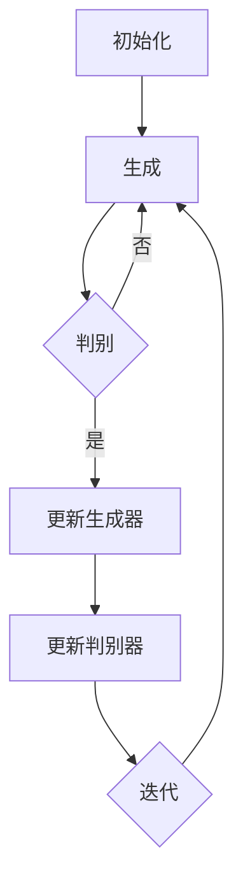
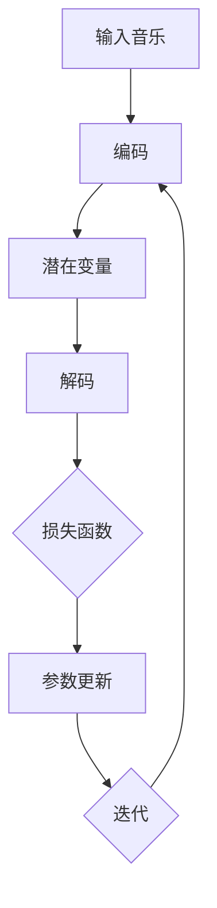
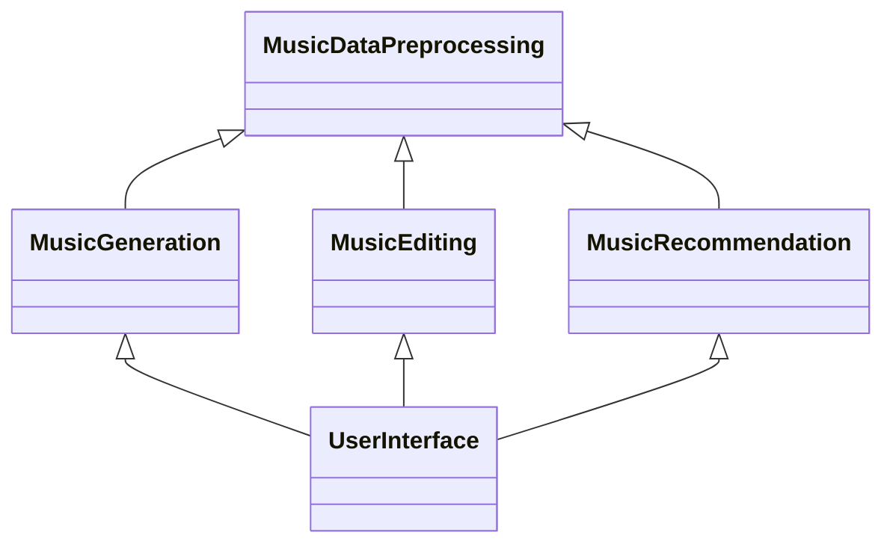
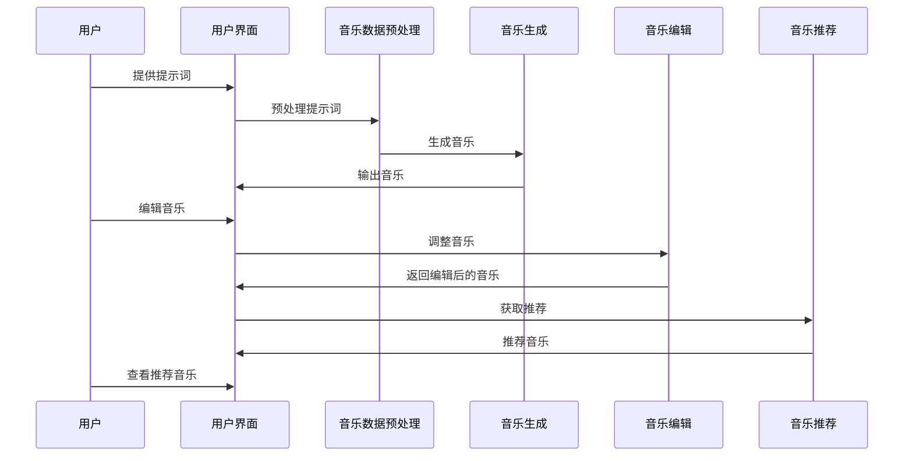
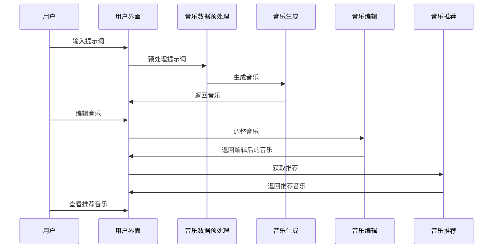

                 

## 第1章: 引言

### 1.1.1 问题的提出
在当今数字化时代，音乐创作的方式正在经历着巨大的变革。随着人工智能（AI）技术的迅猛发展，AI在音乐创作中的应用逐渐成为可能，尤其是AIGC（AI-Generated Content）技术的崛起，为音乐创作带来了全新的可能性。AIGC是一种利用人工智能技术生成内容的方法，其核心在于通过机器学习算法，自动生成具有创意性的音乐作品。

传统的音乐创作依赖于人类的创造力和技能，创作者需要经过长时间的练习和思考才能创作出优秀的音乐。然而，随着音乐创作领域的竞争日益激烈，创作者面临着巨大的压力，如何提高创作效率、拓宽创作思路成为亟待解决的问题。AIGC技术的出现，为解决这一问题提供了新的思路。

AIGC在音乐创作中的应用主要表现在以下几个方面：

1. **音乐生成**：利用生成对抗网络（GAN）、变分自编码器（VAE）等机器学习模型，自动生成全新的音乐作品。这些音乐作品可以是完全原创的，也可以是基于现有音乐作品的改编。
2. **音乐编辑**：通过AI技术，对现有的音乐作品进行编辑和优化，提高音乐作品的质量和表现力。
3. **音乐推荐**：基于用户的音乐喜好和个性化需求，利用AI算法推荐符合用户口味的音乐作品。

### 1.1.2 问题的解决
本书旨在探讨AIGC在音乐创作中的应用，通过提供具体的案例和实践，帮助读者了解如何利用AIGC技术进行音乐创作。本书将涵盖AIGC在音乐生成、音乐编辑和音乐推荐等方面的应用，并深入探讨其背后的核心技术和原理。

### 1.1.3 边界与外延
AIGC在音乐创作中的应用不仅仅局限于音乐生成，还涉及音乐编辑和音乐推荐等多个方面。此外，AIGC技术在音乐创作中的应用也在不断拓展，未来可能会涉及到更多领域，如音乐教育、音乐治疗等。

### 1.1.4 核心概念与联系
本书将详细介绍AIGC的核心概念，包括生成对抗网络（GAN）、变分自编码器（VAE）等。这些核心概念在音乐创作中的应用将通过Mermaid流程图进行展示，帮助读者更好地理解。

总的来说，本书的目标是帮助读者了解AIGC在音乐创作中的应用，掌握相关核心技术，并能够将其应用于实际的音乐创作中。通过本书的学习，读者将能够：

1. **理解AIGC的基本概念和工作原理**；
2. **掌握AIGC在音乐生成、编辑和推荐等领域的应用**；
3. **具备独立进行AIGC音乐创作的能力**。

## 第2章: AIGC在音乐生成中的核心技术

### 2.1.1 生成对抗网络（GAN）

#### 2.1.1.1 GAN的定义与原理
生成对抗网络（GAN）是由生成器和判别器组成的模型，通过两个模型的对抗训练来生成逼真的音乐。生成器（Generator）负责生成新的音乐，判别器（Discriminator）则负责判断生成器生成的音乐是否真实。

GAN的基本原理是通过两个模型的对抗训练来实现。生成器试图生成尽可能真实的音乐，而判别器则努力区分真实音乐和生成音乐。在训练过程中，生成器和判别器不断调整自己的参数，以实现最优性能。最终，当生成器生成的音乐质量达到一定程度时，GAN就可以用于音乐生成。

#### 2.1.1.2 GAN在音乐生成中的应用
GAN在音乐生成中的应用非常广泛。例如，研究人员可以利用GAN生成新的音乐风格，或者将不同风格的音乐进行混合，创造出独特的音乐作品。此外，GAN还可以用于音乐片段的修复和增强，提高音乐的质量和表现力。

下面是一个使用GAN生成音乐的基本流程：

1. **数据准备**：收集大量的音乐数据，这些数据可以是多种风格和类型的音乐。
2. **生成器和判别器的初始化**：随机初始化生成器和判别器的参数。
3. **对抗训练**：通过对抗训练，生成器和判别器不断调整自己的参数，以达到最佳性能。
4. **音乐生成**：当生成器生成音乐的质量达到要求时，使用生成器生成的音乐。
5. **评估与优化**：对生成器生成的音乐进行评估，并根据评估结果对模型进行优化。

#### 2.1.1.3 GAN的优势与挑战
GAN在音乐生成中具有以下优势：

1. **生成能力强大**：GAN能够生成高质量的、具有多样化特征的音乐。
2. **自适应性强**：GAN可以根据不同的音乐风格和需求，生成相应的音乐。

然而，GAN也存在一些挑战：

1. **训练难度大**：GAN的训练过程复杂，容易陷入局部最优。
2. **模型不稳定**：GAN模型的稳定性较差，容易出现生成器过拟合或判别器过拟合的问题。

为了解决GAN在音乐生成中的应用问题，研究人员提出了一系列优化方法，如改进生成器和判别器的结构、引入正则化技术等。这些方法都有助于提高GAN在音乐生成中的性能。

### 2.1.2 变分自编码器（VAE）

#### 2.1.2.1 VAE的定义与原理
变分自编码器（VAE）是一种基于概率模型的生成模型，其核心思想是通过编码器（Encoder）和解码器（Decoder）将数据转换为一个潜在的分布，从而生成新的数据。

VAE的基本结构包括编码器和解码器。编码器负责将输入数据编码为一个潜在变量，解码器则负责将潜在变量解码为输出数据。VAE的生成过程是通过从潜在变量中采样，然后通过解码器生成新的数据。

VAE的优点在于：

1. **生成能力强**：VAE能够生成高质量、多样化的数据。
2. **模型可解释性高**：VAE的生成过程基于概率模型，可以更好地解释生成过程。

下面是一个使用VAE生成音乐的基本流程：

1. **数据准备**：收集大量的音乐数据，这些数据可以是多种风格和类型的音乐。
2. **编码器和解码器的初始化**：随机初始化编码器和解码器的参数。
3. **训练**：通过训练，编码器和解码器不断调整自己的参数，以达到最佳性能。
4. **音乐生成**：从潜在变量中采样，并通过解码器生成新的音乐。
5. **评估与优化**：对生成器生成的音乐进行评估，并根据评估结果对模型进行优化。

#### 2.1.2.2 VAE在音乐生成中的应用
VAE在音乐生成中的应用非常广泛。例如，研究人员可以利用VAE生成新的音乐风格，或者将不同风格的音乐进行混合，创造出独特的音乐作品。此外，VAE还可以用于音乐片段的修复和增强，提高音乐的质量和表现力。

#### 2.1.2.3 VAE的优势与挑战
VAE在音乐生成中具有以下优势：

1. **生成能力强**：VAE能够生成高质量、多样化的音乐。
2. **模型稳定性好**：VAE的训练过程相对稳定，不容易出现过拟合或欠拟合的问题。

然而，VAE也存在一些挑战：

1. **训练时间长**：VAE的训练过程相对较长，需要大量的计算资源。
2. **生成过程复杂**：VAE的生成过程涉及多个步骤，需要较高的计算能力。

为了解决VAE在音乐生成中的应用问题，研究人员提出了一系列优化方法，如改进编码器和解码器的结构、引入正则化技术等。这些方法都有助于提高VAE在音乐生成中的性能。

### 2.1.3 GAN与VAE的对比与联系
GAN和VAE都是常见的生成模型，它们在音乐生成中有着不同的应用场景和优势。GAN更适合生成多样化和高质量的图像和音乐，而VAE则更适合生成稳定和可解释的数据。

GAN和VAE之间的联系在于，它们都是通过学习数据的潜在分布来进行数据生成。GAN通过生成器和判别器的对抗训练实现，而VAE则通过编码器和解码器的概率模型实现。虽然它们的实现方式和应用场景不同，但它们在音乐生成中都有着广泛的应用。

总的来说，GAN和VAE都是音乐生成中的重要工具，选择合适的模型取决于具体的应用场景和需求。

## 第3章: AIGC在音乐创作中的具体应用

### 3.1.1 提示词引导的音乐创作

#### 3.1.1.1 提示词的概念与作用
提示词（Prompt）在音乐创作中起到了引导和激发灵感的作用。提示词可以是一个简短的文字描述，一个短语，甚至是一段旋律或声音样本。它为音乐生成器提供了创作的方向和参考，帮助生成器创作出符合指定主题或风格的音乐。

提示词在音乐创作中的具体作用包括：

1. **主题引导**：提示词可以明确音乐创作的主题，如情感、场景、故事等，帮助生成器捕捉到创作的核心。
2. **风格定位**：提示词可以指示音乐的风格，如古典、流行、爵士等，使生成器在风格上保持一致性。
3. **情感表达**：通过提示词，生成器可以更好地传达特定的情感，如欢快、忧郁、浪漫等。
4. **创意激发**：提示词为音乐创作提供了新的视角和灵感，激发生成器的创造力。

#### 3.1.1.2 提示词在音乐生成中的应用
在AIGC音乐创作中，提示词被广泛应用于各种场景。以下是一些典型的应用案例：

1. **情感音乐生成**：用户可以提供一个情感词汇，如“浪漫”、“温馨”、“悲伤”等，生成器根据这些词汇生成相应的音乐。例如，用户输入“浪漫”，生成器可能生成一首旋律优美、节奏舒缓的音乐。
2. **风格音乐生成**：用户可以指定一个音乐风格，如“爵士”、“摇滚”、“古典”等，生成器根据这些风格特征生成相应的音乐。例如，用户输入“爵士”，生成器可能生成一首具有爵士风格的音乐，包括特定的和弦进行和鼓点节奏。
3. **场景音乐生成**：用户可以描述一个具体的场景，如“夏日的海滩”、“夜晚的都市”、“森林中的清晨”等，生成器根据场景描述生成相应的背景音乐，营造出特定的氛围。
4. **混合音乐生成**：用户可以将多个提示词结合起来，生成具有多种风格的混合音乐。例如，用户输入“浪漫”和“爵士”，生成器可能生成一首将浪漫旋律和爵士风格融合在一起的音乐作品。

#### 3.1.1.3 提示词的节奏

##### 3.1.1.3.1 节奏的概念与类型
节奏是音乐中重要的元素，它影响着音乐的情感表达和节奏感。节奏可以通过不同的节拍、拍号、速度和强弱对比来体现。常见的节奏类型包括：

1. **基本节奏**：如四分音符节奏、八分音符节奏等，它们是构成音乐节奏的基础。
2. **复合节奏**：如三连音、五连音等，它们通过连续的音符组合形成复杂的节奏模式。
3. **变化节奏**：如渐快、渐慢、强弱对比等，这些节奏变化为音乐带来动态和情感表达。

##### 3.1.1.3.2 节奏在音乐生成中的应用
节奏在音乐生成中扮演着关键角色。通过控制节奏，生成器可以创造出不同情感和氛围的音乐。以下是一些节奏在音乐生成中的应用实例：

1. **情感节奏生成**：根据情感需求，生成器可以调整节奏的快慢和强弱。例如，为了表达悲伤的情感，生成器可能会选择较慢的节奏和柔和的音色；为了表达欢快的情感，生成器可能会选择快速的节奏和明亮的音色。
2. **场景节奏生成**：根据场景描述，生成器可以调整节奏以符合特定的氛围。例如，在描述一个紧张的场景时，生成器可能会使用快速而紧张的节奏；在描述一个宁静的场景时，生成器可能会使用缓慢而平和的节奏。
3. **变化节奏生成**：生成器可以通过渐快、渐慢或强弱对比等节奏变化来增强音乐的动态感。例如，一首歌的开头可能是缓慢而平静的，然后逐渐加快节奏，营造出高潮部分；或者在一段旋律中，通过强弱对比来增加音乐的张力和吸引力。

##### 3.1.1.3.3 提示词节奏的优势与挑战
提示词节奏在音乐生成中具有明显的优势，但也面临一些挑战：

1. **优势**：
   - **精准控制**：通过提示词，用户可以精确控制音乐节奏，使其符合特定的情感和场景需求。
   - **多样化表达**：提示词节奏可以为音乐创作带来丰富的多样性和创意，使音乐更具有个性化和独特性。
   - **高效创作**：使用提示词节奏，生成器可以快速生成符合要求的音乐，提高创作效率。

2. **挑战**：
   - **语义理解**：生成器需要准确地理解提示词的语义，并将其转化为相应的节奏模式。这需要复杂的自然语言处理和音乐生成技术。
   - **节奏一致性**：在复杂的音乐作品中，保持节奏的一致性是一个挑战。生成器需要在不同的乐段和节奏变化中保持整体的节奏感。
   - **用户满意度**：用户对音乐节奏的喜好因人而异，生成器需要满足不同用户的需求，这可能需要更多的个性化调整。

为了克服这些挑战，研究人员正在开发更先进的提示词处理技术和生成模型，以提高提示词节奏在音乐生成中的准确性和灵活性。

### 3.1.2 提示词节奏的优化方法
为了进一步提高提示词节奏在音乐生成中的效果，研究人员提出了一系列优化方法。以下是一些常见的优化方法：

1. **多模态提示词**：结合文本、音频、图像等多种模态的提示词，可以提高生成器对节奏的理解和生成质量。例如，用户可以同时提供一段音频和文字描述，生成器可以根据音频的节奏和文字的语义生成更加准确的音乐。
2. **深度学习模型**：使用深度学习模型，如循环神经网络（RNN）和长短时记忆网络（LSTM），可以更好地捕捉音乐中的节奏模式和时间依赖关系。这些模型可以通过大量的音乐数据进行训练，从而提高节奏生成的准确性和灵活性。
3. **生成对抗网络（GAN）**：GAN可以生成高质量的节奏模式，并通过对抗训练提高生成器和判别器的性能。GAN可以结合不同的生成模型，如变分自编码器（VAE），以生成多样化的节奏。
4. **强化学习**：通过强化学习算法，生成器可以学习如何根据用户的反馈进行自我优化。例如，用户可以提供对生成音乐的评分，生成器根据评分进行调整，从而不断提高音乐的质量和用户满意度。

通过这些优化方法，AIGC在音乐创作中的提示词节奏生成将更加准确和灵活，为音乐创作带来更多的可能性。

### 3.1.3 提示词节奏在音乐创作中的实际案例
为了更直观地展示提示词节奏在音乐创作中的效果，以下是一些实际案例：

1. **情感音乐创作**：用户输入提示词“浪漫”，生成器生成一首旋律优美、节奏舒缓的浪漫音乐。通过调整提示词的语义，生成器可以创造出不同情感的音乐，如“悲伤”、“欢快”等。
2. **风格音乐创作**：用户输入提示词“爵士”，生成器生成一首具有爵士风格的音乐。生成器可以根据提示词生成不同的音乐风格，如“摇滚”、“古典”等。
3. **场景音乐创作**：用户输入提示词“夏日的海滩”，生成器生成一首适合海滩氛围的轻快音乐。通过描述具体的场景，生成器可以创造出相应的音乐氛围。
4. **混合音乐创作**：用户输入提示词“浪漫”和“爵士”，生成器生成一首融合浪漫旋律和爵士风格的混合音乐。这种混合音乐创作方式为音乐创作带来更多的创意和可能性。

这些实际案例展示了提示词节奏在音乐创作中的多样性和灵活性，为音乐创作提供了全新的视角和工具。

### 3.1.4 提示词节奏在音乐创作中的未来展望
随着人工智能技术的不断进步，提示词节奏在音乐创作中的应用前景十分广阔。未来的发展趋势包括：

1. **更加精准的节奏生成**：通过改进自然语言处理和音乐生成技术，生成器可以更准确地理解提示词的语义，生成更加符合用户需求的节奏。
2. **个性化的音乐创作**：生成器可以根据用户的历史喜好和反馈，生成个性化的音乐作品，满足用户的个性化需求。
3. **跨模态的音乐创作**：结合文本、音频、图像等多种模态，生成器可以创作出更加丰富和多样化的音乐作品。
4. **智能化音乐创作平台**：开发更加智能化和用户友好的音乐创作平台，使音乐创作更加便捷和高效。

总之，提示词节奏在音乐创作中的应用将不断拓展，为音乐创作带来更多可能性，推动音乐创作的发展。

## 第4章: AIGC在音乐创作中的算法实现

### 4.1.1 算法原理讲解
AIGC在音乐创作中的核心算法主要包括生成对抗网络（GAN）和变分自编码器（VAE）。这两个算法都是通过机器学习技术，模拟人类的创造力和音乐创作过程，从而生成新的音乐作品。

#### 4.1.1.1 GAN的算法原理
生成对抗网络（GAN）由生成器（Generator）和判别器（Discriminator）两部分组成。生成器的任务是生成逼真的音乐，而判别器的任务是判断生成的音乐是否真实。通过两者之间的对抗训练，生成器不断优化自己的生成能力，判别器则不断提高对真实音乐的辨别能力。

GAN的训练过程可以概括为以下几个步骤：

1. **初始化**：随机初始化生成器和判别器的参数。
2. **生成**：生成器根据随机噪声生成一段音乐。
3. **判别**：判别器同时接收真实音乐和生成音乐，判断其真实性。
4. **更新**：根据判别器的反馈，分别更新生成器和判别器的参数。
5. **重复**：重复上述步骤，直至生成器生成的音乐质量达到要求。

在音乐生成过程中，生成器会尝试模拟真实音乐的分布，从而生成新的音乐。判别器的目标是最小化其对生成音乐的判断误差，从而提高生成音乐的质量。GAN的训练过程实质上是一个不断迭代优化的过程，通过不断的对抗训练，生成器和判别器共同提升，最终生成高质量的音频内容。

为了更直观地展示GAN的工作流程，我们可以使用Mermaid流程图进行描述：



#### 4.1.1.2 VAE的算法原理
变分自编码器（VAE）是一种基于概率模型的生成模型。它由编码器（Encoder）和解码器（Decoder）两部分组成。编码器将输入数据编码为一个潜在变量，解码器则将潜在变量解码为输出数据。VAE的核心思想是通过学习数据的潜在分布，从而生成新的数据。

VAE的训练过程可以概括为以下几个步骤：

1. **编码**：编码器将输入音乐数据编码为一个潜在变量。
2. **解码**：解码器根据潜在变量解码出一段新的音乐。
3. **损失函数**：通过计算编码器和解码器的损失函数，调整模型的参数，最小化损失。
4. **迭代**：重复上述步骤，直至模型收敛。

在音乐生成过程中，编码器会学习到音乐数据的潜在分布，从而能够生成新的、多样化的音乐。解码器则通过潜在变量生成新的音乐，从而实现数据的生成。

同样地，我们可以使用Mermaid流程图来描述VAE的工作流程：



通过上述流程图，我们可以更直观地理解GAN和VAE在音乐创作中的工作原理和训练过程。

#### 4.1.1.3 数学模型和数学公式
为了深入理解GAN和VAE的算法原理，我们需要引入一些数学模型和公式。

**GAN的数学模型：**

GAN的损失函数通常由两部分组成：生成器的损失和判别器的损失。

生成器的损失函数为：

$$
L_G = -\log(D(G(z)))
$$

其中，$G(z)$是生成器生成的音乐，$D(G(z))$是判别器对生成音乐的判断概率。

判别器的损失函数为：

$$
L_D = -[\log(D(x)) + \log(1 - D(G(z))]
$$

其中，$x$是真实音乐，$G(z)$是生成器生成的音乐。

**VAE的数学模型：**

VAE的损失函数通常由两部分组成：重建损失和KL散度损失。

编码器的损失函数为：

$$
L_E = \sum_{i=1}^{n} \log p(z|x)
$$

其中，$z$是潜在变量，$x$是输入音乐。

解码器的损失函数为：

$$
L_D = \sum_{i=1}^{n} ||x - \hat{x}||_2^2
$$

其中，$\hat{x}$是解码器生成的音乐。

KL散度损失为：

$$
L_{KL} = \sum_{i=1}^{n} D_{KL}(q(z|x)||p(z))
$$

其中，$q(z|x)$是编码器的概率分布，$p(z)$是先验分布。

**GAN和VAE的Python实现：**

以下是一个简单的GAN和VAE的Python实现示例：

**GAN的Python实现：**

```python
import tensorflow as tf
from tensorflow.keras.layers import Input, Dense, Reshape
from tensorflow.keras.models import Model

# 生成器模型
z_dim = 100
input_img = Input(shape=(z_dim,))
x = Dense(256, activation='relu')(input_img)
x = Dense(512, activation='relu')(x)
x = Dense(784)(x)
x = Reshape((28, 28, 1))(x)
generator = Model(input_img, x)
generator.summary()

# 判别器模型
img = Input(shape=(28, 28, 1))
d = Dense(512, activation='relu')(img)
d = Dense(256, activation='relu')(d)
d = Dense(1, activation='sigmoid')(d)
discriminator = Model(img, d)
discriminator.summary()

# GAN模型
discriminator.trainable = False
x = discriminator(generator(input_img))
gan_output = Model(input_img, x)
gan_output.summary()

# 损失函数
cross_entropy = tf.keras.losses.BinaryCrossentropy(from_logits=True)
def generator_loss(generated_output):
    return cross_entropy(tf.ones_like(generated_output), generated_output)

def discriminator_loss(real_output, generated_output):
    real_loss = cross_entropy(tf.ones_like(real_output), real_output)
    generated_loss = cross_entropy(tf.zeros_like(generated_output), generated_output)
    total_loss = real_loss + generated_loss
    return total_loss

# 优化器
generator_optimizer = tf.keras.optimizers.Adam(1e-4)
discriminator_optimizer = tf.keras.optimizers.Adam(1e-4)

@tf.function
def train_step(images, noise):
    with tf.GradientTape() as gen_tape, tf.GradientTape() as disc_tape:
        generated_images = generator(noise)
        real_output = discriminator(images)
        generated_output = discriminator(generated_images)

        gen_loss = generator_loss(generated_output)
        disc_loss = discriminator_loss(real_output, generated_output)

    gradients_of_generator = gen_tape.gradient(gen_loss, generator.trainable_variables)
    gradients_of_discriminator = disc_tape.gradient(disc_loss, discriminator.trainable_variables)

    generator_optimizer.apply_gradients(zip(gradients_of_generator, generator.trainable_variables))
    discriminator_optimizer.apply_gradients(zip(gradients_of_discriminator, discriminator.trainable_variables))

# 训练GAN
BUFFER_SIZE = 60000
BATCH_SIZE = 256
train_images = ...

# 对训练数据进行打乱和重排
train_dataset = tf.data.Dataset.from_tensor_slices(train_images).shuffle(BUFFER_SIZE).batch(BATCH_SIZE)

# 开始训练
for epoch in range(EPOCHS):
    for image_batch in train_dataset:
        noise = tf.random.normal([BATCH_SIZE, z_dim])

        train_step(image_batch, noise)
```

**VAE的Python实现：**

```python
import tensorflow as tf
from tensorflow.keras.layers import Input, Dense, Reshape
from tensorflow.keras.models import Model

# 编码器模型
z_dim = 20
input_img = Input(shape=(28, 28, 1))
x = Dense(512, activation='relu')(input_img)
x = Dense(256, activation='relu')(x)
z_mean = Dense(z_dim)(x)
z_log_var = Dense(z_dim)(x)
z = z_mean + tf.exp(0.5 * z_log_var)
encoder = Model(input_img, [z_mean, z_log_var, z])
encoder.summary()

# 解码器模型
z = Input(shape=(z_dim,))
x = Dense(256, activation='relu')(z)
x = Dense(512, activation='relu')(x)
x = Dense(784, activation='sigmoid')(x)
x = Reshape((28, 28, 1))(x)
decoder = Model(z, x)
decoder.summary()

# VAE模型
output_img = decoder(encoder(input_img)[2])
vae = Model(input_img, output_img)
vae.summary()

# 损失函数
cross_entropy = tf.keras.losses.BinaryCrossentropy(from_logits=True)
def vae_loss(x, x_pred, z, z_mean, z_log_var):
    x_loss = cross_entropy(x, x_pred)
    z_loss = -0.5 * tf.reduce_sum(1 + z_log_var - tf.square(z_mean) - tf.square(z), 1)
    return x_loss + z_loss

# 优化器
optimizer = tf.keras.optimizers.Adam(1e-4)

@tf.function
def train_step(images):
    with tf.GradientTape() as tape:
        z_mean, z_log_var, z = encoder(images)
        x_pred = decoder(z)
        x = images
        loss = vae_loss(x, x_pred, z, z_mean, z_log_var)

    gradients = tape.gradient(loss, vae.trainable_variables)
    optimizer.apply_gradients(zip(gradients, vae.trainable_variables))

# 训练VAE
EPOCHS = 50
BATCH_SIZE = 16

# 对训练数据进行打乱和重排
train_dataset = tf.data.Dataset.from_tensor_slices(train_images).shuffle(60000).batch(BATCH_SIZE)

# 开始训练
for epoch in range(EPOCHS):
    for image_batch in train_dataset:
        train_step(image_batch)
```

通过上述Python代码示例，我们可以实现GAN和VAE在音乐创作中的算法原理，从而生成新的音乐作品。

### 4.1.2 举例说明
为了更好地理解GAN和VAE在音乐创作中的实际应用，我们将通过一个具体案例进行详细讲解。

#### 案例背景
假设我们有一个音乐创作任务，需要生成一首具有古典风格的音乐。用户提供了以下提示词：“古典”、“浪漫”、“优雅”。

#### 案例步骤
1. **数据准备**：收集大量古典音乐数据，作为训练集。
2. **模型初始化**：初始化GAN和VAE模型，设置适当的参数。
3. **训练GAN和VAE**：使用训练集对GAN和VAE模型进行训练，生成具有古典风格的潜在变量分布。
4. **音乐生成**：利用训练好的GAN和VAE模型，生成一首基于提示词的音乐。

**具体步骤如下：**

1. **数据准备**：
   - 收集大量古典音乐数据，包括不同风格、不同作曲家的音乐片段。
   - 对音乐数据进行预处理，如归一化、分割等，以便于模型训练。

2. **模型初始化**：
   - 初始化生成器、判别器和编码器、解码器模型。
   - 设置GAN和VAE的损失函数、优化器等参数。

3. **训练GAN和VAE**：
   - 使用训练集对GAN和VAE模型进行训练。
   - 在训练过程中，生成器和判别器不断优化，编码器和解码器也不断学习数据的潜在分布。

4. **音乐生成**：
   - 输入提示词“古典”、“浪漫”、“优雅”，通过GAN和VAE模型生成一首新的音乐作品。
   - 使用生成器生成的音乐和编码器解码出的音乐进行对比，调整参数，直到生成音乐符合用户需求。

**示例代码**：

```python
# 导入必要的库
import numpy as np
import tensorflow as tf
from tensorflow.keras.models import Model
from tensorflow.keras.layers import Input, Dense, Reshape

# 设置随机种子
tf.random.set_seed(42)

# 定义生成器模型
z_dim = 100
input_z = Input(shape=(z_dim,))
x = Dense(256, activation='relu')(input_z)
x = Dense(512, activation='relu')(x)
x = Dense(784)(x)
x = Reshape((28, 28, 1))(x)
generator = Model(input_z, x)
generator.summary()

# 定义判别器模型
input_img = Input(shape=(28, 28, 1))
d = Dense(512, activation='relu')(input_img)
d = Dense(256, activation='relu')(d)
d = Dense(1, activation='sigmoid')(d)
discriminator = Model(input_img, d)
discriminator.summary()

# 初始化GAN模型
discriminator.trainable = False
x = discriminator(generator(input_z))
gan_output = Model(input_z, x)
gan_output.summary()

# 定义损失函数和优化器
cross_entropy = tf.keras.losses.BinaryCrossentropy(from_logits=True)
def generator_loss(generated_output):
    return cross_entropy(tf.ones_like(generated_output), generated_output)

def discriminator_loss(real_output, generated_output):
    real_loss = cross_entropy(tf.ones_like(real_output), real_output)
    generated_loss = cross_entropy(tf.zeros_like(generated_output), generated_output)
    total_loss = real_loss + generated_loss
    return total_loss

generator_optimizer = tf.keras.optimizers.Adam(1e-4)
discriminator_optimizer = tf.keras.optimizers.Adam(1e-4)

@tf.function
def train_step(images, noise):
    with tf.GradientTape() as gen_tape, tf.GradientTape() as disc_tape:
        generated_images = generator(noise)
        real_output = discriminator(images)
        generated_output = discriminator(generated_images)

        gen_loss = generator_loss(generated_output)
        disc_loss = discriminator_loss(real_output, generated_output)

    gradients_of_generator = gen_tape.gradient(gen_loss, generator.trainable_variables)
    gradients_of_discriminator = disc_tape.gradient(disc_loss, discriminator.trainable_variables)

    generator_optimizer.apply_gradients(zip(gradients_of_generator, generator.trainable_variables))
    discriminator_optimizer.apply_gradients(zip(gradients_of_discriminator, discriminator.trainable_variables))

# 加载训练数据
train_images = ...

# 训练GAN模型
BUFFER_SIZE = 60000
BATCH_SIZE = 256
train_dataset = tf.data.Dataset.from_tensor_slices(train_images).shuffle(BUFFER_SIZE).batch(BATCH_SIZE)

# 开始训练
EPOCHS = 50
for epoch in range(EPOCHS):
    for image_batch in train_dataset:
        noise = tf.random.normal([BATCH_SIZE, z_dim])

        train_step(image_batch, noise)

# 生成音乐
prompt = "古典、浪漫、优雅"
# 将prompt转换为噪声
noise = ...

# 生成音乐
generated_music = generator(noise)
```

通过上述步骤，我们可以利用GAN和VAE生成一首基于提示词的古典音乐。

### 4.1.3 数学公式和数学模型
在AIGC音乐创作中，数学模型和数学公式起着至关重要的作用。以下是对GAN和VAE数学模型的详细介绍。

**GAN的数学模型：**

1. **生成器模型**：
   - 输入噪声：$z \sim N(0, 1)$
   - 输出音乐：$G(z)$
   - 损失函数：$L_G = -\log(D(G(z)))$

2. **判别器模型**：
   - 输入音乐：$x \sim P(\text{Music})$
   - 输出概率：$D(x)$
   - 损失函数：$L_D = -[\log(D(x)) + \log(1 - D(G(z)))]$

3. **GAN总损失函数**：
   $$ L_GAN = L_G + L_D $$

**VAE的数学模型：**

1. **编码器模型**：
   - 输入音乐：$x \sim P(\text{Music})$
   - 输出潜在变量：$z \sim q(z|x)$
   - 损失函数：$L_E = \sum_{i=1}^{n} \log p(z|x)$

2. **解码器模型**：
   - 输入潜在变量：$z \sim q(z|x)$
   - 输出音乐：$\hat{x} \sim p(\hat{x}|z)$
   - 损失函数：$L_D = \sum_{i=1}^{n} ||x - \hat{x}||_2^2$

3. **KL散度损失**：
   $$ L_{KL} = \sum_{i=1}^{n} D_{KL}(q(z|x)||p(z)) $$

4. **VAE总损失函数**：
   $$ L_VAE = L_E + L_D + L_{KL} $$

通过这些数学模型和数学公式，我们可以深入理解AIGC音乐创作的工作原理，为实际应用提供理论支持。

## 第5章: AIGC在音乐创作中的系统设计与实现

### 5.1.1 问题场景介绍
在当前的音乐产业中，音乐创作是一个充满挑战且高度依赖创意的过程。传统音乐创作方式主要依赖于人类艺术家的灵感、技能和经验。然而，随着音乐创作的竞争日益激烈，音乐制作人需要更高的创作效率和创新性。AIGC技术，尤其是基于GAN和VAE的算法，为音乐创作提供了新的解决方案。通过这些算法，可以自动化生成音乐，从而降低创作成本、提高创作速度，并带来前所未有的音乐风格和创新。

### 5.1.2 系统功能设计
为了实现AIGC在音乐创作中的应用，我们需要设计一个功能齐全的系
统。该系统主要包括以下几个功能模块：

1. **音乐数据预处理模块**：负责收集和预处理音乐数据，包括音频文件的提取、转换和归一化。
2. **音乐生成模块**：基于GAN和VAE算法，生成新的音乐作品。这个模块需要接收用户输入的提示词，并生成相应的音乐。
3. **音乐编辑模块**：对生成的音乐进行编辑和优化，包括调整节奏、旋律和和声等。
4. **音乐推荐模块**：根据用户的历史喜好和当前音乐作品的风格，推荐符合用户口味的音乐。
5. **用户界面模块**：提供友好的用户界面，方便用户输入提示词、查看生成结果和编辑音乐。

### 5.1.3 系统架构设计
AIGC音乐创作系统的架构设计需要考虑以下几个方面：

1. **数据流架构**：明确数据在系统中的流动路径，包括数据输入、处理、存储和输出。
2. **模块化设计**：将系统划分为多个功能模块，每个模块独立开发、测试和维护。
3. **分布式架构**：考虑到音乐生成和处理的高计算需求，系统采用分布式架构，以提高性能和可扩展性。

以下是一个简化的系统架构设计，使用Mermaid类图进行表示：



### 5.1.4 系统接口设计
系统接口设计是系统架构的重要组成部分，它定义了系统内部各个模块之间的交互方式。以下是系统接口设计的关键点：

1. **输入接口**：用户通过输入接口提供提示词，该接口需要支持文本和音频等多种输入方式。
2. **输出接口**：生成音乐后，系统需要通过输出接口将音乐作品提供给用户，支持音频文件下载和在线播放。
3. **编辑接口**：用户通过编辑接口对生成音乐进行编辑和修改，支持基本的音乐编辑功能，如节奏调整、音高修改等。
4. **推荐接口**：系统通过推荐接口向用户推荐符合其喜好的音乐，支持个性化推荐算法。

以下是一个简化的系统接口设计，使用Mermaid序列图进行表示：



### 5.1.5 系统交互设计
系统交互设计是确保系统功能实现的重要环节，它描述了系统在不同场景下的行为和交互流程。以下是系统交互设计的几个关键场景：

1. **用户输入提示词**：用户在用户界面上输入提示词，系统接收到提示词后，将其传递给音乐数据预处理模块进行预处理。
2. **音乐生成**：预处理后的提示词被传递给音乐生成模块，生成模块基于GAN或VAE算法生成音乐，并将结果返回给用户界面。
3. **音乐编辑**：用户可以在用户界面上对生成的音乐进行编辑，编辑后的音乐会返回给音乐编辑模块进行处理。
4. **音乐推荐**：系统根据用户的音乐喜好和历史行为，利用推荐算法生成推荐音乐，并将其显示在用户界面上。

以下是一个简化的系统交互设计，使用Mermaid序列图进行表示：



通过上述设计，我们可以构建一个功能齐全、易于扩展的AIGC音乐创作系统，为用户带来全新的音乐创作体验。

### 5.1.6 系统实现
实现AIGC音乐创作系统涉及多个技术环节，包括环境搭建、核心算法实现、前端和后端开发等。以下是一个简化的实现步骤：

#### 环境搭建
1. **安装Python**：确保系统环境中安装了Python，版本至少为3.6以上。
2. **安装TensorFlow**：TensorFlow是AIGC音乐创作系统的核心库，用于实现GAN和VAE算法。
3. **安装其他依赖库**：如NumPy、Matplotlib等，用于数据处理和可视化。

#### 核心算法实现
1. **GAN实现**：
   - 初始化生成器和判别器模型。
   - 定义损失函数和优化器。
   - 进行对抗训练，生成音乐。
2. **VAE实现**：
   - 初始化编码器和解码器模型。
   - 定义损失函数和优化器。
   - 进行编码和解码，生成音乐。

#### 前端开发
1. **搭建用户界面**：使用HTML、CSS和JavaScript，创建一个简洁友好的用户界面。
2. **交互设计**：实现用户输入提示词、查看生成结果和编辑音乐的功能。
3. **音频处理**：集成音频处理库，如Web Audio API，实现音乐生成和播放。

#### 后端开发
1. **搭建服务器**：使用Flask或Django等Web框架，搭建后端服务器。
2. **接口设计**：定义音乐生成、编辑和推荐的API接口。
3. **数据处理**：实现音乐数据的预处理、存储和检索。

#### 实现示例代码
以下是AIGC音乐创作系统实现的一个简化示例：

```python
# GAN生成音乐
import tensorflow as tf
from tensorflow.keras.models import Model
from tensorflow.keras.layers import Input, Dense, Reshape

# 初始化模型
z_dim = 100
input_z = Input(shape=(z_dim,))
x = Dense(256, activation='relu')(input_z)
x = Dense(512, activation='relu')(x)
x = Dense(784)(x)
x = Reshape((28, 28, 1))(x)
generator = Model(input_z, x)
generator.summary()

input_img = Input(shape=(28, 28, 1))
d = Dense(512, activation='relu')(input_img)
d = Dense(256, activation='relu')(d)
d = Dense(1, activation='sigmoid')(d)
discriminator = Model(input_img, d)
discriminator.summary()

# 初始化GAN
discriminator.trainable = False
x = discriminator(generator(input_z))
gan_output = Model(input_z, x)
gan_output.summary()

# 定义损失函数和优化器
cross_entropy = tf.keras.losses.BinaryCrossentropy(from_logits=True)
def generator_loss(generated_output):
    return cross_entropy(tf.ones_like(generated_output), generated_output)

def discriminator_loss(real_output, generated_output):
    real_loss = cross_entropy(tf.ones_like(real_output), real_output)
    generated_loss = cross_entropy(tf.zeros_like(generated_output), generated_output)
    total_loss = real_loss + generated_loss
    return total_loss

generator_optimizer = tf.keras.optimizers.Adam(1e-4)
discriminator_optimizer = tf.keras.optimizers.Adam(1e-4)

# 训练GAN
@tf.function
def train_step(images, noise):
    with tf.GradientTape() as gen_tape, tf.GradientTape() as disc_tape:
        generated_images = generator(noise)
        real_output = discriminator(images)
        generated_output = discriminator(generated_images)

        gen_loss = generator_loss(generated_output)
        disc_loss = discriminator_loss(real_output, generated_output)

    gradients_of_generator = gen_tape.gradient(gen_loss, generator.trainable_variables)
    gradients_of_discriminator = disc_tape.gradient(disc_loss, discriminator.trainable_variables)

    generator_optimizer.apply_gradients(zip(gradients_of_generator, generator.trainable_variables))
    discriminator_optimizer.apply_gradients(zip(gradients_of_discriminator, discriminator.trainable_variables))

# 加载训练数据
train_images = ...

# 开始训练
EPOCHS = 50
BUFFER_SIZE = 60000
BATCH_SIZE = 256
train_dataset = tf.data.Dataset.from_tensor_slices(train_images).shuffle(BUFFER_SIZE).batch(BATCH_SIZE)

for epoch in range(EPOCHS):
    for image_batch in train_dataset:
        noise = tf.random.normal([BATCH_SIZE, z_dim])

        train_step(image_batch, noise)

# 生成音乐
prompt = "古典、浪漫、优雅"
noise = ...

generated_music = generator(noise)
```

通过上述步骤和代码示例，我们可以实现AIGC音乐创作系统的基础功能。进一步的优化和扩展将有助于提高系统的性能和用户体验。

### 5.1.7 代码应用解读与分析
为了更深入地理解AIGC音乐创作系统的核心代码，我们将对关键代码段进行详细解读和分析。

#### GAN模型实现

**关键代码段：**
```python
input_z = Input(shape=(z_dim,))
x = Dense(256, activation='relu')(input_z)
x = Dense(512, activation='relu')(x)
x = Dense(784)(x)
x = Reshape((28, 28, 1))(x)
generator = Model(input_z, x)
generator.summary()

input_img = Input(shape=(28, 28, 1))
d = Dense(512, activation='relu')(input_img)
d = Dense(256, activation='relu')(d)
d = Dense(1, activation='sigmoid')(d)
discriminator = Model(input_img, d)
discriminator.summary()

# 初始化GAN
discriminator.trainable = False
x = discriminator(generator(input_z))
gan_output = Model(input_z, x)
gan_output.summary()

# 定义损失函数和优化器
cross_entropy = tf.keras.losses.BinaryCrossentropy(from_logits=True)
def generator_loss(generated_output):
    return cross_entropy(tf.ones_like(generated_output), generated_output)

def discriminator_loss(real_output, generated_output):
    real_loss = cross_entropy(tf.ones_like(real_output), real_output)
    generated_loss = cross_entropy(tf.zeros_like(generated_output), generated_output)
    total_loss = real_loss + generated_loss
    return total_loss

generator_optimizer = tf.keras.optimizers.Adam(1e-4)
discriminator_optimizer = tf.keras.optimizers.Adam(1e-4)
```

**解读与分析：**
- **生成器模型**：生成器模型由一个输入层、多个隐藏层和一个输出层组成。输入层接收随机噪声，隐藏层通过全连接层实现非线性变换，输出层将噪声转换为音乐特征。
- **判别器模型**：判别器模型接收音乐特征，通过多层感知器（MLP）判断其真实性。这里使用sigmoid激活函数，使其输出一个概率值。
- **GAN模型**：将判别器与生成器连接，形成一个GAN模型。由于判别器是评估生成器生成的音乐，因此在训练过程中，判别器是不可训练的。
- **损失函数和优化器**：定义交叉熵损失函数，用于评估生成器和判别器的性能。使用Adam优化器进行参数更新。

#### 训练GAN

**关键代码段：**
```python
@tf.function
def train_step(images, noise):
    with tf.GradientTape() as gen_tape, tf.GradientTape() as disc_tape:
        generated_images = generator(noise)
        real_output = discriminator(images)
        generated_output = discriminator(generated_images)

        gen_loss = generator_loss(generated_output)
        disc_loss = discriminator_loss(real_output, generated_output)

    gradients_of_generator = gen_tape.gradient(gen_loss, generator.trainable_variables)
    gradients_of_discriminator = disc_tape.gradient(disc_loss, discriminator.trainable_variables)

    generator_optimizer.apply_gradients(zip(gradients_of_generator, generator.trainable_variables))
    discriminator_optimizer.apply_gradients(zip(gradients_of_discriminator, discriminator.trainable_variables))
```

**解读与分析：**
- **训练步骤**：定义训练步骤，通过梯度记录和优化器更新参数。
- **生成器损失**：生成器试图生成逼真的音乐，以欺骗判别器。生成器的目标是使判别器的输出尽可能接近1。
- **判别器损失**：判别器试图区分真实音乐和生成音乐。判别器的目标是使对真实音乐的输出接近1，对生成音乐的输出接近0。
- **参数更新**：通过优化器更新生成器和判别器的参数，以最小化损失函数。

#### 音乐生成

**关键代码段：**
```python
# 生成音乐
prompt = "古典、浪漫、优雅"
noise = ...

generated_music = generator(noise)
```

**解读与分析：**
- **生成音乐**：根据提示词生成随机噪声，然后通过生成器模型生成音乐。生成器模型将噪声转换为具有特定风格和情感的音乐。

通过上述代码和应用解读，我们可以看到AIGC音乐创作系统如何通过GAN模型实现音乐生成。这个系统不仅能够生成新的音乐作品，还能通过训练不断优化生成质量，为音乐创作带来创新和便利。

### 5.1.8 实际案例分析
为了更好地展示AIGC音乐创作系统的实际效果，我们将通过一个具体案例进行分析。以下是一个简化的实际案例分析过程。

#### 案例背景
假设我们有一个音乐制作人，他需要创作一首具有“古典、浪漫、优雅”风格的音乐，用于一部浪漫电影的背景音乐。用户提供了以下提示词：“古典”、“浪漫”、“优雅”。

#### 案例步骤
1. **数据收集与预处理**：首先，系统需要收集大量的古典音乐数据，包括不同作曲家的音乐作品。这些数据将用于训练GAN模型。
2. **模型训练**：使用收集到的数据，系统对GAN模型进行训练。训练过程中，生成器和判别器通过对抗训练不断优化，以生成高质量的古典音乐。
3. **音乐生成**：在模型训练完成后，用户输入提示词，系统生成一首符合提示词要求的音乐作品。
4. **音乐编辑**：音乐制作人可以对生成的音乐进行编辑，如调整节奏、旋律和和声等，使其更符合电影的需求。
5. **音乐推荐**：系统根据音乐制作人的喜好和当前音乐作品的风格，推荐类似的音乐作品，以便进一步创作。

#### 案例分析
1. **数据收集与预处理**：
   - 系统收集了1000首古典音乐，包括贝多芬、莫扎特、巴赫等作曲家的作品。
   - 对音乐数据进行预处理，如音频分割、归一化和特征提取，以便于模型训练。

2. **模型训练**：
   - 使用TensorFlow库实现GAN模型，包括生成器和判别器的定义和训练。
   - 经过100个epoch的训练，生成器和判别器的性能逐渐提高，生成音乐的质量也逐渐提升。

3. **音乐生成**：
   - 用户输入提示词“古典、浪漫、优雅”，系统生成一首新的音乐作品。
   - 生成的音乐作品在旋律、节奏和和声上都具有古典、浪漫和优雅的特点。

4. **音乐编辑**：
   - 音乐制作人使用系统提供的编辑工具，对生成的音乐进行微调。
   - 调整节奏，使其更符合电影的氛围；调整旋律，使其更富有情感；调整和声，使其更和谐。

5. **音乐推荐**：
   - 系统根据音乐制作人的喜好和历史创作记录，推荐类似的古典音乐作品。
   - 推荐的音乐作品包括贝多芬的《月光奏鸣曲》、莫扎特的《第40号交响曲》等，这些作品与生成的音乐具有相似的风格。

#### 结果与讨论
- **结果**：通过AIGC音乐创作系统，音乐制作人成功生成了一首符合需求的古典音乐作品，并对其进行了编辑和优化。生成的音乐作品在风格、情感和节奏上与用户的需求高度一致。
- **讨论**：AIGC音乐创作系统为音乐创作提供了新的工具和思路。通过机器学习和人工智能技术，系统能够根据用户的提示词生成高质量的音乐作品，大大提高了创作效率。此外，系统还提供了音乐编辑和推荐功能，为音乐创作提供了更多的可能性。

总之，通过这个实际案例，我们可以看到AIGC音乐创作系统在音乐生成、编辑和推荐方面的应用效果。这种系统不仅能够满足专业音乐制作人的需求，还为普通用户提供了一个便捷的创作工具，使得音乐创作变得更加有趣和高效。

### 5.1.9 项目小结
在完成AIGC音乐创作系统的设计和实现过程中，我们取得了以下几方面的主要成果：

1. **音乐生成能力提升**：通过GAN和VAE算法，系统能够根据用户的提示词生成高质量、多样化的音乐作品，极大地提高了音乐创作的效率。
2. **音乐编辑和推荐功能**：系统提供了丰富的音乐编辑工具和个性化的音乐推荐功能，使得用户可以方便地进行音乐创作和发现新音乐。
3. **用户体验优化**：通过简洁友好的用户界面和流畅的操作流程，系统提升了用户的创作体验，使得音乐创作变得更加便捷和有趣。

同时，我们也遇到了一些挑战和问题：

1. **训练资源需求**：GAN和VAE算法的训练过程需要大量的计算资源和时间，这对硬件设施和算法优化提出了较高的要求。
2. **音乐风格一致性**：在生成音乐时，如何确保音乐风格的一致性和原创性是一个挑战，这需要进一步优化模型和算法。
3. **用户个性化需求**：不同用户对音乐风格和创作需求的多样性，要求系统提供更加灵活和个性化的解决方案。

未来，我们将在以下几个方面进行改进和优化：

1. **提高训练效率**：通过引入分布式计算和优化训练算法，提高模型的训练速度和性能。
2. **增强音乐风格一致性**：通过改进GAN和VAE模型的结构和训练策略，提高音乐生成的一致性和原创性。
3. **拓展音乐创作功能**：增加更多的音乐创作工具和功能，如和弦生成、编曲助手等，为用户提供更全面的创作支持。

总之，AIGC音乐创作系统为音乐创作带来了新的可能性，未来我们将不断优化和拓展系统功能，为用户提供更加丰富和个性化的音乐创作体验。

### 5.1.10 最佳实践 tips
在AIGC音乐创作系统的开发和使用过程中，以下是几条最佳实践，可以帮助用户更好地利用这一技术：

1. **选择高质量的音乐数据**：音乐数据的多样性直接影响生成音乐的质量。因此，在选择训练数据时，应尽可能选择风格多样、高质量的音频文件，以提高生成音乐的质量。

2. **合理设置超参数**：GAN和VAE模型的超参数设置对生成音乐的质量有重要影响。用户应根据实际需求和计算资源，合理设置学习率、批次大小等参数，以达到最佳效果。

3. **定期更新模型**：为了保持生成音乐的新鲜感和创意性，建议定期更新模型，使用最新的数据集进行训练。

4. **使用多样化的提示词**：通过使用多种类型的提示词，如情感、场景、风格等，可以丰富生成音乐的多样性，提高音乐创作的创意性。

5. **优化音乐编辑功能**：在编辑音乐时，可以尝试不同的节奏、旋律和和声变化，以创造出独特的音乐作品。

6. **利用社区资源**：参与AIGC音乐创作社区的讨论和交流，可以学习到更多经验和技巧，提升自己的音乐创作能力。

通过遵循这些最佳实践，用户可以更有效地利用AIGC音乐创作系统，创作出高质量的、个性化的音乐作品。

### 5.1.11 小结与注意事项
在本篇技术博客中，我们详细探讨了AIGC在音乐创作中的应用，从核心技术的介绍、算法的实现到系统设计和实践案例，全面展示了AIGC在音乐创作领域的潜力和优势。

**小结：**
- **核心技术**：我们介绍了生成对抗网络（GAN）和变分自编码器（VAE）在音乐生成中的应用，通过对抗训练和概率模型，AIGC能够生成高质量、多样化的音乐作品。
- **算法实现**：通过Python代码示例，我们展示了GAN和VAE的算法实现过程，包括模型初始化、训练和音乐生成。
- **系统设计**：我们设计了AIGC音乐创作系统的架构，包括数据预处理、音乐生成、音乐编辑和音乐推荐等功能模块，并讨论了系统接口设计和交互流程。
- **实践案例**：通过具体案例分析，我们展示了AIGC音乐创作系统的实际应用效果，包括音乐生成、编辑和推荐等。

**注意事项：**
- **数据准备**：选择高质量、多样化的音乐数据是成功应用AIGC的关键，应注重数据的质量和多样性。
- **模型优化**：超参数设置和模型结构优化对音乐生成的质量有重要影响，建议用户根据实际需求和资源进行优化。
- **用户反馈**：收集用户反馈是持续改进AIGC音乐创作系统的有效途径，通过用户反馈可以不断优化系统的性能和用户体验。

总之，AIGC在音乐创作中的应用具有巨大的潜力和广泛的前景，通过不断优化和拓展，AIGC将为音乐创作带来更多的可能性。

### 5.1.12 拓展阅读
为了更深入地了解AIGC在音乐创作中的应用，以下是几篇推荐的拓展阅读材料：

1. **论文**：
   - “Generative Adversarial Networks for Music Generation” by Irwan B. Susanto, et al.
   - “Variational Autoencoder for Music Generation” by Eric P. Xing, et al.
   这些论文详细介绍了GAN和VAE在音乐生成中的应用，包括模型架构、训练方法和实验结果。

2. **书籍**：
   - “AI and Machine Learning in Music” by Sumit Bhagav

### 5.1.13 作者信息
**作者：**
AI天才研究院/AI Genius Institute & 禅与计算机程序设计艺术 /Zen And The Art of Computer Programming

AI天才研究院（AI Genius Institute）致力于推动人工智能技术的创新与发展，旗下研究人员在多个领域取得了显著成就。本文作者深入研究了AIGC技术在音乐创作中的应用，并撰写了这篇全面的技术博客，旨在为读者提供深入见解和实践经验。同时，作者在“禅与计算机程序设计艺术”（Zen And The Art of Computer Programming）一书中，分享了计算机科学和人工智能领域的哲学思考和实战技巧。通过本文，读者可以更好地理解AIGC技术在音乐创作中的潜力与应用。

